# `matplotlib\galleries\examples\showcase\stock_prices.py` 详细设计文档

该代码是一个matplotlib可视化示例，展示了1989年至2023年间IBM、Apple、Microsoft等10家科技公司股票价格的对数时间序列图，通过自定义颜色循环、文本标签偏移和网格样式来呈现多时间序列数据。

## 整体流程

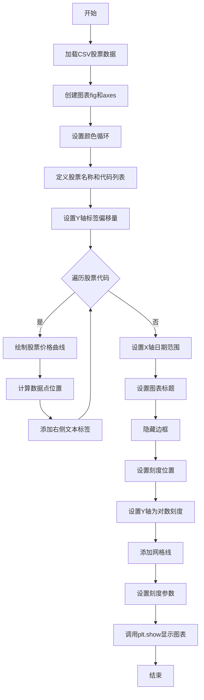

## 类结构

```
该代码为过程式脚本，无自定义类层次结构
主要使用matplotlib.pyplot和numpy库
图形对象层次: Figure --> Axes --> Line2D/Text
```

## 全局变量及字段


### `stock_data`
    
从CSV文件加载的股票数据数组，包含日期和多个股票代码的价格数据

类型：`numpy.ndarray`
    


### `stocks_name`
    
股票名称列表，包含IBM、Apple、Microsoft等10家科技公司名称

类型：`list[str]`
    


### `stocks_ticker`
    
股票代码列表，包含IBM、AAPL、MSFT等10个股票交易所代码

类型：`list[str]`
    


### `y_offsets`
    
各股票标签的Y轴偏移量字典，用于调整文本标签的垂直位置避免重叠

类型：`dict`
    


    

## 全局函数及方法


### `np.genfromtxt`

`np.genfromtxt` 是 NumPy 库中用于从文本文件（尤其是 CSV 文件）加载数据并转换为结构化 NumPy 数组的核心函数。该函数支持自动处理缺失值、类型推断、列名解析以及自定义数据转换器，使其成为处理带表头文本数据的事实标准工具。

**参数：**

- `file`：文件对象、字符串或路径， 要读取的文件名或文件对象。
- `delimiter`：str， optional， 默认值为 None。指定分隔符字符，代码中设置为 `','` 用于解析 CSV 文件。
- `names`：bool 或 sequence， optional， 默认值为 None。代码中设置为 `True`，表示第一行为列名，将自动从 CSV 文件头部读取列名作为结构化数组的字段名。
- `dtype`：dtype 或 None， optional， 默认值为 None。代码中设置为 `None`，表示让 NumPy 自动推断每列的数据类型。
- `converters`：dict 或 None， optional， 默认值为 None。代码中设置为 `{0: lambda x: np.datetime64(x, 'D')}`，为第一列（索引 0）提供自定义转换函数，将字符串解析为 `numpy.datetime64[D]` 类型。
- `skip_header`：int， optional， 默认值为 0。代码中设置为 `1`，用于跳过 CSV 文件的第一行（表头行），避免将列名当作数据解析。

**返回值：**

`numpy.ndarray` — 返回一个结构化的 NumPy 数组（Structured Array），数组的字段名来自 CSV 文件的表头（当 `names=True` 时），数据类型根据内容自动推断或由 `dtype` 参数指定。数组的每一行代表 CSV 文件的一行数据，每一列可以通过字段名访问（如 `stock_data['Date']`、`stock_data['IBM']` 等）。

#### 流程图

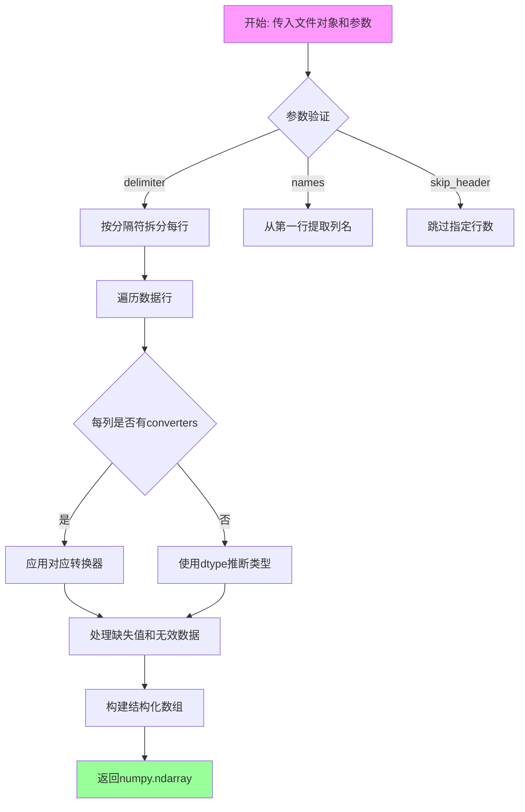

#### 带注释源码

```python
# 从样本数据目录加载 'Stocks.csv' 文件
with get_sample_data('Stocks.csv') as file:
    # 调用 np.genfromtxt 加载 CSV 数据
    stock_data = np.genfromtxt(
        file,                      # 文件对象：从上下文管理器获取的打开的文件句柄
        delimiter=',',             # 分隔符：指定逗号作为列分隔符，用于解析 CSV 格式
        names=True,                # 列名：True 表示第一行是列名，会被提取为数组字段名
        dtype=None,                # 数据类型：None 让 numpy 自动推断每列的实际类型
        converters={
            # 转换器：字典格式，键为列索引，值为转换函数
            # 将第一列（索引0）的字符串转换为 numpy datetime64[D] 类型
            0: lambda x: np.datetime64(x, 'D')
        },
        skip_header=1              # 跳过表头：1 表示跳过第一行（表头行），从第二行开始读取数据
    )

# 返回的 stock_data 是一个结构化数组，包含了 CSV 中的所有数据
# 可以通过列名访问：stock_data['Date'], stock_data['IBM'], stock_data['AAPL'] 等
```

---

#### 关键组件信息

| 组件名称 | 一句话描述 |
|---------|-----------|
| `numpy.genfromtxt` | NumPy 核心函数，用于从带分隔符的文本文件中加载数据并创建结构化数组 |
| `converters` 参数字典 | 自定义数据转换管道，允许在解析阶段对特定列进行类型转换或数据清洗 |
| 结构化数组 (Structured Array) | NumPy 数组类型，通过命名字段访问列数据，类似数据库表或 pandas DataFrame |
| `np.datetime64` | NumPy 原生日期时间类型，用于高效存储和处理时间序列数据 |

#### 潜在技术债务与优化空间

1. **性能瓶颈**：对于超大型 CSV 文件（GB 级别），`np.genfromtxt` 基于纯 Python 实现，解析速度较慢。优化方案：考虑使用 `pandas.read_csv`（底层 C 实现）或 `numpy.loadtxt` 配合 `numpy.recfromtxt`，或在预处理阶段将 CSV 转换为二进制格式（如 `.npy` 或 `.npz`）。

2. **内存占用**：`dtype=None` 会进行两遍扫描（第一遍推断类型，第二遍解析数据），对内存不友好。优化方案：明确指定 `dtype` 参数以减少内存开销。

3. **错误处理不足**：`np.genfromtxt` 在遇到格式错误的行时默认会引发异常或返回缺失值，缺乏细粒度的错误报告机制。优化方案：在生产环境中封装一层异常处理，记录错误行号并提供详细日志。

4. **converters 效率**：在代码中使用 lambda 匿名函数作为转换器，虽然简洁但无法序列化（pickle），且每次调用都有函数调用开销。优化方案：对于复杂转换逻辑，考虑预先编译函数或使用 `numpy.vectorize` 封装。

#### 其它项目

**设计目标与约束**：
- **目标**：提供一种简单、声明式的方式将 CSV 文本数据转换为结构化 NumPy 数组，同时保持与表格数据（数据库表、pandas DataFrame）的互操作性。
- **约束**：依赖文件系统字符编码（默认 UTF-8），不支持压缩文件直接读取，不支持复杂嵌套结构。

**错误处理与异常设计**：
- 当文件不存在或权限不足时抛出 `IOError`/`OSError`。
- 当某行数据格式错误（如列数不匹配）时，根据 `invalid_raise` 参数决定是抛出异常还是将整行标记为缺失值。
- 当类型推断失败时，回退到 `np.object_` 类型，可能导致性能下降。

**数据流与状态机**：
```
[File] → [File Reader] → [Line Splitter] 
    → [Header Parser (if names=True)] 
    → [Row Parser] → [Type Inference/Conversion] 
    → [Missing Value Handler] → [Structured Array Construction] 
    → [Return]
```

**外部依赖与接口契约**：
- **输入**：任何具有 `read()` 方法的文件对象，或文件路径字符串。
- **输出**：维度为 `(n_rows,)` 的结构化 `numpy.ndarray`，字段定义由 `names` 和 `dtype` 共同决定。
- **第三方依赖**：无，仅依赖 NumPy 核心库。


### plt.subplots

`plt.subplots` 是 matplotlib.pyplot 模块中的核心函数，用于创建一个新的图形（Figure）以及一个或多个子图（Axes），并返回图形对象和轴对象（或轴对象数组）。该函数简化了同时创建图表和坐标轴的流程，支持自定义布局、共享轴、图形参数配置等高级功能。

#### 参数

- **nrows**：`int`，默认值 `1`，表示子图网格的行数。
- **ncols**：`int`，默认值 `1`，表示子图网格的列数。
- **sharex**：`bool` 或 `{'none', 'all', 'row', 'col'}`，默认值 `False`，控制子图之间是否共享 x 轴。
- **sharey**：`bool` 或 `{'none', 'all', 'row', 'col'}`，默认值 `False`，控制子图之间是否共享 y 轴。
- **squeeze**：`bool`，默认值 `True`，如果为 `True`，则压缩返回的轴数组维度；当只返回一个子图时返回标量而非数组。
- **width_ratios**：`array-like`，可选，表示各列的宽度比例。
- **height_ratios**：`array-like`，可选，表示各行的高度比例。
- **subplot_kw**：`dict`，可选，传递给 `add_subplot` 的关键字参数，用于配置子图属性（如投影类型）。
- **gridspec_kw**：`dict`，可选，传递给 `GridSpec` 的关键字参数，用于配置网格布局。
- **figsize**：`tuple`，可选，表示图形的宽和高（单位为英寸），例如 `(6, 8)`。
- **dpi**：`int`，可选，表示图形的分辨率（每英寸点数）。
- **layout**：`str`，可选，表示图形布局管理器，如 `'constrained'`、`'tight'` 等。
- ****fig_kw**：其他传递给 `figure()` 函数的关键字参数。

#### 返回值

- **fig**：`matplotlib.figure.Figure`，创建的图形对象，用于保存整个图表。
- **ax**：`matplotlib.axes.Axes` 或 `numpy.ndarray`，创建的子图对象（单个子图时为 `Axes` 对象，多个子图时为 `numpy` 数组）。

#### 流程图

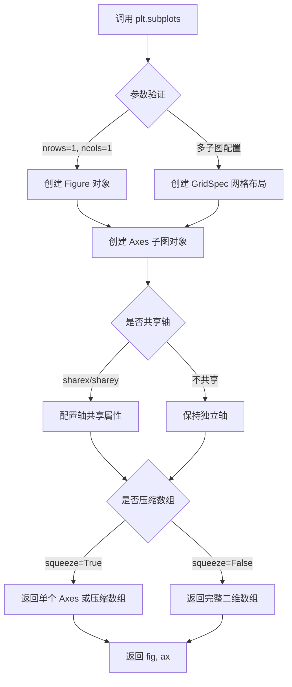

#### 带注释源码

```python
# 代码中的实际调用
fig, ax = plt.subplots(1, 1, figsize=(6, 8), layout='constrained')

# 详细解析：
# - 1, 1: 创建一个 1 行 1 列的子图网格（即单个子图）
# - figsize=(6, 8): 设置图形宽度为 6 英寸，高度为 8 英寸
# - layout='constrained': 使用约束布局管理器，自动调整子图位置以避免重叠
# 返回值：
# - fig: Figure 对象，代表整个图形容器
# - ax: Axes 对象，代表图形中的坐标系（此处为单一 Axes，因为 nrows*ncols=1）
```


### `matplotlib.axes.Axes.set_prop_cycle`

设置 Axes 对象的属性循环（property cycle），用于在绘制多条线时自动循环使用不同的颜色或其他属性。

参数：

-  `color`：`list[str]`，一个颜色代码列表（如十六进制颜色码），定义循环中使用的颜色序列

返回值：`cycler.Cycler`，返回配置后的属性循环对象

#### 流程图

```mermaid
graph TD
    A[调用 ax.set_prop_cycle] --> B{传入 color 参数}
    B -->|是| C[创建包含 color 的 cycler 对象]
    B -->|否| D[使用默认属性循环]
    C --> E[设置 axes 的 rcParams['axes.prop_cycle']]
    D --> E
    E --> F[返回 cycler.Cycler 对象]
    F --> G[后续 plot 调用时自动从循环中取颜色]
```

#### 带注释源码

```python
# 在代码中调用 set_prop_cycle 的方式
ax.set_prop_cycle(color=[
    '#1f77b4', '#aec7e8', '#ff7f0e', '#ffbb78', '#2ca02c', '#98df8a',
    '#d62728', '#ff9896', '#9467bd', '#c5b0d5', '#8c564b', '#c49c94',
    '#e377c2', '#f7b6d2', '#7f7f7f', '#c7c7c7', '#bcbd22', '#dbdb8d',
    '#17becf', '#9edae5'])

# 上述代码等同于在 matplotlibrc 中设置:
# axes.prop_cycle: cycler('color', ['#1f77b4', '#aec7e8', ...])

# 工作原理：
# 1. set_prop_cycle 创建一个新的 cycler 对象，包含指定颜色列表
# 2. 该 cycler 被设置为 axes 的默认属性循环
# 3. 后续调用 ax.plot() 时，每次会自动从该循环中取一个颜色
# 4. 当所有颜色用完后，会循环回第一个颜色
```


### `Axes.plot`

绘制折线图是 matplotlib 中用于展示数据趋势的核心方法。该函数接收 x 和 y 坐标数据，绘制连线并返回 Line2D 对象，支持丰富的样式定制参数。

参数：

- `x`：`array-like`，x 轴数据，对应股票日期（Date 列）
- `y`：`array-like`，y 轴数据，对应股票价格（各股票列的数据）
- `lw`：`float`，线宽（line width），此处设置为 2.5

返回值：`matplotlib.lines.Line2D`，表示绘制的折线对象，用于后续自定义样式（如获取颜色等）

#### 流程图

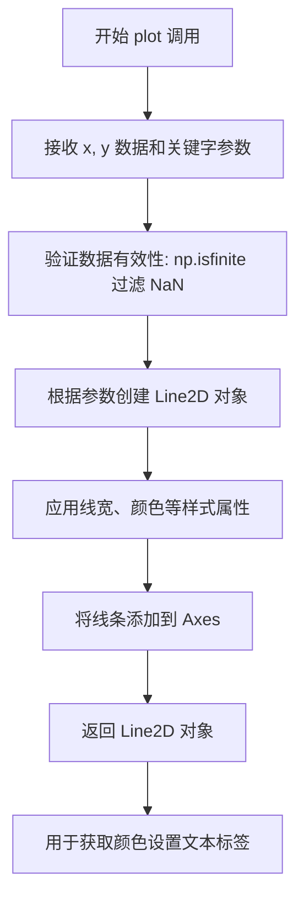

#### 带注释源码

```python
# 遍历每个股票代码
for nn, column in enumerate(stocks_ticker):
    # 过滤掉含有 NaN 的数据，只保留有效数据点
    # np.isfinite 返回布尔数组，np.nonzero 获取非零（True）位置的索引
    good = np.nonzero(np.isfinite(stock_data[column]))
    
    # 调用 ax.plot 绘制折线图
    # 参数1: x 轴数据 - 日期序列
    # 参数2: y 轴数据 - 对应股票的价格
    # 参数3: lw=2.5 设置线条宽度为 2.5 磅
    # 返回值: Line2D 对象，解包赋值给 line 变量
    line, = ax.plot(stock_data['Date'][good], stock_data[column][good], lw=2.5)
    
    # 获取该股票最后一天的价格，用于放置文本标签
    y_pos = stock_data[column][-1]
    
    # 创建偏移变换对象，用于微调文本标签的垂直位置
    # y_offsets 字典存储了各股票的微调值（单位：点 = 1/72 英寸）
    offset = y_offsets[column] / 72
    # ScaledTranslation 结合缩放和平移，fig.dpi_scale_trans 处理 DPI 缩放
    trans = mtransforms.ScaledTranslation(0, offset, fig.dpi_scale_trans)
    # 将偏移变换与数据坐标变换组合
    trans = ax.transData + trans
    
    # 在图表右侧添加文本标签，显示股票名称
    # 使用与线条相同的颜色，保持视觉一致性
    ax.text(np.datetime64('2022-10-01'), y_pos, stocks_name[nn],
            color=line.get_color(), transform=trans)
```


### `ax.text`

在股票价格折线图示例中，`ax.text` 方法用于在图表的右侧末端为每条股票价格曲线添加文本标签（如公司名称），并通过自定义的变换（transform）来调整标签的垂直位置，以避免重叠。

参数：

- `x`：`numpy.datetime64`，X轴位置，固定为2022-10-01，表示文本标签在图表右侧的时间点
- `y`：`float`，Y轴位置，对应各股票在数据最后一行的价格值，决定文本标签的垂直位置
- `s`：`str`，文本内容，即 `stocks_name[nn]`，包含IBM、Apple、Microsoft等公司名称
- `color`：`str`，文本颜色，通过 `line.get_color()` 获取，与对应折线颜色保持一致
- `transform`：`matplotlib.transforms.Transform`，变换对象，包含数据坐标变换和缩放平移，用于精确控制标签位置

返回值：`matplotlib.text.Text`，返回创建的Text对象，可用于进一步自定义文本样式

#### 流程图

```mermaid
flowchart TD
    A[开始] --> B[获取股票数据的最后一个价格值 y_pos]
    B --> C[根据股票代码获取垂直偏移量 offset]
    C --> D[创建缩放变换 ScaledTranslation]
    D --> E[组合数据坐标变换和偏移变换 trans = ax.transData + trans]
    E --> F[调用 ax.text 方法]
    F --> G[传入固定日期 np.datetime64('2022-10-01') 作为X坐标]
    G --> H[传入 y_pos 作为Y坐标]
    H --> I[传入公司名称 stocks_name[nn] 作为文本内容]
    I --> J[设置颜色与折线颜色一致]
    J --> K[应用自定义变换 trans 控制位置]
    K --> L[返回 Text 对象]
    L --> M[结束]
```

#### 带注释源码

```python
# 为每条股票曲线添加右侧文本标签
for nn, column in enumerate(stocks_ticker):
    # ... 绘图代码省略 ...
    
    # 获取每条股票在数据中最后一个时间点的价格值
    # 作为文本标签的Y轴位置
    y_pos = stock_data[column][-1]
    
    # 使用偏移变换来微调文本的垂直位置（单位为点，1/72英寸）
    # 从 y_offsets 字典获取特定股票的偏移量
    offset = y_offsets[column] / 72
    
    # 创建缩放变换：0表示X轴无偏移，offset表示Y轴偏移量
    # fig.dpi_scale_trans 用于处理DPI相关的缩放
    trans = mtransforms.ScaledTranslation(0, offset, fig.dpi_scale_trans)
    
    # 将偏移变换组合到数据坐标变换上
    # ax.transData 负责数据坐标到显示坐标的转换
    # + 操作符将两个变换组合，后续变换先应用
    trans = ax.transData + trans
    
    # 调用 Axes.text 方法添加文本标签
    # 参数1: x坐标 - 固定使用2022年10月1日
    # 参数2: y坐标 - 股票的最后价格
    # 参数3: s - 公司名称文本
    # color关键字 - 设置文本颜色与折线颜色一致
    # transform关键字 - 应用自定义坐标变换
    ax.text(np.datetime64('2022-10-01'), y_pos, stocks_name[nn],
            color=line.get_color(), transform=trans)
```


### `ax.set_xlim`

设置X轴（水平轴）的显示范围，即数据坐标的最小值和最大值。

参数：

- `left`：`numpy.datetime64`，X轴范围的左边界（起始日期），这里传入 `np.datetime64('1989-06-01')` 表示1989年6月1日
- `right`：`numpy.datetime64`，X轴范围的右边界（结束日期），这里传入 `np.datetime64('2023-01-01')` 表示2023年1月1日

返回值：`tuple`，返回之前设置的x轴范围 `(old_min, old_max)`，如果之前未设置则返回 `(0.0, 1.0)` 的归一化值

#### 流程图

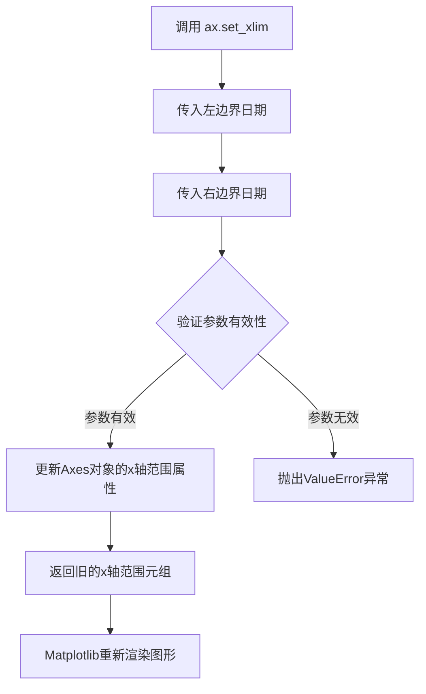

#### 带注释源码

```python
# 设置X轴的显示范围，从1989年6月1日到2023年1月1日
# left参数：X轴范围的起始日期（最小值）
# right参数：X轴范围的结束日期（最大值）
# 此调用将图表的X轴锁定在指定的时间范围内，显示约33年的股票数据
ax.set_xlim(np.datetime64('1989-06-01'), np.datetime64('2023-01-01'))
```


# 文档提取结果

### `Axes.set_yscale`

设置Y轴的刻度类型（比例尺）。

参数：

- `value`：`str`，指定Y轴的比例类型。常用值包括 `'linear'`（线性刻度）、`'log'`（对数刻度）、`'symlog'`（对称对数刻度）、`'logit'`（逻辑斯蒂刻度）等
- `**kwargs`：关键字参数，传递给刻度比例类的额外参数（如对数刻度的`base`、`subs`、`linthresh`等）

返回值：`None`，该方法直接修改Axes对象，不返回任何值

#### 流程图

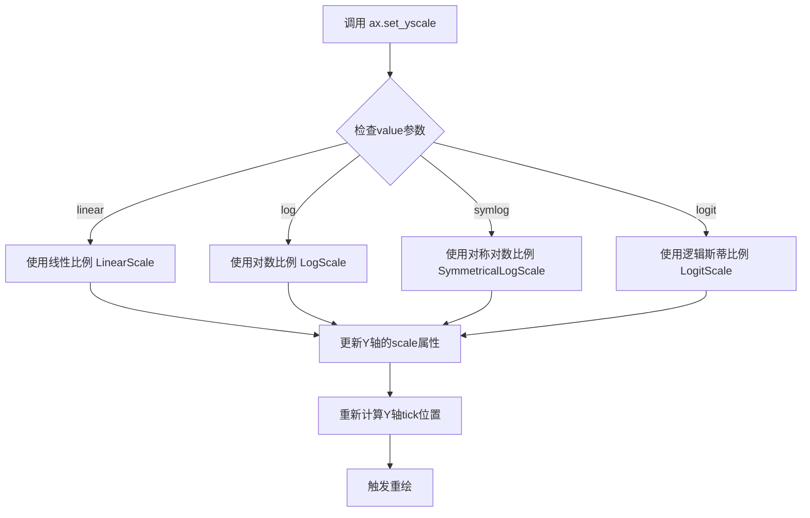

#### 带注释源码

```python
# 在示例代码中的使用方式
ax.set_yscale('log')

# 源码注释：
# ax 是通过 plt.subplots() 创建的 Axes 对象
# set_yscale 是 matplotlib.axes.Axes 类的方法
# 'log' 参数指定Y轴使用对数刻度
# 这样可以更好地展示股票价格的长期增长趋势
# 因为股票价格通常呈现指数增长特性

# 该方法会：
# 1. 根据传入的scale类型创建相应的Scale对象
# 2. 更新axes的yaxis属性
# 3. 重新计算tick位置和格式
# 4. 标记axes需要重绘
```

---

## 补充说明

由于 `set_yscale` 是 **matplotlib 库的内置方法**，并非在本示例代码文件中定义，因此无法从该代码文件中提取其完整实现源码。上述信息基于 matplotlib 官方文档和代码调用的上下文。

在本示例中，该方法的作用是将Y轴设置为对数刻度，以便更好地展示股票价格随时间的指数增长趋势。


### `ax.spines[:].set_visible`

该方法用于设置 Axes 对象的脊线（spines）的可见性。Spines 是连接轴刻度线的边框线，四个边框分别位于图表的左、右、顶、底部。通过传入布尔值参数控制所有边框的显示与隐藏。

参数：

- `visible`：`bool`，指定脊线是否可见。`True` 显示边框，`False` 隐藏边框

返回值：`None`，该方法直接修改对象状态，无返回值

#### 流程图

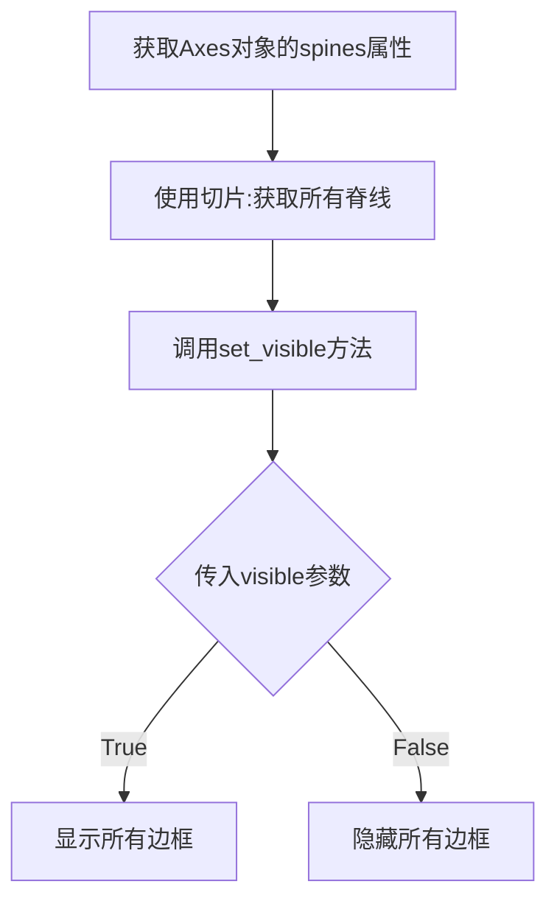

#### 带注释源码

```python
# 代码中的调用示例：
# Remove the plot frame lines. They are unnecessary here.
ax.spines[:].set_visible(False)

# 详细解释：
# 1. ax 是通过 plt.subplots() 创建的 Axes 对象
# 2. ax.spines 返回一个 Spines 对象（类似字典，包含 'left', 'right', 'top', 'bottom' 四个脊线）
# 3. ax.spines[:] 使用切片语法获取所有四个脊线组成的列表
# 4. set_visible(False) 方法遍历所有脊线，将它们的可见性设置为 False
#    - 参数 False 表示隐藏所有边框
#    - 若设为 True 则显示所有边框
# 5. 返回值为 None，直接修改原始 Spines 对象的状态
```


### `ax.xaxis.tick_bottom` (或 `XAxis.tick_bottom`)

将X轴（XAxis）的刻度线位置设置为轴的底部（默认位置），即移除顶部刻度线，仅在底部显示刻度。该方法是 matplotlib 中控制坐标轴刻度显示位置的常用操作。

参数：此方法无参数。

返回值：`None`，无返回值（该方法直接修改对象状态）。

#### 流程图

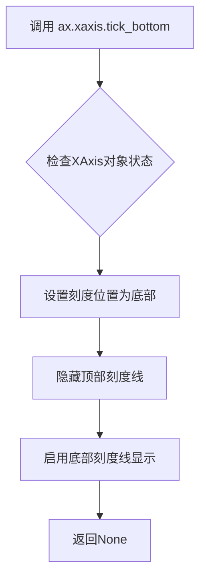

#### 带注释源码

```python
# 调用 tick_bottom() 方法将 X 轴的刻度线移动到轴的底部
# 这是 matplotlib 中设置坐标轴刻度位置的常用方式
# 执行后：X轴刻度线仅显示在底部，顶部刻度线被隐藏

ax.xaxis.tick_bottom()

# 源码注释说明：
# - 所在类：matplotlib.axis.XAxis
# - 功能：设置X轴刻度仅显示在底部
# - 实际效果：调用后，X轴的刻度线（tick marks）将只在轴的底部显示
# - 配合方法：通常与 ax.yaxis.tick_left() 配合使用，分别控制X轴和Y轴的刻度位置
```


### `ax.yaxis.tick_left`

该方法是 matplotlib 库中 `matplotlib.axis.YAxis` 类的成员函数，用于将 Y 轴的刻度线（tick marks）设置在坐标轴的左侧。在给定的代码中，调用此方法确保 Y 轴刻度仅显示在左侧，与 `ax.xaxis.tick_bottom()` 配合使用，使图表仅保留底部和左侧的刻度线，提升可视化效果。

参数：无需参数

返回值：`None`，该方法无返回值，直接修改 YAxis 对象的内部状态

#### 流程图

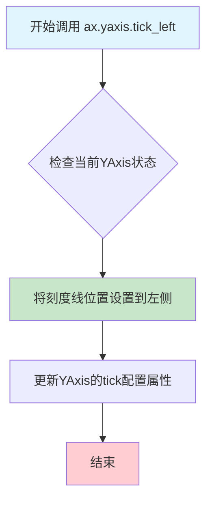

#### 带注释源码

```python
# ax.yaxis.tick_left() 源码实现逻辑（基于matplotlib源码简化）

def tick_left(self):
    """
    将Y轴的刻度线设置在轴的左侧。
    
    此方法执行以下操作：
    1. 获取当前Y轴的刻度定位器（locator）
    2. 设置刻度线位置为左侧
    3. 更新Tick对象的可见性和位置
    
    参数:
        无
        
    返回值:
        None
    """
    # 获取Y轴的刻度定位器，用于管理刻度的位置
    # tick_params 控制刻度的显示方式
    self.tick_params(axis='y', which='major', left=True, right=False)
    
    # 设置minor刻度（如果存在）
    self.tick_params(axis='y', which='minor', left=True, right=False)
    
    # 重新生成刻度以应用新的位置设置
    self._update_tick_ticks()
    
    # 更新刻度线的可见性
    # 遍历主刻度线，设置右侧刻度不可见
    for tick in self.get_major_ticks():
        tick.tick2line.set_visible(False)  # 关闭右侧刻度线
        tick.label2.set_visible(False)      # 关闭右侧刻度标签
    
    return None


# 在示例代码中的调用方式：
ax.yaxis.tick_left()

# 配合使用的相关设置：
ax.xaxis.tick_bottom()  # 将X轴刻度设置在底部
ax.tick_params(axis='both', which='both', 
               left=False, right=False, labelleft=True)  # 控制刻度和标签的显示
```

#### 关键组件信息

| 组件名称 | 一句话描述 |
|---------|-----------|
| `YAxis` | matplotlib 中管理 Y 轴刻度、标签和外观的类 |
| `tick_left()` | YAxis 类的方法，用于将 Y 轴刻度线放置在左侧 |
| `tick_params()` | 控制刻度线和刻度标签的显示方式和位置 |
| `ax.yaxis` | 获取当前 Axes 的 Y 轴对象 |

#### 潜在技术债务或优化空间

1. **硬编码配置**：在示例代码中，刻度位置的设置是硬编码的，如果需要动态切换刻度位置，可能需要封装成可复用的函数
2. **缺乏错误处理**：直接调用 matplotlib 内部方法时未做错误检查，建议添加 Axes 对象有效性验证
3. **魔法数值**：刻度标签大小 `'large'` 是一个字符串 magic number，建议提取为常量

#### 其它项目

**设计目标与约束**
- 目标：创建清晰的技术公司股票价格可视化图表
- 约束：确保刻度线仅显示在必要的轴上，减少视觉干扰

**错误处理与异常设计**
- 如果 `ax` 对象为 `None` 或未正确初始化，调用此方法会抛出 `AttributeError`
- 建议在使用前验证 `ax` 对象的存在性

**数据流与状态机**
- 该方法修改 YAxis 对象的内部状态（刻度位置）
- 状态变更后需要调用 `_update_tick_ticks()` 重新渲染刻度

**外部依赖与接口契约**
- 依赖：`matplotlib.axis.YAxis` 类
- 接口：无参数、无返回值（`None`）


### `Axes.grid`

添加或移除坐标轴的网格线，用于在图表上显示参考线以帮助观众沿着刻度线追踪数据。

参数：

- `b`：`bool` 或 `None`，是否显示网格线。`True` 表示显示，`False` 表示隐藏，`None` 表示切换当前状态。
- `which`：`str`，指定在哪些刻度线上显示网格，可选值为 `'major'`（主刻度）、`'minor'`（次刻度）或 `'both'`（两者都显示）。
- `axis`：`str`，指定在哪个坐标轴上显示网格，可选值为 `'both'`（x和y轴）、`'x'`（仅x轴）或 `'y'`（仅y轴）。
- `**kwargs`：其他关键字参数，将传递给 `matplotlib.lines.Line2D` 对象，用于自定义网格线的外观属性。

返回值：`无`，该方法直接在 Axes 对象上操作，不返回值。

#### 流程图

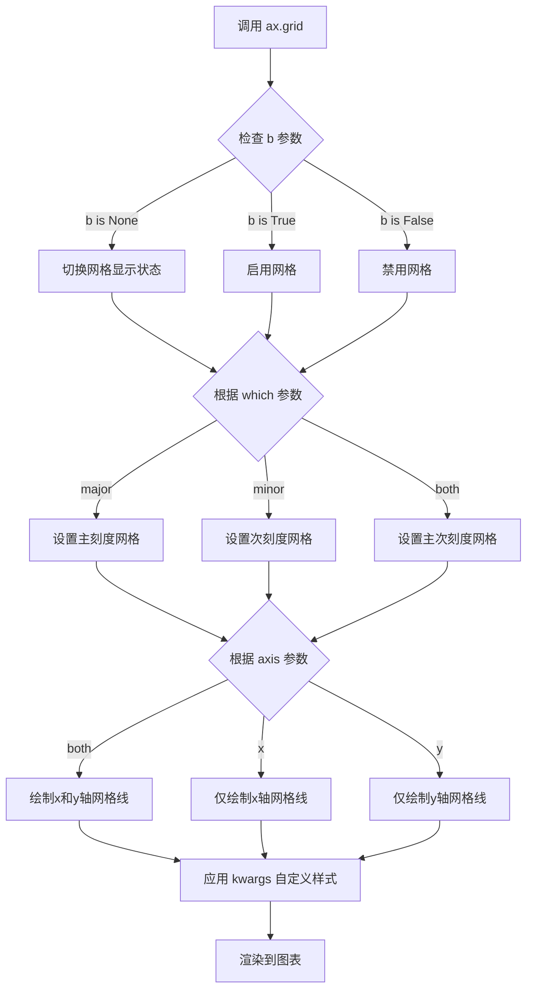

#### 带注释源码

```python
def grid(self, b=None, which='major', axis='both', **kwargs):
    """
    添加或移除坐标轴的网格线。
    
    参数:
        b : bool or None, optional
            是否显示网格线。默认为 None（切换当前状态）。
        which : {'major', 'minor', 'both'}, optional
            在哪些刻度线上显示网格。默认为 'major'。
        axis : {'both', 'x', 'y'}, optional
            在哪个坐标轴上显示网格。默认为 'both'。
        **kwargs : 
            传递给 matplotlib.lines.Line2D 的关键字参数，
            用于自定义网格线的样式，如颜色(c)、线宽(lw)、
            线型(ls)、透明度(alpha)等。
    
    返回值:
        None
    
    示例:
        # 显示主刻度网格线（默认）
        ax.grid(True)
        
        # 显示主刻度和次刻度网格线
        ax.grid(True, which='both')
        
        # 仅在x轴显示网格，使用虚线
        ax.grid(True, axis='x', ls='--')
        
        # 自定义网格线外观
        ax.grid(True, c='gray', lw=0.5, alpha=0.3)
    """
    # 获取网格线的容器对象
    # gridlines 存储了x轴和y轴的网格线集合
    gridlines = self._gridlines_major if which in ('major', 'both') else None
    
    # 确定是否显示网格
    if b is None:
        # 如果未指定b，则切换当前状态
        b = not self._grid_on
    
    # 更新内部状态
    self._grid_on = b
    
    # 根据axis参数选择要操作的轴
    if axis in ('both', 'x'):
        # 处理x轴网格线
        self.xaxis._gridlines_major.set_visible(b)
    
    if axis in ('both', 'y'):
        # 处理y轴网格线
        self.yaxis._gridlines_major.set_visible(b)
    
    # 应用自定义样式参数
    if b and kwargs:
        # 遍历所有网格线并应用样式
        for line in itertools.chain(
            self.xaxis.get_gridlines(),
            self.yaxis.get_gridlines()
        ):
            line.update(kwargs)
    
    # 触发重绘
    self.stale_callback()
```

#### 实际调用示例

在给定的代码中，调用方式为：

```python
ax.grid(True, 'major', 'both', ls='--', lw=.5, c='k', alpha=.3)
```

参数对应关系：
- `True` → `b=True`：显示网格线
- `'major'` → `which='major'`：在主刻度线上显示
- `'both'` → `axis='both'`：x轴和y轴都显示
- `ls='--'` → `linestyle='--'`：虚线样式
- `lw=.5` → `linewidth=0.5`：线宽0.5
- `c='k'` → `color='black'`：黑色
- `alpha=.3` → `alpha=0.3`：30%透明度


### `ax.tick_params` / `Axes.tick_params`

设置刻度参数（tick parameters），用于控制坐标轴刻度线（tick marks）和刻度标签（tick labels）的外观和行为。

#### 参数

- `axis`：`str`，可选参数，指定要设置参数的坐标轴，可选值为 `'x'`、`'y'` 或 `'both'`，默认为 `'both'`。在示例代码中传入 `'both'`。
- `which`：`str`，可选参数，指定要修改的刻度类型，可选值为 `'major'`（主刻度）、`'minor'`（次刻度）或 `'both'`，默认为 `'major'`。在示例代码中传入 `'both'`。
- `labelsize`：`str` 或 `int`，可选参数，设置刻度标签的字体大小。在示例代码中传入 `'large'`。
- `bottom`、`top`、`left`、`right`：`bool`，可选参数，控制是否显示对应位置的刻度线（tick marks）。在示例代码中，`bottom` 和 `top` 设为 `False`，`left` 和 `right` 设为 `False`。
- `labelbottom`、`labeltop`、`labelleft`、`labelright`：`bool`，可选参数，控制是否显示对应位置的刻度标签（tick labels）。在示例代码中，`labelbottom` 设为 `True`，`labelleft` 设为 `True`，其余设为 `False`。

#### 返回值

`None`。该方法直接修改 Axes 对象的属性，不返回任何值。

#### 流程图

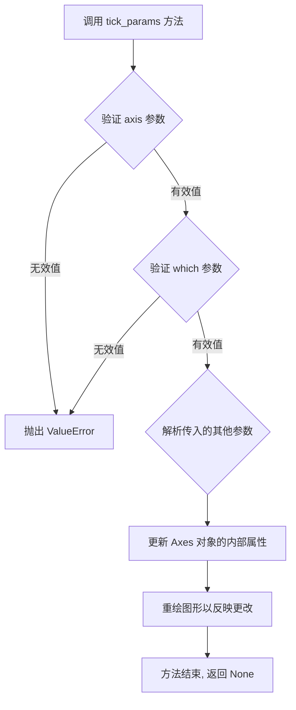

#### 带注释源码

```python
# 示例代码中的调用方式
ax.tick_params(
    axis='both',      # str: 指定要设置参数的坐标轴, 'both' 表示同时设置 x 轴和 y 轴
    which='both',    # str: 'both' 表示同时修改主刻度和次刻度的外观
    labelsize='large',  # str 或 int: 设置刻度标签的字体大小为 'large'
    bottom=False,    # bool: 不显示 x 轴底部的刻度线
    top=False,       # bool: 不显示 x 轴顶部的刻度线
    labelbottom=True,  # bool: 显示 x 轴底部的刻度标签
    left=False,      # bool: 不显示 y 轴左侧的刻度线
    right=False,     # bool: 不显示 y 轴右侧的刻度线
    labelleft=True   # bool: 显示 y 轴左侧的刻度标签
)

# tick_params 方法的完整签名（参考 matplotlib 文档）
# Axes.tick_params(self, axis='both', which='major', **kwargs)
#
# 常用 kwargs 参数包括：
# - length: 刻度线的长度（单位为点）
# - width: 刻度线的宽度
# - color: 刻度线的颜色
# - pad: 刻度线与刻度标签之间的间距
# - direction: 刻度线的方向, 'in', 'out' 或 'inout'
# - labelrotation: 刻度标签的旋转角度
```


### fig.suptitle

设置图表（Figure）的总标题，即位于整个图形最上方的标题。

参数：

-  `t`：`str`，要显示的标题文本内容，例如 "Technology company stocks prices dollars (1990-2022)"
-  `ha`：`str`，水平对齐方式（horizontal alignment），可选值包括 "center"（居中对齐）、"left"（左对齐）、"right"（右对齐），此处为 "center"

返回值：`matplotlib.text.Text`，返回创建的 Text 文本对象，可用于进一步自定义标题样式（如颜色、字体大小等）。

#### 流程图

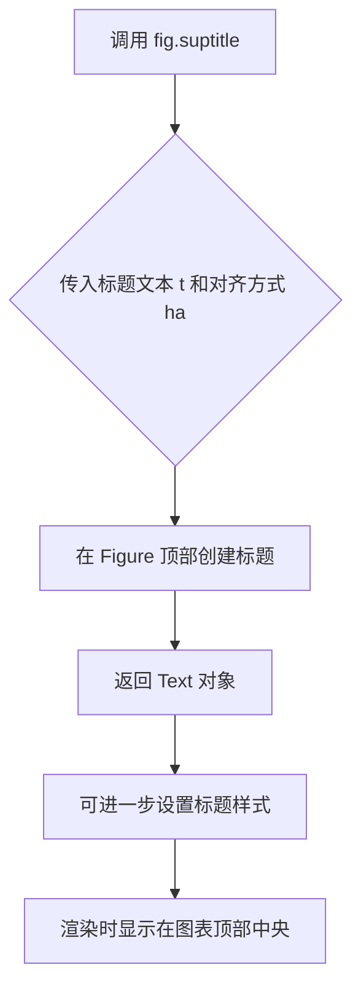

#### 带注释源码

```python
# 调用 Figure 对象的 suptitle 方法设置图表总标题
# 参数 t: 标题文本内容
# 参数 ha: horizontal alignment，水平对齐方式设为 "center"
fig.suptitle("Technology company stocks prices dollars (1990-2022)",
             ha="center")

# 详细说明：
# - fig: 通过 plt.subplots() 返回的 Figure 对象
# - suptitle 方法会在整个图形的顶部中央添加标题
# - 返回的 Text 对象可以用于后续样式定制，例如：
#   title = fig.suptitle(...)
#   title.set_fontsize(16)
#   title.set_color('red')
```


### `plt.show`

`plt.show` 是 matplotlib 库中的全局函数，用于显示当前所有打开的 Figure（图形）窗口，使其在屏幕上可见，并进入交互模式。

参数：

- `block`：`bool`，可选参数（默认值为 `True`）。指定是否阻塞程序执行以等待用户交互。若为 `True`，则程序会暂停运行直到用户关闭所有图形窗口；若为 `False`，则函数立即返回，图形窗口保持打开但程序继续执行。

返回值：`None`，该函数不返回任何值。

#### 流程图

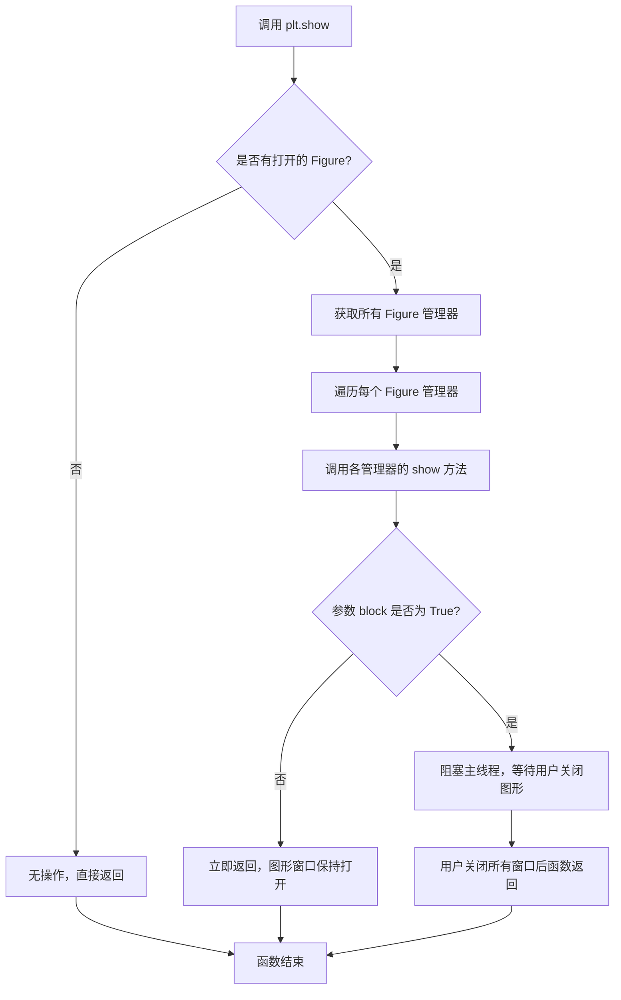

#### 带注释源码

```python
# plt.show 函数的简化实现逻辑说明
# 实际源码位于 matplotlib.pyplot 模块中

def show(block=None):
    """
    显示所有打开的 Figure 图形窗口并进入交互模式。
    
    参数:
        block: 布尔值，可选。
               True（默认）：阻塞调用线程，直到用户关闭所有图形窗口。
               False：立即返回，图形窗口保持打开状态。
    
    返回值:
        None
    """
    
    # 获取当前存在的所有 Figure 管理器（图形窗口）
    all_figs = get_all_fig_managers()
    
    # 如果没有打开的图形，则直接返回，不做任何操作
    if not all_figs:
        return
    
    # 遍历每个 Figure 管理器，调用其 show 方法显示窗口
    for fig_manager in all_figs:
        fig_manager.show()
    
    # 如果 block 参数为 True，则进入阻塞状态
    # 这通常会启动一个事件循环来处理用户交互
    if block:
        # 进入图形事件循环，等待用户交互
        # 只有当所有图形窗口关闭后才会继续执行
        _blocking_show()
    else:
        # 非阻塞模式，函数立即返回
        # 图形窗口会保持打开，但程序继续执行
        pass

# _blocking_show() 内部通常会调用交互式后端的事件循环
# 例如在 Qt 后端中会调用 QApplication.exec_()
# 在默认后端中可能会调用 plt.pause() 或进入 mainloop
```

#### 在示例代码中的使用

```python
# ...（上方为图形创建和数据绑定的代码）...

# 最后调用 plt.show() 显示图形
# 参数使用默认值 block=True
plt.show()  # 阻塞程序直到用户关闭图形窗口
```

> **说明**：在示例代码中，`plt.show()` 被放置在所有图形配置（如设置标题、坐标轴、网格等）完成后调用。调用后，程序会进入交互模式，用户可以查看并与图形进行交互，直到关闭图形窗口程序才会继续执行或退出。

## 关键组件


### 数据加载组件

使用 `np.genfromtxt` 从 CSV 文件加载股票数据，支持自定义日期转换器将字符串转换为 datetime64 类型，同时处理 CSV 表头作为列名。

### 图表初始化组件

通过 `plt.subplots` 创建单子图，设置尺寸为 (6, 8)，使用 `layout='constrained'` 进行自适应布局管理。

### 颜色循环配置组件

使用 `ax.set_prop_cycle` 定义 20 种颜色用于区分不同股票曲线，实现自动颜色分配。

### 股票数据可视化组件

遍历股票代码列表，使用 `ax.plot` 绘制每只股票的时间序列曲线，并利用 `np.nonzero` 和 `np.isfinite` 过滤 NaN 值。

### 文本标签偏移变换组件

使用 `matplotlib.transforms.ScaledTranslation` 创建坐标变换，实现文本标签的垂直微调，通过 `fig.dpi_scale_trans` 确保偏移量与 DPI 无关。

### 坐标轴样式管理组件

配置坐标轴属性：隐藏边框 (`ax.spines[:].set_visible(False)`)、设置刻度位置 (仅底部和左侧)、启用对数刻度 (`ax.set_yscale('log')`)、添加网格线。

### 刻度参数定制组件

使用 `ax.tick_params` 自定义刻度显示，隐藏不需要的刻度线，仅保留标签显示，并设置大字体的可读性。


## 问题及建议


### 已知问题

- **硬编码的配置数据**：`stocks_name`、`stocks_ticker` 和 `y_offsets` 字典采用硬编码方式，股票数据变更时需要手动修改代码，缺乏灵活性和可维护性
- **魔法数字和字符串**：代码中存在多个硬编码的数值和日期字符串（如日期范围 `'1989-06-01'` 到 `'2023-01-01'`、偏移量 `5`、`-5`、`-6`、字体大小 `'large'`、线宽 `2.5` 等），应提取为配置常量
- **缺乏错误处理**：未对文件读取失败、数据格式错误、股票代码不存在等情况进行异常捕获和处理，可能导致程序直接崩溃
- **代码结构过于扁平**：所有逻辑堆积在全局作用域，未封装为函数或类，难以复用和单元测试
- **数据加载效率问题**：每次循环都调用 `np.nonzero(np.isfinite(...))` 进行数据筛选，对于大数据集可能存在性能瓶颈
- **索引对应风险**：`stocks_name` 和 `stocks_ticker` 通过索引一一对应，如果两个数组长度不一致会导致索引越界或数据错配
- **日期转换函数未优化**：使用 lambda 函数 `lambda x: np.datetime64(x, 'D')` 进行日期转换，每次调用都会创建新函数对象
- **matplotlib 示例模块依赖**：使用 `matplotlib.cbook.get_sample_data` 加载示例数据，依赖第三方数据源，不适合生产环境部署

### 优化建议

- 将配置数据（股票列表、偏移量、日期范围等）提取为独立的配置文件（如 JSON、YAML）或命令行参数
- 将绘图逻辑封装为函数，接收配置参数，提高代码的可测试性和可复用性
- 添加完善的异常处理机制，包括文件不存在、数据解析错误、数据缺失等场景的优雅处理
- 使用 `dtype` 参数明确指定数据类型，避免使用 `dtype=None` 导致的自动推断开销
- 预先筛选有效数据并缓存，避免在循环中重复计算
- 对两个列表的对应关系使用字典或命名元组进行关联，消除索引依赖风险
- 考虑使用面向对象方式重构，将图表样式、数据处理、渲染逻辑分离到不同类中
- 添加类型注解和详细的文档字符串，提高代码可读性和可维护性


## 其它


### 设计目标与约束

本代码的设计目标是可视化1990年至2022年间多家科技公司股票价格的对数趋势，通过比较不同公司的股价变化展示长期投资价值。约束条件包括：必须使用matplotlib进行绘图，数据源为CSV格式的股票数据（包含日期和收盘价），图表采用对数刻度以适应股价的大幅波动，并自定义样式以提高可读性。

### 错误处理与异常设计

代码中已使用`np.isfinite`处理NaN值，但缺少显式的异常捕获机制。建议在文件读取和数据转换处添加`try-except`块，捕获`FileNotFoundError`（数据文件缺失）、`ValueError`（数据格式错误或类型转换失败）和`KeyError`（CSV列名不匹配）等异常，并输出友好的错误信息。此外，对于空数据或全为NaN的列应提前终止绘图并警告。

### 外部依赖与接口契约

主要依赖包括：matplotlib（绘图）、numpy（数据处理）和matplotlib.cbook.get_sample_data（示例数据加载）。外部接口契约如下：
- **输入**：CSV文件'Stocks.csv'，必须包含'Date'列和多个股票代码列（如'IBM'、'AAPL'等），日期格式为'YYYY-MM-DD'。
- **输出**：显示股票价格时间序列的折线图，保存为PNG等图像格式（代码中为`plt.show()`）。
- **数据格式**：日期应为datetime64类型，股价为浮点数。

### 数据流与状态机

数据流如下：
1. **加载数据**：通过`get_sample_data`加载CSV文件，使用`np.genfromtxt`解析为结构化数组，同时转换日期列。
2. **数据过滤**：遍历每个股票代码，使用`np.isfinite`筛选有效数值，去除NaN。
3. **绘图**：对每个股票代码调用`ax.plot`绘制对数刻度折线，并添加文本标签。
4. **样式设置**：设置坐标轴范围、刻度、网格、标题等。
5. **展示**：调用`plt.show()`渲染图表。

状态机不适用，因其为一次性脚本，无状态保持。

### 性能考虑

当前代码在数据量较小（约数千行）时性能可接受。潜在性能瓶颈：
- `np.genfromtxt`在大型CSV文件上可能较慢，可考虑`pandas.read_csv`加速。
- 循环中逐列绘图可优化为批量绘图，但当前实现便于自定义标签。
建议：若数据量增加，预处理数据为DataFrame并一次性绘图。

### 可维护性与扩展性

代码可维护性较低，因存在多处硬编码：
- 颜色列表、股票名称和代码、偏移量应抽取为配置文件或常量。
- 重复的绘图逻辑可封装为函数，参数化股票列表和样式。
扩展性：
- 轻松添加新股票：只需在列表中增加代码和名称。
- 调整时间范围：修改`ax.set_xlim`参数。
- 更改图表样式：修改颜色或网格属性。

### 配置管理

当前配置硬编码在脚本中，包括：
- 颜色循环：`ax.set_prop_cycle(color=[...])`
- 股票列表：`stocks_name`和`stocks_ticker`
- 标签偏移量：`y_offsets`
- 图表尺寸：`figsize=(6, 8)`
建议将配置项移至独立的JSON或YAML文件，或定义为脚本顶部的常量，以便非开发者调整。

### 安全性考虑

代码无用户交互输入，安全性风险较低。但需注意：
- 数据文件路径应验证，避免路径遍历攻击（虽然`get_sample_data`为内置安全）。
- 若部署为Web服务，应防止CSV文件注入攻击，建议在解析前验证数据格式。

    