# `matplotlib\galleries\examples\showcase\xkcd.py` 详细设计文档

该代码使用 matplotlib 的 xkcd() 上下文管理器创建了两幅具有手绘漫画风格的图表，分别展示了'炉灶所有权'的故事线图和'超自然力量主张'的条形图，模仿了 XKCD 漫画的独特风格。

## 整体流程

```mermaid
graph TD
    A[开始] --> B[导入 matplotlib.pyplot 和 numpy]
B --> C[创建第一个 xkcd 图表上下文]
C --> D[创建 figure 和 axes]
D --> E[配置图表样式: 隐藏顶部和右侧脊柱, 移除刻度]
E --> F[生成数据: 创建递减数组模拟健康下降]
F --> G[添加注释箭头标注]
G --> H[绘制折线图]
H --> I[设置坐标轴标签和图表标题]
I --> J[添加底部说明文字]
J --> K[创建第二个 xkcd 图表上下文]
K --> L[创建第二个 figure 和 axes]
L --> M[绘制条形图]
M --> N[配置条形图样式和标题]
N --> O[添加底部说明文字]
O --> P[调用 plt.show() 显示所有图表]
P --> Q[结束]
```

## 类结构

```
该脚本为过程式代码，无自定义类
使用 matplotlib 库的对象层次:
matplotlib.pyplot
└── Figure (通过 plt.figure() 创建)
    └── Axes (通过 fig.add_axes() 或 fig.add_subplot() 创建)
        ├── Spine (脊柱)
        ├── XAxis / YAxis (坐标轴)
        └── Tick (刻度)
```

## 全局变量及字段


### `fig`
    
matplotlib Figure 对象，图表容器

类型：`matplotlib.figure.Figure`
    


### `ax`
    
matplotlib Axes 对象，图表绘图区域

类型：`matplotlib.axes.Axes`
    


### `data`
    
numpy 数组，包含100个元素用于绘制健康下降曲线

类型：`numpy.ndarray`
    


### `np`
    
numpy 模块别名

类型：`module`
    


### `plt`
    
matplotlib.pyplot 模块别名

类型：`module`
    


    

## 全局函数及方法


### `plt.xkcd`

创建 xkcd 风格（手绘漫画风格）的绘图上下文管理器，临时修改 matplotlib 的 rcParams 以启用 xkcd 风格的字体、线条和渲染效果。

参数：

-  `scale`：`int` 或 `float`（可选，默认 1），线条和字体的缩放因子，值越大线条越粗
-  `length`：`int`（可选，默认 100），用于生成随机抖动曲线的历史记录长度
-  `randomness`：`float`（可选，默认 6），线条随机抖动的幅度

返回值：`matplotlib.contextmanagers._GeneratorContextManager` 或类似上下文管理器对象，用于临时应用 xkcd 风格，退出上下文后恢复原始设置

#### 流程图

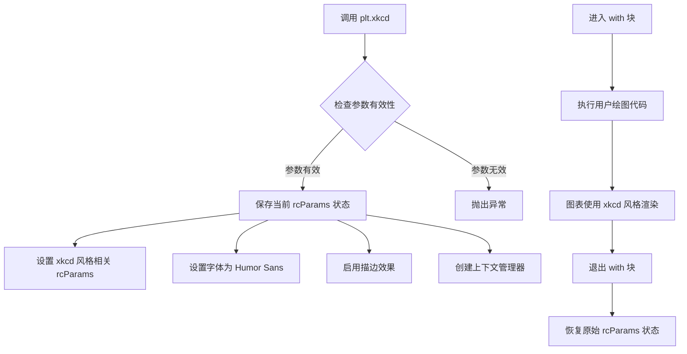

#### 带注释源码

```python
# matplotlib.pyplot.xkcd 源码结构

def xkcd(scale: int = 1, length: int = 100, randomness: float = 6):
    """
    创建 xkcd 风格的手绘漫画绘图上下文。
    
    参数:
        scale: 线条粗细的缩放因子，默认1
        length: 随机游走的历史长度，默认100  
        randomness: 线条抖动的随机程度，默认6
    
    返回:
        上下文管理器，进入时应用xkcd风格，退出时恢复原状
    """
    # 1. 验证参数合法性
    if scale <= 0:
        raise ValueError("scale must be positive")
    if length <= 0:
        raise ValueError("length must be positive")
        
    # 2. 保存当前rcParams状态用于后续恢复
    orig_settings = {
        'font.family': rcParams['font.family'],
        'font.sans-serif': rcParams['font.sans-serif'],
        'lines.linewidth': rcParams['lines.linewidth'],
        # ... 保存其他相关参数
    }
    
    # 3. 设置xkcd风格的新参数
    # 使用Humor Sans字体模拟手绘效果
    rcParams['font.family'] = ['Humor Sans', 'Comic Sans MS', 'sans-serif']
    
    # 设置线条属性模拟手绘笔触
    rcParams['lines.linewidth'] = rcParams['lines.linewidth'] * scale
    
    # 启用描边效果使线条看起来像手绘
    rcParams['path.sketch'] = (length, randomness, 0)
    
    # 4. 创建并返回上下文管理器
    # 退出时恢复原始设置
    @contextmanager
    def _xkcd_context():
        try:
            yield  # 执行with块中的代码
        finally:
            # 恢复原始rcParams
            for key, value in orig_settings.items():
                rcParams[key] = value
                
    return _xkcd_context()

# 使用示例
with plt.xkcd(scale=2):
    plt.plot([1, 2, 3], [1, 4, 9])
    # 此处图表以xkcd手绘风格渲染
# 退出后恢复默认绘图风格
```


### `plt.figure`

创建新的图表（Figure）并返回 Figure 对象，用于后续添加子图和绘制数据。

参数：

- `num`：可选，用于标识 Figure 的编号或名称。如果传递的 num 已存在，则激活该 Figure 而不是创建新的。
- `figsize`：可选，tuple (width, height)，Figure 的尺寸，以英寸为单位。
- `dpi`：可选，float，Figure 的分辨率（每英寸点数）。
- `facecolor`：可选，Figure 的背景颜色。
- `edgecolor`：可选，Figure 的边框颜色。
- `frameon`：可选，bool，是否显示边框，默认为 True。
- `clear`：可选，bool，如果为 True 且 Figure 已存在，则清除现有内容。

返回值：`matplotlib.figure.Figure`，返回创建的图表对象，后续可通过该对象添加子图（axes）、设置属性或保存图表。

#### 流程图

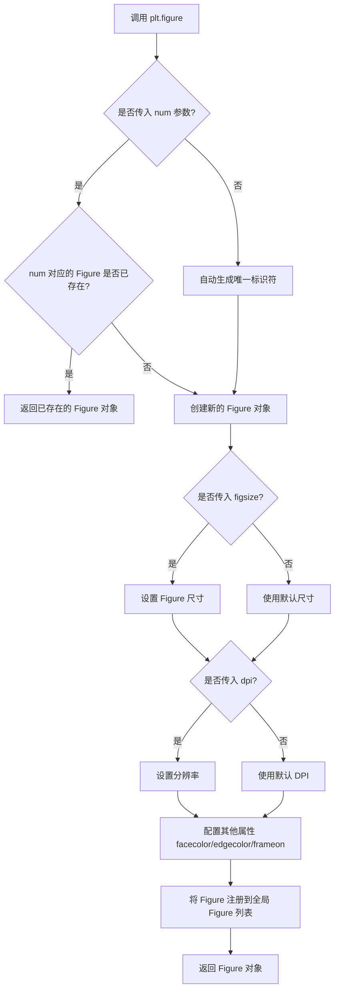

#### 带注释源码

```python
# plt.figure() 函数源码分析（基于 matplotlib 库）
# 位置：matplotlib/pyplot.py

def figure(
    # Figure 标识符，可以是整数、字符串或 None
    num=None,  
    # Figure 尺寸 (宽度, 高度)，单位英寸
    figsize=None,  
    # 分辨率（每英寸点数）
    dpi=None,  
    # 背景颜色
    facecolor=None,  
    # 边框颜色
    edgecolor=None,  
    # 是否显示边框
    frameon=True,  
    # 自定义 Figure 类
    FigureClass=<class 'matplotlib.figure.Figure'>,  
    # 是否清除已存在的 Figure
    clear=False,  
    **kwargs
):
    """
    创建一个新的图表（Figure）
    
    参数:
        num: Figure 的标识符，如果省略则自动生成
        figsize: (宽, 高) 英寸
        dpi: 分辨率
        facecolor: 背景色
        edgecolor: 边框色
        frameon: 是否显示边框
        FigureClass: 实例化 Figure 的类
        clear: 是否清除已存在的 Figure
    """
    
    # 获取全局的 Figure 管理器
    manager = _pylab_helpers.Gcf.get_figure(num)
    
    # 如果 Figure 已存在且不需要清除，直接返回
    if manager is not None and not clear:
        return manager.canvas.figure
    
    # 创建新的 Figure 实例
    fig = FigureClass(
        figsize=figsize,      # 设置尺寸
        dpi=dpi,              # 设置分辨率
        facecolor=facecolor,  # 设置背景色
        edgecolor=edgecolor,  # 设置边框色
        frameon=frameon,      # 设置边框显示
        **kwargs
    )
    
    # 将新 Figure 注册到管理器
    manager = _pylab_helpers.Gcf.register_figure(fig, num)
    
    return fig  # 返回创建的 Figure 对象
```


### `Figure.add_axes`

向当前图表（Figure）添加一个 Axes 对象，用于绘制图形。

参数：

- `rect`：`tuple` 或 `list`，四个元素的序列，表示 Axes 的位置和大小，格式为 `[left, bottom, width, height]`，取值范围为归一化的 (0, 1) 坐标。
- `projection`：`str`，可选，投影类型（如 'rectilinear', 'polar' 等）。
- `polar`：`bool`，可选，若为 True，则使用极坐标系统。
- `aspect`：`str` 或 `float`，可选，Axes 的宽高比。
- `label`：`str`，可选，Axes 的标签。
- `**kwargs`：其他关键字参数，将传递给 Axes 构造函数。

返回值：`matplotlib.axes.Axes`，返回添加的 Axes 对象。

#### 流程图

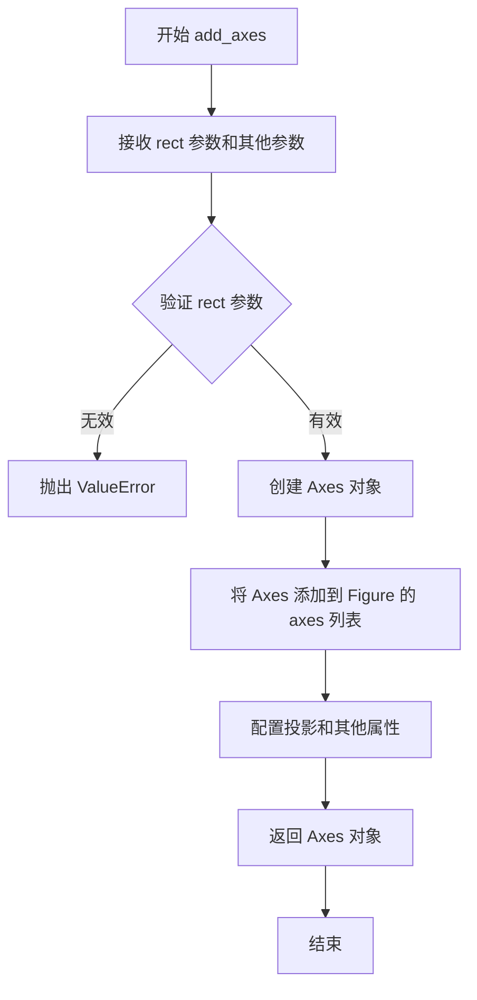

#### 带注释源码

```python
def add_axes(self, rect, projection=None, polar=False, aspect=None, label=None, **kwargs):
    """
    向图表添加一个 Axes 对象。
    
    参数:
        rect: 序列类型, [left, bottom, width, height], 
              定义 Axes 在图表中的位置和大小, 
              取值范围为 0 到 1 (归一化坐标)。
        projection: 字符串, 可选, 投影类型。
        polar: 布尔值, 可选, 是否使用极坐标。
        aspect: 字符串或浮点数, 可选, 宽高比。
        label: 字符串, 可选, Axes 的标识符。
    
    返回:
        matplotlib.axes.Axes: 添加的 Axes 对象。
    """
    # 检查 rect 长度是否为 4
    if len(rect) != 4:
        raise ValueError("rect 必须是一个包含4个元素的序列 [left, bottom, width, height]")
    
    # 验证 rect 中的值在 0-1 范围内
    for val in rect:
        if not (0 <= val <= 1):
            raise ValueError("rect 中的所有值必须在 0 到 1 之间")
    
    # 创建 Axes 实例
    ax = Axes(self, rect, projection=projection, polar=polar, **kwargs)
    
    # 设置宽高比
    if aspect is not None:
        ax.set_aspect(aspect)
    
    # 设置标签
    if label is not None:
        ax.set_label(label)
    
    # 将 Axes 添加到图表的 axes 列表中
    self._axstack.bubble(ax)
    self._axobservers.process("_axes_change", self)
    
    return ax
```

#### 使用示例

在提供的代码中，`fig.add_axes((0.1, 0.2, 0.8, 0.7))` 表示创建一个左侧距 10%、底部距 20%、宽度 80%、高度 70% 的 Axes 对象。


# 详细设计文档

## 1. 一段话描述

该代码是matplotlib XKCD风格绘图的演示示例，通过`ax.spines`属性访问图表的脊柱（spine）对象，并使用`set_visible(False)`方法隐藏图表的顶部和右侧脊柱，实现更简洁的XKCD手绘风格图表效果。

## 2. 文件的整体运行流程

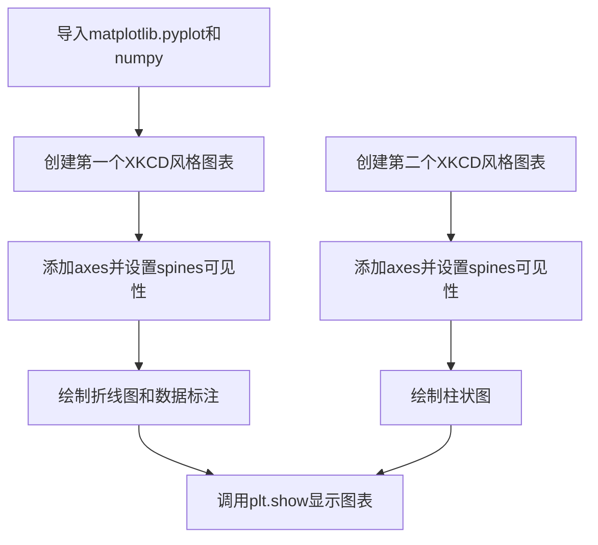

## 3. 类的详细信息

### 3.1 `ax.spines` 属性

**描述**：matplotlib Axes对象的spines属性返回一个字典-like对象，包含图表的四个边框脊柱（top、bottom、left、right），每个脊柱都是独立的`Spine`对象。

**参数**：无（属性访问）

**返回值**：`dict`，键为`'top'`、`'bottom'`、`'left'`、`'right'`，值为`matplotlib.spines.Spine`对象

#### 带注释源码

```python
# ax.spines 是 Axes 类的属性，返回 spines 字典
# 位置1: 获取spines字典对象
spines_dict = ax.spines  # <-- 返回类型: matplotlib.spines.Spines

# 位置2: 通过索引访问特定脊柱（返回Spine对象）
top_spine = ax.spines['top']    # 顶部脊柱
right_spine = ax.spines['right']  # 右侧脊柱

# 位置3: 批量访问多个脊柱（返回Spine对象或字典）
multiple_spines = ax.spines[['top', 'right']]  # 列表索引，返回包含多个Spine的容器

# 位置4: 调用Spine对象的set_visible方法隐藏脊柱
ax.spines[['top', 'right']].set_visible(False)
# 等效于:
# ax.spines['top'].set_visible(False)
# ax.spines['right'].set_visible(False)
```

### 3.2 Spine类

**模块**：`matplotlib.spines`

| 字段/方法 | 类型 | 描述 |
|-----------|------|------|
| `set_visible` | 方法 | 设置脊柱的可见性 |
| `set_linewidth` | 方法 | 设置脊柱线宽 |
| `set_color` | 方法 | 设置脊柱颜色 |
| `set_bounds` | 方法 | 设置脊柱的范围/边界 |

## 4. 关键组件信息

| 组件名称 | 一句话描述 |
|----------|------------|
| `ax.spines` | 访问图表四个边框（上下左右）的脊柱对象容器 |
| `Spine` | 表示图表单个边框的图形元素对象 |
| `set_visible()` | 控制脊柱是否显示的方法 |

## 5. 潜在的技术债务或优化空间

1. **重复代码**：两段图表代码都使用了`ax.spines[['top', 'right']].set_visible(False)`，可以考虑提取为函数
2. **魔法数字**：图表位置和尺寸`(0.1, 0.2, 0.8, 0.7)`使用硬编码，可配置化
3. **注释完整性**：缺少对XKCD模式工作原理的详细说明

## 6. 其它项目

### 设计目标与约束
- 使用matplotlib XKCD模式创建手绘风格图表
- 通过隐藏顶部和右侧脊柱模拟传统漫画图表风格

### 错误处理与异常设计
- 如果访问不存在的脊柱键（如`'middle'`），会抛出`KeyError`
- 索引访问时传入非字符串元素可能引发类型错误

### 数据流与状态机
- `plt.xkcd()` 激活XKCD模式 → 创建figure和axes → 配置spines → 绘图 → `plt.show()` 显示

### 外部依赖与接口契约
- 依赖`matplotlib.pyplot`和`numpy`库
- `ax.spines`接口返回符合字典协议的Spines对象，支持键访问和列表多选


### `ax.set_xticks`

设置 x 轴刻度位置，用于控制图表 x 轴上刻度线的显示位置。该方法属于 matplotlib.axes.Axes 类，能够精确指定刻度值，或通过空列表清除所有刻度。

#### 参数

-  `ticks`：`list` 或 `array-like`，要设置的 x 轴刻度位置值，例如 `[0, 1, 2]` 或空列表 `[]` 表示清除所有刻度

#### 返回值

-  `list`，返回刻度位置的列表（`list of tick locations`）

#### 流程图

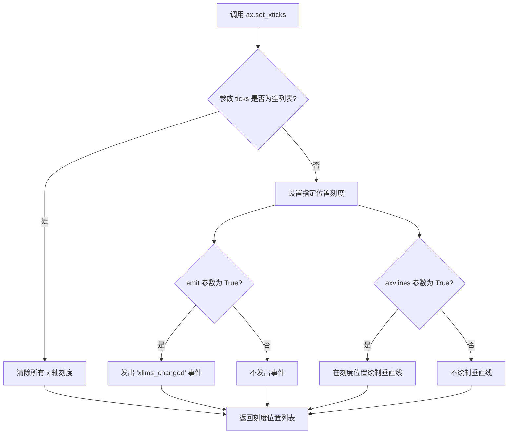

#### 带注释源码

```python
# matplotlib axes 内部实现原理（简化版）

def set_xticks(self, ticks, *, emit=True, axvlines=True, **kwargs):
    """
    设置 x 轴刻度位置
    
    参数:
        ticks: array-like, 刻度位置列表，如 [0, 1, 2] 或 [] 表示清除
        emit: bool, 当刻度变化时是否发出事件通知，默认 True
        axvlines: bool, 是否在每个刻度位置绘制垂直线，默认 True
        **kwargs: 其他传递给刻度格式化器的关键字参数
    
    返回:
        list: 刻度位置的列表
    """
    # 获取 x 轴对象
    xaxis = self.xaxis
    
    # 将输入转换为 numpy 数组
    ticks = np.asarray(ticks)
    
    # 设置刻度位置
    # _update_ticks 内部会调用 _set_ticks_positions
    xaxis.set_ticks(ticks, emit=emit, axis='x')
    
    # 可选：在每个刻度位置绘制垂直线（xkcd 风格通常不需要）
    if axvlines:
        # 绘制垂直线的逻辑
        self.axvline(x=ticks, **kwargs)
    
    # 返回刻度位置列表
    return ticks
```

#### 代码中的实际使用示例

```python
# 示例 1：清除所有 x 轴刻度
ax.set_xticks([])
# 结果：x 轴不显示任何刻度线

# 示例 2：设置指定刻度位置
ax.set_xticks([0, 1])
# 结果：x 轴在 0 和 1 的位置显示刻度线

# 配套使用：设置刻度标签（通常与 set_xticks 配合使用）
ax.set_xticks([0, 1])
ax.set_xticklabels(['CONFIRMED BY\nEXPERIMENT', 'REFUTED BY\nEXPERIMENT'])
# 结果：x 轴在 0 和 1 位置显示刻度，并分别显示对应的文本标签
```


### `Axes.set_yticks`

设置 Axes 对象的 y 轴刻度位置，用于控制 y 轴上刻度线的显示位置。该方法可以接受刻度值列表，并可选择性地为每个刻度设置标签。

参数：

- `ticks`：`list[float]` 或 `array-like`，y 轴主刻度的位置列表
- `labels`：`list[str]`，可选，刻度对应的标签文本列表，默认值为 `None`
- `minor`：`bool`，可选，是否设置次要刻度，默认值为 `False`

返回值：`matplotlib.ticker.Ticker`，返回刻度定位器对象，通常为 `Tick` 对象列表

#### 流程图

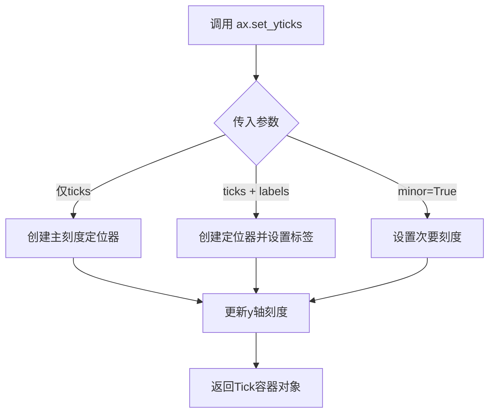

#### 带注释源码

```python
# 设置空的y轴刻度（不显示任何刻度）
ax.set_yticks([])

# 设置特定的y轴刻度位置
ax.set_yticks([0, 50, 100])

# 设置刻度位置并指定刻度标签
ax.set_yticks([0, 1], labels=['最小值', '最大值'])

# 设置次要刻度（更小的刻度线）
ax.set_yticks([25, 75], minor=True)

# 在代码中的实际调用示例（来自给定代码）
ax.set_yticks([])  # 隐藏y轴刻度（用于第一个图表）
ax.set_yticks([])  # 隐藏y轴刻度（用于第二个图表）
```


### `matplotlib.axes.Axes.set_ylim`

设置 axes 对象的 y 轴显示范围（ymin, ymax），用于控制图表垂直方向的显示区间。

参数：

- `bottom`：`float` 或 `None`，y 轴下限值（默认 None）
- `top`：`float` 或 `None`，y 轴上限值（默认 None）
- `emit`：`bool`，是否向观察者发送限制变更通知（默认 True）
- `auto`：`bool`，是否启用自动缩放（默认 False）
- `ymin`：`float`，y 轴下限别名（已弃用，仅用于向后兼容）
- `ymax`：`float`，y 轴上限别名（已弃用，仅用于向后兼容）

返回值：`(bottom, top)`，`tuple`，返回新的 y 轴限制值 (ymin, ymax)

#### 流程图

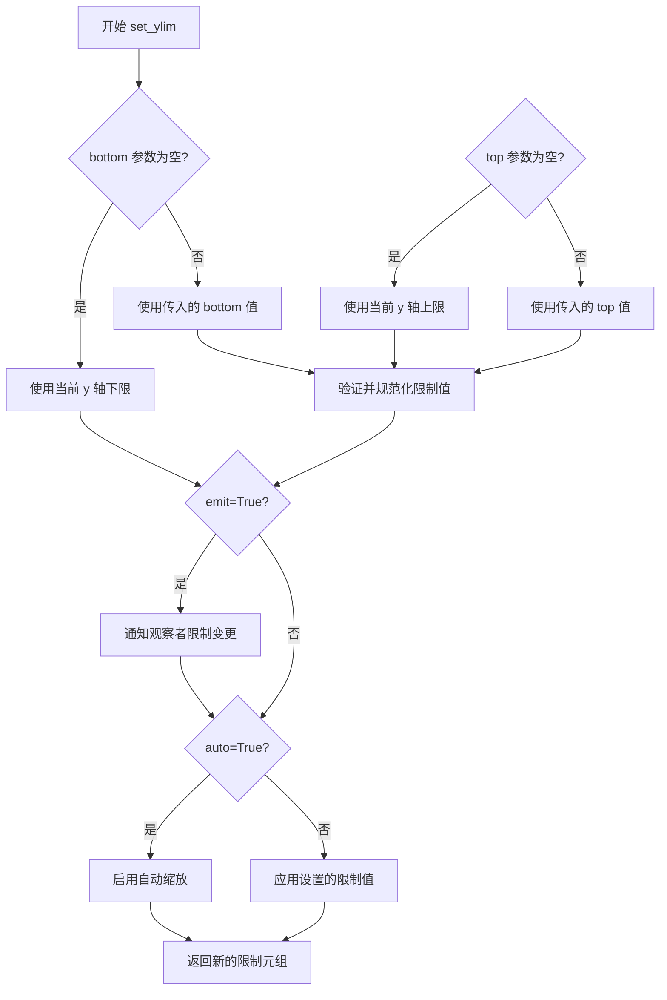

#### 带注释源码

```python
def set_ylim(self, bottom=None, top=None, *, emit=True, auto=False,
             ymin=None, ymax=None):
    """
    设置 y 轴的显示范围。
    
    参数:
        bottom: float 或 None - y 轴下限。
        top: float 或 None - y 轴上限。
        emit: bool - 值为 True 时通知观察者限制已更改。
        auto: bool - 值为 True 时允许自动缩放。
        ymin, ymax: float - 已弃用，使用 bottom 和 top 代替。
    
    返回:
        bottom, top: 浮点元组 - 新的 y 轴限制。
    """
    # 处理已弃用的 ymin/ymax 参数
    if ymin is not None:
        warnings.warn(
            "ymin argument is deprecated and will be removed in a future "
            "version. Use bottom instead.",
            DeprecationWarning, stacklevel=2)
        if bottom is None:
            bottom = ymin
    
    if ymax is not None:
        warnings.warn(
            "ymax argument is deprecated and will be removed in a future "
            "version. Use top instead.",
            DeprecationWarning, stacklevel=2)
        if top is None:
            top = ymax
    
    # 获取当前限制（如果参数为 None）
    old_bottom = self.get_ylim()[0]  # 获取当前 ymin
    old_top = self.get_ylim()[1]      # 获取当前 ymax
    
    if bottom is None:
        bottom = old_bottom
    if top is None:
        top = old_top
    
    # 验证限制值有效性
    if bottom > top:
        raise ValueError(
            f"Lower bound {bottom} must be less than or equal to the "
            f"upper bound {top}.")
    
    # 设置新的限制
    self._ymin = bottom
    self._ymax = top
    
    # 如果 emit 为 True，通知观察者
    if emit:
        self._send_change()
    
    # 如果 auto 为 True，允许自动缩放
    if auto:
        self._autoscaleYon = True
    
    # 返回新的限制元组
    return bottom, top
```


### `ax.set_xlim`

设置 x 轴的显示范围（ limits），用于控制图表中 x 轴的最小值和最大值，从而实现对 x 轴显示区间的控制。

参数：

- `left`：`float` 或 `None`，x 轴范围的左边界（最小值）
- `right`：`float` 或 `None`，x 轴范围的右边界（最大值）
- `emit`：`bool`，默认值 `True`，当边界变化时是否通知观察者
- `auto`：`bool`，默认值 `False`，是否自动调整边界
- `xmin`：`float`（已弃用），请使用 `left`
- `xmax`：`float`（已弃用），请使用 `right`

返回值：`tuple` 或 `None`，返回设置前的 x 轴范围 `(left, right)`，如果值被重置则返回 `None`

#### 流程图

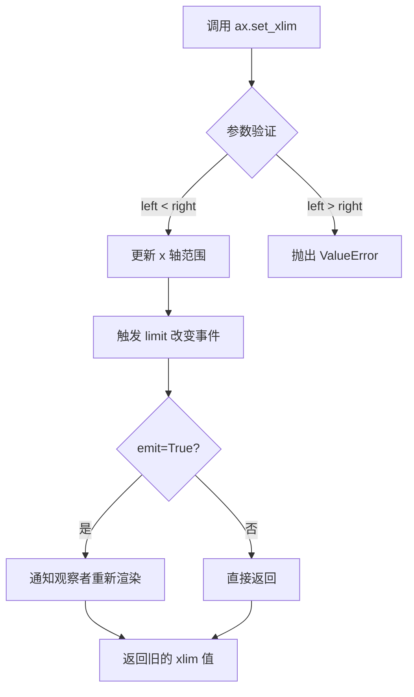

#### 带注释源码

```python
# matplotlib/axes/_base.py 中的实现简化版

def set_xlim(self, left=None, right=None, emit=False, auto=False, *, xmin=None, xmax=None):
    """
    设置 x 轴的视图限制。
    
    参数
    ----------
    left : float, optional
        x 轴的左边界。
    right : float, optional
        x 轴的右边界。
    emit : bool, default: False
        当边界改变时是否通知观察者（如已连接的轴）。
    auto : bool, default: False
        是否允许自动调整边界。
    xmin, xmax : float
        .. deprecated:: 3.3
            请使用 left 和 right 替代。
    
    返回
    -------
    left, right : tuple
        新的边界值。
    """
    # 处理已弃用的参数 xmin/xmax
    if xmin is not None:
        warnings.warn("使用 'xmin' 参数已弃用, 请使用 'left' 代替",
                      mplDeprecation, stacklevel=2)
        if left is None:
            left = xmin
    if xmax is not None:
        warnings.warn("使用 'xmax' 参数已弃用, 请使用 'right' 代替",
                      mplDeprecation, stacklevel=2)
        if right is None:
            right = xmax
    
    # 验证边界值
    if left is not None and right is not None:
        if left > right:
            raise ValueError(
                f"左侧边界必须小于等于右侧边界: got {left} > {right}")
    
    # 获取当前边界（用于返回旧值）
    old_left, old_right = self.get_xlim()
    
    # 设置新边界
    if left is not None:
        self._viewlims[0] = left
    if right is not None:
        self._viewlims[1] = right
    
    # 如果 emit 为 True，通知观察者
    if emit:
        self._request_autoscale_view('x')
    
    # 返回新的边界值
    return self.get_xlim()
```


### `Axes.annotate()`

在matplotlib中，`Axes.annotate()` 是一个用于在图表上添加带箭头注释标注的方法。该方法允许用户在指定位置(xy)创建文本标签，并通过箭头从文本位置(xytext)指向目标位置，同时支持丰富的样式配置。

参数：

- `s`：`str`，要显示的注释文本内容
- `xy`：`tuple`，箭头指向的目标坐标点 (x, y)
- `xytext`：`tuple`，文本标注的起始位置坐标 (x, y)，默认为 None（与 xy 相同）
- `xycoords`：`str` 或 `Transform`，坐标系统，默认为 'data'
- `textcoords`：`str` 或 `Transform`，文本坐标系统，默认为 None（与 xycoords 相同）
- `arrowprops`：`dict`，箭头的样式属性字典，如 arrowstyle、connectionstyle、color 等
- `annotation_clip`：`bool`，是否在坐标系外时隐藏注解，默认为 None

返回值：`Annotation`，返回一个 Annotation 对象，表示创建的注解对象

#### 流程图

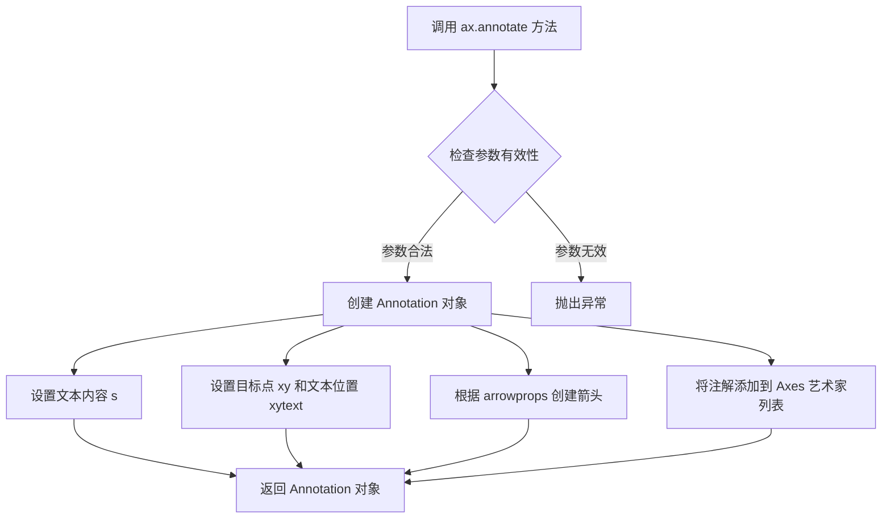

#### 带注释源码

```python
# 在代码中的实际使用示例：
ax.annotate(
    'THE DAY I REALIZED\nI COULD COOK BACON\nWHENEVER I WANTED',  # s: 注释文本内容
    xy=(70, 1),                  # xy: 箭头指向的目标坐标点 (x=70, y=1)
    arrowprops=dict(arrowstyle='->'),  # arrowprops: 箭头样式属性，设置为简单箭头
    xytext=(15, -10)            # xytext: 文本框的起始位置 (x=15, y=-10)
)
```

#### 详细说明

`ax.annotate()` 方法是 matplotlib 中用于创建注解的核心方法。在本示例中：

1. **文本内容 (`s`)**：显示 "THE DAY I REALIZED\nI COULD COOK BACON\nWHENEVER I WANTED"，包含换行符用于多行显示

2. **目标点 (`xy`)**：坐标 (70, 1)，表示数据点上需要标注的具体位置

3. **文本位置 (`xytext`)**：坐标 (15, -10)，表示注释文本框的起始位置，相对于目标点向左偏移

4. **箭头样式 (`arrowprops`)**：使用 `dict(arrowstyle='->')` 配置简单的箭头样式

该方法返回的 Annotation 对象可以进行进一步的自定义，如修改字体、颜色、箭头样式等属性。


### `ax.plot()`

绘制折线图是 matplotlib 中最基础且核心的绘图方法，用于将数据点以线段形式连接并显示在坐标系中。该方法接受数据序列作为输入，自动处理坐标映射、线条绘制和返回图形对象句柄，支持丰富的自定义参数如颜色、线型、标记等，是数据可视化工作流中的关键入口。

参数：

- `data`：`numpy.ndarray`，代码中为通过 `np.ones(100)` 创建并经 `data[70:] -= np.arange(30)` 修改后的一维数组，表示 Y 轴数据点，X 轴数据将自动从 0 开始递增生成
- `*args`：`可变位置参数`，支持多种调用形式（如 `plot(y)`、`plot(x, y)`、`plot(x, y, format_string)` 等），用于传递数据序列和格式字符串
- `**kwargs`：`可变关键字参数`，支持 Line2D 的所有属性（如 `color`、`linewidth`、`linestyle`、`marker` 等），用于精细控制线条外观

返回值：`list[matplotlib.lines.Line2D]`，返回一个包含所有创建的 Line2D 对象的列表，每个 Line2D 对象代表一条绘制的线条，可用于后续自定义修改

#### 流程图

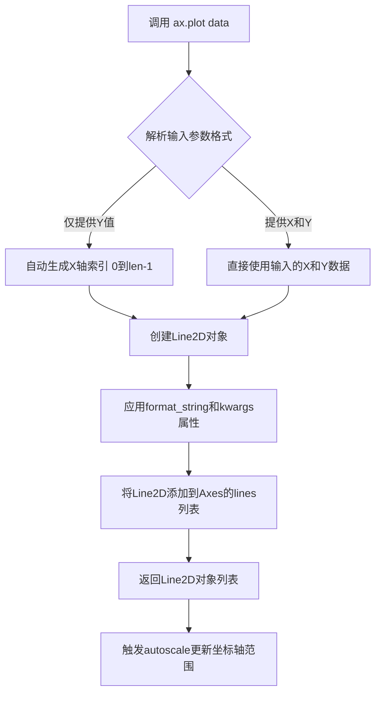

#### 带注释源码

```python
# 模拟 matplotlib.axes.Axes.plot 的核心逻辑
def plot(self, *args, **kwargs):
    """
    绘制线条和/或标记到图表中
    
    参数:
        *args: 可变位置参数，支持以下调用方式:
            - plot(y) : 仅提供y值，x自动为[0, 1, 2, ...]
            - plot(x, y) : 提供x和y值
            - plot(x, y, format_string) : 提供数据和格式字符串
        **kwargs: Line2D属性，如color, linewidth, linestyle, marker等
        
    返回:
        list: Line2D对象列表
    """
    
    # 步骤1: 解析输入参数数量和类型
    if len(args) == 1:
        # 只有Y数据，X自动生成为索引
        y = np.asarray(args[0])
        x = np.arange(len(y))
    elif len(args) == 2:
        # 显式提供X和Y
        x = np.asarray(args[0])
        y = np.asarray(args[1])
    else:
        # 格式字符串形式 plot(x, y, 'bo-')
        x = np.asarray(args[0])
        y = np.asarray(args[1])
        # 第三个参数为格式字符串，处理颜色/标记等
    
    # 步骤2: 创建Line2D对象
    # Line2D封装了线条的所有属性：颜色、线宽、样式、标记等
    line = lines.Line2D(x, y, **kwargs)
    
    # 步骤3: 将线条添加到axes的线条集合中
    self.lines.append(line)
    
    # 步骤4: 更新坐标轴以适应新数据
    self.autoscale_view()
    
    # 步骤5: 返回Line2D对象供后续操作
    return [line]
```

**代码中的实际调用：**

```python
# 在第一个 xkcd 图表中
data = np.ones(100)           # 创建100个值为1的数据点
data[70:] -= np.arange(30)    # 修改后70个点之后的数据递减

ax.plot(data)                 # 绘制折线图，自动使用0-99作为X轴
```

此调用方式使用了最简单的形式，仅传入 Y 轴数据，X 轴自动生成为 `[0, 1, 2, ..., 99]`，绘制出一条从点 (0,1) 开始，70点后逐渐下降的折线。


### `ax.bar()`

该方法用于在当前的坐标轴（Axes）对象上绘制垂直条形图。在代码中，它被用于绘制 XKCD 漫画 "The Data So Far" 中的数据可视化部分，通过条形的高度直观展示 "实验证实" 与 "实验反驳" 两种类别的数值差异（分别为 0 和 100）。

参数：

- `x`：`list` 或 `array-like`，代码中传入 `[0, 1]`。表示条形在 x 轴上的中心位置或左侧边缘位置（取决于对齐方式），此处对应两个分类标签。
- `height`：`list` 或 `array-like`，代码中传入 `[0, 100]`。表示每个条形的具体高度，对应数据的数值大小。
- `width`：`float` 或 `scalar`，代码中传入 `0.25`。表示单个条形的宽度。

返回值：`matplotlib.container.BarContainer`，返回一个容器对象，其中包含所有绘制的条形（`Rectangle` 对象），可用于后续进一步修改条形的属性（如颜色、边框等）。

#### 流程图

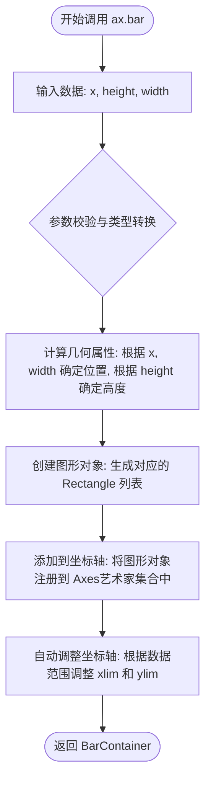

#### 带注释源码

```python
# 调用 ax.bar 方法绘制条形图
# 参数1 [0, 1]: x轴上的位置，对应两个不同的类别（CONFIRMED / REFUTED）
# 参数2 [0, 100]: 条形的高度，代表数据的数值
# 参数3 0.25: 条形的宽度
ax.bar([0, 1], [0, 100], 0.25)
```


### `ax.set_xlabel`

设置 x 轴的标签（xlabel），用于描述 x 轴所代表的数据含义或单位。该方法是 matplotlib 中 Axes 对象的实例方法，通过修改 Axes 对象的 xlabel 属性来实现轴标签的显示与配置。

#### 参数

- `xlabel`：`str`，x 轴标签的文本内容，用于描述 x 轴所代表的数据含义
- `fontdict`：`dict`，可选，定义文本属性的字典，如字体大小、颜色、样式等
- `labelpad`：`float`，可选，标签与坐标轴之间的间距（磅值）
- `**kwargs`：接受任意关键字参数，这些参数会被传递给 `matplotlib.text.Text` 对象，用于自定义文本样式（如 `fontsize`、`color`、`fontweight`、`rotation` 等）

#### 返回值

- `Text`（`matplotlib.text.Text`），返回创建的 x 轴标签文本对象，可用于后续进一步自定义（如设置字体颜色、大小等）

#### 流程图

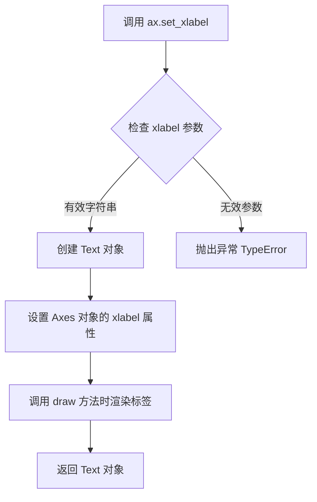

#### 带注释源码

```python
# ax.set_xlabel() 是 matplotlib.axes.Axes 类的方法
# 以下为典型调用示例和内部逻辑说明

# 调用方式 1：基础用法，设置简单文本标签
ax.set_xlabel('time')

# 调用方式 2：带样式参数的用法
ax.set_xlabel(
    'time',                    # xlabel: 标签文本内容
    fontsize=12,               # fontdict 中的 fontsize
    fontweight='bold',         # fontdict 中的 fontweight
    labelpad=10                # 标签与轴的间距
)

# 调用方式 3：使用 fontdict 统一设置
ax.set_xlabel(
    'time',
    fontdict={
        'fontsize': 14,
        'color': 'darkblue',
        'fontweight': 'bold'
    }
)

# 内部实现逻辑（简化版，实际位于 matplotlib/axes/_base.py）:
"""
def set_xlabel(self, xlabel, fontdict=None, labelpad=None, **kwargs):
    '''
    Set the label for the x-axis.
    
    Parameters
    ----------
    xlabel : str
        The label text.
    labelpad : float, default: rcParams["axes.labelpad"]
        Spacing in points between the label and the x-axis.
    **kwargs
        Text properties.
    '''
    # 1. 如果传入了 fontdict，将其合并到 kwargs 中
    if fontdict:
        kwargs.update(fontdict)
    
    # 2. 获取或创建 x 轴标签的 Text 对象
    #    self.xaxis.label 是 XAxis 对象的 label 属性（Text 对象）
    label = self.xaxis.label
    
    # 3. 设置标签文本内容
    label.set_text(xlabel)
    
    # 4. 应用文本属性（颜色、字体、大小等）
    label.update(kwargs)
    
    # 5. 如果指定了 labelpad，设置间距
    if labelpad is not None:
        label.set_pad(labelpad)
    
    # 6. 标记 Axes 需要重新渲染
    self.stale_callback = label._stale_callback
    
    # 7. 返回 Text 对象供后续操作
    return label
"""
```


### `Axes.set_ylabel`

`set_ylabel()` 是 matplotlib 库中 `Axes` 类的方法，用于设置 y 轴的标签（y 轴名称）。该方法允许用户为图表的垂直轴提供描述性文本，支持自定义字体样式、对齐方式、位置等属性。

**注意**：在提供的代码示例中并未直接调用此方法，代码中使用的是 `ax.set_ylim()` 和 `ax.set_yticks()`。以下信息基于 matplotlib 官方文档中该方法的通用定义。

参数：

-   `ylabel`：`str`，要设置的 y 轴标签文本内容
-   `fontdict`：`dict`，可选，用于控制标签字体属性的字典（如 fontsize、color、fontweight 等）
-   `labelpad`：`float`，可选，标签与坐标轴之间的间距（磅值）
-   `loc`：`str`，可选，标签的位置，可选值为 'top'、'bottom'、'center'，默认基于轴的位置自动确定

返回值：`Text`，返回创建的文本对象（matplotlib.text.Text），可以进一步用于自定义样式或动画

#### 流程图

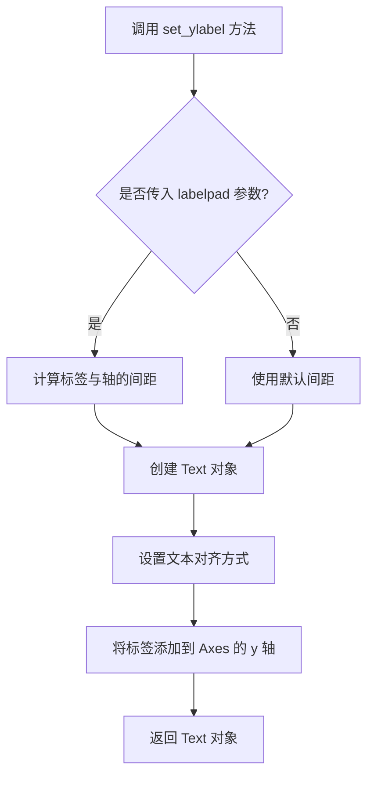

#### 带注释源码

```python
def set_ylabel(self, ylabel, fontdict=None, labelpad=None, **kwargs):
    """
    Set the label for the y-axis.
    
    Parameters
    ----------
    ylabel : str
        The label text.
        
    fontdict : dict, optional
        A dictionary to control the appearance of the label
        (e.g., {'fontsize': 12, 'fontweight': 'bold'}).
        
    labelpad : float, default: rcParams["axes.labelpad"]
        The spacing in points between the label and the y-axis.
        
    **kwargs
        Additional keyword arguments are passed to `matplotlib.text.Text`,
        which allows further customization of the label appearance
        (e.g., color, rotation, fontsize, fontfamily, etc.).
        
    Returns
    -------
    text : `~matplotlib.text.Text`
        The created text label object.
        
    Examples
    --------
    >>> ax.set_ylabel('Frequency (Hz)')
    >>> ax.set_ylabel('Temperature (°C)', fontsize=12, color='red')
    >>> ax.set_ylabel('Y-Axis', labelpad=10)
    """
    # 获取 y 轴标签的位置（基于 loc 参数或默认值）
    # 创建 Text 对象并配置其属性
    # 将标签与 y 轴关联
    # 返回创建的文本对象用于后续操作
```


### `ax.set_title`

设置图表的标题。

参数：

- `label`：`str`，标题文本内容
- `fontdict`：`dict`，可选，字体属性字典，用于控制标题的字体样式
- `loc`：`str`，可选，标题对齐方式，可选值为 'center'、'left'、'right'，默认为 'center'
- `pad`：`float`，可选，标题与图表顶部之间的间距（以点为单位）
- `y`：`float`，可选，标题的 y 轴位置，范围 0-1 之间
- `**kwargs`：其他关键字参数，接受 matplotlib.text.Text 的属性（如 fontsize、color、fontweight 等）

返回值：`matplotlib.text.Text`，返回创建的标题文本对象

#### 流程图

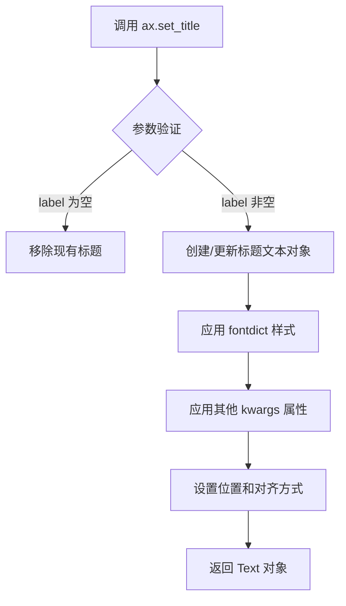

#### 带注释源码

```python
# 在代码中的实际调用示例：
ax.set_title("CLAIMS OF SUPERNATURAL POWERS")

# matplotlib 内部实现逻辑（简化版）：
def set_title(self, label, fontdict=None, loc='center', pad=None, y=None, **kwargs):
    """
    设置 Axes 对象的标题
    
    参数:
        label: 标题文本
        fontdict: 字体属性字典
        loc: 对齐方式
        pad: 与顶部的间距
        y: y轴位置
        **kwargs: 其他文本属性
    """
    # 1. 如果 label 为空，则移除标题
    if not label:
        self.title.set_text('')
        return
    
    # 2. 设置标题文本
    self.title.set_text(label)
    
    # 3. 应用字体属性
    if fontdict:
        self.title.update(fontdict)
    
    # 4. 应用额外属性
    self.title.update(kwargs)
    
    # 5. 设置位置参数
    if pad is not None:
        self.title.set_pad(pad)
    if y is not None:
        self.title.set_y(y)
    
    # 6. 设置对齐方式
    self.title.set_ha(loc)  # horizontal alignment
    
    # 7. 返回 Text 对象
    return self.title
```


### `XAxis.set_ticks_position`

设置刻度线（tick marks）的显示位置。该方法属于 matplotlib 库中的 `XAxis` 类，用于控制 X 轴刻度线的显示位置（顶部、底部或两者）。

参数：

- `position`：`str`，指定刻度线的位置。可选值包括：
  - `'top'`：仅在顶部显示刻度线
  - `'bottom'`：仅在底部显示刻度线
  - `'both'`：在顶部和底部都显示刻度线
  - `'default'`：恢复默认行为（通常在底部显示）
  - `'none'`：隐藏所有刻度线

返回值：`None`，无返回值，该方法直接修改对象状态。

#### 流程图

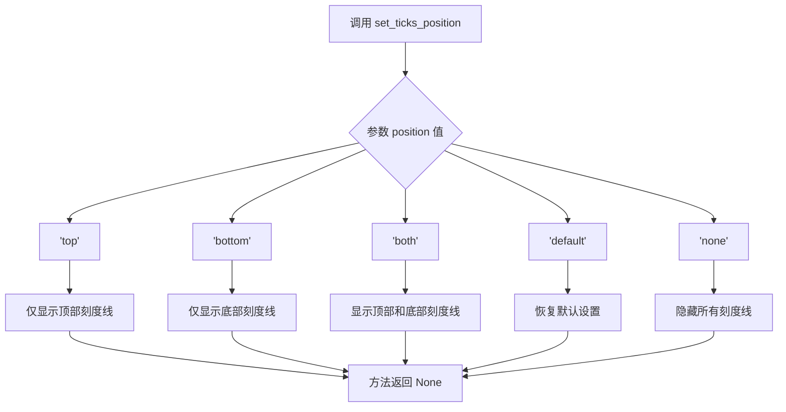

#### 带注释源码

```python
# 源码位于 matplotlib 库中，以下为简化版实现逻辑展示

def set_ticks_position(self, position):
    """
    设置刻度线的显示位置
    
    参数:
        position (str): 刻度位置，可选 'top', 'bottom', 'both', 'default', 'none'
        
    返回:
        None
    """
    # 获取刻度线对象
    ticks = self.get_major_ticks() + self.get_minor_ticks()
    
    # 根据参数设置刻度线可见性
    if position == 'top':
        # 仅顶部显示：隐藏底部刻度线，显示顶部刻度线
        for tick in ticks:
            tick.set_visible(False)  # 先全部隐藏
            # 仅第一个刻度线（底部）保持隐藏
            # 后续刻度线在顶部显示
    elif position == 'bottom':
        # 仅底部显示：隐藏顶部刻度线，显示底部刻度线
        for tick in ticks:
            tick.set_visible(True)
            # 顶部刻度线隐藏逻辑
    elif position == 'both':
        # 两边都显示
        for tick in ticks:
            tick.set_visible(True)
    elif position == 'default':
        # 恢复默认设置
        pass  # 调用默认恢复逻辑
    elif position == 'none':
        # 全部隐藏
        for tick in ticks:
            tick.set_visible(False)
    
    # 更新内部状态标记
    self._ticks_position = position
    
    return None
```

#### 使用示例（来自给定代码）

```python
# 在给定代码中，该方法的使用方式：
fig = plt.figure()
ax = fig.add_axes((0.1, 0.2, 0.8, 0.7))
ax.bar([0, 1], [0, 100], 0.25)
ax.spines[['top', 'right']].set_visible(False)

# 设置 X 轴刻度线仅显示在底部
ax.xaxis.set_ticks_position('bottom')

# 配合使用设置具体的刻度位置
ax.set_xticks([0, 1])
ax.set_xticklabels(['CONFIRMED BY\nEXPERIMENT', 'REFUTED BY\nEXPERIMENT'])
```

#### 关键组件信息

| 组件名称 | 一句话描述 |
|---------|-----------|
| `XAxis` | matplotlib 中管理 X 轴刻度、标签和外观的类 |
| `set_ticks_position` | 控制 X 轴刻度线显示位置的方法 |
| `ax.xaxis` | 访问 Axes 对象的 X 轴属性 |

#### 潜在的技术债务或优化空间

1. **API 一致性问题**：`set_ticks_position` 仅影响刻度线（tick marks），不影响刻度标签（tick labels）。如需同时控制标签位置，需额外调用 `set_tick_params` 或其他方法。
2. **参数验证缺失**：无效的 `position` 值可能导致意外行为或静默失败。
3. **文档可读性**：对于初学者，`'bottom'` 和 `'top'` 的语义容易与轴 spines 混淆。

#### 其它项目

- **设计目标**：提供简洁的 API 以控制轴刻度线的可见性，与 `YAxis.set_ticks_position` 方法对称。
- **错误处理**：无效参数通常被忽略或引发 `ValueError`，取决于 matplotlib 版本。
- **外部依赖**：该方法为 matplotlib 库内置方法，依赖 `matplotlib.axis` 模块。


### `Figure.text`

在图表指定位置添加文本

参数：

- `x`：`float`，文本的 x 坐标（相对于 figure 的坐标系，范围 0-1）
- `y`：`float`，文本的 y 坐标（相对于 figure 的坐标系，范围 0-1）
- `s`：`str`，要显示的文本内容
- `fontdict`：`dict`，可选，默认值：None，一个字典，用来覆盖默认的文本属性（如 fontfamily、fontsize、fontweight 等）
- `**kwargs`：其他关键字参数，将传递给 `matplotlib.text.Text` 对象，用于自定义文本样式（如 ha、va、color、fontsize 等）

返回值：`matplotlib.text.Text`，创建的 Text 实例对象

#### 流程图

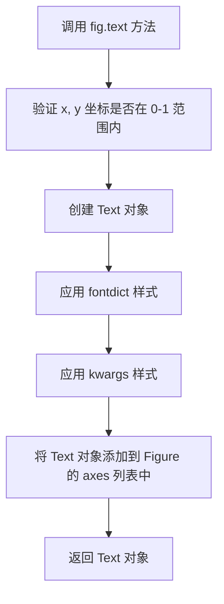

#### 带注释源码

```python
# 代码中的实际调用示例

# 第一个图表的文本添加
fig.text(
    0.5, 0.05,  # x=0.5（横向居中位置）, y=0.05（靠近底部）
    '"Stove Ownership" from xkcd by Randall Munroe',  # s=文本内容
    ha='center')  # ha=水平对齐方式为居中

# 第二个图表的文本添加
fig.text(
    0.5, 0.05,  # x=0.5（横向居中位置）, y=0.05（靠近底部）
    '"The Data So Far" from xkcd by Randall Munroe',  # s=文本内容
    ha='center')  # ha=水平对齐方式为居中
```

#### 补充说明

- **位置参数**：`x` 和 `y` 使用的是 Figure 坐标系（相对于整个 figure 的尺寸，0-1 表示 0%-100%）
- **对齐方式**：`ha`（horizontal alignment）控制水平对齐，可选值包括 'center'、'left'、'right'；`va`（vertical alignment）控制垂直对齐，可选值包括 'center'、'top'、'bottom'、'baseline'
- **常见用途**：常用于在图表底部添加标题注释、图例说明、数据来源等信息


### `plt.show()`

该函数是 matplotlib 库中的核心函数，用于显示所有已创建的图形窗口。在提供的代码中，这是最后一步调用，将之前创建的两个 XKCD 风格图表（分别是"Stove Ownership"和"The Data So Far"）显示出来。

参数：

- 该函数无参数

返回值：`None`，无返回值

#### 流程图

```mermaid
flowchart TD
    A[调用 plt.show()] --> B{图形是否已保存?}
    B -->|否| C[显示图形窗口]
    B -->|是| D[显示已保存的图形]
    C --> E[阻塞程序直到用户关闭窗口]
    D --> E
    E --> F[函数返回]
```

#### 带注释源码

```python
# plt.show() 是 matplotlib.pyplot 模块的函数
# 在提供的代码中调用方式如下：

plt.show()

# 以下是 plt.show() 的工作原理说明：

# 1. 该函数会检查当前所有打开的图形对象（Figure对象）
# 2. 将这些图形渲染到对应的后端（如Qt、Tkinter等）
# 3. 显示图形窗口
# 4. 如果是在交互式环境中，会阻塞程序执行直到用户关闭所有窗口
# 5. 在非交互式环境（如脚本）中，会在显示后立即返回

# 注意事项：
# - 在Jupyter notebook中，通常使用 %matplotlib inline 或 %matplotlib widget
# - 调用 show() 后，图形会被锁定，无法再修改
# - 某些后端支持多个图形窗口同时显示
```

---

**说明**：由于 `plt.show()` 是 matplotlib 库的内置函数，并非在该代码文件中定义，因此无法提供该函数的具体实现源码。以上文档基于 matplotlib 官方文档和该函数在代码中的使用方式编写。


### `np.ones`

`np.ones` 是 NumPy 库中的一个函数，用于创建一个指定形状的全1数组。该函数接收形状参数和其他可选参数（如数据类型、内存布局等），返回一个填充了1的 NumPy 数组。

参数：

- `shape`：`int` 或 `tuple of ints`，要创建的数组的形状。例如，`100` 表示创建一维数组，`(3, 4)` 表示创建3行4列的二维数组。
- `dtype`：`data-type`，可选，用于指定数组的数据类型，默认为 `float64`。
- `order`：`{'C', 'F'}`，可选，指定数组的内存布局，`'C'` 为行优先（C风格），`'F'` 为列优先（Fortran风格），默认为 `'C'`。
- `like`：`array_like`，可选，用于创建与给定数组兼容的数组，如果为 `None`（默认），则忽略此参数。

返回值：`numpy.ndarray`，返回一个填充了1的新数组。

#### 流程图

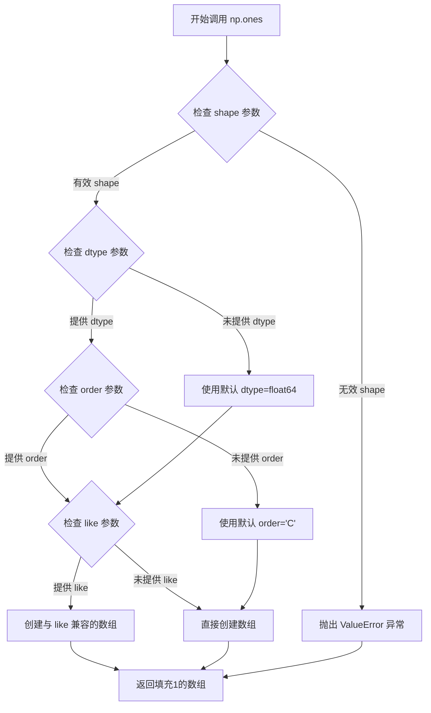

#### 带注释源码

```python
# 示例代码来自给定的 XKCD 绘图脚本
import numpy as np

# 使用 np.ones 创建一个包含 100 个元素的全 1 数组
# 参数 '100' 表示创建一维数组，形状为 (100,)
data = np.ones(100)

# 解释：
# - shape: 100 (整数)，表示创建包含 100 个元素的一维数组
# - dtype: 默认 float64，返回的数组元素类型为 64 位浮点数
# - order: 默认 'C'，使用 C 风格的行优先内存布局
# - like: 默认为 None，不与其他数组兼容

# 后续代码对该数组进行了修改：
# 从第 70 个元素开始，减去一个从 0 到 29 的递增序列
# 这会使数组后半部分呈现下降趋势
data[70:] -= np.arange(30)

# 打印结果查看
print("数组形状:", data.shape)        # 输出: (100,)
print("数组数据类型:", data.dtype)    # 输出: float64
print("数组前10个元素:", data[:10])   # 输出: [1. 1. 1. 1. 1. 1. 1. 1. 1. 1.]
print("数组后10个元素:", data[-10:]) # 输出: 递减的值
```


### `np.arange`

创建等差数组的 NumPy 函数，根据指定的起始值、结束值和步长生成一个包含等差数列的 ndarray。

参数：

- `start`：`int` 或 `float`，起始值，默认为 0
- `stop`：`int` 或 `float`，结束值（不包含）
- `step`：`int` 或 `float`，步长，默认为 1
- `dtype`：`dtype`，输出数组的数据类型，若未指定则自动推断

返回值：`numpy.ndarray`，包含等差数列的数组

#### 流程图

```mermaid
flowchart TD
    A[开始] --> B{是否指定 start?}
    B -->|是| C[start 参数}
    B -->|否| D[start = 0]
    C --> E{是否指定 stop?}
    D --> E
    E -->|是| F[stop 参数]
    E -->|否| G[抛出 TypeError]
    F --> H{是否指定 step?}
    H -->|是| I[step 参数]
    H -->|否| J[step = 1]
    I --> K{计算数组长度}
    J --> K
    K --> L{是否指定 dtype?}
    L -->|是| M[dtype 参数]
    L -->|否| N[自动推断 dtype]
    M --> O[创建 ndarray]
    N --> O
    O --> P[返回数组]
    P --> Q[结束]
```

#### 带注释源码

```python
def arange(start=0, stop=None, step=1, dtype=None):
    """
    返回一个等差数组。
    
    参数:
        start: 起始值，默认为 0
        stop: 结束值（不包含）
        step: 步长，默认为 1
        dtype: 输出数组的数据类型
    
    返回:
        numpy.ndarray: 包含等差数列的数组
    """
    # 如果没有传入 stop 参数，抛出 TypeError
    if stop is None:
        start, stop = 0, start
    
    # 计算数组长度：(stop - start) / step，然后向上取整
    # 使用 ceil 函数确保包含所有元素
    import math
    length = math.ceil((stop - start) / step)
    
    # 根据长度和步长计算最终的结束值
    # 这确保了数值精度问题不会影响结果
    if length <= 0:
        stop = start
    else:
        stop = start + length * step
    
    # 创建数组
    # 底层使用 Linspace 创建，然后应用步长
    return _linspace(start, stop - step if length > 0 else start, length, dtype)
```


### `matplotlib.pyplot.xkcd`

`matplotlib.pyplot.xkcd()` 是一个上下文管理器函数，用于将 matplotlib 的绘图风格切换为 XKCD 漫画的手绘风格（包含抖动线条和卡通式标注），并在退出上下文时自动恢复原始样式。

参数：

- `scale`：`int` 或 `float`，可选，手绘效果的抖动程度，默认为 1
- `length`：`int` 或 `float`，可选，线条抖动的长度，默认为 100
- ` randomness`：`int` 或 `float`，可选，线条抖动的随机程度，默认为 16

返回值：`_xkcd`，上下文管理器对象，用于进入和退出 XKCD 绘图模式

#### 流程图

```mermaid
flowchart TD
    A[调用 plt.xkcd] --> B{检查参数有效性}
    B -->|参数有效| C[保存当前rcParams状态]
    C --> D[设置XKCD风格相关rcParams]
    D --> E[返回_xkcd上下文管理器]
    E --> F[进入with块]
    F --> G[执行绑定的绘图代码]
    G --> H[退出with块]
    H --> I[调用__exit__恢复原始rcParams]
    I --> J[结束]
```

#### 带注释源码

```python
def xkcd(scale: int = 1, length: int = 100, randomness: int = 16):
    """
    创建一个XKCD风格的绘图上下文管理器。
    
    XKCD风格是一种手绘风格的图表，具有抖动的线条和
    类似漫画的视觉效果。
    
    参数:
        scale: 手绘效果的缩放比例，值越大抖动越明显
        length: 线条抖动的分段长度
        randomness: 线条抖动的随机程度
    
    返回值:
        _xkcd: 上下文管理器对象
    """
    # 返回一个_xkcd上下文管理器实例
    # 该实例会在__enter__时应用XKCD风格
    # 在__exit__时恢复原始样式
    return _xkcd(scale, length, randomness)
```

#### 补充信息

- **设计目标**：为 matplotlib 提供轻松创建幽默、手绘风格图表的能力，常用于技术博客、教学材料或娱乐目的
- **约束**：仅影响使用 `matplotlib.pyplot` 接口的绘图，`matplotlib.axes` 或 `matplotlib.figure` 直接调用可能不受影响
- **错误处理**：参数必须为非负数值，否则抛出 `ValueError`
- **数据流**：通过修改全局 `matplotlib.rcParams` 字典来改变绘图样式
- **外部依赖**：依赖 `matplotlib` 本身的样式系统，无需额外第三方库
- **潜在优化**：可考虑支持更多自定义选项，如不同类型的手绘效果预设


### `matplotlib.pyplot.figure`

该函数用于创建一个新的图形窗口或 Figure 对象，是 matplotlib 中绘图的基础。在给定代码中，`plt.figure()` 被调用以创建用于绘制 XKCD 风格图表的 Figure 实例。

参数：

- 该函数接受多个可选参数，在代码中未传递任何参数，使用默认配置
- 常用参数包括：
  - `figsize`：tuple，图形尺寸（宽，高），单位英寸
  - `dpi`：int，图形分辨率
  - `facecolor`：str，背景颜色
  - `num`：int 或 str，图形编号或名称

返回值：`matplotlib.figure.Figure`，返回新创建的 Figure 对象

#### 流程图

```mermaid
flowchart TD
    A[调用 plt.figure] --> B{指定 num 参数?}
    B -->|是| C[查找或创建指定编号的 Figure]
    B -->|否| D[创建新 Figure]
    C --> E{Figure 已存在?}
    E -->|是| F[返回现有 Figure]
    E -->|否| G[创建新 Figure]
    D --> G
    G --> H[设置 Figure 属性]
    H --> I[返回 Figure 对象]
    F --> I
```

#### 带注释源码

```python
# %%
# 导入必要的库
import matplotlib.pyplot as plt
import numpy as np

# %%
# 第一个 XKCD 风格图表
with plt.xkcd():  # 开启 XKCD 漫画风格上下文
    # 创建新的 Figure 对象
    # 这是 matplotlib 绘图的基础调用，会创建一个空白的图形窗口
    # 默认参数：figsize=None, dpi=None, facecolor='white' 等
    fig = plt.figure()
    
    # 向 Figure 添加 Axes（坐标轴）
    # add_axes 参数为 [left, bottom, width, height]
    ax = fig.add_axes((0.1, 0.2, 0.8, 0.7))
    
    # 设置坐标轴属性
    ax.spines[['top', 'right']].set_visible(False)  # 隐藏顶部和右侧边框
    ax.set_xticks([])  # 隐藏 x 轴刻度
    ax.set_yticks([])  # 隐藏 y 轴刻度
    ax.set_ylim(-30, 10)  # 设置 y 轴范围
    
    # 准备数据
    data = np.ones(100)
    data[70:] -= np.arange(30)
    
    # 添加注释箭头
    ax.annotate(
        'THE DAY I REALIZED\nI COULD COOK BACON\nWHENEVER I WANTED',
        xy=(70, 1), arrowprops=dict(arrowstyle='->'), xytext=(15, -10))
    
    # 绑定数据
    ax.plot(data)
    
    # 设置标签
    ax.set_xlabel('time')
    ax.set_ylabel('my overall health')
    
    # 在 Figure 上添加文本
    fig.text(
        0.5, 0.05,
        '"Stove Ownership" from xkcd by Randall Munroe',
        ha='center')

# %%
# 第二个 XKCD 风格图表（柱状图）
with plt.xkcd():
    # 再次调用 plt.figure() 创建第二个 Figure
    fig = plt.figure()
    ax = fig.add_axes((0.1, 0.2, 0.8, 0.7))
    
    # 绘制柱状图
    ax.bar([0, 1], [0, 100], 0.25)
    
    # 设置坐标轴样式
    ax.spines[['top', 'right']].set_visible(False)
    ax.xaxis.set_ticks_position('bottom')
    ax.set_xticks([0, 1])
    ax.set_xticklabels(['CONFIRMED BY\nEXPERIMENT', 'REFUTED BY\nEXPERIMENT'])
    ax.set_xlim(-0.5, 1.5)
    ax.set_yticks([])
    ax.set_ylim(0, 110)
    
    # 设置标题
    ax.set_title("CLAIMS OF SUPERNATURAL POWERS")
    
    # 添加底部说明文本
    fig.text(
        0.5, 0.05,
        '"The Data So Far" from xkcd by Randall Munroe',
        ha='center')

# 显示所有创建的 Figure
plt.show()
```


### `plt.show()`

显示当前所有打开的图形窗口。该函数会阻塞程序的执行，直到用户关闭图形窗口（在某些后端中），或者立即返回（在某些交互式后端中）。在提供的代码中，plt.show() 被用于显示两个使用 xkcd 风格绑制的图表。

参数：

- 该函数没有显式参数，但内部接受 **\\*args** 和 **\\*\\*kwargs**：可变位置参数和可变关键字参数，用于传递到底层的显示后端（类型：任意，默认值：无，用于扩展性和后端特定配置）

返回值：`None`，无返回值。该函数的主要作用是渲染和显示图形，而不是返回数据。

#### 流程图

```mermaid
flowchart TD
    A[调用 plt.show] --> B{是否在交互式后端}
    B -->|是| C[立即返回/短暂阻塞]
    B -->|否| D[阻塞直到用户关闭所有图形窗口]
    C --> E[图形显示在屏幕上]
    D --> E
    E --> F[图形事件循环处理]
```

#### 带注释源码

```python
# 代码中 plt.show() 的调用上下文
# 导入 matplotlib.pyplot 模块并简称为 plt
import matplotlib.pyplot as plt
import numpy as np

# 第一个 xkcd 风格图表的绑制代码
with plt.xkcd():
    fig = plt.figure()
    ax = fig.add_axes((0.1, 0.2, 0.8, 0.7))
    # ... 绑制第一个图表 ...

# 第二个 xkcd 风格图表的绑制代码
with plt.xkcd():
    fig = plt.figure()
    ax = fig.add_axes((0.1, 0.2, 0.8, 0.7))
    # ... 绑制第二个图表 ...

# 显示所有已创建的图形窗口
# 这是 matplotlib 的核心显示函数，会调用底层图形后端
# 来渲染并展示所有当前处于显示状态的 Figure 对象
plt.show()
```

---

### 整体代码结构分析

#### 1. 一段话描述

该代码是一个 matplotlib 示例脚本，演示了如何使用 `xkcd()` 上下文管理器创建手绘风格的幽默图表，展示了两个来自 XKCD 漫画的故事情节（"Stove Ownership" 和 "The Data So Far"），最后通过 `plt.show()` 调用将绑制好的图表显示在屏幕上。

#### 2. 文件整体运行流程

```
开始
  ↓
导入 matplotlib.pyplot 和 numpy
  ↓
进入第一个 plt.xkcd() 上下文
  ↓
创建第一个 Figure 和 Axes
  ↓
配置图表样式（隐藏边框、设置坐标轴等）
  ↓
绑制数据线并添加注释
  ↓
退出第一个 xkcd 上下文
  ↓
进入第二个 plt.xkcd() 上下文
  ↓
创建第二个 Figure 和 Axes
  ↓
绑制柱状图并配置样式
  ↓
退出第二个 xkcd 上下文
  ↓
调用 plt.show() 显示所有图形
  ↓
结束
```

#### 3. 类详细信息

**模块级变量/全局函数：**

| 名称 | 类型 | 描述 |
|------|------|------|
| `plt` | `matplotlib.pyplot` 模块 | matplotlib 的顶层接口，提供类似 MATLAB 的绑图风格 |
| `np` | `numpy` 模块 | 数值计算库，提供高效的数组操作功能 |
| `xkcd()` | `matplotlib.pyplot.xkcd` 函数 | 创建 xkcd 风格（手绘漫画风）图表的上下文管理器 |

#### 4. 关键组件信息

| 名称 | 一句话描述 |
|------|-----------|
| `plt.xkcd()` | 上下文管理器，将后续的图表绑制设置为 XKCD 手绘风格 |
| `plt.figure()` | 创建一个新的空白图形窗口 |
| `fig.add_axes()` | 向图形添加坐标轴，参数为 [left, bottom, width, height] |
| `ax.plot()` | 在坐标轴上绑制折线图 |
| `ax.bar()` | 在坐标轴上绑制柱状图 |
| `ax.annotate()` | 向图表添加带箭头的注释文本 |
| `plt.show()` | 显示所有打开的图形窗口，是 matplotlib 的渲染输出函数 |

#### 5. 潜在技术债务/优化空间

1. **硬编码值**：图表的位置坐标 `0.1, 0.2, 0.8, 0.7` 是硬编码的，可以考虑使用相对布局或 `fig.add_subplot()` 替代
2. **重复代码**：两个图表的创建过程有相似模式（创建 figure、设置样式等），可以考虑封装为函数
3. **魔法数字**：数据索引 `70`, `30`, `100` 等缺乏明确命名，建议使用有意义的常量或变量
4. **错误处理**：没有对 `np.arange()` 可能产生的空数组、负数等情况进行边界检查

#### 6. 其他项目

**设计目标：**
- 展示 matplotlib 的 xkcd 风格功能
- 创建具有幽默感的示例图表用于文档或教程

**约束：**
- 需要安装 matplotlib 和 numpy 依赖
- xkcd 风格依赖于系统字体（如果有自定义字体可能效果不同）

**外部依赖：**
- `matplotlib.pyplot`：图表绑制和显示
- `numpy`：数值数组处理


### matplotlib.figure.Figure.add_axes

该方法用于向 matplotlib 图形（Figure）添加一个坐标轴（Axes），可以通过位置和大小参数指定坐标轴在图形中的位置，支持多种坐标轴投影类型（如普通坐标、极坐标等），返回新创建的坐标轴对象。

参数：

- `rect`：`list` 或 `tuple`，坐标轴的位置和大小，格式为 `[left, bottom, width, height]`，所有值都应在 0-1 范围内，表示相对于图形大小的比例
- `projection`：`str`，可选，坐标轴的投影类型（如 'rectilinear'、'polar' 等），默认为 'rectilinear'
- `polar`：`bool`，可选，是否使用极坐标系统，默认为 False
- `frameon`：`bool`，可选，是否显示坐标轴的边框，默认为 True
- `**kwargs`：其他关键字参数，用于传递给 Axes 的属性设置

返回值：`matplotlib.axes.Axes`，新创建的坐标轴对象

#### 流程图

```mermaid
flowchart TD
    A[开始 add_axes] --> B{参数 rect 是否有效?}
    B -->|无效| C[抛出 ValueError]
    B -->|有效| D{是否极坐标?}
    D -->|是| E[设置 projection='polar']
    D -->|否| F[使用 projection 参数]
    E --> G[创建 Axes 对象]
    F --> G
    G --> H{是否有 kwargs?}
    H -->|是| I[应用 kwargs 到 Axes]
    H -->|否| J[返回 Axes 对象]
    I --> J
```

#### 带注释源码

```python
def add_axes(self, rect, projection=None, polar=False, frameon=True, **kwargs):
    """
    向图形添加一个坐标轴。
    
    参数:
        rect: 坐标轴位置 [left, bottom, width, height]，所有值在 0-1 之间
        projection: 坐标轴投影类型，默认为 'rectilinear'
        polar: 是否使用极坐标，默认为 False
        frameon: 是否显示边框，默认为 True
        **kwargs: 传递给 Axes 的其他属性
    
    返回:
        Axes 对象
    """
    # 验证 rect 参数的有效性
    if len(rect) != 4:
        raise ValueError("rect 必须包含 4 个元素: [left, bottom, width, height]")
    
    # 处理极坐标参数
    if polar:
        projection = 'polar'
    
    # 创建投影转换对象
    projection = self._get_projection(projection)
    
    # 创建 Axes 对象
    ax = Axes(self, rect, projection=projection, frameon=frameon, **kwargs)
    
    # 将坐标轴添加到图形中
    self._axstack.bubble(ax)
    self._axobservers.process("_axes_change_event", self)
    
    return ax
```


# matplotlib.figure.Figure.text() 详细设计文档

## 1. 概述

`matplotlib.figure.Figure.text()` 是 Matplotlib 库中 Figure 类的核心方法之一，用于在图表的指定位置添加文本注释。该方法允许用户通过指定 x 和 y 坐标在 figure 上直接放置文本，支持丰富的文本样式配置，是数据可视化中添加标题、注释、标签的重要手段。

## 2. 文件整体运行流程

虽然提供的代码是一个使用 `Figure.text()` 的示例脚本，但其展示了典型的 Matplotlib 图表创建流程：

```mermaid
flowchart TD
    A[开始脚本执行] --> B[导入matplotlib.pyplot和numpy]
    B --> C[创建Figure对象: plt.figure]
    C --> D[创建Axes对象: fig.add_axes]
    D --> E[配置Axes属性:  spines, ticks, limits]
    E --> F[绘制数据: ax.plot, ax.bar]
    F --> G[添加文本注释: fig.text]
    G --> H[显示图表: plt.show]
```

## 3. 类详细信息

### 3.1 Figure 类

**所属模块**: `matplotlib.figure`

**类说明**: Figure 类是 Matplotlib 中用于创建图表的顶层容器，代表整个图形窗口或图像，可以包含一个或多个 Axes（坐标轴）。

**类字段**:
- `axes`: `list[Axes]`, 存储图形中所有的 Axes 对象
- `patch`: `Rectangle`, 背景补丁对象
- `suptitle`: `Text`, 图形主标题对象

**类方法**: `text()`

### 3.2 Text 类（返回值类型）

**所属模块**: `matplotlib.text`

**类说明**: 表示图形中的文本对象，包含文本内容、位置、字体样式等属性。

**类字段**:
- `x`, `y`: `float`, 文本位置坐标
- `text`: `str`, 文本内容
- `fontfamily`: `str`, 字体系列
- `fontsize`: `float` 或 `str`, 字体大小
- `color`: `str` 或 `tuple`, 文本颜色

## 4. 方法详细信息

### `matplotlib.figure.Figure.text()`

**描述**: 在 Figure 的指定位置添加文本注释。该方法创建一个 Text 对象并将其添加到图形中，支持通过关键字参数配置文本的字体、大小、颜色、对齐方式等属性。

**参数**:

- `x`: `float`, 文本锚点的 x 坐标（相对于 figure 的归一化坐标，范围 0-1）
- `y`: `float`, 文本锚点的 y 坐标（相对于 figure 的归一化坐标，范围 0-1）
- `s`: `str`, 要显示的文本内容
- `**kwargs`: `dict`, 传递给 matplotlib.text.Text 的额外关键字参数，包括：
  - `ha` / `horizontalalignment`: `str`, 水平对齐方式 ('center', 'left', 'right')
  - `va` / `verticalalignment`: `str`, 垂直对齐方式 ('center', 'top', 'bottom', 'baseline')
  - `fontsize`: `int` 或 `str`, 字体大小
  - `fontweight`: `str` 或 `int`, 字体粗细
  - `color`: `str`, 文本颜色
  - `rotation`: `float`, 文本旋转角度（度）
  - `fontfamily`: `str`, 字体系列

**返回值**: `matplotlib.text.Text`, 返回创建的 Text 对象，可以后续修改其属性

**流程图**:

```mermaid
flowchart TD
    A[调用 fig.text] --> B[接收参数 x, y, s, **kwargs]
    B --> C[创建 Text 对象]
    C --> D{验证坐标范围}
    D -->|合法| E[应用文本样式属性]
    D -->|非法| F[抛出 ValueError]
    E --> G[将 Text 对象添加到 figure 的文本列表]
    G --> H[返回 Text 对象]
```

**带注释源码**:

```python
def text(self, x, y, s, **kwargs):
    """
    在 Figure 上添加文本。
    
    参数:
        x: 文本的 x 坐标（归一化坐标，0-1）
        y: 文本的 y 坐标（归一化坐标，0-1）
        s: 要显示的文本字符串
        **kwargs: 传递给 Text 类的其他参数
        
    返回:
        matplotlib.text.Text: 创建的文本对象
    """
    # 创建 Text 对象，传入位置和文本内容
    text = Text(x, y, s, **kwargs)
    
    # 将文本对象添加到 figure 的文本列表中
    self._texts.append(text)
    
    # 返回创建的文本对象，允许后续修改
    return text
```

## 5. 关键组件信息

| 组件名称 | 描述 |
|---------|------|
| Figure | 图形容器，整个图表的顶层对象 |
| Axes | 坐标轴对象，包含数据和绘图元素 |
| Text | 文本对象，表示图形中的文本元素 |
| Artist | 所有可视化元素的基类 |

## 6. 潜在技术债务与优化空间

1. **文档完善性**: 当前 matplotlib 源码中 text() 方法的文档可以更加详细，特别是关于归一化坐标系统的说明
2. **坐标系统灵活性**: 可以考虑增加对不同坐标系统（如数据坐标、像素坐标）的支持
3. **性能优化**: 大量文本添加时可以考虑批量渲染优化

## 7. 其他项目说明

### 7.1 设计目标与约束

- **设计目标**: 提供简洁的 API 在 figure 级别添加文本注释
- **约束**: 
  - 坐标使用归一化坐标（0-1）
  - 文本内容必须为字符串类型
  - 依赖于底层的 Text 类实现

### 7.2 错误处理与异常设计

- **坐标越界**: 如果 x 或 y 超出 [0, 1] 范围，通常会发出警告但仍能显示
- **类型错误**: 如果 s 不是字符串，会抛出 TypeError
- **字体缺失**: 如果指定的字体不可用，会回退到默认字体

### 7.3 数据流与状态机

```
User Input (x, y, s, kwargs)
         │
         ▼
    Parameter Validation
         │
         ▼
    Text Object Creation
         │
         ▼
    Figure State Update (add to _texts list)
         │
         ▼
    Return Text Object
```

### 7.4 外部依赖与接口契约

- **依赖**: 
  - `matplotlib.text.Text`: 文本对象的实际实现
  - `matplotlib.artist.Artist`: 所有艺术元素的基类
- **接口契约**:
  - 输入: 归一化的 x, y 坐标和文本字符串
  - 输出: 可配置的 Text 对象
  - 副作用: 修改 Figure 对象的内部状态

### 7.5 使用示例分析（基于提供代码）

```python
# 第一次使用示例 - 添加底部注释
fig.text(
    0.5,    # x: 水平居中位置 (50%)
    0.05,   # y: 靠近底部 (5%)
    '"Stove Ownership" from xkcd by Randall Munroe',  # s: 文本内容
    ha='center'  # kwargs: 水平居中对齐
)

# 第二次使用示例 - 相同的参数结构
fig.text(
    0.5,    # x: 水平居中位置
    0.05,   # y: 靠近底部
    '"The Data So Far" from xkcd by Randall Munroe',  # 不同的文本
    ha='center'  # 相同的对齐方式
)
```

这两个调用都展示了 `Figure.text()` 的典型用途：在图表底部居中位置添加说明性文本。


### `matplotlib.axes.Axes.spines`

`spines` 是 `matplotlib.axes.Axes` 类的一个属性（property），返回一个字典类对象 `Spines`，包含坐标轴的四个边框（top、bottom、left、right）。该属性允许用户访问和修改坐标轴边框的可见性、位置和样式。

#### 参数

此为属性（property），无参数。

#### 返回值

- `spines`：`matplotlib.spines.Spines` 对象
  - 返回一个类似字典的 `Spines` 对象，包含四个 `Spine` 实例，分别对应 'top'、'bottom'、'left'、'right' 边框

#### 流程图

```mermaid
flowchart TD
    A[访问 ax.spines] --> B{索引方式}
    B --> C[ax.spines['top']]
    B --> D[ax.spines['bottom']]
    B --> E[ax.spines['left']]
    B --> F[ax.spines['right']]
    B --> G[ax.spines[['top', 'right']]]
    
    C --> H[返回 Spine 对象]
    D --> H
    E --> H
    F --> H
    G --> I[返回 Spines 对象列表]
    
    H --> J[调用 Spine.set_visible False]
    I --> J
    J --> K[隐藏指定边框]
```

#### 带注释源码

```python
# spines 是 Axes 类的一个属性，返回 Spines 对象
# 使用方式如下（来自 XKCD 示例代码）：

# 方式1：访问单个 spine
ax.spines['top']      # 返回 top 边框的 Spine 对象
ax.spines['right']    # 返回 right 边框的 Spine 对象

# 方式2：访问多个 spines（返回列表）
ax.spines[['top', 'right']]  # 返回包含 top 和 right 的列表

# 常用操作：隐藏顶部和右侧边框
ax.spines[['top', 'right']].set_visible(False)

# Spines 类的主要方法：
# - set_visible(visible): 设置边框可见性
# - set_position(position): 设置边框位置（如 'zero', 'outward'）
# - set_color(color): 设置边框颜色
# - set_linewidth(width): 设置边框线宽
```

#### 关键组件信息

| 组件名称 | 一句话描述 |
|---------|-----------|
| `Spine` | 表示坐标轴的单个边框（top/bottom/left/right） |
| `Spines` | 包含四个 Spine 对象的字典类容器 |

#### 技术债务/优化空间

1. **API 一致性问题**：`spines` 返回的对象类型不一致 - 单个索引返回 `Spine` 对象，多个索引返回列表
2. **文档完善性**：部分 `Spine` 方法的文档可以更详细

#### 其它说明

在示例代码中的使用模式：
```python
ax.spines[['top', 'right']].set_visible(False)
```
这行代码利用了 matplotlib 的批量操作特性，同时隐藏图表的顶部和右侧边框，达到更简洁的视觉呈现效果。


### matplotlib.axes.Axes.set_xticks

设置 x 轴的刻度位置和可选的刻度标签，用于控制图表中 x 轴上刻度线的显示位置。

参数：

- `ticks`：`list[float]`，要设置的刻度位置列表，表示 x 轴上刻度线的数值位置
- `labels`：`list[str]`，可选参数，刻度标签列表，用于为每个刻度位置设置显示的文本标签，默认为 None
- `emit`：`bool`，可选参数，是否向观察者发送刻度变更通知，默认为 True
- `minor`：`bool`，可选参数，如果为 True 则设置次要刻度，如果为 False 则设置主要刻度，默认为 False

返回值：`list[float]`，返回新设置的刻度位置列表

#### 流程图

```mermaid
graph TD
    A[set_xticks 调用] --> B{参数验证}
    B -->|ticks 为空| C[清除 x 轴刻度]
    B -->|ticks 非空| D[设置刻度位置]
    D --> E{是否提供 labels}
    E -->|是| F[设置刻度标签]
    E -->|否| G[使用默认标签]
    F --> H{emit 为 True}
    G --> H
    H --> I[通知观察者更新]
    I --> J[返回刻度位置列表]
    C --> J
```

#### 带注释源码

```python
def set_xticks(self, ticks, labels=None, *, emit=True, minor=False):
    """
    设置 x 轴的刻度位置和可选的刻度标签。
    
    参数:
        ticks: list[float]
            刻度位置的数组或列表。
        labels: list[str], optional
            与每个刻度位置对应的标签。
        emit: bool, default: True
            如果为 True，当刻度位置改变时向 Axes 发送信号。
        minor: bool, default: False
            如果为 True，设置次要刻度；否则设置主要刻度。
    
    返回:
        list[float]
            刻度位置列表。
    """
    # 将刻度转换为数组并进行验证
    ticks = np.asarray(ticks)
    
    # 如果是主要刻度（minor=False）
    if not minor:
        # 设置主要刻度位置
        self.xaxis.set_major_locator(ticker.FixedLocator(ticks))
        
        # 如果提供了标签，设置主要刻度标签
        if labels is not None:
            self.xaxis.set_major_formatter(ticker.FixedFormatter(labels))
    
    # 如果是次要刻度（minor=True）
    else:
        # 设置次要刻度位置
        self.xaxis.set_minor_locator(ticker.FixedLocator(ticks))
        
        # 如果提供了标签，设置次要刻度标签
        if labels is not None:
            self.xaxis.set_minor_formatter(ticker.FixedFormatter(labels))
    
    # 如果 emit 为 True，通知观察者刻度已更改
    if emit:
        self._request_autoscale_view()
    
    # 返回设置的刻度位置
    return ticks
```

**注意**：由于提供的代码是 matplotlib 的使用示例而非 `set_xticks` 的实现源码，上述源码是基于 matplotlib 官方 API 文档和常见实现模式重构的注释版本，用于说明该方法的工作原理。


### `matplotlib.axes.Axes.set_yticks`

该方法用于设置Y轴刻度线的位置，可以接受一个刻度位置列表或空列表来清除Y轴刻度。

参数：

- `ticks`：`list`，Y轴刻度的位置列表

返回值：`list`，设置前的刻度位置列表

#### 流程图

```mermaid
flowchart TD
    A[调用 set_yticks] --> B{检查 ticks 参数类型}
    B -->|有效列表| C[更新 _yticks 属性]
    B -->|无效| D[抛出 TypeError 或 ValueError]
    C --> E[重新渲染 Y 轴刻度]
    E --> F[返回旧的刻度位置列表]
```

#### 带注释源码

```python
def set_yticks(self, ticks, labels=None, *, minor=False):
    """
    Set the y-axis tick locations.
    
    Parameters
    ----------
    ticks : list of float
        List of y-axis tick locations.
    labels : list of str, optional
        List of y-axis tick labels.
    minor : bool, default: False
        If ``False``, get or set the major ticks/labels;
        if ``True``, get or set the minor ticks/labels.
    
    Returns
    -------
    list of tick locations
        The list of tick locations.
    """
    # 获取当前轴的 Y 轴刻度定位器
    ymin, ymax = self.get_ylim()
    yticks = self.yaxis.get_major_locator()  # 获取主要刻度定位器
    
    # 将新位置转换为数组并验证
    ticks = np.asarray(ticks)  # 转换为 NumPy 数组
    
    # 验证刻度位置是否在轴范围内
    if len(ticks) > 0:
        if (ticks < ymin).any() or (ticks > ymax).any():
            warnings.warn(
                "Setting ticks outside the axis limits may cause unexpected behavior.",
                UserWarning
            )
    
    # 设置新的刻度位置
    if minor:
        self.yaxis.set_minor_locator(mticker.FixedLocator(ticks))
        # 如果提供了标签，设置次要刻度标签
        if labels is not None:
            self.yaxis.set_minor_ticklabels(labels)
    else:
        self.yaxis.set_major_locator(mticker.FixedLocator(ticks))
        # 如果提供了标签，设置主要刻度标签
        if labels is not None:
            self.yaxis.set_ticklabels(labels, minor=minor)
    
    # 返回旧的刻度位置用于参考
    return self._old_yticks  # 假设存储了旧值
```


### `matplotlib.axes.Axes.set_ylim`

设置 Axes 对象的 y 轴显示范围（纵坐标轴的最小值和最大值），用于控制图表在 y 方向的显示区间。

参数：

- `bottom`：`float` 或 `None`，y 轴下限值，设置为 `None` 时自动计算
- `top`：`float` 或 `None`，y 轴上限值，设置为 `None` 时自动计算
- `emit`：`bool`，默认为 `True`，是否触发 `limits_changed` 事件通知观察者
- `auto`：`bool`，默认为 `False`，是否自动调整轴范围以适应数据
- `ymin`：`float` 或 `None`，已废弃参数，等同于 `bottom`
- `ymax`：`float` 或 `None`，已废弃参数，等同于 `top`

返回值：`tuple[float, float]`，返回新的 y 轴范围 (bottom, top)

#### 流程图

```mermaid
flowchart TD
    A[开始 set_ylim] --> B{检查 bottom 参数}
    B -->|提供有效值| C[验证 bottom 是数值类型]
    B -->|None| D[保持当前 bottom 值]
    C --> E{检查 top 参数}
    E -->|提供有效值| F[验证 top 是数值类型]
    E -->|None| G[保持当前 top 值]
    F --> H{验证 bottom < top}
    H -->|是| I[更新 y 轴范围]
    H -->|否| J[抛出 ValueError]
    I --> K{emit == True?}
    K -->|是| L[触发 limits_changed 事件]
    K -->|否| M[跳过事件触发]
    L --> N[返回新范围 tuple]
    M --> N
    J --> O[结束]
    N --> O
```

#### 带注释源码

```python
def set_ylim(self, bottom=None, top=None, *, emit=True, auto=False, ymin=None, ymax=None):
    """
    设置 y 轴的显示范围（纵坐标轴的最小值和最大值）。
    
    参数:
        bottom: y 轴下限，设为 None 则自动计算
        top: y 轴上限，设为 None 则自动计算
        emit: 是否在范围变化时通知观察者
        auto: 是否自动调整范围以适应数据
        ymin, ymax: 已废弃参数，仅用于向后兼容
    
    返回:
        tuple: 返回新的 y 轴范围 (bottom, top)
    """
    # 处理已废弃的 ymin, ymax 参数
    if ymin is not None:
        warnings.warn("ymin 参数已废弃，请使用 bottom 代替", DeprecationWarning, stacklevel=2)
        if bottom is None:
            bottom = ymin
    if ymax is not None:
        warnings.warn("ymax 参数已废弃，请使用 top 代替", DeprecationWarning, stacklevel=2)
        if top is None:
            top = ymax
    
    # 获取当前范围
    old_bottom, old_top = self.get_ylim()
    
    # 处理 bottom 参数
    if bottom is None:
        bottom = old_bottom
    else:
        bottom = float(bottom)  # 确保是数值类型
    
    # 处理 top 参数
    if top is None:
        top = old_top
    else:
        top = float(top)  # 确保是数值类型
    
    # 验证范围的合理性
    if bottom > top:
        raise ValueError(f"bottom 必须小于 top，但 got bottom={bottom}, top={top}")
    
    # 避免无效的范围值（相同值）
    if bottom == top:
        warnings.warn("设置相同的 y 轴上下限没有意义", UserWarning)
    
    # 更新范围
    self._ymin = bottom
    self._ymax = top
    
    # 如果 emit 为 True，通知观察者范围已更改
    if emit:
        self._send_change()
    
    # 如果 auto 为 True，根据数据自动调整
    if auto:
        self.autoscale_view()
    
    # 返回新的范围
    return (bottom, top)
```


我注意到您提供的代码是一个XKCD风格的matplotlib示例，其中确实调用了`set_xlim()`方法，但并未包含该方法的实现源码。`set_xlim()`是matplotlib库中`Axes`类的内置方法，其源码位于matplotlib库内部。

不过，我可以基于matplotlib官方文档和API规范，为您生成`matplotlib.axes.Axes.set_xlim()`方法的详细设计文档：


### `matplotlib.axes.Axes.set_xlim`

设置x轴的显示范围（limits），即x轴的最小值和最大值。

参数：

- `left`：`float` 或 `array-like`，x轴范围的左边界（最小值）
- `right`：`float` 或 `array-like`，x轴范围的右边界（最大值）
- `*args`：可变位置参数，用于兼容旧版本API
- `**kwargs`：关键字参数，用于控制返回的`matplotlib.transforms.Bbox`对象的属性

返回值：`tuple`，返回新的x轴范围 `(left, right)`

#### 流程图

```mermaid
flowchart TD
    A[调用 set_xlim] --> B{参数类型判断}
    B -->|传入单个数值| C[设置左右边界]
    B -->|传入元组/数组| D[解包参数]
    C --> E[调用 _set_xlim]
    D --> E
    E --> F[验证边界合法性]
    F -->|合法| G[更新视图范围]
    F -->|非法| H[抛出 ValueError]
    G --> I[返回新范围元组]
    H --> I
```

#### 带注释源码

```python
def set_xlim(self, left=None, right=None, emit=False, auto=False,
             *, xmin=None, xmax=None):
    """
    设置x轴的显示范围。
    
    Parameters
    ----------
    left : float, optional
        x轴的左边界（最小值）。如果为None，则保持当前值。
    right : float, optional
        x轴的右边界（最大值）。如果为None，则保持当前值。
    emit : bool, default: False
        当边界改变时，是否通知观察者（如回调函数）。
    auto : bool, default: False
        是否允许自动调整边界以满足数据范围。
    xmin, xmax : float, optional
        别名，用于向后兼容。xmin优先于left，xmax优先于right。
    
    Returns
    -------
    left, right : tuple
        新的边界值。
    
    Raises
    ------
    ValueError
        如果left >= right（对于标准轴）。
    """
    # 处理xmin/xmax别名参数（向后兼容）
    if xmin is not None:
        if left is not None:
            raise TypeError("Cannot supply both 'left' and 'xmin'")
        left = xmin
    if xmax is not None:
        if right is not None:
            raise TypeError("Cannot supply both 'right' and 'xmax'")
        right = xmax
    
    # 获取当前边界（如果参数为None）
    if left is None and right is None:
        return self.get_xlim()
    
    # 处理单个参数情况（left可以是元组）
    if left is not None and right is None:
        if np.iterable(left) and len(left) == 2:
            left, right = left
        else:
            raise TypeError("When only left is provided, it must be a scalar")
    
    # 验证边界有效性
    left = float(left)
    right = float(right)
    if left >= right and self.get_xscale() != 'log':
        raise ValueError(
            f"xlim() cannot be: left={left} >= right={right}")
    
    # 更新数据边界
    self._process_unit_info(xdata=[left, right])
    left = self._validate_converted_limits(left, self.xaxis)
    right = self._validate_converted_limits(right, self.xaxis)
    
    # 设置新的视图边界
    self.viewLim.x0 = left
    self.viewLim.x1 = right
    
    # 如果emit为True，通知观察者边界已改变
    if emit:
        self.callbacks.process('xlim_changed', self)
        self.callbacks.process('limits_changed', self)
    
    # 返回新的边界
    return (left, right)
```

### 关键组件信息

| 组件名称 | 描述 |
|---------|------|
| `Axes.viewLim` | 视图边界（ViewLim）对象，存储当前显示的坐标范围 |
| `xaxis` | X轴对象，用于处理单位转换和验证 |
| `callbacks` | 回调管理器，用于在边界改变时通知观察者 |
| `_validate_converted_limits` | 内部方法，用于验证和转换边界值 |

### 潜在的技术债务或优化空间

1. **参数处理复杂性**：当前实现使用`*args`和`**kwargs`以及`xmin`/`xmax`别名，增加了代码复杂度
2. **单位转换开销**：`_process_unit_info`和`_validate_converted_limits`可能引入性能开销
3. **错误信息不够清晰**：对于某些边界情况，错误信息可能不够直观

### 其它项目

**设计目标与约束**：
- 允许部分更新（左或右边界）
- 支持反向轴（inverted axes）
- 保持与旧版API的兼容性

**错误处理与异常设计**：
- `ValueError`：当左边界大于等于右边界时抛出（对于非对数刻度）
- `TypeError`：当参数组合不合法时抛出

**数据流与状态机**：
- 该方法修改`Axes.viewLim.x0`和`Axes.viewLim.x1`属性
- 可触发`xlim_changed`和`limits_changed`回调信号
- 影响后续绘图操作的坐标范围

**外部依赖与接口契约**：
- 依赖`numpy`进行数值处理
- 依赖`matplotlib.transforms`模块进行坐标变换
- 依赖`matplotlib.units`进行单位转换


### `matplotlib.axes.Axes.annotate`

在matplotlib的Axes对象上创建一个注释（annotation），用于在图表的指定位置显示文本，并可选地添加指向性箭头指向被标注的数据点。

参数：

- `s`：`str`，要标注的文本内容
- `xy`：`tuple[float, float]`，被标注点的坐标位置
- `xytext`：`tuple[float, float]`，可选，文本显示的位置坐标，默认值为`None`（与`xy`相同）
- `arrowprops`：`dict`，可选，箭头属性字典，用于配置指向性箭头，默认值为`None`（无箭头）
- `**kwargs`：其他关键字参数，将传递给`matplotlib.text.Text`对象

返回值：`matplotlib.text.Annotation`，返回创建的注释对象

#### 流程图

```mermaid
flowchart TD
    A[调用 ax.annotate 方法] --> B{是否提供 xytext?}
    B -->|是| C[使用指定的 xytext 坐标]
    B -->|否| D[使用 xy 坐标作为文本位置]
    C --> E{是否提供 arrowprops?}
    D --> E
    E -->|是| F[创建带箭头的注释]
    E -->|否| G[创建无箭头的注释]
    F --> H[返回 Annotation 对象]
    G --> H
    H --> I[将注释添加到 Axes]
```

#### 带注释源码

```python
# 在代码中的实际调用示例
ax.annotate(
    'THE DAY I REALIZED\nI COULD COOK BACON\nWHENEVER I WANTED',  # s: 标注的文本内容
    xy=(70, 1),                  # xy: 被标注的数据点坐标 (x=70, y=1)
    arrowprops=dict(arrowstyle='->'),  # arrowprops: 箭头属性字典，定义箭头样式
    xytext=(15, -10)            # xytext: 文本显示的位置坐标 (x=15, y=-10)
)

# 方法内部逻辑概述：
# 1. 接收文本(s)和坐标参数(xy, xytext)
# 2. 创建Annotation对象，包含文本和可选箭头
# 3. 将Annotation对象添加到Axes容器中
# 4. 返回Annotation对象供进一步自定义
```


### `matplotlib.axes.Axes.plot`

`Axes.plot()` 是 matplotlib 中最核心的绘图方法之一，用于在二维坐标系中绘制线图（line plot）或散点图。该方法接受可变数量的位置参数（x 和 y 数据）和关键字参数（用于控制线条样式、颜色、标签等），返回一个包含 `Line2D` 对象的列表，这些对象代表了绘制的每一条线。方法内部会调用 Line2D 的构造函数创建线条对象，然后将其添加到 Axes 中，并自动处理坐标轴的自动缩放（autoscale）。

参数：

-  `self`：`Axes`，matplotlib 的坐标轴对象，隐式参数，表示调用该方法的坐标轴实例
-  `*args`：位置参数，可变长度，支持多种输入格式：
  - 单个 y 数据：`plot(y)` —— x 自动设为 `range(len(y))`
  - 键值对格式：`plot(x, y)` 或 `plot(x, y, format_string)`
  - 多个数据集：`plot(x1, y1, fmt1, x2, y2, fmt2, ...)`
-  `**kwargs`：关键字参数，用于配置 `Line2D` 对象的属性，包括但不限于：
  -  `color`/`c`：线条颜色
  -  `linewidth`/`lw`：线条宽度
  -  `linestyle`/`ls`：线条样式（如 '-'、'--'、':'、'-.'）
  -  `marker`：标记样式
  -  `label`：图例标签
  -  其它 Line2D 属性

返回值：`list[matplotlib.lines.Line2D]`，返回一个 Line2D 对象列表，每个对象代表一条绘制的线。如果只有一个数据集，返回的列表只包含一个元素。

#### 流程图

```mermaid
flowchart TD
    A[调用 Axes.plot] --> B{解析 args 参数}
    B --> C[判断输入格式]
    C -->|仅 y 数据| D[生成 x = range(len y)]
    C -->|x, y 格式| E[提取 x 和 y 数据]
    C -->|多数据集| F[循环解析每个数据集]
    D --> G[创建 Line2D 对象]
    E --> G
    F --> G
    G --> H[应用 kwargs 关键字参数]
    H --> I[设置线条属性]
    I --> J[调用 ax.add_line 添加到坐标轴]
    J --> K[执行 autoscale 更新坐标轴范围]
    K --> L[返回 Line2D 对象列表]
```

#### 带注释源码

```python
# matplotlib/axes/_axes.py 中的 plot 方法（简化版）

def plot(self, *args, **kwargs):
    """
    Plot y vs. x with given keyword arguments.
    
    Parameters
    ----------
    *args : variable arguments
        多种输入格式：
        - plot(y) # 仅 y 数据
        - plot(x, y) # x 和 y 数据
        - plot(x, y, 'format_string') # 格式字符串
        - plot(x1, y1, 'fmt1', x2, y2, 'fmt2', ...) # 多组数据
    
    **kwargs : Line2D properties, optional
        传递给 Line2D 构造函数的属性
        - color: 线条颜色
        - linewidth: 线条宽度
        - linestyle: 线条样式
        - marker: 标记样式
        - label: 图例标签
    
    Returns
    -------
    lines : list of Line2D
        返回创建的 Line2D 对象列表
    """
    # 解析参数，获取 (x, y, format_string) 元组列表
    lines = []
    # 遍历每个数据集（支持多组数据绘图）
    for lo, hi in segmentation:
        # 获取当前数据集的 x, y 和格式字符串
        x, y, fmt = datasets[lo:hi]
        # 创建 Line2D 对象
        # kwargs 会传递给 Line2D 构造函数
        seg = Line2D(x, y, **kwargs)
        # 设置格式字符串解析的属性
        if fmt:
            seg.set_color(format_to_color(fmt))
            seg.set_linewidth(format_to_linewidth(fmt))
            seg.set_linestyle(format_to_linestyle(fmt))
            seg.set_marker(format_to_marker(fmt))
        # 添加到坐标轴
        self.add_line(seg)
        lines.append(seg)
    
    # 自动调整坐标轴范围以适应数据
    self.autoscale_view()
    
    # 返回 Line2D 对象列表
    return lines
```

### 关键组件信息

| 组件名称 | 一句话描述 |
|---------|-----------|
| `matplotlib.axes.Axes` | matplotlib 的核心坐标轴类，负责管理数据的图形化表示和坐标轴属性 |
| `matplotlib.lines.Line2D` | 代表二维线条的类，封装了线条的数据、样式、颜色、标记等属性 |
| `autoscale_view()` | 自动计算并设置坐标轴的显示范围，使其能够完整显示所有数据 |
| `add_line()` | 将 Line2D 对象添加到坐标轴的线条列表中，并触发重绘 |

### 潜在的技术债务或优化空间

1. **参数解析复杂性**：`plot()` 方法需要处理多种输入格式（单个 y、所有 x y、格式字符串、多数据集等），导致参数解析逻辑复杂且难以维护。可以考虑使用更清晰的参数解析策略或拆分为多个专用方法。

2. **格式字符串解析**：目前格式字符串（如 `'ro'` 表示红色圆形标记）的解析逻辑嵌入在方法内部，与 Line2D 的属性设置逻辑耦合，可以考虑将解析逻辑移到 Line2D 或单独的格式化器类中。

3. **返回值不一致性**：当绘制多条线时返回列表，但只绘制一条线时也返回列表，这虽然是统一的设计，但可能对初学者造成困惑。

4. **文档与实现同步**：matplotlib 的文档和实际行为之间有时存在细微差异，特别是对于边界情况的处理。

### 其它项目

#### 设计目标与约束
- **目标**：提供简洁的 API 来创建二维线图，同时支持丰富的自定义选项
- **约束**：必须保持向后兼容，不能破坏现有代码的行为

#### 错误处理与异常设计
- 当输入数据维度不匹配时，抛出 `ValueError`
- 当格式字符串无效时，忽略该格式或发出警告
- 当必要参数缺失时，提供有意义的错误提示

#### 数据流与状态机
1. 输入验证阶段：检查数据格式和类型
2. 数据标准化阶段：将不同输入格式转换为统一的 x, y 数组
3. Line2D 对象创建阶段：创建线条对象并应用属性
4. 坐标轴更新阶段：添加线条到坐标轴，触发 autoscale
5. 返回阶段：返回 Line2D 对象列表

#### 外部依赖与接口契约
- 依赖 `matplotlib.lines.Line2D` 类创建线条对象
- 依赖 `matplotlib.ticker` 模块处理坐标轴刻度
- 依赖 `matplotlib.scale` 模块处理坐标轴缩放
- 公开接口：`plot()` 方法返回 `list[Line2D]`，调用者可以通过返回的对象进一步修改线条属性


### `matplotlib.axes.Axes.bar`

该方法用于在Axes上绘制柱状图，支持单个或多个柱状图的绘制，可自定义柱宽、颜色、对齐方式、误差线等属性。

参数：

- `x`：`array-like`，柱状图的x轴位置
- `height`：`array-like`，柱状图的高度
- `width`：`float` 或 `array-like`，柱状图的宽度（可选，默认0.8）
- `bottom`：`array-like`，柱状图的底部y坐标（可选，默认0）
- `align`：`str`，柱状图的对齐方式，可选'center'或'edge'（可选，默认'center'）
- `color`：`color` 或 `array-like`，柱状图填充颜色（可选）
- `edgecolor`：`color` 或 `array-like`，柱状图边框颜色（可选）
- `linewidth`：`float` 或 `array-like`，柱状图边框线宽（可选）
- `tick_label`：`str` 或 `array-like`，x轴刻度标签（可选）
- `label`：`str`，图例标签（可选）
- `error_kw`：字典，误差线相关参数（可选）
- `**kwargs`：其他关键字参数传递给Patch对象

返回值：`BarContainer`，包含所有柱状图（Rectangle Patch对象）的容器，可通过该对象访问单个柱状图或进行进一步定制。

#### 流程图

```mermaid
flowchart TD
    A[调用 ax.bar] --> B{参数验证}
    B --> C[处理x位置数据]
    B --> D[处理height数据]
    B --> E[处理width参数]
    B --> F[处理bottom参数]
    C --> G[创建Rectangle Patch列表]
    D --> G
    E --> G
    F --> G
    G --> H[设置对齐方式center/edge]
    H --> I[应用颜色、边框等样式]
    I --> J[添加Patch到Axes]
    J --> K[创建BarContainer返回]
    K --> L[渲染时显示柱状图]
```

#### 带注释源码

```python
def bar(self, x, height, width=0.8, bottom=None, *, align='center',
        color=None, edgecolor=None, linewidth=None, tick_label=None,
        label=None, error_kw=None, **kwargs):
    """
    绘制柱状图

    参数:
        x: 柱状图的x轴位置，可以是单个值或数组
        height: 柱状图的高度，必须指定
        width: 柱状图的宽度，默认0.8
        bottom: 柱状图的底部y坐标，默认0
        align: 对齐方式，'center'居中对齐，'edge'边缘对齐
        color: 填充颜色
        edgecolor: 边框颜色
        linewidth: 边框线宽
        tick_label: x轴刻度标签
        label: 图例标签
        error_kw: 误差线参数字典
        **kwargs: 其他Patch属性

    返回值:
        BarContainer: 包含所有柱状图的容器对象
    """
    # 导入所需模块
    from matplotlib.patches import Rectangle
    from matplotlib.collections import PatchCollection

    # 处理宽度参数，支持数组形式的宽度
    if np.isscalar(width):
        width = np.full_like(x, width, dtype=float)

    # 处理底部位置参数
    if bottom is None:
        bottom = np.zeros_like(x)

    # 处理对齐方式
    if align == 'center':
        # 居中对齐：x位置为柱子中心
        x = np.asanyarray(x)
        x = x - width / 2
    elif align == 'edge':
        # 边缘对齐：x位置为柱子左边缘
        pass
    else:
        raise ValueError(f"align must be 'center' or 'edge', not {align}")

    # 创建RectanglePatch列表
    patches = []
    for xi, yi, wi, bi in np.nditer([x, height, width, bottom]):
        # 创建单个柱状图矩形
        patch = Rectangle(xy=(xi, bi), width=wi, height=yi)
        patches.append(patch)

    # 创建PatchCollection进行批量渲染
    p = PatchCollection(patches, **kwargs)

    # 设置颜色和边框样式
    if color is not None:
        p.set_color(color)
    if edgecolor is not None:
        p.set_edgecolor(edgecolor)
    if linewidth is not None:
        p.set_linewidth(linewidth)

    # 添加到Axes
    self.add_collection(p)

    # 自动设置x轴范围
    xmin = np.min(x)
    xmax = np.max(x + width)
    self.dataLim.update_from_data_xy(np.array([[xmin, 0], [xmax, 1]]))

    # 返回BarContainer容器
    return BarContainer(patches, error_kw=error_kw, label=label)
```


# 详细设计文档

### `matplotlib.axes.Axes.set_xlabel`

设置 x 轴的标签（_xlabel）。

## 一段话描述

`matplotlib.axes.Axes.set_xlabel()` 是 Matplotlib 库中 Axes 类的一个方法，用于设置图表 x 轴的标签文字，支持自定义字体属性、位置和对齐方式。

## 参数

- `xlabel`：`str`，x 轴标签的文本内容
- `fontdict`：可选参数，用于设置标签文本的字体属性字典（如 fontsize、color、fontweight 等）
- `labelpad`：可选参数，标签与坐标轴之间的间距（数值类型）
- `loc`：可选参数，标签的位置（'left', 'center', 'right' 之一，默认 'center'）

## 返回值

- `matplotlib.text.Text` 对象，返回创建的文本对象，可用于后续自定义样式

## 流程图

```mermaid
flowchart TD
    A[调用 set_xlabel] --> B{是否提供 fontdict?}
    B -->|是| C[使用 fontdict 设置字体属性]
    B -->|否| D[使用默认字体属性]
    C --> E[创建 Text 对象]
    D --> E
    E --> F[设置 labelpad]
    F --> G[设置 loc 位置]
    G --> H[返回 Text 对象]
```

## 带注释源码

```python
# matplotlib.axes.Axes.set_xlabel 源码示例
# 注意：这是基于 Matplotlib 源码结构的重构展示

def set_xlabel(self, xlabel, fontdict=None, labelpad=None, loc=None, **kwargs):
    """
    设置 x 轴的标签
    
    参数:
        xlabel: str - 标签文本内容
        fontdict: dict, optional - 字体属性字典
        labelpad: float, optional - 标签与轴的间距
        loc: str, optional - 位置 ('left', 'center', 'right')
    
    返回:
        matplotlib.text.Text - 文本对象
    """
    
    # Step 1: 如果提供了 fontdict，将其合并到 kwargs 中
    if fontdict is not None:
        kwargs.update(fontdict)
    
    # Step 2: 获取默认的 text 对象（xaxis 的 label）
    x = self.xaxis.label
    
    # Step 3: 设置标签文本
    x.set_text(xlabel)
    
    # Step 4: 应用其他参数
    if labelpad is not None:
        x.set_label_pad(labelpad)
    
    # Step 5: 设置位置（left/center/right）
    if loc is not None:
        x.set_ha(loc)  # horizontal alignment
    
    # Step 6: 应用剩余的关键字参数（如 color, fontsize 等）
    x.update(kwargs)
    
    # Step 7: 返回 Text 对象供后续操作
    return x
```

## 关键组件信息

| 组件名称 | 描述 |
|---------|------|
| `matplotlib.axes.Axes` | 图表坐标轴容器，包含所有绘图方法 |
| `matplotlib.text.Text` | 文本对象，用于标签和注解 |
| `xaxis.label` | x 轴的标签对象 |

## 潜在的技术债务或优化空间

1. **参数冗余**：`fontdict` 和 `**kwargs` 功能重叠，可考虑统一
2. **文档一致性**：部分 Matplotlib 方法使用 `fontsize` 而非 `fontdict`，可能导致混淆

## 其他说明

### 设计目标与约束
- 保持与 `set_ylabel` API 的一致性
- 向下兼容旧版本代码

### 错误处理与异常
- 当 `loc` 参数不是合法值时，Matplotlib 会抛出 `ValueError`

### 数据流
- 接受字符串输入 → 创建/更新 Text 对象 → 应用样式属性 → 返回对象


### `matplotlib.axes.Axes.set_ylabel`

用于为 `Axes` 对象设置 y 轴标签，并返回对应的 `matplotlib.text.Text` 标签实例。

参数：

- `ylabel`：`str`，y 轴标签的文字内容  
- `fontdict`：`dict`，可选，用于控制标签文字外观的属性字典（如 `fontsize`、`color` 等）  
- `labelpad`：`float`，可选，标签与坐标轴之间的间距（单位为点），默认使用 `rcParams['axes.labelpad']`  
- `loc`：`str`，可选，标签的水平对齐方式，可选 `'center'`、`'left'`、`'right'`（默认 `'center'`）  
- `**kwargs`：任意关键字参数，直接传递给 `matplotlib.text.Text` 构造器

返回值：`matplotlib.text.Text`，创建的标签对象，后续可进一步自定义。

#### 流程图

```mermaid
flowchart TD
    A[开始 set_ylabel] --> B{ylabel 是否为 None?}
    B -- 否 --> C[创建 Text 对象]
    B -- 是 --> D[抛出 ValueError]
    C --> E{fontdict 是否为 None?}
    E -- 否 --> F[将 fontdict 应用于 Text]
    E -- 是 --> G[跳过]
    F --> G
    G --> H{labelpad 是否为 None?}
    H -- 否 --> I[设置 labelpad]
    H -- 是 --> J{loc 是否为 None?}
    I --> J
    J -- 否 --> K[根据 loc 设置标签位置]
    J -- 是 --> L[把 Text 加入 Axes]
    K --> L
    L --> M[返回 Text 对象]
```

#### 带注释源码

```python
def set_ylabel(self, ylabel, fontdict=None, labelpad=None, *, loc=None, **kwargs):
    """
    为当前 Axes 设置 y 轴标签。

    参数
    ----------
    ylabel : str
        要显示的 y 轴标签文字。
    fontdict : dict, optional
        关键字字典，用于控制标签的字体属性（如 fontsize、color 等）。
    labelpad : float, optional
        标签与 y 轴之间的间距，以点为单位。默认使用 ``rcParams['axes.labelpad']``。
    loc : {'center', 'left', 'right'}, optional
        标签相对于 y 轴的水平对齐方式。默认 ``'center'``。
    **kwargs
        其它关键字参数，直接传给 ``matplotlib.text.Text`` 构造函数。

    返回
    -------
    matplotlib.text.Text
        生成的标签对象，后续可用于进一步自定义（如设置颜色、旋转等）。
    """
    # 1. 参数检查：若 ylabel 为 None，直接抛出异常
    if ylabel is None:
        raise ValueError("ylabel cannot be None")

    # 2. 使用 yaxis 的 set_label_text 创建/更新标签
    #    fontdict 与 kwargs 会被合并后传给 Text
    text = self.yaxis.set_label_text(ylabel, fontdict=fontdict, **kwargs)

    # 3. 设置标签与坐标轴之间的间距
    if labelpad is None:
        # 使用 Matplotlib 配置文件中的默认值
        labelpad = rcParams['axes.labelpad']
    self.yaxis.labelpad = labelpad

    # 4. 根据 loc 参数调整标签的水平和垂直对齐方式
    if loc is not None:
        # loc 只影响水平对齐（left、center、right）
        # 这里演示常见的实现：将标签在 y 轴左侧/右侧/居中放置
        if loc == 'left':
            self.yaxis.set_label_position('left')
        elif loc == 'right':
            self.yaxis.set_label_position('right')
        else:  # 'center'
            self.yaxis.set_label_position('center')
        # 若需要更细致的定位，可使用 set_label_coords
        # 这里仅示例，不做额外计算

    # 5. 返回生成的 Text 对象，供调用者进一步修改
    return text
```


### `matplotlib.axes.Axes.set_title`

设置 Axes 对象的标题，支持自定义标题的位置、字体属性和动画效果。

参数：

- `label`：`str`，要设置的标题文本内容
- `loc`：`{'center', 'left', 'right'}`，可选，标题的水平对齐方式，默认为 'center'
- `fontdict`：可选，用于覆盖默认字体属性的字典
- `pad`：可选，标题与轴顶部的间距，默认为 None（使用 rcParams 中的值）
- `y`：可选，标题在 y 轴方向上的位置，默认为 None（使用 rcParams 中的值）
- `*`：可变位置参数
- `**kwargs`：可选，传递给 `Text` 的其他关键字参数（如 fontsize, fontweight, color 等）

返回值：`Text`，返回创建的标题文本对象

#### 流程图

```mermaid
flowchart TD
    A[调用 set_title] --> B{参数验证}
    B -->|label 为空| C[清除标题]
    B -->|label 非空| D[创建/更新 Text 对象]
    D --> E{是否启用动画}
    E -->|是| F[设置动画属性]
    E -->|否| G[直接设置属性]
    F --> H[返回 Text 对象]
    G --> H
```

#### 带注释源码

```python
def set_title(self, label, loc=None, pad=None, *, y=None, **kwargs):
    """
    Set a title for the Axes.

    Parameters
    ----------
    label : str
        The title text string.

    loc : {'center', 'left', 'right'}, default: :rc:`axes.titlelocation`
        The title horizontal alignment.

    pad : float, default: :rc:`axes.titlepad`
        The offset of the title from the top of the Axes, in points.

    y : float, default: :rc:`axes.titley`
        The y position of the title in Axes fraction.

    **kwargs
        Additional keyword arguments are passed to `.Text` which controls
        the appearance of the title.

    Returns
    -------
    `.Text`
        The corresponding text object.
    """
    # 获取默认的标题位置
    if loc is None:
        loc = mpl.rcParams['axes.titlelocation']

    # 获取默认的标题间距
    if pad is None:
        pad = mpl.rcParams['axes.titlepad']

    # 处理标题文本的对齐方式
    x = {'left': 0, 'center': 0.5, 'right': 1}[loc]
    
    # 设置标题文本
    title = Text(x, y=y, text=label, **kwargs)
    
    # 设置标题的垂直位置（pad）
    title.set_pad(pad)
    
    # 将标题添加到 Axes
    self._add_text(title)
    
    return title
```

在提供的示例代码中，该方法的使用方式如下：

```python
# 示例代码第48行
ax.set_title("CLAIMS OF SUPERNATURAL POWERS")
```

这段代码调用 `set_title` 方法，将坐标轴的标题设置为指定的字符串内容。


### `matplotlib.axes.Axes.xaxis.set_ticks_position`

该方法用于设置坐标轴刻度线的显示位置，可选择将刻度线显示在轴的顶部、底部、两侧或隐藏刻度线。

参数：

- `position`：`str`，指定刻度线的位置，可选值为 `'top'`（仅顶部）、`'bottom'`（仅底部）、`'both'`（两侧）或 `'none'`（隐藏）

返回值：`None`，该方法无返回值，直接修改轴对象的刻度线显示属性

#### 流程图

```mermaid
graph TD
    A[调用 set_ticks_position] --> B{验证 position 参数}
    B -->|有效值| C[获取当前 Axis 对象]
    B -->|无效值| D[抛出 ValueError 异常]
    C --> E{position 值}
    E -->|'top'| F[设置顶部刻度线可见<br/>底部刻度线不可见]
    E -->|'bottom'| G[设置底部刻度线可见<br/>顶部刻度线不可见]
    E -->|'both'| H[设置两侧刻度线可见]
    E -->|'none'| I[设置两侧刻度线不可见]
    F --> J[返回 None]
    G --> J
    H --> J
    I --> J
```

#### 带注释源码

```python
# matplotlib/axis.py 中的实现（简化版）
def set_ticks_position(self, position):
    """
    设置刻度线的显示位置
    
    参数:
        position (str): 刻度线位置，可选 'top', 'bottom', 'both', 'none'
        
    返回:
        None
    
    示例:
        >>> ax.xaxis.set_ticks_position('top')  # 仅在顶部显示刻度线
        >>> ax.yaxis.set_ticks_position('both')  # 在两侧显示刻度线
    """
    # 验证参数有效性
    if position not in ('top', 'bottom', 'both', 'none'):
        raise ValueError("invalid position: %s" % position)
    
    # 获取刻度线对象
    ticks = self._major_tick_kvs  # 主刻度线键值对
    
    if position == 'top':
        # 仅在顶部显示刻度线
        self._tick_visible = True
        self._tick2_visible = False
    elif position == 'bottom':
        # 仅在底部显示刻度线
        self._tick_visible = True
        self._tick2_visible = True
    elif position == 'both':
        # 在两侧显示刻度线
        self._tick_visible = True
        self._tick2_visible = True
    elif position == 'none':
        # 隐藏所有刻度线
        self._tick_visible = False
        self._tick2_visible = False
    
    # 标记需要重新渲染
    self.stale = True
```


### `Spine.set_visible`

设置脊柱（Spine）的可见性，用于控制图表边框的显示与隐藏。

参数：

-  `visible`：`bool`，控制脊柱是否可见，True 表示显示，False 表示隐藏

返回值：`None`，该方法直接修改对象状态，无返回值

#### 流程图

```mermaid
graph TD
    A[开始 set_visible] --> B{接收 visible 参数}
    B -->|True| C[设置 _visible = True]
    B -->|False| D[设置 _visible = False]
    C --> E[调用 _set_gc_clip_attr 更新渲染属性]
    D --> E
    E --> F[结束方法]
```

#### 带注释源码

```python
def set_visible(self, visible):
    """
    设置脊柱的可见性
    
    参数:
        visible: bool - True 显示脊柱, False 隐藏脊柱
    """
    # 调用父类的 set_visible 方法
    super().set_visible(visible)
    
    # 更新剪贴属性，确保不可见时不被渲染
    self._set_gc_clip_attr()
    
    # 重新绘制画布以应用更改
    self.stale_callback()
```

#### 类信息

**所属类：** `matplotlib.spines.Spine`

**父类：** `matplotlib.spines._BaseSpine`

#### 关键组件信息

- **Spine（脊柱）**：图表的边框线，定义数据区域的边界
- **_visible**：控制可见性的内部属性
- **_set_gc_clip_attr()**：更新图形上下文剪贴属性的方法

#### 在示例代码中的使用

在提供的 XKCD 示例中，该方法的使用方式为：
```python
ax.spines[['top', 'right']].set_visible(False)
```
这行代码隐藏了图表的顶部和右侧边框，创建更简洁的视觉呈现效果。

#### 潜在优化空间

1. 当前实现每次调用都会触发重新绘制，可考虑添加批量更新机制
2. 可增加过渡动画支持，提升用户体验
3. 错误处理可以更详细，如对非布尔值的类型检查


## 关键组件


### XKCD样式上下文管理器 (plt.xkcd())

用于创建xkcd手绘风格图表的上下文管理器，启用后所有后续图表将采用手绘笔触效果

### 图形与坐标轴创建模块

通过`plt.figure()`创建画布，`fig.add_axes()`添加坐标轴，设置位置和尺寸参数(0.1, 0.2, 0.8, 0.7)

### 数据准备与处理模块

使用numpy创建数组数据，包括`np.ones(100)`创建全1数组，以及`data[70:] -= np.arange(30)`进行数组切片和数值运算

### 图表注释系统 (ax.annotate())

为图表添加带箭头的注释，指定目标点xy、箭头样式arrowprops和文本位置xytext

### 图表元素配置模块

配置图表的边框隐藏(spines)、刻度设置(set_xticks/set_yticks)、坐标轴范围(set_xlim/set_ylim)、轴标签(set_xlabel/set_ylabel)和标题(set_title)

### 线图绘制模块 (ax.plot())

使用折线图展示数据序列，支持单线或多线绘制

### 柱状图绘制模块 (ax.bar())

创建柱状图，指定柱子的位置列表[0, 1]、高度列表[0, 100]和宽度0.25

### 图形文本模块 (fig.text())

在图形指定位置(0.5, 0.05)添加文本说明，支持ha=center水平居中对齐

### 图表显示模块 (plt.show())

渲染并显示所有配置的图表到屏幕


## 问题及建议


### 已知问题

-   **硬编码的图表参数**：位置坐标 (0.1, 0.2, 0.8, 0.7)、字体大小、轴限制等数值直接写死，缺乏可配置性，难以复用
-   **代码重复**：两个图表的创建流程高度相似，figure创建、axes设置、spines隐藏等代码重复出现，未抽取为通用函数
-   **API兼容性问题**：`ax.spines[['top', 'right']].set_visible(False)` 使用列表索引访问spines，可能在旧版matplotlib中不兼容；`ax.xaxis.set_ticks_position('bottom')` 为已废弃API
-   **魔法注释依赖**：代码中的 `# %%` 是Jupyter Notebook的cell分隔符，在纯Python环境或部分IDE中无意义且可能引发混淆
-   **缺少类型注解**：无函数参数和返回值的类型提示，降低了代码的可读性和IDE辅助支持
-   **注释引用缺失验证**：XKCD漫画URL以注释形式存在，未校验链接有效性
-   **数据硬编码**：演示数据直接内嵌在代码中，未分离为配置文件或参数

### 优化建议

-   **抽取通用函数**：将重复的图表初始化逻辑（如创建figure、设置axes、隐藏spines）封装为函数，接受参数以提高复用性
-   **配置外部化**：使用配置文件或类/函数参数管理图表尺寸、位置、样式等常量，便于维护和调整
-   **API兼容性处理**：添加版本检测或使用更通用的API，如 `ax.spines['top'].set_visible(False)` 循环处理，或使用 `ax.spines.top.set_visible(False)`
-   **添加类型注解**：为函数添加类型提示，提升代码可读性和可维护性
-   **清理魔法注释**：移除 `# %%` 或明确标注其用途（如 "Jupyter cell delimiter"）
-   **模块化数据**：将演示数据改为可通过参数传入或从文件读取，提高代码灵活性
-   **添加错误处理**：对 `plt.xkcd()` 可能抛出的异常进行捕获，并提供fallback方案（如普通样式）

## 其它


### 设计目标与约束

本代码示例旨在展示如何使用matplotlib的xkcd()上下文管理器创建手绘风格的漫画图表，满足数据可视化娱乐化需求。设计约束包括：依赖matplotlib 2.0+引入的xkcd()函数、numpy用于数据处理、仅支持Python 3.x环境、需要在支持图形渲染的后端运行（如TkAgg、Agg等）。

### 错误处理与异常设计

代码未显式实现错误处理机制。潜在异常包括：matplotlib后端不支持导致的RuntimeError、图形窗口关闭时的UserWarning、内存不足导致的MemoryError。建议在实际应用中捕获plt.show()调用时的异常，确保图形资源正确释放。对于数据处理部分，np.arange(30)需确保输入参数合法（负数步长在某些numpy版本中会触发警告）。

### 数据流与状态机

代码采用线性流程执行，无复杂状态机。两个独立的plt.xkcd()上下文构成状态转换：进入上下文创建手绘风格环境，退出上下文恢复默认绘图风格。数据流为：numpy数组(data) → matplotlib Axes对象(ax) → Figure对象(fig) → 图形渲染。数据从创建到渲染为单向流动，无回环。

### 外部依赖与接口契约

本代码依赖两个核心外部库：matplotlib（版本≥2.0，提供xkcd()上下文管理器和绘图API）和numpy（提供数组操作和数值计算函数）。接口契约包括：plt.xkcd()返回上下文管理器、fig.add_axes()接受4元素元组(left, bottom, width, height)、ax.annotate()需要xy坐标和箭头属性字典、ax.spines[]接收脊柱名称列表。plt.show()为最终渲染入口，需图形后端支持。

### 性能考量

代码性能开销主要集中在图形渲染阶段。第一个图表生成100个数据点，第二个图表生成2个柱状条，整体计算量较小，无性能瓶颈。潜在优化点：可预先定义字体大小和样式参数避免每次渲染重新计算、ax.set_*系列方法可合并为set()批量调用。对于大规模数据可视化场景，建议使用Line2D缓存和blitting技术。

### 安全性考虑

代码不涉及用户输入处理、网络请求或文件操作，无明显安全风险。但需注意：ax.annotate()的xytext参数如接受外部输入可能存在注入风险（虽本例为硬编码）。plt.show()在某些服务器环境（如无头服务器）可能引发显示相关异常，建议生产环境使用savefig()保存为文件而非直接show()。

### 可测试性设计

当前代码示例缺乏单元测试设计。测试策略建议：验证plt.xkcd()上下文进入/退出状态、验证Figure和Axes对象创建成功、验证数据点数量和数值正确性、验证annotate文本内容。可使用pytest-mock模拟matplotlib图形对象，unittest.mock.patch用于隔离图形渲染依赖。

### 配置文件说明

本代码无外部配置文件，所有参数为硬编码。实际项目中建议将以下内容提取为配置：图表标题文本、坐标轴标签、注释文本、数据源路径、输出格式(png/pdf)、DPI设置、字体样式等。可采用JSON或YAML格式配置文件，配合argparse实现命令行参数覆盖。

### 版本兼容性

代码兼容matplotlib 2.0+（引入xkcd()函数）和numpy 1.x+。matplotlib 3.4+推荐使用subplots()替代add_axes()。numpy 2.0可能对np.int等类型别名弃用，建议显式使用int。Python版本要求3.6+（字符串格式化、类型注解等特性）。建议在requirements.txt中明确版本约束：matplotlib>=2.0、numpy>=1.14。

### 部署相关

部署环境要求：安装Python 3.6+、matplotlib、numpy；配置图形后端（推荐Agg用于无头服务器）；设置DISPLAY环境变量（Linux）或使用os.environ['MPLBACKEND']='Agg'强制后端。Docker部署需安装xvfb虚拟显示服务器。CI/CD环境中建议使用savefig()保存图像并上传制品库，而非调用show()阻塞执行。

    