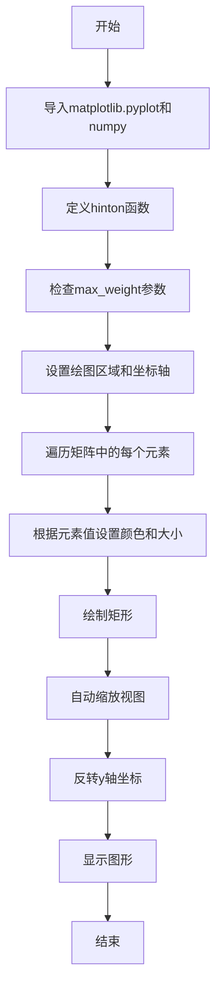
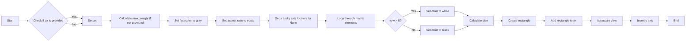

# `matplotlib\galleries\examples\specialty_plots\hinton_demo.py` 详细设计文档

This code generates a Hinton diagram, a visual representation of the values in a 2D array, typically a weight matrix from neural networks. It uses matplotlib for plotting and numpy for numerical operations.

## 整体流程



## 类结构

```
HintonDiagrams (模块)
├── hinton (函数)
```

## 全局变量及字段


### `matplotlib.pyplot`
    
Module for plotting and visualizing data.

类型：`module`
    


### `numpy`
    
Module for scientific computing with Python.

类型：`module`
    


### `max_weight`
    
Maximum weight value for scaling the size of the squares in the Hinton diagram.

类型：`float`
    


### `ax`
    
Axes object on which to draw the Hinton diagram.

类型：`matplotlib.axes._subplots.AxesSubplot`
    


### `color`
    
Color of the square in the Hinton diagram, either 'white' or 'black'.

类型：`str`
    


### `size`
    
Size of the square in the Hinton diagram, representing the magnitude of the weight value.

类型：`float`
    


### `rect`
    
Rectangle patch representing the square in the Hinton diagram.

类型：`matplotlib.patches.Rectangle`
    


### `matrix`
    
2D array representing the weight matrix to be visualized.

类型：`numpy.ndarray`
    


### `x`
    
X-coordinate of the position where the square will be drawn in the Hinton diagram.

类型：`int`
    


### `y`
    
Y-coordinate of the position where the square will be drawn in the Hinton diagram.

类型：`int`
    


### `w`
    
Weight value at the position (x, y) in the weight matrix.

类型：`float`
    


    

## 全局函数及方法


### hinton

Draw Hinton diagram for visualizing a weight matrix.

参数：

- `matrix`：`numpy.ndarray`，The weight matrix to be visualized.
- `max_weight`：`float`，The maximum weight value to normalize the size of the squares. If not provided, it is calculated as 2 to the power of the ceiling of the logarithm base 2 of the maximum absolute value in the matrix.
- `ax`：`matplotlib.axes.Axes`，The axes object to draw the Hinton diagram on. If not provided, the current axes are used.

返回值：`None`，No return value, the Hinton diagram is drawn on the provided axes.

#### 流程图



#### 带注释源码

```python
def hinton(matrix, max_weight=None, ax=None):
    ax = ax if ax is not None else plt.gca()

    if not max_weight:
        max_weight = 2 ** np.ceil(np.log2(np.abs(matrix).max()))

    ax.patch.set_facecolor('gray')
    ax.set_aspect('equal', 'box')
    ax.xaxis.set_major_locator(plt.NullLocator())
    ax.yaxis.set_major_locator(plt.NullLocator())

    for (x, y), w in np.ndenumerate(matrix):
        color = 'white' if w > 0 else 'black'
        size = np.sqrt(abs(w) / max_weight)
        rect = plt.Rectangle([x - size / 2, y - size / 2], size, size,
                             facecolor=color, edgecolor=color)
        ax.add_patch(rect)

    ax.autoscale_view()
    ax.invert_yaxis()
```


## 关键组件


### 张量索引

张量索引用于访问和操作多维数组（例如权重矩阵）中的特定元素。

### 惰性加载

惰性加载是一种延迟计算或初始化数据的方法，直到实际需要时才进行，以提高性能和资源利用率。

### 反量化支持

反量化支持允许在量化过程中恢复原始的浮点数值，以便进行精确的比较和分析。

### 量化策略

量化策略定义了如何将浮点数值转换为固定点表示，以及如何处理量化误差，以优化计算效率和存储空间。


## 问题及建议


### 已知问题

-   **全局变量和函数的复用性低**：代码中定义了`hinton`函数，但未在其他地方复用，这限制了代码的通用性和可维护性。
-   **错误处理缺失**：函数`hinton`没有处理可能的异常情况，例如输入矩阵不是二维数组或包含非数值类型。
-   **文档不足**：代码块中包含了函数的描述，但没有详细的文档说明，如参数的详细描述、返回值的意义等。

### 优化建议

-   **增加错误处理**：在`hinton`函数中增加错误处理，确保输入矩阵是有效的，并处理可能的异常情况。
-   **增加文档**：为函数添加详细的文档字符串，包括参数的详细描述、返回值的意义、函数的预期用途等。
-   **封装为类**：将`hinton`函数封装为一个类，这样可以将绘图逻辑与数据结构分离，提高代码的复用性和可维护性。
-   **参数化绘图**：允许用户自定义绘图参数，如颜色、大小、标记等，以提供更多的定制化选项。
-   **支持不同类型的矩阵**：除了二维数组，考虑支持其他类型的矩阵，如三维数组，以提供更广泛的可视化功能。


## 其它


### 设计目标与约束

- 设计目标：实现一个能够可视化2D数组（如权重矩阵）的Hinton图，以帮助理解矩阵中的数值分布。
- 约束条件：使用matplotlib和numpy库进行绘图和数值计算。

### 错误处理与异常设计

- 异常处理：确保在输入矩阵为空或非2D数组时抛出异常。
- 错误反馈：在发生错误时，提供清晰的错误信息，以便用户了解问题所在。

### 数据流与状态机

- 数据流：输入矩阵 -> 计算最大权重 -> 绘制Hinton图 -> 显示图形。
- 状态机：程序从函数调用开始，经过计算和绘图，最终结束。

### 外部依赖与接口契约

- 外部依赖：matplotlib和numpy库。
- 接口契约：函数`hinton`接受一个2D数组和一个可选的最大权重参数，返回一个Hinton图。


    