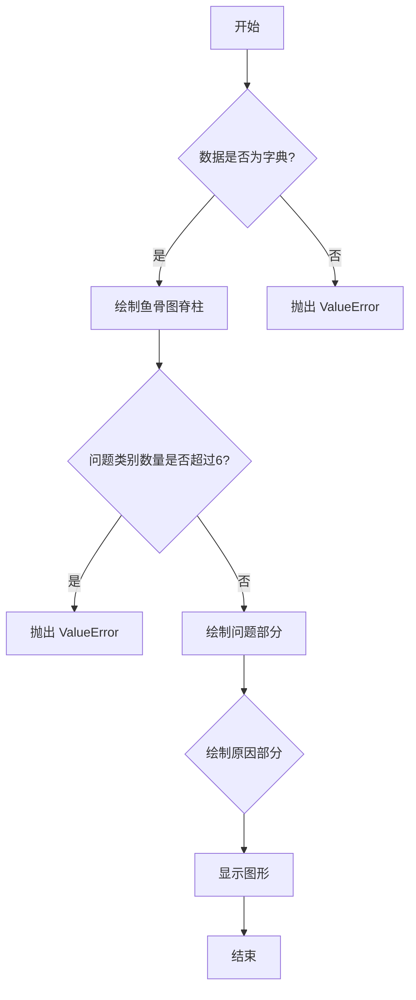
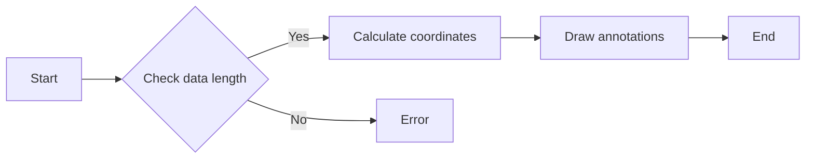
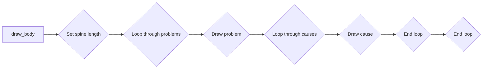
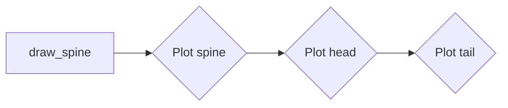
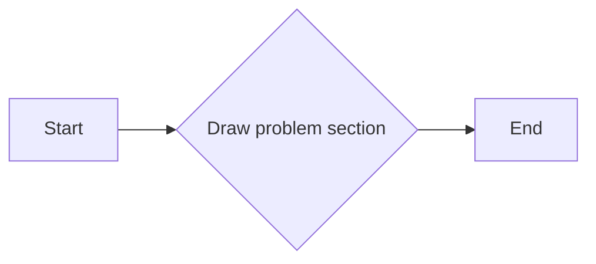
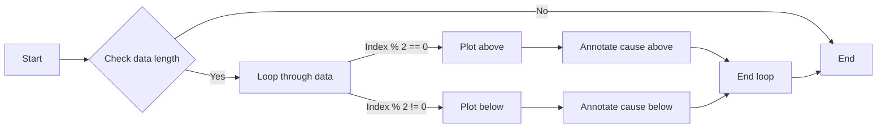
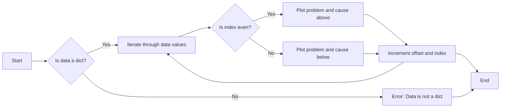
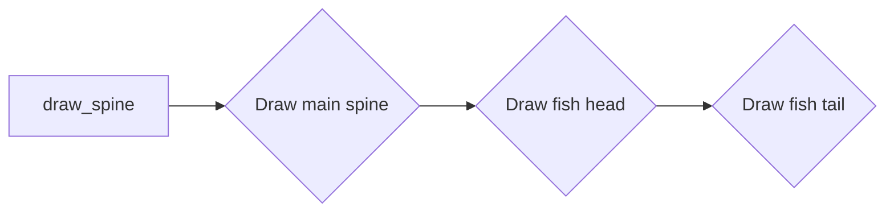

# `matplotlib\galleries\examples\specialty_plots\ishikawa_diagram.py` 详细设计文档

This code generates an Ishikawa diagram, also known as a fishbone diagram, to visually represent the causes and effects of a problem in a structured manner.

## 整体流程



## 类结构

```
IshikawaDiagram (主类)
├── matplotlib.pyplot (外部库)
├── matplotlib.patches (外部库)
└── math (外部库)
```

## 全局变量及字段


### `categories`
    
A dictionary containing problem categories and their associated causes.

类型：`dict`
    


### `IshikawaDiagram.fig`
    
The matplotlib figure object used for drawing the Ishikawa diagram.

类型：`Figure`
    


### `IshikawaDiagram.ax`
    
The matplotlib axes object used for drawing the Ishikawa diagram on the figure.

类型：`AxesSubplot`
    
    

## 全局函数及方法


### problems

Draw each problem section of the Ishikawa plot.

参数：

- `data`：`str`，The name of the problem category.
- `problem_x`：`float`，The `X` position of the problem arrows.
- `problem_y`：`float`，The `Y` position of the problem arrows (`Y` defaults to zero).
- `angle_x`：`float`，The angle of the problem annotations. They are always angled towards the tail of the plot.
- `angle_y`：`float`，The angle of the problem annotations. They are always angled towards the tail of the plot.

返回值：`None`

#### 流程图

```mermaid
graph LR
A[Start] --> B{Call problems()}
B --> C[End]
```

#### 带注释源码

```python
def problems(data: str,
             problem_x: float, problem_y: float,
             angle_x: float, angle_y: float):
    """
    Draw each problem section of the Ishikawa plot.

    Parameters
    ----------
    data : str
        The name of the problem category.
    problem_x, problem_y : float, optional
        The `X` and `Y` positions of the problem arrows (`Y` defaults to zero).
    angle_x, angle_y : float, optional
        The angle of the problem annotations. They are always angled towards
        the tail of the plot.

    Returns
    -------
    None.

    """
    ax.annotate(str.upper(data), xy=(problem_x, problem_y),
                xytext=(angle_x, angle_y),
                fontsize=10,
                color='white',
                weight='bold',
                xycoords='data',
                verticalalignment='center',
                horizontalalignment='center',
                textcoords='offset fontsize',
                arrowprops=dict(arrowstyle="->", facecolor='black'),
                bbox=dict(boxstyle='square',
                          facecolor='tab:blue',
                          pad=0.8))
```


### causes

This function places each cause to a position relative to the problems annotations in an Ishikawa diagram.

参数：

- `data`：`list`，The input data. IndexError is raised if more than six arguments are passed.
- `cause_x`：`float`，The `X` and `Y` position of the cause annotations.
- `cause_y`：`float`，The `X` and `Y` position of the cause annotations.
- `cause_xytext`：`tuple`，Adjust to set the distance of the cause text from the problem arrow in fontsize units.
- `top`：`bool`，default: True，Determines whether the next cause annotation will be plotted above or below the previous one.

返回值：`None`。

#### 流程图



#### 带注释源码

```python
def causes(data: list,
           cause_x: float, cause_y: float,
           cause_xytext=(-9, -0.3), top: bool = True):
    """
    Place each cause to a position relative to the problems
    annotations.

    Parameters
    ----------
    data : indexable object
        The input data. IndexError is
        raised if more than six arguments are passed.
    cause_x, cause_y : float
        The `X` and `Y` position of the cause annotations.
    cause_xytext : tuple, optional
        Adjust to set the distance of the cause text from the problem
        arrow in fontsize units.
    top : bool, default: True
        Determines whether the next cause annotation will be
        plotted above or below the previous one.

    Returns
    -------
    None.

    """
    for index, cause in enumerate(data):
        # [<x pos>, <y pos>]
        coords = [[0.02, 0],
                  [0.23, 0.5],
                  [-0.46, -1],
                  [0.69, 1.5],
                  [-0.92, -2],
                  [1.15, 2.5]]

        # First 'cause' annotation is placed in the middle of the 'problems' arrow
        # and each subsequent cause is plotted above or below it in succession.
        cause_x -= coords[index][0]
        cause_y += coords[index][1] if top else -coords[index][1]

        ax.annotate(cause, xy=(cause_x, cause_y),
                    horizontalalignment='center',
                    xytext=cause_xytext,
                    fontsize=9,
                    xycoords='data',
                    textcoords='offset fontsize',
                    arrowprops=dict(arrowstyle="->",
                                    facecolor='black'))
``` 


### draw_body

Draw each problem section in its correct place by changing the coordinates on each loop.

参数：

- data：`dict`，The input data (can be a dict of lists or tuples). ValueError is raised if more than six arguments are passed.

返回值：`None`。

#### 流程图



#### 带注释源码

```python
def draw_body(data: dict):
    # Set the length of the spine according to the number of 'problem' categories.
    length = (math.ceil(len(data) / 2)) - 1
    draw_spine(-2 - length, 2 + length)

    # Change the coordinates of the 'problem' annotations after each one is rendered.
    offset = 0
    prob_section = [1.55, 0.8]
    for index, problem in enumerate(data.values()):
        plot_above = index % 2 == 0
        cause_arrow_y = 1.7 if plot_above else -1.7
        y_prob_angle = 16 if plot_above else -16

        # Plot each section in pairs along the main spine.
        prob_arrow_x = prob_section[0] + length + offset
        cause_arrow_x = prob_section[1] + length + offset
        if not plot_above:
            offset -= 2.5
        if index > 5:
            raise ValueError(f'Maximum number of problems is 6, you have entered '
                             f'{len(data)}')

        problems(list(data.keys())[index], prob_arrow_x, 0, -12, y_prob_angle)
        causes(problem, cause_arrow_x, cause_arrow_y, top=plot_above)
``` 


### draw_spine

Draw the main spine, head, and tail of the Ishikawa diagram.

参数：

- xmin：`int`，The default position of the head of the spine's x-coordinate.
- xmax：`int`，The default position of the tail of the spine's x-coordinate.

返回值：`None`。

#### 流程图



#### 带注释源码

```python
def draw_spine(xmin: int, xmax: int):
    """
    Draw main spine, head and tail.

    Parameters
    ----------
    xmin : int
        The default position of the head of the spine's x-coordinate.
    xmax : int
        The default position of the tail of the spine's x-coordinate.

    Returns
    -------
    None.

    """
    # draw main spine
    ax.plot([xmin - 0.1, xmax], [0, 0], color='tab:blue', linewidth=2)
    # draw fish head
    ax.text(xmax + 0.1, - 0.05, 'PROBLEM', fontsize=10,
            weight='bold', color='white')
    semicircle = Wedge((xmax, 0), 1, 270, 90, fc='tab:blue')
    ax.add_patch(semicircle)
    # draw fish tail
    tail_pos = [[xmin - 0.8, 0.8], [xmin - 0.8, -0.8], [xmin, -0.01]]
    triangle = Polygon(tail_pos, fc='tab:blue')
    ax.add_patch(triangle)
```


### plt.show()

显示matplotlib图形。

参数：

- 无

返回值：无

#### 流程图

```mermaid
graph LR
A[plt.show()] --> B{显示图形}
B --> C[结束]
```

#### 带注释源码

```python
plt.show()
```


### problems

Draw each problem section of the Ishikawa plot.

参数：

- `data`：`str`，The name of the problem category.
- `problem_x`：`float`，The `X` position of the problem arrows.
- `problem_y`：`float`，The `Y` position of the problem arrows (`Y` defaults to zero).
- `angle_x`：`float`，The angle of the problem annotations. They are always angled towards the tail of the plot.
- `angle_y`：`float`，The angle of the problem annotations. They are always angled towards the tail of the plot.

返回值：`None`

#### 流程图



#### 带注释源码

```python
def problems(data: str,
             problem_x: float, problem_y: float,
             angle_x: float, angle_y: float):
    """
    Draw each problem section of the Ishikawa plot.

    Parameters
    ----------
    data : str
        The name of the problem category.
    problem_x, problem_y : float, optional
        The `X` and `Y` positions of the problem arrows (`Y` defaults to zero).
    angle_x, angle_y : float, optional
        The angle of the problem annotations. They are always angled towards
        the tail of the plot.

    Returns
    -------
    None.

    """
    ax.annotate(str.upper(data), xy=(problem_x, problem_y),
                xytext=(angle_x, angle_y),
                fontsize=10,
                color='white',
                weight='bold',
                xycoords='data',
                verticalalignment='center',
                horizontalalignment='center',
                textcoords='offset fontsize',
                arrowprops=dict(arrowstyle="->", facecolor='black'),
                bbox=dict(boxstyle='square',
                          facecolor='tab:blue',
                          pad=0.8))
```


### causes

The `causes` function is responsible for placing each cause annotation relative to the problem annotations in an Ishikawa diagram.

参数：

- `data`：`list`，The input data. IndexError is raised if more than six arguments are passed.
- `cause_x`：`float`，The `X` and `Y` position of the cause annotations.
- `cause_y`：`float`，The `X` and `Y` position of the cause annotations.
- `cause_xytext`：`tuple`，Adjust to set the distance of the cause text from the problem arrow in fontsize units.
- `top`：`bool`，default: True，Determines whether the next cause annotation will be plotted above or below the previous one.

返回值：`None`。

#### 流程图



#### 带注释源码

```python
def causes(data: list,
           cause_x: float, cause_y: float,
           cause_xytext=(-9, -0.3), top: bool = True):
    """
    Place each cause to a position relative to the problems
    annotations.

    Parameters
    ----------
    data : indexable object
        The input data. IndexError is
        raised if more than six arguments are passed.
    cause_x, cause_y : float
        The `X` and `Y` position of the cause annotations.
    cause_xytext : tuple, optional
        Adjust to set the distance of the cause text from the problem
        arrow in fontsize units.
    top : bool, default: True
        Determines whether the next cause annotation will be
        plotted above or below the previous one.

    Returns
    -------
    None.

    """
    for index, cause in enumerate(data):
        # [<x pos>, <y pos>]
        coords = [[0.02, 0],
                  [0.23, 0.5],
                  [-0.46, -1],
                  [0.69, 1.5],
                  [-0.92, -2],
                  [1.15, 2.5]]

        # First 'cause' annotation is placed in the middle of the 'problems' arrow
        # and each subsequent cause is plotted above or below it in succession.
        cause_x -= coords[index][0]
        cause_y += coords[index][1] if top else -coords[index][1]

        ax.annotate(cause, xy=(cause_x, cause_y),
                    horizontalalignment='center',
                    xytext=cause_xytext,
                    fontsize=9,
                    xycoords='data',
                    textcoords='offset fontsize',
                    arrowprops=dict(arrowstyle="->",
                                    facecolor='black'))
```


### draw_body

Draw each problem section in its correct place by changing the coordinates on each loop.

参数：

- `data`：`dict`，The input data (can be a dict of lists or tuples). ValueError is raised if more than six arguments are passed.

返回值：`None`。

#### 流程图



#### 带注释源码

```python
def draw_body(data: dict):
    """
    Place each problem section in its correct place by changing
    the coordinates on each loop.

    Parameters
    ----------
    data : dict
        The input data (can be a dict of lists or tuples). ValueError
        is raised if more than six arguments are passed.

    Returns
    -------
    None.

    """
    # Set the length of the spine according to the number of 'problem' categories.
    length = (math.ceil(len(data) / 2)) - 1
    draw_spine(-2 - length, 2 + length)

    # Change the coordinates of the 'problem' annotations after each one is rendered.
    offset = 0
    prob_section = [1.55, 0.8]
    for index, problem in enumerate(data.values()):
        plot_above = index % 2 == 0
        cause_arrow_y = 1.7 if plot_above else -1.7
        y_prob_angle = 16 if plot_above else -16

        # Plot each section in pairs along the main spine.
        prob_arrow_x = prob_section[0] + length + offset
        cause_arrow_x = prob_section[1] + length + offset
        if not plot_above:
            offset -= 2.5
        if index > 5:
            raise ValueError(f'Maximum number of problems is 6, you have entered '
                             f'{len(data)}')

        problems(list(data.keys())[index], prob_arrow_x, 0, -12, y_prob_angle)
        causes(problem, cause_arrow_x, cause_arrow_y, top=plot_above)
```


### draw_spine

Draw the main spine, head, and tail of the Ishikawa diagram.

参数：

- xmin：`int`，The default position of the head of the spine's x-coordinate.
- xmax：`int`，The default position of the tail of the spine's x-coordinate.

返回值：`None`。

#### 流程图



#### 带注释源码

```python
def draw_spine(xmin: int, xmax: int):
    """
    Draw main spine, head and tail.

    Parameters
    ----------
    xmin : int
        The default position of the head of the spine's x-coordinate.
    xmax : int
        The default position of the tail of the spine's x-coordinate.

    Returns
    -------
    None.

    """
    # draw main spine
    ax.plot([xmin - 0.1, xmax], [0, 0], color='tab:blue', linewidth=2)
    # draw fish head
    ax.text(xmax + 0.1, - 0.05, 'PROBLEM', fontsize=10,
            weight='bold', color='white')
    semicircle = Wedge((xmax, 0), 1, 270, 90, fc='tab:blue')
    ax.add_patch(semicircle)
    # draw fish tail
    tail_pos = [[xmin - 0.8, 0.8], [xmin - 0.8, -0.8], [xmin, -0.01]]
    triangle = Polygon(tail_pos, fc='tab:blue')
    ax.add_patch(triangle)
``` 


## 关键组件


### 张量索引与惰性加载

用于在绘制 Ishikawa 图时，根据索引动态地加载和定位数据。

### 反量化支持

提供对量化策略的支持，以便在绘制 Ishikawa 图时进行数据量化和优化。

### 量化策略

实现量化策略，用于优化数据表示和计算，提高绘制效率。


## 问题及建议


### 已知问题

-   **代码复用性低**：代码中存在大量的重复代码，例如在 `draw_body` 函数中，对于每个问题类别，都需要重复绘制问题箭头和原因箭头。
-   **错误处理不足**：代码中没有对输入数据进行有效性检查，例如 `draw_body` 函数中对于问题类别的数量没有限制，可能会导致绘制错误。
-   **可扩展性差**：如果需要添加新的问题类别或原因，需要修改多个函数，例如 `problems` 和 `causes` 函数。
-   **注释不足**：代码中注释较少，对于一些关键步骤和算法没有详细的解释。

### 优化建议

-   **使用面向对象编程**：将绘制问题箭头和原因箭头的逻辑封装到类中，提高代码的复用性和可维护性。
-   **增加输入数据验证**：在 `draw_body` 函数中增加对输入数据的验证，确保输入数据的正确性和完整性。
-   **提高代码的可扩展性**：设计一个灵活的架构，使得添加新的问题类别或原因时，不需要修改多个函数。
-   **增加详细的注释**：对代码中的关键步骤和算法进行详细的注释，提高代码的可读性。

## 其它


### 设计目标与约束

- 设计目标：实现一个能够绘制Ishikawa图的Python脚本，用于识别系统中问题和原因之间的关系。
- 约束条件：代码应使用matplotlib库进行绘图，且不依赖于其他外部库。

### 错误处理与异常设计

- 错误处理：当传入的问题数量超过6个时，`draw_body`函数将抛出`ValueError`异常。
- 异常设计：通过使用try-except块来捕获和处理可能发生的异常。

### 数据流与状态机

- 数据流：输入数据通过`draw_body`函数传递给`problems`和`causes`函数，这些函数负责绘制问题和原因。
- 状态机：该脚本没有明确的状态机，但可以通过函数调用序列来理解流程。

### 外部依赖与接口契约

- 外部依赖：脚本依赖于matplotlib库进行绘图。
- 接口契约：`problems`、`causes`和`draw_body`函数的参数和返回值类型定义了它们的接口契约。

### 测试与验证

- 测试策略：编写单元测试来验证每个函数的功能和异常处理。
- 验证方法：通过手动检查绘制的Ishikawa图来验证脚本的正确性。

### 性能考量

- 性能考量：脚本的性能主要取决于matplotlib库的绘图性能，因为绘图操作是计算密集型的。

### 安全性考量

- 安全性考量：脚本不处理用户输入，因此不存在输入验证或安全风险。

### 维护与扩展

- 维护策略：定期更新matplotlib库以保持脚本兼容性。
- 扩展策略：考虑添加更多的问题和原因类别，以及自定义绘图样式。


    