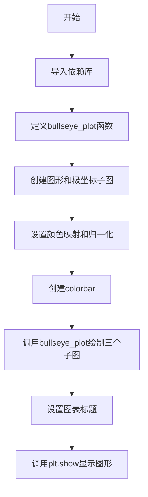
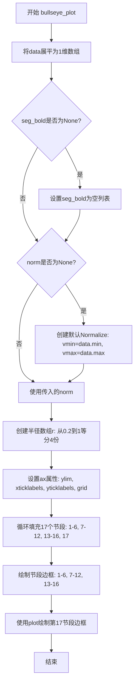

# `matplotlib\galleries\examples\specialty_plots\leftventricle_bullseye.py` 详细设计文档

该代码是一个matplotlib示例程序，用于可视化美国心脏协会(AHA)推荐的左心室17段模型。它通过极坐标图的形式展示心脏的解剖结构，支持自定义颜色映射、归一化处理以及重点段的高亮显示。

## 整体流程



## 类结构

```
模块级
├── bullseye_plot (绘图函数)
├── 数据生成 (data = np.arange(17) + 1)
├── 图形初始化 (fig, axs)
└── 颜色系统配置 (cmap/norm变体)
```

## 全局变量及字段


### `data`
    
The intensity values for each of the 17 segments of the left ventricle model

类型：`numpy.ndarray`
    


### `fig`
    
The figure object that contains the polar axes subplots

类型：`matplotlib.figure.Figure`
    


### `axs`
    
Array of three polar axes subplots for displaying the bullseye plots

类型：`numpy.ndarray[matplotlib.axes.Axes]`
    


### `cmap`
    
Viridis colormap for the first bullseye plot colorbar

类型：`matplotlib.colors.Colormap`
    


### `norm`
    
Normalization object mapping data values to [0, 1] range for the first colorbar

类型：`matplotlib.colors.Normalize`
    


### `cmap2`
    
Cool colormap for the second bullseye plot colorbar

类型：`matplotlib.colors.Colormap`
    


### `norm2`
    
Normalization object mapping data values to [0, 1] range for the second colorbar

类型：`matplotlib.colors.Normalize`
    


### `cmap3`
    
Custom listed colormap with 4 colors and extended over/under values for discrete mapping

类型：`matplotlib.colors.ListedColormap`
    


### `norm3`
    
Boundary normalization object that maps data values to discrete color intervals based on bounds

类型：`matplotlib.colors.BoundaryNorm`
    


### `bounds`
    
List of boundary values [2, 3, 7, 9, 15] defining discrete color intervals for the third colorbar

类型：`list[int]`
    


### `r`
    
Array of 4 radial distance values (0.2, 0.466, 0.733, 1.0) defining the inner and outer radii for the bullseye rings

类型：`numpy.ndarray`
    


    

## 全局函数及方法


### `bullseye_plot`

该函数用于创建美国心脏协会（AHA）推荐的左心室17段模型的可视化bullseye图，通过极坐标图展示17个心脏节段的数据分布，支持高亮特定节段、自定义颜色映射和数据归一化。

参数：

- `ax`：`matplotlib.axes.Axes`，用于绘制bullseye图的坐标轴对象
- `data`：`list[float]`，长度为17的列表，表示17个心脏节段的强度值
- `seg_bold`：`list[int] | None`，可选参数，要高亮显示的节段编号列表（如[3, 5, 6, 11, 12, 16]）
- `cmap`：`str | Colormap`，默认值为"viridis"，用于映射数据值到颜色的colormap
- `norm`：`Normalize | None`，可选参数，数据归一化器，若为None则自动根据data的min/max创建

返回值：`None`，该函数直接在ax上绘制图形，无返回值

#### 流程图



#### 带注释源码

```python
def bullseye_plot(ax, data, seg_bold=None, cmap="viridis", norm=None):
    """
    Bullseye representation for the left ventricle.

    Parameters
    ----------
    ax : Axes
    data : list[float]
        The intensity values for each of the 17 segments.
    seg_bold : list[int], optional
        A list with the segments to highlight.
    cmap : colormap, default: "viridis"
        Colormap for the data.
    norm : Normalize or None, optional
        Normalizer for the data.

    Notes
    -----
    This function creates the 17 segment model for the left ventricle according
    to the American Heart Association (AHA) [1]_

    References
    ----------
    .. [1] M. D. Cerqueira, N. J. Weissman, V. Dilsizian, A. K. Jacobs,
        S. Kaul, W. K. Laskey, D. J. Pennell, J. A. Rumberger, T. Ryan,
        and M. S. Verani, "Standardized myocardial segmentation and
        nomenclature for tomographic imaging of the heart",
        Circulation, vol. 105, no. 4, pp. 539-542, 2002.
    """

    # 将多维data展平为1维数组，便于后续索引操作
    data = np.ravel(data)
    
    # 如果未指定高亮节段，初始化为空列表
    if seg_bold is None:
        seg_bold = []
    
    # 如果未提供归一化器，则根据数据范围自动创建
    # 这样可以确保颜色映射与数据值相匹配
    if norm is None:
        norm = mpl.colors.Normalize(vmin=data.min(), vmax=data.max())

    # 定义4个同心圆的半径：内半径到外半径
    # r[0]最内层，r[3]最外层
    r = np.linspace(0.2, 1, 4)

    # 配置坐标轴：设置y轴范围，移除刻度标签，关闭网格
    ax.set(ylim=(0, 1), xticklabels=[], yticklabels=[])
    ax.grid(False)  # Remove grid

    # 填充17个心脏节段：1-6在外圈，7-12在中圈，13-16在内圈，17在中心
    # 使用极坐标bar chart绘制，每个节段是一个扇形
    for start, stop, r_in, r_out in [
            (0, 6, r[2], r[3]),    # 节段1-6：外圈
            (6, 12, r[1], r[2]),   # 节段7-12：中圈
            (12, 16, r[0], r[1]),  # 节段13-16：内圈
            (16, 17, 0, r[0]),     # 节段17：中心
    ]:
        n = stop - start           # 该圈包含的节段数
        dtheta = 2*np.pi / n       # 每个节段的角度宽度
        # 绘制扇形区域，颜色根据数据值通过cmap和norm映射
        ax.bar(np.arange(n) * dtheta + np.pi/2, r_out - r_in, dtheta, r_in,
               color=cmap(norm(data[start:stop])))

    # 绘制节段边界线：需要单独绘制以确保外圈边界不被内圈覆盖
    # 同时禁用裁剪(clip_on=False)以确保最外层边界完整显示
    # 节段1-6, 7-12, 13-16的边框绘制
    for start, stop, r_in, r_out in [
            (0, 6, r[2], r[3]),
            (6, 12, r[1], r[2]),
            (12, 16, r[0], r[1]),
    ]:
        n = stop - start
        dtheta = 2*np.pi / n
        # 如果节段在seg_bold列表中，使用粗线(4)，否则使用细线(2)
        ax.bar(np.arange(n) * dtheta + np.pi/2, r_out - r_in, dtheta, r_in,
               clip_on=False, color="none", edgecolor="k", linewidth=[
                   4 if i + 1 in seg_bold else 2 for i in range(start, stop)])
    
    # 绘制第17节段（中心圆）的边界：需要用plot方法单独绘制
    # 使用极坐标角度0到2π绘制一个完整的圆
    ax.plot(np.linspace(0, 2*np.pi), np.linspace(r[0], r[0]), "k",
            linewidth=(4 if 17 in seg_bold else 2))
```

## 关键组件


### bullseye_plot 函数

核心功能函数，用于绘制左心室17段牛眼图模型，按照美国心脏协会(AHA)标准将心脏左心室划分为17个段进行可视化展示，支持自定义颜色映射、规范化和重点段高亮显示。

### 数据生成与处理

使用numpy生成1-17的整数序列作为17个心肌段的强度值，并通过np.ravel()确保数据为一维数组形式输入。

### AHA 17段模型几何结构

通过四个同心圆环区域构建牛眼图的几何结构，包括基底段(1-6)、中间段(7-12)、心尖段(13-16)和心尖顶点(17)，每段使用极坐标扇形区域表示。

### 颜色映射与规范化系统

包含三种颜色映射方案：连续viridis颜色映射配合线性Normalize、cool颜色映射配合线性Normalize、离散的ListedColormap配合BoundaryNorm处理区间数据。

### 颜色条(Colorbar)组件

通过ScalarMappable将颜色映射与数值关联，创建三个水平方向的颜色条分别展示不同数据区间的颜色编码，支持离散区间和连续渐变两种模式。

### 分段高亮机制

通过seg_bold参数指定需要加粗显示的心肌段边框，可视化突出特定心肌区域，支持对内圈和外圈段边框应用不同线宽。


## 问题及建议


### 已知问题

- **缺少输入验证**：`bullseye_plot` 函数未验证 `data` 参数是否为17个元素，也未检查 `seg_bold` 中的索引是否在有效范围内（1-17），可能导致索引错误或隐式失败。
- **硬编码的魔法数字**：段数17、半径参数 `r = np.linspace(0.2, 1, 4)`、角度计算 `np.pi/2` 等关键数值散落在代码中，缺乏常量定义，修改时容易遗漏。
- **代码重复**：绘制填充段和边框的循环逻辑高度相似（start/stop/r_in/r_out参数完全相同），示例代码中三个子图的创建流程也存在重复。
- **全局状态污染**：在顶层创建 `data = np.arange(17) + 1` 并在后续直接使用，缺乏封装；`seg_bold` 默认值的处理在每次调用时重复检查。
- **注释与实现不一致**：代码注释提到"Fill segments 1-6, 7-12, 13-16"但实际还处理了段17（第16-17行的逻辑），且段17的绘制方式与其他段不同，未在文档中充分说明。
- **类型提示缺失**：函数参数和返回值均无类型注解，不利于静态分析和IDE支持。
- **matplotlib 导入顺序不规范**：`import matplotlib.pyplot as plt` 和 `import matplotlib as mpl` 未遵循官方推荐的 `import matplotlib.pyplot as plt` + `from matplotlib import mpl` 风格。

### 优化建议

- **添加输入验证**：在 `bullseye_plot` 开头检查 `len(data) == 17`，对 `seg_bold` 中的值进行范围校验并抛出有意义的异常。
- **提取常量**：定义模块级常量如 `NUM_SEGMENTS = 17`，将半径分布逻辑封装为函数或配置参数，减少魔法数字。
- **重构重复代码**：将绘制填充和边框的循环合并为单一函数，接受参数控制是否绘制填充或仅绘制边框；示例代码中子图创建逻辑可提取为工厂函数。
- **改进默认参数处理**：将 `seg_bold=None` 的默认值检查移至函数签名（如 `seg_bold: list[int] | None = None`），或使用不可变集合类型。
- **补充文档和类型注解**：为所有函数添加类型提示，补充段17的特殊处理说明，完善参数 `r` 的几何意义描述。
- **规范化导入**：统一使用 `import matplotlib.pyplot as plt` 和 `from matplotlib import colors as mpl_colors`，`mpl.colors` 替换为 `mpl.colormaps`（新API）。


## 其它


### 设计目标与约束

本示例的设计目标是为医学影像领域提供标准化的左心室17段模型可视化解决方案，遵循美国心脏协会(AHA)推荐的心脏分段规范。约束条件包括：使用matplotlib作为唯一绘图库，确保与现有matplotlib生态兼容；生成的图表必须支持极坐标投影；颜色映射必须支持连续和离散两种模式；必须支持高亮显示特定心肌段。

### 错误处理与异常设计

本代码采用Python异常处理机制，主要错误场景包括：1) 当data参数长度不足17个元素时，numpy.ravel()会抛出ValueError；2) 当cmap参数传入无效colormap名称时，mpl.colormaps[]会抛出KeyError；3) 当norm参数类型不符合要求时，后续normalize操作可能产生异常；4) 当seg_bold列表包含超出1-17范围的段号时，绘图逻辑无法正确高亮对应段落。代码通过默认参数(None)设置和numpy类型转换提供了一定程度的容错能力，但缺乏显式的参数验证逻辑。

### 数据流与状态机

数据流从外部输入(data、cmap、norm、seg_bold)经过bullseye_plot函数处理，输出为matplotlib Axes对象的可视化图形。状态机包含三个主要状态：初始化状态(设置坐标轴属性、网格)、填充状态(绘制17个心肌段)、边框绘制状态(绘制段边界线)。输入数据经过np.ravel()展平、norm归一化、cmap颜色映射三个转换阶段，最终通过ax.bar()和ax.plot()完成渲染。

### 外部依赖与接口契约

本代码依赖以下外部包：1) matplotlib>=3.5.0(用于绘图、颜色映射、坐标轴管理)；2) numpy>=1.20.0(用于数值计算、数组操作)。接口契约方面：bullseye_plot函数接受ax(Axes实例)、data(长度为17的可迭代对象)、seg_bold(可选的整数列表，范围1-17)、cmap(colormap或字符串)、norm(Normalize实例或None)，不返回任何值(返回值None)，通过副作用修改ax对象。

### 关键组件信息

1. bullseye_plot函数：核心绘图函数，负责创建17段左心室模型可视化
2. data变量：包含17个元素的numpy数组，代表各心肌段强度值
3. cmap/norm变量：颜色映射和归一化对象，控制数据到颜色的转换
4. seg_bold参数：指定需要高亮显示的心肌段编号列表
5. fig和axs变量：matplotlib Figure和Axes对象，承载可视化结果

### 潜在的技术债务与优化空间

1. 缺乏输入参数验证：data长度、seg_bold范围等未做严格校验
2. 硬编码的半径值：r = np.linspace(0.2, 1, 4)应考虑参数化
3. 重复代码：填充和边框绘制循环结构相似，可重构为通用函数
4. 魔法数字：段数17、角度偏移np.pi/2等应定义为常量
5. 文档注释不完整：缺少Returns部分说明，代码可读性可提升
6. 布局engine设置：使用了deprecated的set方法，应迁移到LayoutEngine API

    