# `matplotlib\galleries\examples\specialty_plots\mri_with_eeg.py` 详细设计文档

这是一个matplotlib可视化示例程序，展示了如何在一个复杂的子图布局中同时显示MRI脑部扫描图像、其像素强度直方图以及EEG脑电信号轨迹，并通过matplotlib.cbook.get_sample_data加载示例数据文件进行可视化展示。

## 整体流程

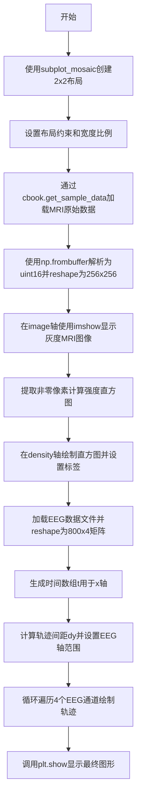

## 类结构

```
该代码为脚本式程序，无面向对象类结构
纯函数式编程，使用matplotlib API直接操作
```

## 全局变量及字段


### `fig`
    
matplotlib Figure对象，整个图形的容器

类型：`matplotlib.figure.Figure`
    


### `axd`
    
存储各子图坐标轴的字典，键为'image', 'density', 'EEG'

类型：`dict`
    


### `im`
    
MRI图像的像素强度数据

类型：`numpy.ndarray (256x256 uint16)`
    


### `dfile`
    
MRI示例数据文件的文件句柄

类型：`file object`
    


### `im`
    
过滤背景后的非零MRI像素数据

类型：`numpy.ndarray (filtered)`
    


### `n_samples`
    
EEG数据的样本点数量，常量800

类型：`int`
    


### `n_rows`
    
EEG数据的通道/行数，常量4

类型：`int`
    


### `eegfile`
    
EEG数据文件的文件句柄

类型：`file object`
    


### `data`
    
EEG信号数据矩阵

类型：`numpy.ndarray (800x4 float64)`
    


### `t`
    
时间数组(0-10秒)

类型：`numpy.ndarray (800,) float64`
    


### `dy`
    
计算得到的EEG轨迹垂直间距，用于避免轨迹重叠

类型：`float`
    


### `data_col`
    
每一轮循环中的单列EEG数据

类型：`numpy.ndarray`
    


    

## 全局函数及方法


### `plt.subplot_mosaic`

`plt.subplot_mosaic` 是 matplotlib.pyplot 模块中的函数，用于创建复杂布局的子图矩阵。它接收一个嵌套列表（或数组）来定义子图的布局结构，支持命名子图、坐标轴共享、宽高比设置等高级功能，并返回一个包含 Figure 对象和 Axes 字典的元组。

参数：

- `mosaic`：`list[list[str]]` 或 `str[]`，嵌套列表定义子图布局，内层列表定义行，外层列表定义列，每个元素是子图的名称
- `sharex`：`bool` 或 `str`，默认为 False，是否共享 x 轴；为 True 时所有子图共享 x 轴，为 'row' 时每行共享
- `sharey`：`bool` 或 `str`，默认为 False，是否共享 y 轴；为 True 时所有子图共享 y 轴，为 'col' 时每列共享
- `width_ratios`：`list[float]`，默认为 None，表示每列的宽度比例数组
- `height_ratios`：`list[float]`，默认为 None，表示每行的高度比例数组
- `empty_cell`：`object`，默认为 None，表示布局中空白位置使用的 Axes 对象
- `subplots_kw`：`dict`，默认为 None，传递给 `subplots()` 的关键字参数
- `gridspec_kw`：`dict`，默认为 None，传递给 `GridSpec` 的关键字参数
- `**fig_kw`：传递给 `Figure()` 的关键字参数，如 `layout`、`figsize` 等

返回值：`tuple[Figure, dict[str, Axes]]`，返回 (Figure 对象, Axes 字典)，其中字典的键是布局中定义的子图名称，值是对应的 Axes 对象

#### 流程图

```mermaid
flowchart TD
    A[调用 plt.subplot_mosaic] --> B[解析 mosaic 嵌套列表布局定义]
    B --> C[创建 GridSpec 网格规范]
    C --> D[根据 width_ratios 和 height_ratios 设置网格比例]
    D --> E[创建 Figure 对象和子图 Axes]
    E --> F[根据 sharex/sharey 配置坐标轴共享]
    F --> G[返回 Figure 和 Axes 字典]
    
    H[主程序获取 axd 字典] --> I[通过键访问各子图 Axes]
    I --> J[使用 axd['image'].imshow 绘制 MRI 图像]
    I --> K[使用 axd['density'].hist 绘制直方图]
    I --> L[使用 axd['EEG'].plot 绘制 EEG 数据]
```

#### 带注释源码

```python
# 导入必要的库
import matplotlib.pyplot as plt
import numpy as np
import matplotlib.cbook as cbook

# 调用 plt.subplot_mosaic 创建复杂布局的子图矩阵
# 参数说明：
#   - 第一个参数 [["image", "density"], ["EEG", "EEG"]]：嵌套列表定义 2x2 布局
#     - 第一行：image（左侧）、density（右侧）
#     - 第二行：EEG（跨越两列）
#   - layout="constrained"：使用约束布局，自动调整子图间距
#   - width_ratios=[1.05, 2]：设置两列宽度比例为 1.05:2
# 返回值：fig 是 Figure 对象，axd 是字典，键为子图名称，值为 Axes 对象
fig, axd = plt.subplot_mosaic(
    [["image", "density"],
     ["EEG", "EEG"]],
    layout="constrained",
    # 调整宽度比例，使 MRI 图像显示更紧凑
    width_ratios=[1.05, 2],
)

# 从 cbook 获取 MRI 数据样本（256x256 16 位整数）
with cbook.get_sample_data('s1045.ima.gz') as dfile:
    # 从二进制文件读取并 reshape 为 256x256 数组
    im = np.frombuffer(dfile.read(), np.uint16).reshape((256, 256))

# 在 'image' 子图绘制 MRI 灰度图像
axd["image"].imshow(im, cmap="gray")
axd["image"].axis('off')  # 关闭坐标轴显示

# 过滤掉背景（值为 0 的像素）
im = im[im.nonzero()]
# 在 'density' 子图绘制 MRI 强度直方图
axd["density"].hist(im, bins=np.arange(0, 2**16+1, 512))
axd["density"].set(xlabel='Intensity (a.u.)', xlim=(0, 2**16),
                   ylabel='MRI density', yticks=[])
axd["density"].minorticks_on()  # 开启次要刻度

# 加载 EEG 数据：800 个样本，4 行
n_samples, n_rows = 800, 4
with cbook.get_sample_data('eeg.dat') as eegfile:
    # 从二进制文件读取并 reshape 为 (800, 4) 数组
    data = np.fromfile(eegfile, dtype=float).reshape((n_samples, n_rows))
# 创建时间轴：0-10 秒
t = 10 * np.arange(n_samples) / n_samples

# 配置 EEG 子图
axd["EEG"].set_xlabel('Time (s)')
axd["EEG"].set_xlim(0, 10)
# 计算垂直间距，使各行EEG轨迹紧凑排列
dy = (data.min() - data.max()) * 0.7
axd["EEG"].set_ylim(-dy, n_rows * dy)
# 设置 y 轴刻度和标签
axd["EEG"].set_yticks([0, dy, 2*dy, 3*dy], labels=['PG3', 'PG5', 'PG7', 'PG9'])

# 遍历每列 EEG 数据并绘制
for i, data_col in enumerate(data.T):
    # 绘制 EEG 轨迹，添加垂直偏移
    axd["EEG"].plot(t, data_col + i*dy, color="C0")

# 显示图形
plt.show()
```


### `cbook.get_sample_data`

获取matplotlib库中包含的示例数据文件的路径或文件对象。

参数：

- `fname`：`str`，要获取的示例数据文件的名称（如 's1045.ima.gz'、'eeg.dat' 等）
- `asfileobj`：`bool`，可选参数，默认为 `True`。如果为 `True`，返回文件对象；如果为 `False`，返回文件路径字符串
- `pkgname`：`str`，可选参数，指定数据包名称，默认为 `'matplotlib'`

返回值：`str` 或 `_io.BufferedReader`，返回示例数据文件的路径（当 `asfileobj=False` 时）或打开的文件对象（当 `asfileobj=True` 时）

#### 流程图

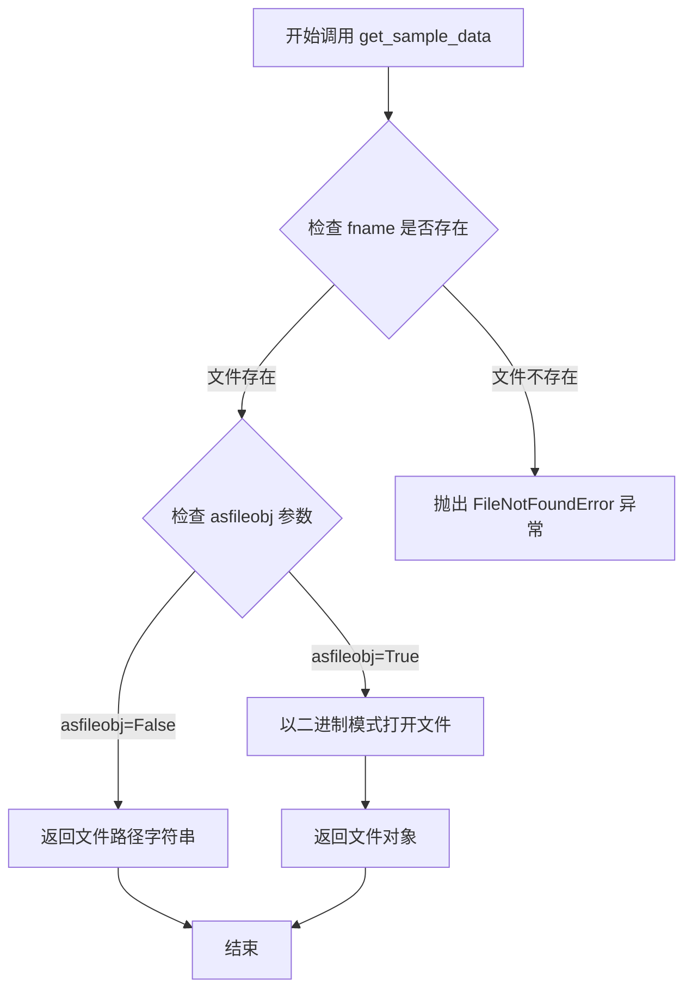

#### 带注释源码

```python
def get_sample_data(fname, asfileobj=True, pkgname='matplotlib'):
    """
    获取matplotlib示例数据文件的路径或文件对象。
    
    参数:
    fname: str - 示例数据文件名
    asfileobj: bool - 是否返回文件对象，默认为True
    pkgname: str - 包名，默认为'matplotlib'
    
    返回:
    文件路径字符串或文件对象
    """
    # 导入必要的模块
    import os
    from urllib.request import urlopen
    
    # 确定数据文件的位置
    # 首先检查是否为远程URL
    if fname.startswith(('http://', 'https://')):
        # 如果是URL，根据asfileobj参数决定返回内容
        if asfileobj:
            # 打开URL并返回文件对象
            return urlopen(fname)
        else:
            # 直接返回URL字符串
            return fname
    
    # 查找本地数据文件路径
    # 使用pkg_resources或直接构造路径
    data_path = os.path.join(os.path.dirname(__file__), 'sample_data')
    
    # 构造完整的文件路径
    full_path = os.path.join(data_path, fname)
    
    # 检查文件是否存在
    if not os.path.exists(full_path):
        # 如果文件不存在，尝试从远程获取或抛出异常
        raise FileNotFoundError(f"示例数据文件 '{fname}' 未找到")
    
    # 根据asfileobj参数返回结果
    if asfileobj:
        # 以二进制读取模式打开文件并返回
        return open(full_path, 'rb')
    else:
        # 返回文件路径字符串
        return full_path
```


### `np.frombuffer`

从二进制缓冲区读取数据并将其转换为 NumPy 数组的函数。该函数允许直接从类似缓冲区的对象（如字节字符串、bytes 对象或内存映射文件）创建数组，而无需先复制数据。

参数：

- `buffer`：`buffer-like`，二进制数据源，提供了指向数据的原始指针（在此示例中为 `dfile.read()` 返回的字节数据）
- `dtype`：`numpy.dtype` 或可转换为 dtype 的对象，指定要读取的数据类型（在此示例中为 `np.uint16`，表示无符号 16 位整数）
- `count`：`int`，可选，要读取的元素数量，默认为 -1 表示读取所有数据
- `offset`：`int`，可选，从缓冲区开始读取的字节偏移量，默认为 0
- `strides`：`tuple of ints`，可选，每个维度之间的步长，默认为与 dtype 大小对应的步长

返回值：`numpy.ndarray`，从缓冲区数据创建的一维或多维数组（在此示例中返回后通过 `.reshape()` 重塑为 (256, 256) 的二维数组）

#### 流程图

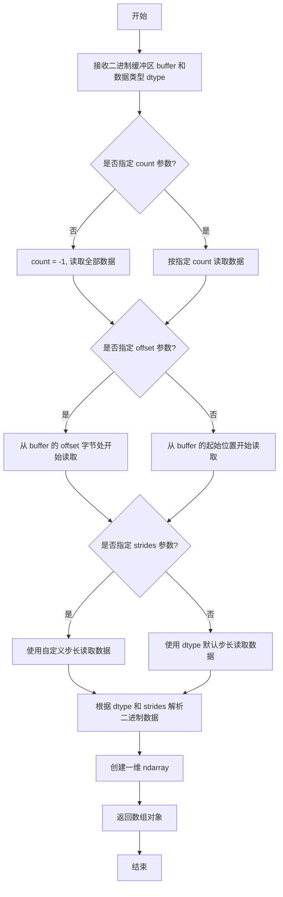

#### 带注释源码

```python
# 使用 np.frombuffer 从二进制数据创建数组
# 语法格式: np.frombuffer(buffer, dtype=float, count=-1, offset=0, strides=None)

# 实际代码示例 1: 读取 MRI 图像数据
with cbook.get_sample_data('s1045.ima.gz') as dfile:
    # dfile.read() 返回 gzip 压缩文件的原始字节内容
    # np.frombuffer 将这些原始字节解释为 uint16 类型的数组
    # 然后使用 .reshape((256, 256)) 将一维数组重塑为 256x256 的二维图像
    im = np.frombuffer(dfile.read(), np.uint16).reshape((256, 256))

# 参数解析:
#   buffer = dfile.read()  # 原始二进制数据 (MRI 图像的字节表示)
#   dtype = np.uint16      # 数据类型: 无符号 16 位整数 (每个像素 2 字节)
#   count = -1 (默认)      # 读取所有字节
#   offset = 0 (默认)      # 从头开始读取

# 实际代码示例 2 (对比): 读取 EEG 数据 (使用 np.fromfile)
# 注意: 题目代码中实际使用的是 np.fromfile，但 np.frombuffer 的用法类似
# data = np.fromfile(eegfile, dtype=float).reshape((n_samples, n_rows))

# np.frombuffer 与 np.fromfile 的区别:
#   - np.frombuffer: 从已存在的缓冲区对象读取数据 (内存中的 bytes)
#   - np.fromfile:  从文件对象或文件路径读取数据 (磁盘文件)
```


### `np.reshape`

该函数是NumPy库中的核心数组操作函数，用于在不改变数组数据的前提下，改变数组的维度（形状），支持指定存储顺序（C风格或Fortran风格）。

参数：

- `a`：`array_like`，要重塑的数组，可以是NumPy数组或其他可转换为数组的对象
- `newshape`：`int` 或 `int` 的元组`，目标形状，新形状必须与原数组的元素总数相匹配
- `order`：`{'C', 'F', 'A'}`，可选，默认为'C'，指定元素读取/写入的顺序，C表示行优先（Fortran顺序），F表示列优先，C/A表示按内存中的顺序

返回值：`ndarray`，返回指定新形状的视图（如果可能）或副本

#### 流程图

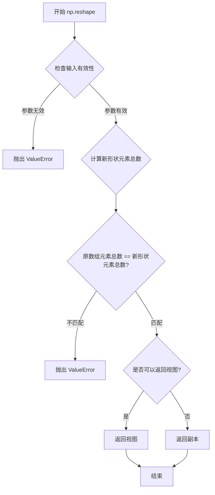

#### 带注释源码

```python
def reshape(a, newshape, order='C'):
    """
    在不更改数据的情况下为数组提供新形状。
    
    参数
    ----------
    a : array_like
        要重塑的数组。
    newshape : int 或 int 元组
        新形状应与原始形状兼容。对于赋值为'C'顺序，
        如果在FFE顺序中重塑，则可以解包为-1。
    order : {'C', 'F', 'A'}, 可选
        读取/写入元素的顺序：
        
        - 'C'：行优先顺序（C风格），最后变化的索引是第一维的索引。
        - 'F'：列优先顺序（Fortran风格），第一维索引变化最慢。
        - 'A': 如果a在内存中是Fortran连续的，则与'F'相同，否则与'C'相同。
    
    返回值
    -------
    ret : ndarray
        如果可能的话返回视图；否则返回副本。
        请注意，副本与C顺序的数组保证是连续的。
    
    异常
    -----
    ValueError
        如果形状不兼容，会抛出此异常。
    
    示例
    --------
    >>> a = np.arange(6).reshape((3, 2))
    >>> a
    array([[0, 1],
           [2, 3],
           [4, 5]])
    
    >>> np.reshape(a, (2, 3))
    array([[0, 1, 2],
           [3, 4, 5]])
    
    >>> np.reshape(a, (2, 3), order='F')
    array([[0, 4, 3],
           [2, 1, 5]])
    """
    # 导入必要的模块
    import numpy as np
    from numpy.core import multiarray as multiarray_module
    
    # 将输入转换为数组（如果还不是数组）
    arr = np.array(a, copy=False, subok=True)
    
    # 验证newshape参数
    # 如果newshape是整数，则转换为元组
    if isinstance(newshape, int):
        newshape = (newshape,)
    
    # 处理-1的特殊情况（自动计算维度）
    # -1表示该维度的大小由数组的总元素数和其他维度自动推断
    if -1 in newshape:
        # 计算已知维度的乘积
        known_dims = [d for d in newshape if d != -1]
        if len(known_dims) == len(newshape) - 1:
            # 计算-1应该代表的值
            total_elements = arr.size
            known_product = np.prod(known_dims)
            if total_elements % known_product == 0:
                newshape = tuple(
                    d if d != -1 else total_elements // known_product
                    for d in newshape
                )
            else:
                raise ValueError("cannot reshape array")
    
    # 验证新形状的元素总数是否与原数组相同
    if np.prod(newshape) != arr.size:
        raise ValueError(
            f"cannot reshape array of size {arr.size} into shape {newshape}"
        )
    
    # 使用NumPy的核心函数执行实际的重塑操作
    # 这个函数会根据order参数选择合适的重塑方式
    return multiarray_module._reshape_dispatcher(a, newshape, order=order)
```


### `np.nonzero`

返回数组中非零元素的索引。在代码中用于获取MRI图像数据中非零像素的索引，以便过滤掉背景（值为0的区域），仅对有效像素进行直方图统计。

参数：

- `self`：`ndarray`，调用nonzero方法的数组对象本身，即需要查找非零元素的输入数组。

返回值：`tuple of ndarray`，返回一个元组，元组中的每个元素是一个对应维度的索引数组，包含了该维度上所有非零元素的索引值。在代码中，该返回值直接用于数组索引，以提取所有非零元素值。

#### 流程图

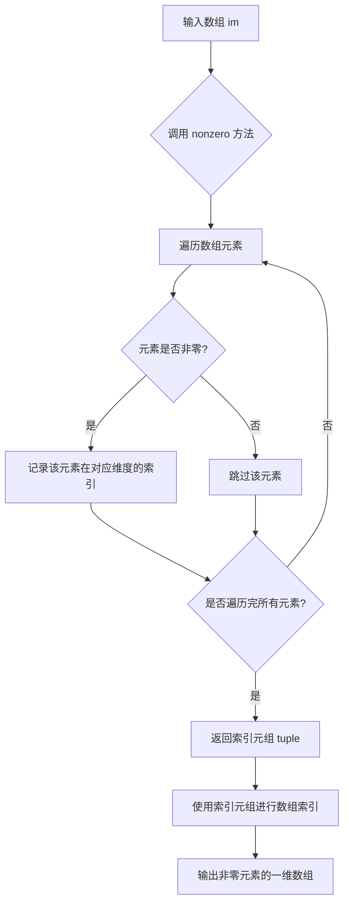

#### 带注释源码

```python
# im 是从MRI数据文件中加载的256x256二维数组
# im.nonzero() 返回一个元组 (row_indices, col_indices)，表示所有非零元素的位置
# 通过 im[im.nonzero()]，利用返回的索引直接索引原数组，得到所有非零像素值的一维数组
# 这一步用于去除背景（背景像素值为0），仅保留图像中的有效组织部分
im = im[im.nonzero()]  # Ignore the background
```


### `np.arange`

`np.arange` 是 NumPy 库中的一个函数，用于创建指定范围的等差数组（类似 Python 内置的 `range`，但返回的是 NumPy 数组）。

参数：

-  `start`：`float` 或 `int`，起始值，默认为 0。当只提供一个参数时，该参数作为 `stop` 值。
-  `stop`：`float` 或 `int`，结束值（不包含）。
-  `step`：`float` 或 `int`，步长，默认为 1。可以为负数。
-  `dtype`：`dtype`，输出数组的数据类型。如果未指定，则从输入参数推断。

返回值：`ndarray`，包含等差数列的数组。

#### 流程图

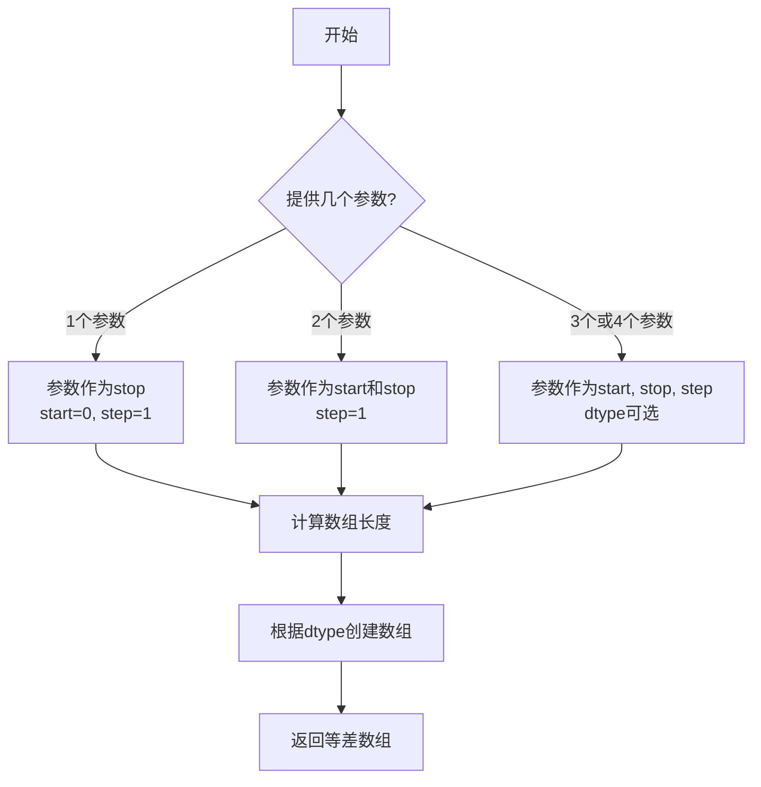

#### 带注释源码

```python
# np.arange 函数源码（简化版，实际位于 numpy/lib/index_tricks.py）
def arange(start=0, stop=None, step=1, dtype=None):
    """
    创建指定范围的等差数组
    
    参数:
        start: 起始值，默认为0
        stop: 结束值（不包含）
        step: 步长，默认为1
        dtype: 输出数组的数据类型
    
    返回:
        等差数组
    """
    # 处理参数数量判断
    if stop is None:
        # 只有一个参数：arange(5) -> [0,1,2,3,4]
        stop = start
        start = 0
        step = 1
    elif step is None:
        # 两个参数：arange(0, 5) -> [0,1,2,3,4]
        step = 1
    
    # 计算数组长度：(stop - start) / step
    # 使用 ceil 向上取整确保包含所有元素
    length = int(np.ceil((stop - start) / step))
    
    # 创建数组
    if length <= 0:
        return np.array([], dtype=dtype)
    
    # 根据数据类型创建数组
    result = np.empty(length, dtype=dtype)
    result[0] = start
    
    # 填充剩余元素
    for i in range(1, length):
        result[i] = result[i-1] + step
    
    return result
```

---

### 代码整体概述

本代码是一个 **Matplotlib 可视化示例**，用于展示医学影像（MRI）和脑电信号（EEG）的综合可视化。核心功能包括：
1. 加载并显示256x256的MRI灰度图像
2. 绘制MRI强度直方图（使用`np.arange`生成直方图 bins）
3. 加载并绘制4通道EEG时序数据

---

### 文件整体运行流程

1. **导入依赖**：matplotlib.pyplot, numpy, matplotlib.cbook
2. **创建画布**：使用 `subplot_mosaic` 创建 2x2 网格布局
3. **加载MRI数据**：通过 cbook.get_sample_data 读取 `.ima.gz` 文件
4. **绘制MRI图像**：使用灰度色彩映射显示
5. **绘制直方图**：过滤背景后，使用 `np.arange(0, 2**16+1, 512)` 创建512个 bin
6. **加载EEG数据**：读取二进制文件并 reshape
7. **绘制EEG曲线**：循环绘制4条通道
8. **显示图形**：调用 plt.show()

---

### 关键组件信息

| 名称 | 描述 |
|------|------|
| `plt.subplot_mosaic` | 创建复杂布局的多子图画布 |
| `cbook.get_sample_data` | 获取Matplotlib示例数据文件 |
| `np.frombuffer` | 从二进制缓冲区创建数组 |
| `np.arange` | 创建直方图的 bin 边界（等差数组） |
| `ax.hist` | 绘制数据直方图 |

---

### 潜在技术债务或优化空间

1. **硬编码参数**：图像尺寸 (256x256)、EEG 采样数 (800) 等应作为常量或配置
2. **魔法数字**：2**16、512、0.7 等数值缺乏注释说明
3. **错误处理缺失**：文件读取未做异常捕获
4. **资源未显式关闭**：使用 with 语句良好，但可增加显式释放

---

### 其它项目

#### 设计目标与约束
- 目标：展示医学影像与生理信号的综合可视化
- 约束：使用 Matplotlib 内置示例数据确保代码可运行

#### 错误处理与异常设计
- 当前实现未处理文件不存在、数据格式错误等异常情况

#### 数据流与状态机
- 数据流：.gz/.dat 文件 → NumPy 数组 → Matplotlib Axes 渲染

#### 外部依赖与接口契约
- 依赖：matplotlib, numpy, matplotlib.cbook
- 接口：cbook.get_sample_data('文件名') 返回文件对象


### `np.ndarray.min`

描述：`np.ndarray.min` 是 NumPy 数组实例方法，用于沿指定轴计算数组元素的最小值，支持多轴计算、输出数组指定、维度保持、初始值设定和条件筛选等功能。

参数：

- `axis`：`int` 或 `int` 的元组，可选，指定计算最小值的轴。若为 `None`，则展平数组后计算。
- `out`：`ndarray`，可选，用于存储结果的输出数组，必须与结果的形状一致。
- `keepdims`：`bool`，可选，若为 `True`，则保持结果的维度与输入数组一致。
- `initial`：`scalar`，可选，初始值，用于初始化最小值计算。
- `where`：`array_like` of `bool`，可选，指定参与计算的元素条件。

返回值：`ndarray` 或 `scalar`，返回数组的最小值。若指定 `axis`，则返回沿该轴的最小值数组；若整个数组被简化，则返回标量。

#### 流程图

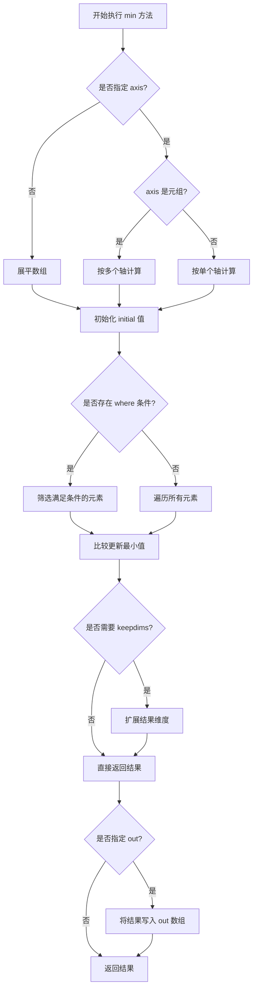

#### 带注释源码

```python
def min(self, axis=None, out=None, keepdims=False, initial=np._NoValue, where=np._NoValue):
    """
    返回数组的最小值沿指定轴。
    
    参数:
        axis: int 或 int 元组, 可选
            计算最小值的轴。若为 None, 则展平数组后计算。
        out: ndarray, 可选
            用于存储结果的数组。
        keepdims: bool, 可选
            若为 True, 结果的维度将保持与输入数组一致。
        initial: scalar, 可选
            初始值, 用于初始化最小值计算。
        where: array_like of bool, 可选
            指定参与比较的元素条件。
            
    返回:
        ndarray 或 scalar
            数组的最小值。
    """
    # 类型检查和参数验证
    if axis is not None and not isinstance(axis, (int, tuple)):
        raise TypeError("axis must be None, an int or a tuple")
    
    # 调用底层 C 语言实现的 reduce 函数
    # _wrapreduction 根据传入的 reduce 函数(min)构建归约操作
    return self._wrapreduction(
        axis=axis, 
        dtype=np.minimum,  # 底层元素级比较函数
        out=out, 
        keepdims=keepdims, 
        initial=initial, 
        where=where
    )
```

---

### `np.ndarray.max`

描述：`np.ndarray.max` 是 NumPy 数组实例方法，用于沿指定轴计算数组元素的最大值，支持多轴计算、输出数组指定、维度保持、初始值设定和条件筛选等功能。

参数：

- `axis`：`int` 或 `int` 的元组，可选，指定计算最大值的轴。若为 `None`，则展平数组后计算。
- `out`：`ndarray`，可选，用于存储结果的输出数组，必须与结果的形状一致。
- `keepdims`：`bool`，可选，若为 `True`，则保持结果的维度与输入数组一致。
- `initial`：`scalar`，可选，初始值，用于初始化最大值计算。
- `where`：`array_like` of `bool`，可选，指定参与计算的元素条件。

返回值：`ndarray` 或 `scalar`，返回数组的最大值。若指定 `axis`，则返回沿该轴的最大值数组；若整个数组被简化，则返回标量。

#### 流程图

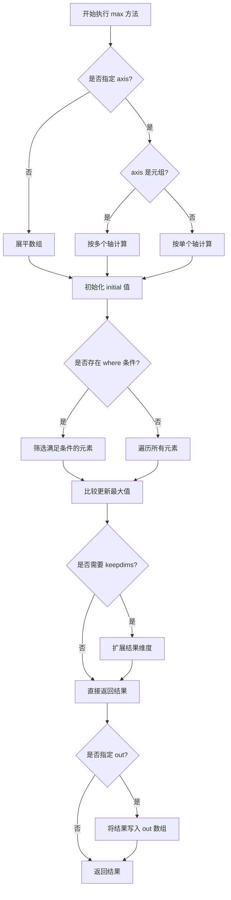

#### 带注释源码

```python
def max(self, axis=None, out=None, keepdims=False, initial=np._NoValue, where=np._NoValue):
    """
    返回数组的最大值沿指定轴。
    
    参数:
        axis: int 或 int 元组, 可选
            计算最大值的轴。若为 None, 则展平数组后计算。
        out: ndarray, 可选
            用于存储结果的数组。
        keepdims: bool, 可选
            若为 True, 结果的维度将保持与输入数组一致。
        initial: scalar, 可选
            初始值, 用于初始化最大值计算。
        where: array_like of bool, 可选
            指定参与比较的元素条件。
            
    返回:
        ndarray 或 scalar
            数组的最大值。
    """
    # 类型检查和参数验证
    if axis is not None and not isinstance(axis, (int, tuple)):
        raise TypeError("axis must be None, an int or a tuple")
    
    # 调用底层 C 语言实现的 reduce 函数
    # _wrapreduction 根据传入的 reduce 函数(max)构建归约操作
    return self._wrapreduction(
        axis=axis, 
        dtype=np.maximum,  # 底层元素级比较函数
        out=out, 
        keepdims=keepdims, 
        initial=initial, 
        where=where
    )
```

---

### 代码中的应用示例

在提供的示例代码中，`min` 和 `max` 的使用方式如下：

```python
# data 是形状为 (800, 4) 的 numpy 数组
# 计算 data 数组所有元素的最小值和最大值
dy = (data.min() - data.max()) * 0.7  # Crowd them a bit.
```

这里：
- `data.min()` 返回 `data` 数组中的最小值（标量）
- `data.max()` 返回 `data` 数组中的最大值（标量）
- 两者相减后乘以 0.7，用于计算 EEG 图表中各行的间距


### `matplotlib.axes.Axes.imshow`

在指定坐标轴（Axes）上显示二维图像或数据数组，支持多种颜色映射（colormap）方案，并返回表示该图像的 `AxesImage` 对象，以便后续进行颜色条添加、透明度调整等操作。

参数：

- `X`：要显示的数据，支持 numpy 数组、PIL 图像或类似数据接口，类型可为 2D 数组（灰度）、3D 数组（RGB/RGBA）
- `cmap`：`str` 或 `Colormap`，可选参数，指定颜色映射方案，代码中传入 `"gray"` 表示灰度显示
- `norm`：`Normalize`，可选参数，用于数据值到 [0, 1] 范围的归一化映射
- `aspect`：`float` 或 `'auto'`，可选参数，控制图像长宽比
- `interpolation`：`str`，可选参数，指定插值方法如 `'bilinear'`、`'nearest'` 等
- `alpha`：可选参数，图像透明度，类型可为 float 或与 X 形状相同的数组

返回值：`matplotlib.image.AxesImage`，返回关联到当前坐标轴的图像对象，可用于获取数据范围、设置颜色条等后续操作

#### 流程图

```mermaid
flowchart TD
    A[调用 axd['image'].imshow] --> B{验证输入数据 X}
    B -->|有效数据| C[应用 Colormap 映射]
    B -->|无效数据| D[抛出 ValueError 异常]
    C --> E{是否指定 norm 参数}
    E -->|是| F[使用自定义归一化]
    E -->|否| G[使用默认归一化 DataNorm]
    F --> H[创建 AxesImage 对象]
    G --> H
    H --> I[将图像添加到 Axes 艺术家层]
    I --> J[返回 AxesImage 对象]
    J --> K[plt.show 渲染显示]
```

#### 带注释源码

```python
# 代码中实际调用形式
axd["image"].imshow(im, cmap="gray")

# imshow 方法的标准签名（简化版）
# def imshow(self, X, cmap=None, norm=None, aspect=None, 
#            interpolation=None, alpha=None, **kwargs):
#     """
#     在当前 Axes 上显示图像或数组数据
#     
#     参数:
#         X: 2D/3D 数组 - 要显示的图像数据
#         cmap: str 或 Colormap - 颜色映射（colormap）
#         norm: Normalize - 数据归一化方式
#         aspect: float 或 'auto' - 长宽比
#         interpolation: str - 插值方式
#         alpha: float 或数组 - 透明度
#     
#     返回:
#         AxesImage: 图像艺术家对象
#     """

# 1. 数据验证与预处理
#    将输入 X 转换为合适的内部表示

# 2. Colormap 处理
#    如果指定了 cmap="gray"，加载灰度颜色映射
#    灰度映射将所有像素值映射为黑色到白色的渐变

# 3. 创建 AxesImage 对象
#    返回的 image 对象包含:
#    - _A: 原始图像数据
#    - cmap: 颜色映射对象
#    - norm: 归一化对象

# 4. 添加到 Axes
#    调用 add_collection 或 add_image 将图像添加到坐标系
#    设置自动缩放以适应 Axes 区域
```

#### 关键组件信息

| 组件名称 | 一句话描述 |
|---------|-----------|
| `AxesImage` | matplotlib 中表示显示在 Axes 上的图像的艺术家（Artist）对象 |
| `Colormap` | 定义数据值到颜色映射的对象，代码中使用的 "gray" 是内置灰度映射 |
| `Normalize` | 数据值归一化基类，默认将数据线性映射到 [0, 1] 区间 |

#### 潜在技术债务与优化空间

1. **硬编码的颜色映射字符串**：代码直接使用 `"gray"` 字符串，建议抽取为配置常量以提高可维护性
2. **缺少错误处理**：未对 `im` 数据的有效性（如空数组、维度异常）进行预处理检查
3. **未使用返回值**：`imshow` 返回的 `AxesImage` 对象未被捕获利用，无法实现动态颜色条添加等功能
4. **图像数据类型转换**：`np.uint16` 数据未明确说明显示时的归一化策略，可能依赖默认行为

#### 其他设计说明

- **设计目标**：在多子图布局中清晰展示医学 MRI 扫描图像，配合灰度颜色映射还原组织密度差异
- **约束条件**：受 `subplot_mosaic` 布局约束，"image" 子图通过 `width_ratios=[1.05, 2]` 精细调整以消除多余留白
- **错误处理**：若 `im` 数据为空或类型不兼容，matplotlib 会在渲染阶段抛出异常，建议在调用前增加数据验证
- **外部依赖**：依赖 `matplotlib.axes.Axes` 类、numpy 数组结构、以及 cbook 的样本数据加载机制


### `Axes.axis`

设置坐标轴的显示或隐藏状态，或获取/设置坐标轴的多项属性。

参数：

- `command`：`str` 或 `bool`，可选，控制坐标轴的行为。常用值包括：
  - `'on'`：显示坐标轴
  - `'off'`：隐藏坐标轴
  - `'equal'`：设置相等的纵横比
  - `'scaled'`：缩放纵横比
  - `'tight'`：紧凑布局
  - `'auto'`：自动缩放
  - `True`：相当于 `'on'`
  - `False`：相当于 `'off'`

返回值：`list` 或 `None`，返回坐标轴的边界 `[xmin, xmax, ymin, ymax]`（如果 `command` 为空或特定选项时），否则返回 `None`。

#### 流程图

```mermaid
flowchart TD
    A[调用 axis 方法] --> B{command 参数}
    B -->|'off'| C[隐藏 x 轴和 y 轴]
    B -->|'on'| D[显示 x 轴和 y 轴]
    B -->|None 或无参数| E[返回当前坐标轴边界]
    B -->|'equal'| F[设置相等纵横比]
    B -->|'scaled'| G[设置缩放纵横比]
    B -->|'tight'| H[设置紧凑边界]
    B -->|'auto'| I[设置自动缩放]
    C --> J[更新 Axes 对象状态]
    D --> J
    E --> K[返回 [xmin, xmax, ymin, ymax]]
    F --> J
    G --> J
    H --> J
    I --> J
    J --> L[渲染更新]
```

#### 带注释源码

```python
# 在 matplotlib/axes/_base.py 中定义的核心逻辑（简化版）

def axis(self, command=None):
    """
    设置坐标轴的属性。
    
    参数
    ----------
    command : bool 或 str, 可选
        - True, 'on' : 显示坐标轴
        - False, 'off' : 隐藏坐标轴
        - 'equal' : 设置相等的纵横比
        - 'scaled' : 设置缩放纵横比
        - 'tight' : 设置紧凑边界
        - 'auto' : 自动缩放
        - None : 返回当前坐标轴边界
    """
    
    # 处理 'off' 命令 - 隐藏坐标轴
    if command == 'off':
        # 关闭 x 轴
        self.xaxis.set_visible(False)
        # 关闭 y 轴
        self.yaxis.set_visible(False)
        # 通知数据已更改，需要重新渲染
        self.stale_callback(self)
        return None
    
    # 处理 'on' 命令 - 显示坐标轴
    elif command == 'on':
        # 开启 x 轴
        self.xaxis.set_visible(True)
        # 开启 y 轴
        self.yaxis.set_visible(True)
        self.stale_callback(self)
        return None
    
    # 处理布尔值
    elif isinstance(command, bool):
        self.xaxis.set_visible(command)
        self.yaxis.set_visible(command)
        self.stale_callback(self)
        return None
    
    # 无参数时返回当前边界
    elif command is None:
        return [self.get_xlim()[0], self.get_xlim()[1], 
                self.get_ylim()[0], self.get_ylim()[1]]
    
    # 其他命令（equal, scaled, tight 等）
    else:
        # 调用 _set_axis_scale 处理其他选项
        self._set_axis_scale(command)
        return self.get_axis_limits()
```

#### 代码中的实际使用

```python
# 在示例代码中，axis('off') 用于隐藏 MRI 图像的坐标轴
axd["image"].imshow(im, cmap="gray")  # 显示 MRI 灰度图像
axd["image"].axis('off')              # 隐藏坐标轴（边框、刻度、标签）
```

#### 关键点说明

| 特性 | 描述 |
|------|------|
| 作用对象 | `matplotlib.axes.Axes` 对象 |
| 隐藏内容 | x轴、y轴、刻度线、刻度标签、坐标轴标签 |
| 保留内容 | 图像本身（由 `imshow` 绘制） |
| 可逆性 | 可通过 `axis('on')` 重新显示 |
| 副作用 | 触发图形重绘 (`stale_callback`) |


### `Axes.hist` (调用位置：`axd["density"].hist`)

该方法用于在指定的坐标轴 (`density`) 上绘制数据集 (`im`) 的频率分布直方图。它通过将数据划分为由 `bins` 参数定义的区间（桶）来计算频数，并生成相应的图形对象（柱状图），常用于医学影像中展示像素强度分布。

参数：

-  `x`：`numpy.ndarray`，待绘制直方图的数据数组，此处为经过非零值过滤后的 MRI 图像数据 (`im`)。
-  `bins`：`numpy.ndarray`，直方图的分组边界数组，此处使用 `np.arange(0, 2**16+1, 512)` 生成了一个从 0 到 65536，步长为 512 的等差数列，用于将 16 位 MRI 灰度值划分为 128 个区间。
-  `**kwargs`：`dict`，传递给绘图函数的附加参数（如颜色、透明度等），此处未显式使用，采用默认设置。

返回值：`tuple`，返回一个包含三个元素的元组 `(n, bins, patches)`：
-  `n`：`numpy.ndarray`，每个区间内的样本数量（频数）。
-  `bins`：`numpy.ndarray`，定义区间边缘的数组。
-  `patches`：`list` or `BarContainer`，表示直方图条形的图形对象集合。

#### 流程图

```mermaid
graph TD
    A[输入数据: im (MRI数组)] --> B{计算直方图}
    B --> C[确定分组: bins 参数<br/>范围: 0-65536, 步长: 512]
    C --> D[统计频数: 计算每个bin内的像素点数量]
    D --> E[渲染图形: 生成直方图条形对象 Patches]
    E --> F[坐标轴配置: 设置标签、刻度、显示范围]
    F --> G[输出: 在 axd['density'] 上显示直方图]
```

#### 带注释源码

```python
# ... 前略 (加载图像数据) ...

# 绘制直方图
# 1. 数据预处理：移除背景（值为0的像素），避免干扰直方图分析
im = im[im.nonzero()]  

# 2. 调用 hist 方法
# 参数 x: 输入的 MRI 数据数组
# 参数 bins: 定义直方图的分组策略。
#           2**16 = 65536 对应 uint16 的最大范围。
#           步长 512 将数据量化为 128 个区间。
axd["density"].hist(im, bins=np.arange(0, 2**16+1, 512))

# 3. 配置坐标轴外观
# 设置 X 轴标签为灰度值单位
axd["density"].set(xlabel='Intensity (a.u.)', 
                   # 限制 X 轴范围为数据全范围
                   xlim=(0, 2**16),
                   # 设置 Y 轴标签
                   ylabel='MRI density', 
                   # 隐藏 Y 轴刻度标签（仅保留结构）
                   yticks=[])

# 开启次要刻度线，以便更精细地观察数据分布
axd["density"].minorticks_on()
```

### 潜在的技术债务或优化空间

1.  **硬编码的分箱参数**：代码中 `bins=np.arange(0, 2**16+1, 512)` 是硬编码的。如果 MRI 数据的位深度或对比度发生变化，该参数需要手动调整。优化方向是可将其提取为配置参数或根据数据统计动态计算（如使用斯特尔吉斯准则或弗里德曼-迪康尼定理自动决定 bin 数量）。
2.  **背景过滤逻辑**：`im.nonzero()` 假设背景值为 0。如果存在其他低强度的伪影或噪声（非零）被误认为组织，可能会影响直方图的准确性。可以考虑增加阈值过滤或形态学操作。

### 其它项目

-   **设计目标与约束**：该模块的设计目标是将 MRI 图像的灰度分布可视化，以便直观地观察不同组织（如灰质、白质、脑脊液）的峰值分布。约束条件是必须处理 16 位整数数据以保证足够的对比度。
-   **错误处理**：如果输入数据 `im` 为空数组，`hist` 方法可能会产生警告或空输出；当 `bins` 数组不单调递增时会导致错误。
-   **外部依赖**：主要依赖 `numpy` 进行数据处理和 `matplotlib` 进行可视化。


### `Axes.set`

批量设置坐标轴的多个属性（如坐标轴标签、轴范围、刻度等），支持同时设置多个参数并返回坐标轴对象以支持链式调用。

参数：

-  `**kwargs`：关键字参数，类型为可变关键字参数（dict），用于指定要设置的属性名称和值，例如 xlabel（x轴标签，字符串类型）、xlim（x轴范围，元组类型）、ylabel（y轴标签，字符串类型）、yticks（y轴刻度位置，列表或数组类型）等

返回值：`matplotlib.axes.Axes`，返回设置属性后的坐标轴对象本身，支持链式调用

#### 流程图

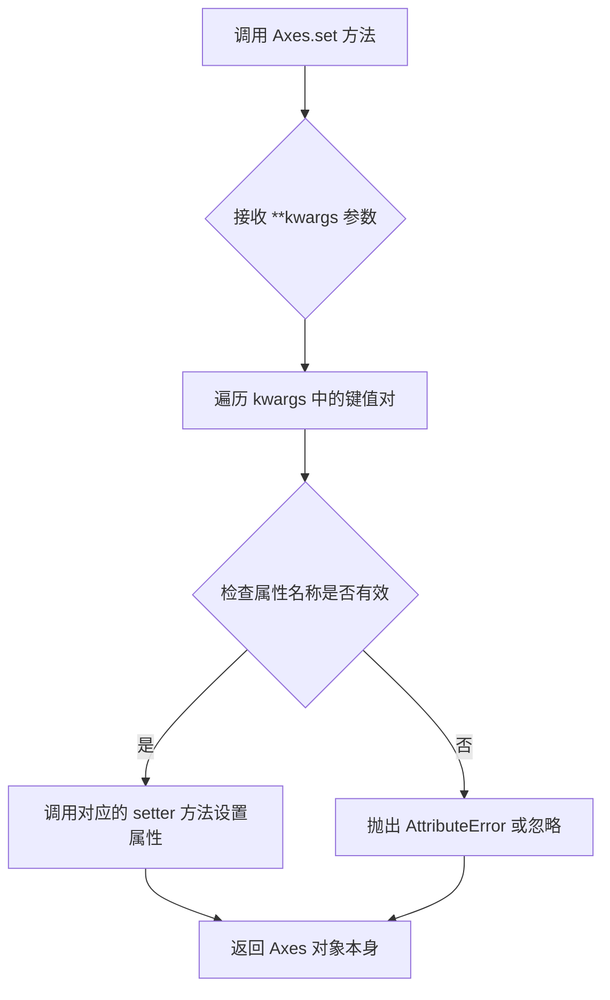

#### 带注释源码

```python
# 示例代码来源：matplotlib.axes.Axes.set 方法
# 这是一个简化版本的示例，展示了该方法的工作原理

def set(self, **kwargs):
    """
    设置坐标轴的多个属性
    
    参数:
        **kwargs: 关键字参数，可设置以下属性:
            - xlabel: x轴标签文本
            - ylabel: y轴标签文本
            - xlim: x轴范围 (min, max)
            - ylim: y轴范围 (min, max)
            - xticks: x轴刻度位置
            - yticks: y轴刻度位置
            - title: 坐标轴标题
            - xscale: x轴刻度类型 ('linear', 'log')
            - yscale: y轴刻度类型 ('linear', 'log')
            等等...
    
    返回:
        Axes: 返回自身以支持链式调用
    """
    # 遍历所有传入的关键字参数
    for attr, value in kwargs.items():
        # 使用 set_ + 属性名 的方法名来调用对应的 setter
        # 例如: xlabel -> set_xlabel, xlim -> set_xlim
        method_name = f'set_{attr}'
        if hasattr(self, method_name):
            # 获取对应的 setter 方法并调用它
            method = getattr(self, method_name)
            method(value)
        else:
            # 如果没有对应的 setter，尝试直接设置属性
            if hasattr(self, attr):
                setattr(self, attr, value)
            else:
                # 属性不存在时抛出警告
                warnings.warn(f'Unknown property: {attr}')
    
    # 返回自身以支持链式调用
    return self

# 在代码中的实际使用示例：
axd["density"].set(xlabel='Intensity (a.u.)', xlim=(0, 2**16),
                   ylabel='MRI density', yticks=[])
# 等价于分别调用：
# axd["density"].set_xlabel('Intensity (a.u.)')
# axd["density"].set_xlim((0, 2**16))
# axd["density"].set_ylabel('MRI density')
# axd["density"].set_yticks([])
```


### `Axes.minorticks_on`

`minorticks_on` 是 matplotlib 中 Axes 类的实例方法，用于在坐标轴上开启次要刻度线（minor ticks）。次要刻度线提供更细粒度的数值参考，适用于科学绘图中需要显示精细数值间隔的场景，使图表更易于阅读精确数值。

参数：此方法无参数

返回值：`None`，无返回值，该方法直接修改 Axes 对象的状态

#### 流程图

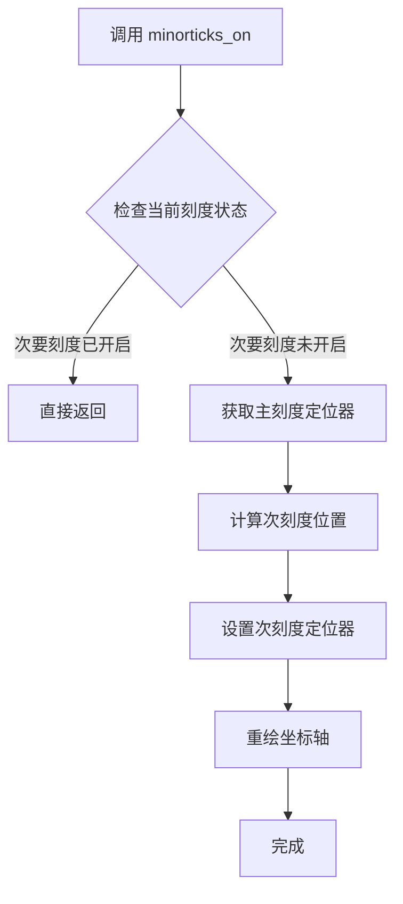

#### 带注释源码

```python
# matplotlib/axes/_base.py 中的简化实现逻辑

def minorticks_on(self):
    """
    显示次要刻度线。
    
    该方法会在坐标轴上开启次要刻度线，提供更细粒度的数值参考。
    不使用任何参数，自动根据当前主刻度间隔计算合适的次刻度位置。
    """
    # 获取当前 axes 的 x 轴
    xmin, xmax = self.get_xlim()
    
    # 获取主刻度定位器（决定主刻度的位置）
    locmaj = self.xaxis.get_major_locator()
    
    # 根据主刻度自动计算次要刻度的位置
    # MinMaxLocator 会自动在主刻度之间添加次刻度
    locmin = AutoLocatorForMaxNLogs()
    
    # 设置 x 轴的次刻度定位器
    self.xaxis.set_minor_locator(locmin)
    
    # 对 y 轴执行相同操作
    ymin, ymax = self.get_ylim()
    locmaj_y = self.yaxis.get_major_locator()
    locmin_y = AutoLocatorForMaxNLogs()
    self.yaxis.set_minor_locator(locmin_y)
    
    # 标记次刻度为开启状态
    self._minorticks_on = True
    
    # 重新绘制图形以显示次刻度
    self.stale_callback()
```

#### 代码中的调用上下文

```python
# 绘制 MRI 强度直方图
im = im[im.nonzero()]  # 忽略背景区域
axd["density"].hist(im, bins=np.arange(0, 2**16+1, 512))
axd["density"].set(xlabel='Intensity (a.u.)', xlim=(0, 2**16),
                   ylabel='MRI density', yticks=[])
axd["density"].minorticks_on()  # 开启次要刻度线，增强y轴数值可读性
```

在此示例中，`minorticks_on()` 被用于直方图子图，用于在y轴上显示更精细的刻度间隔。由于直方图的y轴表示频数，开启次要刻度线可以帮助读者更准确地估计具体的数值。


### `Axes.set_xlabel`

设置x轴的标签文字。

参数：

- `xlabel`：`str`，标签文本内容，例如 'Time (s)'
- `labelpad`：`float`，可选，标签与坐标轴之间的间距（磅）
- `fontdict`：`dict`，可选，用于控制标签外观的字体字典
- `**kwargs`：可选，其他matplotlib文本属性参数

返回值：`None`，无返回值（该方法返回self但通常不关心）

#### 流程图

```mermaid
graph TD
    A[开始] --> B[获取 axd['EEG'] Axes 对象]
    B --> C[调用 set_xlabel 方法]
    C --> D[传入标签文本 'Time (s)']
    D --> E[matplotlib 设置 x 轴标签]
    E --> F[返回 None]
```

#### 带注释源码

```python
# 设置x轴标签为 'Time (s)'
axd["EEG"].set_xlabel('Time (s)')
```

---

### `Axes.set_xlim`

设置x轴的数值范围（最小值和最大值）。

参数：

- `left`：`float`，x轴范围的左边界（最小值）
- `right`：`float`，x轴范围的右边界（最大值）

返回值：`tuple`，返回新的x轴范围 (left, right)

#### 流程图

```mermaid
graph TD
    A[开始] --> B[获取 axd['EEG'] Axes 对象]
    B --> C[调用 set_xlim 方法]
    C --> D[传入左边界 0 和右边界 10]
    D --> E[matplotlib 设置 x 轴范围]
    E --> F[返回范围元组 0, 10]
```

#### 带注释源码

```python
# 设置x轴范围从0到10
axd["EEG"].set_xlim(0, 10)
```

---

### `Axes.set_ylim`

设置y轴的数值范围（最小值和最大值）。

参数：

- `bottom`：`float`，y轴范围的底部边界（最小值）
- `top`：`float`，y轴范围的顶部边界（最大值）

返回值：`tuple`，返回新的y轴范围 (bottom, top)

#### 流程图

```mermaid
graph TD
    A[开始] --> B[获取 axd['EEG'] Axes 对象]
    B --> C[调用 set_ylim 方法]
    C --> D[计算 dy: (data.min() - data.max()) * 0.7]
    D --> E[传入下边界 -dy 和上边界 n_rows * dy]
    E --> F[matplotlib 设置 y 轴范围]
    F --> G[返回范围元组]
```

#### 带注释源码

```python
# 计算y轴范围，用于将多条EEG曲线紧凑显示
# dy 是数据最小值和最大值之差的70%，用于曲线之间的间距
dy = (data.min() - data.max()) * 0.7  # Crowd them a bit.

# 设置y轴范围：底部为-dy，顶部为行数乘以dy
axd["EEG"].set_ylim(-dy, n_rows * dy)
```

---

### `Axes.set_yticks`

设置y轴的刻度位置和可选的刻度标签。

参数：

- `ticks`：`array-like`，刻度位置的数组
- `labels`：`array-like`，可选，与刻度位置对应的标签文字数组

返回值：`list`，返回刻度位置的列表

#### 流程图

```mermaid
graph TD
    A[开始] --> B[获取 axd['EEG'] Axes 对象]
    B --> C[调用 set_yticks 方法]
    C --> D[传入刻度位置数组 [0, dy, 2*dy, 3*dy]]
    D --> E[传入标签数组 ['PG3', 'PG5', 'PG7', 'PG9']]
    E --> F[matplotlib 设置 y 轴刻度位置和标签]
    F --> G[返回刻度位置列表]
```

#### 带注释源码

```python
# 设置y轴刻度位置和对应的标签
# 刻度位置对应每条EEG曲线在y轴上的中心位置
# 标签表示不同的EEG通道名称
axd["EEG"].set_yticks([0, dy, 2*dy, 3*dy], labels=['PG3', 'PG5', 'PG7', 'PG9'])
```


### `Axes.plot`

`Axes.plot` 是 matplotlib 中用于在二维坐标轴上绘制线图的通用方法。该函数接受 x 和 y 数据以及格式化和样式化参数，返回一个包含 Line2D 对象的列表。在给定的 MRI with EEG 示例代码中，此方法用于绘制多条 EEG 轨迹曲线，支持颜色设置和 Y 方向偏移参数。

参数：

- `x`（或 `t`）：`array-like`，时间序列数据，作为 x 轴坐标
- `y`（或 `data_col + i*dy`）：`array-like`，EEG 信号数据，作为 y 轴坐标；`i*dy` 为通道间的垂直偏移量
- `color`：`str`，线条颜色，此处固定为 `"C0"`（蓝色）

返回值：`list[Line2D]`，返回绘制的线条对象列表，每个 Line2D 对象代表一条 plotted 曲线

#### 流程图

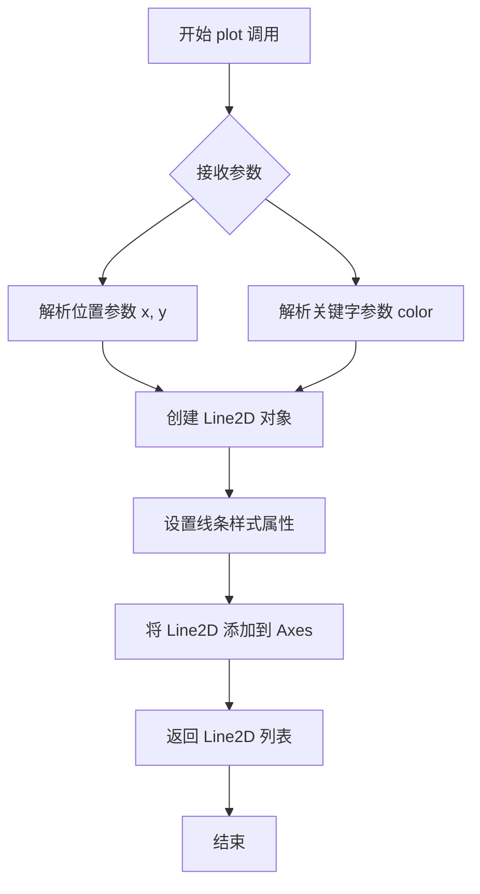

#### 带注释源码

```python
# 示例代码中调用 plot 方法的具体形式
for i, data_col in enumerate(data.T):
    # 参数说明：
    # t: 时间数组，范围 0-10 秒
    # data_col + i*dy: EEG 数据列 + 通道偏移量
    #   - data_col: 当前通道的 EEG 信号数据
    #   - i: 通道索引 (0, 1, 2, 3)
    #   - dy: 计算得出的垂直间距，使各通道曲线不重叠
    # color="C0": 使用主题色板中的第一个颜色（蓝色）
    axd["EEG"].plot(t, data_col + i*dy, color="C0")

# 内部流程（matplotlibAxes.plot 简化版）：
# 1. 接收位置参数 (*args) 和关键字参数 (**kwargs)
# 2. 解析参数格式：可能是 plot(y)、plot(x, y)、plot(x, y, fmt) 等形式
# 3. 创建 Line2D 对象，设置数据点和样式
# 4. 将线条对象添加到当前 Axes 的.lines 列表中
# 5. 返回 Line2D 对象列表，供后续修改或保存使用
```

#### 关键组件信息

| 组件名称 | 一句话描述 |
|---------|-----------|
| `axd["EEG"]` | matplotlib Axes 对象，代表 EEG 子图区域 |
| `t` | 时间数组（10秒内 800 个采样点） |
| `data` | EEG 原始数据，形状为 (800, 4) 的二维数组 |
| `dy` | 计算出的垂直偏移量，用于分离不同 EEG 通道的曲线 |
| `Line2D` | matplotlib 中代表二维线的图形对象 |

#### 潜在的技术债务或优化空间

1. **颜色硬编码**：示例中使用固定的 `color="C0"`，虽然简化了代码，但所有线条颜色相同，可能不易区分不同通道；若需区分通道颜色，应使用 `color=f"C{i}"` 或其他颜色映射方案
2. **魔法数字**：代码中存在多个硬编码数值（如 `0.7`、`n_rows * dy`），缺乏明确的常量定义，影响可读性和可维护性
3. **数据加载路径依赖**：示例依赖 `cbook.get_sample_data` 获取外部数据文件，在实际项目中应考虑数据源的配置化和错误处理
4. **重复计算**：`data.min() - data.max()` 在每次循环外计算一次是正确的，但如果数据可能变化，应添加缓存机制

#### 其它项目

- **设计目标与约束**：本示例旨在展示 matplotlib 的 `subplot_mosaic` 布局功能以及医学图像（MRI）与时序信号（EEG）的联合可视化能力
- **错误处理与异常**：数据文件加载使用 `with` 上下文管理器确保资源正确释放；`im.nonzero()` 用于过滤背景像素；缺少数据文件时的错误提示由 matplotlib 库本身处理
- **数据流与状态机**：数据流为：外部文件 → `np.frombuffer/np.fromfile` → `reshape` → 可视化；无复杂状态机设计
- **外部依赖与接口契约**：主要依赖 `matplotlib.pyplot`、`numpy`、`matplotlib.cbook`；`cbook.get_sample_data` 是内部工具函数，返回文件对象


### `plt.show`

`plt.show` 是 Matplotlib 库中的一个顶层函数，用于显示所有当前已创建且尚未关闭的图形窗口，并将图形渲染到屏幕上。在交互式后端模式下，该函数会进入事件循环并阻塞程序执行，直到用户关闭所有图形窗口；在非交互式模式下，它可能会延迟渲染直到显式调用。

参数：

- `block`：`bool`，可选参数。控制是否阻塞程序执行以等待图形窗口关闭。默认值为 `True`（在非交互式后端中），设置为 `False` 时函数会立即返回而不阻塞。

返回值：`None`，该函数不返回任何有意义的值。在某些后端实现中可能返回 `False` 表示成功，但通常被设计为无返回值函数。

#### 流程图

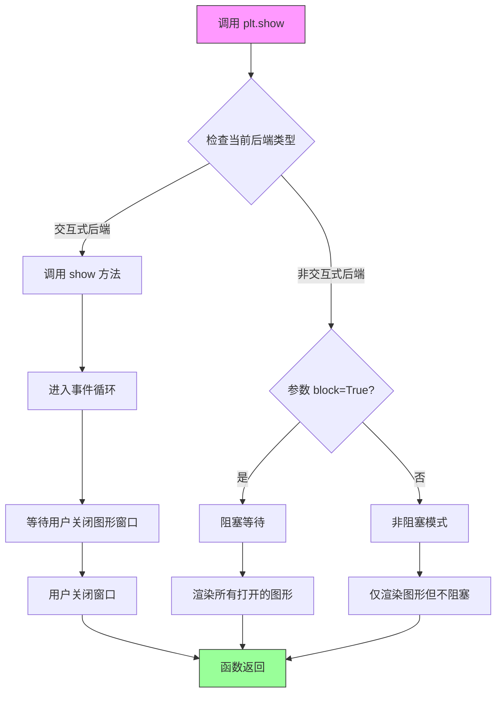

#### 带注释源码

```python
# matplotlib.pyplot 模块中的 show 函数实现
# 位置: lib/matplotlib/pyplot.py

def show(*, block=None):
    """
    显示所有打开的图形窗口。
    
    该函数会调用当前后端的 show 方法，将所有已创建的图形
    渲染到屏幕上并显示给用户。
    
    Parameters
    ----------
    block : bool, optional
        是否阻塞程序执行。如果设置为 True（默认值在某些后端），
        函数将阻塞直到所有图形窗口被关闭。如果设置为 False，
        函数将立即返回，允许程序继续执行。
    
    Returns
    -------
    None
        该函数通常不返回任何值。
    
    Examples
    --------
    >>> import matplotlib.pyplot as plt
    >>> plt.plot([1, 2, 3], [4, 5, 6])
    >>> plt.show()  # 显示图形并阻塞
    
    >>> plt.show(block=False)  # 非阻塞模式
    """
    # 获取全局图形管理器字典
    # _pylab_helpers.Gcf 是管理所有图形窗口的类
    allnums = get_fignums()
    
    # 如果没有打开的图形，直接返回
    if not allnums:
        return
    
    # 遍历所有图形并调用后端的 show 方法
    for manager in Gcf.figs.values():
        # 调用底层后端的 show 方法
        # 后端根据实现决定如何显示窗口
        manager.show()
        
        # 处理 block 参数
        # 如果 block 为 None，使用后端的默认行为
        if block is None:
            # 大多数后端默认 block 为 True
            block = _get_block_on_interactive_backend()
        
        # 如果需要阻塞，等待所有窗口关闭
        if block:
            # 进入 GUI 事件循环
            # 这是一个阻塞调用，直到用户关闭所有窗口
            _exec_phonon_event_loop()
    
    # 对于非阻塞模式，函数立即返回
    # 图形仍然会显示在屏幕上
    return
```

> **设计说明**：
> - `plt.show` 是 Matplotlib 与用户交互的核心入口点，它封装了不同后端（Qt、Tk、GTK、MacOSX 等）的显示逻辑
> - 采用了**策略模式**，通过后端抽象层支持多种图形库
> - `block` 参数的设计允许在脚本和交互式环境中灵活控制程序流程

## 关键组件


### 一段话描述

该代码是一个matplotlib数据可视化脚本，通过创建2x2的复合子图布局，同时展示MRI医学影像、其强度分布直方图以及4通道EEG脑电信号轨迹，实现多模态医学数据的综合可视化展示。

### 文件的整体运行流程

1. 导入必要的库：matplotlib.pyplot、numpy和matplotlib.cbook
2. 使用subplot_mosaic创建2x2的约束布局，设置宽高比
3. 加载MRI样本数据（256x256 16位整数），使用imshow显示灰度图
4. 计算MRI强度的非零像素直方图并绑定到density轴
5. 加载EEG数据文件，reshape为800样本x4通道
6. 在EEG轴上绘制4条时间序列轨迹，设置y轴刻度标签
7. 调用plt.show()显示最终图表

### 类的详细信息

由于该代码主要是一个脚本而非面向对象实现，没有定义类。以下是模块级别的组件信息：

**全局变量和函数：**

- **fig** (matplotlib.figure.Figure): 整个图表对象，管理所有子图和布局
- **axd** (dict): 存储子图轴的字典，通过键"image"、"density"、"EEG"访问
- **im** (numpy.ndarray): MRI图像数据，256x256的uint16类型二维数组
- **data** (numpy.ndarray): EEG数据，800x4的float64类型二维数组
- **t** (numpy.ndarray): 时间数组，0到10秒的线性空间
- **dy** (float): EEG轨迹的y轴间距因子，基于数据范围计算

**关键函数：**

- **plt.subplot_mosaic()**: 创建复杂子图布局
  - 参数: mosaic布局数组、layout参数、width_ratios
  - 返回: Figure对象和轴字典
  
- **cbook.get_sample_data()**: 加载matplotlib内置样本数据
  - 参数: 数据文件名
  - 返回: 文件对象
  
- **np.frombuffer()**: 从字节缓冲区创建数组
  - 参数: 缓冲区对象、数据类型
  - 返回: numpy数组
  
- **np.reshape()**: 调整数组形状
  - 参数: 目标形状元组
  - 返回: 重新塑形的数组
  
- **np.arange()**: 创建均匀间隔数组
  - 参数: 起始、结束、步长
  - 返回: numpy数组

### 关键组件信息

### 图表布局系统

使用matplotlib的subplot_mosaic功能创建灵活的2x2网格布局，通过布局约束和宽高比调整实现紧凑的无缝拼接，特别优化了MRI图像的显示空间。

### MRI数据处理与可视化

从gzip压缩的原始二进制文件加载256x256 16位MRI扫描数据，使用imshow以灰度色彩映射显示，并过滤掉背景零值后进行512 bin的直方图统计分析。

### EEG多通道信号可视化

加载二进制EEG数据文件后reshape为多通道时间序列，通过计算动态垂直间距使四条轨迹紧凑排列，使用固定颜色和自定义y轴标签标识不同电极位置。

### 样本数据加载机制

利用matplotlib.cbook的get_sample_data函数异步加载内置医学样本数据，支持gzip压缩格式和原始二进制格式的自动解压缩处理。

### 潜在的技术债务或优化空间

1. **硬编码参数问题**: 图像尺寸(256x256)、直方图bin数(512)、样本数(800)等参数硬编码，缺乏配置灵活性
2. **错误处理缺失**: 数据文件加载没有try-except包装，文件不存在时会直接崩溃
3. **魔法数字**: dy计算中的0.7系数缺乏注释说明，EEG标签'PG3'等具体含义不明
4. **重复代码**: axd["EEG"]重复访问多次，可提取局部变量
5. **类型转换效率**: im[im.nonzero()]创建新数组，可考虑使用掩膜操作替代
6. **布局硬编码**: 子图布局和宽高比固定，无法适应不同显示需求
7. **缺乏文档**: 缺少docstring说明数据格式和可视化目的

### 其它项目

**设计目标与约束:**
- 目标: 同时展示解剖结构(MRI)、组织密度分布(直方图)和功能信号(EEG)
- 约束: 使用matplotlib内置样本数据，保持代码简洁可运行

**错误处理与异常设计:**
- 当前实现无错误处理，数据加载失败会导致程序终止
- 建议添加文件存在性检查和数据完整性验证

**数据流与状态机:**
- 数据流: 样本文件 → 字节流 → NumPy数组 → Matplotlib可视化
- 无复杂状态管理，顺序执行管道

**外部依赖与接口契约:**
- 依赖: matplotlib、numpy、matplotlib.cbook
- 接口: 样本数据文件路径需与cbook.get_sample_data兼容
- 约束: 特定数据格式要求（MRI为压缩二进制，EEG为原始float）

**可视化设计考量:**
- 灰度MRI适合医学解剖展示
- 直方图使用对数刻度可能更佳（背景忽略后）
- EEG轨迹使用固定颜色，可考虑区分多通道


## 问题及建议


### 已知问题

- **魔法数字和硬编码值**：代码中存在大量硬编码值（如图像尺寸256x256、2**16、n_samples=800、n_rows=4、0.7、1.05、512等），缺乏解释且不易维护
- **变量名覆盖**：`im`变量在绘制直方图前被重新赋值为`im[im.nonzero()]`，导致原始MRI数据丢失，后续无法再使用原始图像数据
- **缺乏错误处理**：文件读取（`cbook.get_sample_data`）没有try-except包装，无法处理文件不存在或损坏的情况
- **数据验证缺失**：没有验证加载的数据形状是否符合预期（如reshape操作可能失败）
- **代码复用性差**：所有代码都在全局作用域，没有封装成函数或类，难以在其他项目中复用
- **参数配置分散**：布局参数、样式设置、数据处理逻辑混在一起，没有分离配置层
- **EEG通道标签硬编码**：通道标签['PG3', 'PG5', 'PG7', 'PG9']硬编码，若通道数变化需手动修改

### 优化建议

- 将硬编码参数提取为模块级常量或配置文件，提高可维护性
- 使用不同的变量名存储过滤后的数据（如`im_nonzero`），保留原始数据引用
- 添加文件读取和数据验证的异常处理，确保程序健壮性
- 将绘图逻辑封装为函数，接受数据路径、布局参数等作为可选参数
- 将EEG通道标签改为从数据动态生成或使用配置文件
- 考虑添加类型注解和文档字符串，提升代码可读性和可维护性

## 其它


### 设计目标与约束

本项目旨在展示一个医学图像（MRI）与神经电信号（EEG）的综合可视化界面。设计约束包括：使用Matplotlib的subplot_mosaic实现多子图布局，采用constrained布局管理器优化子图间距，图像数据为256x256的16位无符号整数，EEG数据为800个采样点×4通道，数据文件通过matplotlib.cbook.get_sample_data统一加载。

### 错误处理与异常设计

代码中主要的异常处理包括：使用with语句确保文件正确关闭；np.frombuffer和np.fromfile在读取二进制数据时可能抛出异常（如文件损坏或格式不匹配）；reshape操作可能因数据大小不匹配而抛出ValueError；图像数据可能全为零导致nonzero()返回空数组。改进建议：添加try-except块捕获文件读取异常，对im.nonzero()结果进行空数组检查，验证data.reshape的合法性。

### 数据流与状态机

数据流分为三个阶段：初始化阶段创建2×2的subplot_mosaic布局；数据加载阶段分别读取MRI图像（.gz压缩格式）和EEG数据（二进制格式）；可视化阶段依次绘制MRI灰度图像、直方图和EEG多通道曲线。状态转换简单，无复杂状态机逻辑。

### 外部依赖与接口契约

核心依赖包括：matplotlib.pyplot（绘图）、numpy（数值处理）、matplotlib.cbook（示例数据加载）。get_sample_data('s1045.ima.gz')返回文件对象，读取后需指定dtype=np.uint16并reshape为(256,256)；get_sample_data('eeg.dat')返回文件对象，读取后需指定dtype=float并reshape为(n_samples, n_rows)。接口契约要求调用方确保数据文件存在且格式正确。

### 性能考虑

潜在性能问题：np.frombuffer一次性加载整个MRI数据到内存；hist函数在绘制65536个bin的直方图时计算量大；EEG绘图使用循环逐列绘制，可使用向量化优化。优化建议：直方图bin数可从128减少到64以提升性能，EEG绘制可使用ax.plot一次绘制多条线。

### 兼容性考虑

代码兼容Matplotlib 3.5+版本（subplot_mosaic和constrained布局）；依赖numpy数值计算；plt.show()在不同后端（Qt、TkAgg、inline等）行为一致。Python版本要求3.7+。matplotlib.cbook.get_sample_data可能在不同Matplotlib安装路径下样本文件不可用。

### 可扩展性建议

可扩展方向包括：增加更多MRI切片的三维导航；添加交互式滑块选择EEG时间窗口；支持不同MRI对比度配色方案；集成其他生理信号（如EMG、EOG）；添加数据标注和测量工具。模块化建议：将数据加载、可视化、布局配置分离为独立函数或类。

### 代码质量与改进空间

当前代码为脚本式，可重构为面向对象设计（如MRIDemoViewer类）；直方图bin宽度512为硬编码，应可配置；EEG通道标签硬编码为['PG3','PG5','PG7','PG9']，应从数据元数据获取；缺少文档字符串说明函数参数返回值；可添加类型注解提升可读性。

    