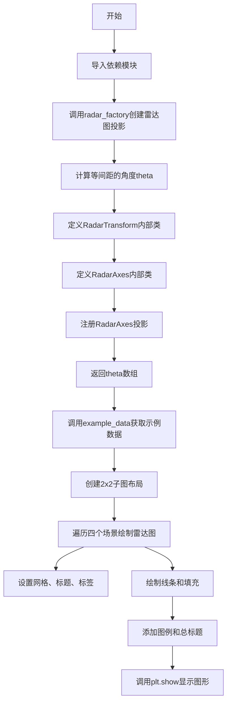
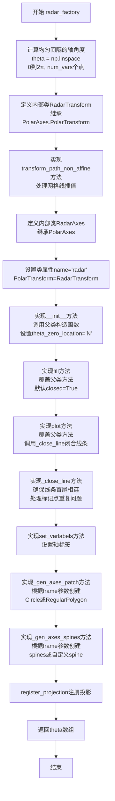
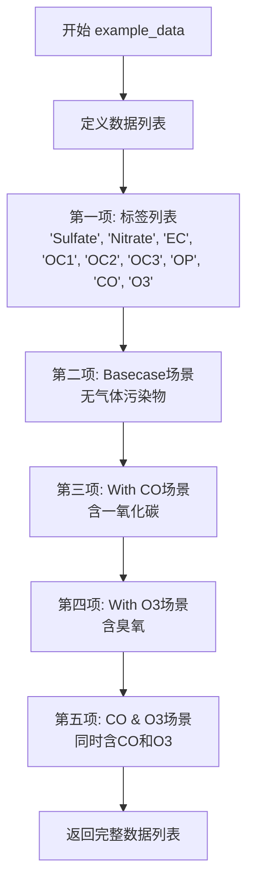

# `matplotlib\galleries\examples\specialty_plots\radar_chart.py` 详细设计文档

这是一个使用matplotlib绘制雷达图（蜘蛛图/星形图）的示例代码，通过自定义RadarAxes投影实现了圆形和多边形两种框架样式的雷达图，用于可视化多维数据（如环境污染源profile）。

## 整体流程



## 类结构

```
模块 (radar_chart.py)
├── 导入模块
│   ├── matplotlib.pyplot (plt)
│   ├── numpy (np)
│   ├── matplotlib.patches (Circle, RegularPolygon)
│   ├── matplotlib.path (Path)
│   ├── matplotlib.projections (register_projection)
│   ├── matplotlib.projections.polar (PolarAxes)
│   ├── matplotlib.spines (Spine)
│   └── matplotlib.transforms (Affine2D)
├── radar_factory 函数 (工厂函数)
│   ├── RadarTransform (内部类，继承PolarTransform)
│   └── RadarAxes (内部类，继承PolarAxes)
│       ├── __init__
│       ├── fill
│       ├── plot
│       ├── _close_line
│       ├── set_varlabels
│       ├── _gen_axes_patch
│       └── _gen_axes_spines
└── example_data 函数
```

## 全局变量及字段


### `theta`
    
均匀间隔的轴角度数组，用于雷达图的径向轴。

类型：`numpy.ndarray`
    


### `num_vars`
    
雷达图的变量数量。

类型：`int`
    


### `frame`
    
雷达图框架形状，可选'circle'或'polygon'。

类型：`str`
    


### `data`
    
示例数据，包含标签和多个场景的数据列表。

类型：`list`
    


### `spoke_labels`
    
雷达图的轴标签列表。

类型：`list`
    


### `colors`
    
用于区分不同数据系列的颜色列表。

类型：`list`
    


### `N`
    
雷达图的变量数量，与num_vars相同。

类型：`int`
    


### `labels`
    
图例中使用的标签元组。

类型：`tuple`
    


    

## 全局函数及方法


### `radar_factory`

该函数用于创建一个带有指定变量数量的雷达图（蜘蛛图/星形图），并将其注册为matplotlib的投影，同时返回用于绘制雷达图的角度数组。

参数：
- `num_vars`：`int`，雷达图的变量数量（轴的数量）
- `frame`：`str`，可选值为`'circle'`或`'polygon'`，表示围绕图表的框架形状，默认为`'circle'`

返回值：`numpy.ndarray`，返回均匀分布的角度数组（弧度制），用于后续绘制雷达图的轴线

#### 流程图



#### 带注释源码

```python
def radar_factory(num_vars, frame='circle'):
    """
    Create a radar chart with `num_vars` Axes.

    This function creates a RadarAxes projection and registers it.

    Parameters
    ----------
    num_vars : int
        Number of variables for radar chart.
    frame : {'circle', 'polygon'}
        Shape of frame surrounding Axes.

    """
    # 计算均匀间隔的轴角度（弧度制）
    # 从0到2π生成num_vars个点，不包含终点
    # endpoint=False确保角度数组能够平滑闭合
    theta = np.linspace(0, 2*np.pi, num_vars, endpoint=False)

    # 定义内部转换类RadarTransform，继承自PolarAxes的极坐标转换
    class RadarTransform(PolarAxes.PolarTransform):
        # 重写transform_path_non_affine方法，处理路径的非仿射变换
        def transform_path_non_affine(self, path):
            # 对于非单位插值步骤的路径（对应网格线）
            # 强制进行插值处理，以避免PolarTransform自动转换为圆弧
            if path._interpolation_steps > 1:
                path = path.interpolated(num_vars)
            # 转换路径顶点并返回新的Path对象，保留原始codes
            return Path(self.transform(path.vertices), path.codes)

    # 定义雷达图坐标轴类RadarAxes，继承自PolarAxes（极坐标轴）
    class RadarAxes(PolarAxes):
        # 设置投影名称为'radar'
        name = 'radar'
        # 指定使用自定义的RadarTransform
        PolarTransform = RadarTransform

        # 初始化方法
        def __init__(self, *args, **kwargs):
            # 调用父类PolarAxes的初始化方法
            super().__init__(*args, **kwargs)
            # 旋转绘图使得第一个轴位于顶部（北向）
            self.set_theta_zero_location('N')

        # 重写fill方法，使线条默认闭合
        def fill(self, *args, closed=True, **kwargs):
            """Override fill so that line is closed by default"""
            # 调用父类的fill方法，传入closed参数
            return super().fill(closed=closed, *args, **kwargs)

        # 重写plot方法，使线条默认闭合
        def plot(self, *args, **kwargs):
            """Override plot so that line is closed by default"""
            # 调用父类的plot方法获取线条对象列表
            lines = super().plot(*args, **kwargs)
            # 遍历所有线条，调用_close_line确保闭合
            for line in lines:
                self._close_line(line)

        # 私有方法：确保线条首尾相连形成闭合多边形
        def _close_line(self, line):
            x, y = line.get_data()
            # FIXME: 标记点x[0], y[0]可能会重复
            # 检查线条首尾坐标是否相同，不同则添加起点到终点
            if x[0] != x[-1]:
                x = np.append(x, x[0])  # 添加第一个点到末尾
                y = np.append(y, y[0])  # 添加第一个点的y值到末尾
                line.set_data(x, y)    # 更新线条数据

        # 设置变量标签（轴刻度标签）
        def set_varlabels(self, labels):
            # 将弧度转换为角度，设置theta刻度网格和标签
            self.set_thetagrids(np.degrees(theta), labels)

        # 生成坐标轴补丁（背景形状）
        def _gen_axes_patch(self):
            # 坐标轴补丁必须位于(0.5, 0.5)，半径为0.5（坐标轴坐标系中）
            if frame == 'circle':
                # 返回圆形补丁，半径0.5，圆心(0.5, 0.5)
                return Circle((0.5, 0.5), 0.5)
            elif frame == 'polygon':
                # 返回正多边形补丁，num_vars条边
                return RegularPolygon((0.5, 0.5), num_vars,
                                      radius=.5, edgecolor="k")
            else:
                # frame参数无效时抛出异常
                raise ValueError("Unknown value for 'frame': %s" % frame)

        # 生成坐标轴脊线（边框）
        def _gen_axes_spines(self):
            if frame == 'circle':
                # 圆形框架使用父类的默认脊线生成方法
                return super()._gen_axes_spines()
            elif frame == 'polygon':
                # 多边形框架需要创建自定义脊线
                # spine_type必须是'left'/'right'/'top'/'bottom'/'circle'之一
                spine = Spine(axes=self,
                              spine_type='circle',
                              path=Path.unit_regular_polygon(num_vars))
                # unit_regular_polygon生成半径为1、圆心在(0,0)的多边形
                # 但我们需要半径0.5、圆心在(0.5, 0.5)的坐标系
                # 通过仿射变换进行缩放和平移
                spine.set_transform(Affine2D().scale(.5).translate(.5, .5)
                                    + self.transAxes)
                return {'polar': spine}
            else:
                # frame参数无效时抛出异常
                raise ValueError("Unknown value for 'frame': %s" % frame)

    # 将RadarAxes投影注册到matplotlib投影系统中
    # 注册后可以在subplot_kw中使用projection='radar'
    register_projection(RadarAxes)
    # 返回计算好的角度数组，供后续绘图使用
    return theta
```


### `example_data`

该函数返回用于雷达图（spider chart）的示例数据，数据来源于Denver Aerosol Sources and Health研究，包含了四种场景下五种污染源的化学物种分布数据。

参数：

- （无参数）

返回值：`list`，返回一个嵌套列表结构，第一项为雷达图的标签（化学物种名称），后续每项为元组，包含场景名称和对应的5×9数据矩阵。

#### 流程图



#### 带注释源码

```python
def example_data():
    # The following data is from the Denver Aerosol Sources and Health study.
    # 数据来源：Denver气溶胶来源与健康研究
    # 详见 doi:10.1016/j.atmosenv.2008.12.017
    #
    # The data are pollution source profile estimates for five modeled
    # 数据为五种建模污染源（如汽车、木材燃烧等）的污染源配置文件估计
    # pollution sources (e.g., cars, wood-burning, etc) that emit 7-9 chemical
    # 排放7-9种化学物种
    # species. The radar charts are experimented with here to see if we can
    # 雷达图用于可视化建模源配置文件在四种场景下的变化
    # nicely visualize how the modeled source profiles change across four scenarios:
    #  1) No gas-phase species present, just seven particulate counts on
    #     场景1：无气相物种，仅有七种颗粒物计数
    #     Sulfate 硫酸盐
    #     Nitrate 硝酸盐
    #     EC (Elemental Carbon) 元素碳
    #     OC1 (Organic Carbon fraction 1) 有机碳 fraction 1
    #     OC2 (Organic Carbon fraction 2) 有机碳 fraction 2
    #     OC3 (Organic Carbon fraction 3) 有机碳 fraction 3
    #     OP (Pyrolyzed Organic Carbon) 热解有机碳
    #  2) Inclusion of gas-phase specie carbon monoxide (CO)
    #     场景2：含气相一氧化碳(CO)
    #  3) Inclusion of gas-phase specie ozone (O3).
    #     场景3：含气相臭氧(O3)
    #  4) Inclusion of both gas-phase species is present...
    #     场景4：同时含两种气相物种
    
    # 数据结构说明：
    # 外层列表第一项为雷达图的角度标签（化学物种名称）
    # 后续每个元组表示一个场景：(场景名称, 5×9数值矩阵)
    # 矩阵每行代表一个污染源，每列代表一个化学物种的占比
    data = [
        # 雷达图的九个轴向标签（化学物种）
        ['Sulfate', 'Nitrate', 'EC', 'OC1', 'OC2', 'OC3', 'OP', 'CO', 'O3'],
        
        # 场景1：Basecase - 无气相物种，仅颗粒物
        ('Basecase', [
            [0.88, 0.01, 0.03, 0.03, 0.00, 0.06, 0.01, 0.00, 0.00],  # 源1
            [0.07, 0.95, 0.04, 0.05, 0.00, 0.02, 0.01, 0.00, 0.00],  # 源2
            [0.01, 0.02, 0.85, 0.19, 0.05, 0.10, 0.00, 0.00, 0.00],  # 源3
            [0.02, 0.01, 0.07, 0.01, 0.21, 0.12, 0.98, 0.00, 0.00],  # 源4
            [0.01, 0.01, 0.02, 0.71, 0.74, 0.70, 0.00, 0.00, 0.00]]), # 源5
        
        # 场景2：With CO - 包含一氧化碳
        ('With CO', [
            [0.88, 0.02, 0.02, 0.02, 0.00, 0.05, 0.00, 0.05, 0.00],
            [0.08, 0.94, 0.04, 0.02, 0.00, 0.01, 0.12, 0.04, 0.00],
            [0.01, 0.01, 0.79, 0.10, 0.00, 0.05, 0.00, 0.31, 0.00],
            [0.00, 0.02, 0.03, 0.38, 0.31, 0.31, 0.00, 0.59, 0.00],
            [0.02, 0.02, 0.11, 0.47, 0.69, 0.58, 0.88, 0.00, 0.00]]),
        
        # 场景3：With O3 - 包含臭氧
        ('With O3', [
            [0.89, 0.01, 0.07, 0.00, 0.00, 0.05, 0.00, 0.00, 0.03],
            [0.07, 0.95, 0.05, 0.04, 0.00, 0.02, 0.12, 0.00, 0.00],
            [0.01, 0.02, 0.86, 0.27, 0.16, 0.19, 0.00, 0.00, 0.00],
            [0.01, 0.03, 0.00, 0.32, 0.29, 0.27, 0.00, 0.00, 0.95],
            [0.02, 0.00, 0.03, 0.37, 0.56, 0.47, 0.87, 0.00, 0.00]]),
        
        # 场景4：CO & O3 - 同时包含一氧化碳和臭氧
        ('CO & O3', [
            [0.87, 0.01, 0.08, 0.00, 0.00, 0.04, 0.00, 0.00, 0.01],
            [0.09, 0.95, 0.02, 0.03, 0.00, 0.01, 0.13, 0.06, 0.00],
            [0.01, 0.02, 0.71, 0.24, 0.13, 0.16, 0.00, 0.50, 0.00],
            [0.01, 0.03, 0.00, 0.28, 0.24, 0.23, 0.00, 0.44, 0.88],
            [0.02, 0.00, 0.18, 0.45, 0.64, 0.55, 0.86, 0.00, 0.16]])
    ]
    return data  # 返回完整的示例数据列表
```


### `RadarTransform.transform_path_non_affine`

该方法重写了 `matplotlib.projections.polar.PolarTransform` 的 `transform_path_non_affine` 方法。其核心职责是在渲染雷达图（特别是多边形框架）时，干预默认的极坐标变换逻辑。它通过检测路径的插值步长来判断该路径是否为网格线，如果是网格线（步长 $>1$），则强制将其重新插值以匹配雷达图的变量数量，从而确保网格线呈现为多边形边而不是圆滑的圆弧。最后，它调用父类的变换方法将极坐标顶点转换为笛卡尔坐标，并返回新的路径对象。

参数：

- `self`：`RadarTransform`，隐式参数，调用此方法的类实例。
- `path`：`matplotlib.path.Path`，待变换的路径对象。该路径的顶点通常表示极坐标系统下的 (角度, 半径)。

返回值：`matplotlib.path.Path`，变换后的路径对象，其顶点被转换为笛卡尔坐标 (x, y)，并保留了原始路径的绘制指令码 (codes)。

#### 流程图

```mermaid
graph TD
    A([开始 transform_path_non_affine]) --> B{检查路径插值步长<br>path._interpolation_steps > 1?}
    B -- 是 (网格线) --> C[调用 path.interpolated(num_vars)<br>强制重采样为多边形顶点]
    B -- 否 (普通数据) --> D[继续]
    C --> D
    D --> E[调用 self.transform(path.vertices)<br>将极坐标转换为笛卡尔坐标]
    E --> F[构造新 Path 对象<br>Path(新顶点, 原codes)]
    F --> G([返回新 Path])
```

#### 带注释源码

```python
def transform_path_non_affine(self, path):
    # 如果路径的插值步长大于 1，则该路径通常代表网格线。
    # 在这种情况下，我们强制进行插值处理（to defeat PolarTransform's
    # autoconversion to circular arcs），以确保在多边形框架下网格线是直线多边形，
    # 而非 PolarTransform 默认生成的圆弧。
    if path._interpolation_steps > 1:
        path = path.interpolated(num_vars)
    
    # 使用父类 PolarTransform 的 transform 方法将极坐标 (theta, r)
    # 转换为笛卡尔坐标 (x, y)，并结合原始的 path.codes 构造新的路径对象返回。
    return Path(self.transform(path.vertices), path.codes)
```


### `RadarAxes.__init__`

该方法是 `RadarAxes` 类的构造函数。它负责初始化继承自 `PolarAxes` 的雷达图坐标轴。在完成父类的标准初始化后，它通过调用 `set_theta_zero_location('N')` 将雷达图的零点角度设置为正上方（北方），确保雷达图的第一条轴位于图表的顶部，符合直觉性的展示逻辑。

参数：

- `self`：`RadarAxes`，调用此方法的类实例本身。
- `*args`：`Tuple[Any]`，可变位置参数列表。这些参数会被直接传递至父类 `PolarAxes` 的 `__init__` 方法，用于配置轴的属性（如 `xlim`, `ylim` 等）。
- `**kwargs`：`Dict[str, Any]`，可变关键字参数列表。这些参数会被直接传递至父类 `PolarAxes` 的 `__init__` 方法，用于配置轴的关键字属性（如 `facecolor`, `polar` 等）。

返回值：`None`，构造函数不返回任何值。

#### 流程图

```mermaid
graph TD
    A([Start __init__]) --> B[调用父类 PolarAxes 的 __init__ 方法<br>super().__init__(*args, **kwargs)]
    B --> C[设置雷达图零点位置为正上方<br>self.set_theta_zero_location('N')]
    C --> D([End])
```

#### 带注释源码

```python
def __init__(self, *args, **kwargs):
    # 调用父类 PolarAxes 的初始化方法，完成极坐标轴的基础配置
    super().__init__(*args, **kwargs)
    
    # 旋转绘图，使得第一个轴位于顶部（北方）
    # 默认为 0 度（通常在右侧），通过此设置将起始点对齐到 'N' (North)
    self.set_theta_zero_location('N')
```


### `RadarAxes.fill`

该方法重写了父类 `PolarAxes` 的 `fill` 方法，目的是将填充路径默认设置为闭合状态。在雷达图中，由于数据点是循环的（最后一个维度与第一个维度相连），因此默认闭合曲线（`closed=True`）对于正确显示填充区域至关重要。

参数：

- `self`：`RadarAxes`，RadarAxes 的实例本身。
- `*args`：`Any`，可变位置参数，传递给父类 `fill` 方法，通常为角度和数值的序列。
- `closed`：`bool`，默认为 `True`。控制填充路径是否闭合。代码中强制将此参数传递给父类，确保雷达图多边形始终闭合。
- `**kwargs`：`Any`，可变关键字参数，传递给父类 `fill` 方法，用于设置填充颜色、透明度等属性（如 `facecolor`, `alpha`）。

返回值：`list`，返回由父类 `fill` 方法生成的填充多边形对象列表（`matplotlib.patches.Polygon` 实例）。

#### 流程图

```mermaid
flowchart TD
    A[调用 fill 方法] --> B[接收 args, kwargs 和 closed=True]
    B --> C[调用 super().fill<br/>参数: closed=closed, *args, **kwargs]
    C --> D{父类 PolarAxes.fill 执行}
    D --> E[返回填充的多边形列表]
    E --> F[返回结果给调用者]
```

#### 带注释源码

```python
def fill(self, *args, closed=True, **kwargs):
    """Override fill so that line is closed by default"""
    # 调用父类 (PolarAxes) 的 fill 方法。
    # 关键点：强制将 closed 参数设为 True (或用户传入的值)，
    # 确保雷达图的填充区域是封闭的多边形，而不是开放的路径。
    return super().fill(closed=closed, *args, **kwargs)
```


### `RadarAxes.plot`

该方法重写了父类 `PolarAxes` 的 `plot` 方法，用于在雷达图上绘制线条，并通过调用 `_close_line` 方法确保线条默认闭合，形成封闭的多边形。

参数：

- `*args`：可变位置参数，传递给父类 `PolarAxes.plot` 的位置参数，用于指定绘图数据
- `**kwargs`：可变关键字参数，传递给父类 `PolarAxes.plot` 的关键字参数，用于指定绘图样式（如颜色、线宽等）

返回值：`list`，返回父类 `plot` 方法创建的线条对象列表

#### 流程图

```mermaid
flowchart TD
    A[开始 plot 方法] --> B[调用父类 PolarAxes.plot 方法, 传入 args 和 kwargs]
    B --> C[获取返回的线条列表 lines]
    C --> D{遍历 lines 中的每个 line}
    D -->|是| E[调用 self._close_line(line) 闭合线条]
    E --> D
    D -->|否| F[返回 lines 列表]
    F --> G[结束]
```

#### 带注释源码

```python
def plot(self, *args, **kwargs):
    """Override plot so that line is closed by default"""
    # 调用父类 PolarAxes 的 plot 方法,传入所有参数
    # 父类方法会创建线条对象并返回线条列表
    lines = super().plot(*args, **kwargs)
    
    # 遍历父类返回的每一条线条
    for line in lines:
        # 调用内部方法 _close_line 确保线条闭合
        self._close_line(line)
    
    # 返回线条列表(包含已闭合的线条)
    return lines
```


### `RadarAxes._close_line`

确保雷达图的线条闭合，如果线条的起始点和终点不一致，则自动添加起始点到终点，使线条形成闭合多边形。

参数：

- `line`：`matplotlib.lines.Line2D`，要闭合的线条对象

返回值：`None`，无返回值（直接修改传入的line对象）

#### 流程图

```mermaid
flowchart TD
    A[开始] --> B[获取线条的x, y数据]
    B --> C{检查x[0] != x[-1]?}
    C -->|否| D[不进行操作, 线条已闭合]
    C -->|是| E[将x[0]追加到x末尾]
    E --> F[将y[0]追加到y末尾]
    F --> G[使用set_data更新线条数据]
    G --> D
    D --> H[结束]
```

#### 带注释源码

```python
def _close_line(self, line):
    """
    闭合雷达图的线条。
    
    如果线条的起始点和终点不重合，则在末尾添加起始点，
    使线条形成闭合的多边形。
    """
    # 从线条对象获取x和y坐标数据
    x, y = line.get_data()
    
    # FIXME: markers at x[0], y[0] get doubled-up
    # 检查起始点和终点是否重合
    if x[0] != x[-1]:
        # 将起始点的x坐标追加到数组末尾
        x = np.append(x, x[0])
        # 将起始点的y坐标追加到数组末尾
        y = np.append(y, y[0])
        # 更新线条的数据
        line.set_data(x, y)
```


### `RadarAxes.set_varlabels`

该方法用于设置雷达图（蜘蛛图/星图）的变量标签（也称为轴标签），通过调用父类的 `set_thetagrids` 方法将角度转换为度数后设置网格标签。

参数：

- `labels`：标签列表，用于设置雷达图的变量标签

返回值：`None`，无返回值

#### 流程图

```mermaid
graph TD
    A[开始] --> B[接收 labels 参数]
    B --> C[计算角度: np.degrees(theta)]
    C --> D[调用 self.set_thetagrids]
    D --> E[设置雷达图的变量标签]
    E --> F[结束]
```

#### 带注释源码

```python
def set_varlabels(self, labels):
    """
    设置雷达图的变量标签。
    
    Parameters
    ----------
    labels : list
        变量标签列表，每个标签对应雷达图的一个轴。
    
    Returns
    -------
    None
    """
    # 使用预计算的角度 theta（弧度）转换为度数，
    # 并调用父类的 set_thetagrids 方法设置角度网格标签
    self.set_thetagrids(np.degrees(theta), labels)
```


### `RadarAxes._gen_axes_patch`

该方法是一个内部方法，用于生成雷达图的Axes patch（轴区域背景），根据frame参数（'circle'或'polygon'）返回不同形状的patch对象。

参数：

- `self`：RadarAxes实例，隐含参数，表示当前Axes对象

返回值：`matplotlib.patches.Patch`（具体为`Circle`或`RegularPolygon`），返回的Axes背景patch对象

#### 流程图

```mermaid
flowchart TD
    A[开始 _gen_axes_patch] --> B{frame == 'circle'?}
    B -- 是 --> C[返回 Circle对象<br/>中心点(0.5, 0.5), 半径0.5]
    B -- 否 --> D{frame == 'polygon'?}
    D -- 是 --> E[返回 RegularPolygon对象<br/>中心点(0.5, 0.5), 顶点数num_vars, 半径0.5]
    D -- 否 --> F[抛出 ValueError异常<br/>未知frame值]
    C --> G[结束]
    E --> G
    F --> G
```

#### 带注释源码

```python
def _gen_axes_patch(self):
    # 生成雷达图的Axes背景patch
    # patch必须以(0.5, 0.5)为中心，半径为0.5（在axes坐标系中）
    
    if frame == 'circle':
        # 如果frame为'circle'，返回圆形patch
        # Circle参数: (中心点坐标, 半径)
        return Circle((0.5, 0.5), 0.5)
    elif frame == 'polygon':
        # 如果frame为'polygon'，返回多边形patch
        # RegularPolygon参数: (中心点坐标, 顶点数, 半径, 边框颜色)
        return RegularPolygon((0.5, 0.5), num_vars,
                              radius=.5, edgecolor="k")
    else:
        # 如果frame值不合法，抛出ValueError异常
        raise ValueError("Unknown value for 'frame': %s" % frame)
```


### `RadarAxes._gen_axes_spines`

该方法是 RadarAxes 类的私有方法，用于生成雷达图的边框 spines（脊线）。根据 `frame` 参数的类型（'circle' 或 'polygon'），返回不同的 spines 集合：对于圆形框架，调用父类的默认实现；对于多边形框架，创建一个圆形的 spine 并通过仿射变换将其缩放和平移到正确的位置。

参数：

- 该方法无显式参数，但隐式使用 `self`（RadarAxes 实例）和闭包变量 `frame`（str，框架类型）和 `num_vars`（int，变量数量）。

返回值：`dict`，返回包含 `'polar'` 键的字典，值为 `Spine` 对象。当 `frame='circle'` 时返回父类 `PolarAxes` 的默认 spines；当 `frame='polygon'` 时返回包含自定义圆形 spine 的字典。

#### 流程图

```mermaid
flowchart TD
    A[开始 _gen_axes_spines] --> B{frame 类型?}
    B -->|circle| C[调用 super()._gen_axes_spines]
    C --> D[返回默认 spines]
    B -->|polygon| E[创建 Spine 对象]
    E --> F[设置 spine_type='circle']
    F --> G[使用 Path.unit_regular_polygon 创建多边形路径]
    G --> H[应用 Affine2D 变换: scale(0.5) translate(0.5, 0.5)]
    H --> I[组合 self.transAxes 变换]
    I --> J[返回 {'polar': spine}]
    B -->|其他| K[抛出 ValueError 异常]
```

#### 带注释源码

```python
def _gen_axes_spines(self):
    """
    生成雷达图的边框 spines。
    
    根据 frame 类型返回不同的 spines：
    - 'circle': 使用父类 PolarAxes 的默认实现
    - 'polygon': 创建一个圆形 spine 并通过仿射变换调整大小和位置
    """
    # 检查 frame 类型
    if frame == 'circle':
        # 圆形框架：直接调用父类的默认实现
        return super()._gen_axes_spines()
    elif frame == 'polygon':
        # 多边形框架：需要创建自定义的 spine
        # 注意：spine_type 必须是 'left'/'right'/'top'/'bottom'/'circle' 之一
        spine = Spine(
            axes=self,              # 所属的 Axes 对象
            spine_type='circle',    # 脊线类型设为圆形
            path=Path.unit_regular_polygon(num_vars)  # 使用单位正多边形路径
        )
        # Path.unit_regular_polygon 创建的是以 (0, 0) 为中心、半径为 1 的多边形
        # 但我们需要以 (0.5, 0.5) 为中心、半径为 0.5 的多边形（在 axes 坐标系中）
        # 因此应用以下变换：
        # 1. scale(.5): 将半径从 1 缩放到 0.5
        # 2. translate(.5, .5): 将中心从 (0, 0) 移动到 (0.5, 0.5)
        # 3. + self.transAxes: 转换为 axes 坐标系的变换
        spine.set_transform(
            Affine2D()
            .scale(.5)        # 缩放因子 0.5
            .translate(.5, .5)  # 平移 (0.5, 0.5)
            + self.transAxes   # 组合 axes 变换
        )
        # 返回以 'polar' 为键的 spine 字典
        return {'polar': spine}
    else:
        # 未知 frame 类型：抛出 ValueError 异常
        raise ValueError("Unknown value for 'frame': %s" % frame)
```

## 关键组件


### radar_factory 函数

创建雷达图（蜘蛛图/星图）的工厂函数，负责生成自定义的RadarAxes投影并注册到matplotlib投影系统中，支持圆形和多边形两种框架样式。

### RadarTransform 类

继承自PolarAxes.PolarTransform的自定义变换类，重写transform_path_non_interpolation方法处理网格线的多边形插值，解决极坐标变换中圆形弧线自动转换的问题。

### RadarAxes 类

继承自PolarAxes的自定义坐标轴类，实现雷达图的核心绘制逻辑，包括填充、绘图、标签设置和框架生成等功能，默认闭合线条以确保雷达图闭环显示。

### _close_line 方法

辅助方法，用于将开放的数据点序列闭合为封闭多边形，通过在数据末尾追加第一个数据点来实现，同时处理了标记点重复的已知问题（FIXME标注）。

### _gen_axes_patch 方法

生成雷达图的背景补丁，根据frame参数返回圆形(Circle)或多边形(RegularPolygon)形状，尺寸和位置遵循matplotlib axes坐标系约定。

### _gen_axes_spines 方法

生成雷达图的边框脊柱，圆形框架使用父类默认实现，多边形框架创建自定义的圆形脊柱并应用仿射变换以匹配 axes 坐标系。

### set_varlabels 方法

设置雷达图的径向标签（变量标签），将计算好的角度转换为度数后调用set_thetagrids方法设置刻度标签。

### example_data 函数

返回丹佛气溶胶来源与健康研究的示例数据，包含5个污染源在4种不同场景下的化学物种浓度分布，用于演示雷达图的数据可视化效果。

### 帧类型选择机制

通过frame参数支持'circle'和'polygon'两种框架样式，并在_gen_axes_patch和_gen_axes_spines方法中分别处理对应的几何形状生成和变换逻辑。


## 问题及建议


### 已知问题

-   **FIXME 未修复**：第74行存在已知bug标记 `# FIXME: markers at x[0], y[0] get doubled-up`，标记点在起始位置会重复绘制
-   **硬编码颜色值**：`edgecolor="k"`（第117行）和颜色列表 `colors = ['b', 'r', 'g', 'm', 'y']`（第159行）写死在代码中，缺乏可配置性
-   **魔法数字泛滥**：布局参数如 `0.25`, `0.20`, `0.85`, `0.05`, `0.9`, `.95`, `0.1` 等散落在代码中，无常量定义，可读性差
-   **缺少输入验证**：`radar_factory` 未验证 `num_vars` 参数的有效性（如最小值应为3），未处理负数或非整数输入
-   **代码重复**：frame 类型检查逻辑在 `_gen_axes_patch` 和 `_gen_axes_spines` 中重复出现，应抽取为私有方法
-   **函数副作用**：`radar_factory` 返回的 `theta` 是计算结果，但 `theta` 也在函数内部被 `set_varlabels` 隐式依赖，职责不清晰
-   **缺乏类型注解**：所有函数和类方法均无类型提示（type hints），不利于静态分析和IDE支持
-   **示例数据耦合**：示例数据直接内嵌在代码中，与核心逻辑未分离
-   **可扩展性差**：添加新的 frame 类型需要修改多个方法，不符合开闭原则

### 优化建议

-   **修复FIXME bug**：重构 `_close_line` 方法，避免标记点重复问题
-   **提取配置常量**：将布局参数、颜色、默认值等提取为模块级常量或配置类
-   **添加输入验证**：在 `radar_factory` 入口添加参数校验，明确抛出 `ValueError` 的具体条件
-   **重构重复逻辑**：将 frame 类型检查封装为 `_get_frame_patch` 和 `_get_frame_spines` 私有方法
-   **添加类型注解**：使用 Python typing 模块为函数参数和返回值添加类型提示
-   **解耦数据与逻辑**：将 `example_data` 移至独立模块或支持从外部文件加载
-   **优化 _close_line**：使用向量化操作替代循环中的逐个处理，提高性能
-   **增强文档**：为所有公开API添加完整的 docstring，包含参数类型和异常说明


## 其它


### 设计目标与约束

本代码的设计目标是创建一个灵活的雷达图（也称为蜘蛛图或星图）可视化工具，能够展示多维数据。核心约束包括：(1) 支持圆形和多边形两种框架样式；(2) 继承自PolarAxes以利用极坐标系统；(3) 通过自定义投影机制集成到matplotlib中；(4) 默认闭合折线以形成完整的多边形；(5) 兼容matplotlib 3.x系列版本。

### 错误处理与异常设计

代码在以下位置进行错误处理：(1) `_gen_axes_patch`方法中，当frame参数为非'circle'或'polygon'时抛出ValueError；(2) `_gen_axes_spines`方法中同样对frame参数进行校验并抛出ValueError；(3) `radar_factory`函数的参数num_vars应为正整数，frame应为'circle'或'polygon'。当前错误处理较为基础，缺少对num_vars类型和范围的校验，建议增加参数验证逻辑。

### 数据流与状态机

数据流主要分为三个阶段：(1) 初始化阶段：radar_factory创建RadarTransform和RadarAxes类，注册投影；(2) 数据绑定阶段：通过ax.plot()绑定theta角度和数值数据；(3) 渲染阶段：RadarTransform.transform_path_non_affine处理路径插值，_gen_axes_patch和_gen_axes_spines生成框架。状态转换主要体现在RadarAxes的fill和plot方法自动闭合路径，以及多边形框架的坐标变换。

### 外部依赖与接口契约

主要外部依赖包括：(1) matplotlib.pyplot - 绘图接口；(2) numpy - 数值计算；(3) matplotlib.patches.Circle和RegularPolygon - 框架图形；(4) matplotlib.path.Path - 路径处理；(5) matplotlib.projections - 投影注册机制；(6) matplotlib.projections.polar.PolarAxes - 极坐标轴基类；(7) matplotlib.spines.Spine - 边框处理；(8) matplotlib.transforms.Affine2D - 仿射变换。接口契约：radar_factory返回theta数组，example_data返回嵌套列表结构，第一元素为标签列表，后续元素为(标题, 数据)元组。

### 性能考虑

当前实现中性能敏感点包括：(1) transform_path_non_affine中对每个路径进行插值计算；(2) _close_line方法中每次plot后都进行数组append操作。建议优化：对于大数据点，预分配数组空间；缓存插值结果避免重复计算；在_fill方法中批量处理而非逐条闭合。

### 安全性考虑

代码本身安全风险较低，主要关注点：(1) example_data返回的示例数据是硬编码的，不涉及外部输入；(2) 无用户可控的格式化字符串，无SQL注入风险；(3) 无文件操作或网络请求。潜在风险：_close_line中使用np.append可能产生不必要的数据拷贝，建议使用列表推导式或预分配数组。

### 可维护性分析

可维护性优点：(1) 函数和类都有清晰的文档字符串；(2) 代码结构清晰，职责分明；(3) 使用类内部嵌套定义，便于封装。改进空间：(1) FIXME注释指出markers重复问题未解决；(2) 硬编码的frame='circle'或'polygon'可提取为枚举类型；(3) 坐标变换逻辑复杂，可抽取为独立方法；(4) 魔法数字如0.5、0.25、0.20应定义为常量。

### 测试策略建议

建议增加的测试覆盖：(1) 参数边界测试：num_vars为0、1、负数、极大值的情况；(2) frame参数无效值测试；(3) 图形渲染测试：验证生成的RadarAxes、Circle/RegularPolygon对象属性；(4) 数据闭合测试：验证x[0]==x[-1]；(5) 多实例测试：同时创建多个雷达图；(6) 集成测试：与plt.subplots、ax.plot、ax.fill等标准API的兼容性。

### 使用示例和API使用指南

标准用法示例：
```python
# 创建9维雷达图
theta = radar_factory(9, frame='polygon')
fig, ax = plt.subplots(subplot_kw=dict(projection='radar'))
ax.plot(theta, [0.88, 0.01, 0.03, 0.03, 0.00, 0.06, 0.01, 0.00, 0.00])
ax.fill(theta, [0.88, 0.01, 0.03, 0.03, 0.00, 0.06, 0.01, 0.00, 0.00], alpha=0.25)
ax.set_varlabels(['Sulfate', 'Nitrate', 'EC', 'OC1', 'OC2', 'OC3', 'OP', 'CO', 'O3'])
plt.show()
```
关键API：radar_factory(num_vars, frame) -> theta数组；RadarAxes.set_varlabels(labels)设置标签；RadarAxes.plot()和fill()默认自动闭合路径。


    