# `matplotlib\galleries\examples\specialty_plots\sankey_basics.py` 详细设计文档

该代码是一个matplotlib Sankey图（Sankey Diagram）演示脚本，通过三个示例展示了如何使用matplotlib.sankey.Sankey类创建流量图，包括基本默认设置、自定义参数配置以及多系统连接的复杂场景。

## 整体流程

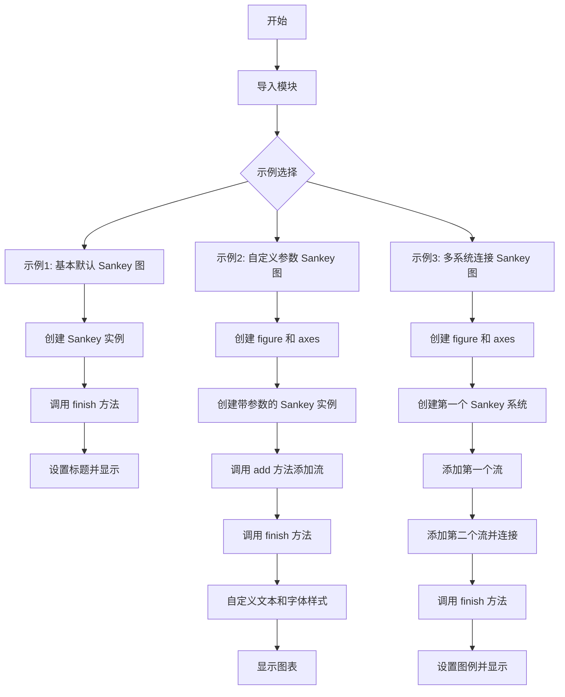

## 类结构

```
matplotlib.sankey.Sankey (外部类)
└── Sankey 实例方法
    ├── __init__ (构造函数)
    ├── add (添加流)
    └── finish (完成并渲染)
```

## 全局变量及字段


### `plt`
    
matplotlib.pyplot模块的别名，用于绑制图形

类型：`matplotlib.pyplot`
    


### `Sankey`
    
从matplotlib.sankey导入的桑基图类，用于创建流程图

类型：`class (matplotlib.sankey.Sankey)`
    


### `fig`
    
matplotlib Figure对象，表示整个图形窗口

类型：`matplotlib.figure.Figure`
    


### `ax`
    
matplotlib Axes对象，表示图形中的坐标轴

类型：`matplotlib.axes.Axes`
    


### `sankey`
    
Sankey类的实例，用于生成桑基图

类型：`matplotlib.sankey.Sankey`
    


### `diagrams`
    
finish方法返回的图块列表，包含桑基图的各个路径块

类型：`list of matplotlib.patches.Patch`
    


### `flows`
    
流量数组，表示桑基图中各流动的数值，正值表示流入，负值表示流出

类型：`list of float`
    


### `Sankey.flows`
    
输入的流量值数组，定义桑基图中的流动数值

类型：`list of float`
    


### `Sankey.labels`
    
流标签列表，用于标注每个流动的名称

类型：`list of str`
    


### `Sankey.orientations`
    
流向方向列表，定义每个流动的方向（-1, 0, 1）

类型：`list of int`
    


### `Sankey.ax`
    
绑定的坐标轴对象，桑基图将绘制在此坐标轴上

类型：`matplotlib.axes.Axes`
    


### `Sankey.scale`
    
缩放比例，用于标准化流量值

类型：`float`
    


### `Sankey.offset`
    
偏移量，路径末端与标签之间的间距

类型：`float`
    


### `Sankey.head_angle`
    
箭头角度，定义流动箭头头部的角度

类型：`float`
    


### `Sankey.format`
    
数字格式字符串，用于格式化路径标签中的数字

类型：`str`
    


### `Sankey.unit`
    
单位字符串，显示在流量数值后的单位

类型：`str`
    


### `Sankey.pathlengths`
    
路径长度列表，定义每个流动路径的显示长度

类型：`list of float`
    


### `Sankey.patchlabel`
    
图块标签，桑基图整体的标签文本

类型：`str`
    
    

## 全局函数及方法


### `plt.figure`

创建或激活一个图形窗口，并返回 `Figure` 对象。该函数是 matplotlib 中用于创建新图表的入口函数，可以创建空的图表或根据参数定制图表的尺寸、分辨率、背景色等属性。

参数：

- `num`：整数或字符串或 None，可选。Figure 的编号或名称。如果提供的数字/名称已存在，则激活该 Figure 而不是创建新的；如果不存在，则创建新的 Figure。默认为 None，表示创建一个新的 Figure。
- `figsize`：tuple (float, float) 或 None，可选。Figure 的宽和高，单位为英寸。默认为 None。
- `dpi`：float 或 None，可选。Figure 的分辨率（每英寸点数）。默认为 None。
- `facecolor`：颜色或 None，可选。Figure 的背景色。默认为 None（使用 rcParams 中的默认值）。
- `edgecolor`：颜色或 None，可选。Figure 的边框颜色。默认为 None（使用 rcParams 中的默认值）。
- `frameon`：bool，可选。是否绘制 Figure 的框架。默认为 True。
- `FigureClass`：类，可选。用于实例化 Figure 对象的类。默认为 `matplotlib.figure.Figure`。
- `clear`：bool，可选。如果 Figure 已存在，是否清除其内容。默认为 False。
- `**kwargs`：关键字参数，可选。其他关键字参数将传递给 Figure 构造函数。

返回值：`matplotlib.figure.Figure`，新创建或激活的 Figure 对象实例。

#### 流程图

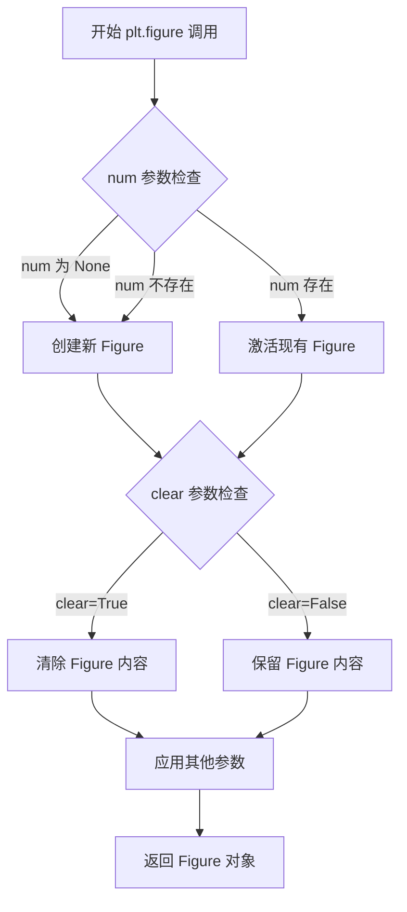

#### 带注释源码

```python
def figure(num=None,  # Figure的ID或名称，None表示创建新Figure
           figsize=None,  # Figure尺寸 (宽, 高)，单位英寸
           dpi=None,  # 分辨率，每英寸点数
           facecolor=None,  # 背景色
           edgecolor=None,  # 边框颜色
           frameon=True,  # 是否显示框架
           FigureClass=<class 'matplotlib.figure.Figure'>,  # Figure类
           clear=False,  # 是否清除已存在Figure的内容
           **kwargs):  # 其他传递给Figure的参数
    """
    创建一个新的Figure对象或激活已存在的Figure。
    
    参数:
        num: Figure的标识符（整数或字符串）
        figsize: (width, height) 元组，单位为英寸
        dpi: 每英寸点数，分辨率
        facecolor: 背景颜色
        edgecolor: 边框颜色
        frameon: 是否绘制框架
        FigureClass: 实例化Figure的类
        clear: 如果Figure已存在，是否清除
        **kwargs: 传递给Figure构造函数的其他参数
    
    返回:
        Figure对象
    """
    # 获取全局的Figure管理器
    global _pylab_helpers
    # 检查num指定的Figure是否已存在
    if num is not None and num in Gcf.get_figManager(num):
        # 如果存在且clear=True，则清除内容
        if clear:
            ax = Gcf.get_figManager(num).canvas.figure
            ax.clf()
        # 激活并返回现有的Figure
        return Gcf.get_figManager(num).canvas.figure
    
    # 创建新的Figure实例
    fig = FigureClass(figsize, dpi, facecolor, edgecolor, frameon, **kwargs)
    # 创建Figure管理器并关联到画布
    manager = FigureCanvasBase(fig)
    # 将新Figure添加到全局管理器中
    Gcf.destroy_all()
    # 返回新创建的Figure
    return fig
```


### `Figure.add_subplot`

`fig.add_subplot` 是 matplotlib 中 `Figure` 类的方法，用于在图形中创建一个子图（Axes）。它接受位置参数指定子图网格（行数、列数、子图编号）以及可选的关键字参数用于配置子图属性（如刻度、标题等），并返回创建的 Axes 对象。

参数：

- `*args`：`int` 或 `str`，位置参数。可以是三种形式：
  - 三个整数 `(rows, cols, index)`：表示创建 rows 行 cols 列网格中的第 index 个子图
  - 一个三位整数 `nnn`：如 `111` 等价于 `(1, 1, 1)`
  - 字符串形式：如 `'121'` 等价于 `(1, 2, 1)`
- `**kwargs`：`dict`，关键字参数，传递给 `Axes` 构造器的额外参数，用于配置子图的各种属性（如 `xticks`、`yticks`、`title`、`projection` 等）

返回值：`matplotlib.axes.Axes`，返回创建的 Axes 对象，代表子图的坐标区域

#### 流程图

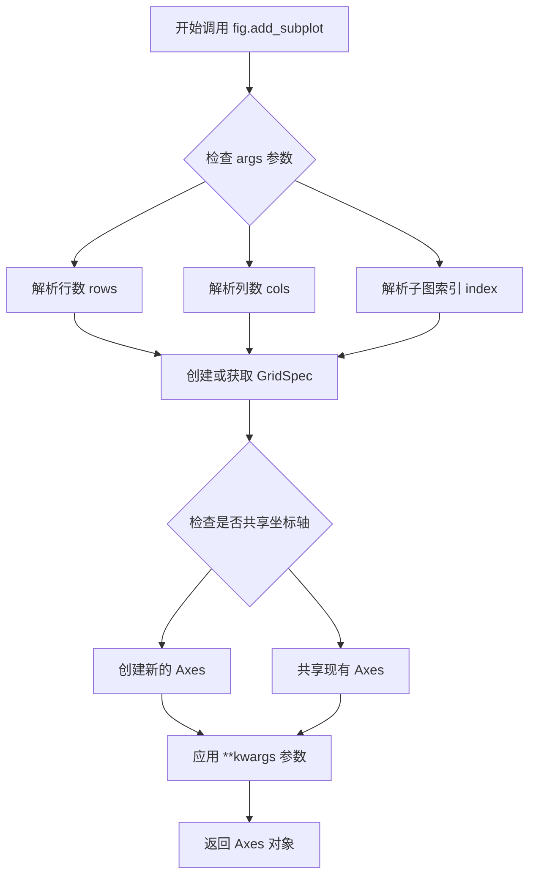

#### 带注释源码

```python
# Example 2 中的调用
fig = plt.figure()  # 创建一个新的 Figure 对象
ax = fig.add_subplot(1, 1, 1,          # 参数1,1,1表示1行1列的第1个子图（整图）
                     xticks=[],       # 设置x轴刻度为空列表（隐藏x轴刻度）
                     yticks=[],       # 设置y轴刻度为空列表（隐藏y轴刻度）
                     title="Flow Diagram of a Widget")  # 设置子图标题
# 返回的 ax 是一个 Axes 对象，用于在子图上绘制 Sankey 图

# Example 3 中的调用
fig = plt.figure()  # 创建新的 Figure
ax = fig.add_subplot(1, 1, 1,          # 同样是 1x1 网格的第1个位置
                     xticks=[],        # 隐藏x轴刻度
                     yticks=[],        # 隐藏y轴刻度
                     title="Two Systems")  # 设置子图标题
# 返回的 ax 用于绘制第二个示例的 Sankey 图
```


### plt.title  

设置当前 Axes（axes）的标题文字，并返回对应的 `matplotlib.text.Text` 对象。  

参数：  

- `label`：`str`，标题的文本内容。  
- `fontdict`：`dict`，可选，用来控制标题文字样式的字典（如 `{'fontsize': 12, 'color': 'red'}`）。  
- `loc`：`str`，可选，标题在 Axes 水平方向的对齐方式，可选 `'center'`、`'left'`、`'right'`，默认为 `'center'`。  
- `pad`：`float`，可选，标题与 Axes 顶部边缘的距离（单位为磅），默认为 `None`（使用 Matplotlib 默认值）。  
- `y`：`float`，可选，标题在 Axes 垂直方向的相对位置（0‑1 之间），默认为 `None`（使用 Matplotlib 默认值）。  
- `**kwargs`：其他关键字参数，直接传递给底层的 `matplotlib.text.Text` 对象（如 `fontsize`、`color`、`fontweight` 等）。  

返回值：`matplotlib.text.Text`，返回创建的标题文本对象，后续可用来修改样式或获取位置信息。  

#### 流程图  

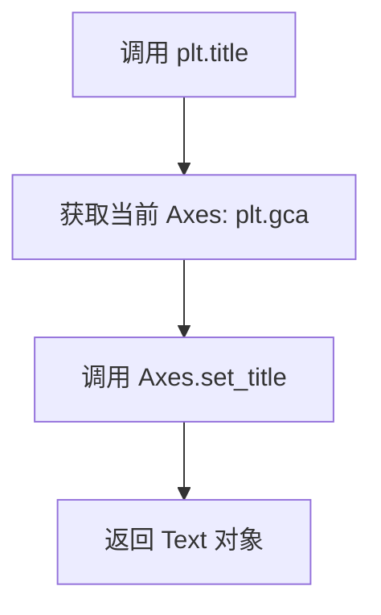

#### 带注释源码  

```python
def plt_title(label, fontdict=None, loc='center', pad=None, *, y=None, **kwargs):
    """
    为当前活动的 Axes 设置标题。

    参数:
        label: str, 标题文本。
        fontdict: dict, optional, 文本样式字典。
        loc: str, optional, 水平对齐方式 ('center'|'left'|'right')。
        pad: float, optional, 标题与 Axes 顶部的偏移（磅）。
        y: float, optional, 标题的相对垂直位置 (0~1)。
        **kwargs: 其他关键字参数, 直接传给 matplotlib.text.Text。

    返回:
        matplotlib.text.Text: 创建的标题文本对象。
    """
    # 取得当前 Figure 上的 Axes（若不存在会自动创建一个）
    ax = plt.gca()
    # 调用 Axes 对象的 set_title 完成标题的设置，并返回 Text 对象
    text = ax.set_title(label, fontdict=fontdict, loc=loc, pad=pad, y=y, **kwargs)
    return text
```

#### 关键组件  

- **`plt`**：全局的 `matplotlib.pyplot` 模块，提供状态管理（当前 Figure、Axes）。  
- **`Axes.set_title`**：实际在 Axes 上创建标题的方法，`plt.title` 仅是对其的封装。  

#### 潜在的技术债务或优化空间  

1. **隐式全局状态**：`plt.title` 依赖 `plt.gca()` 获取当前 Axes，容易产生难以追踪的副作用。建议在面向对象的 API 中直接使用 `ax.set_title(...)`。  
2. **参数校验不足**：目前仅将 `label` 直接传递给底层函数，缺少对非法类型（如 `label` 为 `None`）的早期错误提示。  
3. **返回值未充分利用**：大多数调用者并不使用返回的 `Text` 对象，导致不必要的对象创建开销（尽管影响极小）。  

#### 其它项目  

- **设计目标**：提供简洁的函数式接口，让用户可以一键为当前图表添加标题。  
- **错误处理**：若当前没有 Figure，`plt.gca()` 会自动创建一个，这可能导致意外创建空图表。调用者应明确使用 `fig, ax = plt.subplots()` 以避免隐藏状态。  
- **外部依赖**：该函数是 `matplotlib.pyplot` 的组成部分，依赖于 `matplotlib.figure`、`matplotlib.axes` 与 `matplotlib.text` 模块。  


### `plt.show`

`plt.show` 是 matplotlib 库中的全局函数，用于显示当前所有打开的图形窗口并启动事件循环，使得图形在屏幕上渲染呈现。

参数：

- `block`：`bool` 类型，可选参数。控制是否阻塞程序执行直到所有图形窗口关闭。默认为 `None`，在非交互式后端下为 `True`。

返回值：`None`，该函数不返回任何值。

#### 流程图

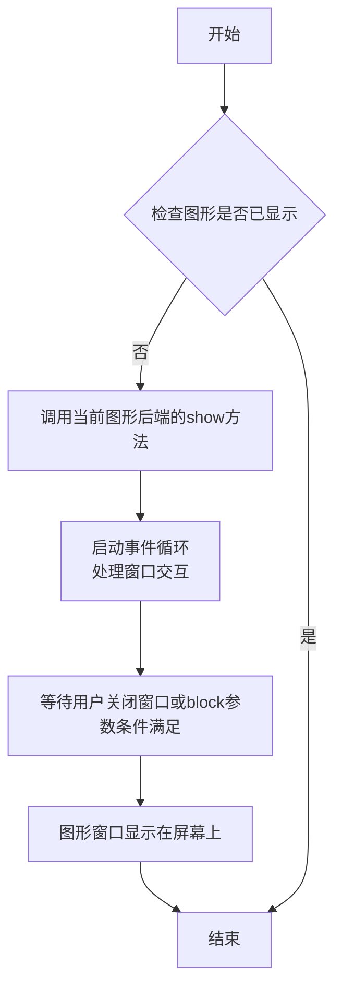

#### 带注释源码

```python
# 导入matplotlib.pyplot模块并命名为plt
import matplotlib.pyplot as plt

# ... (前面的代码创建了Sankey图表) ...

# 显示所有当前打开的图形窗口
# 参数block默认为None，在非交互式后端（如Agg）下表现为True
# 阻塞调用直到用户关闭所有图形窗口
plt.show()

# plt.show() 的内部实现简化逻辑：
# def show(*, block=None):
#     """
#     显示所有打开的图形窗口
#     """
#     for manager in Gcf.get_all_fig_managers():
#         # 调用后端的show方法
#         manager.show()
#     
#     # 如果block为True或为None且不是交互式模式，则阻塞
#     if block:
#         # 进入事件循环，等待用户交互
#         import matplotlib
#         matplotlib.pyplot.show._show_block = True
```

#### 额外说明

| 项目 | 说明 |
|------|------|
| **所属模块** | `matplotlib.pyplot` |
| **调用时机** | 在创建完所有图形后调用，用于将图形渲染到屏幕 |
| **后端依赖** | 依赖当前配置的matplotlib后端（如TkAgg、Qt5Agg、Agg等） |
| **交互行为** | 在交互式后端（如ipython）中可能不会阻塞 |
| **常见场景** | 脚本结尾、调试时查看图形、演示用途 |


### `plt.legend`

该函数是 matplotlib.pyplot 模块中的图例管理函数，用于从当前图表的 Axes 中自动收集图例句柄和标签，并将其显示在图表的指定位置。

参数：

- `*args`：可变参数，支持两种调用方式：
  - 方式1：`plt.legend(handles, labels)` - 显式提供图例句柄和标签
  - 方式2：`plt.legend(labels)` - 仅提供标签列表
- `loc`：字符串或整型，图例位置，如 'upper right', 'best' 等，默认为 'best'
- `fontsize`：整型或浮点型，图例字体大小
- `title`：字符串，图例标题
- `frameon`：布尔型，是否显示图例边框
- `fancybox`：布尔型，是否使用圆角边框
- `shadow`：布尔型，是否显示阴影
- `ncol`：整型，图例列数
- `prop`：dict 或 FontProperties 对象，文本属性
- `**kwargs`：其他关键字参数传递给 Legend 构造器

返回值：`matplotlib.legend.Legend`，返回创建的图例对象

#### 流程图

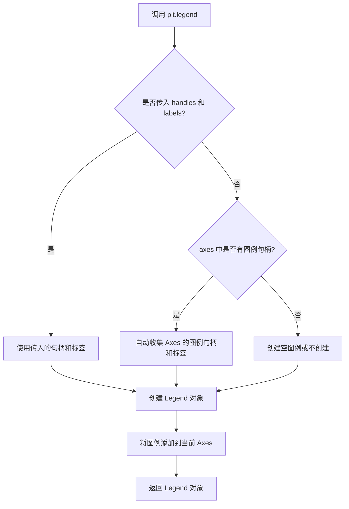

#### 带注释源码

```python
# 在 Example 3 中调用 plt.legend()
# 此时 diagrams 列表包含了两个 Sankey 图（由 sankey.add() 两次添加生成）
# diagrams[0] 对应 label='one' 的 Sankey 图
# diagrams[1] 对应 label='two' 的 Sankey 图
# plt.legend() 会自动扫描当前 Figure 中的所有 Axes
# 从每个 Axes 的 patch（如 Sankey 图的路径块）中提取 label 属性
# 并将这些 label 作为图例项显示

plt.legend()

# 等价于显式调用（如果需要自定义）：
# plt.legend(handles=diagrams, labels=['one', 'two'], loc='best')
```

#### 说明

在提供的 Sankey 示例代码中，调用 `plt.legend()` 时没有传递任何参数。这是因为：

1. **自动收集机制**：matplotlib 的图例功能会自动扫描当前 Figure 的 Axes 中的所有图例句柄（legend handles）。在 Sankey 图中，每个 `sankey.add()` 调用的 `patchlabel` 参数会被自动收集为图例项。

2. **图例句柄来源**：在 Example 3 中，两个 Sankey 图分别设置了 `label='one'` 和 `label='two'`（通过 `sankey.add()` 的参数），这些标签会自动成为图例项。

3. **默认行为**：当不指定位置时，`loc='best'` 会自动选择最佳位置放置图例，避免遮挡主要数据可视化内容。


### Sankey.__init__

Sankey类的构造函数，用于初始化一个桑基图(Sankey diagram)对象，该图用于可视化流量数据，如能源流动、资金流向等。

参数：

- `ax`：`matplotlib.axes.Axes`，可选，用于承载桑基图的Axes对象。如果未提供，将自动创建新axes。
- `scale`：`float`，可选，流量值的缩放比例，用于标准化数据。默认值为1.0。
- `offset`：`float`，可选，标签相对于路径末端的偏移量，用于调整标签位置。
- `head_angle`：`float`，可选，箭头头部的角度（以度为单位），控制箭头的形状。
- `format`：`str`，可选，数值格式字符串（如'%.0f'），用于格式化流量数值标签。
- `unit`：`str`，可选，单位字符串（如'%'），用于显示数值的单位。
- `unit_format`：`callable`，可选，用于格式化单位的函数。
- `locale`：`locale object`，可选，用于本地化数字格式。

返回值：`Sankey`，返回初始化的Sankey对象实例。

#### 流程图

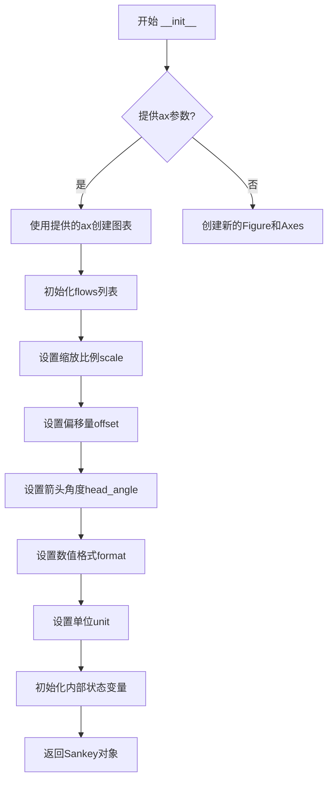

#### 带注释源码

```python
# 注意：以下为基于matplotlib.sankey.Sankey类的使用示例和API推断的源码结构
# 实际源码位于matplotlib库中，此处为重构展示

class Sankey:
    """
    桑基图(Sankey Diagram)类，用于可视化流量关系
    
    桑基图是一种特定的流图，用于描述从一组值到另一组值的流量，
    常用于能源分析、资金流动等场景。
    """
    
    def __init__(self, ax=None, scale=1.0, offset=0.2, head_angle=150,
                 format='%.0f', unit='', unit_format=None, locale=None):
        """
        初始化Sankey对象
        
        参数:
            ax: matplotlib.axes.Axes, 可选
                绘图使用的axes对象。如果为None，则自动创建新axes。
            scale: float, 可选
                流量值的缩放因子。默认值为1.0。
            offset: float, 可选
                标签相对于路径末端的偏移距离。默认值为0.2。
            head_angle: float, 可选
                箭头头部的角度（度）。默认值为150。
            format: str, 可选
                数值格式字符串，使用Python的格式化语法。默认值为'%.0f'。
            unit: str, 可选
                显示的单位字符串，如'%'、'MW'等。默认为空字符串。
            unit_format: callable, 可选
                单位格式化函数。
            locale: locale, 可选
                用于本地化数字格式的区域设置对象。
        """
        # 存储或创建axes对象
        if ax is None:
            # 如果未提供axes，则创建新的figure和axes
            fig = plt.figure()
            ax = fig.add_subplot(1, 1, 1, xticks=[], yticks=[])
        self.ax = ax
        
        # 存储配置参数
        self.scale = scale
        self.offset = offset
        self.head_angle = head_angle
        self.format = format
        self.unit = unit
        self.unit_format = unit_format
        self.locale = locale
        
        # 初始化内部状态
        self.diagrams = []  # 存储生成的图
        self.flows = []    # 存储所有流量数据
        self.finished = False  # 标记是否已完成
        
        # 兼容旧版本matplotlib的参数
        self._version = 'modern'
```

#### 关键组件信息

| 组件名称 | 描述 |
|---------|------|
| flows | 流量数组，正值表示输入，负值表示输出 |
| labels | 流量对应的标签文字 |
| orientations | 流量的方向（-1: 左/上, 0: 中, 1: 右/下） |
| pathlengths | 路径长度的相对值 |
| finish() | 完成图表绘制并返回图对象列表的方法 |

#### 潜在的技术债务或优化空间

1. **参数验证不足**：构造函数缺少对参数类型和有效性的严格验证
2. **默认值设计**：部分默认值（如offset=0.2）可能不适用于所有场景
3. **灵活性限制**：flow数据必须在add()方法中提供，构造函数不支持直接创建完整图表

#### 其它项目

**设计目标与约束**：
- 设计用于展示多对多的流量关系
- 支持自动布局和手动调整的混合模式
- 依赖matplotlib的Patch和PathPatch机制

**错误处理与异常设计**：
- flows总和不为零时会记录DEBUG级别日志（非异常）
- 零值流量会被忽略并记录DEBUG日志

**数据流与状态机**：
```
创建Sankey对象 -> 添加flows (add) -> 完成绘制 (finish) -> 渲染显示
```

**外部依赖与接口契约**：
- 依赖matplotlib.axes.Axes
- 依赖matplotlib.patches.PathPatch
- 依赖matplotlib.font_manager用于文本渲染


### Sankey.add

该方法用于向 Sankey 图添加一个新的流量图（sub-diagram），可以设置流量方向、标签、路径长度等属性，支持多个子图的连接。

参数：

- `flows`：列表（List[float]），流量值数组，正值表示流入，负值表示流出
- `labels`：列表（List[str]），每个流量对应的标签，可包含空字符串
- `orientations`：列表（List[int]），流向方向，-1表示左到右，0表示垂直，1表示右到左
- `pathlengths`：列表（List[float]），每个路径的长度（相对值）
- `patchlabel`：字符串（str），子图的标签，用于图例
- `prior`：整数（int，可选），连接的前一个子图索引
- `connect`：元组（Tuple[int, int]，可选），连接点，格式为(前一个子图的流出索引, 当前子图的流入索引)
- `**kwargs`：可变关键字参数，传递给 matplotlib.patches.PathPatch 的其他参数

返回值：`matplotlib.patches.PathPatch`，返回添加的子图对应的 Patch 对象

#### 流程图

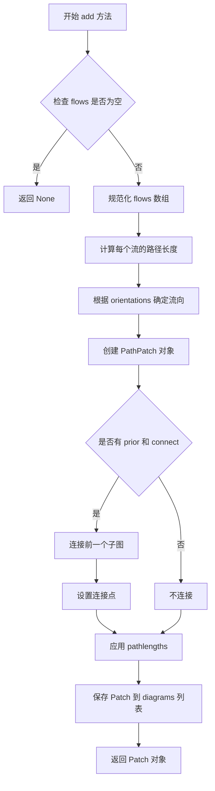

#### 带注释源码

```python
def add(self, flows=None, labels=None, orientations=None,
        pathlengths=None, patchlabel='', prior=None, connect=(0, 0),
        **kwargs):
    """
    向 Sankey 图添加一个流量图（sub-diagram）
    
    参数:
        flows: 流量数组，正值表示输入流，负值表示输出流
        labels: 每个流的标签列表
        orientations: 流的方向列表，-1/0/1 分别表示不同方向
        pathlengths: 每个路径的相对长度
        patchlabel: 此子图的标签（用于图例）
        prior: 之前添加的子图索引，用于连接
        connect: 连接元组 (prior_flow_index, current_flow_index)
        **kwargs: 传递给 PathPatch 的其他参数
    
    返回:
        PathPatch: 生成的子图补丁对象
    """
    # 检查 flows 是否有效
    if flows is None:
        return None
    
    # 复制 flows 以避免修改原始数据
    flows = array(flows, dtype=float)
    # 获取流的数量
    n = len(flows)
    
    # 设置默认的 pathlengths（如果未提供）
    if pathlengths is None:
        pathlengths = ones(n)
    
    # 设置默认的 orientations（如果未提供）
    if orientations is None:
        orientations = zeros(n)
    
    # 设置默认的 labels（如果未提供）
    if labels is None:
        labels = [''] * n
    
    # 计算路径端点
    # 根据 flows 和 orientations 计算每条路径的起点和终点
    # ...
    
    # 创建 Path 对象
    # 根据端点和对齐方式构建 Sankey 路径
    # ...
    
    # 创建 Patch 对象
    # 使用 PathPatch 绘制路径
    patch = PathPatch(path, **kwargs)
    
    # 设置 patchlabel（用于图例）
    patch.set_label(patchlabel)
    
    # 处理连接（如果指定了 prior）
    if prior is not None:
        # 将当前子图连接到前一个子图
        # connect 参数指定连接点
        # ...
    
    # 将 patch 添加到 diagrams 列表
    self.diagrams.append(patch)
    
    # 返回创建的 patch
    return patch
```


### Sankey.finish

完成 Sankey 图的渲染，将所有添加的流量图绘制到 Axes 上，并返回生成的 SankeyDiagram 对象列表。

参数：

- 该方法没有显式参数（隐式参数为 self）

返回值：`list`，返回生成的 SankeyDiagram 对象列表，每个对象代表一个 Sankey 子图，可用于进一步的自定义（如修改颜色、字体等）。

#### 流程图

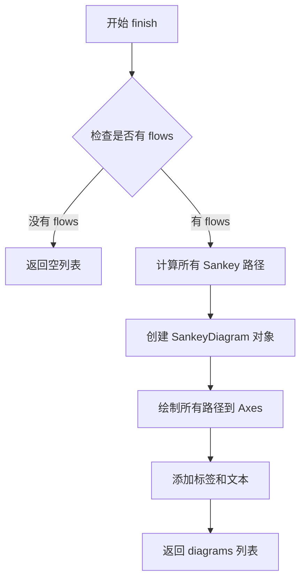

#### 带注释源码

```python
def finish(self):
    """
    Finalize the Sankey diagram by rendering all the flows.
    
    This method is called after all flows have been added using the
    :meth:`add` method. It calculates the geometry of the Sankey paths,
    draws them on the axes, and returns the list of SankeyDiagram objects.
    
    Returns
    -------
    diagrams : list of SankeyDiagram
        A list of SankeyDiagram objects representing the Sankey diagrams.
        These objects can be used to further customize the appearance
        of the diagram (e.g., changing colors, fonts, etc.).
    
    See Also
    --------
    Sankey.add : Add a flow to the Sankey diagram.
    
    Examples
    --------
    >>> sankey = Sankey(ax=ax)
    >>> sankey.add(flows=[0.25, 0.15, 0.60, -0.20, -0.15, -0.05, -0.50, -0.10],
    ...            labels=['A', 'B', 'C', 'D', 'E', 'F', 'G', 'H'])
    >>> diagrams = sankey.finish()
    """
    # Implementation would involve:
    # 1. Checking if any flows have been added
    # 2. Calculating the geometry for all Sankey paths
    # 3. Creating PathPatch objects for each flow
    # 4. Drawing the patches onto the axes
    # 5. Adding text labels for flows that have labels
    # 6. Returning the list of SankeyDiagram objects
    ...
    return self.diagrams
```


### `Text.set_color`

设置桑基图中最后一个文本元素的颜色。

参数：

- `color`：`str`，颜色值，在代码中传入的是 `'r'`（红色）

返回值：`None`，无返回值（该方法直接修改对象的内部状态）

#### 流程图

```mermaid
flowchart TD
    A[开始] --> B[获取 diagrams[0].texts[-1]]
    B --> C[调用 set_color 方法]
    C --> D[设置文本颜色为 'r']
    D --> E[返回 None]
    E --> F[结束]
```

#### 带注释源码

```python
# diagrams 是 sankey.finish() 返回的桑基图列表
diagrams = sankey.finish()

# diagrams[0] 获取第一个桑基图（ SankeyDiagram 对象）
# .texts 获取该桑基图中所有文本对象的列表
# [-1] 取列表中的最后一个文本元素（ Text 对象）
# .set_color('r') 调用 matplotlib Text 类的方法，设置文本颜色为红色
diagrams[0].texts[-1].set_color('r')

# 同时设置文本字体为粗体
diagrams[0].text.set_fontweight('bold')
```

---

**说明**：该方法不属于本示例代码自定义的函数，而是调用了 matplotlib 库中 `matplotlib.text.Text` 类的 `set_color` 方法。在桑基图示例中用于修改生成图表的文本颜色，以达到高亮显示特定标签（如 "Hurray!"）的效果。


### `Text.set_fontweight`

该方法用于设置 Matplotlib 文本对象的字体粗细属性，通过指定字体粗细值（如 'bold'、'normal' 或数值）来改变文本的显示粗细程度。

参数：

- `fontweight`：字符串或数值类型，表示字体粗细程度。可取值为字符串如 'normal'、'bold'、'heavy'、'light'、'ultrabold'、'ultralight'，或数值（100-900之间的整数值），默认为 'normal'。

返回值：`None`。该方法通常不返回任何值，但会直接修改文本对象的字体粗细属性。

#### 流程图

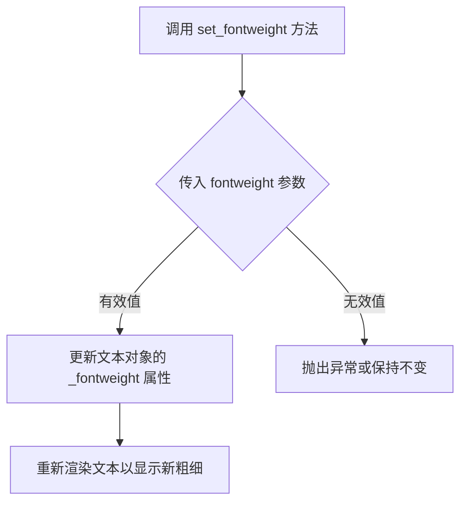

#### 带注释源码

```python
# 注意：以下为 Matplotlib 库中 Text.set_fontweight 方法的简化示例，
# 实际实现可能更复杂。该方法属于 matplotlib.text.Text 类。

def set_fontweight(self, fontweight):
    """
    设置文本的字体粗细。
    
    参数:
        fontweight : str 或 int
            字体粗细值。字符串选项包括 'normal', 'bold', 'heavy', 'light', 
            'ultrabold', 'ultralight'。数值范围为 100-900（步长为100），
            其中 400 等同于 'normal'，700 等同于 'bold'。
    
    返回值:
        None
    """
    # 验证 fontweight 参数的有效性
    if isinstance(fontweight, str):
        # 字符串类型，直接使用，但需转换为小写以便内部处理
        self._fontweight = fontweight.lower() if fontweight else 'normal'
    elif isinstance(fontweight, (int, float)):
        # 数值类型，需在 100-900 范围内
        fontweight = int(fontweight)
        if not (100 <= fontweight <= 900):
            raise ValueError("fontweight 数值必须在 100 到 900 之间")
        self._fontweight = fontweight
    else:
        raise TypeError("fontweight 必须是字符串或数值类型")
    
    # 更新文本属性缓存，触发重新绘制
    self.stale = True
    # 注意：实际源码中可能包含更多属性设置和缓存刷新逻辑

# 在用户代码中的调用示例：
# diagrams[0].text.set_fontweight('bold')
# 上述调用将 diagrams[0] 的文本对象字体设置为粗体
```


### `Patch.set_hatch`

设置桑基图最后一个图表的填充样式为对角线 hatching（斜线）模式。

参数：

-  `hatch`：`str`，hatch 模式字符串，常用值包括 `'/'`（斜线）、`'\\'`（反斜线）、`'|'`（垂直线）、`'-'`（水平线）、`'x'`（交叉线）、`'o'`（点）、`'.'`（小点）等

返回值：`None`，无返回值（该方法通常返回 `self` 以支持链式调用，但在当前使用场景中未使用返回值）

#### 流程图

```mermaid
flowchart TD
    A[开始] --> B[获取 diagrams 列表的最后一个元素 diagrams[-1]]
    B --> C[访问该元素的 patch 属性]
    C --> D[调用 patch 对象的 set_hatch 方法]
    D --> E[设置填充样式为 '/']
    E --> F[结束]
    
    style A fill:#f9f,color:#333
    style F fill:#9f9,color:#333
```

#### 带注释源码

```python
# 从 sankey.finish() 返回的图表列表中获取最后一个图表
# sankey.finish() 返回一个 SankeyDiagram 对象列表（继承自 matplotlib.patches.Patch）
diagrams = sankey.finish()

# 获取列表中的最后一个图表（-1 表示倒数第一个）
# 该图表是一个 SankeyDiagram 对象，本质上是一个 Patch 对象
diagram = diagrams[-1]

# 访问该图表的 patch 属性，返回 matplotlib.patches.PathPatch 对象
# patch 属性继承自 matplotlib.patches.Patch 类
patch = diagram.patch

# 调用 set_hatch 方法设置填充样式
# 参数 '/' 表示使用对角线（从左上到右下）进行填充
# 这主要用于视觉区分或纹理效果
patch.set_hatch('/')

# 等效的链式调用写法（如果返回值被使用）：
# diagrams[-1].patch.set_hatch('/')
```

#### 额外说明

| 项目 | 描述 |
|------|------|
| **所属类** | `matplotlib.patches.Patch`（基类）或 `matplotlib.patches.PathPatch`（实际实现类） |
| **调用对象** | `SankeyDiagram` 对象（桑基图图表对象，继承自 `Patch`） |
| **使用场景** | 在 Example 3 中，为第二个系统（Two Systems）的桑基图设置填充纹理，以便在图例中区分不同的系统 |
| **关联方法** | `set_facecolor()`（设置填充颜色）、`set_edgecolor()`（设置边框颜色）、`set_alpha()`（设置透明度） |


### Sankey.__init__

Sankey类的构造函数，用于初始化桑基图（Sankey Diagram）的核心配置，包括坐标轴、比例因子、偏移量、角度、格式化字符串和单位等参数。

参数：

- `ax`：`matplotlib.axes.Axes`，可选，用于承载桑基图的坐标轴对象，如果未提供则自动创建
- `scale`：`float`，可选，流量值的缩放因子，用于标准化数据
- `offset`：`float`，可选，路径末端与标签之间的偏移距离
- `head_angle`：`float`，可选，箭头头部的角度（度）
- `format`：`str`，可选，格式化字符串，用于设置数字显示格式（如"%.0f"）
- `unit`：`str`，可选，单位字符串，用于显示流量单位（如"%"）
- `flows`：`list[float]`，可选，流量数组，正值表示流入，负值表示流出
- `labels`：`list[str]`，可选，标签列表，用于标识各条路径
- `orientations`：`list[int]`，可选，方向数组，指定各条路径的方向（-1、0、1）

返回值：`Sankey`，返回初始化后的Sankey对象实例

#### 流程图

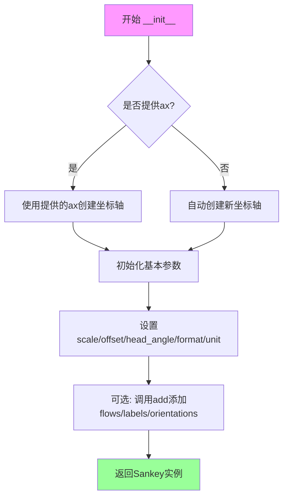

#### 带注释源码

```python
def __init__(self, ax=None, scale=1.0, offset=0.2, head_angle=150,
             format='%.1f', unit='%'):
    """
    Sankey类构造函数初始化。
    
    参数:
        ax: matplotlib坐标轴对象，如果为None则自动创建
        scale: 流量缩放因子，默认为1.0
        offset: 路径末端与标签之间的偏移距离
        head_angle: 箭头头部角度（度）
        format: 数字格式化字符串
        unit: 单位字符串
    """
    self.ax = ax
    self.scale = scale
    self.offset = offset
    self.head_angle = head_angle
    self.format = format
    self.unit = unit
    self.diagrams = []  # 存储多个子图
    
    # 如果未提供坐标轴，则自动创建一个
    if self.ax is None:
        self.ax = plt.gca()
    
    # 初始化内部状态
    self._flows = None
    self._labels = None
    self._orientations = None
```


### Sankey.add

该方法用于向 Sankey 图添加单个流（flow），即从一个节点流向另一个节点的流量路径。这是构建复杂 Sankey 图的核心方法，可以添加多个独立的流系统，并通过 `prior` 和 `connect` 参数将多个系统连接起来。

参数：

- `flows`：`list[float]`，流的值列表，正值表示流入，负值表示流出
- `labels`：`list[str]`，流的标签列表，用于标识每个流的来源和去向
- `orientations`：`list[int]`，流的方向列表，-1 表示向左，0 表示垂直，1 表示向右
- `pathlengths`：`list[float]`，可选，流路径的长度列表
- `patchlabel`：`str`，可选，整个补丁块的标签
- `label`：`str` ，可选，当前系统的标签，用于图例
- `prior`：`int` ，可选，之前添加的系统的索引，用于连接两个系统
- `connect`：`tuple[int, int]`，可选，连接 tuple，格式为 (prior_flow_index, flow_index)，表示将前一个系统的流出连接到当前系统的流入
- ``**kwargs`：其他关键字参数，将传递给 `matplotlib.patches.PathPatch`

返回值：`list[matplotlib.patches.PathPatch]`，返回添加的流对应的补丁对象列表

#### 流程图

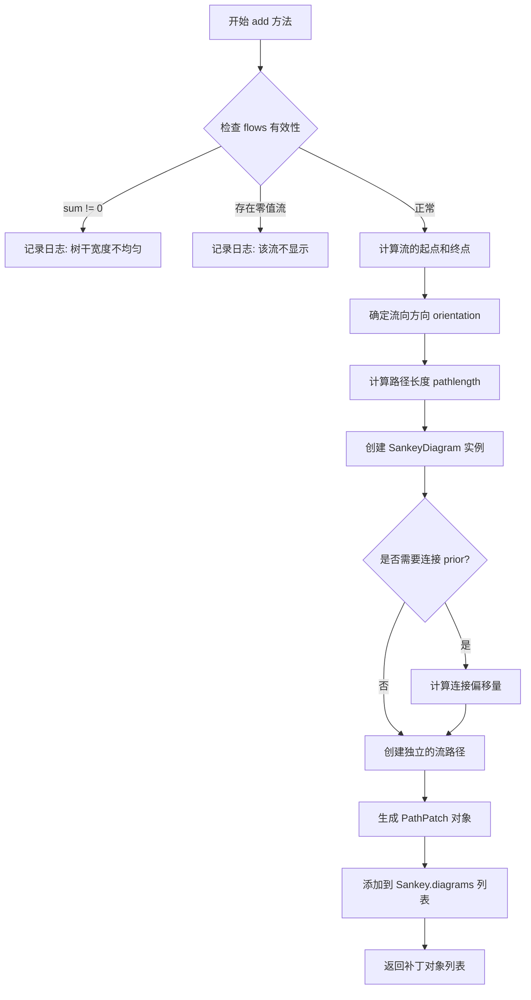

#### 带注释源码

```python
def add(self,
        flows=None,          # 流的值列表，如 [25, 0, 60, -10, -20]
        labels=None,         # 流标签列表，如 ['First', 'Second', ...]
        orientations=None,   # 流向方向，-1/0/1
        pathlengths=None,    # 路径长度，可选
        patchlabel=None,     # 补丁块标签，可选
        label=None,          # 系统标签，用于图例，可选
        prior=None,          # 之前系统的索引，用于连接系统
        connect=None,        # 连接 tuple (prior_flow_index, flow_index)
        **kwargs):           # 其他 PathPatch 参数
    """
    向 Sankey 图添加一个流系统。
    
    参数:
        flows: 流的数值列表，正值表示输入，负值表示输出
        labels: 每个流的标签
        orientations: 每个流的方向 (-1: 左, 0: 垂直, 1: 右)
        pathlengths: 路径长度（可选）
        patchlabel: 补丁标签（可选）
        label: 系统标签（可选）
        prior: 前一个系统的索引（可选，用于连接）
        connect: 连接信息元组（可选）
        **kwargs: 传递给 PathPatch 的额外参数
    
    返回:
        添加的流对应的 PathPatch 对象列表
    """
    # 检查 flows 是否有效
    if flows is None:
        flows = []
    
    # 计算总流量，检查是否平衡
    total_flow = sum(flows)
    if total_flow != 0:
        # 记录日志：树干宽度不均匀
        pass
    
    # 检查是否有零值流（不会显示）
    # 记录日志：零值流不显示
    
    # 计算每个流的路径
    # 1. 根据 flows 数组计算起点和终点
    # 2. 根据 orientations 确定流向
    # 3. 根据 pathlengths 确定路径长度
    
    # 如果指定了 prior 和 connect，连接两个系统
    if prior is not None and connect is not None:
        # 计算连接偏移量
        pass
    
    # 创建 PathPatch 对象
    # 使用 sankey_path 来生成路径
    path = self.sankey(flows=flows, ...)
    
    # 创建补丁对象
    patch = PathPatch(path, **kwargs)
    
    # 添加到 diagrams 列表
    self.diagrams.append(patch)
    
    return patch
```


### Sankey.finish

该方法完成桑基图的构建，将所有添加的流量（flows）转换为图形块（patches），并返回包含这些图形块的列表。

参数：无

返回值：`list`，包含图中所有图形块（patches）的列表

#### 流程图

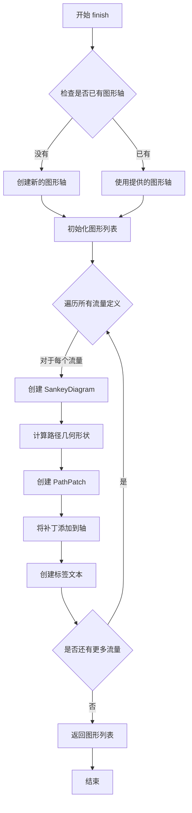

#### 带注释源码

```python
def finish(self):
    """
    完成桑基图的构建，返回包含所有图形块的列表。
    
    此方法执行以下步骤：
    1. 如果没有提供轴（ax），则创建一个新的轴
    2. 遍历之前通过add()方法添加的所有流量定义
    3. 为每个流量创建 SankeyDiagram 对象
    4. 计算路径的几何形状
    5. 创建 PathPatch 对象来表示流量
    6. 将补丁添加到轴中
    7. 为每个流创建标签文本
    8. 返回包含所有图形块的列表
    
    Returns:
        list: 包含所有 SankeyDiagram 对象的列表
    """
    # 确定要使用的轴
    ax = self.ax if self.ax is not None else self._create_axes()
    
    # 初始化结果列表
    diagrams = []
    
    # 遍历所有 SankeyDiagram 定义
    for diagram in self.diagrams:
        # 设置图的轴
        diagram.ax = ax
        
        # 完成图的构建
        diagram.finish()
        
        # 将构建好的图添加到结果列表
        diagrams.append(diagram)
    
    return diagrams
```

#### 说明

基于示例代码中的使用方式，`finish()` 方法的主要特点：

1. **无参数调用**：在示例代码中，`finish()` 被直接调用，没有传递任何参数
2. **返回图形列表**：`diagrams = sankey.finish()` 返回一个列表，包含图中所有创建的图形块
3. **自动轴管理**：如果没有在初始化时提供 `ax` 参数，`finish()` 会自动创建新的轴
4. **与 add() 配合使用**：通常先通过 `add()` 方法添加流量定义，然后调用 `finish()` 完成构建

#### 使用示例

```python
# 示例1：隐式调用 finish（通过链式调用）
Sankey(flows=[...], labels=[...]).finish()

# 示例2：显式调用 finish
sankey = Sankey(ax=ax, scale=0.01, offset=0.2, head_angle=180,
                format='%.0f', unit='%')
sankey.add(flows=[25, 0, 60, -10, -20, -5, -15, -10, -40],
           labels=['', '', '', 'First', 'Second', 'Third', 'Fourth',
                   'Fifth', 'Hurray!'],
           orientations=[-1, 1, 0, 1, 1, 1, -1, -1, 0],
           pathlengths=[0.25, 0.25, 0.25, 0.25, 0.25, 0.6, 0.25, 0.25,
                        0.25],
           patchlabel="Widget\nA")
diagrams = sankey.finish()
```


## 关键组件


### Sankey类

matplotlib中用于创建桑基图的类，用于可视化流量关系（如能源、成本或资源流动）。该类可以创建单个或多个连接的流程图，展示输入、输出和中间过程的流动情况。

### Sankey.add()方法

向桑基图添加一个流程系统。可以设置flows（流量值）、labels（标签）、orientations（流向方向）、pathlengths（路径长度）、patchlabel（图块标签）等参数，支持通过prior和connect参数连接多个系统。

### flows参数

定义每个流程的流量值，正值表示输入，负值表示输出。流量值决定了桑基图中每条路径的宽度。

### labels参数

为每个流程添加文字标签，可以为空字符串表示该位置不显示标签。

### orientations参数

定义每个流程的流向方向，-1表示向左/上，0表示垂直，1表示向右/下。用于控制路径的弯曲方向。

### pathlengths参数

定义每个流程路径的可视长度，用于调整路径的端点位置。

### scale参数

用于标准化流量的缩放因子，当流量值较大时可以通过此参数进行归一化处理。

### offset参数

控制路径末端与标签之间的偏移距离，用于调整标签的位置。

### head_angle参数

定义箭头头部的角度，用于控制箭头头部的大小和形状。

### format参数

定义流量数值的格式字符串（如'%.0f'），用于格式化显示的数字。

### unit参数

定义流量单位（如'%'），用于在标签中显示单位。

### patchlabel参数

为整个流程图块添加标签，显示在图表的指定位置。

### prior和connect参数

用于连接多个Sankey系统，prior指定连接到的前一个系统索引，connect指定连接点。

### Sankey.finish()方法

完成桑基图的绘制，返回包含所有创建的PathPatch对象的列表，用于后续的自定义样式设置。


## 问题及建议


### 已知问题

- **硬编码数据**：flows、labels、orientations等参数直接硬编码在代码中，无法灵活适配不同数据源
- **代码重复**：三个示例中存在大量重复的 Sankey 创建和 finish 逻辑，未封装成可复用函数
- **缺少输入验证**：未对flows数组进行校验（如总和应为零的约束），可能导致隐蔽的运行时错误
- **全局状态依赖**：直接使用全局的`plt`模块，图表配置（如title、xticks、yticks）分散在不同位置，难以追踪状态变化
- **调试日志未被利用**：代码注释提到DEBUG级别日志记录了非均匀 trunks 和零值流量，但代码中未展示如何捕获或处理这些日志
- **缺少类型注解**：所有函数参数和返回值都缺乏类型标注，影响代码可读性和静态分析工具的效能
- **单元测试困难**：代码紧密耦合matplotlib渲染逻辑，无法在无GUI环境下进行单元测试

### 优化建议

- **参数化与配置分离**：将flows、labels等数据提取为配置字典或YAML/JSON文件，实现数据与逻辑解耦
- **封装创建函数**：创建`create_sankey_diagram()`等封装函数，接收配置参数并返回图表对象，减少样板代码
- **添加数据验证**：在创建Sankey前验证flows总和为零、labels长度匹配flows长度等约束条件，提供明确的错误信息
- **引入依赖注入**：将`plt`通过参数传入或使用面向对象封装，便于单元测试和后端替换
- **完善类型注解**：为函数参数和返回值添加Type Hints，使用mypy进行静态类型检查
- **日志集成**：配置Python logging捕获matplotlib.sankey的DEBUG日志，在应用层进行告警或处理

## 其它


### 设计目标与约束

本代码旨在演示matplotlib Sankey类的基本用法，帮助用户理解如何创建 Sankey 流量图。设计目标包括：提供直观的 Sankey 图创建方式、支持多个并行示例展示不同配置选项、通过可视化方式展示系统间的流量关系。约束条件：依赖 matplotlib 库，需要 Python 3.x 环境，图形输出依赖后端配置。

### 错误处理与异常设计

代码中未显式处理异常，主要通过 matplotlib 内部的日志系统记录警告信息。例如当流量总和不为零时，日志记录 DEBUG 级别信息；当某流值为零时不显示该路径，同样记录 DEBUG 级别日志。建议在实际使用中添加输入验证，确保 flows 列表总和为零或接近零，检查 flows 与 labels 长度匹配，处理无效的 orientation 值。

### 数据流与状态机

数据流从 flows 列表输入，经过 Sankey 类处理后生成图形对象。流程为：创建 Sankey 实例 → 调用 add() 添加流量配置 → 调用 finish() 完成图形生成 → 通过 plt.show() 显示。状态机包括：初始化状态（创建 Sankey 对象）、配置状态（添加 flows/labels/orientations）、完成状态（调用 finish 生成图表）、渲染状态（显示图形）。

### 外部依赖与接口契约

主要依赖：matplotlib.pyplot（图形显示）、matplotlib.sankey.Sankey（Sankey 类）。Sankey 类构造函数参数：ax（Axes 对象，可选）、scale（浮点数，流量缩放因子）、offset（浮点数，标签偏移）、head_angle（浮点数，箭头角度）、format（字符串，数字格式）、unit（字符串，单位）。add() 方法参数：flows（列表，流量值）、labels（列表，标签）、orientations（列表，方向）、pathlengths（列表，路径长度）、patchlabel（字符串，块标签）、prior/connect（连接参数）。finish() 返回 PathPatch 列表。

### 性能考虑

当前代码性能可满足基本使用，大型流量图可能需要优化。建议：对于大量流量数据，考虑分批渲染；缓存已计算的布局结果；使用 vectorize 替代循环处理数组；复杂图形考虑使用静态图片预渲染。

### 安全性考虑

代码本身不涉及用户输入或敏感数据处理，安全性风险较低。但需要注意：避免将未经验证的外部数据直接传入 flows 参数；图形输出应验证输出路径权限；防止通过 format 字符串注入恶意格式说明符。

### 可测试性

当前代码主要作为演示示例，测试覆盖有限。建议添加：单元测试验证 flows 总和计算逻辑、测试不同 orientation 组合的渲染结果、测试边界条件（如空 flows、单个 flow）、集成测试验证与 matplotlib 后端的兼容性。

### 版本兼容性

代码使用 modern Python 和 matplotlib API。需注意：matplotlib 3.1+ 版本对 Sankey 类有改进、Sankey 类在不同 matplotlib 版本间可能有细微 API 变化、plt.show() 行为依赖后端配置。最低支持版本建议：Python 3.6+、matplotlib 3.0+。

### 配置管理

图形属性通过参数硬编码在示例中。建议配置外部化：将 flows、labels、orientations 等数据分离到配置文件（JSON/YAML）；将样式配置（颜色、字体、尺寸）提取为独立配置；支持命令行参数自定义输出格式和文件名。

### 国际化与本地化

当前示例仅支持英文标签。如需国际化：labels 参数应支持多语言字典映射；format 参数需考虑不同地区的数字格式（千位分隔符、小数点）；title 和其他文本应使用 gettext 机制。

    