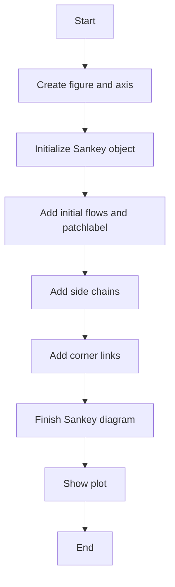
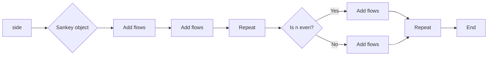
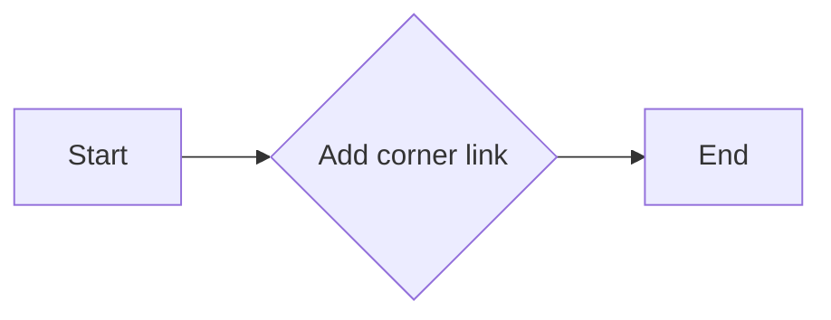
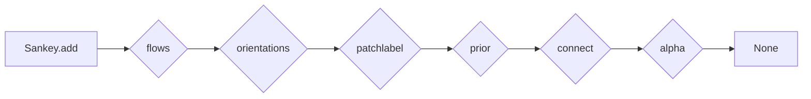
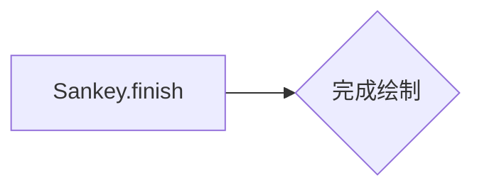

# `matplotlib\galleries\examples\specialty_plots\sankey_links.py` 详细设计文档

This code demonstrates the use of the Sankey class from the matplotlib library to create a complex Sankey diagram with a long chain of connections.

## 整体流程



## 类结构

```
SankeyDemo (主模块)
├── matplotlib.pyplot (绘图库)
│   ├── figure (创建图形)
│   ├── subplot (创建子图)
│   └── show (显示图形)
└── matplotlib.sankey (Sankey图相关)
    ├── Sankey (Sankey图类)
    │   ├── add (添加流向)
    │   └── finish (完成Sankey图)
    └── Sankey.add (Sankey类方法)
```

## 全局变量及字段


### `fig`
    
The main figure object for the Sankey diagram.

类型：`matplotlib.figure.Figure`
    


### `ax`
    
The axes object for the Sankey diagram.

类型：`matplotlib.axes._subplots.AxesSubplot`
    


### `sankey`
    
The Sankey object that manages the Sankey diagram.

类型：`matplotlib.sankey.Sankey`
    


### `links_per_side`
    
The number of links per side in the Sankey diagram.

类型：`int`
    


### `prior`
    
The prior index for the Sankey diagram.

类型：`int`
    


### `flows`
    
The flows of the Sankey diagram.

类型：`list`
    


### `orientations`
    
The orientations of the Sankey diagram.

类型：`list`
    


### `patchlabel`
    
The label for the patch in the Sankey diagram.

类型：`str`
    


### `facecolor`
    
The face color of the patch in the Sankey diagram.

类型：`str`
    


### `connect`
    
The connection between patches in the Sankey diagram.

类型：`tuple`
    


### `alpha`
    
The transparency of the patch in the Sankey diagram.

类型：`float`
    


### `{'name': 'Sankey', 'fields': ['diagrams', 'flows', 'orientations', 'patchlabel', 'facecolor', 'prior', 'connect', 'alpha'], 'methods': ['add', 'finish']}.diagrams`
    
The diagrams list in the Sankey class.

类型：`list`
    


### `{'name': 'Sankey', 'fields': ['diagrams', 'flows', 'orientations', 'patchlabel', 'facecolor', 'prior', 'connect', 'alpha'], 'methods': ['add', 'finish']}.flows`
    
The flows list in the Sankey class.

类型：`list`
    


### `{'name': 'Sankey', 'fields': ['diagrams', 'flows', 'orientations', 'patchlabel', 'facecolor', 'prior', 'connect', 'alpha'], 'methods': ['add', 'finish']}.orientations`
    
The orientations list in the Sankey class.

类型：`list`
    


### `{'name': 'Sankey', 'fields': ['diagrams', 'flows', 'orientations', 'patchlabel', 'facecolor', 'prior', 'connect', 'alpha'], 'methods': ['add', 'finish']}.patchlabel`
    
The patch label in the Sankey class.

类型：`str`
    


### `{'name': 'Sankey', 'fields': ['diagrams', 'flows', 'orientations', 'patchlabel', 'facecolor', 'prior', 'connect', 'alpha'], 'methods': ['add', 'finish']}.facecolor`
    
The face color in the Sankey class.

类型：`str`
    


### `{'name': 'Sankey', 'fields': ['diagrams', 'flows', 'orientations', 'patchlabel', 'facecolor', 'prior', 'connect', 'alpha'], 'methods': ['add', 'finish']}.prior`
    
The prior in the Sankey class.

类型：`int`
    


### `{'name': 'Sankey', 'fields': ['diagrams', 'flows', 'orientations', 'patchlabel', 'facecolor', 'prior', 'connect', 'alpha'], 'methods': ['add', 'finish']}.connect`
    
The connection in the Sankey class.

类型：`tuple`
    


### `{'name': 'Sankey', 'fields': ['diagrams', 'flows', 'orientations', 'patchlabel', 'facecolor', 'prior', 'connect', 'alpha'], 'methods': ['add', 'finish']}.alpha`
    
The alpha value in the Sankey class.

类型：`float`
    


### `Sankey.diagrams`
    
The list of diagrams in the Sankey class.

类型：`list`
    


### `Sankey.flows`
    
The list of flows in the Sankey class.

类型：`list`
    


### `Sankey.orientations`
    
The list of orientations in the Sankey class.

类型：`list`
    


### `Sankey.patchlabel`
    
The patch label in the Sankey class.

类型：`str`
    


### `Sankey.facecolor`
    
The face color of the patch in the Sankey class.

类型：`str`
    


### `Sankey.prior`
    
The prior index in the Sankey class.

类型：`int`
    


### `Sankey.connect`
    
The connection between patches in the Sankey class.

类型：`tuple`
    


### `Sankey.alpha`
    
The transparency of the patch in the Sankey class.

类型：`float`
    
    

## 全局函数及方法


### side(sankey, n=1)

Generate a side chain.

参数：

- `sankey`：`matplotlib.sankey.Sankey`，The Sankey object to which the side chain will be added.
- `n`：`int`，The number of links to add in the side chain. Default is 1.

返回值：`None`，This function does not return a value.

#### 流程图



#### 带注释源码

```python
def side(sankey, n=1):
    """Generate a side chain."""
    prior = len(sankey.diagrams)
    for i in range(0, 2*n, 2):
        sankey.add(flows=[1, -1], orientations=[-1, -1],
                   patchlabel=str(prior + i),
                   prior=prior + i - 1, connect=(1, 0), alpha=0.5)
        sankey.add(flows=[1, -1], orientations=[1, 1],
                   patchlabel=str(prior + i + 1),
                   prior=prior + i, connect=(1, 0), alpha=0.5)
```


### corner(sankey)

Generate a corner link.

参数：

- `sankey`：`matplotlib.sankey.Sankey`，The Sankey object to which the corner link is added.

返回值：`None`，No return value, the function modifies the Sankey object in place.

#### 流程图



#### 带注释源码

```python
def corner(sankey):
    """Generate a corner link."""
    prior = len(sankey.diagrams)
    sankey.add(flows=[1, -1], orientations=[0, 1],
               patchlabel=str(prior), facecolor='k',
               prior=prior - 1, connect=(1, 0), alpha=0.5)
```


### Sankey.add

Sankey.add 是 matplotlib.sankey 模块中的一个方法，用于向 Sankey 图中添加连接。

参数：

- `flows`：`list`，表示连接的流量，其中正数表示流出，负数表示流入。
- `orientations`：`list`，表示连接的方向，其中 -1 表示向左，1 表示向右。
- `patchlabel`：`str`，表示连接的标签。
- `prior`：`int`，表示连接的起始位置。
- `connect`：`tuple`，表示连接的连接点，其中第一个元素是流出点的索引，第二个元素是流入点的索引。
- `alpha`：`float`，表示连接的透明度。

返回值：`None`，该方法不返回任何值。

#### 流程图



#### 带注释源码

```python
def add(self, flows, orientations, patchlabel, prior, connect, alpha=0.5):
    """
    Add a new flow to the Sankey diagram.

    Parameters
    ----------
    flows : list
        The flows for the new connection. Positive values indicate outflows,
        negative values indicate inflows.
    orientations : list
        The orientations for the new connection. -1 indicates left, 1 indicates right.
    patchlabel : str
        The label for the new connection.
    prior : int
        The index of the prior connection to connect to.
    connect : tuple
        The indices of the outflow and inflow connections to connect to.
    alpha : float, optional
        The transparency of the new connection. Default is 0.5.

    Returns
    -------
    None
    """
    # Implementation details are omitted for brevity.
```


### Sankey.finish

Sankey.finish 是一个用于完成 Sankey 图绘制的函数，它通常在添加了所有必要的连接和标签后调用，以确保图表正确显示。

参数：

- 无

返回值：`None`，该函数不返回任何值，它主要用于触发 Sankey 图的最终绘制。

#### 流程图



#### 带注释源码

```python
sankey.finish()
# 注意：
# 1. 这行代码是 Sankey 类的一个方法调用，用于完成 Sankey 图的绘制。
# 2. 它不需要任何参数，并且不返回任何值。
# 3. 在这个例子中，它是在添加了所有连接和标签之后调用的，以确保图表正确显示。
```


## 关键组件


### 张量索引与惰性加载

用于在Sankey图中实现张量索引和惰性加载，以优化性能和资源使用。

### 反量化支持

提供对反量化操作的支持，允许在Sankey图中进行更复杂的计算和表示。

### 量化策略

定义量化策略，用于优化Sankey图中的数据表示和计算效率。


## 问题及建议


### 已知问题

-   **代码可读性**：代码中存在大量的注释，但没有使用文档字符串（docstrings）来描述函数和类的目的和用法，这可能会影响代码的可读性和维护性。
-   **代码重复**：`side` 函数被多次调用，每次调用都创建相同数量的连接，这可能导致代码重复，并且难以维护。
-   **全局变量**：代码中使用了全局变量 `links_per_side`，这可能会引起命名空间污染，并使得代码难以测试和重用。
-   **异常处理**：代码中没有异常处理机制，如果 `matplotlib.sankey` 相关的函数调用失败，可能会导致程序崩溃。

### 优化建议

-   **使用文档字符串**：为每个函数和类添加文档字符串，描述其目的、参数、返回值和可能的异常。
-   **减少代码重复**：将 `side` 函数的参数化部分提取出来，创建一个更通用的函数，减少代码重复。
-   **避免全局变量**：将 `links_per_side` 作为参数传递给函数，而不是使用全局变量。
-   **添加异常处理**：在调用可能抛出异常的函数时，添加异常处理代码，确保程序在遇到错误时能够优雅地处理异常。
-   **代码结构**：考虑将代码分解为更小的函数或模块，以提高代码的可读性和可维护性。
-   **性能优化**：如果代码的性能成为问题，可以考虑优化 `Sankey` 类的使用，例如通过减少不必要的绘图操作或优化数据结构。


## 其它


### 设计目标与约束

- 设计目标：实现一个能够生成长链连接的Sankey图，展示Sankey图在复杂网络分析中的应用。
- 约束条件：使用matplotlib库中的Sankey模块，不使用额外的库。

### 错误处理与异常设计

- 错误处理：代码中未包含显式的错误处理机制，但应确保所有函数调用都在合理的参数范围内。
- 异常设计：未定义特定的异常类，但应确保所有可能的异常情况都有适当的处理。

### 数据流与状态机

- 数据流：数据流主要涉及Sankey图的结构和连接，通过`Sankey.add`方法添加连接。
- 状态机：代码中没有明确的状态机，但可以通过`Sankey`类的实例状态来理解其行为。

### 外部依赖与接口契约

- 外部依赖：代码依赖于matplotlib库的Sankey模块。
- 接口契约：`Sankey`类提供了`add`和`finish`方法，用于添加连接和完成Sankey图的绘制。


    