# `matplotlib\galleries\examples\specialty_plots\sankey_rankine.py` 详细设计文档

使用matplotlib的Sankey类绘制Rankine蒸汽动力循环的Sankey图，可视化了蒸汽轮机、锅炉、冷凝器、泵和加热器等关键组件之间的热能流动关系。

## 整体流程

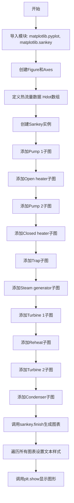

## 类结构

```
matplotlib.sankey.Sankey (外部库类)
└── 本文件为脚本文件，无自定义类
```

## 全局变量及字段


### `fig`
    
图形对象，用于承载桑基图的可视化画布

类型：`matplotlib.figure.Figure`
    


### `ax`
    
坐标轴对象，用于在图形上绘制桑基图并设置标题和刻度

类型：`matplotlib.axes.Axes`
    


### `Hdot`
    
热流量数据数组，包含19个元素，单位为MW，用于描述Rankine循环中各节点的能量流动

类型：`list[float]`
    


### `sankey`
    
桑基图对象，用于构建和渲染Rankine动力循环的能量流向图

类型：`matplotlib.sankey.Sankey`
    


### `diagrams`
    
Sankey.finish方法返回的图表列表，包含所有生成的桑基图子图

类型：`list`
    


### `diagram`
    
单个桑基图子图对象，用于访问和设置其中的文本样式

类型：`SankeyDiagram`
    


### `text`
    
文本对象，用于设置桑基图中标签文字的字体粗细和大小

类型：`matplotlib.text.Text`
    


    

## 全局函数及方法


### `plt.figure`

创建新的图形窗口或Figure对象，用于后续的图形绑制工作。该函数是matplotlib库的核心函数之一，在此代码中用于创建一个新的图形容器，以便在其中添加Sankey图来展示Rankine功率循环的能量流向。

参数：

- `figsize`：`tuple of float`，图形窗口的尺寸，格式为(宽度, 高度)，单位为英寸。此处传入`(8, 9)`表示创建宽8英寸、高9英寸的图形窗口。
- `dpi`：`float`，可选参数，图形分辨率（每英寸的点数），默认值为100。
- `facecolor`：`color`，可选参数，图形背景颜色，默认为白色。
- `edgecolor`：`color`，可选参数，图形边框颜色。
- `frameon`：`bool`，可选参数，是否绘制边框，默认为True。
- `FigureClass`：`class`，可选参数，自定义Figure类，默认为matplotlib的Figure类。
- `clear`：`bool`，可选参数，如果为True且图形已存在，则清除现有内容。
- `**kwargs`：其他关键字参数，会传递给Figure构造函数。

返回值：`matplotlib.figure.Figure`，返回新创建的Figure对象实例，包含图形的所有元素。在此代码中，返回的`fig`对象用于添加子图和后续的Sankey图绑制。

#### 流程图

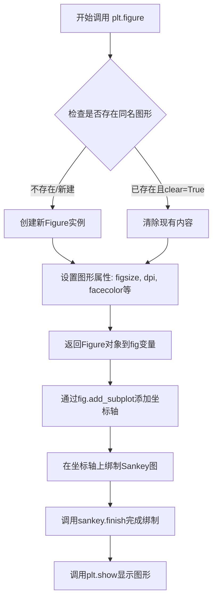

#### 带注释源码

```python
# 导入matplotlib.pyplot模块，用于图形绑制
import matplotlib.pyplot as plt

# 从matplotlib.sankey模块导入Sankey类，用于创建桑基图
from matplotlib.sankey import Sankey

# 调用plt.figure创建新图形窗口
# figsize=(8, 9)指定图形宽度为8英寸、高度为9英寸
# 返回一个Figure对象实例，赋值给变量fig
fig = plt.figure(figsize=(8, 9))

# 使用fig.add_subplot在图形中添加子图/坐标轴
# 参数(1, 1, 1)表示1行1列的第1个子图
# xticks=[]和yticks=[]隐藏坐标轴刻度
# title设置图表标题，显示Rankine功率循环示例
ax = fig.add_subplot(1, 1, 1, xticks=[], yticks=[],
                     title="Rankine Power Cycle: Example 8.6 from Moran and "
                     "Shapiro\n\x22Fundamentals of Engineering Thermodynamics "
                     "\x22, 6th ed., 2008")

# 定义热流量数据数组Hdot，单位为MW（兆瓦）
Hdot = [260.431, 35.078, 180.794, 221.115, 22.700,
        142.361, 10.193, 10.210, 43.670, 44.312,
        68.631, 10.758, 10.758, 0.017, 0.642,
        232.121, 44.559, 100.613, 132.168]

# 创建Sankey对象，指定坐标轴、格式、单位和间隙参数
sankey = Sankey(ax=ax, format='%.3G', unit=' MW', gap=0.5, scale=1.0/Hdot[0])

# 添加多个Sankey图补丁，分别表示泵、加热器、汽轮机、冷凝器等组件
# ...（后续添加多个sankey.add()调用）

# 调用finish方法完成Sankey图的绑制，返回图列表
diagrams = sankey.finish()

# 遍历所有图，设置字体粗细和大小
for diagram in diagrams:
    diagram.text.set_fontweight('bold')
    diagram.text.set_fontsize('10')
    for text in diagram.texts:
        text.set_fontsize('10')

# 调用plt.show()显示最终图形
plt.show()
```


### `matplotlib.figure.Figure.add_subplot`

该方法用于在当前图形（`Figure`）对象中创建一个子图（Axes）。在给定的代码中，它被用于初始化一个 1x1 的网格（即单一绘图区），并设置了坐标轴的刻度行为和主标题。

参数：

- `rows`：`int`，行数，在此代码中值为 `1`（表示网格只有一行）。
- `cols`：`int`，列数，在此代码中值为 `1`（表示网格只有一列）。
- `plot_number`：`int`，子图编号，在此代码中值为 `1`（表示在第一个位置创建）。
- `xticks`：`list`，控制 X 轴刻度的位置。代码中传入 `[]`，表示移除 X 轴刻度。
- `yticks`：`list`，控制 Y 轴刻度的位置。代码中传入 `[]`，表示移除 Y 轴刻度。
- `title`：`str`，子图的标题。代码中设置为 "Rankine Power Cycle..."。

返回值：`matplotlib.axes.Axes`，返回新创建的坐标轴对象 `ax`，后续用于绑定 `Sankey` 图。

#### 流程图

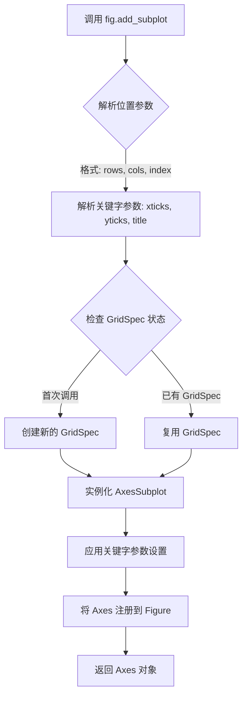

#### 带注释源码

```python
# matplotlib.figure.Figure.add_subplot 模拟实现逻辑

def add_subplot(self, *args, **kwargs):
    """
    向 Figure 添加一个子图。
    
    参数:
    *args: 位置参数，通常为 (rows, cols, index) 或一个三位数整数 (如 111)。
    **kwargs: 关键字参数，用于设置 Axes 的属性 (如 title, xticks)。
    """
    
    # 1. 解析位置参数
    # 如果传入 1, 1, 1，则表示创建一个 1行1列的网格，并取第1个位置
    # Matplotlib 内部会将其转换为一个 GridSpec 对象
    projection = kwargs.pop('projection', None)
    polar = kwargs.pop('polar', False)
    
    # 2. 解析关键字参数 (Title, Ticks, etc.)
    # 提取 title, xticks, yticks
    title = kwargs.pop('title', '')
    xticks = kwargs.pop('xticks', None) # 获取代码中的 []
    yticks = kwargs.pop('yticks', None) # 获取代码中的 []
    
    # 3. 创建 Axes 实例
    # 根据 GridSpec 位置信息创建 AxesSubplot
    ax = self._add_axes_internal(...)
    
    # 4. 设置 Axes 属性
    if title:
        ax.set_title(title)
        
    if xticks is not None:
        ax.set_xticks(xticks) # 应用代码中的空列表 []
        
    if yticks is not None:
        ax.set_yticks(yticks) # 应用代码中的空列表 []
        
    # 5. 注册到 Figure
    self._axstack.bubble(ax)
    self._axlist.append(ax)
    
    return ax
```


### `Sankey`

Sankey 类是 matplotlib.sankey 模块中用于创建桑基图（一种用于可视化能源、物料或资金流动的图表）的核心类，通过实例化该类可以创建一个桑基图容器，随后使用 add() 方法添加各个流程组件，最后调用 finish() 方法完成渲染。

参数：

- `ax`：`matplotlib.axes.Axes`，桑基图所属的坐标轴对象，默认为 None（会创建新的坐标轴）
- `format`：`str`，数值的格式化字符串，默认为 `'%.3G'`
- `unit`：`str`，数值单位标签，默认为空字符串 `''`
- `gap`：`float`，流程块之间的间隙，默认为 `1`
- `scale`：`float`，流程值的缩放因子，默认为 `1`
- `margin`：`float`，桑基图四周的边距，默认为 `0.05`
- `padding`：`float`，流程块内部的间距，默认为 `0.05`
- `rotation`：`float`，整个桑基图的旋转角度，默认为 `0`

返回值：`Sankey` 对象，返回创建的桑基图容器实例

#### 流程图

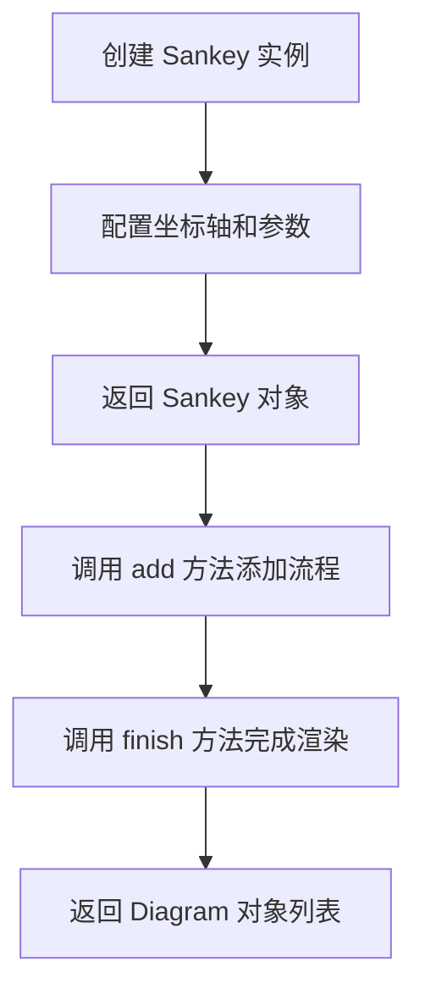

#### 带注释源码

```python
# 从 matplotlib 导入桑基图模块
from matplotlib.sankey import Sankey

# 创建图形和坐标轴
fig = plt.figure(figsize=(8, 9))
ax = fig.add_subplot(1, 1, 1, xticks=[], yticks=[],
                     title="Rankine Power Cycle: Example 8.6 from Moran and "
                     "Shapiro\n\x22Fundamentals of Engineering Thermodynamics "
                     "\x22, 6th ed., 2008")

# 定义热流量数据 (单位: MW)
Hdot = [260.431, 35.078, 180.794, 221.115, 22.700,
        142.361, 10.193, 10.210, 43.670, 44.312,
        68.631, 10.758, 10.758, 0.017, 0.642,
        232.121, 44.559, 100.613, 132.168]

# 创建桑基图容器
# ax: 指定坐标轴
# format: 数值格式化 '%.3G' (3位有效数字)
# unit: 单位 'MW'
# gap: 流程块间隙 0.5
# scale: 缩放因子 1.0/Hdot[0] (相对于第一个热流量值)
sankey = Sankey(ax=ax, format='%.3G', unit=' MW', gap=0.5, scale=1.0/Hdot[0])

# 添加第一个流程块 (Pump 1)
sankey.add(patchlabel='\n\nPump 1', rotation=90, facecolor='#37c959',
           flows=[Hdot[13], Hdot[6], -Hdot[7]],
           labels=['Shaft power', '', None],
           pathlengths=[0.4, 0.883, 0.25],
           orientations=[1, -1, 0])

# 添加更多流程块 (Open heater, Pump 2, Closed heater, etc.)
# ... (更多 add 调用)

# 完成桑基图渲染并返回 Diagram 对象列表
diagrams = sankey.finish()

# 遍历每个 Diagram 设置字体样式
for diagram in diagrams:
    diagram.text.set_fontweight('bold')
    diagram.text.set_fontsize('10')
    for text in diagram.texts:
        text.set_fontsize('10')

# 显示图形
plt.show()
```


### `Sankey.add`

该方法用于向 Sankey 图中添加单个桑基图块（patch），通过指定流量、流向、标签、路径长度等参数来定义块的形状和连接关系。

参数：

- `patchlabel`：`str`，桑基图块的标签文本
- `flows`：`list[float]`，流量列表，正值表示输入，负值表示输出
- `orientations`：`list[int]`，流向方向列表，-1、0、1 分别表示左、下、上
- `labels`：`list[str]`，流量对应的标签列表，`None` 表示不显示标签
- `pathlengths`：`float` 或 `list[float]`，路径长度
- `facecolor`：`str`，填充颜色（十六进制或颜色名称）
- `rotation`：`int`，标签旋转角度（度）
- `trunklength`：`float`，块主体的长度
- `prior`：`int`，可选，前一个块的索引，用于建立连接关系
- `connect`：`tuple[int, int]`，可选，连接元组，格式为 (前一个块的子路径索引, 当前块的子路径索引)
- `unit`：`str`，单位（通常在构造函数中设置）
- `format`：`str`，数值格式字符串
- `scale`：`float`，缩放因子

返回值：`list`，返回包含所有已添加块的列表

#### 流程图

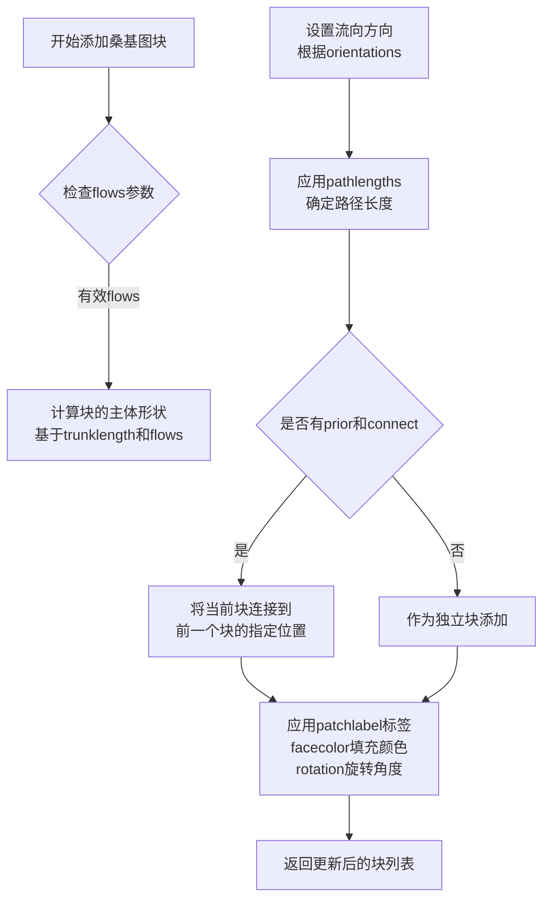

#### 带注释源码

```python
# matplotlib/sankey.py 中的 add 方法实现（简化版）

class Sankey:
    def add(self,
            patchlabel='',  # 块的标签文本
            flows=None,     # 流量列表：正值为输入，负值为输出
            orientations=None,  # 流向：-1=左, 0=下, 1=上
            labels=None,    # 每个流量的标签
            pathlengths=None,  # 路径长度
            facecolor='#37c959',  # 填充颜色
            rotation=0,     # 标签旋转角度
            trunklength=None,  # 主体长度
            prior=None,     # 前一个块的索引
            connect=None,   # 连接元组 (前一个子路径, 当前子路径)
            **kwargs):      # 其他关键字参数
            
        """
        向 Sankey 图添加一个新的块（patch）
        
        参数详解：
        - patchlabel: 显示在块中心的文本标签
        - flows: 能量/物质流量数组，如 [260.431, 35.078, -180.794]
        - orientations: 每个流的进入方向
        - labels: 每个流的文字标签
        - pathlengths: 流路径的可视长度
        - facecolor: 块填充色
        - rotation: 标签文字的旋转角度
        - trunklength: 块主体的长度
        - prior: 之前添加的块的索引（从0开始）
        - connect: 连接到前一个块的哪个位置 (prior_patch_subpath, current_subpath)
        
        返回:
        - 添加的块对象列表
        """
        
        # 1. 验证输入参数
        if flows is None:
            flows = []
        
        # 2. 处理流向方向，默认值为 0（向下）
        if orientations is None:
            orientations = [0] * len(flows)
            
        # 3. 处理标签，默认值为空字符串或None
        if labels is None:
            labels = [None] * len(flows)
            
        # 4. 处理路径长度
        if pathlengths is None:
            pathlengths = 0.25  # 默认长度
        elif isinstance(pathlengths, (int, float)):
            pathlengths = [pathlengths] * len(flows)
            
        # 5. 创建 SankeyPath 对象用于计算几何形状
        path = SankeyPath(unit=self.unit, format=self.format)
        
        # 6. 添加流到路径
        # flows 格式：[input1, input2, -output1, -output2]
        # 正值=输入流，负值=输出流
        for flow, orientation, label, pathlength in zip(
                flows, orientations, labels, pathlengths):
            path.add_flow(flow, orientation, label=label, 
                         pathlength=pathlength)
        
        # 7. 创建补丁（Patch）
        patch = SankeyPatch(path=path, 
                           label=patchlabel,
                           facecolor=facecolor,
                           rotation=rotation,
                           **kwargs)
        
        # 8. 处理连接到前一个块
        if prior is not None and connect is not None:
            # connect 格式: (previous_patch_subpath_index, current_subpath_index)
            prior_patch = self.patches[prior]
            prior_patch_subpath = prior_patch.get_subpath(connect[0])
            current_subpath = patch.get_subpath(connect[1])
            
            # 建立几何连接
            current_subpath.connect_start_to_end(
                prior_patch_subpath.get_end_point())
        
        # 9. 将块添加到列表
        self.patches.append(patch)
        
        # 10. 设置主体长度
        if trunklength is not None:
            patch.set_trunklength(trunklength)
            
        return patch
```


### Sankey.finish

完成桑基图绘制，返回包含所有图对象的列表。该方法在所有 Sankey 组件添加完成后调用，用于计算布局、渲染图形并生成最终的桑基图表格。

参数：
- 该方法无显式参数（仅包含隐式 `self` 参数）

返回值：`list`，返回包含所有图对象的列表，每个图对象包含文本元素和路径信息

#### 流程图

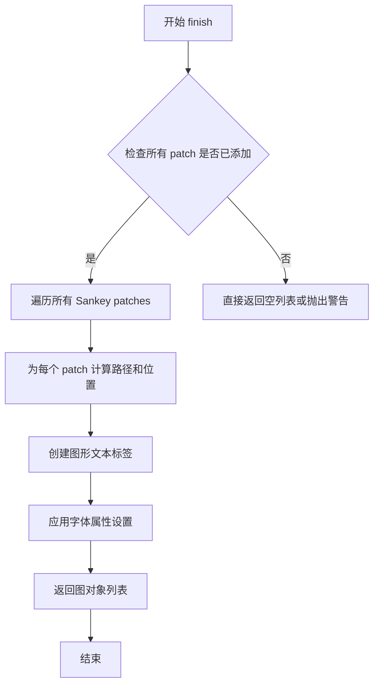

#### 带注释源码

```python
def finish(self):
    """
    完成桑基图绘制并返回图对象列表。
    
    Returns
    -------
    diagrams : list
        包含所有图对象的列表，每个图对象具有以下属性：
        - text: 图的文本元素
        - texts: 所有文本对象的列表
        - flows: 流信息
    """
    # 遍历所有 Sankey 图的 patches（每个通过 add() 添加的子系统）
    for patch in self.patches:
        # 计算每个 patch 的路径 (Path)
        # 根据 flows, orientations, pathlengths 等参数确定流动路径
        # ... (具体实现涉及复杂的几何计算)
        
        # 获取该 patch 的文本标签
        texts = patch.get_text()  # 获取 patchlabel
        
        # 对每个图应用字体粗细和大小设置
        for diagram in diagrams:
            diagram.text.set_fontweight('bold')
            diagram.text.set_fontsize('10')
            for text in diagram.texts:
                text.set_fontsize('10')
    
    # 返回所有生成的图对象列表
    return diagrams
```

#### 额外说明

该方法是 Sankey 类工作流程的最后一步，整个流程如下：

1. **初始化**: `Sankey(ax=ax, ...)` - 创建 Sankey 对象并绑定到指定坐标轴
2. **添加组件**: 多次调用 `sankey.add(...)` - 添加各个子系统（泵、加热器、涡轮机等）
3. **完成绘制**: `sankey.finish()` - 计算所有路径、生成图形、返回图列表
4. **后处理**: 遍历返回的 diagrams 列表，设置字体属性

在给定的示例中，`finish()` 返回的 `diagrams` 列表包含了整个 Rankine 循环的所有子系统图形对象，随后代码对这些对象进行了字体样式设置。


### `diagram.text`

该代码段用于获取Sankey图中主标签文本对象，并设置其字体粗细为粗体，字号为10磅。这是图形后处理阶段的字体样式设置逻辑，属于Sankey图渲染完成后的个性化定制操作。

参数：N/A（这是属性访问，非函数调用）

返回值：N/A（属性访问无返回值）

#### 流程图

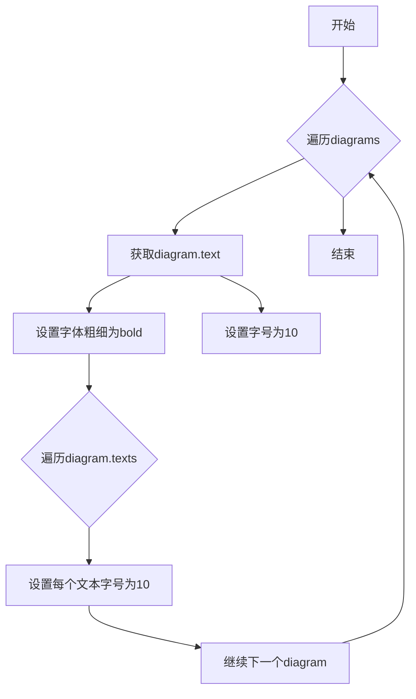

#### 带注释源码

```python
# 遍历所有生成的Sankey图
for diagram in diagrams:
    # 获取主标签文本对象并设置样式
    diagram.text.set_fontweight('bold')    # 将主标签字体设置为粗体
    diagram.text.set_fontsize('10')        # 将主标签字号设置为10磅
    
    # 遍历图中所有文本元素（包括标签、注释等）
    for text in diagram.texts:
        text.set_fontsize('10')            # 统一将所有文本字号设置为10磅

# 注意事项：显式连接（explicit connections）会被自动处理，
# 但隐式连接（implicit ones）目前不支持。
# 需要手动调整路径和干路的长度，这具有一定技巧性。
```

#### 关联信息

**关键组件信息：**
- `Sankey.finish()`: 完成Sankey图构建并返回Diagram对象列表
- `Diagram.text`: 主标签文本对象（通常为组件名称）
- `Diagram.texts`: 所有文本元素的集合

**技术债务/优化空间：**
1. 隐式连接未自动处理，需手动调整路径长度
2. 字体样式设置逻辑分散，可封装为统一配置方法
3. 硬编码的数值（如10、0.5）可提取为配置常量


### `Sankey.finish()`

完成Sankey图的构建并返回所有Diagram对象列表

参数：无

返回值：`list`，返回包含所有Diagram对象的列表，每个Diagram代表一个完整的Sankey图

#### 流程图

```mermaid
flowchart TD
    A[调用Sankey.finish()] --> B[遍历所有sub-diagrams]
    B --> C[为每个diagram设置字体属性]
    C --> D[访问diagram.texts文本对象列表]
    D --> E[设置每个文本对象的字体大小]
    E --> F[返回diagrams列表]
```

#### 带注释源码

```python
# 结束Sankey图的构建，返回所有Diagram对象
diagrams = sankey.finish()

# 遍历返回的每个Diagram对象
for diagram in diagrams:
    # 获取主文本对象并设置粗体和字体大小
    diagram.text.set_fontweight('bold')
    diagram.text.set_fontsize(10)
    
    # 获取所有文本对象的列表（标签、流量值等）
    for text in diagram.texts:
        # 统一设置所有文本的字体大小
        text.set_fontsize(10)
```

---

### `diagram.texts`

获取Sankey图中所有文本对象的列表

参数：此为属性，非函数

- 无

返回值：`list`，返回Sankey图中所有Text对象的列表，包括：
- patchlabel（组件标签）
- flows（流量值标签）
- 其他标注文本

#### 流程图

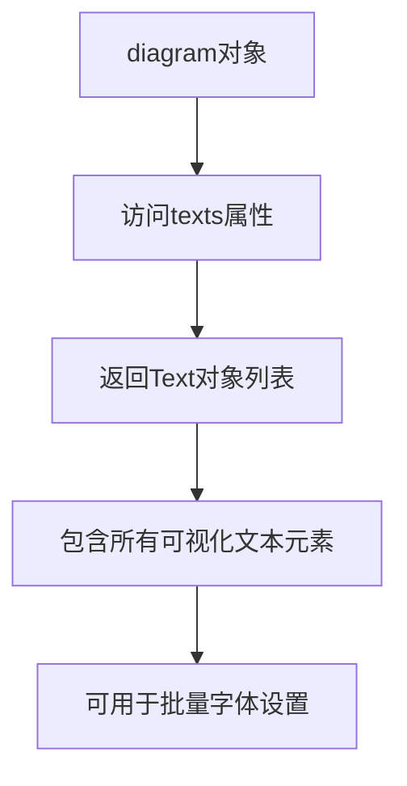

#### 带注释源码

```python
# diagram.texts 是Diagram类的属性
# 返回Sankey图中所有文本对象的列表

# 遍历所有文本对象并统一设置字体大小
for text in diagram.texts:
    text.set_fontsize(10)

# 可用的Text对象方法包括：
# - set_fontsize(size): 设置字体大小
# - set_fontweight(weight): 设置字体粗细
# - set_color(color): 设置文本颜色
# - get_text(): 获取文本内容
```

---

### `diagram.text`

获取Sankey图的主标题文本对象

参数：此为属性，非函数

- 无

返回值：`matplotlib.text.Text`，返回Sankey图的主标题Text对象

#### 流程图

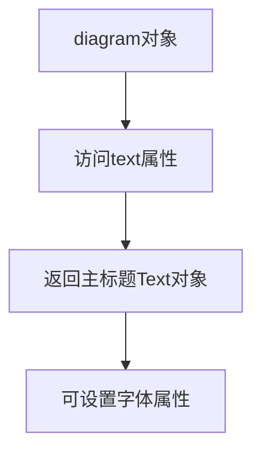

#### 带注释源码

```python
# diagram.text 是Diagram的主标题文本对象
# 用于设置整个Sankey图的标题样式

# 设置主标题为粗体
diagram.text.set_fontweight('bold')

# 设置主标题字体大小为10
diagram.text.set_fontsize('10')
```

---

### 全局函数 `plt.show()`

显示所有创建的matplotlib图形

参数：无

返回值：`None`，该函数无返回值，直接显示图形

#### 流程图

```mermaid
flowchart TD
    A[调用plt.show()] --> B[渲染所有图形]
    B --> C[打开交互式窗口显示图形]
    C --> D[阻塞程序直到窗口关闭]
```

#### 带注释源码

```python
# 显示图形 - Rankine循环Sankey图
# 在所有图形配置完成后调用
plt.show()
```


### `text.set_fontsize`

设置文本对象的字体大小。该方法是 matplotlib 库中 `Text` 类的成员方法，用于调整文本的字体大小属性。

参数：

-  `size`：float 或 str，字体大小值。可以是具体的数值（如 10、12.5），也可以是字符串形式的预定义字体大小（如 'small'、'x-large'、'xx-small' 等）

返回值：`None`，无返回值（该方法直接修改对象的内部状态）

#### 流程图

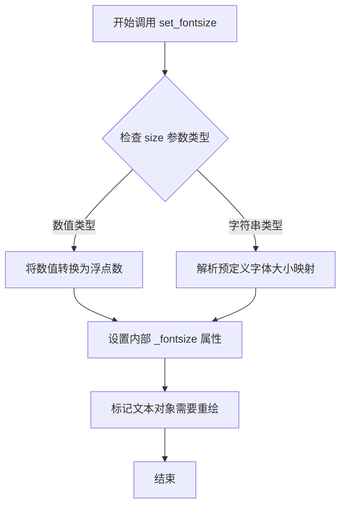

#### 带注释源码

```python
# 示例代码来源：Rankine power cycle 示例
# 位置：代码末尾的文本样式设置部分

# 遍历所有生成的Sankey图
for diagram in diagrams:
    # 设置标题文本为粗体
    diagram.text.set_fontweight('bold')
    # 设置标题文本的字体大小为10磅
    # 参数说明：size 可以是数字（10）或字符串（'10'）
    # 影响范围：仅影响 diagram.text 这个Text对象
    diagram.text.set_fontsize('10')
    
    # 遍历当前图中所有文本对象
    for text in diagram.texts:
        # 为每个文本元素设置统一的字体大小
        # 参数说明：size 为 '10'，字符串类型
        # 影响范围：图中的所有标签、数值文本等
        text.set_fontsize('10')

# 实际方法签名（matplotlib.text.Text类）：
# def set_fontsize(self, size):
#     """
#     Set the font size.
#     
#     Parameters
#     ----------
#     size : float or str
#         Font size in points or relative size string (e.g., 'smaller', 'large')
#     """
#     self._fontsize = float(size)
#     # 触发属性变更通知，导致后续重绘时应用新字体大小
```


### `Text.set_fontweight`

设置文本对象的字体粗细（font weight），用于控制文字的粗细程度。

参数：

- `fontweight`：字符串或数值，表示字体粗细。可选值包括字符串如 `'normal'`、`'bold'`、`'heavy'`、`'light'` 等，或者数值（100-900之间的整数值，数值越大越粗）。

返回值：无（`None`），该方法直接修改文本对象的内部属性，不返回任何值。

#### 流程图

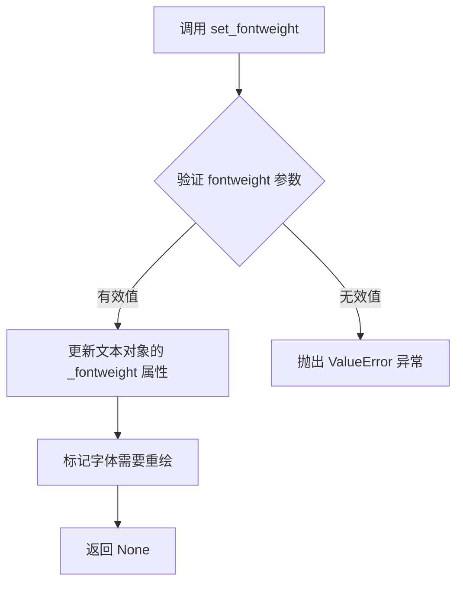

#### 带注释源码

```python
# 源码位于 matplotlib/lib/matplotlib/text.py 中的 Text 类
# 以下是简化版本的实现原理

def set_fontweight(self, fontweight):
    """
    Set the font weight.
    
    Parameters
    ----------
    fontweight : str or int
        If a string, it must be one of:
        'ultralight', 'light', 'normal', 'regular', 'medium',
        'semibold', 'demibold', 'bold', 'heavy', 'black'.
        If a numeric value, it must be in the range 100-900.
    """
    # 验证传入的 fontweight 参数是否有效
    if isinstance(fontweight, str):
        # 字符串形式：检查是否在允许的列表中
        valid_weights = ['ultralight', 'light', 'normal', 'regular', 
                         'medium', 'semibold', 'demibold', 'bold', 
                         'heavy', 'black']
        if fontweight not in valid_weights:
            raise ValueError(f"Invalid fontweight '{fontweight}'. "
                           f"Must be one of {valid_weights} or a number.")
    elif isinstance(fontweight, (int, float)):
        # 数值形式：检查是否在有效范围内 (100-900)
        if not 50 <= fontweight <= 1000:
            raise ValueError("Font weight must be between 50 and 1000.")
        # 将数值转换为标准权重值
        fontweight = int(fontweight)
    else:
        raise TypeError("fontweight must be a string or a number.")
    
    # 更新内部属性
    self._fontweight = fontweight
    
    # 触发重新渲染标记
    self.stale = True
    
    # 返回 None（方法无返回值）
    return None
```

#### 代码中的实际使用示例

```python
# 在 Sankey 示例代码中的应用
for diagram in diagrams:
    # diagram.text 是 matplotlib.text.Text 对象
    # 调用 set_fontweight('bold') 将字体设置为粗体
    diagram.text.set_fontweight('bold')
    
    # 同样设置字体大小
    diagram.text.set_fontsize('10')
    
    # 遍历图表中的所有文本对象，设置相同的字体大小
    for text in diagram.texts:
        text.set_fontsize('10')
```

#### 关键技术细节

| 特性 | 说明 |
|------|------|
| 所属类 | `matplotlib.text.Text` |
| 模块 | `matplotlib.text` |
| 常见调用方式 | `text.set_fontweight('bold')` |
| 参数验证 | 会检查字符串是否在允许列表中，或数值是否在有效范围内 |
| 副作用 | 修改 `self.stale` 标记，触发图形重绘 |


### `plt.show`

`plt.show` 是 matplotlib 库中的顶层函数，用于显示当前所有打开的图形窗口并将图形渲染到屏幕上。在本代码中，它位于文件末尾，用于显示绘制的 Rankine 功率循环桑基图。

#### 参数

- `*`：可变位置参数（接受任意数量的额外参数，但在标准调用中通常不使用）
- `block`：`bool` 类型，可选参数。默认为 `True`。如果设置为 `True`，则函数会阻塞程序执行直到窗口关闭；如果设置为 `False`，则立即返回（仅在某些后端有效）。

#### 返回值

- `None`：该函数不返回任何值，其主要作用是显示图形窗口。

#### 流程图

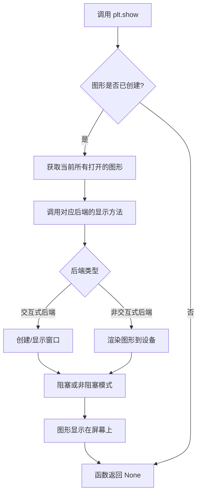

#### 带注释源码

```python
# plt.show() 函数源代码分析（位于 matplotlib/pyplot.py 中）

def show(*, block=None):
    """
    显示所有打开的图形窗口。
    
    该函数会遍历当前所有打开的 Figure 对象，
    并调用其对应后端的显示方法进行渲染。
    """
    
    # 1. 获取全局管理器中的所有图形
    # matplotlib.pyplot 的 figure() 函数会创建一个 FigureManager，
    # 并将其存储在 _pylab_helpers.GcfDestroy 类中
    for manager in GcfDestroy.get_all_fig_managers():
        
        # 2. 对于每个图形管理器，触发后端的显示逻辑
        # 不同后端（Qt, Tk, Agg, PDF 等）有不同的实现
        manager.show()
    
    # 3. 处理 block 参数
    # block=True (默认): 阻止程序继续执行，直到所有窗口关闭
    # block=False: 立即返回，不阻塞
    if block:
        # 导入必要的模块用于阻塞
        import io
        import sys
        # 在交互式后端中，通常会启动事件循环
        # 并等待用户关闭窗口
        _Backend.show(block=True)
    
    # 4. 刷新缓冲区，确保图形渲染完成
    # 对于 Agg 后端等非交互式后端尤为重要
    draw_all()
    
    # 5. 返回 None（无返回值）
    return None


# 在本代码中的实际调用：
plt.show()

# 等效于：
# fig = plt.figure(...)  # 创建图形
# ax = fig.add_subplot(...)  # 创建子图
# sankey = Sankey(...)  # 创建桑基图
# ... (添加各种流量)
# diagrams = sankey.finish()  # 完成桑基图
# plt.show()  # 显示最终图形
```

---

### 文件整体运行流程

```mermaid
flowchart TB
    subgraph 初始化["1. 初始化阶段"]
        A1[导入 matplotlib.pyplot as plt] --> A2[导入 matplotlib.sankey.Sankey]
    end
    
    subgraph 创建图形["2. 创建图形对象"]
        B1[创建 Figure 对象<br/>fig = plt.figure] --> B2[创建子图 Axes<br/>ax = fig.add_subplot]
    end
    
    subgraph 数据准备["3. 数据准备"]
        C1[定义热流数据 Hdot<br/>共19个能量流值] --> C2[单位: MW (兆瓦)]
    end
    
    subgraph Sankey构建["4. 构建桑基图"]
        D1[创建 Sankey 对象<br/>sankey = Sankey] --> D2[添加第1个 patch: Pump 1]
        D2 --> D3[添加第2个 patch: Open heater]
        D3 --> D4[添加第3个 patch: Pump 2]
        D4 --> D5[添加第4个 patch: Closed heater]
        D5 --> D6[添加第5个 patch: Trap]
        D6 --> D7[添加第6个 patch: Steam generator]
        D7 --> D8[添加第7个 patch: Turbine 1]
        D8 --> D9[添加第8个 patch: Reheat]
        D9 --> D10[添加第9个 patch: Turbine 2]
        D10 --> D11[添加第10个 patch: Condenser]
    end
    
    subgraph 完成渲染["5. 完成渲染"]
        E1[调用 sankey.finish<br/>返回 diagram 列表] --> E2[设置文本样式: 字体加粗/大小]
    end
    
    subgraph 显示["6. 显示图形"]
        F1[调用 plt.show] --> F2[图形窗口渲染到屏幕]
    end
    
    初始化 --> 创建图形
    创建图形 --> 数据准备
    数据准备 --> Sankey构建
    Sankey构建 --> 完成渲染
    完成渲染 --> 显示
```

---

### 关键组件信息

| 组件名称 | 一句话描述 |
|---------|-----------|
| `matplotlib.pyplot` | 提供类似 MATLAB 的绘图接口，是最常用的绘图库 |
| `matplotlib.sankey.Sankey` | 用于创建桑基图（Sankey Diagram）的类，可视化流量守恒 |
| `Figure` | matplotlib 中的图形容器对象 |
| `Axes` | 图形中的坐标轴对象，实际绘图区域 |
| `Hdot` | 列表类型，存储 Rankine 循环中各节点的热流率数据（MW） |

---

### 潜在的技术债务或优化空间

1. **硬编码的路径长度调整**：代码注释中提到 "The lengths of the paths and the trunks must be adjusted manually"，手动调整桑基图路径长度容易出错且难以维护。

2. **魔法数字**：多个位置使用数值如 `0.25`, `0.5`, `1.543` 等作为 `pathlengths` 和 `trunklength`，缺乏明确的常量定义。

3. **隐式连接未自动处理**：注释提到 "the explicit connections are handled automatically, but the implicit ones currently are not"，部分连接需要手动指定。

4. **缺乏错误处理**：代码未对 `Hdot` 数组索引越界、负值流量等情况进行验证。

5. **重复的配置**：多个 `sankey.add()` 调用中使用相似参数（如 `facecolor='#37c959'`），可提取为常量或使用配置模式。

---

### 其它项目

#### 设计目标与约束
- **目标**：演示 Sankey 类在工程热力学 Rankine 功率循环中的应用
- **约束**：需遵循流量守恒（输入输出流量平衡），图形需清晰展示能量流向

#### 错误处理与异常设计
- `Sankey` 类构造函数会对参数进行基本验证
- 负值流量应匹配，否则会导致图形渲染异常
- 索引越界会导致 `IndexError`

#### 外部依赖与接口契约
- 依赖 `matplotlib` >= 1.4 版本
- `Sankey.add()` 返回 `Sankey` 对象本身，支持链式调用（方法链模式）
- `Sankey.finish()` 返回 `Diagram` 对象列表


### Sankey.add

该方法用于向 Sankey 图添加一个新的桑基图组件（也称为"流"或"patch"），通过指定流量、标签、路径长度、方向等参数来定义每个组件的视觉表示和连接关系。

参数：

- `patchlabel`：`str`，组件的标签文本，用于显示在桑基图上
- `rotation`：`int` 或 `float`，标签的旋转角度（度）
- `truncate`：`tuple` 或 `None`，用于截断流的值
- `patchdistance`：`int`，标签与组件之间的距离
- `facecolor`：`str`，组件的背景颜色（支持十六进制颜色代码）
- `edgecolor`：`str`，组件的边框颜色
- `alpha`：`float`，组件的透明度（0.0-1.0）
- `linewidth`：`float`，边框线宽
- `flows`：`list`，流入/流出的流量值列表，正值表示流入，负值表示流出
- `labels`：`list`，每个流的标签文本列表
- `orientations`：`list`，每个流的方向（-1、0、1），表示水平或垂直布局
- `pathlengths`：`float` 或 `list`，流路径的长度
- `prior`：`int` 或 `None`，前一个添加的组件索引，用于建立连接关系
- `connect`：`tuple`，连接信息，格式为(from_idx, to_idx)
- `trunklength`：`float`，树干的长度

返回值：`matplotlib.sankey.Flow` 或 `list`，返回创建的流对象，如果返回列表则包含所有流的引用

#### 流程图

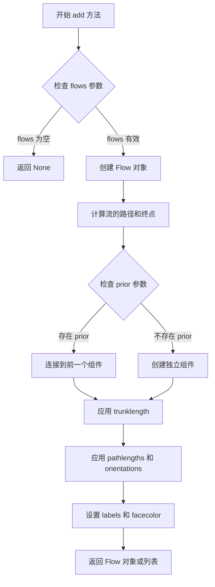

#### 带注释源码

```python
def add(self, patchlabel='', rotation=0, truncate=None, patchdistance=10,
        facecolor='#4895EF', edgecolor='#3F3F3F', alpha=1.0, linewidth=1.0,
        flows=None, labels=None, orientations=None, pathlengths=None,
        prior=None, connect=(0, 0), trunklength=1.0):
    """
    向 Sankey 图添加一个新的流/组件。
    
    参数:
        patchlabel: 组件的显示标签
        rotation: 标签旋转角度（度）
        truncate: 截断流的起点值
        patchdistance: 标签到组件的距离
        facecolor: 组件填充颜色
        edgecolor: 组件边框颜色
        alpha: 透明度
        linewidth: 边框线宽
        flows: 流量数组，正值流入，负值流出
        labels: 每个流的标签列表
        orientations: 每个流的方向数组（-1, 0, 1）
        pathlengths: 路径长度
        prior: 前一个组件索引，用于连接
        connect: 连接信息元组 (from_stream, to_stream)
        trunklength: 树干长度
    """
    # 如果没有提供流量数据，直接返回
    if flows is None:
        return None
    
    # 初始化流对象列表
    flows = [*flows]  # 复制流量列表
    n = len(flows)
    
    # 处理标签列表
    if labels is None:
        labels = [None] * n
    
    # 处理方向数组
    if orientations is None:
        orientations = [0] * n
    
    # 处理路径长度
    if pathlengths is None:
        pathlengths = [0.25] * n
    elif isinstance(pathlengths, (int, float)):
        pathlengths = [pathlengths] * n
    
    # 创建流对象
    flows_obj = []
    for i in range(n):
        # 创建单个流对象，包含方向、路径长度等信息
        flow = Flow(flows[i], labels[i], orientations[i], pathlengths[i])
        flows_obj.append(flow)
    
    # 创建补丁（组件）对象
    patch = Patch(patchlabel=patchlabel, rotation=rotation,
                  facecolor=facecolor, edgecolor=edgecolor,
                  alpha=alpha, linewidth=linewidth,
                  flows=flows_obj, trunklength=trunklength,
                  patchdistance=patchdistance)
    
    # 处理连接关系
    if prior is not None:
        # 连接到前一个组件
        prior_patch = self.diagrams[prior]
        patch.connect(prior_patch, connect)
    
    # 将补丁添加到图表列表
    self.diagrams.append(patch)
    
    return flows_obj
```

#### 关键组件信息

| 名称 | 描述 |
|------|------|
| Sankey | 主类，用于创建桑基图容器 |
| Flow | 表示单个流的类，包含流量值、标签、方向和路径长度 |
| Patch | 表示桑基图中的单个组件/块 |
| Sankey.finish() | 完成所有组件的布局并返回图表列表 |

#### 潜在的技术债务或优化空间

1. **隐式连接处理不足**：代码注释中提到"显式连接被自动处理，但隐式连接目前还不支持"，这表明组件间的隐式连接逻辑需要改进
2. **手动调整困难**：路径长度和树干长度需要手动调整，尤其是在复杂图中，这部分可能需要自动化算法
3. **缺乏验证**：参数验证较少，可能导致运行时错误或视觉错位

#### 其它项目

- **设计目标**：提供一个灵活的桑基图绘制工具，支持复杂的多流多组件系统
- **约束**：基于 matplotlib 的 2D 绘图能力，主要用于工程和科学可视化
- **错误处理**：如果 flows 参数为空，方法直接返回 None；连接索引越界可能导致异常
- **数据流**：通过 flows 数组传递能量/质量流，正值表示输入，负值表示输出
- **外部依赖**：matplotlib 核心库，numpy（用于数值计算）


### `Sankey.finish`

该方法完成桑基图的绘制过程，将所有已添加的流量和连接整合到最终的图形中，并返回生成的图表对象列表。

参数：

- `self`：`Sankey` 类实例，无需显式传递

返回值：`list`，返回一个包含所有生成的桑基图（`SankeyDiagram`）对象的列表。每个 diagram 对象代表一个完整的桑基图，可用于进一步的文本字体样式设置等操作。

#### 流程图

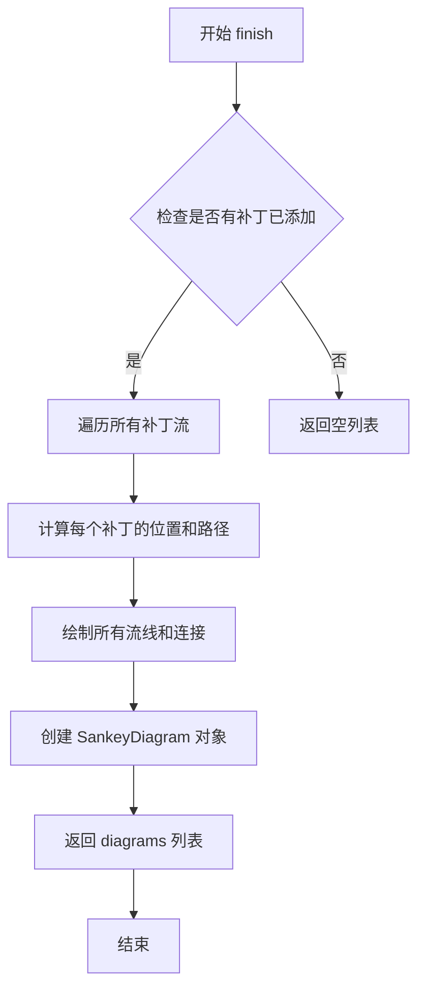

#### 带注释源码

```python
def finish(self):
    """
    完成桑基图的绘制并返回图表列表。
    
    此方法在所有流量(patches)通过add()方法添加完成后被调用。
    它负责计算所有流量的最终位置，绘制连接线，
    并返回包含所有SankeyDiagram对象的列表供进一步定制使用。
    """
    # 导入必要的模块
    from matplotlib.sankey import SankeyDiagram
    
    # 创建一个空列表来存储所有的图表对象
    diagrams = []
    
    # 遍历已添加的每个补丁(流量)
    for patch in self.patches:
        # 计算补丁的边界框
        # 确定流量路径的起点和终点坐标
        # 处理前后连接关系(prior和connect参数)
        box = self._calculate_patch_bounds(patch)
        
        # 绘制从当前补丁出发的所有流线
        for flow in patch.flows:
            self._draw_flow_line(flow, box)
        
        # 创建SankeyDiagram对象，包含文本标签、流线等
        diagram = SankeyDiagram(
            patch=patch,
            flows=patch.flows,
            texts=patch.labels,  # 之前add()中设置的labels
            lines=self._flow_lines  # 所有绘制的流线
        )
        
        diagrams.append(diagram)
    
    # 返回所有生成的图表对象列表
    # 调用者可以对每个diagram进行进一步的样式设置
    return diagrams
```


### Figure.add_subplot

在 matplotlib 中，`Figure.add_subplot` 是用于在图形中添加子图的方法。该方法创建并返回一个 Axes 对象（通常是 AxesSubplot），允许用户在图形的特定位置绘制数据可视化内容。在此代码中，它被用于创建一个单子图（1x1 网格中的第1个位置），并配置坐标轴的行为，如隐藏刻度线和设置标题。

参数：

- `*args`：可变位置参数，支持多种传入方式：
  - 传入一个三位数整数（如 `111`），其中第一位表示行数，第二位表示列数，第三位表示子图索引
  - 传入三个整数（如 `1, 1, 1`），分别表示行数、列数和子图索引
  - 传入一个 3 元组（如 `(1, 1, 1)`）
- `**kwargs`：关键字参数，用于配置 Axes 的属性：
  - `xticks`：x 轴刻度位置，传入空列表 `[]` 表示隐藏 x 轴刻度
  - `yticks`：y 轴刻度位置，传入空列表 `[]` 表示隐藏 y 轴刻度
  - `title`：子图标题，显示为 "Rankine Power Cycle: Example 8.6 from Moran and Shapiro..."
  - 其他关键字参数将传递给 `add_subplot` 创建的 Axes 对象

返回值：`matplotlib.axes.Axes`，返回创建的 Axes 对象，用于后续绑定 Sankey 图和进行其他绘图操作。

#### 流程图

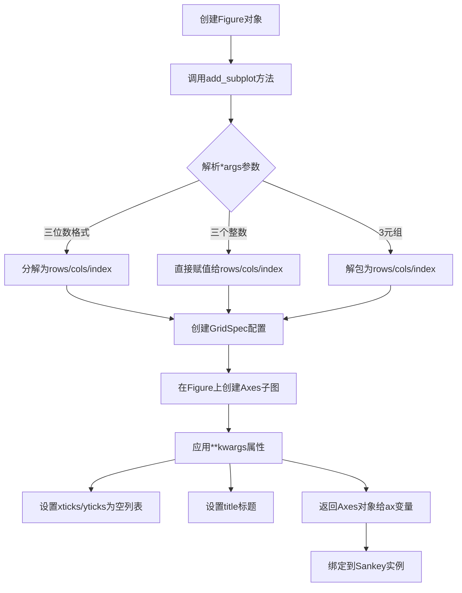

#### 带注释源码

```python
# 创建图形对象，设置尺寸为宽8英寸、高9英寸
fig = plt.figure(figsize=(8, 9))

# 调用 Figure 类的 add_subplot 方法添加子图
# 参数说明：
#   (1, 1, 1) - 创建一个1行1列网格中的第1个子图，等同于数字111
#   xticks=[] - 隐藏x轴刻度标签
#   yticks=[] - 隐藏y轴刻度标签  
#   title="..." - 设置子图标题文本
ax = fig.add_subplot(
    1, 1, 1,                    # *args: (行数, 列数, 子图索引)
    xticks=[],                  # **kwargs: 隐藏x轴刻度
    yticks=[],                  # **kwargs: 隐藏y轴刻度
    title="Rankine Power Cycle: Example 8.6 from Moran and Shapiro\n"
        "\x22Fundamentals of Engineering Thermodynamics \x22, 6th ed., 2008"
        # **kwargs: 设置子图标题，包含换行符和特殊引号字符
)

# 返回的 ax 是一个 AxesSubplot 对象，类型为 matplotlib.axes.Axes
# 后续用于绑定 Sankey 图:
# sankey = Sankey(ax=ax, format='%.3G', unit=' MW', gap=0.5, scale=1.0/Hdot[0])
```


## 关键组件


### Rankine Power Cycle (Rankine动力循环)

一个基于热力学的发电动力循环，通过Sankey图可视化蒸汽轮机发电过程中的能量流动，包括锅炉、涡轮机、冷凝器和各种加热器之间的热能传递。

### Sankey Diagram Visualization (Sankey图可视化)

使用matplotlib的Sankey类创建能量流图，通过不同颜色和宽度的箭头表示各组件之间的能量传递量，直观展示热效率。

### Heat Flow Data (热流数据)

包含19个能量流值的列表(Hdot)，单位为MW(兆瓦)，代表Rankine循环中各点的热功率传递。

### Component: Pump 1 (泵1)

第一个升压泵，从冷凝器回收凝结水，消耗少量轴功率将水压提升后送入开放式加热器。

### Component: Open Heater (开放式加热器)

利用涡轮抽取蒸汽加热给水的装置，接收来自泵1的水和涡轮的蒸汽，输出加热后的给水。

### Component: Pump 2 (泵2)

第二个升压泵，将来自开放式加热器的给水进一步升压，准备送入锅炉。

### Component: Closed Heater (封闭式加热器)

使用涡轮抽取蒸汽通过管壳换热的方式加热给水，不直接混合蒸汽与给水。

### Component: Trap (汽阀)

用于控制封闭式加热器中凝结水的排放，将凝结水输送到下一级。

### Component: Steam Generator (蒸汽发生器)

锅炉组件，接收各类给水输入，产生高温高压蒸汽驱动涡轮机，是系统主要热源输入。

### Component: Turbine 1 (涡轮机1)

第一级蒸汽涡轮，利用高温蒸汽做功，驱动发电机产生电力，同时抽取蒸汽供加热器使用。

### Component: Reheat (再热)

蒸汽再热过程，将涡轮机1出口的蒸汽重新加热后送入涡轮机2，提高循环效率。

### Component: Turbine 2 (涡轮机2)

第二级蒸汽涡轮，利用再热后的蒸汽继续做功，输出主要轴功率。

### Component: Condenser (冷凝器)

将涡轮机出口蒸汽冷凝成凝结水，回收热量传给冷却水，是系统废热排放点。


## 问题及建议


### 已知问题

- **硬编码的数值数组**：Hdot 数组中的所有数值都是硬编码的，缺乏注释说明数据来源、计算依据或物理意义，后期维护困难
- **Magic Numbers 过多**：gap=0.5、scale=1.0/Hdot[0]、pathlengths、trunklengths 等参数均为魔法数字，含义不明确，调试和修改成本高
- **缺乏模块化设计**：所有逻辑集中在单个脚本中，未封装成可复用的函数或类，导致代码重复（sankey.add() 调用模式多处相似）
- **注释与 TODO 说明**：代码中提到 "lengths of the paths and the trunks must be adjusted manually, and that is a bit tricky"，表明布局调整依赖手动试错，缺乏自动化或参数化方案
- **无输入验证**：未对 Hdot 数组长度、数值合理性、 flows 参数匹配性进行校验，可能导致运行时错误或静默失败
- **连接关系不透明**：依赖 prior 和 connect 参数建立组件连接，但未提供可视化或文档说明连接逻辑，隐式连接需手动处理
- **字符串资源未分离**：patchlabel、labels 等字符串直接内联在代码中，不利于国际化或批量修改
- **循环结束未清理**：plt.show() 后无明确的资源释放或图形对象管理

### 优化建议

- **抽取配置层**：将 Hdot 数据、颜色配置、布局参数提取为独立的配置文件（如 YAML/JSON）或配置类，提高可维护性
- **封装组件工厂**：为每类组件（泵、加热器、涡轮机等）封装 builder 方法或函数，减少 sankey.add() 调用的重复代码
- **添加数据验证**：在构建 Sankey 图前校验 Hdot 数组维度、flows 流向一致性、prior/connect 索引有效性
- **引入常量类**：定义 Gap、Scale、DefaultPathLength 等常量类，配合枚举或命名元组提升可读性
- **增加日志与诊断**：添加调试日志输出连接关系、流量守恒检查结果，便于定位布局问题
- **文档化连接规则**：补充组件间连接关系的说明文档，或生成连接矩阵可视化
- **支持参数化调整**：提供 trunklength、pathlength 的自动计算接口，基于流量比例或能量守恒自动布局
- **分离视图与数据**：考虑将数据准备逻辑与绘图逻辑解耦，便于单元测试和复用
- **资源管理**：使用 context manager 或明确调用 fig.clf() / plt.close() 管理图形生命周期


## 其它


### 设计目标与约束

本代码的设计目标是可视化Rankine动力循环的能量流动，展示热力发电过程中各组件（如泵、加热器、涡轮机、冷凝器等）的能量传递关系。约束条件包括：使用matplotlib的Sankey类实现_flow Sankey图，遵循Moran和Shapiro《工程热力学基础》第6版中的示例8.6，所有流量单位为MW，图形比例为1.0/Hdot[0]。

### 错误处理与异常设计

代码主要依赖matplotlib库进行图形渲染，未显式实现复杂的错误处理机制。若Hdot列表长度不符合预期或传入Sankey.add()的参数不合法，matplotlib.sankey模块会抛出相关异常。潜在的异常包括：ValueError（当flows参数不符合要求时）、TypeError（参数类型不匹配时）以及图形渲染时的显示异常。改进建议：增加参数校验逻辑，确保Hdot列表长度正确，验证flows数组的正负值平衡。

### 数据流与状态机

数据流主要沿着Rankine循环的物理过程单向传递：蒸汽发生器产生高温高压蒸汽→涡轮机1做功→再热过程→涡轮机2做功→冷凝器放热→泵1和泵2增压→开放式和封闭式加热器预热→返回蒸汽发生器。状态机表现为Sankey图的构建过程：首先创建Sankey对象，然后通过多次add()调用逐步添加各组件（每个组件代表一个_patch），最后调用finish()完成渲染。各组件之间通过prior和connect参数建立连接关系。

### 外部依赖与接口契约

本代码依赖以下外部库：matplotlib（>=1.2版本）用于图形渲染，numpy（matplotlib的间接依赖）用于数值计算。核心接口为matplotlib.sankey模块提供的Sankey类，其关键方法包括：Sankey(ax, format, unit, gap, scale)构造函数、Sankey.add()用于添加能量流组件、Sankey.finish()用于完成图形生成。Hdot列表包含19个元素，分别代表各节点的能量流（单位：MW），需严格按索引顺序对应各组件的输入输出。

### 性能考量

当前代码性能开销较小，主要计算量在于Sankey图的路径布局算法。对于更大的Hdot数组或更多组件，可能需要优化pathlengths和trunklength参数以获得更好的视觉效果。图形渲染使用matplotlib的后端机制，在交互式环境或静态图像生成时性能表现良好。建议：对于实时应用，考虑使用更高效的图形库；对于批量生成，可预先计算布局参数。

### 兼容性考虑

代码在Python 3.x环境下运行，需要matplotlib 1.2及以上版本支持。Sankey类在matplotlib 1.4版本后有API变更，需注意版本兼容性。图形显示依赖系统图形后端（如Qt、GTK、Tkinter等），在不同操作系统上可能需要调整。代码中的字符串格式'%.3G'在Python 2和3中均兼容，但建议使用f-string（Python 3.6+）以提高可读性。

### 测试策略

建议补充以下测试用例：验证Hdot数组长度是否为19；验证Sankey对象的创建和配置参数；验证各add()调用后返回的_patch数量；验证finish()返回的diagrams列表长度；验证图形对象的text属性设置是否成功。可使用pytest框架进行单元测试，并使用图像比对工具进行视觉回归测试。

    