# `matplotlib\galleries\examples\specialty_plots\skewt.py` 详细设计文档

This code generates a SkewT-logP diagram, a common plot in meteorology for displaying vertical profiles of temperature, using Matplotlib's transforms and custom projection API.

## 整体流程

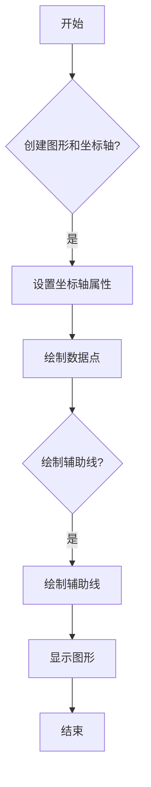

## 类结构

```
SkewXTick (自定义 X 轴刻度)
├── SkewXAxis (自定义 X 轴)
│   ├── SkewSpine (自定义 X 轴脊)
│   └── SkewXAxes (自定义坐标轴)
└── SkewXAxes (自定义坐标轴)
```

## 全局变量及字段


### `sound_data`
    
Holds the raw data for the soundings.

类型：`StringIO`
    


### `p`
    
Pressure values of the soundings.

类型：`numpy.ndarray`
    


### `h`
    
Height values of the soundings.

类型：`numpy.ndarray`
    


### `T`
    
Temperature values of the soundings.

类型：`numpy.ndarray`
    


### `Td`
    
Dew point temperature values of the soundings.

类型：`numpy.ndarray`
    


### `fig`
    
The figure object containing the plot.

类型：`matplotlib.figure.Figure`
    


### `ax`
    
The axes object containing the plot.

类型：`matplotlib.axes._subplots.AxesSubplot`
    


### `l`
    
The line object representing the slanted line at constant X.

类型：`matplotlib.lines.Line2D`
    


### `SkewXTick.gridline`
    
The gridline of the skew tick.

类型：`matplotlib.lines.Line2D`
    


### `SkewXTick.tick1line`
    
The first tick line of the skew tick.

类型：`matplotlib.lines.Line2D`
    


### `SkewXTick.tick2line`
    
The second tick line of the skew tick.

类型：`matplotlib.lines.Line2D`
    


### `SkewXTick.label1`
    
The label of the first tick of the skew tick.

类型：`matplotlib.text.Text`
    


### `SkewXTick.label2`
    
The label of the second tick of the skew tick.

类型：`matplotlib.text.Text`
    


### `SkewXAxes.name`
    
The name of the skew-xaxes projection.

类型：`str`
    


### `SkewXAxes.transDataToAxes`
    
The transform from data to axes coordinates.

类型：`matplotlib.transforms.Transform`
    


### `SkewXAxes.transData`
    
The transform from data to display coordinates.

类型：`matplotlib.transforms.Transform`
    


### `SkewXAxes._xaxis_transform`
    
The transform for the x-axis.

类型：`matplotlib.transforms.Transform`
    


### `SkewXAxes.lower_xlim`
    
The lower x-axis limit.

类型：`tuple`
    


### `SkewXAxes.upper_xlim`
    
The upper x-axis limit.

类型：`tuple`
    
    

## 全局函数及方法


### register_projection(SkewXAxes)

This function registers the `SkewXAxes` class as a custom projection with Matplotlib. It allows users to select the skew-xaxes projection when creating subplots.

参数：

- `SkewXAxes`：`class`，The custom axes class that provides skew-xaxes projection.

返回值：`None`，This function does not return any value.

#### 流程图

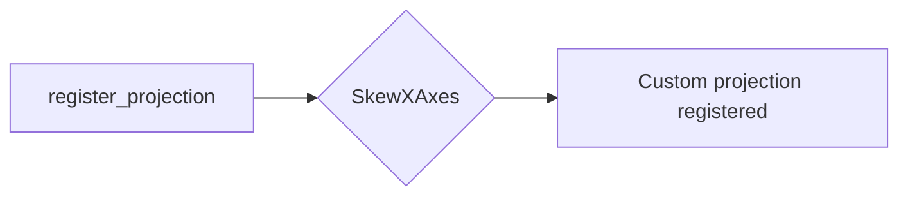

#### 带注释源码

```python
register_projection(SkewXAxes)
```


### np.loadtxt

`np.loadtxt` 是 NumPy 库中的一个函数，用于从文本文件中读取数据。

参数：

- `filename`：`str`，指定包含数据的文件名。
- `dtype`：`dtype`，可选，指定读取数据的类型。
- `delimiter`：`str`，可选，指定数据字段之间的分隔符。
- `skiprows`：`int`，可选，指定要跳过的行数。
- `usecols`：`int` 或 `list`，可选，指定要读取的列。
- `unpack`：`bool`，可选，指定是否将数据解包为多个数组。

返回值：`ndarray`，包含从文件中读取的数据。

#### 流程图

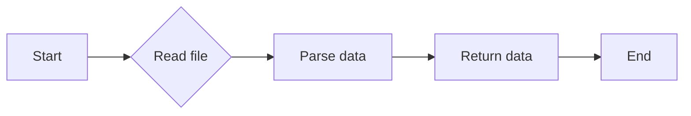

#### 带注释源码

```python
import numpy as np

def read_data(filename):
    """
    Reads data from a text file using np.loadtxt.

    Parameters:
    - filename: str, the name of the file to read.
    - dtype: dtype, the data type of the data to read.
    - delimiter: str, the delimiter used to separate the data fields.
    - skiprows: int, the number of rows to skip.
    - usecols: int or list, the columns to read.
    - unpack: bool, whether to unpack the data into multiple arrays.

    Returns:
    - ndarray, the data read from the file.
    """
    data = np.loadtxt(filename, dtype=float, delimiter=',', skiprows=1, unpack=True)
    return data
```


### plt.figure

`plt.figure` 是 Matplotlib 库中用于创建新图形窗口的函数。

参数：

- `figsize`：`tuple`，图形的宽度和高度，单位为英寸。
- `dpi`：`int`，图形的分辨率，单位为 DPI（每英寸点数）。
- `facecolor`：`color`，图形窗口的背景颜色。
- `edgecolor`：`color`，图形窗口的边缘颜色。
- `frameon`：`bool`，是否显示图形窗口的边框。
- `num`：`int`，图形窗口的编号。
- `figclass`：`class`，图形窗口的类。

返回值：`Figure`，图形对象。

#### 流程图

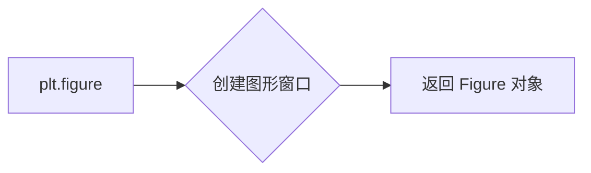

#### 带注释源码

```python
from matplotlib.figure import Figure

def plt_figure(figsize=(6.5875, 6.2125), dpi=100, facecolor='white', edgecolor='none', frameon=True, num=1, figclass=Figure):
    fig = Figure(figsize=figsize, dpi=dpi, facecolor=facecolor, edgecolor=edgecolor, frameon=frameon, num=num, figclass=figclass)
    return fig
```


### plt.subplot

`plt.subplot` 是 Matplotlib 库中的一个函数，用于创建一个子图，并设置其在当前图形中的位置。

#### 描述

`plt.subplot` 允许用户在同一个图形窗口中创建多个子图，每个子图可以独立设置其坐标轴范围、标签等属性。

#### 参数

- `nrows`：整数，表示子图的总行数。
- `ncols`：整数，表示子图的总列数。
- `index`：整数，表示当前子图在所有子图中的索引，从 1 开始。

#### 返回值

返回一个 `AxesSubplot` 对象，该对象可以用于设置子图的属性和绘制图形。

#### 流程图

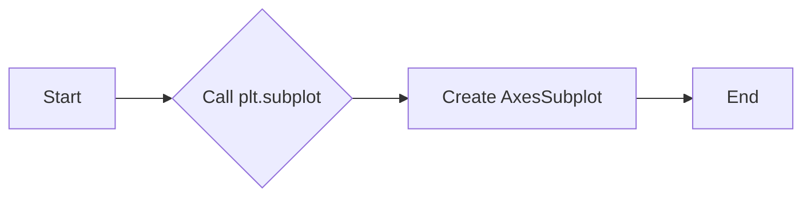

#### 带注释源码

```python
import matplotlib.pyplot as plt

# 创建一个 2x2 的子图网格，并选择第一个子图
ax = plt.subplot(2, 2, 1)
ax.plot([1, 2, 3], [1, 4, 9])
```


### SkewXAxes._init_axis

`SkewXAxes._init_axis` 是 `SkewXAxes` 类中的一个方法，用于初始化子图的坐标轴。

#### 描述

`_init_axis` 方法在创建 `SkewXAxes` 子图时被调用，用于设置子图的坐标轴属性，包括 X 轴和 Y 轴。

#### 参数

- `self`：当前 `SkewXAxes` 实例。

#### 返回值

无返回值。

#### 流程图

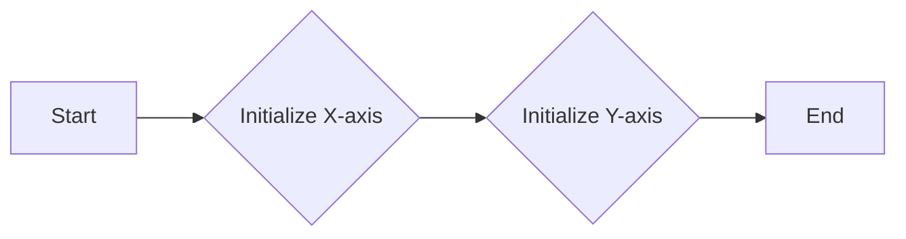

#### 带注释源码

```python
class SkewXAxes(Axes):
    # ... (其他代码)

    def _init_axis(self):
        # 初始化 X 轴
        self.xaxis = SkewXAxis(self)
        self.spines.top.register_axis(self.xaxis)
        self.spines.bottom.register_axis(self.xaxis)
        # 初始化 Y 轴
        self.yaxis = maxis.YAxis(self)
        self.spines.left.register_axis(self.yaxis)
        self.spines.right.register_axis(self.yaxis)
```


### SkewXAxes._set_lim_and_transforms

`SkewXAxes._set_lim_and_transforms` 是 `SkewXAxes` 类中的一个方法，用于设置子图的坐标轴范围和变换。

#### 描述

`_set_lim_and_transforms` 方法在创建 `SkewXAxes` 子图时被调用，用于设置子图的坐标轴范围和变换，包括数据范围、坐标轴范围和坐标轴变换。

#### 参数

- `self`：当前 `SkewXAxes` 实例。

#### 返回值

无返回值。

#### 流程图

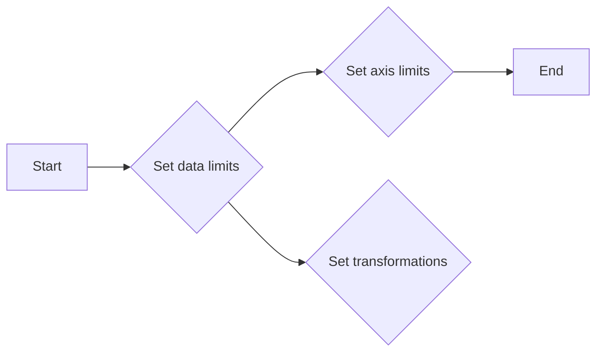

#### 带注释源码

```python
class SkewXAxes(Axes):
    # ... (其他代码)

    def _set_lim_and_transforms(self):
        """
        This is called once when the plot is created to set up all the
        transforms for the data, text and grids.
        """
        rot = 30

        # Get the standard transform setup from the Axes base class
        super()._set_lim_and_transforms()

        # Need to put the skew in the middle, after the scale and limits,
        # but before the transAxes. This way, the skew is done in Axes
        # coordinates thus performing the transform around the proper origin
        # We keep the pre-transAxes transform around for other users, like the
        # spines for finding bounds
        self.transDataToAxes = (
            self.transScale
            + self.transLimits
            + transforms.Affine2D().skew_deg(rot, 0)
        )
        # Create the full transform from Data to Pixels
        self.transData = self.transDataToAxes + self.transAxes

        # Blended transforms like this need to have the skewing applied using
        # both axes, in axes coords like before.
        self._xaxis_transform = (
            transforms.blended_transform_factory(
                self.transScale + self.transLimits,
                transforms.IdentityTransform())
            + transforms.Affine2D().skew_deg(rot, 0)
            + self.transAxes
        )
```


### SkewXTick.draw

`SkewXTick.draw` 是 `SkewXTick` 类中的一个方法，用于绘制 X 轴的刻度。

#### 描述

`draw` 方法在绘制 `SkewXTick` 实例时被调用，用于根据当前坐标轴的可见性状态绘制 X 轴的刻度线、标签等。

#### 参数

- `renderer`：`RendererBase` 对象，用于绘制图形。

#### 返回值

无返回值。

#### 流程图

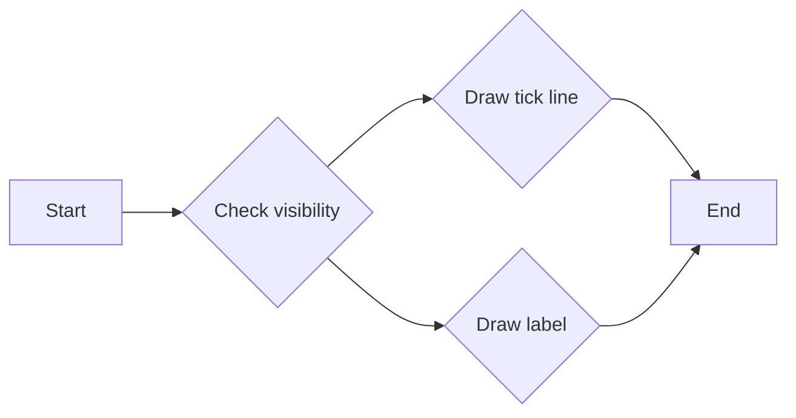

#### 带注释源码

```python
class SkewXTick(maxis.XTick):
    # ... (其他代码)

    def draw(self, renderer):
        # When adding the callbacks with `stack.callback`, we fetch the current
        # visibility state of the artist with `get_visible`; the ExitStack will
        # restore these states (`set_visible`) at the end of the block (after
        # the draw).
        with ExitStack() as stack:
            for artist in [self.gridline, self.tick1line, self.tick2line,
                           self.label1, self.label2]:
                stack.callback(artist.set_visible, artist.get_visible())
            needs_lower = transforms._interval_contains(
                self.axes.lower_xlim, self.get_loc())
            needs_upper = transforms._interval_contains(
                self.axes.upper_xlim, self.get_loc())
            self.tick1line.set_visible(
                self.tick1line.get_visible() and needs_lower)
            self.label1.set_visible(
                self.label1.get_visible() and needs_lower)
            self.tick2line.set_visible(
                self.tick2line.get_visible() and needs_upper)
            self.label2.set_visible(
                self.label2.get_visible() and needs_upper)
            super().draw(renderer)
```


### plt.grid

`plt.grid(True)` 是一个用于在 Matplotlib 图中添加网格线的函数。

#### 描述

该函数用于在 Matplotlib 图中添加网格线，其中 `True` 参数表示启用网格线。

#### 参数

- `True`：布尔值，表示是否启用网格线。

#### 返回值

无返回值。

#### 流程图

```mermaid
graph LR
A[调用 plt.grid(True)] --> B{启用网格线?}
B -- 是 --> C[在图中添加网格线]
B -- 否 --> D[不添加网格线]
```

#### 带注释源码

```python
plt.grid(True)
```


### plt.semilogy

`plt.semilogy` 是 Matplotlib 库中的一个函数，用于绘制半对数图。它将 y 轴数据转换为对数尺度，而 x 轴保持线性尺度。

参数：

- `x`：`array_like`，x 轴数据。
- `y`：`array_like`，y 轴数据。
- `fmt`：`str`，用于指定线型、颜色和标记的字符串。
- `**kwargs`：其他关键字参数，用于传递给 `plot` 函数的参数。

返回值：`Line2D` 对象，表示绘制的线。

#### 流程图

```mermaid
graph LR
A[开始] --> B{调用 plt.semilogy()}
B --> C[结束]
```

#### 带注释源码

```python
import matplotlib.pyplot as plt

# 示例数据
x = np.linspace(1, 10, 10)
y = np.logspace(1, 2, 10)

# 绘制半对数图
line = plt.semilogy(x, y, 'b-')

# 显示图形
plt.show()
```


### plt.axvline

`plt.axvline` 是 Matplotlib 库中的一个函数，用于在当前轴上绘制一条垂直线。

#### 描述

该函数在当前轴上绘制一条垂直线，线的位置由 `x` 参数指定。可以设置线的颜色、线型、线宽等属性。

#### 参数

- `x`：`float`，垂直线的 x 坐标。
- `ymin`：`float`，垂直线在 y 轴上的下限，默认为轴的 y 轴最小值。
- `ymax`：`float`，垂直线在 y 轴上的上限，默认为轴的 y 轴最大值。
- `color`：`str` 或 `color`，线的颜色，默认为 'C0'。
- `linestyle`：`str`，线的样式，默认为 '-'。
- `linewidth`：`float`，线的宽度，默认为 1.0。
- `clip_on`：`bool`，是否将线裁剪到轴的界限内，默认为 True。

#### 返回值

- `Line2D` 对象，表示绘制的线。

#### 流程图

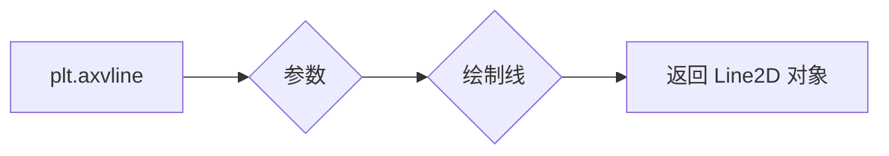

#### 带注释源码

```python
import matplotlib.pyplot as plt

# 创建一个图形和轴
fig, ax = plt.subplots()

# 绘制一条垂直线
line = ax.axvline(x=0, color='red')

# 显示图形
plt.show()
```


### SkewXAxes

`SkewXAxes` 是一个自定义的轴类，用于创建斜轴的图形。

#### 描述

`SkewXAxes` 类继承自 `matplotlib.axes.Axes` 类，并添加了斜轴的功能。它通过修改轴的变换和绘制逻辑来实现斜轴的效果。

#### 参数

- 无

#### 返回值

- `SkewXAxes` 对象，表示创建的斜轴。

#### 流程图

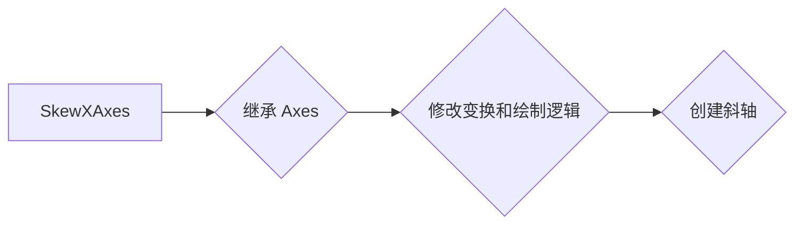

#### 带注释源码

```python
from matplotlib.axes import Axes

class SkewXAxes(Axes):
    name = 'skewx'

    def _init_axis(self):
        self.xaxis = SkewXAxis(self)
        self.spines.top.register_axis(self.xaxis)
        self.spines.bottom.register_axis(self.xaxis)
        self.yaxis = maxis.YAxis(self)
        self.spines.left.register_axis(self.yaxis)
        self.spines.right.register_axis(self.yaxis)

    def _gen_axes_spines(self):
        spines = {'top': SkewSpine.linear_spine(self, 'top'),
                  'bottom': mspines.Spine.linear_spine(self, 'bottom'),
                  'left': mspines.Spine.linear_spine(self, 'left'),
                  'right': mspines.Spine.linear_spine(self, 'right')}
        return spines

    def _set_lim_and_transforms(self):
        rot = 30
        self.transDataToAxes = (
            self.transScale
            + self.transLimits
            + transforms.Affine2D().skew_deg(rot, 0)
        )
        self.transData = self.transDataToAxes + self.transAxes
        self._xaxis_transform = (
            transforms.blended_transform_factory(
                self.transScale + self.transLimits,
                transforms.IdentityTransform())
            + transforms.Affine2D().skew_deg(rot, 0)
            + self.transAxes
        )
```


### SkewXTick

`SkewXTick` 是一个自定义的刻度类，用于处理斜轴的刻度。

#### 描述

`SkewXTick` 类继承自 `matplotlib.axis.XTick` 类，并添加了处理斜轴刻度的逻辑。

#### 参数

- `axes`：`Axes` 对象，表示当前轴。
- `label1`：`Label` 对象，表示第一个刻度标签。
- `label2`：`Label` 对象，表示第二个刻度标签。
- `major`：`bool`，表示是否为主要刻度。

#### 返回值

- `SkewXTick` 对象，表示创建的刻度。

#### 流程图

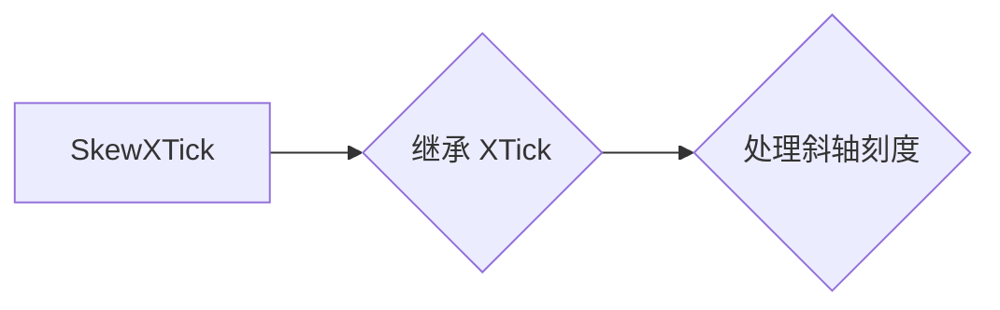

#### 带注释源码

```python
from matplotlib.axis import XTick

class SkewXTick(XTick):
    def draw(self, renderer):
        with ExitStack() as stack:
            for artist in [self.gridline, self.tick1line, self.tick2line,
                           self.label1, self.label2]:
                stack.callback(artist.set_visible, artist.get_visible())
            needs_lower = transforms._interval_contains(
                self.axes.lower_xlim, self.get_loc())
            needs_upper = transforms._interval_contains(
                self.axes.upper_xlim, self.get_loc())
            self.tick1line.set_visible(
                self.tick1line.get_visible() and needs_lower)
            self.label1.set_visible(
                self.label1.get_visible() and needs_lower)
            self.tick2line.set_visible(
                self.tick2line.get_visible() and needs_upper)
            self.label2.set_visible(
                self.label2.get_visible() and needs_upper)
            super().draw(renderer)

    def get_view_interval(self):
        return self.axes.xaxis.get_view_interval()
```


### SkewXAxis

`SkewXAxis` 是一个自定义的轴类，用于处理斜轴的绘制。

#### 描述

`SkewXAxis` 类继承自 `matplotlib.axis.XAxis` 类，并添加了处理斜轴绘制的逻辑。

#### 参数

- `axes`：`Axes` 对象，表示当前轴。

#### 返回值

- `SkewXAxis` 对象，表示创建的轴。

#### 流程图

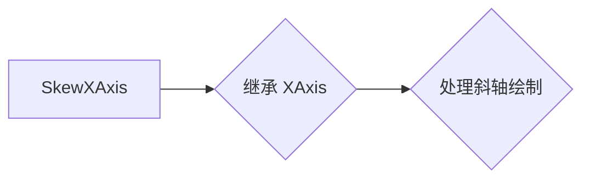

#### 带注释源码

```python
from matplotlib.axis import XAxis

class SkewXAxis(XAxis):
    def _get_tick(self, major):
        return SkewXTick(self.axes, None, major=major)

    def get_view_interval(self):
        return self.axes.upper_xlim[0], self.axes.lower_xlim[1]
```


### SkewSpine

`SkewSpine` 是一个自定义的脊类，用于处理斜轴的脊。

#### 描述

`SkewSpine` 类继承自 `matplotlib.spines.Spine` 类，并添加了处理斜轴脊的逻辑。

#### 参数

- `axes`：`Axes` 对象，表示当前轴。

#### 返回值

- `SkewSpine` 对象，表示创建的脊。

#### 流程图

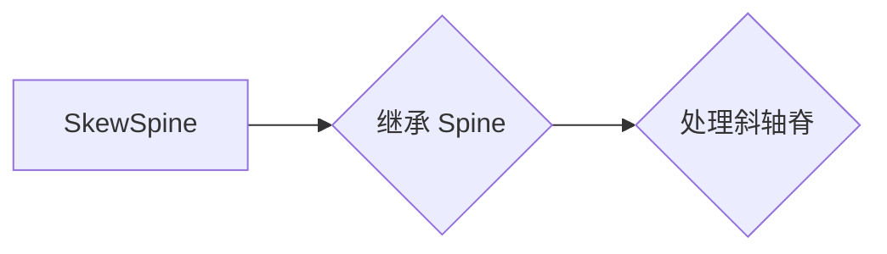

#### 带注释源码

```python
from matplotlib.spines import Spine

class SkewSpine(Spine):
    def _adjust_location(self):
        pts = self._path.vertices
        if self.spine_type == 'top':
            pts[:, 0] = self.axes.upper_xlim
        else:
            pts[:, 0] = self.axes.lower_xlim
```


### plt.yaxis.set_major_formatter

`plt.yaxis.set_major_formatter` 是一个用于设置 y 轴主刻度格式器的函数。

#### 描述

该函数用于设置 y 轴主刻度的格式器，它允许用户自定义 y 轴刻度的显示方式。

#### 参数

- `formatter`：`ScalarFormatter` 或 `NullFormatter` 或自定义格式器，用于设置 y 轴刻度的格式。

#### 返回值

无返回值。

#### 流程图

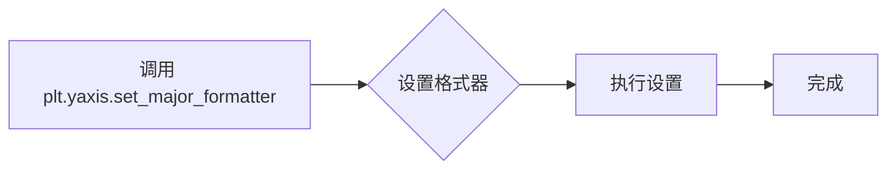

#### 带注释源码

```python
# Disables the log-formatting that comes with semilogy
ax.yaxis.set_major_formatter(ScalarFormatter())
```

在这段代码中，`ScalarFormatter()` 被用作 y 轴主刻度格式器，这将禁用与 `semilogy` 函数一起使用的默认对数格式化。


### plt.yaxis.set_major_formatter(ScalarFormatter())

This function sets the major formatter for the y-axis of a plot. It is used to define how the major tick labels are formatted on the y-axis.

参数：

- `ScalarFormatter()`：`ScalarFormatter`，This is a formatter that formats scalar values. It is used by default for linear axes.

返回值：`None`，This function does not return any value.

#### 流程图

```mermaid
graph LR
A[Call plt.yaxis.set_major_formatter(ScalarFormatter())] --> B{Is y-axis formatter set?}
B -- Yes --> C[End]
B -- No --> D[Set y-axis formatter to ScalarFormatter()]
D --> C
```

#### 带注释源码

```
ax.yaxis.set_major_formatter(ScalarFormatter())
```

This line of code sets the major formatter for the y-axis of the plot `ax` to `ScalarFormatter()`, which is used to format scalar values.


### plt.set_yticks

`plt.set_yticks` 是一个用于设置 y 轴刻度的函数。

#### 描述

该函数用于设置 y 轴的刻度值。它接受一个包含刻度值的列表或数组作为参数。

#### 参数

- `ticks`：`array_like`，包含 y 轴刻度值的列表或数组。

#### 返回值

- 无

#### 流程图

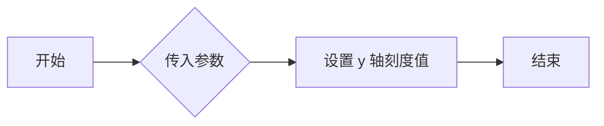

#### 带注释源码

```python
def set_yticks(self, ticks):
    """
    Set the y-axis ticks.

    Parameters
    ----------
    ticks : array_like
        The y-axis ticks.

    Returns
    -------
    None
    """
    self._yaxis.set_ticks(ticks)
```


### plt.set_ylim

`plt.set_ylim` 是一个用于设置当前轴的 y 轴限制的函数。

参数：

- `ymin`：`float`，指定 y 轴的最小值。
- `ymax`：`float`，指定 y 轴的最大值。

返回值：无。

#### 流程图

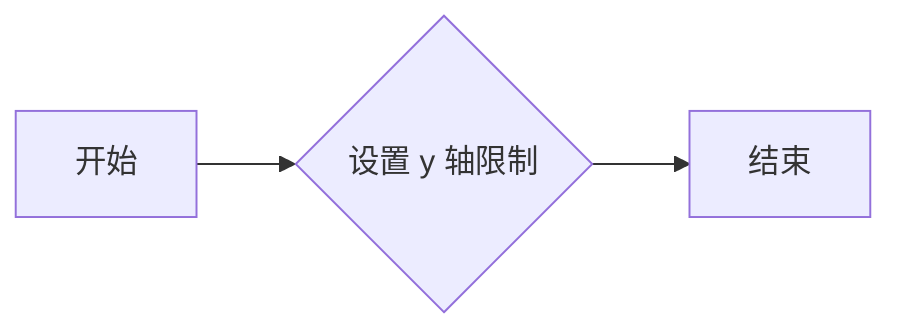

#### 带注释源码

```python
def set_ylim(self, ymin=None, ymax=None):
    """
    Set the y-axis limits.

    Parameters
    ----------
    ymin : float, optional
        The new minimum y-axis limit.
    ymax : float, optional
        The new maximum y-axis limit.

    Returns
    -------
    None
    """
    if ymin is not None:
        self.yaxis.set_major_formatter(ScalarFormatter())
        self.yaxis.set_minor_formatter(NullFormatter())
        self.set_yticks(np.linspace(ymin, ymax, 10))
        self.set_ylim(ymin, ymax)
```


### plt.xaxis.set_major_locator

`plt.xaxis.set_major_locator` 是一个用于设置 x 轴主刻度定位器的函数。

#### 描述

该函数用于设置 x 轴的主刻度定位器，它决定了 x 轴上主刻度的位置。

#### 参数

- `locator`：`Locator` 对象，用于确定 x 轴主刻度的位置。

#### 返回值

无返回值。

#### 流程图

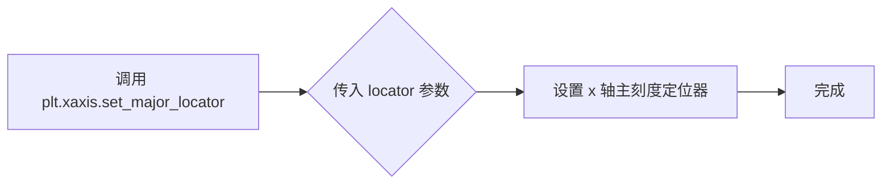

#### 带注释源码

```python
import matplotlib.pyplot as plt

# 创建一个示例数据
x = np.linspace(0, 10, 100)
y = np.sin(x)

# 创建一个图形和轴
fig, ax = plt.subplots()

# 绘制数据
ax.plot(x, y)

# 设置 x 轴的主刻度定位器为 MultipleLocator(1)，即每隔 1 个单位设置一个主刻度
ax.xaxis.set_major_locator(plt.MultipleLocator(1))

# 显示图形
plt.show()
```


### plt.set_xlim

`plt.set_xlim` 是一个用于设置当前轴的 X 轴限制的全局函数。

参数：

- `left`：`float`，X 轴左边界。
- `right`：`float`，X 轴右边界。

返回值：无。

#### 流程图

```mermaid
graph LR
A[开始] --> B{设置左边界}
B --> C{设置右边界}
C --> D[结束]
```

#### 带注释源码

```python
def set_xlim(self, left=None, right=None):
    """
    Set the x-axis limits.

    Parameters
    ----------
    left : float, optional
        The left limit of the x-axis.
    right : float, optional
        The right limit of the x-axis.

    Returns
    -------
    None
    """
    if left is not None:
        self._xlim_left = left
    if right is not None:
        self._xlim_right = right
    self._update_view()
```


### plt.show()

`plt.show()` 是 Matplotlib 库中的一个全局函数，用于显示当前图形窗口。它将当前图形窗口的内容渲染到屏幕上，并保持窗口打开，直到用户关闭它。

参数：

- 无

返回值：无

#### 流程图

```mermaid
graph LR
A[plt.show()] --> B{图形窗口渲染}
B --> C{窗口打开}
C --> D{用户关闭窗口}
```

#### 带注释源码

```python
import matplotlib.pyplot as plt

# ... (其他绘图代码)

plt.show()  # 显示图形窗口
```


### SkewXTick.draw

This method is responsible for drawing the ticks on the SkewXAxes, which are not orthogonal due to the skew component applied to the basic Axes transforms.

参数：

- `renderer`：`matplotlib.cbook.RendererBase`，The renderer object used to draw the ticks.

返回值：`None`，This method does not return any value.

#### 流程图

```mermaid
graph LR
A[Start] --> B{Check visibility of gridline}
B -->|Yes| C{Check visibility of tick1line}
B -->|No| C
C -->|Yes| D{Check visibility of label1}
C -->|No| D
D -->|Yes| E{Check visibility of tick2line}
D -->|No| E
E -->|Yes| F{Check visibility of label2}
E -->|No| F
F --> G[End]
```

#### 带注释源码

```python
def draw(self, renderer):
    # When adding the callbacks with `stack.callback`, we fetch the current
    # visibility state of the artist with `get_visible`; the ExitStack will
    # restore these states (`set_visible`) at the end of the block (after
    # the draw).
    with ExitStack() as stack:
        for artist in [self.gridline, self.tick1line, self.tick2line,
                       self.label1, self.label2]:
            stack.callback(artist.set_visible, artist.get_visible())
        needs_lower = transforms._interval_contains(
            self.axes.lower_xlim, self.get_loc())
        needs_upper = transforms._interval_contains(
            self.axes.upper_xlim, self.get_loc())
        self.tick1line.set_visible(
            self.tick1line.get_visible() and needs_lower)
        self.label1.set_visible(
            self.label1.get_visible() and needs_lower)
        self.tick2line.set_visible(
            self.tick2line.get_visible() and needs_upper)
        self.label2.set_visible(
            self.label2.get_visible() and needs_upper)
        super().draw(renderer)
```


### SkewXTick.get_view_interval

This method returns the view interval of the SkewXTick object, which represents the visible range of the X-axis in the SkewT-logP diagram.

参数：

- 无

返回值：`tuple`，包含两个元素，分别代表X轴的视图区间的左边界和右边界。

#### 流程图

```mermaid
graph LR
A[Start] --> B{Return view interval}
B --> C[End]
```

#### 带注释源码

```python
def get_view_interval(self):
    return self.axes.xaxis.get_view_interval()
```


### SkewXAxis._get_tick

This method is used to create an instance of `SkewXTick` for the skew-xaxes, which is a custom tick class for handling the non-orthogonal axes in the SkewT-logP diagram.

参数：

- `major`：`bool`，Indicates whether the tick is a major tick or a minor tick.

返回值：`SkewXTick`，An instance of `SkewXTick` for the skew-xaxes.

#### 流程图

```mermaid
graph LR
A[Start] --> B{Is it a major tick?}
B -- Yes --> C[Create SkewXTick with major=True]
B -- No --> D[Create SkewXTick with major=False]
C --> E[Return SkewXTick instance]
D --> E
E --> F[End]
```

#### 带注释源码

```python
def _get_tick(self, major):
    return SkewXTick(self.axes, None, major=major)
```


### SkewXAxis.get_view_interval

This method returns the view interval of the skew-xaxis, which represents the visible range of the x-axis.

参数：

- 无

返回值：`tuple`，The view interval of the x-axis, represented as a tuple of two floats.

#### 流程图

```mermaid
graph LR
A[Start] --> B{Is method called?}
B -- Yes --> C[Get view interval]
C --> D[Return interval]
D --> E[End]
B -- No --> F[End]
```

#### 带注释源码

```python
def get_view_interval(self):
    return self.axes.upper_xlim[0], self.axes.lower_xlim[1]
```


### SkewSpine._adjust_location

This method adjusts the location of the spine based on the upper or lower X-axis data range.

参数：

- `self`：`SkewSpine`，The instance of the SkewSpine class.

返回值：`None`，No return value.

#### 流程图

```mermaid
graph LR
A[Start] --> B{Is spine type 'top'?}
B -- Yes --> C[Set spine vertices X to upper_xlim]
B -- No --> D[Set spine vertices X to lower_xlim]
C --> E[End]
D --> E
```

#### 带注释源码

```python
class SkewSpine(mspines.Spine):
    # ... other methods and class details ...

    def _adjust_location(self):
        pts = self._path.vertices
        if self.spine_type == 'top':
            pts[:, 0] = self.axes.upper_xlim
        else:
            pts[:, 0] = self.axes.lower_xlim
```


### SkewXAxes._init_axis

This method initializes the axis for the SkewXAxes class, setting up the custom X-axis and Y-axis transformations.

参数：

- 无

返回值：无

#### 流程图

```mermaid
graph LR
A[Start] --> B{Initialize X-axis}
B --> C[Set SkewXAxis as X-axis]
B --> D{Initialize Y-axis}
D --> E[Set YAxis as Y-axis]
E --> F[End]
```

#### 带注释源码

```python
def _init_axis(self):
    # Taken from Axes and modified to use our modified X-axis
    self.xaxis = SkewXAxis(self)
    self.spines.top.register_axis(self.xaxis)
    self.spines.bottom.register_axis(self.xaxis)
    self.yaxis = maxis.YAxis(self)
    self.spines.left.register_axis(self.yaxis)
    self.spines.right.register_axis(self.yaxis)
```


### SkewXAxes._gen_axes_spines

This method generates the spines for the SkewXAxes class, which is a custom projection in Matplotlib used to create SkewT-logP diagrams. It returns a dictionary of spines with their respective types.

参数：

- 无

返回值：`dict`，包含不同类型的spines，如'top', 'bottom', 'left', 'right'。

#### 流程图

```mermaid
graph LR
A[Start] --> B{Generate spines}
B --> C[Create top spine]
B --> D[Create bottom spine]
B --> E[Create left spine]
B --> F[Create right spine]
C --> G[Return spines]
D --> G
E --> G
F --> G
G --> H[End]
```

#### 带注释源码

```python
def _gen_axes_spines(self):
    # Create spines for top, bottom, left, and right
    spines = {'top': SkewSpine.linear_spine(self, 'top'),
              'bottom': mspines.Spine.linear_spine(self, 'bottom'),
              'left': mspines.Spine.linear_spine(self, 'left'),
              'right': mspines.Spine.linear_spine(self, 'right')}
    return spines
```


### SkewXAxes._set_lim_and_transforms

This method sets up the transforms for the data, text, and grids in the SkewXAxes class, which is a custom projection for Matplotlib.

参数：

- 无

返回值：无

#### 流程图

```mermaid
graph LR
A[Start] --> B[Call super()._set_lim_and_transforms()]
B --> C[Set rot variable]
C --> D[Get standard transform setup]
D --> E[Apply skew transform]
E --> F[Create full transform from Data to Pixels]
F --> G[Set _xaxis_transform]
G --> H[End]
```

#### 带注释源码

```python
def _set_lim_and_transforms(self):
    """
    This is called once when the plot is created to set up all the
    transforms for the data, text and grids.
    """
    rot = 30

    # Get the standard transform setup from the Axes base class
    super()._set_lim_and_transforms()

    # Need to put the skew in the middle, after the scale and limits,
    # but before the transAxes. This way, the skew is done in Axes
    # coordinates thus performing the transform around the proper origin
    # We keep the pre-transAxes transform around for other users, like the
    # spines for finding bounds
    self.transDataToAxes = (
        self.transScale
        + self.transLimits
        + transforms.Affine2D().skew_deg(rot, 0)
    )
    # Create the full transform from Data to Pixels
    self.transData = self.transDataToAxes + self.transAxes

    # Blended transforms like this need to have the skewing applied using
    # both axes, in axes coords like before.
    self._xaxis_transform = (
        transforms.blended_transform_factory(
            self.transScale + self.transLimits,
            transforms.IdentityTransform())
        + transforms.Affine2D().skew_deg(rot, 0)
        + self.transAxes
    )
```


## 关键组件


### SkewXTick

This class is a custom tick for the skew-xaxes, which determines which parts of the tick to draw based on the visibility state of the artist.

### SkewXAxis

This class provides two separate sets of intervals to the tick and creates instances of the custom tick for the skew-xaxes.

### SkewSpine

This class calculates the separate data range of the upper X-axis and draws the spine there, providing this range to the X-axis artist for ticking and gridlines.

### SkewXAxes

This class handles registration of the skew-xaxes as a projection, setting up the appropriate transformations, and overriding standard spines and axes instances as appropriate.


## 问题及建议


### 已知问题

-   **代码复杂度**：代码中使用了大量的自定义类和函数来处理非正交的X和Y轴，这增加了代码的复杂度和维护难度。
-   **性能问题**：自定义的类和方法可能会对性能产生影响，尤其是在处理大量数据时。
-   **可读性**：代码中存在大量的注释和文档字符串，但仍然可能难以理解代码的整体结构和逻辑。

### 优化建议

-   **重构代码**：考虑将代码分解为更小的、更易于管理的模块，以提高代码的可读性和可维护性。
-   **性能优化**：对性能敏感的部分进行优化，例如通过减少不必要的计算和内存使用。
-   **文档和注释**：更新文档和注释，确保它们准确反映代码的功能和结构。
-   **单元测试**：编写单元测试以确保代码的稳定性和可靠性。
-   **代码审查**：进行代码审查以发现潜在的问题和改进机会。


## 其它


### 设计目标与约束

- 设计目标：实现一个SkewT-logP图，用于气象学中显示温度的垂直剖面。
- 约束条件：使用Matplotlib的transform和自定义投影API，确保X和Y轴非正交。

### 错误处理与异常设计

- 错误处理：在代码中未明确显示错误处理机制，但应确保所有外部依赖和API调用都有适当的异常处理。
- 异常设计：对于可能出现的异常，如数据解析错误或Matplotlib绘图错误，应提供清晰的错误消息和恢复策略。

### 数据流与状态机

- 数据流：数据从输入文件读取，经过解析和处理，最终在图表中显示。
- 状态机：代码中没有明确的状态机，但绘图过程中涉及多个步骤，如数据解析、绘图设置和显示。

### 外部依赖与接口契约

- 外部依赖：Matplotlib、NumPy、StringIO。
- 接口契约：Matplotlib的Axes、Transforms、Spines等API的使用遵循其官方文档和约定。

### 测试与验证

- 测试策略：编写单元测试以验证代码的功能和性能。
- 验证方法：使用已知的数据集和图表进行验证，确保输出符合预期。

### 维护与扩展

- 维护策略：定期更新依赖库，修复已知问题，并添加新功能。
- 扩展方法：根据用户需求和技术发展，扩展图表的功能和性能。


    