# `matplotlib\galleries\examples\specialty_plots\topographic_hillshading.py` 详细设计文档

这是一个matplotlib地形山体阴影可视化演示脚本，通过LightSource类生成山体阴影效果，展示不同垂直夸张度(vert_exag)和混合模式(blend_mode)组合下的视觉效果，用于演示地形可视化的最佳实践。

## 整体流程

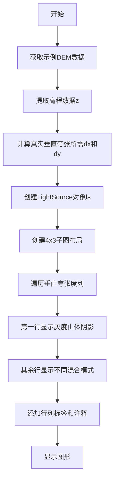

## 类结构

```
Python脚本 (无面向对象结构)
└── 主要依赖: LightSource (matplotlib.colors)
    └── 功能函数: hillshade(), shade()
```

## 全局变量及字段


### `dem`
    
包含高程和元数据的npz文件对象

类型：`npzfile`
    


### `z`
    
高程数组

类型：`ndarray`
    


### `dx`
    
网格X方向间距(米)

类型：`float`
    


### `dy`
    
网格Y方向间距(米)

类型：`float`
    


### `ls`
    
LightSource光源对象

类型：`LightSource`
    


### `cmap`
    
颜色映射(gist_earth)

类型：`Colormap`
    


### `fig`
    
图形对象

类型：`Figure`
    


### `axs`
    
子图数组对象(4x3)

类型：`ndarray`
    


### `col`
    
子图列迭代器

类型：`iterator`
    


### `ve`
    
垂直夸张度变量

类型：`float`
    


### `ax`
    
单个子图对象

类型：`Axes`
    


### `mode`
    
混合模式字符串

类型：`str`
    


### `rgb`
    
山体阴影RGB数组

类型：`ndarray`
    


### `LightSource.azdeg`
    
方位角

类型：`float`
    


### `LightSource.altdeg`
    
高度角

类型：`float`
    
    

## 全局函数及方法


### `get_sample_data`

获取matplotlib示例数据文件的函数，用于加载并返回示例数据文件（通常是npz或npy格式）中的数据。

参数：

-  `fname`：`str`，要获取的示例数据文件的名称（如 'jacksboro_fault_dem.npz'）

返回值：`npz` 文件对象（类似字典的对象），返回的示例数据对象，包含文件中的各个数据数组，可以通过类似字典的访问方式获取数据（如 `dem['elevation']`、`dem['dx']` 等）

#### 流程图

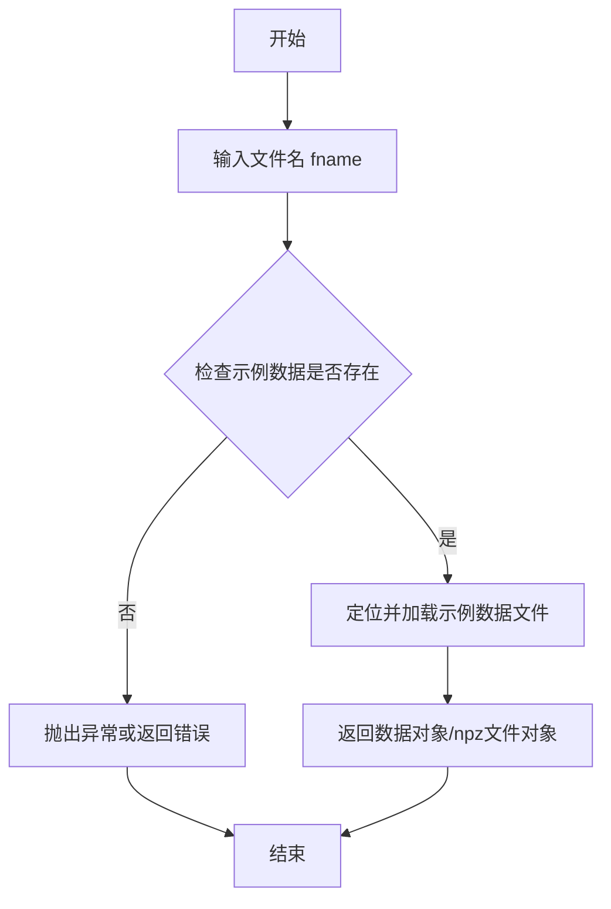

#### 带注释源码

```python
# 从 matplotlib.cbook 模块导入 get_sample_data 函数
# matplotlib.cbook 是 matplotlib 的常用工具模块
from matplotlib.cbook import get_sample_data

# 调用 get_sample_data 获取名为 'jacksboro_fault_dem.npz' 的示例数据文件
# 该文件包含 DEM（数字高程模型）数据
dem = get_sample_data('jacksboro_fault_dem.npz')

# 从返回的 dem 对象中提取高程数据
z = dem['elevation']

# 提取网格的水平和垂直分辨率（dx 和 dy）
dx, dy = dem['dx'], dem['dy']

# 将 dx 和 dy 从十进制度转换为米
# 111200 是地球表面每度的大致米数（纬度方向）
dy = 111200 * dy
dx = 111200 * dx * np.cos(np.radians(dem['ymin']))

# dem['ymin'] 用于获取数据所在纬度的余弦校正因子
# 因为经度方向的距离随纬度变化
```


### `np.radians`

将角度从度数转换为弧度的 NumPy 函数，常用于三角函数计算前需要弧度值的场景。

参数：

-  `x`：`float` 或 `array_like`，要转换的角度值（单位为度）

返回值：`float` 或 `ndarray`，转换后的弧度值

#### 流程图

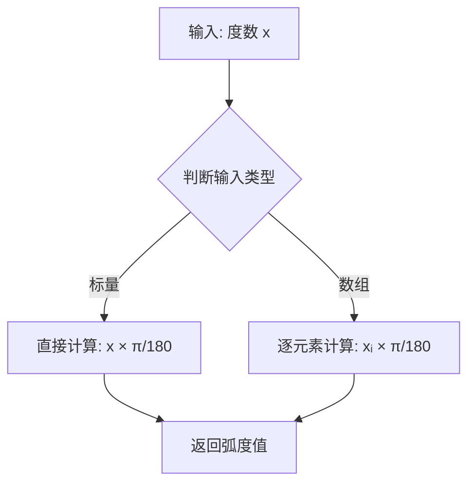

#### 带注释源码

```python
# np.radians(x)
# 示例用法: np.radians(dem['ymin'])
# 其中 dem['ymin'] 是DEM数据的最小y坐标（纬度），单位为度

# 在本代码中的具体使用:
dx = 111200 * dx * np.cos(np.radians(dem['ymin']))

# 步骤解释:
# 1. dem['ymin'] - 获取DEM数据的最小纬度值（单位：度）
# 2. np.radians(dem['ymin']) - 将纬度从度转换为弧度
#    (因为NumPy的cos()函数要求输入为弧度)
# 3. np.cos(...) - 计算余弦值
# 4. 111200 * dx * ... - 乘以转换因子将度转换为米
```


### np.cos

描述：计算输入角度（弧度）的余弦值，返回与输入形状相同的数组或标量。该函数是 NumPy 库提供的三角函数接口，实现为 C 级循环（element‑wise），适用于标量或任意维度的数组。

参数：

-  `x`：`float` 或 `array_like`，输入的角度，以弧度为单位。

返回值：`float` 或 `ndarray`，对应输入角度的余弦值。

#### 流程图

```mermaid
graph LR
    A[输入 x (弧度)] --> B[np.cos()]
    B --> C[输出 y = cos(x)]
```

#### 带注释源码

```python
# 将角度从度数转换为弧度（NumPy 要求弧度制）
angle_in_radians = np.radians(dem['ymin'])  # dem['ymin'] 为度数

# 计算余弦值（np.cos 接受弧度并返回对应的余弦）
dx = 111200 * dx * np.cos(angle_in_radians)
```


### `plt.colormaps`

获取matplotlib中注册的颜色映射（colormap），通过名称访问特定的颜色映射对象。

参数：

-  `name`：`str`，颜色映射的名称（如 "gist_earth"、"gray"、"viridis" 等）

返回值：`matplotlib.colors.Colormap`，返回对应的颜色映射对象

#### 流程图

```mermaid
flowchart TD
    A[开始访问 plt.colormaps] --> B{使用键名访问}
    B -->|plt.colormaps['gist_earth']| C[在注册表中查找名称]
    C --> D{查找成功?}
    D -->|是| E[返回 Colormap 对象]
    D -->|否| F[抛出 KeyError 异常]
    E --> G[结束]
    F --> G
```

#### 带注释源码

```python
# plt.colormaps 是 matplotlib.pyplot 模块中的一个属性
# 它返回一个 ColormapRegistry 对象，该对象包含所有已注册的颜色映射

# 方式1: 通过键名访问单个颜色映射
cmap = plt.colormaps["gist_earth"]  # 返回 Colormap 对象

# 方式2: 遍历所有可用的颜色映射
# for name in plt.colormaps:
#     print(name)

# 方式3: 检查颜色映射是否存在
# if "gist_earth" in plt.colormaps:
#     cmap = plt.colormaps["gist_earth"]

# 实际使用示例（来自代码）
ls = LightSource(azdeg=315, altdeg=45)  # 创建光源对象
cmap = plt.colormaps["gist_earth"]       # 获取 gist_earth 颜色映射
rgb = ls.shade(z, cmap=cmap, blend_mode='overlay', 
               vert_exag=1, dx=dx, dy=dy)  # 使用颜色映射渲染地形
```


### `plt.subplots()`

`plt.subplots()` 是 matplotlib.pyplot 模块中的函数，用于创建一个包含多个子图的图形布局，并返回图形对象和轴对象数组。该函数简化了创建规则网格子图的过程，支持自定义行列数、共享坐标轴、图形尺寸等配置。

参数：

- `nrows`：int，默认值 1，表示子图的行数
- `ncols`：int，默认值 1，表示子图的列数
- `sharex`：bool or str，默认值 False，控制子图是否共享 x 轴；设为 True 或 'row' 时，行内子图共享 x 轴
- `sharey`：bool or str，默认值 False，控制子图是否共享 y 轴；设为 True 或 'col' 时，列内子图共享 y 轴
- `squeeze`：bool，默认值 True，若为 True，则返回的 axs 数组维度会被压缩：一维时返回 Axis 对象，二维时返回 2D 数组
- `subplot_kw`：dict，默认值 None，传递给每个子图创建函数（如 add_subplot）的关键字参数字典
- `gridspec_kw`：dict，默认值 None，传递给 GridSpec 构造函数的关键字参数字典，用于控制网格布局
- `figsize`：tuple of (width, height)，默认值 None，以英寸为单位的图形尺寸 (宽, 高)
- `dpi`：int，默认值 None，图形分辨率（每英寸点数）
- `facecolor`：color，默认值 None，图形背景颜色
- `edgecolor`：color，默认值 None，图形边框颜色
- `linewidth`：float，默认值 None，边框线宽
- `frameon`：bool，默认值 True，是否绘制框架

返回值：

- `fig`：matplotlib.figure.Figure，图形对象，表示整个 figure 容器
- `axs`：numpy.ndarray 或 matplotlib.axes.Axes，子图轴对象数组，维度为 (nrows, ncols)；当 squeeze=True 且仅有一个子图时，直接返回 Axes 对象

#### 流程图

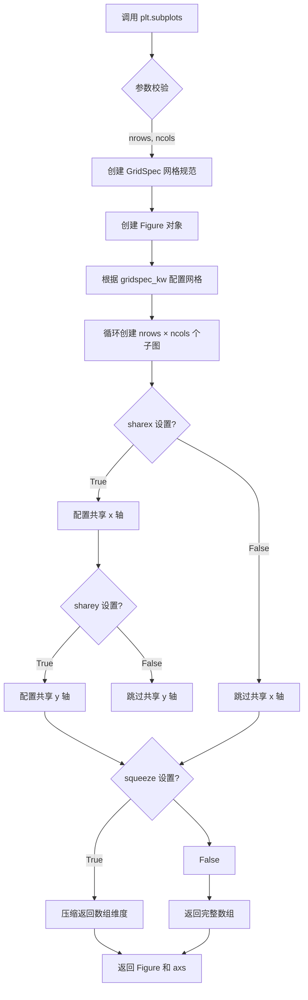

#### 带注释源码

```python
# 示例代码：plt.subplots() 的调用方式
# 在本例中创建一个 4 行 3 列的子图网格
fig, axs = plt.subplots(nrows=4, ncols=3, figsize=(8, 9))

# 参数说明：
# - nrows=4: 创建 4 行子图
# - ncols=3: 创建 3 列子图
# - figsize=(8, 9): 图形尺寸为 8 英寸宽、9 英寸高
# - 返回的 fig 是 Figure 对象，代表整个图形容器
# - 返回的 axs 是一个 4×3 的 Axes 数组 (numpy.ndarray)

# 使用 flat 属性遍历所有子图并设置刻度为空
plt.setp(axs.flat, xticks=[], yticks=[])

# 通过列迭代器遍历不同垂直夸张值 (0.1, 1, 10)
for col, ve in zip(axs.T, [0.1, 1, 10]):
    # 第一行显示灰度 hillshade 强度图
    col[0].imshow(ls.hillshade(z, vert_exag=ve, dx=dx, dy=dy), cmap='gray')
    
    # 其余行显示不同混合模式的彩色山体阴影图
    for ax, mode in zip(col[1:], ['hsv', 'overlay', 'soft']):
        rgb = ls.shade(z, cmap=cmap, blend_mode=mode,
                       vert_exag=ve, dx=dx, dy=dy)
        ax.imshow(rgb)

# 流程解析：
# 1. plt.subplots() 创建 figure 和 4×3 的 axes 网格
# 2. axs.T 转置数组，使 zip 能按列分组 (每列对应一个垂直夸张值)
# 3. 内部循环遍历三种混合模式生成可视化效果
# 4. 最终通过 fig.subplots_adjust() 调整布局边距
```


### `plt.setp`

设置图形对象（如图形、坐标轴、线条等）的属性。该函数是 matplotlib 中用于快速设置对象属性的便捷函数，支持通过关键字参数或位置参数设置单个或多个属性。在本代码中用于批量设置子图数组中所有子图的 x 轴和 y 轴刻度为空。

参数：

- `obj`：目标对象，可以是单个图形对象（如 Axes、Line2D）或对象列表/迭代器。在本代码中为 `axs.flat`，即展平后的 Axes 数组迭代器，用于获取所有子图。
- `*args`：位置参数，用于传递属性名和属性值对。当使用位置参数时，属性名在前，属性值在后。
- `**kwargs`：关键字参数，直接指定属性名和对应的属性值。例如 `xticks=[]` 表示设置 x 轴刻度为空列表，`yticks=[]` 表示设置 y 轴刻度为空列表。

返回值：无返回值（`None`），该函数直接修改传入对象的属性。

#### 流程图

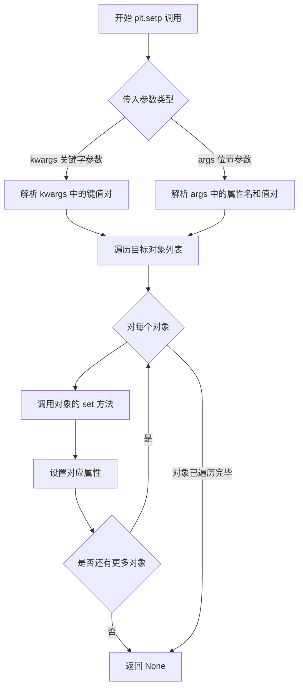

#### 带注释源码

```python
# plt.setp 是 matplotlib.pyplot.setp 的别名
# 函数签名: plt.setp(obj, *args, **kwargs)

# 在本代码中的实际调用:
plt.setp(axs.flat, xticks=[], yticks=[])

# 参数说明:
# - axs.flat: 
#     通过 matplotlib 的 Axes.flat 属性获取一个展平的迭代器
#     axs 是通过 plt.subplots(nrows=4, ncols=3) 创建的 4x3 坐标轴数组
#     .flat 属性将其转换为一维迭代器，便于批量处理所有子图
# - xticks=[]: 
#     关键字参数，设置 x 轴刻度为空列表，即隐藏 x 轴刻度标签
# - yticks=[]: 
#     关键字参数，设置 y 轴刻度为空列表，即隐藏 y 轴刻度标签

# 函数内部逻辑（简化版）:
def setp(obj, *args, **kwargs):
    """
    设置图形对象的属性
    
    参数:
        obj: 目标对象或对象列表
        *args: 位置参数（属性名, 属性值）对
        **kwargs: 关键字参数形式的属性设置
    """
    # 如果 obj 是可迭代对象（列表、数组等），遍历处理每个对象
    # 否则将其包装为列表处理
    objs = list(obj) if hasattr(obj, '__iter__') else [obj]
    
    # 处理位置参数（属性名, 属性值交替）
    if args:
        # 将位置参数转换为关键字参数格式
        # 例如: setp(ax, 'xlabel', 'X') -> {'xlabel': 'X'}
        props = dict(zip(args[::2], args[1::2]))
        kwargs.update(props)
    
    # 遍历每个对象并设置属性
    for o in objs:
        # 调用对象的 set 方法设置属性
        for prop, value in kwargs.items():
            if hasattr(o, 'set_' + prop):
                # 如果对象有 set_<property> 方法，调用它
                getattr(o, 'set_' + prop)(value)
            else:
                # 否则尝试直接设置属性
                setattr(o, prop, value)
    
    # 本函数无返回值（返回 None）
    return None

# 等效的调用方式（使用位置参数）:
# plt.setp(axs.flat, 'xticks', [], 'yticks', [])
```


### `LightSource.hillshade`

`ls.hillshade()` 是 `matplotlib.colors.LightSource` 类中的核心方法，用于根据输入的二维高程数据（DEM）计算光照阴影。该方法通过分析高程表面的坡度和坡向与光源方向（方位角和高度角）的夹角，生成了一个表示表面亮度或阴影强度的二维数组（NDArray），通常用于创建地形可视化中的基础阴影层。

参数：

-  `z`：`numpy.ndarray`，二维数组，表示地形的海拔高度（Elevation）。
-  `vert_exag`：`float`，可选，垂直夸张系数（Vertical Exaggeration），用于增强高程差异的视觉效果，默认为 1。
-  `dx`：`float`，可选，网格在 x 方向上的间距（细胞大小），用于计算真实的坡度，默认为 1.0。
-  `dy`：`float`，可选，网格在 y 方向上的间距（细胞大小），用于计算真实的坡度，默认为 1.0。

返回值：`numpy.ndarray`，返回与输入 `z` 形状相同的二维数组，包含计算得到的阴影强度值（通常归一化到 0 到 1 之间，0 为阴影，1 为完全受光）。

#### 流程图

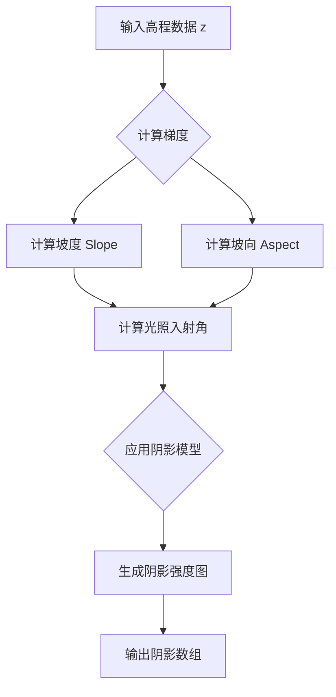

#### 带注释源码

```python
# -*- coding: utf-8 -*-
"""
这里展示的是在给定脚本中调用 hillshade 方法的上下文代码。
该方法通常位于 matplotlib.colors.LightSource 类中。
"""

# 1. 准备高程数据 (z)
dem = get_sample_data('jacksboro_fault_dem.npz')
z = dem['elevation']

# 2. 初始化光源对象，设定方位角(azdeg=315, 西北方向)和高度角(altdeg=45)
ls = LightSource(azdeg=315, altdeg=45)

# 3. 调用 hillshade 方法计算阴影
# 参数说明:
# z: 输入的高程矩阵
# vert_exag: 垂直夸张系数，此处分别为 0.1, 1, 10
# dx, dy: 经过转换的网格间距（米）
hillshade_result = ls.hillshade(z, vert_exag=0.1, dx=dx, dy=dy)

# 4. 可视化结果 (在第一个子图中展示灰度阴影)
col[0].imshow(hillshade_result, cmap='gray')
```

#### 关键组件信息

-   **LightSource**: 光源类，负责管理光照角度（方位角、高度角）以及调用渲染方法。
-   **get_sample_data**: 加载示例 DEM（数字高程模型）数据的工具函数。
-   **vert_exag (Vertical Exaggeration)**: 地形可视化中常用的参数，用于人为放大高程差异以增强立体感。

#### 潜在的技术债务或优化空间

1.  **硬编码的坐标转换**: 代码中手动将 `dx` 和 `dy` 从度转换为米（`111200 * ...`），这种转换逻辑依赖于特定的数据投影（Equirectangular），缺乏通用性。如果 DEM 数据使用其他投影，计算逻辑需要重写。
2.  **魔法数字**: 代码中出现了 `111200` 这样的魔术数字，应提取为常量或配置参数，并注明其物理意义（地球周长除以360的大致结果）。
3.  **参数调试**: 当前通过循环尝试不同的 `vert_exag` 和 `blend_mode` 来寻找视觉效果，缺乏自动化的最优参数选择机制。

#### 其它项目

-   **设计目标**: 该函数的设计目标是为地形数据提供逼真的光照渲染基础，通过区分阳面和阴面增强地形的可读性。
-   **约束**: 输入的 `z` 必须为二维数值数组，且 `dx`/`dy` 必须与 `z` 的单位一致（或者通过 `vert_exag` 调整比例）。
-   **错误处理**: 如果 `z` 包含 NaN 值，可能会导致梯度计算出现异常，通常需要在调用前进行数据清洗。如果 `dx` 或 `dy` 为 0，可能导致除零错误。


```xml

### `LightSource.shade`

应用颜色并混合高程数据，生成山体阴影图像。

参数：

-  `z`：`numpy.ndarray`，高程数据数组
-  `cmap`：`matplotlib.colors.Colormap`，颜色映射对象
-  `blend_mode`：`str`，混合模式，可选值包括 'hsv'、'overlay'、'soft' 等
-  `vert_exag`：`float`，垂直 exaggeration 值，用于控制山体阴影的对比度
-  `dx`：`float`，x 方向的网格间距（单位与 z 相同）
-  `dy`：`float`，y 方向的网格间距（单位与 z 相同）

返回值：`numpy.ndarray`，RGB 图像数组

#### 流程图

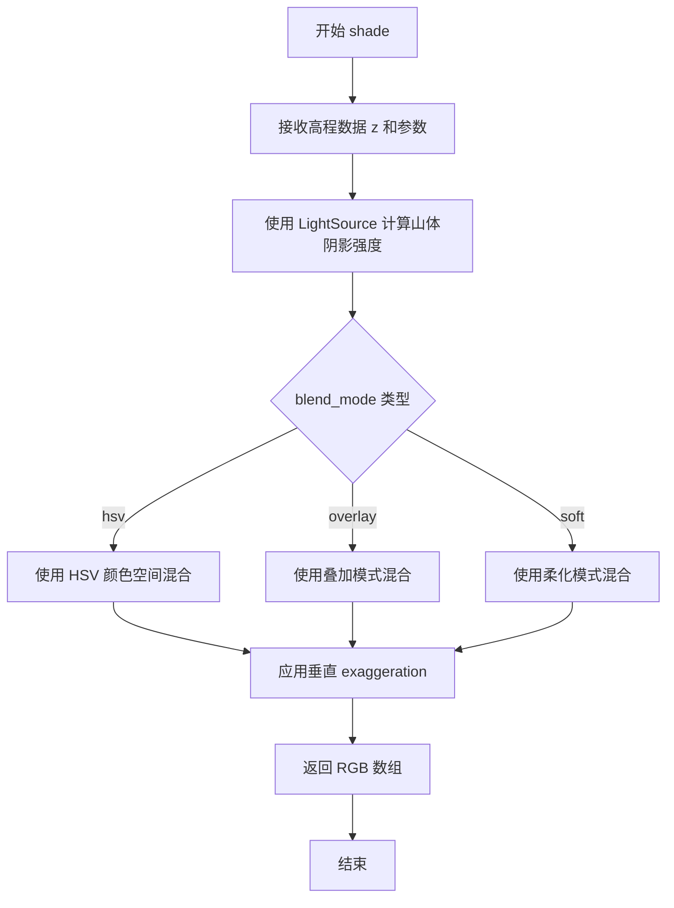

#### 带注释源码

```python
# 在代码中调用 shade 方法的示例
ls = LightSource(azdeg=315, altdeg=45)  # 创建光源对象，azdeg=315 表示西北方向，altdeg=45 表示太阳高度角45度
cmap = plt.colormaps["gist_earth"]  # 获取gist_earth颜色映射

# 调用 shade 方法生成山体阴影图像
rgb = ls.shade(
    z,              # 高程数据数组
    cmap=cmap,      # 颜色映射
    blend_mode=mode,  # 混合模式 ('hsv', 'overlay', 'soft')
    vert_exag=ve,   # 垂直 exaggeration 值
    dx=dx,          # x方向网格间距（已转换为米）
    dy=dy           # y方向网格间距（已转换为米）
)

# 显示生成的RGB图像
ax.imshow(rgb)
```

**注意**：完整的 `LightSource` 类定义来自 `matplotlib.colors` 模块，代码中仅展示了该方法的使用方式，未包含类字段和方法的完整实现详情。

```


### `ax.imshow` / `Axes.imshow`

`ax.imshow()` 是 matplotlib 库中 Axes 类的核心方法，用于在二维坐标轴上显示图像或二维数组数据。该方法支持多种输入格式（数组、PIL图像、文件路径），并提供丰富的显示参数（如颜色映射、缩放、插值等），是数据可视化中展示图像数据的标准接口。

参数：

- `X`：待显示的数据，支持 2D 数组（灰度图像）、3D 数组（RGB/RGBA 图像）、PIL Image 对象或图像文件路径
- `cmap`：`str` 或 `Colormap`，可选，颜色映射名称，用于灰度图像的色彩映射。默认为 `None`
- `norm`：`Normalize`，可选，用于数据归一化的对象。若指定，则忽略 `vmin` 和 `vmax`
- `aspect`：`float` 或 `'auto'`，可选，控制轴的纵横比。默认为 `None`
- `interpolation`：`str`，可选，图像插值方法，如 `'bilinear'`、`'nearest'` 等
- `interpolation_stage`：`str`，可选，插值阶段，可选 `'data'` 或 `'rgba'`
- `alpha`：`float` 或数组，可选，透明度，范围 0-1
- `vmin`, `vmax`：`float`，可选，用于归一化的最小/最大值
- `origin`：`{'upper', 'lower'}`，可选，图像原点位置
- `extent`：`tuple`，可选，数据的坐标范围 `(left, right, bottom, top)`
- `filternorm`：`bool`，可选，高斯滤波器的归一化
- `filterrad`：`float`，可选，高斯滤波器的半径
- `resample`：`bool`，可选，是否重采样
- `url`：`str`，可选，设置 HTML 链接
- `**kwargs`：其他关键字参数，传递给 `AxesImage` 构造函数

返回值：`matplotlib.image.AxesImage`，返回创建的 AxesImage 对象，可用于进一步自定义（如添加颜色条）

#### 流程图

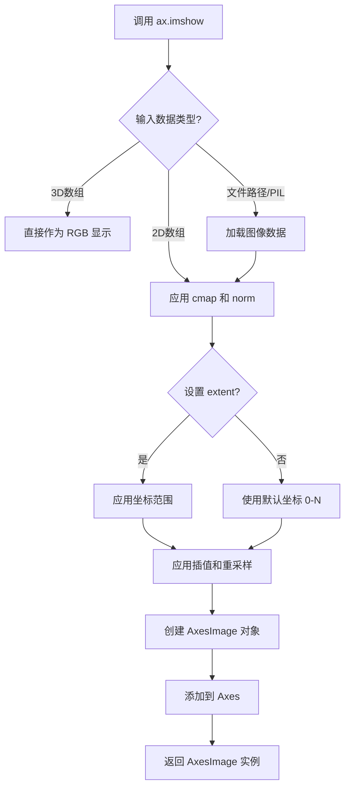

#### 带注释源码

```python
# 示例1：在子图列的第一个位置显示灰度山体阴影图像
# ls.hillshade() 返回一个 2D 数组，表示山体阴影强度
col[0].imshow(
    ls.hillshade(z, vert_exag=ve, dx=dx, dy=dy),  # 输入：2D 山体阴影数组
    cmap='gray'  # 使用灰度颜色映射
)

# 示例2：在其他子图位置显示彩色山体阴影图像
# ls.shade() 返回一个 3D 数组 (RGB)，形状为 (ny, nx, 3)
for ax, mode in zip(col[1:], ['hsv', 'overlay', 'soft']):
    rgb = ls.shade(z, cmap=cmap, blend_mode=mode,
                   vert_exag=ve, dx=dx, dy=dy)
    ax.imshow(rgb)  # 输入：3D RGB 数组，使用默认颜色映射
```

#### 关键调用点分析

| 调用位置 | 输入数据类型 | 用途描述 |
|---------|------------|---------|
| `col[0].imshow(...)` | 2D numpy 数组 | 显示山体阴影强度图（灰度） |
| `ax.imshow(rgb)` | 3D numpy 数组 (RGB) | 显示经过色彩映射和混合模式处理的彩色山体阴影 |

#### 技术细节说明

1. **输入格式兼容性**：`imshow` 自动识别输入维度，2D 数组使用 `cmap` 着色，3D 数组直接作为颜色值显示
2. **坐标系统**：默认情况下，图像左下角坐标为 (0, 0)，右上角为 (nx-1, ny-1)，可通过 `origin` 和 `extent` 参数修改
3. **色彩映射**：当输入为 2D 数组时，必须指定 `cmap`（如 `'gray'`）；3D RGB 数组忽略 `cmap` 参数
4. ** AxesImage 对象**：返回值允许后续操作，如添加颜色条 (`fig.colorbar(ax.imshow(...), ax=ax)`)


### `ax.set_title()`

设置Axes对象的标题，用于为子图或坐标轴添加标题标签。

参数：

- `label`：`str`，要设置的标题文本，例如代码中使用的 `f'{ve}'` 格式化为垂直 exaggeration 值
- `fontdict`：`dict`，可选，用于控制标题字体属性的字典（如 size, weight, color 等）
- `loc`：`str`，可选，标题对齐方式，可选值为 'center'、'left' 或 'right'，默认为 'center'
- `pad`：`float`，可选，标题与坐标轴顶部之间的间距（单位为点）
- `**kwargs`：其他关键字参数，可选，直接传递给 matplotlib.text.Text 对象的属性，如 fontsize、fontweight、color 等

返回值：`str`，返回实际设置的标题文本（可能经过处理后的文本）

#### 流程图

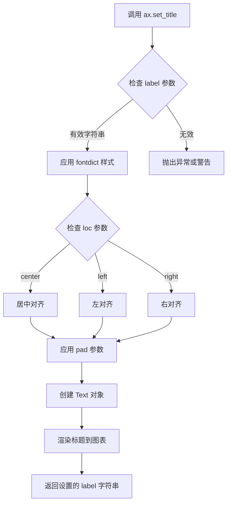

#### 带注释源码

```python
# 代码中的实际调用示例
for ax, ve in zip(axs[0], [0.1, 1, 10]):
    ax.set_title(f'{ve}', size=18)

# 解释：
# ax: matplotlib.axes.Axes 对象，表示一个子图
# f'{ve}': f-string 格式化字符串，将垂直 exaggeration 值转换为标题文本
# size=18: 关键字参数，设置标题字体大小为 18 磅
# 
# 等效于：
# ax.set_title(label=f'{ve}', fontdict={'size': 18})
# 或
# ax.set_title(label=f'{ve}', fontsize=18)
#
# matplotlib 内部实现简述（伪代码）：
# def set_title(self, label, fontdict=None, loc='center', pad=None, **kwargs):
#     # 1. 验证 label 参数
#     title = _str_type_check(label, 'label')
#     
#     # 2. 处理 fontdict 和 kwargs 合并
#     if fontdict:
#         kwargs.update(fontdict)
#     
#     # 3. 创建或获取 title 文本对象
#     title_obj = self._get_title()
#     
#     # 4. 设置文本和属性
#     title_obj.set_text(label)
#     title_obj.set(**kwargs)
#     
#     # 5. 设置对齐方式和间距
#     title_obj.set_ha(loc)
#     if pad is not None:
#         title_obj.set_pad(pad)
#     
#     # 6. 返回设置的标签
#     return label
```


### `ax.set_ylabel`

设置Y轴标签的方法，用于为matplotlib图表的Y轴添加标签文本。

参数：

- `ylabel`：`str`，要设置为Y轴标签的文本内容。在本代码中为 ['Hillshade', 'hsv', 'overlay', 'soft'] 四个模式名称
- `size`：`int`，标签文本的字体大小。在本代码中设置为 18

返回值：`matplotlib.text.Text`，返回创建的Y轴标签文本对象

#### 流程图

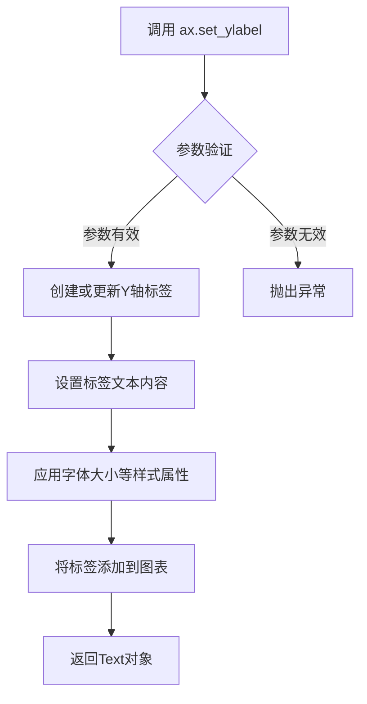

#### 带注释源码

```python
# 在代码中的实际调用方式
for ax, mode in zip(axs[:, 0], ['Hillshade', 'hsv', 'overlay', 'soft']):
    ax.set_ylabel(mode, size=18)

# 逐行解释：
# 1. zip(axs[:, 0], ['Hillshade', 'hsv', 'overlay', 'soft'])
#    - 获取第一列的所有子图 axes 对象
#    - 与四个模式名称组成迭代器
#
# 2. for ax, mode in ...
#    - 遍历每个子图和对应的模式名称
#
# 3. ax.set_ylabel(mode, size=18)
#    - 调用 set_ylabel 方法设置Y轴标签
#    - mode: Y轴标签的文本内容（模式名称）
#    - size=18: 设置字体大小为18磅
#
# set_ylabel 是 matplotlib.axes.Axes 类的方法
# 完整签名: set_ylabel(ylabel, fontdict=None, labelpad=None, **kwargs)
# 常用参数包括:
#   - ylabel: str, 标签文本
#   - fontdict: dict, 字体属性字典
#   - labelpad: float, 标签与轴的距离
#   - **kwargs: 支持 fontname, fontsize, fontweight, color 等
```


## 分析结果

### `axs[0, 1].annotate`

在子图 (0,1) 位置添加"Vertical Exaggeration"标题注释，文本位于子图顶部中央，指示列方向的标签。

参数：

- `text`：`str`，要显示的文本内容，此处为 "Vertical Exaggeration"
- `xy`：`tuple`，标记点坐标 (0.5, 1)，位于子图顶部中央
- `xytext`：`tuple`，文本框偏移量 (0, 30)，向上偏移30点
- `textcoords`：`str`，文本坐标系统，"offset points" 表示相对于标记点的像素偏移
- `xycoords`：`str`，标记点坐标系统，"axes fraction" 表示使用轴坐标（0-1范围）
- `ha`：`str`，水平对齐方式，"center" 居中对齐
- `va`：`str`，垂直对齐方式，"bottom" 底部对齐
- `size`：`int`，字体大小，20像素

返回值：`~matplotlib.text.Annotation`，返回创建的 Annotation 对象

#### 流程图

```mermaid
flowchart TD
    A[开始 annotate 调用] --> B[设置文本 'Vertical Exaggeration']
    B --> C[设置标记点 xy=(0.5, 1) 使用 axes fraction 坐标]
    C --> D[设置文本框位置 xytext=(0, 30) 使用 offset points 坐标]
    D --> E[设置对齐方式: ha=center, va=bottom]
    E --> F[设置字体大小 size=20]
    F --> G[创建 Annotation 对象]
    G --> H[返回 Annotation 对象]
```

#### 带注释源码

```python
axs[0, 1].annotate(
    'Vertical Exaggeration',  # 要显示的文本内容
    (0.5, 1),                 # xy: 标记点位置（axes fraction坐标：0.5=50%, 1=100%）
    xytext=(0, 30),          # xytext: 文本框位置（相对于xy向上偏移30点）
    textcoords='offset points', # textcoords: xytext使用像素偏移坐标
    xycoords='axes fraction',   # xycoords: xy使用轴分数坐标（0-1范围）
    ha='center',              # ha: 水平居中对齐
    va='bottom',              # va: 底部垂直对齐
    size=20                   # size: 字体大小20像素
)
```

---

### `axs[2, 0].annotate`

在子图 (2,0) 位置添加"Blend Mode"标签注释，文本垂直旋转90度显示，位于子图左侧中央，指示行方向的标签。

参数：

- `text`：`str`，要显示的文本内容，此处为 "Blend Mode"
- `xy`：`tuple`，标记点坐标 (0, 0.5)，位于子图左侧中央
- `xytext`：`tuple`，文本框偏移量 (-30, 0)，向左偏移30点
- `textcoords`：`str`，文本坐标系统，"offset points" 表示相对于标记点的像素偏移
- `xycoords`：`str`，标记点坐标系统，"axes fraction" 表示使用轴坐标（0-1范围）
- `ha`：`str`，水平对齐方式，"right" 右对齐
- `va`：`str`，垂直对齐方式，"center" 居中对齐
- `size`：`int`，字体大小，20像素
- `rotation`：`int`，文本旋转角度，90度（使文本垂直显示）

返回值：`~matplotlib.text.Annotation`，返回创建的 Annotation 对象

#### 流程图

```mermaid
flowchart TD
    A[开始 annotate 调用] --> B[设置文本 'Blend Mode']
    B --> C[设置标记点 xy=(0, 0.5) 使用 axes fraction 坐标]
    C --> D[设置文本框位置 xytext=(-30, 0) 使用 offset points 坐标]
    D --> E[设置对齐方式: ha=right, va=center]
    E --> F[设置字体大小 size=20]
    F --> G[设置旋转角度 rotation=90]
    G --> H[创建 Annotation 对象]
    H --> I[返回 Annotation 对象]
```

#### 带注释源码

```python
axs[2, 0].annotate(
    'Blend Mode',             # 要显示的文本内容
    (0, 0.5),                 # xy: 标记点位置（axes fraction坐标：0=0%, 0.5=50%）
    xytext=(-30, 0),         # xytext: 文本框位置（相对于xy向左偏移30点）
    textcoords='offset points', # textcoords: xytext使用像素偏移坐标
    xycoords='axes fraction',   # xycoords: xy使用轴分数坐标（0-1范围）
    ha='right',              # ha: 水平右对齐
    va='center',             # va: 垂直居中对齐
    size=20,                 # size: 字体大小20像素
    rotation=90              # rotation: 文本旋转90度（垂直显示）
)
```


### `Figure.subplots_adjust()`

此方法用于调整当前图形（Figure）的子图布局参数，包括子图与图形边缘之间的距离以及子图之间的间距。该方法直接修改图形布局，不返回任何值。

参数：

- `bottom`：`float`，子图区域底边与图形底边之间的距离，以图形高度的比例表示（0 到 1 之间）
- `right`：`float`，子图区域右边与图形右边之间的距离，以图形宽度的比例表示（0 到 1 之间）
- `top`：`float`，（可选）子图区域顶边与图形顶边之间的距离，以图形高度的比例表示
- `left`：`float`，（可选）子图区域左边与图形左边之间的距离，以图形宽度的比例表示
- `wspace`：`float`，（可选）子图之间的水平间距，以子图平均宽度的比例表示
- `hspace`：`float`，（可选）子图之间的垂直间距，以子图平均高度的比例表示

返回值：`None`，此方法直接修改图形对象的布局属性，不返回任何值。

#### 流程图

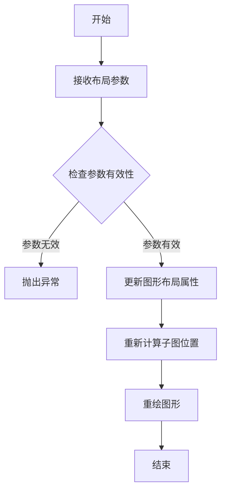

#### 带注释源码

```python
# 调整子图布局参数
# 参数说明：
#   bottom: 子图区域底边距图形底边的距离（比例）
#   right:  子图区域右边距图形右边的距离（比例）
# 其他可选参数：
#   top:    子图区域顶边距图形顶边的距离
#   left:   子图区域左边距图形左边的距离  
#   wspace: 子图间水平间距
#   hspace: 子图间垂直间距

fig.subplots_adjust(bottom=0.05, right=0.95)
```


### `plt.show`

`plt.show()` 是 matplotlib.pyplot 模块中的函数，用于显示当前创建的所有图形（Figure 对象）。它会调用图形后端将figure窗口渲染并显示在屏幕上，是 matplotlib 绘图的最终步骤。在代码中，该函数被放置在所有绘图代码之后，用于一次性展示由 `plt.subplots()` 创建的 4×3 子图矩阵及其内容。

参数：此函数不接受任何参数。

返回值：`None`，该函数无返回值，仅产生图形显示的副作用。

#### 流程图

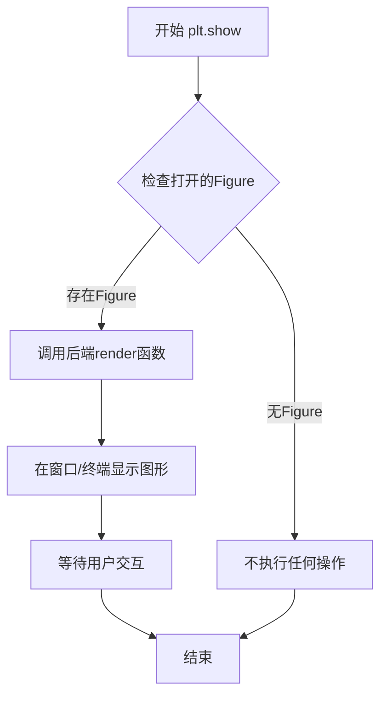

#### 带注释源码

```python
# 导入matplotlib的pyplot模块，通常使用别名plt
import matplotlib.pyplot as plt

# ... 前面的代码创建了fig和axs子图对象 ...

# 使用plt.subplots创建了一个4行3列的子图布局
# 并通过for循环填充了不同参数的hillshade可视化效果
# 最后设置了标题、轴标签和注释

# plt.show() - 显示所有已创建的图形
# 这是matplotlib绘图的最终步骤，会调用系统图形后端
# (如Qt、Tkinter、macOS等)将figure窗口显示出来
# 在交互式环境中，程序会在这里暂停等待用户操作
plt.show()
```


### `LightSource.hillshade`

该方法通过计算DEM（数字高程模型）数据中每个像素相对于光源方向的坡度，生成灰度山体阴影强度图，可用于增强地形可视化效果。

参数：

- `azdeg`（构造时传入）：`float`，光源方位角，从北向顺时针测量（度）
- `altdeg`（构造时传入）：`float`，光源高度角，从地平线向上测量（度）
- `shade`：`ndarray`，输入的高度数据数组（二维数组）
- `vert_exag`：`float`，垂直 exaggeration 系数，用于增强或减弱地形起伏效果
- `dx`：`float`，x方向的网格单元格大小，默认为1.0
- `dy`：`float`，y方向的网格单元格大小，默认为1.0
- `fraction`：`float`，阴影衰减分数，控制在阴影区域光照衰减的程度

返回值：`ndarray`，返回山体阴影强度图（灰度图像），值范围在0-1之间

#### 流程图

```mermaid
graph TD
    A[开始 hillshade] --> B[获取高度数据 shape]
    B --> C[计算归一化梯度: dz_dx, dz_dy]
    C --> D[计算梯度强度: shade_strength]
    D --> E[计算光源角度: 计算 azimuth 和 altitude]
    E --> F[计算阴影强度: shade = cosIncidence]
    F --> G[应用 fraction 衰减: shade = fraction * shade + (1-fraction)]
    G --> H[返回归一化阴影数组]
```

#### 带注释源码

```python
def hillshade(self, shade, vert_exag=1, dx=1, dy=1, fraction=1.):
    """
    Calculate the hillshade of a surface.
    
    Parameters:
    -----------
    shade : ndarray
        A 2-D array (grid) containing the height values.
    vert_exag : float, optional
        The amount to exaggerate the height values by. Default is 1.
    dx : float, optional
        The x-spacing of the grid. Default is 1.
    dy : float, optional
        The y-spacing of the grid. Default is 1.
    fraction : float, optional
        Where to apply the clipping of the shading. Default is 1.
    
    Returns:
    --------
    ndarray
        A 2-D array containing the hillshade values (0-1).
    """
    
    # 计算高度数组的形状
    in_shape = np.asarray(shade.shape)
    
    # 计算归一化梯度 (使用 numpy.gradient)
    # dz_dx: x方向梯度, dz_dy: y方向梯度
    # vert_exag 用于增强或减弱高度变化的影响
    dz_dx, dz_dy = np.gradient(vert_exag * shade, dx, dy)
    
    # 计算梯度强度 (坡度的陡峭程度)
    # shade_strength 表示表面的倾斜程度
    shade_strength = np.sqrt(dz_dx**2 + dz_dy**2)
    
    # 将方位角转换为数学角度 (从北向顺时针转为从东向逆时针)
    # altitude 转换为弧度
    az_rad = np.radians(self.azdeg - 90)
    alt_rad = np.radians(self.altdeg)
    
    # 计算光照方向向量
    # 这里的数学原理是计算光线与表面法线的点积
    # 得到余弦入射角 (cosine of the incidence angle)
    sin_alt = np.sin(alt_rad)
    cos_alt = np.cos(alt_rad)
    
    # 计算 x 和 y 方向的分量
    # 将方位角分解为 x 和 y 方向的光照分量
    dx_scaled = dz_dx * cos_alt * np.cos(az_rad)
    dy_scaled = dz_dy * cos_alt * np.sin(az_rad)
    
    # 计算最终的阴影强度
    # 加号表示面向光源的斜坡更亮
    # 这里综合了梯度和光照方向
    shade = (dx_scaled + dy_scaled + sin_alt)
    
    # 应用分数衰减 (可选的阴影调整)
    # 这个参数允许调整阴影的柔和程度
    if fraction != 1:
        # 限制在 [0, 1] 范围内
        shade = np.clip(shade, 0, 1)
        # 应用非线性衰减
        shade = fraction * shade + (1 - fraction)
        shade = np.clip(shade, 0, 1)
    else:
        # 直接裁剪到 [0, 1] 范围
        shade = np.clip(shade, 0, 1)
    
    return shade
```


### LightSource.shade()

生成带颜色映射的山体阴影图，通过结合地形高程数据、光照方向和颜色映射，将灰度山体阴影转换为彩色可视化图像。

参数：

-  `self`：`LightSource`，光源对象，包含光照角度配置
-  `z`：`numpy.ndarray`，地形高程数据矩阵，表示每个网格点的高度值
-  `cmap`：`Colormap`，matplotlib颜色映射对象，用于将阴影强度转换为颜色
-  `vert_exag`：`float`，垂直 exaggeration 因子，默认为1， 用于增强或减弱地形起伏的视觉效果
-  `dx`：`float`，网格x方向单元格大小，用于计算真实的光照角度
-  `dy`：`float`，网格y方向单元格大小，用于计算真实的光照角度
-  `blend_mode`：`str`，颜色混合模式，可选值为'hsv'、'overlay'、'soft'等，决定如何将阴影与颜色混合

返回值：`numpy.ndarray`，返回RGB图像数组，形状为(height, width, 3)，值为0-1之间的浮点数

#### 流程图

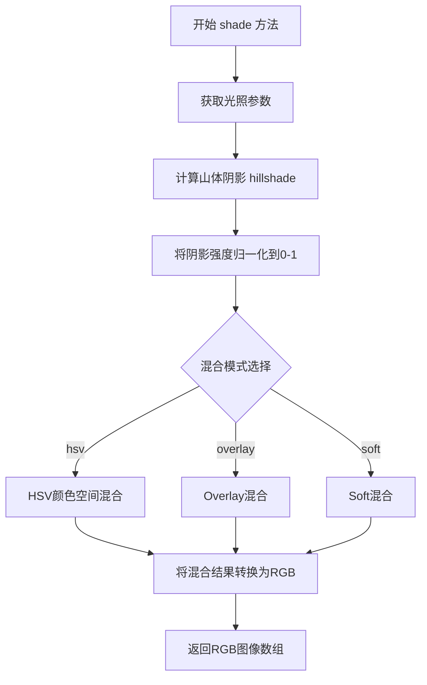

#### 带注释源码

```python
# 从代码中提取的 LightSource.shade() 调用示例
# 创建光源对象，设置方位角315度（西北方向），高度角45度
ls = LightSource(azdeg=315, altdeg=45)

# 颜色映射
cmap = plt.colormaps["gist_earth"]

# 调用 shade 方法生成带颜色映射的山体阴影图
# 参数说明：
#   z: 地形高程数据 (numpy数组)
#   cmap: 使用的颜色映射 (gist_earth)
#   blend_mode: 混合模式 ('hsv', 'overlay', 'soft'之一)
#   vert_exag: 垂直夸张因子 (0.1, 1, 10)
#   dx, dy: 网格分辨率 (用于准确计算光照)
rgb = ls.shade(z, cmap=cmap, blend_mode=mode,
               vert_exag=ve, dx=dx, dy=dy)

# 返回的 rgb 是一个形状为 (height, width, 3) 的 numpy 数组
# 可直接用于 matplotlib 的 imshow() 进行可视化
ax.imshow(rgb)
```

#### 关键组件信息

- **LightSource**：matplotlib.colors 模块中的类，负责计算光源照射地形表面的阴影效果
- **hillshade()**：LightSource 的另一个方法，计算灰度阴影强度矩阵
- **blend_mode**：决定如何将计算出的阴影与颜色映射混合的策略

#### 潜在的技术债务或优化空间

1. **性能优化**：对于大尺寸高程数据，shade 方法可能较慢，可考虑使用 Numba 或 Cython 加速
2. **混合模式扩展**：当前只支持有限的混合模式，可增加更多图像处理混合模式
3. **内存使用**：处理大型数组时可能存在内存占用问题，可考虑分块处理

#### 其它项目

**设计目标与约束**：
- 目标是生成视觉上吸引人的地形渲染图
- 必须保证 dx/dy 与 z 的单位一致，否则垂直夸张计算不准确

**错误处理与异常设计**：
- z 必须是二维 numpy 数组
- dx, dy 必须为正数
- blend_mode 必须是支持的模式之一，否则可能产生意外结果

**数据流与状态机**：
- 输入：地形高程矩阵 → 计算阴影强度 → 颜色映射转换 → 颜色混合 → RGB输出
- 状态：纯数据变换，无复杂状态管理

**外部依赖与接口契约**：
- 依赖 numpy 进行数值计算
- 依赖 matplotlib.colors 中的 Colormap 对象
- 返回标准 RGB 格式数组，兼容所有支持 RGB 图像的绘图库


## 关键组件


### LightSource类

用于创建山体阴影的光源对象，通过指定方位角和高角度来确定光源位置，从而生成地形的光照效果。

### hillshade方法

生成灰度山体阴影强度图像，将地形数据转换为只包含阴影强度的灰度图，便于观察地形起伏。

### shade方法

生成带颜色的山体阴影图像，结合颜色映射和混合模式将高程数据渲染为彩色山体阴影图，支持多种混合模式。

### blend_mode混合模式

包含'hsv'、'overlay'、'soft'三种混合模式，'hsv'适合平滑表面，'overlay'和'soft'适合复杂地形表面，影响最终渲染的视觉效果。

### vert_exag垂直夸张参数

控制垂直夸张程度，通过放大高度变化来增强地形的视觉立体感，值越大地形起伏越明显。

### dx和dy坐标参数

表示网格的单元格大小，用于计算准确的垂直夸张，dx和dy需要从度转换为米，以确保垂直夸张的真实性和准确性。

### 数据加载组件

使用get_sample_data函数加载'jacksboro_fault_dem.npz'文件，获取高程数据(dem['elevation'])和坐标信息(dem['dx']、dem['dy']、dem['ymin'])。

### 颜色映射组件

使用'gist_earth'颜色映射表，将高程值映射为地球色调，适合地形可视化。

### 坐标转换组件

将dx和dy从十进制度转换为米，使用111200系数进行转换，并结合余弦校正以考虑纬度变化的影响。


## 问题及建议


### 已知问题

-   **硬编码的魔法数字**：数字 `111200`（地球半径，用于将角度转换为米）没有任何注释或常量定义，其他开发者难以理解其含义
-   **缺乏类型注解**：代码没有使用 Python 类型提示，降低了代码的可读性和 IDE 支持
-   **缺少错误处理**：`get_sample_data()` 加载数据失败时没有异常捕获，可能导致程序崩溃
-   **数据访问无验证**：直接使用 `dem['elevation']`、`dem['dx']`、`dem['dy']`、`dem['ymin']` 访问 numpy 数组，未检查键是否存在或数据类型是否正确
-   **重复定义**：垂直 exaggeration 列表 `[0.1, 1, 10]` 在代码中重复出现两次，应提取为常量
-   **全局函数依赖**：脚本级别的代码在导入时即执行，缺乏模块化设计，难以作为函数调用或测试
-   **plt.show() 阻塞**：在某些后端环境下 `plt.show()` 可能导致程序阻塞，且无法控制保存或交互
-   **魔法字符串**：颜色映射名称 `'gist_earth'`、`'gray'` 和混合模式字符串 `'hsv'`、`'overlay'`、`'soft'` 硬编码，缺乏统一配置

### 优化建议

-   将 `111200` 定义为具名常量 `METERS_PER_DEGREE`，并添加注释说明其物理含义
-   为关键变量添加类型注解（如 `z: np.ndarray`, `dx: float`, `dy: float`）
-   使用 `try-except` 包装数据加载代码，并提供友好的错误信息
-   使用 `dem.files` 或 `.get()` 方法验证必需的键是否存在
-   将重复的 `[0.1, 1, 10]` 列表提取为模块级常量 `VERTICAL_EXAGGERATIONS`
-   将主要逻辑封装为函数（如 `create_hillshade_comparison()`），接受参数以便复用和测试
-   使用 `fig.savefig()` 替代或补充 `plt.show()`，或在非交互环境中使用 `plt.switch_backend('Agg')`
-   将颜色映射和混合模式定义为常量或枚举类，提升可维护性

## 其它


### 设计目标与约束

本代码的设计目标是演示matplotlib中LightSource类提供的山体阴影（hillshading）可视化功能，通过调整垂直夸大系数（vert_exag）和混合模式（blend_mode）的组合，展示不同参数对地形可视化效果的影响。代码约束包括：1) 需要提供正确的地形高程数据（z）和网格间距（dx, dy）；2) 混合模式只支持'hsv'、'overlay'、'soft'三种；3) 垂直夸大值需为正数；4) 太阳方位角和高度角需在合理范围内。

### 错误处理与异常设计

代码缺乏显式的错误处理机制，存在以下潜在问题：1) get_sample_data可能抛出FileNotFoundError如果示例数据不存在；2) dem['elevation']、dem['dx']、dem['dy']、dem['ymin']访问可能触发KeyError如果数据结构不符合预期；3) np.cos、np.radians等数学运算可能产生NaN值；4) cmap='gist_earth'可能因colormap不存在而失败。建议添加：try-except块捕获数据加载异常、对NaN值进行检测和处理、验证输入参数的有效性范围、提供清晰的错误信息。

### 数据流与状态机

数据流如下：1) 加载阶段：get_sample_data加载npz格式的DEM数据；2) 数据提取阶段：从dem中提取elevation、dx、dy、ymin字段；3) 单位转换阶段：将dx、dy从角度转换为米；4) 光源初始化阶段：创建LightSource对象设置方位角315°、高度角45°；5) 渲染阶段：对每个ve值计算hillshade和shade结果；6) 绘图阶段：使用imshow将结果渲染到对应子图。没有复杂的状态机，主要状态是数据准备和渲染两个阶段。

### 外部依赖与接口契约

主要依赖：1) matplotlib.pyplot - 提供绘图接口；2) numpy - 提供数值计算；3) matplotlib.cbook.get_sample_data - 获取示例数据；4) matplotlib.colors.LightSource - 山体阴影计算核心类。接口契约：LightSource(azdeg, altdeg)构造函数接受方位角和高度角参数；hillshade(z, vert_exag, dx, dy)返回灰度阴影图像；shade(z, cmap, blend_mode, vert_exag, dx, dy)返回RGB彩色图像。

### 性能考虑与优化空间

当前代码的性能瓶颈：1) 循环中重复调用ls.shade和ls.hillshade导致重复计算；2) 未使用向量化操作优化单位转换计算；3) 缺少缓存机制。优化建议：1) 预计算公共参数减少重复计算；2) 对dx、dy转换使用numpy向量化操作；3) 对于实时应用可考虑缓存shade结果；4) 大数据集可考虑下采样处理。

### 配置参数汇总

| 参数名 | 值/范围 | 说明 |
|--------|---------|------|
| azdeg | 315 | 太阳方位角（从北顺时针） |
| altdeg | 45 | 太阳高度角 |
| vert_exag | [0.1, 1, 10] | 垂直夸大系数 |
| blend_mode | ['hsv', 'overlay', 'soft'] | 颜色混合模式 |
| cmap | gist_earth | 地形颜色映射 |
| dx, dy | 动态计算 | 网格单元格尺寸（米） |

### 兼容性说明

代码兼容matplotlib 3.x和numpy 1.x版本。注意事项：1) plt.colormaps在matplotlib 3.4+推荐使用，早期版本使用plt.cm.get_cmap；2) get_sample_data的返回值格式可能随版本变化；3) figure和axes的创建方式在不同matplotlib版本中保持兼容。

    