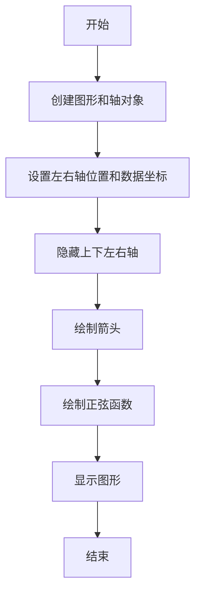
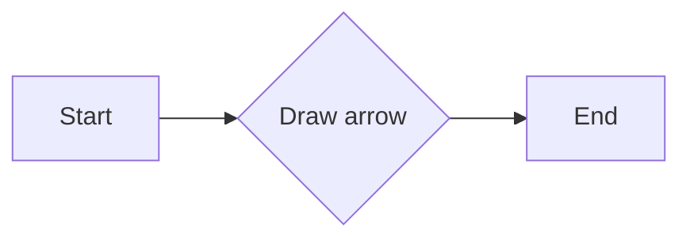
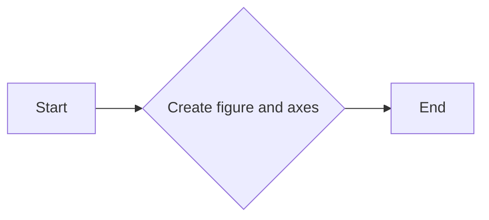
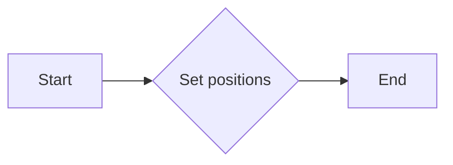
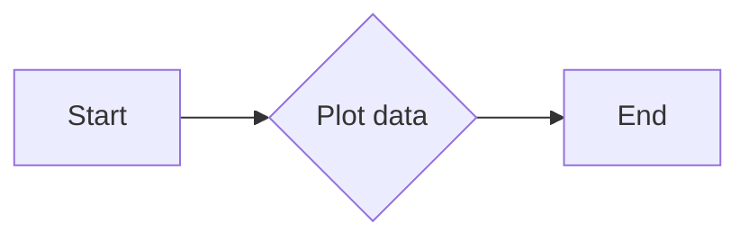

# `matplotlib\galleries\examples\spines\centered_spines_with_arrows.py` 详细设计文档

This code generates a 'math textbook' style plot with centered spines and arrows at their ends, and plots a sine function.

## 整体流程



## 类结构

```
matplotlib.pyplot (全局模块)
├── fig, ax = plt.subplots()
│   ├── fig
│   └── ax
└── ax.spines["left", "bottom"].set_position(("data", 0))
    ├── ax.spines["left", "bottom"]
    └── ("data", 0)
```

## 全局变量及字段


### `x`
    
An array of evenly spaced values over the interval [-0.5, 1.)

类型：`numpy.ndarray`
    


### `np`
    
The NumPy module, providing support for large, multi-dimensional arrays and matrices, along with a collection of mathematical functions to operate on these arrays

类型：`module`
    


### `matplotlib.pyplot.Figure.fig`
    
The main figure object that contains all the axes and their contents

类型：`matplotlib.figure.Figure`
    


### `matplotlib.pyplot.Axes.ax`
    
The axes object that contains the plot elements and the plot area

类型：`matplotlib.axes._subplots.AxesSubplot`
    
    

## 全局函数及方法


### subplots

This function creates a new figure and a set of subplots.

参数：

- `fig`：`matplotlib.figure.Figure`，The figure to which the subplot(s) belong.
- `ax`：`matplotlib.axes.Axes`，The axes to which the subplot(s) belong.

返回值：`matplotlib.axes.Axes`，The axes object.

#### 流程图


#### 带注释源码

```python
import matplotlib.pyplot as plt
import numpy as np

fig, ax = plt.subplots()
# Move the left and bottom spines to x = 0 and y = 0, respectively.
ax.spines[["left", "bottom"]].set_position(("data", 0))
# Hide the top and right spines.
ax.spines[["top", "right"]].set_visible(False)

# Draw arrows (as black triangles: ">k"/"^k") at the end of the axes.  In each
# case, one of the coordinates (0) is a data coordinate (i.e., y = 0 or x = 0,
# respectively) and the other one (1) is an axes coordinate (i.e., at the very
# right/top of the axes).  Also, disable clipping (clip_on=False) as the marker
# actually spills out of the Axes.
ax.plot(1, 0, ">k", transform=ax.get_yaxis_transform(), clip_on=False)
ax.plot(0, 1, "^k", transform=ax.get_xaxis_transform(), clip_on=False)

# Some sample data.
x = np.linspace(-0.5, 1., 100)
ax.plot(x, np.sin(x*np.pi))

plt.show()
```


### ax.plot(0, 1, "^k", transform=ax.get_xaxis_transform(), clip_on=False)

该函数用于在matplotlib的轴（Axes）对象上绘制一个箭头，表示x轴的箭头。

参数：

- `0`：`int`，x轴的坐标值，这里设置为0，表示箭头指向x轴的起点。
- `1`：`int`，y轴的坐标值，这里设置为1，表示箭头指向y轴的终点。
- `"^k"`：`str`，箭头的样式和颜色，"^"表示箭头向上，"k"表示黑色。
- `transform=ax.get_xaxis_transform()`：`matplotlib.transforms.Transform`，指定箭头的坐标转换，这里使用x轴的转换。
- `clip_on=False`：`bool`，指定是否启用裁剪，这里设置为False，表示箭头可以超出轴的范围。

返回值：`None`，该函数没有返回值。

#### 流程图



#### 带注释源码

```
ax.plot(0, 1, "^k", transform=ax.get_xaxis_transform(), clip_on=False)
# 绘制一个指向y轴终点的黑色箭头
```


### ax.spines[["left", "bottom"]].set_position(("data", 0))

该函数用于设置matplotlib中轴线的位置。

参数：

- `["left", "bottom"]`：`list`，指定要设置位置的轴线，这里指定为左侧和底部轴线。
- `("data", 0)`：`tuple`，指定轴线位置的类型和值。`"data"`表示使用数据坐标，`0`表示坐标值为0。

返回值：`None`，该函数没有返回值。

#### 流程图

```mermaid
graph LR
A[Set spines position] --> B{Set left and bottom spines}
B --> C{Set position to ("data", 0)}
```

#### 带注释源码

```
ax.spines[["left", "bottom"]].set_position(("data", 0))
```


### plot

This function generates a "math textbook" style plot with centered spines and arrows at their ends.

参数：

- `x`：`numpy.ndarray`，Sample data for the x-axis.
- `y`：`numpy.ndarray`，Sample data for the y-axis.

返回值：`None`，This function does not return any value.

#### 流程图


#### 带注释源码

```python
"""
===========================
Centered spines with arrows
===========================

This example shows a way to draw a "math textbook" style plot, where the
spines ("axes lines") are drawn at ``x = 0`` and ``y = 0``, and have arrows at
their ends.
"""

import matplotlib.pyplot as plt
import numpy as np

fig, ax = plt.subplots()
# Move the left and bottom spines to x = 0 and y = 0, respectively.
ax.spines[["left", "bottom"]].set_position(("data", 0))
# Hide the top and right spines.
ax.spines[["top", "right"]].set_visible(False)

# Draw arrows (as black triangles: ">k"/"^k") at the end of the axes.  In each
# case, one of the coordinates (0) is a data coordinate (i.e., y = 0 or x = 0,
# respectively) and the other one (1) is an axes coordinate (i.e., at the very
# right/top of the axes).  Also, disable clipping (clip_on=False) as the marker
# actually spills out of the Axes.
ax.plot(1, 0, ">k", transform=ax.get_yaxis_transform(), clip_on=False)
ax.plot(0, 1, "^k", transform=ax.get_xaxis_transform(), clip_on=False)

# Some sample data.
x = np.linspace(-0.5, 1., 100)
ax.plot(x, np.sin(x*np.pi))

plt.show()
```


### plt.show()

显示matplotlib图形。

参数：

- 无

返回值：无

#### 流程图


#### 带注释源码

```python
"""
===========================
Centered spines with arrows
===========================

This example shows a way to draw a "math textbook" style plot, where the
spines ("axes lines") are drawn at ``x = 0`` and ``y = 0``, and have arrows at
their ends.
"""

import matplotlib.pyplot as plt
import numpy as np

fig, ax = plt.subplots()
# Move the left and bottom spines to x = 0 and y = 0, respectively.
ax.spines[["left", "bottom"]].set_position(("data", 0))
# Hide the top and right spines.
ax.spines[["top", "right"]].set_visible(False)

# Draw arrows (as black triangles: ">k"/"^k") at the end of the axes.  In each
# case, one of the coordinates (0) is a data coordinate (i.e., y = 0 or x = 0,
# respectively) and the other one (1) is an axes coordinate (i.e., at the very
# right/top of the axes).  Also, disable clipping (clip_on=False) as the marker
# actually spills out of the Axes.
ax.plot(1, 0, ">k", transform=ax.get_yaxis_transform(), clip_on=False)
ax.plot(0, 1, "^k", transform=ax.get_xaxis_transform(), clip_on=False)

# Some sample data.
x = np.linspace(-0.5, 1., 100)
ax.plot(x, np.sin(x*np.pi))

plt.show()
"""


### plt.subplots()

`subplots` 是 `matplotlib.pyplot` 模块中的一个函数，用于创建一个图形和一个轴（axes）。

参数：

- `figsize`：`tuple`，默认为 `(6, 4)`，指定图形的大小（宽度和高度）。
- `dpi`：`int`，默认为 `100`，指定图形的分辨率（每英寸点数）。
- `facecolor`：`color`，默认为 `'w'`，指定图形的背景颜色。
- `edgecolor`：`color`，默认为 `'none'`，指定图形的边缘颜色。
- `frameon`：`bool`，默认为 `True`，指定是否显示图形的边框。
- `num`：`int`，默认为 `1`，指定要创建的轴的数量。
- `gridspec_kw`：`dict`，默认为 `{}`，指定 `GridSpec` 的关键字参数。
- `constrained_layout`：`bool`，默认为 `False`，指定是否启用约束布局。
- `sharex`：`bool` 或 `str`，默认为 `False`，指定是否共享 x 轴。
- `sharey`：`bool` 或 `str`，默认为 `False`，指定是否共享 y 轴。

返回值：`fig, ax`，其中 `fig` 是图形对象，`ax` 是轴对象。

#### 流程图



#### 带注释源码

```python
import matplotlib.pyplot as plt

fig, ax = plt.subplots()
# ... (rest of the code)
```


### matplotlib.pyplot.spines

matplotlib.pyplot.spines 是一个属性，它返回一个包含所有轴脊（spines）的列表。

参数：

- 无

返回值：`list`，包含所有轴脊的列表。

#### 流程图


#### 带注释源码

```
# matplotlib.pyplot.spines
import matplotlib.pyplot as plt

fig, ax = plt.subplots()
# 获取所有轴脊的列表
spines_list = ax.spines
# 输出列表内容
print(spines_list)
```


### ax.spines[["left", "bottom"]].set_position(("data", 0))

该方法是用于设置轴脊的位置。

参数：

- `["left", "bottom"]`：`list`，指定要设置的轴脊名称。
- `("data", 0)`：`tuple`，指定轴脊的位置，其中 "data" 表示相对于数据坐标的位置，0 表示数据坐标的值。

返回值：无

#### 流程图

```mermaid
graph LR
A[ax.spines[["left", "bottom"]]] --> B{set_position}
B --> C[("data", 0)}
```

#### 带注释源码

```
# ax.spines[["left", "bottom"]].set_position(("data", 0))
import matplotlib.pyplot as plt

fig, ax = plt.subplots()
# 设置左和底轴脊的位置为数据坐标0
ax.spines[["left", "bottom"]].set_position(("data", 0))
```


### ax.spines[["top", "right"]].set_visible(False)

该方法用于设置轴脊的可见性。

参数：

- `["top", "right"]`：`list`，指定要设置的轴脊名称。
- `False`：`bool`，指定轴脊的可见性。

返回值：无

#### 流程图

```mermaid
graph LR
A[ax.spines[["top", "right"]]] --> B{set_visible}
B --> C[False]
```

#### 带注释源码

```
# ax.spines[["top", "right"]].set_visible(False)
import matplotlib.pyplot as plt

fig, ax = plt.subplots()
# 设置顶和右轴脊为不可见
ax.spines[["top", "right"]].set_visible(False)
```


### ax.plot(1, 0, ">k", transform=ax.get_yaxis_transform(), clip_on=False)

该方法用于在轴上绘制线。

参数：

- `1, 0`：`tuple`，指定线段的起点坐标。
- `">k"`：`str`，指定线段的样式和颜色。
- `transform=ax.get_yaxis_transform()`：`function`，指定坐标变换。
- `clip_on=False`：`bool`，指定是否启用裁剪。

返回值：`matplotlib.patches.PathPatch`，绘制的线段。

#### 流程图

```mermaid
graph LR
A[ax.plot] --> B{绘制线段}
B --> C[(1, 0)]
B --> D[">k"]
B --> E[transform=ax.get_yaxis_transform()]
B --> F[clip_on=False]
```

#### 带注释源码

```
# ax.plot(1, 0, ">k", transform=ax.get_yaxis_transform(), clip_on=False)
import matplotlib.pyplot as plt

fig, ax = plt.subplots()
# 在y轴上绘制箭头
ax.plot(1, 0, ">k", transform=ax.get_yaxis_transform(), clip_on=False)
```


### ax.plot(0, 1, "^k", transform=ax.get_xaxis_transform(), clip_on=False)

该方法用于在轴上绘制线。

参数：

- `0, 1`：`tuple`，指定线段的起点坐标。
- `"^k"`：`str`，指定线段的样式和颜色。
- `transform=ax.get_xaxis_transform()`：`function`，指定坐标变换。
- `clip_on=False`：`bool`，指定是否启用裁剪。

返回值：`matplotlib.patches.PathPatch`，绘制的线段。

#### 流程图

```mermaid
graph LR
A[ax.plot] --> B{绘制线段}
B --> C[(0, 1)]
B --> D["^k"]
B --> E[transform=ax.get_xaxis_transform()]
B --> F[clip_on=False]
```

#### 带注释源码

```
# ax.plot(0, 1, "^k", transform=ax.get_xaxis_transform(), clip_on=False)
import matplotlib.pyplot as plt

fig, ax = plt.subplots()
# 在x轴上绘制箭头
ax.plot(0, 1, "^k", transform=ax.get_xaxis_transform(), clip_on=False)
```


### ax.plot(x, np.sin(x*np.pi))

该方法用于在轴上绘制线。

参数：

- `x`：`numpy.ndarray`，指定线段的起点坐标。
- `np.sin(x*np.pi)`：`numpy.ndarray`，指定线段的终点坐标。

返回值：`matplotlib.patches.PathPatch`，绘制的线段。

#### 流程图

```mermaid
graph LR
A[ax.plot] --> B{绘制线段}
B --> C[x]
B --> D[np.sin(x*np.pi)]
```

#### 带注释源码

```
# ax.plot(x, np.sin(x*np.pi))
import matplotlib.pyplot as plt
import numpy as np

fig, ax = plt.subplots()
x = np.linspace(-0.5, 1., 100)
# 绘制正弦曲线
ax.plot(x, np.sin(x*np.pi))
```


### matplotlib.pyplot.set_position

`matplotlib.pyplot.set_position` 是一个用于设置轴（spine）位置的函数。

参数：

- `positions`：`tuple`，指定轴的位置，格式为 `(x_position, y_position)`，其中 `x_position` 和 `y_position` 可以是 'data' 或 'outward'，'data' 表示数据坐标，'outward' 表示轴外坐标。

返回值：无

#### 流程图



#### 带注释源码

```python
# Move the left and bottom spines to x = 0 and y = 0, respectively.
ax.spines[["left", "bottom"]].set_position(("data", 0))
```

在这段代码中，`set_position` 函数被用来将左轴和底轴的位置设置为数据坐标 (x = 0, y = 0)。`("data", 0)` 表示将轴的位置设置为数据坐标，其中第一个元素 'data' 表示数据坐标，第二个元素 '0' 表示 x 或 y 坐标的具体值。


### matplotlib.pyplot.plot

matplotlib.pyplot.plot 是一个用于绘制二维数据的函数。

参数：

- `x`：`numpy.ndarray` 或 `float`，x轴的数据点。
- `y`：`numpy.ndarray` 或 `float`，y轴的数据点。
- `color`：`str` 或 `color`，线条的颜色。
- `linestyle`：`str`，线条的样式。
- `linewidth`：`float`，线条的宽度。
- `marker`：`str` 或 `shape`，标记点的形状。
- `markersize`：`float`，标记点的大小。
- `transform`：`Transform`，变换对象。
- `clip_on`：`bool`，是否启用裁剪。

返回值：`Line2D`，绘制的线条对象。

#### 流程图



#### 带注释源码

```python
import matplotlib.pyplot as plt
import numpy as np

fig, ax = plt.subplots()
# Move the left and bottom spines to x = 0 and y = 0, respectively.
ax.spines[["left", "bottom"]].set_position(("data", 0))
# Hide the top and right spines.
ax.spines[["top", "right"]].set_visible(False)

# Draw arrows (as black triangles: ">k"/"^k") at the end of the axes.  In each
# case, one of the coordinates (0) is a data coordinate (i.e., y = 0 or x = 0,
# respectively) and the other one (1) is an axes coordinate (i.e., at the very
# right/top of the axes).  Also, disable clipping (clip_on=False) as the marker
# actually spills out of the Axes.
ax.plot(1, 0, ">k", transform=ax.get_yaxis_transform(), clip_on=False)
ax.plot(0, 1, "^k", transform=ax.get_xaxis_transform(), clip_on=False)

# Some sample data.
x = np.linspace(-0.5, 1., 100)
ax.plot(x, np.sin(x*np.pi))
```


### plt.show()

显示matplotlib图形。

参数：

- 无

返回值：无

#### 流程图

```mermaid
graph LR
A[开始] --> B{调用plt.show()}
B --> C[结束]
```

#### 带注释源码

```python
plt.show()
```


## 关键组件


### 张量索引

张量索引是用于访问和操作多维数组（张量）中特定元素的方法。

### 惰性加载

惰性加载是一种延迟计算或初始化数据的方法，直到实际需要时才进行，以提高性能和资源利用率。

### 反量化支持

反量化支持是指系统或算法能够处理和解释非精确数值（如浮点数）的能力。

### 量化策略

量化策略是指将高精度数值（如浮点数）转换为低精度数值（如整数）的方法，以减少计算资源消耗和提高效率。


## 问题及建议


### 已知问题

-   {问题1}：代码中使用了硬编码的箭头样式和颜色，这可能导致在需要不同样式或颜色的上下文中难以适应。
-   {问题2}：代码没有进行任何错误处理，如果matplotlib或其他依赖库出现异常，程序可能会崩溃。
-   {问题3}：代码没有提供任何日志记录或调试信息，这可能会在问题发生时难以追踪和解决。

### 优化建议

-   {建议1}：引入配置文件或参数化输入，允许用户自定义箭头样式和颜色。
-   {建议2}：添加异常处理机制，确保在出现错误时程序能够优雅地处理异常，并提供有用的错误信息。
-   {建议3}：实现日志记录功能，记录程序的运行状态和潜在的错误，以便于问题追踪和调试。
-   {建议4}：考虑将绘图逻辑封装到一个类中，以便于重用和维护。
-   {建议5}：如果代码被用于生产环境，应该考虑性能优化，例如减少不必要的计算和内存使用。


## 其它


### 设计目标与约束

- 设计目标：实现一个能够绘制“数学教科书”风格图表的代码，其中坐标轴（spines）位于x = 0和y = 0，并在其末端绘制箭头。
- 约束条件：使用matplotlib库进行绘图，不使用额外的绘图库。

### 错误处理与异常设计

- 错误处理：代码中未包含显式的错误处理机制。在运行时，如果matplotlib库不可用或数据类型不正确，可能会引发异常。
- 异常设计：建议在调用matplotlib相关函数时添加try-except块来捕获并处理可能发生的异常。

### 数据流与状态机

- 数据流：代码从导入matplotlib和numpy库开始，然后创建一个图表和坐标轴对象。接着，设置坐标轴的位置和可见性，绘制箭头和示例数据，最后显示图表。
- 状态机：代码没有明确的状态机，它是一个线性流程，从初始化到显示图表。

### 外部依赖与接口契约

- 外部依赖：代码依赖于matplotlib和numpy库。
- 接口契约：matplotlib库提供了绘图接口，numpy库提供了数值计算接口。


    