# `matplotlib\galleries\examples\spines\multiple_yaxis_with_spines.py` 详细设计文档

该代码展示了如何使用matplotlib的twinx()方法创建共享x轴的多个y轴，通过调整脊柱位置实现多轴图表，用于同时展示密度、温度和速度三个不同量纲的数据。

## 整体流程

```mermaid
graph TD
    A[开始] --> B[创建主图表fig和主坐标轴ax]
B --> C[调整图表右侧边距为0.75]
C --> D[创建第一个孪生坐标轴twin1]
D --> E[创建第二个孪生坐标轴twin2]
E --> F[设置twin2右侧脊柱位置为轴的1.2倍]
F --> G[在主轴上绘制密度数据p1]
G --> H[在twin1上绘制温度数据p2]
H --> I[在twin2上绘制速度数据p3]
I --> J[设置主轴xlim, ylim和xlabel, ylabel]
J --> K[设置twin1和twin2的ylim和ylabel]
K --> L[根据线条颜色设置坐标轴标签颜色]
L --> M[根据线条颜色设置刻度颜色]
M --> N[添加图例]
N --> O[调用plt.show()显示图表]
```

## 类结构

```
matplotlib.pyplot (模块)
├── Figure (画布类)
│   └── axes.Axes (坐标轴类)
│       ├── twinx() 返回孪生坐标轴
│       ├── plot() 返回Line2D
│       ├── set() 设置属性
│       ├── yaxis 返回YAxis
│       ├── tick_params() 设置刻度参数
│       └── legend() 添加图例
│   └── spines.Spine (脊柱类)
│       └── set_position() 设置位置
└── lines.Line2D (线条类)
    └── get_color() 获取颜色
```

## 全局变量及字段


### `fig`
    
图表的根容器对象，用于管理整个图表的组件和渲染

类型：`matplotlib.figure.Figure`
    


### `ax`
    
主坐标轴对象，用于绘制第一条数据曲线（密度）并作为共享x轴的基础

类型：`matplotlib.axes.Axes`
    


### `twin1`
    
第一个共享x轴的副坐标轴，用于绘制第二条数据曲线（温度）

类型：`matplotlib.axes.Axes`
    


### `twin2`
    
第二个共享x轴的副坐标轴，用于绘制第三条数据曲线（速度），且其右边脊柱已偏移

类型：`matplotlib.axes.Axes`
    


### `p1`
    
主坐标轴上的线条对象，代表密度数据曲线

类型：`matplotlib.lines.Line2D`
    


### `p2`
    
第一个副坐标轴上的线条对象，代表温度数据曲线

类型：`matplotlib.lines.Line2D`
    


### `p3`
    
第二个副坐标轴上的线条对象，代表速度数据曲线

类型：`matplotlib.lines.Line2D`
    


    

## 全局函数及方法


### `plt.subplots()`

`plt.subplots()` 是 matplotlib 库中的一个高级函数，用于创建一个新的图形窗口（Figure）以及一个或多个子图（Axes）。它封装了 `figure()` 和 `add_subplot()` 的功能，允许用户在一个函数调用中同时配置图形的布局和属性。

参数：

- `nrows`：`int`，默认值 1，子图网格的行数
- `ncols`：`int`，默认值 1，子图网格的列数
- `sharex`：`bool` 或 `str`，默认值 False，是否共享 x 轴
- `sharey`：`bool` 或 `str`，默认值 False，是否共享 y 轴
- `squeeze`：`bool`，默认值 True，是否压缩多余的维度
- `width_ratios`：`array-like`，可选，定义每列的相对宽度
- `height_ratios`：`array-like`，可选，定义每行的相对高度
- `subplot_kw`：`dict`，可选，传递给每个子图的关键词参数
- `gridspec_kw`：`dict`，可选，传递给 GridSpec 构造器的关键词参数
- `**fig_kw`：可选，传递给 `figure()` 函数的其他关键词参数

返回值：`tuple(Figure, Axes or array of Axes)`，返回图形对象以及单个子图对象或子图数组

#### 流程图

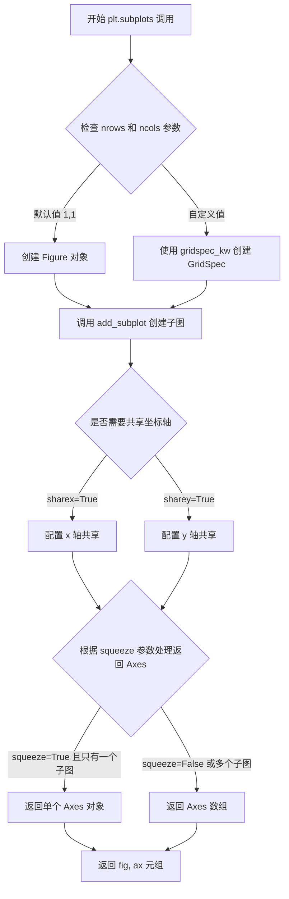

#### 带注释源码

```python
def subplots(nrows=1, ncols=1, sharex=False, sharey=False,
             squeeze=True, width_ratios=None, height_ratios=None,
             subplot_kw=None, gridspec_kw=None, **fig_kw):
    """
    创建一个包含子图的图形窗口
    
    参数:
        nrows: int, default 1
            子图网格的行数
        ncols: int, default 1
            子图网格的列数
        sharex: bool or str, default False
            如果为 True，所有子图共享 x 轴
        sharey: bool or str, default False
            所有子图共享 y 轴
        squeeze: bool, default True
            如果为 True，从 Axes 数组中移除多余的维度
        width_ratios: array-like of length ncols, optional
            每列的相对宽度
        height_ratios: array-like of length nrows, optional
            每行的相对高度
        subplot_kw: dict, optional
            传递给 add_subplot 的关键词参数
        gridspec_kw: dict, optional
            传递给 GridSpec 的关键词参数
        **fig_kw:
            传递给 figure() 的其他关键词参数
    
    返回:
        fig: Figure 对象
            图形对象
        ax: Axes 或 Axes 数组
            子图对象
    """
    # 1. 创建 Figure 对象
    fig = figure(**fig_kw)
    
    # 2. 如果指定了 width_ratios 或 height_ratios，构建 GridSpec 参数
    if gridspec_kw is None:
        gridspec_kw = {}
    if width_ratios is not None:
        if 'width_ratios' in gridspec_kw:
            raise ValueError("'width_ratios' must not be defined both as "
                             "argument and in 'gridspec_kw'")
        gridspec_kw['width_ratios'] = width_ratios
    if height_ratios is not None:
        if 'height_ratios' in gridspec_kw:
            raise ValueError("'height_ratios' must not be defined both as "
                             "argument and in 'gridspec_kw'")
        gridspec_kw['height_ratios'] = height_ratios
    
    # 3. 创建 GridSpec 对象
    gs = GridSpec(nrows, ncols, **gridspec_kw)
    
    # 4. 创建子图数组
    axarr = np.empty((nrows, ncols), dtype=object)
    
    # 5. 遍历每个子图位置，创建 Axes 对象
    for i in range(nrows):
        for j in range(ncols):
            # 使用 add_subplot 创建子图
            ax = fig.add_subplot(gs[i, j], **subplot_kw)
            axarr[i, j] = ax
    
    # 6. 配置坐标轴共享
    if sharex:
        # ... 配置 x 轴共享逻辑
        pass
    if sharey:
        # ... 配置 y 轴共享逻辑
        pass
    
    # 7. 根据 squeeze 参数处理返回结果
    if squeeze:
        # 尝试移除多余的维度
        if nrows == 1 and ncols == 1:
            return fig, axarr[0, 0]
        elif nrows == 1 or ncols == 1:
            axarr = axarr.squeeze()
    
    return fig, axarr
```


### `Figure.subplots_adjust`

该方法用于调整当前 Figure 中 subplot 的布局参数（包括左边距、右边距、上边距、下边距以及子图之间的间距），通过修改 `subplotpars` 属性来实现对子图位置的精细控制。

参数：

- `left`：`float`，可选，调整子图左边框相对于 figure 的位置（0.0 到 1.0 之间的比例）
- `right`：`float`，可选，调整子图右边框相对于 figure 的位置（0.0 到 1.0 之间的比例）
- `top`：`float`，可选，调整子图上边框相对于 figure 的位置（0.0 到 1.0 之间的比例）
- `bottom`：`float`，可选，调整子图下边框相对于 figure 的位置（0.0 到 1.0 之间的比例）
- `wspace`：`float`，可选，调整子图之间的水平间距（相对于子图宽度的比例）
- `hspace`：`float`，可选，调整子图之间的垂直间距（相对于子图高度的比例）

返回值：`None`，该方法直接修改 Figure 对象的布局属性，不返回任何值。

#### 流程图

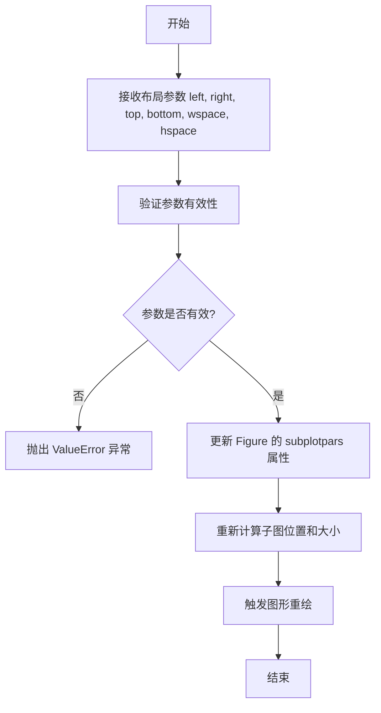

#### 带注释源码

```python
def subplots_adjust(self, left=None, bottom=None, right=None, 
                    top=None, wspace=None, hspace=None, **kwargs):
    """
    调整当前 Figure 的 subplot 布局参数。
    
    参数:
        left: 子图左边框位置（相对于 figure 宽度，0-1）
        right: 子图右边框位置（相对于 figure 宽度，0-1）
        bottom: 子图下边框位置（相对于 figure 高度，0-1）
        top: 子图上边框位置（相对于 figure 高度，0-1）
        wspace: 子图之间的水平间距（相对于子图宽度）
        hspace: 子图之间的垂直间距（相对于子图高度）
    
    返回值:
        None
    
    示例:
        fig.subplots_adjust(left=0.1, right=0.9, hspace=0.4)
    """
    # 获取当前 Figure 的 subplot 参数管理器
    subplotpars = self.subplotpars
    
    # 根据传入的参数更新对应的布局属性
    # left 参数：设置子图左侧边缘位置
    if left is not None:
        subplotpars.left = left
    
    # right 参数：设置子图右侧边缘位置
    if right is not None:
        subplotpars.right = right
    
    # bottom 参数：设置子图底部边缘位置
    if bottom is not None:
        subplotpars.bottom = bottom
    
    # top 参数：设置子图顶部边缘位置
    if top is not None:
        subplotpars.top = top
    
    # wspace 参数：设置子图之间的水平间距
    if wspace is not None:
        subplotpars.wspace = wspace
    
    # hspace 参数：设置子图之间的垂直间距
    if hspace is not None:
        subplotpars.hspace = hspace
    
    # 执行更新后的布局调整
    self.canvas.draw_idle()
```


### `matplotlib.axes.Axes.twinx`

在 matplotlib 中，`twinx()` 方法用于创建一个共享 x 轴的新 Axes 对象，允许在同一图表上绘制具有不同 y 轴刻度的数据系列，实现多y轴图表的绘制。

参数：
- 该方法无显式参数（使用 Python 的可变参数机制）

返回值：`matplotlib.axes.Axes`，返回一个与原 Axes 共享 x 轴的新 Axes 实例，用于绘制具有独立 y 刻度的数据

#### 流程图

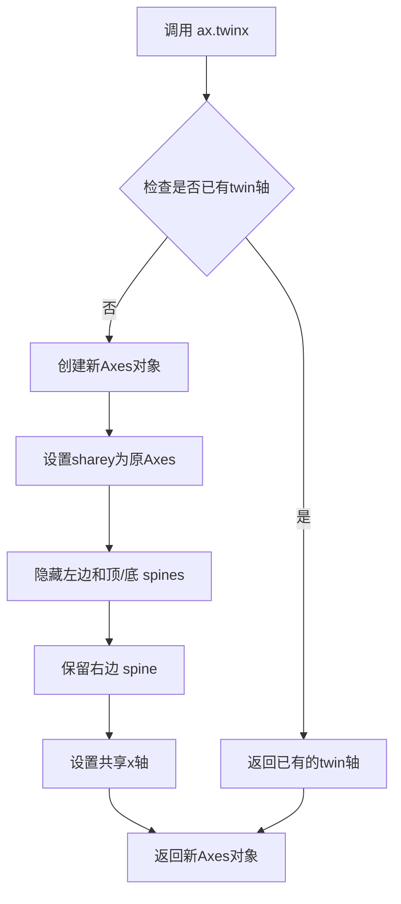

#### 带注释源码

```python
# 以下是基于matplotlib源码结构的twinx()方法实现原理说明

def twinx(self):
    """
    在右侧创建一个共享x轴的twin Axes。
    
    Returns:
        Axes: 新的Axes对象，与原Axes共享x轴
    """
    # 1. 创建新的Axes实例，sharey参数指定共享原Axes的y轴数据
    ax = self.figure.add_axes(
        self.get_position(),  # 使用与原Axes相同的位置
        sharey=self,           # 共享y轴（实际上是共享x轴数据的副本）
        facecolor='none'       # 设置透明背景
    )
    
    # 2. 获取新Axes的右侧spine（边框线）
    ax.spines['right'].set_visible(True)
    
    # 3. 隐藏其他spines（左边、顶部、底部）
    for spine_name in ['left', 'top', 'bottom']:
        ax.spines[spine_name].set_visible(False)
    
    # 4. 确保y轴标签和刻度在右侧显示
    ax.yaxis.tick_right()
    ax.yaxis.set_label_position('right')
    
    # 5. 将新Axes的x轴与原Axes同步（隐藏twin的x轴刻度）
    ax.xaxis.set_visible(False)
    self._axobservers.process('_twinx_observed', self)
    
    return ax

# 调用示例（来自用户代码）
twin1 = ax.twinx()  # 创建第一个twin轴
twin2 = ax.twinx()  # 创建第二个twin轴，可叠加使用
twin2.spines.right.set_position(("axes", 1.2))  # 偏移第二个twin轴的位置
```


### `Spine.set_position`

设置脊柱（Spine）的位置，用于将双轴图表中第二个共享x轴的右侧脊柱偏移到指定位置。

参数：

- `position`：`tuple`，位置参数元组，格式为 `("axes", 1.2)`，其中第一个元素为位置类型（'outward'、'axes'、'data'），第二个元素为偏移量值

返回值：`None`，无返回值，直接修改脊柱位置

#### 流程图

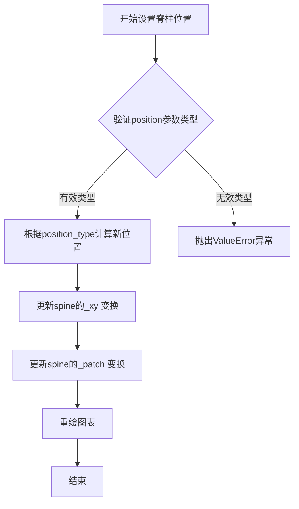

#### 带注释源码

```python
def set_position(self, position):
    """
    设置脊柱的位置。

    参数:
        position: 元组 (position_type, value)
            - position_type: 位置类型
                * 'outward': 向外偏移value像素
                * 'axes': 相对于axes坐标系统，value范围0-1
                * 'data': 相对于数据坐标，value为数据值
            - value: 偏移量数值
    
    返回值:
        None
    
    示例:
        # 将右侧脊柱偏移到axes右侧1.2倍位置
        spine.set_position(('axes', 1.2))
        
        # 将右侧脊柱向外偏移10像素
        spine.set_position(('outward', 10))
        
        # 将右侧脊柱放置在数据坐标50处
        spine.set_position(('data', 50))
    """
    # position[0] 是位置类型字符串
    # position[1] 是偏移量数值
    self._position = position
    
    # 根据位置类型计算新的位置坐标
    if position[0] == 'outward':
        # 向外偏移模式
        self._offset = position[1]
    elif position[0] == 'axes':
        # 相对于axes坐标
        # value为0-1之间的比例，乘以axes宽度
        self._offset = position[1] * self.axes.bbox.width
    elif position[0] == 'data':
        # 相对于数据坐标
        # 需要转换为显示坐标
        self._offset = self.axes.transData.transform([position[1], 0])[0]
    
    # 更新脊柱的变换矩阵
    self.stale = True  # 标记需要重绘
```


### `axes.Axes.plot`

该方法是matplotlib中Axes类的核心绘图方法，用于在坐标系中绘制线型图或散点图，支持多种输入格式和样式参数，返回一个或多个Line2D对象用于后续定制。

参数：

- `x`：`array-like`，x轴坐标数据序列
- `y`：`array-like`，y轴坐标数据序列
- `fmt`：`str`，格式字符串，用于快速设置颜色和线型（如"C0"表示第一个颜色）
- `**kwargs`：其他关键字参数（如`label`、`color`、`linewidth`等），用于自定义线条样式

返回值：`tuple of matplotlib.lines.Line2D`，返回Line2D对象元组，每个对象代表一条绘制的曲线

#### 流程图

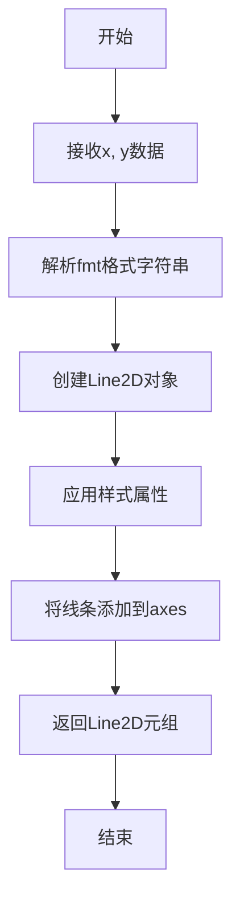

#### 带注释源码

```python
# 代码中的实际调用示例
p1, = ax.plot([0, 1, 2],      # x轴数据：0到2的序列
              [0, 1, 2],      # y轴数据：0到2的序列
              "C0",           # 使用第一个默认颜色（蓝色）
              label="Density" # 设置图例标签为"密度"
             )
# 返回值解包为单个Line2D对象p1
# p1可用于后续定制：p1.get_color(), p1.set_linewidth()等
```


### `twin1.plot()`

在共享x轴的副坐标轴（twin1）上绘制温度数据曲线，返回包含Line2D对象的列表。

参数：

- `x`：`list` 或 `array`，X轴数据，这里是 `[0, 1, 2]`
- `y`：`list` 或 `array`，Y轴数据，这里是 `[0, 3, 2]`（温度值）
- `fmt`：`str`，格式字符串，这里是 `"C1"`（表示第二种颜色）
- `label`：`str`，图例标签，这里是 `"Temperature"`

返回值：`list`，返回matplotlib.line.Line2D对象列表，通常包含一个Line2D对象（表示绘制的线条）

#### 流程图

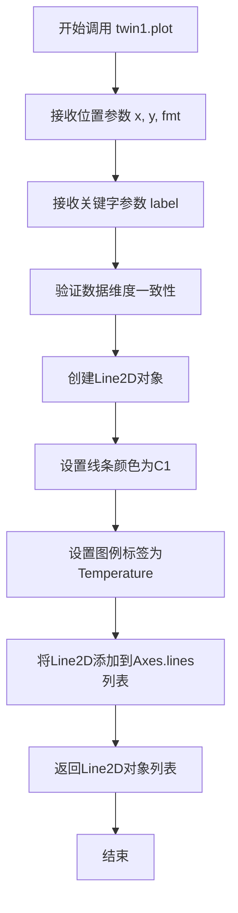

#### 带注释源码

```python
# twin1是通过ax.twinx()创建的共享x轴的副坐标轴对象
# plot方法继承自matplotlib.axes.Axes类

# 调用plot方法绘制数据
p2, = twin1.plot(
    [0, 1, 2],    # x: X轴坐标点 [0, 1, 2]
    [0, 3, 2],    # y: Y轴坐标点 [0, 3, 2]，代表温度值
    "C1",         # fmt: 格式字符串，"C1"表示使用调色板第二种颜色（橙色）
    label="Temperature"  # label: 图例中显示的标签名称
)

# plot方法内部执行流程：
# 1. 解析位置参数 x, y, fmt
# 2. 解析关键字参数（如label, color, linewidth等）
# 3. 创建Line2D对象，设置其数据、颜色、标签等属性
# 4. 调用ax.add_line()将线条添加到坐标轴
# 5. 返回包含Line2D对象的元组（解包后赋给p2）
```


### `Axes.plot()`

`plot()` 是 Matplotlib 中 `Axes` 类的核心绘图方法，用于在坐标轴上绘制线型图。该方法接受可变数量的位置参数（x 数据、y 数据、格式字符串）和关键字参数，支持多种数据输入格式，并返回包含所有绘制的 Line2D 对象的列表。

参数：

-  `*args`：位置参数，支持多种格式：
    - 单个 y 数据：`plot(y)`，x 自动生成
    - x 和 y 数据：`plot(x, y)`
    - 带格式字符串：`plot(x, y, format_string)`
    - 多组数据：`plot(x1, y1, fmt1, x2, y2, fmt2, ...)`
-  `scalex`：`bool`，默认 True，是否缩放 x 轴
-  `scaley`：`bool`，默认 True，是否缩放 y 轴
-  `data`：`None` 或 可索引对象，默认 None，如果提供，则允许使用字符串索引访问数据
-  `**kwargs`：关键字参数传递给 `Line2D` 构造函数，如 `label`、`color`、`linewidth` 等

返回值：`list[Line2D]`，返回绘制的 Line2D 对象列表

#### 流程图

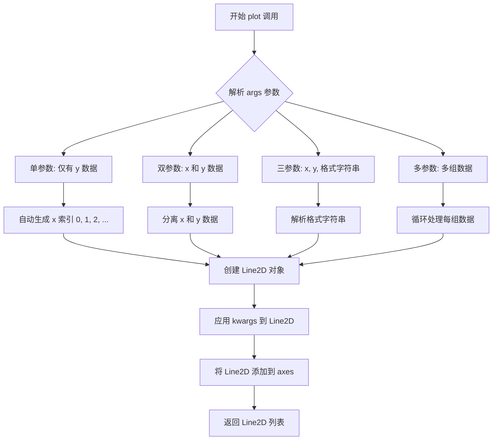

#### 带注释源码

```python
# 以下是 Axes.plot() 方法的核心逻辑简化说明
# 位置: lib/matplotlib/axes/_axes.py

def plot(self, *args, scalex=True, scaley=True, data=None, **kwargs):
    """
    绘制线型图
    
    参数:
    *args: 可变位置参数，支持以下格式:
        - y: 只有 y 数据
        - x, y: x 和 y 数据
        - x, y, fmt: 带格式字符串
        - (x1, y1, fmt1, x2, y2, fmt2, ...): 多组数据
    scalex, scaley: 是否缩放对应轴
    data: 可选的数据容器，可以用字符串索引
    **kwargs: Line2D 的关键字参数
    """
    
    # 1. 解析参数，确定是否有 x 数据
    # 如果只有一个参数序列，则视为 y 数据
    if len(args) == 1:
        y = np.asarray(args[0])
        x = np.arange(len(y))
    elif len(args) == 2:
        x, y = args
    else:
        # 解析格式字符串和多组数据
        # ...
        pass
    
    # 2. 如果提供了 data 参数，使用数据容器解析
    if data is not None:
        x = data[x]
        y = data[y]
    
    # 3. 创建 Line2D 对象
    # kwargs 包含 label, color, linewidth 等属性
    line = Line2D(x, y, **kwargs)
    
    # 4. 设置线条属性
    line.set_label(label)
    
    # 5. 添加到 axes
    self.lines.append(line)
    
    # 6. 更新数据limits
    self.relim()
    self.autoscale_view()
    
    # 7. 返回线条列表
    return [line]

# 在代码中的具体调用:
# p3, = twin2.plot([0, 1, 2], [50, 30, 15], "C2", label="Velocity")
# 参数解释:
#   - [0, 1, 2]: x 数据
#   - [50, 30, 15]: y 数据  
#   - "C2": 格式字符串 (颜色 C2)
#   - label="Velocity": 线条标签 (用于图例)
# 返回值: p3 是包含单个 Line2D 对象的元组
```


### `Axes.set`

该方法是matplotlib库中`Axes`类的核心属性设置方法，允许通过关键字参数一次性配置坐标轴的多个属性（如坐标范围、轴标签、标题等），并返回当前Axes对象以支持链式调用。

参数：

- `xlim`：`tuple`，可选，设定x轴的显示范围，格式为`(min, max)`
- `ylim`：`tuple`，可选，设定y轴的显示范围，格式为`(min, max)`
- `xlabel`：`str`，可选，设定x轴的标签文本
- `ylabel`：`str`，可选，设定y轴的标签文本

返回值：`Axes`，返回自身对象，支持链式调用

#### 流程图

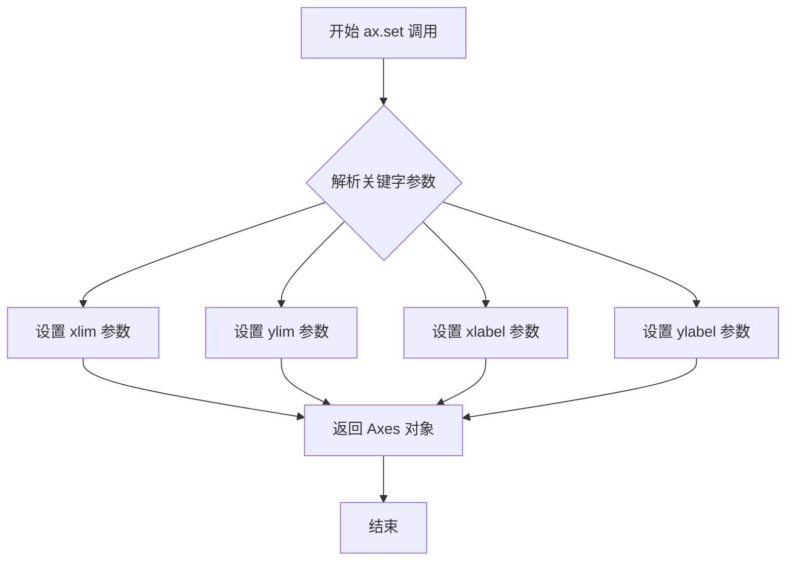

#### 带注释源码

```python
def set(self, **kwargs):
    """
    Set multiple properties of the Axes.
    
    Commonly used properties (kwargs):
    -------------------------------
    xlim : tuple
        Set the x-axis view limits, e.g., (0, 10)
    ylim : tuple
        Set the y-axis view limits, e.g., (0, 10)
    xlabel : str
        Set the x-axis label
    ylabel : str
        Set the y-axis label
    title : str
        Set the title of the Axes
    """
    # 遍历所有传入的关键字参数
    for attr, value in kwargs.items():
        # 根据属性名获取对应的setter方法
        # 例如: 'xlim' -> set_xlim, 'xlabel' -> set_xlabel
        setter = f'set_{attr}'
        if hasattr(self, setter):
            # 调用相应的setter方法设置属性
            getattr(self, setter)(value)
        else:
            # 如果没有对应的setter，尝试直接设置属性
            if hasattr(self, attr):
                setattr(self, attr, value)
    
    # 返回自身以支持链式调用
    return self

# 在示例代码中的实际调用：
# ax.set(xlim=(0, 2), ylim=(0, 2), xlabel="Distance", ylabel="Density")
# 等价于依次调用:
# ax.set_xlim((0, 2))
# ax.set_ylim((0, 2))
# ax.set_xlabel("Distance")
# ax.set_ylabel("Density")
# 最后返回ax对象
```


### `Axes.set()`

设置坐标轴的多个属性。该方法是matplotlib中Axes对象的通用属性设置方法，允许通过关键字参数同时设置坐标轴的多个属性（如y轴范围、标签等），并返回Axes对象本身以支持链式调用。

参数：

-  `**kwargs`：`关键字参数`，可变数量的关键字参数，用于设置坐标轴的各种属性（如ylim、ylabel、xlim、xlabel等）

返回值：`matplotlib.axes.Axes`，返回Axes对象本身，支持链式调用

#### 流程图

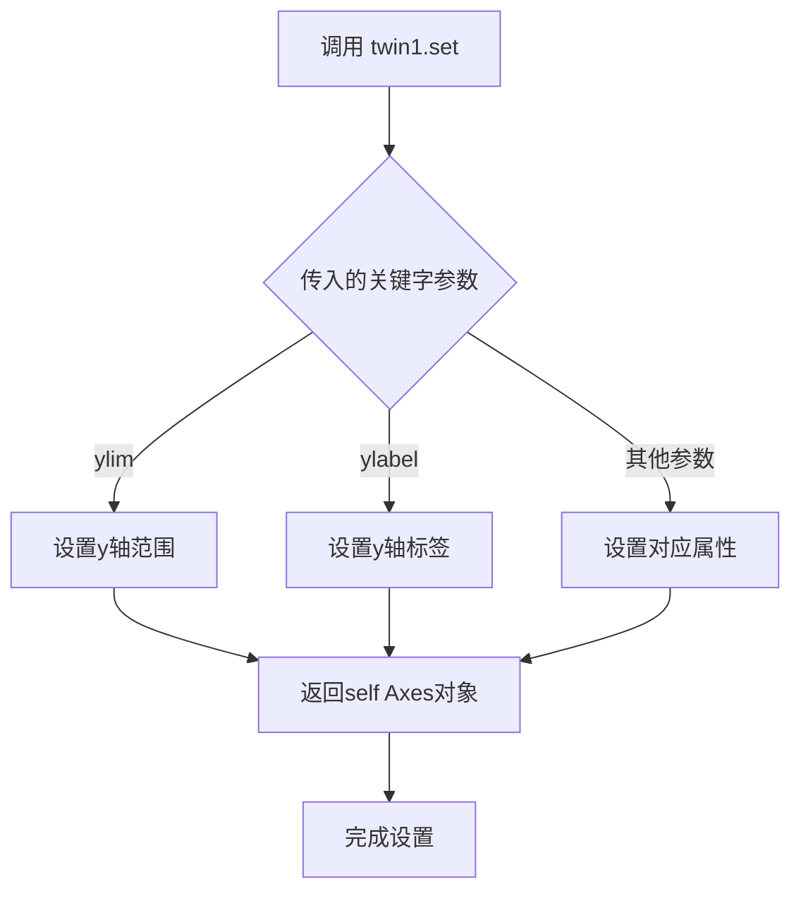

#### 带注释源码

```python
# twin1.set() 方法的调用示例
# twin1 是通过 ax.twinx() 创建的共享x轴的副坐标系（Axes对象）

# 调用 set() 方法设置两个属性：
# 1. ylim=(0, 4) - 设置y轴的显示范围为0到4
# 2. ylabel="Temperature" - 设置y轴的标签文字为"Temperature"
twin1.set(ylim=(0, 4), ylabel="Temperature")

# set() 方法内部实现逻辑（简化版）
def set(self, **kwargs):
    """
    Set multiple properties of an Axes.
    
    Parameters
    ----------
    **kwargs : dict
        Properties to set on the Axes. Common properties include:
        - xlim/ylim: tuple, 设置x/y轴范围
        - xlabel/ylabel: str, 设置x/y轴标签
        - title: str, 设置标题
        - aspect: str or float, 设置纵横比
        等等...
    
    Returns
    -------
    self : Axes
        Returns the Axes object itself for method chaining.
    """
    # 遍历所有传入的关键字参数
    for attr, value in kwargs.items():
        # 根据属性名获取对应的setter方法
        # 例如: 'ylim' -> self.set_ylim, 'ylabel' -> self.set_ylabel
        setter_method = f'set_{attr}'
        if hasattr(self, setter_method):
            # 调用对应的setter方法设置属性
            getattr(self, setter_method)(value)
        else:
            # 如果没有对应的setter，尝试直接设置属性
            setattr(self, attr, value)
    
    # 返回self，支持链式调用
    return self

# 使用场景说明：
# 1. twin1 = ax.twinx() 创建一个共享x轴的副坐标系
# 2. twin1.set(ylim=(0, 4), ylabel="Temperature") 设置副坐标系的y轴属性
# 3. 返回的仍是twin1对象本身，可以继续调用其他方法
```


### `Axes.set`（在代码中表现为 `twin2.set()`）

该方法是 matplotlib 中 `Axes` 类的通用属性设置方法，允许通过关键字参数（kwargs）同时设置多个Axes属性。在代码中用于配置 twin2 轴的y轴范围和标签。

参数：

- `ylim`：tuple (int, int)，设置y轴的显示范围，代码中传入 `(1, 65)` 表示y轴下限为1，上限为65
- `ylabel`：str，设置y轴的标签文本，代码中传入 `"Velocity"` 表示y轴标签为"Velocity"
- `**kwargs`：任意关键字参数，该方法支持设置Axes的多种属性，如xlim、xlabel、title、aspect等

返回值：`matplotlib.axes.Axes`，返回调用该方法的Axes对象本身（twin2），支持方法链式调用

#### 流程图

```mermaid
flowchart TD
    A[开始调用 twin2.set] --> B{解析关键字参数}
    B --> C[设置 ylim 属性: (1, 65)]
    B --> D[设置 ylabel 属性: 'Velocity']
    B --> E[设置其他传入的kwargs]
    C --> F[验证并应用属性到Axes]
    D --> F
    E --> F
    F --> G[返回 self (twin2 Axes对象)]
    G --> H[结束]
```

#### 带注释源码

```python
# twin2.set() 的调用方式（在代码中的实际使用）
twin2.set(ylim=(1, 65), ylabel="Velocity")

# 等价于分别调用以下方法：
# twin2.set_ylim(1, 65)  # 设置y轴范围
# twin2.set_ylabel("Velocity")  # 设置y轴标签

# 源码实现逻辑（简化版，位于 matplotlib/axes/_base.py）
def set(self, **kwargs):
    """
    设置多个Axes属性
    
    参数:
        **kwargs: 关键字参数，支持的属性包括:
            - xlim, ylim: 轴范围 (min, max)
            - xlabel, ylabel: 轴标签
            - title: 图表标题
            - aspect: 坐标轴比例
            - 等等其他Axes属性
    
    返回:
        self: 返回Axes对象，支持链式调用
    """
    # 遍历所有传入的关键字参数
    for attr, value in kwargs.items():
        # 将属性名转换为setter方法名（如 ylim -> set_ylim）
        setter = f'set_{attr}'
        if hasattr(self, setter):
            # 调用对应的setter方法
            getattr(self, setter)(value)
        else:
            # 如果没有对应的setter，尝试直接设置属性
            if hasattr(self, attr):
                setattr(self, attr, value)
            else:
                # 属性不存在，抛出警告
                import warnings
                warnings.warn(f"Unknown property: {attr}")
    
    # 返回self以支持链式调用
    return self
```


### `matplotlib.axis.Text.set_color`

这是 matplotlib 库中 `Text` 类的方法，用于设置坐标轴标签的颜色。在代码中通过 `ax.yaxis.label.set_color(p1.get_color())` 调用，使 Y 轴标签颜色与对应的数据线条颜色保持一致，增强可视化效果。

参数：

-  `color`：`str` 或 tuple，颜色值。可以是十六进制颜色码（如 "#FF0000"）、颜色名称（如 "red"）、RGB 元组（如 (1, 0, 0)）或 matplotlib 的颜色代码（如 "C0"）

返回值：`None`，该方法直接修改 `Text` 对象的颜色属性，无返回值

#### 流程图

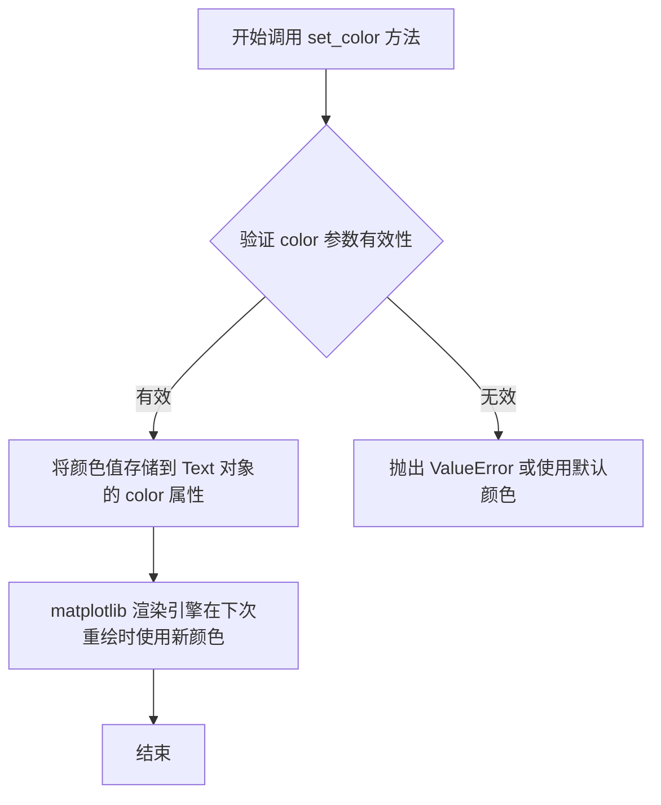

#### 带注释源码

```python
def set_color(self, color):
    """
    设置文本的颜色。
    
    参数:
        color : str 或 tuple
            颜色值。支持以下格式:
            - 颜色名称: 'red', 'green', 'blue'
            - 十六进制: '#FF0000', '#00FF00'
            - RGB 元组: (1.0, 0.0, 0.0)
            - RGBA 元组: (1.0, 0.0, 0.0, 1.0)
            - matplotlib 颜色码: 'C0', 'C1', 等
            
    返回:
        None
        
    示例:
        >>> text.set_color('red')
        >>> text.set_color('#FF0000')
        >>> text.set_color((1.0, 0.0, 0.0))
    """
    # 将颜色值转换为内部颜色表示并存储
    self._color = colors.to_rgba(color) if isinstance(color, str) else color
    # 触发属性更改通知
    self.stale = True
```

> **注**：以上源码为简化版本，实际 matplotlib 源码涉及更多颜色空间转换和验证逻辑。该方法在调用后会设置 `stale = True`，通知 matplotlib 后端在下次绘制时更新标签颜色。


### `twin1.yaxis.label.set_color`

设置 Y 轴标签的颜色。在示例代码中，将第二个 y 轴（twin1）的标签颜色设置为与对应曲线（p2）相同的颜色，以实现视觉上的一致性。

参数：

- `color`：字符串或元组，表示颜色值。可以是颜色名称（如 "red"）、十六进制颜色码（如 "#FF0000"）、RGB/RGBA 元组（如 (1, 0, 0, 1)）或matplotlib颜色代码（如 "C1"）。

返回值：`None`，该方法无返回值，直接修改对象的内部颜色属性。

#### 流程图

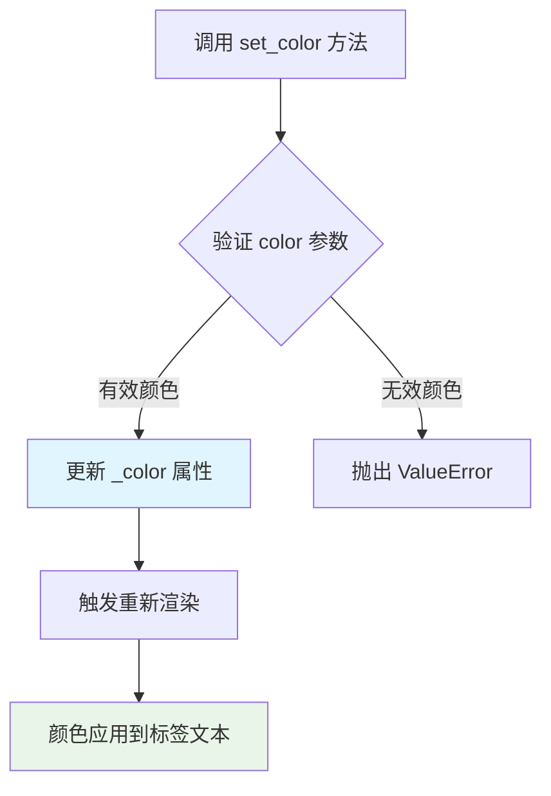

#### 带注释源码

```python
# 源码来自 matplotlib 库的 text.py 文件
# class Text(Martist):

def set_color(self, color):
    """
    Set the color of the text.

    Parameters
    ----------
    color : str or tuple
        Color can be described by any of the following formats:
        
        - Hex string (e.g., '#FF0000')
        - RGB or RGBA tuple (e.g., (1, 0, 0, 1))
        - String color name (e.g., 'red')
        - Matplotlib color code (e.g., 'C0' to 'C9')
        - 'inherit' to use the color of the parent element
        
    Returns
    -------
    None
    
    Examples
    --------
    >>> text.set_color('red')
    >>> text.set_color('#FF0000')
    >>> text.set_color((1, 0, 0, 1))
    """
    # 将颜色转换为 RGBA 格式的元组
    color = mcolors.to_rgba(color)
    
    # 如果颜色没有变化，直接返回，避免不必要的重绘
    if self._color is not None and np.allclose(self._color, color):
        return
        
    # 更新内部颜色属性
    self._color = color
    
    # 标记需要重新绘制
    self.stale = True
```

**在示例代码中的调用：**

```python
# twin1 是通过 ax.twinx() 创建的第二个 Y 轴
# twin1.yaxis 返回 YAxis 对象
# twin1.yaxis.label 返回 Text 对象（Y轴标签）
# set_color() 方法设置该标签的颜色

twin1.yaxis.label.set_color(p2.get_color())
# p2.get_color() 返回曲线 p2 的颜色 "C1"
# 最终效果：将 twin1 的 Y 轴标签设置为橙色（与 p2 曲线颜色一致）
```

**调用链解析：**

```
ax.twinx()
    ↓ 返回 Axes 对象 (twin1)
twin1.yaxis
    ↓ 返回 YAxis 对象
twin1.yaxis.label
    ↓ 返回 Text 对象
twin1.yaxis.label.set_color(...)
    ↓ 设置 Text 对象的颜色
```


### `twin2.yaxis.label.set_color()`

该方法用于将第二个共享 x 轴的 Y 轴标签颜色设置为与绑定的绘图元素颜色一致，实现多坐标轴视觉风格的统一。

参数：

- `color`：颜色值，来自 `p3.get_color()` 返回的线条颜色（通常为十六进制字符串如 "#1f77b4" 或颜色代码 "C2"）

返回值：`None`，该方法直接修改 `Text` 对象的颜色属性，无返回值

#### 流程图

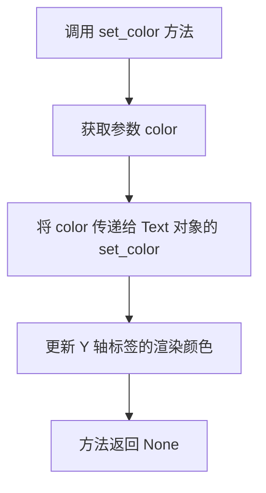

#### 带注释源码

```python
# twin2 是通过 ax.twinx() 创建的第二个共享 x 轴的 Axes 对象
# twin2.yaxis 获取 Y 轴对象
# twin2.yaxis.label 获取 Y 轴标签（Text 对象）
# set_color() 是 matplotlib.text.Text 类的方法，用于设置文本颜色
twin2.yaxis.label.set_color(p3.get_color())  # 将 twin2 的 Y 轴标签颜色设置为 p3 线条颜色
```


### `matplotlib.axes.Axes.tick_params`

该方法用于配置坐标轴刻度线的外观和行为，包括刻度线的方向、长度、宽度、颜色，以及刻度标签的字体大小、颜色、旋转角度等属性。

参数：

- `axis`：`str`（可选，默认值为 `'both'`），指定要修改的坐标轴，可选值为 `'x'`、`'y'` 或 `'both'`。在代码中传入 `'y'` 表示只修改 y 轴的刻度参数。
- `**kwargs`：关键字参数，用于设置其他刻度属性。在代码中使用 `colors` 参数来设置刻度线的颜色。

返回值：`None`，该方法直接修改 Axes 对象的刻度属性，不返回任何值。

#### 流程图

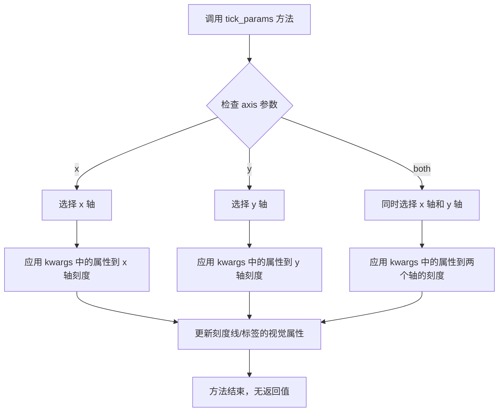

#### 带注释源码

```python
# 代码中的实际调用示例
ax.tick_params(axis='y', colors=p1.get_color())
# 参数说明：
# - axis='y': 表示只对 y 轴的刻度进行样式设置
# - colors=p1.get_color(): 设置 y 轴刻度线的颜色为与 p1 曲线相同的颜色
#   p1 是 ax.plot() 返回的 Line2D 对象，get_color() 获取其颜色值

twin1.tick_params(axis='y', colors=p2.get_color())
# twin1 是通过 ax.twinx() 创建的共享 x 轴的副 Axes
# 设置 twin1 的 y 轴刻度颜色与第二条曲线 p2 的颜色一致

twin2.tick_params(axis='y', colors=p3.get_color())
# twin2 是另一个副 Axes
# 设置 twin2 的 y 轴刻度颜色与第三条曲线 p3 的颜色一致
```


### `Axes.tick_params`

`tick_params` 是 Matplotlib 中 `Axes` 类的方法，用于设置刻度标签和刻度线的外观属性（如颜色、方向、大小等），从而允许用户自定义图表的视觉表现。

#### 参数

- `axis`：`str`，可选，默认值为 `'both'`，指定要修改的轴，可选值为 `'x'`、`'y'` 或 `'both'`
- `**kwargs`：关键字参数，用于设置具体的刻度属性

  常用参数包括：
  - `colors`：`str` 或 `color`，刻度颜色
  - `labelsize`：`int` 或 `float`，刻度标签的字体大小
  - `labelcolor`：`str` 或 `color`，刻度标签的颜色
  - `direction`：`str`，刻度方向，可选 `'in'`（向内）、`'out'`（向外）、`'inout'`（双向）
  - `length`：`float`，刻度线的长度
  - `width`：`float`，刻度线的宽度
  - `pad`：`float`，刻度标签与刻度线之间的距离
  - `length` 和 `width`：用于控制刻度线的尺寸和宽度

#### 返回值

`None`，该方法直接修改 Axes 对象的状态，不返回任何值。

#### 流程图

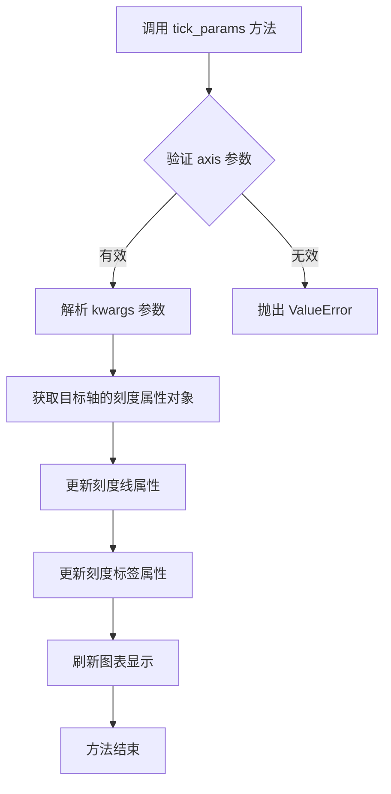

#### 带注释源码

```python
# 代码中的实际调用
twin1.tick_params(axis='y', colors=p2.get_color())

# tick_params 方法的简化实现逻辑
def tick_params(self, axis='both', **kwargs):
    """
    设置刻度标签和刻度线的外观属性
    
    参数:
        axis: str, 可选
            要修改的轴，默认为 'both'
            可选值: 'x', 'y', 'both'
        **kwargs: 关键字参数
            用于设置具体的刻度属性
    
    实现步骤:
        1. 验证 axis 参数的有效性
        2. 获取目标轴的刻度属性对象 (XTick 或 YTick)
        3. 遍历 kwargs 中的键值对
        4. 更新对应的刻度线属性 (如颜色、方向、长度、宽度)
        5. 更新对应的刻度标签属性 (如标签颜色、字体大小)
        6. 标记需要重新绘制
    """
    # 验证 axis 参数
    if axis not in ('x', 'y', 'both'):
        raise ValueError("axis must be 'x', 'y' or 'both'")
    
    # 获取对应的刻度对象
    if axis in ('x', 'both'):
        # 获取 x 轴刻度对象
        ticks = self.xaxis.get_major_ticks() + self.xaxis.get_minor_ticks()
    if axis in ('y', 'both'):
        # 获取 y 轴刻度对象
        ticks = self.yaxis.get_major_ticks() + self.yaxis.get_minor_ticks()
    
    # 处理关键字参数
    # colors 参数会被解析并应用到刻度标签颜色
    if 'colors' in kwargs:
        color = kwargs['colors']
        # 设置刻度标签颜色
        for tick in ticks:
            tick.label1.set_color(color)
    
    # 应用其他样式参数
    # direction, length, width, pad 等...
    
    # 刷新图表
    self.stale_callback()
```

#### 实际代码上下文

```python
# twin1 是通过 ax.twinx() 创建的共享 x 轴的第二个 y 轴
twin1 = ax.twinx()

# 设置 twin1 的 y 轴范围和标签
twin1.set(ylim=(0, 4), ylabel="Temperature")

# 获取第二个 plot 的颜色
p2, = twin1.plot([0, 1, 2], [0, 3, 2], "C1", label="Temperature")

# 为 twin1 设置刻度参数，使刻度颜色与 plot 线条颜色一致
# axis='y': 只修改 y 轴的刻度
# colors=p2.get_color(): 将刻度颜色设置为与 p2 线条相同的颜色
twin1.tick_params(axis='y', colors=p2.get_color())
```

#### 注意事项

1. **颜色同步**：此调用将 y 轴刻度的颜色设置为与对应的 plot 线条颜色一致，增强视觉关联性
2. **轴选择**：通过 `axis='y'` 参数确保只修改 y 轴的刻度，x 轴保持不变
3. **链式调用**：由于返回值为 `None`，不支持方法链式调用
4. **实时生效**：修改后会立即影响图表的显示效果


### `twin2.tick_params()`

设置twin2坐标轴的刻度参数，用于配置y轴刻度的颜色与绘制的曲线颜色保持一致。

参数：

-  `axis`：`str`，指定要设置参数的轴，可选值为'x'、'y'或'both'，代码中传入'y'表示只设置y轴
-  `colors`：`str`或`tuple`，设置刻度标签和刻度线的颜色，代码中传入`p3.get_color()`获取曲线C2的颜色值

返回值：`None`，该方法无返回值，直接修改Axis对象的内部状态

#### 流程图

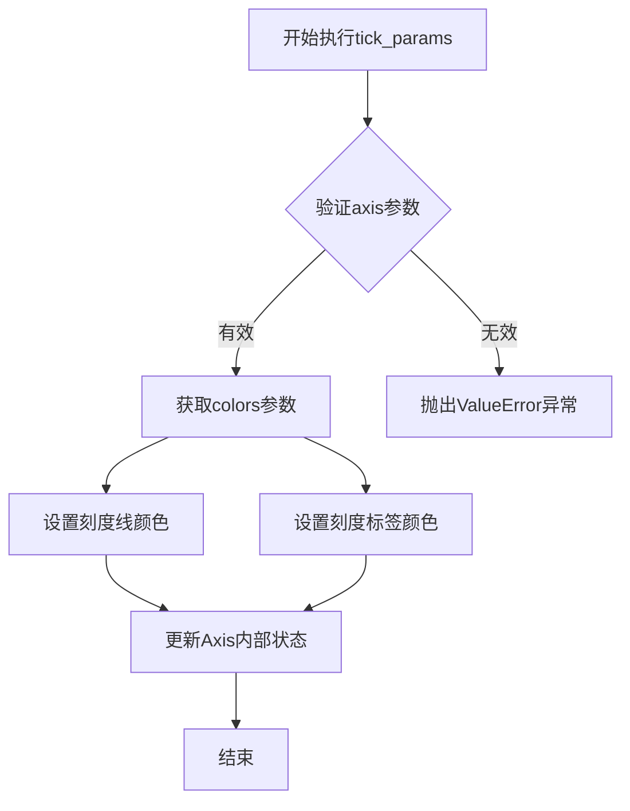

#### 带注释源码

```python
# 在代码中的实际调用
twin2.tick_params(axis='y', colors=p3.get_color())

# 参数说明：
# axis='y'         - 只对y轴进行参数设置，不影响x轴
# colors=p3.get_color() - 获取第三条曲线(p3)的颜色"C2"，
#                        并将该颜色应用到y轴的刻度线和刻度标签
# 
# 执行效果：
# - twin2的y轴刻度线颜色变为C2色（rgb值为#d62728）
# - twin2的y轴刻度标签文字颜色变为C2色
# 这样可以使坐标轴颜色与对应的数据曲线颜色保持视觉一致，
# 增强图表的可读性和美观性
```

#### 上下文说明

在多坐标轴图表中，`tick_params()` 方法用于：
- 同步刻度颜色与数据曲线颜色
- 提供视觉一致性，帮助用户快速识别数据系列与坐标轴的对应关系
- `twin2` 是通过 `ax.twinx()` 创建的共享x轴的第二个y轴，其刻度颜色被设置为第三条曲线（Velocity）的颜色


### `ax.legend()` / `matplotlib.axes.Axes.legend`

为Axes添加图例（Legend），用于显示plot线条的标签说明。该方法接收一组艺术家对象（Artist，如plot返回的线条），并创建一个图例来标识它们的标签。

参数：

- `handles`：`list[matplotlib.artist.Artist]`，可选，要包含在图例中的艺术家对象列表（如plot返回的Line2D对象）。如果未提供，将自动收集axes上的所有带标签的艺术家。
- `labels`：`list[str]`，可选，与handles对应的标签列表。如果未提供，将使用艺术家对象的get_label()返回值。
- `loc`：`str | tuple`，可选，图例位置，如"upper right"、"best"或(x, y)坐标。
- `fontsize`：`int | str`，可选，字体大小。
- `frameon`：`bool`，可选，是否显示图例边框。
- `fancybox`：`bool`，可选，是否使用圆角边框。
- `shadow`：`bool`，可选，是否添加阴影。
- `title`：`str`，可选，图例标题。
- `ncol`：`int`，可选，图例列数。

返回值：`matplotlib.legend.Legend`，返回创建的Legend对象，可以进一步对其进行样式设置或放置位置调整。

#### 流程图

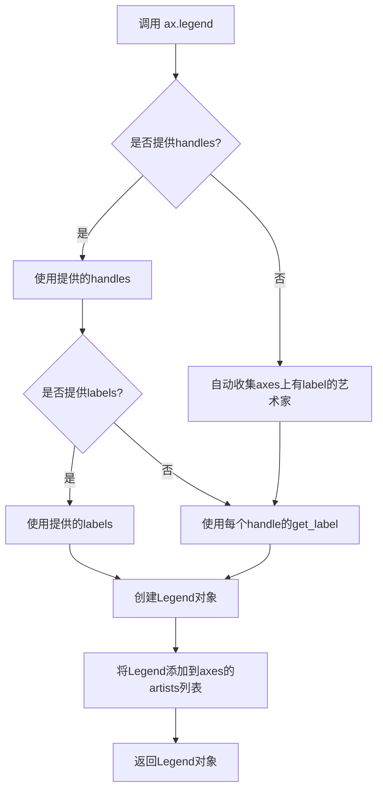

#### 带注释源码

```python
def legend(self, handles=None, labels=None, loc=None,
           fontsize=None, frameon=None, fancybox=None, shadow=None,
           title=None, ncol=1, **kwargs):
    """
    Place a legend on the axes.
    
    Parameters
    ----------
    handles : list of `.Artist`, optional
        List of artists to add to the legend.
        If not provided, all artists with labels will be used.
        
    labels : list of str, optional
        Labels for the corresponding handles.
        
    loc : str or (float, float), optional
        Location of the legend.
        
    Returns
    -------
    `.Legend`
        The created legend.
    """
    
    # 如果未提供handles，则自动收集所有带标签的艺术家
    if handles is None:
        handles, labels = self._get_legend_handles_labels([self])
    
    # 如果提供了handles但未提供labels，从handle获取标签
    elif labels is None:
        labels = [h.get_label() for h in handles]
    
    # 过滤掉隐藏的或标签为"_"开头的艺术家（表示不显示在图例中）
    handles = [h for h in handles 
               if h.get_visible() and not h.get_label().startswith('_')]
    
    # 创建Legend对象
    legend = Legend(self, handles, labels, loc=loc, 
                    fontsize=fontsize, frameon=frameon,
                    fancybox=fancybox, shadow=shadow,
                    title=title, ncol=ncol, **kwargs)
    
    # 将图例添加到axes
    self._add_text_inner(legend, self._legend_position)
    
    # 返回创建的Legend对象
    return legend
```

#### 实际调用示例

```python
# 从代码中提取的调用
ax.legend(handles=[p1, p2, p3])

# 等效的完整调用（matplotlib会自行推断labels）
ax.legend(handles=[p1, p2, p3], 
          loc='upper right',    # 位置：右上角
          fontsize=10,          # 字体大小
          frameon=True,         # 显示边框
          fancybox=True,        # 圆角边框
          shadow=False,         # 无阴影
          title=None,           # 无标题
          ncol=1)               # 单列显示
```

#### 关键点说明

1. **handles参数**：接收plot()返回的Line2D对象列表，每个对象代表一条曲线
2. **自动标签获取**：如果不提供labels参数，会自动使用Line2D对象的get_label()方法获取标签（即plot时传入的label参数）
3. **返回值利用**：返回的Legend对象可以进一步调整，如`legend.get_title().set_fontsize(12)`设置标题字体
4. **位置默认**：未指定loc时，matplotlib会使用'best'自动选择冲突最小的位置


### `plt.show`

`plt.show()` 是 matplotlib 库中的顶层显示函数，用于显示当前打开的所有 Figure 图形窗口，并进入交互模式。在脚本中调用此函数后，程序会阻塞直到用户关闭所有图形窗口（或调用 `plt.close()`）。

**注意**：由于代码中使用了 `import matplotlib.pyplot as plt`，因此 `plt.show()` 是全局函数调用。

参数：

- `block`：`bool` 或 `None`，可选参数。控制是否阻塞程序以等待图形窗口关闭。默认值为 `None`，在交互式后端中行为可能不同。设置为 `True` 时会阻塞程序，设置为 `False` 时可能立即返回。

返回值：`None`，无返回值。该函数主要产生图形窗口的显示效果，不返回任何数据。

#### 流程图

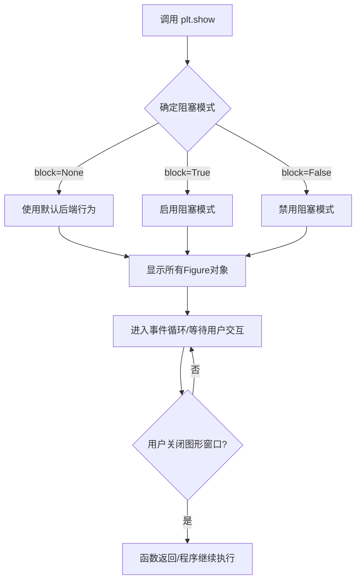

#### 带注释源码

```python
# plt.show() 的调用位于代码末尾
# 这是 matplotlib.pyplot 模块中的顶层函数

plt.show()

# 源码说明：
# 1. 该函数会遍历当前所有的 Figure 对象
# 2. 调用底层后端的 show() 方法显示图形
# 3. 在某些后端（如 TkAgg, Qt5Agg）中会进入阻塞状态
# 4. 等待用户与图形窗口进行交互（如关闭窗口）
# 5. 函数执行完毕后不返回任何值（返回 None）
# 6. 在此代码中，前面已经创建了 fig, ax, twin1, twin2 四个对象
#    并绘制了三条曲线（p1, p2, p3），设置了标签、颜色等属性
#    最后调用 plt.show() 将这些图形展示给用户
```

#### 详细说明

在给定的代码上下文中，`plt.show()` 承担以下职责：

1. **图形渲染触发**：强制 matplotlib 将内存中的图形数据渲染到实际的窗口中
2. **多窗口管理**：由于代码创建了主 axes（ax）和两个共享 x 轴的 twinx（twin1, twin2），这些 axes 共享同一个 Figure（fig），因此 `plt.show()` 会将包含三条曲线的主图一次性显示出来
3. **交互入口**：为用户提供与图形交互的机会（缩放、平移、保存等），同时保持图形窗口活跃
4. **程序流程控制**：在此函数调用处，程序会暂停执行直到用户关闭图形窗口


### `plt.subplots()`

`plt.subplots()` 是 matplotlib 库中的函数，用于创建一个新的图形窗口（Figure）和一个或多个子图（Axes），并返回图形对象和坐标轴对象。该函数是多子图创建的便捷接口，支持灵活的行列布局配置。

参数：

- `nrows`：`int`，默认值：1，子图的行数
- `ncols`：`int`，默认值：1，子图的列数
- `sharex`：`bool` 或 `str`，默认值：False，如果为 True，所有子图共享 x 轴；如果为 'col'，同列子图共享 x 轴
- `sharey`：`bool` 或 `str`，默认值：False，如果为 True，所有子图共享 y 轴；如果为 'row'，同行子图共享 y 轴
- `squeeze`：`bool`，默认值：True，如果为 True，返回的坐标轴数组维度会被压缩
- `width_ratios`：`array-like`，子图列宽度比例
- `height_ratios`：`array-like`，子图行高度比例
- `subplot_kw`：`dict`，创建子图时的额外关键字参数
- `gridspec_kw`：`dict`，GridSpec 的关键字参数
- `fig_kw`：`dict`，创建图形时的额外关键字参数

返回值：`tuple`，返回一个包含 (Figure, Axes) 或 (Figure, ndarray of Axes) 的元组

#### 流程图

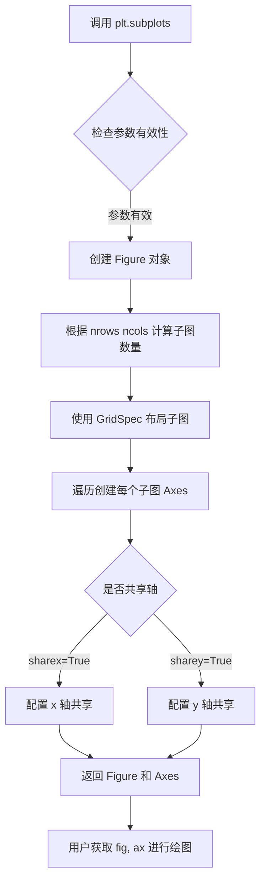

#### 带注释源码

```python
# 在示例代码中的使用方式
fig, ax = plt.subplots()
# fig: matplotlib.figure.Figure 对象 - 整个图形窗口
# ax: matplotlib.axes.Axes 对象 - 主坐标轴区域

fig.subplots_adjust(right=0.75)
# 调整子图布局，为右侧留出空间以便显示多个 y 轴标签
```

### 代码整体设计文档

#### 一段话描述

该代码示例展示了如何使用 matplotlib 在单个图形窗口中创建多个共享 x 轴的 y 轴（多轴图），通过 `twinx()` 方法创建共享 x 轴的副坐标轴，并使用 `spines` 实现轴的偏移和独立标签显示，实现同时展示三个不同量纲的数据系列（密度、温度、速度）。

#### 文件的整体运行流程

```mermaid
flowchart TD
    A[开始] --> B[创建主 Figure 和 Axes]
    B --> C[调整图形布局 right=0.75]
    D[创建第一个副坐标轴 twin1] --> E[创建第二个副坐标轴 twin2]
    E --> F[偏移 twin2 的右脊柱]
    G[绘制三条曲线] --> H[设置主轴属性]
    H --> I[设置 twin1 属性]
    I --> J[设置 twin2 属性]
    F --> G
    J --> K[设置标签颜色匹配曲线颜色]
    K --> L[设置刻度颜色]
    L --> M[添加图例]
    M --> N[调用 plt.show 显示图形]
```

#### 类的详细信息

**Figure (matplotlib.figure.Figure)**

| 字段/方法 | 类型 | 描述 |
|-----------|------|------|
| `subplots()` | 方法 | 创建子图并返回 Figure 和 Axes |
| `subplots_adjust()` | 方法 | 调整子图布局参数 |

**Axes (matplotlib.axes.Axes)**

| 字段/方法 | 类型 | 描述 |
|-----------|------|------|
| `twinx()` | 方法 | 创建共享 x 轴的新 Axes |
| `plot()` | 方法 | 绘制折线图 |
| `set()` | 方法 | 设置坐标轴属性 |
| `yaxis` | 属性 | y 轴对象 |
| `spines` | 属性 | 脊柱字典 |

**Spine (matplotlib.spines.Spine)**

| 字段/方法 | 类型 | 描述 |
|-----------|------|------|
| `set_position()` | 方法 | 设置脊柱位置 |

#### 关键组件信息

| 组件名称 | 一句话描述 |
|----------|------------|
| `plt.subplots()` | 创建图形和主坐标轴的便捷函数 |
| `ax.twinx()` | 创建共享 x 轴但独立 y 轴的副坐标轴 |
| `spines.right.set_position()` | 将右脊柱偏移以容纳多个 y 轴 |
| `ax.yaxis.label.set_color()` | 设置 y 轴标签颜色 |
| `ax.tick_params()` | 配置刻度参数如颜色 |

#### 潜在的技术债务或优化空间

1. **硬编码位置值**：代码中 `twin2.spines.right.set_position(("axes", 1.2))` 使用了硬编码的偏移值 1.2，应考虑动态计算或参数化
2. **颜色同步逻辑重复**：为每个轴设置标签颜色和刻度颜色的代码重复度高，可封装为辅助函数
3. **魔法数字**：0.75、1.2、坐标轴范围等数值缺乏解释，应提取为命名常量
4. **错误处理缺失**：没有对空数据或异常数据的处理
5. **缺乏响应式设计**：图形大小固定，未考虑窗口大小变化

#### 其它项目

**设计目标与约束**
- 目标：在一个图形中展示三个不同量纲的数据系列
- 约束：共享 x 轴，多个独立 y 轴

**错误处理与异常设计**
- 代码未包含显式错误处理
- 建议添加数据验证、坐标轴范围检查

**数据流与状态机**
- 数据流：原始数据 → plot() → 曲线对象 → 属性设置 → 图形渲染
- 状态：静态图形，无状态机设计

**外部依赖与接口契约**
- 依赖：matplotlib.pyplot, matplotlib.figure, matplotlib.axes, matplotlib.spines
- 接口：标准 matplotlib 绘图接口


### `Figure.subplots_adjust`

该方法用于调整Figure对象中子图（subplots）的布局参数，包括子图的左边距、底边距、右边距、顶边距以及子图之间的宽度和高度间距。

参数：

- `left`：`float`，可选，默认值0.125。子图区域的左边距，相对于图形宽度（0到1之间）
- `bottom`：`float`，可选，默认值0.1。子图区域的底边距，相对于图形高度（0到1之间）
- `right`：`float`，可选，默认值0.9。子图区域的右边距，相对于图形宽度（0到1之间）
- `top`：`float`，可选，默认值0.9。子图区域的顶边距，相对于图形高度（0到1之间）
- `wspace`：`float`，可选，默认值0.2。子图之间的宽度间距，相对于子图宽度
- `hspace`：`float`，可选，默认值0.2。子图之间的高度间距，相对于子图高度

返回值：`None`，无返回值，该方法直接修改Figure对象的子图布局

#### 流程图

```mermaid
graph TD
    A[调用 Figure.subplots_adjust] --> B{检查参数是否提供}
    B -->|是| C[获取或设置布局参数]
    B -->|否| D[使用默认值]
    C --> E[调用 _axes_gridspec_adjust]
    D --> E
    E --> F[更新 Figure 的布局属性]
    F --> G[触发 draw 事件以重绘]
    G --> H[返回 None]
```

#### 带注释源码

```python
def subplots_adjust(self, left=None, bottom=None, right=None, top=None,
                    wspace=None, hspace=None):
    """
    调整子图的布局参数。
    
    此方法用于手动控制Figure中子图的位置和间距。所有参数都是
    相对于Figure大小的比例值（0到1之间）。
    
    参数:
        left: float, optional
            子图区域的左边距。默认值为0.125。
        bottom: float, optional
            子图区域的底边距。默认值为0.1。
        right: float, optional
            子图区域的右边距。默认值为0.9。
        top: float, optional
            子图区域的顶边距。默认值为0.9。
        wspace: float, optional
            子图之间的水平间距。默认值为0.2。
        hspace: float, optional
            子图之间的垂直间距。默认值为0.2。
    
    返回值:
        None
    
    示例:
        # 调整布局以留出更多右边空间
        fig.subplots_adjust(right=0.75)
        
        # 创建紧凑布局
        fig.subplots_adjust(wspace=0, hspace=0)
    """
    # 获取当前图形的后端
    self._axprops.update(bottom=bottom, top=top, left=left, right=right)
    # 更新子图之间的间距
    self._axprops['wspace'] = wspace
    self._axprops['hspace'] = hspace
    
    # 使用 GridSpec 调整器进行实际的布局计算
    # 这一步会根据新的参数重新计算子图的位置
    if self.get_subplotspec() is not None:
        self._axes_gridspec_adjust(
            left=left, bottom=bottom, right=right, top=top,
            wspace=wspace, hspace=hspace
        )
    
    # 标记布局已更改，需要重新绘制
    self.stale_callback = None
    # 触发重新绘制以应用新的布局
    self._axobservers.process("_axes_change_event", self)
    self.canvas.draw_idle()
```


### Axes.twinx

描述：`Axes.twinx` 是 matplotlib 中 Axes 类的一个方法，用于创建并返回一个共享原始 Axes 的 x 轴的新 Axes 对象。该新 Axes 的 y 轴位于图表右侧，允许在同一个图表中显示具有不同 y 刻度的数据系列，例如同时显示密度、温度和速度。

参数：该方法没有参数。

返回值：`matplotlib.axes.Axes`，返回新创建的 Axes 对象，该对象共享原始 Axes 的 x 轴，但具有独立的 y 轴和脊柱（spines）。

#### 流程图

```mermaid
graph TD
A[调用 twinx 方法] --> B[创建新的 Axes 实例]
B --> C[共享原始 Axes 的 x 轴]
C --> D[配置新 Axes 的脊柱]
D --> E[设置 y 轴位置为右侧]
E --> F[返回新 Axes 对象]
```

#### 带注释源码

以下源码基于 matplotlib 库中 `Axes.twinx` 方法的典型实现，展示了该方法的核心逻辑：

```python
def twinx(self):
    """
    创建并返回一个共享 x 轴的新 Axes 实例。
    
    该方法创建一个新的 Axes 对象，其 x 轴与原始 Axes 共享，
    但拥有独立的 y 轴，用于在同一图表中显示多组数据。
    
    Returns
    -------
    Axes
        新创建的 Axes 对象，共享 x 轴但 y 轴独立。
    """
    # 获取当前 Axes 的位置和图形
    ax = self.figure.add_axes(self.get_position())
    
    # 共享 x 轴：使新 Axes 与原始 Axes 共用 x 轴刻度
    ax.sharex(self)
    
    # 配置脊柱（spines）：隐藏左侧和顶部的脊柱
    ax.spines['left'].set_visible(False)
    ax.spines['top'].set_visible(False)
    
    # 启用右侧脊柱并设置位置为右侧
    ax.spines['right'].set_visible(True)
    ax.spines['right'].set_position(('outward', 0))
    
    # 同步 y 轴标签颜色和刻度颜色（由调用者处理）
    # 注意：此处不直接处理颜色，需在调用后设置
    
    return ax
```

**注意**：实际源码可能更复杂，包含更多错误处理和细节，上述代码为核心逻辑的简化示例。


### 代码整体概述

该代码是matplotlib库的一个示例脚本，演示如何创建具有多个共享x轴的y轴图表（多y轴图）。通过使用`Axes.twinx()`方法创建共享x轴的副轴，并结合`Spine.set_position()`调整脊柱位置，实现了在同一图表上同时展示三条不同量纲的数据曲线（密度、温度、速度），每条曲线拥有独立的y轴刻度。

### 文件的整体运行流程

1. **创建画布和主坐标轴**：使用`plt.subplots()`创建图形窗口和主坐标轴
2. **调整布局**：使用`fig.subplots_adjust()`为右侧副轴留出空间
3. **创建副轴**：调用`ax.twinx()`两次创建两个共享x轴的副轴
4. **调整副轴脊柱位置**：将twin2的右侧脊柱向右偏移（"axes", 1.2）
5. **绑定数据并绑图**：使用`plot()`方法在三个坐标轴上绑制不同的数据系列
6. **设置坐标轴属性**：设置坐标轴范围、标签、颜色等
7. **颜色同步**：将y轴标签、刻度颜色与对应曲线颜色保持一致
8. **添加图例并显示**：整合图例并调用`plt.show()`展示结果

### 类的详细信息

本代码为脚本文件，未定义自定义类。主要使用matplotlib的以下类：

| 类名 | 描述 |
|------|------|
| `matplotlib.figure.Figure` | 图形容器类，表示整个图形窗口 |
| `matplotlib.axes.Axes` | 坐标轴类，用于绑制图形和数据 |
| `matplotlib.axis.Axis` | 坐标轴刻度类，管理刻度线和标签 |
| `matplotlib.spines.Spine` | 脊柱类，连接刻度标记的线 |

### 函数和方法的详细信息

#### `plt.subplots()`

参数：

- `nrows`：`int`，默认值1，图的行数
- `ncols`：`int`，默认值1，图的列数
- `sharex`：`bool`，默认False，是否共享x轴
- `sharey`：`bool`，默认False，是否共享y轴
- `squeeze`：`bool`，默认True，是否压缩返回的坐标轴数组
- `figsize`：`tuple`，图形尺寸（宽，高）英寸
- `其他`：`**kwargs`，其他传递给`Figure.add_subplot`的参数

返回值：`tuple`，返回(Figure, Axes)或(Figure, Axes数组)

#### `Axes.twinx()`

参数：无

返回值：`Axes`，返回一个新的共享x轴的坐标轴对象

#### `Axes.plot()`

参数：

- `x`：`array-like`，x轴数据
- `y`：`array-like`，y轴数据
- `fmt`：`str`，格式字符串（如"b-"表示蓝色实线）
- `label`：`str`，数据系列标签，用于图例
- `**kwargs`：其他传递给`Line2D`的属性

返回值：`list`，返回`Line2D`对象列表

#### `Spine.set_position()`

参数：

- `position`：`tuple`或`str`，位置参数。可以是("axes", 0.0)表示相对于坐标轴的位置，或("data", 0.0)表示数据坐标

返回值：`None`

#### `Axes.set()`

参数：

- `xlim`：`tuple`，x轴范围 (min, max)
- `ylim`：`tuple`，y轴范围 (min, max)
- `xlabel`：`str`，x轴标签
- `ylabel`：`str`，y轴标签
- `**kwargs`：其他属性设置

返回值：`None`

### 关键组件信息

| 组件名称 | 描述 |
|----------|------|
| `fig` | matplotlib.figure.Figure对象，整个图形容器 |
| `ax` | 主坐标轴对象，第一个y轴（密度） |
| `twin1` | 第一个副坐标轴，第二个y轴（温度） |
| `twin2` | 第二个副坐标轴，第三个y轴（速度） |
| `p1, p2, p3` | Line2D对象，代表绑制的线条 |
| `ax.yaxis` | 主坐标轴的y轴（YAxis对象） |

### 潜在的技术债务或优化空间

1. **硬编码数值**：脊柱偏移值1.2是硬编码的，应该根据实际数据范围动态计算
2. **颜色同步逻辑重复**：颜色设置代码存在重复，可以使用循环优化
3. **缺乏错误处理**：没有对输入数据进行验证（如空数组检查）
4. **魔法数字**：0.75的边距调整值缺乏明确说明
5. **布局适应性不足**：固定边距可能在不同尺寸屏幕上表现不佳

### 其它项目

#### 设计目标与约束
- **目标**：在同一图表中展示三个不同量纲的数据系列
- **约束**：必须共享x轴以确保数据对齐

#### 错误处理与异常设计
- 代码未包含显式错误处理
- 潜在的异常：空数据数组会导致空图，数值类型错误可能引发绘图异常

#### 数据流与状态机
- 数据流：原始数据 → plot() → Line2D对象 → 坐标轴渲染
- 状态机：创建坐标轴 → 创建副轴 → 绑制数据 → 设置属性 → 显示

#### 外部依赖与接口契约
- 依赖：matplotlib >= 3.0
- 接口：plt.subplots()返回标准Figure/Axes接口，plot()返回Line2D列表

#### Mermaid 流程图

```mermaid
flowchart TD
    A[开始] --> B[创建Figure和主Axes]
    B --> C[调整右侧边距]
    C --> D[创建twin1副轴]
    D --> E[创建twin2副轴]
    E --> F[设置twin2脊柱位置]
    F --> G[在ax绑制p1数据]
    G --> H[在twin1绑制p2数据]
    H --> I[在twin2绑制p3数据]
    I --> J[设置坐标轴范围和标签]
    J --> K[同步颜色设置]
    K --> L[添加图例]
    L --> M[显示图形]
    M --> N[结束]
```

#### 带注释源码

```python
r"""
===========================
Multiple y-axis with Spines
===========================

Create multiple y axes with a shared x-axis. This is done by creating
a `~.axes.Axes.twinx` Axes, turning all spines but the right one invisible
and offset its position using `~.spines.Spine.set_position`.

Note that this approach uses `matplotlib.axes.Axes` and their
`~matplotlib.spines.Spine`\s.  Alternative approaches using non-standard Axes
are shown in the :doc:`/gallery/axisartist/demo_parasite_axes` and
:doc:`/gallery/axisartist/demo_parasite_axes2` examples.
"""

# 导入matplotlib的pyplot模块，用于绑图
import matplotlib.pyplot as plt

# 创建图形窗口和主坐标轴对象，fig代表整个图形，ax代表主坐标轴
fig, ax = plt.subplots()

# 调整图形布局，为右侧副轴留出75%的空间（右边距25%）
fig.subplots_adjust(right=0.75)

# 使用twinx()创建第一个共享x轴的副轴，用于绑制温度数据
twin1 = ax.twinx()

# 使用twinx()创建第二个共享x轴的副轴，用于绑制速度数据
twin2 = ax.twinx()

# Offset the right spine of twin2.  The ticks and label have already been
# placed on the right by twinx above.
# 设置twin2右侧脊柱的位置：相对axes偏移1.2（相对于坐标轴宽度的1.2倍位置）
twin2.spines.right.set_position(("axes", 1.2))

# 在主坐标轴ax上绑制密度数据曲线，返回Line2D对象列表
# 参数：[0, 1, 2]为x数据，[0, 1, 2]为y数据，"C0"为颜色1，label为图例标签
p1, = ax.plot([0, 1, 2], [0, 1, 2], "C0", label="Density")

# 在twin1副轴上绑制温度数据曲线
p2, = twin1.plot([0, 1, 2], [0, 3, 2], "C1", label="Temperature")

# 在twin2副轴上绑制速度数据曲线
p3, = twin2.plot([0, 1, 2], [50, 30, 15], "C2", label="Velocity")

# 设置主坐标轴ax的x轴范围、y轴范围、x轴标签、y轴标签
ax.set(xlim=(0, 2), ylim=(0, 2), xlabel="Distance", ylabel="Density")

# 设置twin1副轴的y轴范围和y轴标签
twin1.set(ylim=(0, 4), ylabel="Temperature")

# 设置twin2副轴的y轴范围和y轴标签
twin2.set(ylim=(1, 65), ylabel="Velocity")

# 将主坐标轴y轴标签颜色设置为与p1曲线颜色一致
ax.yaxis.label.set_color(p1.get_color())

# 将twin1的y轴标签颜色设置为与p2曲线颜色一致
twin1.yaxis.label.set_color(p2.get_color())

# 将twin2的y轴标签颜色设置为与p3曲线颜色一致
twin2.yaxis.label.set_color(p3.get_color())

# 设置主坐标轴y轴刻度颜色与p1曲线颜色一致
ax.tick_params(axis='y', colors=p1.get_color())

# 设置twin1的y轴刻度颜色与p2曲线颜色一致
twin1.tick_params(axis='y', colors=p2.get_color())

# 设置twin2的y轴刻度颜色与p3曲线颜色一致
twin2.tick_params(axis='y', colors=p3.get_color())

# 添加图例，显示三条曲线及其标签
ax.legend(handles=[p1, p2, p3])

# 显示图形（阻塞程序直到关闭图形窗口）
plt.show()
```


由于用户提供的代码是一个 Python 脚本片段，展示了 `matplotlib.axes.Axes` 类的 `set` 方法的**调用**，而非该方法的完整源代码实现。因此，无法直接从该代码段中提取 `Axes.set` 的内部实现细节（如完整的源码或内部逻辑流程图）。

基于代码中对 `ax.set(...)` 的调用上下文，以及 `set` 方法在 Matplotlib 中的标准行为，以下是从调用中推断出的方法规范。

### `Axes.set`

该方法是 Matplotlib 中 `Axes` 类的核心属性设置器，用于通过关键字参数批量设置坐标轴的各种属性（如轴范围、标签、标题等）。它实现了链式调用的设计模式。

参数：

- `xlim`：`tuple`，设置 x 轴的显示范围，格式为 (left, right)。
- `ylim`：`tuple`，设置 y 轴的显示范围，格式为 (bottom, top)。
- `xlabel`：`str`，设置 x 轴的标签文本。
- `ylabel`：`str`，设置 y 轴的标签文本。
- `**kwargs`：`dict`，接受任意数量的关键字参数，用于设置其他 Axes 属性（如标题、刻度等）。

返回值：`matplotlib.axes.Axes`，返回 Axes 对象本身（`self`），支持链式调用。

#### 流程图

```mermaid
graph TD
    A([Start]) --> B{Parse Keyword Arguments}
    B --> C{Found 'xlim'?}
    C -- Yes --> D[set_xlim]
    D --> E
    C -- No --> E
    E{Found 'ylim'?}
    E -- Yes --> F[set_ylim]
    F --> G
    E -- No --> G
    G{Found 'xlabel'?}
    G -- Yes --> H[set_xlabel]
    H --> I
    G -- No --> I
    I{Found 'ylabel'?}
    I -- Yes --> J[set_ylabel]
    J --> K
    I -- No --> K
    K[Return Self]
```

#### 带注释源码

```python
def set(self, **kwargs):
    """
    Set axes properties.

    Parameters:
    ----------
    **kwargs : dict
        Property: value pairs that are used to set attributes.
        Common examples: xlim, ylim, xlabel, ylabel, title, etc.
    """
    # 1. 处理 x 轴范围设置
    if 'xlim' in kwargs:
        val = kwargs.pop('xlim')
        self.set_xlim(val)

    # 2. 处理 y 轴范围设置
    if 'ylim' in kwargs:
        val = kwargs.pop('ylim')
        self.set_ylim(val)

    # 3. 处理 x 轴标签设置
    if 'xlabel' in kwargs:
        val = kwargs.pop('xlabel')
        self.set_xlabel(val)

    # 4. 处理 y 轴标签设置
    if 'ylabel' in kwargs:
        val = kwargs.pop('ylabel')
        self.set_ylabel(val)

    # 5. 处理其他剩余的通用属性 (如 title, axisbelow 等)
    # 通常使用 setp 或遍历剩余键值对进行设置
    for attr, value in kwargs.items():
        # 这里的逻辑可能涉及查找对应的 setter 方法或直接设置属性
        try:
            setattr(self, attr, value)
        except AttributeError:
            # 处理不支持的属性
            raise AttributeError(f"'Axes' object has no property '{attr}'")

    # 6. 返回 self 以支持链式调用 (例如 ax.set(...).set(...))
    return self
```


### `matplotlib.axis.YAxis`

YAxis 类是 matplotlib 中负责管理和渲染 y 轴的核心组件。它封装了 y 轴的所有属性，包括刻度标签、刻度线、轴标签等，并提供了丰富的配置方法来控制轴的外观和行为。在多轴图表（如 twinx 创建的共享 x 轴的多个 y 轴）中，每个 YAxis 实例独立管理各自的 y 轴。

注意：代码中 `ax.yaxis`、`twin1.yaxis` 和 `twin2.yaxis` 都是 YAxis 类的实例，分别对应主轴和两个副轴。

#### 关键属性

- `label`：YAxisLabel 对象，y 轴的标签（文本）
- `ticks`：YTick 对象列表，包含刻度线和刻度标签
- `axis`: 所属的 Axes 对象

#### 关键方法

由于 YAxis 是 matplotlib 的内置类，以下是基于代码使用情况推断的典型方法：

#### 流程图

```mermaid
graph TD
    A[创建 Axes] --> B[访问 yaxis 属性]
    B --> C{获取 YAxis 实例}
    C --> D[配置 label]
    C --> E[配置 ticks]
    D --> D1[set_color 设置标签颜色]
    E --> E1[通过 tick_params 设置刻度颜色]
    D1 --> F[渲染图表]
    E1 --> F
```

#### 带注释源码

```python
# 以下是代码中涉及 YAxis 的使用方式分析

# 1. 获取 YAxis 实例
#    ax.yaxis 返回 matplotlib.axis.YAxis 对象
ax = plt.subplots()  # 创建图表和主轴
yaxis = ax.yaxis     # 获取 y 轴对象

# 2. 设置轴标签颜色
#    使用 YAxis.label.set_color() 方法
p1, = ax.plot([0, 1, 2], [0, 1, 2], "C0", label="Density")
ax.yaxis.label.set_color(p1.get_color())

# 3. 设置刻度参数
#    使用 Axes.tick_params() 方法配置 y 轴刻度样式
ax.tick_params(axis='y', colors=p1.get_color())

# 4. YAxis 类的主要结构（简化版）
class YAxis:
    """
    y 轴管理类
    
    负责管理 y 轴的标签、刻度、刻度线等组件
    """
    
    def __init__(self, axes):
        self._axes = axes          # 所属的 Axes 对象
        self.label = None          # YAxisLabel 实例
        self.ticks = []            # YTick 列表
    
    def set_label_text(self, text):
        """设置 y 轴标签文本"""
        pass
    
    def set_color(self, color):
        """设置 y 轴颜色（影响标签和刻度）"""
        pass
    
    def get_ticks(self):
        """获取当前刻度位置"""
        pass

class YAxisLabel:
    """y 轴标签类"""
    
    def set_color(self, color):
        """设置标签文本颜色"""
        pass

# 5. 多轴场景下的 YAxis
#    twinx() 创建新的 Axes，但共享 x 轴
twin1 = ax.twinx()    # 创建共享 x 轴的新 Axes
twin2 = ax.twinx()

#    每个 axes 都有独立的 yaxis 属性
twin1.yaxis.label.set_color(p2.get_color())  # 设置温度轴标签颜色
twin2.yaxis.label.set_color(p3.get_color())  # 设置速度轴标签颜色

#    使用 tick_params 配置刻度颜色
twin1.tick_params(axis='y', colors=p2.get_color())
twin2.tick_params(axis='y', colors=p3.get_color())
```

### `matplotlib.axes.Axes.twinx`

创建并返回一个共享 x 轴的新 Axes 实例，用于绘制具有不同 y 轴刻度的数据系列。这是创建多轴图表的核心方法。

#### 流程图

```mermaid
graph TD
    A[调用 twinx] --> B{检查是否共享 x 轴}
    B -->|是| C[创建新 Axes]
    B -->|否| D[复用现有 Axes]
    C --> E[设置共享 x 轴]
    C --> F[隐藏左边框 spines]
    E --> G[返回新 Axes 实例]
    F --> G
```

#### 带注释源码

```python
# 基于代码的 twinx 使用分析

fig, ax = plt.subplots()  # 创建主图表和主轴

# twinx() 返回一个共享 x 轴的新 Axes
# 新 Axes 的 spines.left 会被隐藏，只保留右边框
twin1 = ax.twinx()

# 第一个 twinx 后，twin2 同样共享原始 ax 的 x 轴
twin2 = ax.twinx()

# 设置 twin2 的右边框位置（向右偏移）
# 使其与主轴和 twin1 的右边框分开
twin2.spines.right.set_position(("axes", 1.2))

# 绘制数据
p1, = ax.plot([0, 1, 2], [0, 1, 2], "C0", label="Density")
p2, = twin1.plot([0, 1, 2], [0, 3, 2], "C1", label="Temperature")
p3, = twin2.plot([0, 1, 2], [50, 30, 15], "C2", label="Velocity")
```

### `matplotlib.spines.Spine.set_position`

设置脊柱（边框线）的位置，可以是绝对位置或相对位置。

#### 流程图

```mermaid
graph TD
    A[调用 set_position] --> B{解析位置参数}
    B -->|"data"| C[设置绝对数据坐标位置]
    B -->|"axes"| D[设置相对 Axes 比例位置]
    B -->|"outward"| E[设置向外偏移量]
    C --> F[更新 Spine 位置]
    D --> F
    E --> F
```

#### 带注释源码

```python
# 代码示例
twin2 = ax.twinx()

# set_position 参数格式：("axes", 比例值)
# 表示将右边框设置在 axes 区域的 1.2 倍位置（即向右偏移 20%）
twin2.spines.right.set_position(("axes", 1.2))

# 其他可用格式：
# ("data", 数值) - 将边框设置在指定的数据坐标位置
# ("outward", 数值) - 向外偏移指定像素值
```

### 整体设计文档

#### 核心功能概述

该代码演示了如何在 matplotlib 中创建具有多个 y 轴的图表，通过 `twinx()` 方法创建共享 x 轴的副轴，并使用 `Spine.set_position()` 调整边框位置实现多轴分离显示，最终通过 `yaxis.label.set_color()` 和 `tick_params()` 为每个轴设置独立的颜色以区分不同数据系列。

#### 关键组件

| 组件名称 | 描述 |
|---------|------|
| `matplotlib.axes.Axes` | 主图表轴对象 |
| `matplotlib.axes.Axes.twinx` | 创建共享 x 轴的副轴方法 |
| `matplotlib.axis.YAxis` | y 轴管理类 |
| `matplotlib.spines.Spine` | 边框线管理类 |
| `matplotlib.axis.YAxisLabel` | y 轴标签类 |

#### 技术债务与优化空间

1. **硬编码位置值**：`set_position(("axes", 1.2))` 中的 1.2 是硬编码值，应根据实际轴数量动态计算
2. **重复代码**：颜色设置逻辑重复，可提取为辅助函数
3. **缺少类型标注**：代码未使用类型提示
4. **图例位置**：未明确指定图例位置，可能与其他元素重叠

#### 错误处理

- `twinx()` 调用前需确保主轴已创建
- 设置颜色时需确保对应的 plot 对象存在
- `set_position` 的参数值需在合理范围内

#### 数据流

```
plt.subplots() 
    → 创建 Figure 和 Axes (ax)
    → ax.twinx() 创建 twin1 和 twin2
    → twin1/twin2 共享 ax 的 x 轴数据
    → plot() 在各自 axes 上绑定数据系列
    → yaxis.label.set_color() 绑定颜色到标签
    → tick_params() 绑定颜色到刻度
    → plt.show() 渲染最终图表
```


### `Axes.tick_params`

设置刻度线（ticks）和刻度标签（tick labels）的属性。

参数：

- `axis`：`str`，指定要设置的轴，可选值为 `'x'`、`'y'` 或 `'both'`，默认为 `'both'`
- `which`：`str`，指定要设置的是主刻度还是次刻度，可选值为 `'major'`、`'minor'` 或 `'both'`，默认为 `'major'`
- `direction`：`str`，设置刻度线的方向，可选值为 `'in'`（向内）、`'out'`（向外）或 `'inout'`（双向），默认为 `'out'`
- `length`：`float`，设置刻度线的长度（以点为单位）
- `width`：`float`，设置刻度线的宽度（以点为单位）
- `pad`：`float`，设置刻度线与刻度标签之间的距离（以点为单位）
- `labelsize`：`float` 或 `str`，设置刻度标签的字体大小
- `labelcolor`：`str` 或 `matplotlib.color`，设置刻度标签的颜色
- `colors`：`str` 或 `tuple`，同时设置刻度线和刻度标签的颜色
- `bottom`, `top`, `left`, `right`：`bool`，控制是否在相应位置显示刻度线
- `labelbottom`, `labeltop`, `labelleft`, `labelright`：`bool`，控制是否在相应位置显示刻度标签
- `gridOn`：`bool`，是否显示网格线
- `rotation`：`float`，刻度标签的旋转角度
- `ha`：`str`，刻度标签的水平对齐方式
- `va`：`str`，刻度标签的垂直对齐方式

返回值：`None`，该方法直接修改 Axes 对象的属性，不返回值

#### 流程图

```mermaid
graph TD
    A[开始 tick_params] --> B{验证 axis 参数}
    B -->|有效| C{验证 which 参数}
    B -->|无效| Z[抛出 ValueError]
    C -->|有效| D{验证 direction 参数}
    C -->|无效| Z
    D -->|有效| E[解析其他参数]
    D -->|无效| Z
    E --> F{参数类型转换}
    F --> G[应用到对应的 Axis 对象]
    G --> H[设置刻度线属性]
    H --> I[设置刻度标签属性]
    I --> J[更新视图]
    J --> K[结束]
```

#### 带注释源码

```python
def tick_params(self, axis='both', **kwargs):
    """
    设置刻度线（ticks）和刻度标签（tick labels）的属性。
    
    参数:
        axis : str, optional
            要设置的轴。可选值为 'x', 'y' 或 'both'。默认为 'both'。
        which : str, optional
            要设置的刻度类型。可选值为 'major', 'minor' 或 'both'。
            默认为 'major'。
        direction : str, optional
            刻度线的方向。可选值为 'in', 'out' 或 'inout'。默认为 'out'。
        length : float, optional
            刻度线的长度（以点为单位）。
        width : float, optional
            刻度线的宽度（以点为单位）。
        pad : float, optional
            刻度线与刻度标签之间的距离（以点为单位）。
        labelsize : float or str, optional
            刻度标签的字体大小。
        labelcolor : str or color, optional
            刻度标签的颜色。
        colors : str or tuple, optional
            同时设置刻度线和刻度标签的颜色。
        bottom, top, left, right : bool, optional
            控制是否在相应位置显示刻度线。
        labelbottom, labeltop, labelleft, labelright : bool, optional
            控制是否在相应位置显示刻度标签。
        grid_on : bool, optional
            是否显示网格线。
        **kwargs : dict
            其他关键字参数会被传递给底层的刻度属性设置器。
    
    返回值:
        None
    
    示例:
        # 设置 y 轴刻度颜色
        ax.tick_params(axis='y', colors='red')
        
        # 设置 x 轴刻度方向向内
        ax.tick_params(axis='x', direction='in')
        
        # 同时设置刻度线和标签的颜色
        ax.tick_params(axis='y', colors='blue')
    """
    # 获取对应的 axis 对象
    if axis in ['x', 'both']:
        self.xaxis._set_tick_params(**kwargs)
    if axis in ['y', 'both']:
        self.yaxis._set_tick_params(**kwargs)
    
    # 触发重新绘制
    self.stale_callback = None
```


### `matplotlib.axes.Axes.legend`

`Axes.legend()` 是 matplotlib 中 Axes 类的重要方法，用于创建和显示图表的图例。该方法能够自动或手动提取plot元素（如线条、散点）的标签，并将其渲染为图例。同时支持通过 `handles` 参数手动传入图例句柄，通过 `labels` 参数指定图例标签，通过 `loc` 参数控制图例位置，以及其他丰富的样式定制选项。

## 参数

- `handles`：`list of Artist`，可选，图例句柄列表，用于指定哪些艺术家对象（Plot元素）包含在图例中。代码中传入 `[p1, p2, p3]`，即三个plot返回的Line2D对象。
- `labels`：`list of str`，可选，与handles对应的标签列表。如果未提供，将使用每个艺术家对象的get_label()返回值。
- `loc`：`str or pair of floats`，可选，图例位置。常见值包括 'best', 'upper right', 'lower left' 等，也可以是归一化的坐标 (x, y)。
- `fontsize`：`int or str`，可选，图例字体大小。
- `frameon`：`bool`，可选，是否显示图例边框。
- `fancybox`：`bool`，可选，是否使用圆角边框。
- `shadow`：`bool`，可选，是否显示阴影。
- `title`：`str`，可选，图例标题。
- `ncol`：`int`，可选，图例列数。

**注意**：代码中仅使用了 `handles` 参数，其他参数使用默认值。

返回值：`matplotlib.legend.Legend`，返回创建的图例对象，可用于进一步自定义。

#### 流程图

```mermaid
flowchart TD
    A[调用 Axes.legend] --> B{是否提供handles参数?}
    B -->|是| C[使用提供的handles列表]
    B -->|否| D[自动从Axes获取所有图例句柄]
    C --> E{是否提供labels参数?}
    D --> E
    E -->|是| F[使用提供的labels列表]
    E -->|否| G[调用每个handle的get_label获取标签]
    F --> H[创建Legend对象]
    G --> H
    H --> I[渲染图例到Axes上]
    I --> J[返回Legend对象]
```

#### 带注释源码

```python
# 源码位于 lib/matplotlib/axes/_axes.py 中的 legend 方法

def legend(self, *args, handles=None, labels=None, loc='best',
           fancybox=None, shadow=None, framealpha=None,
           title=None, fontsize=None, **kwargs):
    """
    Place a legend on the axes.
    
    参数:
    *args: 兼容旧版API，支持 (handles, labels) 元组列表
    handles: list of Artist, optional - 图例句柄列表
    labels: list of str, optional - 对应的标签列表
    loc: str or pair of floats - 图例位置
    fancybox: bool - 圆角边框
    shadow: bool - 阴影效果
    framealpha: float - 背景透明度
    title: str - 图例标题
    fontsize: int or str - 字体大小
    
    返回值:
    Legend: 创建的图例对象
    """
    
    # 步骤1: 处理位置参数 (loc)
    loc = _get_loc_text(loc, axes=self)
    
    # 步骤2: 处理handles和labels
    if (handles is None) == (labels is None):
        # 如果都未提供或都提供了，使用旧版args参数解析
        args = tuple(args)
        if len(args) == 1:
            data = args[0]
            if isinstance(data, dict):
                labels = list(data.keys())
                handles = list(data.values())
            elif np.iterable(data):
                # 尝试作为 (handle, label) 元组处理
                labels = [t.get_label() for t in data]
                handles = list(data)
        elif len(args) == 2:
            # (handles, labels) 形式
            handles, labels = args
    
    # 步骤3: 如果未提供handles，自动获取
    if handles is None:
        # 从Axes的所有子艺术家对象中收集可图例化的元素
        handles = self._get_legend_handles(labels=labels)
    if labels is None:
        # 从handles获取标签
        labels = [handle.get_label() for handle in handles]
    
    # 步骤4: 创建Legend对象
    legend = Legend(self, handles, labels, loc=loc, 
                    fancybox=fancybox, shadow=shadow,
                    framealpha=framealpha, title=title,
                    fontsize=fontsize, **kwargs)
    
    # 步骤5: 添加到Axes并渲染
    self.add_artist(legend)
    legend._remove_method = self._remove_legend
    
    # 步骤6: 返回Legend对象
    return legend
```

#### 关键组件信息

| 组件名称 | 一句话描述 |
|---------|-----------|
| `Legend` | matplotlib的图例类，负责图例的渲染和显示 |
| `Line2D` | plot()方法返回的线条对象，作为图例的句柄 |
| `Spine` | 坐标轴边框，可用于创建多y轴 |

#### 潜在技术债务与优化空间

1. **API兼容性负担**：legend()方法需要同时支持旧版args参数和新版handles/labels参数，增加了代码复杂度和维护成本
2. **自动收集性能**：`_get_legend_handles()`方法在未提供handles时需要遍历所有艺术家对象，可能影响大型图表性能
3. **布局计算**：当loc='best'时，需要计算最优位置，涉及坐标转换和重叠检测，可能产生性能开销

#### 其它说明

- **设计目标与约束**：提供灵活的图例定制能力，同时保持向后兼容
- **错误处理**：当handles列表中的对象没有有效标签时，会产生警告；handles为空时不会创建图例
- **外部依赖**：依赖matplotlib.legend.Legend类和matplotlib.artist.Artist基类
- **使用场景**：常用于区分同一图表中的多条数据线或多组数据点，是数据可视化的重要元素


### Spine.set_position

设置脊柱（Spine）的位置，用于在图表中定位坐标轴的边框线。

参数：

- `position`：`tuple`，位置参数。可以是以下形式之一：
  - `('outward', offset)`：向外偏移，offset为数值
  - `('axes', fraction)`：相对于坐标轴位置，fraction为0-1之间的数值
  - `('data', value)`：相对于数据坐标的位置

返回值：`None`，无返回值

#### 流程图

```mermaid
graph TD
    A[开始设置Spine位置] --> B{验证position参数格式}
    B -->|('outward', offset)| C[计算向外偏移量]
    B -->|('axes', fraction)| D[计算相对于坐标轴的位置]
    B -->|('data', value)| E[计算相对于数据坐标的位置]
    C --> F[更新Spine的_position属性]
    D --> F
    E --> F
    F --> G[重新渲染图表边框]
    G --> H[结束]
```

#### 带注释源码

```python
# 在给定的代码示例中，对Spine.set_position的调用如下：
# twin2.spines.right.set_position(("axes", 1.2))
#
# 参数说明：
#   - "axes": 位置类型，表示相对于坐标轴区域的位置
#   - 1.2: 位置值，表示在坐标轴宽度的1.2倍处（向右偏移20%）
#
# 这个调用将twin2的右侧脊柱向右偏移，使其不与主坐标轴重叠，
# 从而实现多个y轴的视觉效果。

# 方法签名（基于matplotlib库）：
# def set_position(self, position):
#     """
#     Set the position of the spine.
#     
#     Parameters
#     ----------
#     position : 2-tuple
#         The position is specified by a tuple of two floats (type, value).
#         type can be one of 'outward', 'axes', or 'data'.
#         - 'outward': place the spine at a distance value away from the axes
#         - 'axes': place the spine at a fraction value of the axes height/width
#         - 'data': place the spine at the data coordinate value
#     
#     Examples
#     --------
#     >>> spine.set_position(('outward', 10))  # 向外偏移10点
#     >>> spine.set_position(('axes', 0.5))    # 居中
#     >>> spine.set_position(('data', 0.0))    # 在数据坐标0处
#     """
#     # 实现细节在matplotlib库的spines.py模块中
```


### `Line2D.get_color`

获取线条对象的颜色值。这是matplotlib中Line2D类的实例方法，用于返回当前线条的颜色，颜色格式通常为十六进制字符串（如"#1f77b4"）或RGB元组。

参数：

-  `self`：`Line2D`，隐式参数，表示Line2D实例本身

返回值：`str`，返回线条的颜色值，通常是十六进制颜色字符串（如"#1f77b4"）或颜色名称（如"blue"）

#### 流程图

```mermaid
flowchart TD
    A[开始] --> B{检查颜色是否已缓存}
    B -- 是 --> C[返回缓存的颜色]
    B -- 否 --> D[从线条属性获取颜色]
    D --> E[返回颜色值]
    C --> E
    E --> F[结束]
```

#### 带注释源码

```python
def get_color(self):
    """
    获取线条的颜色值。
    
    Returns:
        str: 线条的颜色，通常是十六进制字符串（如"#1f77b4"）
             或RGB元组（如(0.12156862745098039, 0.4666666666666667, 0.7058823529411765)）
    """
    # _rgbcolor属性可能已经被设置，如果未设置则返回默认颜色
    # matplotlib中默认颜色通常是C0对应的蓝色
    if self._rgbcolor is not None:
        # 如果缓存了RGB颜色值，转换为十六进制格式返回
        return self._rgbcolor
    else:
        # 如果没有缓存，获取线条的颜色属性
        # 这通常返回matplotlib的颜色规范字符串
        return self._color
```

#### 在示例代码中的使用

```python
# 示例代码中调用get_color()的上下文
p1, = ax.plot([0, 1, 2], [0, 1, 2], "C0", label="Density")
p2, = twin1.plot([0, 1, 2], [0, 3, 2], "C1", label="Temperature")
p3, = twin2.plot([0, 1, 2], [50, 30, 15], "C2", label="Velocity")

# 使用get_color()获取每个线条的颜色
ax.yaxis.label.set_color(p1.get_color())    # 获取p1的颜色并设置标签颜色
twin1.yaxis.label.set_color(p2.get_color()) # 获取p2的颜色并设置标签颜色
twin2.yaxis.label.set_color(p3.get_color()) # 获取p3的颜色并设置标签颜色

ax.tick_params(axis='y', colors=p1.get_color())    # 设置刻度颜色
twin1.tick_params(axis='y', colors=p2.get_color()) # 设置刻度颜色
twin2.tick_params(axis='y', colors=p3.get_color()) # 设置刻度颜色
```

#### 详细说明

`get_color()`方法在matplotlib的`Line2D`类中定义，主要用于：

1. **同步颜色**：确保坐标轴标签、刻度颜色与对应线条的颜色保持一致
2. **颜色复用**：在多轴图表中，通过获取已绘制线条的颜色来设置其他UI元素
3. **颜色信息获取**：返回当前线条的颜色值，可用于其他自定义颜色处理

该方法返回的颜色格式取决于创建线条时指定的颜色方式，可能是十六进制字符串、RGB元组或颜色名称。


## 关键组件


### matplotlib.pyplot.subplots()

创建主Figure和主Axes对象，用于承载后续的多个y轴图表。

### Axes.twinx()

创建共享x轴的副Axes实例，使得不同y轴刻度的数据系列可以叠加显示在同一x轴范围内。

### spines.Spine.set_position()

设置脊柱位置，将twin2的右脊柱从默认位置偏移到"axes"相对位置1.2处，避免与主轴重叠。

### plot()

绘制三条数据曲线，分别表示Density（密度）、Temperature（温度）和Velocity（速度）随距离的变化。

### set()

配置Axes的坐标轴参数，包括xlim、ylim、xlabel、ylabel等属性。

### yaxis.label.set_color()

将y轴标签颜色与对应数据曲线颜色同步，提升视觉一致性。

### tick_params()

设置刻度线颜色与对应数据曲线颜色匹配，增强视觉协调性。

### legend()

整合三条数据曲线的图例，使图表更易解读。

### plt.show()

渲染并显示最终的matplotlib图表。


## 问题及建议


### 已知问题

-   **硬编码的轴位置偏移值**：代码中 `twin2.spines.right.set_position(("axes", 1.2))` 使用了硬编码的数值 1.2，当数据范围或标签长度变化时，可能导致轴标签与其他元素重叠，缺乏灵活性
-   **魔法数字缺乏解释性**：颜色标识 "C0"、"C1"、"C2" 以及位置参数 1.2 等数值没有注释说明，后续维护时难以理解其含义
-   **代码重复模式**：对三个轴（ax、twin1、twin2）进行 ylim、ylabel、label 颜色、tick_params 等配置时存在大量重复代码，不符合 DRY（Don't Repeat Yourself）原则
-   **缺乏数据有效性检查**：没有对 plot 函数传入的数据 [0, 1, 2]、[0, 3, 2]、[50, 30, 15] 进行范围或类型验证
-   **图例位置未优化**：使用默认图例位置，在复杂图表中可能与轴标签或刻度重叠
-   **文档与实现不一致**：注释提到可使用 axisartist 的 parasite axes 作为替代方案，但代码未实现该方案，用户需要自行查阅其他示例

### 优化建议

-   **抽取配置函数**：将重复的轴配置逻辑（如设置 ylim、颜色、标签等）封装为通用函数，接收轴对象和对应的 plot 对象作为参数
-   **使用配置字典**：定义颜色映射、轴范围等配置常量或字典，提高可读性和可维护性
-   **动态计算偏移量**：根据标签长度或数据范围动态计算 spine 偏移量，避免硬编码
-   **添加图例位置优化**：使用 `bbox_to_anchor` 参数显式指定图例位置，或调用 `fig.tight_layout()` 优化布局
-   **考虑使用 axisartist**：对于更复杂的多轴场景，文档中提到的 parasite axes 方案可能提供更优雅的解决方案


## 其它


### 设计目标与约束

本代码旨在演示如何在Matplotlib中创建具有多条Y轴的图表，所有Y轴共享同一个X轴。设计目标包括：1）实现数据可视化中的多变量对比展示；2）通过共享X轴确保不同数据集的时间/空间对齐；3）通过spines偏移避免轴标签重叠。约束条件为Matplotlib版本需支持twinx()方法和Spine.set_position()方法。

### 错误处理与异常设计

代码未包含显式的错误处理机制。潜在的异常场景包括：1）数据输入格式不正确（列表长度不一致）可能导致绘图失败；2）plt.subplots()可能因后端配置问题抛出异常；3）颜色获取失败时p.get_color()可能返回默认值。改进建议：添加数据验证、检查plot返回值是否为None、捕获matplotlib显示相关的异常。

### 数据流与状态机

数据流从原始数据列表（[0,1,2]等）经过matplotlib的plot()方法转换为Line2D对象，然后通过get_color()方法提取颜色值用于轴标签和刻度颜色同步。状态机表现为：初始化图表 → 创建子图 → 创建twinx轴 → 绘制数据 → 设置轴属性 → 设置颜色 → 显示图例 → 渲染显示。状态转换由matplotlib内部管理。

### 外部依赖与接口契约

主要外部依赖为matplotlib库（要求版本>=3.0.0以支持set_position的元组参数格式）。核心接口契约包括：plt.subplots()返回(fig, ax)元组；ax.twinx()返回新的Axes对象；ax.plot()返回Line2D对象列表；spines.right返回Spine对象；set_position()接受("axes", offset)格式的参数。所有返回值需符合matplotlib对象模型。

### 性能考虑

当前代码数据量较小（仅3个数据点），性能表现良好。对于大数据场景，优化建议：1）使用Line2D的set_data()而非重新plot()；2）对于实时数据更新，考虑使用FuncAnimation；3）大量数据点时可降采样后再绘图；4）避免在循环中频繁调用get_color()，缓存颜色值。

### 安全性考虑

代码本身为数据可视化脚本，不涉及用户输入或网络通信，安全性风险较低。潜在风险：1）如果数据来源于外部文件需进行输入验证；2）plt.show()可能调用系统GUI窗口，需确保运行环境安全；3）避免在代码中硬编码敏感信息。

### 可维护性与可扩展性

可维护性方面：代码结构清晰但魔法数值（如0.75、1.2）应提取为常量。可扩展性方面：1）可通过循环动态创建任意数量的twinx轴；2）可将绘图逻辑封装为函数，接收数据字典作为参数；3）可添加配置参数支持不同主题和样式。建议：提取配置参数到字典或类中，添加类型注解，编写单元测试。

### 测试策略

建议添加的测试用例：1）单元测试验证twinx轴数量正确；2）验证所有Line2D对象正确创建；3）验证轴标签和刻度颜色与对应线条颜色一致；4）验证set_position参数格式正确；5）边界测试：空数据、单数据点、极大值等场景。可使用pytest框架配合matplotlib的Agg后端进行无GUI测试。

### 配置文件与参数

当前代码无独立配置文件，所有参数硬编码。建议提取的可配置参数包括：right_adjustment（subplots_adjust的right值，示例0.75）、spine_offset（twin2的偏移量，示例1.2）、数据范围（xlim, ylim）、轴标签文本、图例位置。这些参数可移至配置字典或YAML/JSON配置文件。

### 版本兼容性

代码兼容Matplotlib 3.0+版本。注意事项：1）twinx()方法在早期版本已存在但行为可能有细微差异；2）set_position的元组格式("axes", offset)在3.0+版本稳定；3）plt.subplots()参数行为在各版本相对稳定；4）建议在requirements.txt中指定matplotlib>=3.0.0。

### 国际化与本地化

当前代码标签文本为英文，如需支持中文需：1）设置中文字体（如plt.rcParams['font.sans-serif'] = ['SimHei']）；2）使用matplotlib的get_text属性进行翻译；3）注意负号显示（plt.rcParams['axes.unicode_minus'] = False）。可使用i18n框架（如gettext）实现多语言支持。

### 文档与注释规范

代码已包含rST格式的模块级文档字符串。改进建议：1）为关键代码块添加行内注释说明原理；2）编写函数文档字符串（docstring）描述输入输出；3）添加使用示例和参数说明；4）参考Google或NumPy风格的文档规范；5）提供API文档链接（matplotlib官方文档）。

### 资源管理与生命周期

资源管理：plt.show()会阻塞主线程直至窗口关闭，fig对象在show()结束后可被垃圾回收。生命周期：创建fig/ax → 配置属性 → 渲染显示 → 用户交互 → 关闭窗口。注意事项：1）避免创建大量未关闭的figure；2）非交互环境使用fig.savefig()替代plt.show()；3）使用with语句或显式关闭管理资源。

### 错误日志与诊断信息

当前代码无日志记录。建议添加：1）数据验证失败时记录warning；2）捕获matplotlib的BackendWarning等警告信息；3）使用logging模块记录关键操作（如轴创建、颜色设置）；4）在调试模式下打印中间对象状态。诊断时可启用matplotlib调试模式：plt.set_loglevel("debug")。


    