# `matplotlib\galleries\examples\spines\spine_placement_demo.py` 详细设计文档

This code generates a matplotlib plot with customized spine positions for different axes.

## 整体流程

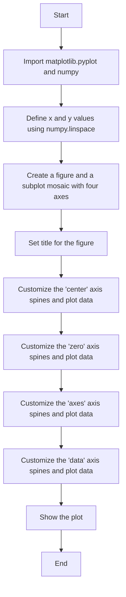

## 类结构

```
matplotlib.pyplot
├── np (numpy)
│   ├── linspace
│   └── sin
└── plt (matplotlib.pyplot)
    ├── subplot_mosaic
    ├── set_title
    ├── plot
    ├── spines
    │   ├── set_position
    │   └── set_visible
    └── show
```

## 全局变量及字段


### `x`
    
Array of x values for plotting.

类型：`numpy.ndarray`
    


### `y`
    
Array of y values for plotting.

类型：`numpy.ndarray`
    


### `fig`
    
The main figure object.

类型：`matplotlib.figure.Figure`
    


### `ax_dict`
    
Dictionary containing axes objects for each subplot.

类型：`dict`
    


### `matplotlib.pyplot.fig`
    
The main figure object from matplotlib.pyplot module.

类型：`matplotlib.figure.Figure`
    


### `matplotlib.pyplot.ax_dict`
    
Dictionary containing axes objects from matplotlib.pyplot module.

类型：`dict`
    


### `numpy.linspace`
    
Function to create an array of evenly spaced values.

类型：`numpy.ndarray`
    


### `numpy.sin`
    
Function to compute the sine of an array of values.

类型：`numpy.ufunc`
    


### `numpy.ndarray.x`
    
Array of x values for plotting.

类型：`numpy.ndarray`
    


### `numpy.ndarray.y`
    
Array of y values for plotting.

类型：`numpy.ndarray`
    


### `matplotlib.figure.Figure.fig`
    
The main figure object.

类型：`matplotlib.figure.Figure`
    


### `dict.ax_dict`
    
Dictionary containing axes objects for each subplot.

类型：`dict`
    


### `matplotlib.pyplot.matplotlib.pyplot.fig`
    
The main figure object from matplotlib.pyplot module.

类型：`matplotlib.figure.Figure`
    


### `matplotlib.pyplot.matplotlib.pyplot.ax_dict`
    
Dictionary containing axes objects from matplotlib.pyplot module.

类型：`dict`
    


### `numpy.numpy.linspace`
    
Function to create an array of evenly spaced values.

类型：`numpy.ndarray`
    


### `numpy.numpy.sin`
    
Function to compute the sine of an array of values.

类型：`numpy.ufunc`
    
    

## 全局函数及方法


### np.linspace

`np.linspace` 是 NumPy 库中的一个函数，用于生成线性空间。

参数：

- `start`：`float`，线性空间的起始值。
- `stop`：`float`，线性空间的结束值。
- `num`：`int`，生成的线性空间中的点的数量（不包括结束值）。

返回值：`numpy.ndarray`，包含线性空间中点的数组。

#### 流程图

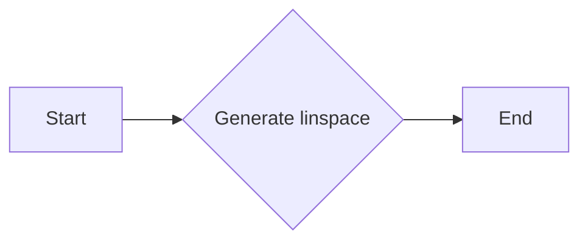

#### 带注释源码

```python
import numpy as np

# Generate a linear space from 0 to 2*pi with 100 points
x = np.linspace(0, 2*np.pi, 100)
```


### np.sin

计算输入数组中每个元素的正弦值。

参数：

- `x`：`numpy.ndarray`，输入数组，包含要计算正弦值的数值。

返回值：`numpy.ndarray`，包含输入数组中每个元素的对应正弦值。

#### 流程图

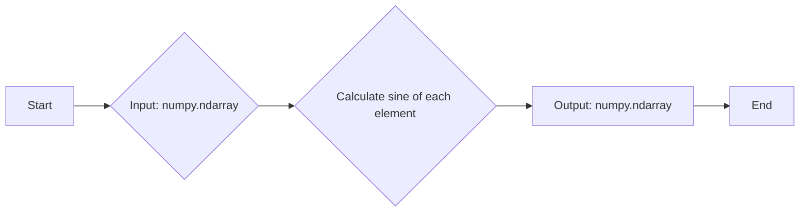

#### 带注释源码

```python
import numpy as np

def np_sin(x):
    """
    Calculate the sine of each element in the input array.

    Parameters:
    - x: numpy.ndarray, the input array containing the values for which to calculate the sine.

    Returns:
    - numpy.ndarray, an array containing the sine of each element in the input array.
    """
    return np.sin(x)
```


### plt.subplot_mosaic

`plt.subplot_mosaic` is a function used to create a mosaic of subplots in Matplotlib. It is used to arrange multiple subplots in a grid layout.

参数：

- `[[subplots]]`：`list of lists`，A list of lists where each sublist represents a row of subplots. Each subplot is defined by a string that specifies the subplot's name or identifier.

返回值：`fig, ax_dict`，`fig` is the figure object, and `ax_dict` is a dictionary mapping subplot identifiers to their corresponding axes objects.

#### 流程图

```mermaid
graph LR
A[Start] --> B{Input [[subplots]]}
B --> C{Create figure}
C --> D{Create axes based on input}
D --> E{Return fig and ax_dict}
E --> F[End]
```

#### 带注释源码

```python
fig, ax_dict = plt.subplot_mosaic(
    [['center', 'zero'],
     ['axes', 'data']]
)
```

In this example, the function is used to create a mosaic of subplots with two rows and two columns. The first row contains subplots named 'center' and 'zero', and the second row contains subplots named 'axes' and 'data'. The function returns the figure object `fig` and a dictionary `ax_dict` mapping the subplot identifiers to their corresponding axes objects.


### plt.set_title

设置图表标题。

参数：

- `title`：`str`，图表的标题文本。

返回值：`None`，没有返回值。

#### 流程图

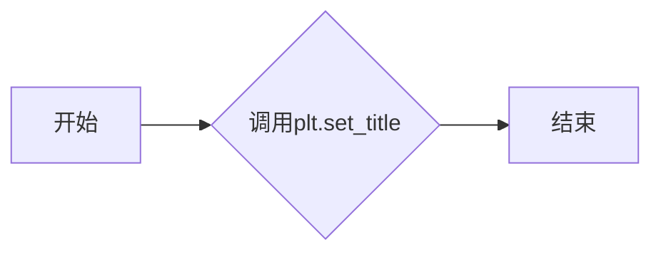

#### 带注释源码

```python
# 设置图表标题
ax.set_title("'center'")
```

这段代码中，`ax.set_title("'center'")` 调用 `set_title` 方法，将图表的标题设置为 "center"。`set_title` 方法接受一个字符串参数 `title`，该参数指定了图表的标题文本。在这个例子中，标题被设置为 "center"。由于 `set_title` 方法没有返回值，因此返回值类型为 `None`。


### plt.plot

`plt.plot` 是 Matplotlib 库中的一个函数，用于在二维坐标系中绘制线图。

参数：

- `x`：`numpy.ndarray` 或 `float`，表示 x 轴的数据点。
- `y`：`numpy.ndarray` 或 `float`，表示 y 轴的数据点。
- `fmt`：`str`，用于指定线型、颜色和标记的格式字符串。
- `**kwargs`：其他关键字参数，如 `label` 用于设置图例标签。

返回值：`Line2D` 对象，表示绘制的线。

#### 流程图

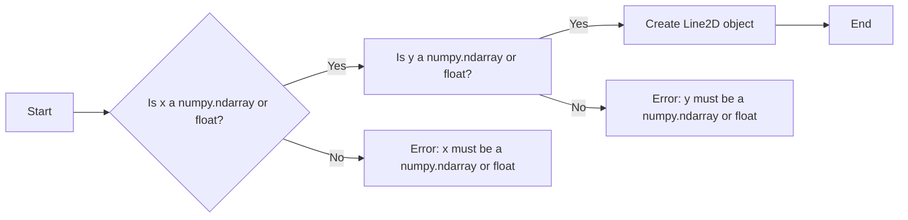

#### 带注释源码

```python
import numpy as np
import matplotlib.pyplot as plt

# ...

ax.plot(x, y)  # 绘制线图
```


### plt.subplot_mosaic

This function creates a mosaic of subplots using a dictionary where the keys are the names of the subplots and the values are lists of axes to be included in each subplot.

参数：

- `{subplot_names}`：`dict`，A dictionary where the keys are the names of the subplots and the values are lists of axes to be included in each subplot.
- ...

返回值：`fig`：`matplotlib.figure.Figure`，The figure containing the mosaic of subplots.

#### 流程图

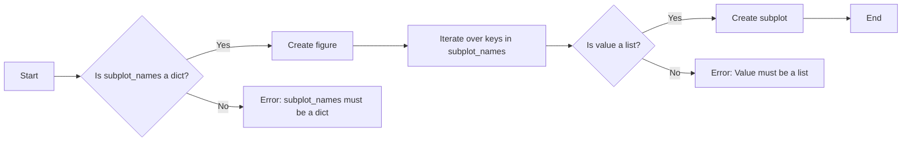

#### 带注释源码

```python
fig, ax_dict = plt.subplot_mosaic(
    [['center', 'zero'],
     ['axes', 'data']]
)
```


### ax.spines[['left', 'bottom']].set_position

This method sets the position of the spines for the specified axes. The position can be set to 'center', 'zero', or a tuple with the position as a fraction of the axes bounding box.

参数：

- `{spine_names}`：`list`，A list of spine names ('left', 'right', 'top', 'bottom').
- `{position}`：`str` or `tuple`，The position of the spines. It can be 'center', 'zero', or a tuple with the position as a fraction of the axes bounding box.

返回值：`None`，This method does not return a value.

#### 流程图

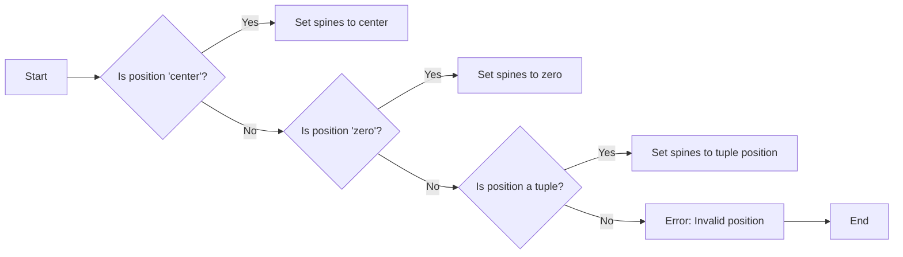

#### 带注释源码

```python
ax.spines[['left', 'bottom']].set_position('center')
```


### ax.spines[['top', 'right']].set_visible

This method sets the visibility of the spines for the specified axes. If set to `False`, the spines will not be visible.

参数：

- `{spine_names}`：`list`，A list of spine names ('left', 'right', 'top', 'bottom').
- `{visible}`：`bool`，Whether the spines should be visible.

返回值：`None`，This method does not return a value.

#### 流程图

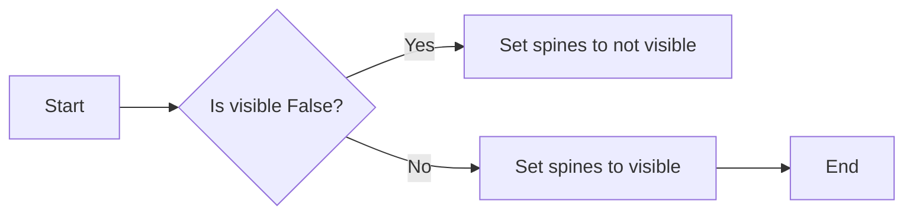

#### 带注释源码

```python
ax.spines[['top', 'right']].set_visible(False)
```


### ax.plot

This method plots y versus x as lines and/or markers.

参数：

- `{x}`：`array_like`，The x data.
- `{y}`：`array_like`，The y data.

返回值：`Line2D`，The line2d instance created by the plot.

#### 流程图


#### 带注释源码

```python
ax.plot(x, y)
```


### plt.show

This function displays the figure.

参数：无

返回值：无

#### 流程图


#### 带注释源码

```python
plt.show()
```


### 关键组件信息

- `matplotlib.pyplot`：用于创建和显示图形。
- `numpy`：用于数值计算。
- `matplotlib.figure.Figure`：matplotlib中的图形对象。
- `matplotlib.axes.Axes`：matplotlib中的轴对象。


### 潜在的技术债务或优化空间

- 代码中使用了硬编码的字符串和数值，这可能会降低代码的可维护性。
- 可以考虑使用配置文件或参数化输入来允许用户自定义图形的各个方面。
- 代码中没有使用异常处理，可能会在输入数据不正确时导致程序崩溃。


### 设计目标与约束

- 设计目标是创建一个简单的图形，展示不同轴的脊位置。
- 约束是使用matplotlib和numpy库。


### 错误处理与异常设计

- 代码中没有使用异常处理。
- 建议在输入数据不正确时添加异常处理，以避免程序崩溃。


### 数据流与状态机

- 数据流从numpy生成数据，然后通过matplotlib进行绘图。
- 状态机不是必需的，因为代码流程是线性的。


### 外部依赖与接口契约

- 代码依赖于matplotlib和numpy库。
- 接口契约由matplotlib和numpy库提供。


### plt.show()

显示当前图形。

参数：

- 无

返回值：无

#### 流程图

```mermaid
graph LR
A[开始] --> B{调用plt.show()}
B --> C[结束]
```

#### 带注释源码

```python
plt.show()
```


### matplotlib.pyplot.subplot_mosaic

创建一个子图网格，并返回一个字典，其中包含每个子图的轴对象。

参数：

- `subplot_spec`：`dict`，定义子图网格的规格，包括子图的位置和大小。
- `sharex`：`bool`，如果为 `True`，则所有子图共享 x 轴。
- `sharey`：`bool`，如果为 `True`，则所有子图共享 y 轴。
- `fig`：`matplotlib.figure.Figure`，可选，如果提供，则在该图上创建子图。

返回值：`dict`，包含每个子图的轴对象。

#### 流程图

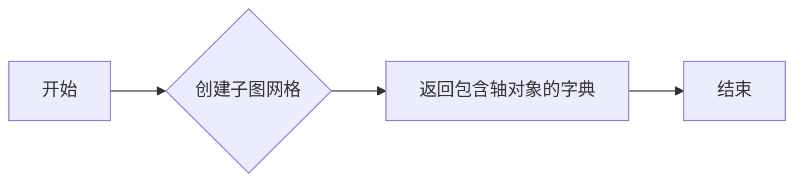

#### 带注释源码

```python
fig, ax_dict = plt.subplot_mosaic(
    [['center', 'zero'],
     ['axes', 'data']]
)
```


### ax.spines[['left', 'bottom']].set_position

设置轴的脊位置。

参数：

- `positions`：`str` 或 `tuple`，指定脊的位置。

返回值：无

#### 流程图

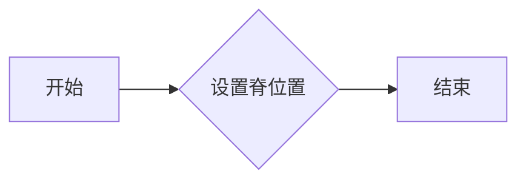

#### 带注释源码

```python
ax.spines[['left', 'bottom']].set_position('center')
```


### ax.spines[['top', 'right']].set_visible

设置轴的脊是否可见。

参数：

- `visible`：`bool`，指定脊是否可见。

返回值：无

#### 流程图

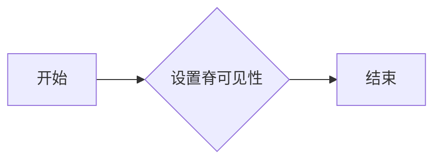

#### 带注释源码

```python
ax.spines[['top', 'right']].set_visible(False)
```


### ax.plot

在轴上绘制线条。

参数：

- `x`：`array_like`，x 坐标。
- `y`：`array_like`，y 坐标。
- `color`：`color`，线条颜色。
- `linewidth`：`float`，线条宽度。
- `linestyle`：`str`，线条样式。

返回值：`matplotlib.lines.Line2D`，线条对象。

#### 流程图

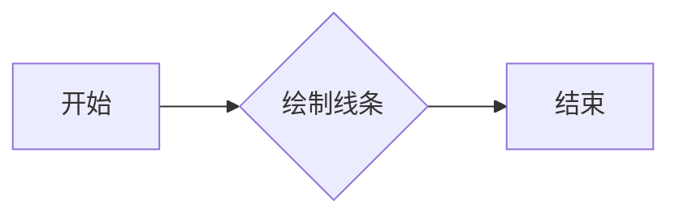

#### 带注释源码

```python
ax.plot(x, y)
```


### 关键组件信息

- `matplotlib.pyplot`：用于创建和显示图形。
- `numpy`：用于数值计算。
- `matplotlib.figure.Figure`：图形对象。
- `matplotlib.axes.Axes`：轴对象。

#### 一句话描述

matplotlib.pyplot.subplot_mosaic：创建一个子图网格，并返回一个字典，其中包含每个子图的轴对象。

#### 一句话描述

matplotlib.pyplot.show：显示当前图形。

#### 一句话描述

matplotlib.axes.Axes.spines[['left', 'bottom']].set_position：设置轴的脊位置。

#### 一句话描述

matplotlib.axes.Axes.spines[['top', 'right']].set_visible：设置轴的脊是否可见。

#### 一句话描述

matplotlib.axes.Axes.plot：在轴上绘制线条。

#### 潜在的技术债务或优化空间

- 代码中使用了硬编码的值，例如子图的位置和大小。可以考虑使用参数化来提高代码的灵活性。
- 代码中使用了多个 `ax` 对象，可以考虑使用更高级的图形布局技术，例如 `constrained_layout`。

#### 设计目标与约束

- 设计目标是创建一个图形，展示不同轴脊位置的效果。
- 约束是使用 matplotlib 库来创建图形。

#### 错误处理与异常设计

- 代码中没有显式的错误处理或异常设计。

#### 数据流与状态机

- 数据流：从 `np.linspace` 生成数据，然后绘制到图形中。
- 状态机：没有使用状态机。

#### 外部依赖与接口契约

- 代码依赖于 matplotlib 和 numpy 库。
- 接口契约：matplotlib 库的 API。
```


### plt.subplot_mosaic

`plt.subplot_mosaic` is a function used to create a mosaic of subplots in Matplotlib.

参数：

- `[[subplots]]`：`list of lists`，A list of lists where each sublist represents a row of subplots. Each subplot is defined by a string that specifies the subplot's name or a tuple of (subplot_name, position).

返回值：`fig, ax_dict`，`fig` is the figure object and `ax_dict` is a dictionary mapping subplot names to the corresponding axes objects.

#### 流程图

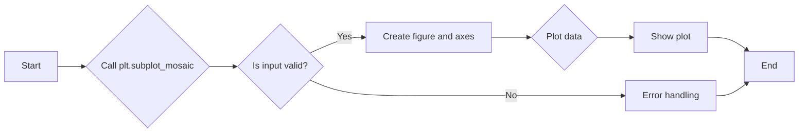

#### 带注释源码

```python
fig, ax_dict = plt.subplot_mosaic(
    [['center', 'zero'],
     ['axes', 'data']]
)
```

In this example, the function is used to create a mosaic of subplots with two rows and two columns. The first row contains subplots named 'center' and 'zero', and the second row contains subplots named 'axes' and 'data'. The function returns the figure object `fig` and a dictionary `ax_dict` mapping subplot names to the corresponding axes objects.


### matplotlib.pyplot.set_title

设置轴标题。

参数：

- `title`：`str`，标题文本
- `loc`：`str` 或 `int`，标题位置，默认为 'center'，可以是 'center'、'left'、'right'、'top'、'bottom' 或 'best'，或者是一个位置元组 (x, y)，其中 x 和 y 是介于 0 和 1 之间的值，表示相对于轴的相对位置。
- `pad`：`float`，标题与轴边缘的距离，默认为 5。
- `fontsize`：`float`，标题字体大小，默认为 10。
- `color`：`str` 或 `color`，标题颜色，默认为 'black'。
- `fontname`：`str`，标题字体名称，默认为 'sans-serif'。
- `fontweight`：`str`，标题字体粗细，默认为 'normal'。
- `verticalalignment`：`str`，垂直对齐方式，默认为 'bottom'。
- `horizontalalignment`：`str`，水平对齐方式，默认为 'left'。

返回值：`matplotlib.text.Text`，标题文本对象。

#### 流程图

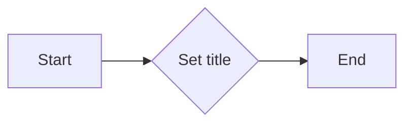

#### 带注释源码

```python
ax.set_title("'center'")
```

在这个例子中，`set_title` 方法被用来设置轴的标题为 "center"。这个方法没有返回值，因为它直接修改了轴对象 `ax` 的标题属性。


### matplotlib.pyplot.plot

matplotlib.pyplot.plot 是一个用于绘制二维数据的函数。

参数：

- `x`：`numpy.ndarray` 或 `float`，x轴的数据点。
- `y`：`numpy.ndarray` 或 `float`，y轴的数据点。
- ...

返回值：`matplotlib.lines.Line2D`，绘制的线对象。

#### 流程图

```mermaid
graph LR
A[Start] --> B[Call plot()]
B --> C{Is x a numpy.ndarray or float?}
C -- Yes --> D[Set x as input for plot()]
C -- No --> E[Convert x to numpy.ndarray]
E --> D
D --> F{Is y a numpy.ndarray or float?}
F -- Yes --> G[Set y as input for plot()]
F -- No --> H[Convert y to numpy.ndarray]
H --> G
G --> I[Return Line2D object]
I --> J[End]
```

#### 带注释源码

```python
import numpy as np
import matplotlib.pyplot as plt

# 假设以下代码块是 plot 函数的一部分
def plot(x, y, ...):
    # 检查 x 是否为 numpy.ndarray 或 float
    if isinstance(x, (np.ndarray, float)):
        # 如果是，则直接使用
        pass
    else:
        # 如果不是，则转换为 numpy.ndarray
        x = np.array(x)
    
    # 检查 y 是否为 numpy.ndarray 或 float
    if isinstance(y, (np.ndarray, float)):
        # 如果是，则直接使用
        pass
    else:
        # 如果不是，则转换为 numpy.ndarray
        y = np.array(y)
    
    # 绘制线并返回 Line2D 对象
    line = ...  # 绘制线
    return line
```


### matplotlib.pyplot.spines

matplotlib.pyplot.spines 是一个模块，它提供了对轴脊（spines）的配置和控制的接口。

参数：

- 无

返回值：`matplotlib.spines.SpineSet`，代表轴脊的集合。

#### 流程图

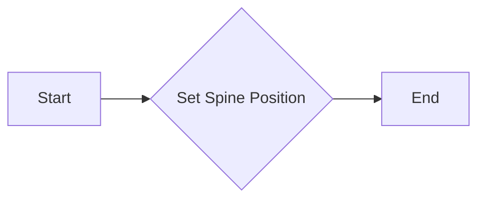

#### 带注释源码

```python
# 假设以下代码是matplotlib.pyplot模块的一部分

class SpineSet:
    def __init__(self, ax):
        self.ax = ax

    def set_position(self, position):
        # 设置脊的位置
        pass

    def set_visible(self, visibility):
        # 设置脊的可见性
        pass

# 假设以下代码是matplotlib.pyplot模块的一部分

def spines(ax=None):
    """
    Return the spine set for the given axes or the current axes if None.
    """
    if ax is None:
        ax = gca()
    return SpineSet(ax)

# 假设以下代码是matplotlib.pyplot模块的一部分

# 使用示例
ax = plt.gca()
sp = spines(ax)
sp.set_position('center')
sp.set_visible(False)
```

请注意，以上代码是假设性的，用于说明如何使用matplotlib.pyplot.spines模块。实际的实现可能有所不同。

### matplotlib.pyplot.gca()

matplotlib.pyplot.gca() 是一个全局函数，用于获取当前轴（Axes）对象。

参数：

- 无

返回值：`matplotlib.axes._subplots.AxesSubplot`，当前轴对象。

#### 流程图

```mermaid
graph LR
A[Start] --> B{Get Current Axes}
B --> C[End]
```

#### 带注释源码

```python
# 假设以下代码是matplotlib.pyplot模块的一部分

def gca():
    """
    Return the current Axes instance or None if there is no current Axes.
    """
    # 获取当前轴对象
    pass
```

请注意，以上代码是假设性的，用于说明如何使用matplotlib.pyplot.gca()函数。实际的实现可能有所不同。


### plt.show()

`plt.show()` 是 Matplotlib 库中的一个全局函数，用于显示当前图形窗口。

参数：

- 无

返回值：无

#### 流程图

```mermaid
graph LR
A[Start] --> B[Call plt.show()]
B --> C[End]
```

#### 带注释源码

```python
plt.show()  # 显示当前图形窗口
```


### 关键组件信息

- `matplotlib.pyplot`：Matplotlib 库的顶层模块，用于创建和显示图形。
- `plt.subplot_mosaic`：创建一个网格布局的子图。
- `ax.spines`：访问轴的边框（spines）。
- `ax.spines.set_position`：设置轴边框的位置。
- `ax.spines.set_visible`：设置轴边框的可见性。


### 潜在的技术债务或优化空间

- **代码重复**：在设置不同轴的边框位置时，存在代码重复。可以考虑使用循环或函数来减少重复。
- **性能优化**：如果图形窗口显示非常频繁，可以考虑优化图形的渲染过程，例如减少图形的复杂度或使用更高效的图形库。


### 设计目标与约束

- **设计目标**：创建一个图形窗口，显示不同轴边框的位置。
- **约束**：使用 Matplotlib 库，遵循库的API和设计规范。


### 错误处理与异常设计

- **错误处理**：在显示图形窗口时，如果出现异常（如图形库未正确安装），应提供清晰的错误信息。
- **异常设计**：使用 try-except 块来捕获和处理可能发生的异常。


### 数据流与状态机

- **数据流**：从 `np.linspace` 生成数据，通过 `ax.plot` 绘制图形，最后通过 `plt.show()` 显示图形。
- **状态机**：没有明确的状态机，但图形的创建和显示遵循一系列步骤。


### 外部依赖与接口契约

- **外部依赖**：Matplotlib 库和 NumPy 库。
- **接口契约**：遵循 Matplotlib 库的 API 和设计规范。

## 关键组件


### 张量索引与惰性加载

张量索引与惰性加载允许在数据结构中通过索引访问元素，而不需要立即加载整个数据集，从而提高内存效率和性能。

### 反量化支持

反量化支持允许在量化过程中将量化后的数据转换回原始数据，以便进行进一步的处理或分析。

### 量化策略

量化策略定义了如何将浮点数数据转换为固定点数表示，以减少模型大小和提高计算效率。


## 问题及建议


### 已知问题

-   **代码重复性**：在设置不同轴的spine位置时，存在大量的重复代码。每个轴的spine位置设置都是独立的，这可能导致维护困难。
-   **硬编码参数**：轴的位置设置使用了硬编码的参数，如`(0.2, 0.2)`和`(1, 2)`，这降低了代码的可读性和可维护性。
-   **缺乏异常处理**：代码中没有异常处理机制，如果matplotlib或其他依赖库发生错误，可能会导致程序崩溃。

### 优化建议

-   **使用函数封装**：创建一个函数来设置轴的spine位置，这样可以减少代码重复，并使代码更加模块化。
-   **参数化设置**：将轴的位置设置参数化，允许通过函数参数来指定位置，而不是硬编码。
-   **添加异常处理**：在关键操作周围添加异常处理，确保程序在遇到错误时能够优雅地处理异常，而不是直接崩溃。
-   **代码注释**：添加必要的注释，以提高代码的可读性和可维护性。
-   **单元测试**：编写单元测试来验证函数的正确性，确保代码更改不会破坏现有功能。


## 其它


### 设计目标与约束

- 设计目标：实现一个灵活的脊柱位置设置功能，允许用户根据需要调整matplotlib图表中轴的脊柱位置。
- 约束条件：必须使用matplotlib库进行绘图，且脊柱位置调整功能需与matplotlib的API兼容。

### 错误处理与异常设计

- 异常处理：确保在脊柱位置设置过程中，如果传入的参数类型或值不正确，能够抛出相应的异常。
- 错误日志：记录错误信息，以便于问题追踪和调试。

### 数据流与状态机

- 数据流：用户输入脊柱位置参数，通过matplotlib的API设置脊柱位置，最终生成图表。
- 状态机：无状态机设计，数据流直接从用户输入到图表输出。

### 外部依赖与接口契约

- 外部依赖：matplotlib库。
- 接口契约：matplotlib的轴（Axes）对象提供`set_position`方法用于设置脊柱位置。

### 安全性与权限

- 安全性：确保代码执行过程中不会泄露敏感信息。
- 权限：无特殊权限要求。

### 性能考量

- 性能目标：确保脊柱位置设置功能在正常使用场景下具有较好的性能。
- 性能优化：对频繁调用的方法进行性能优化。

### 可维护性与可扩展性

- 可维护性：代码结构清晰，易于理解和维护。
- 可扩展性：易于添加新的脊柱位置设置选项。

### 测试与验证

- 测试策略：编写单元测试和集成测试，确保功能的正确性和稳定性。
- 验证方法：通过实际使用场景验证功能的可用性。

### 文档与帮助

- 文档：提供详细的设计文档和用户手册。
- 帮助：提供在线帮助和示例代码。

### 用户界面与交互

- 用户界面：无用户界面，通过代码调用matplotlib图表功能。
- 交互设计：提供清晰的API文档，方便用户使用。

### 部署与维护

- 部署：将代码打包成可执行文件或库，方便用户安装和使用。
- 维护：定期更新代码，修复已知问题，添加新功能。


    