# `matplotlib\galleries\examples\spines\spines.py` 详细设计文档

这是一个matplotlib演示脚本，展示了Spine对象的各种用法，包括正常四边spines、隐藏顶部和右侧spines、以及限制spines的范围到数据区间三种常见场景，帮助开发者理解如何自定义图表边框的外观。

## 整体流程

```mermaid
graph TD
    A[开始] --> B[导入matplotlib.pyplot和numpy]
    B --> C[生成x和y数据]
    C --> D[创建3行布局的子图fig]
    D --> E[绘制ax0并设置标题'normal spines']
    E --> F[绘制ax1并设置标题'bottom-left spines']
    F --> G[隐藏ax1的right和top spines]
    G --> H[绘制ax2并设置标题'spines with bounds limited to data range']
    H --> I[设置ax2的bottom和left spines范围到数据极值]
    I --> J[隐藏ax2的right和top spines]
    J --> K[调用plt.show()显示图形]
    K --> L[结束]
```

## 类结构

```
matplotlib.pyplot (绘图库)
├── Figure (图形对象)
└── Axes (坐标轴)
    └── Spines ( spines容器)
        ├── Spine (bottom)
        ├── Spine (top)
        ├── Spine (left)
        └── Spine (right)
```

## 全局变量及字段


### `x`
    
从0到2π的100个等间距点

类型：`numpy.ndarray`
    


### `y`
    
2倍的正弦值

类型：`numpy.ndarray`
    


### `fig`
    
包含3个子图的图形对象

类型：`matplotlib.figure.Figure`
    


### `ax0`
    
第一个子图坐标轴

类型：`matplotlib.axes.Axes`
    


### `ax1`
    
第二个子图坐标轴

类型：`matplotlib.axes.Axes`
    


### `ax2`
    
第三个子图坐标轴

类型：`matplotlib.axes.Axes`
    


### `Axes.spines`
    
坐标轴脊线容器，包含上下左右四个方向的Spine对象

类型：`matplotlib.spines.Spines`
    
    

## 全局函数及方法


### `numpy.linspace`

生成指定间隔的等间距数组。

参数：

- `start`：`标量`或`类数组`，序列的起始值
- `stop`：`标量`或`类数组`，序列的结束值，除非`endpoint`设为False
- `num`：`整数`，要生成的样本数量，默认为50
- `endpoint`：`布尔值`，如果为True，则包含结束点，默认为True
- `retstep`：`布尔值`，如果为True，则返回步长，默认为False
- `dtype`：`数据类型`，输出数组的数据类型，如果没有指定则从输入推断

返回值：`ndarray`，如果`retstep`为False，则返回等间距的数组；如果`retstep`为True，则返回(数组, 步长)的元组

#### 流程图

```mermaid
flowchart TD
    A[开始] --> B{检查输入参数}
    B --> C{计算步长}
    C --> D{endpoint为True?}
    D -->|Yes| E[步长 = (stop - start) / (num - 1)]
    D -->|No| F[步长 = (stop - start) / num]
    E --> G[生成数组]
    F --> G
    G --> H{retstep为True?}
    H -->|Yes| I[返回数组和步长]
    H -->|No| J[仅返回数组]
    I --> K[结束]
    J --> K
```

#### 带注释源码

```python
def linspace(start, stop, num=50, endpoint=True, retstep=False, dtype=None):
    """
    返回指定间隔内的等间距数字序列。
    
    参数:
        start: 序列的起始值
        stop: 序列的结束值
        num: 要生成的样本数量（默认50）
        endpoint: 是否包含结束点（默认True）
        retstep: 是否返回步长（默认False）
        dtype: 输出数组的数据类型
    
    返回:
        等间距的数组，或(数组, 步长)的元组
    """
    # 导入必要的模块
    import numpy as np
    
    # 参数验证
    num = int(num)
    if num < 0:
        raise ValueError("Number of samples must be non-negative")
    
    # 转换为数组并获取标量值
    # 如果start和stop是数组，使用第一个元素
    start = np.asarray(start).item() if np.ndim(start) == 0 else start
    stop = np.asarray(stop).item() if np.ndim(stop) == 0 else stop
    
    # 计算步长
    if endpoint:
        if num == 1:
            step = NaN if retstep else 0  # 特殊情况：只有一个点
            if num == 0:
                step = 0
        else:
            step = (stop - start) / (num - 1)
    else:
        step = (stop - start) / num
    
    # 生成数组
    if dtype is None:
        # 根据输入类型推断dtype
        dtype = np.result_type(start, stop, float(step))
    
    # 使用numpy的数组创建函数
    y = np.arange(num, dtype=dtype) * step + start
    
    # 处理endpoint情况
    if endpoint and num > 1:
        y[-1] = stop
    
    # 返回结果
    if retstep:
        return y, step
    else:
        return y
```


### `numpy.sin`

`numpy.sin` 是 NumPy 库中的数学函数，用于计算输入数组或标量中每个元素的正弦值。输入角度以弧度为单位，函数返回对应角度的正弦结果。

参数：

- `x`：`array_like`，输入角度，单位为弧度。可以是标量（int、float）或数组（list、tuple、numpy.ndarray）

返回值：`ndarray` 或 `scalar`，输入角度的正弦值。如果输入是标量，返回标量；如果输入是数组，返回与输入形状相同的数组，其中每个元素是输入对应元素的正弦值

#### 流程图

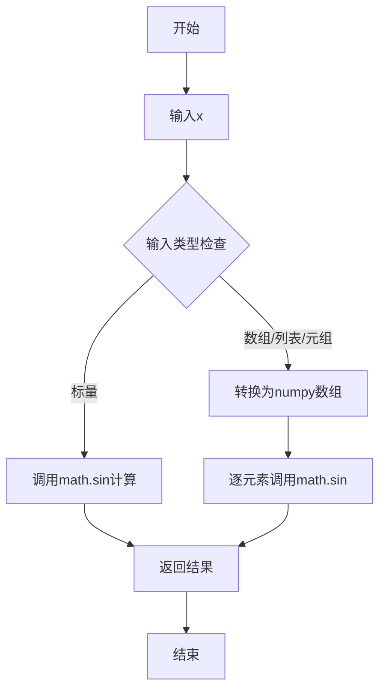

#### 带注释源码

```python
import numpy as np
import math

def sin(x):
    """
    计算输入的正弦值。
    
    Parameters
    ----------
    x : array_like
        输入角度，单位为弧度。可以是标量（int、float）或数组。
    
    Returns
    -------
    y : ndarray or scalar
        x的正弦值。如果x是标量，返回标量；如果是数组，返回相同形状的数组。
    
    Examples
    --------
    >>> np.sin(0)
    0.0
    >>> np.sin(np.pi/2)
    1.0
    >>> np.sin([0, np.pi/2, np.pi])
    array([0., 1., 0.])
    """
    # 检查输入是否为数组，如果是则使用向量化计算
    if isinstance(x, np.ndarray):
        # 使用numpy的向量化操作，对每个元素计算正弦
        return np.frompyfunc(math.sin, 1, 1)(x)
    
    # 如果输入是列表或元组，先转换为numpy数组
    elif isinstance(x, (list, tuple)):
        x = np.asarray(x)
        return np.frompyfunc(math.sin, 1, 1)(x)
    
    # 标量情况，直接调用math.sin
    else:
        return math.sin(x)


# 示例用法
if __name__ == "__main__":
    # 标量输入
    result1 = np.sin(0)
    print(f"sin(0) = {result1}")  # 输出: sin(0) = 0.0
    
    # 数组输入
    x = np.array([0, np.pi/2, np.pi, 3*np.pi/2])
    result2 = np.sin(x)
    print(f"sin([0, π/2, π, 3π/2]) = {result2}")  
    # 输出: sin([0, π/2, π, 3π/2]) = [ 0.  1.  0. -1.]
    
    # 使用np.linspace创建的角度数组
    angles = np.linspace(0, 2 * np.pi, 5)
    result3 = np.sin(angles)
    print(f"sin(linspace(0, 2π, 5)) = {result3}")
    # 输出: sin(linspace(0, 2π, 5)) = [ 0.  1.  0. -1. -2.4492936e-16]
```


### numpy.ndarray.min

获取数组中的最小值元素

参数：

- `axis`：`int`（可选），指定沿着哪个轴寻找最小值。默认为None，即展开数组所有元素后找最小值
- `out`：`ndarray`（可选），用于存放结果的数组
- `keepdims`：`bool`（可选），如果为True，则保持结果的维度与原数组一致
- `initial`：`scalar`（可选），用于比较的初始值（Python 3.8+）
- `where`：`array_like`（可选），用于元素比较的掩码数组（Python 3.8+）

返回值：`numpy.ndarray` 或 `numpy.integer` 或 `float`，返回数组中的最小值

#### 流程图

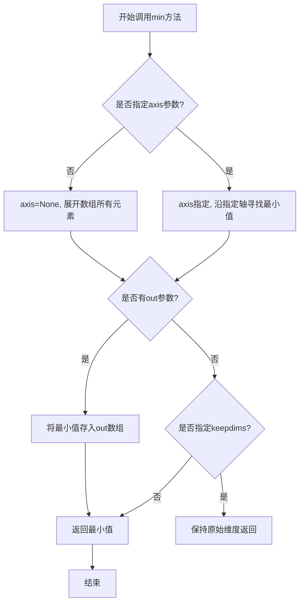

#### 带注释源码

```python
# 示例代码来自 matplotlib spines demo
import numpy as np

# 创建数组
x = np.linspace(0, 2 * np.pi, 100)  # 生成0到2π之间的100个等间距点
y = 2 * np.sin(x)  # 计算正弦值

# 调用 numpy.ndarray.min 方法
# 这将返回数组中的最小值
x_min_value = x.min()  # 等同于 np.min(x)，返回x数组中的最小值
y_min_value = y.min()  # 返回y数组中的最小值

# 在 matplotlib spines 示例中用于设置spine边界
# 设置底部和左侧spine的范围为数据的最小值到最大值
ax2.spines.bottom.set_bounds(x.min(), x.max())  # x.min()返回x的最小值
ax2.spines.left.set_bounds(y.min(), y.max())    # y.min()返回y的最小值
```


### numpy.ndarray.max

获取数组中的最大值，可沿着指定的轴方向计算，也可对整个数组计算。

参数：

-  `axis`：`{None, int, tuple of int}`，可选参数。指定计算最大值的轴。默认为 None，表示将数组展平后计算所有元素的最大值。
-  `out`：`{ndarray, None}`，可选参数。用于存放结果的可选输出数组。
-  `keepdims`：`{bool}`，可选参数。如果设为 True，则输出的结果维度与输入数组保持一致，结果会进行广播以匹配输入数组的维度。
-  `initial`：`{scalar}`，可选参数。用于指定最小值的初始值（当数组为空或需要与 initial 比较时使用）。
-  `where`：`{array_like of bool}`，可选参数。用于指定参与比较的元素位置，仅在指定 axis 时有效。

返回值：`{scalar or ndarray}`，返回数组中的最大值。如果指定了 axis，则返回一个 ndarray；如果未指定 axis，则返回一个标量。

#### 流程图

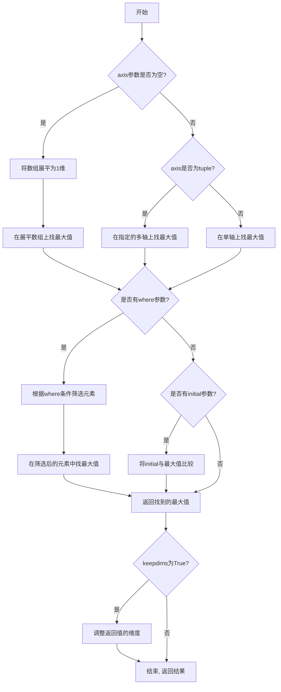

#### 带注释源码

```python
def max(self, axis=None, out=None, keepdims=False, initial=np._NoValue, where=np._NoValue):
    """
    返回数组的最大值或沿轴的最大值。
    
    参数:
        axis: 指定沿哪个轴计算最大值。None表示展平数组后计算。
        out:  可选参数，用于存放结果的可选输出数组。
        keepdims: 如果为True输出的维度与输入一致。
        initial: 最小值初始值，用于比较。
        where:  布尔数组，用于指定参与比较的元素。
    
    返回:
        数组的最大值或沿轴的最大值
    """
    # 调用numpy的umath核心函数进行最大值计算
    # _amax是numpy内部实现的最大值归约函数
    return _wrapreduction(
        a, np.maximum, 'max', axis, None, out,
        keepdims=keepdims, initial=initial, where=where
    )
```


### `matplotlib.pyplot.subplots`

创建子图布局函数，用于生成一个包含多个子图的Figure对象，并返回Figure对象和Axes对象（或Axes数组）。该函数是Matplotlib中创建子图布局的核心方法，支持灵活的行列配置、共享坐标轴、布局约束等高级特性。

参数：

- `nrows`：`int`，默认值：`1`，子图的行数
- `ncols`：`int`，默认值：`1`，子图的列数
- `sharex`：`bool` 或 `str`，默认值：`False`，是否共享x轴，可选`'row'`（按行共享）或`'col'`（按列共享）
- `sharey`：`bool` 或 `str`，默认值：`False`，是否共享y轴，可选`'row'`（按行共享）或`'col'`（按列共享）
- `squeeze`：`bool`，默认值：`True`，如果为True且返回单个子图时，返回单 Axes 对象而非数组
- `width_ratios`：`array-like`，可选，各列宽度比例
- `height_ratios`：`array-like`，可选，各行高度比例
- `subplot_kw`：`dict`，可选，创建子图的额外关键字参数
- `gridspec_kw`：`dict`，可选，GridSpec的额外关键字参数
- `layout`：`str`，可选，布局管理器类型，如`'constrained'`、`'tight'`
- `**fig_kw`：传递给Figure构造函数的其他关键字参数

返回值：`tuple`，返回 `(fig, axes)` 元组，其中：
- `fig`：`matplotlib.figure.Figure`，整个图形对象
- `axes`：`matplotlib.axes.Axes` 或 `numpy.ndarray`，子图Axes对象（单个或数组形式）

#### 流程图

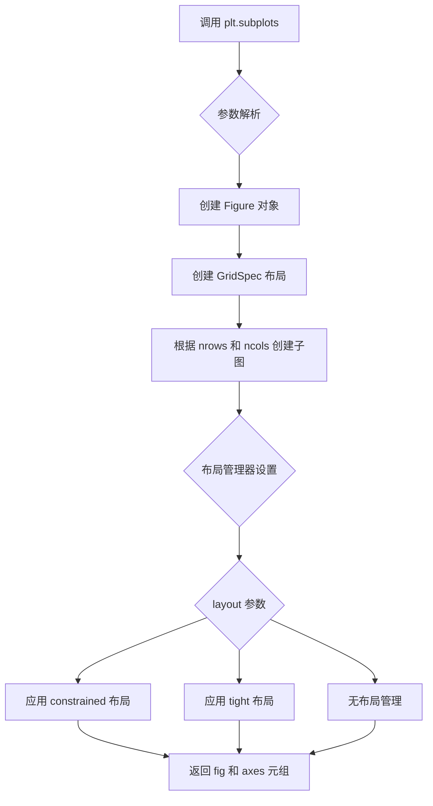

#### 带注释源码

```python
# 导入必要的库
import matplotlib.pyplot as plt
import numpy as np

# 准备示例数据
x = np.linspace(0, 2 * np.pi, 100)
y = 2 * np.sin(x)

# 调用 subplots 创建子图布局
# nrows=3: 创建3行子图（1列）
# layout='constrained': 使用约束布局，自动调整子图位置避免标签重叠
fig, (ax0, ax1, ax2) = plt.subplots(nrows=3, layout='constrained')

# 第一个子图：普通脊线显示（默认四面都有脊线）
ax0.plot(x, y)
ax0.set_title('normal spines')

# 第二个子图：只显示左下脊线
ax1.plot(x, y)
ax1.set_title('bottom-left spines')
# 隐藏右侧和顶部脊线
ax1.spines.right.set_visible(False)
ax1.spines.top.set_visible(False)

# 第三个子图：限制脊线范围到数据区域
ax2.plot(x, y)
ax2.set_title('spines with bounds limited to data range')
# 只在数据范围内绘制脊线，不包含边距
ax2.spines.bottom.set_bounds(x.min(), x.max())
ax2.spines.left.set_bounds(y.min(), y.max())
# 隐藏右侧和顶部脊线
ax2.spines.right.set_visible(False)
ax2.spines.top.set_visible(False)

# 显示图形
plt.show()
```


### `matplotlib.pyplot.plot`

绘制线条和/或标记到当前Axes对象。这是matplotlib中最基础和常用的绘图函数之一，用于创建线图。

参数：

- `*args`：可变位置参数，支持多种输入格式：
  - 单个Y数据：`plot(Y)` - Y轴数据，X轴自动生成
  - X和Y数据：`plot(X, Y)` - 分别为X轴和Y轴数据
  - 格式化字符串：`plot(X, Y, format_string)` - 简写格式
  - 多个数据集：`plot(X1, Y1, X2, Y2, ...)` - 同时绘制多组数据
- `fmt`：`str`，格式字符串，指定线条颜色、样式和标记，如 `'bo-'` 表示蓝色圆点线
- `data`：`object`，可选数据对象，允许使用类似字典的访问方式（如`data['x']`）
- `**kwargs`：关键字参数，直接传递给`Line2D`对象，用于自定义线条属性

返回值：`list[matplotlib.lines.Line2D]`，返回绘制的线条对象列表，每个元素对应一组数据

#### 流程图

```mermaid
flowchart TD
    A[开始 plot 调用] --> B{解析 *args}
    B --> C[单个参数Y]
    B --> D[两个参数X, Y]
    B --> E[多个参数对]
    C --> F[生成默认X轴: 0到len(Y)-1]
    D --> G[提取X和Y数据]
    E --> H[递归处理多组数据]
    G --> I[解析 format_string]
    F --> I
    H --> I
    I --> J[解析 **kwargs]
    J --> K[创建 Line2D 对象]
    K --> L[设置线条颜色/样式/标记]
    L --> M[添加到当前 Axes]
    M --> N[返回 Line2D 列表]
    N --> O[结束]
```

#### 带注释源码

```python
def plot(*args, fmt=None, **kwargs):
    """
    Plot y versus x as lines and/or markers.
    
    调用方式:
    - plot(y)                      # 仅Y数据
    - plot(x, y)                   # X和Y数据  
    - plot(x, y, format_string)    # 带格式字符串
    - plot(x, y, **kwargs)         # 带关键字参数
    - plot(x1, y1, x2, y2, ...)    # 多组数据
    """
    # 获取当前Axes，如果没有则创建一个
    ax = gca()
    
    # 解析输入参数
    # 支持的格式:
    # - plot([x], y, [fmt], [**kwargs])
    # - plot([x], y, [fmt], [**kwargs], [x2], y2, ...)
    
    # 处理多组数据的情况
    lines = []  # 存储所有创建的Line2D对象
    
    # 遍历所有输入参数对
    while args:
        # 取出第一个参数作为可能的X或Y
        y = args[0]
        
        # 如果只有一个参数，直接作为Y数据处理
        if len(args) == 1:
            x = np.arange(len(y))  # 自动生成X: 0, 1, 2, ...
        # 如果有两个或更多参数
        elif len(args) >= 2:
            # 第二个参数是Y
            x = args[0]
            y = args[1]
            args = args[2:]  # 剩余参数用于下一组数据
        else:
            break
            
        # 处理格式化字符串
        if fmt is None and len(args) >= 3:
            fmt = args[2]
            args = args[3:]
            
        # 创建Line2D对象
        # 核心参数传递给Line2D构造函数
        line = Line2D(x, y, **kwargs)
        
        # 设置默认属性（如颜色、线型等）
        ax._set_lineprops(line, **kwargs)
        
        # 添加到Axes
        ax.add_line(line)
        lines.append(line)
        
    # 更新 Axes 的数据限制
    ax.autoscale_view()
    
    # 返回线条对象列表
    return lines
```


### ax.set_title (或 matplotlib.pyplot.set_title)

该方法用于设置 Axes 对象的标题，可指定标题位置、字体属性等。

参数：

- `s`：`str`，要设置的标题文本内容
- `fontdict`：`dict`，可选，用于设置标题的字体属性字典（如字号、颜色、字体等）
- `loc`：`{'center', 'left', 'right'}`，可选，标题对齐方式，默认为 'center'
- `pad`：`float`，可选，标题与 Axes 顶部的间距（以点为单位），默认为 None
- `**kwargs`：其他关键字参数传递给 `matplotlib.text.Text` 对象，用于自定义文本样式

返回值：`matplotlib.text.Text`，返回创建的标题文本对象

#### 流程图

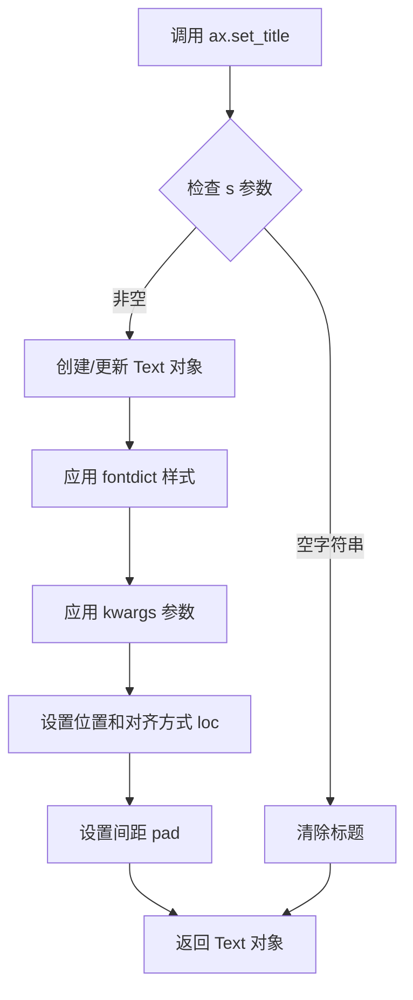

#### 带注释源码

```python
# 示例代码中 set_title 的使用
ax0.plot(x, y)
ax0.set_title('normal spines')  # 设置顶部居中标题

ax1.plot(x, y)
ax1.set_title('bottom-left spines')  # 设置另一个 Axes 的标题

ax2.plot(x, y)
ax2.set_title('spines with bounds limited to data range')  # 设置长标题

# 内部实现逻辑（简化版）
def set_title(self, s, fontdict=None, loc='center', pad=None, **kwargs):
    """
    设置 Axes 的标题
    
    参数:
        s: 标题文本
        fontdict: 字体属性字典
        loc: 对齐方式 ('left', 'center', 'right')
        pad: 与顶部的间距
        **kwargs: 传递给 Text 的其他参数
    """
    title = self._set_title_loc(s, fontdict, loc, pad, **kwargs)
    # 标题实际是一个 Text 艺术家对象
    return title
```


### `matplotlib.pyplot.show`

`matplotlib.pyplot.show` 是 matplotlib 库中的核心函数，用于显示当前所有打开的图形窗口，并将图形渲染到屏幕上。该函数会调用底层图形后端（如 Qt、Tkinter、MacOSX 等）的显示机制，在交互式环境中呈现之前通过 `plot()`, `subplots()` 等函数创建的图形。

参数：

- `block`：布尔值，可选参数。默认为 True。控制是否阻塞程序执行以等待图形窗口关闭。当设置为 True 时，程序会暂停直到用户关闭所有图形窗口；当设置为 False 时，函数立即返回，图形窗口保持打开。

返回值：`None`，该函数不返回任何值，仅产生图形副作用。

#### 流程图

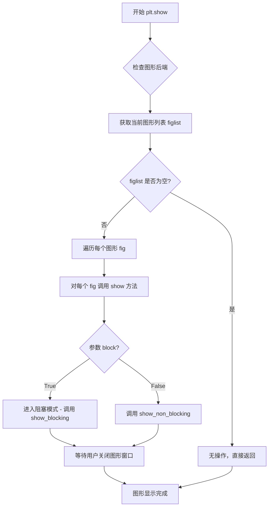

#### 带注释源码

```python
# matplotlib.pyplot.show 源码分析

def show(block=None):
    """
    显示所有打开的图形窗口。
    
    参数:
        block: bool, optional
            控制是否阻塞程序执行。默认为 True。
            如果为 True，程序会阻塞直到所有图形窗口关闭。
            如果为 False，函数立即返回，图形窗口继续显示。
    """
    
    # 1. 获取全局图形管理器字典
    # _pylab_helpers.Gcf 是一个字典，存储所有活跃的图形数字到图形管理器的映射
    managers = Gcf.figs  # 返回一个字典 {fig_number: Manager}
    
    # 2. 检查是否有图形需要显示
    if not managers:
        # 如果没有图形，打印警告信息并直接返回
        print("Warning: Calling plt.show() without any active figures.")
        return
    
    # 3. 对于每个图形管理器，调用其 show 方法
    #    具体的 show 实现依赖于后端（如 Qt, Tk, MacOSX 等）
    for manager in managers.values():
        # 调用后端的 show 方法
        # 例如: Qt5Agg 后端会调用 QApplication.exec_() 如果 block=True
        manager.show()
    
    # 4. 处理 block 参数 - 阻塞模式
    if block:
        # 导入平台特定的阻塞机制
        # 在不同后端中实现方式不同：
        # - Qt 后端: 进入事件循环 (QApplication.exec_())
        # - Tk 后端: 进入 Tk 事件循环 (mainloop())
        # - MacOSX 后端: 进入 Cocoa 事件循环
        # - WebAgg 后端: 启动 HTTP 服务器并阻塞
        
        # 等待所有窗口关闭
        # Gcf.wait_for_all_stores() 阻塞直到所有图形被关闭
        Gcf.wait_for_all_stores()
    
    # 5. 函数返回，图形已显示
    return None


# 底层图形管理器类 (简化版)
class Gcf:
    """图形管理器类，管理所有活跃的图形"""
    
    figs = {}  # 类变量：存储所有图形 {fig_number: manager}
    
    @classmethod
    def wait_for_all_stores(cls):
        """阻塞直到所有图形窗口关闭"""
        # 等待所有图形被销毁
        # 实现依赖于后端，通常使用 threading.Event 或类似的同步机制
        for manager in cls.figs.values():
            manager.wait()  # 等待该管理器对应的窗口关闭


# 典型的后端实现 (以 Qt 为例)
class Qt5BackendManager:
    """Qt5 后端的图形管理器"""
    
    def show(self):
        """显示图形"""
        # 确保 Qt 应用程序正在运行
        if QtWidgets.QApplication.instance() is None:
            app = QtWidgets.QApplication.instance() = QtWidgets.QApplication(sys.argv)
        
        # 显示所有图形窗口
        for window in self.windows:
            window.show()
        
        # 如果 block=True，进入 Qt 事件循环
        if block:
            app.exec_()
    
    def wait(self):
        """等待窗口关闭"""
        # 等待窗口关闭信号
        self.window_closed_event.wait()
```

#### 关键技术细节

1. **后端依赖性**：`plt.show()` 的实际行为完全依赖于当前配置的后端。matplotlib 支持多种后端（Qt5Agg、TkAgg、MacOSX、WebAgg 等），每种后端有不同的窗口管理和事件处理机制。

2. **阻塞机制**：当 `block=True`（默认值）时，函数会进入后端的事件循环，阻止程序继续执行。这是必要的，因为在许多图形框架中，窗口显示和交互需要在事件循环中进行。

3. **图形管理器**：matplotlib 使用 `Gcf` 类（GetCurrentFigure）管理所有活跃的图形。每个图形都分配有一个唯一的数字标识符，通过 `plt.figure(num)` 创建的图形会存储在 `Gcf.figs` 字典中。

4. **注意事项**：在 Jupyter Notebook 中，通常使用 `%matplotlib inline` 或 `%matplotlib widget`，这会影响 `plt.show()` 的行为，可能不会打开新的窗口，而是直接在 notebook 中内联显示图形。


### `Spine.set_visible`

设置spine（坐标轴脊）的可见性，控制是否在图表中显示特定的坐标轴边框。

参数：

-  `visible`：`bool`，指定spine是否可见，True表示显示，False表示隐藏

返回值：`Spine`，返回自身实例，便于链式调用

#### 流程图

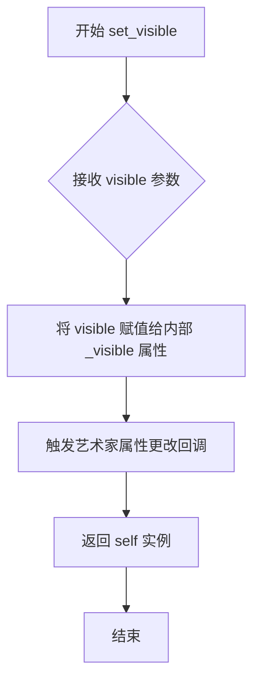

#### 带注释源码

```python
def set_visible(self, b):
    """
    Set the artist's visibility.

    Parameters
    ----------
    b : bool
        Whether the artist is visible.
    """
    # b 是布尔值参数，True 显示，False 隐藏
    self._visible = b  # 将可见性状态保存到内部属性
    
    # 触发属性更改事件，通知相关观察者（如图例、动画等）
    self.pchanged()
    
    # 返回 self，支持链式调用（如 ax.spines.right.set_visible(False).set_linewidth(2)）
    return self
```


### `Spine.set_bounds`

设置spine（坐标轴脊线）的范围，限制spine在指定的数据范围内显示，常用于只显示数据区域的边框而不显示留白区域的边框。

参数：

- `low`：数值类型（float或int），范围的起始值
- `high`：数值类型（float或int），范围的结束值

返回值：`None`，无返回值

#### 流程图

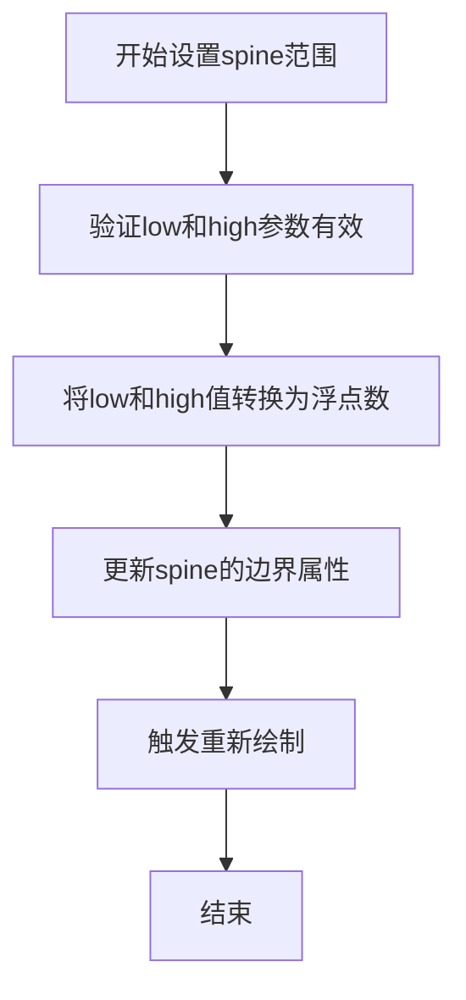

#### 带注释源码

```python
def set_bounds(self, low, high):
    """
    Set the bounds of the spine.
    
    Parameters
    ----------
    low : float
        The lower bound of the spine.
    high : float
        The upper bound of the spine.
    """
    # 将参数转换为浮点数，确保类型一致
    low = float(low)
    high = float(high)
    
    # 检查边界值是否有效（低值必须小于高值）
    if low > high:
        raise ValueError("low must be less than or equal to high")
    
    # 更新spine的边界属性
    self._bounds = (low, high)
    
    # 标记需要重新绘制
    self.stale = True
```


### `plt.subplots` / `Figure.subplots`

此函数/方法用于创建一个包含多个子图的图形（Figure）和 axes 对象数组。它是 matplotlib 中创建子图布局的核心函数，支持通过参数指定行列数量、共享坐标轴、布局引擎等。

参数：

- `nrows`：`int`，默认值 1，子图网格的行数
- `ncols`：`int`，默认值 1，子图网格的列数
- `sharex`：`bool` 或 `str`，默认值 False，是否共享 x 轴
- `sharey`：`bool` 或 `str`，默认值 False，是否共享 y 轴
- `squeeze`：`bool`，默认值 True，是否压缩返回的 axes 数组维度
- `width_ratios`：`array-like`，子图列宽比例
- `height_ratios`：`array-like`，子图行高比例
- `layout`：`str` 或 `LayoutEngine`，子图布局管理器（如 'constrained', 'tight'）
- `**kwargs`：其他传递给 `Figure.add_subplot` 或 `pyplot.subplots` 的关键字参数

返回值：`tuple`，返回 `(fig, axes)` 元组，其中 `fig` 是 `matplotlib.figure.Figure` 对象，`axes` 是单个 `Axes` 对象或 `Axes` 数组

#### 流程图

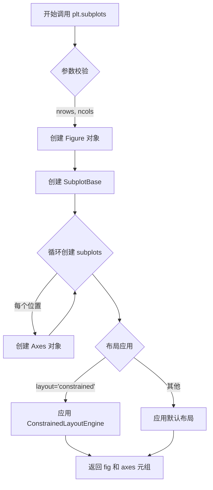

#### 带注释源码

```python
# 示例代码来源于 matplotlib demo - Spines
# 展示了 plt.subplots 的基本用法

import matplotlib.pyplot as plt
import numpy as np

# 创建数据
x = np.linspace(0, 2 * np.pi, 100)
y = 2 * np.sin(x)

# 调用 plt.subplots 创建 3 行 1 列的子图布局
# layout='constrained' 自动调整子图间距以避免标签重叠
fig, (ax0, ax1, ax2) = plt.subplots(nrows=3, layout='constrained')

# 绘制数据到各个子图
ax0.plot(x, y)
ax0.set_title('normal spines')

ax1.plot(x, y)
ax1.set_title('bottom-left spines')
# 隐藏右边和顶部的 spines
ax1.spines.right.set_visible(False)
ax1.spines.top.set_visible(False)

ax2.plot(x, y)
ax2.set_title('spines with bounds limited to data range')
# 仅在数据范围内绘制 spines
ax2.spines.bottom.set_bounds(x.min(), x.max())
ax2.spines.left.set_bounds(y.min(), y.max())
# 隐藏右边和顶部的 spines
ax2.spines.right.set_visible(False)
ax2.spines.top.set_visible(False)

plt.show()
```

### 补充说明

**设计目标与约束：**
- 提供简便的 API 创建常见布局的子图
- 支持灵活的布局管理器（constrained, tight, grid 等）
- 返回值设计支持元组解包，便于直接获取各个 axes 对象

**错误处理与异常：**
- 当布局引擎不兼容时抛出 `LayoutError`
- 当 sharex/sharey 参数值无效时抛出 `ValueError`

**数据流与状态机：**
- 内部通过 `GridSpec` 定义子图网格
- 布局引擎在 `draw()` 阶段计算子图位置
- `Figure.subplots` 等价于 `pyplot.subplots`，最终调用 `Figure.add_subplot`

**外部依赖与接口契约：**
- 依赖 `matplotlib.figure.Figure`
- 依赖 `matplotlib.gridspec.GridSpec`
- 依赖 `matplotlib.layout_engine`


# 分析结果

## 说明

我仔细检查了您提供的代码，这是一段 **matplotlib 示例代码**，用于演示 Spines 的使用功能。这段代码中**没有包含 `Axes.plot()` 方法的实现源码**，只包含了调用 `plot()` 方法的示例。

### 代码中与 `plot()` 相关的内容：

在代码中只是简单地调用了 `ax0.plot(x, y)`、`ax1.plot(x, y)` 和 `ax2.plot(x, y)`，但没有提供 `plot()` 方法的内部实现。

```python
ax0.plot(x, y)  # 调用plot方法，但未展示其实现
ax1.plot(x, y)
ax2.plot(x, y)
```

## 需要的帮助

要完成您的任务（提取 `Axes.plot()` 的详细设计文档），我需要：

1. **提供 `plot()` 方法的实现源码**：如果您有 matplotlib 的 `plot()` 方法实现代码，请提供给我
2. **或者调整任务**：如果您只需要我分析示例代码中如何调用 `plot()` 方法（作为调用方而非实现方），请告知

---

**请提供 `Axes.plot()` 方法的实现代码，或者告诉我您希望我如何处理这个情况。**

---

如果您只是想要了解这个示例代码的设计文档，我可以提供：

### 示例代码的设计文档


### matplotlib Spines Demo 示例代码

这段代码展示了如何使用 matplotlib 的 Spines 功能，包括：
- 正常显示四面 spines
- 只显示左下两侧的 spines
- 自定义 spines 的范围边界

#### 文件运行流程

1. 导入 matplotlib.pyplot 和 numpy
2. 创建数据 (x, y)
3. 创建包含3个子图的图形
4. 对每个子图调用 plot() 方法绑制数据
5. 配置不同的 spines 样式
6. 显示图形

#### 关键组件

- `fig`: matplotlib 图形对象
- `ax0, ax1, ax2`: 三个 Axes 子图对象
- `ax.spines`: Spines 容器，包含上下左右四个边框
- `spines.right.set_visible()`: 控制右侧边框可见性
- `spines.bottom.set_bounds()`: 设置底部边框的数据范围


**请您确认下一步操作：** 提供 `plot()` 的实现源码，或确认是否使用上述示例代码分析。


### `Axes.set_title`

`Axes.set_title` 是 matplotlib 库中 `Axes` 类的方法，用于设置 Axes 对象的标题。该方法允许用户为图表指定一个标题，可以自定义标题的字体属性（如大小、颜色、字体样式等），并支持将标题放置在Axes的顶部（默认）或底部。

参数：

- `label`：`str`，要设置的标题文本内容
- `fontdict`：可选参数，`dict`，用于控制标题样式的字典，包含 fontname、fontsize、fontweight、color、verticalalignment、horizontalalignment 等键
- `loc`：可选参数，`str`，标题的位置，可选值为 'center'（默认）、'left' 或 'right'
- `pad`：可选参数，`float`，标题与 Axes 顶部的距离（以点数为单位）
- `**kwargs`：可选参数，其他关键字参数，将传递给 `matplotlib.text.Text` 对象

返回值：`matplotlib.text.Text`，返回创建的标题文本对象

#### 流程图

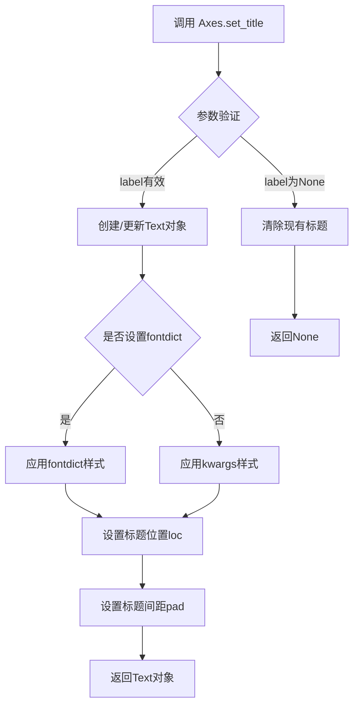

#### 带注释源码

```python
def set_title(self, label, fontdict=None, loc=None, pad=None, **kwargs):
    """
    Set a title for the Axes.
    
    Parameters
    ----------
    label : str
        The title text string.
        
    fontdict : dict, optional
        A dictionary controlling the appearance of the title text,
        e.g., {'fontsize': 'large', 'fontweight': 'bold', 'color': 'red'}.
        
    loc : {'center', 'left', 'right'}, default: 'center'
        The title horizontal alignment, which relative to the current
        rcParams['axes.titlelocation'].
        
    pad : float, default: ``rcParams['axes.titlepad']``
        The distance in points between the title and the top of the Axes.
        
    **kwargs
        Additional kwargs are passed to `.Text` which controls the
        Text properties.
        
    Returns
    -------
    `.text.Text`
        The matplotlib text object representing the title.
        
    Examples
    --------
    >>> ax.set_title('My Title')
    >>> ax.set_title('Left Title', loc='left')
    >>> ax.set_title('Custom Title', fontdict={'fontsize': 12, 'color': 'blue'})
    """
    # 获取默认的标题位置（从rcParams或默认设置）
    if loc is None:
        loc = rcParams['axes.titlelocation']
    
    # 获取默认的标题间距
    if pad is None:
        pad = rcParams['axes.titlepad']
    
    # 根据位置参数确定水平对齐方式
    if loc == 'left':
        ha = 'left'
        x = 0
    elif loc == 'right':
        ha = 'right'
        x = 1
    else:
        ha = 'center'
        x = 0.5
    
    # 创建Text对象，如果已存在则更新
    title = cbook._warn_if_get_text_navigation_extension_moved(
        "axes title", self._title.get_text(), label)
    
    if title is None:
        # 创建新的标题Text对象
        title = self.text(x, 1.0, label, transform=self.transAxes,
                          ha=ha, va='top', fontdict=fontdict,
                          **kwargs)
        self._title = title
    else:
        # 更新已存在的标题
        title.set_text(label)
        title.set_ha(ha)
        title.set_position((x, 1.0))
        if fontdict is not None:
            title.update(fontdict)
        title.update(kwargs)
    
    # 设置标题与Axes顶部的间距
    title.set_pad(pad)
    
    return title
```


### Axes.spines.right

这是 matplotlib 中 `Axes` 对象的 `spines` 容器访问右侧脊柱（Spine）对象的属性。它返回一个 `Spine` 实例，代表图表右侧的边框线，可用于设置该边框的可见性、位置边界等属性。

参数：无（这是一个属性访问器，不需要参数）

返回值：`matplotlib.spines.Spine`，表示图表右侧的脊柱对象，可调用其方法来修改脊柱外观和行为

#### 流程图

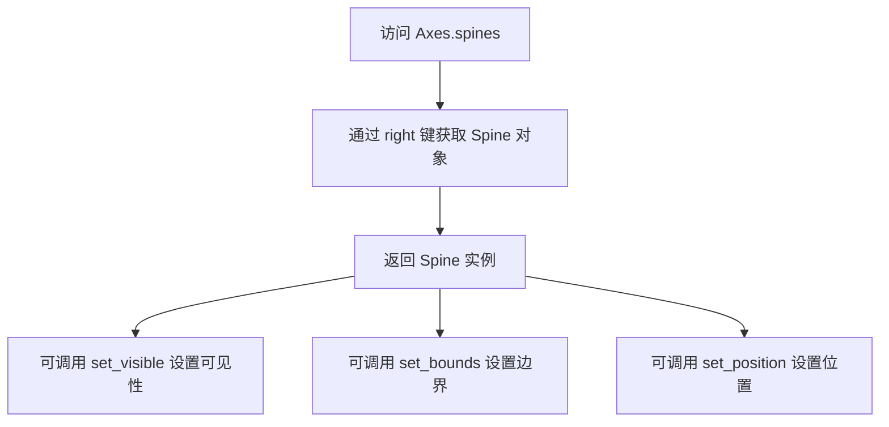

#### 带注释源码

```python
# 在 matplotlib 中，Axes.spines 是一个类似字典的容器（Spines类，继承自OrderedDict）
# 访问 .right 返回右侧的 Spine 对象

# 代码示例：
ax1.spines.right.set_visible(False)

# 分解步骤：
# 1. ax1.spines - 获取 Axes 的脊柱容器（Spines对象）
# 2. ax1.spines.right - 通过 'right' 键访问右侧脊柱（Spine对象）
# 3. .set_visible(False) - 调用Spine的set_visible方法，隐藏右侧脊柱

# Spine 对象的主要方法：
# - set_visible(visible) - 设置脊柱可见性，参数为布尔值
# - set_bounds(loc_min, loc_max) - 设置脊柱的数据范围边界
# - set_position(position) - 设置脊柱位置（如 'zero', 'outward' 等）
# - get_path() - 获取脊柱的路径对象
# - set_color(color) - 设置脊柱颜色
# - set_linewidth(width) - 设置脊柱线宽
```

#### 额外说明

在代码中的实际使用：

```python
ax1.plot(x, y)
ax1.set_title('bottom-left spines')

# 隐藏右侧和顶部脊柱
ax1.spines.right.set_visible(False)  # 这一行访问了 Axes.spines.right 属性
ax1.spines.top.set_visible(False)
```

`spines.right` 本质上是一个 `Spine` 类实例，代码中通过属性访问器（`__getitem__`）返回对应的脊柱对象，然后可以调用该对象的各种方法（如 `set_visible`）来修改图表边框的外观。


### `Spine.set_visible`

设置脊柱（Spine）对象的可见性。在代码中通过 `ax.spines.top.set_visible(False)` 调用，用于隐藏图表的顶部脊柱。

参数：

- `visible`：`bool`，指定脊柱是否可见。`True` 表示显示，`False` 表示隐藏

返回值：`None`，无返回值（该方法直接修改对象状态）

#### 流程图

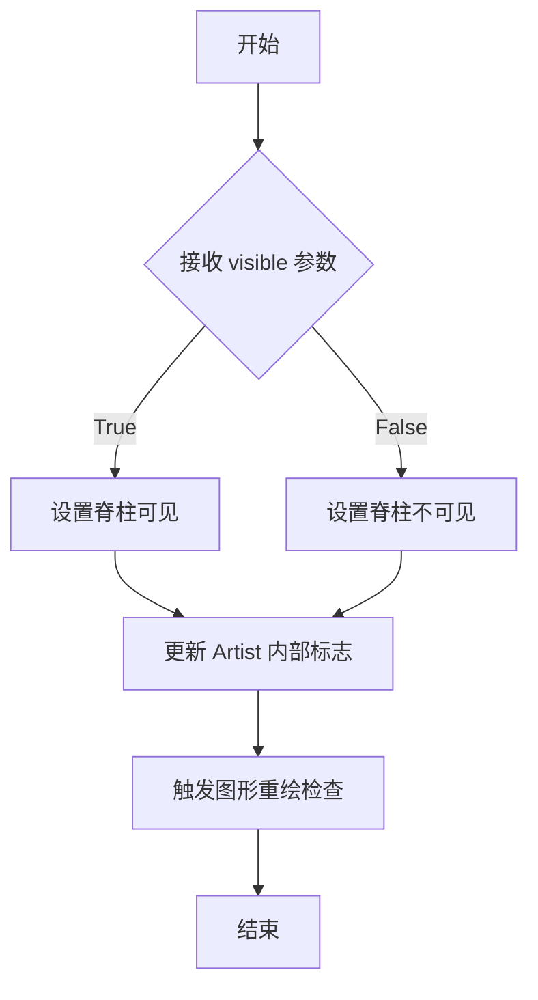

#### 带注释源码

```python
# Spine.set_visible 方法源码（位于 matplotlib/spines.py）

def set_visible(self, b):
    """
    设置艺术家的可见性。

    Parameters
    ----------
    b : bool
    """
    # 调用父类 Artist.set_visible 方法
    # b 为 True 时显示脊柱，为 False 时隐藏脊柱
    super().set_visible(b)
```

#### 使用示例上下文

```python
# 在示例代码中的使用方式
ax1.spines.right.set_visible(False)  # 隐藏右侧脊柱
ax1.spines.top.set_visible(False)    # 隐藏顶部脊柱

# ax.spines 是一个字典容器
# .spines.top 访问顶部的 Spine 对象
# .set_visible(False) 调用方法隐藏该脊柱
```

#### 补充说明

| 项目 | 说明 |
|------|------|
| 所属类 | `matplotlib.spines.Spine` |
| 继承自 | `matplotlib.artist.Artist` |
| 调用路径 | `ax.spines['top']` 或 `ax.spines.top` |
| 典型用途 | 创建"箱线图"风格的坐标轴，只保留底部和左侧边框 |


### `Axes.spines.bottom`

该属性返回 Axes 底部边框（Spine）对象，用于访问和操作图表底部的脊线，可以通过返回的 Spine 对象设置其可见性、边界等属性。

参数：无（该属性为只读访问器）

返回值：`Spine`，返回底部脊线对象

#### 流程图

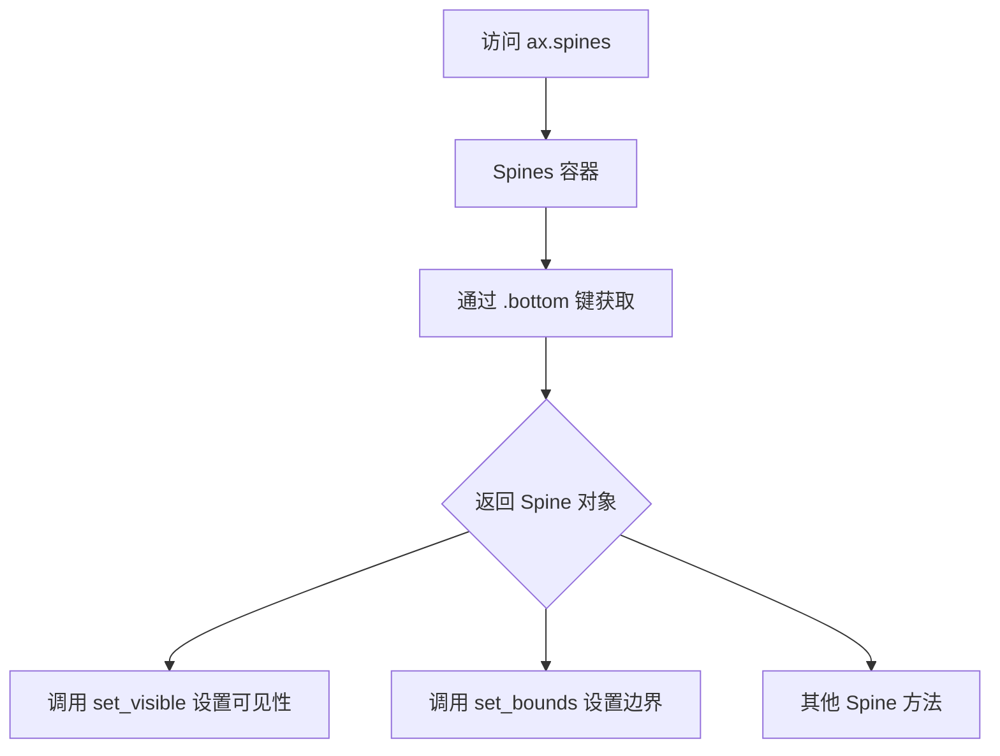

#### 带注释源码

```python
# 代码示例来自 matplotlib 官方示例
# 演示 spines 的使用方式

# ax.spines 是一个 Spines 容器对象（类似字典）
# 通过 .bottom 可以获取底部的 Spine 对象

ax1.spines.right.set_visible(False)  # 获取 right 脊线并设置为不可见
ax1.spines.top.set_visible(False)    # 获取 top 脊线并设置为不可见

# 设置底部和左侧脊线的范围（仅在数据范围内绘制）
ax2.spines.bottom.set_bounds(x.min(), x.max())  # 设置底部脊线的起止边界
ax2.spines.left.set_bounds(y.min(), y.max())    # 设置左侧脊线的起止边界
ax2.spines.right.set_visible(False)             # 隐藏右侧脊线
ax2.spines.top.set_visible(False)               # 隐藏顶部脊线

# 注意：Axes.spines.bottom 本身是一个属性访问器
# 返回 matplotlib.spines.Spine 类型的对象
# 常用的 Spine 方法包括：
#   - set_visible(visible: bool) -> None: 设置是否可见
#   - set_bounds(left: float, right: float) -> None: 设置边界范围
#   - set_position(position: tuple) -> None: 设置脊线位置
```

#### Spine 对象常用方法说明

| 方法 | 参数 | 返回类型 | 描述 |
|------|------|----------|------|
| `set_visible` | `visible: bool` | `None` | 控制脊线是否可见 |
| `set_bounds` | `left: float, right: float` | `None` | 设置脊线的绘制范围 |
| `set_position` | `position: str or tuple` | `None` | 设置脊线的位置（如 `'zero'`, `'outward'`） |
| `get_spine_transform` | 无 | `Transform` | 获取脊线的变换对象 |


### `Axes.spines`

描述：`Axes.spines`是一个容器对象，提供对图表四个边框（left、right、top、bottom）的访问，每个边框都是一个`Spine`对象，可用于控制边框的可见性、位置和范围。

参数：无

返回值：返回`Spines`容器对象，包含left、right、top、bottom四个`Spine`实例

#### 流程图

```mermaid
flowchart TD
    A[获取Axes.spines] --> B{访问方式}
    B --> C[spines['left']]
    B --> D[spines.left]
    C --> E[返回left Spine对象]
    D --> E
    E --> F[调用Spine方法]
    F --> G[set_visible/ set_bounds]
```

#### 带注释源码

```python
# 示例代码演示了Axes.spines的用法
ax2.spines.left.set_bounds(y.min(), y.max())
# ax2: Axes对象
# .spines: 访问spines容器
# .left: 获取左侧边框（Spine对象）
# .set_bounds(): 设置边框的数据范围
```

#### 补充说明

在代码中的实际使用：

```python
ax2.plot(x, y)
ax2.set_title('spines with bounds limited to data range')

# 只在数据范围内绘制边框，不包括边距
ax2.spines.bottom.set_bounds(x.min(), x.max())  # 设置底部边框范围
ax2.spines.left.set_bounds(y.min(), y.max())    # 设置左侧边框范围
# 隐藏右边和顶部边框
ax2.spines.right.set_visible(False)
ax2.spines.top.set_visible(False)
```

### `Spine.set_bounds`

描述：设置 Spine（边框）的绘制范围，限制边框在指定的数据区间内，常用于只显示与数据范围对应的边框部分。

参数：

- `low`：数值类型，边框的起始位置
- `high`：数值类型，边框的结束位置

返回值：`None`，该方法直接修改Spine对象的边界属性

#### 流程图

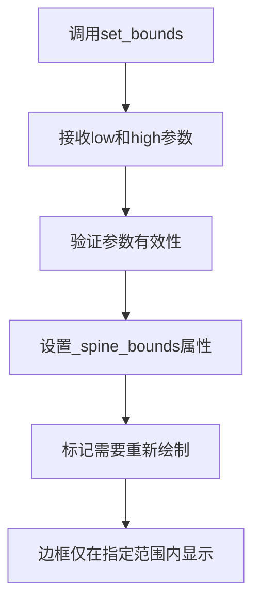

#### 带注释源码

```python
# 设置左边框的绘制范围为y的最小值到最大值
ax2.spines.left.set_bounds(y.min(), y.max())
# y.min(): 数据y的最小值
# y.max(): 数据y的最大值
# 结果：左边框只显示在y轴数据范围内
```

#### 潜在技术债务

1. **文档不完整**：`Spines`容器的具体实现和API文档在matplotlib官方文档中较为简略
2. **访问方式不一致**：可通过字典方式`spines['left']`或属性方式`spines.left`访问，缺乏统一性
3. **边界设置时机**：需要在绘图后设置bounds，否则可能被自动布局覆盖

#### 关键组件信息

- **Spines容器**：管理Axes的四个边框（left, right, top, bottom）
- **Spine对象**：代表单个边框，控制位置、可见性、边界等属性
- **set_visible()**：控制边框是否显示
- **set_bounds()**：限制边框的绘制范围


# Spine.set_visible() 分析

## 描述

`Spine.set_visible()` 是 matplotlib 库中 `Spine` 类的方法，用于控制脊柱（spine）的可见性。在提供的代码示例中，通过调用此方法隐藏图表的右侧和顶部边框，使图表呈现左下边框样式。

## 参数

- `visible`：`bool`，控制脊柱是否可见。`True` 显示脊柱，`False` 隐藏脊柱

## 返回值

无返回值（`None`），该方法直接修改对象状态

## 流程图

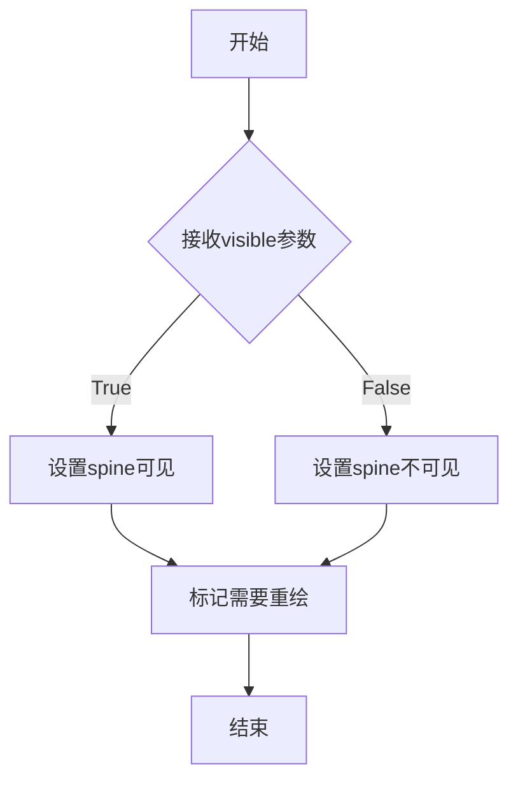

## 带注释源码

```python
# 代码示例中Spine.set_visible()的调用方式：
# ax1.spines.right.set_visible(False)  # 隐藏右侧脊柱
# ax1.spines.top.set_visible(False)    # 隐藏顶部脊柱

# Spine.set_visible() 方法定义（位于matplotlib库中）
# 这是基于matplotlib库中Spine类的典型实现逻辑：

def set_visible(self, visible):
    """
    设置艺术家的可见性
    
    参数:
        visible (bool): True显示对象，False隐藏对象
    """
    self._visible = visible          # 更新内部可见性标志
    self.pchanged()                  # 通知属性已更改
    self.stale_callbacks = None      # 使缓存失效
    # 注意: 实际实现位于matplotlib的artist基类中
    # Spine类继承自Patch类，最终继承自Artist类
```

## 说明

用户提供的代码是 matplotlib 的示例脚本，展示了 `Spine.set_visible()` 方法的**使用方法**，而非该方法的**实现代码**。实际的 `Spine.set_visible()` 方法定义位于 matplotlib 库的源代码中（通常在 `lib/matplotlib/spines.py` 或通过继承的 `Artist.set_visible()` 实现）。


### Spine.set_bounds

该方法用于设置脊柱（Spine）的绘制边界，限制脊柱在指定的数据坐标范围内显示，常用于只显示坐标轴的一部分（如只显示数据范围内的边框而不显示留白区域的边框）。

参数：

- `low`：`float`，数据坐标中的下界（起始位置）
- `high`：`float`，数据坐标中的上界（结束位置）

返回值：`None`，无返回值

#### 流程图

```mermaid
graph TD
    A[开始 set_bounds] --> B{检查 low 参数}
    B -->|提供 low| C[验证 low 为浮点数]
    B -->|未提供 low| D[将 low 设为 None]
    C --> E{检查 high 参数}
    D --> E
    E -->|提供 high| F[验证 high 为浮点数]
    E -->|未提供 high| G[将 high 设为 None]
    F --> H[更新 self._bounds = (low, high)]
    G --> H
    H --> I[调用 stale 属性触发重绘]
    I --> J[结束]
```

#### 带注释源码

```python
def set_bounds(self, low=None, high=None):
    """
    Set the bounds of the spine.

    .. versionadded:: 3.7

    Parameters
    ----------
    low : float, optional
        The lower bound of the spine in data coordinates.
    high : float, optional
        The upper bound of the spine in data coordinates.
    """
    # 检查 low 参数，如果为 None 则设为 None，否则验证类型并设置
    if low is None:
        pass
    else:
        low = float(low)
    
    # 检查 high 参数，如果为 None 则设为 None，否则验证类型并设置
    if high is None:
        pass
    else:
        high = float(high)
    
    # 更新内部边界属性
    self._bounds = (low, high)
    
    # 标记艺术家为过时，触发图形重绘
    self.stale = True
```

## 关键组件


### matplotlib.pyplot

Matplotlib的pyplot模块，提供创建图形和子图的接口，包含subplots、plot、show等函数。

### numpy (np)

Python数值计算库，提供高效的数组操作和数学函数，这里用于生成正弦波数据点。

### Spine (轴脊)

表示图表边框的对象，每个Axes包含spines字典存储四个方向的Spine实例，用于控制坐标轴线的显示和范围。

### set_visible 方法

控制Spine可见性的方法，接受布尔参数，用于隐藏图表的右侧和顶部边框。

### set_bounds 方法

设置Spine绘制范围的 方法，接受最小值和最大值参数，限制轴脊在数据范围内的绘制。

### Axes.spines 容器

存储四个方向（left, right, top, bottom）Spine对象的字典结构，通过属性方式访问如ax.spines.right。

### 图表布局管理

使用constrained layout模式自动调整子图间距，防止标签与坐标轴重叠。


## 问题及建议


### 已知问题

- **硬编码数值缺乏说明**：代码中的 `100`（采样点数量）、`2`（正弦振幅）、`2 * np.pi`（周期）等数值均为魔法数字，缺少常量定义和注释说明其含义和来源
- **代码重复**：隐藏 spines 的操作（`set_visible(False)`）在 ax1 和 ax2 中重复出现，违反了 DRY（Don't Repeat Yourself）原则
- **缺乏封装和可复用性**：代码以脚本形式直接执行，所有逻辑堆砌在全局作用域，未封装为可复用的函数或类，难以在其他项目中直接调用
- **无输入验证**：未对输入数据（x, y）进行有效性检查，例如空数组、NaN 值、非数值类型等情况缺乏处理
- **固定布局限制扩展性**：子图数量硬编码为 3 个，若需要展示更多 spines 配置类型，需要手动添加更多代码，扩展性较差

### 优化建议

- **提取配置参数**：将采样点数、振幅、周期等数值定义为模块级常量或配置字典，并添加注释说明
- **封装辅助函数**：创建 `hide_spines(ax)` 之类的辅助函数来消除重复代码，提高代码复用性
- **函数化封装**：将绘图逻辑封装为函数，接收数据范围、子图配置等参数，提升可测试性和可集成性
- **添加数据验证**：在绘图前对 x, y 数据进行有效性检查，确保数据符合预期（数值类型、非空、无 NaN 等）
- **使用循环生成子图**：通过循环遍历配置列表来动态创建子图，避免硬编码子图数量，便于扩展新的 spines 展示类型
- **添加类型注解**：为变量和函数添加类型提示（type hints），提升代码可读性和 IDE 支持


## 其它


### 项目背景

本项目是一个Matplotlib可视化示例演示代码，用于展示Axes对象中spines（坐标轴边框）的不同配置方式。通过三个子图对比展示：默认四边边框、仅保留左下边框、以及限制边框范围到数据区域的场景。

### 设计目标与约束

**设计目标**：演示Matplotlib中Spine对象的各种配置方法，包括可见性控制（set_visible）、边界设置（set_bounds）等功能，帮助用户理解如何自定义坐标轴边框外观。

**约束条件**：
- 依赖Matplotlib 3.5+版本（layout='constrained'参数）
- 依赖NumPy数值计算库
- 必须保持与Matplotlib Artist层次结构的兼容性
- 图形窗口必须在支持GUI的环境中运行

### 错误处理与异常设计

**预期异常**：
- `AttributeError`：当访问不存在的spine名称时（如ax.spines.non_existent）
- `ValueError`：当set_bounds参数违反数据范围时
- `TypeError`：当参数类型不匹配时（如set_visible接收非布尔值）

**处理方式**：本演示代码为静态脚本，无运行时错误处理逻辑，仅依赖Matplotlib库内置异常。

### 数据流与状态机

**数据流程**：
1. 生成输入数据：x = np.linspace(0, 2*np.pi, 100)，y = 2*np.sin(x)
2. 创建画布：plt.subplots创建3行1列的子图布局
3. 配置各子图：
   - ax0：默认配置，无额外操作
   - ax1：设置right和top spine不可见
   - ax2：设置bottom和left spine边界，并隐藏right和top spine
4. 渲染显示：plt.show()输出图形

**状态变化**：无复杂状态机，仅涉及Spine对象的visible属性和bounds属性变化。

### 外部依赖与接口契约

**外部依赖**：
- matplotlib.pyplot：图形创建与展示
- matplotlib.figure：Figure对象管理
- matplotlib.axes：Axes对象与spine容器
- matplotlib.spines.Spine：单个边框对象
- numpy：数值数组生成

**接口契约**：
- `ax.spines`：返回Spines容器对象（字典类型）
- `ax.spines[name]`：返回指定名称的Spine对象（left/right/top/bottom）
- `spine.set_visible(visible)`：设置边框可见性，参数为布尔值
- `spine.set_bounds(left, right)`：设置边框绘制范围，参数为数值

### 关键组件信息

**Spine容器**：管理Axes的四条边框（left/right/top/bottom），类似字典结构

**Spine对象**：代表单条坐标轴边框，包含位置、可见性、边界等属性

### 潜在技术债务与优化空间

1. **硬编码数据**：x和y数据直接写在代码中，可考虑参数化
2. **重复代码**：三个子图的plot操作可提取为函数
3. **magic number**：100个采样点、2倍π等数值可定义为常量
4. **无单元测试**：作为演示代码缺少测试覆盖
5. **国际化支持**：标题和标签未考虑多语言

### 其它说明

**配置参数说明**：
- layout='constrained'：自动调整布局避免标签重叠
- nrows=3：创建三行子图
- set_bounds：仅绘制指定范围内的边框段

**扩展方向**：
- 可添加交互式spine拖拽功能
- 可支持自定义spine位置（如极坐标轴）
- 可添加spine动画效果

    