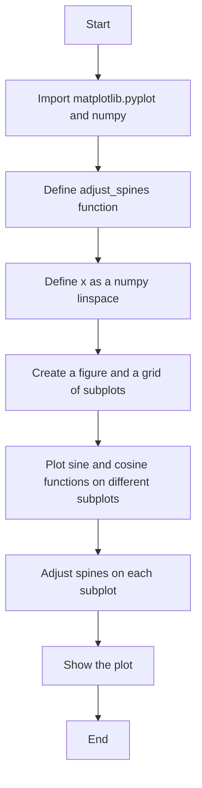
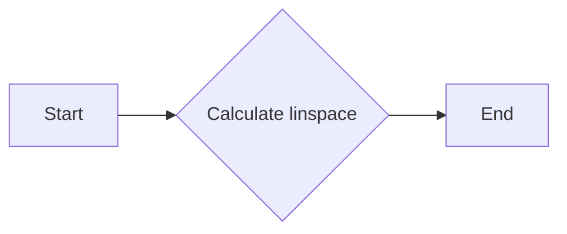

# `matplotlib\galleries\examples\spines\spines_dropped.py` 详细设计文档

This code generates a matplotlib plot with adjusted spines to demonstrate the concept of 'dropped spines', where spines are offset from the axes.

## 整体流程



## 类结构

```
AdjustSpines (Function)
├── matplotlib.pyplot (Module)
│   ├── ax.label_outer(remove_inner_ticks=True)
│   └── ax.grid(color='0.9')
└── numpy (Module)
    └── np.linspace(0, 2 * np.pi, 100)
```

## 全局变量及字段


### `x`
    
An array of evenly spaced values between 0 and 2*pi, used for plotting functions.

类型：`numpy.ndarray`
    


    

## 全局函数及方法


### adjust_spines

调整matplotlib子图轴的边框可见性。

参数：

- `ax`：`matplotlib.axes.Axes`，要调整的轴对象。
- `visible_spines`：`list`，包含字符串的列表，指定哪些边框应该可见。

返回值：`None`，没有返回值。

#### 流程图

```mermaid
graph LR
A[Start] --> B{Is ax an instance of matplotlib.axes.Axes?}
B -- Yes --> C[Set label_outer with remove_inner_ticks=True]
B -- No --> D[Error: Invalid input]
C --> E[Set grid color to '0.9']
E --> F{Is loc in visible_spines?}
F -- Yes --> G[Set spine position to ('outward', 10)]
F -- No --> H[Set spine visible to False]
G --> I[Repeat for all spines]
H --> I
I --> J[End]
```

#### 带注释源码

```python
def adjust_spines(ax, visible_spines):
    # Set label_outer to remove inner ticks
    ax.label_outer(remove_inner_ticks=True)
    # Set grid color
    ax.grid(color='0.9')
    
    # Iterate over all spines in the axis
    for loc, spine in ax.spines.items():
        # Check if the spine is in the list of visible spines
        if loc in visible_spines:
            # Set the position of the spine outward by 10 points
            spine.set_position(('outward', 10))  # outward by 10 points
        else:
            # Set the spine to not visible
            spine.set_visible(False)
```


### np.linspace

生成线性空间。

参数：

- `start`：`float`，线性空间的起始值。
- `stop`：`float`，线性空间的结束值。
- `num`：`int`，线性空间中的点数（不包括起始值和结束值）。

返回值：`numpy.ndarray`，线性空间中的值。

#### 流程图



#### 带注释源码

```python
import numpy as np

def np_linspace(start, stop, num=50):
    """
    Generate linearly spaced samples, calculated over the interval [start, stop].

    Parameters
    ----------
    start : float
        The starting value of the interval.
    stop : float
        The ending value of the interval.
    num : int, optional
        The number of samples to generate. Default is 50.

    Returns
    -------
    numpy.ndarray
        The linearly spaced samples.
    """
    return np.linspace(start, stop, num)
```


### adjust_spines

调整matplotlib子图轴的边框可见性。

参数：

- `ax`：`matplotlib.axes.Axes`，要调整的轴对象。
- `visible_spines`：`list`，包含字符串的列表，指定哪些边框应该可见。

返回值：`None`，没有返回值。

#### 流程图

```mermaid
graph LR
A[Start] --> B{Is ax an instance of matplotlib.axes.Axes?}
B -- Yes --> C[Set ax.label_outer(remove_inner_ticks=True)]
B -- No --> D[Error: Invalid input]
C --> E[Set ax.grid(color='0.9')]
E --> F{Is loc in visible_spines?}
F -- Yes --> G[Set spine position to ('outward', 10)]
F -- No --> H[Set spine visible to False]
G --> I[Repeat for all spines]
H --> I
I --> J[End]
```

#### 带注释源码

```python
def adjust_spines(ax, visible_spines):
    # Set the outer label and grid for the axis
    ax.label_outer(remove_inner_ticks=True)
    ax.grid(color='0.9')

    # Iterate over all spines in the axis
    for loc, spine in ax.spines.items():
        # Check if the spine is in the list of visible spines
        if loc in visible_spines:
            # Set the position of the spine outward by 10 points
            spine.set_position(('outward', 10))  # outward by 10 points
        else:
            # Set the spine to not visible
            spine.set_visible(False)
```


## 关键组件


### 调整脊线

调整脊线组件负责根据指定的可见脊线列表，设置matplotlib子图轴（Axes）的脊线可见性和位置。

### 绘图函数

绘图函数用于生成不同函数的图像，包括正弦、余弦、负余弦和负正弦函数。

### 子图创建

子图创建组件负责创建指定数量的子图，用于绘制不同的函数图像。

### 显示图像

显示图像组件负责显示所有子图，使绘制的图像可见。


## 问题及建议


### 已知问题

-   {问题1}：代码中使用了 `matplotlib.pyplot` 和 `numpy`，这两个库在代码中没有明确地被导入，这可能导致在运行时出现未定义的模块错误。
-   {问题2}：代码中使用了 `ax.label_outer(remove_inner_ticks=True)`，这个方法在 `matplotlib` 的较旧版本中可能不可用，或者在不同的版本中行为不同，这可能导致兼容性问题。
-   {问题3}：代码中使用了 `ax.grid(color='0.9')`，这个颜色值是一个字符串，而不是一个颜色对象，这可能导致颜色显示不正确。

### 优化建议

-   {建议1}：确保所有使用的库都被明确地导入，以避免运行时错误。
-   {建议2}：检查 `matplotlib` 的版本，确保使用的方法在当前版本中是可用的，或者使用兼容的替代方法。
-   {建议3}：使用颜色对象来设置网格颜色，例如 `ax.grid(color=plt.cm.Greys(0.9))`，以确保颜色正确显示。
-   {建议4}：代码中使用了硬编码的字符串 `'left'` 和 `'bottom'` 来指定可见的脊，这可能导致代码的可读性和可维护性降低。可以考虑使用枚举或常量来代替这些字符串。
-   {建议5}：代码中没有错误处理机制，如果出现异常（例如，`matplotlib` 库的版本不兼容），程序可能会崩溃。应该添加异常处理来提高代码的健壮性。
-   {建议6}：代码中没有文档字符串来描述函数和类的目的和用法，这可能导致其他开发者难以理解和使用代码。应该添加适当的文档字符串来提高代码的可读性。
-   {建议7}：代码中没有考虑性能优化，例如，如果需要处理大量的数据或多次运行相同的绘图代码，可以考虑使用缓存或优化绘图算法来提高性能。


## 其它


### 设计目标与约束

- 设计目标：实现一个能够调整matplotlib子图spines可见性的函数，以演示spines偏移轴的效果。
- 约束条件：必须使用matplotlib库进行绘图，且代码应简洁易读。

### 错误处理与异常设计

- 错误处理：代码中未包含显式的错误处理机制，但应确保matplotlib库正常安装并可用。
- 异常设计：未预期到异常情况，但应考虑matplotlib库可能抛出的异常，并在调用时进行捕获。

### 数据流与状态机

- 数据流：代码从numpy生成x值，然后使用matplotlib创建子图并绘制函数曲线。
- 状态机：代码没有使用状态机，但通过调用`adjust_spines`函数调整spines的可见性。

### 外部依赖与接口契约

- 外部依赖：代码依赖于matplotlib和numpy库。
- 接口契约：`adjust_spines`函数定义了接口契约，包括参数和返回值。


    