# `matplotlib\galleries\examples\statistics\boxplot.py` 详细设计文档

This code customizes box plots using Matplotlib and NumPy, demonstrating various styling options and data manipulation techniques.

## 整体流程

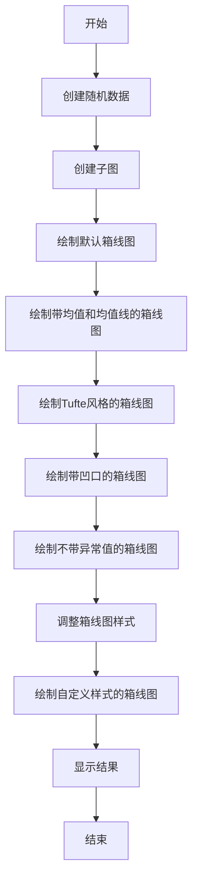

## 类结构

```
BoxPlot (主类)
├── MatplotlibAxes (matplotlib.pyplot.Axes的子类)
│   ├── __init__ (初始化方法)
│   ├── boxplot (绘制箱线图的方法)
│   └── set_title (设置标题的方法)
└── NumPy (numpy模块)
    └── random.lognormal (生成对数正态分布数据的方法)
```

## 全局变量及字段


### `data`
    
The data to be used in the box plot.

类型：`numpy.ndarray`
    


### `labels`
    
The labels for the data series in the box plot.

类型：`list`
    


### `fs`
    
Font size for the titles in the plots.

类型：`int`
    


### `boxprops`
    
Properties for the box elements of the box plot.

类型：`dict`
    


### `flierprops`
    
Properties for the flier elements of the box plot.

类型：`dict`
    


### `medianprops`
    
Properties for the median line of the box plot.

类型：`dict`
    


### `meanpointprops`
    
Properties for the mean point of the box plot.

类型：`dict`
    


### `meanlineprops`
    
Properties for the mean line of the box plot.

类型：`dict`
    


### `BoxPlot.data`
    
The data to be used in the box plot.

类型：`numpy.ndarray`
    


### `BoxPlot.labels`
    
The labels for the data series in the box plot.

类型：`list`
    


### `BoxPlot.fs`
    
Font size for the titles in the plots.

类型：`int`
    


### `MatplotlibAxes.fig`
    
The figure object containing the plot.

类型：`matplotlib.figure.Figure`
    


### `MatplotlibAxes.axs`
    
The axes objects containing the plots.

类型：`numpy.ndarray`
    
    

## 全局函数及方法


### np.random.seed

`np.random.seed` 是 NumPy 库中的一个全局函数，用于设置随机数生成器的种子。

参数：

- `seed`：`int`，用于初始化随机数生成器的种子值。

参数描述：`seed` 参数是一个整数，用于设置随机数生成器的初始状态，从而确保每次运行代码时生成的随机数序列是可复现的。

返回值类型：无

返回值描述：该函数没有返回值，它只是用于设置随机数生成器的种子。

#### 流程图

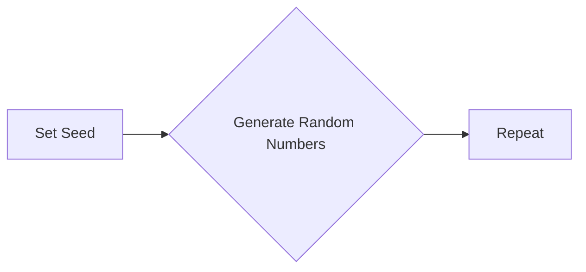

#### 带注释源码

```
np.random.seed(19680801)
```

该行代码设置了随机数生成器的种子为 `19680801`，确保每次运行代码时生成的随机数序列是相同的。


### np.random.lognormal

生成具有对数正态分布的随机样本。

参数：

- `mean`：`float`，对数正态分布的均值。
- `sigma`：`float`，对数正态分布的标准差。
- `size`：`int` 或 `tuple`，输出样本的大小。

返回值：`numpy.ndarray`，具有对数正态分布的随机样本。

#### 流程图

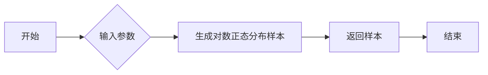

#### 带注释源码

```python
import numpy as np

def lognormal(mean, sigma, size=None):
    """
    Generate random samples from a lognormal distribution.

    Parameters:
    - mean: float, the mean of the lognormal distribution.
    - sigma: float, the standard deviation of the lognormal distribution.
    - size: int or tuple, the size of the output samples.

    Returns:
    - numpy.ndarray, samples from the lognormal distribution.
    """
    return np.random.lognormal(mean, sigma, size)
```


### plt.subplots

`plt.subplots` 是 Matplotlib 库中的一个函数，用于创建一个或多个子图，并返回一个包含这些子图的数组。

参数：

- `nrows`：`int`，指定子图数组的行数。
- `ncols`：`int`，指定子图数组的列数。
- `figsize`：`tuple`，指定整个图形的大小（宽度和高度）。
- `sharey`：`bool`，指定是否共享所有子图的 y 轴。

返回值：`fig, axs`，其中 `fig` 是图形对象，`axs` 是子图数组。

#### 流程图

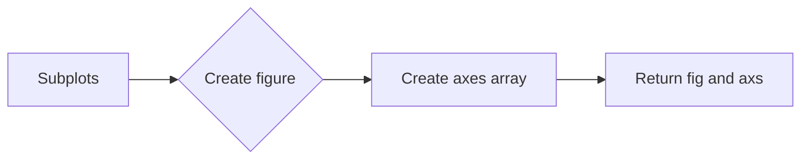

#### 带注释源码

```python
fig, axs = plt.subplots(nrows=2, ncols=3, figsize=(6, 6), sharey=True)
```


### axs.boxplot

`axs.boxplot` 是 Matplotlib 库中一个类方法，用于在指定的轴上绘制箱线图。

参数：

- `data`：`array_like`，包含要绘制的数据。
- `tick_labels`：`sequence`，指定每个箱线图的数据标签。
- `showmeans`：`bool`，指定是否显示均值。
- `meanline`：`bool`，指定是否显示均值线。
- `showbox`：`bool`，指定是否显示箱体。
- `showcaps`：`bool`，指定是否显示箱体的上、下边缘。
- `showfliers`：`bool`，指定是否显示异常值。
- `whis`：`tuple`，指定计算箱线图时使用的百分位数范围。

返回值：`None`

#### 流程图

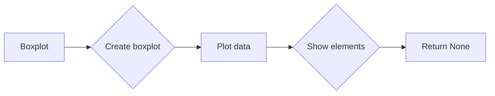

#### 带注释源码

```python
axs[0, 0].boxplot(data, tick_labels=labels)
```


### axs.set_title

`axs.set_title` 是 Matplotlib 库中一个类方法，用于设置轴的标题。

参数：

- `title`：`str`，指定标题文本。

返回值：`None`

#### 流程图

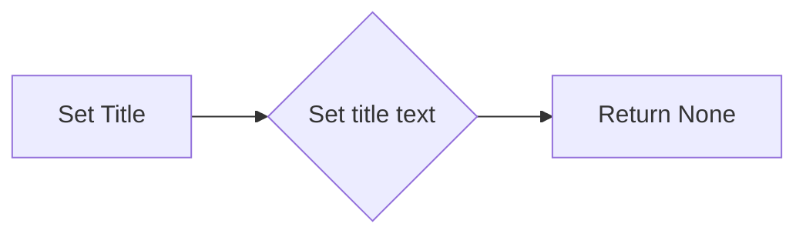

#### 带注释源码

```python
axs[0, 0].set_title('Default', fontsize=fs)
```


### axs.set_yscale

`axs.set_yscale` 是 Matplotlib 库中一个类方法，用于设置轴的 y 轴比例。

参数：

- `scale`：`str`，指定 y 轴比例类型。

返回值：`None`

#### 流程图

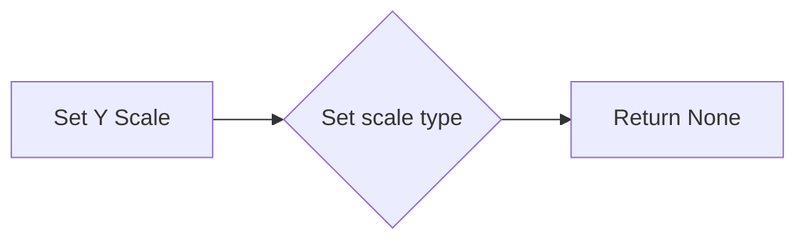

#### 带注释源码

```python
ax.set_yscale('log')
```


### fig.subplots_adjust

`fig.subplots_adjust` 是 Matplotlib 库中一个方法，用于调整子图之间的间距。

参数：

- `hspace`：`float`，指定子图之间的水平间距。

返回值：`None`

#### 流程图

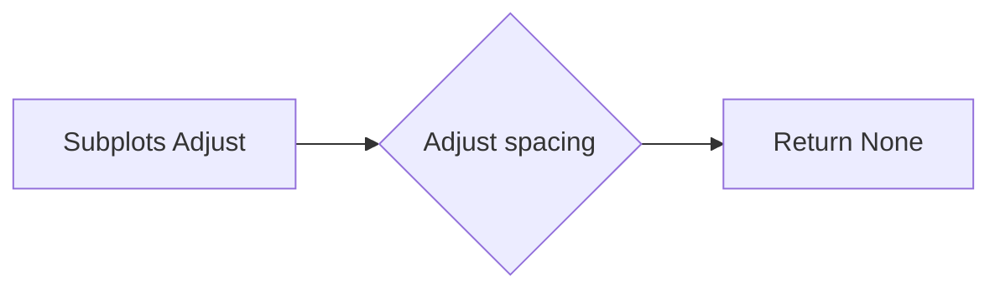

#### 带注释源码

```python
fig.subplots_adjust(hspace=0.4)
```


### plt.show

`plt.show` 是 Matplotlib 库中一个函数，用于显示图形。

参数：无

返回值：无

#### 流程图

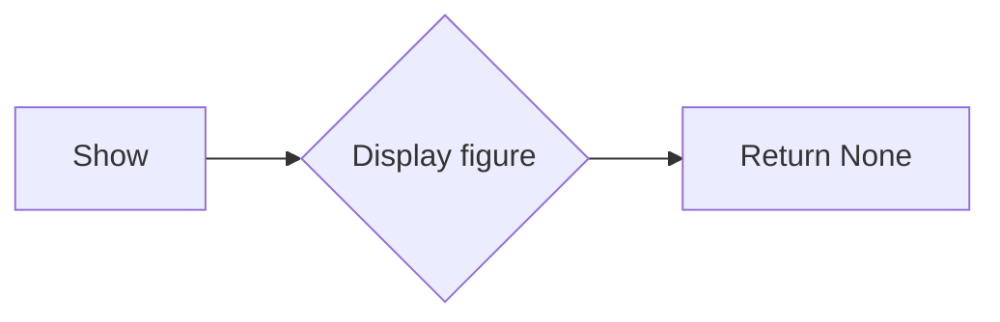

#### 带注释源码

```python
plt.show()
```


### plt.show()

`plt.show()` 是一个全局函数，用于显示当前图形窗口。

参数：

- 无

返回值：无

#### 流程图

```mermaid
graph LR
A[Start] --> B[Call plt.show()]
B --> C[Display plot]
C --> D[End]
```

#### 带注释源码

```python
plt.show()  # 显示当前图形窗口
```


### matplotlib.pyplot.show()

`matplotlib.pyplot.show()` 是一个全局函数，用于显示当前图形窗口。

参数：

- 无

返回值：无

#### 流程图

```mermaid
graph LR
A[Start] --> B[Call plt.show()]
B --> C[Display plot]
C --> D[End]
```

#### 带注释源码

```python
from matplotlib.pyplot import show

def show_plot():
    show()  # 显示当前图形窗口
```


### fig.subplots_adjust

`fig.subplots_adjust` 是一个用于调整子图间距的函数。

参数：

- `hspace`：`float`，水平间距，单位为英寸。

返回值：无

#### 流程图

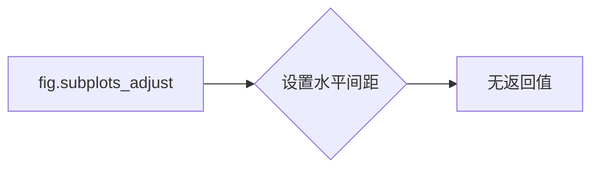

#### 带注释源码

```python
fig.subplots_adjust(hspace=0.4)
```

在这段代码中，`fig.subplots_adjust(hspace=0.4)` 调用会设置子图之间的水平间距为 0.4 英寸。


### fig.suptitle

设置子图标题。

参数：

- `title`：`str`，要设置的标题文本。
- `fontsize`：`int`，标题的字体大小。

返回值：无

#### 流程图

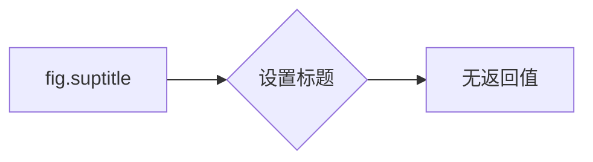

#### 带注释源码

```python
fig.suptitle("I never said they'd be pretty")
```


### BoxPlot.__init__

BoxPlot类的构造函数用于初始化BoxPlot对象。

参数：

- `data`：`numpy.ndarray`，输入数据，用于绘制箱线图。
- `labels`：`list`，数据标签，用于显示在箱线图上。

返回值：无

#### 流程图

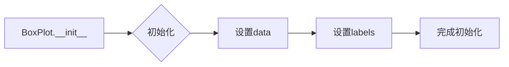

#### 带注释源码

```python
class BoxPlot:
    def __init__(self, data, labels=None):
        """
        初始化BoxPlot对象。

        :param data: numpy.ndarray, 输入数据，用于绘制箱线图。
        :param labels: list, 数据标签，用于显示在箱线图上。
        """
        self.data = data
        self.labels = labels
```


### matplotlib.pyplot.boxplot

`matplotlib.pyplot.boxplot` 是一个用于绘制箱线图的函数。

参数：

- `data`：`ndarray`，包含要绘制的数据。
- `positions`：`sequence`，指定每个箱线图的位置。
- ` widths`：`sequence`，指定每个箱线图的宽度。
- `whis`：`tuple`，指定箱线图中的胡须延伸到数据点的百分比范围。
- `patch_artist`：`bool`，指定是否使用不同的颜色填充箱线图。
- `boxprops`：`dict`，指定箱线图框的属性。
- `flierprops`：`dict`，指定异常值（胡须之外的数据点）的属性。
- `medianprops`：`dict`，指定中位数线的属性。
- `meanprops`：`dict`，指定均值点的属性。
- `showmeans`：`bool`，指定是否显示均值。
- `showfliers`：`bool`，指定是否显示异常值。
- `showbox`：`bool`，指定是否显示箱线图框。
- `showcaps`：`bool`，指定是否显示箱线图框的边缘。
- `showfliers`：`bool`，指定是否显示异常值。
- `notch`：`bool`，指定是否显示凹口。
- `bootstrap`：`int`，指定用于计算置信区间的bootstrap样本数量。

返回值：`AxesSubplot`，包含箱线图的轴对象。

#### 流程图

```mermaid
graph LR
A[Start] --> B{Is data provided?}
B -- Yes --> C[Create boxplot]
B -- No --> D[Error: Data required]
C --> E[Is position provided?]
E -- Yes --> F[Set position]
E -- No --> G[Use default position]
F --> H[Is width provided?]
H -- Yes --> I[Set width]
H -- No --> J[Use default width]
I --> K[Is whis provided?]
K -- Yes --> L[Set whiskers]
K -- No --> M[Use default whiskers]
L --> N[Is patch_artist provided?]
N -- Yes --> O[Set patch artist]
N -- No --> P[Use default patch artist]
O --> Q[Set box properties]
P --> Q
Q --> R[Set flier properties]
R --> S[Set median properties]
S --> T[Set mean properties]
T --> U[Set mean line properties]
U --> V[Set mean point properties]
V --> W[Set mean line visibility]
W --> X[Set mean point visibility]
X --> Y[Set mean line style]
Y --> Z[Set mean point style]
Z --> AA[Set median line style]
AA --> AB[Set whiskers style]
AB --> AC[Set flier properties]
AC --> AD[Set box properties]
AD --> AE[Set caps visibility]
AE --> AF[Set fliers visibility]
AF --> AG[Set box visibility]
AG --> AH[Set caps visibility]
AH --> AI[Set fliers visibility]
AI --> AJ[End]
```

#### 带注释源码

```python
import matplotlib.pyplot as plt

# Create a figure and an axis
fig, ax = plt.subplots()

# Generate some data
data = np.random.lognormal(size=(37, 4), mean=1.5, sigma=1.75)

# Plot the boxplot
ax.boxplot(data, positions=[0, 1, 2, 3], widths=[0.5, 0.5, 0.5, 0.5],
           whis=(0, 100), patch_artist=True, boxprops=dict(linestyle='--', linewidth=3, color='darkgoldenrod'),
           flierprops=dict(marker='o', markerfacecolor='green', markersize=12, markeredgecolor='none'),
           medianprops=dict(linestyle='-.', linewidth=2.5, color='firebrick'),
           meanprops=dict(marker='D', markeredgecolor='black', markerfacecolor='firebrick'),
           meanlineprops=dict(linestyle='--', linewidth=2.5, color='purple'),
           showmeans=True, showfliers=True, showbox=True, showcaps=True, notch=True, bootstrap=10000)

# Show the plot
plt.show()
```


### matplotlib.pyplot.boxplot

`matplotlib.pyplot.boxplot` 是一个用于绘制箱线图的函数。

参数：

- `data`：`ndarray`，包含要绘制的数据。
- `positions`：`sequence`，指定每个箱线图的位置。
- ` widths`：`sequence`，指定每个箱线图的宽度。
- `whis`：`tuple`，指定箱线图中的胡须延伸到数据中第几个百分位数。
- `patch_artist`：`bool`，指定是否使用不同的颜色填充箱线图。
- `boxprops`：`dict`，指定箱线图框的属性。
- `flierprops`：`dict`，指定异常值的属性。
- `medianprops`：`dict`，指定中位数的属性。
- `meanprops`：`dict`，指定平均值的属性。
- `showmeans`：`bool`，指定是否显示平均值。
- `showfliers`：`bool`，指定是否显示异常值。
- `showbox`：`bool`，指定是否显示箱线图框。
- `showcaps`：`bool`，指定是否显示箱线图框的帽。
- `showfliers`：`bool`，指定是否显示异常值。
- `manage_ticks`：`bool`，指定是否管理箱线图中的刻度。

返回值：`BoxPlot` 对象，包含箱线图的信息。

#### 流程图

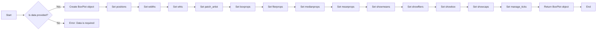

#### 带注释源码

```python
import matplotlib.pyplot as plt

def plot_boxplot(data):
    """
    Plots a boxplot for the given data.

    Parameters:
    - data: ndarray, the data to plot.

    Returns:
    - BoxPlot object, the boxplot object.
    """
    fig, ax = plt.subplots()
    boxplot = ax.boxplot(data)
    return boxplot
```


### matplotlib.pyplot.boxplot

`matplotlib.pyplot.boxplot` 是一个用于绘制箱线图的函数。

参数：

- `data`：`ndarray`，包含要绘制的数据。
- `positions`：`sequence`，指定每个箱线图的位置。
- ` widths`：`sequence`，指定每个箱线图的宽度。
- `whis`：`tuple`，指定箱线图中的胡须延伸到数据点的百分比范围。
- `patch_artist`：`bool`，指定是否使用不同的颜色填充箱线图。
- `boxprops`：`dict`，指定箱线图框的属性。
- `flierprops`：`dict`，指定异常值（胡须之外的数据点）的属性。
- `medianprops`：`dict`，指定中位数线的属性。
- `meanprops`：`dict`，指定平均值的属性。
- `showmeans`：`bool`，指定是否显示平均值。
- `showbox`：`bool`，指定是否显示箱线图框。
- `showcaps`：`bool`，指定是否显示箱线图框的边缘。
- `showfliers`：`bool`，指定是否显示异常值。

返回值：`BoxContainer`，包含箱线图元素的容器。

#### 流程图

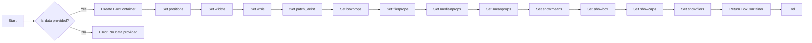

#### 带注释源码

```python
import matplotlib.pyplot as plt

def plot_mean_boxplot(data):
    """
    Plots a boxplot with the mean value highlighted.

    Parameters:
    - data: ndarray, the data to be plotted.

    Returns:
    - BoxContainer, the container for the boxplot elements.
    """
    boxplot = plt.boxplot(data, meanprops=dict(marker='D', markeredgecolor='black',
                                              markerfacecolor='firebrick'),
                          meanline=False, showmeans=True)
    return boxplot
```


### matplotlib.pyplot.boxplot

`matplotlib.pyplot.boxplot` 是一个用于绘制箱线图的函数。

参数：

- `data`：`numpy.ndarray` 或 `pandas.DataFrame`，要绘制的数据。
- `positions`：`int` 或 `sequence`，每个箱线图的位置。
- ` widths`：`float` 或 `sequence`，每个箱线图的宽度。
- `whis`：`float` 或 `sequence`，用于确定箱线图中的“胡须”的百分位数。
- `patch_artist`：`bool`，是否将箱线图绘制为填充的形状。
- `boxprops`：`dict`，箱线图形状的属性。
- `flierprops`：`dict`，异常值标记的属性。
- `medianprops`：`dict`，中位数线的属性。
- `meanprops`：`dict`，平均值的属性。
- `showmeans`：`bool`，是否显示平均值。
- `showbox`：`bool`，是否显示箱线图。
- `showcaps`：`bool`，是否显示箱线图的“帽”。
- `showfliers`：`bool`，是否显示异常值。
- `manage_ticks`：`bool`，是否管理轴的刻度。
- `grid`：`bool`，是否在轴上显示网格。
- `tick_labels`：`sequence`，每个箱线图的标签。

返回值：`Boxplot` 对象。

#### 流程图

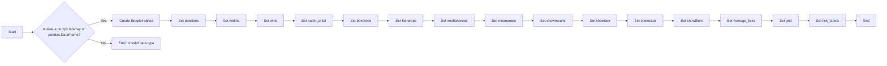

#### 带注释源码

```python
import matplotlib.pyplot as plt
import numpy as np

# fake data
np.random.seed(19680801)
data = np.random.lognormal(size=(37, 4), mean=1.5, sigma=1.75)
labels = list('ABCD')
fs = 10  # fontsize

fig, axs = plt.subplots(nrows=2, ncols=3, figsize=(6, 6), sharey=True)
axs[0, 0].boxplot(data, tick_labels=labels)
axs[0, 0].set_title('Default', fontsize=fs)
# ... (rest of the code)
```


### matplotlib.pyplot.boxplot

`matplotlib.pyplot.boxplot` 是一个用于绘制箱线图的函数。

参数：

- `data`：`array_like`，要绘制的数据。
- `positions`：`sequence`，每个数据组的x位置。
- ` widths`：`sequence`，每个箱线图的宽度。
- `whis`：`tuple`，用于定义箱线图中的胡须的百分位数范围。
- `patch_artist`：`bool`，是否将箱线图填充为颜色。
- `boxprops`：`dict`，箱线图框的属性。
- `flierprops`：`dict`，异常值的属性。
- `medianprops`：`dict`，中位数的属性。
- `meanprops`：`dict`，平均值的属性。
- `showmeans`：`bool`，是否显示平均值。
- `showfliers`：`bool`，是否显示异常值。
- `showbox`：`bool`，是否显示箱线图框。
- `showcaps`：`bool`，是否显示箱线图框的末端。
- `showfliers`：`bool`，是否显示异常值。
- `notch`：`bool`，是否显示凹口。
- `bootstrap`：`int`，用于凹口和置信区间的bootstrap样本大小。

返回值：`BoxPlot` 对象。

#### 流程图

```mermaid
graph LR
A[Start] --> B{Is data valid?}
B -- Yes --> C[Create BoxPlot object]
B -- No --> D[Error]
C --> E[Set positions]
E --> F[Set widths]
F --> G[Set whis]
G --> H[Set patch_artist]
H --> I[Set boxprops]
I --> J[Set flierprops]
J --> K[Set medianprops]
K --> L[Set meanprops]
L --> M[Set showmeans]
M --> N[Set showfliers]
N --> O[Set showbox]
O --> P[Set showcaps]
P --> Q[Set notch]
Q --> R[Set bootstrap]
R --> S[Return BoxPlot object]
S --> T[End]
```

#### 带注释源码

```python
import matplotlib.pyplot as plt

def boxplot(data, positions=None, widths=None, whis=(5, 95), patch_artist=False,
            boxprops=None, flierprops=None, medianprops=None, meanprops=None,
            showmeans=False, showfliers=False, showbox=True, showcaps=True,
            showcaps=True, notch=False, bootstrap=None):
    # Implementation of the boxplot function
    pass
```


### matplotlib.pyplot.boxplot

`matplotlib.pyplot.boxplot` 是一个用于绘制箱线图的函数。

参数：

- `data`：`ndarray`，包含要绘制的数据。
- `positions`：`sequence`，指定每个箱线图的位置。
- ` widths`：`sequence`，指定每个箱线图的宽度。
- `whis`：`tuple`，指定计算箱线图须须的百分位数。
- `patch_artist`：`bool`，指定是否将箱线图填充颜色。
- `boxprops`：`dict`，指定箱线图框的属性。
- `flierprops`：`dict`，指定异常值的属性。
- `medianprops`：`dict`，指定中位数的属性。
- `meanprops`：`dict`，指定平均值的属性。
- `showmeans`：`bool`，指定是否显示平均值。
- `showmedians`：`bool`，指定是否显示中位数。
- `showcaps`：`bool`，指定是否显示须须的端点。
- `showfliers`：`bool`，指定是否显示异常值。
- `manage_ticks`：`bool`，指定是否管理箱线图的刻度。
- `autolabel`：`bool`，指定是否自动标签箱线图。

返回值：`AxesSubplot`，包含箱线图的轴对象。

#### 流程图

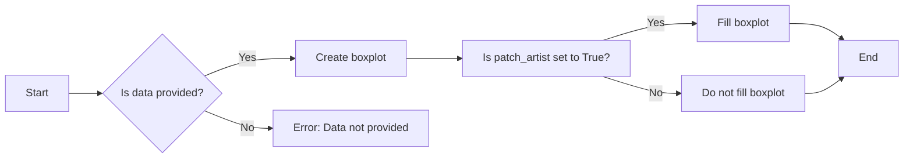

#### 带注释源码

```python
import matplotlib.pyplot as plt
import numpy as np

# fake data
np.random.seed(19680801)
data = np.random.lognormal(size=(37, 4), mean=1.5, sigma=1.75)
labels = list('ABCD')
fs = 10  # fontsize

fig, axs = plt.subplots(nrows=2, ncols=3, figsize=(6, 6), sharey=True)
axs[0, 0].boxplot(data, tick_labels=labels)
axs[0, 0].set_title('Default', fontsize=fs)

# ... (rest of the code)
```


### matplotlib.pyplot.boxplot

`boxplot` 是一个用于绘制箱线图的函数。

参数：

- `data`：`array_like`，要绘制的数据。
- `positions`：`sequence`，每个数据点的位置。
- ` widths`：`sequence`，每个箱线图的宽度。
- `whis`：`sequence`，用于计算须须的百分位数。
- `patch_artist`：`bool`，是否将箱线图绘制为填充的形状。
- `boxprops`：`dict`，箱线图属性。
- `flierprops`：`dict`，异常值属性。
- `medianprops`：`dict`，中位数属性。
- `meanprops`：`dict`，均值属性。
- `showmeans`：`bool`，是否显示均值。
- `showbox`：`bool`，是否显示箱体。
- `showcaps`：`bool`，是否显示须须的端点。
- `showfliers`：`bool`，是否显示异常值。
- `manage_ticks`：`bool`，是否管理轴的刻度。
- `autoscale`：`bool`，是否自动缩放轴。
- `zorder`：`float`，绘制顺序。

返回值：`BoxPlot` 对象。

#### 流程图

```mermaid
graph LR
A[Start] --> B{Is data valid?}
B -- Yes --> C[Create BoxPlot object]
B -- No --> D[Error]
C --> E[Set properties]
E --> F[Draw boxplot]
F --> G[End]
```

#### 带注释源码

```python
import matplotlib.pyplot as plt
import numpy as np

# fake data
np.random.seed(19680801)
data = np.random.lognormal(size=(37, 4), mean=1.5, sigma=1.75)
labels = list('ABCD')
fs = 10  # fontsize

fig, axs = plt.subplots(nrows=2, ncols=3, figsize=(6, 6), sharey=True)
axs[0, 0].boxplot(data, tick_labels=labels)
axs[0, 0].set_title('Default', fontsize=fs)

# ... (rest of the code)
```


### matplotlib.pyplot.boxplot

`matplotlib.pyplot.boxplot` 是一个用于绘制箱线图的函数。

参数：

- `data`：`numpy.ndarray` 或 `pandas.DataFrame`，要绘制的数据。
- `positions`：`int` 或 `sequence`，每个箱线图的位置。
- ` widths`：`float` 或 `sequence`，每个箱线图的宽度。
- `whis`：`float` 或 `sequence`，用于确定箱线图中的“胡须”的百分位数。
- `patch_artist`：`bool`，是否将箱线图绘制为填充的形状。
- `boxprops`：`dict`，箱线图形状的属性。
- `flierprops`：`dict`，异常值标记的属性。
- `medianprops`：`dict`，中位数线的属性。
- `meanprops`：`dict`，平均值的属性。
- `showmeans`：`bool`，是否显示平均值。
- `showmedians`：`bool`，是否显示中位数。
- `showfliers`：`bool`，是否显示异常值。
- `showbox`：`bool`，是否显示箱体。
- `showcaps`：`bool`，是否显示箱体的上限和下限。
- `showwhiskers`：`bool`，是否显示胡须。
- `capprops`：`dict`，上限和下限的属性。
- `whiskerprops`：`dict`，胡须的属性。
- `label`：`str`，箱线图的标签。
- `positions`：`sequence`，每个箱线图的位置。
- `widths`：`sequence`，每个箱线图的宽度。
- `vert`：`bool`，是否垂直排列箱线图。
- `patch_artist`：`bool`，是否将箱线图绘制为填充的形状。
- `boxprops`：`dict`，箱线图形状的属性。
- `flierprops`：`dict`，异常值标记的属性。
- `medianprops`：`dict`，中位数线的属性。
- `meanprops`：`dict`，平均值的属性。
- `showmeans`：`bool`，是否显示平均值。
- `showmedians`：`bool`，是否显示中位数。
- `showfliers`：`bool`，是否显示异常值。
- `showbox`：`bool`，是否显示箱体。
- `showcaps`：`bool`，是否显示箱体的上限和下限。
- `showwhiskers`：`bool`，是否显示胡须。
- `capprops`：`dict`，上限和下限的属性。
- `whiskerprops`：`dict`，胡须的属性。
- `label`：`str`，箱线图的标签。

返回值：`AxesSubplot`，包含箱线图的轴对象。

#### 流程图

```mermaid
graph LR
A[Start] --> B{Is data numpy.ndarray or pandas.DataFrame?}
B -- Yes --> C[Create boxplot]
B -- No --> D[Error: Invalid data type]
C --> E[Set properties]
E --> F{Is patch_artist True?}
F -- Yes --> G[Draw filled boxplot]
F -- No --> H[Draw unfilled boxplot]
H --> I[End]
G --> I
```

#### 带注释源码

```python
import matplotlib.pyplot as plt
import numpy as np

# fake data
np.random.seed(19680801)
data = np.random.lognormal(size=(37, 4), mean=1.5, sigma=1.75)
labels = list('ABCD')
fs = 10  # fontsize

fig, axs = plt.subplots(nrows=2, ncols=3, figsize=(6, 6), sharey=True)
axs[0, 0].boxplot(data, tick_labels=labels)
axs[0, 0].set_title('Default', fontsize=fs)

# ... (rest of the code)
```


### BoxPlot.show_results

展示BoxPlot对象的统计结果。

参数：

- `self`：`BoxPlot`，BoxPlot对象本身。

返回值：`None`，无返回值。

#### 流程图

```mermaid
graph LR
A[开始] --> B{BoxPlot对象存在?}
B -- 是 --> C[获取BoxPlot对象的统计结果]
B -- 否 --> D[结束]
C --> E[展示统计结果]
E --> F[结束]
```

#### 带注释源码

```python
def show_results(self):
    # 检查BoxPlot对象是否存在
    if self is None:
        return
    
    # 获取BoxPlot对象的统计结果
    results = self.get_statistics()
    
    # 展示统计结果
    print(results)
```


### MatplotlibAxes.boxplot

`boxplot` 方法用于在 Matplotlib 的 Axes 对象上绘制箱线图。

参数：

- `data`：`ndarray`，包含要绘制的数据。
- `positions`：`sequence`，可选，指定每个箱线图的位置。
- `widths`：`sequence`，可选，指定每个箱线图的宽度。
- `whis`：`tuple`，可选，指定箱线图中触须的百分位数范围。
- `patch_artist`：`bool`，可选，指定是否使用相同的颜色填充箱线图。
- `boxprops`：`dict`，可选，指定箱线图框的属性。
- `flierprops`：`dict`，可选，指定异常值的属性。
- `medianprops`：`dict`，可选，指定中位数的属性。
- `meanprops`：`dict`，可选，指定平均值的属性。
- `showmeans`：`bool`，可选，指定是否显示平均值。
- `showmedians`：`bool`，可选，指定是否显示中位数。
- `showfliers`：`bool`，可选，指定是否显示异常值。
- `showbox`：`bool`，可选，指定是否显示箱线图框。
- `showcaps`：`bool`，可选，指定是否显示箱线图框的帽。
- `showwhiskers`：`bool`，可选，指定是否显示触须。
- `capprops`：`dict`，可选，指定帽的属性。
- `whiskerprops`：`dict`，可选，指定触须的属性。
- `label`：`str`，可选，指定箱线图标签。
- `showflierprops`：`bool`，可选，指定是否显示异常值属性。

返回值：`BoxBase`，箱线图对象。

#### 流程图

```mermaid
graph LR
A[开始] --> B{创建Axes对象}
B --> C{获取data}
C --> D{绘制箱线图}
D --> E[结束]
```

#### 带注释源码

```python
import matplotlib.pyplot as plt
import numpy as np

# 创建数据
data = np.random.lognormal(size=(37, 4), mean=1.5, sigma=1.75)

# 创建Axes对象
fig, axs = plt.subplots(nrows=2, ncols=3, figsize=(6, 6), sharey=True)

# 绘制箱线图
axs[0, 0].boxplot(data)

# 显示图形
plt.show()
```


### matplotlib.axes.Axes.boxplot

`matplotlib.axes.Axes.boxplot` 方法用于在 Matplotlib 的 Axes 对象上绘制箱线图。

参数：

- `data`：`array_like`，包含要绘制的数据。
- `positions`：`sequence`，可选，指定每个箱线图的位置。
- `widths`：`sequence`，可选，指定每个箱线图的宽度。
- `whis`：`tuple`，可选，指定箱线图中的“胡须”的百分位数范围。
- `patch_artist`：`bool`，可选，指定是否使用填充的箱线图。
- `boxprops`：`dict`，可选，指定箱线图框的属性。
- `flierprops`：`dict`，可选，指定异常值的属性。
- `medianprops`：`dict`，可选，指定中位数的属性。
- `meanprops`：`dict`，可选，指定平均值的属性。
- `showmeans`：`bool`，可选，指定是否显示平均值。
- `showmedians`：`bool`，可选，指定是否显示中位数。
- `showfliers`：`bool`，可选，指定是否显示异常值。
- `showbox`：`bool`，可选，指定是否显示箱线图框。
- `showcaps`：`bool`，可选，指定是否显示箱线图框的“帽子”。
- `showwhiskers`：`bool`，可选，指定是否显示箱线图框的“胡须”。
- `capprops`：`dict`，可选，指定箱线图框“帽子”的属性。
- `whiskerprops`：`dict`，可选，指定箱线图框“胡须”的属性。
- `label`：`str`，可选，指定箱线图图例的标签。

返回值：`BoxBase`，包含箱线图元素的容器。

#### 流程图

```mermaid
graph LR
A[Start] --> B{Is data provided?}
B -- Yes --> C[Create BoxBase object]
B -- No --> D[Error: No data provided]
C --> E[Set positions and widths]
E --> F{Set properties?}
F -- Yes --> G[Set properties]
F -- No --> H[Draw boxplot]
G --> H
H --> I[End]
```

#### 带注释源码

```python
import matplotlib.pyplot as plt
import numpy as np

# fake data
np.random.seed(19680801)
data = np.random.lognormal(size=(37, 4), mean=1.5, sigma=1.75)
labels = list('ABCD')
fs = 10  # fontsize

fig, axs = plt.subplots(nrows=2, ncols=3, figsize=(6, 6), sharey=True)
axs[0, 0].boxplot(data, tick_labels=labels)
axs[0, 0].set_title('Default', fontsize=fs)

# ... (rest of the code)
```


### matplotlib.axes.Axes.set_title

设置轴标题。

参数：

- `title`：`str`，标题文本。
- `fontsize`：`int` 或 `float`，标题字体大小。
- `color`：`str` 或 `Color`，标题颜色。
- `weight`：`str`，标题字体粗细。
- `verticalalignment`：`str`，垂直对齐方式。
- `horizontalalignment`：`str`，水平对齐方式。
- `x`：`float`，标题的x位置。
- `y`：`float`，标题的y位置。

返回值：`None`

#### 流程图

```mermaid
graph LR
A[调用set_title] --> B{设置标题}
B --> C[完成]
```

#### 带注释源码

```python
def set_title(self, title, fontsize=None, color=None, weight=None,
              verticalalignment='bottom', horizontalalignment='left',
              x=None, y=None):
    """
    Set the title of the axes.

    Parameters
    ----------
    title : str
        The title text.
    fontsize : int or float, optional
        The font size of the title. The default is None, which uses the
        default font size of the axes.
    color : str or Color, optional
        The color of the title. The default is None, which uses the
        default color of the axes.
    weight : str, optional
        The weight of the title font. The default is None, which uses the
        default font weight of the axes.
    verticalalignment : str, optional
        The vertical alignment of the title. The default is 'bottom'.
    horizontalalignment : str, optional
        The horizontal alignment of the title. The default is 'left'.
    x : float, optional
        The x position of the title. The default is None, which centers the
        title.
    y : float, optional
        The y position of the title. The default is None, which places the
        title at the bottom of the axes.

    Returns
    -------
    None
    """
    # Implementation details...
```


## 关键组件


### 张量索引与惰性加载

张量索引与惰性加载是用于高效处理大型数据集的关键组件。它允许在数据集被完全加载到内存之前，仅对所需的部分进行操作，从而节省内存并提高性能。

### 反量化支持

反量化支持是用于将量化后的模型转换为原始精度模型的关键组件。它允许模型在量化后进行反向传播，确保训练过程的准确性。

### 量化策略

量化策略是用于优化模型性能的关键组件。它包括选择合适的量化方法（如全局量化、局部量化等）以及确定量化精度（如8位、16位等），以在保持模型性能的同时减少模型大小和加速推理过程。


## 问题及建议


### 已知问题

-   **代码重复性**：在两个示例中，代码结构相似，但功能略有不同。这可能导致维护困难，因为任何更改都需要在两个地方进行。
-   **全局变量**：代码中使用了全局变量`fs`来设置字体大小，这可能导致代码难以理解和维护，特别是在大型项目中。
-   **硬编码值**：代码中硬编码了一些值，如`whis=(0, 100)`和`whis=[15, 85]`，这降低了代码的可读性和可维护性。

### 优化建议

-   **减少代码重复性**：将共享的代码提取到函数中，以减少重复并提高代码的可维护性。
-   **避免全局变量**：使用函数参数或类属性来代替全局变量，以提高代码的可读性和可维护性。
-   **使用配置文件**：将硬编码的值存储在配置文件中，以便更容易地修改和重用。
-   **添加文档注释**：为代码中的关键部分添加文档注释，以提高代码的可读性和可维护性。
-   **使用更高级的绘图库**：考虑使用更高级的绘图库，如`seaborn`，它提供了更丰富的绘图选项和更好的默认样式。


## 其它


### 设计目标与约束

- 设计目标：
  - 提供一个灵活的接口，允许用户自定义箱线图的各种元素。
  - 确保箱线图的可视化效果清晰、准确。
  - 支持多种统计参数的展示，如均值、中位数、四分位数等。
- 约束条件：
  - 必须使用matplotlib库进行绘图。
  - 代码应具有良好的可读性和可维护性。

### 错误处理与异常设计

- 错误处理：
  - 当用户传入无效的参数时，应抛出异常，并给出清晰的错误信息。
  - 对于无法处理的错误，应记录日志，并确保程序不会崩溃。
- 异常设计：
  - 定义自定义异常类，用于处理特定的错误情况。
  - 使用try-except语句捕获和处理异常。

### 数据流与状态机

- 数据流：
  - 用户输入数据，通过函数处理数据，生成箱线图。
  - 箱线图生成后，展示给用户。
- 状态机：
  - 无需状态机，因为代码流程是线性的。

### 外部依赖与接口契约

- 外部依赖：
  - matplotlib库
  - numpy库
- 接口契约：
  - 箱线图函数应接受数据、标签等参数，并返回绘制的箱线图。
  - 用户可以通过参数自定义箱线图的样式和元素。


    