# `matplotlib\galleries\examples\statistics\boxplot_demo.py` 详细设计文档

This code generates and visualizes boxplots using Matplotlib, demonstrating various customization options and statistical analysis techniques.

## 整体流程

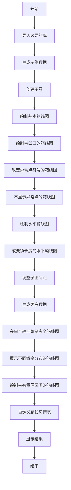

## 类结构

```
matplotlib.pyplot (主模块)
├── boxplot (绘制箱线图)
│   ├── basic plot
│   ├── notched plot
│   ├── change outlier point symbols
│   ├── don't show outlier points
│   ├── horizontal boxes
│   ├── change whisker length
│   └── ...
└── show (显示图形)
```

## 全局变量及字段


### `data`
    
An array containing the data to be visualized in the boxplot.

类型：`numpy.ndarray`
    


### `fig`
    
The figure object created by plt.subplots() for plotting.

类型：`matplotlib.figure.Figure`
    


### `ax`
    
The axes object created by plt.subplots() for plotting.

类型：`matplotlib.axes._subplots.AxesSubplot`
    


### `bp`
    
The boxplot container object created by ax.boxplot() for plotting the boxplot.

类型：`matplotlib.container.BoxplotContainerBase`
    


### `pos`
    
An array of positions for the boxplots.

类型：`numpy.ndarray`
    


### `top`
    
The top limit of the y-axis for the boxplot.

类型：`float`
    


### `bottom`
    
The bottom limit of the y-axis for the boxplot.

类型：`float`
    


### `inc`
    
A scaling factor for the standard deviation of the normal distribution used to generate the data.

类型：`float`
    


### `e1`
    
An array of data generated from a normal distribution with mean 0 and standard deviation 1.

类型：`numpy.ndarray`
    


### `e2`
    
An array of data generated from a normal distribution with mean 0 and standard deviation 1.

类型：`numpy.ndarray`
    


### `e3`
    
An array of data generated from a normal distribution with mean 1 and standard deviation 1.

类型：`numpy.ndarray`
    


### `e4`
    
An array of data generated from a normal distribution with mean 2 and standard deviation 1.

类型：`numpy.ndarray`
    


### `treatments`
    
A list of arrays containing the data for different treatments.

类型：`list`
    


### `med1`
    
The median of the first treatment group.

类型：`float`
    


### `ci1`
    
The confidence interval of the first treatment group.

类型：`tuple`
    


### `med2`
    
The median of the second treatment group.

类型：`float`
    


### `ci2`
    
The confidence interval of the second treatment group.

类型：`tuple`
    


### `x`
    
An array of x-values for the boxplot customization example.

类型：`numpy.ndarray`
    


### `fig`
    
The figure object created by plt.subplots() for plotting in the customization example.

类型：`matplotlib.figure.Figure`
    


### `ax`
    
The axes object created by plt.subplots() for plotting in the customization example.

类型：`matplotlib.axes._subplots.AxesSubplot`
    


### `matplotlib.figure.Figure.fig`
    
The figure object created by plt.subplots() for plotting.

类型：`matplotlib.figure.Figure`
    


### `matplotlib.axes._subplots.AxesSubplot.ax`
    
The axes object created by plt.subplots() for plotting.

类型：`matplotlib.axes._subplots.AxesSubplot`
    


### `matplotlib.container.BoxplotContainerBase.bp`
    
The boxplot container object created by ax.boxplot() for plotting the boxplot.

类型：`matplotlib.container.BoxplotContainerBase`
    


### `numpy.ndarray.pos`
    
An array of positions for the boxplots.

类型：`numpy.ndarray`
    


### `float.top`
    
The top limit of the y-axis for the boxplot.

类型：`float`
    


### `float.bottom`
    
The bottom limit of the y-axis for the boxplot.

类型：`float`
    


### `float.inc`
    
A scaling factor for the standard deviation of the normal distribution used to generate the data.

类型：`float`
    


### `numpy.ndarray.e1`
    
An array of data generated from a normal distribution with mean 0 and standard deviation 1.

类型：`numpy.ndarray`
    


### `numpy.ndarray.e2`
    
An array of data generated from a normal distribution with mean 0 and standard deviation 1.

类型：`numpy.ndarray`
    


### `numpy.ndarray.e3`
    
An array of data generated from a normal distribution with mean 1 and standard deviation 1.

类型：`numpy.ndarray`
    


### `numpy.ndarray.e4`
    
An array of data generated from a normal distribution with mean 2 and standard deviation 1.

类型：`numpy.ndarray`
    


### `list.treatments`
    
A list of arrays containing the data for different treatments.

类型：`list`
    


### `float.med1`
    
The median of the first treatment group.

类型：`float`
    


### `tuple.ci1`
    
The confidence interval of the first treatment group.

类型：`tuple`
    


### `float.med2`
    
The median of the second treatment group.

类型：`float`
    


### `tuple.ci2`
    
The confidence interval of the second treatment group.

类型：`tuple`
    


### `numpy.ndarray.x`
    
An array of x-values for the boxplot customization example.

类型：`numpy.ndarray`
    


### `matplotlib.figure.Figure.fig`
    
The figure object created by plt.subplots() for plotting in the customization example.

类型：`matplotlib.figure.Figure`
    


### `matplotlib.axes._subplots.AxesSubplot.ax`
    
The axes object created by plt.subplots() for plotting in the customization example.

类型：`matplotlib.axes._subplots.AxesSubplot`
    
    

## 全局函数及方法


### fake_bootstrapper

This function is a placeholder for the user's method of bootstrapping the median and its confidence intervals.

参数：

- `n`：`int`，The number of bootstrap samples to generate.

返回值：`tuple`，A tuple containing the median and confidence interval.

#### 流程图

```mermaid
graph LR
A[Start] --> B{Is n == 1?}
B -- Yes --> C[Set med = 0.1, ci = (-0.25, 0.25)]
B -- No --> D[Set med = 0.2, ci = (-0.35, 0.50)]
C --> E[Return (med, ci)]
D --> E
E --> F[End]
```

#### 带注释源码

```python
def fake_bootstrapper(n):
    """
    This is just a placeholder for the user's method of
    bootstrapping the median and its confidence intervals.

    Returns an arbitrary median and confidence interval packed into a tuple.
    """
    if n == 1:
        med = 0.1
        ci = (-0.25, 0.25)
    else:
        med = 0.2
        ci = (-0.35, 0.50)
    return med, ci
```


### np.random.seed

设置NumPy随机数生成器的种子，以确保每次运行代码时生成的随机数序列相同。

参数：

- `seed`：`int`，用于初始化随机数生成器的种子值。

返回值：无

#### 流程图

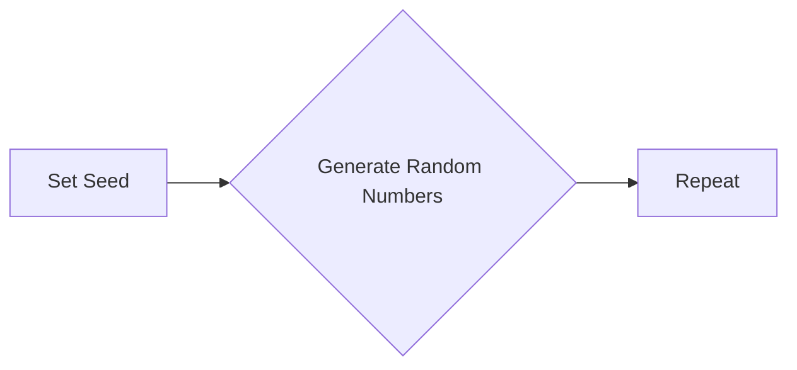

#### 带注释源码

```python
np.random.seed(19680801)
```

该行代码设置了NumPy随机数生成器的种子为19680801，确保每次运行代码时生成的随机数序列相同，从而使得结果可重复。


### np.random.rand

生成指定范围内浮点数的随机数组。

参数：

- `*size`：`int` 或 `tuple`，指定输出数组的形状。如果 `size` 是单个整数，则输出形状为 `(size,)` 的数组。如果 `size` 是元组，则输出形状为 `size` 的数组。

返回值：`float`，返回一个指定形状的浮点数数组。

#### 流程图

```mermaid
graph LR
A[开始] --> B{参数 size 是单个整数?}
B -- 是 --> C[创建形状为 (size,) 的浮点数数组]
B -- 否 --> D{参数 size 是元组?}
D -- 是 --> E[创建形状为 size 的浮点数数组]
E --> F[结束]
```

#### 带注释源码

```python
import numpy as np

def np_random_rand(*size):
    """
    Generate an array of random floats.

    Parameters:
    - *size: int or tuple, specifies the shape of the output array. If size is a single integer, an array of shape (size,) is output. If size is a tuple, an array of shape size is output.

    Returns:
    - float: an array of random floats with the specified shape.
    """
    return np.random.rand(*size)
```


### np.random.lognormal

生成具有对数正态分布的随机样本。

参数：

- `mean`：`float`，对数正态分布的均值。
- `sigma`：`float`，对数正态分布的标准差。
- `size`：`int`或`tuple`，输出数组的形状。

返回值：`numpy.ndarray`，具有对数正态分布的随机样本。

#### 流程图

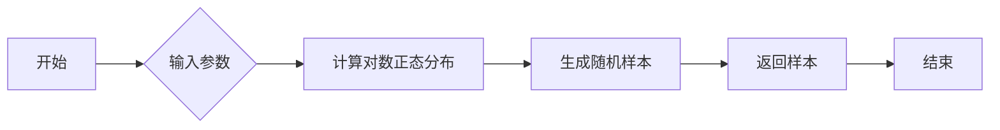

#### 带注释源码

```python
import numpy as np

def lognormal(mean, sigma, size=None):
    """
    Generate random samples from a lognormal distribution.

    Parameters:
    - mean: float, the mean of the lognormal distribution.
    - sigma: float, the standard deviation of the lognormal distribution.
    - size: int or tuple, the shape of the output array.

    Returns:
    - numpy.ndarray: an array of random samples from the lognormal distribution.
    """
    return np.random.lognormal(mean, sigma, size)
```


### np.random.exponential

生成具有指数分布的随机样本。

参数：

- `scale`：`float`，指数分布的尺度参数，表示平均值。
- `size`：`int` 或 `tuple`，输出数组的形状。

返回值：`float` 或 `ndarray`，具有指数分布的随机样本。

#### 流程图

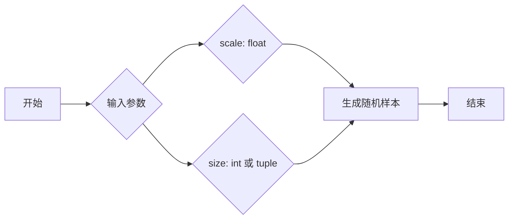

#### 带注释源码

```python
np.random.exponential(scale=1, size=100)
# 生成100个具有尺度参数为1的指数分布随机样本
```


### np.random.gumbel

生成Gumbel分布的样本。

参数：

- `a`：`float`，Gumbel分布的形状参数。
- `b`：`float`，Gumbel分布的尺度参数。

参数描述：

- `a`：形状参数，控制分布的形状。
- `b`：尺度参数，控制分布的尺度。

返回值：`numpy.ndarray`，Gumbel分布的样本。

返回值描述：返回一个指定形状的数组，包含从Gumbel分布中抽取的样本。

#### 流程图

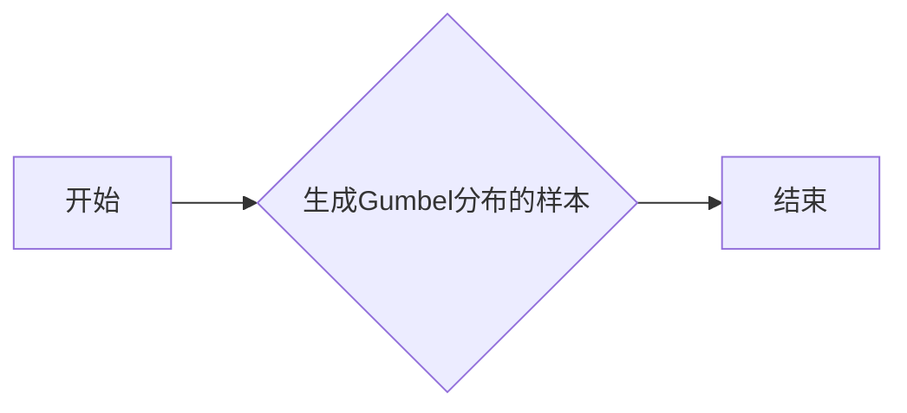

#### 带注释源码

```python
import numpy as np

def np_random_gumbel(a, b):
    """
    Generate samples from the Gumbel distribution.

    Parameters:
    - a: float, the shape parameter of the Gumbel distribution.
    - b: float, the scale parameter of the Gumbel distribution.

    Returns:
    - numpy.ndarray: an array of samples from the Gumbel distribution.
    """
    return np.random.gumbel(a, b)
```


### np.random.triangular

`np.random.triangular` 是 NumPy 库中的一个函数，用于生成具有三角形分布的随机样本。

参数：

- `low`：`float`，三角形分布的下限。
- `high`：`float`，三角形分布的上限。
- `mode`：`float`，三角形分布的峰值。
- `size`：`int` 或 `tuple`，生成随机样本的大小。

返回值：`numpy.ndarray`，包含具有三角形分布的随机样本。

#### 流程图

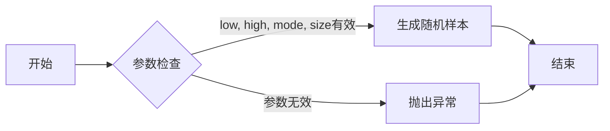

#### 带注释源码

```python
import numpy as np

def triangular(low, high, mode, size=None):
    """
    Generate random samples from a triangular distribution.

    Parameters:
    - low: float, the lower bound of the distribution.
    - high: float, the upper bound of the distribution.
    - mode: float, the mode of the distribution.
    - size: int or tuple, the size of the output sample.

    Returns:
    - numpy.ndarray, samples from the triangular distribution.
    """
    if low >= high or mode < low or mode > high:
        raise ValueError("Invalid parameters for triangular distribution.")
    return np.random._triangular(low, high, mode, size)
```


### np.random.randint

生成指定范围内的随机整数。

参数：

- `low`：`int`，随机整数的最小值（包含）。
- `high`：`int`，随机整数的最小值（不包含）。
- `size`：`int`或`tuple`，生成随机数的数量或形状。

参数描述：

- `low`：指定随机整数的最小值。
- `high`：指定随机整数的最小值，但不包含该值。
- `size`：指定生成随机数的数量或形状。

返回值类型：`int`或`numpy.ndarray`

返回值描述：返回一个随机整数或一个随机整数数组。

#### 流程图

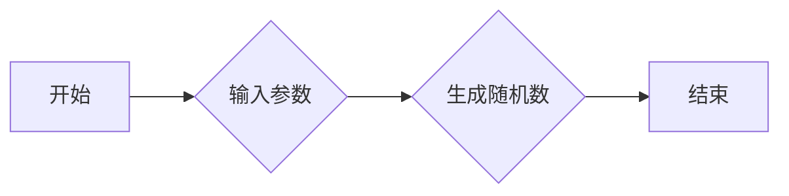

#### 带注释源码

```python
import numpy as np

# 生成一个介于0（包含）和10（不包含）之间的随机整数
random_int = np.random.randint(0, 10)

# 生成一个形状为(3, 2)的随机整数数组
random_array = np.random.randint(0, 10, size=(3, 2))
```


### np.average

计算输入数组的平均值。

参数：

- `a`：`numpy.ndarray`，输入数组。
- `weights`：`numpy.ndarray`，可选，权重数组，与输入数组长度相同。

返回值：`float`，输入数组的平均值。

#### 流程图

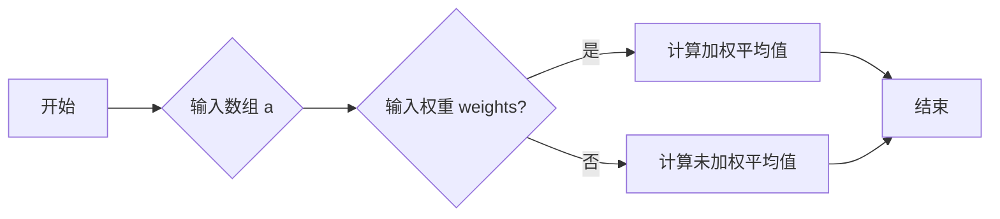

#### 带注释源码

```python
import numpy as np

def np_average(a, weights=None):
    """
    计算输入数组的平均值。

    参数：
    - a: numpy.ndarray，输入数组。
    - weights: numpy.ndarray，可选，权重数组，与输入数组长度相同。

    返回值：float，输入数组的平均值。
    """
    if weights is not None:
        return np.average(a, weights=weights)
    else:
        return np.mean(a)
```


### plt.setp

`plt.setp` 是一个全局函数，用于设置matplotlib对象的属性。

#### 描述

该函数允许用户设置matplotlib对象的属性，如线、标记、文本等。它接受一个对象列表和一个属性字典，其中包含要设置的属性和相应的值。

#### 参数

- `objects`：一个对象列表，可以是线、标记、文本等matplotlib对象。
- `props`：一个字典，包含要设置的属性和相应的值。

#### 返回值

无返回值。

#### 流程图

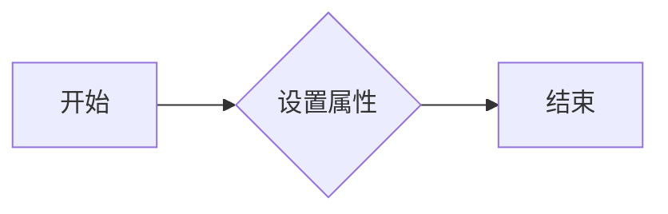

#### 带注释源码

```python
# 设置boxplot的boxes颜色为黑色
plt.setp(bp['boxes'], color='black')

# 设置whiskers颜色为黑色
plt.setp(bp['whiskers'], color='black')

# 设置fliers颜色为红色，标记为+
plt.setp(bp['fliers'], color='red', marker='+')
```

#### 关键组件信息

- `bp['boxes']`：boxplot的boxes对象列表。
- `bp['whiskers']`：boxplot的whiskers对象列表。
- `bp['fliers']`：boxplot的fliers对象列表。

#### 潜在的技术债务或优化空间

- 该函数依赖于matplotlib的内部实现，可能需要根据matplotlib的版本进行适配。
- 对于复杂的属性设置，可能需要编写额外的代码来处理。

#### 其它项目

- 设计目标与约束：该函数旨在提供灵活的方式来设置matplotlib对象的属性。
- 错误处理与异常设计：该函数可能抛出异常，如果提供的对象或属性无效。
- 数据流与状态机：该函数不涉及数据流或状态机。
- 外部依赖与接口契约：该函数依赖于matplotlib库。


### plt.show()

显示matplotlib图形。

参数：

- 无

返回值：无

#### 流程图

```mermaid
graph LR
A[开始] --> B{调用plt.show()}
B --> C[结束]
```

#### 带注释源码

```python
plt.show()
```


### np.linspace

`np.linspace` 是 NumPy 库中的一个函数，用于生成线性间隔的数字数组。

#### 描述

`np.linspace` 函数根据指定的起始值、结束值和间隔数生成一个线性间隔的数组。

#### 参数

- `start`：`float`，起始值。
- `stop`：`float`，结束值。
- `num`：`int`，生成的数组中的元素数量。

#### 返回值

- `array`：`ndarray`，包含线性间隔的数组。

#### 流程图

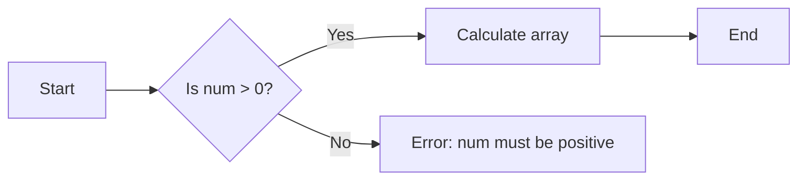

#### 带注释源码

```python
import numpy as np

def np_linspace(start, stop, num):
    """
    Generate linearly spaced numbers over a specified interval.

    Parameters:
    - start: float, the starting value of the interval.
    - stop: float, the ending value of the interval.
    - num: int, the number of samples to generate.

    Returns:
    - array: ndarray, an array of linearly spaced numbers.
    """
    if num <= 0:
        raise ValueError("num must be positive")
    return np.linspace(start, stop, num)
```


### np.hstack

`np.hstack` 是 NumPy 库中的一个函数，用于水平堆叠（横向连接）数组。

#### 描述

`np.hstack` 将一系列数组堆叠在一起，形成一个新的数组。所有输入数组必须具有相同的列数。

#### 参数

- `arrays`：要堆叠的数组列表。这些数组必须具有相同的列数。

#### 返回值

- `result`：堆叠后的新数组。

#### 流程图

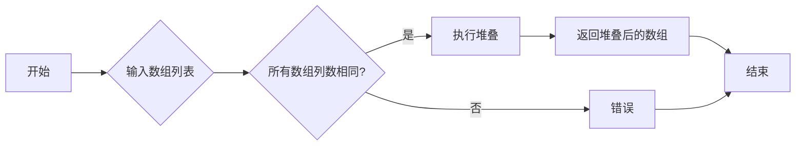

#### 带注释源码

```python
import numpy as np

# 假设有以下数组
a = np.array([1, 2, 3])
b = np.array([4, 5, 6])

# 使用 np.hstack 进行堆叠
result = np.hstack((a, b))

# 输出结果
print(result)  # 输出: [1 2 3 4 5 6]
```

#### 关键组件信息

- `np.hstack`：NumPy 库中的函数，用于水平堆叠数组。

#### 潜在的技术债务或优化空间

- 确保 `np.hstack` 的输入数组具有相同的列数，否则将引发错误。
- 可以考虑添加参数来指定堆叠的顺序或方向。

#### 设计目标与约束

- 设计目标：提供一种简单、高效的方法来水平堆叠数组。
- 约束：输入数组必须具有相同的列数。

#### 错误处理与异常设计

- 如果输入数组列数不同，则抛出 `ValueError`。

#### 数据流与状态机

- 数据流：输入数组列表 --> 堆叠后的数组。
- 状态机：无。

#### 外部依赖与接口契约

- 依赖：NumPy 库。
- 接口契约：`np.hstack` 函数的参数和返回值。


### matplotlib.pyplot.boxplot

matplotlib.pyplot.boxplot 是一个用于绘制箱线图的函数，它基于传入的数据集生成箱线图，可以显示数据的分布情况，包括中位数、四分位数和异常值。

参数：

- `data`：`array_like`，数据集，可以是二维数组或列表的列表。
- `positions`：`sequence`，可选，指定每个箱线图的位置。
- `widths`：`sequence`，可选，指定每个箱线图的宽度。
- `whis`：`float`，可选，指定计算箱线图须的范围。
- `patch_artist`：`bool`，可选，指定是否使用不同的颜色填充箱线图。
- `boxprops`：`dict`，可选，指定箱线图的属性，如颜色、线型等。
- `flierprops`：`dict`，可选，指定异常值的属性，如颜色、标记等。
- `medianprops`：`dict`，可选，指定中位数的属性，如颜色、线型等。
- `showfliers`：`bool`，可选，指定是否显示异常值。

返回值：`Boxplot` 对象，包含箱线图的各种属性和方法。

#### 流程图

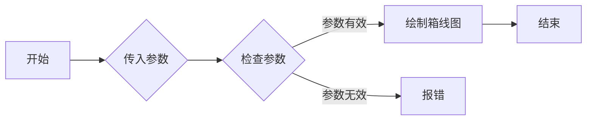

#### 带注释源码

```python
import matplotlib.pyplot as plt

# 创建数据集
data = [1, 2, 3, 4, 5, 6, 7, 8, 9, 10]

# 绘制箱线图
boxplot = plt.boxplot(data)

# 显示图形
plt.show()
```


### plt.show()

显示matplotlib图形。

参数：

- 无

返回值：无

#### 流程图

```mermaid
graph LR
A[开始] --> B{调用plt.show()}
B --> C[结束]
```

#### 带注释源码

```python
plt.show()  # 显示当前图形
```


### matplotlib.pyplot.boxplot

`matplotlib.pyplot.boxplot` 是一个用于绘制箱线图的函数，它基于传入的数据集生成箱线图，可以显示数据的分布情况，包括中位数、四分位数和异常值。

参数：

- `data`：`array_like`，数据集，可以是二维数组或列表的列表。
- `positions`：`sequence`，可选，指定每个箱线图的位置。
- `widths`：`sequence`，可选，指定每个箱线图的宽度。
- `whis`：`float`，可选，指定计算箱线图须的范围。
- `patch_artist`：`bool`，可选，指定是否使用不同的颜色填充箱线图。
- `notch`：`bool`，可选，指定是否绘制带凹口的箱线图。
- `usermedians`：`sequence`，可选，指定每个箱线图的中位数。
- `conf_intervals`：`sequence`，可选，指定每个箱线图的置信区间。
- `showfliers`：`bool`，可选，指定是否显示异常值。
- `flierprops`：`dict`，可选，指定异常值的属性。
- `boxprops`：`dict`，可选，指定箱线图的属性。
- `medianprops`：`dict`，可选，指定中位数的属性。
- `whiskerprops`：`dict`，可选，指定须的属性。

返回值：`Boxplot` 对象，包含箱线图的各种属性。

#### 流程图

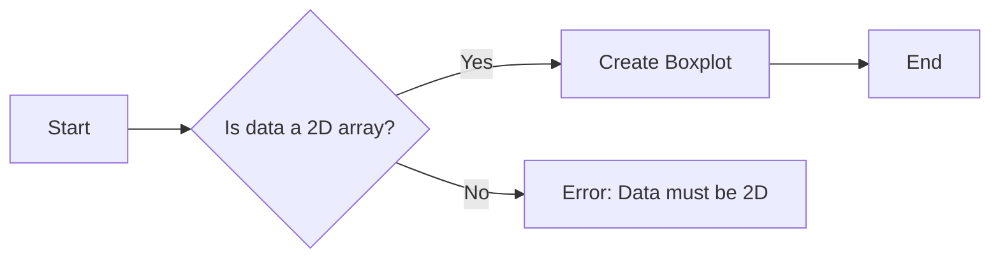

#### 带注释源码

```python
import matplotlib.pyplot as plt
import numpy as np

# Generate some random data
data = np.random.rand(50)

# Create a boxplot
bp = plt.boxplot(data)

# Set title and labels
plt.title('Boxplot Example')
plt.xlabel('Data')
plt.ylabel('Value')

# Show the plot
plt.show()
```


### numpy.ndarray.concatenate

`numpy.ndarray.concatenate` 是一个全局函数，用于连接一个或多个数组。

#### 描述

该函数将一个或多个数组沿着指定的轴连接起来，并返回一个新的数组。

#### 参数

- `arrays`：一个数组或数组序列，要连接的数组。
- `axis`：可选，连接的轴，默认为0。

#### 返回值

- `result`：连接后的新数组。

#### 流程图

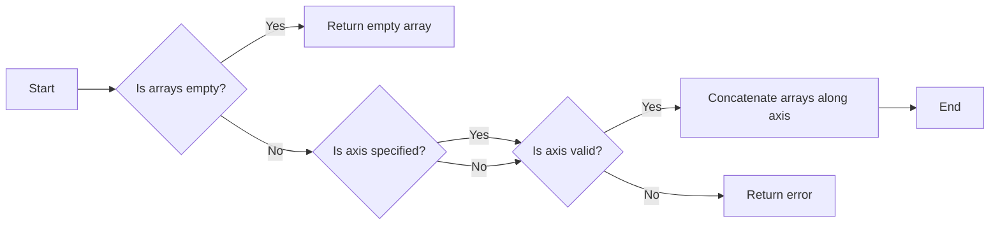

#### 带注释源码

```python
def concatenate(arrays, axis=0, out=None):
    """
    Join two or more arrays along a specified axis.

    Parameters
    ----------
    arrays : array_like
        An array or sequence of arrays to be joined. If an array is given, it is
        flattened and then joined.
    axis : int, optional
        The axis along which the arrays will be joined. If `axis` is `None`, the
        arrays will be flattened and then joined.
    out : ndarray, optional
        If provided, the destination to place the result. The shape must be correct
        to fit the concatenated arrays.

    Returns
    -------
    result : ndarray
        The concatenated arrays.

    Raises
    ------
    ValueError : if `arrays` is empty or if `axis` is invalid.

    Examples
    --------
    >>> a = np.array([1, 2, 3])
    >>> b = np.array([4, 5, 6])
    >>> np.concatenate((a, b))
    array([1, 2, 3, 4, 5, 6])
    >>> np.concatenate((a, b), axis=1)
    array([[1, 4],
           [2, 5],
           [3, 6]])
    """
    arrays = np.asarray(arrays)
    if arrays.size == 0:
        raise ValueError("At least one array must be provided")
    if arrays.ndim == 1:
        arrays = np.expand_dims(arrays, axis=0)
    if out is None:
        out = np.empty((arrays.shape[0],) + arrays.shape[1:]), dtype=arrays.dtype)
    return np.add.reduceat(arrays, np.cumsum(arrays.shape[1:]), axis=axis)
```


### numpy.ndarray.random.rand

生成一个指定形状和随机分布的浮点数数组。

{描述}

参数：

- `*args`：`int` 或 `tuple`，指定数组的形状。
- `dtype`：`dtype`，可选，指定数组的类型，默认为 `float`。

返回值：`numpy.ndarray`，形状为 `*args` 的浮点数数组。

#### 流程图

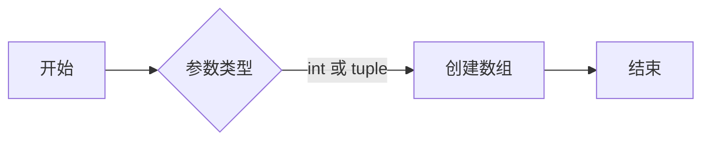

#### 带注释源码

```python
import numpy as np

def random_rand(*args, dtype=np.float):
    """
    生成一个指定形状和随机分布的浮点数数组。

    参数：
    - *args：int 或 tuple，指定数组的形状。
    - dtype：dtype，可选，指定数组的类型，默认为 float。

    返回值：numpy.ndarray，形状为 *args 的浮点数数组。
    """
    return np.random.rand(*args, dtype=dtype)
```


### matplotlib.pyplot.boxplot

`boxplot` 方法用于绘制箱线图。

#### 描述

`boxplot` 方法是 `matplotlib.pyplot` 模块的一部分，用于绘制箱线图。箱线图是一种统计图表，用于展示一组数据的分布情况，包括中位数、四分位数和异常值。

#### 参数

- `data`：`numpy.ndarray` 或 `list`，要绘制的数据。
- `positions`：`array_like`，每个数据集的 x 轴位置。
- `widths`：`array_like`，每个数据集的宽度。
- `whis`：`float`，用于确定异常值的范围。
- `patch_artist`：`bool`，是否使用不同的颜色填充箱体。
- `boxprops`：`dict`，箱体的属性。
- `flierprops`：`dict`，异常值的属性。
- `medianprops`：`dict`，中位数的属性。
- `showfliers`：`bool`，是否显示异常值。
- `showmeans`：`bool`，是否显示均值。
- `showmedians`：`bool`，是否显示中位数。
- `showcaps`：`bool`，是否显示箱体的帽。
- `showbox`：`bool`，是否显示箱体。
- `showfliers`：`bool`，是否显示异常值。
- `bootstrap`：`int`，用于计算置信区间的重采样次数。
- `usermedians`：`array_like`，自定义的中位数。
- `conf_intervals`：`array_like`，自定义的置信区间。

#### 返回值

- `bp`：`Boxplot` 对象，包含箱线图的各种属性。

#### 流程图

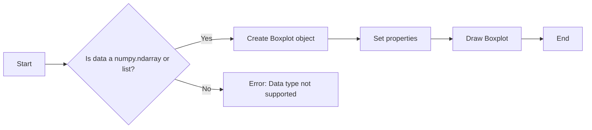

#### 带注释源码

```python
import matplotlib.pyplot as plt
import numpy as np

# Generate some random data
data = np.random.rand(50)

# Create a boxplot
bp = plt.boxplot(data)

# Set properties
plt.setp(bp['boxes'], color='black')
plt.setp(bp['whiskers'], color='black')
plt.setp(bp['fliers'], color='red', marker='+')

# Show the plot
plt.show()
```


### matplotlib.patches.Polygon.__init__

初始化一个多边形对象。

参数：

- `vertices`：`list`，多边形的顶点坐标列表，每个坐标是一个包含两个元素的元组或列表，分别代表x和y坐标。
- `closed`：`bool`，指示多边形是否闭合。默认为`True`。

返回值：无

#### 流程图

```mermaid
graph LR
A[初始化] --> B{顶点坐标列表}
B --> C{闭合}
C --> D[创建多边形对象]
```

#### 带注释源码

```python
from matplotlib.patches import Polygon

def create_polygon(vertices, closed=True):
    """
    创建一个多边形对象。

    :param vertices: 多边形的顶点坐标列表，每个坐标是一个包含两个元素的元组或列表，分别代表x和y坐标。
    :param closed: 指示多边形是否闭合。默认为True。
    :return: 多边形对象。
    """
    polygon = Polygon(vertices, closed=closed)
    return polygon
```


### Polygon

`Polygon` 是 `matplotlib.patches` 模块中的一个类，用于创建一个多边形。

#### 描述

`Polygon` 类用于创建一个多边形，可以指定顶点坐标和填充颜色。

#### 参数

- `vertices`：`list`，多边形的顶点坐标列表，每个坐标是一个包含两个元素的元组或列表，表示 x 和 y 坐标。
- `facecolor`：`color`，多边形的填充颜色。

#### 返回值

`Polygon` 对象。

#### 流程图

```mermaid
graph LR
A[创建 Polygon 对象] --> B{指定顶点坐标}
B --> C{指定填充颜色}
C --> D[返回 Polygon 对象]
```

#### 带注释源码

```python
from matplotlib.patches import Polygon

# 创建一个多边形，顶点坐标为 [(0,0), (1,0), (1,1), (0,1)]
polygon = Polygon([(0,0), (1,0), (1,1), (0,1)], facecolor='blue')

# 绘制多边形
fig, ax = plt.subplots()
ax.add_patch(polygon)
plt.show()
```


## 关键组件


### 张量索引与惰性加载

张量索引与惰性加载是用于高效处理大型数据集的关键组件。它允许在需要时才计算数据，从而减少内存消耗和提高性能。

### 反量化支持

反量化支持是用于将量化后的数据转换回原始数据类型的功能。这对于在量化模型训练和推理过程中保持数据精度至关重要。

### 量化策略

量化策略是用于将浮点数数据转换为低精度整数数据的方法。这有助于减少模型大小和提高推理速度，但可能会牺牲一些精度。

## 问题及建议


### 已知问题

-   **代码重复性**：代码中存在多个重复的boxplot绘制部分，这可能导致维护困难。例如，绘制基本boxplot、notched plot、改变异常点符号等部分在代码中多次出现。
-   **全局变量使用**：代码中使用了全局变量，如`np.random.seed`和`np.random.randint`，这可能导致代码的可读性和可维护性降低，尤其是在大型项目中。
-   **数据结构选择**：在处理多个数据集时，代码使用了列表来存储数据，这可能导致性能问题，尤其是在处理大量数据时。
-   **异常处理**：代码中没有明显的异常处理机制，这可能导致在运行时遇到错误时程序崩溃。

### 优化建议

-   **代码重构**：将重复的代码部分提取为函数，以提高代码的可读性和可维护性。
-   **减少全局变量使用**：尽量使用局部变量，并在必要时使用类或模块来封装相关的变量和方法。
-   **优化数据结构**：考虑使用更高效的数据结构，如NumPy数组，以处理大量数据。
-   **添加异常处理**：在代码中添加异常处理机制，以防止程序在遇到错误时崩溃，并提高程序的健壮性。
-   **代码注释**：增加代码注释，以解释代码的功能和逻辑，提高代码的可读性。
-   **单元测试**：编写单元测试来验证代码的功能，确保代码的正确性和稳定性。
-   **性能优化**：对代码进行性能分析，找出性能瓶颈，并进行优化。

## 其它


### 设计目标与约束

- 设计目标：实现一个使用matplotlib库绘制箱线图的工具，能够展示数据的分布情况。
- 约束条件：必须使用matplotlib库进行绘图，且代码应具有良好的可读性和可维护性。

### 错误处理与异常设计

- 错误处理：在数据预处理和绘图过程中，应捕获并处理可能出现的异常，如数据类型错误、绘图参数错误等。
- 异常设计：定义自定义异常类，用于处理特定的错误情况，如`DataError`和`PlotError`。

### 数据流与状态机

- 数据流：数据从输入到绘图的过程包括数据预处理、绘图参数设置、绘图执行等步骤。
- 状态机：状态机可以描述绘图过程中的不同状态，如`Idle`、`Processing`、`Plotting`、`Completed`。

### 外部依赖与接口契约

- 外部依赖：代码依赖于matplotlib和numpy库。
- 接口契约：定义接口规范，确保外部模块与代码的交互符合预期，如`Boxplotter`接口。


    