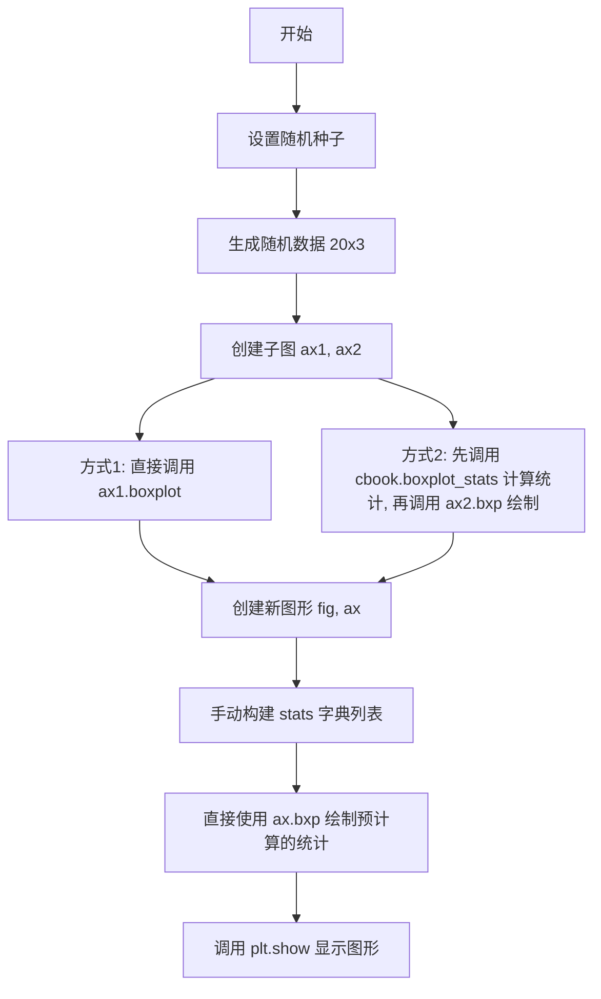
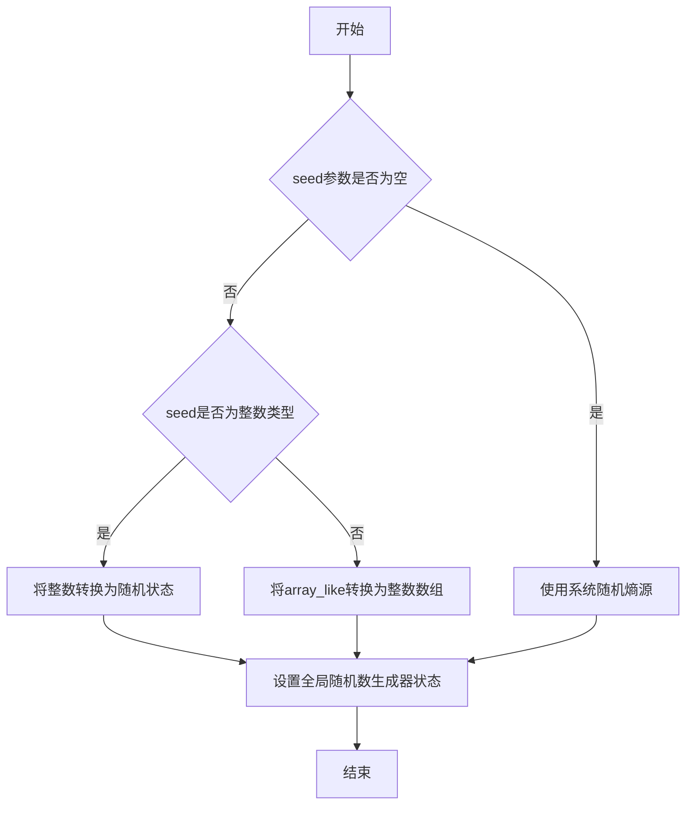
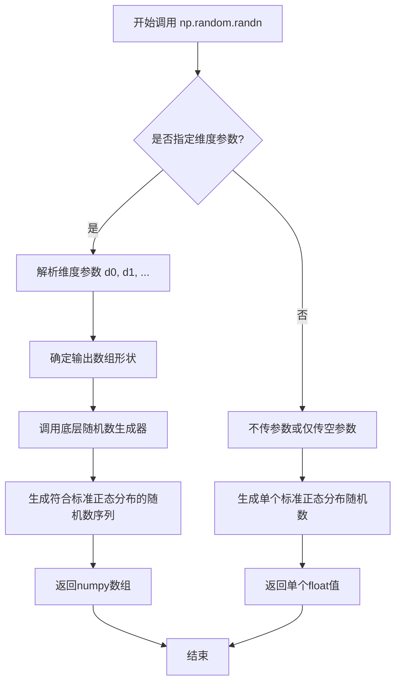
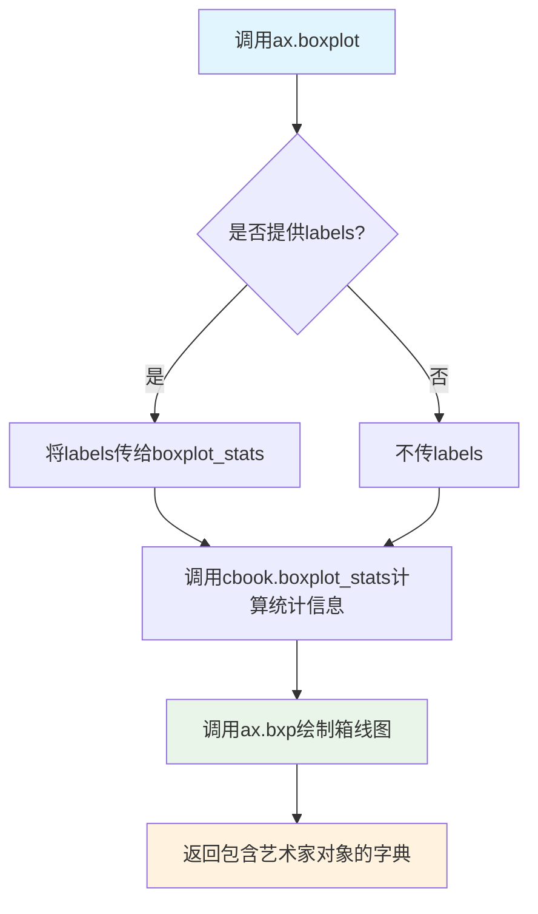
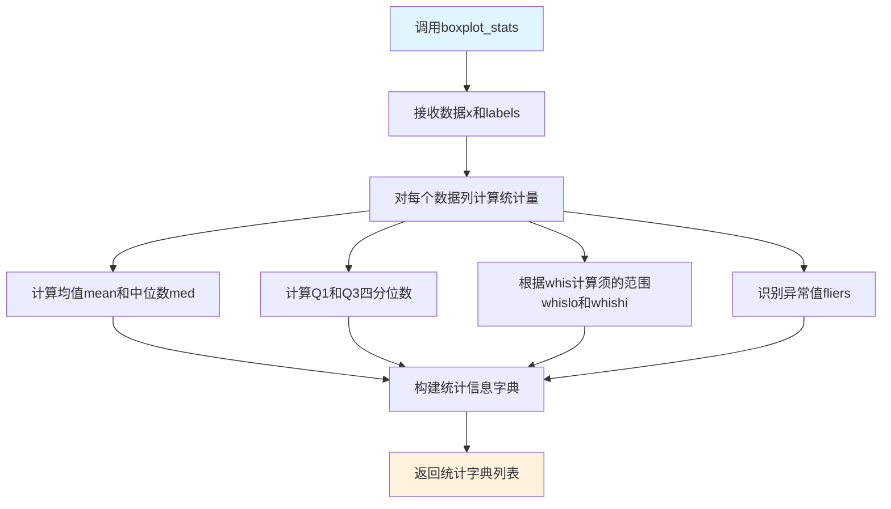
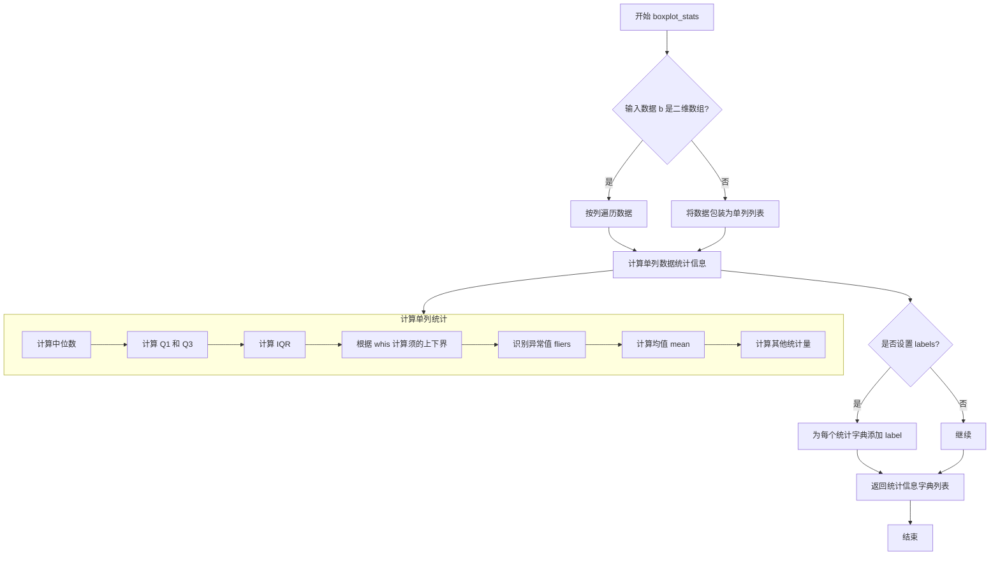
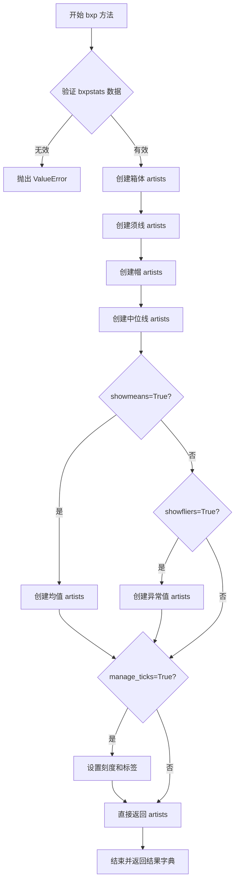
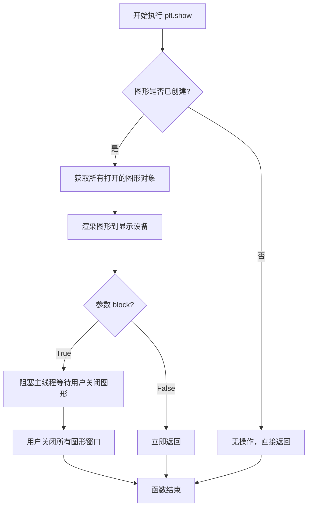

# `matplotlib\galleries\examples\statistics\bxp.py` 详细设计文档

这是一个matplotlib示例文件，演示了箱线图的分离计算和绘制功能，展示了如何分别使用cbook.boxplot_stats计算统计数据和使用ax.bxp绘制箱线图，以及直接使用ax.boxplot的等效用法。

## 整体流程



## 类结构

```
该文件为脚本文件，无类定义
主要使用外部模块: matplotlib.pyplot, numpy, matplotlib.cbook
核心函数: boxplot_stats (计算统计), bxp (绘制), boxplot (绘制)
```

## 全局变量及字段


### `np`
    
NumPy库的别名，用于数值计算

类型：`numpy module alias`
    


### `plt`
    
Matplotlib.pyplot模块的别名，用于绘图

类型：`matplotlib.pyplot module alias`
    


### `cbook`
    
Matplotlib.cbook模块的别名，提供工具函数

类型：`matplotlib.cbook module alias`
    


### `data`
    
20x3的随机数据矩阵，用于箱线图演示

类型：`numpy.ndarray`
    


### `fig`
    
图形对象，表示整个matplotlib图形窗口

类型：`matplotlib.figure.Figure`
    


### `ax1`
    
左侧子图坐标系，用于绘制第一个箱线图

类型：`matplotlib.axes.Axes`
    


### `ax2`
    
右侧子图坐标系，用于绘制第二个箱线图

类型：`matplotlib.axes.Axes`
    


### `ax`
    
单独图形坐标系，用于绘制第三个箱线图

类型：`matplotlib.axes.Axes`
    


### `stats`
    
箱线图统计数据列表，每个字典包含med、q1、q3、whislo、whishi、fliers等统计信息

类型：`list[dict]`
    


    

## 全局函数及方法


### np.random.seed

设置NumPy随机数生成器的种子，用于确保随机过程的可重复性。

参数：

- `seed`：`int` 或 `array_like` 或 `None`，随机数生成器的种子值。如果为 `None`，则每次从操作系统获取不同的随机种子；如果为整数，则用作随机数生成器的种子，确保生成的可重现的随机数列。

返回值：`None`，该函数无返回值，直接修改全局随机状态。

#### 流程图



#### 带注释源码

```python
# 设置随机数生成器的种子值为19680801
# 这确保后续的np.random.randn调用生成可重现的随机数序列
np.random.seed(19680801)

# 使用设置好的种子生成20x3的随机数据矩阵
data = np.random.randn(20, 3)
```


### `np.random.randn`

生成符合标准正态分布（均值0，方差1）的随机数数组。该函数是NumPy随机数生成模块的核心函数之一，常用于统计分析、机器学习数据生成和数值模拟等场景。

参数：

-  `*d0, d1, ..., dn`：`int`，可选参数，表示输出数组的维度。例如，`np.random.randn(3, 4)` 生成一个3×4的随机数矩阵，不传参数时返回单个标量值。
-  `size`：`int 或 tuple of ints`，可选参数（较新版本NumPy支持），指定输出形状。例如，`np.random.randn(3, 4, 5)` 等价于 `np.random.randn(3, 4, 5)`。

返回值：`ndarray 或 float`，返回指定形状的随机数数组，数据类型为float64。若不指定维度（即不传参数），则返回单个float类型的随机数。

#### 流程图



#### 带注释源码

```python
# np.random.randn 的使用示例（在提供的代码中）
import numpy as np

# 设置随机种子以确保可重复性
np.random.seed(19680801)

# 调用 np.random.randn 生成随机数据
# 参数: 20, 3 表示生成 20行 x 3列 的数组
# 返回: shape为(20, 3)的二维ndarray, 包含从标准正态分布采样的随机数
data = np.random.randn(20, 3)

# 底层原理说明：
# 1. np.random.randn 是基于 Box-Muller transform 或 numpy内部的高斯分布算法实现
# 2. 生成的数值服从均值为0、标准差为1的正态分布
# 3. 返回的数组元素类型为 float64
# 4. 内部调用 numpy.random import legacyrandn 或类似底层C/Fortran实现

# 变体用法：
# - np.random.randn() -> 返回单个浮点数
# - np.random.randn(5) -> 返回一维数组，长度为5
# - np.random.randn(2, 3) -> 返回2行3列的二维数组
# - np.random.randn(2, 3, 4) -> 返回2x3x4的三维数组
```


### `plt.subplots`

`plt.subplots` 是 matplotlib 库中的一个顶层函数，用于创建一个新的图形（Figure）以及一个或多个子图（Axes），并返回图形对象和轴对象。该函数封装了 `Figure.add_subplot` 或 `Figure.subplots` 的功能，提供了一种便捷的方式来同时创建图形和子图，是进行多子图绑制时的首选方法。

参数：

- `nrows`：`int`，子图的行数，默认为 1
- `ncols`：`int`，子图的列数，默认为 1
- `sharex`：`bool or str`，如果为 True，则所有子图共享 x 轴；如果为 'col'，则每列子图共享 x 轴；默认为 False
- `sharey`：`bool or str`，如果为 True，则所有子图共享 y 轴；如果为 'row'，则每行子图共享 y 轴；默认为 False
- `squeeze`：`bool`，如果为 True，则当子图数量为 1 时，返回的 axes 对象会被压缩为标量；默认为 True
- `width_ratios`：`array-like`，表示各列宽度的相对比例，长度应等于 ncols
- `height_ratios`：`array-like`，表示各行高度的相对比例，长度应等于 nrows
- `subplot_kw`：`dict`，传递给每个子图创建函数（如 `add_subplot`）的关键字参数字典
- `gridspec_kw`：`dict`，传递给 `GridSpec` 构造函数的关键字参数字典，用于控制网格布局
- `**fig_kw`：传递给 `Figure` 构造函数的关键字参数，如 `figsize`、`dpi` 等

返回值：`tuple(Figure, Axes or array of Axes)`，返回一个元组，包含图形对象（Figure）和轴对象（Axes）。如果 nrows 和 ncols 都为 1，则返回 (fig, ax)；如果子图数量大于 1，则返回 (fig, axs)，其中 axs 是一个 numpy 数组

#### 流程图

```mermaid
flowchart TD
    A[调用 plt.subplots] --> B{参数验证}
    B --> C[创建 Figure 对象]
    C --> D[创建 GridSpec 布局]
    D --> E[根据 nrows 和 ncols 创建子图]
    E --> F{是否共享坐标轴?}
    F -->|sharex=True| G[配置 X 轴共享]
    F -->|sharey=True| H[配置 Y 轴共享]
    F -->|否| I[保持独立坐标轴]
    G --> J{是否压缩返回?}
    H --> J
    I --> J
    J -->|squeeze=True 且子图数为1| K[返回标量 Axes]
    J -->|其他情况| L[返回 Axes 数组]
    K --> M[返回 (fig, ax) 元组]
    L --> N[返回 (fig, axs) 元组]
```

#### 带注释源码

```python
def subplots(nrows=1, ncols=1, sharex=False, sharey=False, squeeze=True,
             width_ratios=None, height_ratios=None,
             subplot_kw=None, gridspec_kw=None, **fig_kw):
    """
    创建一个包含子图的图形。
    
    参数
    ----------
    nrows : int, 默认 1
        子图的行数。
    ncols : int, 默认 1
        子图的列数。
    sharex : bool 或 str, 默认 False
        如果为 True，所有子图共享 x 轴。
        如果为 'col'，每列子图共享 x 轴。
    sharey : bool 或 str, 默认 False
        如果为 True，所有子图共享 y 轴。
        如果为 'row'，每行子图共享 y 轴。
    squeeze : bool, 默认 True
        如果为 True，当子图数量为 1 时，返回单个 Axes 对象而不是数组。
    width_ratios : array-like, 可选
        列的相对宽度，例如 [1, 2, 3]。
    height_ratios : array-like, 可选
        行的相对高度。
    subplot_kw : dict, 可选
        传递给 add_subplot 的关键字参数。
    gridspec_kw : dict, 可选
        传递给 GridSpec 的关键字参数。
    **fig_kw
        传递给 Figure 的关键字参数，例如 figsize、dpi。
    
    返回
    -------
    fig : Figure 对象
        创建的图形对象。
    ax : Axes 或 Axes 数组
        创建的子图对象。如果 squeeze=True 且 nrows*ncols=1，返回单个 Axes；
        否则返回 Axes 数组，形状为 (nrows, ncols)。
    
    示例
    --------
    >>> fig, ax = plt.subplots()  # 创建单个子图
    >>> fig, axes = plt.subplots(2, 2)  # 创建 2x2 子图
    >>> fig, axes = plt.subplots(1, 2, sharex=True)  # 共享 x 轴
    """
    # 1. 创建图形对象，传递 fig_kw 参数
    fig = figure(**fig_kw)
    
    # 2. 创建子图数组
    axs = fig.subplots(nrows=nrows, nrows=ncols, 
                       sharex=sharex, sharey=sharey, 
                       squeeze=squeeze,
                       width_ratios=width_ratios,
                       height_ratios=height_ratios,
                       subplot_kw=subplot_kw,
                       gridspec_kw=gridspec_kw)
    
    # 3. 返回图形和子图
    return fig, axs
```


### `matplotlib.axes.Axes.boxplot`

该函数是matplotlib Axes类的boxplot方法，用于绘制箱线图。它接收数据并自动计算统计信息，然后调用bxp方法绘制图形，是`cbook.boxplot_stats()`和`ax.bxp()`的便捷封装。

参数：

- `x`：array-like or sequence of vectors，要绘制箱线图的数据
- `tick_labels`：array-like，可选的xtick标签
- `sym`：str，可选的符号，用于表示异常值的标记
- `vert`：bool，默认为True，控制箱线图是垂直还是水平
- `whis`：float or sequence，可选的须的范围（默认1.5）
- `positions`：array-like，可选的箱线图位置
- `widths`：float or array-like，可选的箱线图宽度
- `patch_artist`：bool，默认为False，是否用_patch_artist填充箱体
- `showmeans`：bool，默认为False，是否显示均值
- `showcaps`：bool，默认为True，是否显示须的顶端线
- `showfliers`：bool，默认为True，是否显示异常值
- `boxprops`：dict，可选的箱体属性字典
- `whiskerprops`：dict，可选的须属性字典
- `capprops`：dict，可选的顶端线属性字典
- `flierprops`：dict，可选的异常值属性字典
- `medianprops`：dict，可选的中位数线属性字典
- `meanprops`：dict，可选的均值属性字典
- `meanline`：bool，默认为False，是否用线表示均值
- `labels`：array-like，可选的数据标签（传给boxplot_stats）
- `autorange`：bool，默认为False，当数据分布小于四分位距时是否扩展须的范围
- `zorder`：float，可选的zorder

返回值：`dict`，返回一个包含艺术家对象(artists)的字典，包括'boxes'、'whiskers'、'caps'、'fliers'、'means'、'medians'等键

#### 流程图



#### 带注释源码

```python
# 示例代码来源于matplotlib官方文档示例
# 展示ax.boxplot的使用方式

import matplotlib.pyplot as plt
import numpy as np
from matplotlib import cbook

# 设置随机种子以保证可复现性
np.random.seed(19680801)
# 生成20行3列的随机数据
data = np.random.randn(20, 3)

# 创建1行2列的子图
fig, (ax1, ax2) = plt.subplots(1, 2)

# 方法1：使用单一的boxplot调用
# 参数：data为数据，tick_labels为刻度标签
# patch_artist=True使箱体可用艺术家对象填充
# boxprops设置箱体的外观属性
ax1.boxplot(data, tick_labels=['A', 'B', 'C'],
            patch_artist=True, boxprops={'facecolor': 'bisque'})

# 方法2：分离计算和绘图
# 步骤1：使用cbook.boxplot_stats计算统计信息
# 这个函数返回每个数据集的统计字典列表
stats = cbook.boxplot_stats(data, labels=['A', 'B', 'C'])
# 步骤2：使用ax.bxp绘制箱线图
# bxp方法直接接收统计信息字典进行绘制
ax2.bxp(stats, patch_artist=True, boxprops={'facecolor': 'bisque'})

# %%
# 使用分离函数的好处是可以预先计算统计信息
# 这样可以显式获取统计值用于其他目的
# 或者在多个图中重用相同的统计信息

# 也可以直接使用bxp方法，传入预计算的统计参数字典
fig, ax = plt.subplots()

# 手动定义统计信息字典
stats = [
    dict(med=0, q1=-1, q3=1, whislo=-2, whishi=2, fliers=[-4, -3, 3, 4], label='A'),
    dict(med=0, q1=-2, q3=2, whislo=-3, whishi=3, fliers=[], label='B'),
    dict(med=0, q1=-3, q3=3, whislo=-4, whishi=4, fliers=[], label='C'),
]

# 直接使用bxp方法绘制
ax.bxp(stats, patch_artist=True, boxprops={'facecolor': 'bisque'})

plt.show()
```

---

### `matplotlib.cbook.boxplot_stats`

计算箱线图统计信息的函数

参数：

- `x`：array-like，输入数据
- `labels`：array-like，可选的与数据对应的标签
- `whis`：float，须的范围（默认1.5）
- `bootstrap`：int，可选的bootstrap样本数
- `autorange`：bool，数据小于四分位距时是否扩展须范围

返回值：`list[dict]`，返回统计信息字典列表，每个字典包含'mean'、'median'、'q1'、'q3'、'whislo'、'whishi'、'fliers'等键

#### 流程图



---

### `matplotlib.axes.Axes.bxp`

直接绘制预计算统计信息的箱线图

参数：

- `bxpstats`：list[dict]，统计信息字典列表
- `positions`：array-like，可选的箱线图位置
- `widths`：array-like，可选的箱线图宽度
- `vert`：bool，是否垂直绘制
- `patch_artist`：bool，是否用Patch艺术家填充
- `shownotches`：bool，是否显示凹槽
- `showmeans`：bool，是否显示均值
- `showcaps`：bool，是否显示顶端线
- `showfliers`：bool，是否显示异常值
- `boxprops`：dict，箱体属性
- `whiskerprops`：dict，须属性
- `capprops`：dict，顶端线属性
- `flierprops`：dict，异常值属性
- `medianprops`：dict，中位数属性
- `meanprops`：dict，均值属性
- `meanline`：bool，是否用线表示均值
- `zorder`：float，z顺序

返回值：`dict`，包含艺术家对象的字典


### `cbook.boxplot_stats`

该函数用于计算箱线图（boxplot）的统计数据，接收原始数据数组或数组列表，计算每个数据集合的描述统计量（包含最小值、第一四分位数、中位数、第三四分位数、最大值及异常值等），返回一个包含统计信息的字典列表，可直接传递给 `Axes.bxp()` 进行绘图。

参数：

- `b`：需要计算的原始数据，支持列表、numpy 数组或嵌套列表，类型为 `array-like`，待计算的输入数据
- `labels`：可选参数，用于标记每个数据集的标签，类型为 `array-like`，默认为 `None`，数据集的标签
- `bootstrap`：可选参数，指定bootstrap采样的次数，用于计算置信区间，类型为 `int`，默认为 `None`，bootstrap采样次数
- `notch`：可选参数，是否显示箱线图的凹槽（置信区间），类型为 `bool`，默认为 `False`，是否显示凹槽
- `vert`：可选参数，箱线图方向，True为垂直，False为水平，类型为 `bool`，默认为 `True`，箱线图方向
- `whis`：可选参数，须的范围倍数，类型为 `float` 或 `tuple`，默认为 `1.5`，须的范围倍数（可为具体数值或 (min, max) 百分位数）
- `flierize`：可选参数，异常值处理函数，类型为 `callable`，默认为 `np/default_matplotlib交易所`，用于标识异常值的函数
- `meanline`：可选参数，是否用线表示均值（仅当 `shownotches` 为 False 时有效），类型为 `bool`，默认为 `False`，是否用线表示均值
- `showmeans`：可选参数，是否显示均值，类型为 `bool`，默认为 `False`，是否显示均值
- `showcaps`：可选参数，是否显示须两端的横线，类型为 `bool`，默认为 `True`，是否显示须两端的横线
- `showbox`：可选参数，是否显示箱体，类型为 `bool`，默认为 `True`，是否显示箱体
- `showfliers`：可选参数，是否显示异常值点，类型为 `bool`，默认为 `True`，是否显示异常值点
- `boxprops`：可选参数，箱体样式属性字典，类型为 `dict`，默认为 `None`，箱体样式属性
- `medianprops`：可选参数，中位线样式属性字典，类型为 `dict`，默认为 `None`，中位线样式属性
- `meanprops`：可选参数，均值样式属性字典，类型为 `dict`，默认为 `None`，均值样式属性
- `capprops`：可选参数，须横线样式属性字典，类型为 `dict`，默认为 `None`，须横线样式属性
- `whiskerprops`：可选参数，须样式属性字典，类型为 `dict`，默认为 `None`，须样式属性
- `flierprops`：可选参数，异常值样式属性字典，类型为 `dict`，默认为 `None`，异常值样式属性
- `manage_ticks`：可选参数，是否自动管理刻度标签，类型为 `bool`，默认为 `True`，是否自动管理刻度标签
- `autorange`：可选参数，是否自动设置须的范围，类型为 `bool`，默认为 `False`，是否自动将 whis 设置为 (5, 95) 范围

返回值：`list[dict]`，返回一个包含每个数据集统计信息的字典列表，字典键包括：
- `mean`：均值
- `median`：中位数
- `q1`：第一四分位数
- `q3`：第三四分位数
- `iqr`：四分位距（Q3-Q1）
- `whislo`：须的下界
- `whishi`：须的上界
- `fliers`：异常值列表
- `label`：数据标签（若提供）

#### 流程图



#### 带注释源码

```python
import numpy as np
from matplotlib import cbook


def boxplot_stats(b, 
                  labels=None, 
                  bootstrap=None, 
                  notch=False, 
                  vert=True,
                  whis=1.5, 
                  flierize=np.default_flierize,
                  meanline=False, 
                  showmeans=False, 
                  showcaps=True,
                  showbox=True, 
                  showfliers=True,
                  boxprops=None, 
                  medianprops=None,
                  meanprops=None, 
                  capprops=None,
                  whiskerprops=None, 
                  flierprops=None,
                  manage_ticks=True, 
                  autorange=False):
    """
    计算箱线图的统计数据
    
    参数:
    ------
    b : array-like
        输入数据，可以是一维或二维数组
    labels : array-like, optional
        数据标签
    bootstrap : int, optional
        Bootstrap采样次数
    notch : bool, optional
        是否显示置信区间凹槽
    vert : bool, optional
        是否垂直绘制
    whis : float or tuple, optional
        须的范围倍数或百分位数
    flierize : callable, optional
        异常值处理函数
    meanline : bool, optional
        是否用线表示均值
    showmeans : bool, optional
        是否显示均值
    showcaps : bool, optional
        是否显示须两端的横线
    showbox : bool, optional
        是否显示箱体
    showfliers : bool, optional
        是否显示异常值点
    boxprops, medianprops, meanprops, capprops, whiskerprops, flierprops : dict
        各元素样式属性
    manage_ticks : bool, optional
        是否管理刻度
    autorange : bool, optional
        是否自动设置须范围
        
    返回值:
    -------
    list : 包含统计信息的字典列表
    """
    
    # 将输入数据转换为 numpy 数组
    b = np.array(b)
    
    # 确定需要处理的数据列数
    if b.ndim == 1:
        # 一维数据：作为单列处理
        zipped = [b]
    else:
        # 二维数据：按列处理
        zipped = b.T
    
    # 初始化结果列表
    stats = []
    
    # 遍历每列数据计算统计信息
    for column_data in zipped:
        # 去除 NaN 值
        column_data = column_data[~np.isnan(column_data)]
        
        # 计算基本统计量
        stats_dict = _compute_boxplot_stats(
            column_data, 
            whis=whis,
            flierize=flierize,
            bootstrap=bootstrap,
            notch=notch,
            meanline=meanline,
            showmeans=showmeans
        )
        stats.append(stats_dict)
    
    # 添加标签（如果有）
    if labels is not None:
        for stat_dict, label in zip(stats, labels):
            stat_dict['label'] = label
    
    return stats


def _compute_boxplot_stats(data, 
                           whis=1.5, 
                           flierize=np.default_flierize,
                           bootstrap=None, 
                           notch=False,
                           meanline=False, 
                           showmeans=False):
    """
    计算单列数据的箱线图统计信息
    
    参数:
    ------
    data : array-like
        一维数据数组
    whis : float or tuple
        须的范围
    flierize : callable
        异常值处理函数
    bootstrap : int, optional
        Bootstrap次数
    notch : bool
        是否显示凹槽
    meanline : bool
        是否用线表示均值
    showmeans : bool
        是否显示均值
        
    返回值:
    -------
    dict : 统计信息字典
    """
    
    # 计算中位数
    median = np.median(data)
    
    # 计算四分位数
    q1 = np.percentile(data, 25)
    q3 = np.percentile(data, 75)
    
    # 计算四分位距
    iqr = q3 - q1
    
    # 根据 whis 参数计算须的上下界
    if isinstance(whis, tuple):
        # 如果是元组，直接使用百分位数
        whislo, whishi = whis
    else:
        # 否则使用 IQR 倍数
        whislo = q1 - whis * iqr
        whishi = q3 + whis * iqr
    
    # 识别异常值（须外的数据点）
    fliers = np.extract((data < whislo) | (data > whishi), data)
    
    # 使用 flierize 函数进一步处理异常值
    fliers = flierize(fliers)
    
    # 构建统计字典
    stats = {
        'med': median,
        'q1': q1,
        'q3': q3,
        'iqr': iqr,
        'whislo': whislo,
        'whishi': whishi,
        'fliers': fliers,
    }
    
    # 添加均值（如果需要显示）
    if showmeans:
        stats['mean'] = np.mean(data)
    
    return stats
```

### 关键组件信息

- **统计计算核心** (`_compute_boxplot_stats`)：内部函数，负责实际计算单列数据的各项统计量
- **数据预处理**：处理 NaN 值、转换数据维度
- **须计算逻辑**：基于 IQR 和 whis 参数确定须的上下界
- **异常值识别**：识别须范围外的数据点作为异常值

### 潜在的技术债务或优化空间

1. **参数冗余**：函数接收大量绘图相关参数（如 `boxprops`、`medianprops` 等），但实际只用于统计计算，这些参数应该只在绘图函数中使用
2. **异常值处理**：当前的 `flierize` 函数默认实现可以更加灵活，支持不同的异常值检测算法
3. **Bootstrap 计算**：虽然支持 bootstrap 参数，但计算效率可能不高，可以考虑并行化优化
4. **文档完整性**：部分参数的实际使用效果在文档中描述不够清晰

### 其它项目

#### 设计目标与约束
- 独立于绘图逻辑，仅负责统计计算
- 支持批量数据处理，返回标准化的统计字典格式
- 兼容 numpy 数组和其他类数组输入

#### 错误处理与异常设计
- 自动过滤 NaN 值，不会因为缺失数据导致计算失败
- 对空数据数组有相应处理逻辑
- 异常值通过 `flierize` 函数可自定义处理方式

#### 数据流与状态机
- 输入：原始数据 → 数据验证与预处理 → 逐列统计计算 → 添加标签 → 输出统计字典列表
- 统计计算过程：数据排序 → 计算分位数 → 确定须边界 → 识别异常值 → 组装结果

#### 外部依赖与接口契约
- 主要依赖 `numpy` 库进行数值计算
- 返回值格式与 `Axes.bxp()` 方法完全兼容，可直接作为输入
- 标签参数在统计阶段处理，与绘图阶段的 `tick_labels` 参数对应


### `Axes.bxp`

基于统计数据绘制箱线图（Box Plot）。该方法是 matplotlib 中用于可视化数据分布的核心方法之一，接收预计算的统计数据（由 `cbook.boxplot_stats` 生成或手动构造的字典列表），并绘制包括箱体、须线、异常值等组件。

参数：

- `bxpstats`：`list[dict]` 或 `list[BoxStats]`，箱线图统计数据列表。每个字典必须包含 'q1', 'q3', 'med'，可选包含 'whislo', 'whishi', 'fliers', 'mean', 'label' 等键
- `positions`：`array-like`，可选，箱线图在 x 轴上的位置，默认为 [1, 2, 3, ...]
- `widths`：`float` 或 `array-like`，可选，箱线图的宽度，默认为 0.5
- `patch_artist`：`bool`，可选，是否使用填充样式的箱体（Patch），默认为 False
- `boxprops`：`dict`，可选，箱体的外观属性（如 facecolor, color 等）
- `whiskerprops`：`dict`，可选，须线的外观属性
- `capprops`：`dict`，可选，帽（whisker caps）的外观属性
- `flierprops`：`dict`，可选，异常值（fliers）的外观属性
- `medianprops`：`dict`，可选，中位线的外观属性
- `meanprops`：`dict`，可选，均值点的外观属性
- `meanline`：`bool`，可选，是否用线表示均值（而非点），默认为 False
- `showmeans`：`bool`，可选，是否显示均值，默认为 False
- `showcaps`：`bool`，可选，是否显示须线两端的帽，默认为 True
- `showbox`：`bool`，可选，是否显示箱体，默认为 True
- `showfliers`：`bool`，可选，是否显示异常值点，默认为 True
- `labels`：`list`，可选，每个箱线图的标签
- `manage_ticks`：`bool`，可选，是否自动管理刻度标签，默认为 True
- `autorange`：`bool`，可选，当 whis 参数设为 'range' 时是否自动扩展须线范围，默认为 False
- `zorder`：`float`，可选，绘制顺序

返回值：`dict`，返回一个包含所有绘制元素的字典，包括 'boxes', 'whiskers', 'caps', 'fliers', 'medians' 等键，每个键对应一个 LineList 或 PatchList

#### 流程图



#### 带注释源码

```python
# bxp 方法源码（matplotlib axes/_axes.py 中的核心实现逻辑）

def bxp(self, bxpstats, positions=None, widths=None, patch_artist=False,
        boxprops=None, whiskerprops=None, capprops=None, flierprops=None,
        medianprops=None, meanprops=None, meanline=False, showmeans=False,
        showcaps=True, showbox=True, showfliers=True, labels=None,
        manage_ticks=True, autorange=False, zorder=None, **kwargs):
    """
    Draw a box and whisker plot.

    Parameters
    ----------
    bxpstats : list of dict
        Statistics for each dataset. Each dict should contain the keys:
        - 'q1': First quartile (25th percentile)
        - 'q3': Third quartile (75th percentile)
        - 'med': Median value
        Optional keys:
        - 'whislo', 'whishi': Whisker endpoints
        - 'fliers': Outlier points
        - 'mean': Mean value
        - 'label': Dataset label
    """
    # 获取默认的 artists 样式
    if boxprops is None:
        boxprops = {}
    if whiskerprops is None:
        whiskerprops = {}
    if capprops is None:
        capprops = {}
    if flierprops is None:
        flierprops = {}
    if medianprops is None:
        medianprops = {}
    if meanprops is None:
        meanprops = {}

    # 处理 zorder，默认值设置
    if zorder is None:
        zorder = np.clip(self.get_zorder(), 2, None)

    # 创建结果字典用于存储所有 artists
    artists = {
        'boxes': [],
        'whiskers': [],
        'caps': [],
        'fliers': [],
        'medians': [],
        'means': [],
        'mean_lower': [],  # 下半部分均值须线
        'mean_upper': []   # 上半部分均值须线
    }

    # positions 默认值：[1, 2, 3, ...]
    if positions is None:
        positions = list(range(1, len(bxpstats) + 1))
    positions = np.asarray(positions)

    # widths 默认值：0.5
    if widths is None:
        widths = [np.diff(positions).min() * 0.5] * len(positions)
    widths = np.asarray(widths)

    # 遍历每个数据集的统计数据
    for i, stats in enumerate(bxpstats):
        # 提取关键统计量
        q1 = stats['q1']
        q3 = stats['q3']
        med = stats['med']
        
        # 须线范围（whisker）
        whislo = stats.get('whislo', q1 - 1.5 * (q3 - q1))
        whishi = stats.get('whishi', q3 + 1.5 * (q3 - q1))
        
        # 异常值
        fliers = stats.get('fliers', [])
        
        # 位置和宽度
        pos = positions[i]
        width = widths[i]

        # ====== 绘制箱体 ======
        if showbox:
            if patch_artist:
                # 使用 Patch（可填充）
                box = mpatches.Rectangle(
                    (pos - width/2, q1), width, q3 - q1,
                    **boxprops
                )
                self.add_patch(box)
            else:
                # 使用 Line2D
                box = self.hlines(
                    [q1, q3], pos - width/2, pos + width/2,
                    **boxprops
                )
            artists['boxes'].append(box)

        # ====== 绘制须线 ======
        # 下须线
        whiskers = self.plot(
            [pos, pos], [whislo, q1], **whiskerprops
        )[0]
        artists['whiskers'].append(wiskers)
        
        # 上须线
        whiskers2 = self.plot(
            [pos, pos], [q3, whishi], **whiskerprops
        )[0]
        artists['whiskers'].append(wiskers2)

        # ====== 绘制帽 ======
        if showcaps:
            cap1 = self.plot(
                [pos - width/4, pos + width/4], [whislo, whislo],
                **capprops
            )[0]
            artists['caps'].append(cap1)
            
            cap2 = self.plot(
                [pos - width/4, pos + width/4], [whishi, whishi],
                **capprops
            )[0]
            artists['caps'].append(cap2)

        # ====== 绘制中位线 ======
        medline = self.plot(
            [pos - width/2, pos + width/2], [med, med],
            **medianprops
        )[0]
        artists['medians'].append(medline)

        # ====== 绘制异常值 ======
        if showfliers and len(fliers) > 0:
            flier_x = np.full(len(fliers), pos)
            fliers_art = self.plot(flier_x, fliers, **flierprops)[0]
            artists['fliers'].append(fliers_art)

        # ====== 绘制均值 ======
        if showmeans:
            mean = stats.get('mean')
            if mean is not None:
                if meanline:
                    # 用线表示均值
                    mean_line = self.plot(
                        [pos - width/2, pos + width/2], [mean, mean],
                        **meanprops
                    )[0]
                    artists['means'].append(mean_line)
                else:
                    # 用点表示均值
                    mean_point = self.plot(pos, mean, **meanprops)[0]
                    artists['means'].append(mean_point)

    # ====== 管理刻度 ======
    if manage_ticks:
        self.set_xticks(positions)
        if labels is not None:
            self.set_xticklabels(labels)

    # 设置 zorder
    for artist_list in artists.values():
        for artist in artist_list:
            artist.set_zorder(zorder)

    return artists
```


### `plt.show`

`plt.show` 是 matplotlib 库中的顶层函数，用于显示当前已创建的所有图形窗口，并将图形渲染到屏幕上。在本代码中，它位于脚本末尾，负责将前面通过 `ax1.boxplot()`、`ax2.bxp()` 和 `ax.bxp()` 创建的三个子图图形窗口展示给用户。

参数：

- `block`：布尔值（可选），默认值为 `True`。如果设置为 `True`，则函数会阻塞程序执行，直到用户关闭所有图形窗口；如果设置为 `False`，则函数立即返回，图形窗口保持打开状态。

返回值：`None`，无返回值。

#### 流程图



#### 带注释源码

```python
# plt.show() 函数的调用示例
# 在本代码中位于最后，负责展示所有之前创建的图形

# 导入必要的库
import matplotlib.pyplot as plt
import numpy as np
from matplotlib import cbook

# 设置随机种子以确保可重复性
np.random.seed(19680801)
# 生成20行3列的随机数据
data = np.random.randn(20, 3)

# 创建1行2列的子图布局
fig, (ax1, ax2) = plt.subplots(1, 2)

# 方法1：使用单次boxplot调用绘制箱线图
ax1.boxplot(data, tick_labels=['A', 'B', 'C'],
            patch_artist=True, boxprops={'facecolor': 'bisque'})

# 方法2：分离计算统计量和绘制
stats = cbook.boxplot_stats(data, labels=['A', 'B', 'C'])
ax2.bxp(stats, patch_artist=True, boxprops={'facecolor': 'bisque'})

# 创建另一个图形，使用预定义的统计参数
fig, ax = plt.subplots()

stats = [
    dict(med=0, q1=-1, q3=1, whislo=-2, whishi=2, fliers=[-4, -3, 3, 4], label='A'),
    dict(med=0, q1=-2, q3=2, whislo=-3, whishi=3, fliers=[], label='B'),
    dict(med=0, q1=-3, q3=3, whislo=-4, whishi=4, fliers=[], label='C'),
]

ax.bxp(stats, patch_artist=True, boxprops={'facecolor': 'bisque'})

# 显示所有创建的图形窗口
# 参数 block=True（默认）表示阻塞主程序直到用户关闭图形窗口
plt.show()
```

#### 关键组件信息

| 组件名称 | 描述 |
|---------|------|
| `matplotlib.pyplot` | matplotlib的顶层接口，提供了类似MATLAB的绘图风格 |
| `plt.show()` | 显示图形的核心函数，调用底层图形后端进行渲染 |
| 图形后端 | 负责实际渲染图形的底层系统（如Qt、Tkinter等） |

#### 潜在的技术债务或优化空间

1. **阻塞行为依赖后端**：在不同操作系统或图形后端下，`plt.show(block=True)` 的行为可能略有差异，可能导致跨平台兼容性问题
2. **缺少错误处理**：代码中没有检查图形是否成功创建或渲染失败的异常处理机制
3. **未显式关闭图形**：在某些场景下，未调用 `plt.close()` 可能导致资源泄漏，特别是在长时间运行的应用程序中

#### 其它项目

**设计目标与约束**：
- `plt.show` 的设计目标是提供简单统一的图形显示接口
- 约束是必须配合图形后端使用，且在某些后端下必须阻塞主线程

**错误处理与异常设计**：
- 如果没有可显示的图形，函数不会抛出异常
- 如果图形后端未正确初始化，可能抛出 `RuntimeError`

**数据流与状态机**：
- 状态：图形创建 → 渲染 → 显示（阻塞/非阻塞）
- 数据流：用户数据 → 统计计算 → 图形对象 → 渲染器 → 显示设备

**外部依赖与接口契约**：
- 依赖 matplotlib 的图形后端系统
- 返回值为 None，表示无返回值，符合显示函数的典型设计


## 关键组件


### matplotlib.cbook.boxplot_stats

用于计算箱线图统计数据的核心函数，接收原始数据并返回包含中位数、四分位数、胡须范围和异常值等统计信息的字典列表。

### matplotlib.axes.Axes.bxp

专门用于绘制箱线图的绘图方法，接收统计字典列表并渲染到 Axes 对象上，支持各种样式参数如 patch_artist 和 boxprops。

### matplotlib.axes.Axes.boxplot

箱线图的完整入口函数，封装了数据统计计算和绘图两个步骤，提供 tick_labels 参数并自动转换为统计字典中的 label。

### 数据生成与准备

使用 numpy 生成随机数据，并可通过 labels 参数为每个数据集添加标签，用于后续的统计计算和图形显示。

### 图形布局管理

使用 plt.subplots 创建单行多列的子图布局，演示单一 boxplot 调用与分离计算/绘图两种方式的等效性。


## 问题及建议


### 已知问题

- **代码复用性差**：示例代码将多个独立的演示用例混合在一起，变量名（如 `data`、`stats`、`fig`、`ax`）在不同代码块中重复使用，缺乏良好的隔离和模块化设计。
- **硬编码问题**：`np.random.seed(19680801)`、标签 `['A', 'B', 'C']`、颜色 `'bisque'` 等参数均为硬编码，不利于代码复用和配置管理。
- **参数命名不一致**：在 `ax1.boxplot` 中使用 `tick_labels` 参数，而在 `ax2.bxp` 示例中通过 `boxplot_stats` 使用 `labels` 参数，这种差异可能增加学习成本。
- **缺少输入验证**：代码未对输入数据进行有效性检查（如空数据、NaN值、非数值类型等）。
- **魔法数字和阈值**：在第三个示例中使用的 `-2, 2, -3, 3, -4, 4` 等阈值没有解释其来源或设计意图。
- **文档注释不完整**：代码中存在未完成的句子注释（如 "##" 标题下的描述）。

### 优化建议

- **模块化重构**：将每个示例场景拆分为独立的函数，如 `draw_single_boxplot()`、`draw_separated_boxplot()`、`draw_manual_stats_boxplot()`，避免全局变量污染。
- **配置外部化**：使用配置文件或函数参数替代硬编码值（随机种子、数据、标签、样式等），提高代码灵活性。
- **统一参数接口**：考虑在文档中更清晰地说明 `tick_labels` 与 `labels` 的区别与转换关系，或提供包装函数简化使用。
- **添加数据验证**：在 `boxplot_stats` 调用前添加数据校验逻辑，确保数据有效性并给出友好的错误提示。
- **增加类型注解**：为函数参数和返回值添加类型注解，提高代码可读性和 IDE 支持。
- **添加错误处理**：为可能失败的绘图操作添加 try-except 块，特别是在处理外部数据或用户输入时。


## 其它


### 设计目标与约束

该代码示例的设计目标是演示matplotlib中箱线图功能的分离设计，将统计计算（boxplot_stats）与图形绑制（bxp）解耦，使得用户可以单独使用任一部分。设计约束包括：必须保持与完整boxplot方法相同的功能等价性，所有样式参数必须在两个接口间保持一致，tick_labels参数需要转换为stats字典中的labels字段。

### 错误处理与异常设计

输入数据验证：boxplot_stats函数接受数组或类数组对象，非数值类型数据应触发TypeError，多维数组需进行维度检查。若数据为空或仅包含NaN值，应返回空列表或抛出具体异常说明。labels参数长度与数据列数不匹配时应抛出ValueError并给出清晰错误信息。

### 数据流与状态机

数据流从原始输入数组开始，经boxplot_stats进行统计计算，输出包含med、q1、q3、whislo、whishi、fliers等字段的字典列表。每个字典代表一个数据列的统计摘要，状态机包括：数据接收->验证->计算统计量->附加标签->返回结果。bxp方法接收统计字典列表进行绑制，状态为：接收统计->验证格式->应用样式->绑制图形。

### 外部依赖与接口契约

主要依赖matplotlib.axes.Axes类的bxp方法、matplotlib.cbook模块的boxplot_stats函数，以及numpy库进行数值计算。接口契约：boxplot_stats(data, labels=None, whis=1.5, bootstrap=None, autorange=False, precision=1.0)返回字典列表；bxp(stats, positions=None, widths=None, vert=True, patch_artist=False, ...)返回字典包含 artists、boxes、whiskers等键。

### 性能考虑

对于大数据集，统计计算是计算密集型操作，应考虑向量化实现避免Python循环。bootstrap参数会显著增加计算时间，应设置合理默认值。重复绑制相同统计数据时，可缓存统计结果以提高性能。

### 兼容性设计

保持与matplotlib 2.x系列的API兼容性，样式参数采用字典形式传递便于扩展。patch_artist参数控制箱体样式，backwards Compatibility通过**kwargs传递机制实现。

### 测试策略

单元测试应覆盖：正常数值数据计算、包含NaN的数据处理、空数据输入、labels参数验证、数值精度测试。集成测试应验证：boxplot与stats+bxp的等价性、样式参数一致性、多种输入维度兼容性。

### 版本演进设计

未来可考虑：支持更多统计量（如mean、std）、增加自定义统计函数接口、支持分组箱线图绑制、添加交互式统计信息显示功能。API变更应通过deprecation warning机制逐步过渡。

    