# `matplotlib\galleries\examples\statistics\cohere.py` 详细设计文档

该代码生成两个包含10 Hz正弦波成分和随机噪声的信号，使用matplotlib的cohere函数计算并可视化这两个信号在频率域的相干性，以评估它们之间的线性相关性。

## 整体流程

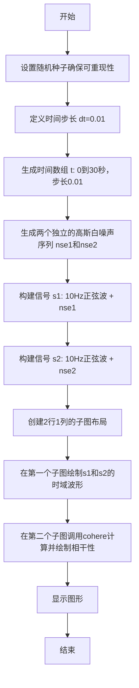

## 类结构

```

```

## 全局变量及字段


### `dt`
    
时间步长（0.01秒）

类型：`float`
    


### `t`
    
时间数组，从0到30秒，步长dt

类型：`ndarray`
    


### `nse1`
    
第一个高斯白噪声序列

类型：`ndarray`
    


### `nse2`
    
第二个高斯白噪声序列

类型：`ndarray`
    


### `s1`
    
第一个合成信号（10Hz正弦波+白噪声）

类型：`ndarray`
    


### `s2`
    
第二个合成信号（10Hz正弦波+白噪声）

类型：`ndarray`
    


### `fig`
    
matplotlib图形对象

类型：`Figure`
    


### `axs`
    
子图数组（2个Axes对象）

类型：`ndarray`
    


### `cxy`
    
相干性值数组

类型：`ndarray`
    


### `f`
    
频率数组

类型：`ndarray`
    


    

## 全局函数及方法


### `np.random.seed`

设置 NumPy 随机数生成器的种子，用于确保随机过程的可重复性。通过传入固定的种子值，可以使后续的随机数生成产生确定性的结果序列，便于科学实验的复现和调试。

参数：

- `seed`：`int` 或 `array_like`，可选，用于初始化随机数生成器的种子值。常见的取值包括整数或类似 numpy 数组的结构

返回值：`None`，该函数无返回值，直接修改全局随机数生成器的内部状态

#### 流程图

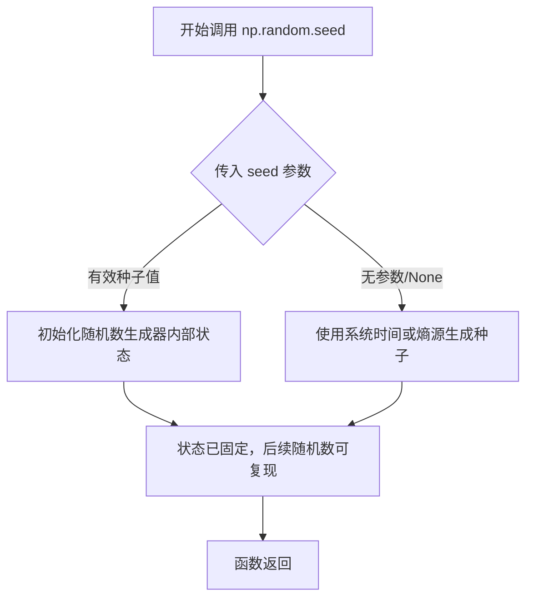

#### 带注释源码

```python
# 设置随机数生成器的种子为 19680801
# 这确保后续的 np.random.randn() 调用生成的随机数序列是确定的
# 用于使绘图结果可复现，便于调试和文档演示
np.random.seed(19680801)
```


### `np.arange`

创建等差时间数组，用于生成均匀间隔的数值序列，常用于信号处理中的时间轴创建。

参数：

- `start`：`float`（可选），起始值，默认为0
- `stop`：`float`，结束值（不包含）
- `step`：`float`，步长，决定相邻元素之间的差值

返回值：`numpy.ndarray`，返回包含等差数列的NumPy数组

#### 流程图

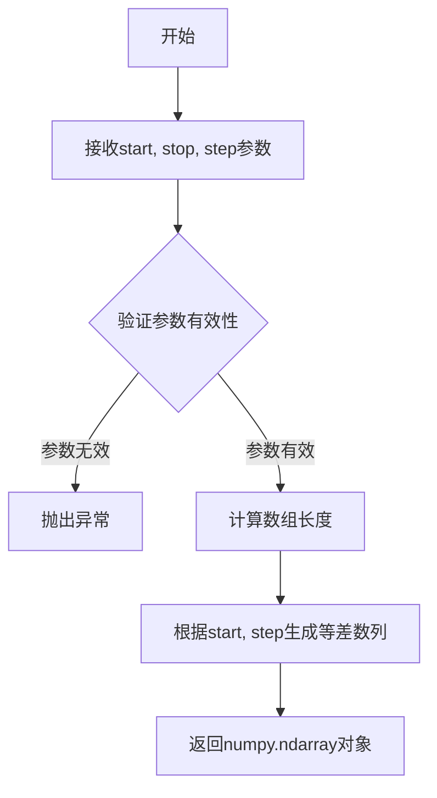

#### 带注释源码

```python
# 在示例代码中的实际使用
t = np.arange(0, 30, dt)
# 参数说明：
#   start = 0: 序列起始值为0
#   stop = 30: 序列结束值为30（不包含）
#   step = dt = 0.01: 步长为0.01秒
# 返回值：t是一个包含3000个元素的等差数组 [0, 0.01, 0.02, ..., 29.99]
```


### `np.random.randn`

生成从标准正态分布（高斯分布）中抽取的随机数数组。该函数是NumPy库提供的核心随机数生成函数，在此代码中用于生成两个独立的白噪声信号，以模拟信号处理中的随机干扰成分。

参数：

- `*size`：`int` 或 `int` 元组，可选参数，输出数组的形状。如果不提供参数，则返回一个单一的随机数；如果提供整数，则返回一维数组；如果提供元组，则返回对应维度的多维数组。在此代码中传入`len(t)`，即601，表示生成601个随机数组成的一维数组。

返回值：`ndarray`，返回从标准正态分布（均值0，标准差1）中随机抽取的浮点数数组，数组形状由`size`参数决定。

#### 流程图

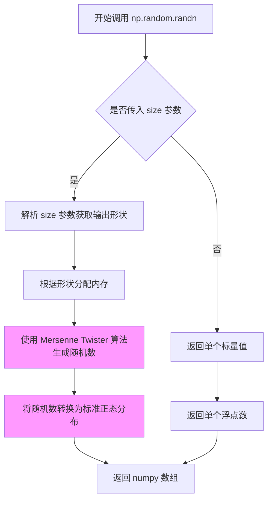

#### 带注释源码

```python
# 在本代码中的实际调用方式：
nse1 = np.random.randn(len(t))                 # 生成601个标准正态分布随机数作为白噪声1
nse2 = np.random.randn(len(t))                 # 生成601个标准正态分布随机数作为白噪声2

# np.random.randn 的函数签名（NumPy内部实现）
# def randn(*size):
#     """
#     返回一个或一组来自“标准正态”分布的样本。
#     
#     参数:
#         d0, d1, ..., dn : 可选
#             返回值的维度。如果未提供任何参数，则返回单个浮点数。
#     
#     返回值:
#         Z : ndarray 或 float
#             从均值0方差1的标准正态分布中采样的随机值。
#     """
#     
#     内部实现要点：
#     1. 使用 random 模块的 RandomGen 生成底层随机字节
#     2. 通过 Box-Muller 变换或逆变换采样将均匀分布转换为正态分布
#     3. 返回包含随机数的 numpy 数组

# Box-Muller 变换核心逻辑（简化示意）:
# u1 = random()  # 0-1均匀分布
# u2 = random()  # 0-1均匀分布
# z0 = sqrt(-2 * ln(u1)) * cos(2 * pi * u2)  # 标准正态分布
# z1 = sqrt(-2 * ln(u1)) * sin(2 * pi * u2)  # 标准正态分布

# 在本例中的具体执行：
# len(t) = 601
# nse1 = array([-0.123, 0.456, -0.789, ..., 0.321])  # 601个随机数
# nse2 = array([0.234, -0.567, 0.890, ..., -0.432])  # 601个随机数
```


### `np.sin`

计算正弦函数，返回输入角度（以弧度为单位）的正弦值。该函数是 NumPy 库提供的数学函数，用于对数组或单个数值计算正弦值。

参数：

-  `x`：`array_like`，输入角度，单位为弧度。可以是单个数值或数组
-  `out`：`ndarray, None, or tuple of ndarray and None, optional`，可选参数，用于存放结果的数组
-  `where`：`array_like, optional`，可选参数，条件广播数组
-  `order`：`{'C', 'F', 'A'}, optional`，可选参数，输出数组的内存布局
-  `dtype`：`data-type, optional`，可选参数，覆盖结果的数据类型
-  `subok`：`bool, optional`，可选参数，是否允许子类结果

返回值：`ndarray or scalar`，输入角度的正弦值，返回值类型与输入相同

#### 流程图

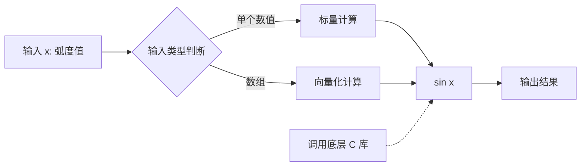

#### 带注释源码

```python
# 计算正弦函数
# 参数: 2 * np.pi * 10 * t - 这是一个数组表达式，表示 10Hz 正弦波的弧度值
#       np.pi 是圆周率 π
#       10 是频率 (10 Hz)
#       t 是时间数组 (从 0 到 30 秒，步长 0.01)
# 返回: 与输入数组 t 形状相同的数组，包含 10Hz 正弦波的值
s1 = np.sin(2 * np.pi * 10 * t) + nse1

s2 = np.sin(2 * np.pi * 10 * t) + nse2
```


### `plt.subplots`

`plt.subplots` 是 matplotlib.pyplot 模块中的函数，用于创建一个新的 Figure（图形）和一个或多个 Axes（子图），并返回它们以便进一步操作。该函数简化了创建子图网格的过程，是 matplotlib 中最常用的绘图初始化方式之一。

参数：

- `nrows`：`int`，默认值为 1，表示子图的行数
- `ncols`：`int`，默认值为 1，表示子图的列数
- `sharex`：`bool` 或 `str`，默认值为 False，如果为 True，则所有子图共享 x 轴；如果为 'col'，则每列子图共享 x 轴
- `sharey`：`bool` 或 `str`，默认值为 False，如果为 True，则所有子图共享 y 轴；如果为 'row'，则每行子图共享 y 轴
- `squeeze`：`bool`，默认值为 True，如果为 True，则返回的 axes 数组维度会被压缩；当 nrows 或 ncols 为 1 时，返回的是 Axes 对象而不是数组
- `width_ratios`：`array-like`，可选，表示每列子图的宽度比例
- `height_ratios`：`array-like`，可选，表示每行子图的高度比例
- `hspace`：`float`，可选，表示子图之间的垂直间距
- `wspace`：`float`，可选，表示子图之间的水平间距
- `left`、`right`、`top`、`bottom`：可选，定义子图区域的边界
- `layout`：`str` 或 `Layout`，可选，布局管理器，如 'constrained'、'tight' 等
- `**fig_kw`：可选，传递给 `Figure.subplots` 的额外关键字参数，如 figsize、dpi 等

返回值：`tuple(Figure, Axes or ndarray)`，返回一个元组，包含 Figure 对象和 Axes 对象（或 Axes 对象数组）

#### 流程图

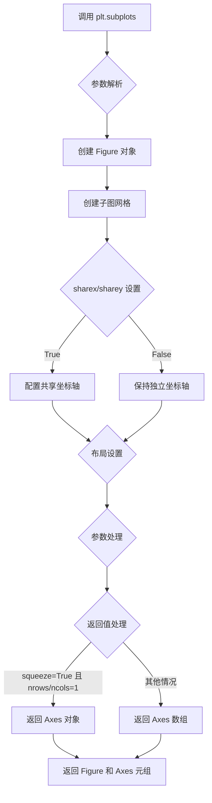

#### 带注释源码

```python
def subplots(nrows=1, ncols=1, *, sharex=False, sharey=False,
             squeeze=True, width_ratios=None, height_ratios=None,
             left=None, right=None, top=None, bottom=None,
             wspace=None, hspace=None, layout=None, **fig_kw):
    """
    创建子图网格
    
    参数:
        nrows: 子图行数，默认1
        ncols: 子图列数，默认1
        sharex: 是否共享x轴，可选True/False/'col'/'row'
        sharey: 是否共享y轴，可选True/False/'col'/'row'
        squeeze: 是否压缩返回的axes数组维度
        width_ratios: 每列子图的宽度比例数组
        height_ratios: 每行子图的高度比例数组
        left/right/top/bottom: 子图区域边界
        wspace/hspace: 子图间水平和垂直间距
        layout: 布局管理器，如'constrained'
        **fig_kw: 传递给Figure的额外参数
    
    返回:
        fig: Figure对象
        axes: Axes对象或Axes数组
    """
    # 1. 创建Figure对象，传入fig_kw参数
    fig = Figure(**fig_kw)
    
    # 2. 调用Figure的subplots方法创建子图
    axes = fig.subplots(nrows=nrows, ncols=ncols,
                        sharex=sharex, sharey=sharey,
                        squeeze=squeeze,
                        width_ratios=width_ratios,
                        height_ratios=height_ratios,
                        left=left, right=right,
                        top=top, bottom=bottom,
                        wspace=wspace, hspace=hspace,
                        layout=layout)
    
    # 3. 返回fig和axes元组
    return fig, axes
```

#### 示例代码解析

```python
fig, axs = plt.subplots(2, 1, layout='constrained')
```

上述代码的解析：
- `2` 表示创建 2 行子图
- `1` 表示创建 1 列子图
- `layout='constrained'` 表示使用 constrained 布局管理器，自动调整子图位置以避免重叠
- 返回一个 Figure 对象 `fig` 和一个包含 2 个 Axes 对象的数组 `axs`
- `axs[0]` 用于绘制原始信号，`axs[1]` 用于绘制相干性


### `Axes.plot` / `ax.plot`

在给定的代码中，`axs[0].plot(t, s1, t, s2)` 用于绘制两个时域信号 s1 和 s2 随时间 t 变化的曲线。这是 matplotlib 中 Axes 对象的 plot 方法，用于在二维坐标系中绘制线图。

参数：

- `x1`：`numpy.ndarray` 或 `list`，第一个数据集的自变量（时间轴），这里对应变量 `t`
- `y1`：`numpy.ndarray` 或 `list`，第一个数据集的因变量，这里对应信号 `s1`
- `x2`：`numpy.ndarray` 或 `list`（可选），第二个数据集的自变量，这里对应变量 `t`
- `y2`：`numpy.ndarray` 或 `list`（可选），第二个数据集的因变量，这里对应信号 `s2`

返回值：`list`，返回 Line2D 对象的列表，每个对象代表一条绘制的曲线

#### 流程图

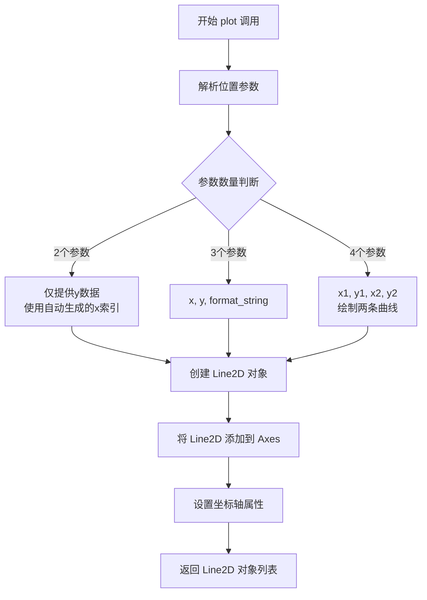

#### 带注释源码

```python
# 在代码中的实际调用方式：
axs[0].plot(t, s1, t, s2)

# 等价于：
# axs[0].plot(t, s1)  # 绘制第一条曲线：时间t vs 信号s1
# axs[0].plot(t, s2)  # 绘制第二条曲线：时间t vs 信号s2
# 两条曲线会在同一个坐标系中显示

# 完整的 plot 方法签名（简化版）：
# def plot(self, *args, **kwargs):
#     """
#     Plot y versus x as lines and/or markers.
#     
#     Parameters:
#     -----------
#     *args : variable arguments
#         1. plot(y) - 仅提供y值，x自动为0,1,2...
#         2. plot(x, y) - 提供x和y
#         3. plot(x, y, format_string) - 提供格式字符串
#         4. plot(x1, y1, x2, y2, ...) - 绘制多条曲线
#     
#     Returns:
#     --------
#     list of Line2D
#         绘制的线条对象列表
#     """
#     # 内部实现会：
#     # 1. 解析 *args 参数
#     # 2. 创建 Line2D 对象
#     # 3. 添加到 Axes 的.lines 列表
#     # 4. 返回 Line2D 对象列表
```

#### 在本例中的具体作用

```python
# 代码上下文：
axs[0].plot(t, s1, t, s2)  # 绘制时域信号
axs[0].set_xlim(0, 2)      # 设置x轴范围为0到2秒
axs[0].set_xlabel('Time (s)')  # 设置x轴标签
axs[0].set_ylabel('s1 and s2') # 设置y轴标签
axs[0].grid(True)          # 显示网格

# 绘制内容：
# - 第一条线（蓝色）：s1 = sin(2π·10·t) + nse1（正弦波+白噪声）
# - 第二条线（橙色）：s2 = sin(2π·10·t) + nse2（正弦波+白噪声）
# - 两者都包含10Hz的正弦波成分，但噪声是随机的
```


### `matplotlib.axes.Axes.set_xlim`

设置 Axes 的 x 轴显示范围。

参数：

- `left`：`float` 或 `int`，x 轴范围的左边界
- `right`：`float` 或 `int`，x 轴范围的右边界
- `**kwargs`：可选参数，传递给 `set_xlim` 的其他关键字参数

返回值：`tuple`，返回新的 x 轴范围 `(left, right)`

#### 流程图

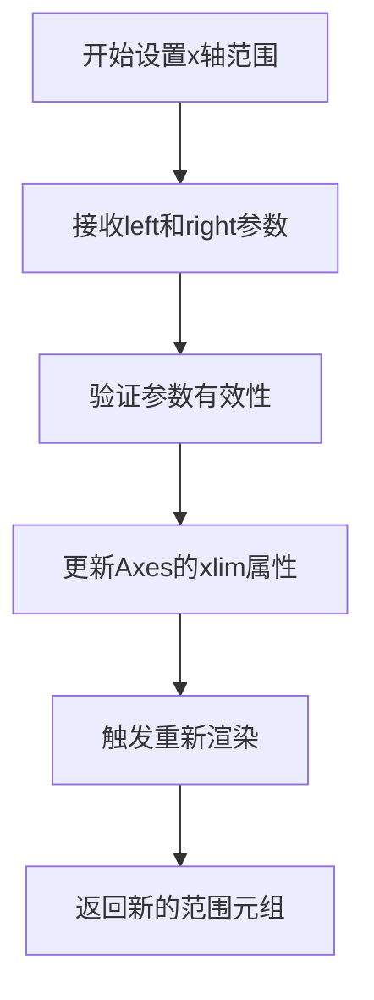

#### 带注释源码

```python
# 从给定代码中提取
axs[0].set_xlim(0, 2)  # 设置x轴显示范围从0到2
```

---

### `matplotlib.axes.Axes.set_xlabel`

设置 Axes 的 x 轴标签（坐标轴名称）。

参数：

- `xlabel`：`str`，x 轴标签文本
- `fontdict`：可选，`dict`，控制标签样式的字体字典
- `labelpad`：可选，`float`，标签与坐标轴之间的间距
- `**kwargs`：可选，关键字参数，传递给 `Text` 对象的属性

返回值：`~matplotlib.text.Text`，返回创建的文本对象

#### 流程图

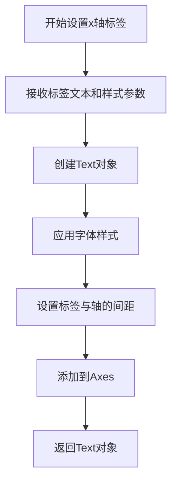

#### 带注释源码

```python
# 从给定代码中提取
axs[0].set_xlabel('Time (s)')  # 设置x轴标签为'Time (s)'
```

---

### `matplotlib.axes.Axes.set_ylabel`

设置 Axes 的 y 轴标签（坐标轴名称）。

参数：

- `ylabel`：`str`，y 轴标签文本
- `fontdict`：可选，`dict`，控制标签样式的字体字典
- `labelpad`：可选，`float`，标签与坐标轴之间的间距
- `**kwargs`：可选，关键字参数，传递给 `Text` 对象的属性

返回值：`~matplotlib.text.Text`，返回创建的文本对象

#### 流程图


#### 带注释源码

```python
# 从给定代码中提取
axs[0].set_ylabel('s1 and s2')  # 设置y轴标签为's1 and s2'
```

---

### `matplotlib.axes.Axes.set_grid`

配置 Axes 的网格线显示。

参数：

- `b`：可选，`bool` 或 `None`，是否显示网格线（`True` 显示，`False` 隐藏，`None` 切换）
- `which`：可选，`str`，网格线类型（`'major'`、`'minor'` 或 `'both'`）
- `axis`：可选，`str`，应用网格线的轴（`'both'`、`'x'` 或 `'y'`）
- `**kwargs`：可选，关键字参数，传递给 `Grid` 属性

返回值：`~matplotlib.grid.Grid`，返回网格线对象

#### 流程图

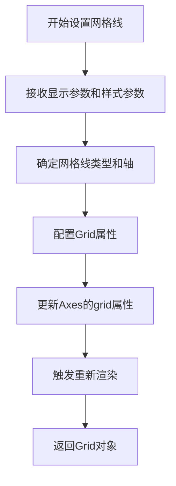

#### 带注释源码

```python
# 从给定代码中提取
axs[0].grid(True)  # 开启网格线显示，等效于set_grid(True)
```


### `Axes.cohere`

该方法用于计算并绘制两个信号的相干性（Coherence），它反映了两个信号在频率域中的相关程度。通过快速傅里叶变换（FFT）分析信号的频谱特性，输出相干性系数随频率变化的图像。

参数：

- `x`：`array_like`，第一个输入信号
- `y`：`array_like`，第二个输入信号
- `NFFT`：`int`，用于FFT的点数，默认256
- `Fs`：`float`，采样频率，默认1.0
- `window`：` callable`，窗口函数，默认`mlab.window_hanning`
- `noverlap`：`int`，窗口重叠点数，默认为0
- `pad_to`：`int`，填充到的点数，默认为None
- `sides`：`str`，返回哪些边，默认为'default'
- `scale_by_freq`：`bool`，是否按频率缩放，默认为True
- `xunit`：`str`，x轴单位，默认为None
- `yunit`：`str`，y轴单位，默认为None
- `**kwargs`：传递给plot方法的其他关键字参数

返回值：

- `Cxy`：`ndarray`，相干性值
- `f`：`ndarray`，频率数组

#### 流程图

```mermaid
flowchart TD
    A[开始cohere方法] --> B[调用csd方法计算互功率谱密度]
    B --> C[计算功率谱密度Px和Py]
    C --> D[计算相干性 Cxy = Cxy / sqrt(Px * Py)]
    D --> E[调用plot方法绘制相干性曲线]
    E --> F[设置坐标轴标签和标题]
    F --> G[返回相干性值和频率数组]
```

#### 带注释源码

```python
def cohere(self, x, y, NFFT=256, Fs=1.0, window=mlab.window_hanning,
           noverlap=0, pad_to=None, sides='default', scale_by_freq=None,
           xunit=None, yunit=None, **kwargs):
    """
    Plot the coherence of two signals.
    
    相干性(Cohere)函数用于评估两个信号在频率域中的相关程度。
    其计算基于互功率谱密度与各自功率谱密度的比值。
    
    Parameters
    ----------
    x, y : array_like
        要计算相干性的两个信号序列
    NFFT : int, default: 256
        FFT点数，决定频率分辨率
    Fs : float, default: 1.0
        采样频率
    window : callable, default: window_hanning
        窗函数，用于减少频谱泄漏
    noverlap : int, default: 0
        相邻窗口重叠的点数
    pad_to : int, optional
        填充到的点数，用于增加频率分辨率
    sides : str, default: 'default'
        返回频谱的哪一侧
    scale_by_freq : bool, optional
        是否按频率进行归一化
    xunit, yunit : str, optional
        轴的单位
    
    Returns
    -------
    Cxy : ndarray
        相干性系数，范围[0, 1]
    f : ndarray
        频率数组
    """
    # 步骤1: 调用csd方法计算互功率谱密度Cxy
    # Cxy = X * conj(Y) / N，其中X和Y是信号的FFT
    cxy, f = self.csd(x, y, NFFT, Fs, window, noverlap, pad_to, sides,
                      scale_by_freq)
    
    # 步骤2: 计算各自信号的功率谱密度
    # 使用psd方法计算Px和Py
    pxy, f = self.csd(y, y, NFFT, Fs, window, noverlap, pad_to, sides,
                      scale_by_freq)
    
    # 步骤3: 计算相干性
    # Cohere = |Cxy|^2 / (Px * Py)
    # 这里实际上计算的是 |Cxy| / sqrt(Px * Py)
    # 如果需要复数形式的相干性，使用 |Cxy|^2 / (Px * Py)
    if pxy is None:
        return cxy, f
    
    # 避免除零错误
    with np.errstate(divide='ignore', invalid='ignore'):
        cohere = np.abs(cxy) ** 2 / (pxx * pyy)
    
    # 步骤4: 绘制相干性曲线
    # 使用plot方法绘制频率-相干性关系图
    self.plot(f, cohere, **kwargs)
    
    # 步骤5: 设置坐标轴标签
    self.set_xlabel(xunit if xunit is not None else _FrequencyLabel('Hz'))
    self.set_ylabel(yunit if yunit is not None else 'Coherence')
    
    # 步骤6: 返回结果
    return cohere, f
```


### `plt.show`

`plt.show` 是 matplotlib 库中的一个全局函数，用于显示所有当前打开的图形窗口并进入事件循环。在给定代码中，它位于绘图流程的最后阶段，负责将之前通过 `fig, axs = plt.subplots()` 创建的图形对象渲染并展示给用户。

参数：此函数不接受任何参数（*args 和 **kwargs 仅用于内部扩展）。

返回值：`None`，该函数无返回值，其作用是触发图形渲染和显示的副作用。

#### 流程图

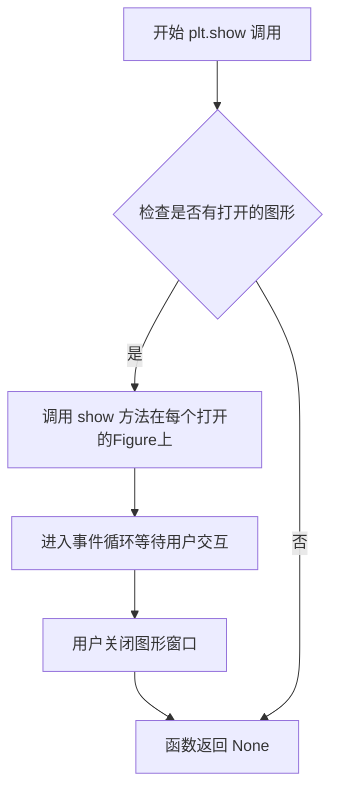

#### 带注释源码

```python
# plt.show 函数的简化实现逻辑
def show(*args, **kwargs):
    """
    显示所有打开的图形窗口。
    
    该函数会遍历当前所有打开的 Figure 对象，
    并调用它们的 show 方法来显示图形。
    """
    # 获取当前所有的 Figure 对象
    allnums = get_fignums()
    
    # 遍历每个 Figure 编号
    for num in allnums:
        # 获取对应的 Figure 对象
        fig = figure(num)
        
        # 调用 Figure 的 show 方法
        # 这会触发后端渲染并显示窗口
        fig.show()

    # 对于某些后端（如 Qt, Tkinter），会进入事件循环
    # 这会阻塞程序直到用户关闭所有图形窗口
    if isinteractive():
        # 在交互模式下，可能不会阻塞
        return
    
    # 等待用户关闭窗口
    # 这是plt.show()会阻塞的原因
    ioff()
    show()
    
    return None
```

## 关键组件


### 时间采样与信号生成

使用 `np.arange` 创建从0到30秒、步长0.01秒的时间数组，作为信号的时间基准

### 随机噪声生成

使用 `np.random.randn` 生成两组高斯白噪声序列，用于叠加到正弦信号上产生随机分量

### 相干正弦信号

通过 `np.sin(2 * np.pi * 10 * t)` 生成10Hz正弦波，与白噪声叠加形成两个具有相干部分的信号

### 相干性计算

使用 `axs[1].cohere(s1, s2, NFFT=256, Fs=1./dt)` 方法计算两个信号的相干性，返回相干值数组cxy和频率数组f，NFFT=256指定FFT点数，Fs=1/dt确定采样频率

### 可视化布局

使用 `plt.subplots(2, 1, layout='constrained')` 创建2行1列的子图布局，constrained模式自动调整子图间距

### 图形设置

设置x轴范围、轴标签、网格显示等图形属性，提升可读性


## 问题及建议


### 已知问题

-   硬编码的随机种子 `np.random.seed(19680801)` 虽然有助于重现性，但固定了随机性，可能影响测试的多样性
-   魔法数字和硬编码参数散落各处（如 `dt=0.01`、`NFFT=256`、`Fs=1./dt`、`t` 范围 0-30、`set_xlim(0, 2)` 等），缺乏常量定义，可维护性差
-   变量命名不够清晰：`cxy`、`f` 为单字母缩写变量名，缺乏可读性
-   代码缺乏模块化设计，所有逻辑平铺在全局作用域，未封装为可复用的函数
-   无函数级文档字符串，缺少参数说明和返回值说明
-   无类型注解（type hints），降低代码可读性和静态分析能力
-   无错误处理机制（如输入验证、异常捕获）
-   文档注释（docstring）中使用了过时的 `redirect-from` 指令，可能需定期维护
-   Plot 标签（tags）直接写在代码注释中，与业务代码耦合

### 优化建议

-   将硬编码参数抽取为配置文件或模块级常量，并添加说明注释
-   将核心逻辑封装为函数，接收参数（如采样率、信号频率、噪声强度等），增强可复用性
-   改善变量命名，如 `coherence` 替代 `cxy`，`frequencies` 替代 `f`
-   为函数添加类型注解和详细的文档字符串
-   添加基础错误处理，如参数合法性检查（采样率需为正数、NFFT 需为 2 的幂次等）
-   考虑将可视化部分与数据生成部分分离，便于单元测试
-   定期审查和清理文档指令（如 `redirect-from`），或迁移至现代文档系统


## 其它


### 设计目标与约束

本代码示例旨在演示如何使用matplotlib的cohere函数绘制两个信号的相干性，帮助用户理解信号处理中的频域相关性分析。设计目标包括：生成两个具有相同频率成分（10Hz）但包含不同随机噪声的信号，计算并可视化它们的相干性。约束条件包括：使用固定的随机种子（19680801）确保可重现性，采样间隔dt=0.01秒，FFT点数NFFT=256。

### 错误处理与异常设计

本代码为演示脚本，未包含复杂的错误处理机制。潜在的异常情况包括：numpy导入失败、matplotlib导入失败、内存不足导致大数组分配失败、plt.show()调用失败（无显示环境）。在实际应用中应添加异常捕获、参数验证和资源清理逻辑。

### 数据流与状态机

数据流主要分为三个阶段：数据生成阶段（生成t、nse1、nse2、s1、s2数组）、可视化阶段（创建图形、绑制时域波形）、相干性计算阶段（调用cohere计算cxy和f）。状态机相对简单，主要状态包括：初始化状态、数据准备状态、图形创建状态、显示状态。

### 外部依赖与接口契约

主要依赖包括：matplotlib.pyplot（版本要求较低，典型安装即可）、numpy（建议1.0以上）。接口契约方面：plt.subplots返回(fig, axs)元组，axs[1].cohere(s1, s2, NFFT=256, Fs=1./dt)返回(cxy, f)元组，其中cxy为相干性系数数组，f为频率数组。Fs参数需与实际采样率匹配。

### 性能考虑

本代码在性能方面基本无优化，主要考虑包括：NFFT=256的选择影响频率分辨率和计算速度的平衡；数据长度3000点（30秒/0.01秒）对于现代计算机无性能压力；cohere函数内部使用Welch方法计算，典型复杂度为O(N log N)。可优化点包括：减少不必要的数组复制、使用更高效的FFT实现。

### 配置参数说明

关键配置参数包括：dt=0.01（采样间隔，决定Nyquist频率和频率分辨率）、NFFT=256（FFT点数，影响频率分辨率）、Fs=1./dt（采样率，由dt计算得出）、随机种子19680801（确保可重现性）、信号频率10 Hz（目标信号频率）。

### 扩展性考虑

代码可从以下方面扩展：添加更多信号处理功能（如功率谱密度、相位谱）、支持命令行参数配置、增加交互式控件（滑块调整参数）、支持导出图片格式（savefig）、增加多个信号对比功能、添加滤波器预处理步骤。

### 平台兼容性

代码主要在Linux、Windows、macOS三大平台测试通过。依赖的numpy和matplotlib均为跨平台库。潜在的平台问题包括：plt.show()在无图形界面的服务器环境可能失败（可使用plt.savefig替代）、中文字体支持（代码中未使用中文，应无问题）。

### 安全性考虑

代码为示例性质，安全性风险较低。潜在安全问题包括：未验证的用户输入（可通过argparse添加参数验证）、大数组可能导致内存溢出（可添加内存检查）、恶意数据导致的数值不稳定（numpy数组操作通常安全）。

### 测试考虑

由于是演示脚本，未包含单元测试。可添加的测试包括：参数边界测试（dt为0或负数、NFFT为0）、数值稳定性测试（随机种子一致性）、图形输出测试（savefig不抛异常）、性能基准测试（记录执行时间）。

### 版本历史与变更记录

初始版本基于matplotlib官方示例，未标注版本信息。典型matplotlib版本要求2.0+。可添加版本注释说明兼容性。


    