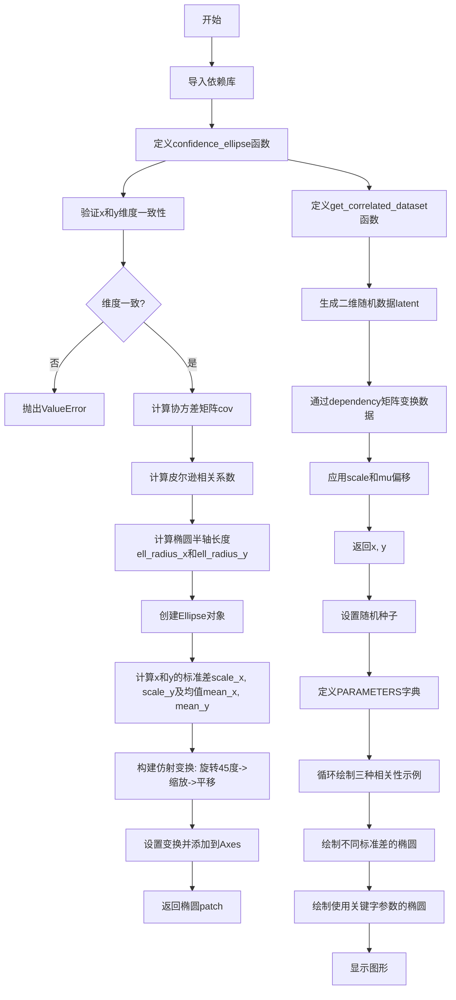

# `matplotlib\galleries\examples\statistics\confidence_ellipse.py` 详细设计文档

该代码实现了一个绘制二维数据集置信椭圆的功能，通过计算皮尔逊相关系数和非迭代的特征值求解方法，结合仿射变换（旋转、缩放、平移）来绘制指定标准差数量的椭圆边界，用于可视化两个变量之间的相关性强度和方向。

## 整体流程



## 类结构

```
无类层次结构
仅有模块级函数:
├── confidence_ellipse (主函数)
└── get_correlated_dataset (辅助函数)
```

## 全局变量及字段


### `PARAMETERS`
    
字典，包含三种相关性配置（正相关、负相关、弱相关）的2x2依赖矩阵

类型：`dict`
    


### `mu`
    
二维数据集的均值中心点坐标

类型：`tuple`
    


### `scale`
    
数据在x和y方向的缩放因子

类型：`tuple`
    


### `dependency`
    
用于生成正/负/弱相关数据的2x2矩阵

类型：`list`
    


### `dependency_nstd`
    
用于演示不同标准差效果的2x2依赖矩阵

类型：`list`
    


### `dependency_kwargs`
    
用于演示关键字参数效果的2x2依赖矩阵

类型：`list`
    


### `x`
    
相关数据集的x坐标数组

类型：`ndarray`
    


### `y`
    
相关数据集的y坐标数组

类型：`ndarray`
    


### `ell_radius_x`
    
基于皮尔逊相关系数计算的椭圆x轴半径

类型：`float`
    


### `ell_radius_y`
    
基于皮尔逊相关系数计算的椭圆y轴半径

类型：`float`
    


### `scale_x`
    
x方向的标准差乘以n_std的缩放因子

类型：`float`
    


### `scale_y`
    
y方向的标准差乘以n_std的缩放因子

类型：`float`
    


### `mean_x`
    
x数据的均值

类型：`float`
    


### `mean_y`
    
y数据的均值

类型：`float`
    


### `cov`
    
x和y的2x2协方差矩阵

类型：`ndarray`
    


### `pearson`
    
x和y之间的皮尔逊相关系数

类型：`float`
    


### `ellipse`
    
matplotlib的Ellipse补丁对象

类型：`Ellipse`
    


### `transf`
    
用于旋转、缩放和平移椭圆的仿射变换对象

类型：`Affine2D`
    


### `n_std`
    
决定椭圆半径的标准差倍数，默认3.0

类型：`float`
    


### `facecolor`
    
椭圆的填充颜色，默认'none'（无填充）

类型：`str`
    


### `latent`
    
生成的随机二维标准正态分布数据

类型：`ndarray`
    


### `dependent`
    
经过依赖矩阵变换后的数据

类型：`ndarray`
    


### `scaled`
    
经过缩放后的数据

类型：`ndarray`
    


### `scaled_with_offset`
    
添加偏移量后的最终相关数据集

类型：`ndarray`
    


### `fig`
    
matplotlib的Figure对象，用于存放图表

类型：`Figure`
    


### `axs`
    
包含多个Axes子图的数组

类型：`ndarray`
    


### `ax`
    
matplotlib的Axes对象，用于绘制图形

类型：`Axes`
    


### `ax_nstd`
    
用于演示不同标准差的Axes对象

类型：`Axes`
    


### `ax_kwargs`
    
用于演示关键字参数的Axes对象

类型：`Axes`
    


    

## 全局函数及方法


### `confidence_ellipse`

该函数用于根据输入的二维数据计算协方差置信椭圆，并通过matplotlib将其绘制到指定的Axes对象上。函数利用皮尔逊相关系数和非迭代方法计算椭圆的几何参数，通过仿射变换（旋转、缩放、平移）将标准椭圆调整到数据的均值和标准差位置。

参数：

- `x`：`array-like, shape (n,)`，输入的x坐标数据
- `y`：`array-like, shape (n,)`，输入的y坐标数据
- `ax`：`matplotlib.axes.Axes`，要在其中绘制椭圆的Axes对象
- `n_std`：`float`，标准差倍数，决定椭圆的半径大小，默认为3.0
- `facecolor`：`str`，椭圆填充颜色，默认为'none'（无填充）
- `**kwargs`：其他关键字参数，转发给`matplotlib.patches.Ellipse`

返回值：`matplotlib.patches.Ellipse`，返回添加到的Axes上的Ellipse补丁对象

#### 流程图

```mermaid
flowchart TD
    A[开始 confidence_ellipse] --> B{检查 x 和 y 尺寸是否相等}
    B -->|不相等| C[抛出 ValueError 异常]
    B -->|相等| D[计算协方差矩阵 cov = np.cov(x, y)]
    D --> E[计算皮尔逊相关系数 pearson]
    E --> F[计算椭圆半轴长度 ell_radius_x 和 ell_radius_y]
    F --> G[创建 Ellipse 对象]
    G --> H[计算 x 的标准差 scale_x 和均值 mean_x]
    H --> I[计算 y 的标准差 scale_y 和均值 mean_y]
    I --> J[创建 Affine2D 仿射变换]
    J --> K[旋转45度、缩放scale_x scale_y、平移到mean_x mean_y]
    K --> L[设置椭圆变换并添加到ax]
    L --> M[返回 Ellipse 补丁对象]
```

#### 带注释源码

```python
def confidence_ellipse(x, y, ax, n_std=3.0, facecolor='none', **kwargs):
    """
    Create a plot of the covariance confidence ellipse of *x* and *y*.

    Parameters
    ----------
    x, y : array-like, shape (n, )
        Input data.

    ax : matplotlib.axes.Axes
        The Axes object to draw the ellipse into.

    n_std : float
        The number of standard deviations to determine the ellipse's radiuses.

    **kwargs
        Forwarded to `~matplotlib.patches.Ellipse`

    Returns
    -------
    matplotlib.patches.Ellipse
    """
    # 检查输入数据尺寸一致性
    if x.size != y.size:
        raise ValueError("x and y must be the same size")

    # 计算x和y的协方差矩阵
    cov = np.cov(x, y)
    
    # 计算皮尔逊相关系数：协方差除以标准差乘积
    pearson = cov[0, 1]/np.sqrt(cov[0, 0] * cov[1, 1])
    
    # 使用特殊方法计算二维数据集的特征值
    # 得到椭圆在单位圆上的半轴长度
    ell_radius_x = np.sqrt(1 + pearson)
    ell_radius_y = np.sqrt(1 - pearson)
    
    # 创建椭圆对象，初始位于原点，宽高为半轴长度的两倍
    ellipse = Ellipse((0, 0), width=ell_radius_x * 2, height=ell_radius_y * 2,
                      facecolor=facecolor, **kwargs)

    # 计算x的标准差：从方差平方根乘以标准差倍数
    scale_x = np.sqrt(cov[0, 0]) * n_std
    mean_x = np.mean(x)

    # 计算y的标准差和均值
    scale_y = np.sqrt(cov[1, 1]) * n_std
    mean_y = np.mean(y)

    # 创建仿射变换序列：
    # 1. 旋转45度（将椭圆从与坐标轴对齐旋转到对角线方向）
    # 2. 缩放（应用标准差倍数）
    # 3. 平移到数据均值位置
    transf = transforms.Affine2D() \
        .rotate_deg(45) \
        .scale(scale_x, scale_y) \
        .translate(mean_x, mean_y)

    # 将仿射变换与axes的数据坐标系结合，设置变换并添加到axes
    ellipse.set_transform(transf + ax.transData)
    return ax.add_patch(ellipse)
```


### `get_correlated_dataset`

生成具有指定相关性、均值和缩放的二维随机数据集。

参数：

- `n`：`int`，生成的样本点数量
- `dependency`：`array-like, shape (2, 2)`，2x2 矩阵，控制 x 和 y 之间的线性相关性
- `mu`：`tuple`，二维均值向量，用于平移数据
- `scale`：`tuple`，二维缩放因子，用于调整数据范围

返回值：`tuple`，返回两个一维 `numpy.ndarray`，分别表示生成的 x 和 y 坐标

#### 流程图

```mermaid
flowchart TD
    A[开始] --> B[生成随机 latent 数据<br/>np.random.randn n, 2]
    B --> C[计算 dependent 数据<br/>latent.dot dependency]
    C --> D[应用缩放<br/>dependent * scale]
    D --> E[添加偏移<br/>scaled + mu]
    E --> F[提取 x 和 y 分量<br/>scaled_with_offset[:, 0], [:, 1]]
    F --> G[返回 x, y 元组]
```

#### 带注释源码

```python
def get_correlated_dataset(n, dependency, mu, scale):
    """
    生成具有指定相关性、均值和缩放的二维随机数据集。
    
    参数:
        n: int, 生成的样本点数量
        dependency: array-like, shape (2, 2), 2x2 矩阵，控制 x 和 y 之间的线性相关性
        mu: tuple, 二维均值向量，用于平移数据
        scale: tuple, 二维缩放因子，用于调整数据范围
    
    返回:
        tuple: (x, y) 两个一维 numpy.ndarray，分别表示生成的 x 和 y 坐标
    """
    # 第一步：生成 n 个二维标准正态分布的随机 latent 变量
    latent = np.random.randn(n, 2)
    
    # 第二步：通过矩阵乘法将 latent 变量投影到相关空间
    # dependency 矩阵决定了生成数据的线性相关性结构
    dependent = latent.dot(dependency)
    
    # 第三步：应用缩放因子到每个维度
    scaled = dependent * scale
    
    # 第四步：添加均值偏移，使数据中心移动到指定的 mu 位置
    scaled_with_offset = scaled + mu
    
    # 第五步：分离 x 和 y 坐标，返回两个一维数组
    return scaled_with_offset[:, 0], scaled_with_offset[:, 1]
```

## 关键组件


### 置信椭圆计算核心

基于协方差矩阵和皮尔逊相关系数计算椭圆的几何半径，通过特殊公式避免迭代特征分解，ell_radius_x = √(1 + pearson)，ell_radius_y = √(1 - pearson)。

### 仿射变换构建

使用matplotlib.transforms.Affine2D构建组合变换：旋转45度→按标准差缩放→平移到均值位置，最后与ax.transData组合实现椭圆定位。

### 协方差矩阵处理

通过np.cov(x, y)计算2x2协方差矩阵，提取对角线元素作为方差计算标准差，提取非对角线元素计算皮尔逊相关系数。

### 相关数据集生成器

通过潜在变量latent与dependency矩阵的点积生成二维相关数据，再应用scale缩放和mu偏移，dependency参数控制变量间的相关性强弱和方向。

### 参数化配置字典

PARAMETERS存储三种相关性场景的2x2依赖矩阵：正相关、负相关和弱（无）相关，每个矩阵定义变量间的线性变换关系。


## 问题及建议


### 已知问题

- **输入验证不足**：`confidence_ellipse`函数仅检查`x`和`y`的大小是否相同，未验证数组是否为空、是否包含NaN值或无穷值，可能导致后续计算出现难以追踪的异常
- **除零风险未处理**：计算皮尔逊相关系数时`np.sqrt(cov[0, 0] * cov[1, 1])`在任一方差为0时会导致除零错误；同样`np.sqrt(1 ± pearson)`在相关系数绝对值接近1时可能产生数值问题
- **硬编码旋转角度**：代码中固定使用`rotate_deg(45)`旋转椭圆，这一设计决策缺乏说明且可能不适用于所有数据分布
- **缺乏类型注解**：整个代码库未使用Python类型提示，降低了代码的可读性和静态分析能力
- **全局状态污染**：示例代码直接修改全局`np.random.seed(0)`状态，可能影响其他依赖随机数的代码
- **函数命名不够通用**：`get_correlated_dataset`名称过于具体，且未进行输入参数类型和维度验证
- **文档不完整**：函数文档未说明可能抛出的异常类型和条件
- **魔法数字**：旋转角度45度、n_std默认值3.0等关键参数以魔法数字形式存在，缺乏常量定义

### 优化建议

- **添加输入验证**：在函数入口处检查数组非空、 finite值、维度一致性；添加类型检查确保输入为数值型数组
- **处理边界情况**：添加对零方差、常数数组、极端相关系数（±1）的特殊处理，返回合适的退化椭圆或抛出明确异常
- **添加类型注解**：为所有函数参数和返回值添加类型提示，提升代码可维护性
- **提取配置常量**：将旋转角度、默认n_std等参数提取为模块级常量或函数可选参数
- **改进随机数管理**：使用局部随机状态`np.random.default_rng()`或传入随机种子参数，避免全局状态污染
- **完善文档**：补充异常处理说明、返回值条件、参数取值范围等
- **考虑扩展性**：重构为支持任意维度数据的通用实现，或至少添加对高维数据的明确不支持提示


## 其它


### 设计目标与约束

本代码的设计目标是提供一种简单、高效的方法来可视化二维数据集的置信椭圆，通过皮尔逊相关系数计算椭圆的geometry，避免使用迭代的特征值分解算法。约束包括：输入数据x和y必须具有相同的长度，n_std参数控制椭圆的标准差倍数（默认3.0对应98.9%的置信区间），仅支持matplotlib作为绘图后端。

### 错误处理与异常设计

代码在confidence_ellipse函数中包含一个错误检查：当x和y的大小不相等时，抛出ValueError异常，错误信息为"x and y must be the same size"。此外，当皮尔逊相关系数的绝对值接近1时，ell_radius_y可能接近0，可能导致数值不稳定。np.cov()函数在输入数据方差为0时也会产生警告。

### 数据流与状态机

数据流如下：1) 用户调用confidence_ellipse(x, y, ax, n_std) → 2) 验证输入数据大小 → 3) 计算协方差矩阵cov → 4) 计算皮尔逊相关系数 → 5) 计算椭圆半轴长度ell_radius_x和ell_radius_y → 6) 创建Ellipse对象 → 7) 计算scale_x、scale_y和mean_x、mean_y → 8) 构建仿射变换transform → 9) 应用变换并添加到axes → 10) 返回ellipse对象。整个过程是单向数据流，无状态机。

### 外部依赖与接口契约

主要外部依赖包括：numpy（数值计算）、matplotlib.pyplot（绘图）、matplotlib.patches.Ellipse（椭圆patch）、matplotlib.transforms.Affine2D（仿射变换）。接口契约：confidence_ellipse接受array-like的x和y、matplotlib.axes.Axes对象ax、float类型n_std、facecolor字符串以及任意kwargs；返回matplotlib.patches.Ellipse对象。get_correlated_dataset接受int n、array-like dependency、tuple mu、tuple scale，返回两个numpy数组(x, y)。

### 算法复杂度分析

时间复杂度：协方差计算O(n)，特征值计算为常数时间（2x2矩阵），总体O(n)。空间复杂度：O(n)用于存储输入数据和协方差矩阵。算法优势在于避免了迭代特征值分解，比通用方法更高效。

### 数值稳定性考虑

代码使用特殊方法处理2x2协方差矩阵的特征值计算，避免了迭代算法。但当皮尔逊相关系数接近±1时，ell_radius_y = np.sqrt(1 - pearson)可能产生数值下溢。此外，协方差矩阵的对称性未做验证。在实际应用中，建议对输入数据进行预处理以确保数值稳定性。

### 可扩展性设计

当前实现专注于2D数据。扩展方向包括：1) 支持多维数据的置信椭球（需要修改特征值计算逻辑）2) 提供置信水平参数而非仅用标准差倍数 3) 支持旋转角度参数的显式控制 4) 添加填充颜色和边框样式的更多选项。当前通过**kwargs已支持matplotlib.patches.Ellipse的大部分属性定制。

### 使用示例与最佳实践

推荐用法：1) 确保x和y为numpy数组或类似结构 2) 预先计算并验证数据的相关性 3) 根据数据分布选择合适的n_std值（1=68.3%, 2=95.4%, 3=98.9%）4) 使用facecolor='none'绘制空心椭圆以避免遮挡数据点 5) 通过zorder参数控制图层顺序。示例代码展示了正相关、负相关、弱相关三种场景以及不同标准差倍数的用法。

    