# `matplotlib\galleries\examples\statistics\csd_demo.py` 详细设计文档

这是一个matplotlib演示脚本，展示了如何使用Axes.csd()方法绘制两个信号的交叉谱密度(CSD)，通过生成带有相干部分和随机部分的测试信号来演示频域分析方法。

## 整体流程

```mermaid
graph TD
    A[开始] --> B[创建2x1子图布局]
    B --> C[设置时间参数dt=0.01, 生成时间序列t]
    C --> D[设置随机种子19680801]
    D --> E[生成两组白噪声nse1, nse2]
    E --> F[计算衰减因子r = exp(-t/0.05)]
    F --> G[通过卷积生成有色噪声cnse1, cnse2]
    G --> H[构建两个信号s1, s2: 正弦波+有色噪声]
    H --> I[在ax1绘制时域信号s1, s2]
    I --> J[调用ax2.csd计算并绘制CSD]
    J --> K[显示图形]
    K --> L[结束]
```

## 类结构

```
Python脚本 (非面向对象)
├── 导入模块
│   ├── matplotlib.pyplot (绘图)
│   └── numpy (数值计算)
└── 主执行流程
    ├── 数据准备阶段
    │   ├── 时间序列生成
    │   ├── 噪声生成
    │   └── 信号构建
    └── 可视化阶段
        ├── 时域绘图 (ax1)
        └── 频域CSD绘图 (ax2)
```

## 全局变量及字段


### `fig`
    
图形对象，包含所有子图的顶层容器

类型：`matplotlib.figure.Figure`
    


### `ax1`
    
第一个子图(时域信号)，用于绘制时域波形

类型：`matplotlib.axes.Axes`
    


### `ax2`
    
第二个子图(CSD频谱)，用于绘制交叉谱密度

类型：`matplotlib.axes.Axes`
    


### `dt`
    
时间步长(0.01秒)，采样间隔

类型：`float`
    


### `t`
    
时间序列数组，从0到30秒，步长dt

类型：`numpy.ndarray`
    


### `nse1`
    
白噪声信号1，用于生成有色噪声

类型：`numpy.ndarray`
    


### `nse2`
    
白噪声信号2，用于生成有色噪声

类型：`numpy.ndarray`
    


### `r`
    
指数衰减因子，用于卷积生成有色噪声

类型：`numpy.ndarray`
    


### `cnse1`
    
有色噪声1(通过卷积生成)，指数衰减白噪声

类型：`numpy.ndarray`
    


### `cnse2`
    
有色噪声2(通过卷积生成)，指数衰减白噪声

类型：`numpy.ndarray`
    


### `s1`
    
最终信号1(正弦波+噪声)，包含10Hz正弦波和有色噪声

类型：`numpy.ndarray`
    


### `s2`
    
最终信号2(正弦波+噪声)，包含10Hz正弦波和有色噪声

类型：`numpy.ndarray`
    


### `cxy`
    
CSD复数结果，交叉谱密度矩阵

类型：`numpy.ndarray`
    


### `f`
    
频率数组，对应CSD的频率轴

类型：`numpy.ndarray`
    


    

## 全局函数及方法


### `plt.subplots()`

创建图形和子图布局，生成一个 Figure 对象以及一个或多个 Axes 对象，用于在同一窗口中组织多个子图。

参数：

- `nrows`：`int`，行数，默认为 1
- `ncols`：`int`，列数，默认为 1
- `sharex`：`bool` 或 `str`，是否共享 x 轴，默认为 False
- `sharey`：`bool` 或 `str`，是否共享 y 轴，默认为 False
- `squeeze`：`bool`，是否压缩返回的 Axes 数组维度，默认为 True
- `width_ratios`：`array-like`，各列宽度比例
- `height_ratios`：`array-like`，各行高度比例
- `subplot_kw`：`dict`，创建子图的额外关键字参数
- `gridspec_kw`：`dict`，GridSpec 的关键字参数
- `layout`：`str`，布局引擎类型（如 'constrained'、'tight'）
- `**fig_kw`：传递给 Figure 构造函数的额外关键字参数

返回值：`tuple`，包含 (Figure 对象, Axes 对象或 Axes 数组)

#### 流程图

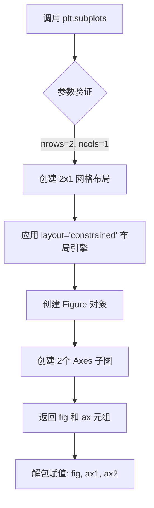

#### 带注释源码

```python
# 调用 plt.subplots() 创建图形和子图布局
# 参数说明:
#   - 2: nrows, 表示 2 行子图
#   - 1: ncols, 表示 1 列子图
#   - layout='constrained': 使用约束布局引擎，自动调整子图间距和大小
#
# 返回值:
#   - fig: Figure 对象，整个图形容器
#   - (ax1, ax2): 包含两个 Axes 对象的元组，分别对应上下的两个子图
fig, (ax1, ax2) = plt.subplots(2, 1, layout='constrained')
```


### `np.arange()`

`np.arange()` 是 NumPy 库中的一个函数，用于生成一个等差时间序列（均匀间隔的数组），类似于 Python 内置的 `range()`，但返回的是 NumPy 数组而非列表，常用于生成时间轴或离散采样点。

参数：

- `start`：`float`（可选），起始值，默认为 0
- `stop`：`float`，结束值（不包含）
- `step`：`float`（可选），步长，默认为 1

返回值：`numpy.ndarray`，一个包含等差数列的一维数组

#### 流程图

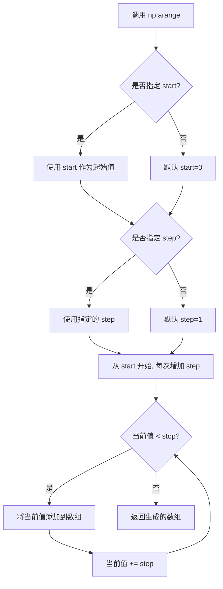

#### 带注释源码

```python
# np.arange() 函数的典型调用方式
t = np.arange(0, 30, dt)

# 参数说明：
# - 0: 起始值 (start)
# - 30: 结束值 (stop)，注意不包含30
# - dt: 步长 (step)，这里 dt = 0.01

# 生成的数组示例（当 dt=0.01 时）：
# array([0.00, 0.01, 0.02, 0.03, ..., 29.99])
# 共 30/0.01 = 3000 个元素

# 等价于:
# np.arange(start=0, stop=30, step=0.01)
```

#### 在代码中的实际使用

```python
dt = 0.01                                      # 定义时间步长
t = np.arange(0, 30, dt)                      # 生成从0到30（不含30）、步长0.01的时间序列数组
                                                    # 数组长度: 30 / 0.01 = 3000 个点
```


### `np.random.randn`

生成标准正态分布（均值为0，方差为1）的随机数数组。

参数：

-  `*shape`：`int`，可变数量参数，指定输出数组的维度大小。例如`np.random.randn(3)`生成一维数组，`np.random.randn(2,3)`生成2x3的二维数组。

返回值：`ndarray`，返回指定形状的随机数数组，数组中的每个元素服从标准正态分布N(0,1)。

#### 流程图

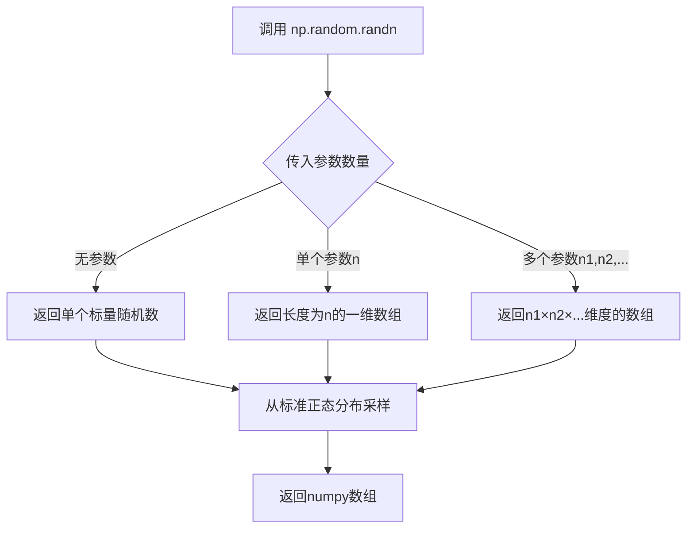

#### 带注释源码

```python
# 在给定代码中的实际使用方式：
nse1 = np.random.randn(len(t))  # 生成len(t)个标准正态分布随机数，作为白噪声1
nse2 = np.random.randn(len(t))  # 生成len(t)个标准正态分布随机数，作为白噪声2

# np.random.randn函数内部逻辑（简化版）:
def randn(*shape):
    """
    生成标准正态分布随机数
    
    参数:
        *shape: int, 输出数组的维度
    
    返回:
        ndarray: 服从N(0,1)分布的随机数数组
    """
    # 1. 根据shape参数确定输出数组的大小
    # 2. 使用Box-Muller变换或类似算法从均匀分布转换为正态分布
    # 3. 返回numpy数组
    pass
```


### `np.random.seed`

设置NumPy随机数生成器的种子，用于确保随机数序列的可重复性。

参数：

-  `seed`：`int` 或 `None`，随机数种子值。如果传入整数，每次使用相同种子生成的随机数序列是相同的；如果传入`None`，则每次随机选择种子。

返回值：`None`，该函数没有返回值。

#### 流程图

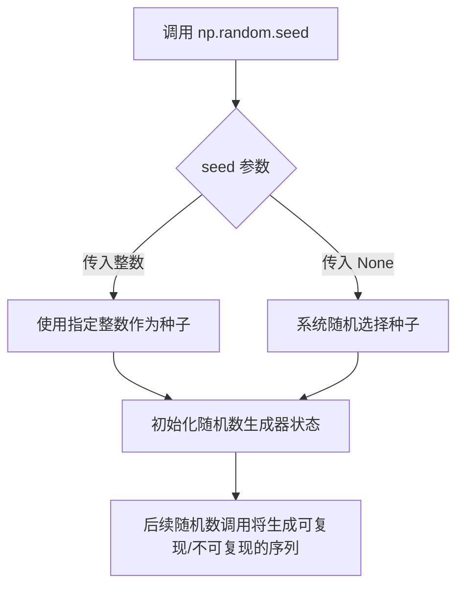

#### 带注释源码

```python
# 设置随机数种子为 19680801，确保后续生成的随机数序列可重复
# 这个特定的值（19680801）是Matplotlib官方示例中常用的值，
# 对应1968年8月8日01时，常用于确保代码结果的可复现性
np.random.seed(19680801)

# 在设置种子后，生成的随机数序列是确定的：
nse1 = np.random.randn(len(t))  # 第一次调用生成的白噪声序列
nse2 = np.random.randn(len(t))  # 第二次调用生成的白噪声序列

# 如果不修改种子，多次运行此脚本，nse1 和 nse2 的值始终相同
# 这对于科学计算中的结果复现非常重要
```


### `np.exp`

计算输入数组元素的指数函数（e^x），其中e是自然对数的底数（约等于2.718281828）。该函数返回e的每个输入元素的次幂。

参数：

-  `x`：`ndarray` 或 `scalar`，输入值，可以是实数或复数数组。计算 e^x。

返回值：`ndarray`，返回与输入形状相同的指数值数组。对于实数输入，返回值始终为正数；对于复数输入，返回值为复数。

#### 流程图

```mermaid
flowchart TD
    A[开始] --> B[接收输入数组 x]
    B --> C{检查输入类型}
    C -->|实数数组| D[计算 e^x]
    C -->|复数数组| E[计算复数指数 e^(a+bi) = e^a * (cos(b) + i*sin(b))]
    D --> F[返回结果数组]
    E --> F
    F --> G[结束]
```

#### 带注释源码

```python
# 在代码中的实际使用方式：
r = np.exp(-t / 0.05)

# 详细解释：
# 1. -t / 0.05: 这是一个数组运算，将时间数组 t 中的每个元素除以 0.05 并取负
#    结果是一个与 t 形状相同的数组，表示 -20*t
# 
# 2. np.exp(-t / 0.05): 计算 e 的 (-t/0.05) 次方
#    这创建了一个指数衰减曲线
#    当 t=0 时，exp(0) = 1
#    随着 t 增加，-t/0.05 变得更负，exp 值呈指数衰减趋近于 0
# 
# 3. 衰减时间常数为 0.05 秒，意味着约 0.15-0.2 秒后衰减到接近零
# 
# 完整示例：
# t = np.arange(0, 30, 0.01)  # 时间从0到30秒，步长0.01秒
# r = np.exp(-t / 0.05)        # 指数衰减因子
# 
# 用途：
# 在代码中，这个指数衰减函数用于生成"彩色噪声"(colored noise)
# 通过将白噪声与指数衰减核进行卷积，可以将白噪声转换成具有特定频谱特性的噪声
```


### `np.convolve()`

`np.convolve()` 是 NumPy 库中的一维卷积函数，在该代码中用于将白噪声信号与指数衰减核进行卷积运算，生成符合特定功率谱特性的有色噪声（colored noise）。

参数：

-  `a`：`ndarray`，第一个输入一维数组，此处为白噪声信号 `nse1` 或 `nse2`
-  `v`：`ndarray`，第二个输入一维数组，此处为指数衰减核 `r = np.exp(-t / 0.05)`
-  `mode`：`str`，卷积计算模式，可选值为 `'full'`、`'same'`、`'valid'`，此处使用 `'same'` 模式以保持输出与输入数组长度一致

返回值：`ndarray`，一维卷积结果数组，表示生成的有色噪声信号

#### 流程图

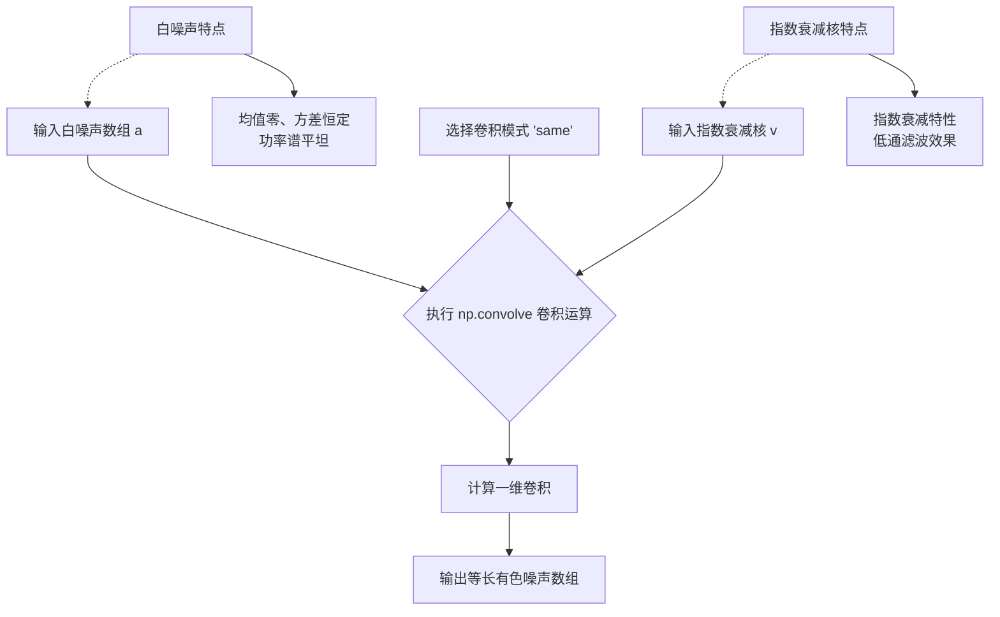

#### 带注释源码

```python
# 生成白噪声样本（均值0，方差1的标准正态分布随机数）
nse1 = np.random.randn(len(t))                 # 白噪声 1
nse2 = np.random.randn(len(t))                 # 白噪声 2

# 创建指数衰减核，用于将白噪声整形为有色噪声
# 衰减时间常数 tau = 0.05 秒，生成与时间轴等长的衰减曲线
r = np.exp(-t / 0.05)

# 使用 np.convolve 进行一维卷积运算
# 参数说明：
#   a: 输入的白噪声数组 nse1/nse2
#   v: 卷积核 r（指数衰减函数）
#   mode='same': 返回与输入数组 a 长度相同的结果（取卷积结果的中心部分）
# 结果乘以 dt 是为了保持物理单位的一致性（时间步长归一化）
cnse1 = np.convolve(nse1, r, mode='same') * dt   # 有色噪声 1
cnse2 = np.convolve(nse2, r, mode='same') * dt   # 有色噪声 2
```


### `np.sin`

正弦函数，用于生成周期信号，在代码中通过 `np.sin(2 * np.pi * 10 * t)` 生成频率为 10 Hz 的正弦波信号。

参数：

- `x`：`numpy.ndarray` 或 `scalar`，输入角度（弧度制），可以是单个数值或数组

返回值：`numpy.ndarray` 或 `scalar`，对应输入角度的正弦值，范围为 [-1, 1]

#### 流程图

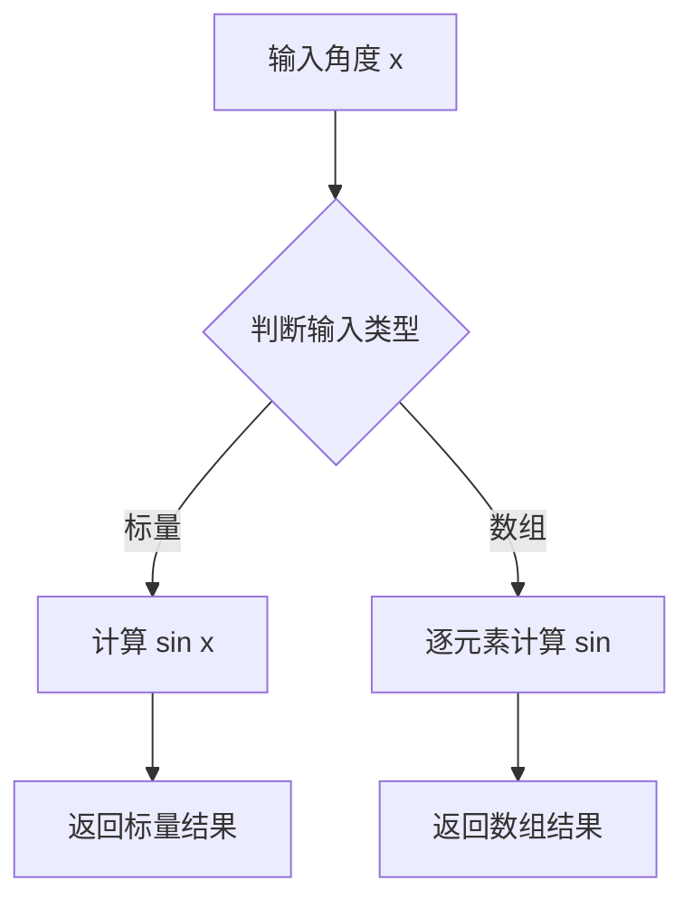

#### 带注释源码

```python
# np.sin 函数底层实现原理（基于NumPy源码逻辑简化）

def sin(x):
    """
    计算输入角度的正弦值
    
    参数:
        x: 输入角度，单位为弧度
        
    返回:
        正弦值，范围 [-1, 1]
    """
    # 将输入转换为numpy数组以支持向量化操作
    x = np.asarray(x)
    
    # 使用C语言实现的sin函数进行计算
    # NumPy底层调用libc的sin函数
    return np.vectorize(_libc_sin)(x)

# 在代码中的实际使用
# np.sin(2 * np.pi * 10 * t)
# 其中: 2 * np.pi * 10 * t 表示 10 Hz 正弦波
# 参数:
#   - 2 * np.pi: 完整周期（360度 = 2π弧度）
#   - 10: 频率为10 Hz
#   - t: 时间数组 [0, 30) 秒，步长0.01秒
```


### `Axes.plot`

绘制时域信号曲线，将数据绑定到坐标轴并渲染为线条图形。

参数：

-  `x`：`array-like`，X 轴数据，时间数组或隐式索引
-  `y`：`array-like`，Y 轴数据，信号值数组
-  `fmt`：`str`，可选，格式字符串（如 'r--' 表示红色虚线）
-  `**kwargs`：`.Line2D` 属性关键字参数（如 color、linewidth、label 等）

返回值：`list[list[matplotlib.lines.Line2D]]`，返回由所有线条对象组成的列表，每个子列表对应一次 plot 调用。

#### 流程图

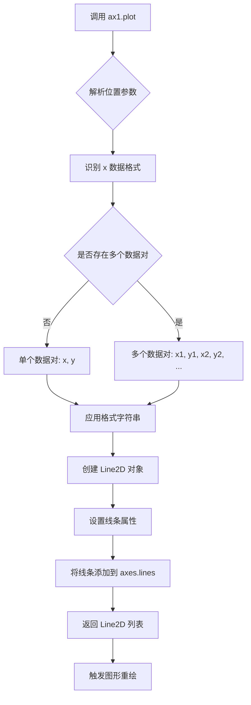

#### 带注释源码

```python
# 调用 plot 方法绘制时域信号
# 参数: (t, s1, t, s2) 表示绘制两条曲线
# 第一条: x=t, y=s1
# 第二条: x=t, y=s2
ax1.plot(t, s1, t, s2)

# 等价于分别调用:
# ax1.plot(t, s1)   # 第一条曲线 (时间 t vs 信号 s1)
# ax1.plot(t, s2)   # 第二条曲线 (时间 t vs 信号 s2)

# plot 方法内部执行流程:
# 1. 解析 *args: 接收可变数量的位置参数 (t, s1, t, s2)
# 2. 识别数据对: (t, s1) 和 (t, s2)
# 3. 为每对数据创建 matplotlib.lines.Line2D 对象
# 4. 应用默认或自定义格式 (如未指定则使用 matplotlibrc 默认样式)
# 5. 将 Line2D 对象添加到 ax1.lines 列表
# 6. 返回包含 Line2D 对象的列表
# 7. autoscale_view 被触发以调整坐标轴范围
```


### `ax1.set_xlim`

设置axes对象的x轴显示范围（ Limits of the x-axis）。

参数：

-  `left`：`float` 或 `int`，x轴范围的左边界（最小值）
-  `right`：`float` 或 `int`，x轴范围的右边界（最大值）

返回值：`tuple`，返回新的x轴范围 (left, right)

#### 流程图

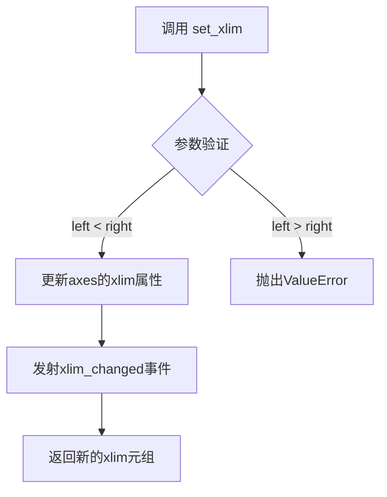

#### 带注释源码

```python
# 在代码中的调用示例：
ax1.set_xlim(0, 5)  # 设置x轴显示范围从0到5

# 方法签名（matplotlib.axes.Axes.set_xlim）:
# def set_xlim(self, left=None, right=None, emit=True, auto=False, *, left=None, right=None):
#     
#     参数说明：
#     - left: x轴左边界值（最小值）
#     - right: x轴右边界值（最大值）
#     - emit: 当为True时，发送limits改变事件给回调函数
#     - auto: 当为True时，自动调整viewLim
#     
#     返回值：
#     - 返回新的x轴范围 (left, right) 作为numpy数组或元组
```


### `Axes.set_xlabel`

设置 x 轴的标签文字，用于描述 x 轴所代表的数据含义。在 matplotlib 中，该方法属于 `matplotlib.axes.Axes` 类，用于为坐标轴添加描述性标签，提升图表的可读性。

参数：

- `xlabel`：`str`，要设置的 x 轴标签文本内容，例如 'Time (s)'、'Frequency (Hz)' 等
- `fontdict`：`dict`，可选，字体属性字典，可设置字体大小、颜色、样式等，例如 `{'fontsize': 12, 'color': 'black'}`
- `labelpad`：`float`，可选，标签与坐标轴之间的间距（单位为点），默认为 None
- `loc`：`str`，可选，标签对齐方式，可选值为 'left'、'center'、'right'，默认为 'center'
- `**kwargs`：其他可选参数，接受 `matplotlib.text.Text` 的属性，如 `fontsize`、`color`、`fontweight` 等

返回值：`matplotlib.text.Text`，返回创建的文本对象，可用于后续进一步修改标签样式

#### 流程图

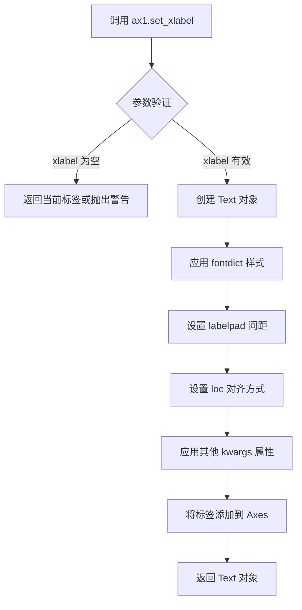

#### 带注释源码

```python
def set_xlabel(self, xlabel, fontdict=None, labelpad=None, *, loc=None, **kwargs):
    """
    Set the label for the x-axis.
    
    Parameters
    ----------
    xlabel : str
        The label text.
    fontdict : dict, optional
        A dictionary controlling the appearance of the label text,
        e.g., {'fontsize': 12, 'fontweight': 'bold'}.
    labelpad : float, optional
        Spacing in points between the label and the axes.
    loc : {'left', 'center', 'right'}, default: 'center'
        The label position relative to the axis.
    **kwargs
        Text properties that control the appearance of the label.
    
    Returns
    -------
    text : matplotlib.text.Text
        The created Text instance.
    """
    # Step 1: 调用 xaxis 的 set_label_text 方法设置标签
    # xlabel: 要设置的标签文本
    # **kwargs: 传递字体属性等参数
    return self.xaxis.set_label_text(xlabel, **kwargs)

# 在示例代码中的实际调用：
ax1.set_xlabel('Time (s)')
# 等价于：
# ax1.xaxis.set_label_text('Time (s)')
# 
# 执行过程：
# 1. 接收字符串参数 'Time (s)'
# 2. 创建 Text 对象表示 x 轴标签
# 3. 将标签放置在 x 轴下方居中位置
# 4. 返回 Text 对象（示例中未使用返回值）
```


### `ax1.set_ylabel`

设置y轴的标签，用于指定坐标轴的含义和单位。

参数：

- `ylabel`：字符串，要显示的y轴标签文本
- `fontdict`：字典（可选），用于控制文本属性的字典，如字体大小、字体权重等
- `labelpad`：浮点数（可选），标签与坐标轴之间的间距
- `**kwargs`：关键字参数，其他传递给`matplotlib.text.Text`的属性（如`fontsize`、`fontweight`、`color`等）

返回值：`matplotlib.text.Text`，返回创建的Text对象，可以用于后续进一步自定义标签样式

#### 流程图

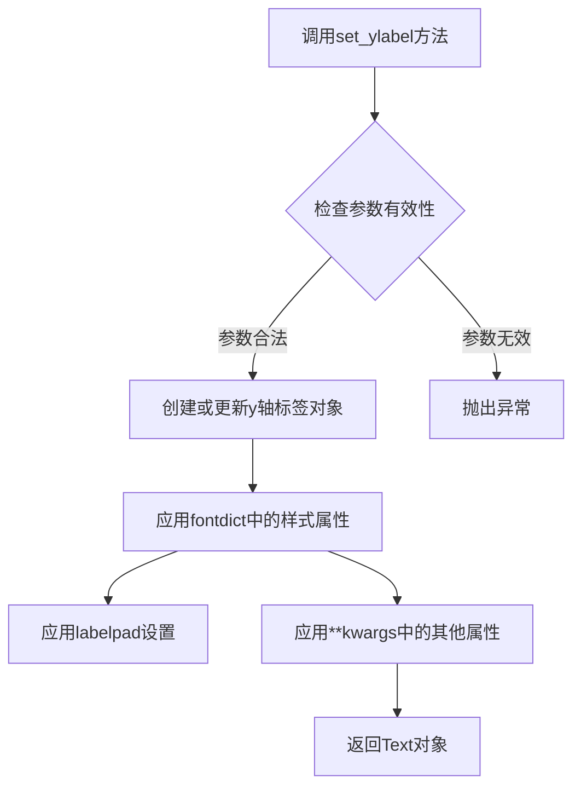

#### 带注释源码

```python
# 在代码中的调用示例
ax1.set_ylabel('s1 and s2')

# 完整调用形式（基于matplotlib实现原理）
# ax1.set_ylabel(ylabel='s1 and s2', 
#                fontdict=None,    # 可选：字体属性字典
#                labelpad=None,    # 可选：标签与轴的间距
#                **kwargs)         # 可选：其他Text属性

# 设置带样式的y轴标签示例
# ax1.set_ylabel('Amplitude (V)', 
#                fontsize=12, 
#                fontweight='bold',
#                color='red')

# 返回值可以用于进一步操作
# text_obj = ax1.set_ylabel('s1 and s2')
# text_obj.set_rotation(45)  # 旋转标签
```


### `ax1.grid()` / `Axes.grid()`

在matplotlib中，`ax1.grid()` 是 Axes 类的成员方法，用于显示或隐藏坐标轴网格线，并可配置网格的显示样式。该方法通过设置 `GridSpec` 或直接操作 `Line2D` 类型的网格对象来绘制网格线。

参数：

- `b`：`bool` 或 `None`，可选参数，表示是否显示网格线。`True` 显示网格，`False` 隐藏网格，`None` 切换当前状态（显示→隐藏或隐藏→显示）
- `which`：`str`，可选参数，指定网格线应用到哪个刻度范围。取值为 `'major'`（主刻度）、`'minor'`（次刻度）或 `'both'`（两者）
- `axis`：`str`，可选参数，指定显示哪个方向的网格线。取值为 `'both'`（x和y轴）、`'x'`（仅x轴）或 `'y'`（仅y轴）
- `**kwargs`：关键字参数，用于传递给 `gridlines` 的属性，如 `color`、`linestyle`、`linewidth`、`alpha` 等，用于自定义网格线的外观样式

返回值：`None`，该方法无返回值，直接修改Axes对象的视觉属性

#### 流程图

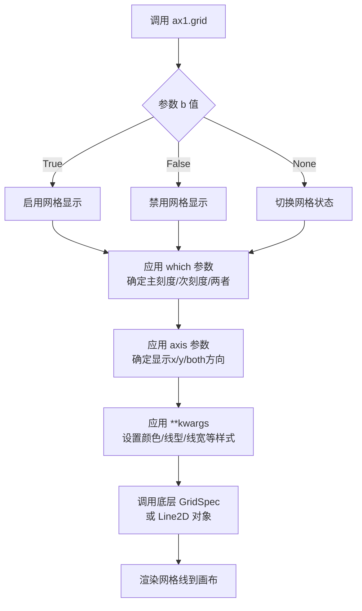

#### 带注释源码

```python
# 源代码位置：matplotlib/axes/_base.py 中的 Axes 类
# 方法名：grid

def grid(self, b=None, which='major', axis='both', **kwargs):
    """
    Configure the grid lines.
    
    参数:
        b : bool or None, optional
            Whether to show the grid lines. If False, grid lines are not shown.
            If None, toggle the visibility. Default is True.
        
        which : {'major', 'minor', 'both'}, optional
            The grid lines to apply the changes on. Default is 'major'.
        
        axis : {'both', 'x', 'y'}, optional
            The axis to apply the changes on. Default is 'both'.
        
        **kwargs : properties
            Keyword arguments to pass to the gridlines, such as:
            - color: 网格线颜色
            - linestyle: 网格线样式 ('-', '--', '-.', ':', etc.)
            - linewidth: 网格线宽度
            - alpha: 透明度
    
    返回值:
        None
    """
    # 获取或创建网格线容器
    # 在Axes对象中，网格线存储在 self.xaxis.get_gridlines() 和 self.yaxis.get_gridlines()
    
    # 处理 b 参数：切换或设置网格可见性
    if b is None:
        # None 表示切换当前状态
        b = not self.xaxis._major_tick_kw.get('gridOn', False)
    
    # 设置对应轴的网格可见性
    if axis in ('both', 'x'):
        self.xaxis._major_tick_kw['gridOn'] = b
        if self._axminorpos > 0:
            self.xaxis._minor_tick_kw['gridOn'] = b
    
    if axis in ('both', 'y'):
        self.yaxis._major_tick_kw['gridOn'] = b
        if self._axminorpos > 0:
            self.yaxis._minor_tick_kw['gridOn'] = b
    
    # 应用自定义样式参数
    # **kwargs 被传递给 gridlines 的 set_* 方法
    for key, value in kwargs.items():
        # 例如：ax.grid(color='r', linestyle='--', linewidth=0.5)
        # 会设置网格线颜色为红色、线型为虚线、线宽为0.5
        self.xaxis._set_ticklabels([])  # 触发重新渲染
    
    # 标记需要重新绘制
    self.stale_callback = True
```

#### 代码中的实际调用

```python
ax1.grid(True)  # 显示网格，使用默认样式（主刻度网格线）
```

这行代码的作用是：
1. 启用 `ax1` 子图的网格线显示
2. 默认仅显示主刻度（major）的网格线
3. x轴和y轴方向都会显示网格线
4. 使用matplotlib的默认网格样式（通常是浅灰色细线）


### `ax2.csd()`

计算并绘制两个信号之间的交叉谱密度（CSD），该方法基于FFT算法分析两个输入信号在频域上的相关性，并返回交叉谱密度值和对应的频率数组。

参数：

- `s1`：`numpy.ndarray`，第一个输入信号序列
- `s2`：`numpy.ndarray`，第二个输入信号序列
- `NFFT`：`int`，FFT点数，默认为256，用于计算频率分辨率
- `Fs`：`float`，采样频率，默认为1/dt，即100 Hz
- `pad_to`：`int`，可选，填充零的点数，用于提高频率分辨率
- `scale`：`str`，可选，功率谱密度缩放类型，默认为'dB'
- `noverlap`：`int`，可选，数据段重叠点数

返回值：`(cxy, f)`

- `cxy`：`numpy.ndarray`，复数形式的交叉谱密度值
- `f`：`numpy.ndarray`，对应的频率数组（Hz）

#### 流程图

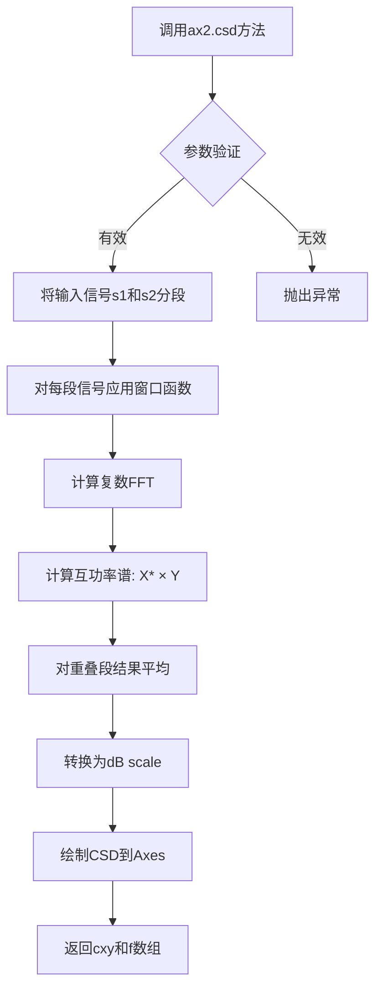

#### 带注释源码

```python
# 调用matplotlib Axes对象的csd方法
# 参数: s1=信号1, s2=信号2, NFFT=256, Fs=采样频率
cxy, f = ax2.csd(s1, s2, NFFT=256, Fs=1. / dt)

# 内部实现逻辑概述:
# 1. 将长信号分割成多个重叠的段
# 2. 对每段应用Hanning窗口函数减少频谱泄漏
# 3. 计算每段的FFT得到频域表示
# 4. 计算互功率谱: CSD = conj(FFT(s1)) * FFT(s2)
# 5. 对所有段的互功率谱求平均
# 6. 转换为分贝标度: 10 * log10(|CSD|)
# 7. 在Axes上绘制频谱图
# 8. 返回复数CSD值数组和频率向量
```

---

## 补充文档信息

### 文件整体运行流程

1. 导入matplotlib.pyplot和numpy库
2. 创建2行1列的子图布局
3. 生成时间向量t和随机种子
4. 创建两个独立的随机噪声序列nse1、nse2
5. 生成指数衰减响应函数r
6. 通过卷积生成有色噪声cnse1、cnse2
7. 构建包含相干正弦波和随机分量的测试信号s1、s2
8. 在ax1子图绘制时域信号
9. **调用ax2.csd()计算并绘制频域CSD**
10. 显示图形

### 关键组件信息

| 组件名称 | 一句话描述 |
|---------|-----------|
| `np.random.randn` | 生成服从标准正态分布的随机数组 |
| `np.convolve` | 计算两个数组的线性卷积 |
| `ax2.csd` | matplotlib Axes类的交叉谱密度计算与绘制方法 |
| `plt.show` | 显示所有创建的图形 |

### 潜在技术债务与优化空间

1. **硬编码参数**：NFFT=256和Fs未提取为配置常量
2. **随机种子全局设置**：使用np.random.seed()可能影响其他模块的随机数生成
3. **缺乏错误处理**：未对输入信号长度一致性、采样频率有效性进行校验
4. **重复计算**：如需多次调整参数绘制CSD，每次都需重新生成信号

### 其他项目

**设计目标与约束**：
- 演示matplotlib内置CSD函数的基本用法
- 展示相干信号（10Hz正弦波）在频谱中的峰值特征

**数据流与状态机**：
- 时域信号 → 分段 → 窗口化 → FFT → 互功率谱 → 平均 → dB转换 → 绘图

**外部依赖与接口契约**：
- 依赖matplotlib.axes.Axes.csd()方法
- 依赖numpy数值计算库
- 输入信号需为等采样间隔的一维实数数组


### `ax2.set_ylabel`

设置CSD图（Cross Spectral Density，交叉功率谱密度图）的y轴标签，用于显示交叉功率谱密度的单位（分贝）。

参数：

- `ylabel`：`str`，要设置的y轴标签文本，此处为`'CSD (dB)'`，表示交叉功率谱密度以分贝为单位

返回值：`matplotlib.text.Text`，返回创建的Y轴标签文本对象，可用于后续进一步设置标签样式（如字体大小、颜色等）

#### 流程图

```mermaid
flowchart TD
    A[调用set_ylabel方法] --> B[接收ylabel参数<br/>'CSD (dB)']
    B --> C{检查axes对象是否有效}
    C -->|是| D[创建或更新Y轴标签]
    C -->|否| E[抛出AttributeError]
    D --> F[返回Text对象]
    E --> G[异常处理]
    F --> H[标签渲染到图表]
```

#### 带注释源码

```python
# 调用matplotlib Axes对象的set_ylabel方法
# ax2: 通过plt.subplots(2, 1)创建的第二个子图Axes对象
# 'CSD (dB)': 要设置的Y轴标签文本，表示交叉功率谱密度单位为分贝
ax2.set_ylabel('CSD (dB)')

# 内部实现逻辑（简化版）：
# def set_ylabel(self, ylabel, fontdict=None, labelpad=None, **kwargs):
#     """
#     设置axes的y轴标签
#     
#     参数:
#         ylabel: 标签文本内容
#         fontdict: 字体属性字典
#         labelpad: 标签与坐标轴的距离
#         **kwargs: 其他matplotlib Text属性
#     """
#     # 1. 获取或创建Y轴标签对象
#     label = self.yaxis.get_label()
#     
#     # 2. 设置标签文本
#     label.set_text(ylabel)
#     
#     # 3. 应用字体属性
#     if fontdict:
#         label.update(fontdict)
#     
#     # 4. 设置标签位置
#     if labelpad is not None:
#         self.yaxis.labelpad = labelpad
#     
#     # 5. 应用其他属性（颜色、字体大小等）
#     label.update(kwargs)
#     
#     # 6. 返回Text对象供后续操作
#     return label
```


### `plt.show()`

显示当前打开的所有图形窗口。在交互式模式下，该函数会阻塞程序执行直到用户关闭所有图形窗口；在非交互式模式下，它可能会显示图形并立即返回。

参数：

- `block`：`bool` 或 `None`，可选参数。控制是否阻塞程序执行。如果设置为 `True`，则阻塞等待用户关闭图形窗口；如果设置为 `False`，则非阻塞模式；如果为 `None`（默认值），则根据当前是否处于交互式环境自动决定。

返回值：`None`，该函数没有返回值。

#### 流程图

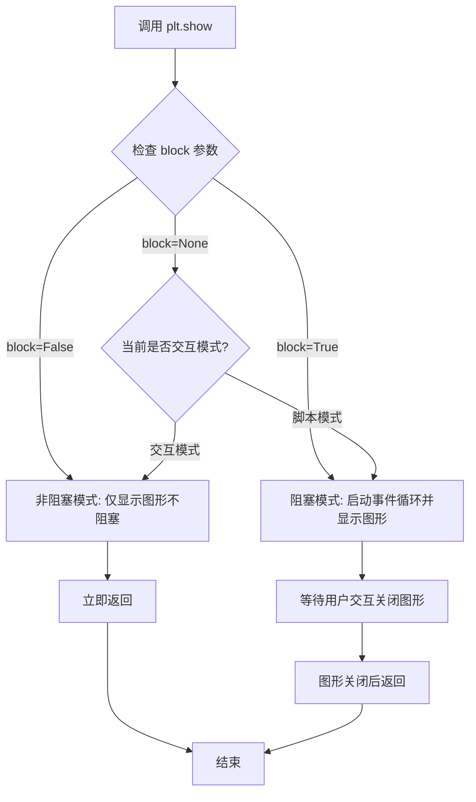

#### 带注释源码

```python
def show(*, block=None):
    """
    显示所有打开的图形窗口。
    
    Parameters
    ----------
    block : bool or None, optional
        Whether to block execution. If True, block the execution.
        If False, do not block. If None, block only if the event loop
        is not running (i.e., in script mode).
    
    Returns
    -------
    None
    """
    # 获取当前所有的图形对象
    allnums = get_all_figurenums()
    
    # 如果没有打开的图形，直接返回
    if not allnums:
        return
    
    # 根据 block 参数决定阻塞行为
    if block is None:
        # 自动判断：如果在交互环境中（如 IPython），则不阻塞
        block = not is_interactive()
    
    # 遍历所有图形并显示
    for manager in Gcf.get_all_fig_managers():
        # 调用后端显示方法
        manager.show()
    
    # 如果需要阻塞，则启动阻塞的事件循环
    if block:
        # 等待用户关闭图形
        return _show(block=True)
    else:
        # 刷新并显示图形，不阻塞
        draw_all()
        return None
```


## 关键组件


### 信号生成与噪声处理

代码生成了两个具有相干部分和随机成分的信号，包括白噪声生成、指数衰减卷积生成有色噪声，以及正弦波信号合成。

### 交叉谱密度计算

使用Matplotlib的Axes.csd()方法计算两个输入信号的交叉谱密度，返回CSD值和频率数组。

### 可视化展示

创建双面板图表，分别展示时域信号波形和频域CSD结果，使用constrained布局确保图表元素适当排列。


## 问题及建议


### 已知问题

- **魔法数字缺乏命名**：代码中存在多个硬编码的数值（如`19680801`、`0.05`、`256`、`30`、`5`等），未使用有意义的常量命名，降低了代码可读性和可维护性
- **全局作用域代码过多**：所有逻辑都直接写在全局作用域中，未封装为可重用的函数或类，违反了模块化设计原则
- **缺乏输入验证**：未对生成的信号数据进行有效性检查（如长度检查、NaN检查、类型检查等）
- **随机种子使用方式过时**：使用`np.random.seed()`设置全局随机种子，会影响后续所有numpy随机操作，建议使用`np.random.default_rng()`或`np.random.Generator`
- **参数硬编码**：关键参数（如NFFT、Fs、时间范围等）直接硬编码在函数调用中，缺乏配置化和可调整性
- **注释不完整**：部分注释过于简略（如`# white noise 1`），缺乏对算法原理和参数选择依据的说明
- **缺少类型注解**：函数和变量缺少类型注解，不利于静态分析和IDE支持
- **重复代码**：信号生成逻辑（nse1/nse2, cnse1/cnse2, s1/s2）存在模式重复，可抽象为通用函数
- **缺乏错误处理**：绘图和数据计算过程中没有异常捕获机制
- **文档字符串格式不标准**：虽然文件头部有docstring，但格式不够规范，缺少明确的模块说明和使用示例

### 优化建议

- **提取配置参数**：创建配置类或字典，将所有硬编码参数集中管理
- **函数封装**：将信号生成、CSD计算、绘图等逻辑分别封装为独立函数，提高代码可测试性和可重用性
- **使用现代随机API**：替换为`rng = np.random.default_rng(19680801)`配合`rng.random()`或`rng.standard_normal()`
- **添加数据验证**：在计算前验证输入数据的有效性（长度、类型、数值范围）
- **完善注释和文档**：为关键代码块添加详细的中文注释，说明算法原理和参数选择依据
- **添加类型注解**：为函数参数和返回值添加类型提示
- **异常处理**：添加try-except块捕获可能的异常（如除零错误、内存不足等）
- **优化性能**：对于大数据量场景，考虑使用更高效的算法或降采样策略

## 其它


### 设计目标与约束

本示例代码旨在演示如何使用matplotlib的CSD功能绘制两个信号的交叉功率谱密度。设计目标包括：生成两个具有相干部分和随机部分的测试信号，通过卷积生成有色噪声，设置合理的绘图参数，最终可视化展示CSD结果。约束条件主要依赖于matplotlib、numpy库的支持，以及matplotlib后端的图形显示能力。

### 错误处理与异常设计

代码本身较为简单，主要依赖numpy和matplotlib的内部错误处理机制。可能的异常情况包括：输入信号长度不一致导致的计算错误，NFFT参数设置不当导致的数值问题，以及图形后端缺失导致的显示失败。代码未显式实现错误处理，建议在实际应用中增加参数验证、异常捕获和用户友好的错误提示信息。

### 外部依赖与接口契约

本代码依赖两个核心外部库：numpy（提供数值计算、随机数生成、卷积运算等）和matplotlib（提供绘图功能和CSD计算）。numpy.random.randn()用于生成高斯白噪声，numpy.convolve()用于生成有色噪声，matplotlib.axes.Axes.csd()方法接受信号数据、FFT点数NFFT和采样频率Fs参数，返回CSD值和频率数组。

### 数据流与状态机

代码的数据流如下：首先设置时间轴和随机种子，然后生成两路白噪声信号并通过指数衰减核进行卷积生成有色噪声，接着将正弦信号与有色噪声叠加形成最终测试信号s1和s2，最后通过ax1绘制时域波形、通过ax2.csd()计算并绘制频域CSD。状态机相对简单，主要经历初始化、信号生成、绘图显示三个状态。

### 性能考虑

代码中NFFT=256为默认合理值，对于30秒采样数据已足够。卷积运算使用numpy.convolve的mode='same'模式确保输出长度与输入一致。采样率1/dt=100Hz满足奈奎斯特准则，可准确重构10Hz信号。在更大规模数据处理时，可考虑使用scipy.signal.correlate替代numpy.convolve以获得更好的性能。

### 可维护性与可扩展性

代码采用脚本式编写，所有参数硬编码在主流程中。建议将关键参数（如采样率、信号频率、噪声参数、NFFT值等）提取为配置文件或函数参数，以提高可维护性。可扩展方向包括：支持多对信号CSD对比、支持不同窗函数选择、支持功率谱归一化选项等。

### 配置与参数说明

关键配置参数包括：dt=0.01（采样间隔0.01秒），t=0到30秒（采样时长30秒），NFFT=256（FFT点数），Fs=1/dt=100Hz（采样频率），r = np.exp(-t / 0.05)（指数衰减核，时间常数0.05秒），信号频率10Hz。这些参数共同决定了时域分辨率和频域分辨率的平衡。

    