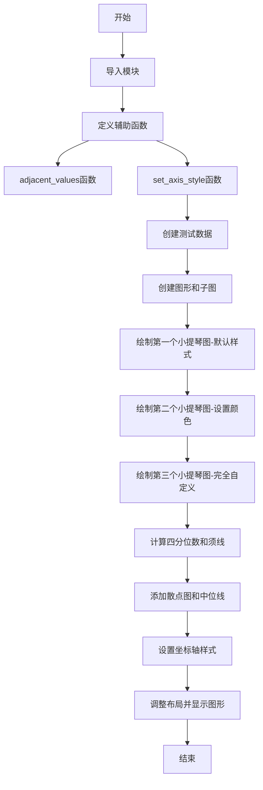
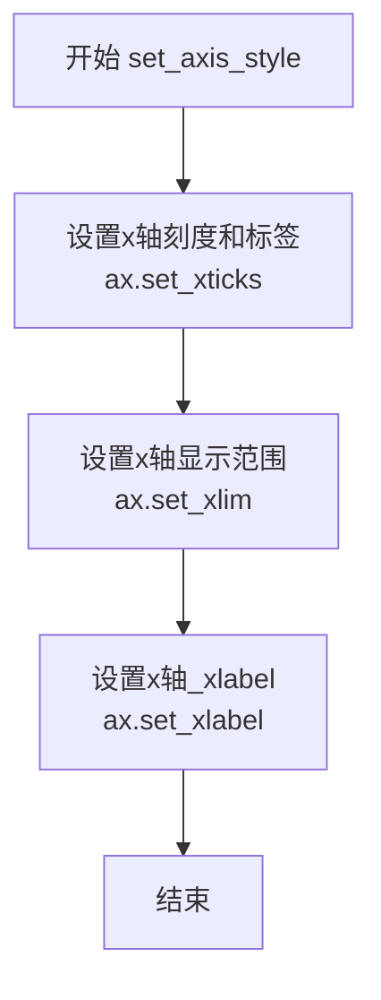

# `matplotlib\galleries\examples\statistics\customized_violin.py` 详细设计文档

这是一个matplotlib示例代码，演示了如何通过设置颜色、线宽、透明度等参数来自定义小提琴图（violin plot），包括默认样式、带颜色样式和完全自定义样式三种展示方式。

## 整体流程



## 类结构

```
本代码为脚本文件，无类层次结构
├── 全局函数
│   ├── adjacent_values - 计算四分位数的相邻值
│   └── set_axis_style - 设置坐标轴样式和标签
└── 主程序流程
```

## 全局变量及字段


### `data`
    
测试数据列表，包含4组正态分布数据

类型：`list`
    


### `fig`
    
matplotlib图形对象

类型：`matplotlib.figure.Figure`
    


### `ax1`
    
第一个子图（默认样式小提琴图）

类型：`matplotlib.axes.Axes`
    


### `ax2`
    
第二个子图（带颜色小提琴图）

类型：`matplotlib.axes.Axes`
    


### `ax3`
    
第三个子图（自定义样式小提琴图）

类型：`matplotlib.axes.Axes`
    


### `parts`
    
第三个子图的小提琴图身体部分

类型：`dict`
    


### `quartile1`
    
第一四分位数数组

类型：`numpy.ndarray`
    


### `medians`
    
中位数数组

类型：`numpy.ndarray`
    


### `quartile3`
    
第三四分位数数组

类型：`numpy.ndarray`
    


### `whiskers`
    
须线数据数组

类型：`numpy.ndarray`
    


### `whiskers_min`
    
须线最小值数组

类型：`numpy.ndarray`
    


### `whiskers_max`
    
须线最大值数组

类型：`numpy.ndarray`
    


### `inds`
    
用于散点图和线条的索引数组

类型：`numpy.ndarray`
    


### `labels`
    
x轴标签列表 ['A', 'B', 'C', 'D']

类型：`list`
    


    

## 全局函数及方法


### `adjacent_values`

该函数用于计算小提琴图中须线（whiskers）的相邻值，基于四分位数范围（IQR）确定数据的上下边界，遵循1.5倍IQR规则，并通过numpy的clip函数确保边界值不超过实际数据的范围。

参数：

- `vals`：`numpy.ndarray`，已排序的一维数值数组，用于确定数据的实际边界
- `q1`：`float`，第一四分位数（25th percentile），表示数据分布的25%位置
- `q3`：`float`，第三四分位数（75th percentile），表示数据分布的75%位置

返回值：`Tuple[float, float]`，返回下相邻值（lower_adjacent_value）和上相邻值（upper_adjacent_value），用于绘制小提琴图的须线

#### 流程图

```mermaid
flowchart TD
    A[开始执行 adjacent_values] --> B[计算上相邻值<br/>upper = q3 + (q3 - q1) * 1.5]
    B --> C[限制上相邻值范围<br/>np.clipupper, q3, vals[-1]]
    C --> D[计算下相邻值<br/>lower = q1 - (q3 - q1) * 1.5]
    D --> E[限制下相邻值范围<br/>np.cliplower, vals[0], q1]
    E --> F[返回下相邻值和上相邻值]
    F --> G[结束]
    
    style A fill:#f9f,stroke:#333
    style G fill:#9f9,stroke:#333
```

#### 带注释源码

```python
def adjacent_values(vals, q1, q3):
    """
    计算小提琴图的相邻值（须线边界）
    
    使用1.5倍IQR规则确定数据的异常值边界，
    并确保边界值不超过实际数据的范围
    
    参数:
        vals: 已排序的数值数组，用于获取数据的最小/最大值边界
        q1: 第一四分位数（25%分位点）
        q3: 第三四分位数（75%分位点）
    
    返回:
        (下相邻值, 上相邻值) 元组
    """
    
    # 计算上相邻值：基于四分位距的1.5倍
    # IQR = q3 - q1，上边界 = q3 + 1.5 * IQR
    upper_adjacent_value = q3 + (q3 - q1) * 1.5
    
    # 使用clip限制上相邻值的范围：
    # - 最小值不能小于q3（确保须线从四分位数开始）
    # - 最大值不能超过数据中的最大值vals[-1]
    upper_adjacent_value = np.clip(upper_adjacent_value, q3, vals[-1])

    # 计算下相邻值：基于四分位距的1.5倍
    # 下边界 = q1 - 1.5 * IQR
    lower_adjacent_value = q1 - (q3 - q1) * 1.5
    
    # 使用clip限制下相邻值的范围：
    # - 最小值不能小于数据中的最小值vals[0]
    # - 最大值不能大于q1（确保须线到四分位数为止）
    lower_adjacent_value = np.clip(lower_adjacent_value, vals[0], q1)
    
    # 返回下、上相邻值作为须线的边界
    return lower_adjacent_value, upper_adjacent_value
```


### `set_axis_style`

设置坐标轴样式的函数，用于配置matplotlib图表的x轴刻度、范围和标签。

参数：

- `ax`：`matplotlib.axes.Axes`，matplotlib坐标轴对象，用于设置样式
- `labels`：`list[str]`或`list`，坐标轴的标签列表，通常为字符串列表

返回值：`None`，该函数无返回值，直接修改传入的ax对象

#### 流程图



#### 带注释源码

```python
def set_axis_style(ax, labels):
    """
    设置坐标轴样式
    
    参数:
        ax: matplotlib坐标轴对象
        labels: 标签列表
    """
    # 设置x轴刻度位置和对应标签
    # 使用np.arange生成从1到len(labels)的序列作为刻度位置
    ax.set_xticks(np.arange(1, len(labels) + 1), labels=labels)
    
    # 设置x轴显示范围
    # 左侧留出0.25的空间，右侧留出0.25的空间
    ax.set_xlim(0.25, len(labels) + 0.75)
    
    # 设置x轴的_xlabel标签
    ax.set_xlabel('Sample name')
```

## 关键组件


### adjacent_values 函数

计算小提琴图须（whiskers）的上下边界，基于四分位距（IQR）使用1.5倍规则，并通过np.clip确保边界在有效数据范围内。

### set_axis_style 函数

设置坐标轴的刻度、标签和x轴范围，规范化坐标轴样式以便展示分类数据。

### 数据生成模块

使用numpy生成4组正态分布的随机数据，每组100个样本，标准差从1到4递增，作为小提琴图的输入数据。

### ax1 默认小提琴图

展示Matplotlib小提琴图的基本用法，仅提供数据即可生成默认样式的小提琴图。

### ax2 颜色自定义小提琴图

通过facecolor参数传入颜色元组列表自定义小提琴图填充色，通过linecolor参数设置轮廓颜色。Matplotlib会自动重复颜色序列以匹配数据分布数量。

### ax3 完全自定义小提琴图

手动控制小提琴图的各个组成部分：隐藏默认的统计量显示，自定义填充色和轮廓线，添加四分位线、中须，并散点绘制中位数。包含完整的统计可视化逻辑。

### 四分位计算模块

使用np.percentile函数沿axis=1方向计算每组数据的第25、50、75百分位数，为自定义小提琴图的辅助线提供数据支撑。

### 须计算模块

对每组数据调用adjacent_values函数，计算基于IQR的须边界，返回 whiskers_min 和 whiskers_max 两个数组。

### 坐标轴样式统一设置

遍历所有子图应用set_axis_style函数，统一设置分类标签和坐标轴外观，确保三个子图视觉一致性。


## 问题及建议


### 已知问题

- **魔法数字和硬编码值**：多处使用硬编码值如 `1.5`（IQR倍数）、`100`（样本数）、`0.25`、`0.75`、`19680801`（随机种子）、`#D43F3A`（颜色值），缺乏配置性和可维护性
- **重复代码**：`ax.set_ylabel('Observed values')` 在 ax1 和 ax2 中重复；`ax.set_title()` 调用分散在各子图；`np.arange(1, len(medians) + 1)` 在多处重复计算
- **变量命名不一致**：`quartile1` 和 `quartile3` 是简写形式，而 `medians` 是复数形式，应统一风格
- **注释位置不当**：关于颜色序列的注释夹在代码中间，影响阅读流畅性
- **缺乏输入验证**：函数 `adjacent_values` 和 `set_axis_style` 没有对输入参数进行有效性检查
- **数据处理效率**：在循环中对已排序的数组再次调用 `sorted_array`，且 `np.percentile` 已能处理原始数据，无需预先排序
- **函数职责不单一**：主程序包含大量具体的绘图逻辑，可提取为独立函数以提高复用性

### 优化建议

- 将魔法数字提取为常量或配置参数，如 `IQR_MULTIPLIER = 1.5`、`SAMPLE_SIZE = 100`
- 使用循环或列表推导式统一设置子图属性，避免重复代码
- 统一变量命名风格，使用完整单词如 `quartile_first`、`quartile_third`
- 将注释移至函数文档字符串或代码头部
- 为函数添加参数类型注解和输入验证逻辑
- 优化数据处理流程，直接传递原始数据给 `np.percentile`，避免不必要的排序操作
- 将主程序中的绘图逻辑封装为函数，如 `create_default_violinplot()`、`create_colored_violinplot()` 等
- 考虑将配置参数（颜色、标签、样式）抽取为配置文件或字典常量
</think>

## 其它


### 设计目标与约束

本代码旨在演示Matplotlib中小提琴图的各种自定义功能，包括颜色、线型、四分位数、须线等视觉元素的定制。设计目标是提供清晰的示例代码，帮助用户理解如何创建美观且信息丰富的小提琴图。约束方面，代码仅依赖Matplotlib和NumPy两个核心库，确保轻量级和广泛的兼容性。

### 错误处理与异常设计

代码主要依赖Matplotlib的violinplot方法，该方法在数据格式不正确时会抛出异常。数据必须为列表形式，每个元素为可排序的数值数组。代码中使用了np.random.normal生成测试数据，确保数据格式正确。四分位数计算使用np.percentile，当数据为空或维度不匹配时会抛出异常。在实际使用中，建议对输入数据进行预验证，确保数据非空且为数值类型。

### 数据流与状态机

代码的数据流如下：首先通过NumPy生成4组正态分布的随机数据，每组100个样本点。然后对每组数据进行排序，用于后续的四分位数计算。接着调用三次violinplot方法分别绘制三幅子图，每幅图使用不同的自定义参数。最后添加散点图表示中位数，垂直线表示四分位数和须线的范围。状态机相对简单，主要状态包括数据生成、图形创建、图形定制和显示四个阶段。

### 外部依赖与接口契约

主要依赖包括：matplotlib.pyplot用于图形创建和显示，numpy用于数值计算和随机数生成。核心接口包括ax.violinplot方法（接受data、showmeans、showmedians、showextrema、facecolor、linecolor等参数），np.percentile方法（计算四分位数），以及ax.vlines和ax.scatter方法用于绘制须线和中位数标记。所有依赖均为Python科学计算的标准库，接口稳定且文档完善。

### 性能考虑

代码性能主要受数据规模影响。当前示例使用400个数据点（4组×100点），性能表现良好。对于大规模数据集，建议考虑以下优化：1）减少采样点数量；2）使用showmeans=False和showmedians=False减少计算；3）使用showextrema=False减少渲染开销。NumPy的向量化操作已针对性能优化，在当前数据规模下无需额外优化。

### 可测试性

代码的可测试性较高，主要体现在：1）函数adjacent_values和set_axis_style具有明确的输入输出，可进行单元测试；2）数据生成使用固定的随机种子（np.random.seed(19680801)），确保结果可复现；3）图形输出可与预期结果进行像素级比较。建议添加针对边界条件（如单数据点、空数据、非数值数据）的测试用例，以及针对不同参数组合的集成测试。

### 配置管理

代码中的可配置项包括：数据生成参数（随机种子19680801、样本数100、标准差范围1-4）、图形布局参数（子图数量3、图形尺寸9x3、共享y轴）、视觉定制参数（颜色、线宽、透明度、标记样式）。这些参数可通过提取为配置文件或函数参数的方式提高灵活性。当前代码将这些参数硬编码，适合作为示例而非通用工具函数使用。

### 版本兼容性

代码使用的API均为Matplotlib和NumPy的稳定接口，兼容Matplotlib 3.x和NumPy 1.x版本。需要注意的潜在兼容性问题：1）plt.subplots在旧版本中的参数可能略有不同；2）violinplot的返回值结构在不同版本中可能有所变化；3）scatter和vlines方法的参数签名相对稳定。建议在生产环境中指定明确的依赖版本范围（如matplotlib>=3.0, numpy>=1.16）。

### 使用示例与最佳实践

本代码展示了创建专业小提琴图的最佳实践：1）使用清晰的标题和轴标签；2）合理使用颜色对比突出重要信息；3）在violin图上叠加箱线图元素（须线、中位数）增强数据可读性；4）统一视觉风格（黑色边框、适当线宽）。在实际应用中，建议根据数据特性和展示目标选择合适的自定义选项，避免过度定制导致图形杂乱。

    