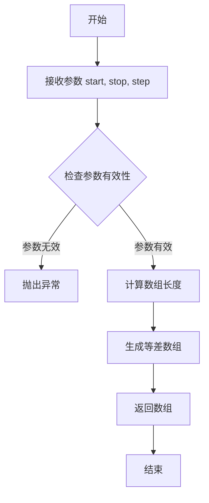
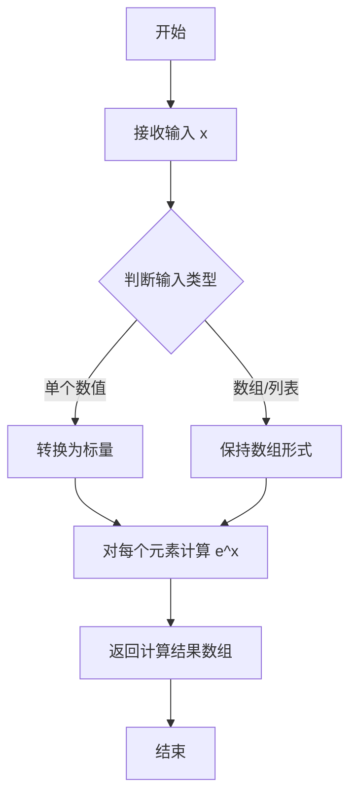
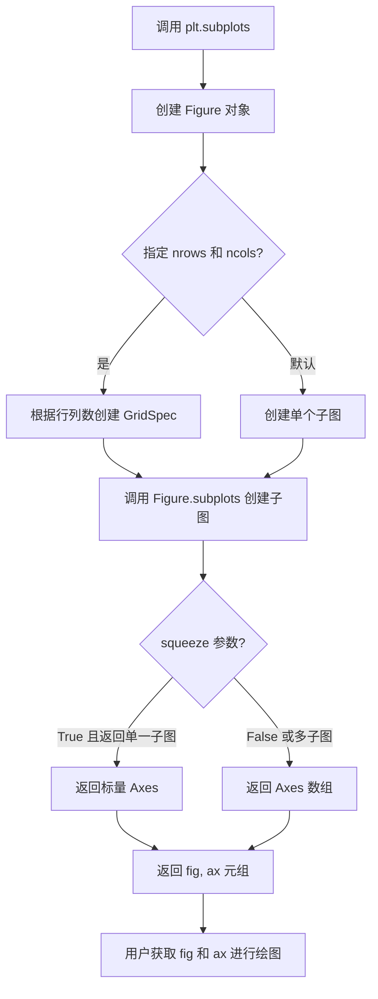
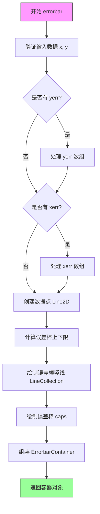
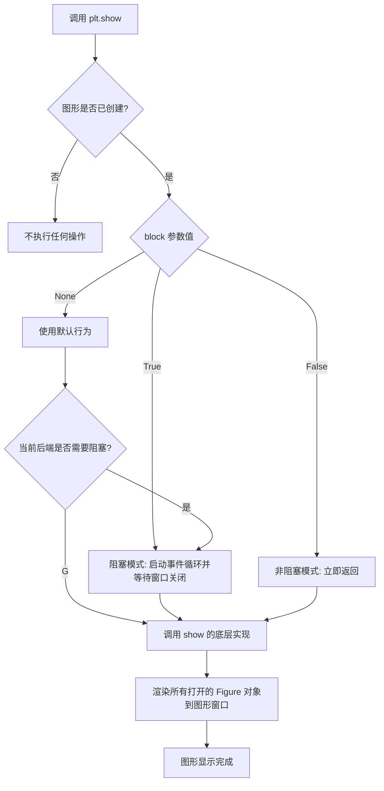

# `matplotlib\galleries\examples\statistics\errorbar.py` 详细设计文档

这是一个展示matplotlib误差棒（errorbar）基本用法的示例代码，通过调用matplotlib的errorbar方法绘制带有x和y方向误差线的折线图，用于可视化统计数据的不确定性。

## 整体流程

```mermaid
graph TD
    A[开始] --> B[导入模块]
    B --> C[导入 matplotlib.pyplot 和 numpy]
    C --> D[生成示例数据]
    D --> E[创建x数组: np.arange(0.1, 4, 0.5)]
    E --> F[创建y数组: np.exp(-x)]
    F --> G[创建图形和子图]
    G --> H[调用 fig, ax = plt.subplots()]
    H --> I[绘制误差棒图]
    I --> J[调用 ax.errorbar(x, y, xerr=0.2, yerr=0.4)]
    J --> K[显示图形]
    K --> L[调用 plt.show()]
    L --> M[结束]
```

## 类结构

```
Python脚本 (无类层次结构)
└── 脚本级代码
    ├── 导入语句
    ├── 数据生成
    └── 绘图流程
```

## 全局变量及字段


### `x`
    
自变量数组，从0.1到4，步长0.5

类型：`numpy.ndarray`
    


### `y`
    
因变量数组，计算e的-x次幂

类型：`numpy.ndarray`
    


### `fig`
    
图形对象

类型：`matplotlib.figure.Figure`
    


### `ax`
    
坐标系对象

类型：`matplotlib.axes.Axes`
    


    

## 全局函数及方法


### `np.arange`

生成一个指定起始值、结束值和步长的一维等差数组。

参数：

- `start`：`float`，起始值，范围 [0.1, 4)，默认为 0
- `stop`：`float`，结束值（不包含），这里是 4
- `step`：`float`，步长，默认为 1，这里是 0.5

返回值：`ndarray`，返回一个一维的等差数组

#### 流程图



#### 带注释源码

```python
# np.arange 函数调用示例
x = np.arange(0.1, 4, 0.5)
# 参数说明：
# - start=0.1: 起始值，从 0.1 开始
# - stop=4: 结束值，不包含 4
# - step=0.5: 步长，每个元素之间相差 0.5
# 
# 生成的数组 x 为: array([0.1, 0.6, 1.1, 1.6, 2.1, 2.6, 3.1, 3.6])
```


### `np.exp`

`np.exp` 是 NumPy 库中的指数函数，计算自然常数 e（约等于 2.71828）的 x 次幂（e^x）。该函数对输入数组或数值中的每个元素进行指数运算，返回相应指数值的数组。

参数：

- `x`：`array_like`，输入值，可以是单个数值、列表或 NumPy 数组，函数将对其中每个元素计算 e 的该元素次幂

返回值：`ndarray`，返回与输入数组形状相同的数组，数组中每个元素为 e 的对应输入元素的次幂

#### 流程图



#### 带注释源码

```python
# np.exp 函数的典型使用方式（基于NumPy源码逻辑）

import numpy as np

# 示例数据：生成从0.1到4，步长为0.5的数组
x = np.arange(0.1, 4, 0.5)

# 调用 np.exp 计算 e 的 -x 次幂
# 等价于数学表达式：y = e^(-x)
y = np.exp(-x)

# 内部实现逻辑说明：
# 1. np.exp 接受 array_like 类型的输入 x
# 2. 对输入数组中的每个元素计算自然常数 e 的 x 次方
# 3. 返回与输入形状相同的 ndarray，包含计算结果
# 
# 数学原理：
#   e ≈ 2.718281828459045
#   np.exp(1) = e ≈ 2.718...
#   np.exp(0) = 1
#   np.exp(-x) = 1 / np.exp(x)

# 打印结果验证
print(y)  # 输出: [0.90483742 0.60653066 0.40656966 0.27253179 0.18268152 0.12245643 0.08208499 0.05557602]
```


### `plt.subplots`

`plt.subplots` 是 matplotlib 库中的一个函数，用于创建一个新的图形（Figure）和一个或多个子图（Axes），并返回图形对象和子图对象的元组，是进行数据可视化时最常用的初始化图形界面函数。

参数：

- `nrows`：`int`，默认值 1，指定子图的行数
- `ncols`：`int`，默认值 1，指定子图的列数
- `sharex`：`bool` 或 `{'row', 'col', 'all'}`，默认值 False，是否共享 x 轴
- `sharey`：`bool` 或 `{'row', 'col', 'all'}`，默认值 False，是否共享 y 轴
- `squeeze`：`bool`，默认值 True，如果为 True，则返回的 Axes 数组维度自动降低
- `figsize`：`tuple`，图形尺寸 (width, height)，单位为英寸
- `dpi`：`int`，图形分辨率（每英寸点数）
- `facecolor`：图形背景颜色
- `edgecolor`：图形边框颜色
- `frameon`：是否绘制边框
- `subplot_kw`：字典类型，传递给 `add_subplot` 的关键字参数
- `gridspec_kw`：字典类型，传递给 `GridSpec` 的关键字参数
- `**kwargs`：字典类型，传递给 `Figure.subplots` 的其他关键字参数

返回值：`tuple(Figure, Axes or array of Axes)`，返回图形对象和子图对象（或子图对象数组）

#### 流程图



#### 带注释源码

```python
# plt.subplots 函数的典型使用方式和内部逻辑示意

import matplotlib.pyplot as plt
import numpy as np

# ============= 源码示意 =============
# 以下为 plt.subplots 函数的工作原理示意：

# 1. 创建图形和子图（底层逻辑）
# fig, ax = plt.subplots() 内部执行以下操作：

# 创建 Figure 对象
# fig = plt.figure()  # 创建新图形

# 创建 Axes 对象
# ax = fig.add_subplot(1, 1, 1)  # 添加1行1列的第1个子图
# 等价于：ax = fig.add_subplot(111)

# 返回元组
# return fig, ax

# ============= 完整参数示例 =============

# 示例1：最简单用法 - 创建单个子图
fig, ax = plt.subplots()

# 示例2：创建 2x2 子图网格
fig, axes = plt.subplots(nrows=2, ncols=2)

# 示例3：共享 x 轴的子图
fig, axes = plt.subplots(nrows=2, ncols=2, sharex=True)

# 示例4：指定图形大小和分辨率
fig, ax = plt.subplots(figsize=(10, 6), dpi=100)

# 示例5：自定义子图布局
fig, axes = plt.subplots(
    nrows=2, 
    ncols=2, 
    gridspec_kw={'hspace': 0.3, 'wspace': 0.3}  # 调整子图间距
)

# 示例6：在子图上绑制数据（以 errorbar 为例）
x = np.arange(0.1, 4, 0.5)
y = np.exp(-x)
fig, ax = plt.subplots()  # 创建图形和 Axes
ax.errorbar(x, y, xerr=0.2, yerr=0.4)  # 绘制误差线
plt.show()

# ============= 返回值说明 =============

# 当 squeeze=True（默认）时：
# - nrows=1, ncols=1: 返回 (fig, ax) 其中 ax 是单个 Axes 对象
# - nrows>1 或 ncols>1: 返回 (fig, axes) 其中 axes 是 2D numpy 数组

# 当 squeeze=False 时：
# - 始终返回 2D 数组，即使是 1x1 布局
```


### `matplotlib.axes.Axes.errorbar`

绘制带误差棒的线图，支持x和y方向的误差棒显示。该函数是matplotlib中最常用的统计可视化方法之一，能够直观展示数据的均值和不确定性范围。

参数：

- `x`：`array-like`，x轴数据点
- `y`：`array-like`，y轴数据点
- `yerr`：`scalar or array-like`，y方向误差值，可为标量（所有点相同）或数组（每个点不同）
- `xerr`：`scalar or array-like`，x方向误差值，用法同yerr
- `fmt`：`str`，格式字符串，指定数据点的线型和颜色，如'b-'表示蓝色实线
- `ecolor`：`color`，误差棒的颜色，默认为数据线颜色
- `elinewidth`：`float`，误差棒线宽
- `capsize`：`float`，误差棒末端cap的长度（像素）
- `capthick`：`float`，误差棒末端cap的线宽
- `barsabove`：`bool`，是否在数据点下方绘制误差棒（默认False，在上方）
- `lolims`、`uplims`：`bool`，仅显示上/下边界（用于仅知道上限或下限的数据）
- `xlolims`、`xuplims`：`bool`，x方向的上下限
- `errorevery`：`int or (int, int)`，显示误差棒的间隔，每隔N个点显示一次
- `**kwargs`：其他传递给`Line2D`的参数，如marker、color等

返回值：`matplotlib.container.ErrorbarContainer`，包含三个元素的容器对象：
- `plotline`：Line2D，数据点连线
- `barlines`：LineCollection，误差棒竖线
- `caps`：list of Line2D，误差棒末端caps

#### 流程图



#### 带注释源码

```python
def errorbar(self, x, y, yerr=None, xerr=None,
             fmt=' ', ecolor=None, elinewidth=None, capsize=None,
             capthick=None, barsabove=False, lolims=False, uplims=False,
             xlolims=False, xuplims=False, errorevery=1, ax=None, **kwargs):
    """
    Plot y versus x as lines and/or markers with attached errorbars.
    
    Parameters
    ----------
    x, y : float or array-like
        Data points positions.
    yerr, xerr : float or array-like, optional
        Error bar sizes (symmetric: +/- values; asymmetric: tuple of lo, hi).
    fmt : str, default: ' '
        Format string for data points.
    ecolor : color, optional
        Error bar color. Default is the line color.
    elinewidth : float, optional
        Error bar line width.
    capsize : float, optional
        Cap size in points.
    capthick : float, optional
        Cap thickness in points.
    barsabove : bool, default: False
        Show error bars above the markers.
    lolims, uplims : bool, default: False
        Only show upper/lower limits.
    xlolims, xuplims : bool, default: False
        Only show upper/lower limits for x error bars.
    errorevery : int or (int, int), default: 1
        Show error bars for every N points.
    
    Returns
    -------
    container : ErrorbarContainer
        Contains:
        - plotline: Line2D
        - barlines: LineCollection  
        - caps: list of Line2D
    """
    # 初始化参数
    self._process_unit_info(xdata=x, ydata=y)
    
    # 将数据转换为numpy数组
    x = np.ma.asarray(x)
    y = np.ma.asarray(y)
    
    # 处理误差值的格式
    if yerr is not None:
        # 支持多种格式: 标量、数组、(lo, hi)元组
        yerr = self._parse_errorbars('y', yerr, y.shape)
    if xerr is not None:
        xerr = self._parse_errorbars('x', xerr, x.shape)
    
    # 创建主数据线的格式字符串（必须包含标记，否则显示为空白）
    if fmt == ' ':
        fmt = ''  # 无格式
    
    # 绘制数据点（仅用于获取返回值，不实际显示）
    data_line, = self.plot(x, y, fmt, **kwargs)
    
    # 计算误差棒的上下限
    # xmin = x - xerr_left, xmax = x + xerr_right
    # ymin = y - yerr_bottom, ymax = y + yerr_top
    
    # 创建误差棒线段集合
    barlines = LineCollection(
        [[[xmin, xmax], [y, y]], [[x, x], [ymin, ymax]] for x, y, ...],
        colors=ecolor or data_line.get_color()
    )
    
    # 绘制误差棒 caps（末端的横线）
    caplines = []
    if capsize is not None:
        # 绘制 y 方向 caps
        for xi, yi, yerr_i in zip(x, y, yerr):
            # 下限 cap
            caplines.append(self.plot([xi-capsize/2, xi+capsize/2], 
                                       [yi-yerr_i, yi-yerr_i], '-')[0])
            # 上限 cap
            caplines.append(self.plot([xi-capsize/2, xi+capsize/2],
                                       [yi+yerr_i, yi+yerr_i], '-')[0])
    
    # 组装返回值容器
    container = ErrorbarContainer(
        (data_line, barlines, caplines),
        has_xerr=(xerr is not None),
        has_yerr=(yerr is not None)
    )
    
    # 将容器添加到当前axes以便自动清理
    self.containers.append(container)
    
    return container
```


### `plt.show`

`plt.show` 是 Matplotlib 库中的顶层显示函数，用于将所有打开的图形窗口显示在屏幕上，并进入交互式事件循环。在调用此函数之前，图形内容仅在内存中绘制，不会呈现在用户界面上。

参数：

- `block`：布尔值，可选参数，控制是否阻塞主程序执行以等待图形窗口关闭。默认为 `None`，在某些后端（如 TkAgg）下会自动阻塞。

返回值：`None`，该函数无返回值，仅触发图形渲染和显示。

#### 流程图



#### 带注释源码

```python
def show(*, block=None):
    """
    显示所有打开的图形窗口。
    
    该函数会刷新所有待渲染的图形，并将它们显示在屏幕上。
    在使用某些交互式后端时，它会启动事件循环以处理用户交互。
    
    Parameters
    ----------
    block : bool, optional
        是否阻塞调用以显示图形窗口。
        - True: 强制阻塞，等待用户关闭窗口
        - False: 非阻塞调用，立即返回
        - None: 使用后端的默认行为（通常在某些后端如TkAgg下会阻塞）
    
    Returns
    -------
    None
    
    Examples
    --------
    >>> import matplotlib.pyplot as plt
    >>> plt.plot([1, 2, 3], [1, 4, 9])
    >>> plt.show()  # 显示图形并进入事件循环
    """
    # 获取当前所有的图形对象
    for manager in Gcf.get_all_fig_managers():
        # 如果没有提供 block 参数，使用后端的默认行为
        # 这个方法会判断是否需要阻塞当前程序
        if block is None:
            # 调用后端的 show 方法，让后端决定是否阻塞
            manager.show()
        else:
            # 根据传入的 block 参数强制决定是否阻塞
            # 如果 block=True，则传递 True 给后端
            manager.show(block=block)
```

**说明**：上述源码是 `plt.show` 的概念性实现。实际实现会根据不同图形后端（如 Qt、TkAgg、AGG 等）有不同的具体实现方式，但其核心逻辑是遍历所有打开的图形管理器（FigureManager）并调用各自的 `show()` 方法来渲染和显示图形。


## 关键组件


### matplotlib.pyplot.errorbar

误差棒绑制函数，用于在图表上显示数据点的误差范围。参数包括x数据、y数据、x方向误差(xerr)和y方向误差(yerr)。

### numpy.arange

用于生成等差数组的函数，这里生成了从0.1到4（步长0.5）的x坐标数据。

### numpy.exp

指数函数，用于计算e的-x次方，生成y坐标的衰减数据。

### matplotlib.pyplot.subplots

创建图形窗口和坐标轴的函数，返回(fig, ax)元组，用于后续的绑图操作。

### Axes.errorbar

Axes对象的误差棒方法，实际执行绑制误差棒的逻辑，支持xerr和yerr参数来指定水平和垂直方向的误差范围。


## 问题及建议


### 已知问题

- **硬编码参数**：xerr、yerr、x轴范围等参数直接写死，缺乏灵活性，无法方便地复用于不同的数据场景
- **缺乏输入验证**：没有对输入数据x和y进行有效性检查（如类型检查、空值检查、数值范围验证）
- **无错误处理机制**：代码执行过程中没有任何异常捕获和处理逻辑
- **资源未显式管理**：使用完matplotlib图形对象后没有显式调用fig.clf()或plt.close()进行资源释放
- **代码复用性差**：所有逻辑直接执行，未封装为可重用的函数，难以在其他项目中调用
- **魔法数值**：0.1、4、0.5、0.2、0.4等数值未定义为常量或配置变量，可读性和可维护性较低

### 优化建议

- 将核心逻辑封装为函数，接收x、y、xerr、yerr等参数，提高代码复用性
- 添加输入验证逻辑，检查x和y的类型、长度一致性、数值有效性
- 使用try-except块包装可能失败的代码（如plt.show()），添加适当的异常处理
- 在函数结束时显式关闭图形资源，或使用with语句管理上下文
- 将配置参数提取为常量或配置文件，提高代码可维护性
- 考虑添加命令行参数解析（argparse），使脚本更易于交互式使用
- 为函数和复杂逻辑添加类型注解，提升代码可读性和IDE支持


## 其它


### 设计目标与约束

本代码作为matplotlib的示例演示程序，主要目标是为用户提供误差棒图的基础用法展示。设计约束包括：依赖matplotlib和numpy两个外部库；仅演示常量误差值的绘制；不涉及交互功能或复杂配置。

### 错误处理与异常设计

本示例代码较为简单，未包含复杂的错误处理机制。潜在异常包括：x和y数组长度不匹配时会导致绘图失败；xerr和yerr参数类型错误时会抛出TypeError。在实际应用中应由调用方保证数据合法性。

### 数据流与状态机

数据流较为简单：首先生成x和y数据数组，然后创建图表对象，最后调用errorbar方法进行绑制并通过plt.show()显示。不存在复杂的状态机设计。

### 外部依赖与接口契约

主要依赖matplotlib.pyplot、matplotlib.axes.Axes.errorbar、numpy.arange和numpy.exp四个接口。xerr和yerr参数接受标量或数组形式，用于指定x和y方向的误差范围。

### 性能考虑

当前代码为示例性质，性能不是主要考虑因素。在大规模数据场景下，建议对数据进行采样或使用matplotlib的blitting技术优化渲染性能。

### 兼容性考虑

代码兼容Python 3.x版本，需确保安装matplotlib和numpy库。matplotlib版本需支持errorbar方法的基本参数格式。

### 配置管理

示例中未引入配置文件，所有参数以硬编码形式存在。在实际项目中可考虑将图表样式、默认误差值等配置提取为常量或配置文件。

### 测试策略

作为示例程序本身不包含单元测试。在实际项目中应针对数据生成逻辑、参数边界条件、异常输入等情况编写测试用例。

### 可扩展性设计

当前仅支持常量误差值，可扩展为支持变量误差值、自定义误差线样式、误差区域填充等高级功能。代码结构清晰，便于在此基础上添加更多图表定制选项。

    