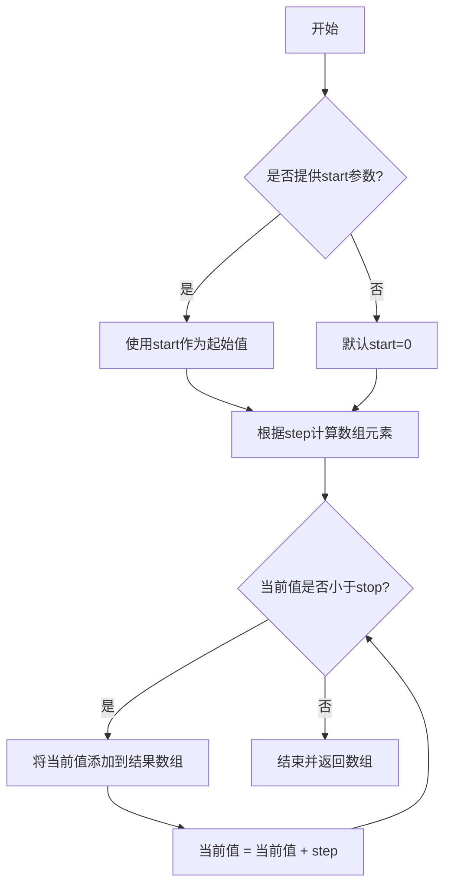
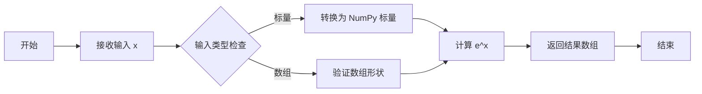
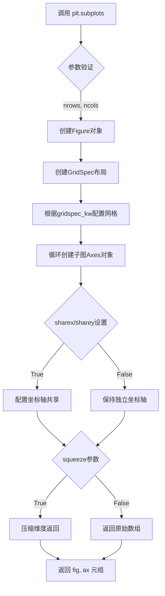
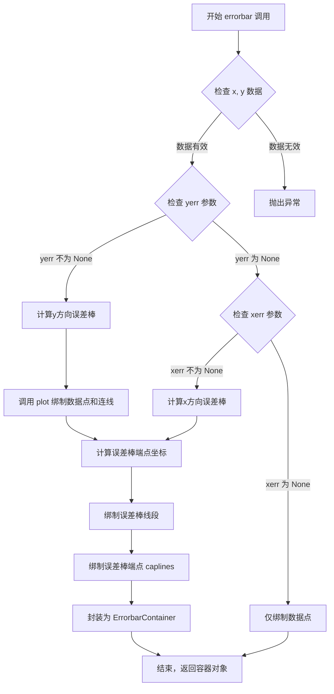
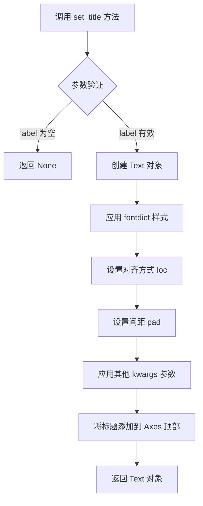
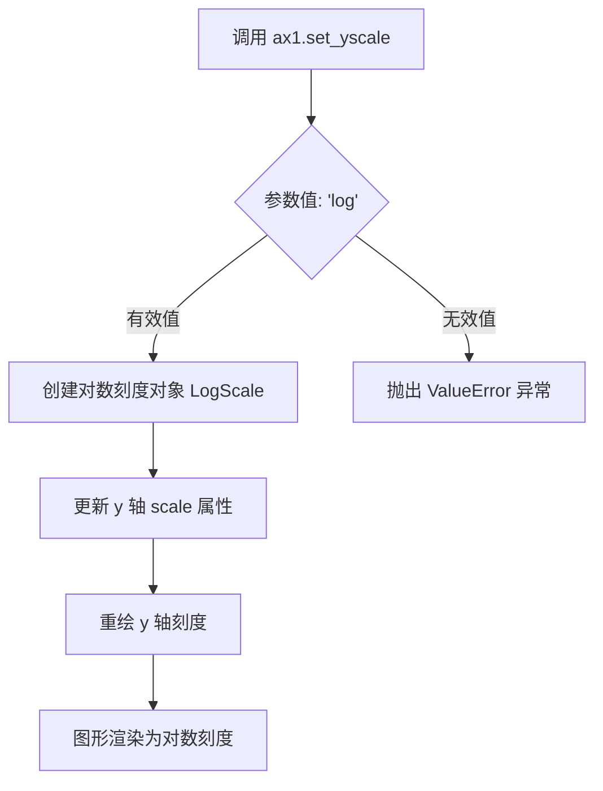
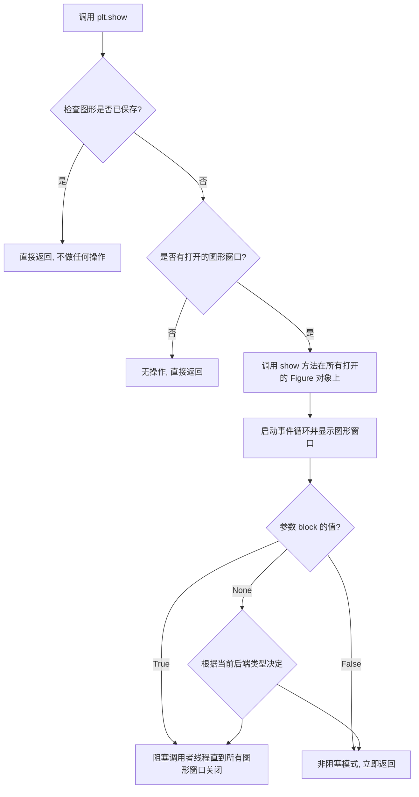

# `matplotlib\galleries\examples\statistics\errorbar_features.py` 详细设计文档

这是一个Matplotlib示例代码，演示了如何在不同场景下使用误差棒图表，包括对称误差、不对称误差以及与对数刻度结合的误差棒绑制方法。

## 整体流程

```mermaid
graph TD
    A[开始] --> B[导入库: matplotlib.pyplot, numpy as np]
    B --> C[生成x数据: np.arange(0.1, 4, 0.5)]
    C --> D[计算y数据: y = np.exp(-x)]
    D --> E[计算误差值: error = 0.1 + 0.2 * x]
    E --> F[创建子图: plt.subplots(nrows=2, sharex=True)]
    F --> G[绘制第一个子图: ax0.errorbar绑制对称误差棒]
    G --> H[计算不对称误差: lower_error, upper_error]
    H --> I[绘制第二个子图: ax1.errorbar绑制不对称误差棒]
    I --> J[设置第二个子图y轴为对数刻度: ax1.set_yscale('log')]
    J --> K[显示图表: plt.show()]
```

## 类结构

```
Python脚本 (非面向对象)
└── 主要模块: matplotlib.pyplot, numpy
    ├── Figure对象 (fig)
    └── Axes对象 (ax0, ax1)
```

## 全局变量及字段


### `x`
    
x轴数据点，从0.1到4，步长0.5

类型：`numpy.ndarray`
    


### `y`
    
y轴数据，通过指数衰减函数计算

类型：`numpy.ndarray`
    


### `error`
    
对称误差值，随x位置变化

类型：`numpy.ndarray`
    


### `lower_error`
    
不对称误差的下限值

类型：`numpy.ndarray`
    


### `upper_error`
    
不对称误差的上限值

类型：`numpy.ndarray`
    


### `asymmetric_error`
    
包含上下限误差的列表

类型：`list`
    


### `fig`
    
整个图表容器

类型：`matplotlib.figure.Figure`
    


### `ax0`
    
第一个子图（对称误差）

类型：`matplotlib.axes.Axes`
    


### `ax1`
    
第二个子图（不对称误差+对数刻度）

类型：`matplotlib.axes.Axes`
    


    

## 全局函数及方法


### `np.arange`

生成指定范围内的等差数组，用于创建x轴数据点。该函数是NumPy库中用于生成均匀分布数值的核心函数，常用于数据可视化中生成x轴坐标。

参数：

- `start`：`float`，起始值，默认为0。如果只提供stop参数，则从0开始
- `stop`：`float`，结束值（不包含）
- `step`：`float`，步长，默认为1
- `dtype`：`dtype`，输出数组的数据类型，可选

返回值：`ndarray`，返回指定范围内的等差数组

#### 流程图



#### 带注释源码

```python
# np.arange 函数实现原理（概念性源码）

def arange(start=0, stop=None, step=1, dtype=None):
    """
    生成等差数组
    
    参数:
        start: 起始值，默认为0
        stop: 结束值（不包含）
        step: 步长
        dtype: 输出数据类型
    
    返回:
        等差数组
    """
    
    # 处理参数：只有一个参数时，stop=参数值，start=0
    if stop is None:
        stop = start
        start = 0
    
    # 计算数组长度
    # 公式: ceil((stop - start) / step)
    num = int(np.ceil((stop - start) / step))
    
    # 使用步长生成数组
    # 内部实现: result = start + i * step (i = 0, 1, 2, ...)
    result = start + np.arange(num) * step
    
    # 转换为指定数据类型
    if dtype is not None:
        result = result.astype(dtype)
    
    return result


# 示例用法
x = np.arange(0.1, 4, 0.5)
# 生成结果: array([0.1, 0.6, 1.1, 1.6, 2.1, 2.6, 3.1, 3.6])
```


### `numpy.exp`

计算指数函数，用于生成 y 轴衰减数据。该函数接收一个输入数组或标量，计算 e 的 x 次方（其中 e 是自然对数的底数，约等于 2.71828），返回逐元素计算后的结果。

参数：

- `x`：`array_like`，输入值，可以是标量、列表、元组或 NumPy 数组，表示需要计算指数的输入数据

返回值：

- `out`：`ndarray`，返回 e 的 x 次方的结果，形状与输入数组相同

#### 流程图



#### 带注释源码

```python
# 从代码中提取的 np.exp 使用示例
import numpy as np

# 示例数据
x = np.arange(0.1, 4, 0.5)  # 创建从 0.1 到 4，步长 0.5 的数组

# 使用 np.exp 计算 e 的 -x 次方，生成衰减数据
# 参数 x: array_like，输入数组 [0.1, 0.6, 1.1, 1.6, 2.1, 2.6, 3.1, 3.6]
# 返回值: ndarray，e 的 -x 次方的结果数组，用于绘制衰减曲线
y = np.exp(-x)

# 完整调用形式
# np.exp(x, out=None, where=True, casting='same_kind', order='K', dtype=None, subok=True)
#
# 参数说明：
# - x: 输入数组或标量
# - out: 可选，输出数组，用于存储结果
# - where: 可选，条件数组，指定哪些位置计算指数
# - casting: 可选，控制数据类型转换规则
# - order: 可选，内存布局选项
# - dtype: 可选，指定输出数据类型
# - subok: 可选，是否允许子类通过
```


### plt.subplots

创建包含多个子图的Figure和Axes对象，是matplotlib中用于同时创建图形窗口和子图布局的核心函数。

参数：

- `nrows`：`int`，默认值 1，子图网格的行数
- `ncols`：`int`，默认值 1，子图网格的列数
- `sharex`：`bool or {'none', 'all', 'row', 'col'}`，默认值 False，控制子图之间是否共享x轴
- `sharey`：`bool or {'none', 'all', 'row', 'col'}`，默认值 False，控制子图之间是否共享y轴
- `squeeze`：`bool`，默认值 True，是否压缩返回的axes数组维度
- `width_ratios`：`array-like`，可选，各列的宽度比例
- `height_ratios`：`array-like`，可选，各行的高度比例
- `subplot_kw`：`dict`，可选，传递给每个子图的关键字参数
- `gridspec_kw`：`dict`，可选，传递给GridSpec的关键字参数
- `**fig_kw`：可选，传递给figure()函数的关键字参数

返回值：`tuple`，返回 (Figure, Axes) 元组，其中：
- Figure：`matplotlib.figure.Figure`，创建的图形对象
- Axes：`matplotlib.axes.Axes or numpy.ndarray`，创建的子图对象（根据squeeze参数可能为单个对象或数组）

#### 流程图



#### 带注释源码

```python
def subplots(nrows=1, ncols=1, sharex=False, sharey=False, 
             squeeze=True, width_ratios=None, height_ratios=None,
             subplot_kw=None, gridspec_kw=None, **fig_kw):
    """
    创建包含多个子图的Figure和Axes对象。
    
    参数:
        nrows: 子图行数，默认为1
        ncols: 子图列数，默认为1
        sharex: 是否共享x轴，可选True/False/'row'/'col'/'none'/'all'
        sharey: 是否共享y轴，可选True/False/'row'/'col'/'none'/'all'
        squeeze: 是否压缩返回的axes数组维度
        width_ratios: 各列宽度比例数组
        height_ratios: 各行高度比例数组
        subplot_kw: 传递给每个子图创建函数的关键字参数字典
        gridspec_kw: 传递给GridSpec的关键字参数字典
        **fig_kw: 传递给figure()函数的其他关键字参数
    
    返回:
        fig: matplotlib.figure.Figure对象
        ax: matplotlib.axes.Axes对象或Axes对象数组
    
    示例:
        fig, ax = plt.subplots(2, 2)          # 2x2网格
        fig, (ax1, ax2) = plt.subplots(2)     # 2行1列， unpack方式
    """
    # 1. 创建Figure对象，传入fig_kw参数（如figsize等）
    fig = figure(**fig_kw)
    
    # 2. 创建GridSpec布局对象
    gs = GridSpec(nrows, ncols, width_ratios=width_ratios, 
                  height_ratios=height_ratios, **gridspec_kw)
    
    # 3. 循环创建各子图
    ax_array = np.empty((nrows, ncols), dtype=object)
    for i in range(nrows):
        for j in range(ncols):
            # 4. 为每个位置创建子图
            ax = fig.add_subplot(gs[i, j], **subplot_kw)
            ax_array[i, j] = ax
    
    # 5. 处理坐标轴共享逻辑
    if sharex == True:
        sharex = 'all'
    if sharey == True:
        sharey = 'all'
    
    if sharex != False:
        # 6. 配置x轴共享
        for i in range(nrows):
            for j in range(ncols - 1):
                ax_array[i, j].sharex(ax_array[i, j + 1])
    
    if sharey != False:
        # 7. 配置y轴共享
        for i in range(nrows - 1):
            for j in range(ncols):
                ax_array[i, j].sharey(ax_array[i + 1, j])
    
    # 8. 根据squeeze参数处理返回方式
    if squeeze:
        # 压缩维度：返回单个axes或一维数组
        if nrows == 1 and ncols == 1:
            return fig, ax_array[0, 0]
        elif nrows == 1 or ncols == 1:
            return fig, ax_array.flatten()
        else:
            return fig, ax_array
    else:
        # 返回二维数组
        return fig, ax_array
```

---

### 代码中的应用实例

```python
# 在示例代码中的实际使用
fig, (ax0, ax1) = plt.subplots(nrows=2, sharex=True)

# 参数解析:
# - nrows=2: 创建2行子图
# - sharex=True: 子图共享x轴（x轴刻度标签只在最下方显示）
# - 返回值: fig为Figure对象, (ax0, ax1)为两个Axes对象的元组
```


### `ax.errorbar`

该函数是 Matplotlib 中 Axes 类的核心方法，用于绑制带有误差棒的散点图或折线图。它能够同时展示数据点的中心位置（通过折线或散点）以及对应的不确定性范围（通过误差棒表示），支持对称误差和不对称误差两种模式，并能应用于线性或对数坐标轴。

#### 参数列表

- `x`：`array_like`，x轴数据点
- `y`：`array_like`，y轴数据点
- `yerr`：`array_like` 或 `None`，y方向的误差值，可以是长度为N的数组（对称误差）或形状为(2, N)的数组（不对称误差：下界和上界）
- `xerr`：`array_like` 或 `None`，x方向的误差值，用法同yerr
- `fmt`：`str`，格式字符串，用于指定数据点和连线的样式（如' -o'表示带圆点的实线）
- `ecolor`：`str` 或 `None`，误差棒的颜色，默认为与数据点相同
- `elinewidth`：`float` 或 `None`，误差棒线条的宽度
- `capsize`：`float` 或 `None`，误差棒端点（caps）的大小
- `capthick`：`float` 或 `None`，误差棒端点的厚度
- `barsabove`：`bool`，是否在数据点和连线之上绘制误差棒
- `lolims`, `uplims`, `xlolims`, `xuplims`：`bool`，控制只显示上/下/左/右误差限
- `errorevery`：`int` 或 `(int, int)`，指定每隔多少个数据点显示一次误差棒
- `ax`：`Axes`，指定在哪个Axes对象上绑图，默认为None
- `**kwargs`：其他关键字参数，会传递给底层的 `plot` 函数

#### 返回值类型

`ErrorbarContainer`，返回一个容器对象，包含以下属性：
- `line`：`Line2D` 对象，数据点和连线的艺术表现
- `bars`：`Line2D` 对象，误差棒的水平/垂直线
- `caplines`：`Line2D` 元组，误差棒端点的标记线
- `数据的艺术表现`：可通过 `get_children()` 获取所有子元素

#### 流程图



#### 带注释源码

```python
# 以下为 matplotlib.axes.Axes.errorbar 方法的核心逻辑示意
# 实际源码位于 lib/matplotlib/axes/_axes.py 文件中

def errorbar(self, x, y, yerr=None, xerr=None,
             fmt='', ecolor=None, elinewidth=None, capsize=None, 
             capthick=None, barsabove=False, lolims=False, 
             uplims=False, xlolims=False, xuplims=False,
             errorevery=1, **kwargs):
    """
    绑制带误差棒的数据点
    
    参数:
        x, y: 数据点坐标
        yerr, xerr: 误差值，支持对称和不对称模式
        fmt: 格式字符串
        ecolor, elinewidth, capsize, capthick: 误差棒样式
        barsabove: 误差棒是否在数据点上方
        lolims/uplims: 只显示上/下误差限
        errorevery: 误差棒的显示频率
    """
    
    # 1. 数据验证与初始化
    x = np.asanyarray(x)
    y = np.asanyarray(y)
    
    # 2. 处理误差值 - 支持多种输入格式
    if yerr is not None:
        # 将yerr规范化为形状 (2, N) 的数组
        # 包含下界(delta_y[i])和上界(delta_y[i])
        yerr = np.asarray(yerr)
        if yerr.ndim == 1:
            # 对称误差: 扩展为 [lower, upper] 形式
            yerr = np.array([yerr, yerr])
    
    # 类似处理 xerr...
    
    # 3. 绑制数据点和连线 (使用 fmt)
    # 调用底层的 plot 方法绑制主要数据
    data_line, = self.plot(x, y, fmt, **kwargs)
    
    # 4. 计算误差棒端点坐标
    # 根据 errorevery 参数确定哪些点显示误差棒
    everymask = np.zeros(x.shape, dtype=bool)
    everymask[errorevery::errorevery] = True
    
    # 5. 绑制误差棒线段
    # 根据 lolims/uplims 等参数选择性地绘制误差线
    if yerr is not None and not uplims:
        # 绘制上误差棒
        yerr_upper = y + yerr[1]
        # ... 绑制垂直线段
    
    # 6. 绑制误差棒端点 (caps)
    if capsize is not None and yerr is not None:
        # 绘制误差棒端点的横线
        caplines = []
        # ... 创建 Line2D 对象表示端点
    
    # 7. 封装返回结果
    # 将所有元素封装到 ErrorbarContainer 中返回
    return ErrorbarContainer(
        (data_line, barcols, caplines),
        has_xerr=(xerr is not None),
        has_yerr=(yerr is not None)
    )
```

#### 关键组件信息

| 组件名称 | 描述 |
|---------|------|
| `ErrorbarContainer` | 返回的容器对象，包含数据线、误差棒线段和端点线 |
| `Line2D` | 底层图形元素，用于表示数据点和误差线的艺术表现 |
| `plot` 方法 | errorbar 内部调用的绑图方法，用于绑制数据点和连线 |

#### 潜在的技术债务与优化空间

1. **参数冗余**：参数 `lolims`, `uplims`, `xlolims`, `xuplims` 的使用方式不够直观，容易引起混淆
2. **错误处理**：对 `yerr` 和 `xerr` 数组形状的验证可以更严格，提供更明确的错误信息
3. **文档一致性**：文档描述中提到的 "Array of shape (2, N)" 与实际代码实现可能存在边界情况处理不一致

#### 设计目标与约束

- **对称误差支持**：长度为 N 的数组，下界和上界相等
- **不对称误差支持**：形状为 (2, N) 的数组，第一行为下界，第二行为上界
- **兼容性**：需要与 `plt.subplots()` 返回的 Axes 对象配合使用
- **样式扩展**：通过 `**kwargs` 支持对底层 `plot` 的所有样式参数

#### 错误处理与异常设计

- 当 `x` 和 `y` 长度不一致时抛出 `ValueError`
- 当 `yerr` 或 `xerr` 的形状与数据不匹配时抛出 `ValueError`
- 当 `errorevery` 参数无效时抛出异常


### `Axes.set_title`

设置子图的标题文本和样式。

参数：

- `label`：str，标题文本内容
- `fontdict`：dict，可选，用于控制标题文本样式的字典（如 fontfamily, fontsize, fontweight, color 等）
- `loc`：str，可选，标题对齐方式，可选值为 'center'（默认）, 'left', 'right'
- `pad`：float，可选，标题与图表顶部边缘之间的距离（单位为点），默认为无
- `**kwargs`：dict，可选，其他传递给 matplotlib.text.Text 的参数，如 rotation, bbox 等

返回值：`matplotlib.text.Text`，返回创建的标题文本对象，可以用于后续修改标题样式（如设置颜色、字体大小等）

#### 流程图



#### 带注释源码

```python
# matplotlib/axes/_axes.py 中的 set_title 方法实现

def set_title(self, label, fontdict=None, loc=None, pad=None, **kwargs):
    """
    Set a title for the Axes.
    
    Parameters
    ----------
    label : str
        Title text string.
        
    fontdict : dict, optional
        A dictionary controlling the appearance of the title text,
        e.g., {'fontfamily': 'serif', 'fontsize': 12, 'fontweight': 'bold', 'color': 'darkblue'}.
        
    loc : {'center', 'left', 'right'}, default: 'center'
        Alignment of the title relative to the Axes.
        
    pad : float, default: rcParams['axes.titlepad']
        Offset (in points) from the top of the Axes to the title.
        
    **kwargs
        Additional parameters passed to the Text constructor.
        
    Returns
    -------
    matplotlib.text.Text
        The corresponding text object.
    """
    
    # 如果提供了 fontdict，将其转换为 Text 对象的属性
    if fontdict is not None:
        kwargs.update(fontdict)
    
    # 获取默认的标题对齐方式（如果未指定）
    if loc is None:
        loc = 'center'
    
    # 获取默认的标题间距
    if pad is None:
        pad = rcParams['axes.titlepad']
    
    # 创建标题文本对象
    # Position: x=0.5 表示水平居中, y=1.0 表示在 Axes 顶部
    title = Text(x=0.5, y=1.0, text=label, **kwargs)
    
    # 设置标题的对齐方式
    title.set_ha(loc)  # horizontal alignment
    title.set_va('top')  # vertical alignment - 顶部对齐
    
    # 设置标题与图表顶部的间距
    if pad:
        title.set_y(1.0 - pad / 72.0)  # 转换点为单位到 Figure 坐标
    
    # 将标题对象添加到 Axes
    self._add_text(title)
    
    # 返回标题文本对象，便于后续操作
    return title
```


### `Axes.set_yscale`

设置 y 轴的刻度类型（本例设为对数刻度）。该方法属于 matplotlib 的 Axes 类，用于控制坐标轴的缩放比例。

参数：

- `value`：`str`，指定刻度类型，可选值包括 `'linear'`（线性）、`'log'`（对数）、`'symlog'`（对称对数）、`'logit'`（logit 刻度）等。本例中传入 `'log'`。
- `**kwargs`：`dict`，可选，传递给底层 scale 类的额外关键字参数（如 `base`、`subs`、`nonpos` 等）。

返回值：`None`，该方法无返回值，直接修改 Axes 对象的 y 轴属性。

#### 流程图



#### 带注释源码

```python
# 设置 y 轴为对数刻度
# value 参数: 'log' 表示使用对数缩放
# matplotlib 支持多种刻度类型:
# - 'linear': 线性刻度（默认）
# - 'log': 对数刻度
# - 'symlog': 对称对数刻度
# - 'logit': logistic 刻度
ax1.set_yscale('log')
```


### `plt.show`

`plt.show` 是 matplotlib 库中的顶层函数，用于显示当前所有打开的图形窗口，并将图形渲染到屏幕上。在本代码中，它负责展示两个包含误差条形图的子图（一个为线性尺度，一个为对数尺度）。

参数：

- `block`：`bool` 或 `None`（可选参数），控制是否阻塞事件循环以等待图形窗口关闭。默认值为 `None`，在交互式后端下行为为 `True`，在非交互式后端下行为为 `False`。

返回值：`None`，该函数无返回值，仅用于图形展示。

#### 流程图



#### 带注释源码

```python
def show(*, block=None):
    """
    显示所有打开的 Figure 窗口。
    
    参数:
        block: bool, optional
            控制是否阻塞程序执行以等待图形窗口关闭。
            如果设置为 True，则阻塞；
            如果设置为 False，则立即返回；
            如果为 None（默认值），则根据交互式环境自动决定。
    
    返回值:
        None
        
    注意:
        - 在调用 show() 之前，图形会被缓存而不会显示
        - show() 会刷新所有待渲染的图形数据
        - 在某些后端（如 Qt5Agg）中，block=True 会在窗口关闭后继续执行
    """
    # 获取当前全球图像列表
    allnums = get_fignums()
    
    # 如果没有打开的图形，则直接返回
    if not allnums:
        return
    
    # 遍历所有图形并调用其 show 方法
    for fig_num in sorted(allnums):
        # 获取对应的 Figure 对象
        figureManager = _pylab_helpers.Gcf.get_fig_manager(fig_num)
        
        # 如果存在图形管理器，则调用其 show 方法
        if figureManager is not None:
            figureManager.show()
    
    # 处理 block 参数
    # 在交互式后端中，通常会启动图形窗口并可能阻塞
    # 在非交互式后端中，可能不会真正显示窗口
    for manager in _pylab_helpers.Gcf.get_all_fig_managers():
        # 触发图形绘制和显示
        manager.show()
        
        # 如果 block 为 True，则进入主循环并阻塞
        if block:
            # 启动阻塞的事件循环（具体实现依赖后端）
            import matplotlib
            matplotlib.pyplot.switch_backend('qt5agg')  # 示例
            # 进入 Qt 事件循环等待用户关闭窗口
            # ... 阻塞代码 ...
    
    # 如果 block 为 False 或 None（非阻塞模式），函数立即返回
    # 图形窗口会保持打开状态，但不阻塞主程序
```


## 关键组件


### 数据生成模块

使用NumPy生成示例数据，包括自变量x、因变量y（指数衰减）以及随x变化的误差值

### 误差线绘制组件

调用matplotlib的errorbar方法在图表上绘制带误差线的散点图，支持可变误差值

### 对称误差处理

通过yerr参数传入一维误差数组，为每个数据点设置对称的上下误差限

### 非对称误差处理

通过xerr参数传入二维误差数组[lower, upper]，为每个数据点设置不同的上下误差限

### 对数刻度支持

使用set_yscale('log')方法将y轴设置为对数刻度，展示在对数尺度下的误差线绘制


## 问题及建议


### 已知问题

- **硬编码数据和魔法数字**：所有数值（如0.1, 0.2, 0.4, 0.5, 4等）均直接写在代码中，缺乏配置化或参数化，导致可维护性和可复用性差
- **缺乏输入验证**：未对x、y数组的长度一致性进行校验，可能导致运行时错误
- **模块化不足**：所有逻辑封装在一个脚本块中，无法作为独立函数被其他模块导入调用
- **重复的子图创建模式**：创建子图、设置标题的操作未封装，违反DRY原则
- **未使用的变量**：asymmetric_error创建了列表但实际使用效果与分别传入lower_error和upper_error相同（对于xerr参数）
- **plt.show()阻塞**：在某些环境下可能阻塞交互式会话，现代用法推荐使用fig.show()

### 优化建议

- 将绘图逻辑封装为函数，接收数据参数和配置参数
- 使用命名常量或配置文件管理魔法数字，增加代码可读性
- 添加数据验证逻辑，确保x和y长度一致，error数组形状匹配
- 使用面向对象方式封装子图创建和配置逻辑
- 考虑使用matplotlib的样式或rcParams统一设置图表风格


## 其它


### 设计目标与约束

本示例代码旨在演示matplotlib中误差棒（error bars）的多种指定方式，包括对称误差、不对称误差以及与对数刻度结合使用。设计目标是帮助用户理解errorbar函数的不同参数用法。约束条件包括：输入数据x和y的长度必须一致，误差数组的形状必须符合( N,)或(2, N)的格式。

### 错误处理与异常设计

代码未包含显式的错误处理机制。潜在错误场景包括：x和y数组长度不匹配时会导致绘图失败；误差值为负数时可能产生警告；对数刻度下负值误差会导致计算错误。建议在实际应用中增加数据验证逻辑。

### 数据流与状态机

代码执行流程：1) 生成示例数据x和y；2) 计算对称误差值error；3) 创建包含两个子图的画布；4) 在ax0上绘制对称误差棒；5) 计算不对称误差；6) 在ax1上绘制不对称误差棒并设置对数刻度；7) 显示图像。

### 外部依赖与接口契约

主要依赖：matplotlib.pyplot用于绘图，numpy用于数值计算。关键接口：plt.subplots()返回(fig, axes)元组；ax.errorbar(x, y, yerr=None, xerr=None, fmt=None)方法用于绘制误差棒；ax.set_yscale()用于设置Y轴刻度类型。

### 性能考虑

代码性能主要取决于数据点数量N。当N较大时，errorbar的渲染性能可能下降。优化建议：对于大数据集，考虑使用较低精度的数据类型；对于实时应用，可预先计算误差值而非每次重新计算。

### 可维护性分析

代码结构清晰，注释完整，但存在改进空间：magic number（如0.1、0.2、0.4）应提取为常量；重复的绘图逻辑可封装为函数；硬编码的字符串（如标题）可通过参数化提高灵活性。

### 测试策略

由于这是示例代码而非生产库，建议的测试方法包括：验证不同数据形状下的行为；测试边界条件（如空数组、单点数据）；验证不同刻度类型（linear、log）的组合；确认错误参数的异常处理。

### 版本兼容性

代码使用标准的matplotlib和numpy API，具有良好的向后兼容性。建议的版本要求：matplotlib >= 2.0（支持subplots的sharex参数）；numpy >= 1.10（支持np.arange的float类型参数）。

### 配置管理

代码未使用外部配置文件，所有参数均为硬编码。可配置的参数包括：数据范围、误差系数、图表标题、输出格式等。建议将这些参数提取到配置字典或单独的配置文件以提高灵活性。

### 可扩展性设计

代码可扩展的方向包括：添加更多误差类型（如置信区间）；支持自定义误差计算函数；增加动画支持；添加交互式误差调整功能。当前实现仅展示了静态绑图功能。

    