# `matplotlib\galleries\examples\statistics\errorbar_limits.py` 详细设计文档

这是一个 matplotlib 示例代码，演示如何在误差条形图中包含上限和下限限制。通过 errorbar 函数的 uplims、lolims、xuplims 和 xlolims 参数，可以控制误差条的单向延伸方向，从而实现不同方向的误差显示。

## 整体流程

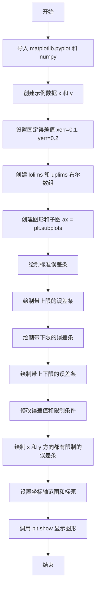

## 类结构

```
该脚本为扁平结构，无自定义类
└── 全局执行流程 (script level)
    ├── 数据准备阶段
    ├── 图形创建阶段
    ├── 绑图阶段
    └── 样式设置阶段
```

## 全局变量及字段


### `x`
    
x轴数据点数组

类型：`np.ndarray`
    


### `y`
    
y轴数据点数组（通过 exp(-x) 计算）

类型：`np.ndarray`
    


### `xerr`
    
x方向误差值（初始为0.1，后改为0.2）

类型：`float`
    


### `yerr`
    
y方向误差值（初始为0.2，后为数组）

类型：`float | np.ndarray`
    


### `lolims`
    
下限布尔数组，控制y方向下限

类型：`np.ndarray`
    


### `uplims`
    
上限布尔数组，控制y方向上限

类型：`np.ndarray`
    


### `ls`
    
线条样式（'dotted'）

类型：`str`
    


### `fig`
    
图形对象

类型：`matplotlib.figure.Figure`
    


### `ax`
    
坐标轴对象

类型：`matplotlib.axes.Axes`
    


### `xlolims`
    
x方向下限布尔数组

类型：`np.ndarray`
    


### `xuplims`
    
x方向上限布尔数组

类型：`np.ndarray`
    


    

## 全局函数及方法


### `import matplotlib.pyplot as plt`

导入 matplotlib 库的 pyplot 模块，并将其别名设置为 `plt`，用于创建各种静态、动画和交互式可视化图表。

参数：无

返回值：无

#### 流程图

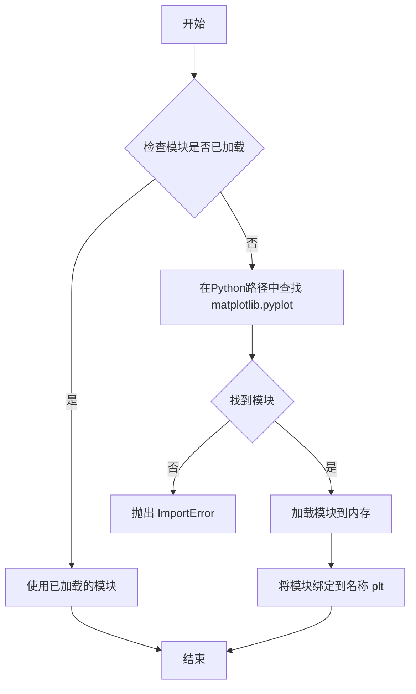

#### 带注释源码

```python
import matplotlib.pyplot as plt  # 导入matplotlib的pyplot模块并别名化为plt，用于绘图
```

---

### `import numpy as np`

导入 numpy 库，并将其别名设置为 `np`，用于支持大型多维数组和矩阵运算，以及大量的数学函数。

参数：无

返回值：无

#### 流程图

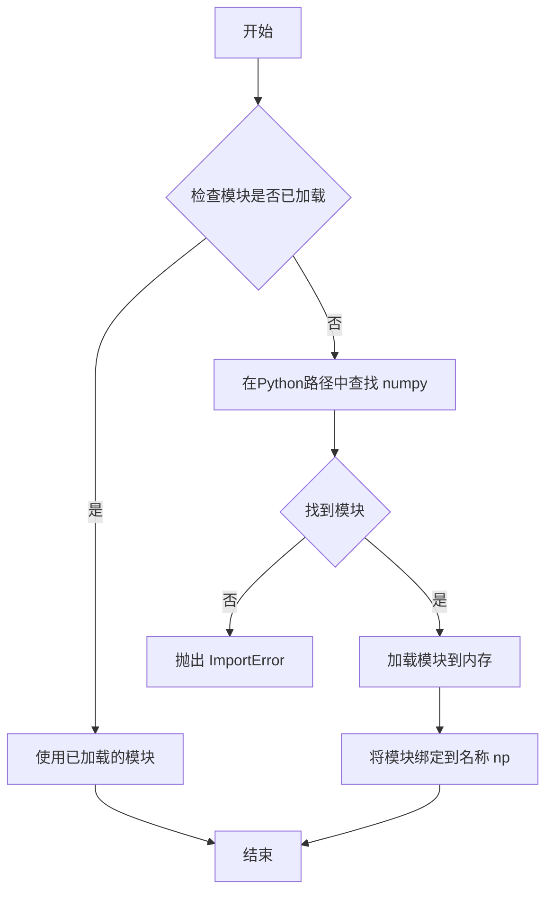

#### 带注释源码

```python
import numpy as np  # 导入numpy库并别名化为np，用于数值计算和数组操作
```


### `np.array`

创建 NumPy 数组对象，将 Python 列表、元组或类似序列转换为多维同质数组，是 NumPy 库中最为基础和核心的函数之一。

参数：

- `object`：`array_like`，接收数组、列表、元组或任何类似序列的对象，作为创建数组的输入数据源
- `dtype`：`data-type, optional`，指定数组的数据类型（如 np.float64、np.int32 等），若未指定则自动推断
- `copy`：`bool, optional`，默认为 True，控制是否在创建数组时强制复制数据对象
- `order`：`{'C', 'F', 'A', 'K'}, optional`，指定内存中数组的布局方式，C 为行优先（Fortran 为列优先）
- `subok`：`bool, optional`，默认为 True，允许子类通过，若为 False 则强制返回基类数组
- `ndmin`：`int, optional`，指定结果数组的最小维度数，不足时会在前面补足维度
- `like`：`array_like, optional`，接收类似数组的对象，用于创建与该对象协议兼容的数组

返回值：`ndarray`，返回创建好的 NumPy 数组对象，包含输入数据的同质化多维表示

#### 流程图

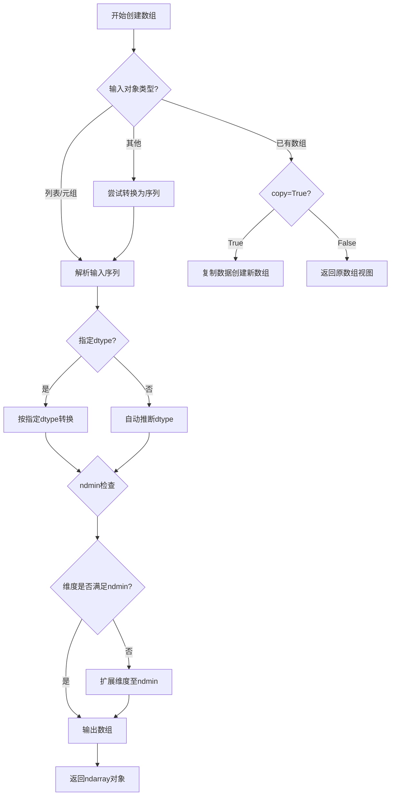

#### 带注释源码

```python
# 示例代码来源于 matplotlib 官方示例
# 用于绘制带有限制的误差棒图

import matplotlib.pyplot as plt
import numpy as np  # 导入 NumPy 库

# ==========================================
# np.array 的典型使用示例
# ==========================================

# 示例1：创建浮点数数组
# object=[0.5, 1.0, 1.5, 2.0, 2.5, 3.0, 3.5, 4.0, 4.5, 5.0] - 输入序列
# dtype 未指定，自动推断为 float64
# ndmin 未指定，保持原始维度
x = np.array([0.5, 1.0, 1.5, 2.0, 2.5, 3.0, 3.5, 4.0, 4.5, 5.0])
# 结果：array([0.5, 1. , 1.5, 2. , 2.5, 3. , 3.5, 4. , 4.5, 5. ])

# 示例2：通过计算表达式创建数组
# 对 x 数组中每个元素执行 np.exp(-x) 操作
y = np.exp(-x)
# 结果：array([0.60653066, 0.36787944, 0.22313016, ...])

# 示例3：创建布尔类型数组（用于指定误差棒的限制）
# dtype=bool 明确指定数据类型为布尔型
lolims = np.array([0, 0, 1, 0, 1, 0, 0, 0, 1, 0], dtype=bool)
uplims = np.array([0, 1, 0, 0, 0, 1, 0, 0, 0, 1], dtype=bool)
# 结果：lolims = [False False  True False  True False False False  True False]
#       uplims = [False  True False False False  True False False False  True]

# 示例4：使用 np.full_like 创建与 x 形状相同的数组
# 创建一个与 x 形状一致、填充值为 0.2 的数组
yerr = np.full_like(x, 0.2)
# 结果：array([0.2, 0.2, 0.2, 0.2, 0.2, 0.2, 0.2, 0.2, 0.2, 0.2])

# 示例5：使用 np.zeros_like 创建零数组
# 创建与 x 形状相同的全零数组（用于初始化限制标志）
lolims = np.zeros_like(x)
uplims = np.zeros_like(x)
# 结果：array([0., 0., 0., 0., 0., 0., 0., 0., 0., 0.])

# 示例6：修改特定索引的元素
# 通过索引赋值设置特定数据点的限制标志
lolims[[6]] = True   # 仅在索引6处设置下限限制
uplims[[3]] = True   # 仅在索引3处设置上限限制

# ==========================================
# 这些数组后续用于 ax.errorbar() 绘图
# ==========================================

fig, ax = plt.subplots(figsize=(7, 4))

# 绘制标准误差棒（无限制）
ax.errorbar(x, y, xerr=xerr, yerr=yerr, linestyle=ls)

# 绘制带上限限制的误差棒
ax.errorbar(x, y + 0.5, xerr=xerr, yerr=yerr, uplims=uplims,
            linestyle=ls)

# 绘制带下限限制的误差棒
ax.errorbar(x, y + 1.0, xerr=xerr, yerr=yerr, lolims=lolims,
            linestyle=ls)

# 绘制同时带上下限的误差棒
ax.errorbar(x, y + 1.5, xerr=xerr, yerr=yerr,
            lolims=lolims, uplims=uplims,
            marker='o', markersize=8,
            linestyle=ls)

# 绘制同时包含 x 和 y 方向限制的误差棒
ax.errorbar(x, y + 2.1, xerr=xerr, yerr=yerr,
            xlolims=xlolims, xuplims=xuplims,
            uplims=uplims, lolims=lolims,
            marker='o', markersize=8,
            linestyle='none')

plt.show()
```


### `numpy.exp`

计算指数函数 e^x，其中 e 是自然对数的底数（约等于 2.718281828）。

参数：

-  `x`：数组_like（array_like），输入值，可以是标量或数组

返回值：数组（ndarray），返回 e 的 x 次方，形状与输入相同

#### 流程图

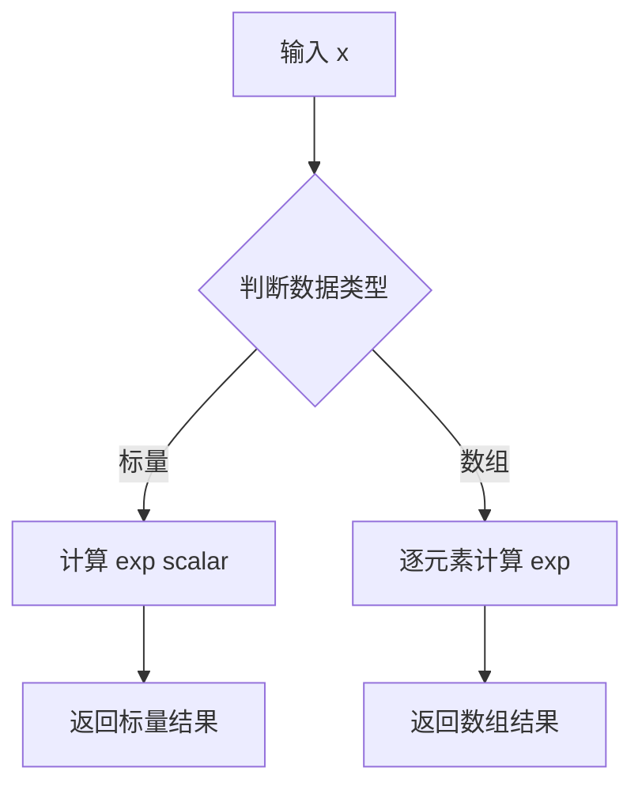

#### 带注释源码

```python
# numpy.exp 的简化实现原理
import math

def exp(x):
    """
    计算 e 的 x 次方
    
    参数:
        x: 数值或数组-like对象
    
    返回:
        e^x 的值
    """
    # 使用 Python 内置 math 模块
    if isinstance(x, (int, float)):
        return math.exp(x)
    
    # 对于数组，逐元素计算
    result = []
    for val in x:
        result.append(math.exp(val))
    return result

# 在本例代码中的实际使用
x = np.array([0.5, 1.0, 1.5, 2.0, 2.5, 3.0, 3.5, 4.0, 4.5, 5.0])
y = np.exp(-x)  # 计算 e 的 -x 次方，得到衰减曲线
# 结果: [0.60653066, 0.36787944, 0.22313016, 0.13533528, 0.08208499, ...]
```

#### 备注

| 属性 | 说明 |
|------|------|
| 所属模块 | numpy |
| 文档地址 | https://numpy.org/doc/stable/reference/generated/numpy.exp.html |
| 计算精度 | 取决于输入数据类型（float64/ float32） |
| 性能 | 对大规模数组使用向量化计算，底层为C实现 |


### `np.full_like`

`np.full_like` 是 NumPy 库中的一个函数，用于根据给定的输入数组 `a` 创建一个新数组，新数组的形状和数据类型与输入数组相同，并用指定的填充值 `fill_value` 填充。

参数：

- `a`：`array_like`，输入数组，用于确定输出数组的形状和数据类型
- `fill_value`：标量或类似值，用于填充新数组的值
- `dtype`：`data-type`，可选，输出数组的数据类型，默认与输入数组 `a` 相同
- `order`：`{'C', 'F', 'A', 'K'}`，可选，输出数组的内存布局，默认为 `'K'`（保持输入数组的布局）
- `subok`：`bool`，可选，如果为 `True`，允许使用输入数组的子类来创建输出数组，默认为 `True`
- `shape`：`int` 或 `int` 元组，可选，覆盖输出数组的形状，默认使用输入数组 `a` 的形状

返回值：`ndarray`，与输入数组 `a` 形状和数据类型相同的数组，数组中所有元素都被填充为 `fill_value`

#### 流程图

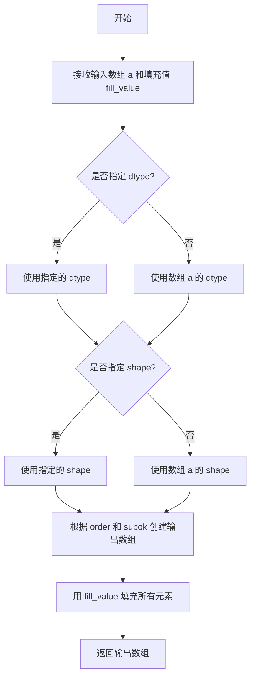

#### 带注释源码

```python
def full_like(a, fill_value, dtype=None, order='K', subok=True, shape=None):
    """
    根据输入数组创建一个填充值的数组。
    
    参数:
    -------
    a : array_like
        输入数组，用于确定输出数组的形状和数据类型。
    fill_value : scalar
        用于填充新数组的值。
    dtype : data-type, 可选
        输出数组的数据类型。如果未指定，则使用输入数组 a 的数据类型。
    order : {'C', 'F', 'A', 'K'}, 可选
        输出数组的内存布局:
        - 'C': C 行主序 (row-major)
        - 'F': Fortran 列主序 (column-major)
        - 'A': 与输入数组 a 的内存布局相同
        - 'K': 尽可能保持输入数组的布局 (默认)
    subok : bool, 可选
        如果为 True，允许使用输入数组的子类来创建输出数组。
        如果为 False，始终返回基类数组。默认值为 True。
    shape : int 或 int 元组, 可选
        输出数组的形状。如果未指定，则使用输入数组 a 的形状。
    
    返回值:
    -------
    out : ndarray
        与输入数组 a 形状和数据类型相同的数组，所有元素被填充为 fill_value。
    
    示例:
    -------
    >>> x = np.arange(6).reshape(2, 3)
    >>> np.full_like(x, 1)
    array([[1, 1, 1],
           [1, 1, 1]])
    
    >>> y = np.arange(6, dtype=float)
    >>> np.full_like(y, 0.1)
    array([0.1, 0.1, 0.1, 0.1, 0.1, 0.1])
    """
    # 内部实现通常由 Cython 或 C 实现，此处为伪代码说明
    # 1. 获取基础数组信息（形状、数据类型）
    # 2. 根据参数创建输出数组
    # 3. 用 fill_value 填充所有位置
    # 4. 返回结果数组
```


### `np.zeros_like`

创建与输入数组形状和数据类型相同的全零数组。

参数：

- `a`：`array_like`，输入数组，新创建的数组将继承此数组的形状和类型
- `dtype`：`data-type, optional`，可选参数，用于指定输出数组的数据类型，默认继承输入数组的类型
- `order`：`{'C', 'F', 'A', 'K'}, optional`，可选参数，指定输出数组的内存布局顺序（C行主序、F列主序、A任意顺序、K保持原顺序），默认为'K'
- `subok`：`bool, optional`，可选参数，若为True则允许使用输入数组的子类来创建结果，默认值为True
- `shape`：`int or int sequence, optional`，可选参数，可显式指定输出数组的形状，覆盖从输入数组推断的形状

返回值：`ndarray`，与输入数组`a`具有相同形状和数据类型的全零数组

#### 流程图

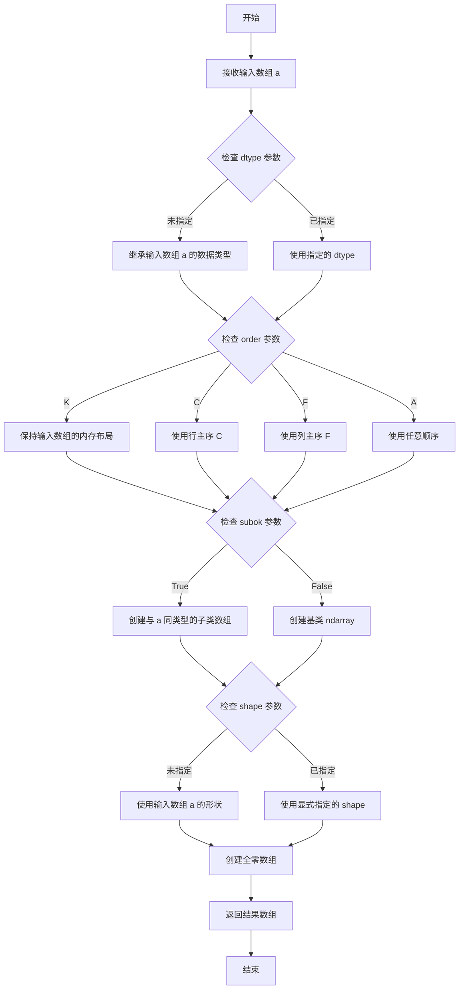

#### 带注释源码

```python
# numpy/lib/function_base.py 中的实现简化版

def zeros_like(a, dtype=None, order='K', subok=True, shape=None):
    """
    创建与给定数组形状和类型相同的全零数组。
    
    参数:
        a: array_like
            输入数组，定义输出数组的形状和数据类型
        
        dtype: data-type, optional
            覆盖默认的数据类型
        
        order: {'C', 'F', 'A', 'K'}, optional
            内存布局顺序
        
        subok: bool, optional
            是否允许子类
        
        shape: int or int sequence, optional
            显式指定输出形状
    """
    # 获取基础数组（处理 subok 参数）
    # 如果 subok=True，使用数组的子类；否则使用基类
    res = empty_like(a, dtype=dtype, order=order, subok=subok, shape=shape)
    
    # 将数组填充为全零
    # 这里调用底层的 fill 函数将内存块填充为 0
    res.fill(0)
    
    return res
```

**代码中的应用示例：**

```python
# 从代码中提取的具体使用场景
lolims = np.zeros_like(x)  # 创建与 x 数组形状相同的全零数组
uplims = np.zeros_like(x)  # 创建与 x 数组形状相同的全零数组
```

这段代码中，`x` 是一个包含10个元素的NumPy数组，`np.zeros_like(x)` 创建了一个形状为(10,)的全零布尔数组，用于后续设置特定索引的限制标记。


### `plt.subplots`

创建图形和坐标轴的函数，用于生成一个包含一个或多个子图的图形窗口，并返回图形对象和坐标轴对象。

参数：

- `nrows`：`int`，可选，默认值为1，表示子图的行数
- `ncols`：`int`，可选，默认值为1，表示子图的列数
- `figsize`：`tuple`，可选，图形窗口的尺寸，格式为(宽度, 高度)，单位为英寸
- `dpi`：`int`，可选，每英寸的点数（dots per inch），用于控制图形的分辨率
- `facecolor`：`str`或`tuple`，可选，图形窗口的背景颜色
- `edgecolor`：`str`或`tuple`，可选，图形窗口的边框颜色
- `linewidth`：`float`，可选，边框线条宽度
- `frameon`：`bool`，可选，是否显示图形边框
- `sharex`：`bool`或`str`，可选，是否共享x轴
- `sharey`：`bool`或`str`，可选，是否共享y轴
- `squeeze`：`bool`，可选，默认True，是否压缩返回的坐标轴数组维度
- `width_ratios`：`array-like`，可选，每列的宽度比例
- `height_ratios`：`array-like`，可选，每行的高度比例
- `subplot_kw`：`dict`，可选，创建子图时的关键字参数
- `gridspec_kw`：`dict`，可选，网格规范的关键字参数
- `**fig_kw`：额外的关键字参数，将传递给Figure构造函数

返回值：`tuple`，返回一个元组，包含(fig, ax)
- `fig`：`matplotlib.figure.Figure`，图形对象，代表整个图形窗口
- `ax`：`matplotlib.axes.Axes`或`numpy.ndarray`，坐标轴对象，当squeeze=True且nrows=1且ncols=1时返回单个Axes对象，否则返回Axes对象数组

#### 流程图

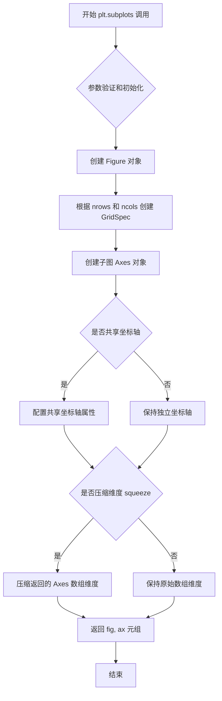

#### 带注释源码

```python
# 从 matplotlib.pyplot 模块导入 subplots 函数
# 典型调用方式：fig, ax = plt.subplots(figsize=(7, 4))

# 参数说明：
# - nrows=1: 创建1行子图
# - ncols=1: 创建1列子图  
# - figsize=(7, 4): 图形窗口宽度7英寸，高度4英寸

fig, ax = plt.subplots(figsize=(7, 4))

# 返回值解析：
# - fig: Figure对象，整个图形容器，可以添加标题、图例等
# - ax: Axes对象，坐标系对象，用于绑定数据、绘制图形
#       当nrows=ncols=1时，ax是单个Axes对象
#       当多个子图时，ax是numpy数组类型

# 使用示例：
# 绘制误差棒图形
ax.errorbar(x, y, xerr=xerr, yerr=yerr, linestyle=ls)

# 设置坐标轴范围
ax.set_xlim(0, 5.5)
ax.set_title('Errorbar upper and lower limits')

# 显示图形
plt.show()

# 注意：在面向对象接口中，更推荐使用 fig, ax = plt.subplots()
# 然后通过 ax 方法绑定图形元素，而不是使用 plt.ylabel() 等全局函数
```


### `matplotlib.axes.Axes.errorbar`

在 matplotlib 中绘制带有误差条的折线图，支持单向误差（上限或下限），可分别在 x 和 y 方向设置误差棒，并可通过格式化字符串自定义主数据线的样式。

参数：

- `x`：`array-like`，x 轴数据点
- `y`：`array-like`，y 轴数据点
- `yerr`：`scalar` 或 `array-like`，y 方向的误差值，可为标量或数组，默认为 None
- `xerr`：`scalar` 或 `array-like`，x 方向的误差值，可为标量或数组，默认为 None
- `fmt`：`str`，格式字符串，用于设置主数据线的样式（颜色、标记、线型），默认为空字符串
- `ecolor`：`color`，误差线的颜色，默认为 None（使用 rcParams 中的值）
- `elinewidth`：`float`，误差线的线宽，默认为 None
- `capsize`：`float`，误差棒端点（cap）的尺寸，默认为 None
- `capthick`：`float`，误差棒端点的厚度，默认为 None
- `barsabove`：`bool`，是否在数据点上方显示误差棒，默认为 False
- `lolims`：`bool` 或 `array-like`，y 方向的下限标志，为 True 时只显示上方误差棒，可为标量或布尔数组
- `uplims`：`bool` 或 `array-like`，y 方向的上限标志，为 True 时只显示下方误差棒，可为标量或布尔数组
- `xlolims`：`bool` 或 `array-like`，x 方向的下限标志，为 True 时只显示右方误差棒，可为标量或布尔数组
- `xuplims`：`bool` 或 `array-like`，x 方向的上限标志，为 True 时只显示左方误差棒，可为标量或布尔数组
- `errorevery`：`int` 或 `(int, int)`，控制每隔多少个点显示一次误差棒，默认为 1（每个点都显示）
- `**kwargs`：`dict`，其他关键字参数传递给底层的主数据线（Line2D）对象

返回值：`ErrorbarContainer`，包含以下属性：
- `lines`: 包含 (data_line, errorbar_line) 的元组，其中 data_line 是主数据线的 Line2D 对象，errorbar_line 是误差线的 Line2D 对象（如果是集合模式则为 LineCollection）
- `caps`: 误差棒端点的 Line2D 对象列表
- `bars`: 误差棒的 Line2D 对象列表

#### 流程图

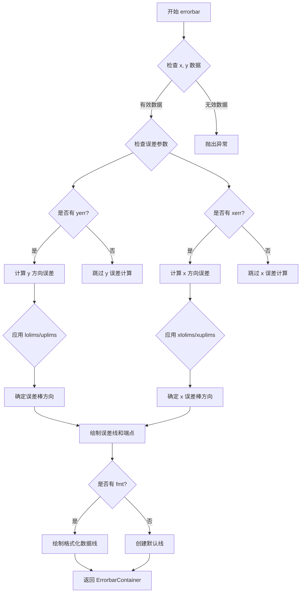

#### 带注释源码

```python
# 下面是 matplotlib 中 errorbar 方法的核心实现逻辑（简化版）

def errorbar(self, x, y, yerr=None, xerr=None,
             fmt='', ecolor=None, elinewidth=None, capsize=None, capthick=None,
             barsabove=False, lolims=False, uplims=False, 
             xlolims=False, xuplims=False,
             errorevery=1, **kwargs):
    """
    绘制带有误差条的折线图
    
    参数:
        x: x 轴数据
        y: y 轴数据
        yerr: y 方向误差
        xerr: x 方向误差
        fmt: 格式字符串
        ecolor: 误差线颜色
        elinewidth: 误差线宽度
        capsize: 端点大小
        capthick: 端点厚度
        barsabove: 误差线在数据点上方
        lolims: y 下限（只显示上方误差）
        uplims: y 上限（只显示下方误差）
        xlolims: x 下限
        xuplims: x 上限
        errorevery: 显示频率
    """
    
    # 1. 数据初始化和验证
    self._process_unit_info(x=x, y=y)
    x = np.asanyarray(x)
    y = np.asanyarray(y)
    
    # 2. 处理误差数据
    if yerr is not None:
        # 将 yerr 转换为标准格式
        yerr = np.asanyarray(yerr)
        res = np.zeros(y.shape, dtype=float)
        # ... 误差计算逻辑
    
    if xerr is not None:
        # 将 xerr 转换为标准格式
        xerr = np.asanyarray(xerr)
        # ... x 误差计算逻辑
    
    # 3. 应用上下限标志
    # lolims/uplims 控制 y 方向误差的单向显示
    if not np.iterable(lolims):
        lolims = np.full_like(x, lolims, dtype=bool)
    if not np.iterable(uplims):
        uplims = np.full_like(x, uplims, dtype=bool)
    
    # xlolims/xuplims 控制 x 方向误差的单向显示
    if not np.iterable(xlolims):
        xlolims = np.full_like(x, xlolims, dtype=bool)
    if not np.iterable(xuplims):
        xuplims = np.full_like(x, xuplims, dtype=bool)
    
    # 4. 绘制误差棒
    # 根据上下限标志确定误差棒的起止点
    data_line, errorlines, caplines = self._errorbar_line(
        x, y, yerr, xerr, 
        lolims=lolims, uplims=uplims,
        xlolims=xlolims, xuplims=xuplims,
        ecolor=ecolor, elinewidth=elinewidth,
        capsize=capsize, capthick=capthick,
        barsabove=barsabove, errorevery=errorevery
    )
    
    # 5. 绘制主数据线
    if fmt:
        # 使用格式字符串绘制数据点
        self._plot.plot(x, y, fmt, **kwargs)
    
    # 6. 返回容器对象
    return ErrorbarContainer(data_line, errorlines, caplines, 
                             has_xerr=xerr is not None, 
                             has_yerr=yerr is not None)
```

#### 代码示例解析

```python
# 示例 1：标准误差条
ax.errorbar(x, y, xerr=xerr, yerr=yerr, linestyle=ls)

# 示例 2：只显示 y 方向上限（误差只向上延伸）
ax.errorbar(x, y + 0.5, xerr=xerr, yerr=yerr, uplims=uplims,
            linestyle=ls)

# 示例 3：只显示 y 方向下限（误差只向下延伸）
ax.errorbar(x, y + 1.0, xerr=xerr, yerr=yerr, lolims=lolims,
            linestyle=ls)

# 示例 4：同时显示上下限（使用数组控制每个点的限值）
ax.errorbar(x, y + 1.5, xerr=xerr, yerr=yerr,
            lolims=lolims, uplims=uplims,
            marker='o', markersize=8,
            linestyle=ls)

# 示例 5：x 和 y 方向都设置限值
ax.errorbar(x, y + 2.1, xerr=xerr, yerr=yerr,
            xlolims=xlolims, xuplims=xuplims,  # x 方向限值
            uplims=uplims, lolims=lolims,      # y 方向限值
            marker='o', markersize=8,
            linestyle='none')
```


### `Axes.set_xlim`

设置 matplotlib 图表中 x 轴的最小值和最大值（范围）。

参数：

- `left`：`float` 或 `tuple`，x 轴范围的左边界（最小值），可以是单个浮点数或 (left, right) 元组
- `right`：`float`，x 轴范围的右边界（最大值），当 left 为元组时被忽略
- `emit`：`bool`，是否在边界改变时通知观察者（如图形），默认为 `True`
- `auto`：`bool` 或 `tuple of 2 bools`，是否自动调整视图边界，默认为 `False`
- `xmin`, `xmax`：`float`，边界的别名（已废弃参数）

返回值：`tuple`，返回新的 (left, right) 边界值

#### 流程图

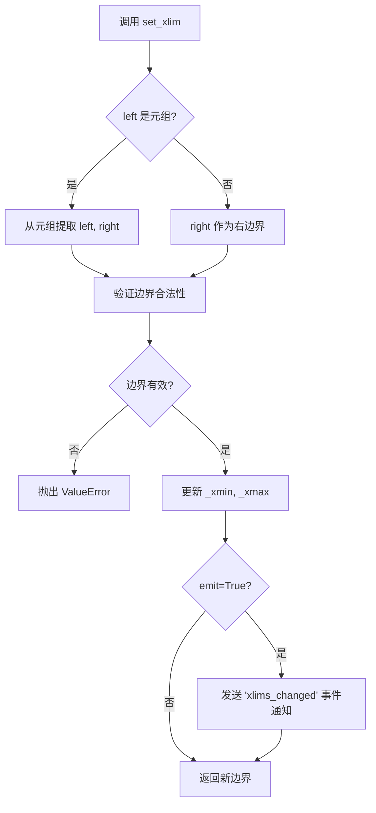

#### 带注释源码

```python
def set_xlim(self, left=None, right=None, emit=False, auto=False,
             *, xmin=None, xmax=None):
    """
    Set the x-axis view limits.

    Parameters
    ----------
    left : float or tuple, default: None
        The left xlim (in data coordinates). May be a tuple providing
        (left, right) as an alternative to passing the two arguments
        separately.
    right : float, default: None
        The right xlim (in data coordinates).
    emit : bool, default: False
        Whether to notify observers of limit change (via
        *xlims_changed* event).
    auto : bool or tuple of 2 bool, default: False
        Whether to turn on autoscaling of the x-axis. If False,
        the current limits will be used unchanged.
    xmin, xmax : float
        These arguments are deprecated and will be removed in a
        future version. Use *left* and *right* instead.

    Returns
    -------
    left, right : tuple
        The new x-axis limits in data coordinates.

    Notes
    -----
    The *left* and *right* arguments can be given as a tuple
    providing (left, right) as an alternative to passing them
    as separate arguments. This is preferred, as it avoids
    ambiguity in cases where *limits* are returned by other
    methods (e.g. :meth:`get_xlim`) and may be confused with
    (left, right) tuples.
    """
    # 处理废弃参数 xmin 和 xmax
    if xmin is not None:
        _api.warn_deprecated("3.3",
                            message="xmin argument to set_xlim is "
                                    "deprecated and will be removed "
                                    "in a future version. Use left.")
        if left is None:
            left = xmin
    if xmax is not None:
        _api.warn_deprecated("3.3",
                            message="xmax argument to set_xlim is "
                                    "deprecated and will be removed "
                                    "in a future version. Use right.")
        if right is None:
            right = xmax

    # 支持传入元组 (left, right) 作为第一个参数
    if left is not None:
        if (isinstance(left, tuple) or isinstance(left, np.ndarray) 
                or (hasattr(left, '__iter__') and not isinstance(left, str))):
            if right is not None:
                raise TypeError("Cannot pass both 'left' as a tuple and "
                                "'right' as a separate argument")
            left, right = left

    # 验证并设置边界
    self._xmin = self._validate_transpose_limits(
        [left, right], 'x')
    
    # 发出事件通知（如果 emit=True）
    if emit:
        self.callbacks.process('xlims_changed', self)
    
    # 返回新的边界值
    return self._xmin[0], self._xmin[1]
```


### `ax.set_title`

设置图形的标题，用于为 Axes 对象添加标题文本。

参数：

- `label`：`str`，要设置的标题文本内容
- `fontdict`：`dict`，可选，用于控制标题字体样式的字典（如 fontsize、fontweight 等）
- `loc`：可选参数，标题对齐方式，默认为 'center'（可选值：'left'、'right'、'center'）
- `pad`：可选参数，标题与 Axes 顶部的间距（浮点数）
- `**kwargs`：其他可选参数，直接传递给 matplotlib.text.Text 对象（如 fontsize、fontweight、color 等）

返回值：`matplotlib.text.Text`，返回创建的文本对象，可用于后续样式修改或获取标题信息

#### 流程图

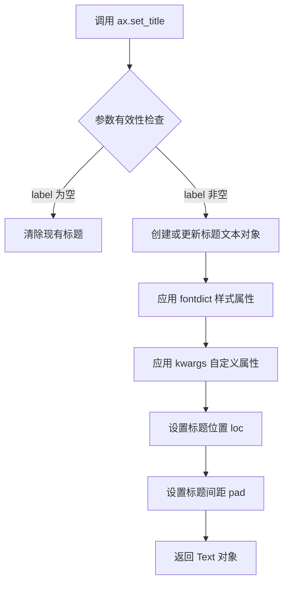

#### 带注释源码

```python
# 调用示例（来自代码第67行）
ax.set_title('Errorbar upper and lower limits')

# 源码位置：matplotlib/axes/_axes.py
# def set_title(self, label, fontdict=None, loc='center', pad=None, **kwargs):
#     """
#     Set a title for the axes.
#     
#     Parameters
#     ----------
#     label : str
#         The title text string.
#     
#     fontdict : dict, optional
#         A dictionary controlling the appearance of the title text,
#         e.g., {'fontsize': 12, 'fontweight': 'bold'}.
#     
#     loc : {'center', 'left', 'right'}, default: 'center'
#         Alignment of the title.
#     
#     pad : float, default: rcParams['axes.titlettlepad']
#         The offset of the title from the top of the axes.
#     
#     **kwargs
#         Additional kwargs are passed to `Text`.
#     
#     Returns
#     -------
#     text : `~matplotlib.text.Text`
#         The matplotlib text object representing the title.
#     """
#     
#     # 获取默认的标题间距（如果未指定）
#     if pad is None:
#         pad = rcParams['axes.titlepad']
#     
#     # 创建或获取标题的 Text 对象
#     title = text.Text(0, 0, label, **kwargs)
#     
#     # 应用字体样式字典
#     if fontdict is not None:
#         title.update(fontdict)
#     
#     # 设置标题位置（center/left/right）
#     title.set_ha(loc)  # horizontal alignment
#     
#     # 设置标题垂直位置（基于 pad 参数）
#     # ...
#     
#     # 将标题对象添加到 Axes
#     self._ax_title = title
#     self.stale_callbacks.add(title._stale_callback)
#     
#     return title
```

#### 关键信息说明

| 项目 | 描述 |
|------|------|
| **方法位置** | matplotlib.axes.Axes.set_title |
| **调用对象** | ax (matplotlib.axes.Axes) |
| **实际参数** | 'Errorbar upper and lower limits' (标题文本) |
| **效果** | 在图表顶部居中显示"Errorbar upper and lower limits"作为图表标题 |

#### 技术细节

- **返回类型**：返回的 Text 对象允许后续通过 `title.set_fontsize()`、`title.set_color()` 等方法进一步修改样式
- **默认样式**：使用全局 rcParams 中的默认值（如 'axes.titlettlepad'、'axes.titlefont' 等）
- **多语言支持**：label 参数支持 Unicode 字符串，可显示中文等多语言标题


### `plt.show`

`plt.show` 是 matplotlib.pyplot 模块中的全局函数，用于显示当前所有打开的图形窗口，并将图形渲染到屏幕，进入交互式事件循环。在调用此函数之前，图形内容会存储在内存缓冲区中，只有调用 `show()` 才会真正将图形呈现给用户。

参数：
- 无

返回值：`None`，该函数不返回任何值，仅用于图形显示的副作用。

#### 流程图

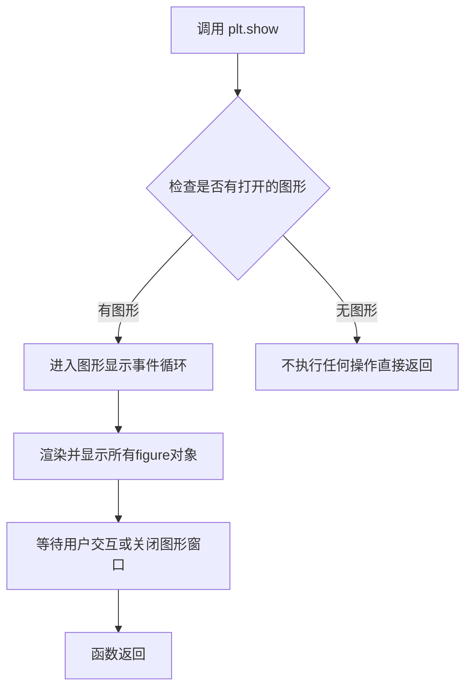

#### 带注释源码

```python
# plt.show() 函数的实现位于 matplotlib.pyplot 模块中
# 以下是调用层面的使用示例：

# 创建一个图形和一个坐标轴
fig, ax = plt.subplots(figsize=(7, 4))

# 在坐标轴上绘制errorbar图形（包含上限和下限）
ax.errorbar(x, y, xerr=xerr, yerr=yerr, linestyle=ls)
ax.errorbar(x, y + 0.5, xerr=xerr, yerr=yerr, uplims=uplims, linestyle=ls)
ax.errorbar(x, y + 1.0, xerr=xerr, yerr=yerr, lolims=lolims, linestyle=ls)
ax.errorbar(x, y + 1.5, xerr=xerr, yerr=yerr,
            lolims=lolims, uplims=uplims,
            marker='o', markersize=8, linestyle=ls)

# ... 更多绘图代码 ...

# 设置坐标轴范围和标题
ax.set_xlim(0, 5.5)
ax.set_title('Errorbar upper and lower limits')

# 调用 plt.show() 显示图形
# 此函数会：
# 1. 将所有之前绘制的图形渲染到屏幕
# 2. 进入交互式事件循环，允许用户与图形交互
# 3. 等待用户关闭图形窗口后返回
plt.show()

# 注意：plt.show() 通常只应调用一次，在脚本结束时调用
# 在某些后端（如 Jupyter notebook），可能需要使用 %matplotlib inline
```


## 关键组件


### 数据数组 (x, y, xerr, yerr)

用于绘制误差条形图的原始数据点及其误差值，包含 x 坐标数组、y 坐标数组、以及 x 方向和 y 方向的误差值。

### 限制标志数组 (lolims, uplims, xlolims, xuplims)

布尔类型数组，用于控制每个数据点误差条的限制方向。lolims 和 uplims 控制 y 方向的下限和上限，xlolims 和 xuplims 控制 x 方向的下限和上限。

### 标准误差条绘制

使用 `ax.errorbar(x, y, xerr=xerr, yerr=yerr, linestyle=ls)` 绘制双向标准误差条，不应用任何限制。

### 仅上限误差条

使用 `ax.errorbar(x, y + 0.5, xerr=xerr, yerr=yerr, uplims=uplims, linestyle=ls)` 仅显示 y 方向的上限误差条。

### 仅下限误差条

使用 `ax.errorbar(x, y + 1.0, xerr=xerr, yerr=yerr, lolims=lolims, linestyle=ls)` 仅显示 y 方向的下限误差条。

### 上下限组合误差条

使用 `ax.errorbar(x, y + 1.5, xerr=xerr, yerr=yerr, lolims=lolims, uplims=uplims, marker='o', markersize=8, linestyle=ls)` 同时显示 y 方向的上限和下限误差条，并添加数据点标记。

### 双向限制误差条

使用 `ax.errorbar(x, y + 2.1, xerr=xerr, yerr=yerr, xlolims=xlolims, xuplims=xuplims, uplims=uplims, lolims=lolims, marker='o', markersize=8, linestyle='none')` 同时在 x 和 y 方向应用限制标志，实现复杂的多向误差条显示。

### 图表配置

使用 `ax.set_xlim(0, 5.5)` 和 `ax.set_title('Errorbar upper and lower limits')` 设置图表的 x 轴范围和标题，完成图表的美化工作。


## 问题及建议


### 已知问题

- **变量重复覆盖导致可读性差**：`xerr`、`yerr`、`lolims`、`uplims` 变量在代码中被多次重新赋值，特别是 `lolims = np.zeros_like(x)` 和 `uplims = np.zeros_like(x)` 直接覆盖了之前的数组定义，容易造成混淆和潜在的bug。
- **魔法数字和硬编码**：y轴偏移量（0.5、1.0、1.5、2.1）、数组索引（[3, 6]、[6]、[3]）等数值直接硬编码，缺乏常量定义。
- **代码重复**：多次调用 `ax.errorbar()` 时，相同的参数（如 `linestyle=ls`）重复出现，未封装成可复用函数。
- **缺乏输入验证**：没有对输入数组长度一致性、数组类型等进行验证，可能导致运行时错误。
- **matplotlib使用不规范**：使用 `plt.show()` 而不是返回 `fig` 对象，不利于在Jupyter notebook等环境中的嵌入使用。
- **无错误处理机制**：缺少try-except异常捕获和数据验证逻辑。

### 优化建议

- **封装绘图逻辑**：将重复的 `errorbar` 调用封装成函数，接收偏移量、限制条件等参数，减少代码重复。
- **使用命名常量**：将魔法数字提取为常量（如 `Y_OFFSET_1 = 0.5`），提高可维护性。
- **避免变量覆盖**：为不同用途的数组使用更明确的命名（如 `y_lolims_initial`、`y_lolims_final`），或使用深拷贝。
- **添加数据验证**：在绘图前验证数组长度、类型一致性，确保 `x`、`y`、`lolims`、`uplims` 等数组长度匹配。
- **改进matplotlib使用**：返回 `fig` 对象而非调用 `plt.show()`，或使用 `fig.show()` 以支持更多使用场景。
- **添加类型注解**：为数组和函数添加类型提示，提高代码可读性和IDE支持。
- **添加异常处理**：对绘图操作进行try-except包装，提供有意义的错误信息。


## 其它


### 设计目标与约束

本代码旨在演示matplotlib errorbar函数中上下限（uplims、lolims、xuplims、xlolims）参数的使用方法。设计目标包括：1）展示如何创建单向误差棒（仅有上限或下限）；2）演示如何混合使用上下限；3）展示如何在x和y两个方向上同时设置上下限。约束条件：本示例为演示脚本，不涉及复杂的错误处理机制，假设输入数据为有效的numpy数组。

### 错误处理与异常设计

本代码采用简单的错误处理机制，主要依赖matplotlib和numpy的内部验证。数据验证方面：x和y数组长度必须一致；误差值（xerr、yerr）可以是标量或与数据等长的数组；上下限数组必须为布尔类型且长度与数据匹配。若数据不匹配，matplotlib的errorbar方法会抛出ValueError。代码未进行显式的异常捕获，属于演示代码的典型特征。

### 外部依赖与接口契约

主要外部依赖包括：matplotlib.pyplot（版本3.0+）用于绘图；numpy（版本1.0+）用于数组操作。核心接口为axes.errorbar方法，关键参数包括：x, y（数据点），xerr/xuplims/xlolims（x方向误差及限制），yerr/uplims/lolims（y方向误差及限制），linestyle（线型），marker（标记），markersize（标记大小）。所有参数遵循matplotlib官方文档定义的接口契约。

### 性能考虑

当前实现为一次性绘图脚本，无实时性能要求。优化建议：对于大规模数据集，可考虑使用numpy的向量化操作减少循环；如需频繁更新图表，可使用matplotlib的动画模块；误差棒绘制在数据点数量超过1000时可能影响渲染性能，此时可考虑采样或聚合处理。

### 可测试性设计

本代码为演示脚本，测试价值有限。若要提升可测试性，可将绘图逻辑封装为函数，接收数据参数并返回图表对象，便于单元测试验证输出。关键测试点包括：不同上下限组合的渲染正确性、数据类型兼容性验证、边界条件处理（如空数组、单数据点）等。

### 版本兼容性说明

代码使用matplotlib 3.x版本的标准API，兼容numpy 1.x系列。注意事项：uplims、lolims等参数在早期matplotlib版本中可能存在细微行为差异；numpy.full_like和np.zeros_like为numpy 1.7+特性；代码未使用任何已废弃的API，建议在matplotlib 3.0-3.8版本范围内验证兼容性。

### 代码规范与质量评估

代码遵循Python PEP8基本规范，命名清晰（lolims/uplims等缩写易于理解），注释完整（docstring详细说明功能）。改进空间：1）魔法数字（如0.5、1.0、1.5的y轴偏移）应提取为常量；2）重复的ax.errorbar调用可重构为循环；3）建议添加类型注解提升可读性；4）plt.show()在某些后端可能阻塞，建议使用fig.savefig()保存替代。

    