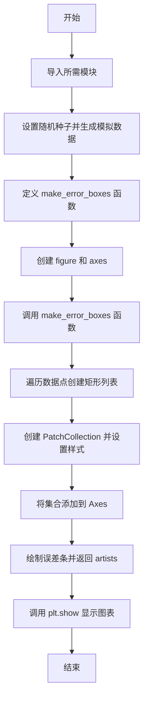

# `matplotlib\galleries\examples\statistics\errorbars_and_boxes.py` 详细设计文档

该代码演示了如何在matplotlib中创建带有误差条（error bars）的图表，并通过自定义函数make_error_boxes利用PatchCollection在每个数据点周围绘制由误差范围定义的矩形框，以增强数据可视化的表现力。

## 整体流程



## 类结构

```
Python 内置对象
├── matplotlib.pyplot (plt)
├── numpy (np)
├── matplotlib.collections
│   └── PatchCollection (用于批量管理矩形)
└── matplotlib.patches
    └── Rectangle (用于创建单个矩形)
```

## 全局变量及字段


### `n`
    
数据点数量

类型：`int`
    


### `x`
    
x轴坐标数据

类型：`numpy.ndarray`
    


### `y`
    
y轴坐标数据

类型：`numpy.ndarray`
    


### `xerr`
    
x轴误差数据

类型：`numpy.ndarray`
    


### `yerr`
    
y轴误差数据

类型：`numpy.ndarray`
    


    

## 全局函数及方法


### `make_error_boxes`

该函数用于根据误差条的范围创建误差矩形框（PatchCollection），并同时绘制误差条。它接收 Axes 对象和数据点，遍历每个数据点根据误差值计算矩形区域，创建一个 PatchCollection 添加入 Axes，并绘制误差条，最终返回误差条的艺术对象以便后续样式修改。

参数：

- `ax`：`matplotlib.axes.Axes`，执行绘图的 Axes 对象
- `xdata`：`numpy.ndarray`，X 轴数据点数组
- `ydata`：`numpy.ndarray`，Y 轴数据点数组
- `xerror`：`numpy.ndarray`，X 轴误差值，二维数组 [2, n]，分别为下方和上方误差
- `yerror`：`numpy.ndarray`，Y 轴误差值，二维数组 [2, n]，分别为下方和上方误差
- `facecolor`：`str`，默认为 'r'，矩形框的填充颜色
- `edgecolor`：`str`，默认为 'none'，矩形框的边框颜色
- `alpha`：`float`，默认为 0.5，矩形框的透明度

返回值：`tuple`（matplotlib container 对象），返回 errorbar 生成的艺术家对象容器，包含线条、误差线帽和误差区域，可用于后续样式修改

#### 流程图

```mermaid
flowchart TD
    A[开始 make_error_boxes] --> B[遍历数据点 xdata, ydata, xerror, yerror]
    B --> C[为每个数据点创建 Rectangle]
    C --> D[计算矩形: x-xe[0], y-ye[0], xe.sum, ye.sum]
    D --> E[构建 errorboxes 列表]
    E --> F[创建 PatchCollection]
    F --> G[设置 facecolor, alpha, edgecolor]
    G --> H[调用 ax.add_collection 添加到 Axes]
    H --> I[调用 ax.errorbar 绘制误差条]
    I --> J[返回 artists 对象]
    J --> K[结束]
```

#### 带注释源码

```python
def make_error_boxes(ax, xdata, ydata, xerror, yerror, facecolor='r',
                     edgecolor='none', alpha=0.5):
    """
    创建误差矩形框并绘制误差条的主函数
    
    Parameters:
    -----------
    ax : matplotlib.axes.Axes
        要进行绘图的 Axes 对象
    xdata : numpy.ndarray
        X 轴数据点
    ydata : numpy.ndarray
        Y 轴数据点
    xerror : numpy.ndarray
        X 轴误差值，形状为 [2, n]，第一行为负向误差，第二行为正向误差
    yerror : numpy.ndarray
        Y 轴误差值，形状为 [2, n]，第一行为负向误差，第二行为正向误差
    facecolor : str, optional
        矩形框填充颜色，默认为 'r' (红色)
    edgecolor : str, optional
        矩形框边框颜色，默认为 'none' (无边框)
    alpha : float, optional
        矩形框透明度，默认为 0.5
    
    Returns:
    --------
    artists : tuple
        errorbar 返回的艺术家对象容器，包含线、误差线帽和误差区域
    """
    
    # 遍历所有数据点，为每个点创建由误差范围定义的矩形
    # 矩形左下角: (x - xe[0], y - ye[0])，宽度: xe.sum()，高度: ye.sum()
    # xe[0] 和 ye[0] 分别为负向误差，xe.sum() 和 ye.sum() 为总误差范围
    errorboxes = [Rectangle((x - xe[0], y - ye[0]), xe.sum(), ye.sum())
                  for x, y, xe, ye in zip(xdata, ydata, xerror.T, yerror.T)]

    # 创建 PatchCollection (批量管理多个 Patch 的容器)
    # facecolor: 填充颜色
    # alpha: 透明度
    # edgecolor: 边框颜色
    pc = PatchCollection(errorboxes, facecolor=facecolor, alpha=alpha,
                         edgecolor=edgecolor)

    # 将 PatchCollection 添加到 Axes 对象
    # 注意: 需要先添加到 Axes 才能显示
    ax.add_collection(pc)

    # 绘制误差条
    # fmt='none': 不绘制数据点标记，只显示误差线
    # ecolor='k': 误差线颜色为黑色
    artists = ax.errorbar(xdata, ydata, xerr=xerror, yerr=yerror,
                          fmt='none', ecolor='k')

    # 返回艺术家对象，允许调用者在函数外部修改样式
    return artists
```

## 关键组件


### make_error_boxes 函数

从误差条数据创建矩形框并使用 PatchCollection 批量添加到 Axes 的核心功能函数

### PatchCollection

matplotlib 集合类，用于批量管理多个矩形 patch，支持统一设置颜色、透明度和边框属性

### Rectangle

表示单个误差框的矩形 patch，根据 x 和 y 方向的误差范围确定位置和尺寸

### errorbar 绘图

matplotlib Axes 方法，用于绘制标准的误差条线图，展示数据的误差范围

### 数据生成与处理

使用 numpy 生成模拟数据（x、y 坐标及对应的 xerr、yerr 误差），并通过 zip 和列表推导式进行向量化处理


## 问题及建议


### 已知问题

-   **缺少类型提示（Type Hints）**：函数参数和返回值没有类型注解，降低了代码的可读性和IDE支持能力，在大型项目中难以进行静态类型检查。
-   **缺少输入参数验证**：函数未验证`xdata`、`ydata`、`xerror`、`yerror`数组长度是否匹配，可能导致运行时难以追踪的错误。
-   **硬编码颜色值**：`facecolor='r'`、`edgecolor='none'`、`ecolor='k'`等视觉参数硬编码，降低了函数的灵活性和可复用性。
-   **不完整的返回值**：函数仅返回`errorbar`的artists，但创建的`errorboxes`列表和`PatchCollection`对象未返回，限制了调用者进一步自定义的能力。
-   **文档不完整**：函数缺少标准的docstring文档，仅依赖注释说明，参数和返回值无详细描述。
-   **全局变量污染**：数据变量（`x`, `y`, `xerr`, `yerr`, `n`）作为全局变量定义，缺乏封装，不利于代码复用和测试。
-   **魔法数字**：`n = 5`及随机数生成参数（19680801）作为硬编码值，缺乏配置化或常量定义。
-   **异常处理缺失**：未对可能的异常（如数组维度不匹配、类型错误）进行捕获和处理。

### 优化建议

-   为函数添加完整的类型提示和PEP 257风格的docstring，清晰描述参数、返回值和异常。
-   在函数入口添加参数验证逻辑，检查数组维度和类型，确保`xdata`、`ydata`、`xerror`、`yerror`的一致性。
-   将颜色、透明度等视觉参数作为可选参数或配置对象传入，提供默认值同时保持灵活性。
-   考虑返回包含所有创建对象的字典或命名元组，使调用者能访问`errorboxes`、`PatchCollection`和`errorbar` artists。
-   将全局数据变量封装到配置函数或类中，通过参数传递而非全局状态。
-   将关键配置常量（如数据点数范围、随机种子）提取为模块级常量或配置文件。
-   添加适当的异常处理，为不同错误场景提供清晰的错误信息。
-   考虑使用`@dataclass`或`NamedTuple`封装误差数据，提高代码结构化程度。
</think>


## 其它


### 设计目标与约束

本代码的设计目标是创建一个从误差条数据生成矩形 PatchCollection 的函数，用于美化误差条图表。约束条件包括：1) 输入数据必须为 numpy 数组格式；2) xerror 和 yerror 必须为 (2, n) 形状分别表示下界和上界；3) 仅支持 2D 误差（不对称误差）。

### 错误处理与异常设计

代码未包含显式的错误处理。潜在异常包括：1) 输入数组维度不匹配时 zip 函数会提前终止；2) xerror.T 和 yerror.T 形状不正确导致 Rectangle 参数为负；3) ax 参数为 None 时调用 add_collection 会失败。建议添加参数验证和类型检查。

### 外部依赖与接口契约

主要依赖：matplotlib.pyplot、numpy、matplotlib.collections.PatchCollection、matplotlib.patches.Rectangle。接口契约：ax 必须为 Axes 对象；xdata/ydata 长度必须一致；xerror/yerror 必须为 (2, n) 形状。

### 性能考虑

当前实现使用列表推导式创建 Rectangle 对象，对于大数据集可能存在性能瓶颈。可优化方向：1) 预分配数组替代列表推导；2) PatchCollection 已批量渲染，性能较好；3) 误差条绑定为 artists 返回。

### 可测试性

测试建议：1) 验证返回值 artists 为 tuple 类型；2) 验证 ax.collections 包含新增的 PatchCollection；3) 测试空输入边界情况；4) 测试不同 facecolor/edgecolor/alpha 组合效果。

### 版本兼容性

代码使用 Python 3 语法，依赖 matplotlib 和 numpy。建议最低版本：Python 3.6+、matplotlib 3.0+、numpy 1.15+。matplotlib.axes.Axes.add_collection 方法在早期版本存在细微行为差异。

### 配置与参数默认值

facecolor 默认为 'r'（红色），edgecolor 默认为 'none'，alpha 默认为 0.5。错误条 fmt='none'，ecolor='k'（黑色）。这些默认值可通过函数参数覆盖。


    