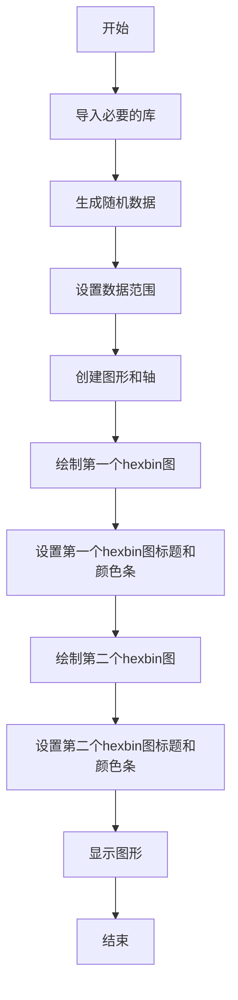

# `matplotlib\galleries\examples\statistics\hexbin_demo.py` 详细设计文档

This code generates a hexagonal binned plot using matplotlib, which is a 2D histogram plot with hexagonal bins and color gradients representing the number of data points in each bin.

## 整体流程



## 类结构

```
matplotlib.pyplot (全局模块)
├── np (全局模块)
└── hexbin_plot (主模块)
```

## 全局变量及字段


### `np`
    
The NumPy module, which provides support for large, multi-dimensional arrays and matrices, along with a collection of mathematical functions to operate on these arrays.

类型：`module`
    


### `plt`
    
The Matplotlib module, which is a comprehensive library for creating static, animated, and interactive visualizations in Python.

类型：`module`
    


    

## 全局函数及方法


### hexbin

`hexbin` 是一个用于创建二维直方图的可视化函数，其中每个 bin 是六边形，颜色代表每个 bin 内的数据点数量。

参数：

- `x`：`numpy.ndarray`，x 轴的数据点。
- `y`：`numpy.ndarray`，y 轴的数据点。
- `gridsize`：`int`，每个 bin 的边长，以数据点的数量为单位。
- `cmap`：`str` 或 `Colormap`，用于颜色映射的 Colormap。

返回值：`hexbin` 对象，包含用于绘制 hexbin 图的元素。

#### 流程图


#### 带注释源码

```python
import matplotlib.pyplot as plt
import numpy as np

# Fixing random state for reproducibility
np.random.seed(19680801)

n = 100_000
x = np.random.standard_normal(n)
y = 2.0 + 3.0 * x + 4.0 * np.random.standard_normal(n)
xlim = x.min(), x.max()
ylim = y.min(), y.max()

fig, (ax0, ax1) = plt.subplots(ncols=2, sharey=True, figsize=(9, 4))

hb = ax0.hexbin(x, y, gridsize=50, cmap='inferno')
ax0.set(xlim=xlim, ylim=ylim)
ax0.set_title("Hexagon binning")
cb = fig.colorbar(hb, ax=ax0, label='counts')

hb = ax1.hexbin(x, y, gridsize=50, bins='log', cmap='inferno')
ax1.set(xlim=xlim, ylim=ylim)
ax1.set_title("With a log color scale")
cb = fig.colorbar(hb, ax=ax1, label='counts')

plt.show()
```


## 关键组件


### 张量索引

张量索引用于在多维数组中定位和访问特定元素。

### 惰性加载

惰性加载是一种延迟计算或初始化数据的技术，直到实际需要时才进行。

### 反量化支持

反量化支持允许在量化过程中恢复原始数据精度。

### 量化策略

量化策略定义了如何将浮点数数据转换为固定点数表示，以减少计算资源消耗。


## 问题及建议


### 已知问题

-   **全局状态管理**：代码中使用了全局变量 `np.random.seed(19680801)` 来设置随机数生成器的种子，这可能导致代码在不同环境中运行结果不一致，尤其是在并行或分布式计算环境中。
-   **代码复用性**：代码中绘制两个子图的部分是重复的，可以考虑将这部分逻辑封装成函数以提高代码复用性。
-   **异常处理**：代码中没有包含异常处理逻辑，如果绘图过程中出现错误，可能会导致程序崩溃。

### 优化建议

-   **封装绘图逻辑**：将绘制两个子图的逻辑封装成函数，可以减少代码重复，并提高代码的可维护性。
-   **使用配置文件**：将绘图参数（如 `gridsize`、`cmap` 等）存储在配置文件中，而不是硬编码在代码中，这样可以更容易地调整参数，而不需要修改代码。
-   **异常处理**：在绘图逻辑中添加异常处理，确保在出现错误时程序能够优雅地处理异常，并提供有用的错误信息。
-   **代码注释**：增加代码注释，解释代码的功能和目的，特别是对于封装的函数和复杂的逻辑。
-   **单元测试**：编写单元测试来验证代码的功能，确保在修改代码时不会引入新的错误。


## 其它


### 设计目标与约束

- 设计目标：实现一个高效的二维直方图，其中每个bin是六边形，颜色代表每个bin中的数据点数量。
- 约束条件：使用matplotlib库进行绘图，保证代码的可读性和可维护性。

### 错误处理与异常设计

- 错误处理：在代码中未发现明显的错误处理机制，但应确保在数据输入和绘图过程中捕获并处理可能的异常。
- 异常设计：对于不合理的输入数据或绘图参数，应抛出相应的异常，并提供清晰的错误信息。

### 数据流与状态机

- 数据流：数据从随机数生成开始，经过处理和转换，最终通过matplotlib库进行可视化。
- 状态机：代码中没有明显的状态转换，但绘图过程中涉及多个步骤，如创建图形、添加hexbin、设置标题等。

### 外部依赖与接口契约

- 外部依赖：代码依赖于matplotlib和numpy库。
- 接口契约：matplotlib库的hexbin函数用于创建hexbin图，其参数和返回值应符合库的规范。


    