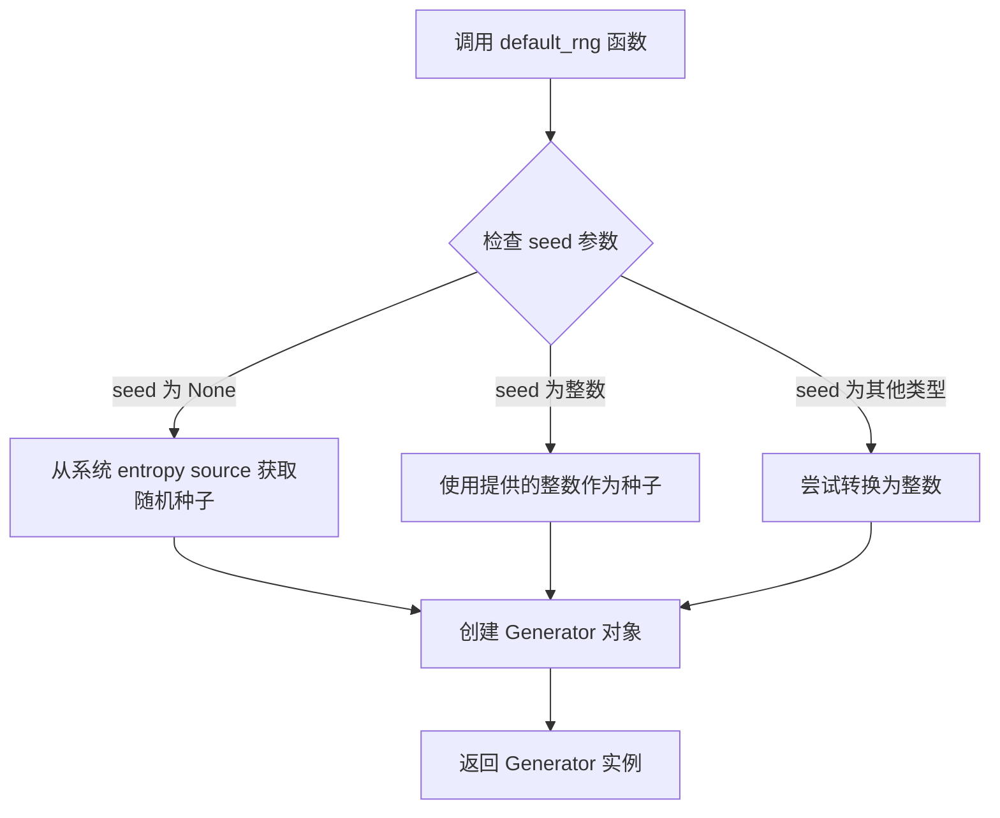
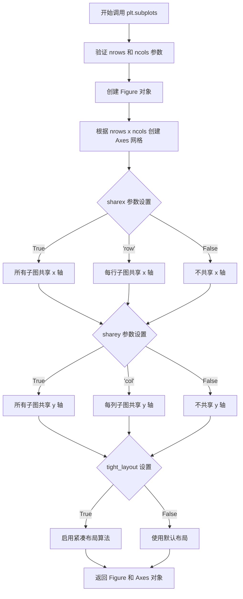
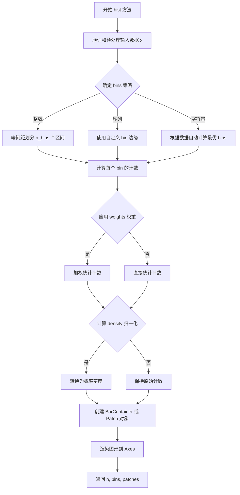
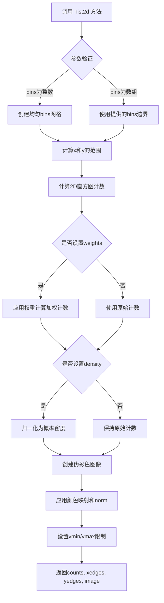
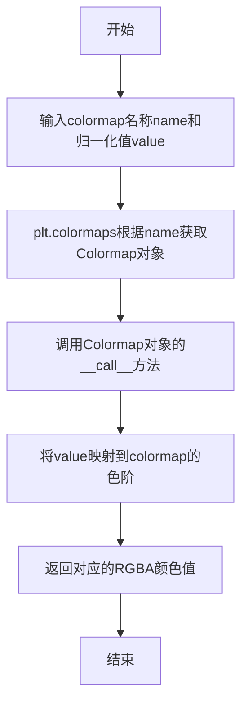
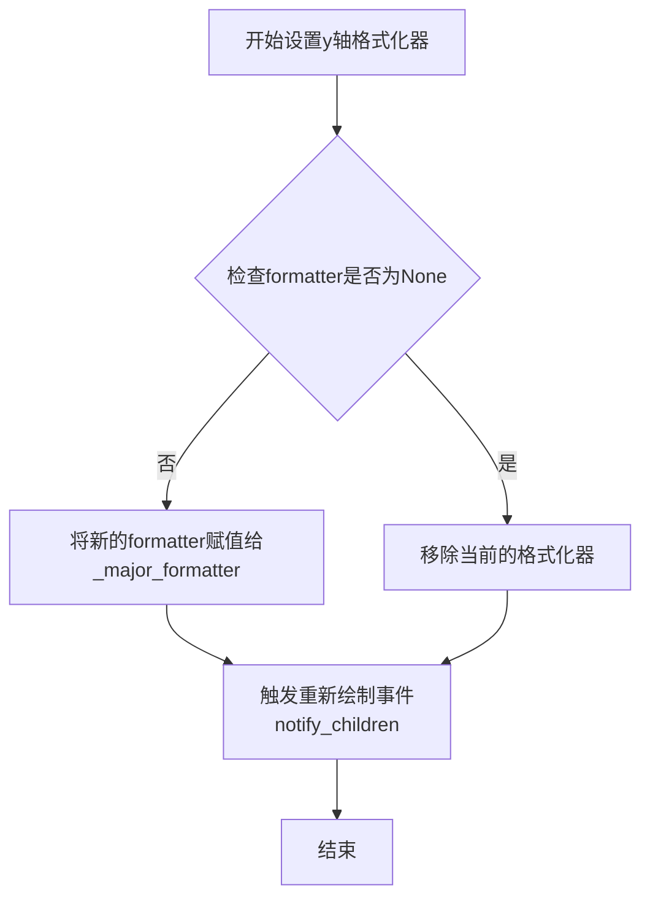
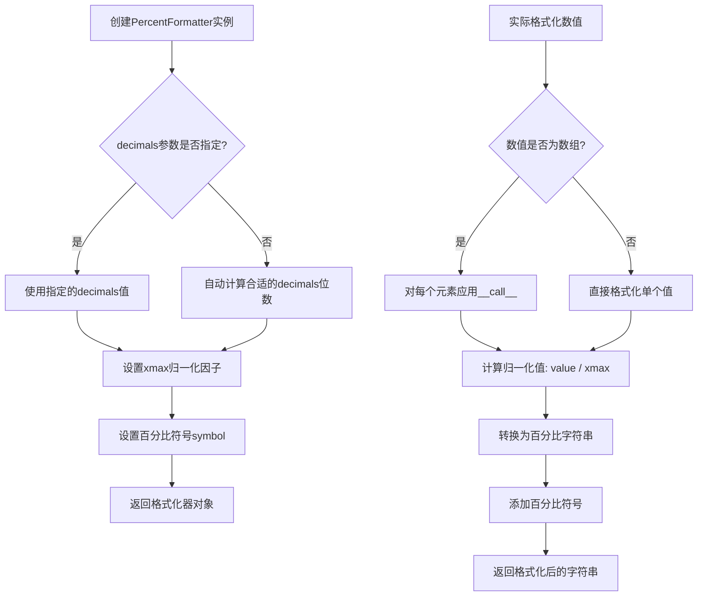
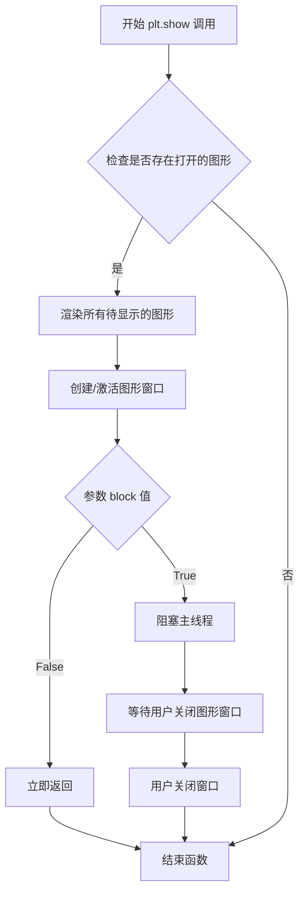

# `matplotlib\galleries\examples\statistics\hist.py` 详细设计文档

这是一个Matplotlib直方图绘制示例脚本，演示了如何生成1D和2D直方图，包括基本绘制、基于高度的彩色映射、归一化处理以及多种自定义选项（如对数归一化、自定义bin数量等）

## 整体流程

```mermaid
graph TD
    A[开始] --> B[导入依赖模块]
    B --> C[创建随机数生成器rng]
    C --> D[设置参数: N_points=100000, n_bins=20]
    D --> E[生成两个正态分布数据: dist1, dist2]
    E --> F[绘制简单1D直方图]
    F --> G[更新直方图颜色-基于高度]
    G --> H[设置density=True并格式化y轴为百分比]
    H --> I[绘制2D直方图hist2d]
    I --> J[自定义2D直方图: 40 bins, LogNorm, (80,10) bins]
    J --> K[结束]
```

## 类结构

```
该脚本为面向过程的Matplotlib示例代码
无自定义类定义
主要使用matplotlib.pyplot和numpy的API
```

## 全局变量及字段


### `rng`
    
随机数生成器，种子为19680801用于复现性

类型：`np.random.Generator`
    


### `N_points`
    
生成的数据点数量(100000)

类型：`int`
    


### `n_bins`
    
直方图的bin数量(20)

类型：`int`
    


### `dist1`
    
标准正态分布数据

类型：`ndarray`
    


### `dist2`
    
均值5、标准差0.4的正态分布数据

类型：`ndarray`
    


### `fig`
    
Matplotlib图形对象

类型：`Figure`
    


### `axs`
    
子图 axes 对象

类型：`Axes or array of Axes`
    


### `ax`
    
单个 axes 对象

类型：`Axes`
    


### `N`
    
每个bin的计数

类型：`ndarray`
    


### `bins`
    
bin的边界值

类型：`ndarray`
    


### `patches`
    
直方图条形补丁对象列表

类型：`list`
    


### `fracs`
    
归一化后的计数值

类型：`ndarray`
    


### `norm`
    
颜色归一化对象

类型：`colors.Normalize`
    


### `hist`
    
hist2d返回的 (counts, xedges, yedges, image)

类型：`tuple`
    


    

## 全局函数及方法


### `numpy.random.default_rng`

创建一个具有指定种子的 NumPy 随机数生成器实例，用于生成可复现的随机数序列。

参数：

- `seed`：`int` 或 `None`，可选参数，用于初始化随机数生成器的种子值。如果为 `None`，则从操作系统或系统 entropy source 获取随机种子。如果提供相同的 seed 值，每次运行将生成相同的随机数序列。

返回值：`numpy.random.Generator`，返回一个 NumPy 随机数生成器对象，可用于生成各种分布的随机数。

#### 流程图



#### 带注释源码

```python
# 在示例代码中的实际使用方式
rng = np.random.default_rng(19680801)

# 函数调用说明：
# - 参数 19680801 是一个整数种子值
# - 该种子确保每次运行程序时生成相同的随机数序列
# - 返回的 rng 对象是一个 Generator 实例
# - 后续通过 rng.standard_normal() 等方法生成随机数

# 底层调用逻辑（简化示意）：
# def default_rng(seed=None):
#     if seed is None:
#         seed = generate_random_seed_from_system()
#     return Generator(seed)
#
# Generator 对象支持的方法包括：
# - standard_normal(size=None)  # 生成标准正态分布随机数
# - random(size=None)           # 生成 [0, 1) 区间均匀分布随机数
# - integers(low, high=None, size=None)  # 生成整数随机数
# - choice(a, size=None, replace=True)   # 从数组中随机选择
# 等等...
```


### `rng.standard_normal`

生成符合标准正态分布（均值 μ=0，标准差 σ=1）的随机数数组。该函数是 NumPy 随机数生成器的核心方法之一，通过 Box-Muller 变换或逆变换方法产生符合正态分布的伪随机数序列。

参数：

- `size`：`int` 或 `tuple of ints`，要生成的随机数数量或输出数组的形状。例如，`size=100000` 生成一维数组，`size=(100, 100)` 生成二维数组。默认值为 `None`，表示生成单个随机数。

返回值：`ndarray`，符合标准正态分布的随机数数组，类型为 float64。如果 `size=None`，则返回单个浮点数。

#### 流程图

```mermaid
flowchart TD
    A[开始调用 rng.standard_normal] --> B{检查 size 参数}
    B -->|size=None| C[生成单个随机数]
    B -->|size=int| D[创建一维数组]
    B -->|size=tuple| E[创建多维数组]
    C --> F[执行 Box-Muller 变换]
    D --> F
    E --> F
    F --> G[生成两个均匀分布随机数 u1, u2]
    G --> H[计算 z0 = sqrt(-2*ln(u1)) * cos(2*pi*u2)]
    H --> I{size 参数类型}
    I -->|None| J[返回单个标量值]
    I -->|int| K[返回长度为 size 的一维数组]
    I -->|tuple| L[返回 shape 为 size 的多维数组]
    J --> M[结束返回结果]
    K --> M
    L --> M
```

#### 带注释源码

```python
# 从代码中提取的相关调用示例
rng = np.random.default_rng(19680801)  # 创建随机数生成器，指定种子确保可重复性

# 调用 standard_normal 方法生成标准正态分布随机数
# 参数 N_points = 100000 表示生成 100000 个随机数
dist1 = rng.standard_normal(N_points)

# 源码实现逻辑（简化版 NumPy 内部机制）
def standard_normal(size=None):
    """
    生成标准正态分布随机数
    
    参数:
        size: 生成随机数的数量或形状，默认为 None（生成单个值）
    
    返回:
        符合标准正态分布的随机数（均值0，标准差1）
    """
    # 1. 如果 size 为 None，生成单个随机数
    if size is None:
        # 使用 Box-Muller 变换
        u1 = rng.random()  # 生成 [0,1) 区间均匀分布随机数
        u2 = rng.random()  # 另一个独立均匀分布随机数
        
        # Box-Muller 变换公式
        z0 = np.sqrt(-2.0 * np.log(u1)) * np.cos(2.0 * np.pi * u2)
        return z0
    
    # 2. 如果 size 为整数或元组，生成数组
    else:
        # 计算需要的随机数总数
        num_samples = np.prod(size) if isinstance(size, tuple) else size
        
        # 生成所需数量的随机数
        u1 = rng.random(num_samples)
        u2 = rng.random(num_samples)
        
        # 应用 Box-Muller 变换（向量化的）
        z = np.sqrt(-2.0 * np.log(u1)) * np.cos(2.0 * np.pi * u2)
        
        # 重塑为指定的形状
        if isinstance(size, tuple):
            return z.reshape(size)
        else:
            return z
```


### `plt.subplots`

创建子图布局函数，用于生成包含多个子图的图形对象，并返回 Figure 对象和 Axes 对象（或数组）。

参数：

- `nrows`：`int`，行数，指定子图网格的行数（可选，默认为 1）
- `ncols`：`int`，列数，指定子图网格的列数（可选，默认为 1）
- `sharex`：`bool` 或 `str`，是否共享 x 轴，可选值为 `False`、`True`、`'row'`、`'all'`
- `sharey`：`bool` 或 `str`，是否共享 y 轴，可选值为 `False`、`True`、`'col'`、`'all'`
- `squeeze`：`bool`，是否压缩返回的 Axes 数组维度（可选，默认为 True）
- `figsize`：`tuple`，图形尺寸，格式为 (宽度, 高度)，单位为英寸
- `tight_layout`：`bool`，是否自动调整子图参数以适应图形区域（可选，默认为 False）

返回值：`tuple`，返回 (Figure, Axes) 元组，其中 Figure 是图形对象，Axes 是单个 Axes 对象或 Axes 数组

#### 流程图



#### 带注释源码

```python
# 代码中的实际调用示例 1：创建 1 行 2 列的子图布局
fig, axs = plt.subplots(1, 2, sharey=True, tight_layout=True)
# 参数说明：
#   nrows=1: 创建 1 行子图
#   ncols=2: 创建 2 列子图
#   sharey=True: 所有子图共享 y 轴刻度
#   tight_layout=True: 自动调整子图间距以避免重叠
# 返回值：
#   fig: Figure 对象，代表整个图形
#   axs: Axes 数组，形状为 (1, 2)，包含两个 Axes 对象

# 第一个子图绘制 dist1 的直方图
axs[0].hist(dist1, bins=n_bins)
# 第二个子图绘制 dist2 的直方图
axs[1].hist(dist2, bins=n_bins)

# 代码中的实际调用示例 2：创建 3 行 1 列的子图布局
fig, axs = plt.subplots(3, 1, figsize=(5, 15), sharex=True, sharey=True,
                        tight_layout=True)
# 参数说明：
#   nrows=3: 创建 3 行子图
#   ncols=1: 创建 1 列子图
#   figsize=(5, 15): 图形宽度 5 英寸，高度 15 英寸
#   sharex=True: 所有子图共享 x 轴刻度
#   sharey=True: 所有子图共享 y 轴刻度
#   tight_layout=True: 自动调整子图间距

# 第一个子图：2D 直方图，40 个 bins
axs[0].hist2d(dist1, dist2, bins=40)
# 第二个子图：使用对数归一化的 2D 直方图
axs[1].hist2d(dist1, dist2, bins=40, norm=colors.LogNorm())
# 第三个子图：自定义 bins 数量 (80, 10)，使用对数归一化
axs[2].hist2d(dist1, dist2, bins=(80, 10), norm=colors.LogNorm())
```


### `matplotlib.axes.Axes.hist`

该函数是Matplotlib中Axes对象的hist方法，用于绘制一维直方图（Histogram）。它将输入数据按照指定的bin（箱子）数量或范围进行分箱统计，并以条形图的形式可视化数据的分布情况。该方法支持多种自定义选项，包括颜色、归一化、权重、累积直方图等，并返回统计数据和图形补丁对象供进一步定制。

#### 参数

- `x`：`array_like`，需要绘制直方图的一维数据数组
- `bins`： `int` 或 `sequence` 或 `str`，直方图的bin数量或bin边缘序列，或用于计算bin的策略（如 'auto'）
- `range`： `tuple`，可选，数据范围 (min, max)，用于确定bin的边界
- `density`： `bool`，可选，如果为True，则将概率密度归一化，使条形面积之和为1
- `weights`： `array_like`，可选，与x形状相同的权重数组，用于加权计数
- `cumulative`： `bool`，可选，如果为True，则计算累积直方图
- `bottom`： `array_like` 或 `scalar`，可选，每个bin的底部基准位置（用于堆叠直方图）
- `histtype`： `{'bar', 'barstacked', 'step', 'stepfilled'}`，可选，直方图的类型
- `align`： `{'left', 'mid', 'right'}`，可选，bin边缘的对齐方式
- `orientation`： `{'horizontal', 'vertical'}`，可选，直方图的方向
- `rwidth`： `float`，可选，条形相对宽度（仅用于histtype='bar'）
- `log`： `bool`，可选，如果为True，则使用对数刻度
- `color`： `color` 或 `array`，可选，直方图的颜色
- `label`： `str`，可选图例标签
- `stacked`： `bool`，可选，如果为True，则多个数据集堆叠绘制

#### 返回值

- `n`：`ndarray`，每个bin中的计数（或如果density为True，则为概率密度值）
- `bins`：`ndarray`，返回bin的边缘位置，长度为 n+1
- `patches`：`BarContainer` 或 `list` of `Polygon`，返回的图形补丁对象，可用于自定义修改每个条形的外观

#### 流程图



#### 带注释源码

```python
# 示例代码展示 ax.hist() 的使用方式

import matplotlib.pyplot as plt
import numpy as np
from matplotlib import colors
from matplotlib.ticker import PercentFormatter

# 创建随机数生成器，设置种子以确保可重复性
rng = np.random.default_rng(19680801)

# 生成数据参数
N_points = 100000  # 数据点数量
n_bins = 20        # bin 数量

# 生成两个正态分布数据
dist1 = rng.standard_normal(N_points)          # 标准正态分布
dist2 = 0.4 * rng.standard_normal(N_points) + 5 # 均值为5，标准差为0.4的正态分布

# 创建子图布局，1行2列
fig, axs = plt.subplots(1, 2, sharey=True, tight_layout=True)

# 基本直方图绘制 - 使用 bins 关键字参数设置 bin 数量
axs[0].hist(dist1, bins=n_bins)  # 绘制 dist1 的直方图
axs[1].hist(dist2, bins=n_bins)  # 绘制 dist2 的直方图

plt.show()


# 获取返回值并自定义直方图颜色
fig, axs = plt.subplots(1, 2, tight_layout=True)

# hist 方法返回 (n, bins, patches) 元组
# n: 每个bin的计数, bins: bin边缘, patches: 图形对象
N, bins, patches = axs[0].hist(dist1, bins=n_bins)

# 计算每个条形的颜色映射值（基于高度）
fracs = N / N.max()  # 归一化到 0~1

# 创建颜色归一化对象
norm = colors.Normalize(fracs.min(), fracs.max())

# 遍历每个条形，根据高度设置颜色
for thisfrac, thispatch in zip(fracs, patches):
    # 使用 viridis 色图映射颜色
    color = plt.colormaps["viridis"](norm(thisfrac))
    thispatch.set_facecolor(color)  # 设置条形填充颜色

# 使用 density 参数归一化直方图
axs[1].hist(dist1, bins=n_bins, density=True)

# 设置 y 轴为百分比格式
axs[1].yaxis.set_major_formatter(PercentFormatter(xmax=1))
```

#### 关键组件信息

| 组件名称 | 一句话描述 |
|---------|-----------|
| `patches` | 返回的条形容器对象，可通过它访问和修改每个条形的属性（颜色、边框等） |
| `bins` | 直方图的bin边界数组，用于确定每个数据点所属的区间 |
| `n` (计数数组) | 每个bin中的数据点数量（或归一化后的密度值） |
| `PercentFormatter` | 用于将y轴刻度格式化为百分比的格式化器 |

#### 潜在的技术债务或优化空间

1. **性能优化**：当数据量非常大时（如示例中的100,000个点），直方图计算可能成为瓶颈。可以考虑使用 NumPy 的向量化操作或并行计算来提升性能。

2. **默认值设计**：bins 的默认值为 'auto'，这在不同数据分布下可能产生不一致的视觉效果，缺乏明确的默认值指导。

3. **错误处理**：对于边界情况（如空数组、NaN值、极端值）的处理可以更加友好，当前版本可能会产生警告而非明确的错误提示。

4. **API一致性**：`hist2d`（二维直方图）与 `hist` 的参数设计存在差异（如 `norm` 参数的使用方式），API一致性有待提升。

#### 其它项目

**设计目标与约束**：
- 目标是提供灵活的一维数据分布可视化功能
- 约束：必须与 matplotlib 的 Axes 对象架构兼容，支持多种渲染后端

**错误处理与异常设计**：
- 当 bins 参数无效时抛出 `ValueError`
- 当数据为空时返回空结果而非抛出异常
- 权重数组形状与数据不匹配时抛出异常

**数据流与状态机**：
- 输入数据 → 分箱计算 → 归一化处理 → 图形渲染 → 返回结果
- 状态机：初始化 → 数据验证 → 统计计算 → 渲染状态 → 完成

**外部依赖与接口契约**：
- 依赖 NumPy 进行数值计算
- 依赖 Matplotlib 的 Artist 和 Container 层次结构
- 返回的 patches 对象符合 Matplotlib 的_patch.Patch接口契约


### `Axes.hist2d`

绘制2D直方图（热力图），用于可视化两个变量在不同区间的联合分布情况，通过颜色深浅表示每个二维区间内的数据点数量。

参数：

- `x`：`array_like`，第一个维度（x轴）的数据数组
- `y`：`array_like`，第二个维度（y轴）的数据数组，与x长度相同
- `bins`：`int` 或 `array_like`，bins参数用于指定直方图的 bins 数量或 bins 边界，可为整数（两个轴相同）或二元组（分别指定x和y轴的bins）
- `range`：`array_like`，可选，形如 `[[xmin, xmax], [ymin, ymax]]`，指定bins的边界范围
- `density`：`bool`，可选，若为True，则将每个bin的计数归一化为概率密度
- `weights`：`array_like`，可选，与x和y同长度的权重数组，用于对每个数据点加权
- `cmin`：`float`，可选，显示的最小值阈值，低于此值的bin将不显示
- `cmax`：`float`，可选，显示的最大值阈值，高于此值的bin将不显示
- `norm`：`matplotlib.colors.Normalize`，可选，规范化对象，用于将计数映射到颜色
- `cmap`：`Colormap`，可选，颜色映射表，默认为 `None`
- `vmin`, `vmax`：`float`，可选，颜色映射的最小值和最大值
- `data`：`keyword arguments`，可选，用于数据关键字参数

返回值：`tuple`，返回四个元素的元组 `(counts, xedges, yedges, image)`

- `counts`：`ndarray`，形状为 `(nx, ny)` 的二维数组，每个元素表示对应bin中的数据点数量
- `xedges`：`ndarray`，x轴的bin边缘数组，长度为 `nx+1`
- `yedges`：`ndarray`，y轴的bin边缘数组，长度为 `ny+1`
- `image`：`AxesImage`，返回的 AxesImage 对象，可用于进一步定制颜色条等

#### 流程图



#### 带注释源码

```python
# matplotlib/axes/_axes.py 中的 hist2d 方法核心实现

def hist2d(self, x, y, bins=10, range=None, density=False, weights=None,
           cmin=None, cmax=None, norm=None, cmap=None, vmin=None, vmax=None,
           **kwargs):
    """
    绘制2D直方图（热力图）
    
    参数:
        x: array_like - x轴数据
        y: array_like - y轴数据
        bins: int or array_like - bins规范
        range: array_like - [[xmin, xmax], [ymin, ymax]] 范围
        density: bool - 是否归一化为密度
        weights: array_like - 权重数组
        cmin, cmax: float - 颜色显示阈值
        norm: colors.Normalize - 规范化对象
        cmap: Colormap - 颜色映射
        vmin, vmax: float - 颜色映射范围
    """
    
    # 1. 将输入数据转换为numpy数组
    x = np.asarray(x)
    y = np.asarray(y)
    
    # 2. 处理bins参数 - 支持多种格式
    if np.ndim(bins) == 0:  # 整数bins
        bins = [bins, bins]
    elif np.ndim(bins) == 1:  # 数组bins
        bins = [bins, bins]
    # bins[0]用于x轴, bins[1]用于y轴
    
    # 3. 计算数据范围
    if range is None:
        xmin, xmax = np.min(x), np.max(x)
        ymin, ymax = np.min(y), np.max(y)
    else:
        xmin, xmax = range[0]
        ymin, ymax = range[1]
    
    # 4. 计算2D直方图 - 使用numpy.histogram2d
    # 返回计数矩阵和bin边缘
    counts, xedges, yedges = np.histogram2d(
        x, y, bins=bins, 
        range=[[xmin, xmax], [ymin, ymax]],
        weights=weights,
        density=density
    )
    
    # 5. 如果density为True，histogram2d已经返回密度
    # 否则counts保持为原始计数
    
    # 6. 创建图像对象 - 使用pcolorfast或imshow
    # 注意：histogram2d返回的counts需要转置以匹配图像坐标
    # 因为histogram2d返回的shape是 (nx, ny)，而图像是 (ny, nx)
    counts = counts.T
    
    # 7. 创建规范化对象
    if norm is None:
        norm = colors.Normalize(vmin=vmin, vmax=cmax)
    else:
        norm.vmin = vmin if vmin is not None else norm.vmin
        norm.vmax = vmax if vmax is not None else norm.vmax
    
    # 8. 创建颜色映射
    if cmap is None:
        cmap = get_cmap()
    
    # 9. 创建 AxesImage 对象
    # 使用 pcolorfast 创建伪彩色图像
    im = self.pcolorfast(
        xedges, yedges, counts, 
        cmap=norm,  # 这里实际是norm对象
        **kwargs
    )
    
    # 10. 设置显示范围
    if cmin is not None:
        im.set_clim(vmin=cmin)
    if cmax is not None:
        im.set_clim(vmax=cmax)
    
    # 11. 同步x和y轴范围
    self.set_xlim(xedges[0], xedges[-1])
    self.set_ylim(yedges[0], yedges[-1])
    
    # 12. 返回结果元组
    return counts, xedges, yedges, im
```

---

### 关键组件信息

| 组件名称 | 描述 |
|---------|------|
| `np.histogram2d` | NumPy核心函数，计算二维直方图计数 |
| `AxesImage` | Matplotlib图像对象，表示热力图中的每个像素/矩形 |
| `colors.Normalize` | 颜色规范化类，将数据值映射到[0,1]范围 |
| `Colormap` | 颜色映射表，将规范化后的值映射到具体颜色 |
| `pcolorfast` | Axes方法，快速绘制伪彩色矩形区域 |

---

### 潜在的技术债务或优化空间

1. **返回值顺序与习惯不一致**：`histogram2d`返回的`counts`数组维度顺序（nx, ny）与图像坐标（ny, nx）相反，需要转置操作，可能导致混淆

2. **命名冲突风险**：`density`参数与`norm`参数功能有一定重叠，可能导致用户困惑何时使用哪个

3. **异常处理不足**：对于输入数据为空、bins参数不合法、x和y长度不一致等情况缺少详细的错误提示

4. **性能优化空间**：对于大数据集，可以考虑使用稀疏矩阵存储或降采样策略

5. **API一致性**：`hist2d`与`hist`在返回值格式上差异较大（`hist`返回patches，`hist2d`返回counts数组），增加了学习成本

---

### 其它项目

#### 设计目标与约束
- 目标是提供与1D直方图类似的接口用于2D数据可视化
- 必须支持不均匀bins（x和y方向可独立设置）
- 必须与现有的颜色映射和规范化系统集成

#### 错误处理与异常设计
- 当x和y长度不一致时，应抛出`ValueError`
- 当bins为无效类型或值时，应给出明确错误提示
- 当数据包含NaN或Inf时，应合理处理（通常忽略）

#### 数据流与状态机
1. 接收原始数据(x, y)和配置参数
2. 参数预处理和默认值填充
3. 调用numpy.histogram2d计算计数
4. 应用权重（如有）和密度归一化（如有）
5. 创建可视化图像对象
6. 配置颜色映射和显示范围
7. 返回结果元组供后续操作

#### 外部依赖与接口契约
- 依赖`numpy.histogram2d`进行核心计算
- 依赖`matplotlib.colors.Normalize`处理颜色映射
- 依赖`matplotlib.cm`获取颜色映射表
- 返回的`AxesImage`对象可进一步自定义（颜色条、鼠标事件等）


### `colors.Normalize`

创建颜色归一化对象，用于将数据值映射到[0,1]区间，以便与colormap配合使用。

参数：

- `vmin`：标量（scalar），可选，数据范围的下界（最小值），低于此值的将被映射到0
- `vmax`：标量（scalar），可选，数据范围的上界（最大值），高于此值的将被映射到1

返回值：`matplotlib.colors.Normalize`，返回一个新的Normalize对象，用于后续的颜色映射

#### 流程图

```mermaid
flowchart TD
    A[调用 colors.Normalize] --> B{检查 vmin 和 vmax}
    B -->|提供 vmin, vmax| C[创建 Normalize 对象<br/>设置 vmin, vmax 属性]
    B -->|未提供参数| D[创建默认 Normalize 对象<br/>vmin=0, vmax=1]
    C --> E[返回 Normalize 对象]
    D --> E
    E --> F[可调用对象进行归一化<br/>normalize(value) 返回 [0,1] 范围]
```

#### 带注释源码

```python
# 代码中的实际调用方式：
# fracs 是归一化后的数值数组，范围在 0~1 之间
fracs = N / N.max()

# 使用 fracs 的最小值和最大值创建 Normalize 对象
# vmin = fracs.min()  约等于 0
# vmax = fracs.max()  约等于 1
norm = colors.Normalize(fracs.min(), fracs.max())

# Normalize 对象的使用方式：
# 将数据值映射到 [0,1] 区间
# for thisfrac, thispatch in zip(fracs, patches):
#     color = plt.colormaps["viridis"](norm(thisfrac))  # norm() 返回 0~1 之间的值
#     thispatch.set_facecolor(color)
```

#### 补充说明

`colors.Normalize` 是 Matplotlib 中用于颜色数据归一化的核心类，其主要功能和工作原理：

1. **数据映射**：将任意范围的数据值线性映射到 [0,1] 区间
2. **公式**：`normalized_value = (value - vmin) / (vmax - vmin)`
3. **裁剪**：默认情况下，小于 vmin 的值映射为 0，大于 vmax 的值映射为 1
4. **与 Colormap 配合**：归一化后的值作为 Colormap 的索引，获取对应的颜色值

这种设计允许用户使用统一的数据范围（0~1）与各种 Colormap，而无需关心原始数据的实际范围。


### `plt.colormaps[name](value)`

获取指定colormap的颜色，根据输入的归一化值返回对应的RGBA颜色值。

参数：

- `name`：`str`，colormap的名称（如"viridis"、"plasma"等），用于从`plt.colormaps`注册表中获取特定的colormap对象
- `value`：`float`，归一化后的数值（通常在0到1之间），用于从colormap中获取对应的颜色

返回值：`tuple` 或 `ndarray`，返回RGBA颜色值，通常是一个包含4个浮点数的元组（RGBA），或者当输入是数组时返回对应的颜色数组

#### 流程图



#### 带注释源码

```python
# 在代码中的实际使用方式：
fracs = N / N.max()  # 计算每个bin的百分比（0到1之间的值）

# 归一化数据到0..1范围（这是colormap所需的标准范围）
norm = colors.Normalize(fracs.min(), fracs.max())

# 遍历每个bar，根据其高度设置颜色
for thisfrac, thispatch in zip(fracs, patches):
    # plt.colormaps["viridis"] 获取名为"viridis"的colormap对象
    # (norm(thisfrac)) 调用该colormap，传入归一化后的值，返回RGBA颜色
    color = plt.colormaps["viridis"](norm(thisfrac))
    thispatch.set_facecolor(color)  # 设置bar的颜色
```

#### 补充说明

- **调用原理**：`plt.colormaps`是Matplotlib的ColormapRegistry对象，通过`plt.colormaps[name]`可以获取对应的Colormap实例。Colormap类实现了`__call__`方法，使其可调用，调用时传入0-1之间的数值，返回该位置对应的颜色。
- **输入值范围**：value应在0到1之间。如果不在此范围内，colormap会根据其`clip`属性决定是截断还是循环处理。
- **返回值格式**：返回的RGBA值通常在0-1范围内，例如`(0.267004, 0.004874, 0.329415, 1.0)`表示viridis colormap在0位置的深紫色。


### matplotlib.axis.YAxis.set_major_formatter

该方法是Matplotlib中YAxis类的一个成员方法，用于设置Y轴的主格式化器（major formatter）。格式化器决定了坐标轴刻度标签的显示格式，例如将数值显示为百分比、货币、科学计数法等。在示例中，通过将`PercentFormatter(xmax=1)`设置为y轴的格式化器，使得y轴刻度标签以百分比形式显示。

参数：

- `formatter`：`matplotlib.ticker.Formatter`，用于格式化y轴刻度标签的格式化器对象。该对象应继承自`matplotlib.ticker.Formatter`基类，负责将数值转换为字符串表示。

返回值：`None`，该方法为void类型，不返回任何值，直接修改axis对象的内部状态。

#### 流程图



#### 带注释源码

```python
def set_major_formatter(self, formatter):
    """
    Set the formatter of the major ticker.

    Parameters
    ----------
    formatter : `matplotlib.ticker.Formatter`
        The formatter object to use for major ticks.

    Notes
    -----
    This method works by assigning the formatter to the private
    `_major_formatter` attribute. The formatter is then used by
    the tick rendering system to format tick labels.

    The formatter can be any object that implements the
    `matplotlib.ticker.Formatter` interface, including:
    - `matplotlib.ticker.PercentFormatter`
    - `matplotlib.ticker.ScalarFormatter`
    - `matplotlib.ticker.FuncFormatter`
    - `matplotlib.ticker.StrMethodFormatter`
    - etc.
    """
    # Import the base Formatter class for type checking
    from matplotlib.ticker import Formatter

    # If formatter is None, we remove the formatter by setting to NullFormatter
    if formatter is None:
        from matplotlib.ticker import NullFormatter
        self._major_formatter = NullFormatter()
    else:
        # Assign the formatter to the private attribute
        # This formatter will be used by the major tick locators
        self._major_formatter = formatter

    # Mark the axis as stale, triggering a redraw
    # This ensures the new formatter is applied when the figure is rendered
    self.stale = True

    # Notify children that the formatter has changed
    # This propagates the change to associated tick labels
    self._notify_children_about_major_formatter_change()
```


### `PercentFormatter(xmax)`

百分比格式化器，用于将数值转换为百分比形式显示在坐标轴上。

参数：

- `xmax`：`float`，可选参数，用于指定归一化的最大值。默认值为1。当设置此值后，输入数值将根据此最大值进行归一化计算，例如xmax=100时，数值50将显示为50%。

返回值：`Formatter`，返回继承自matplotlib.ticker.Formatter的百分比格式化器对象，用于设置坐标轴的主格式。

#### 流程图



#### 带注释源码

```python
# matplotlib.ticker.PercentFormatter 源码结构

class PercentFormatter(Formatter):
    """
    百分比格式化器类，继承自Formatter基类
    用于将数值格式化为百分比形式显示
    """
    
    def __init__(self, xmax=1, decimals=None, symbol='%', is_latex=False):
        """
        初始化PercentFormatter
        
        参数:
            xmax: float, default: 1
                - 用于归一化的最大值
                - 所有输入值将除以xmax转换为0-1之间的比例
                - 例如: xmax=100时, 50显示为50%
                
            decimals: int or None, optional
                - 百分比显示的小数位数
                - 如果为None,会自动选择合适的小数位数
                
            symbol: str, default: '%'
                - 百分比符号,可以是'%'、'%%'或自定义字符串
                
            is_latex: bool, default: False
                - 是否使用LaTeX渲染
        """
        # 设置实例变量
        self.xmax = xmax
        self.decimals = decimals
        self.symbol = symbol
        self.is_latex = is_latex
        
        # 调用父类初始化
        super().__init__()
    
    def __call__(self, value, pos=None):
        """
        格式化单个数值为百分比字符串
        
        参数:
            value: float
                - 要格式化的数值
            pos: int, optional
                - 刻度位置索引
                
        返回:
            str: 格式化后的百分比字符串
        """
        # 步骤1: 归一化处理 - 将值除以xmax转换为比例
        # 如果xmax=1, 则值保持不变
        # 如果xmax=100, 则值被缩放到0-1范围
        scaled_value = value / self.xmax
        
        # 步骤2: 转换为百分比 (乘以100)
        # 步骤3: 应用小数位数格式化
        # 步骤4: 添加百分比符号
        # 步骤5: 返回格式化后的字符串
        
        # 自动计算小数位数的逻辑
        if self.decimals is None:
            # 根据xmax自动确定合适的精度
            if self.xmax == 1:
                decimals = 0
            elif self.xmax == 100:
                decimals = 0
            else:
                # 计算需要的小数位数以保持精度
                decimals = np.ceil(-np.log10(self.xmax * 0.01))
                decimals = max(0, decimals)
        
        # 格式化数值为百分比字符串
        return f"{scaled_value * 100:.{decimals}f}{self.symbol}"
    
    def format_pct(self, value):
        """
        辅助方法: 格式化数值为百分比 (不进行归一化)
        
        参数:
            value: float - 已经是百分比形式的数值
            
        返回:
            str: 格式化后的百分比字符串
        """
        # 直接格式化,不需要除以xmax
        return self.__call__(value * self.xmax, pos=None)


# 在示例代码中的使用方式:
# axs[1].yaxis.set_major_formatter(PercentFormatter(xmax=1))
# 
# 解释:
# - xmax=1 表示输入值已经是0-1之间的比例
# - 例如值0.5将被格式化为 "50%"
# - 值0.123将被格式化为 "12.3%" (自动确定小数位数)
```


### `plt.show()`

`plt.show()` 是 Matplotlib 库中的一个顶层函数，用于显示所有当前已创建但尚未显示的图形窗口。在调用此函数之前，所有的绘图操作都只是在前端缓冲区中进行，并不会实际渲染到屏幕上显示。该函数会阻塞程序执行（默认行为），直到用户关闭显示的图形窗口或调用 `plt.close()`。

参数：

- `block`：`bool`，可选参数，默认为 `True`。当设置为 `True` 时，函数会阻塞主线程直到图形窗口关闭；当设置为 `False` 时，函数会立即返回（非阻塞模式，但在某些后端可能导致图形窗口立即关闭）。

返回值：`None`，该函数不返回任何值。

#### 流程图



#### 带注释源码

```python
# 导入 matplotlib 的 pyplot 模块
import matplotlib.pyplot as plt
import numpy as np

# 创建一个随机数生成器，设置固定种子以确保可重复性
rng = np.random.default_rng(19680801)

# 设置参数
N_points = 100000
n_bins = 20

# 生成两个正态分布的数据
dist1 = rng.standard_normal(N_points)
dist2 = 0.4 * rng.standard_normal(N_points) + 5

# 创建包含两个子图的图形对象
fig, axs = plt.subplots(1, 2, sharey=True, tight_layout=True)

# 在第一个子图上绘制 dist1 的直方图
axs[0].hist(dist1, bins=n_bins)
# 在第二个子图上绘制 dist2 的直方图
axs[1].hist(dist2, bins=n_bins)

# 调用 plt.show() 显示图形窗口
# 此函数会阻塞程序直到用户关闭图形窗口
plt.show()

# 之后的代码示例继续创建新的图形...
fig, axs = plt.subplots(1, 2, tight_layout=True)

# 绘制直方图并获取返回值
N, bins, patches = axs[0].hist(dist1, bins=n_bins)

# 根据高度设置颜色（此处省略详细代码）
# ...

# 绘制归一化直方图
axs[1].hist(dist1, bins=n_bins, density=True)

# 设置 y 轴格式为百分比
axs[1].yaxis.set_major_formatter(PercentFormatter(xmax=1))

# 再次调用 plt.show() 显示新创建的图形
plt.show()

# 2D 直方图示例
fig, ax = plt.subplots(tight_layout=True)
hist = ax.hist2d(dist1, dist2)

# 显示 2D 直方图
plt.show()

# 3D 直方图自定义示例
fig, axs = plt.subplots(3, 1, figsize=(5, 15), sharex=True, sharey=True,
                        tight_layout=True)

axs[0].hist2d(dist1, dist2, bins=40)
axs[1].hist2d(dist1, dist2, bins=40, norm=colors.LogNorm())
axs[2].hist2d(dist1, dist2, bins=(80, 10), norm=colors.LogNorm())

# 最后显示所有图形
plt.show()

# 非阻塞模式示例（在支持的后端上）
# plt.show(block=False)
```

## 关键组件


### 数据生成与随机数生成器

使用numpy的default_rng创建一个固定种子的随机数生成器，用于生成可重现的随机数据。生成两个正态分布的数据集用于直方图展示。

### 1D直方图绘制

使用Axes.hist()方法绘制一维直方图，通过bins参数控制bin的数量，返回每个bin的计数、bin边界和patch对象。

### 2D直方图绘制

使用Axes.hist2d()方法绘制二维直方图，接受两个等长向量分别对应x和y轴，可自定义bin数量和颜色归一化方式。

### 颜色映射与归一化

使用colors.Normalize将数据归一化到0-1范围以适配colormap，通过plt.colormaps["viridis"]获取颜色映射，为直方图条形根据高度着色。

### 坐标轴格式化

使用ticker.PercentFormatter将y轴格式化为百分比形式，配合density=True参数实现概率密度显示。

### 图形布局管理

使用plt.subplots()创建子图布局，通过tight_layout=True自动调整子图间距，sharex/sharey参数实现坐标轴共享。

### 直方图Patch对象

直方图返回的patches对象包含每个条形的矩形_patch，可通过set_facecolor()方法单独设置每个条形的颜色，实现基于值的颜色编码。


## 问题及建议


### 已知问题

-   **全局变量缺乏封装**：N_points和n_bins作为全局常量直接使用，没有通过配置类或配置文件管理，降低了代码的可维护性和可测试性
-   **代码重复**：创建子图的模式（fig, axs = plt.subplots(...)）在多个位置重复出现，未封装为可复用函数
-   **硬编码值过多**：随机种子(19680801)、颜色映射名称("viridis")、默认bin数量(20, 40, 80)等magic number散布在代码中
-   **缺少类型注解**：Python代码未使用类型提示(type hints)，降低了代码的可读性和静态分析能力
-   **文档字符串格式不统一**：虽然文件头部有模块级docstring，但缺少函数级别的docstring来说明参数和返回值
-   **魔法命令残留**：# %% 标记表明这是Jupyter Notebook转换的代码，不应在生产级代码中出现
-   **变量命名可改进**：dist1/dist2缺乏描述性，fracs变量名不清晰
-   **无错误处理**：文件操作、参数传递等均无异常处理机制

### 优化建议

-   **封装配置参数**：创建配置类或使用dataclass管理所有可配置参数
-   **提取重复模式**：将创建直方图的公共逻辑封装为函数，如create_histogram(), create_histogram2d()
-   **使用类型注解**：为函数添加参数和返回值的类型提示
-   **增强文档**：为关键函数添加完整的docstring，包括Args、Returns、Raises等部分
-   **改进命名**：使用更描述性的变量名，如normal_dist_high、normal_dist_low等
-   **移除文档标记**：删除# %%等文档工具标记，或将其移至专用文档目录
-   **添加常量类**：将颜色映射名称、默认参数等提取为常量类
-   **考虑模块化**：将不同类型的直方图绘制分离到独立函数或模块中


## 其它


### 设计目标与约束

本示例代码旨在演示Matplotlib库中直方图（histogram）的绘制功能，包括1D和2D直方图的创建、颜色自定义、归一化处理以及坐标轴格式化。约束条件包括：需要matplotlib、numpy依赖库；数据点数量为100000；二值数量为20；使用固定随机种子（19680801）确保可重现性。

### 错误处理与异常设计

代码主要依赖matplotlib和numpy的内部错误处理机制。潜在异常情况包括：1) 空数据输入时hist()会返回空数组；2) bins参数为0或负数时抛出ValueError；3) 归一化参数无效时触发异常；4) 颜色映射名称不存在时抛出KeyError。建议在实际应用中增加参数校验逻辑。

### 数据流与状态机

数据流：随机数生成器(rng) -> 标准正态分布数据(dist1, dist2) -> 直方图计算(ax.hist/hist2d) -> 图形渲染(plt.show())。状态机主要体现在图形对象的创建过程：Figure -> Axes -> Histogram Patches -> Color Mapping -> Formatter，无复杂状态转换逻辑。

### 外部依赖与接口契约

外部依赖：matplotlib.pyplot(绘图框架)、numpy(数值计算)、matplotlib.colors(颜色归一化)、matplotlib.ticker(坐标轴格式化)。核心接口：ax.hist(data, bins)返回(n, bins, patches)元组；ax.hist2d(x, y)返回(h, xedges, yedges, image)；PercentFormatter(xmax)用于百分比格式化显示。

### 性能考虑

对于N=100000的大数据集，多次调用hist会重复计算。可考虑：1) 缓存直方图计算结果；2) 颜色映射循环中for...zip可考虑向量化操作；3) LogNorm在数据包含0时可能产生警告；4) tight_layout在多子图时可能影响性能。

### 安全性考虑

代码为演示脚本，无用户输入，无SQL注入、命令执行等安全风险。主要安全点：1) 随机数生成使用安全随机状态；2) 无外部文件读取；3) 无网络请求。建议在生产环境中对外部输入数据进行验证。

### 测试策略

建议测试用例：1) 空数组输入；2) 单点数据；3) 极端值(Infinity, NaN)；4) 不同bins参数(整数、数组)；5) 各种归一化方式；6) 2D直方图边界情况(不同x/y数据量)；7) 颜色映射异常处理。

### 部署/运行环境

运行环境：Python 3.x，需安装matplotlib>=3.0、numpy>=1.0。运行方式：直接执行或Jupyter Notebook中以%执行。显示后端依赖系统图形环境（GUI）。

### 兼容性考虑

代码兼容matplotlib 3.x和numpy 1.x版本。注意事项：1) plt.colormaps在旧版本可能为plt.cm.cmap；2) LogNorm在数据≤0时会产生RuntimeWarning；3) tight_layout行为可能因后端不同略有差异；4) PercentFormatter的xmax参数在0时需要特殊处理。

    