# `matplotlib\galleries\examples\statistics\histogram_bihistogram.py` 详细设计文档

这是一个Matplotlib双直方图（bihistogram）示例代码，通过生成两个正态分布的随机数据集，使用负权重技术将第二个直方图向下翻转，从而在同一图表中直观地比较两个数据集的分布差异。

## 整体流程

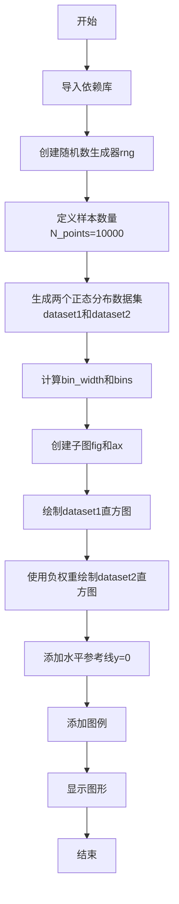

## 类结构

```
无类层次结构（脚本文件）
```

## 全局变量及字段


### `rng`
    
随机数生成器对象（虽然创建但未使用）

类型：`numpy.random.Generator`
    


### `N_points`
    
样本点数量（10000）

类型：`int`
    


### `dataset1`
    
第一个正态分布数据集（均值0，标准差1）

类型：`numpy.ndarray`
    


### `dataset2`
    
第二个正态分布数据集（均值1，标准差2）

类型：`numpy.ndarray`
    


### `bin_width`
    
直方图bin宽度（0.25）

类型：`float`
    


### `bins`
    
直方图的边界数组

类型：`numpy.ndarray`
    


### `fig`
    
图形对象

类型：`matplotlib.figure.Figure`
    


### `ax`
    
坐标轴对象

类型：`matplotlib.axes.Axes`
    


    

## 全局函数及方法


### `np.random.default_rng`

创建并返回一个具有指定种子的 NumPy 随机数生成器实例，用于生成可重现的随机数序列。

参数：

-  `seed`：`int` 或 `None`，随机数生成器的种子值。如果提供相同的种子值，则每次调用都会生成相同的随机数序列，确保结果可重现。

返回值：`numpy.random.Generator`，返回一个 NumPy 随机数生成器对象，可用于生成各种分布的随机数。

#### 流程图

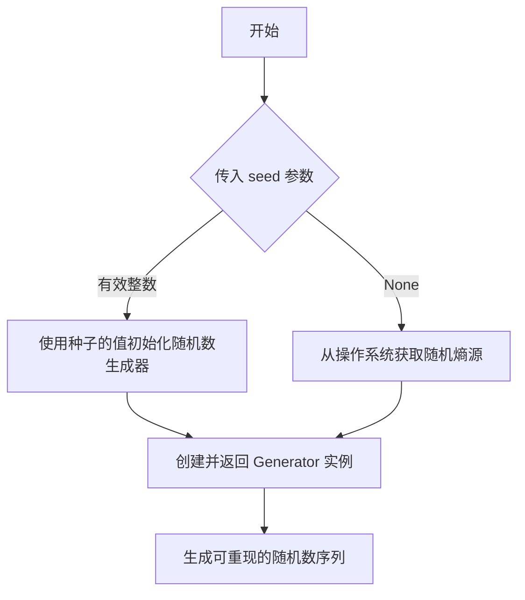

#### 带注释源码

```python
# 创建具有固定种子的随机数生成器，确保结果可重现
rng = np.random.default_rng(19680801)

# 源码解析：
# np.random.default_rng(seed=None, version=2)
#
# 参数:
#   seed: 整数或None，用于初始化随机数生成器的种子
#          - 如果是整数，使用该值作为种子
#          - 如果是None，从操作系统获取随机熵
#   version: 整数，默认为2，指定随机数生成算法的版本
#
# 返回值:
#   numpy.random.Generator 对象
#
# 使用方式:
#   rng.random()          # 生成 [0, 1) 范围内的随机浮点数
#   rng.normal(0, 1)      # 生成正态分布随机数
#   rng.integers(0, 100) # 生成指定范围内的整数
#
# 注意: 这是 NumPy 1.17+ 推荐的新随机数生成API
#       旧的 np.random.xx 系列函数将在未来版本中被废弃
```

#### 示例代码解析

```python
# 在提供的代码中的实际使用
rng = np.random.default_rng(19680801)

# 这行代码的作用:
# 1. 传入种子值 19680801
# 2. 创建一个 Generator 实例，种子固定为 19680801
# 3. 该生成器将产生确定性的随机数序列
# 4. 后续使用 rng 生成的随机数在每次运行程序时都是相同的
```

#### 关键特性说明

| 特性 | 描述 |
|------|------|
| 可重现性 | 相同种子产生相同的随机数序列 |
| 线程安全 | 新版 Generator 是线程安全的 |
| 性能 | 比旧版 Mersenne Twister 更快 |
| 算法 | 默认使用 PCG64 算法 |

#### 技术债务与优化建议

- **当前状态**: 该代码正确使用了新版 NumPy 随机数生成 API
- **潜在问题**: 如果在代码中混用 `np.random.default_rng()` 和旧的 `np.random.xxx()` 函数，可能导致随机数序列不可预测
- **优化建议**: 
  1. 统一使用 `rng` 对象进行所有随机数生成操作
  2. 避免在代码中同时使用旧版 `np.random` 函数
  3. 考虑将 `rng` 作为参数传递给需要随机数的函数，提高代码可测试性


### `np.random.normal`

生成符合正态（高斯）分布的随机数。该函数接受均值（loc）、标准差（scale）和输出形状（size）作为参数，返回服从指定正态分布的随机数数组或单个值。

参数：

- `loc`：`float`，正态分布的均值（中心位置），对应分布的中心点
- `scale`：`float`，正态分布的标准差（散布程度），必须为非负值
- `size`：`int` 或 `tuple of ints`，可选参数，指定输出数组的形状；若为 `None`，则返回单个浮点数

返回值：`ndarray` 或 `float`，返回服从参数指定的正态分布的随机数，形状由 `size` 参数决定

#### 流程图

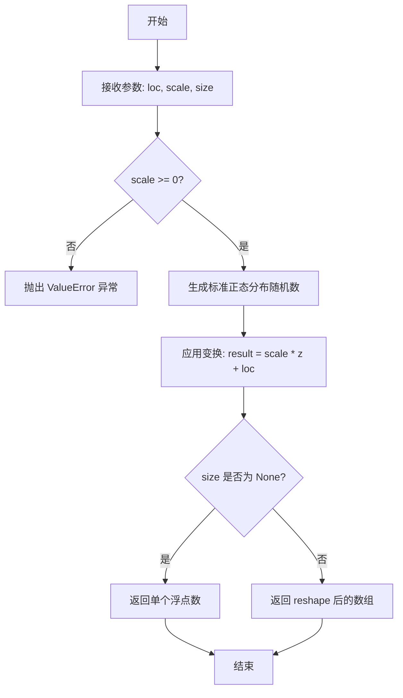

#### 带注释源码

```python
# numpy.random.normal 函数原型及核心实现逻辑

# 函数签名
# def normal(loc=0.0, scale=1.0, size=None):

# 参数说明:
#   - loc: float, 正态分布的均值 μ，决定分布的中心位置
#   - scale: float, 正态分布的标准差 σ，决定分布的宽度（必须 >= 0）
#   - size: int or tuple of ints, 输出形状，默认为 None 返回单个值

# 核心实现步骤:
# 1. 内部调用 random generator 的 normal 方法
# 2. 使用 Box-Muller 变换或类似算法生成标准正态分布随机数
# 3. 对生成的随机数进行仿射变换: y = scale * x + loc
# 4. 根据 size 参数确定输出形状并返回结果

# 示例用法（来自代码中）:
# dataset1 = np.random.normal(0, 1, size=N_points)  
#   # 生成 10000 个均值=0, 标准差=1 的正态分布随机数
# dataset2 = np.random.normal(1, 2, size=N_points)  
#   # 生成 10000 个均值=1, 标准差=2 的正态分布随机数
```


### `np.arange`

创建等差数组（arange是"array range"的缩写），返回一个基于数值范围的连续数组，类似于Python内置的range函数，但返回的是NumPy数组。

参数：

- `start`：`number`，起始值（包含），默认为0
- `stop`：`number`，结束值（不包含）
- `step`：`number`，步长（两个相邻值之间的差值）

返回值：`numpy.ndarray`，一个一维的等差数组

#### 流程图

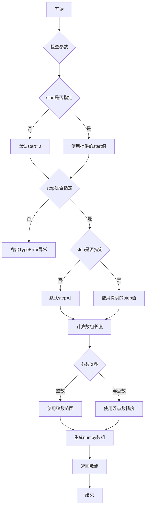

#### 带注释源码

```python
def arange(start=0, stop=None, step=1, dtype=None):
    """
    返回等差数组。
    
    参数:
        start: 起始值，默认为0
        stop: 结束值（不包含）
        step: 步长，默认为1
        dtype: 输出数组的数据类型
        
    返回:
        数组值: array([start, start+step, start+2*step, ...])
    """
    # 1. 参数预处理
    if stop is None:
        # 当只提供一个参数时，它被视为stop值，start默认为0
        start, stop = 0, start
    
    # 2. 计算数组长度
    # 使用公式: num = max(0, ceil((stop - start) / step))
    # 这确保了数组不会超出指定的范围
    num = operator.length_hint(stop, 0)
    if step == 0:
        raise ValueError("step cannot be zero")
    
    # 3. 使用Python的range函数生成索引
    # 然后通过加法生成实际的数组值
    # arr = start + range(0, num, 1) * step
    # 即: [start, start+step, start+2*step, ...]
    
    # 4. 根据dtype参数创建最终数组
    # 如果未指定dtype，则根据输入参数推断
    
    return array(start + step * _np.arange(num), dtype=dtype)
```


### `np.min`

计算数组中的最小值。

参数：

-  `a`：`array_like`，输入数组或可以转换为数组的对象
-  `axis`：`int`，可选，指定计算最小值的轴
-  `out`：`ndarray`，可选，指定结果存放的位置
-  `keepdims`：`bool`，可选，如果为True，则减少的轴保留在结果中作为维度为1的维度

返回值：

-  `ndarray` 或 标量，返回输入数组的最小值。如果指定了轴，则返回沿该轴的最小值。

#### 流程图

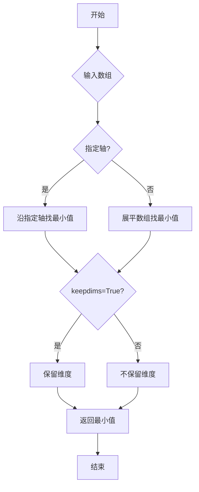

#### 带注释源码

```python
# np.min 函数使用示例（基于代码中的实际调用）
# 找到两个数据集中的最小值

# 使用np.min找到两个数据集中的最小边界
min_val = np.min([dataset1, dataset2])

# 等价于:
# min_val = np.min(dataset1) 如果 dataset1 的最小值小于 dataset2
# min_val = np.min(dataset2) 如果 dataset2 的最小值小于 dataset1

# 在代码中的实际使用:
# bins = np.arange(np.min([dataset1, dataset2]),
#                  np.max([dataset1, dataset2]) + bin_width, bin_width)
# 这里 np.min([dataset1, dataset2]) 用于获取两个数据集中的最小值
# 作为直方图 bins 的起始边界

# 示例调用：
# dataset1 = [值1, 值2, ...]  # 约10000个正态分布数据
# dataset2 = [值1, 值2, ...]  # 约10000个正态分布数据
# np.min([dataset1, dataset2]) 返回两个数据集中所有值的最小值
```


### `np.max`

计算给定数组或数组列表中的最大值，返回一个标量值。

参数：

-  `array`：`array_like`，输入的数组或数组列表，可以是列表、元组或 numpy 数组

返回值：`dtype`，输入数组中的最大值，类型与输入数组的数据类型相同

#### 流程图

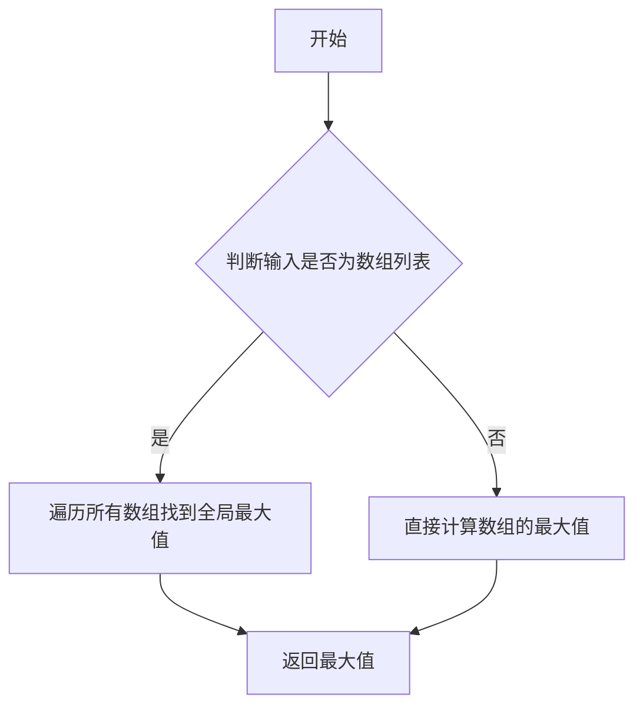

#### 带注释源码

```python
# 在代码中用于确定直方图 bins 的范围
# 获取两个数据集中的最大值，用于计算 bins 的上界
bins = np.arange(np.min([dataset1, dataset2]),
                np.max([dataset1, dataset2]) + bin_width, bin_width)
# np.max([dataset1, dataset2]) 返回两个数据集中的最大数值
```


### `np.ones_like`

该函数用于创建一个与输入数组形状和数据类型相同的全1数组，常用于需要与原数组结构一致的全1初始化场景。

参数：

-  `array`：`numpy.ndarray`，输入的数组，用于确定输出数组的形状和数据类型

返回值：`numpy.ndarray`，返回与输入数组形状相同的全1数组

#### 流程图

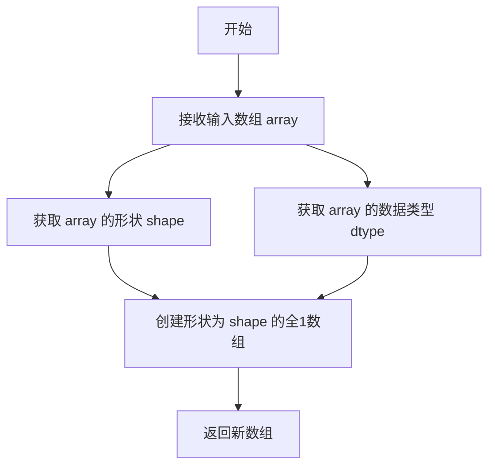

#### 带注释源码

```python
# np.ones_like(dataset2) 的使用示例
# 创建一个与 dataset2 形状相同的全1数组
# 用于在 histgram 中作为 weights 参数，使第二个直方图向下翻转

# dataset2: 原始数据数组，形状为 (10000,)
weights = -np.ones_like(dataset2)  # 返回形状为 (10000,) 的全1数组，取负值作为权重
# 结果: array([-1., -1., -1., ..., -1.])
```

#### 关键组件信息

- **matplotlib.pyplot**：用于创建图形和绑图
- **numpy**：用于数值计算和数组操作
- **np.random.default_rng**：随机数生成器，确保可重复性
- **ax.hist()**：绘制直方图的方法，支持 weights 参数控制柱状图方向

#### 潜在的技术债务或优化空间

1. **魔法数字**：代码中使用了硬编码的种子值 `19680801`、`N_points = 10_000`、`bin_width = 0.25`，建议提取为配置常量
2. **重复计算**：`np.min([dataset1, dataset2])` 和 `np.max([dataset1, dataset2])` 可以预先计算一次
3. **缺少类型注解**：建议添加 Python 类型提示以提高代码可读性
4. **注释可以更详细**：每个步骤的目的可以更清晰地说明

#### 其它项目

**设计目标与约束**：
- 目标是展示如何使用 matplotlib 创建双向直方图（bihistogram）
- 约束：使用固定随机种子确保结果可重复

**错误处理与异常设计**：
- 当前代码未包含显式的错误处理
- 潜在错误：空数组输入、形状不匹配等

**数据流与状态机**：
- 数据流程：生成随机数 → 计算bins → 绘制两个直方图 → 显示图形
- 状态：数据生成 → 数据处理 → 可视化渲染

**外部依赖与接口契约**：
- 依赖：matplotlib、numpy
- 接口：`ax.hist()` 接收 data、bins、label、weights 参数


### `plt.subplots()`

`plt.subplots()` 是 Matplotlib 库中的一个函数，用于创建一个新的图表（Figure）以及一个或多个子图（Axes），并返回图形对象和坐标轴对象的元组，是创建多子图布局的常用方法。

参数：

- `nrows`：`int`，默认值 1，表示子图的行数
- `ncols`：`int`，默认值 1，表示子图的列数
- `figsize`：`tuple`，可选，指定图表的宽度和高度（以英寸为单位），格式为 (宽度, 高度)
- `sharex`：`bool` 或 `str`，可选，如果为 True，所有子图共享 x 轴；如果为 'col'，每列子图共享 x 轴
- `sharey`：`bool` 或 `str`，可选，如果为 True，所有子图共享 y 轴；如果为 'row'，每行子图共享 y 轴
- `squeeze`：`bool`，可选，如果为 True，且只创建一个子图时，返回单一 Axes 对象而非数组
- `width_ratios`：`array-like`，可选，定义每列子图的宽度比例
- `height_ratios`：`array-like`，可选，定义每行子图的高度比例
- `gridspec_kw`：`dict`，可选，传递给 GridSpec 的关键字参数，用于更高级的网格布局配置

返回值：`tuple`，返回 (Figure, Axes) 或 (Figure, ndarray of Axes) 的元组，其中第一个元素是图形对象，第二个元素是坐标轴对象或坐标轴数组。

#### 流程图

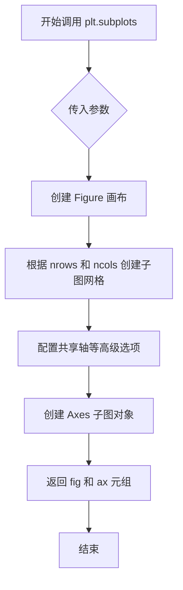

#### 带注释源码

```python
# 调用 plt.subplots() 函数创建子图
# 源码位置：matplotlib.pyplot.subplots

fig, ax = plt.subplots()

# 等价于执行以下步骤：
# 1. fig = plt.figure()  # 创建画布
# 2. ax = fig.subplots()  # 创建子图（默认 1 行 1 列）
# 
# 参数说明：
# - 不传参数时，默认创建 1 行 1 列的单一子图
# - 传入 nrows=2, ncols=2 可创建 2x2 的子图网格
# - figsize=(width, height) 设置画布大小（英寸）
# 
# 返回值：
# - fig: matplotlib.figure.Figure 对象，整个画布
# - ax: matplotlib.axes.Axes 对象（单子图时）或 numpy.ndarray（多子图时）
#
# 示例用法：
# fig, ax = plt.subplots(nrows=2, ncols=2, figsize=(10, 6))
# ax[0, 0].plot([1, 2, 3], [1, 2, 3])  # 访问左上角子图
```


### `ax.hist`

`ax.hist` 是 Matplotlib 中 Axes 类的成员方法，用于绘制直方图。该方法接受数据数组、分箱边界、权重数组和标签等参数，将数据分成若干区间并以条形图的形式展示分布情况。通过设置负权重，可以实现上下翻转的bihistogram（双直方图）效果。

参数：

-  `data`：`numpy.ndarray` 或类似数组型，要绘制直方图的数据数组
-  `bins`：`int`、`float` 或 `sequence`，直方图的分组边界，可以是箱的数量、箱宽或边界序列
-  `weights`：`numpy.ndarray` 或 `None`，可选参数，每个数据点的权重，用于加权直方图；设为负值可使直方图向下翻转
-  `label`：`str` 或 `None`，可选参数，图例中显示的标签名称

返回值：元组 `(n, bins, patches)`，其中 `n` 是每个箱中的计数或权重之和，`bins` 是箱的边界数组，`patches` 是表示条形图的艺术家对象列表

#### 流程图

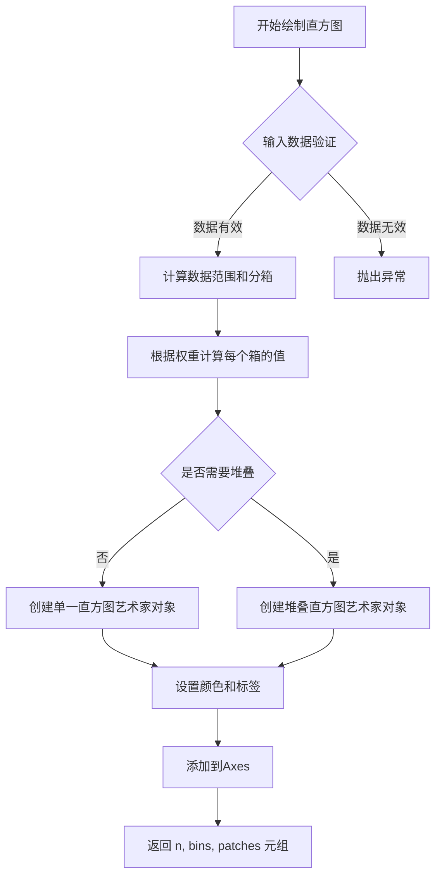

#### 带注释源码

```python
# 以下是 ax.hist 方法的典型调用方式（来自 Bihistogram 示例）

# 创建图形和坐标轴
fig, ax = plt.subplots()

# 绘制第一个直方图 - 正向显示
# data: 输入数据数组
# bins: 分箱边界数组
# label: 图例标签
ax.hist(dataset1, bins=bins, label="Dataset 1")

# 绘制第二个直方图 - 通过负权重实现向下翻转
# weights=-np.ones_like(dataset2): 将权重设为-1
# 这样计数在Y轴负方向显示，形成bihistogram效果
ax.hist(dataset2, weights=-np.ones_like(dataset2), bins=bins, label="Dataset 2")

# 添加水平参考线（Y=0）
ax.axhline(0, color="k")

# 添加图例
ax.legend()

# 显示图形
plt.show()
```

#### 完整方法签名（参考Matplotlib官方）

```python
def hist(self, x, bins=None, range=None, density=False, weights=None, 
         cumulative=False, bottom=None, histtype='bar', align='mid', 
         orientation='vertical', rwidth=None, log=False, color=None, 
         label=None, stacked=False, *, data=None, **kwargs):
    """
    Parameters
    ----------
    x : (n,) array or sequence of (n,) arrays
        Input values, this takes either a single array or a sequence of
        arrays (which are not required to be the same length).
    
    bins : int or array-like, default: :rc:`hist.bins`
        If *bins* is an integer, it defines the number of equal-width
        bins. However, in this case, the range is extended by .1%
        to include the min or max values. If *bins* is a sequence it
        defines the bin edges including the rightmost edge.
    
    weights : array-like, default: None
        An array of weights, of the same shape as *x*. Each value in *x*
        only contributes its associated weight towards the bin count
        (instead of 1). If *density* is True, the weights are normalized,
        so that the integral of the density over the range remains 1.
    
    label : str or None, default: None
        The label for this set of histograms. Legend will be drawn
        if any of the passed keys do not display zero or overlap.
    
    Returns
    -------
    n : array or list of arrays
        The values of the histogram bins. See *density* and *weights*.
    
    bins : array
        The edges of the bins. Length nbins + 1 (nbins left edges and
        right edge of last bin).
    
    patches : list or list of lists
        Silent list of individual patches used to create the histogram
        or list of such lists if multiple input datasets.
    """
```


### `Axes.axhline`

`axhline` 是 Matplotlib 中 Axes 类的成员方法，用于在图表的指定 y 坐标位置添加一条水平参考线，常用于标记零点、阈值或其他重要的数值基准线。

参数：

- `y`：`float`，水平参考线的 y 轴坐标（数据坐标），默认值为 0
- `xmin`：`float`，线条起始的相对位置（0 到 1 之间），默认值为 0
- `xmax`：`float`，线条结束的相对位置（0 到 1 之间），默认值为 1
- `**kwargs`：其他可选的关键字参数，用于指定线条样式，如 `color`（颜色）、`linestyle`（线型）、`linewidth`（线宽）等

返回值：`matplotlib.lines.Line2D`，返回创建的水平线对象，可用于后续修改线条属性

#### 流程图

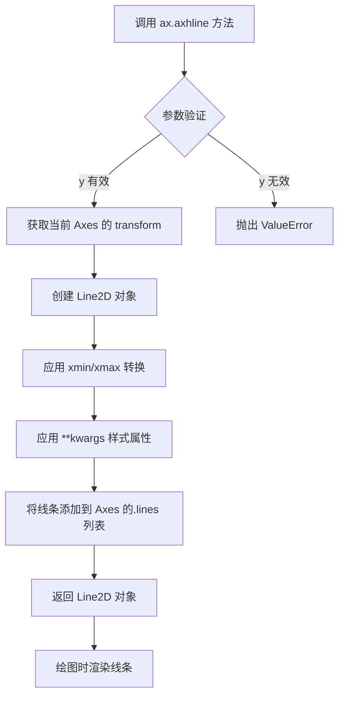

#### 带注释源码

```python
# 在给定的代码示例中的调用方式：
ax.axhline(0, color="k")

# 源码注释说明：
# ax          : Axes 对象，通过 plt.subplots() 或 fig.add_subplot() 创建
# .axhline()  : Axes 类的成员方法，用于添加水平参考线
# 第一个参数 0 : y 参数，表示水平线在 y=0 的位置（数据坐标）
# color="k"   : 关键字参数，设置线条颜色为黑色（k 代表 black）
#
# 完整方法签名（参考 Matplotlib 源码）：
# def axhline(self, y=0, xmin=0, xmax=1, **kwargs):
#     """
#     Add a horizontal line across the axis.
#
#     Parameters
#     ----------
#     y : float, default: 0
#         y position in data coordinates of the horizontal line
#     xmin : float, default: 0
#         Should be between 0 and 1, 0 being the far left axis, 1 the
#         far right axis.
#     xmax : float, default: 1
#         Should be between 0 and 1, 0 being the far left axis, 1 the
#         far right axis.
#     **kwargs
#         Valid keyword arguments are all those accepted by `.Line2D`
#
#     Returns
#     -------
#     line : `~matplotlib.lines.Line2D`
#         Horizontal line
#     """
```


### `ax.legend()`

显示图例，用于展示图表中各个数据集的标签和对应关系，帮助读者理解图中不同线条或条形的含义。

参数：

- `handles`：`list[Artist]`，可选，用于图例的艺术家对象列表（如线条、条形等）
- `labels`：`list[str]`，可选，与 handles 对应的标签文本列表
- `loc`：`str | tuple[float, float]`，可选，图例位置，如 `'upper right'`、``'best'` 等
- `bbox_to_anchor`：`tuple`，可选，定义图例锚点位置，用于精确控制图例放置
- `ncol`：`int`，可选，图例列数
- `prop`：`dict`，可选，字体属性字典
- `fontsize`：`int | str`，可选，字体大小
- `labelcolor`：`str | list`，可选，标签颜色
- `title`：`str`，可选，图例标题
- `title_fontsize`：`int`，可选，标题字体大小
- `frameon`：`bool`，可选，是否绘制图例边框
- `framealpha`：`float`，可选，边框透明度
- `edgecolor`：`str`，可选，边框颜色
- `facecolor`：`str`，可选，面填充颜色
- `fancybox`：`bool`，可选，是否使用圆角边框
- `shadow`：`bool`，可选，是否添加阴影

返回值：`matplotlib.legend.Legend`，返回创建的图例对象，可用于进一步自定义

#### 流程图

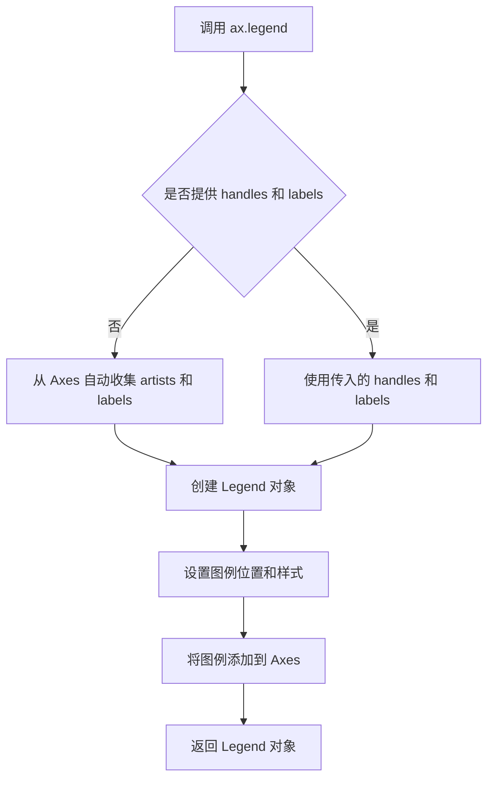

#### 带注释源码

```python
# 在 Matplotlib 中，ax.legend() 的简化实现逻辑

# 1. 调用 legend() 方法
ax.legend()

# 内部执行流程：
# - 获取当前 Axes 上所有带标签的艺术家对象（Line2D、BarContainer 等）
# - 为每个艺术家提取其标签文本（label 参数）
# - 过滤掉 label 为 '_nolegend_' 的对象（用于隐藏某些元素）

# 示例：代码中使用了以下调用
ax.legend()

# 等同于：
# ax.legend(handles=None, labels=None)
# - handles: None → 自动从 ax.containers 和 ax.lines 收集
# - labels: None → 使用各对象自身的 label 属性

# 返回值是 Legend 对象，可用于进一步操作
legend_obj = ax.legend()
# 例如：legend_obj.set_title("图例标题")
```


### `plt.show()`

`plt.show()` 是 Matplotlib 库中的一个函数，用于显示一个或多个图形窗口。在本代码中，它被调用以展示生成的 bihistogram（二元直方图）图形。

参数：

- `*args`：可变位置参数，可选，用于传递额外的参数（通常不使用）
- `**kwargs`：可变关键字参数，可选，用于传递额外的关键字参数（通常不使用）

返回值：`None`，该函数无返回值，其主要作用是显示图形窗口并进入交互模式。

#### 流程图

```mermaid
flowchart TD
    A[调用 plt.show()] --> B{是否在交互式环境中?}
    B -->|是| C[更新所有打开的图形窗口]
    B -->|否| D[阻塞程序直到所有窗口关闭]
    C --> E[显示 bihistogram 图形]
    D --> E
    E --> F[进入事件循环等待用户交互]
```

#### 带注释源码

```python
fig, ax = plt.subplots()

# 绘制第一个直方图（正向）
ax.hist(dataset1, bins=bins, label="Dataset 1")

# 绘制第二个直方图
# 注意使用负权重，使直方图向下翻转，形成背靠背效果
ax.hist(dataset2, weights=-np.ones_like(dataset2), bins=bins, label="Dataset 2")

# 在 y=0 处绘制一条水平黑线，作为对称轴
ax.axhline(0, color="k")

# 添加图例，标识两个数据集
ax.legend()

# 显示最终的 bihistogram 图形
# 此函数会创建一个图形窗口并显示所有在 ax 上绘制的内容
plt.show()
```

#### 补充说明

- **设计目标**：`plt.show()` 的主要设计目标是为用户提供图形的可视化输出，使图形在屏幕上看得到
- **执行环境**：在 Jupyter Notebook 中可能需要使用 `%matplotlib inline` 或 `%matplotlib widget` 来正确显示图形
- **阻塞行为**：在非交互式后端（如默认的 Agg 后端）下，`plt.show()` 可能会立即返回；而在交互式后端（如 TkAgg、Qt5Agg）下，它会阻塞程序直到用户关闭图形窗口
- **推荐做法**：在脚本中通常在最后调用一次 `plt.show()`，而不是多次调用


## 关键组件


### 数据生成模块

使用 numpy 生成两个正态分布的数据集，为双直方图提供对比数据源

### 直方图参数计算

根据两个数据集的最小值和最大值动态计算 bin 宽度和边界，确保两个直方图使用统一的分箱

### 双直方图绘制核心

通过为第二个直方图设置负权重（weights=-np.ones_like(dataset2)），实现直方图向下翻转的视觉效果，形成上下对称的双直方图

### 图形美化组件

添加水平参考线（ax.axhline(0, color="k")）区分正负区域，配合图例（ax.legend()）和标签实现清晰的数据可视化

### 随机数生成器

使用固定种子（19680801）的随机数生成器确保结果可复现


## 问题及建议


### 已知问题

-   **未使用的导入**：导入了`matplotlib.pyplot as plt`，但代码中实际未使用（后续使用`plt.show()`时plt已被释放）；`numpy`被正确使用。
-   **未使用的变量**：创建了`rng = np.random.default_rng(19680801)`用于生成随机数，但后续数据生成时使用的是`np.random.normal()`，未使用该rng对象。
-   **不一致的随机数API**：代码注释提到"Use a random number generator with a fixed seed"，但数据生成使用了旧版`np.random.normal()`而非rng对象，导致可复现性依赖于全局状态。
-   **魔法数字**：数据点数量`N_points = 10_000`和`bin_width = 0.25`硬编码在代码中，缺乏可配置性。
-   **weights参数优化空间**：使用`-np.ones_like(dataset2)`生成负权重，可以简化为`-1`或`-np.ones(len(dataset2))`，增加可读性。
-   **缺少类型注解和文档**：函数和方法缺少类型提示（type hints），模块级函数缺乏详细的docstring说明参数和返回值。

### 优化建议

-   **移除未使用的导入**：删除`import matplotlib.pyplot as plt`，或者使用`plt.subplots()`的返回值并保持引用。
-   **统一随机数生成**：使用已创建的`rng`对象生成数据，例如`dataset1 = rng.normal(0, 1, size=N_points)`，提高代码一致性和可维护性。
-   **提取配置常量**：将`N_points`和`bin_width`等配置参数提取到文件顶部常量区域或作为函数参数，提高可配置性。
-   **简化负权重表达式**：将`weights=-np.ones_like(dataset2)`改为`weights=-np.ones(len(dataset2))`或`weights=-1`，减少不必要的数组创建操作。
-   **添加类型注解**：为函数参数和返回值添加类型提示，如`def plot_bihistogram(n_points: int = 10000, bin_width: float = 0.25) -> None:`。
-   **封装为可复用函数**：将绘图逻辑封装成函数，接受数据集和配置参数，增强代码的可测试性和可复用性。
-   **优化bins计算**：使用`numpy.ptp()`（peak-to-peak）计算数据范围，简化`np.min([dataset1, dataset2])`和`np.max()`的调用。


## 其它


### 设计目标与约束

本代码的核心目标是演示如何使用Matplotlib绘制双直方图（Bihistogram），即在同一个坐标系中展示两个数据集的分布差异，其中一个直方图向上展示，另一个通过负权重技术向下翻转展示。设计约束包括：依赖Matplotlib和NumPy两个外部库，需要Python 3.x运行环境，无GUI环境时需使用非交互式后端。

### 错误处理与异常设计

代码未实现显式的错误处理机制。潜在的异常场景包括：数据为空时Matplotlib会抛出警告；bin_width为0或负值时会导致np.arange产生空数组或无限循环；数据集包含NaN或Inf值时会影响直方图计算；内存不足时可能抛出MemoryError。建议添加数据验证逻辑，检查数据有效性、bin_width的合理性，并设置异常捕获机制。

### 数据流与状态机

数据流分为三个主要阶段：第一阶段是数据生成阶段，使用NumPy生成两个正态分布的随机数据集；第二阶段是bin计算阶段，根据数据集的min/max值和固定bin宽度计算bins数组；第三阶段是绘图阶段，分别绘制两个直方图并添加水平线（图例基线）和图例。状态机相对简单，主要经历"初始化→数据生成→绑计算→绘图→显示"的线性流程。

### 外部依赖与接口契约

代码依赖两个外部库：matplotlib.pyplot（提供绘图API）和numpy（提供数值计算和随机数生成功能）。所有函数调用均符合这些库的公开接口约定。未定义任何可供外部模块调用的函数或类，脚本执行入口为顶层代码块。

### 性能考虑

当前实现对10_000个数据点的处理性能良好。对于更大规模数据集（如超过100万点），可以考虑：使用numpy.histogram预先计算直方图数据而非每次调用ax.hist；启用matplotlib的blitting技术加速动画渲染；考虑数据分箱策略减少bin数量。随机数生成使用np.random.default_rng是现代NumPy推荐的方式，性能优于旧API。

### 安全性考虑

代码不涉及用户输入、不存在SQL注入、命令注入等常见安全漏洞。固定随机种子（19680801）用于确保结果可复现，这在调试和测试场景中是良好实践，但在生产环境中可能需要动态种子。代码不涉及敏感数据处理或网络通信，安全性风险较低。

### 代码风格与规范

代码遵循Matplotlib官方示例的文档风格，使用Sphinx reStructuredText格式的文档字符串。导入顺序符合PEP 8规范（标准库→第三方库），变量命名使用snake_case，常量使用大写字母。注释使用# %%分隔代码块，便于Jupyter Notebook或IDE进行单元格划分。建议添加类型注解（type hints）以提升代码可读性和IDE支持。

### 测试策略

当前代码未包含单元测试。建议添加的测试内容包括：验证数据生成函数的输出形状和类型；验证bins数组的正确性（单调递增、包含边界值）；验证绘图函数调用不抛出异常；使用pytest fixture测试不同参数配置下的行为。由于涉及图形输出，可使用matplotlib.testing.decorators进行图像比对测试。

### 版本兼容性

代码使用Python 3语法，需要Python 3.7+（支持np.random.default_rng）。NumPy版本应>=1.17（引入default_rng），Matplotlib版本应>=3.1（支持hist的weights参数）。代码与Matplotlib 3.x系列完全兼容，需注意未来Matplotlib 4.x可能弃用的API（如plt.subplot返回值的兼容性）。

### 配置管理

关键配置参数包括：N_points（数据点数量）、bin_width（直方图bin宽度）、随机种子值19680801。这些参数目前硬编码在代码中，建议提取为模块级常量或配置文件，支持通过命令行参数或配置文件调整。当前固定seed有利于测试和演示，但生产环境可能需要动态生成。

### 可维护性分析

代码结构清晰、模块化程度较高，主要功能逻辑集中在一个脚本文件中。优点是易于理解和执行，缺点是难以复用绘图逻辑。重构建议：将数据生成、直方图配置、绘图逻辑分别封装为独立函数；将可调整参数通过函数参数或配置文件管理；添加详细的docstring说明各函数用途和参数含义。

    