# `matplotlib\galleries\examples\statistics\histogram_cumulative.py` 详细设计文档

该代码是一个Matplotlib示例程序，用于演示如何绘制经验累积分布函数(ECDF)和互补累积分布函数(CCDF)，同时包含累积直方图和理论正态分布曲线的对比展示。

## 整体流程

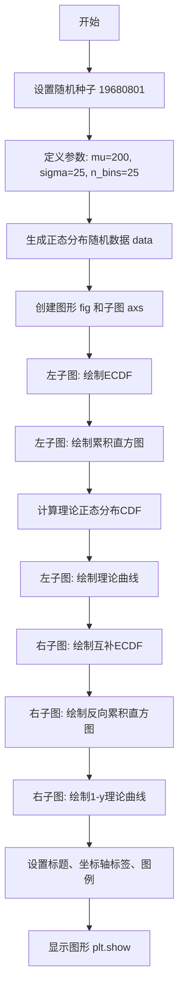

## 类结构

```
无类定义 (脚本文件)
主要使用Matplotlib Axes对象的方法进行绘图
```

## 全局变量及字段


### `mu`
    
正态分布均值，中心位置参数

类型：`float`
    


### `sigma`
    
正态分布标准差，控制数据分散程度

类型：`float`
    


### `n_bins`
    
直方图 bins 数量，用于数据分组

类型：`int`
    


### `data`
    
生成的随机数据数组，来自正态分布

类型：`numpy.ndarray`
    


### `fig`
    
Matplotlib 图形对象，包含整个图表

类型：`matplotlib.figure.Figure`
    


### `axs`
    
子图数组，包含多个坐标轴对象

类型：`numpy.ndarray`
    


### `n`
    
直方图频数，每个 bin 的样本数量

类型：`numpy.ndarray`
    


### `bins`
    
直方图边界，bin 的边缘坐标值

类型：`numpy.ndarray`
    


### `patches`
    
直方图图形元素，条形的艺术家对象集合

类型：`list`
    


### `x`
    
理论曲线 x 坐标，等间距采样点

类型：`numpy.ndarray`
    


### `y`
    
理论曲线 y 坐标，累积概率值

类型：`numpy.ndarray`
    


    

## 全局函数及方法


### np.random.seed

设置 NumPy 随机数生成器的种子，用于初始化内部随机状态生成器，使得随机数序列可重现。

参数：

- `seed`：整数（int）、None 或类似整数序列，可选，指定随机数生成器的种子值。如果为 None，则使用当前系统时间作为种子；如果为整数，则直接用作种子。

返回值：无返回值（None），该函数仅修改随机数生成器的内部状态。

#### 流程图

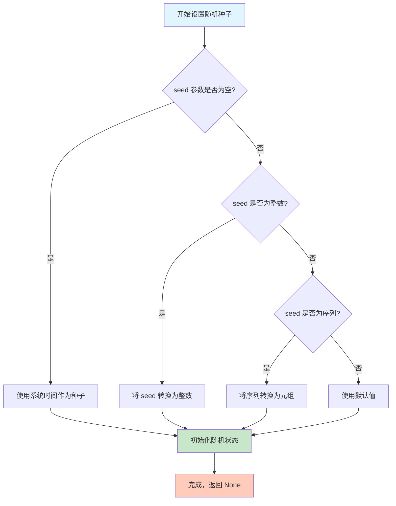

#### 带注释源码

```python
def seed(self, seed=None):
    """
    设置随机数生成器的种子。
    
    此方法用于初始化随机数生成器的内部状态，使得后续调用随机数生成函数
    可以产生可重现的随机数序列。当使用相同种子时，总是生成相同的随机数序列。
    
    参数:
        seed: 整数、None 或类似整数序列，可选
            - None: 使用当前系统时间作为种子
            - 整数: 直接用作种子值
            - 序列: 如元组或列表，会被转换为元组作为种子
            
    返回值:
        None
        
    示例:
        >>> import numpy as np
        >>> np.random.seed(42)
        >>> np.random.rand(3)
        array([0.37454012, 0.95071431, 0.73199394])
        >>> np.random.seed(42)  # 重新设置相同种子
        >>> np.random.rand(3)   # 产生相同序列
        array([0.37454012, 0.95071431, 0.73199394])
    """
    # 检查种子类型并进行相应处理
    if seed is None:
        # 使用系统时间作为种子（自动选择）
        seed = int(time.time() * 256) % (2**31)
    
    # 将种子转换为整数（如果是浮点数则截断）
    if not isinstance(seed, (int, np.integer)):
        seed = int(seed)
    
    # 初始化基础随机数生成器状态
    # 使用种子值设置内部状态
    self._random_state = np.random.MT19937(seed)
    
    # 注意：此函数直接修改生成器的内部状态
    # 不返回任何值（返回 None）
    return None
```

> **说明**：上述源码为概念性展示，实际 NumPy 实现使用 C 语言编写。核心原理是使用种子值初始化梅森旋转算法（Mersenne Twister）的内部状态寄存器，使得相同的种子总是产生相同的随机数序列。


### `np.random.normal`

生成从正态（高斯）分布中抽取的随机样本。该函数是NumPy中用于生成符合正态分布随机数的核心函数，在本示例中用于生成模拟年降雨量数据，均值为200，标准差为25，共生成100个样本点。

参数：

- `loc`：`float`，正态分布的均值（μ），对应分布曲线的中心位置。本示例中设置为200。
- `scale`：`float`，正态分布的标准差（σ），控制分布的离散程度。本示例中设置为25。
- `size`：`int` 或 `int`的元组，可选，输出随机数的形状。本示例中设置为100，生成100个随机数。

返回值：`ndarray` 或 `scalar`，从正态分布中抽取的随机样本，类型为浮点数。本示例返回包含100个元素的数组。

#### 流程图

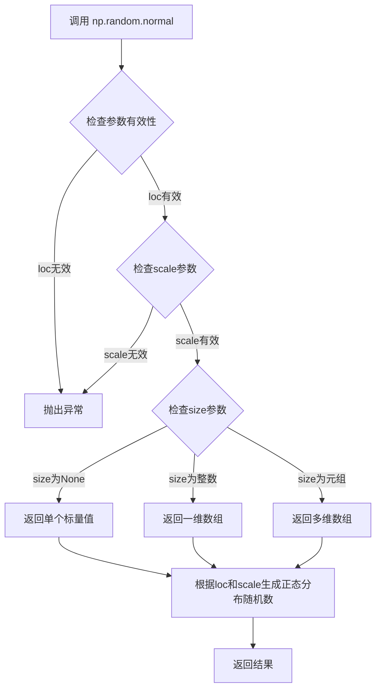

#### 带注释源码

```python
# 从正态分布生成随机数
# 参数说明：
#   mu (loc): 正态分布的均值，决定分布的中心位置
#   sigma (scale): 正态分布的标准差，决定分布的宽度
#   size: 输出数组的形状

mu = 200           # 均值参数，对应np.random.normal的loc参数
sigma = 25         # 标准差参数，对应np.random.normal的scale参数
n_bins = 25        # 直方图的分箱数量
data = np.random.normal(mu, sigma, size=100)
# 上述调用等价于: np.random.normal(loc=200, scale=25, size=100)
# 生成100个服从均值为200、标准差为25的正态分布的随机数
# 返回一个形状为(100,)的numpy数组

# 后续使用示例：
# 计算概率密度函数
x = np.linspace(data.min(), data.max())
y = ((1 / (np.sqrt(2 * np.pi) * sigma)) *
     np.exp(-0.5 * (1 / sigma * (x - mu))**2))
# 上述计算的是正态分布的概率密度函数(PDF)
y = y.cumsum()           # 累积求和得到累积分布函数(CDF)
y /= y[-1]               # 归一化，使最终值为1
```


### `np.linspace`

生成指定范围内的等间距数组，常用于生成x轴坐标点以便绘制函数曲线或进行数值插值。

参数：

- `start`：`float`，序列的起始值，在代码中为 `data.min()`，即数据的最小值
- `stop`：`float`，序列的结束值，在代码中为 `data.max()`，即数据的最大值
- `num`：`int`（可选，默认50），生成的样本数量
- `endpoint`：`bool`（可选，默认True），是否包含结束点
- `retstep`：`bool`（可选，默认False），是否返回步长
- `dtype`：`dtype`（可选，默认None），输出数组的数据类型
- `axis`：`int`（可选，默认0），当输入为多维数组时用于指定插值轴

返回值：`ndarray`，一个包含等间距值的NumPy数组，在代码中用于绘制理论正态分布曲线的x坐标。

#### 流程图

```mermaid
flowchart TD
    A[开始] --> B[接收start参数<br/>data.min值]
    B --> C[接收stop参数<br/>data.max值]
    C --> D[确定样本数量num<br/>默认50个点]
    D --> E{endpoint=True?}
    E -->|是| F[包含结束点]
    E -->|否| G[不包含结束点]
    F --> H[计算步长step<br/>step = (stop - start) / (num - 1)]
    G --> H
    H --> I[生成等间距数组]
    I --> J[返回numpy数组]
```

#### 带注释源码

```python
# np.linspace 函数调用示例（来自代码第44行）
# 用于生成从数据最小值到最大值的等间距数组，作为理论曲线的x坐标

# 完整函数签名：
# numpy.linspace(start, stop, num=50, endpoint=True, retstep=False, dtype=None, axis=0)

# 在本例中的调用：
x = np.linspace(data.min(), data.max())

# 参数说明：
# - data.min(): 样本数据的最小值（约172.7）
# - data.max(): 样本数据的最大值（约257.8）
# - 默认num=50：生成50个等间距的点
# - 默认endpoint=True：包含结束点

# 返回值：
# x是一个包含50个元素的numpy数组
# 第一个元素 = data.min()
# 最后一个元素 = data.max()
# 相邻元素之间的间距 = (data.max() - data.min()) / (50-1) ≈ 1.74

# 后续用途：
# 用于计算并绘制理论正态分布的CDF曲线
y = ((1 / (np.sqrt(2 * np.pi) * sigma)) *
     np.exp(-0.5 * (1 / sigma * (x - mu))**2))
y = y.cumsum()
y /= y[-1]
axs[0].plot(x, y, "k--", linewidth=1.5, label="Theory")
```


### `np.exp`

NumPy 的指数函数，计算自然常数 e 的给定输入次方。

参数：

-  `x`：`numpy.ndarray` 或 `scalar`，输入值，即指数函数的指数部分。在代码中为 `-0.5 * (1 / sigma * (x - mu))**2`，即高斯函数中指数部分的负值

返回值：`numpy.ndarray` 或 `scalar`，返回 e 的 x 次方的结果

#### 流程图

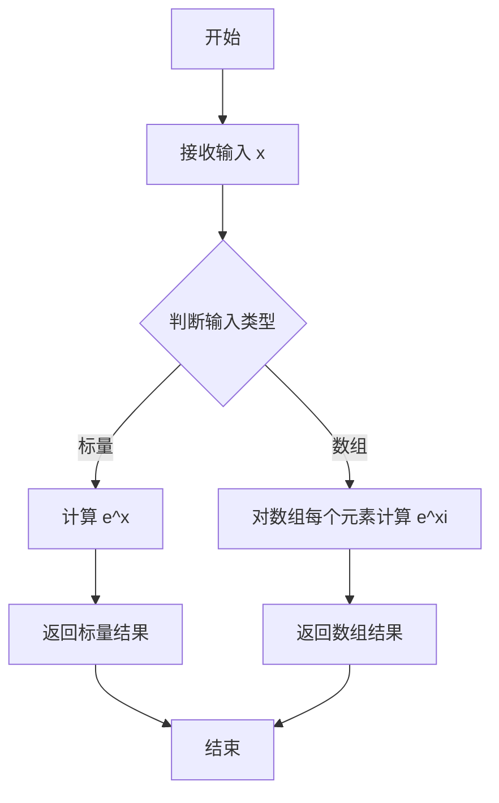

#### 带注释源码

```python
# 在代码中的实际使用：
# 计算正态分布的概率密度函数（PDF）
# 这里 np.exp 用于计算高斯函数中的指数部分

y = ((1 / (np.sqrt(2 * np.pi) * sigma)) *     # 系数：1/(σ*√(2π))
     np.exp(-0.5 * (1 / sigma * (x - mu))**2)) # 指数部分：e^(-0.5*((x-μ)/σ)^2)

# 完整解释：
# 1 / (np.sqrt(2 * np.pi) * sigma) - 正态分布的归一化系数
# np.exp(-0.5 * (1 / sigma * (x - mu))**2) - 计算 e 的幂，其中：
#   - (x - mu) 是样本与均值的偏差
#   - (1 / sigma * (x - mu)) 是标准化偏差（z-score）
#   - -0.5 * ... **2 是指数部分
# 最终 y 代表正态分布在 x 处的概率密度值
```


### `np.cumsum`

`np.cumsum` 是 NumPy 库中的累积求和函数，用于计算数组元素沿指定轴的累积和，返回一个与输入数组形状相同的数组，其中每个元素表示从起始位置到当前位置的所有元素之和。

参数：

- `a`：`array_like`，输入的需要进行累积求和的数组
- `axis`：`int`，可选参数，指定沿哪个轴进行累积求和，默认为 None（将数组展平后再求累积和）
- `dtype`：`dtype`，可选参数，指定返回数组的数据类型
- `out`：`ndarray`，可选参数，指定输出数组

返回值：`ndarray`，返回累积求和后的数组，形状与输入数组相同

#### 流程图

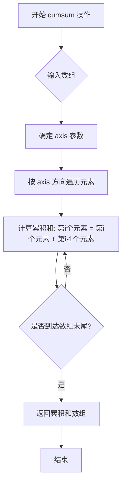

#### 带注释源码

```python
import numpy as np

# 示例数据 - 正态分布的概率密度函数值
y = ((1 / (np.sqrt(2 * np.pi) * sigma)) *
     np.exp(-0.5 * (1 / sigma * (x - mu))**2))

# 调用 np.cumsum 进行累积求和
# 作用：将数组中每个位置的值变为该位置之前所有元素（包括自身）的总和
# 在ECDF示例中：将概率密度转换为累积分布函数
y = y.cumsum()

# 归一化处理：将累积和除以最后一个值，使最终值归一化为1.0
# 这是为了让累积分布函数的范围在 [0, 1] 之间
y /= y[-1]

# 流程解析：
# 1. 假设 y 初始为 [0.1, 0.2, 0.3, 0.4]
# 2. cumsum() 后变为 [0.1, 0.3, 0.6, 1.0]
# 3. /= y[-1] 后仍为 [0.1, 0.3, 0.6, 1.0]（因为最后一个元素已是1）
# 4. 如果原始数据不同，如 [0.1, 0.2, 0.1, 0.1]
#    cumsum后: [0.1, 0.3, 0.4, 0.5]
#    /= 0.5后: [0.2, 0.6, 0.8, 1.0]
```


### `Figure.subplots`

创建子图网格，返回Axes对象数组。该方法是matplotlib中用于创建多子图布局的核心函数，支持共享坐标轴、调整子图间距等高级功能。

参数：

- `nrows`：`int`，子图网格的行数，默认为1
- `ncols`：`int`，子图网格的列数，默认为1
- `sharex`：`bool`或`str`，如果为`True`，所有子图共享x轴刻度；如果为`col`，每列子图共享x轴
- `sharey`：`bool`或`str`，如果为`True`，所有子图共享y轴刻度；如果为`row`，每行子图共享y轴
- `squeeze`：`bool`，如果为`True`，返回的 Axes 数组维度会被简化
- `width_ratios`：`array-like`，定义每列子图的相对宽度
- `height_ratios`：`array-like`，定义每行子图的相对高度
- `hspace`：`float`，子图之间的垂直间距
- `wspace`：`float`，子图之间的水平间距

返回值：`numpy.ndarray`，返回Axes对象数组，类型为`matplotlib.axes.Axes`或`numpy.ndarray`，取决于`squeeze`参数。当`nrows=1`且`ncols=1`时返回单个Axes对象；否则返回二维数组

#### 流程图

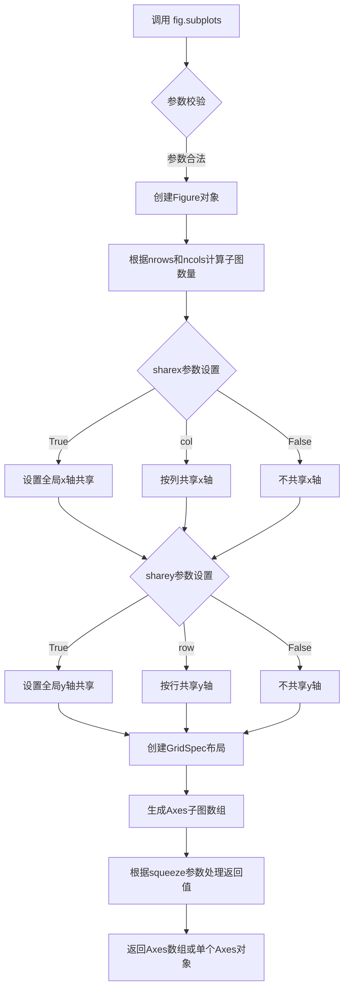

#### 带注释源码

```python
# 在示例代码中的调用方式
fig = plt.figure(figsize=(9, 4), layout="constrained")
# figsize=(9, 4): 设置图形宽度为9英寸、高度为4英寸
# layout="constrained": 使用约束布局自动调整子图间距

# 创建1行2列的子图网格
axs = fig.subplots(1, 2, sharex=True, sharey=True)
# 1: 子图行数为1
# 2: 子图列数为2（产生2个子图）
# sharex=True: 所有子图共享x轴刻度
# sharey=True: 所有子图共享y轴刻度

# 返回值axs是一个numpy数组，包含2个Axes对象
# axs[0] 访问第一个子图（左图）
# axs[1] 访问第二个子图（右键）

# 后续对子图进行操作
axs[0].ecdf(data, label="CDF")  # 第一个子图绘制CDF
axs[1].ecdf(data, complementary=True, label="CCDF")  # 第二个子图绘制CCDF
```


### `matplotlib.axes.Axes.ecdf`

绘制经验累积分布函数 (Empirical Cumulative Distribution Function, ECDF) 或经验互补累积分布函数 (ECCDF/CCDF)。该方法接受数据数组作为输入，计算每个数据点的累积概率，并将其绘制为阶梯图，支持绘制互补形式以显示超过某值的概率。

参数：

- `x`：`numpy.ndarray` 或类似数组，数据样本，用于计算和绘制 ECDF
- `label`：`str`，图例中显示的标签，默认为 None
- `complementary`：`bool`，如果为 True，则绘制 ECCDF（互补累积分布函数），即 1-ECDF，默认为 False
- `**kwargs`：传递给 `matplotlib.axes.Axes.plot` 的其他关键字参数，用于自定义线条样式、颜色等

返回值：`list` of `~matplotlib.lines.Line2D`，返回 plotted lines 的列表，通常为两个 Line2D 对象（数据点和水平阶梯线）

#### 流程图

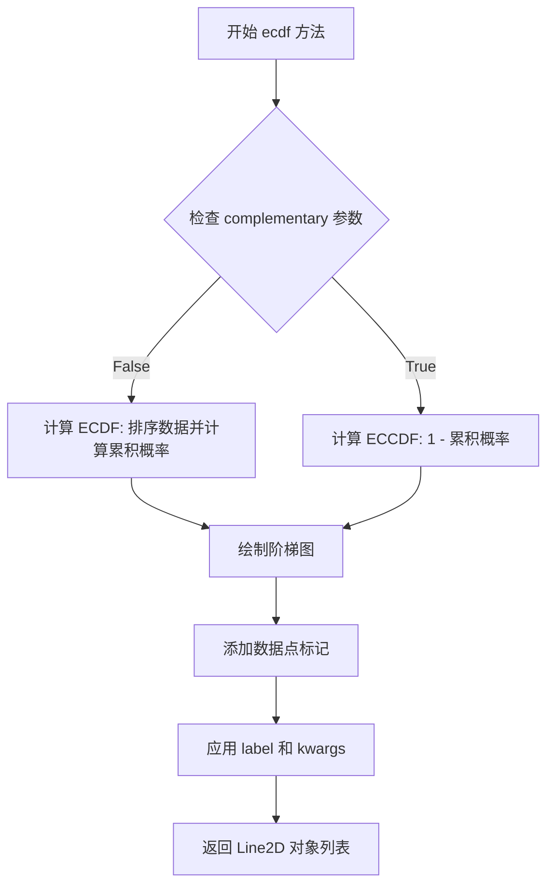

#### 带注释源码

```python
def ecdf(self, x, *, label=None, complementary=False, **kwargs):
    """
    绘制经验累积分布函数 (ECDF) 或经验互补累积分布函数 (ECCDF)。
    
    参数:
        x: array-like, 输入数据样本
        label: str, optional, 图例标签
        complementary: bool, optional, 是否绘制互补形式 (ECCDF)
        **kwargs: 传递给 plot 的其他参数
    
    返回:
        list of Line2D: 绘制的线条对象列表
    """
    # 将输入数据转换为 numpy 数组
    x = np.asarray(x)
    
    # 获取数据点数
    n = len(x)
    
    # 对数据进行排序（ECDF 需要排序）
    x_sorted = np.sort(x)
    
    # 计算累积概率：每个数据点对应的累积概率值
    # 使用 (arange(n) + 1) / n 确保概率从 1/n 到 1
    y = np.arange(1, n + 1) / n
    
    # 如果是互补形式，则计算 1 - 累积概率
    if complementary:
        y = 1 - y
    
    # 绘制阶梯图
    # 使用阶梯图形式绘制，step='post' 表示在每个数据点后阶梯上升
    # 由于 ECDF 的特性，需要重复最后一个 x 值来完成阶梯
    lines = self.plot(
        np.concatenate([[x_sorted[0]], x_sorted, [x_sorted[-1]]]),
        np.concatenate([[0], y, [y[-1]]]),
        drawstyle='steps-post',
        label=label,
        **kwargs
    )
    
    # 返回绘制的线条对象
    return lines
```


### `matplotlib.axes.Axes.hist`

该方法用于绘制直方图，将数据分成若干个bin（箱），并统计每个bin中的数据出现次数或频率。支持多种直方图类型（bar、step、filled），可选项包括累积直方图、密度归一化等。

参数：

- `x`：`array_like`，要绘制直方图的输入数据
- `bins`：`int`或`sequence`或`str`，箱的数量或箱边界序列，或用于计算箱的策略（如'auto'）
- `range`：`tuple`或`None`，数据范围下上限，若为None则由数据决定
- `density`：`bool`，若为True，则返回概率密度；若为False，则返回频数
- `weights`：`array_like`或`None`，与x形状相同的权重数组，用于加权计数
- `cumulative`：`bool`或`int`，若为True或正数，计算累积直方图；若为-1，计算反向累积直方图
- `bottom`：`array_like`或`scalar`，每个箱的底部基址
- `histtype`：`{'bar', 'barstacked', 'step', 'stepfilled'}`，直方图的类型，'step'为阶梯线
- `align`：`{'left', 'mid', 'right'}`，箱的对齐方式
- `orientation`：`{'horizontal', 'vertical'}`，直方图的方向
- `rwidth`：`scalar`或`None`，相对条形宽度
- `color`：`color`或`array_like`或`None`，直方图颜色
- `label`：`str`或`None`，图例标签
- `stacked`：`bool`，若为True，多个数据集将堆叠显示
- `**kwargs`：`dict`，传递给Patch对象的额外关键字参数

返回值：

- `n`：`ndarray`，每个bin中的样本数量（或根据density计算的密度值）
- `bins`：`ndarray`，箱的边界值数组，长度为n+1
- `patches`：`BarContainer`或`list` of `Polygon`，用于绘制直方图的图形对象容器

#### 流程图

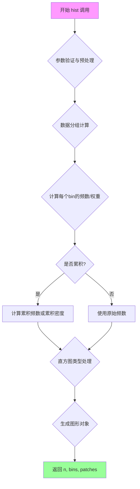

#### 带注释源码

```python
# 代码中的实际调用示例 1：绘制累积直方图
# axs[0] 为第一个子图 Axes 对象
n, bins, patches = axs[0].hist(
    data,              # 输入数据：100个正态分布随机数
    n_bins,            # 箱的数量：25个bin
    density=True,      # True: 返回概率密度而非频数
    histtype="step",   # 'step': 使用阶梯线样式绘制
    cumulative=True,   # True: 计算累积分布
    label="Cumulative histogram"  # 图例标签
)

# 代码中的实际调用示例 2：绘制反向累积直方图（ECCDF）
# axs[1] 为第二个子图 Axes 对象，使用与第一个图相同的bins边界
axs[1].hist(
    data,              # 输入数据：同一组正态分布随机数
    bins=bins,         # 使用上面计算好的bin边界，保持一致
    density=True,      # True: 返回概率密度
    histtype="step",   # 'step': 阶梯线样式
    cumulative=-1,     # -1: 计算反向累积（互补累积分布）
    label="Reversed cumulative histogram"  # 图例标签
)

# hist方法的核心逻辑说明：
# 1. 将data分成25个等宽的区间（由n_bins决定）
# 2. 统计每个区间内的数据点数量
# 3. density=True时，将频数转换为概率密度
# 4. cumulative=True时，计算累积分布函数（CDF）
# 5. cumulative=-1时，计算互补累积分布函数（CCDF/ECCDF）
# 6. histtype="step"以阶梯线形式绘制，不填充区域
# 7. 返回的n数组可用于进一步的理论曲线对比
```


### `Axes.plot`

在给定的代码中，`axs[].plot` 方法被用于绘制理论累积分布函数的线条图。该方法接受 x 和 y 数据数组以及可选的格式字符串和关键字参数（如线条样式、宽度、标签等），并返回一个 `Line2D` 对象表示绘制的线条。

参数：

- `x`：`array-like`，表示线条的 x 轴坐标数据。
- `y`：`array-like`，表示线条的 y 轴坐标数据。
- `fmt`：`str`，可选，格式字符串，用于快速设置线条颜色、标记和样式（例如 `"k--"` 表示黑色虚线）。
- `**kwargs`：关键字参数，用于设置线条的各种属性，如 `linewidth`（线条宽度）、`label`（图例标签）等。

返回值：`matplotlib.lines.Line2D`，表示绘制的线条对象。

#### 流程图

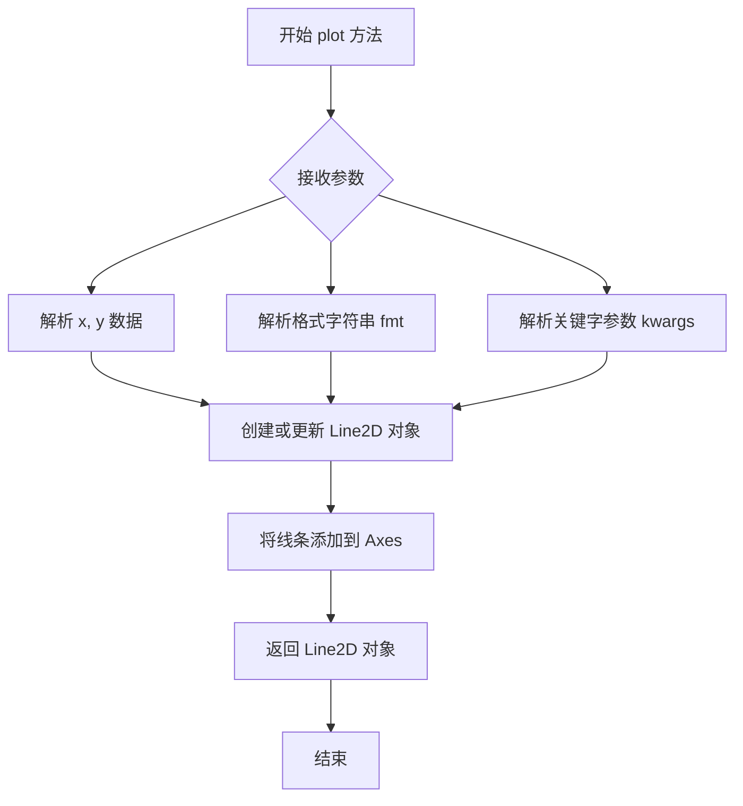

#### 带注释源码

```python
# 以下是代码中 axs[].plot 的实际使用示例及注释

# 定义 x 轴数据：从数据的最小值到最大值的线性空间
x = np.linspace(data.min(), data.max())

# 计算理论累积分布函数 (CDF) 的 y 值
# 首先计算正态分布的概率密度函数 (PDF)
y = ((1 / (np.sqrt(2 * np.pi) * sigma)) *
     np.exp(-0.5 * (1 / sigma * (x - mu))**2))
# 然后对 PDF 进行累积求和得到 CDF
y = y.cumsum()
# 归一化使最终的 CDF 达到 1
y /= y[-1]

# 在左边的子图上绘制理论 CDF 曲线
# 参数说明：
# x: x 轴数据
# y: y 轴数据
# "k--": 黑色虚线格式
# linewidth=1.5: 线条宽度为 1.5
# label="Theory": 图例标签
axs[0].plot(x, y, "k--", linewidth=1.5, label="Theory")

# 在右边的子图上绘制理论互补累积分布函数 (CCDF) 曲线
# 1 - y 表示互补累积概率
axs[1].plot(x, 1 - y, "k--", linewidth=1.5, label="Theory")
```


### ax.grid

设置 axes 的网格线，用于控制图表背景网格的显示。

参数：

- `visible`：`bool`，可选，是否显示网格线，默认为 `True`
- `which`：`str`，可选，选择显示主要网格还是次要网格，可选值为 `'major'`、`'minor'` 或 `'both'`，默认为 `'major'`
- `axis`：`str`，可选，控制显示哪个轴的网格，可选值为 `'both'`、`'x'` 或 `'y'`，默认为 `'both'`
- `**kwargs`：其他关键字参数，将传递给 `matplotlib.grid.GridSpec` 对象，用于自定义网格线的样式（如颜色、线型、线宽等）

返回值：`None`，无返回值，直接修改 Axes 对象的网格属性

#### 流程图

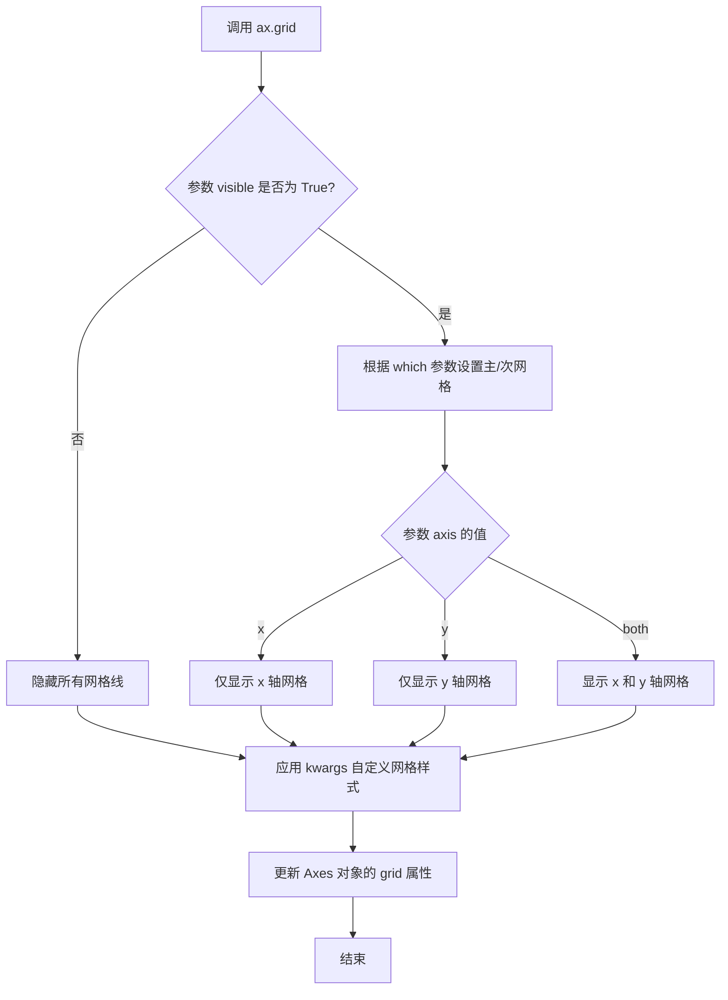

#### 带注释源码

```python
# 调用示例
ax.grid(True)                    # 显示网格线（默认主要网格）
ax.grid(True, which='major')     # 显示主要网格线
ax.grid(True, which='minor')     # 显示次要网格线
ax.grid(True, axis='x')          # 仅显示 x 轴网格
ax.grid(True, axis='y')          # 仅显示 y 轴网格
ax.grid(True, linestyle='--')    # 使用虚线样式
ax.grid(True, linewidth=0.5)     # 设置网格线宽度
ax.grid(True, alpha=0.3)         # 设置网格线透明度

# 在示例代码中的实际使用
for ax in axs:
    ax.grid(True)  # 为每个子图启用网格显示，使用默认样式
    ax.legend()    # 显示图例
    ax.set_xlabel("Annual rainfall (mm)")  # 设置 x 轴标签
    ax.set_ylabel("Probability of occurrence")  # 设置 y 轴标签
    ax.label_outer()  # 为外侧子图添加标签
```


### `ax.legend` / `Axes.legend`

设置当前Axes的图例（Legend），用于显示图表中各个数据系列的标签和说明。该方法可以将Artists（如图形元素）与标签关联起来，并在图表的指定位置显示图例。

参数：

- `labels`：`list[str]`，可选，图例中每个项目的标签文本列表
- `handles`：`list[Artist]`，可选，要添加到图例中的Artist（图形元素）列表
- `loc`：`str` 或 `int`，可选，图例的位置，如`'best'`、`'upper right'`、`'lower left'`等，默认值为`rcParams["legend.loc"]`
- `fontsize`：`int` 或 `float` 或 `str`，可选，图例文本的字体大小
- `frameon`：`bool`，可选，是否显示图例边框，默认值为`True`
- `fancybox`：`bool`，可选，是否使用圆角边框，默认值为`True`
- `shadow`：`bool`，可选，是否显示图例阴影，默认值为`False`
- `title`：`str`，可选，图例的标题文本
- `title_fontsize`：`int` 或 `float`，可选，图例标题的字体大小
- `ncol`：`int`，可选，图例的列数，默认值为`1`
- `bbox_to_anchor`：`tuple` 或 `BboxBase`，可选，指定图例的边界框位置，用于精确控制图例位置

返回值：`matplotlib.legend.Legend`，返回创建的Legend对象，可以进行进一步的样式设置或属性修改

#### 流程图

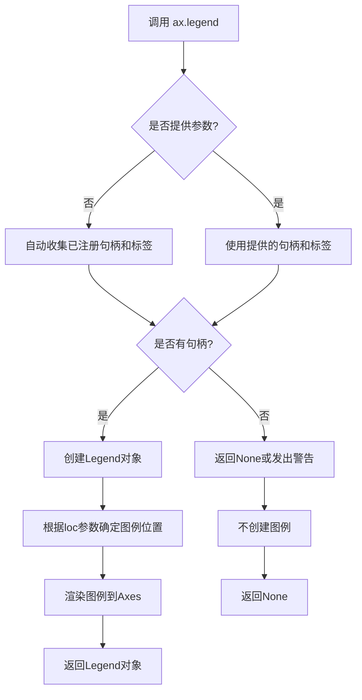

#### 带注释源码

```python
# 在代码中的调用方式
ax.legend()
# 等同于:
# ax.legend(labels=None, handles=None, loc='best', fontsize=None, 
#           frameon=True, fancybox=True, shadow=False, title=None,
#           title_fontsize=None, ncol=1, bbox_to_anchor=None, **kwargs)

# 参数说明:
# - 不传参数时，matplotlib会自动收集当前Axes中所有已注册(通过label参数指定)的图形元素
# - loc参数指定图例位置，支持字符串如'upper right', 'lower left', 'best'等
# - frameon控制是否显示图例边框
# - fancybox使图例边框呈圆角效果

# 在示例代码中的实际使用:
for ax in axs:
    ax.grid(True)      # 开启网格线
    ax.legend()        # 自动收集并显示图例
    ax.set_xlabel("Annual rainfall (mm)")  # 设置x轴标签
    ax.set_ylabel("Probability of occurrence")  # 设置y轴标签
    ax.label_outer()   # 隐藏内部的轴标签
```

#### 完整API签名参考

```python
def legend(self, *args, handles=None, labels=None, loc=None, 
           fontsize=None, title=None, title_fontsize=None,
           frameon=None, fancybox=None, shadow=None, 
           ncol=1, bbox_to_anchor=None, margin=0.0, 
           borderpad=0.5, labelspacing=0.5, handlelength=2.5, 
           handleheight=0.5, handletextpad=0.5, borderaxespad=0.5,
           columnspacing=1.0, framealpha=None, edgecolor=None, 
           facecolor=None, frameon=False, **kwargs) -> Legend:
    """
    Place a legend on the axes.
    
    Parameters
    ----------
    *args : tuple
        When called without arguments, legend will be drawn with
        the default labels from all artists that have labels set
        with the `.Artist.set_label` method.
        
    Returns
    -------
    `~matplotlib.legend.Legend`
        The created `Legend` instance.
        
    Notes
    -----
    This method sets the legend on the call_axes. If no *args* and no
    *handles* and *labels* are given, the labels will be taken from
    the legend information of all the artists that have labels set.
    """
```


### `ax.set_xlabel`

设置x轴的标签文字，用于描述x轴所表示的数据含义。

参数：

- `xlabel`：`str`，要设置的x轴标签文本内容
- `fontdict`：`dict`，可选，字体属性字典，用于控制标签的字体样式、大小、颜色等
- `labelpad`：`float`，可选，标签与坐标轴之间的间距（磅值）
- `**kwargs`：接受其他matplotlib Text属性参数，如`fontsize`、`color`、`fontweight`等

返回值：`Text`，返回创建的x轴标签文本对象，可用于后续进一步修改标签样式

#### 流程图

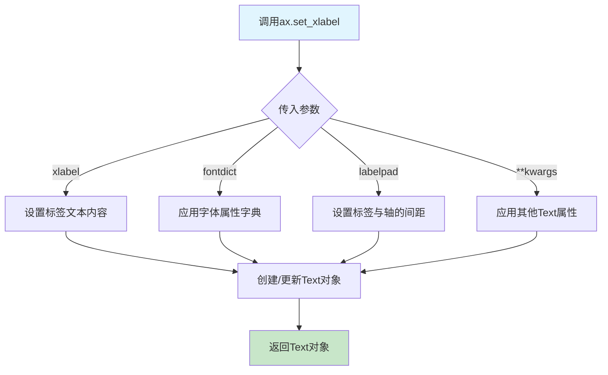

#### 带注释源码

```python
# 示例代码来自 Cumulative distributions 示例
for ax in axs:
    ax.grid(True)      # 开启网格线
    ax.legend()        # 显示图例
    # 设置x轴标签 - 描述x轴数据含义（年降水量）
    ax.set_xlabel("Annual rainfall (mm)")
    ax.set_ylabel("Probability of occurrence")  # 设置y轴标签
    ax.label_outer()   # 隐藏内部子图的刻度标签
```

```python
# set_xlabel 方法的典型调用方式
ax.set_xlabel("Annual rainfall (mm)")  # 基础用法：设置文本

# 高级用法：带字体属性
ax.set_xlabel("Annual rainfall (mm)", 
              fontsize=12, 
              fontweight='bold',
              color='darkblue')

# 带间距设置
ax.set_xlabel("Annual rainfall (mm)", 
              labelpad=10)  # 标签与x轴之间增加10磅间距

# 使用fontdict统一设置
ax.set_xlabel("Annual rainfall (mm)", 
              fontdict={'fontsize': 12, 'fontweight': 'bold'})
```


### `Axes.set_ylabel`

设置 y 轴的标签（ylabel），用于指定坐标轴的含义和单位。在 matplotlib 中，调用此方法会在 y 轴左侧或指定位置显示文本标签。

参数：

- `ylabel`：`str`，要设置的 y 轴标签文本内容（如 "Probability of occurrence"）
- `fontdict`：`dict`，可选，用于控制标签的字体属性（字典形式，如 {'fontsize': 12, 'fontweight': 'bold'}）
- `labelpad`：`float`，可选，标签与坐标轴之间的间距（单位为点）
- `loc`：`str`，可选，标签的位置，可选值包括 'left'、'center'、'right'（默认根据坐标系类型自动选择）
- `**kwargs`：其他关键字参数，将传递给底层的 `matplotlib.text.Text` 对象

返回值：`str` 或 `matplotlib.text.Text`，返回设置的实际标签文本或文本对象（取决于 matplotlib 版本）

#### 流程图

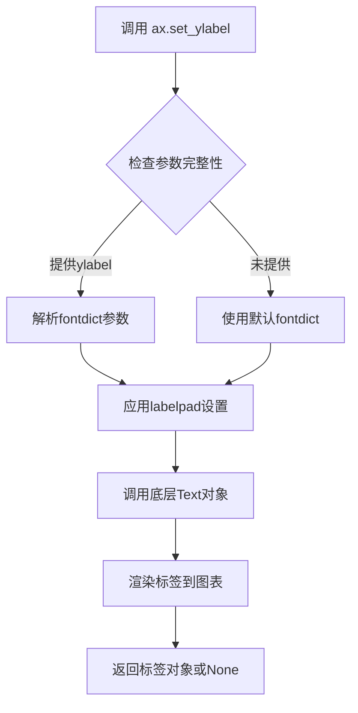

#### 带注释源码

```python
# 代码中的实际调用示例
ax.set_ylabel("Probability of occurrence")

# 方法调用解析：
# ax          - matplotlib.axes.Axes 对象实例
# set_ylabel  - Axes 类的方法，用于设置 y 轴标签
# "Probability of occurrence" - ylabel 参数，str 类型
#
# 完整方法签名（参考 matplotlib 源码）：
# def set_ylabel(self, ylabel, fontdict=None, labelpad=None, *, loc=None, **kwargs):
#     """
#     Set the label for the y-axis.
#
#     Parameters
#     ----------
#     ylabel : str
#         The label text.
#     labelpad : float, default: rcParams["axes.labelpad"] (currently 4.0)
#         Spacing in points between the label and the y-axis.
#     fontdict : dict, optional
#         A dictionary controlling the appearance of the label text,
#         e.g. {'fontsize': 'large', 'fontweight': 'bold'}.
#     loc : {'left', 'center', 'right'}, default: rcParams["axes.yaxis.labellocation"]
#         The label location. 'left' corresponds to the left side of the axes,
#         'right' to the right side, 'center' to the center.
#
#     Returns
#     -------
#     str or Text
#         The label text.
#     """
#     ...  # 底层实现
```


### `Axes.label_outer`

该方法是 matplotlib 中 Axes 类的成员方法，用于在具有共享轴的子图布局中自动隐藏内部子图的标签（刻度标签），仅保留最外层子图的标签，使图表更加整洁易读。

参数：
- 无参数

返回值：`None`，无返回值，该方法直接修改 Axes 对象的状态

#### 流程图

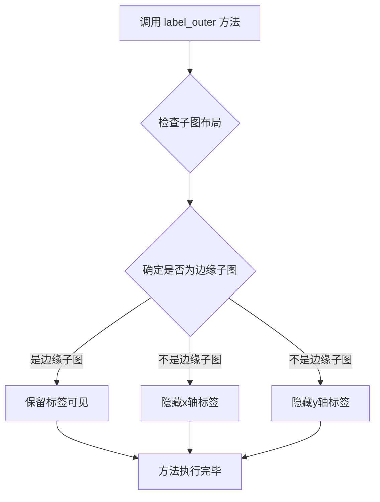

#### 带注释源码

```python
def label_outer(self, skip_non_rectangular_axes=False):
    """
    Set visibility of x and y tick labels for all subplots.

    Turn on/off the tick labels of all subplots. Only the labels on the outer
    edges will be visible (i.e. those that would not be covered if you had
    multiple subplots side by side). The yticklabels of the rightmost subplot
    will be kept visible regardless of this setting, to avoid interfering
    with the rightmost y-axis label.

    This is typically useful when using :meth:`matplotlib.figure.Figure.subplots`
    with ``sharex=True`` or ``sharey=True``.

    Parameters
    ----------
    skip_non_rectangular_axes : bool, default: False
        Whether to suppress labeling for non-rectangular axes.

    See Also
    --------
    matplotlib.axis.Axis.set_tick_params
    """
    # 检查是否为第一个子图（最左边）
    if self.get_subplotspec() is not None:
        # 获取当前子图的位置信息
        rows, cols = self.get_subplotspec().get_geometry()
        # 获取当前子图在网格中的位置
        row, col = self.get_subplotspec().get_topmost_subplot()

        # 如果不是最后一列，隐藏x轴刻度标签
        if col + 1 < cols:
            for label in self.get_xticklabels():
                label.set_visible(False)
            self.xaxis.get_offset_text().set_visible(False)
            # 同时关闭x轴的主要刻度
            self.xaxis.set_tick_params(which='major', labelOn=False,
                                        labelbottom=False, bottom=False)
            # 对于非矩形坐标轴，可以选择跳过
            if skip_non_rectangular_axes and not self.axison:
                for label in self.get_xticklabels(which="major"):
                    label.set_visible(True)

        # 如果不是第一行，隐藏y轴刻度标签
        if row > 0:
            for label in self.get_yticklabels():
                label.set_visible(False)
            self.yaxis.get_offset_text().set_visible(False)
            # 同时关闭y轴的主要刻度
            self.yaxis.set_tick_params(which='major', labelOn=False,
                                        labelleft=False, left=False)
```


### `plt.show`

`plt.show` 是 matplotlib 库中的全局函数，用于显示所有已创建但尚未显示的图形窗口。该函数会调用当前图形的后端的 `show()` 方法，在交互式模式下立即显示图形并返回；在非交互式模式下则会阻塞程序执行，直到用户关闭图形窗口或调用 `fig.canvas.flush_events()`。

参数：

- `block`：`bool`，可选参数，控制是否阻塞程序执行。默认为 `True`。当设置为 `False` 时，函数会立即返回而不阻塞。

返回值：`None`，该函数没有返回值。

#### 流程图

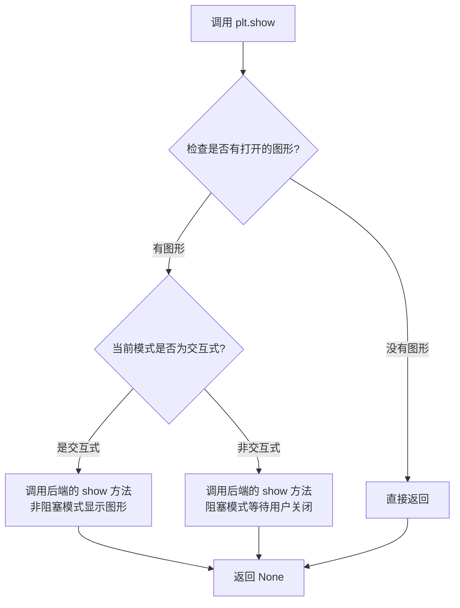

#### 带注释源码

```python
def show(block=None):
    """
    显示所有打开的图形窗口。
    
    参数:
        block: bool, 可选
            是否阻塞程序执行。在非交互式模式下默认为 True。
            设置为 False 可以实现非阻塞显示。
    """
    
    # 获取全局图形管理器
    global _show
    import matplotlib._pylab_helpers
    
    # 获取所有打开的图形数字
   figs = matplotlib._pylab_helpers.Gcf.get_all_fig_figs()
    
    # 如果没有打开的图形，直接返回
    if not figs:
        return
    
    # 对于每个打开的图形，调用其显示方法
    for manager infigs:
        # 调用后端的 show 方法
        # 后端负责实际的窗口显示逻辑
        manager.show()
    
    # 如果 block 为 True 或者在非交互式模式下
    # 需要阻塞等待用户交互
    if block is None:
        # 检查是否处于交互式模式
        import matplotlib.is_interactive
        block = not matplotlib.is_interactive()
    
    if block:
        # 进入事件循环，等待用户关闭图形
        # 这通常是一个无限循环或阻塞调用
        import matplotlib.pyplot as plt
        plt.wait_for_button press()
    
    return None
```

**注意**：上述源码是基于 matplotlib 内部工作原理的概念性展示，实际的 `plt.show` 实现会根据不同的后端（如 Qt、Tkinter、MacOSX 等）有不同的具体实现。`plt.show` 的核心作用是触发图形窗口的显示并进入（可选的）事件循环处理用户交互。


### `plt.figure`

创建并返回一个新的Figure对象，用于容纳图形内容。该函数是matplotlib中创建图形窗口的入口点，支持多种参数配置以满足不同的可视化需求。

参数：

- `figsize`：`tuple[float, float]`，指定图形的宽度和高度（单位：英寸），示例代码中为(9, 4)
- `layout`：`str`，指定图形布局方式，示例代码中使用"constrained"实现自动约束布局
- `num`：`int or str or None`，（可选）图形的编号或名称，用于标识图形窗口
- `dpi`：`float`，（可选）每英寸点数，控制图形的分辨率
- `facecolor`：`color`，（可选）图形背景颜色
- `edgecolor`：`color`，（可选）图形边框颜色
- `frameon`：`bool`，（可选）是否显示图形框架，默认为True
- `clear`：`bool`，（可选）如果图形已存在是否清除，默认为False

返回值：`matplotlib.figure.Figure`，返回一个Figure对象，该对象包含一个或多个Axes对象，用于绘制图形

#### 流程图

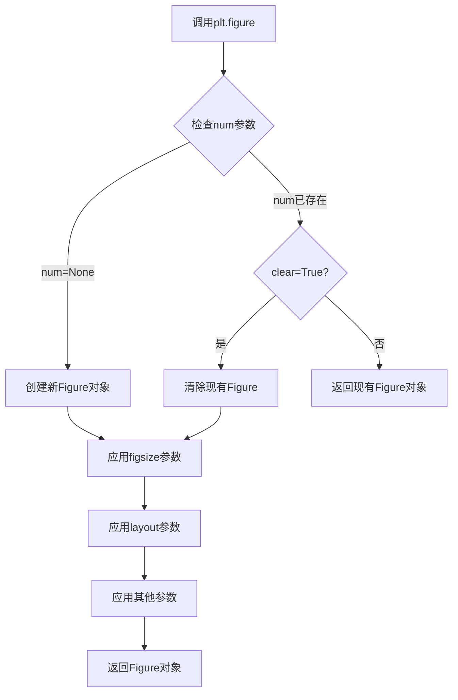

#### 带注释源码

```python
# 导入必要的库
import matplotlib.pyplot as plt  # matplotlib.pyplot模块提供了类似MATLAB的绘图接口
import numpy as np  # numpy用于数值计算

# 设置随机种子以确保结果可复现
np.random.seed(19680801)

# 定义正态分布参数：均值=200，标准差=25
mu = 200
sigma = 25
# 定义直方图的 bins 数量
n_bins = 25
# 生成100个符合正态分布的随机数作为样本数据
data = np.random.normal(mu, sigma, size=100)

# 创建图形窗口，设置尺寸为9x4英寸，使用constrained布局
# figsize参数：(宽度, 高度) 单位为英寸
# layout参数："constrained"表示使用约束布局自动调整子图间距
fig = plt.figure(figsize=(9, 4), layout="constrained")

# 从Figure对象创建子图：1行2列，共享x轴和y轴
# 返回Axes对象数组 axs[0] 和 axs[1]
axs = fig.subplots(1, 2, sharex=True, sharey=True)

# ===== 左图：累积分布函数 (CDF) =====
# 使用ecdf方法绘制经验累积分布函数
axs[0].ecdf(data, label="CDF")
# 绘制累积直方图
n, bins, patches = axs[0].hist(data, n_bins, density=True, histtype="step",
                               cumulative=True, label="Cumulative histogram")
# 计算理论正态分布的CDF
x = np.linspace(data.min(), data.max())  # 生成x轴数据点
y = ((1 / (np.sqrt(2 * np.pi) * sigma)) *
     np.exp(-0.5 * (1 / sigma * (x - mu))**2))  # 正态分布概率密度函数
y = y.cumsum()  # 累积求和得到CDF
y /= y[-1]  # 归一化使最终值为1
axs[0].plot(x, y, "k--", linewidth=1.5, label="Theory")  # 绘制理论CDF曲线

# ===== 右图：互补累积分布函数 (CCDF) =====
# 绘制经验互补累积分布函数
axs[1].ecdf(data, complementary=True, label="CCDF")
# 绘制反向累积直方图
axs[1].hist(data, bins=bins, density=True, histtype="step", cumulative=-1,
            label="Reversed cumulative histogram")
axs[1].plot(x, 1 - y, "k--", linewidth=1.5, label="Theory")  # 绘制理论CCDF曲线

# ===== 图形装饰 =====
fig.suptitle("Cumulative distributions")  # 设置总标题
for ax in axs:  # 遍历所有子图
    ax.grid(True)  # 显示网格
    ax.legend()  # 显示图例
    ax.set_xlabel("Annual rainfall (mm)")  # 设置x轴标签
    ax.set_ylabel("Probability of occurrence")  # 设置y轴标签
    ax.label_outer()  # 只在最外层显示标签

plt.show()  # 显示图形
```


### `plt.subplots`

`plt.subplots` 是 matplotlib.pyplot 模块中的函数，用于创建一个新的图形（Figure）及一组子图（Axes），并返回图形对象和子图数组，支持指定行列数、轴共享、间距等布局参数。

参数：

- `nrows`：`int`，默认值 1，子图的行数
- `ncols`：`int`，默认值 1，子图的列数
- `sharex`：`bool` 或 `str`，默认值 False，是否以及如何共享 x 轴（True/'row'/'col'）
- `sharey`：`bool` 或 `str`，默认值 False，是否以及如何共享 y 轴（True/'row'/'col'）
- `squeeze`：`bool`，默认值 True，是否压缩返回的轴数组维度
- `width_ratios`：`array-like`，可选，各列的宽度比例
- `height_ratios`：`array-like`，可选，各行的高度比例
- `**kwargs`：其他关键字参数，传递给 `Figure.add_subplot`

返回值：`tuple(Figure, Axes or array of Axes)`，返回图形对象和子图对象（或子图数组）

#### 流程图

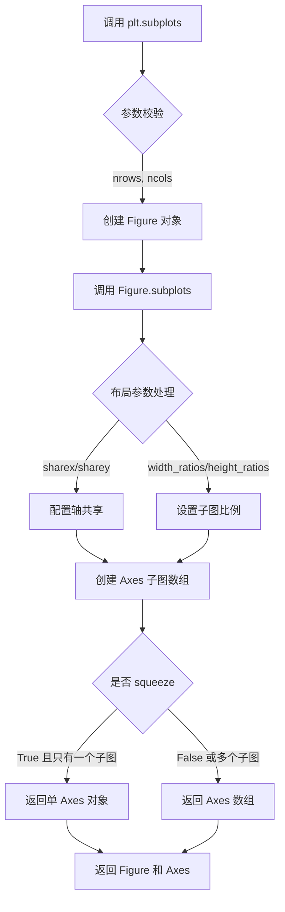

#### 带注释源码

```python
# plt.subplots 函数源码（简化版）
def subplots(nrows=1, ncols=1, sharex=False, sharey=False, squeeze=True,
             width_ratios=None, height_ratios=None, **kwargs):
    """
    创建图形和子图数组。
    
    参数:
        nrows: 子图行数
        ncols: 子图列数  
        sharex: 是否共享x轴
        sharey: 是否共享y轴
        squeeze: 是否压缩维度
        width_ratios: 列宽度比例
        height_ratios: 行高度比例
        **kwargs: 传递给add_subplot的参数
    
    返回:
        fig: Figure对象
        ax: Axes对象或Axes数组
    """
    # 1. 获取当前的Figure（如果存在）
    fig = plt.gcf()
    
    # 2. 调用Figure的subplots方法
    axs = fig.subplots(nrows, ncols, sharex=sharex, sharey=sharey,
                       squeeze=squeeze, width_ratios=width_ratios,
                       height_ratios=height_ratios, **kwargs)
    
    # 3. 返回Figure和Axes
    return fig, axs
```

### 2. 文件整体运行流程

1. **初始化设置**：设置随机种子（`np.random.seed(19680801)`）
2. **参数定义**：定义正态分布参数（均值 mu=200，标准差 sigma=25）和直方图参数（n_bins=25）
3. **数据生成**：生成100个符合正态分布的随机数
4. **图形创建**：使用 `fig.subplots` 创建1行2列的子图布局
5. **绘制CDF**：在左子图绘制经验累积分布函数（ECDF）和累积直方图
6. **绘制CCDF**：在右子图绘制互补经验累积分布函数（ECCDF）
7. **理论曲线**：计算并绘制理论正态分布的累积概率
8. **图形美化**：设置标题、坐标轴标签、图例、网格等
9. **显示图形**：调用 `plt.show()` 渲染图形

### 3. 类的详细信息

#### 全局变量

- `mu`：`int`，正态分布的均值参数
- `sigma`：`int`，正态分布的标准差参数
- `n_bins`：`int`，直方图的 bins 数量
- `data`：`ndarray`，生成的随机数据数组
- `fig`：`Figure`，图形对象
- `axs`：`ndarray`，子图数组（2个 Axes 对象）
- `x`：`ndarray`，理论曲线 x 坐标
- `y`：`ndarray`，理论曲线 y 坐标（累积概率）
- `bins`：`ndarray`，直方图的边界数组
- `n`：`ndarray`，直方图的频数
- `patches`：`list`，直方图的图形块

#### 关键函数/方法

- `fig.subplots`：在 Figure 上创建子图数组
- `ax.ecdf`：绘制经验累积分布函数
- `ax.hist`：绘制直方图
- `ax.plot`：绘制线条图

### 4. 关键组件信息

| 组件名称 | 描述 |
|---------|------|
| `plt.subplots` | 创建图形和子图布局的核心方法 |
| `Axes.ecdf` | matplotlib 3.8+ 的精确 ECDF 绘制方法 |
| `Axes.hist` | 传统直方图绘制，支持累积选项 |
| `Figure` | 图形容器对象 |

### 5. 潜在技术债务或优化空间

1. **硬编码参数**：均值、标准差、bins 数量等参数硬编码，可提取为配置
2. **魔法数字**：如 `19680801` 作为随机种子，缺乏说明
3. **重复代码**：左右子图的设置逻辑有重复，可抽象为函数
4. **图例处理**：使用 `label_outer()` 但仍需手动调用 `legend()`，可简化

### 6. 其它项目

#### 设计目标与约束
- 展示 ECDF 和 ECCDF 的两种绘制方法对比
- 使用 `layout="constrained"` 确保图形元素不重叠

#### 错误处理与异常设计
- 未包含显式错误处理，假设输入数据有效

#### 数据流与状态机
- 数据流：随机数生成 → 统计计算 → 图形渲染
- 状态机：初始化 → 绑定数据 → 渲染 → 显示

#### 外部依赖与接口契约
- 依赖 `matplotlib.pyplot`、`numpy`
- `Axes.ecdf` 需要 matplotlib 3.8+ 版本


## 关键组件


### 核心功能概述

该代码是一个matplotlib示例脚本，用于演示如何绘制经验累积分布函数(ECDF)、互补累积分布函数(CCDF)以及对应的理论正态分布累积曲线，通过对比直方图累积和理论分布来可视化统计数据。

### 文件运行流程

1. 设置随机种子以确保可重复性
2. 定义正态分布参数(mu, sigma)和样本数量
3. 生成符合正态分布的随机数据
4. 创建包含两个子图的图表
5. 左侧子图：绘制CDF、累积直方图和理论曲线
6. 右侧子图：绘制CCDF、反向累积直方图和理论曲线(1-y)
7. 设置图表标签、图例、网格
8. 显示图表

### 全局变量和全局函数

| 名称 | 类型 | 描述 |
|------|------|------|
| np | module | NumPy库别名，用于数值计算 |
| plt | module | Matplotlib库别名，用于绘图 |
| mu | float | 正态分布均值，值为200 |
| sigma | float | 正态分布标准差，值为25 |
| n_bins | int | 直方图 bin 数量，值为25 |
| data | ndarray | 生成的100个正态分布随机样本 |
| fig | Figure | matplotlib图表对象 |
| axs | ndarray | 子图数组，包含2个子图 |
| x | ndarray | 用于绘制理论曲线的x坐标点 |
| y | ndarray | 理论正态分布的累积概率值 |
| n, bins, patches | tuple | hist函数返回的直方图数据 |

### 关键组件信息

### 数据生成组件

使用NumPy的random.normal函数生成指定参数的正态分布随机样本，作为ECDF分析的数据源。

### 图表布局组件

使用subplots创建1×2的子图布局，共享x和y轴，便于对比CDF和CCDF。

### ECDF绘制组件

调用Axes.ecdf()方法绘制经验累积分布函数，支持complementary参数切换CDF/CCDF模式。

### 直方图累积组件

使用Axes.hist()配合cumulative参数实现累积直方图，density=True归一化概率。

### 理论曲线计算组件

手动计算正态分布的概率密度函数并累积求和，生成理论CDF曲线用于对比。

### 潜在技术债务与优化空间

1. **硬编码参数**：mu、sigma、n_bins等参数直接硬编码，缺乏配置化
2. **魔法数字**：19680801作为随机种子缺乏说明
3. **重复代码**：两个子图的设置代码存在重复，可提取为函数
4. **无错误处理**：缺少对输入数据有效性的检查
5. **布局约束**：使用layout="constrained"但未显式定义约束规则

### 其它项目

**设计目标**：清晰展示ECDF与理论CDF的对比，以及累积直方图与ECDF的近似关系

**约束条件**：需要matplotlib 3.8+版本支持ecdf方法

**数据流**：随机数据 → 经验分布计算 → 可视化呈现

**外部依赖**：matplotlib>=3.8.0, numpy

**注释说明**：代码包含丰富的文档字符串说明统计概念，但缺少运行时配置说明


## 问题及建议


### 已知问题

- **数值计算不精确**：使用 PDF 累加近似计算理论 CDF，而非使用 `scipy.stats.norm.cdf`，这种近似在 bins 数量较少时误差较大
- **代码重复**：两个子图的 x、y 坐标计算、图形设置代码（legend、grid、label_outer 等）高度重复，未进行封装
- **缺乏函数封装**：所有代码堆积在全局作用域，无法复用，也不方便单元测试
- **硬编码问题**：随机种子、参数（mu、sigma、n_bins）、图形尺寸等均硬编码，缺乏配置接口
- **变量命名不清晰**：如 `n`、`bins`、`patches` 等变量名缺乏语义，`x`、`y` 也未说明含义
- **缺少类型注解**：无任何类型提示，降低代码可读性和 IDE 支持
- **魔法数字**：如 `19680801`、`25`、`9`、`4` 等数字缺乏解释
- **无错误处理**：未对输入数据进行校验（如空数组、非数值类型等）

### 优化建议

- 将绘图逻辑封装为函数，接收数据、参数作为输入，提高复用性
- 使用 `scipy.stats.norm.cdf` 计算精确的理论 CDF 替代累加近似
- 提取公共的图表设置代码到单独函数，减少重复
- 添加类型注解和详细的变量注释
- 将配置参数提取为字典或 dataclass
- 添加数据验证和异常处理逻辑
- 考虑使用面向对象方式封装为可配置的绘图类


## 其它


### 设计目标与约束

本示例代码的设计目标是演示如何使用matplotlib绘制经验累积分布函数(ECDF)和互补累积分布函数(ECCDF)，包括三种实现方式：ecdf方法、直方图累积和理论CDF曲线。约束条件包括：使用正态分布随机数据、固定的样本量(100)、固定的bins数量(25)、以及固定的图形布局(1x2子图)。

### 错误处理与异常设计

代码未显式实现错误处理机制。在实际应用中，应考虑以下异常处理场景：数据为空或None时的处理、数据类型不匹配时的校验、数值计算溢出防护(如cumsum可能产生大数)、以及图形窗口关闭时的优雅退出。当前实现依赖matplotlib和numpy的默认异常行为。

### 数据流与状态机

数据流路径为：随机数种子设置 → 正态分布数据生成 → 图形窗口创建 → 子图布局设置 → 三种ECDF/ECCDF计算方式执行 → 图形绑制与显示。状态机主要涉及matplotlib Figure和Axes对象的生命周期管理：创建(displayed) → 更新(modified) → 显示(show) → 关闭(closed)。

### 外部依赖与接口契约

主要外部依赖包括：matplotlib.pyplot(图形绑制)、numpy.random(随机数生成)、numpy(数值计算)。接口契约方面：np.random.normal返回ndarray、fig.subplots返回Axes数组、ax.ecdf返回Line2D对象、ax.hist返回(n, bins, patches)元组、plt.show()触发图形渲染。

### 性能考虑

当前代码样本量较小(100个数据点)，性能不是主要考量。但在大规模数据场景下，可优化方向包括：使用np.searchsorted替代cumsum进行理论CDF计算、对于重复数据可做去重预处理、直方图bins数量应根据数据规模自适应调整、以及考虑使用numba进行数值计算加速。

### 可维护性与扩展性

代码可维护性较好，注释清晰。如需扩展，可考虑：1)将数据生成部分封装为函数以便更换分布类型；2)将绑图逻辑封装为可复用的函数；3)添加参数化配置支持不同样本量、bins数量、分布参数；4)支持导出为不同格式图片(PDF/SVG)。当前硬编码参数较多，不利于灵活配置。

### 测试策略

由于这是示例代码而非生产库，建议测试策略包括：1)数据生成函数的黑盒测试(验证正态分布统计特性)；2)图形输出的一致性测试(像素级比对或元数据验证)；3)边界条件测试(空数据、极值数据、单点数据)；4)参数敏感性分析(不同mu/sigma/n_bins的输出稳定性)。

### 配置与参数说明

关键配置参数包括：mu=200(正态分布均值)、sigma=25(正态分布标准差)、n_bins=25(直方图分箱数)、seed=19680801(随机种子，保证可复现)、figsize=(9,4)(图形尺寸)、layout="constrained"(自适应布局)。建议将上述参数提取为配置文件或函数参数，提高代码灵活性。

### 版本兼容性

代码依赖matplotlib 3.8+(支持ax.ecdf方法)、numpy 1.24+。ax.ecdf方法在matplotlib 3.8之前不存在，此为关键版本要求。np.random.seed在numpy 1.17+推荐使用np.random.default_rng()替代，但当前语法仍然兼容。代码应声明最低依赖版本要求。

    