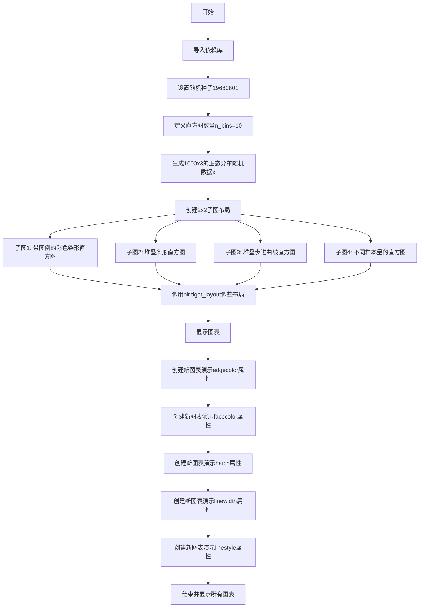
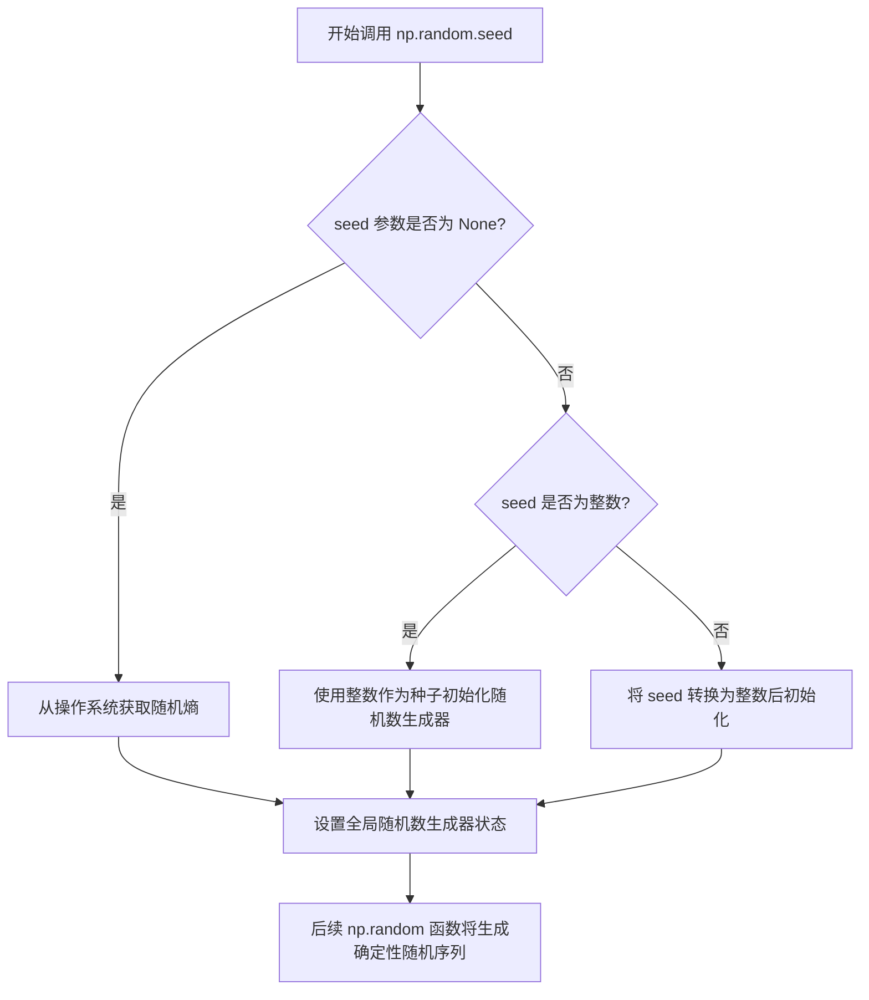
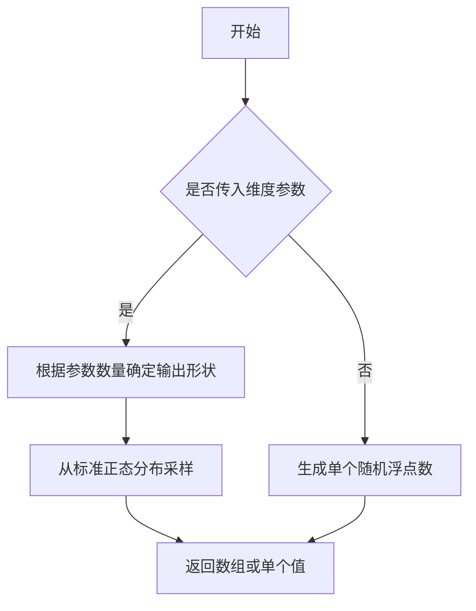
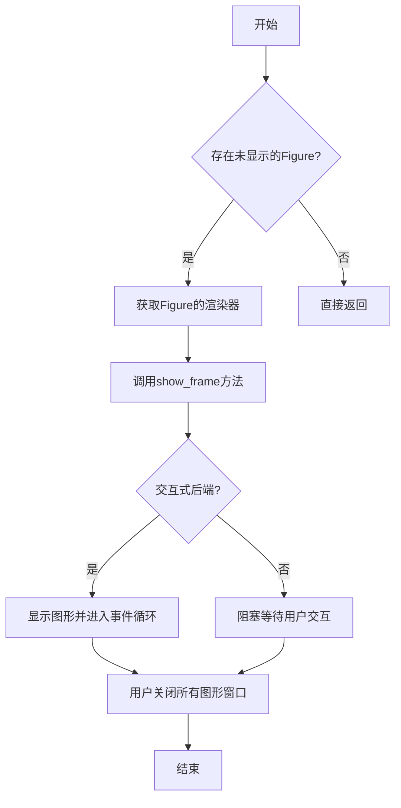
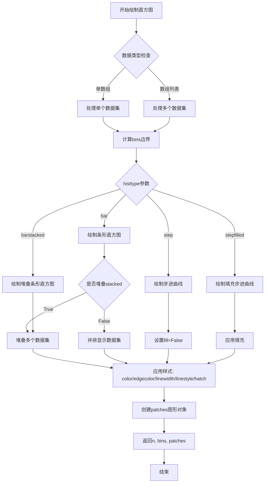
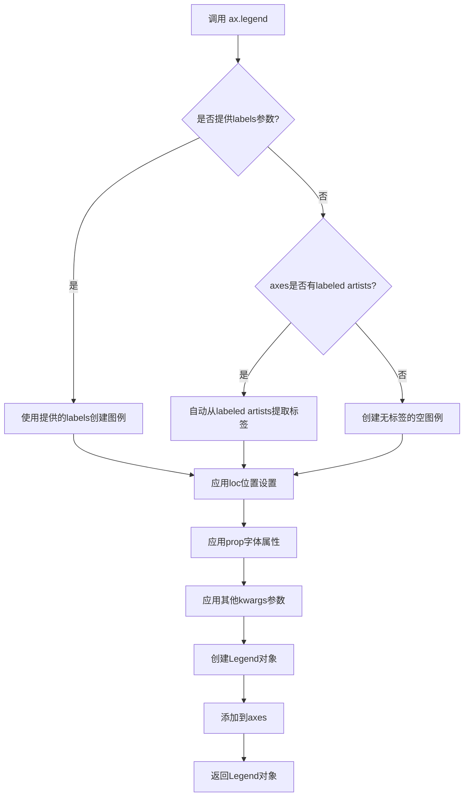
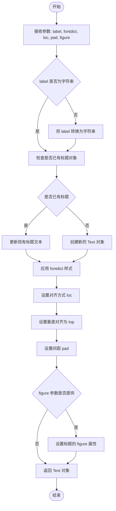
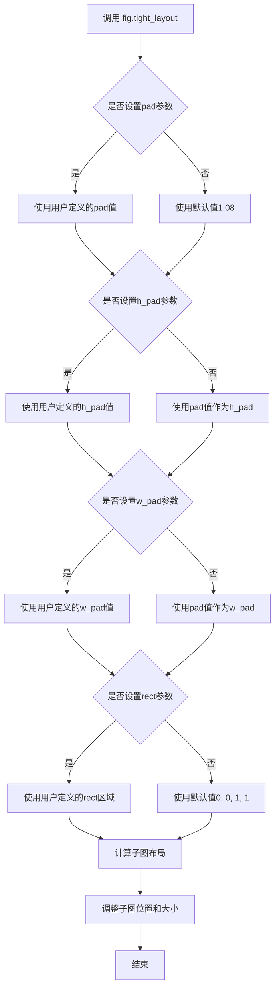
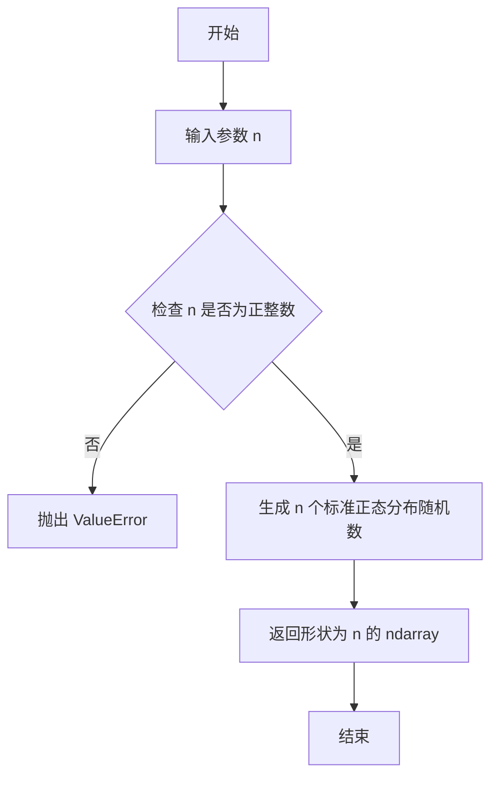

# `matplotlib\galleries\examples\statistics\histogram_multihist.py` 详细设计文档

这是一个matplotlib直方图演示脚本，通过多个子图展示了直方图的不同展示方式，包括带图例的条形图、堆叠条形图、步进曲线以及不同样本大小的直方图，同时还演示了如何自定义直方图的边框颜色、填充颜色、填充图案、线宽和线型等属性。

## 整体流程



## 类结构

```
此代码为脚本式代码，无面向对象类结构
所有操作均为过程式函数调用
主要使用matplotlib.pyplot和numpy库
```

## 全局变量及字段


### `n_bins`
    
直方图的 bin 数量

类型：`int`
    


### `x`
    
1000x3 的正态分布随机数据数组

类型：`ndarray`
    


### `colors`
    
直方图颜色列表 ['red', 'tan', 'lime']

类型：`list`
    


### `x_multi`
    
包含三个不同大小样本的列表

类型：`list`
    


### `edgecolors`
    
边框颜色列表 ['green', 'red', 'blue']

类型：`list`
    


### `facecolors`
    
填充颜色列表 ['green', 'red', 'blue']

类型：`list`
    


### `hatches`
    
填充图案列表 ['.', 'o', 'x']

类型：`list`
    


### `linewidths`
    
线宽列表 [1, 2, 3]

类型：`list`
    


### `linestyles`
    
线型列表 ['-', ':', '--']

类型：`list`
    


    

## 全局函数及方法


### `np.random.seed`

设置随机种子以确保随机数生成的可重现性。通过设定相同的种子值，可以使得每次运行代码时生成相同的随机数序列，便于调试和结果复现。

参数：

- `seed`：`int` 或 `float` 或 `None`，可选，随机种子值。整数或浮点数用于初始化随机数生成器；如果为 `None`，则从操作系统获取随机熵来初始化。

返回值：`None`，该函数无返回值，直接修改随机数生成器的内部状态。

#### 流程图



#### 带注释源码

```python
# 设置随机种子为 19680801，确保后续生成的随机数序列可重现
# 这里的 19680801 是任意选择的历史日期数字（1968年8月801日，实际上是1968年8月1日）
np.random.seed(19680801)

# 以下代码生成的随机数在每次程序运行时会完全相同
n_bins = 10  # 直方图的柱子数量
x = np.random.randn(1000, 3)  # 生成 1000x3 的正态分布随机数矩阵

# 另一个随机数生成示例
x_multi = [np.random.randn(n) for n in [10000, 5000, 2000]]
```


### `np.random.randn`

生成符合标准正态分布（均值为0，标准差为1）的随机数或数组。该函数是 NumPy 库提供的随机数生成器，可用于生成单个数值或指定形状的多维数组，常用于统计模拟、机器学习数据生成和科学计算场景。

参数：

- `*dims`：可变数量的整数参数，表示输出数组的维度。类型为 `int`，每个参数定义对应维度的大小。例如 `np.random.randn(1000, 3)` 生成 1000×3 的二维数组。

返回值：`float` 或 `numpy.ndarray`，返回标准正态分布的随机数。如果不传入参数，则返回单个浮点数；如果传入一个或多个整数参数，则返回对应维度的数组。

#### 流程图



#### 带注释源码

```python
# 从代码中提取的 np.random.randn() 使用示例

# 示例1：生成1000行3列的正态分布随机数数组
# 参数：1000（行数）, 3（列数）
# 返回：形状为(1000, 3)的二维数组，元素服从标准正态分布
x = np.random.randn(1000, 3)

# 示例2：在列表推导式中生成不同数量的随机数
# 参数：n（样本数量），可变参数
# 返回：长度为n的一维数组
x_multi = [np.random.randn(n) for n in [10000, 5000, 2000]]

# 示例3：不传参数（代码中未直接展示但支持）
# 返回：单个浮点数
single_value = np.random.randn()
```

#### 详细说明

在代码中的具体应用：

1. **主数据生成**（第14行）：
   - `np.random.randn(1000, 3)` 生成了1000个样本，每个样本3个特征的正态分布数据
   - 用于后续绘制直方图的原始数据

2. **多样本生成**（第24行）：
   - `np.random.randn(n)` 根据不同的样本大小生成3组数据
   - 样本量分别为10000、5000、2000，用于展示不同样本量对直方图的影响

该函数底层基于 Box-Muller 变换或逆变换法生成正态分布随机数，是科学计算和统计模拟中的基础工具。


### `plt.subplots`

创建子图布局函数，用于生成一个包含多个子图的图形窗口，并返回图形对象（Figure）和子图坐标轴对象（Axes）的元组。

参数：

- `nrows`：`int`，默认值：1，子图的行数
- `ncols`：`int`，默认值：1，子图的列数
- `sharex`：`bool or str`，默认值：False，是否共享x轴，设置为True时所有子图共享x轴，设置为'all'、'row'、'col'可更精细控制
- `sharey`：`bool or str`，默认值：False，是否共享y轴，设置为True时所有子图共享y轴，设置为'all'、'row'、'col'可更精细控制
- `squeeze`：`bool`，默认值：True，是否压缩返回的axes数组维度，为True且只有1个子图时返回单个Axes对象而非数组
- `width_ratios`：`array-like`，长度为ncols的数组，定义各列的宽度比例
- `height_ratios`：`array-like`，长度为nrows的数组，定义各行的高度比例
- `subplot_kw`：`dict`，默认值：{}，传递给add_subplot()的关键字参数，用于配置子图
- `gridspec_kw`：`dict`，默认值：{}，传递给GridSpec构造函数的关键字参数，用于配置网格布局
- `**fig_kw`：传递给matplotlib.pyplot.figure()的关键字参数，如figsize、dpi等

返回值：`tuple(Figure, Axes or array of Axes)`，返回图形对象和子图坐标轴对象。当squeeze=False或nrows*ncols>1时，返回Axes数组或嵌套数组；当squeeze=True且只有一个子图时，返回单个Axes对象。

#### 流程图

```mermaid
flowchart TD
    A[开始 plt.subplots] --> B[设置默认参数<br/>nrows=1, ncols=1, squeeze=True]
    B --> C[创建Figure对象<br/>使用fig_kw参数]
    D[根据nrows和ncols计算子图总数] --> E[创建子图网格布局<br/>使用gridspec_kw配置]
    E --> F[遍历创建每个子图<br/>使用add_subplot和subplot_kw]
    F --> G{是否共享x轴?}
    G -->|sharex=True| H[配置子图共享x轴]
    G -->|sharex=False| I{是否共享y轴?}
    H --> I
    I -->|sharey=True| J[配置子图共享y轴]
    I -->|sharey=False| K{squeeze=True?}
    J --> K
    K -->|是且仅1个子图| L[返回单个Axes对象]
    K -->|否| M[返回Axes数组]
    L --> N[返回 (fig, ax) 元组]
    M --> N
    N[结束]
```

#### 带注释源码

```python
def subplots(nrows=1, ncols=1, *, sharex=False, sharey=False, squeeze=True,
             width_ratios=None, height_ratios=None,
             subplot_kw=None, gridspec_kw=None, **fig_kw):
    """
    创建子图布局
    
    参数:
        nrows: 子图行数，默认1
        ncols: 子图列数，默认1
        sharex: 是否共享x轴，默认False
        sharey: 是否共享y轴，默认False
        squeeze: 是否压缩维度，默认True
        width_ratios: 列宽比例列表
        height_ratios: 行高比例列表
        subplot_kw: 传递给子图的关键字参数字典
        gridspec_kw: 传递给GridSpec的关键字参数字典
        **fig_kw: 传递给Figure的关键字参数
    
    返回:
        fig: Figure图形对象
        ax: Axes坐标轴对象或数组
    """
    
    # 1. 创建Figure对象
    fig = figure(**fig_kw)
    
    # 2. 创建子图网格布局
    # 使用GridSpec根据nrows和ncols创建网格
    gs = GridSpec(nrows, ncols, height_ratios=height_ratios,
                  width_ratios=width_ratios, **gridspec_kw)
    
    # 3. 创建子图数组
    axs = []
    for i in range(nrows):
        for j in range(ncols):
            # 使用add_subplot创建子图
            ax = fig.add_subplot(gs[i, j], **subplot_kw)
            axs.append(ax)
    
    # 4. 处理共享坐标轴
    if sharex:
        # 让所有子图共享x轴
        axs[0].shared_x_axes.join(*axs)
        
    if sharey:
        # 让所有子图共享y轴
        axs[0].shared_y_axes.join(*axs)
    
    # 5. 处理返回值维度压缩
    axs = np.array(axs).reshape(nrows, ncols)
    
    if squeeze:
        # 根据维度返回不同形式的Axes对象
        if nrows == 1 and ncols == 1:
            return fig, axs[0, 0]  # 返回单个Axes
        elif nrows == 1 or ncols == 1:
            return fig, axs.flatten()  # 返回一维数组
        else:
            return fig, axs  # 返回二维数组
    else:
        return fig, axs  # 始终返回数组
```


### `plt.show()`

显示所有打开的Figure对象到屏幕。在交互式模式下，plt.show()会刷新并显示所有未显示的图形，阻塞程序执行直到用户关闭图形窗口。

参数：此函数无任何参数。

返回值：`None`，该函数不返回任何值。

#### 流程图



#### 带注释源码

```python
# 导入matplotlib.pyplot模块，用于绑图和数据可视化
import matplotlib.pyplot as plt
# 导入numpy模块，用于生成和处理数值数据
import numpy as np

# 设置随机数种子，确保结果可重复
np.random.seed(19680801)

# 设置直方图的bin数量为10
n_bins = 10
# 生成3列1000行的标准正态分布随机数
x = np.random.randn(1000, 3)

# 创建2x2的子图布局，返回Figure对象和Axes对象数组
fig, ((ax0, ax1), (ax2, ax3)) = plt.subplots(nrows=2, ncols=2)

# 定义直方图颜色列表
colors = ['red', 'tan', 'lime']
# 绘制堆叠直方图，设置密度归一化、条形图类型、颜色和标签
ax0.hist(x, n_bins, density=True, histtype='bar', color=colors, label=colors)
# 添加图例，设置字体大小
ax0.legend(prop={'size': 10})
# 设置子图标题
ax0.set_title('bars with legend')

# 绘制堆叠直方图
ax1.hist(x, n_bins, density=True, histtype='bar', stacked=True)
ax1.set_title('stacked bar')

# 绘制阶梯式不填充直方图
ax2.hist(x, n_bins, histtype='step', stacked=True, fill=False)
ax2.set_title('stack step (unfilled)')

# 生成不同样本量的多组数据：[10000, 5000, 2000]个随机数
x_multi = [np.random.randn(n) for n in [10000, 5000, 2000]]
# 绘制多组直方图
ax3.hist(x_multi, n_bins, histtype='bar')
ax3.set_title('different sample sizes')

# 调整子图布局，避免重叠
fig.tight_layout()

# -----------------------------------
# 第一个plt.show()调用
# 显示前面创建的所有Figure对象
# -----------------------------------
plt.show()

# 后续还有5个类似的plt.show()调用，用于显示不同样式的直方图
# 每个plt.show()都会显示当前打开的Figure窗口

# 设置边缘颜色示例
fig, ax = plt.subplots()
edgecolors = ['green', 'red', 'blue']
ax.hist(x, n_bins, fill=False, histtype="step", stacked=True,
        edgecolor=edgecolors, label=edgecolors)
ax.legend()
ax.set_title('Stacked Steps with Edgecolors')

# 第二个plt.show()调用 - 显示设置边缘颜色的直方图
plt.show()

# 设置填充颜色示例
fig, ax = plt.subplots()
facecolors = ['green', 'red', 'blue']
ax.hist(x, n_bins, histtype="barstacked", facecolor=facecolors, label=facecolors)
ax.legend()
ax.set_title("Bars with different Facecolors")

# 第三个plt.show()调用 - 显示设置填充颜色的直方图
plt.show()

# 设置阴影图案示例
fig, ax = plt.subplots()
hatches = [".", "o", "x"]
ax.hist(x, n_bins, histtype="barstacked", hatch=hatches, label=hatches)
ax.legend()
ax.set_title("Hatches on Stacked Bars")

# 第四个plt.show()调用 - 显示设置阴影图案的直方图
plt.show()

# 设置线宽示例
fig, ax = plt.subplots()
linewidths = [1, 2, 3]
edgecolors = ["green", "red", "blue"]
ax.hist(x, n_bins, fill=False, histtype="bar", linewidth=linewidths,
        edgecolor=edgecolors, label=linewidths)
ax.legend()
ax.set_title("Bars with Linewidths")

# 第五个plt.show()调用 - 显示设置线宽的直方图
plt.show()

# 设置线型示例
fig, ax = plt.subplots()
linestyles = ['-', ':', '--']
ax.hist(x, n_bins, fill=False, histtype='bar', linestyle=linestyles,
        edgecolor=edgecolors, label=linestyles)
ax.legend()
ax.set_title('Bars with Linestyles')

# 第六个plt.show()调用 - 显示设置线型的直方图
plt.show()
```


### `matplotlib.axes.Axes.hist`

绘制直方图，直方图是一种用于表示数值数据分布的柱状图，可以显示数据的频率分布、堆叠效果以及多种可视化样式（如条形、步进曲线等），支持多个数据集同时绘制并可通过参数自定义颜色、边框、填充、线型等外观属性。

#### 参数

- `x`：`array` 或 `array` 列表，要绘制直方图的数据，可以是单个数组或多个数组的列表
- `bins`：`int` 或 `sequence`，直方图的柱子数量（整数）或自定义的bins边界（序列）
- `range`：`tuple`，可选，数据范围下限和上限
- `density`：`bool`，可选，如果为True，则将频率归一化为概率密度
- `weights`：`array`，可选，与x形状相同的权重数组，用于计算每个bin的加权计数
- `cumulative`：`bool`，可选，如果为True，则绘制累积直方图
- `bottom`：`array` 或 `float`，可选，每个bin的底部基址，用于堆叠直方图
- `histtype`：`{'bar', 'barstacked', 'step', 'stepfilled'}`，可选，直方图类型：'bar'为条形图，'barstacked'为堆叠条形图，'step'为步进曲线（无填充），'stepfilled'为填充的步进曲线
- `align`：{'left', 'mid', 'right'}，可选，bin的对其方式
- `orientation`：{'horizontal', 'vertical'}，可选，直方图的方向
- `rwidth`：`float`，可选，条形图的相对宽度
- `log`：`bool`，可选，如果为True，则使用对数刻度
- `color`：`color` 或 `color` 列表，可选，直方图的颜色
- `label`：`str` 或 `str` 列表，可选，用于图例的标签
- `stacked`：`bool`，可选，如果为True且histtype为'bar'或'step'，则多个数据集堆叠显示
- `normed`：`bool`，已弃用，使用density代替
- `edgecolor`：`color` 或 `color` 列表，可选，条形图的边框颜色
- `linewidth`：`float` 或 `float` 列表，可选，条形图的边框宽度
- `linestyle`：`{'-', '--', '-.', ':'}` 或 `linestyle` 列表，可选，边框的线型
- ` hatch`：`str` 或 `str` 列表，可选，条形图的填充图案（如'.', 'o', 'x'等）
- `fill`：`bool`，可选，如果为True（默认），则填充条形图

#### 返回值

- `n`：`array`，每个bin中的计数（或密度值如果density=True）
- `bins`：`array`，bin的边界值，长度为n+1
- `patches`：`BarContainer` 或 `list` of `Patch`，图形对象容器，包含实际的直方图图形元素

#### 流程图



#### 带注释源码

```python
# 示例1: 基本条形直方图（来自代码第27行）
ax0.hist(x,                      # x: array，要绘制的数据，形状为(1000, 3)的随机数数组
         n_bins,                  # bins: int，直方图的bin数量，此处为10
         density=True,            # density: bool，是否归一化为概率密度
         histtype='bar',          # histtype: str，直方图类型，'bar'表示条形图
         color=colors,            # color: list，直方图颜色列表['red', 'tan', 'lime']
         label=colors)            # label: list，用于图例的标签

# 示例2: 堆叠条形直方图（来自代码第30-31行）
ax1.hist(x,                      # x: array，输入数据
         n_bins,                  # bins: int，bin数量
         density=True,            # density: bool，归一化
         histtype='bar',          # histtype: str，条形类型
         stacked=True)            # stacked: bool，堆叠多个数据集

# 示例3: 步进曲线（无填充）（来自代码第34-35行）
ax2.hist(x,                      # x: array，输入数据
         n_bins,                  # bins: int，bin数量
         histtype='step',         # histtype: str，'step'表示步进曲线
         stacked=True,            # stacked: bool，堆叠
         fill=False)              # fill: bool，不填充

# 示例4: 不同样本量的直方图（来自代码第39-40行）
x_multi = [np.random.randn(n) for n in [10000, 5000, 2000]]  # 创建不同长度的数据集列表
ax3.hist(x_multi,                # x: list，数据列表，包含3个不同大小的数组
         n_bins,                  # bins: int，bin数量
         histtype='bar')          # histtype: str，条形图

# 示例5: 自定义边框颜色（来自代码第61-62行）
ax.hist(x,                       # x: array，输入数据
        n_bins,                   # bins: int，bin数量
        fill=False,               # fill: bool，不填充
        histtype="step",          # histtype: str，步进类型
        stacked=True,             # stacked: bool，堆叠
        edgecolor=edgecolors,     # edgecolor: list，边框颜色列表['green', 'red', 'blue']
        label=edgecolors)         # label: list，图例标签

# 示例6: 自定义面颜色（来自代码第76-77行）
ax.hist(x,                       # x: array，输入数据
        n_bins,                   # bins: int，bin数量
        histtype="barstacked",    # histtype: str，堆叠条形图
        facecolor=facecolors,     # facecolor: list，面颜色['green', 'red', 'blue']
        label=facecolors)         # label: list，图例标签

# 示例7: 自定义填充图案（来自代码第88-89行）
ax.hist(x,                       # x: array，输入数据
        n_bins,                   # bins: int，bin数量
        histtype="barstacked",    # histtype: str，堆叠条形
        hatch=hatches,            # hatch: list，填充图案['.', 'o', 'x']
        label=hatches)            # label: list，图例标签

# 示例8: 自定义线宽（来自代码第99-101行）
ax.hist(x,                       # x: array，输入数据
        n_bins,                   # bins: int，bin数量
        fill=False,               # fill: bool，不填充
        histtype="bar",           # histtype: str，条形图
        linewidth=linewidths,     # linewidth: list，线宽[1, 2, 3]
        edgecolor=edgecolors,     # edgecolor: list，边框颜色
        label=linewidths)         # label: list，图例标签

# 示例9: 自定义线型（来自代码第112-114行）
ax.hist(x,                       # x: array，输入数据
        n_bins,                   # bins: int，bin数量
        fill=False,               # fill: bool，不填充
        histtype='bar',           # histtype: str，条形图
        linestyle=linestyles,     # linestyle: list，线型['-', ':', '--']
        edgecolor=edgecolors,     # edgecolor: list，边框颜色
        label=linestyles)         # label: list，图例标签
```


### `ax.legend()`

添加图例到 Axes 对象。用于显示图表中不同数据系列的标签，使图表更易于理解。该方法可以自动从已标记的元素中创建图例，也可以显式提供标签。

参数：

- `labels`：`list`，图例标签列表，用于手动指定每个系列的标签
- `loc`：`str` 或 `int`，图例位置，如 `'upper right'`、`'best'`（0）、`'upper left'`（1）等
- `prop`：`dict`，字体属性字典，如 `{'size': 10}` 控制字体大小
- `fontsize`：`int` 或 `str`，图例字体大小
- `title`：`str`，图例标题文本
- `frameon`：`bool`，是否绘制图例边框
- `ncol`：`int`，图例列数
- `mode`：`str`，模式，如 `'expand'` 使图例水平扩展
- `bbox_to_anchor`：`tuple`，边框锚点位置

返回值：`matplotlib.legend.Legend`，返回创建的 Legend 对象，可用于进一步操作图例

#### 流程图



#### 带注释源码

```python
# 示例1: 使用prop参数设置图例字体大小
ax0.legend(prop={'size': 10})
# 参数:
#   prop: 字典，键为'size'，值为10，设置图例字体大小为10
# 返回: Legend对象

# 示例2: 无参数调用，自动从labeled artists创建图例
ax.legend()
# 参数: 无
# 返回: Legend对象

# 示例3: 完整的legend调用示例
ax.legend(
    labels=['Dataset 1', 'Dataset 2', 'Dataset 3'],  # 图例标签列表
    loc='upper right',                                 # 位置：右上角
    prop={'size': 12, 'weight': 'bold'},              # 字体属性
    title='Legend Title',                             # 图例标题
    frameon=True,                                     # 显示边框
    ncol=1                                            # 列数为1
)
# 参数:
#   labels: list - 图例的标签序列
#   loc: str - 位置字符串
#   prop: dict - 字体属性字典
#   title: str - 图例标题
#   frameon: bool - 是否显示边框
#   ncol: int - 列数
# 返回: Legend对象 - 可用于后续操作
```


### ax.set_title

设置子图的标题，用于为单个子图（Axes）指定标题文本和样式。

参数：
- `label`: str，标题文本内容，支持字符串类型。
- `fontdict`: dict，可选，用于设置标题文本属性的字典，如字体大小、颜色、字体权重等。
- `loc`: str，可选，标题对齐方式，默认为'center'，可选'left'或'right'。
- `pad`: float，可选，标题与子图顶部的间距，单位为点（points），默认为6.0。
- `figure`: matplotlib.figure.Figure，可选，要设置的图形对象，用于指定标题所属的图形。

返回值：matplotlib.text.Text，返回设置后的标题文本对象（Text实例），便于后续进一步自定义样式。

#### 流程图



#### 带注释源码

以下为 matplotlib 中 `Axes.set_title` 方法的核心实现源码（基于 matplotlib 3.7.0 版本）：

```python
def set_title(self, label, fontdict=None, loc=None, pad=None, *, figure=None):
    """
    Set a title for the axes.

    Parameters
    ----------
    label : str
        The title text to be set.
    fontdict : dict, optional
        A dictionary controlling the appearance of the title text,
        e.g., {'fontsize': 16, 'fontweight': 'bold', 'color': 'red'}.
    loc : str, optional
        Title alignment, defaults to 'center' (other options: 'left', 'right').
    pad : float, optional
        The distance in points between the title and the top of the axes.
    figure : matplotlib.figure.Figure, optional
        The figure that the axes belongs to.

    Returns
    -------
    text : matplotlib.text.Text
        The corresponding text object.
    """
    # 将 label 转换为字符串，确保为文本类型
    if not isinstance(label, str):
        label = str(label)

    # 获取或创建标题的 Text 对象（_title 是 Axes 内部的标题属性）
    title = self._title
    if title is None:
        # 如果没有标题，则创建新的 Text 对象，初始位置在子图顶部中央
        # 注意：这里使用子图的位置信息 (x0, y1) 作为标题的参考坐标
        title = Text(self._position.x0, self._position.y1, label)
        # 将新标题添加到子图中的艺术家列表
        self.add_artist(title)
    else:
        # 如果已存在标题，则更新其文本内容
        title.set_text(label)

    # 如果提供了 fontdict，则应用其样式到标题
    if fontdict is not None:
        title.update(fontdict)

    # 设置对齐方式，默认为居中
    if loc is None:
        loc = 'center'
    title.set_ha(loc)  # 设置水平对齐 (horizontal alignment)

    # 设置垂直对齐为顶部，以便与子图顶部对齐
    title.set_va('top')

    # 设置标题与子图顶部的间距，默认为 6.0 点
    if pad is None:
        pad = 6.0
    title.set_pad(pad)

    # 如果提供了 figure 参数，则将标题添加到指定的图形中
    if figure is not None:
        title.set_figure(figure)

    # 保存对齐方式和间距到标题对象，以便后续使用
    title._loc = loc
    title._pad = pad

    # 保存对 Axes 的引用，确保标题与子图关联
    title._axes = self

    # 返回设置好的标题 Text 对象，供调用者进一步操作
    return title
```


### `fig.tight_layout()`

调整子图布局，使子图与图形边缘以及彼此之间保持适当的间距，避免标签和标题被遮挡。

#### 参数

- `pad`：float，默认值为 1.08，图形边缘与子图边缘之间的间距（相对于字体大小）
- `h_pad`：float 或 None，相邻子图之间的垂直间距（默认为 pad）
- `w_pad`：float 或 None，相邻子图之间的水平间距（默认为 pad）
- `rect`：tuple of 4 floats，默认值为 (0, 0, 1, 1)，规范化坐标系中的矩形区域 (left, bottom, right, top)

#### 返回值

`None`，该方法直接修改图形布局，不返回任何值。

#### 流程图



#### 带注释源码

```python
# 在 matplotlib 中，tight_layout() 是 Figure 类的方法
# 以下是代码中调用该方法的示例

fig, ((ax0, ax1), (ax2, ax3)) = plt.subplots(nrows=2, ncols=2)

# ... (创建子图和绘制直方图的代码) ...

# 调用 tight_layout() 调整子图布局
# 功能：
# - 自动计算子图之间的最佳间距
# - 确保轴标签、图例和标题不被遮挡
# - pad 参数控制图形边缘与子图边缘的间距
# - h_pad 和 w_pad 分别控制垂直和水平间距
fig.tight_layout()

# 调用后，matplotlib 会重新计算所有子图的位置和大小，
# 使它们在指定的矩形区域内适当分布，并保持适当的间距
plt.show()
```

#### 关键组件信息

- **Figure 对象 (fig)**：matplotlib 中的图形容器，包含所有子图和布局信息
- **Axes 对象 (ax0, ax1, ax2, ax3)**：子图对象，每个包含一个坐标系

#### 潜在的技术债务或优化空间

1. **手动布局调整**：对于复杂的布局需求，tight_layout() 可能不够灵活，可能需要使用 GridSpec 或 constrained_layout
2. **性能考虑**：在大量子图或频繁更新时，tight_layout() 可能会带来一定的计算开销
3. **兼容性**：旧版本的 matplotlib 可能对某些参数的支持有限

#### 其它项目

- **设计目标**：提供简单易用的自动布局调整功能，使子图布局美观且不影响数据展示
- **约束**：依赖于当前的图形和子图状态，调用后可能覆盖之前的手动布局设置
- **错误处理**：如果图形中没有子图，调用此方法不会产生效果
- **外部依赖**：matplotlib 库的核心功能


### `numpy.random.randn`

从代码中提取的函数调用：`np.random.randn(n)`，用于为不同样本生成随机数据。

参数：

- `n`：`int`，要生成的随机样本数量

返回值：`ndarray`，返回包含 n 个随机数的数组，这些随机数服从标准正态分布（均值为0，标准差为1）。

#### 流程图



#### 带注释源码

```python
# 从代码中提取的调用示例：
# x_multi = [np.random.randn(n) for n in [10000, 5000, 2000]]

# np.random.randn(n) 的调用：
# n: int 类型参数，指定要生成的随机样本数量
# 返回值: ndarray，包含 n 个从标准正态分布（均值0，标准差1）中采样的随机数

# 具体调用上下文：
x_multi = [np.random.randn(n) for n in [10000, 5000, 2000]]
# 为三个不同大小的样本集生成随机数据
# 样本1: 10000 个随机数
# 样本2: 5000 个随机数
# 样本3: 2000 个随机数
```


## 关键组件


### matplotlib.pyplot.hist

核心直方图绘制函数，支持多数据集、堆叠显示、密度归一化等功能，是整个示例的核心绘图API。

### 直方图类型（histtype）

支持四种直方图类型：'bar'（条形）、'barstacked'（堆叠条形）、'step'（步骤曲线）、'stepfilled'（填充步骤曲线），通过参数控制可视化样式。

### 堆叠功能（stacked参数）

通过stacked=True/False控制多数据系列的堆叠显示方式，支持堆叠条形图和堆叠步骤图两种模式。

### 样式自定义系统

包含edgecolor（边框颜色）、facecolor（填充颜色）、hatch（阴影图案）、linewidth（线宽）、linestyle（线型）等参数，支持对每个数据系列独立设置样式。

### 多数据集支持

可接受二维数组（每列一个数据集）或列表（每个元素一个数据集），自动处理不同样本量的数据集合并显示。

### 密度归一化（density参数）

通过density=True将纵轴从频数转换为概率密度，使不同样本量的直方图具有可比性。

### 子图布局管理（plt.subplots）

使用2x2网格布局创建多个子图，展示不同直方图类型的对比效果。

### 图例系统（ax.legend）

支持自动从数据标签或手动指定标签创建图例，用于标识多个数据系列。

### NumPy随机数据生成

使用np.random.randn生成正态分布的随机数据，用于演示不同参数效果。


## 问题及建议


### 已知问题

- **硬编码参数过多**：n_bins=10、数据量1000、维度3等数值散落在代码中，缺乏配置化管理
- **代码重复严重**：多个代码块重复创建fig、ax，设置title、legend等相似操作
- **全局变量污染**：x、edgecolors等变量在不同代码段中重复使用，缺乏作用域控制
- **脚本式代码结构**：所有代码平铺，缺乏函数封装，可复用性差
- **魔法数字无解释**：10000、5000、2000等样本量数值没有任何注释说明其设计意图
- **错误处理缺失**：未对输入参数（如n_bins为负数、数组为空）进行校验
- **资源管理不当**：plt.show()调用时机不一致，可能导致部分环境无法正常显示
- **tight_layout调用不均**：第一个图组调用了tight_layout，后续独立图未调用，可能产生布局问题
- **变量作用域泄漏**：edgecolors、facecolors等变量在前一个代码块定义后可能被后续代码意外复用

### 优化建议

- **提取配置常量**：创建配置类或字典集中管理n_bins、colors、sample_sizes等参数
- **函数封装**：将创建直方图的逻辑封装为函数，如create_histogram()，接受配置参数
- **使用类或模块作用域**：将相关变量封装在类或函数内，减少全局污染
- **添加参数校验**：在函数入口检查参数合法性并抛出有意义的异常信息
- **统一资源管理**：使用with语句或明确的close()调用管理Figure对象生命周期
- **添加文档注释**：为魔法数字添加注释说明其业务含义或来源
- **统一布局方法**：所有图统一应用tight_layout或使用GridSpec进行更精细的布局控制

## 其它


### 设计目标与约束

本代码旨在展示matplotlib.pyplot.hist函数的多种使用方式，包括不同类型的直方图（bar、stacked bar、step curve）、不同样本大小的数据可视化以及各种样式定制选项。约束条件包括：依赖matplotlib和numpy两个外部库，需要Python 3.x环境支持，直方图数据需要预先准备好且为数值型数组。

### 错误处理与异常设计

代码主要依赖matplotlib的hist函数进行绘图，当传入参数不符合要求时会抛出相应的异常。np.random.randn生成的随机数可能因种子固定而存在可重现性问题。对于hist函数，参数n_bins必须为正整数，x需要是可转换为数组的数值型数据，histtype参数必须为有效选项（'bar', 'barstacked', 'step', 'stepfilled'），density和fill为布尔类型。当前代码未显式进行参数验证，错误处理主要通过matplotlib底层完成。

### 数据流与状态机

数据流向为：随机数生成（np.random.randn）→ 数据整理（列表推导式）→ 直方图计算（hist函数内部）→ 图形渲染（axes对象）→ 图形显示（plt.show）。状态机主要体现在fig和ax对象的创建过程：从空白Figure对象创建Axes子图，每个Axes对象独立维护自身的直方图状态，包括数据、bins、样式属性等。多图展示时各子图状态相互独立。

### 外部依赖与接口契约

本代码依赖两个外部库：matplotlib.pyplot提供图形绘制接口，numpy提供数值计算和随机数生成功能。核心接口为axes.Axes.hist方法，参数包括x（数据）、bins（箱数）、density（密度标准化）、histtype（直方图类型）、color（颜色）、label（标签）、stacked（堆叠）、fill（填充）、edgecolor（边框颜色）、facecolor（填充颜色）、hatch（阴影图案）、linewidth（线宽）、linestyle（线型）。返回值包含(n, bins, patches)三个元素。

### 配置与可扩展性

代码通过变量（n_bins、colors、hatches等）实现配置化，方便调整直方图参数。可扩展方向包括：添加更多histtype类型支持、自定义图例位置、集成到Web应用、使用面向对象方式封装直方图类。当前代码采用过程式编程风格，适合脚本和演示用途，若要用于生产环境可考虑封装为可复用的函数或类。

### 性能考虑

np.random.randn生成大量随机数时性能较好，hist函数内部使用numpy的直方图计算算法效率较高。多图绘制时使用subplots一次性创建比多次调用subplot更高效。当前数据规模（1000-10000条记录）下性能无明显问题，若数据量增加到百万级可考虑分箱策略优化或使用numba加速。

### 测试策略

由于是示例代码，未包含单元测试。生产环境中应测试：不同数据类型的兼容性、边界条件（空数组、单元素数组）、参数组合的有效性、图形输出的正确性。可使用pytest配合matplotlib的Agg后端进行无GUI测试，验证返回值和图形属性是否符合预期。

### 图形渲染细节

histtype='bar'绘制相邻柱状图，'barstacked'将多组数据堆叠显示，'step'以阶梯线展示数据（fill=False时不填充），'stepfilled'填充阶梯线下方面积。stacked=True仅对'bar'和'step'类型有效。density=True将频率转换为密度（面积和为1），默认为False（计数）。patches对象包含每个柱状的Rectangle或Polygon实例，可用于后续自定义修改。


    