# `matplotlib\galleries\examples\statistics\histogram_normalization.py` 详细设计文档

这是一个 Matplotlib 示例脚本，演示了直方图（histogram）的各种配置选项，包括 bins（箱子）数量/边界、density（密度）归一化以及 weights（权重）的使用方法，帮助用户理解如何根据不同数据特征选择合适的直方图可视化方式。

## 整体流程

```mermaid
graph TD
    A[开始] --> B[导入 matplotlib.pyplot 和 numpy]
    B --> C[创建随机数生成器 rng]
    C --> D[定义示例数据 xdata 和初始分箱 xbins]
    D --> E[创建直方图样式字典 style]
    E --> F[创建第一个简单直方图]
    F --> G[修改 bins 为更小宽度]
    G --> H[使用自动 bins 和指定数量 bins 对比]
    H --> I[演示 density 参数 - 概率密度归一化]
    I --> J[生成正态分布数据并计算理论 PDF]
    J --> K[对比 density=True/False 的效果]
    K --> L[演示不同宽度 bins 的处理]
    L --> M[演示权重 normalization - weights=1/N]
    M --> N[对比不同人口规模数据的归一化方法]
    N --> O[调用 plt.show() 显示所有图表]
```

## 类结构

```
Python 脚本 (非面向对象)
├── 导入模块
│   ├── matplotlib.pyplot (plt)
│   └── numpy (np)
├── 全局变量
│   ├── rng - 随机数生成器
│   ├── xdata - 样本数据数组
│   ├── xbins - 分箱边界数组
│   ├── style - 样式字典
│   ├── xpdf - PDF计算用的x值
│   ├── pdf - 理论概率密度值
│   └── dx - 箱宽度
└── 主要流程
    ├── 数据准备
    ├── 直方图绘制 (多个子图)
    └── 图表展示
```

## 全局变量及字段


### `rng`
    
随机数生成器，用于生成示例数据

类型：`numpy.random.Generator`
    


### `xdata`
    
样本数据数组（包含9个小数值的数组）

类型：`numpy.ndarray`
    


### `xbins`
    
直方图的分箱边界数组

类型：`numpy.ndarray`
    


### `style`
    
直方图样式配置字典，包含 facecolor、edgecolor、linewidth

类型：`dict`
    


### `xpdf`
    
用于绘制理论概率密度函数的 x 轴坐标数组

类型：`numpy.ndarray`
    


### `pdf`
    
基于正态分布的理论概率密度值数组

类型：`numpy.ndarray`
    


### `dx`
    
直方图箱宽度，用于计算和归一化

类型：`float`
    


### `fig`
    
Matplotlib 图形对象

类型：`matplotlib.figure.Figure`
    


### `ax`
    
Matplotlib 坐标轴对象（或子图字典）

类型：`matplotlib.axes.Axes 或 dict`
    


### `nn`
    
循环变量，用于枚举不同箱宽

类型：`int`
    


### `xdata2`
    
第二个样本数据集（100个正态分布随机数）

类型：`numpy.ndarray`
    


    

## 全局函数及方法


### `numpy.random.default_rng`

创建并返回一个具有指定种子的随机数生成器（Generator）实例，用于生成高质量的伪随机数。

参数：

- `seed`：`int` 或 `None`，可选参数。用于初始化随机数生成器的种子值。如果为 `None`，则从操作系统或系统硬件获取随机种子以确保每次运行生成不同的随机序列。如果提供整数，则使用该值作为种子，生成可重现的随机数序列。

返回值：`numpy.random.Generator`，返回一个 NumPy 随机数生成器对象。该生成器对象可以调用各种方法（如 `normal()`、`uniform()`、`integers()` 等）来产生不同分布的随机数。

#### 流程图

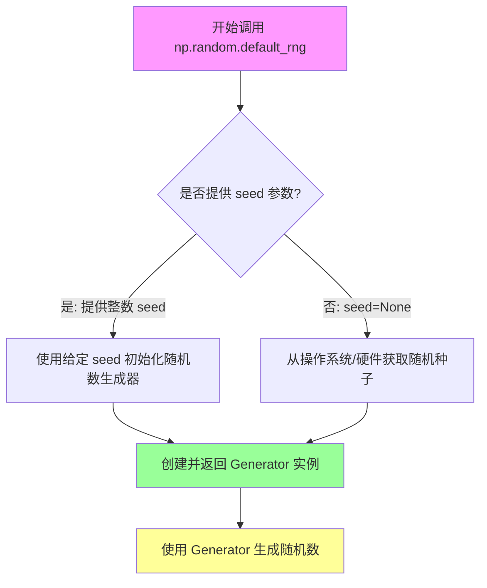

#### 带注释源码

```python
import numpy as np

# 调用 np.random.default_rng() 创建一个带有特定种子的随机数生成器
# 参数 19680801 是种子值，确保每次运行产生相同的随机数序列（用于可重现性）
rng = np.random.default_rng(19680801)

# 使用生成器的 normal 方法从正态分布生成随机数
# size=1000 表示生成1000个随机数
xdata = rng.normal(size=1000)

# 也可以生成其他分布的随机数，例如：
# - rng.uniform(low, high, size)  # 均匀分布
# - rng.integers(low, high, size)  # 整数随机数
# - rng.exponential(scale, size)  # 指数分布

# 如果不提供种子，则每次运行生成不同的随机序列
# rng_random = np.random.default_rng()  # 无种子，每次不同
```


### `np.array`

该函数是 NumPy 库中最基础且核心的函数之一，用于将 Python 列表、元组或其他类似数组的数据结构转换为 NumPy 的 n 维数组（ndarray）。这是进行科学计算和数据处理的基础操作，因为它提供了高效存储和操作大量数值数据的能力。

参数：

- `object`：`array_like`，输入数据，可以是列表、元组、嵌套序列或其他可转换为数组的对象
- `dtype`：`data type`（可选），指定数组的数据类型，如 int、float、str 等
- `copy`：`bool`（可选），默认为 True，当设置为 False 时，在可能的情况下避免复制数据
- `order`：`{'K', 'A', 'C', 'F'}`（可选），指定数组的内存布局，C 表示行主序，F 表示列主序
- `subok`：`bool`（可选），默认为 True，允许传递子类
- `ndmin`：`int`（可选），指定最小维度数

返回值：`numpy.ndarray`，返回创建的 NumPy 多维数组对象

#### 流程图

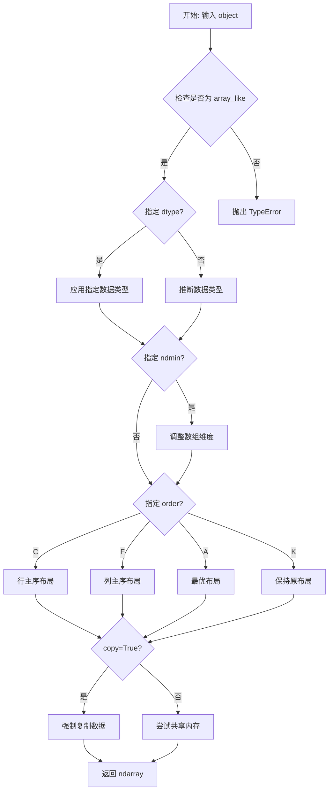

#### 带注释源码

```python
# 在代码中的典型使用方式：

# 示例1：创建一维浮点数数组
xdata = np.array([1.2, 2.3, 3.3, 3.1, 1.7, 3.4, 2.1, 1.25, 1.3])
# 结果: array([1.2 , 2.3 , 3.3 , 3.1 , 1.7 , 3.4 , 2.1 , 1.25, 1.3 ])
# 类型推断为 float64

# 示例2：创建整数数组
xbins = np.array([1, 2, 3, 4])
# 结果: array([1, 2, 3, 4])
# 类型推断为 int32 或 int64（取决于平台）

# 示例3：使用 dtype 参数指定数据类型
int_array = np.array([1, 2, 3], dtype=np.float32)
# 结果: array([1., 2., 3.], dtype=float32)

# 示例4：使用 ndmin 参数指定最小维度
arr_2d = np.array([1, 2, 3], ndmin=2)
# 结果: array([[1, 2, 3]])，变成二维数组

# 示例5：使用 weights 参数（用于直方图统计）
weights = 1/len(xdata) * np.ones(len(xdata))
# 创建一个权重数组，每个元素的权重为 1/N
```


### np.arange

该函数是NumPy库中的核心数组创建函数，用于生成指定范围内的等差数列数组。在直方图示例代码中主要用于动态创建箱边界（bin edges），使直方图能够灵活适应不同的数据分布和统计分析需求。

参数：

- `start`：`float` 或 `int`，起始值，数组的起始点（包含）
- `stop`：`float` 或 `int`，结束值，数组的结束点（不包含，除非在特定条件下）
- `step`：`float` 或 `int`，步长，两个相邻值之间的差值

返回值：`numpy.ndarray`，返回由等差数列组成的一维数组

#### 流程图

```mermaid
flowchart TD
    A[开始] --> B{输入参数验证}
    B -->|start类型| C[转换为浮点数如果需要]
    B -->|stop类型| D[转换为浮点数如果需要]
    B -->|step类型| E[转换为浮点数如果需要]
    C --> F{计算数组长度}
    D --> F
    E --> F
    F --> G[length = ceil((stop - start) / step)]
    G --> H[生成等差数组]
    H --> I[返回numpy.ndarray]
```

#### 带注释源码

```python
# np.arange 是 NumPy 库中的一个函数，用于创建等差数组
# 在本示例中主要用于创建直方图的箱边界

# 示例1：创建从1到4，步长为0.5的箱边界
xbins = np.arange(1, 4.5, 0.5)
# 结果: array([1. , 1.5, 2. , 2.5, 3. , 3.5, 4. ])

# 示例2：创建用于概率密度函数的x轴数据
xpdf = np.arange(-4, 4, 0.1)
# 结果: array([-4.0, -3.9, -3.8, ..., 3.8, 3.9])

# 示例3：动态创建直方图箱边界
dx = 0.1
xbins = np.arange(-4, 4, dx)
# 结果: array([-4.0, -3.9, -3.8, ..., 3.8, 3.9, 4.0])

# 示例4：在变宽箱直方图中使用
dx = 0.1
xbins = np.hstack([np.arange(-4, -1.25, 6*dx), np.arange(-1.25, 4, dx)])
# 创建不均匀的箱边界，前部分箱宽度是后面的6倍

# np.arange 的工作原理：
# 1. 接收 start, stop, step 三个参数
# 2. 计算元素个数: n = ceil((stop - start) / step)
# 3. 生成数组: [start, start+step, start+2*step, ..., start+(n-1)*step]
# 4. 返回 numpy.ndarray 对象
```

#### 关键组件信息

| 组件名称 | 一句话描述 |
|---------|-----------|
| `np.arange` | NumPy核心函数，用于生成等差数列数组 |
| `np.random.default_rng` | NumPy随机数生成器，创建确定性的随机数据 |
| `np.histogram` | NumPy直方图计算函数（被matplotlib调用） |
| `Axes.hist` | Matplotlib直方图绘制方法 |

#### 潜在的技术债务或优化空间

1. **硬编码的箱边界参数**：代码中多处直接使用数值作为箱边界参数（如`0.1`、`0.25`），建议提取为配置常量
2. **重复的绘图代码**：直方图绘制逻辑在多处重复出现，可封装为辅助函数
3. **魔法数字**：如`19680801`作为随机种子、`4.5`作为边界值等缺乏注释说明

#### 其它项目

**设计目标与约束**：
- 演示直方图的多种配置方式（自动选择箱数量、手动指定箱边界、密度归一化、权重）
- 展示不同箱宽度对直方图形状的影响

**错误处理与异常设计**：
- 当`step=0`时会产生ValueError
- 当`start >= stop`且`step > 0`时返回空数组
- 浮点数精度可能导致边界值略有偏差

**数据流与状态机**：
```
输入数据生成 → 箱边界计算 → 直方图统计 → 可视化渲染 → 显示输出
```

**外部依赖与接口契约**：
- 依赖`numpy`库提供数值计算功能
- 依赖`matplotlib.pyplot`库提供可视化功能
- `np.arange`返回的数组可直接用于`axes.hist()`的`bins`参数


### `np.hstack`

水平拼接多个数组（在列方向上连接），常用于合并不同宽度的直方图箱体。

参数：

- `arrays`：`tuple of array_like`，需要水平拼接的数组序列，这些数组将在列方向（axis=1）上连接

返回值：`ndarray`，水平拼接后的数组

#### 流程图

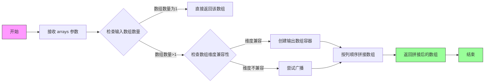

#### 带注释源码

```python
# np.hstack 函数原型（概念性展示）
# def hstack(tuple_of_arrays, *, dtype=None, casting='same_kind'):
#
# 参数说明：
# - tuple_of_arrays: 需要水平拼接的数组元组或列表
#   这些数组将在列方向(axis=1)上连接
# - dtype: 可选，输出数组的数据类型
# - casting: 可选，控制数据类型转换的规则
#
# 返回值：
# - 水平拼接后的新数组
#
# 示例用法（来自直方图箱体构建代码）：
# 
# 场景：创建不等宽的直方图箱体
# 前半部分箱体宽度是后半部分的6倍
dx = 0.1
# 创建两个不同步长的数组序列
arr1 = np.arange(-4, -1.25, 6*dx)  # 步长为0.6，范围[-4, -1.25)
arr2 = np.arange(-1.25, 4, dx)     # 步长为0.1，范围[-1.25, 4)
# 使用np.hstack水平拼接两个数组，形成不等宽的箱体边界
xbins = np.hstack([arr1, arr2])
# 结果：xbins 包含从-4到4的边界点，但-1.25左侧的箱体宽度是右侧的6倍
#
# 关键特性：
# 1. 输入数组可以是任意维度，但通常用于1D或2D数组
# 2. 对于2D数组，hstack相当于在列方向(axis=1)上连接
# 3. 等同于 np.concatenate(..., axis=1) 的简写形式
# 4. 要求所有输入数组在非拼接轴上的维度一致
```


### np.sqrt

计算输入值的平方根。`np.sqrt` 是 Numplotlib 依赖的 NumPy 库中的数学函数，用于返回数组或标量的平方根。

参数：

- `x`：`numpy.ndarray` 或 `float`，输入的数值或数组，计算其平方根

返回值：`numpy.ndarray` 或 `float`，输入值的平方根

#### 流程图

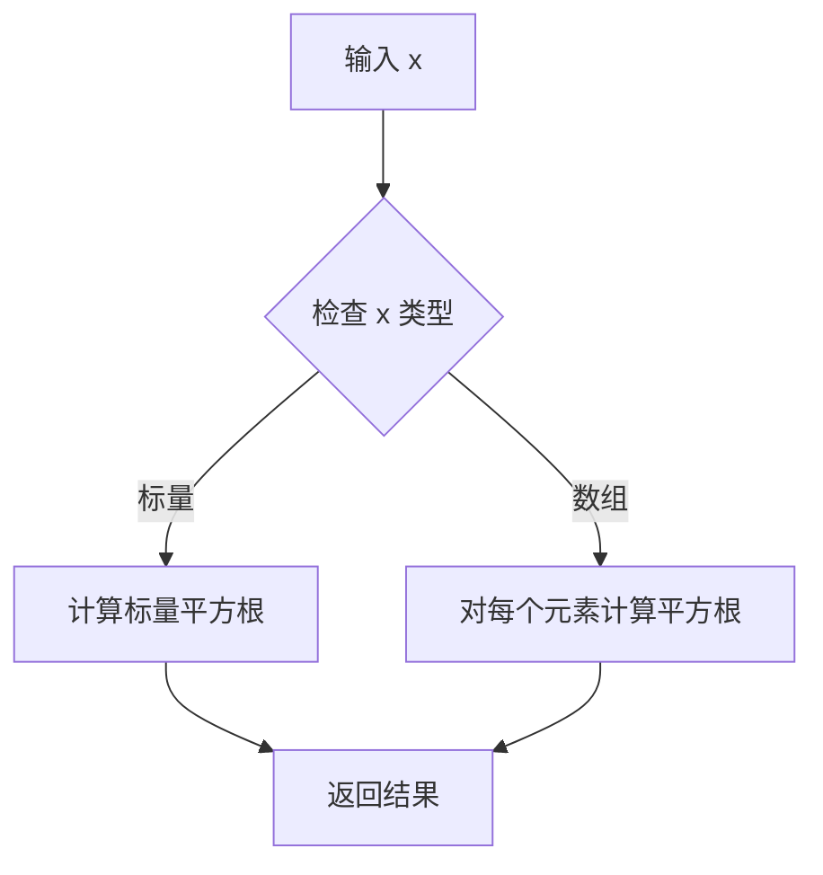

#### 带注释源码

```python
# 在代码中的实际使用示例
pdf = 1 / (np.sqrt(2 * np.pi)) * np.exp(-xpdf**2 / 2)

# np.sqrt(2 * np.pi) 的详细分解：
# 1. np.sqrt(2 * np.pi) 计算 2π 的平方根
#    - 2 * np.pi ≈ 6.283185...
#    - np.sqrt(6.283185...) ≈ 2.5066...
# 2. 这个值是正态分布概率密度函数 normalization constant 的分母
#    - 正态分布 PDF: f(x) = (1/(σ√(2π))) * exp(-(x-μ)²/(2σ²))
#    - 对于标准正态分布 (μ=0, σ=1)，系数为 1/√(2π)
# 3. 最终 pdf 表示标准正态分布的概率密度函数值
```

#### 补充说明

| 项目 | 说明 |
|------|------|
| **函数来源** | NumPy 库 (`numpy.sqrt`) |
| **数学定义** | $y = \sqrt{x}$，满足 $y^2 = x$ 且 $y \geq 0$ |
| **输入约束** | $x \geq 0$（对于实数输入）；对于复数输入支持负数平方根 |
| **代码上下文** | 该函数用于计算正态分布概率密度函数的归一化常数 $\frac{1}{\sqrt{2\pi}}$ |


### `np.exp`

计算输入数组元素的指数（e^x）。

参数：

- `x`：`ndarray` 或 `scalar`，输入值，可以是单个数值或数组，计算 e 的 x 次方

返回值：`ndarray` 或 `scalar`，返回 e 的 x 次方的结果，类型与输入相同

#### 流程图

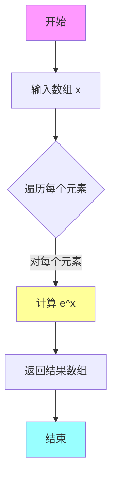

#### 带注释源码

```python
# 在正态分布的概率密度函数计算中使用 np.exp
# 这里 np.exp 用于计算 e^(-x^2/2)，这是正态分布 PDF 的核心部分

xpdf = np.arange(-4, 4, 0.1)  # 创建从 -4 到 4 的数组，步长 0.1
pdf = 1 / (np.sqrt(2 * np.pi)) * np.exp(-xpdf**2 / 2)

# 解释：
# - xpdf**2: 计算 xpdf 中每个元素的平方
# - -xpdf**2 / 2: 取负并除以 2，得到 -x^2/2
# - np.exp(...): 计算 e 的 (-x^2/2) 次方
# - 1 / (np.sqrt(2 * np.pi)): 正态分布的归一化常数
# 结果 pdf 是标准正态分布的概率密度函数值
```


### `numpy.diff`

计算数组中相邻元素之间的差值。该函数通过对数组进行迭代，每次计算相邻两个元素的差值，返回一个比原数组长度少1的新数组。在数据处理、信号分析、数值微分等领域有广泛应用。

参数：

-  `array`：`ndarray` 或类似数组对象，输入数组，用于计算相邻元素差值

返回值：`ndarray`，返回相邻元素差值组成的数组，长度为 `n-1`（其中 `n` 为输入数组长度）

#### 流程图

```mermaid
flowchart TD
    A[开始: 输入数组 array] --> B{数组长度是否大于1}
    B -->|否| C[返回空数组]
    B -->|是| D[初始化结果数组<br/>长度为 n-1]
    D --> E[循环 i 从 0 到 n-2]
    E --> F[计算差值: result[i] = array[i+1] - array[i]]
    F --> G{循环是否结束}
    G -->|否| E
    G -->|是| H[返回结果数组]
    C --> H
```

#### 带注释源码

```python
def np_diff_example(array):
    """
    模拟 numpy.diff 函数的核心逻辑
    计算数组相邻元素的差值
    
    参数:
        array: 输入的 numpy 数组或类似数组对象
    
    返回:
        包含相邻元素差值的数组，长度比原数组少1
    """
    # 获取数组长度
    n = len(array)
    
    # 如果数组长度小于2，无法计算差值，返回空数组
    if n < 2:
        return np.array([])
    
    # 创建结果数组，长度为 n-1
    result = np.empty(n - 1)
    
    # 遍历数组，计算相邻元素的差值
    # 例如: [a, b, c] -> [b-a, c-b]
    for i in range(n - 1):
        result[i] = array[i + 1] - array[i]
    
    return result

# 示例用法（对应代码中的注释示例）
# density = counts / (sum(counts) * np.diff(bins))
# bins = [1, 2, 3, 4]
# np.diff(bins) -> [1, 1, 1]  (即 2-1, 3-2, 4-3)
```


### `np.ones`

创建给定形状的全1数组的NumPy函数

参数：

- `shape`：`int` 或 `int` 的元组，指定输出数组的形状。例如，整数表示一维数组的长度，元组表示多维数组的维度
- `dtype`：`data-type`，可选，指定数组的数据类型，默认为`float64`
- `order`：`{'C', 'F'}`，可选，指定内存中数组的存储顺序，C表示行优先，F表示列优先，默认为'C'

返回值：`ndarray`，返回指定形状的全1数组

#### 流程图

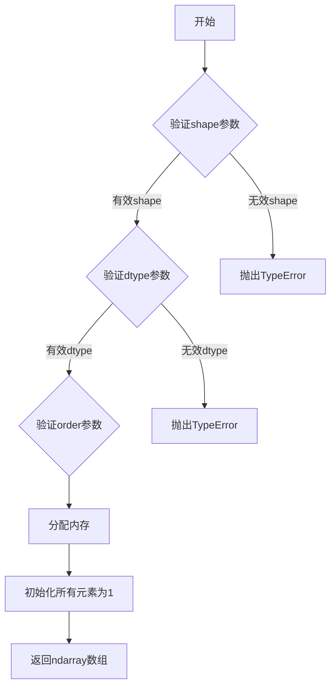

#### 带注释源码

```python
# np.ones 函数源码分析

# 用法示例1：创建长度为5的一维全1数组
arr1 = np.ones(5)
# 结果: array([1., 1., 1., 1., 1.])

# 用法示例2：创建2x3的二维全1数组
arr2 = np.ones((2, 3))
# 结果: array([[1., 1., 1.],
#            [1., 1., 1.]])

# 用法示例3：创建整数类型的全1数组
arr3 = np.ones(4, dtype=int)
# 结果: array([1, 1, 1, 1])

# 在直方图权重中的应用
# 这里的np.ones(len(xdata))创建与xdata长度相同的全1数组
# 用于将每个数据点的权重设置为1/N，实现归一化
weights = 1 / len(xdata) * np.ones(len(xdata))
# 等价于: weights = np.full(len(xdata), 1/len(xdata))
```


### `numpy.random.Generator.normal`

该函数是NumPy随机数生成器的正态（高斯）分布采样方法，通过指定形状大小生成符合标准正态分布（均值0、标准差1）的随机浮点数数组。在代码中用于生成1000个样本点，以便与理论概率密度函数进行可视化对比。

参数：

- `size`：`int` 或 `tuple of ints`，可选，输出数组的形状。若指定形状如(m, n, k)，则生成m * n * k个样本。默认值为None，表示返回单个标量值。在代码中传入1000，表示生成1000个随机数。
- `loc`：`float`，可选，正态分布的均值（中心），默认为0.0。代码中未指定，使用默认值。
- `scale`：`float`，可选，正态分布的标准差（宽度），默认为1.0。代码中未指定，使用默认值。

返回值：`ndarray` 或 `scalar`，返回从正态分布中抽取的随机数数组，类型为float64。代码中返回包含1000个元素的numpy数组。

#### 流程图

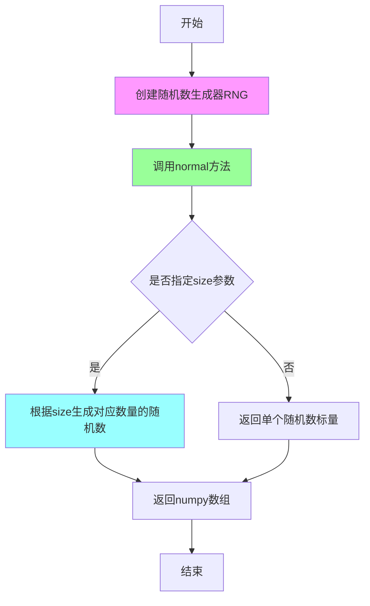

#### 带注释源码

```python
# 代码中的实际使用方式：
xdata = rng.normal(size=1000)  # 生成1000个标准正态分布随机数

# 详细解析：
# 1. 创建随机数生成器（带种子确保可重复性）
rng = np.random.default_rng(19680801)

# 2. 调用normal方法生成随机数
# 参数说明：
#   - size=1000: 生成1000个随机数
#   - loc未指定: 默认为0.0（均值）
#   - scale未指定: 默认为1.0（标准差）
xdata = rng.normal(size=1000)

# 3. 结果是一个numpy数组，形状为(1000,)
#    每个元素是服从标准正态分布 N(0,1) 的随机数

# 用途：与理论概率密度函数对比
xpdf = np.arange(-4, 4, 0.1)  # 创建理论PDF的x轴坐标
pdf = 1 / (np.sqrt(2 * np.pi)) * np.exp(-xpdf**2 / 2)  # 计算理论PDF
```


### `plt.subplots`

`plt.subplots` 是 Matplotlib 库中的一个函数，用于创建一个新的图形窗口并在其中创建指定布局的子图，返回图形对象（Figure）和坐标轴对象（Axes）或Axes数组。该函数是 Matplotlib 中最常用的创建图形的方式之一，支持灵活的行列布局和多种参数配置。

参数：
- `nrows`：整数（默认=1），子图网格的行数
- `ncols`：整数（默认=1），子图网格的列数
- `figsize`：tuple of (width, height)，以英寸为单位的图形尺寸
- `sharex`：布尔值或字符串（默认=False），是否共享x轴
- `sharey`：布尔值或字符串（默认=False），是否共享y轴
- `squeeze`：布尔值（默认=True），是否压缩返回的 Axes 数组维度
- `width_ratios`：array-like，可选，定义每列的相对宽度
- `height_ratios`：array-like，可选，定义每行的相对高度
- `layout`：字符串，可选，子图的布局方式（如 'constrained'）
- `**kwargs`：其他关键字参数，将传递给 Figure 的构造函数

返回值：`tuple of (Figure, Axes or array of Axes)`，返回创建的图形对象和坐标轴对象。如果 `squeeze=False`，始终返回二维 Axes 数组；如果 `squeeze=True`，则根据维度返回适当的数组。

#### 流程图

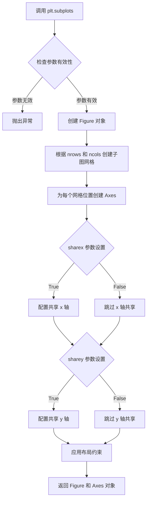

#### 带注释源码

```python
# 代码中 plt.subplots 的实际调用示例：

# 示例1：创建单个子图
fig, ax = plt.subplots()
# 解释：创建一个新的图形窗口和一个坐标轴对象
# 返回：fig 类型为 matplotlib.figure.Figure
#       ax 类型为 matplotlib.axes.Axes

# 示例2：在"Modifying bins"部分
fig, ax = plt.subplots()
ax.hist(xdata, bins=xbins, **style)
# 解释：创建图形用于展示修改后的直方图 bins

# 示例3：在"Normalizing histograms: density and weight"部分
fig, ax = plt.subplots()
ax.hist(xdata, bins=xbins, density=True, **style)
# 解释：创建图形用于展示 density=True 的归一化直方图

# 示例4：使用 layout='constrained' 创建受约束布局的图形
fig, ax = plt.subplots(layout='constrained', figsize=(3.5, 3))
# 解释：创建具有约束布局的图形，自动调整子图间距以避免重叠
# figsize 参数指定图形大小为 3.5 英寸宽，3 英寸高

# 注意：代码中还使用了 plt.subplot_mosaic，这是另一个相关函数
# 用于创建更复杂的子图布局（基于网格的命名子图）
fig, ax = plt.subplot_mosaic([['auto', 'n4']],
                             sharex=True, sharey=True, layout='constrained')
# 解释：创建 1行2列 的子图布局，'auto' 和 'n4' 是子图名称
```


### `plt.subplot_mosaic`

创建多子图马赛克布局，允许用户以网格形式排列多个子图，并可通过字典方式访问每个子图。

参数：

- `mosaic`：布局定义（str 或 list），定义子图的位置和名称，例如 `[['auto', 'n4']]` 表示一行两列的布局
- `sharex`：bool 或 str，可选，是否共享 x 轴，默认为 `False`
- `sharey`：bool 或 str，可选，是否共享 y 轴，默认为 `False`
- `width_ratios`：list，可选，定义每列的相对宽度
- `height_ratios`：list，可选，定义每行的相对高度
- `layout`：str，可选，布局约束方式，如 `'constrained'`、`'tight'`
- `**fig_kw`：传递给 `Figure` 构造函数的额外关键字参数，如 `figsize`

返回值：`tuple(Figure, dict)`，返回图形对象和子图轴的字典，其中键为子图名称，值为对应的 `Axes` 对象

#### 流程图

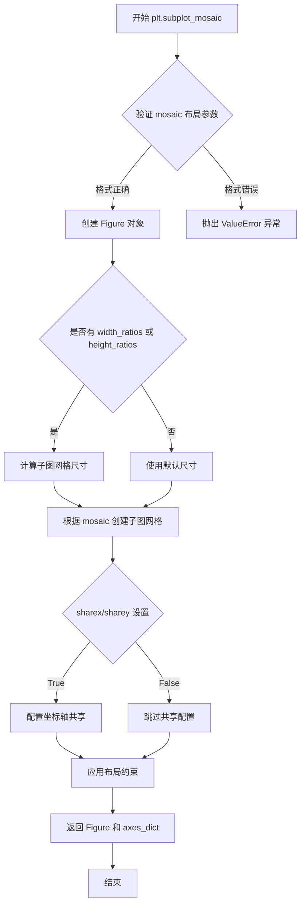

#### 带注释源码

```python
# plt.subplot_mosaic 是 matplotlib.pyplot 模块中的函数
# 以下代码展示了该函数在示例中的典型用法：

# 示例1：创建一行两列的子图布局，共享x和y轴
fig, ax = plt.subplot_mosaic(
    [['auto', 'n4']],          # mosaic: 定义子图布局，'auto'和'n4'是子图名称
    sharex=True,               # sharex: 所有子图共享x轴
    sharey=True,              # sharey: 所有子图共享y轴
    layout='constrained'      # layout: 使用约束布局算法
)

# 访问子图的方式：通过字典键访问
ax['auto'].hist(xdata, **style)    # 对'auto'子图添加直方图
ax['n4'].hist(xdata, bins=4, **style)  # 对'n4'子图添加直方图（4个bins）

# 示例2：创建两列子图，使用约束布局
fig, ax = plt.subplot_mosaic(
    [['False', 'True']],      # 两列布局，子图名称为'False'和'True'
    layout='constrained'       # 使用约束布局自动调整间距
)

# 示例3：创建三列子图，指定图形尺寸
fig, ax = plt.subplot_mosaic(
    [['no_norm', 'density', 'weight']],  # 三列布局
    layout='constrained', 
    figsize=(8, 4)           # 图形尺寸：宽8英寸，高4英寸
)

# 返回值说明：
# fig: matplotlib.figure.Figure 对象，整个图形
# ax: dict 对象，键为子图名称（如'auto', 'n4', 'False', 'True'等）
#      值为对应的 matplotlib.axes.Axes 对象
```


### `Axes.hist` / `ax.hist`

绘制直方图，用于将数据分成若干个 bins（箱子），并统计每个 bin 中的数据数量或加权计数。该方法支持自动或手动设置 bin 边界、归一化（density）、加权（weights）等多种灵活的配置方式，是 Matplotlib 中进行数据分布可视化的核心方法。

参数：

- `x`：`numpy.ndarray` 或类数组，要绘制直方图的数据数组
- `bins`：可选参数，支持多种类型：
  - `int`：自动选择的 bin 数量
  - `str`：使用 numpy 的 bin 策略（如 'auto', 'fd', 'scott' 等）
  - `numpy.ndarray`：显式指定 bin 的边界值
- `range`：可选参数，`tuple`，指定数据的范围 (min, max)，用于计算 bin
- `density`：可选参数，`bool`，如果为 True，则归一化为概率密度函数，使积分等于 1
- `weights`：可选参数，`numpy.ndarray`，与 x 形状相同的数组，为每个数据点指定权重
- `cumulative`：可选参数，`bool`，如果为 True，则绘制累积直方图
- `bottom`：可选参数，`array-like`，每个 bin 的底边基准值（用于堆叠直方图）
- `histtype`：可选参数，`str`，直方图类型，可选值包括 'bar'（条形）、'step'（阶梯线）、'stepfilled'（填充的阶梯）
- `align`：可选参数，`str`，对齐方式，可选 'left', 'mid', 'right'
- `orientation`：可选参数，`str`，方向，可选 'horizontal'（水平）或 'vertical'（垂直）
- `rwidth`：可选参数，`float`，条形相对宽度
- `log`：可选参数，`bool`，如果为 True，则使用对数刻度
- `color`：可选参数，`color` 或颜色列表，直方图颜色
- `label`：可选参数，`str`，图例标签
- `stacked`：可选参数，`bool`，如果为 True，则多个数据集堆叠显示
- `**：其他关键字参数传递给 `matplotlib.patches.Rectangle`（用于条形图）或 `matplotlib.lines.Line2D`（用于阶梯图）

返回值：`tuple`，包含三个元素：
- `n`：`numpy.ndarray`，每个 bin 中的计数/数量
- `bins`：`numpy.ndarray`，bin 的边界值（长度为 n+1）
- `patches`：列表或列表的列表，`matplotlib.patches.Patch` 对象，用于每个条形或阶梯

#### 流程图

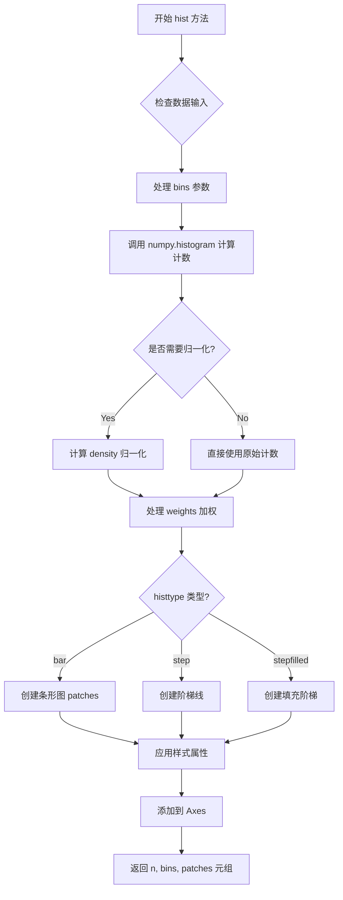

#### 带注释源码

由于用户提供的代码是 `ax.hist()` 的调用示例，而非方法实现源码，以下为调用方式和使用示例的注释说明：

```python
import matplotlib.pyplot as plt
import numpy as np

# 创建随机数生成器，种子为 19680801
rng = np.random.default_rng(19680801)

# 示例数据
xdata = np.array([1.2, 2.3, 3.3, 3.1, 1.7, 3.4, 2.1, 1.25, 1.3])
xbins = np.array([1, 2, 3, 4])  # 显式指定 bin 边界：[1,2), [2,3), [3,4)

# 定义直方图条形的样式
style = {'facecolor': 'none', 'edgecolor': 'C0', 'linewidth': 3}

# 创建图形和 Axes 对象
fig, ax = plt.subplots()

# 调用 hist 方法绘制直方图
# 参数：
#   xdata: 要绘制的数据
#   bins: 指定 bin 边界为 xbins
#   **style: 解包样式字典作为额外关键字参数
ax.hist(xdata, bins=xbins, **style)

# 在 x 轴上标记数据点位置
ax.plot(xdata, 0*xdata, 'd')
ax.set_ylabel('Number per bin')
ax.set_xlabel('x bins (dx=1.0)')

# ========================
# 归一化直方图示例
# ========================
# 使用 density=True 将直方图归一化为概率密度函数
# 使积分等于 1，适合与理论概率密度函数比较
fig, ax = plt.subplots()
ax.hist(xdata, bins=xbins, density=True, **style)
ax.set_ylabel('Probability density [$V^{-1}$])')
ax.set_xlabel('x bins (dx=0.5 $V$)')

# ========================
# 加权直方图示例
# ========================
# 使用 weights 参数为每个数据点分配权重
# 权重 = 1/N 可使直方图归一化为概率质量函数（求和等于 1）
ax.hist(xdata, bins=xbins, weights=1/len(xdata) * np.ones(len(xdata)),
               histtype='step', label=f'{dx}')

# ========================
# 多种数据比较示例
# ========================
# 创建 2x3 布局的子图，比较不同归一化方式
fig, ax = plt.subplot_mosaic([['no_norm', 'density', 'weight']],
                             layout='constrained', figsize=(8, 4))

xbins = np.arange(-4, 4, 0.25)

# 无归一化 - 显示原始计数
ax['no_norm'].hist(xdata, bins=xbins, histtype='step')
ax['no_norm'].hist(xdata2, bins=xbins, histtype='step')

# density=True - 归一化为概率密度
ax['density'].hist(xdata, bins=xbins, histtype='step', density=True)

# weights - 自定义权重归一化
ax['weight'].hist(xdata, bins=xbins, histtype='step',
                  weights=1 / len(xdata) * np.ones(len(xdata)),
                  label='N=1000')

plt.show()
```


### `Axes.plot`

在 matplotlib 中，`Axes.plot` 是 Axes 类的一个方法，用于在 Axes 对象上绘制线条或标记的函数。它接受可变数量的位置参数（x, y 数据）和关键字参数（用于自定义线条样式、颜色、标记等）。

参数：

- `*args`：位置参数，可以是以下几种形式：
  - `y`：仅传入 y 轴数据，x 轴自动生成从 0 开始的索引
  - `x, y`：分别传入 x 和 y 轴数据
  - `x, y, format_string`：x 数据、y 数据和格式字符串（如 'ro' 表示红色圆圈）
- `**kwargs`：关键字参数，用于自定义线条属性，如 `color`、`linewidth`、`linestyle`、`marker`、`markersize` 等。具体的关键字参数会传递给 `Line2D` 对象。

返回值：返回包含 `Line2D` 对象列表的列表，通常是 `list[Line2D]`。每个 `Line2D` 代表一条绘制的线条。

#### 流程图

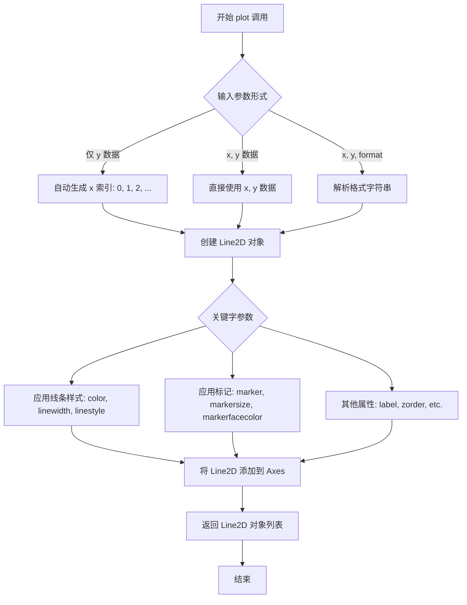

#### 带注释源码

```python
# 在 provided code 中的实际调用示例：

# 绘制 xdata 在 x 轴上的数据点位置
# xdata: x 轴数据
# 0*xdata: y 轴数据（全零，将数据点绘制在 x 轴上）
# 'd': 格式字符串，'d' 表示菱形标记 (diamond marker)
ax.plot(xdata, 0*xdata, 'd')

# 等价于更详细的写法：
ax.plot(xdata, 0*xdata, marker='d', color='C0', linestyle='None')

# 说明：
# - xdata: array_like, x 坐标数据
# - 0*xdata: array_like, y 坐标数据（全零数组）
# - 'd': str, 标记样式（diamond）
# 返回值: list of Line2D, 包含创建的线条对象
```

#### 实际代码上下文

```python
# 代码上下文片段
fig, ax = plt.subplots()
ax.hist(xdata, bins=xbins, **style)

# plot the xdata locations on the x axis:
ax.plot(xdata, 0*xdata, 'd')  # 在 x 轴上标记出每个数据点的位置
ax.set_ylabel('Number per bin')
ax.set_xlabel('x bins (dx=1.0)')
```

#### Line2D 常用关键字参数（kwargs）

| 参数名 | 类型 | 描述 |
|--------|------|------|
| `color` | str/color | 线条颜色 |
| `linewidth` | float | 线条宽度 |
| `linestyle` | str | 线条样式 ('-', '--', '-.', ':') |
| `marker` | str | 标记样式 ('o', 's', '^', 'd', etc.) |
| `markersize` | float | 标记大小 |
| `markerfacecolor` | color | 标记填充颜色 |
| `label` | str | 图例标签 |
| `zorder` | int | 绘制顺序 |


### `Axes.set_xlabel`

设置 x 轴的标签文本，用于描述 x 轴所表示的变量或数据含义。该方法返回一个 `matplotlib.text.Text` 对象，可用于进一步自定义标签的样式属性。

参数：

- `xlabel`：`str`，要设置的 x 轴标签文本内容，例如 "时间 (s)" 或 "x bins (dx=1.0)"
- `fontdict`：`dict`，可选，用于控制文本样式的字典，键值对对应 `matplotlib.text.Text` 的属性（如 fontsize、color 等）
- `labelpad`：`float`，可选，标签与坐标轴之间的间距，默认为 None（使用 Matplotlib 的默认值）
- `loc`：`str`，可选，标签在轴上的对齐位置，可选值为 'left'、'center'（默认）、'right'
- `**kwargs`：可选，关键字参数传递给底层 `Text` 对象，用于自定义字体、颜色、对齐等属性

返回值：`matplotlib.text.Text`，返回创建的文本标签对象，可用于后续样式调整或获取标签位置信息

#### 流程图

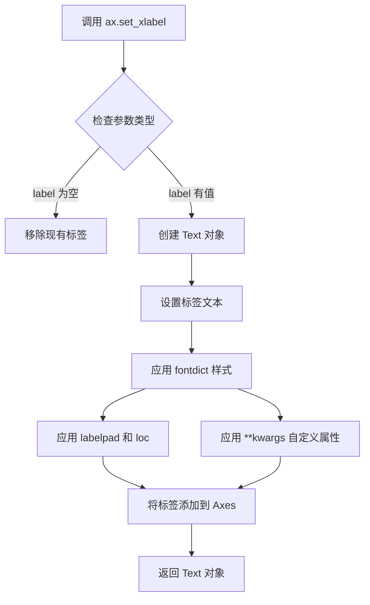

#### 带注释源码

```python
def set_xlabel(self, xlabel, fontdict=None, labelpad=None, *, loc=None, **kwargs):
    """
    Set the label for the x-axis.
    
    Parameters
    ----------
    xlabel : str
        The label text.
    fontdict : dict, optional
        A dictionary controlling the appearance of the label text.
    labelpad : float, optional
        Spacing in points between the label and the axis spine.
    loc : {'left', 'center', 'right'}, default: 'center'
        The label position relative to the axis.
    **kwargs
        Text properties control the appearance of the label.
    
    Returns
    -------
    label : `.Text`
        The created text label.
    """
    # 获取 y 轴位置（xlabel 通常显示在底部）
    y_axis_position = self.spines['bottom'].get_position()[0]
    
    # 如果传入了 fontdict，将其转换为关键字参数
    if fontdict is not None:
        kwargs.update(fontdict)
    
    # 设置标签位置和文本
    # labelpad 控制标签与轴之间的间距
    # loc 控制水平对齐方式
    label = self.text(
        0.5, -labelpad,  # x=0.5 表示居中, y=-labelpad 表示在轴下方
        xlabel,
        transform=self.transAxes,  # 使用轴坐标系
        ha='center',  # 水平居中
        va='top',  # 顶部对齐
        loc=loc,  # 位置参数
        **kwargs
    )
    
    # 设置标签的 y 坐标为轴位置
    label.set_y(-labelpad if labelpad is not None else -labelpad)
    
    # 将标签与 x 轴关联
    self.xaxis.set_label_text(xlabel)
    self.xaxis.set_label_coords(0.5, -labelpad if labelpad else 0)
    
    return label
```


### `Axes.set_ylabel`

设置Y轴标签，用于在图表的Y轴旁边显示描述性文本标签。

参数：

- `label`：`str`，要显示的Y轴标签文本内容
- `fontdict`：`dict`，可选，控制标签外观的字典（如字体大小、颜色等）
- `labelpad`：`float`，可选，标签与坐标轴之间的间距（单位：磅）
- `loc`：`str`，可选，标签位置（'center'、'left'、'right'）
- `**kwargs`：其他文本属性参数（如 fontsize、color、fontweight 等）

返回值：`matplotlib.text.Text`，返回创建的文本对象，可用于进一步自定义标签外观

#### 流程图

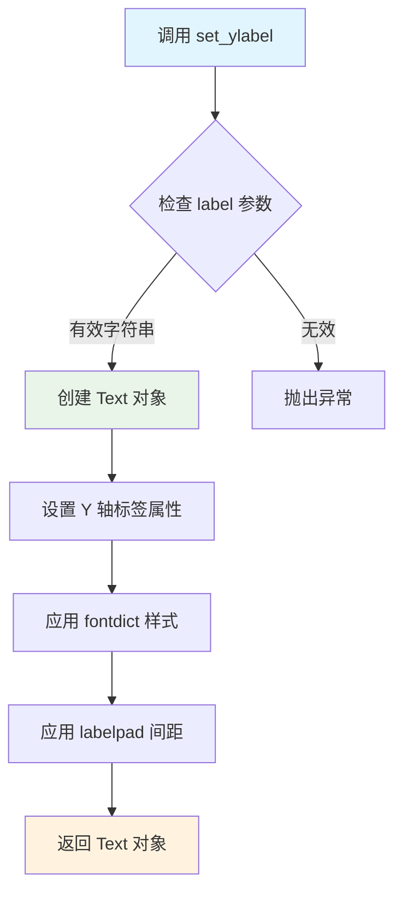

#### 带注释源码

```python
def set_ylabel(self, label, fontdict=None, labelpad=None, *, loc=None, **kwargs):
    """
    Set the label for the y-axis.
    
    Parameters
    ----------
    label : str
        The label text.
    fontdict : dict, optional
        A dictionary controlling the appearance of the label, e.g.,
        {'fontsize': 16, 'fontweight': 'bold', 'color': 'red'}.
    labelpad : float, default: rcParams["axes.labelpad"]
        Spacing in points between the label and the y-axis.
    loc : {'center', 'left', 'right'}, default: rcParams["axes.label_loc"]
        The location of the label.
    **kwargs
        Text properties control the appearance of the label.
    
    Returns
    -------
    matplotlib.text.Text
        The created Text instance. This can be used to further modify
        the label after it has been created.
    
    Examples
    --------
    >>> ax.set_ylabel('Number per bin')
    >>> ax.set_ylabel('Probability density', fontsize=12, color='blue')
    """
    # 获取默认的 labelpad 值（从 rcParams 或默认值）
    if labelpad is None:
        labelpad = rcParams["axes.labelpad"]
    
    # 获取默认的 loc 值
    if loc is None:
        loc = rcParams["axes.label_loc"]
    
    # 创建文本对象，设置 y 轴标签位置为左侧
    return self.yaxis.set_label_text(label, fontdict=fontdict, 
                                      labelpad=labelpad, loc=loc, **kwargs)
```


### `Axes.set_title`

设置图表的标题文本，用于在图表顶部显示标题信息。

参数：

- `title`：`str`，要设置的标题文本内容

返回值：`Text`，返回设置的标题文本对象（matplotlib.text.Text），可以用于后续对标题样式进行进一步修改

#### 流程图

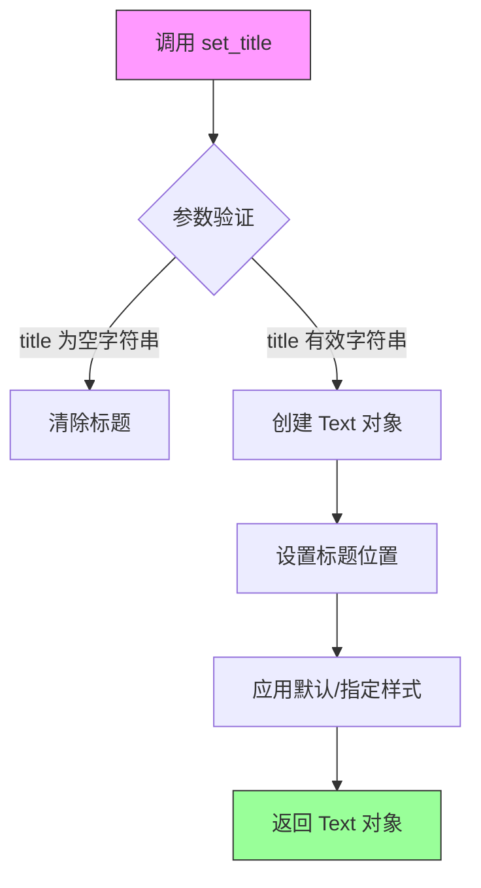

#### 带注释源码

```python
def set_title(self, label, loc=None, pad=None, *, y=None, **kwargs):
    """
    Set a title for the axes.
    
    Parameters
    ----------
    label : str
        Title text string to be displayed.
        
    loc : {'center', 'left', 'right'}, default: :rc:`axes.titlelocation`
        Which title to set.
        
    pad : float, default: :rc:`axes.titlepad`
        The pad in points between the title and the top of the Axes.
        
    y : float, default: :rc:`axes.titley`
        The y position of the title in normalized axes coordinates.
        
    **kwargs
        Text properties control the appearance of the title:
        - fontsize, fontweight, fontstyle
        - color, backgroundcolor
        - rotation, verticalalignment
        等等其他 Text 属性
    
    Returns
    -------
    `.Text`
        The matplotlib text object representing the title.
    
    Examples
    --------
    >>> ax.set_title('My Plot Title')
    >>> ax.set_title('Left Title', loc='left')
    >>> ax.set_title('Custom Title', fontsize=12, color='red')
    """
    # 获取标题位置参数，默认为 'center'
    if loc is None:
        loc = mpl.rcParams['axes.titlelocation']
        
    # 获取标题与顶部的间距
    if pad is None:
        pad = mpl.rcParams['axes.titlepad']
        
    # 获取 y 轴位置
    if y is None:
        y = mpl.rcParams['axes.titley']
    
    # 创建 Text 对象，设置标题文本和位置
    title = Text(x=0.5, y=1, text=label)
    
    # 设置标题在 Axes 中的位置（left/center/right）
    if loc == 'left':
        title.set_x(0)
        title.set_ha('left')
    elif loc == 'right':
        title.set_x(1)
        title.set_ha('right')
    else:  # center
        title.set_x(0.5)
        title.set_ha('center')
    
    # 设置 y 位置和间距
    title.set_y(y)
    if pad != 0:
        title.set_y(y - pad / 72.0 / self.figure.dpi * self.get_figheight())
    
    # 应用文本属性
    title.update(kwargs)
    
    # 将标题添加到 axes 中
    self._add_text(title)
    
    return title
```


### `Axes.legend`

`Axes.legend` 是 Matplotlib 中 Axes 类的成员方法，用于在 Axes 上创建和显示图例（Legend），图例用于标识图中各个数据系列（如线条、柱状图、散点等）所代表的含义，支持通过关键字参数自定义图例的位置、样式、字体、边框等属性。

参数：

-  `*args`：可变位置参数，支持两种调用方式：1) 传递图例句柄和标签列表，如 `legend(handles, labels)`；2) 传递自动选择的图例项，如 `legend(['line1', 'line2'])` 或不传参数使用自动检测
-  `loc`：字符串或二元组，图例位置，如 `'upper right'`、`'best'`（自动选择）、`(x, y)` 坐标等，默认为 `'best'`
-  `bbox_to_anchor`：二元组或四元组，用于指定图例框的锚点位置，例如 `(1, 0.5)` 表示图例右侧居中
-  `ncol`：整数，图例列数，默认为 1
-  `prop`：字典或 `matplotlib.font_manager.FontProperties`，图例文本字体属性
-  `fontsize`：整数或字符串，图例字体大小，可为 `'small'`、`'large'` 或具体数值
-  `labelcolor`：字符串或列表，图例标签颜色，可为 `'linecolor'`（与线条同色）、`'markeredgecolor'` 等
-  `title`：字符串，图例标题
-  `title_fontsize`：整数，图例标题字体大小
-  `frameon`：布尔值，是否绘制图例边框
-  `framealpha`：浮点数，图例背景透明度
-  `fancybox`：布尔值，是否使用圆角边框
-  `shadow`：布尔值，是否添加阴影
-  `edgecolor`：字符串，图例边框颜色
-  `facecolor`：字符串，图例背景颜色
-  `loc_mode`：字符串，图例定位模式

返回值：`matplotlib.legend.Legend`，返回创建的 Legend 对象，可用于进一步操作如图例句柄的增删改查

#### 流程图

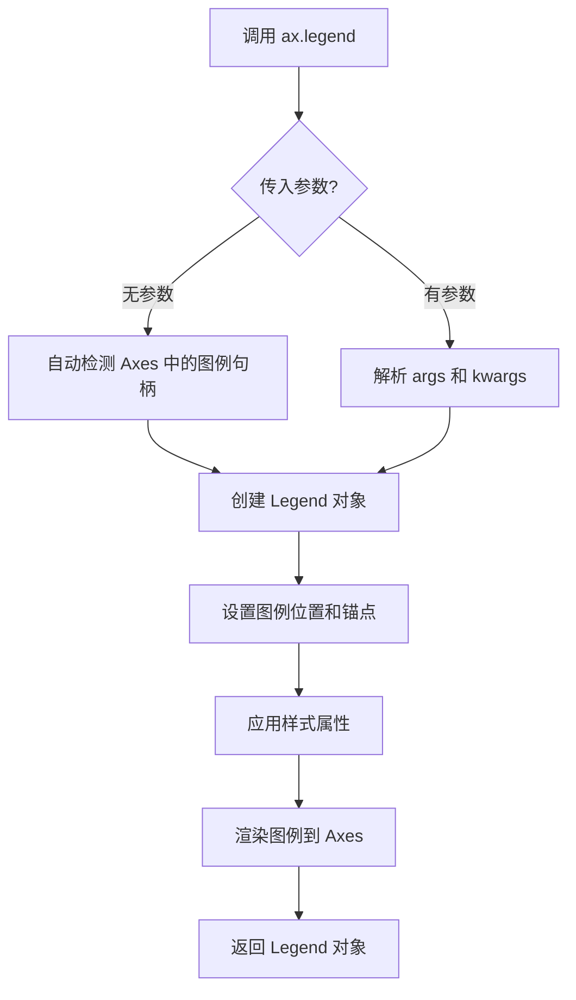

#### 带注释源码

```python
def legend(self, *args, **kwargs):
    """
    Place a legend on the axes.
    
    Parameters
    ----------
    *args : mixed
        Call signatures::
        
            legend()
            legend(handles, labels)
            legend(handles=[...], labels=[...])
            legend(labels=[...])
        
    loc : str or pair of floats, default: 'upper right'
        The location of the legend. Possible codes are:
        
        =================== =============
        Location String     Location Code
        =================== =============
        'best'              0
        'upper right'       1
        'upper left'        2
        'lower left'        3
        'lower right'       4
        'right'             5
        'center left'       6
        'center right'      7
        'lower center'      8
        'upper center'      9
        'center'           10
        =================== =============
        
    bbox_to_anchor : pair of floats
        Bounding box anchor position that will be adjusted
        to fit the legend in the given location.
        
    ncol : int
        Number of columns. Default is 1.
        
    prop : dict or `~matplotlib.font_manager.FontProperties`
        Font properties.
        
    **kwargs : `~matplotlib.legend.Legend` properties
        Other keyword arguments are passed to `~matplotlib.legend.Legend`.
        
    Returns
    -------
    `~matplotlib.legend.Legend`
    
    See Also
    --------
    :func:`matplotlib.pyplot.legend`
    """
    # 调用 Legend 类的工厂方法创建图例
    return Legend(self, *args, **kwargs)
```


### `plt.show`

显示所有打开的图形窗口。该函数会调用所有当前打开的 figure 的显示函数，通常会阻塞程序执行直到用户关闭图形窗口（在交互式后端中）。

参数：

- `*`：可变位置参数（不接受任何强制位置参数）
- `block`：`bool` 或 `None`，可选参数。默认为 `None`。如果设置为 `True`，则阻塞执行并启动事件循环；如果设置为 `False`，则在某些后端中可能不会阻塞；如果是 `None`，则根据后端类型决定是否阻塞。

返回值：`None`，无返回值。

#### 流程图

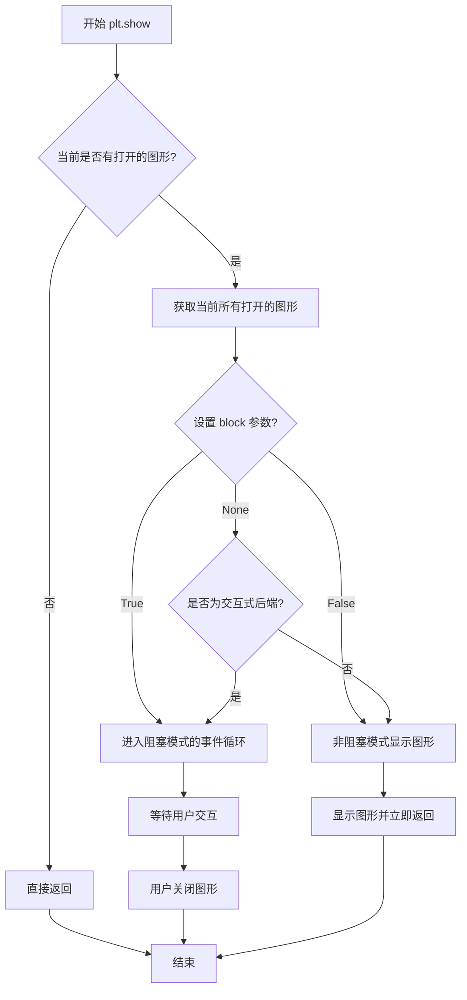

#### 带注释源码

```python
# 导入 matplotlib 的 pyplot 模块，通常使用别名 plt
import matplotlib.pyplot as plt

# ... 前面代码创建了多个 figure 和 axes ...

# 调用 plt.show() 显示所有之前创建的图形
# 在交互式环境中（如 Jupyter notebook），可能需要使用 %matplotlib inline
# 在非交互式后端中，这会保存图形到文件或显示在窗口中
plt.show()

# %%
# 下面是 plt.show() 的典型调用方式说明：
#
# 1. 基本调用（阻塞模式，取决于后端）:
#    plt.show()
#
# 2. 非阻塞调用（仅适用于某些后端如 TkAgg）:
#    plt.show(block=False)
#
# 3. 在创建图形后立即调用以显示结果
```

## 关键组件


### 直方图创建 (ax.hist)

使用matplotlib的Axes.hist方法创建直方图，支持灵活的数据分箱和可视化

### Bin定义与修改

通过numpy数组定义直方图的bin边缘，支持固定边缘和自动计算两种方式

### 密度归一化 (density参数)

将直方图归一化为概率密度函数，使直方图面积积分为1，便于与理论概率分布比较

### 权重处理 (weights参数)

通过weights参数为每个数据点分配权重，实现自定义归一化（如weights=1/N得到概率质量函数）

### 直方图类型 (histtype)

支持不同风格的直方图渲染，包括默认的'bar'和线条形式的'step'

### 多子图布局 (subplot_mosaic)

使用subplot_mosaic创建复杂的多子图布局，用于对比不同参数下的直方图效果

### 数据集生成与分布比较

生成正态分布随机数据，与理论概率密度函数进行可视化对比

### 不等宽Bin处理

演示处理不同宽度bin的直方图，通过密度归一化保持分布形状的一致性


## 问题及建议


### 已知问题

- **变量重复赋值**：代码中多次重新赋值 `xdata` 和 `xbins` 变量，导致前后的数据上下文关联性降低，容易造成混淆，尤其是在调试时难以追踪变量的历史状态
- **代码高度重复**：多处代码重复创建 figure、axes，设置相同的 xlabel、ylabel，以及使用相似的 style 参数，未提取公共代码逻辑
- **魔法数字分散**：随机种子 `19680801`、x 轴范围 `-4, 4`、bin 宽度 `0.1, 0.4, 1.2` 等数值在代码中多处重复出现，缺乏统一的常量定义
- **缺少函数封装**：所有代码平铺在一个脚本中，没有将直方图绘制逻辑封装成可重用的函数，导致代码冗长且难以维护
- **文档与实现不一致**：注释中提到 "The Matplotlib hist method calls numpy.histogram"，但实际 matplotlib 有自己的实现逻辑，可能造成误导
- **变量作用域不清晰**：在循环中使用的 `nn`、`dx` 等临时变量在循环结束后仍然存在于作用域中
- **缺少错误处理**：代码未对输入数据的有效性进行检查，如 `xdata` 为空、bin 边界不合理等情况
- **布局方式不一致**：部分地方使用 `plt.subplots()`，部分使用 `plt.subplot_mosaic()`，风格不统一

### 优化建议

- **提取公共函数**：将创建直方图的公共逻辑封装成函数，如 `create_histogram(ax, data, bins, **kwargs)`，减少代码重复
- **定义常量或配置字典**：将魔法数字提取为常量或配置字典，如 `X_RANGE = (-4, 4)`、`BIN_WIDTHS = [0.1, 0.4, 1.2]`
- **优化变量管理**：避免重复使用相同变量名，或使用更有描述性的变量名，如 `xdata_normal`、`xdata_small` 来区分不同数据集
- **更新文档注释**：修正关于 numpy.histogram 的描述，使其与实际实现一致
- **添加数据验证**：在绘制直方图前添加输入数据的有效性检查
- **统一代码风格**：统一使用相同的子图创建方式，如统一使用 `plt.subplot_mosaic` 或封装成通用的子图创建函数
- **考虑使用面向对象设计**：将直方图相关的配置和绘制逻辑封装到类中，提高代码的组织性和可测试性


## 其它


### 设计目标与约束

本示例旨在展示Matplotlib中`Axes.hist`方法的多种使用方式，包括基本直方图创建、bin大小调整、自动bin选择、概率密度归一化（density参数）以及加权直方图（weights参数）。约束条件包括：数据必须为数值型数组，bins必须为有序边界，density和weights参数互斥时需注意计算逻辑。

### 错误处理与异常设计

代码中未显式包含错误处理机制。在实际`hist`方法调用中，可能的异常包括：输入数据为空或非数值型时抛出ValueError；bins参数格式不正确时抛出异常；weights数组长度与数据不匹配时抛出异常。用户应确保输入数据有效性。

### 数据流与状态机

数据流从原始数组（如xdata、xdata2）开始，经过直方图计算（调用numpy.histogram）转换为bin边界和计数，然后通过Matplotlib渲染为条形图。状态机涉及直方图类型转换：默认计数模式 → density归一化模式 → weights归一化模式。

### 外部依赖与接口契约

主要依赖包括：numpy提供数值计算和histogram函数，matplotlib提供绘图接口。核心接口为`ax.hist(data, bins, density, weights, histtype)`，其中data为输入数组，bins可指定为整数（自动选择）或边界数组，density为布尔值控制概率密度归一化，weights为与data等长的权重数组。

### 性能考虑

对于大数据集（示例中1000个点），直方图计算性能主要取决于numpy.histogram的效率。当使用density=True时，需额外计算bin宽度（np.diff(bins)）并进行归一化运算。不同bin宽度的多次调用会重复计算，建议预先确定最优bin数量。

### 安全性考虑

代码示例为教学性质，不涉及用户输入处理或网络请求。在生产环境中使用hist方法时，应验证输入数据的类型和范围，防止非数值数据导致计算错误或绘图异常。

### 可扩展性设计

示例展示了直方图的多种变体，可扩展方向包括：自定义histtype（如'step'、'barstacked'）、堆叠直方图（stacked=True）、对数尺度直方图（log=True）以及二维直方图（hist2d函数）。

### 测试策略

测试应覆盖：基本直方图创建及边界验证；density=True时积分验证（结果接近1）；weights参数正确性验证；不同bins设置（整数、数组、等差数列）；多种histtype对比；空数据和边界条件处理。

### 版本兼容性

代码使用Python 3语法和现代NumPy API（如rng.normal替代旧版np.random.normal）。需确保matplotlib版本支持subplot_mosaic方法（3.4+）和layout='constrained'参数。

### 图表布局与视觉设计

示例展示了使用subplot_mosaic进行复杂布局的方法，以及style字典统一设置条形图外观（facecolor、edgecolor、linewidth）。直方图与理论PDF曲线叠加时需注意坐标轴标签和图例的清晰呈现。

    