# `matplotlib\galleries\examples\statistics\multiple_histograms_side_by_side.py` 详细设计文档

该脚本使用matplotlib绘制三个并排的水平直方图，通过np.histogram计算直方图数据，使用ax.barh绘制对称的水平条形图，模拟类似小提琴图的视觉效果，用于比较三个不同样本集的分布情况。

## 整体流程

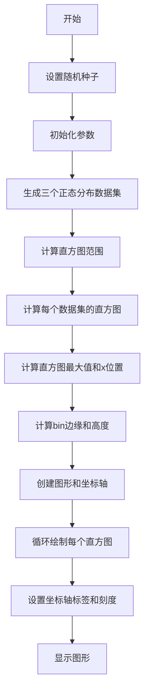

## 类结构

```
无类结构（脚本文件）
```

## 全局变量及字段


### `np`
    
NumPy库，提供数组操作和数学函数支持

类型：`numpy module`
    


### `plt`
    
Matplotlib绘图库，提供绘图接口

类型：`matplotlib.pyplot module`
    


### `number_of_bins`
    
直方图的bin数量，决定直方图的粒度

类型：`int`
    


### `number_of_data_points`
    
每个数据集中的数据点数量

类型：`int`
    


### `labels`
    
数据集的标签列表，用于x轴显示

类型：`list`
    


### `data_sets`
    
三个正态分布生成的数据集列表

类型：`list`
    


### `hist_range`
    
直方图的范围，由所有数据的最小值和最大值组成

类型：`tuple`
    


### `binned_data_sets`
    
三个数据集的直方图计数结果列表

类型：`list`
    


### `binned_maximums`
    
每个直方图计数的最大值数组，用于确定水平直方图的宽度

类型：`ndarray`
    


### `x_locations`
    
每个直方图在x轴上的位置坐标

类型：`ndarray`
    


### `bin_edges`
    
直方图的bin边缘数组，用于划分数据区间

类型：`ndarray`
    


### `heights`
    
每个bin的高度，等于相邻bin边缘的差值

类型：`ndarray`
    


### `centers`
    
每个bin的中心位置坐标，用于确定水平条形图的y位置

类型：`ndarray`
    


### `fig`
    
Matplotlib的图形对象，表示整个图形窗口

类型：`Figure`
    


### `ax`
    
Matplotlib的坐标轴对象，用于绘制图形元素

类型：`Axes`
    


    

## 全局函数及方法


### `np.random.seed`

设置 NumPy 随机数生成器的种子，以确保后续随机操作的可重现性。通过初始化随机数生成器的内部状态，使得每次使用相同种子时能够产生相同的随机数序列，这对于调试、单元测试和科学实验的可重复性至关重要。

参数：

- `seed`：`int` 或 `None`，随机数生成器的种子值。如果设置为 `None`，则从操作系统或系统硬件获取随机熵源以生成随机种子；如果为整数，则使用该整数作为种子，生成可重现的随机数序列。

返回值：`None`，该函数无返回值，直接修改 NumPy 全局随机数生成器的内部状态。

#### 流程图

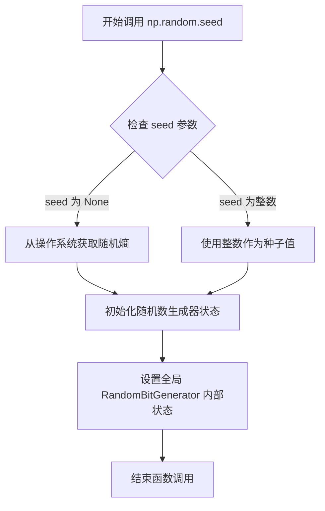

#### 带注释源码

```python
# 调用 numpy.random 模块的 seed 函数
# 传入整数 19680801 作为随机种子
# 该种子值来源于 matplotlib 官方示例的日期编码 (1968年8月1日)
np.random.seed(19680801)

# 作用说明：
# 1. 初始化 numpy 内部的随机数生成器
# 2. 确保后续所有 np.random.xxx 调用产生的随机数序列是确定的
# 3. 使得示例程序每次运行都生成相同的数据集，便于结果复现
# 4. 这是科学可视化和统计仿真中的常见做法，保证实验可重复性
```


### `np.random.normal`

该函数是 NumPy 库中的随机数生成函数，用于从正态分布（高斯分布）中生成随机样本。调用时指定均值（loc）和标准差（scale），可控制分布的位置和分散程度，并通过 size 参数指定输出数组的形状。

参数：

- `loc`：`float`，正态分布的均值（μ），即分布的中心位置，默认值为 `0.0`
- `scale`：`float`，正态分布的标准差（σ），控制数据的分散程度，默认值为 `1.0`
- `size`：`int` 或 `tuple of ints`，可选，输出数组的形状，默认为 `None`，表示返回单个标量值

返回值：`float` 或 `ndarray`，从正态分布中生成的随机样本。如果 `size` 为 `None`，返回单个浮点数；如果 `size` 为整数，返回相应长度的一维数组；如果 `size` 为元组，返回对应形状的多维数组

#### 流程图

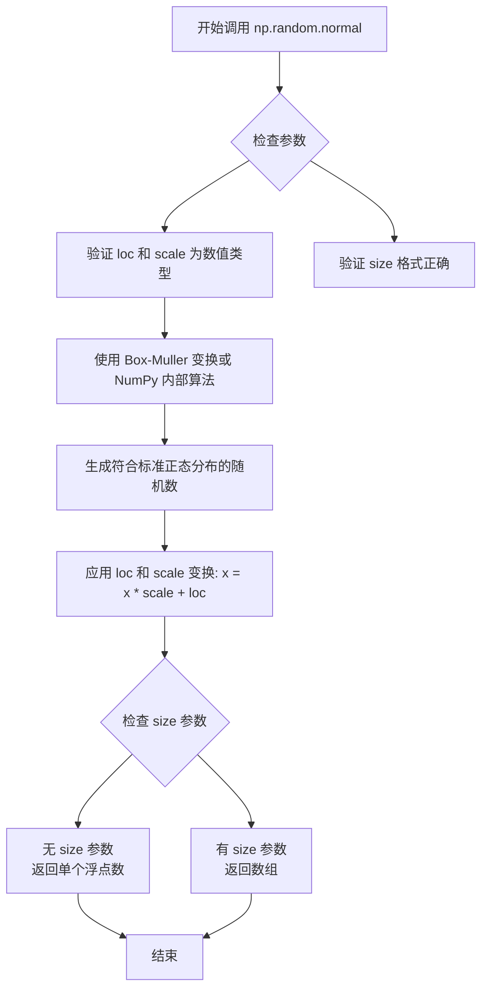

#### 带注释源码

```python
# np.random.normal 函数实现原理（简化版）

# 调用示例：
# np.random.normal(loc=0, scale=1, size=387)

# 参数说明：
# - loc=0: 正态分布的均值（μ），决定分布的中心位置
# - scale=1: 正态分布的标准差（σ），决定数据的分散程度
# - size=387: 输出387个随机样本，组成一维数组

# 函数内部核心逻辑（Box-Muller 变换简化示意）:
# 1. 生成两个均匀分布的随机数 u1, u2 ∈ (0, 1)
# 2. 计算 z0 = sqrt(-2 * ln(u1)) * cos(2π * u2)  # 标准正态分布样本
# 3. 应用变换: result = z0 * scale + loc
# 4. 根据 size 参数返回单个值或数组

# 在本示例代码中的具体使用：
number_of_data_points = 387
data_sets = [
    np.random.normal(0, 1, number_of_data_points),    # 生成387个均值为0、标准差为1的正态分布数据
    np.random.normal(6, 1, number_of_data_points),    # 生成387个均值为6、标准差为1的正态分布数据
    np.random.normal(-3, 1, number_of_data_points)   # 生成387个均值为-3、标准差为1的正态分布数据
]
# 结果：data_sets[0] 包含387个服从 N(0,1) 的随机数
#      data_sets[1] 包含387个服从 N(6,1) 的随机数
#      data_sets[2] 包含387个服从 N(-3,1) 的随机数
```


### `np.min`

计算数组中的最小值。numpy库的核心函数，用于沿指定轴返回数组的最小值，或返回扁平化数组的最小值。

参数：

- `a`：`array_like`，输入数组或对象，在代码中为 `data_sets`（包含三个正态分布样本的列表）
- `axis`：`int`（可选），指定沿哪个轴计算最小值，默认为 None（扁平化）
- `out`：`ndarray`（可选），用于放置结果的输出数组
- `keepdims`：`bool`（可选），是否保持维度
- `initial`：`scalar`（可选），初始值
- `where`：`array_like`（可选），元素比较条件

返回值：`ndarray` 或 `scalar`，返回数组中的最小值。在代码中返回 `float` 类型，表示所有数据集中的最小值。

#### 流程图

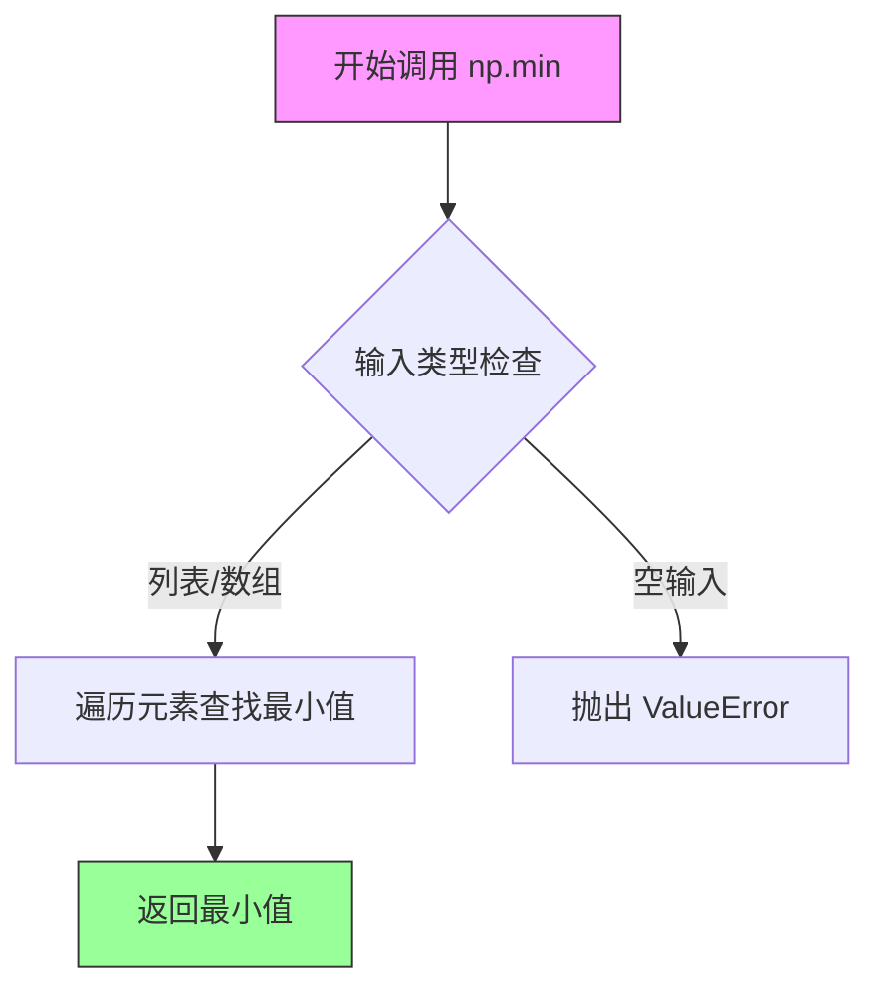

#### 带注释源码

```python
# np.min(data_sets) 在本代码中的调用
# data_sets 是包含三个 numpy 数组的列表
# 每个数组包含 387 个服从不同正态分布的随机数

# 语法: np.min(a, axis=None, out=None, keepdims=False, initial=<no value>, where=None)
# 参数说明:
#   - a: 输入数组 (这里是 list 类型的 data_sets，会被转换为 array)
#   - axis: 计算最小值的轴，None 表示扁平化后计算
#   - out, keepdims, initial, where: 可选参数，本例未使用

# 计算所有数据集中的全局最小值，用于确定直方图的统一范围
hist_range = (np.min(data_sets), np.max(data_sets))
# 结果示例: hist_range ≈ (-6.5, 8.5) 基于三个数据集的范围
```


### `np.max`

`np.max` 是 NumPy 库中的核心函数，用于计算数组中的最大值。当指定 `axis` 参数时，可以沿数组的特定轴计算最大值，返回每行（或每列）的最大值组成的数组。

参数：

- `binned_data_sets`：`list of ndarray`，输入的二维数组列表，包含了多个数据集的频数分布数据（本例中为 3 个数据集的直方图频数）
- `axis`：`int`（可选），指定沿哪个轴计算最大值。`axis=1` 表示沿第二个轴（即行方向）计算每行的最大值

返回值：`ndarray`，返回沿指定轴的最大值组成的数组。本例中返回三个数据集各自的最大频数

#### 流程图

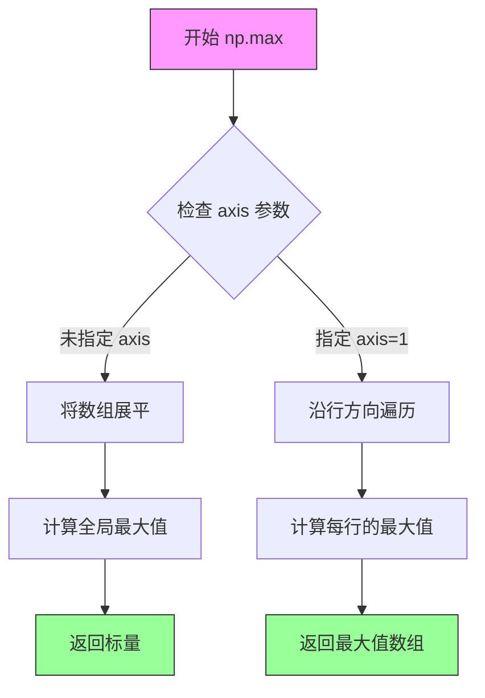

#### 带注释源码

```python
# 在本例代码中的实际使用
binned_data_sets = [
    np.histogram(d, range=hist_range, bins=number_of_bins)[0]
    for d in data_sets
]
# binned_data_sets 是一个包含3个数组的列表，每个数组有20个元素（20个bin的频数）

# 使用 np.max 计算每组数据的最大频数
# 参数 binned_data_sets: 二维数组，形状为 (3, 20)
# 参数 axis=1: 沿第二个轴（行）计算最大值，即对每行求最大值
binned_maximums = np.max(binned_data_sets, axis=1)

# 结果示例：假设 binned_data_sets = [[5, 3, 8, ...], [2, 7, 4, ...], [6, 1, 9, ...]]
# 则 binned_maximums = [8, 7, 9]（每行的最大值）
# 后续用于计算 x 坐标：x_locations = np.arange(0, sum(binned_maximums), np.max(binned_maximums))
```


### `np.histogram`

计算直方图函数，用于将数据分组到指定的bin中，返回每个bin中的数据计数以及bin的边界值。该函数是NumPy库的核心统计函数，常用于数据可视化和统计分析。

参数：

-  `a`：`numpy.ndarray` 或类数组，要计算直方图的一维输入数组
-  `bins`：`int` 或 `sequence`，bin的数量（若为int）或bin的边界值（若为sequence）
-  `range`：`tuple`，bin的上下范围，格式为(min, max)，指定计算直方图的数据区间
-  `density`：`bool`，可选，如果为True，则返回概率密度；若为False，则返回计数
-  `weights`：`array_like`，可选，与a形状相同的权重数组，用于对每个数据点加权
-  `cumulative`：`bool`，可选，如果为True，则计算累积直方图

返回值：`tuple`，包含两个numpy数组：
-  第一个元素：`numpy.ndarray`，直方图计数值，每个bin中的数据点数量
-  第二个元素：`numpy.ndarray`，bin边界值数组，长度为计数值数组长度+1

#### 流程图

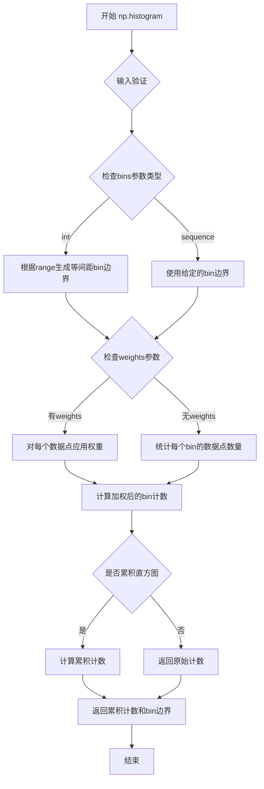

#### 带注释源码

```python
# 示例代码中的实际调用
binned_data_sets = [
    np.histogram(d, range=hist_range, bins=number_of_bins)[0]
    for d in data_sets
]

# np.histogram 函数的标准用法说明：
# np.histogram(a, bins=10, range=None, density=False, weights=None, cumulative=False)
#
# 参数说明：
# - a: 输入数据，一维数组
#   示例中：d 是从 data_sets 中取出的一个数据数组
#
# - bins: bin的数量或边界
#   示例中：number_of_bins = 20
#
# - range: 直方图的上下界
#   示例中：hist_range = (np.min(data_sets), np.max(data_sets))
#   作用：确保所有直方图使用相同的范围，便于比较
#
# 返回值：
#   tuple: (hist counts, bin edges)
#   示例中使用 [0] 只获取计数值，忽略bin边界
#
# 关键设计考量：
# 1. 使用相同range确保所有直方图的bin对齐
# 2. 使用相同bins数量确保可比性
# 3. 通过np.min和np.max动态计算范围，适应不同数据
```

#### 在示例代码中的具体使用

```python
# 完整上下文分析：

# 1. 数据准备
number_of_data_points = 387
data_sets = [np.random.normal(0, 1, number_of_data_points),  # 数据集A
             np.random.normal(6, 1, number_of_data_points),  # 数据集B
             np.random.normal(-3, 1, number_of_data_points)] # 数据集C

# 2. 计算公共范围（确保所有直方图可比较）
hist_range = (np.min(data_sets), np.max(data_sets))

# 3. 对每个数据集调用np.histogram
# 参数：
#   d: 单个数据集（numpy.ndarray）
#   range=hist_range: 公共范围 (min, max)
#   bins=number_of_bins: 20个bin
# 返回：tuple (counts, bin_edges)，取[0]获取counts
binned_data_sets = [
    np.histogram(d, range=hist_range, bins=number_of_bins)[0]
    for d in data_sets
]

# 4. 后续用于绘制水平条形图
# x_locations: 每个直方图的x轴位置
# lefts: 条形图的左边界（从中心向左延伸）
# ax.barh: 绘制水平条形图
```

#### 关键组件信息

| 组件名称 | 描述 |
|---------|------|
| `data_sets` | 三个正态分布生成的随机数据集，用于对比分析 |
| `hist_range` | 所有数据的全局最小值和最大值，确保bin对齐 |
| `number_of_bins` | 直方图的bin数量（20），控制粒度 |
| `binned_data_sets` | 三个数据集的直方图计数结果（二维数组） |
| `bin_edges` | 统一的bin边界，用于绘制条形图 |

#### 潜在技术债务与优化空间

1. **范围计算效率**：每次调用`np.min`和`np.max`遍历全部数据，可考虑预先计算或使用`np.ptp`一次遍历
2. **固定bin数量**：对于分布范围差异大的数据，可能需要自适应bin数量
3. **内存占用**：对于大数据集，直方图计算可能产生较多中间变量，可考虑流式处理
4. **重复计算**：`hist_range`在列表推导式外部计算是好的实践，但bin_edges在后续需要时已重新计算

#### 其它设计考量

- **设计目标**：创建对称的水平直方图，类似于小提琴图，用于多组数据对比
- **约束**：所有直方图必须使用相同的range和bins数量，以确保视觉可比性
- **错误处理**：若数据为空或range无效，np.histogram会抛出相应异常
- **外部依赖**：NumPy用于计算，Matplotlib用于可视化
- **数据流**：随机数据生成 → 范围计算 → 直方图计算 → 条形图绘制 → 显示


### np.arange

生成一个等差数组，类似于 Python 的内置 `range` 函数，但返回的是 NumPy 数组。

参数：

- `start`：`int` 或 `float`，可选，起始值，默认为 0
- `stop`：`int` 或 `float`，必需，停止值（不包含）
- `step`：`int` 或 `float`，可选，步长，默认为 1
- `dtype`：`dtype`，可选，输出数组的数据类型，如果不指定则从输入参数推断

返回值：`ndarray`，返回等差数组

#### 流程图

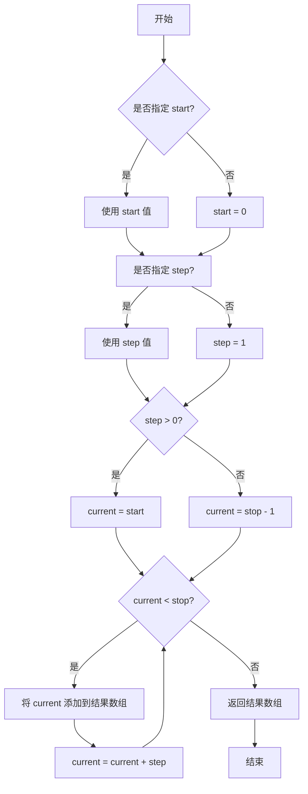

#### 带注释源码

```python
# np.arange 函数源码注释

# 函数签名: np.arange([start, ]stop, [step, ], dtype=None)

# 参数说明:
# - start: 序列的起始值，如果只提供一个参数则作为 stop 使用
# - stop: 序列的终止值（不包含）
# - step: 步长，默认值为 1
# - dtype: 输出数组的数据类型

# 在示例代码中的使用:
x_locations = np.arange(0, sum(binned_maximums), np.max(binned_maximums))
# 解释:
# - start = 0: 从 0 开始
# - stop = sum(binned_maximums): 到所有直方图最大值之和结束
# - step = np.max(binned_maximums): 步长为最大直方图高度
# 结果: 生成 [0, max, 2*max, 3*max, ...] 形式的数组
```


### `np.linspace`

生成指定数量的等间距数组，常用于生成图表的坐标轴刻度、颜色映射的离散点等场景。

参数：

- `start`：`float`，序列的起始值
- `stop`：`float`，序列的结束值（当endpoint=True时包含该点）
- `num`：`int`，生成的样本数量，默认为50
- `endpoint`：`bool`，是否包含stop值，默认为True
- `retstep`：`bool`，若为True则返回步长，默认为False
- `dtype`：`dtype`，输出数组的数据类型，若为None则从输入推断
- `axis`：`int`，新版本中用于指定结果数组的轴（从0.16.0版本开始）

返回值：`ndarray`，返回num个在[stop, start]区间内等间距的样本点

#### 流程图

```mermaid
flowchart TD
    A[接收start, stop, num等参数] --> B{endpoint参数?}
    B -->|True| C[包含stop点]
    B -->|False| D[不包含stop点]
    C --> E[计算步长step = (stop - start) / (num - 1)]
    D --> F[计算步长step = (stop - start) / num]
    E --> G[生成等间距数组]
    F --> G
    G --> H{retstep参数?}
    H -->|True| I[返回数组和步长元组]
    H -->|False| J[仅返回数组]
    I --> K[结束]
    J --> K
```

#### 带注释源码

```python
# 在示例代码中的实际使用
bin_edges = np.linspace(hist_range[0], hist_range[1], number_of_bins + 1)

# 参数说明：
# hist_range[0]    -> start参数，数据集的最小值（-3.87左右）
# hist_range[1]    -> stop参数，数据集的最大值（7.12左右）
# number_of_bins + 1 -> num参数，21个点（20个区间需要21个边界点）
#
# 返回值：
# bin_edges是一个包含21个元素的等间距数组
# 例如：array([-3.87, -3.44, -3.01, ..., 6.58, 7.01, 7.44])
#
# 这些bin_edges用于：
# 1. np.diff(bin_edges) 计算每个bin的高度（宽度）
# 2. 作为直方图的边界，确定每个条形的位置
```


### `np.diff`

计算数组中相邻元素之间的差值，返回由后一个元素减去前一个元素组成的新数组。对于n阶差分，会递归地应用差分计算。

参数：

-  `a`：array_like，输入数组，要计算差分的数组
-  `n`：int（可选），差分的阶数，默认为1，表示计算一阶差分
-  `axis`：int（可选），计算差分的轴，默认为-1（最后一个轴）

返回值：`ndarray`，返回相邻元素之间的差值数组，阶数n时返回n阶差分结果

#### 流程图

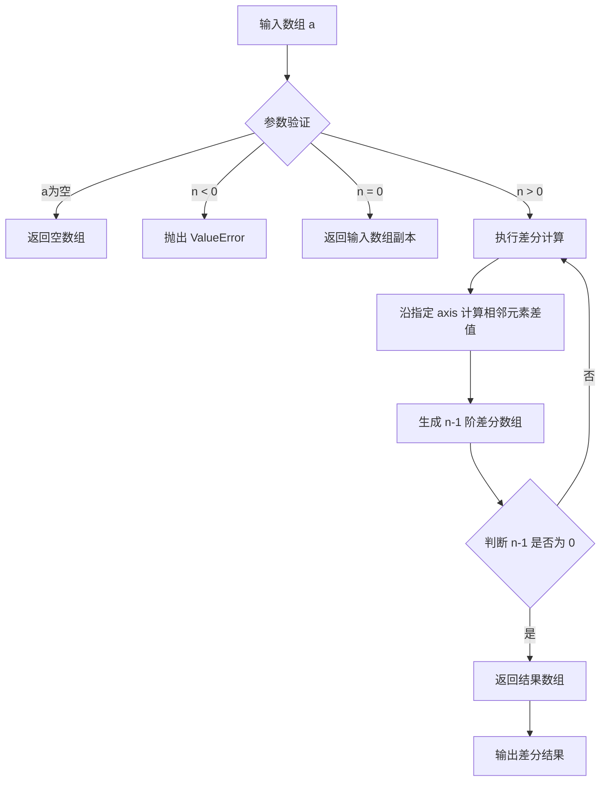

#### 带注释源码

```python
# 示例代码来自 matplotlib histogram 示例
# bin_edges 是由 np.linspace 生成的等间距数组
bin_edges = np.linspace(hist_range[0], hist_range[1], number_of_bins + 1)

# np.diff 计算 bin_edges 相邻元素之间的差值
# 例如：bin_edges = [0.0, 0.5, 1.0, 1.5]
# np.diff(bin_edges) = [0.5, 0.5, 0.5]
heights = np.diff(bin_edges)

# heights 代表每个直方图条形的高度（bin的宽度）
# 在这个例子中，由于 bin_edges 是等间距的，
# heights 将是一个常数数组，每个值都等于 bin 的宽度
```


### `plt.subplots`

创建包含一个或多个子图的图形，返回 Figure 对象和 Axes 对象（或 Axes 数组）。在代码中用于初始化绘图画布，创建一个包含单个子图的图形对象，以便后续使用 `ax.barh` 绘制水平条形图来实现对称直方图的可视化效果。

参数：
- （在代码调用中未传递任何参数，使用默认参数值：`nrows=1, ncols=1`）

返回值：
- `fig`：`matplotlib.figure.Figure`，整个图形对象，用于管理整个图表的元数据、布局和渲染
- `ax`：`matplotlib.axes.Axes`，子图对象，用于在子图上绘制各种图形元素（如条形图、坐标轴标签等）

#### 流程图

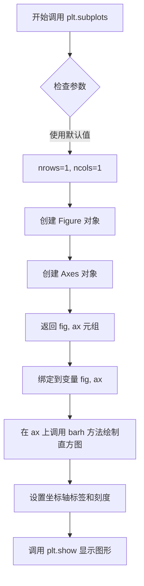

#### 带注释源码

```python
# 创建包含单个子图的图形
# 参数说明（在代码中未显式指定，使用默认值）：
#   nrows=1: 创建1行子图
#   ncols=1: 创建1列子图
#   squeeze=False: 返回的ax始终是2维数组
# 返回值：
#   fig: Figure对象，整个图形的容器
#   ax: Axes对象，用于绘制图形元素的坐标系
fig, ax = plt.subplots()

# fig 是 matplotlib.figure.Figure 类的实例
# ax 是 matplotlib.axes.Axes 类的实例
# 后续代码使用 ax.barh() 在该坐标系上绘制水平条形图
```


### `matplotlib.axes.Axes.barh`

绘制水平条形图的方法，用于在Axes对象上创建水平条形图。该函数是`bar`方法的横向版本，接受y坐标、条形宽度、高度和左边界等参数，常用于绘制水平条形图、堆积条形图或本例中的水平直方图。

参数：

- `y` 或 `centers`：`numpy.ndarray`，条形的y坐标位置（本例中为直方图的bin中心点）
- `width` 或 `binned_data`：`numpy.ndarray`，条形的宽度（本例中为每个bin的计数）
- `height`：`float` 或 `numpy.ndarray`，条形的高度（本例中为bin的宽度，即`heights = np.diff(bin_edges)`）
- `left`：`numpy.ndarray`，条形的左边界x坐标（本例中为`x_loc - 0.5 * binned_data`，使直方图关于x位置对称）
- `**kwargs`：其他关键字参数（如`color`、`edgecolor`、`align`等），传递给底层`BarContainer`

返回值：`matplotlib.container.BarContainer`，包含所有条形的容器对象，可用于访问个别的条形艺术家对象（如`bar`）

#### 流程图

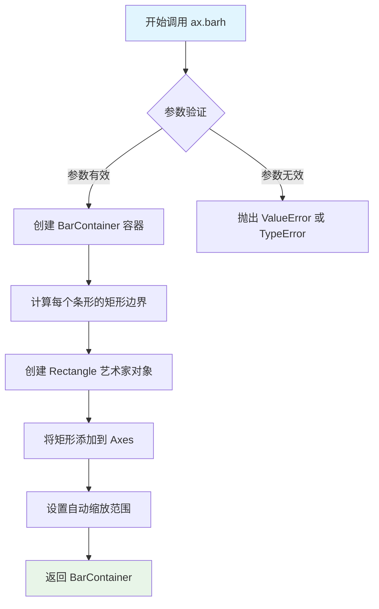

#### 带注释源码

```python
# 示例代码中 ax.barh 的调用方式
fig, ax = plt.subplots()  # 创建图形和坐标轴
for x_loc, binned_data in zip(x_locations, binned_data_sets):
    # 计算每个条形的左边界，使直方图关于x位置对称
    lefts = x_loc - 0.5 * binned_data
    
    # 调用 barh 方法绘制水平条形图
    # 参数说明：
    # - centers: 条形的y轴位置（直方图bin的中心点）
    # - binned_data: 条形的宽度（直方图的计数）
    # - height: 条形的高度（bin的宽度）
    # - left: 条形的左边界（x轴起始位置）
    ax.barh(centers, binned_data, height=heights, left=lefts)

# barh 方法内部实现逻辑（简化版）：
# def barh(self, y, width, height=0.8, left=None, **kwargs):
#     """
#     绘制水平条形图
#     
#     参数:
#         y: y坐标数组，指定每个条形的垂直位置
#         width: 条形宽度数组，指定每个条形的水平长度
#         height: 条形高度，默认为0.8
#         left: 条形的左边界，默认为0
#         **kwargs: 传递给 Rectangle 的样式参数
#     """
#     # 1. 收集参数并验证
#     y = np.atleast_1d(y)
#     width = np.atleast_1d(width)
#     
#     # 2. 如果 left 为 None，则设为0
#     if left is None:
#         left = np.zeros_like(y)
#     
#     # 3. 创建 Rectangle 列表
#     bars = []
#     for yi, wi, li in zip(y, width, left):
#         # 每个条形是一个 Rectangle 对象
#         # left, bottom, width, height
#         bar = Rectangle((li, yi - height/2), wi, height, **kwargs)
#         bars.append(bar)
#         ax.add_patch(bar)  # 添加到坐标轴
#     
#     # 4. 更新坐标轴的数据限制
#     ax.autoscale_view()
#     
#     # 5. 返回 BarContainer 容器
#     return BarContainer(bars)
```

#### 关键组件信息

| 组件名称 | 一句话描述 |
|---------|-----------|
| `BarContainer` | 包含所有条形对象的容器类，用于批量管理条形艺术家对象 |
| `Rectangle` | 表示单个条形的矩形艺术家对象，定义位置和尺寸 |
| `autoscale_view` | 自动调整坐标轴显示范围的方法，确保所有数据可见 |
| `histogram` | NumPy函数，计算数据的直方图分布（本例中用于预处理数据） |

#### 潜在的技术债务或优化空间

1. **固定bin数量**：代码中`number_of_bins = 20`是硬编码的，可以考虑根据数据特性动态计算最优bin数
2. **对称性假设**：代码假设直方图关于x位置对称，这种假设在数据分布偏斜时可能不适用
3. **重复计算**：`np.histogram`对每个数据集分别调用，虽然示例中使用了相同的range和bins，但可以预先提取共享参数
4. **内存占用**：所有数据一次性加载到内存，对于超大数据集可能存在性能瓶颈
5. **样式硬编码**：颜色、边框等样式直接嵌入代码，缺乏可配置性

#### 其它项目

**设计目标与约束：**
- 使用`barh`而非标准`hist`方法，以实现水平直方图的对称绘制效果
- 所有直方图使用相同的bin边界（`bin_edges`），确保可比较性

**错误处理与异常设计：**
- 当`binned_data`包含负值时，`barh`会向左侧绘制条形，可能导致布局混乱
- 当`left`参数导致条形超出坐标轴范围时，需要通过`autoscale`或手动设置`xlim`/`ylim`来调整

**数据流与状态机：**
```
原始数据 → np.histogram() → binned_data_sets 
→ 计算x_locations → for循环调用barh → 渲染到Axes
```

**外部依赖与接口契约：**
- 依赖`matplotlib.axes.Axes`对象
- 依赖`numpy`进行数值计算
- 返回`BarContainer`对象，可通过`.patches`属性访问所有`Rectangle`对象


### `Axes.set_xticks`

设置x轴的刻度位置和可选的刻度标签，使图表能够精确控制坐标轴的显示刻度。

参数：

- `ticks`：`array_like`，刻度位置的数组，指定x轴上刻度线的位置
- `labels`：`array_like`，可选参数，刻度标签的数组，用于设置每个刻度位置对应的文本标签
- `minor`：`bool`，可选参数，默认为False，当设置为True时用于设置次要刻度

返回值：`list of matplotlib.text.Text`，返回刻度标签对象列表

#### 流程图

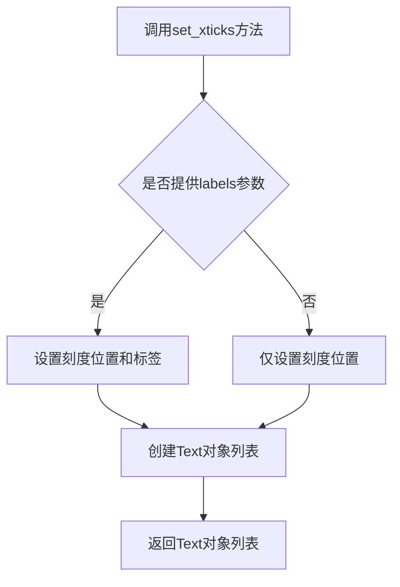

#### 带注释源码

```python
# 在matplotlib.axes.Axes类中的set_xticks方法实现（简化版）

def set_xticks(self, ticks, labels=None, *, minor=False, **kwargs):
    """
    设置x轴的刻度位置和可选的刻度标签
    
    参数:
        ticks: array_like - 刻度位置数组
        labels: array_like, optional - 刻度标签数组
        minor: bool - 是否设置次要刻度
        **kwargs: 传递给Text对象的额外参数
    
    返回:
        list of Text - 刻度标签对象列表
    """
    # 获取对应轴的定位器
    if minor:
        locator = self.xaxis.get_minor_locator()
    else:
        locator = self.xaxis.get_major_locator()
    
    # 将位置数组转换为Locator对象
    locator.set_locs(ticks)
    
    # 如果提供了标签，则设置标签
    if labels is not None:
        # 获取当前刻度位置
        ticks = self.xaxis.get_majorticklocs()
        # 为每个刻度位置设置标签
        for i, tick in enumerate(self.xaxis.get_major_ticks()):
            if i < len(labels):
                tick.label1.set_text(labels[i])
    
    # 返回刻度标签对象列表
    return self.xaxis.get_majorticklabels()
```

#### 在示例代码中的实际使用

```python
# 示例代码中的调用
ax.set_xticks(x_locations, labels)

# 参数解释：
# x_locations: np.arange(0, sum(binned_maximums), np.max(binned_maximums))
#              包含刻度位置的numpy数组
# labels: ["A", "B", "C"]
#              刻度标签列表，对应三个直方图
```


### `matplotlib.axes.Axes.set_ylabel`

设置 y 轴的标签文本，用于描述图表中 y 轴所代表的数据含义。

参数：

- `ylabel`：`str`，要设置的 y 轴标签文本内容
- `fontdict`：`dict`，可选，用于控制标签文本外观的字典（如字体大小、颜色等）
- `labelpad`：`float`，可选，标签与 y 轴之间的间距（磅值）
- `**kwargs`：关键字参数，可选，用于传递给 `matplotlib.text.Text` 构造函数的其他参数（如颜色、字体 family 等）

返回值：`matplotlib.text.Text`，返回创建的标签文本对象

#### 流程图

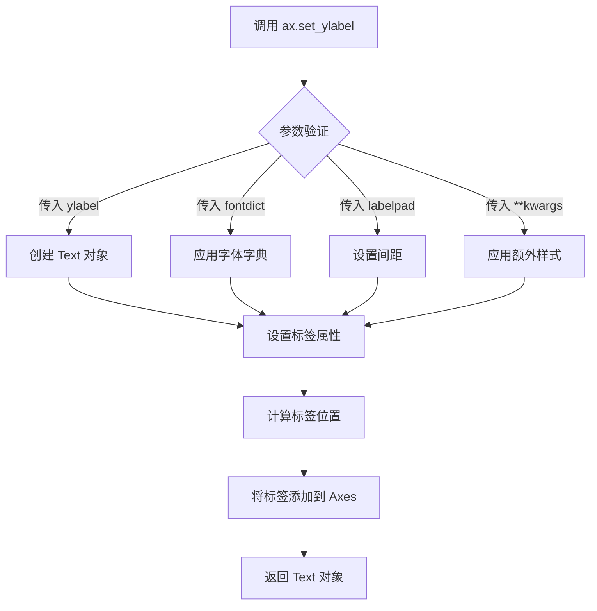

#### 带注释源码

```python
# 设置 y 轴标签
# 参数: "Data values" - y 轴的标签文本
# 返回值: Text 对象，包含创建的标签实例
ax.set_ylabel("Data values")

# 完整的方法签名参考:
# def set_ylabel(self, ylabel, fontdict=None, labelpad=None, **kwargs):
#     """
#     Set the label for the y-axis.
#     
#     Parameters
#     ----------
#     ylabel : str
#         The label text.
#     fontdict : dict, optional
#         A dictionary to control the appearance of the label.
#     labelpad : float, optional
#         Spacing in points between the label and the y-axis.
#     **kwargs
#         Text properties that control the appearance of the label.
#     
#     Returns
#     -------
#     label : Text
#         The created Text instance.
#     """
```

---

**上下文调用分析：**

在给定的示例代码中，`ax.set_ylabel("Data values")` 的作用是为直方图设置 y 轴标签，表明 y 轴代表"数据值"（Data values）。结合代码上下文：

- x 轴表示不同的数据集合（A、B、C）
- y 轴表示数据值的分布范围
- 该标签提供了图表的语义解释，增强可读性


### `ax.set_xlabel`

该方法用于设置图表 X 轴的标签（坐标轴名称），以描述该轴所代表的数据类别或含义。在给定的代码中，它将 X 轴的文本设置为 "Data sets"。

参数：

- `xlabel`：`str`，需要显示的 X 轴标签文本内容（例如 "Data sets"）。
- `fontdict`：`dict`，（可选）用于控制标签文本外观的字典，如字体大小（`fontsize`）、颜色（`color`）等。
- `labelpad`：`float`|（可选）标签与坐标轴之间的间距。
- `**kwargs`：接受 `matplotlib.text.Text` 的其他属性参数。

返回值：`matplotlib.text.Text`，返回新创建的文本标签对象，便于后续对其样式进行进一步调整或获取其属性。

#### 流程图

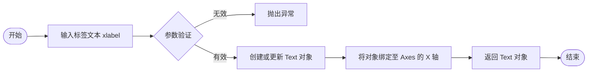

#### 带注释源码

```python
# 这里的 ax 是通过 plt.subplots() 返回的 Axes 对象
# 调用 set_xlabel 方法设置 x 轴的标签文字
# 参数 "Data sets" 是一个字符串，指定了 x 轴的名称

ax.set_xlabel("Data sets") 
```


### `plt.show`

该函数是 matplotlib 库的核心显示函数，用于显示所有当前已创建且尚未显示的 Figure（图形）对象，并将图形呈现给用户。它会阻塞程序执行直到用户关闭图形窗口，常用于脚本模式下的最终图形展示。

参数：

- 无必需参数
- `block`：布尔型（可选），默认为 True。设置为 True 时，函数会阻塞程序执行直到用户关闭所有图形窗口；设置为 False 时，则以非阻塞方式显示图形。

返回值：`None`，该函数不返回任何值。

#### 流程图

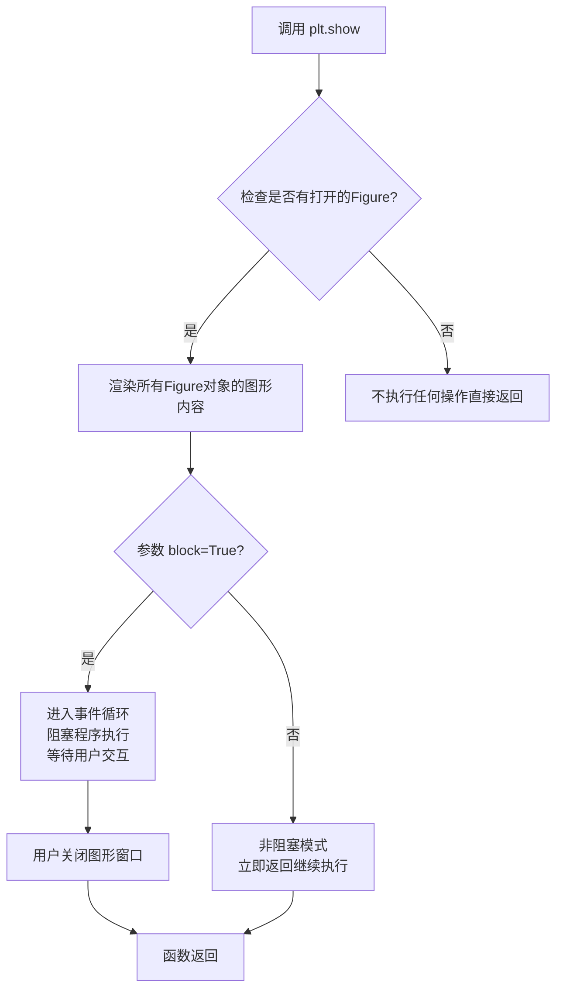

#### 带注释源码

```python
# 导入matplotlib.pyplot模块，用于绑图和数据可视化
import matplotlib.pyplot as plt
# 导入numpy模块，用于数值计算
import numpy as np

# 设置随机种子以确保结果可复现
np.random.seed(19680801)
# 定义直方图的bin数量
number_of_bins = 20

# 定义要比较的数据集数量
number_of_data_points = 387
# 数据集的标签
labels = ["A", "B", "C"]
# 生成三个不同分布的正态分布随机数据
data_sets = [np.random.normal(0, 1, number_of_data_points),    # 均值0,标准差1
             np.random.normal(6, 1, number_of_data_points),    # 均值6,标准差1
             np.random.normal(-3, 1, number_of_data_points)]   # 均值-3,标准差1

# 计算所有数据的最小值和最大值，用于统一直方图范围
hist_range = (np.min(data_sets), np.max(data_sets))
# 对每个数据集计算直方图，返回各bin的频数
binned_data_sets = [
    np.histogram(d, range=hist_range, bins=number_of_bins)[0]
    for d in data_sets
]
# 计算每个数据集直方图的最大值，用于确定x轴位置
binned_maximums = np.max(binned_data_sets, axis=1)
# 计算每个直方图在x轴上的中心位置
x_locations = np.arange(0, sum(binned_maximums), np.max(binned_maximums))

# 计算所有直方图的bin边缘，确保使用统一的bin划分
bin_edges = np.linspace(hist_range[0], hist_range[1], number_of_bins + 1)
# 计算每个bin的高度（宽度）
heights = np.diff(bin_edges)
# 计算每个bin的中心点位置
centers = bin_edges[:-1] + heights / 2

# 创建图形和坐标轴对象
fig, ax = plt.subplots()
# 遍历每个数据集，绘制水平条形图（横向直方图）
for x_loc, binned_data in zip(x_locations, binned_data_sets):
    # 计算条形图的左侧起始位置，使其关于x_loc对称
    lefts = x_loc - 0.5 * binned_data
    # 绘制水平条形图
    ax.barh(centers, binned_data, height=heights, left=lefts)

# 设置x轴刻度位置和标签
ax.set_xticks(x_locations, labels)

# 设置y轴标签
ax.set_ylabel("Data values")
# 设置x轴标签
ax.set_xlabel("Data sets")

# 调用plt.show()显示图形，将之前创建的所有Figure对象渲染并展示给用户
# 程序会阻塞在此处，直到用户关闭图形窗口
plt.show()
```


## 关键组件


### 一段话描述

该代码使用matplotlib绘制多个水平对称直方图，通过np.histogram计算数据分布，然后利用barh将直方图水平放置在不同的x位置，模拟小提琴图的视觉效果，实现多个数据集的对比展示。

### 文件的整体运行流程

1. 设置随机种子确保可重复性
2. 定义数据参数（bin数量、数据点数量）
3. 生成三个正态分布的随机数据集及其标签
4. 计算数据的全局范围和直方图
5. 计算每个直方图的最大值以确定x轴位置
6. 计算bin边缘、高度和中心点
7. 遍历数据集绘制水平条形图
8. 设置坐标轴标签和刻度
9. 显示图表

### 全局变量和全局函数详细信息

#### 全局变量

**number_of_bins**
- 类型: int
- 描述: 直方图的bin数量，设置为20

**number_of_data_points**
- 类型: int
- 描述: 每个数据集的数据点数量，设置为387

**labels**
- 类型: List[str]
- 描述: 数据集的标签列表 ["A", "B", "C"]

**data_sets**
- 类型: List[np.ndarray]
- 描述: 包含三个正态分布随机数据的列表

**hist_range**
- 类型: tuple
- 描述: 数据的全局范围 (min, max)

**binned_data_sets**
- 类型: List[np.ndarray]
- 描述: 每个数据集的直方图计数结果

**binned_maximums**
- 类型: np.ndarray
- 描述: 每个直方图的最大计数值，用于确定x位置

**x_locations**
- 类型: np.ndarray
- 描述: 每个直方图的x轴起始位置

**bin_edges**
- 类型: np.ndarray
- 描述: 直方图bin的边缘坐标

**heights**
- 类型: np.ndarray
- 描述: 每个bin的高度（bin之间的差值）

**centers**
- 类型: np.ndarray
- 描述: 每个bin的中心点位置

**fig, ax**
- 类型: tuple
- 描述: matplotlib的Figure和Axes对象

#### 全局函数

**np.random.seed**
- 参数: seed (int) - 随机数种子
- 返回值: None
- 描述: 设置随机数生成器的种子以确保可重复性

**np.random.normal**
- 参数: loc (float) - 正态分布均值, scale (float) - 标准差, size (int) - 样本数量
- 返回值: np.ndarray
- 描述: 生成正态分布的随机数据

**np.min / np.max**
- 参数: array (array-like) - 输入数组
- 返回值: scalar
- 描述: 计算数组的最小/最大值

**np.histogram**
- 参数: a (array-like) - 输入数据, bins (int) - bin数量, range (tuple) - 数据范围
- 返回值: tuple (counts, edges)
- 描述: 计算数据的直方图分布

**np.linspace**
- 参数: start (float) - 起始值, stop (float) - 结束值, num (int) - 数量
- 返回值: np.ndarray
- 描述: 在指定范围内生成等间距的数组

**np.diff**
- 参数: array (array-like) - 输入数组
- 返回值: np.ndarray
- 描述: 计算相邻元素之间的差值

**np.arange**
- 参数: start (float) - 起始值, stop (float) - 结束值, step (float) - 步长
- 返回值: np.ndarray
- 描述: 在指定范围内按步长生成数组

**plt.subplots**
- 参数: figsize (tuple) - 图形尺寸
- 返回值: tuple (Figure, Axes)
- 描述: 创建一个新的图形和坐标轴

**ax.barh**
- 参数: y (array-like) - y位置, width (array-like) - 宽度/高度, height (array-like) - 条形高度, left (array-like) - 左侧x坐标
- 返回值: BarContainer
- 描述: 绘制水平条形图

**ax.set_xticks / ax.set_ylabel / ax.set_xlabel**
- 参数: ticks/labels (array-like) - 刻度/标签, label (str) - 标签文本
- 返回值: None
- 描述: 设置坐标轴的刻度和标签

### 关键组件信息

#### 数据生成模块

使用numpy生成三个具有不同均值(0, 6, -3)但相同标准差(1)的正态分布数据集，用于后续直方图对比。

#### 直方图计算模块

利用np.histogram对每个数据集计算直方图，使用统一的范围和bin数量确保对齐，使用列表推导式并行处理所有数据集。

#### 可视化渲染模块

使用barh绘制水平条形图，通过计算lefts = x_loc - 0.5 * binned_data实现对称效果，模拟小提琴图的视觉风格。

#### 布局计算模块

计算x_locations以均匀分布各直方图，使用sum(binned_maximums)和np.max(binned_maximums)确定间距，确保直方图不重叠。

### 潜在的技术债务或优化空间

1. **硬编码参数**: number_of_bins、number_of_data_points等参数硬编码，建议封装为配置参数或函数参数
2. **重复计算**: hist_range在直方图计算和np.linspace中重复使用，可提取为常量
3. **缺乏错误处理**: 未对空数据集、异常值或无效输入进行验证
4. **魔法数字**: 0.5用于对称计算缺乏明确语义，建议定义为常量SYMMETRY_FACTOR
5. **固定数据维度**: 仅支持三个数据集的硬编码逻辑，缺乏通用性
6. **缺少文档字符串**: 脚本级别的代码块缺少模块级文档字符串

### 其它项目

#### 设计目标与约束

- 目标: 创建对称水平直方图，模拟小提琴图效果
- 约束: 所有直方图必须使用相同的bin边界和数量以确保可比性

#### 错误处理与异常设计

- 假设输入数据为数值型numpy数组
- 未实现输入验证，用户需确保数据有效性

#### 数据流与状态机

- 数据流: 随机种子 → 数据生成 → 直方图计算 → 布局计算 → 渲染 → 显示
- 状态转换: 数据准备阶段 → 计算阶段 → 渲染阶段

#### 外部依赖与接口契约

- 依赖: matplotlib.pyplot, numpy
- 接口: 标准matplotlib绘图接口，返回BarContainer对象


## 问题及建议


### 已知问题

- **硬编码参数过多**：数据点数量(387)、bin数量(20)、随机种子(19680801)等参数直接硬编码，缺乏灵活性和可配置性
- **数据生成与绘图逻辑耦合**：数据生成代码与绘图代码混在一起，没有分离关注点，难以独立测试或替换数据源
- **缺少输入验证**：没有对输入数据进行有效性检查（如空数据、NaN值、非数值数据等），可能导致运行时错误
- **魔法数字**：`0.5 * binned_data`中的0.5没有定义常量，含义不明确
- **缺乏类型注解**：Python代码没有使用类型提示，降低了代码的可读性和IDE支持
- **重复计算**：`np.histogram`在列表推导式中逐个调用，没有向量化，且`hist_range`计算可以更高效
- **变量命名不够清晰**：`binned_maximums`、`x_locations`等变量名较难理解其具体用途
- **未封装为可复用函数**：所有代码都是脚本形式，没有将绘图逻辑封装成函数，难以在其他项目中复用

### 优化建议

- **参数化设计**：将关键参数(number_of_bins, number_of_data_points等)提取为函数参数或配置文件
- **函数封装**：将绘图逻辑封装为独立函数，如`plot_symmetric_histograms(data_sets, labels, number_of_bins)`
- **添加类型注解**：为函数参数和返回值添加类型提示，提高代码可读性
- **输入验证**：在函数开始添加数据验证逻辑，检查数据有效性并给出清晰错误信息
- **常量定义**：为魔法数字定义有意义的常量，如`SYMMETRIC_SCALAR = 0.5`
- **计算优化**：考虑使用numpy的向量化操作替代列表推导式，或使用`numpy.histogramdd`一次计算多个数据集
- **文档完善**：为函数添加docstring，说明参数、返回值和示例用法
- **扩展性增强**：添加颜色、样式、图例等自定义选项的支持
- **可测试性**：将数据生成逻辑与绘图逻辑解耦，便于单元测试


## 其它


### 设计目标与约束

本代码的设计目标是创建并排的水平直方图，用于比较多个数据样本的分布情况。核心约束包括：使用相同的bin范围和bin数量以确保可比较性；直方图需对称绘制于x轴位置，类似于小提琴图的视觉效果；必须使用barh而非标准hist方法来实现此特定可视化效果。

### 错误处理与异常设计

代码未实现显式的错误处理机制。潜在异常包括：data_sets为空或包含空数组时np.histogram可能返回错误；number_of_bins为0或负数时会导致除零错误；数据点数量为0时hist_range计算可能异常。建议添加数据验证：检查data_sets非空、number_of_bins大于0、每个数据集非空、hist_range有效计算等。

### 数据流与状态机

数据流如下：1)生成三个正态分布数据集→2)计算全局hist_range(min,max)→3)对每个数据集计算直方图binned_data_sets→4)计算每行最大值确定x间距→5)计算bin_edges和heights→6)循环绘制每个直方图条形。无复杂状态机，为线性流程。

### 外部依赖与接口契约

外部依赖包括：matplotlib.pyplot(绘图)、numpy(数值计算)。接口契约：np.random.normal生成指定均值、标准差和数据量的正态分布数组；np.histogram返回(binned_data, bin_edges)；np.linspace创建等间距数组；ax.barh绘制水平条形图，要求centers(位置)、binned_data(长度)、heights(高度)、lefts(左边界)参数。

### 性能考虑

当前实现对387个数据点和20个bin的性能可接受。潜在优化点：binned_data_sets列表推导式可预先分配numpy数组；循环绘制时可使用向量化操作替代for循环；对于大规模数据集可考虑使用numba加速直方图计算。

### 可扩展性分析

当前硬编码三个数据集。扩展建议：1)将数据生成和绘图封装为函数，参数化数据集数量和标签；2)支持自定义bin数量和范围；3)添加颜色映射和图例支持；4)支持水平/垂直方向切换；5)添加数据标准化选项便于比较不同量级的数据。

### 单元测试建议

建议添加以下测试用例：test_hist_range_calculation验证min/max正确计算；test_binned_data_shapes验证所有直方图具有相同bin数量；test_bin_edges_properties验证bin_edges长度正确且递增；test_x_locations_spacing验证x坐标间隔合理；test_barh_parameters验证传递给barh的参数维度匹配。

### 集成测试建议

建议添加：1)完整流程测试，验证代码可无错误执行并生成图像；2)参数化测试，验证不同数据量、bin数量、标签数量下的正确性；3)可视化回归测试，验证输出图像符合预期；4)边界情况测试，包括单数据点、极值数据、负值数据等。

### 版本兼容性

代码使用numpy和matplotlib的基础功能，兼容性良好。注意事项：np.random.normal在numpy 1.17+推荐使用rng.normal；plt.subplots在matplotlib 1.4+可用；确保numpy版本支持histogram的range参数。

### 配置与参数说明

可配置参数包括：number_of_bins(直方图bin数量，默认20)、number_of_data_points(每个数据集的样本数，默认387)、labels(数据集标签，默认["A","B","C"])、data_sets均值和标准差(分别控制分布位置和形状)。建议将这些硬编码值提取为配置文件或函数参数。


    