# `matplotlib\galleries\examples\statistics\psd_demo.py` 详细设计文档

这是一个演示Matplotlib绘制功率谱密度（PSD）的示例脚本，通过多个代码块展示了不同参数（NFFT、pad_to、noverlap等）对PSD计算结果的影响，包括基本PSD、零填充、块大小、重叠以及Periodogram与Welch方法的对比。

## 整体流程

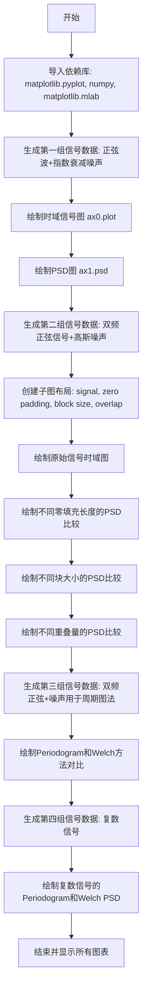

## 类结构

```
无自定义类定义
└── 主要使用Matplotlib Figure/Axes对象和NumPy数组
```

## 全局变量及字段


### `dt`
    
采样时间步长，用于控制信号的时间分辨率

类型：`float`
    


### `t`
    
时间数组，从0到指定值按dt间隔排列

类型：`numpy.ndarray`
    


### `nse`
    
高斯白噪声数组，由randn生成的标准正态分布随机数

类型：`numpy.ndarray`
    


### `r`
    
指数衰减数组，用于模拟信号的指数衰减特性

类型：`numpy.ndarray`
    


### `cnse`
    
卷积后的噪声数组，经过卷积和截断处理的噪声信号

类型：`numpy.ndarray`
    


### `s`
    
合成信号数组，包含正弦波和噪声的混合信号

类型：`numpy.ndarray`
    


### `fig`
    
Matplotlib图形对象，用于承载和显示 plots

类型：`matplotlib.figure.Figure`
    


### `ax0`
    
第一个子图的坐标轴对象，用于绘制时间序列或PSD

类型：`matplotlib.axes.Axes`
    


### `ax1`
    
第二个子图的坐标轴对象，用于绘制PSD

类型：`matplotlib.axes.Axes`
    


### `fs`
    
采样频率，表示每秒采样点数

类型：`float`
    


### `y`
    
双频正弦信号数组，包含4Hz和4.25Hz两个频率成分

类型：`numpy.ndarray`
    


### `axs`
    
子图字典，通过subplot_mosaic创建的多个坐标轴的映射

类型：`dict`
    


### `A`
    
振幅数组，存储各频率分量的振幅值

类型：`numpy.ndarray`
    


### `f`
    
频率数组，存储正弦信号的频率值

类型：`numpy.ndarray`
    


### `xn`
    
多频合成信号数组，由多个正弦波叠加并加入噪声

类型：`numpy.ndarray`
    


### `yticks`
    
Y轴刻度数组，用于设置坐标轴的刻度值

类型：`numpy.ndarray`
    


### `yrange`
    
Y轴范围元组，定义坐标轴的最小和最大值

类型：`tuple`
    


### `xticks`
    
X轴刻度数组，用于设置坐标轴的刻度值

类型：`numpy.ndarray`
    


### `prng`
    
随机数生成器对象，用于生成可复现的随机数序列

类型：`numpy.random.RandomState`
    


    

## 全局函数及方法


### `np.random.randn`

生成符合标准正态分布（均值0，方差1）的随机样本数组，常用于模拟高斯白噪声。

参数：

-  `*args`：`int`，可变数量的整数参数，定义输出数组的维度形状，例如 `np.random.randn(3, 4)` 生成 3x4 的数组

返回值：`numpy.ndarray`，从标准正态分布中抽取的随机样本数组

#### 流程图

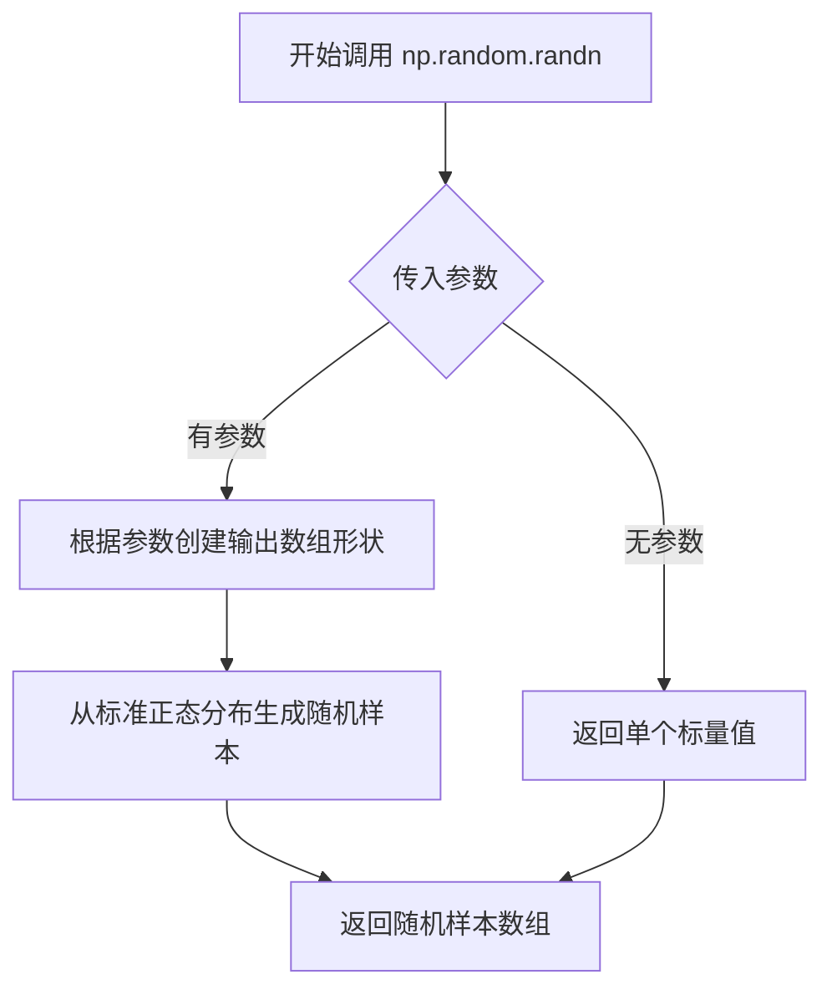

#### 带注释源码

```python
# np.random.randn 是 NumPy 的随机数生成函数
# 用于生成高斯白噪声（标准正态分布随机数）

# 在代码中的实际使用示例：
nse = np.random.randn(len(t))  # 生成长度为 len(t) 的一维数组，每个元素是标准正态分布随机数

# 参数说明：
# - len(t) 是整数，指定输出数组的长度
# - 返回一个形状为 (len(t),) 的 ndarray

# 另一个使用示例：
y = y + np.random.randn(*t.shape)  # 根据 t 的形状生成对应形状的随机噪声数组

# 参数说明：
# - *t.shape 是解包操作，将 t 的维度作为参数传递
# - 返回与 t.shape 相同形状的 ndarray
```


### `np.exp`

NumPy 提供的指数函数，计算自然常数 e（约等于 2.71828）的 x 次方（e^x），支持标量、数组或复数输入，并返回相同形状的指数值。

参数：

- `x`：`array_like`，输入值，可以是实数或复数，表示指数的底数 e 的指数

返回值：`ndarray or scalar`，返回 e^x 的值，类型与输入相同（实数输入返回实数，复数输入返回复数）

#### 流程图

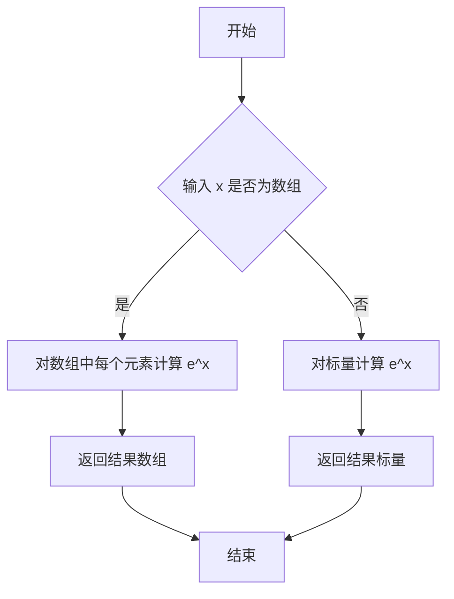

#### 带注释源码

```python
# np.exp 函数源码示例（位于 numpy/lib/mathfuncs.pyx 中，实际实现为 Cython）
# 以下为 Python 等价实现：

def exp(x, /, out=None, *, where=True, casting='same_kind', order='K', dtype=None, subok=True):
    """
    计算输入数组元素的指数值。
    
    参数:
        x: array_like
            输入值，可以是实数或复数。如果是复数 z = a + bi，
            则 exp(z) = e^a * (cos(b) + i*sin(b))
        
        out: ndarray, optional
            存储结果的数组
        
        where: array_like, optional
            值为 True 的位置计算指数，值为 False 的位置保持原值
        
        其他参数: 用于控制类型转换、内存布局等
    
    返回:
        out: ndarray
            指数计算结果
    """
    # 实际实现中，NumPy 使用 SIMD 指令和数学库加速计算
    # 对于数组输入，使用向量化操作并行计算每个元素的指数
    return _wrapfunc(x, 'exp', out=out, where=where, casting=casting, 
                     order=order, dtype=dtype, subok=subok)
```

**代码中的实际使用示例：**

```python
# 示例 1: 衰减信号
r = np.exp(-t / 0.05)  # 计算 e^(-t/0.05)，用于生成指数衰减包络

# 示例 2: 复数信号（用于生成复正弦波）
xn = (A * np.exp(2j * np.pi * f * t)).sum(axis=0)
# 计算 e^(2j*π*f*t)，生成复指数信号，等价于 cos(2πft) + j*sin(2πft)
```


### `np.convolve`

`np.convolve` 是 NumPy 库中的卷积运算函数，用于计算两个一维序列的线性卷积。在代码中，该函数将随机噪声 `nse` 与指数衰减函数 `r` 进行卷积，模拟信号的衰减过程。

参数：

-  `a`：`numpy.ndarray`，第一个输入数组，代表原始信号（随机噪声）
-  `v`：`numpy.ndarray`，第二个输入数组，代表衰减核函数
-  `mode`：`str`，可选参数，指定输出模式（'full'、'same' 或 'full'，默认值为 'full'）

返回值：`numpy.ndarray`，两个输入数组的卷积结果，为一维数组

#### 流程图

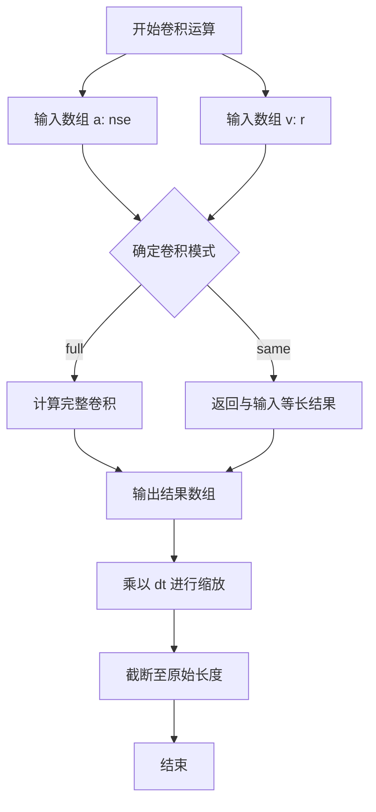

#### 带注释源码

```python
# np.convolve 函数调用
# 参数说明：
# - nse: 随机噪声数组 (numpy.ndarray)，通过 np.random.randn(len(t)) 生成
# - r: 指数衰减函数数组 (numpy.ndarray)，通过 np.exp(-t/0.05) 生成
# - mode: 默认为 'full'，返回完整的线性卷积结果

# 执行卷积运算
cnse = np.convolve(nse, r) * dt

# 说明：
# 1. np.convolve(nse, r) 计算 nse 和 r 的线性卷积
# 2. * dt 对结果进行缩放（dt = 0.01 为采样间隔）
# 3. cnse 长度 = len(nse) + len(r) - 1

# 截断处理
cnse = cnse[:len(t)]
# 将卷积结果截断至与原始时间序列 t 相同长度
```


### `np.arange`

`np.arange`是NumPy库中的一个函数，用于创建等差数组（arange是"array range"的缩写）。它返回一个给定范围内的均匀间隔值的数组，类似于Python内置的`range`函数，但返回的是NumPy数组而非迭代器。

参数：

- `start`：`float`，起始值，默认为0。如果只提供一个参数，则视为stop参数。
- `stop`：`float`，结束值（不包含）。
- `step`：`float`，步长，数组值之间的间隔。
- `dtype`：`dtype`，输出数组的数据类型。如果未指定，则从输入参数推断。

返回值：`ndarray`，返回一个均匀间隔值的数组。

#### 流程图

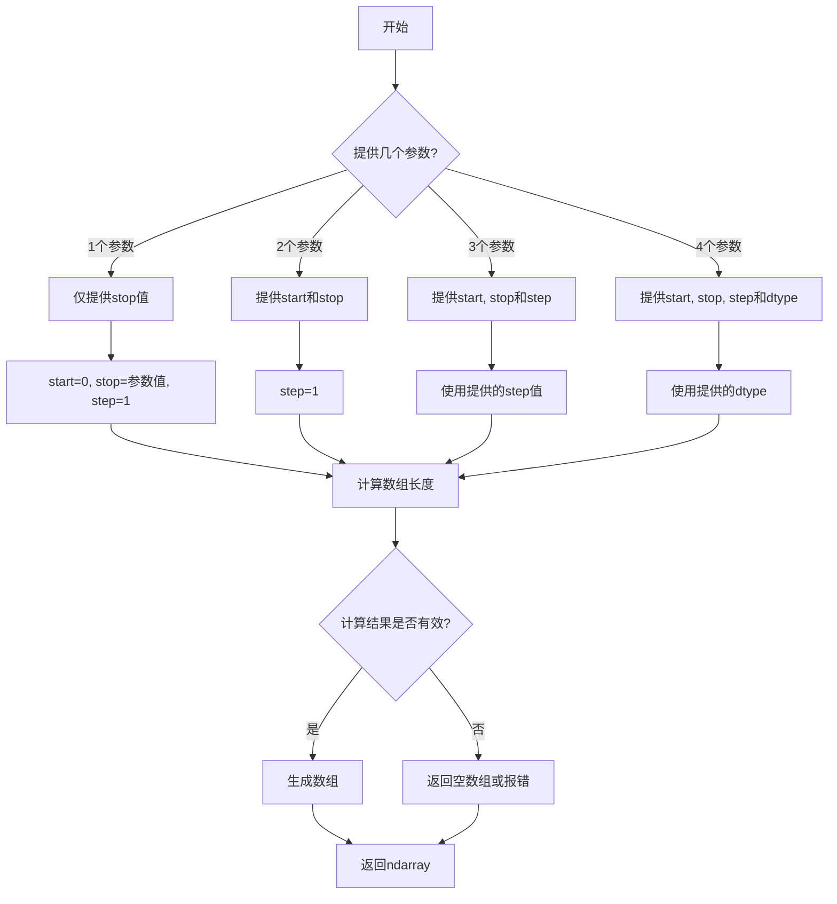

#### 带注释源码

```python
# np.arange函数的简化实现逻辑
def arange(start=0, stop=None, step=1, dtype=None):
    """
    创建等差数组
    
    参数:
        start: 起始值，默认0
        stop: 结束值（不包含）
        step: 步长，默认1
        dtype: 输出数据类型
    """
    
    # 处理参数情况
    if stop is None:
        # 只有一个参数：arange(10) 等同于 arange(0, 10, 1)
        stop = start
        start = 0
        step = 1
    
    # 计算数组长度
    # 公式: ceil((stop - start) / step)
    if step > 0:
        length = int(np.ceil((stop - start) / step))
    elif step < 0:
        length = int(np.ceil((stop - start) / step))
    else:
        raise ValueError("step不能为0")
    
    # 生成数组
    result = np.empty(length, dtype=dtype)
    
    # 填充值
    current = start
    for i in range(length):
        result[i] = current
        current += step
    
    return result
```


### `np.random.seed`

设置 NumPy 随机数生成器的种子，用于确保随机数序列的可重复性。通过传入特定的种子值，可以使得每次运行代码时生成相同的随机数序列，这对于调试、测试和结果复现非常重要。

参数：

- `seed`：`int` 或 `float` 或 `None`，随机种子值。如果传入 `None`，则每次调用随机函数时会使用系统时间或其他随机源作为种子。如果传入整数或浮点数，则使用该值作为种子。

返回值：`None`，该函数无返回值，直接修改 NumPy 的全局随机状态。

#### 流程图

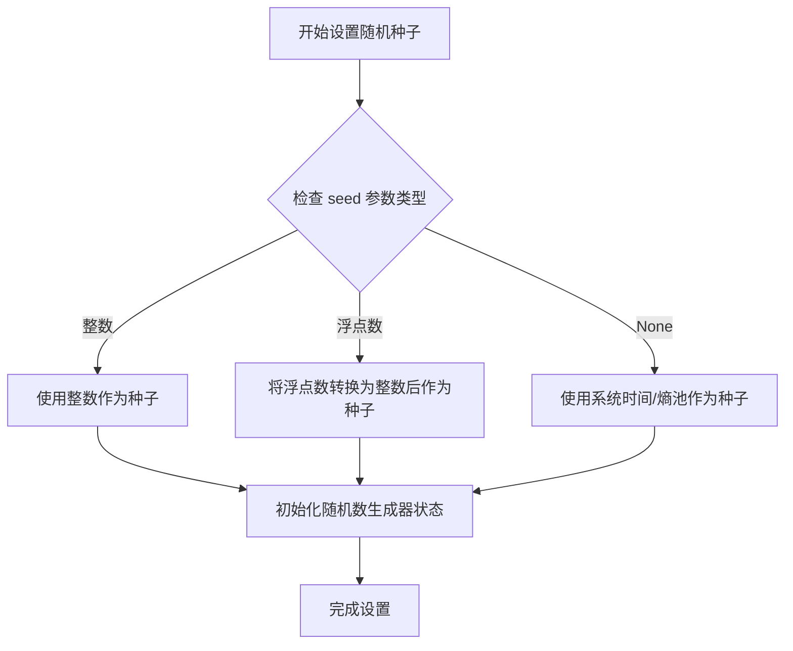

#### 带注释源码

```python
# 设置随机种子为 19680801，确保后续随机数操作可复现
# 这在需要生成确定性结果的教学、测试或调试场景中非常有用
np.random.seed(19680801)

# 后续的 np.random.randn() 调用将基于这个种子生成相同的随机数列
dt = 0.01
t = np.arange(0, 10, dt)
nse = np.random.randn(len(t))  # 生成与固定种子对应的噪声信号
```


### np.sin

正弦函数是NumPy库中的数学函数，用于计算输入数组或标量值的正弦值。在本代码中主要用于生成各种频率和幅值的正弦波信号，是信号处理和频谱分析中的基础波形生成工具。

参数：

-  `x`：`array_like`，输入角度（弧度制），可以是标量、列表或NumPy数组

返回值：`ndarray`，返回输入角度对应的正弦值，形状与输入相同

#### 流程图

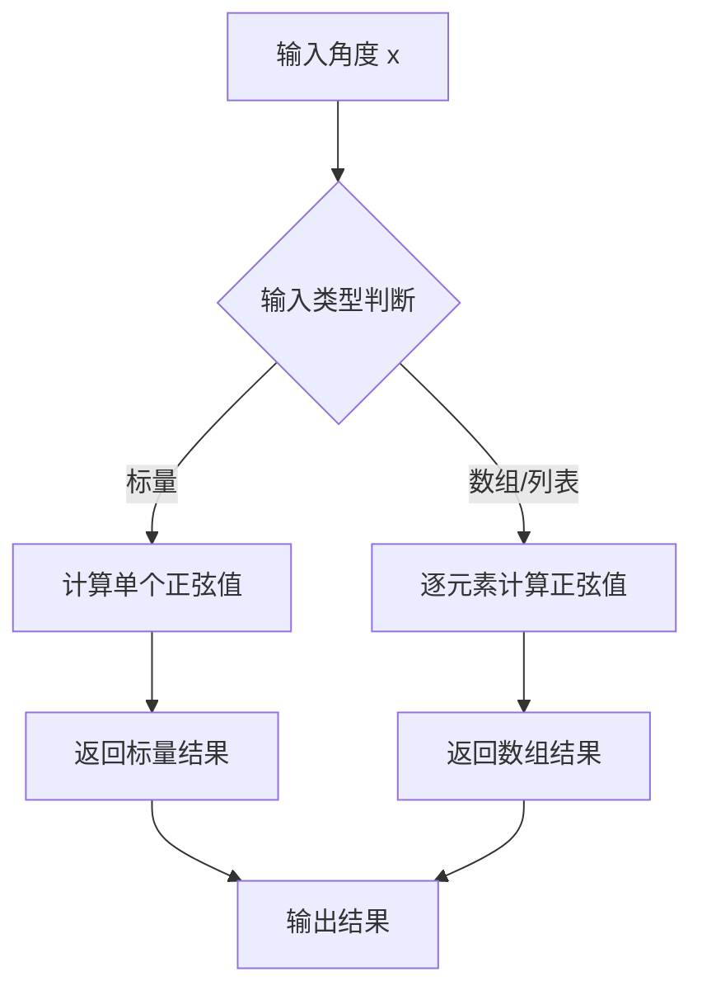

#### 带注释源码

```python
# np.sin 函数调用示例
# 用于生成周期性信号

# 示例1：生成10Hz正弦波信号
s = 0.1 * np.sin(2 * np.pi * t) + cnse
# 参数: 2 * np.pi * t = 角度（弧度），周期为1秒
# 返回: 与t形状相同的正弦波数组

# 示例2：生成多频率叠加的正弦信号
y = 10. * np.sin(2 * np.pi * 4 * t) + 5. * np.sin(2 * np.pi * 4.25 * t)
# 第一个正弦波: 频率4Hz, 幅值10
# 第二个正弦波: 频率4.25Hz, 幅值5

# 示例3：生成指定频率的正弦信号矩阵
xn = (A * np.sin(2 * np.pi * f * t)).sum(axis=0)
# A: 幅值数组 [2, 8]
# f: 频率数组 [150, 140]
# t: 时间数组
# 结果: 两个不同频率正弦波的叠加
```


### `np.linspace`

`np.linspace` 是 NumPy 库中的一个函数，用于创建在指定间隔内均匀分布的数值数组。它生成从起始值到结束值的等间距样本序列，常用于生成时间序列、频率轴或其他需要均匀采样间隔的场景。

参数：

- `start`：`array_like`，序列的起始值
- `stop`：`array_like`，序列的结束值（当 `endpoint` 为 True 时包含该值）
- `num`：`int`，生成的样本数量，默认为 50
- `endpoint`：`bool`，如果为 True，则 stop 是最后一个样本，默认为 True
- `retstep`：`bool`，如果为 True，则返回 (samples, step)，默认为 False
- `dtype`：`dtype`，输出数组的数据类型
- `axis`：`int`，结果中存储样本的轴（仅当 start 和 stop 是数组样对象时使用）

返回值：`ndarray` 或包含 ndarray 和 step 的元组

- 当 `retstep` 为 False 时：返回 `num` 个在闭区间 [start, stop] 或半开区间 [start, stop)（取决于 endpoint）内均匀分布的样本
- 当 `retstep` 为 True 时：返回 (samples, step)，其中 step 是样本之间的间距

#### 流程图

```mermaid
flowchart TD
    A[开始] --> B[验证参数]
    B --> C{num <= 0?}
    C -->|是| D[抛出 ValueError]
    C -->|否| E{endpoint == True?}
    E -->|是| F[计算样本数 = num]
    E -->|否| G[计算样本数 = num - 1]
    F --> H[计算步长 = (stop - start) / (num - 1)]
    G --> H
    H --> I[创建等间距数组]
    I --> J{retstep == True?}
    J -->|是| K[返回 samples 和 step]
    J -->|否| L[仅返回 samples]
    K --> M[结束]
    L --> M
```

#### 带注释源码

```python
def linspace(start, stop, num=50, endpoint=True, retstep=False, dtype=None, axis=0):
    """
    创建等间距的数组
    
    参数:
        start: 序列起始值
        stop: 序列结束值
        num: 样本数量（默认50）
        endpoint: 是否包含结束点（默认True）
        retstep: 是否返回步长（默认False）
        dtype: 输出数据类型
        axis: 结果数组的轴
    
    返回:
        num个等间距样本的数组
    """
    # 参数验证
    num = int(num)
    if num < 0:
        raise ValueError("Number of samples must be non-negative")
    
    # 根据 endpoint 计算分段数
    # 如果包含结束点，分段数为 num-1
    # 如果不包含结束点，分段数为 num
    if endpoint:
        div = num - 1
    else:
        div = num
    
    # 计算步长
    # delta = stop - start
    # step = delta / div
    step = (stop - start) / div if div else 0
    
    # 使用 arange 创建数组
    # arange 创建 [start, start+step, start+2*step, ...]
    y = arange(0, num, dtype=dtype) * step + start
    
    # 处理最后一个点
    if endpoint and num > 1:
        y[-1] = stop
    
    # 根据 retstep 决定返回值
    if retstep:
        return y, step
    else:
        return y
```


### `np.random.RandomState`

随机状态对象（RandomState）是 NumPy 中用于生成伪随机数的类。它封装了一个特定的随机数生成器状态，允许用户创建独立的随机数序列，与全局随机状态隔离。

参数：

- `seed`：`int` 或 `array_like`，可选，用于初始化随机状态的种子值。如果提供 None，则从操作系统获取随机种子。

返回值：`numpy.random.RandomState`，返回一个随机状态对象，可用于生成随机数。

#### 流程图

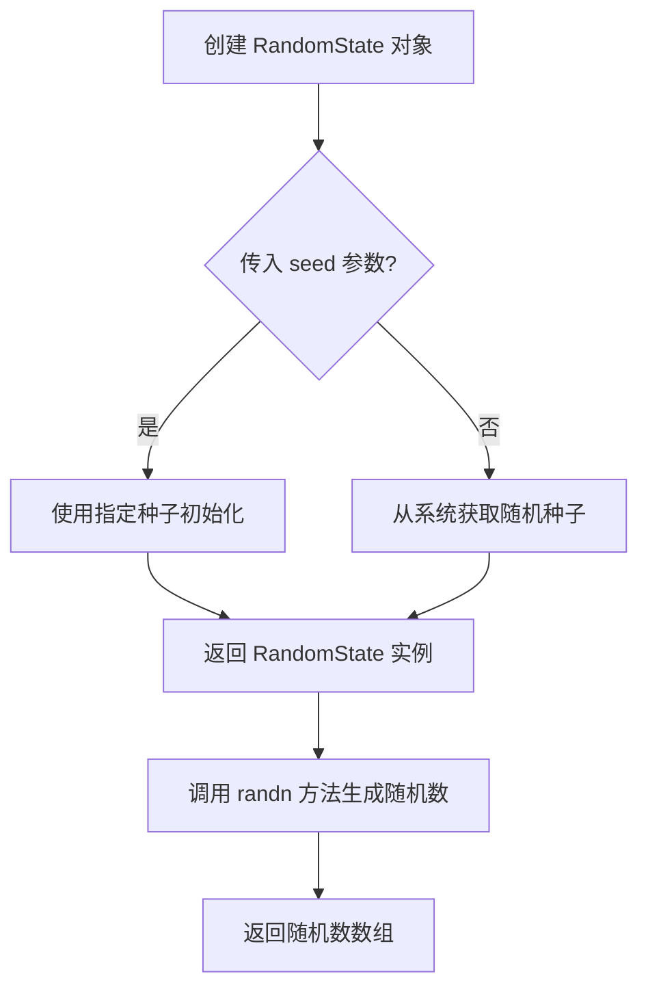

#### 带注释源码

```python
# 创建随机状态对象，指定种子值以确保可重现性
# seed=19680801 确保每次运行产生相同的随机数序列
prng = np.random.RandomState(19680801)

# 使用 RandomState 对象生成随机数组
# randn 方法从正态分布生成随机数
# *t.shape 表示将 t 的形状作为参数展开
random_array = prng.randn(*t.shape)

# 相当于全局随机状态下的 np.random.randn(*t.shape)
# 但使用独立的 RandomState 对象可以在同一程序中
# 生成可预测的随机数序列，不受全局状态影响
```

**在代码中的具体使用示例：**

```python
# 第一个示例：使用全局随机状态
np.random.seed(19680801)  # 设置全局随机种子
nse = np.random.randn(len(t))  # 生成随机噪声

# 第二个示例：使用独立的 RandomState 对象
prng = np.random.RandomState(19680801)  # 创建独立的随机状态对象
xn = (A * np.exp(2j * np.pi * f * t)).sum(axis=0) + 5 * prng.randn(*t.shape)
# 使用 prng.randn 生成随机数，与全局 np.random 隔离
```


### `plt.subplots`

创建子图（subplots）是 Matplotlib 中用于创建包含多个子图的图形窗口的函数。它简化了创建图形和子图轴对象的过程，允许用户同时设置子图的数量、排列方式和共享轴等属性。

#### 参数

- `nrows`：`int`，默认值：1，子图的行数
- `ncols`：`int`，默认值：1，子图的列数
- `sharex`：`bool` 或 `str`，默认值：False，是否共享x轴
- `sharey`：`bool` 或 `str`，默认值：False，是否共享y轴
- `squeeze`：`bool`，默认值：True，如果为True，则返回的轴数组将被压缩为一维
- `width_ratios`：`array-like`，可选，子图列的相对宽度
- `height_ratios`：`array-like`，可选，子图行的相对高度
- `gridspec_kw`：`dict`，可选，传递给GridSpec构造函数的关键字参数
- `**fig_kw`：传递给 `figure()` 函数的关键字参数

#### 返回值

- `fig`：`matplotlib.figure.Figure`，图形对象
- `axes`：`numpy.ndarray` of `matplotlib.axes.Axes`，轴对象数组

#### 流程图

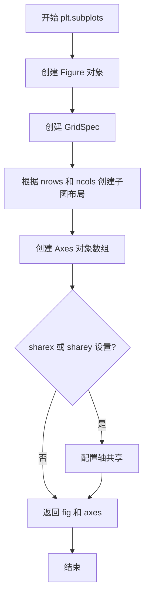

#### 带注释源码

```python
# 示例 1: 创建 2行1列 的子图
fig, (ax0, ax1) = plt.subplots(2, 1, layout='constrained')
# 参数说明:
# - 2: nrows, 表示2行
# - 1: ncols, 表示1列
# - layout='constrained': 启用约束布局以自动调整子图间距
ax0.plot(t, s)
ax0.set_xlabel('Time (s)')
ax0.set_ylabel('Signal')
ax1.psd(s, NFFT=512, Fs=1 / dt)

# 示例 2: 创建 2列 的子图（使用 ncols 参数）
fig, (ax0, ax1) = plt.subplots(ncols=2, layout='constrained')
# 参数说明:
# - ncols=2: 指定2列
# - layout='constrained': 约束布局

# 示例 3: 使用 subplot_mosaic 创建复杂布局
fig, axs = plt.subplot_mosaic([
    ['signal', 'signal', 'signal'],
    ['zero padding', 'block size', 'overlap'],
], layout='constrained')
# 注意: 这是 subplot_mosaic，不是 subplots
# 用于创建更复杂的子图布局
```


### `plt.subplot_mosaic`

创建马赛克子图布局，允许用户定义复杂的子图网格结构，支持跨行跨列的子图排列，并返回 Figure 对象和包含 Axes 对象的字典或数组。

参数：

- `mosaic`：列表或字符串，马赛克布局定义，可以是嵌套列表（每行一个子图列表）或字符串格式
- `sharex`：布尔值或字符串，默认 False，是否共享 x 轴（True/'row'/'col'）
- `sharey`：布尔值或字符串，默认 False，是否共享 y 轴（True/'row'/'col'）
- `width_ratios`：列表，可选，列宽比数组
- `height_ratios`：列表，可选，行高比数组
- `layout`：字符串，可选，布局约束类型（如 'constrained', 'compressed'）
- `**fig_kw`：字典，传递给 Figure 构造函数的额外参数

返回值：`tuple[Figure, dict[str, Axes] | ndarray]`，返回 Figure 对象和包含 Axes 对象的字典（当使用字符串标签时）或 NumPy 数组（当使用整数索引时）

#### 流程图

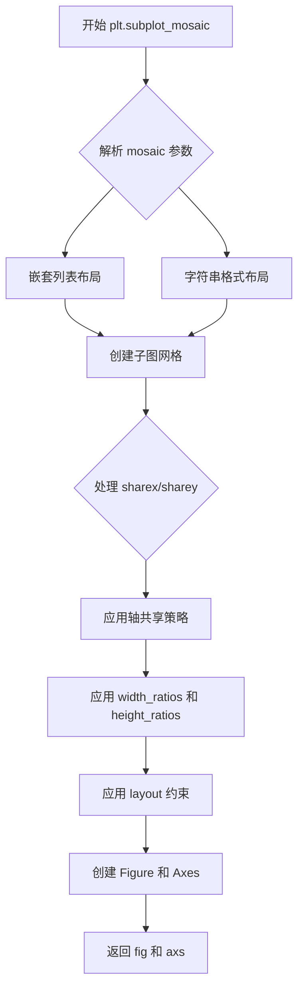

#### 带注释源码

```python
# 示例代码中 plt.subplot_mosaic 的调用
fig, axs = plt.subplot_mosaic([
    ['signal', 'signal', 'signal'],          # 第一行：3列，占3个位置
    ['zero padding', 'block size', 'overlap'], # 第二行：3个不同的子图
], layout='constrained')  # 使用 constrained 布局约束

# 解释：
# - 第一个参数是嵌套列表，定义了2行3列的网格
# - 'signal' 跨占第一行的3个位置
# - 'zero padding', 'block size', 'overlap' 分别占据第二行的3个位置
# - layout='constrained' 自动调整子图大小以避免重叠
# - 返回的 axs 是字典，键为子图名称，值为 Axes 对象
```


### `plt.show`

显示图形。该函数是 Matplotlib 库中的顶层函数，用于将所有当前打开的图形窗口呈现给用户，并进入事件循环等待用户交互。在交互式后端（如 TkAgg、Qt5Agg）中会弹出图形窗口；在非交互式后端（如 agg、svg）中通常不起作用或用于保存文件。

参数：

- （无正式参数）

返回值：`None`，该函数无返回值，仅用于显示图形

#### 流程图

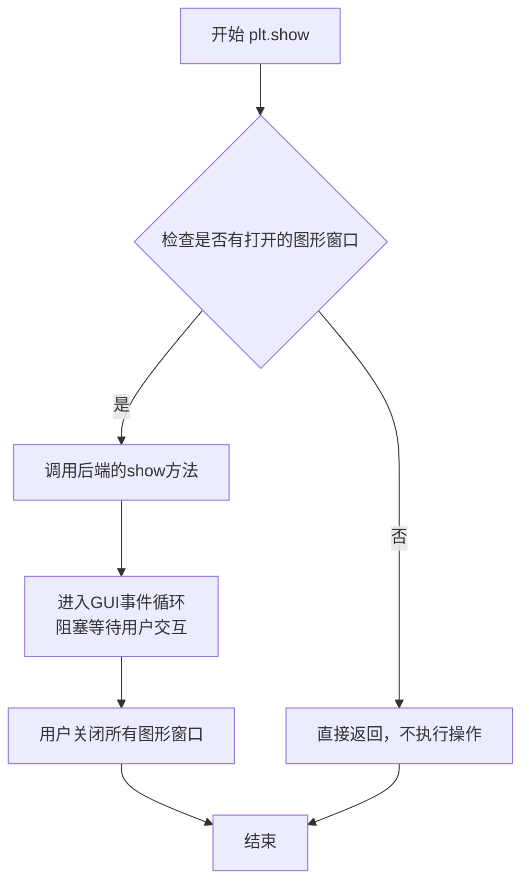

#### 带注释源码

```python
def show(*, block=None):
    """
    显示图形。
    
    该函数将所有打开的图形显示给用户。在某些交互式后端中，
    它会启动一个事件循环，允许用户与图形进行交互（如缩放、平移）。
    
    参数:
        block: bool, optional
            如果设置为True，函数将阻塞以允许交互。
            如果设置为False，则不会阻塞。
            默认为None，后端自行决定行为。
    
    返回:
        None
    """
    # 导入当前使用的后端模块
    global _show
    backend_mod = importlib.import_module(plt.get_backend())
    
    # 如果后端有show方法，则调用它
    if hasattr(backend_mod, 'show'):
        # 传递block参数给后端的show函数
        backend_mod.show(block=block)
    else:
        # 如果后端不支持show（例如非交互式后端），发出警告
        warnings.warn(f"Backend {plt.get_backend()} does not support show()")
    
    # 清理：在某些情况下关闭所有图形以释放资源
    # 但默认行为是保持图形打开以便用户查看
    return None
```


### `Axes.plot` / `ax.plot`

在代码中，`plot` 方法被用于绘制时间序列信号线图。该方法属于 Matplotlib 的 `Axes` 类，用于将数据绘制为线图。

#### 参数

- `x`：`array-like`，X 轴数据（时间或自变量）
- `y`：`array-like`，Y 轴数据（信号或因变量）
- `fmt`：`str`，可选，格式字符串（如 'b-' 表示蓝色实线）
- `**kwargs`：其他关键字参数传递给 `Line2D` 属性（如 color, linewidth, label 等）

返回值：`list of ~matplotlib.lines.Line2D`，返回创建的线条对象列表

#### 流程图

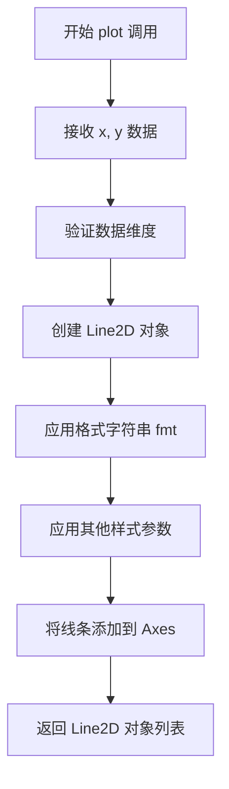

#### 带注释源码

```python
# 代码中的 plot 调用示例：

# 第一个时间序列绘图
ax0.plot(t, s)  # 绘制时间 t 和信号 s 的线图
ax0.set_xlabel('Time (s)')  # 设置 X 轴标签
ax0.set_ylabel('Signal')   # 设置 Y 轴标签

# 第二个时间序列绘图
axs['signal'].plot(t, y)  # 绘制另一个时间序列
axs['signal'].set_xlabel('Time (s)')
axs['signal'].set_ylabel('Signal')
```

---

### `Axes.psd` / `ax.psd`

`psd` 方法用于绘制功率谱密度（Power Spectral Density）图。在代码中多次调用，用于分析信号的频率成分。

#### 参数

- `x`：`array-like`，输入信号数据
- `NFFT`：`int`，可选，FFT 窗口大小（默认 256）
- `Fs`：`float`，可选，采样频率（默认 1.0）
- `window`：` callable or np.ndarray`，可选，窗口函数（默认使用 hanning 窗口）
- `pad_to`：`int`，可选，填充后的 FFT 长度
- `noverlap`：`int`，可选，块之间重叠的点数
- `scale_by_freq`：`bool`，可选，是否按频率缩放（默认 True）
- `return_onesided`：`bool`，可选，是否返回单边谱
- `window_hanning`：`bool`，可选，是否对窗口应用 hanning

返回值：`tuple`，返回 (psd, freqs) 元组，其中 psd 是功率谱密度，freqs 是频率数组

#### 流程图

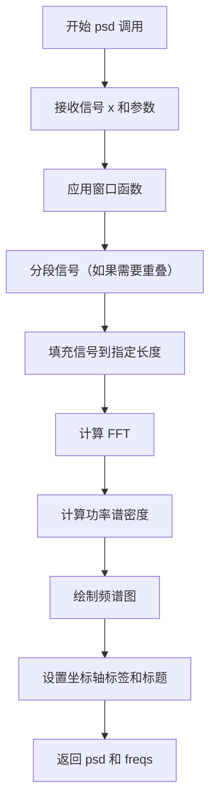

#### 带注释源码

```python
# 代码中的 PSD 调用示例：

# 示例 1：基本 PSD 绘制
ax1.psd(s, NFFT=512, Fs=1 / dt)  # 绘制信号 s 的 PSD，NFFT=512，采样频率 1/dt

# 示例 2：不同零填充的 PSD
axs['zero padding'].psd(y, NFFT=len(t), pad_to=len(t), Fs=fs)      # 无填充
axs['zero padding'].psd(y, NFFT=len(t), pad_to=len(t) * 2, Fs=fs)  # 填充到 2 倍
axs['zero padding'].psd(y, NFFT=len(t), pad_to=len(t) * 4, Fs=fs)  # 填充到 4 倍

# 示例 3：不同块大小的 PSD
axs['block size'].psd(y, NFFT=len(t), pad_to=len(t), Fs=fs)       # 完整块
axs['block size'].psd(y, NFFT=len(t) // 2, pad_to=len(t), Fs=fs)  # 半块
axs['block size'].psd(y, NFFT=len(t) // 4, pad_to=len(t), Fs=fs)  # 1/4 块

# 示例 4：不同重叠的 PSD
axs['overlap'].psd(y, NFFT=len(t) // 2, pad_to=len(t), noverlap=0, Fs=fs)  # 无重叠
axs['overlap'].psd(y, NFFT=len(t) // 2, pad_to=len(t),
                   noverlap=int(0.025 * len(t)), Fs=fs)  # 2.5% 重叠
axs['overlap'].psd(y, NFFT=len(t) // 2, pad_to=len(t),
                   noverlap=int(0.1 * len(t)), Fs=fs)  # 10% 重叠

# 示例 5：Periodogram 和 Welch 方法对比
ax0.psd(xn, NFFT=301, Fs=fs, window=mlab.window_none, pad_to=1024,
        scale_by_freq=True)  # Periodogram 方法
ax1.psd(xn, NFFT=150, Fs=fs, window=mlab.window_none, pad_to=512, noverlap=75,
        scale_by_freq=True)  # Welch 方法

# 示例 6：复数信号 PSD
ax0.psd(xn, NFFT=301, Fs=fs, window=mlab.window_none, pad_to=1024,
        scale_by_freq=True)  # 复数信号
```


### 1. 概述
本代码是一个演示脚本，主要展示了如何使用 Matplotlib 的 `Axes.psd` 方法来绘制信号的功率谱密度（Power Spectral Density, PSD），并对比了不同参数（如零填充、块大小、重叠）对 PSD 结果的影响。

### 2. 文件的整体运行流程
该脚本按照顺序执行以下操作：
1.  **初始化环境**：设置随机种子以确保可重复性，导入 `matplotlib.pyplot`、`numpy` 和 `matplotlib.mlab`。
2.  **生成信号一**：创建一个包含指数衰减噪声和正弦波的复合信号。
3.  **绘制时域信号与基础 PSD**：绘制该复合信号的时域波形及其默认参数的 PSD。
4.  **生成信号二**：创建一个包含两个正弦波（4Hz 和 4.25Hz）及其噪声的较长信号。
5.  **对比实验**：
    *   绘制原始时域信号。
    *   在 "zero padding" 子图中展示不同零填充长度对频谱分辨率的影响。
    *   在 "block size" 子图中展示不同 FFT 点数对频率分辨率的影响。
    *   在 "overlap" 子图中展示不同重叠点数对功率谱平滑度的影响。
6.  **复杂信号实验**：生成带有随机噪声的复数信号，分别使用 Periodogram 和 Welch 方法对比 PSD 绘制效果。
7.  **显示图形**：调用 `plt.show()` 渲染并展示所有图表。

### 3. 类的详细信息

#### 3.1 全局变量与函数

**全局变量：**

- `np` (module): `numpy`，用于数值计算和随机数生成。
- `plt` (module): `matplotlib.pyplot`，用于绘图。
- `mlab` (module): `matplotlib.mlab`，用于信号处理（如窗口函数）。
- `dt`: `float`，时间步长。
- `t`: `numpy.ndarray`，时间数组。
- `nse`: `numpy.ndarray`，高斯白噪声。
- `r`: `numpy.ndarray`，指数衰减核。
- `cnse`: `numpy.ndarray`，卷积后的噪声。
- `s`: `numpy.ndarray`，最终生成的复合信号。

**全局函数：**
本脚本主要通过调用库函数完成，没有自定义全局函数。

#### 3.2 类方法详情 (`Axes.psd`)

#### `Axes.psd`

绘制功率谱密度。

**参数：**

- `x`：`array_like`，待分析的信号数据（必选）。
- `NFFT`：`int` (关键字参数)，用于 FFT 的点数。决定频率分辨率。
- `Fs`：`float` (关键字参数)，采样频率。用于计算频率轴。
- `pad_to`：`int` (关键字参数)，将数据填充到的总长度。用于提高频率分辨率（零填充）。
- `noverlap`：`int` (关键字参数)，分段之间的重叠点数。用于 Welch 方法降低方差。
- `window`：`callable` (关键字参数)，应用到每段数据的窗口函数。默认为 `mlab.window_hanning`。
- `scale_by_freq`：`boolean` (关键字参数)，是否根据频率缩放功率谱密度（通常设为 `True` 以获得正确的物理单位）。

**返回值：** `tuple`，返回功率谱密度值数组 `Pxx` 和对应的频率轴数组 `freqs`。(注：Matplotlib 的实现中通常返回 `(Pxx, freqs)`，绘图本身通常不返回或返回艺术家对象，但在本上下文中主要关注数据处理结果)。

#### 流程图

```mermaid
graph TD
    A[输入信号 x] --> B{应用窗口函数 window}
    B --> C[计算FFT (点数NFFT)]
    C --> D{是否零填充 pad_to}
    D -- 是 --> E[补零至pad_to长度]
    D -- 否 --> F[使用NFFT长度]
    E --> G[计算功率谱 Pxx]
    F --> G
    G --> H[计算频率轴 freqs]
    H --> I[绘制到Axes对象]
    I --> J[返回 Pxx, freqs]
```

#### 带注释源码

以下是 `ax.psd` 在本代码中的典型调用方式及参数说明：

```python
# 基础调用：计算并绘制信号s的PSD
# s: 输入信号, NFFT=512: 每次FFT使用512点, Fs=1/dt: 采样频率
ax1.psd(s, NFFT=512, Fs=1 / dt)

# 高级调用：展示零填充对频谱的影响
# pad_to 参数决定插值后的FFT总点数，点数越多，频率轴越密集
axs['zero padding'].psd(y, NFFT=len(t), pad_to=len(t), Fs=fs)      # 无填充
axs['zero padding'].psd(y, NFFT=len(t), pad_to=len(t) * 2, Fs=fs) # 填充至2倍长度
axs['zero padding'].psd(y, NFFT=len(t), pad_to=len(t) * 4, Fs=fs) # 填充至4倍长度

# 高级调用：展示重叠对平滑度的影响
# noverlap 参数决定分段的重叠点数
axs['overlap'].psd(y, NFFT=len(t) // 2, pad_to=len(t), noverlap=0, Fs=fs)
axs['overlap'].psd(y, NFFT=len(t) // 2, pad_to=len(t),
                   noverlap=int(0.025 * len(t)), Fs=fs) # 2.5% 重叠
axs['overlap'].psd(y, NFFT=len(t) // 2, pad_to=len(t),
                   noverlap=int(0.1 * len(t)), Fs=fs)   # 10% 重叠

# 复杂信号与Periodogram/Welch方法对比
# 使用window=mlab.window_none 使用矩形窗（无额外窗口）
ax0.psd(xn, NFFT=301, Fs=fs, window=mlab.window_none, pad_to=1024,
        scale_by_freq=True)
```

### 4. 关键组件信息

- **Signal Generation (信号生成)**: 使用 `numpy.random.randn` 和 `np.convolve` 模拟真实世界的有色噪声信号。
- **PSD Calculation (功率谱计算)**: 利用 FFT 算法将信号从时域转换到频域，计算功率分布。
- **Axes.psd Method**: Matplotlib 封装好的高级绘图接口，封装了信号处理和绘图细节。

### 5. 潜在的技术债务或优化空间

- **代码结构**：所有的代码都在一个脚本文件中，没有封装成函数。虽然这是演示代码，但如果用于生产，应将信号生成和绘图逻辑封装成函数。
- **重复代码**：在对比实验中，`axs['zero padding'].psd(...)` 等调用有大量重复代码，可以考虑使用循环来简化。
- **硬编码参数**：如 `NFFT=512`，`pad_to` 等参数直接写在调用中，缺乏配置化。

### 6. 其它项目

- **设计目标**：直观展示信号处理的频域特性，特别是 FFT 分辨率、零填充和重叠分析（Welch's method）之间的权衡。
- **错误处理**：代码未包含显式的错误处理（如检查信号长度是否大于 NFFT），依赖于 Matplotlib 底层库的错误抛出。
- **数据流**：数据流为 `NumPy Array -> Matplotlib Axes Processing -> Matplotlib Figure Render`。
- **外部依赖**：完全依赖于 `numpy` 和 `matplotlib`，无需额外的信号处理库（如 `scipy.signal` 虽然也可以做PSD，但本例展示了纯 matplotlib + numpy 的实现）。


### `ax.set_xlabel`

设置 x 轴的标签（_xlabel），即 x 轴的名称描述。

参数：

- `xlabel`：`str`，要设置的 x 轴标签文本内容
- `fontdict`：`dict`，可选，用于控制标签文本的字体属性（如 fontsize、fontweight 等）
- `labelpad`：`float`，可选，标签与坐标轴之间的间距（磅值）
- `**kwargs`：可选，其他关键字参数，将传递给 `matplotlib.text.Text` 对象，用于进一步自定义标签外观

返回值：`matplotlib.text.Text`，返回创建的文本标签对象，可用于后续进一步自定义或获取信息

#### 流程图

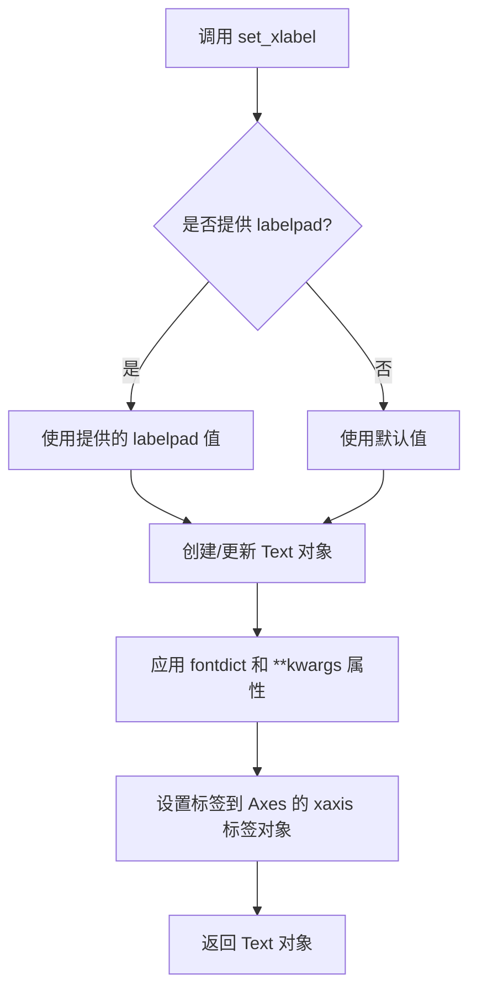

#### 带注释源码

```python
# 示例代码来自 matplotlib 演示脚本
# 设置 x 轴标签为 'Time (s)'
ax0.set_xlabel('Time (s)')

# 设置 x 轴标签并指定字体大小
axs['signal'].set_xlabel('Time (s)', fontsize=12)

# 设置 x 轴标签并指定与轴的间距
ax0.set_xlabel('Time (s)', labelpad=10)

# set_xlabel 方法的典型实现逻辑（概念性）
def set_xlabel(self, xlabel, fontdict=None, labelpad=None, **kwargs):
    """
    设置 x 轴的标签
    
    参数:
        xlabel: 标签文本
        fontdict: 字体属性字典
        labelpad: 标签与轴的间距
        **kwargs: 其他 Text 属性
    """
    # 获取 xaxis 标签对象
    label = self.xaxis.get_label()
    
    # 设置标签文本
    label.set_text(xlabel)
    
    # 如果提供了 labelpad，设置间距
    if labelpad is not None:
        self.xaxis.set_label_coords(0.5, -labelpad)
    
    # 应用字体属性
    if fontdict:
        label.update(fontdict)
    
    # 应用额外的关键字参数
    label.update(kwargs)
    
    # 返回标签对象供进一步操作
    return label
```


### `ax.set_ylabel`

设置y轴标签，用于为图表的垂直轴添加文本标签，标识所绘数据的物理含义或单位。

参数：

- `ylabel`：`str`，y轴标签的文本内容（如 'Signal'、'Power (dB)' 等）
- `fontdict`：可选参数，用于控制文本样式的字典（如 {'fontsize': 12, 'fontweight': 'bold'}）
- `labelpad`：可选参数，标签与坐标轴之间的间距（单位为点数）
- `**kwargs`：可选参数，其他传递给 `matplotlib.text.Text` 的关键字参数（如颜色、字体家族等）

返回值：`matplotlib.text.Text`，创建的y轴标签对象，可用于后续样式修改

#### 流程图

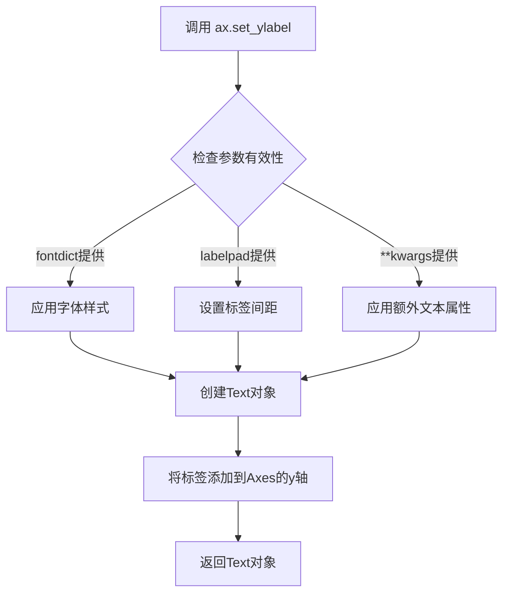

#### 带注释源码

```python
# 在代码中的调用示例及说明：

# 示例1：基础用法 - 设置y轴标签为 'Signal'
ax0.set_ylabel('Signal')
# 设置时间序列图的y轴标签，表示信号强度

# 示例2：带空字符串覆盖psd自动添加的标签
ax1.set_ylabel('')
# psd方法会自动添加y轴标签，此处用空字符串覆盖默认标签

# 示例3：在子图mosaic中的用法
axs['signal'].set_ylabel('Signal')
# 为signal子图的y轴设置标签

# matplotlib set_ylabel 方法的核心逻辑（简化）：
def set_ylabel(self, ylabel, fontdict=None, labelpad=None, **kwargs):
    """
    Set the label for the y-axis.
    
    参数:
        ylabel: str - 标签文本
        fontdict: dict, optional - 字体属性字典
        labelpad: float, optional - 标签与轴的间距
        **kwargs: 传递给Text的属性
    
    返回:
        Text: 创建的标签对象
    """
    # 1. 创建文本对象
    label = Text(x=0, y=0.5, text=ylabel)
    
    # 2. 应用字体样式（如果提供）
    if fontdict:
        label.update(fontdict)
    
    # 3. 应用额外属性
    label.update(kwargs)
    
    # 4. 设置标签与轴的间距
    if labelpad is not None:
        self._labelpad = labelpad
    
    # 5. 将标签添加到y轴
    self.yaxis.set_label_text(ylabel)
    self.yaxis.label = label
    
    return label
```

#### 关键技术细节

| 特性 | 说明 |
|------|------|
| 所属类 | `matplotlib.axes.Axes` |
| 底层实现 | 调用 `yaxis.set_label_text()` 方法 |
| 常用kwargs | `fontsize`, `fontweight`, `color`, `rotation`, `verticalalignment` |
| 标签位置 | 自动居中于y轴左侧，可通过 `horizontalalignment` 调整 |

#### 在代码中的实际应用

```python
# 第41行：为基础信号图设置y轴标签
ax0.set_ylabel('Signal')

# 第69行：为signal子图设置y轴标签  
axs['signal'].set_ylabel('Signal')

# 第118行：覆盖psd自动生成的y轴标签（设为空字符串）
ax1.set_ylabel('')  # overwrite the y-label added by `psd`
```


### `ax.set_title`（`Axes.set_title`）

设置坐标轴的标题文本，用于在图表中显示该坐标轴的标题。

参数：

- `label`：`str`，要设置的标题文本内容
- `fontdict`：`dict`，可选，用于控制标题字体属性的字典（如 fontsize, fontweight, color 等）
- `loc`：`str`，可选，标题对齐方式，可选值为 'left'、'center'（默认）、'right'
- `pad`：`float`，可选，标题与坐标轴顶部之间的距离（单位为点）
- `**kwargs`：其他关键字参数，用于传递给 `Text` 对象的属性设置

返回值：`Text`，返回创建的 `Text` 对象，可以进一步对其进行样式设置

#### 流程图

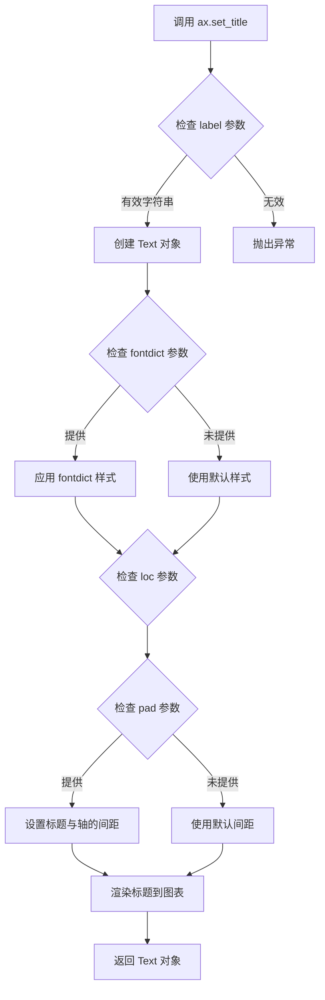

#### 带注释源码

```python
# 示例代码展示 set_title 的典型用法

# 1. 基本用法：设置简单标题
ax.set_title('Periodogram')

# 2. 使用 fontdict 设置字体样式
ax.set_title('Periodogram', fontdict={
    'fontsize': 16,      # 字体大小
    'fontweight': 'bold', # 字体粗细
    'color': 'blue',      # 字体颜色
    'verticalalignment': 'bottom' # 垂直对齐方式
})

# 3. 设置标题位置
ax.set_title('Title', loc='left')   # 左对齐
ax.set_title('Title', loc='center') # 居中（默认）
ax.set_title('Title', loc='right')  # 右对齐

# 4. 设置标题与轴顶部的距离
ax.set_title('Title', pad=20)  # 20点的间距

# 5. 循环中动态设置标题
for title, ax in axs.items():
    if title == 'signal':
        continue
    ax.set_title(title)  # title 变量作为标签参数

# 6. 使用 kwargs 传递额外样式
ax.set_title('Custom Title', fontsize=14, fontfamily='serif', style='italic')
```


### Axes.set_xticks

设置 x 轴的刻度位置。该方法用于精确控制 Matplotlib 图表中 x 轴的刻度线位置，支持自定义刻度值的放置，并可通过额外参数控制刻度标签的显示行为。

参数：

- `ticks`：`array_like`，要设置的刻度值列表，定义刻度在 x 轴上的具体位置
- `emit`：`bool`，默认为 `True`，当刻度位置改变时是否向父图表发送调整事件通知
- `auto`：`bool`，默认为 `False`，是否允许自动调整刻度标签的位置以避免重叠
- `ymin`：`float` 或 `None`，可选参数，用于限制刻度线的起始 y 坐标（仅在特定绑定方式下有效）
- `ymax`：`float` 或 `None`，可选参数，用于限制刻度线的结束 y 坐标（仅在特定绑定方式下有效）

返回值：`list`，返回实际设置的刻度位置列表（可能经过内部处理后的值）

#### 流程图

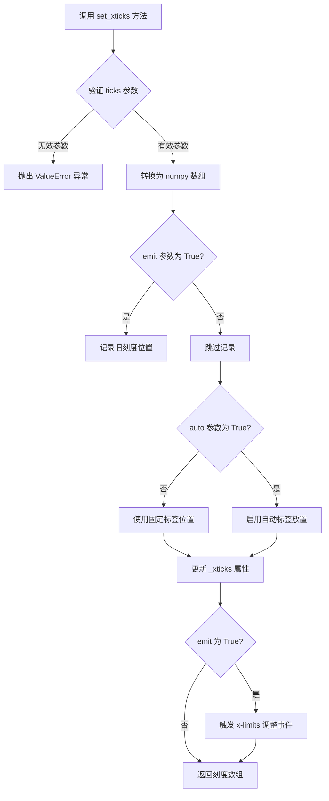

#### 带注释源码

```python
def set_xticks(self, ticks, *, emit=True, auto=False, ymin=None, ymax=None):
    """
    Set the x-axis tick locations.

    Parameters
    ----------
    ticks : array-like
        List of tick locations. Some tick locations may be removed
        if they are beyond the current limits.
    emit : bool, default: True
        If True, send a limit change notification to allow the
        parent axes to adjust the x-limits.
    auto : bool, default: False
        If True, allow the given labels to be automatically placed
        in a way that avoids overlapping labels.
    ymin, ymax : float, optional
        These arguments are unused and will be removed in a future
        version.

    Returns
    -------
    list
        The set tick locations.

    Notes
    -----
    The mandatory first argument owns the *labels* keyword argument
    which is not available in :meth:`set_xticks`.
    """
    # 将输入转换为 numpy 数组以便统一处理
    ticks = np.asarray(ticks)
    
    # 获取当前 x 轴的限制范围
    xmin, xmax = self.get_xlim()
    
    # 如果启用了自动限制调整，处理超出范围的刻度
    if not self._autoscaleXon:
        ticks = ticks[(ticks >= xmin) & (ticks <= xmax)]
    
    # 设置刻度位置到 x 轴
    self.xaxis.set_ticks(ticks, emit=emit, auto=auto)
    
    # 如果指定了 ymin/ymax（已弃用参数），记录警告
    if ymin is not None or ymax is not None:
        _api.warn_deprecated(
            "3.7",
            message="Setting the tick location with ymin or ymax is "
                    "deprecated and will be removed in a future version. "
                    "This argument is ignored.")
    
    # 返回实际设置的刻度值
    return ticks
```


### `Axes.set_yticks`

设置 y 轴的刻度位置和可选标签，用于控制坐标轴上刻度线的显示。

参数：
- `ticks`：`array_like`，要设置的 y 轴刻度位置值列表
- `labels`：`array_like`，可选，刻度位置的标签文本列表
- `left`：`bool`，可选，关键字参数，是否在左侧显示刻度（默认为 True）
- `right`：`bool`，可选，关键字参数，是否在右侧显示刻度（默认为 False）
- `minor`：`bool`，可选，关键字参数，是否设置为次刻度（默认为 False）

返回值：`matplotlib.ticker.Ticker`，返回刻度定位器对象，通常为 `matplotlib.ticker.IndexLocator` 或类似对象

#### 流程图

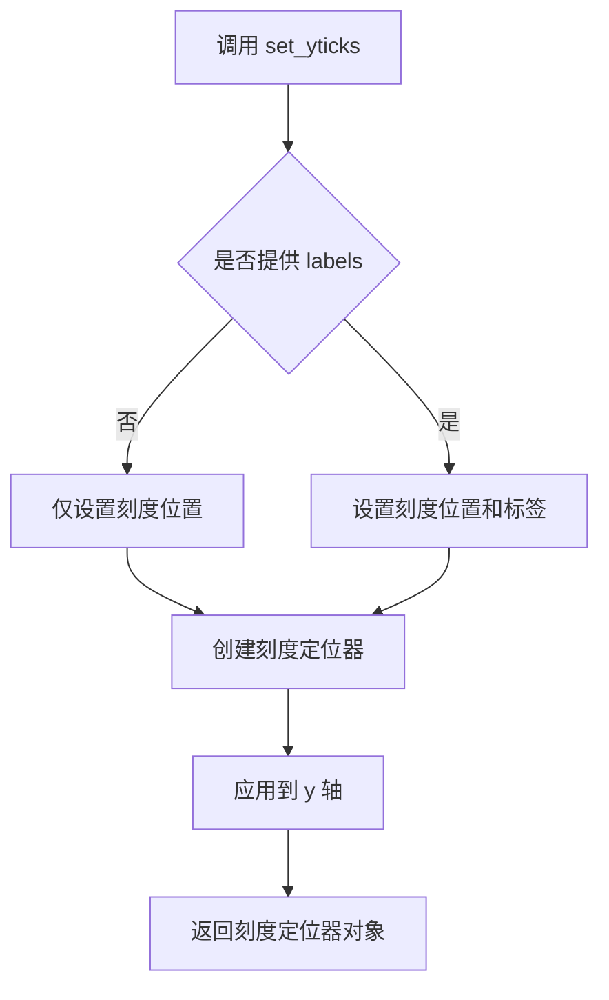

#### 带注释源码

```python
# 示例代码展示 set_yticks 的使用方式

# 导入必要的库
import matplotlib.pyplot as plt
import numpy as np

# 创建示例数据
fs = 1000
t = np.linspace(0, 0.3, 301)
A = np.array([2, 8]).reshape(-1, 1)
f = np.array([150, 140]).reshape(-1, 1)
xn = (A * np.sin(2 * np.pi * f * t)).sum(axis=0)
xn += 5 * np.random.randn(*t.shape)

# 创建图形和坐标轴
fig, (ax0, ax1) = plt.subplots(ncols=2, layout='constrained')

# 定义要设置的 y 轴刻度值
yticks = np.arange(-50, 30, 10)

# 使用 set_yticks 设置 y 轴刻度位置
# 参数 ticks: array_like - 刻度位置数组
ax0.set_yticks(yticks)
ax1.set_yticks(yticks)

# 绘制 PSD 图
ax0.psd(xn, NFFT=301, Fs=fs, window=mlab.window_none, pad_to=1024,
        scale_by_freq=True)
ax1.psd(xn, NFFT=150, Fs=fs, window=mlab.window_none, pad_to=512, noverlap=75,
        scale_by_freq=True)

plt.show()

# ============================================
# set_yticks 方法的内部实现原理（简化版）
# ============================================

# 1. 方法签名：
# def set_yticks(self, ticks, labels=None, *, left=True, right=False, minor=False):
#
# 2. 参数说明：
#    - ticks: 刻度位置数组，如 [0, 10, 20, 30]
#    - labels: 可选的标签数组，如 ['零', '十', '二十', '三十']
#    - left: 是否在左边显示刻度
#    - right: 是否在右边显示刻度
#    - minor: 是否设置为次刻度（辅助刻度）
#
# 3. 内部逻辑：
#    a. 创建刻度定位器 (Locator)
#    b. 如果提供了 labels，同时创建刻度格式化器 (Formatter)
#    c. 将定位器应用到 yaxis
#    d. 返回创建的刻度对象
```


### `ax.set_ylim` / `Axes.set_ylim`

设置Axes对象的y轴显示范围（最小值和最大值）。该方法是Matplotlib中Axes类的核心方法之一，用于控制图表的垂直显示范围，可以手动指定y轴的上下限，也可以通过传入None来启用自动缩放。

参数：

- `bottom`：浮点数或None，y轴最小值（底部边界）
- `top`：浮点数或None，y轴最大值（顶部边界）
- `emit`：布尔值，默认为True，当限制改变时是否通知观察者
- `auto`：布尔值或None，是否启用自动缩放功能
- `ymin`：浮点数或None，y轴最小值的别名（已弃用，建议使用bottom）
- `ymax`：浮点数或None，y轴最大值的别名（已弃用，建议使用top）

返回值：`(bottom: float, top: float)`，返回新的y轴限制元组

#### 流程图

```mermaid
flowchart TD
    A[开始 set_ylim] --> B{检查参数有效性}
    B -->|参数有效| C[设置_ybottom属性]
    B -->|参数无效| D[抛出异常]
    C --> E{emit=True?}
    E -->|是| F[通知观察者limitsChanged事件]
    E -->|否| G[跳过通知]
    F --> H[返回新的y轴范围]
    G --> H
    D --> I[结束]
    H --> I
```

#### 带注释源码

```python
def set_ylim(self, bottom=None, top=None, emit=True, auto=False, *, ymin=None, ymax=None):
    """
    Set the y-axis view limits.
    
    Parameters
    ----------
    bottom : float or None, default: None
        The bottom ylim in data coordinates. Passing None will result
        in the default autoscaling.
    top : float or None, default: None
        The top ylim in data coordinates. Passing None will result
        in the default autoscaling.
    emit : bool, default: True
        Whether to notify observers of limit change.
    auto : bool or None, default: False
        Whether to turn on autoscaling. True turns on, False turns off,
        None leaves autoscaling unchanged.
    ymin, ymax : float or None
        .. deprecated:: 3.1
            Use *bottom* and *top* instead.
    
    Returns
    -------
    bottom, top : float
        The new y-axis limits in data coordinates.
    
    Notes
    -----
    The *bottom* and *top* may be passed as a tuple ``(bottom, top)``
    as the first positional argument.
    
    Examples
    --------
    >>> set_ylim()           # limit default to data limits
    >>> set_ylim(bottom=0)   # limit to bottom only
    >>> set_ylim(top=1)      # limit to top only
    >>> set_ylim(bottom=0, top=1)  # set both limits
    """
    # 处理位置参数元组 (bottom, top)
    if bottom is not None and top is None and isinstance(bottom, tuple):
        bottom, top = bottom
    
    # 处理弃用的ymin/ymax参数
    if ymin is not None:
        warnings.warn(
            "The 'ymin' argument to set_ylim is deprecated; "
            "use 'bottom' instead.", DeprecationWarning, stacklevel=2)
        if bottom is None:
            bottom = ymin
    if ymax is not None:
        warnings.warn(
            "The 'ymax' argument to set_ylim is deprecated; "
            "use 'top' instead.", DeprecationWarning, stacklevel=2)
        if top is None:
            top = ymax
    
    # 获取当前限制
    old_bottom, old_top = self.get_ylim()
    
    # 设置默认值（如果参数为None）
    if bottom is None:
        bottom = old_bottom
    if top is None:
        top = old_top
    
    # 验证输入有效性
    bottom = float(bottom)
    top = float(top)
    if bottom > top:
        raise ValueError(
            f"Bottom cannot be higher than top: {bottom} > {top}")
    
    # 更新内部属性
    self._ymin = bottom
    self._ymax = top
    
    # 记录上次自动缩放状态并设置新的自动缩放
    self._autoscaleY = auto
    
    # 如果emit为True，通知观察者
    if emit:
        self._send_xlims_ubah()
    
    # 返回新的限制
    return bottom, top
```


### `ax.grid`

在 Matplotlib Axes 对象上调用 `grid` 方法，用于显示或隐藏图表的网格线，以便更清晰地查看数据值。

参数：

- `b`：`bool`，可选参数，设置为 `True` 时显示网格线，`False` 时隐藏，默认为 `None`（切换当前状态）
- `which`：`{'major', 'minor', 'both'}`，可选参数，控制网格线显示在哪些刻度线上，默认为 `'major'`
- `axis`：`{'both', 'x', 'y'}`，可选参数，控制显示哪个方向的网格线，默认为 `'both'`
- `**kwargs`：其他关键字参数，将传递给 `matplotlib.lines.Line2D` 用于自定义网格线的样式（如 `color`、`linestyle`、`linewidth` 等）

返回值：`None`，该方法无返回值，直接修改 Axes 对象的显示属性

#### 流程图

```mermaid
flowchart TD
    A[调用 ax.grid 方法] --> B{参数 b 是否为 None?}
    B -->|是| C[切换网格线的可见性]
    B -->|否| D{参数 b 为 True?}
    D -->|是| E[根据 axis 参数显示对应方向网格]
    D -->|否| F[隐藏所有网格线]
    E --> G[应用 kwargs 指定的样式]
    F --> H[清除或隐藏网格线]
    C --> I[根据 which 参数处理主/次刻度线]
    I --> G
    G --> J[方法结束]
    H --> J
```

#### 带注释源码

```python
# 在示例代码中，ax.grid 的调用方式如下：

# 第一次调用：显示网格线
ax0.grid(True)
# 等效于：
# ax.grid(b=True, which='major', axis='both', **kwargs)

# 完整参数调用示例（在代码的实际使用中）：
ax0.grid(True)  # 显示主刻度网格线
ax1.grid(True)  # 显示另一个子图的网格线

# grid 方法内部实现逻辑（简化的概念流程）：
def grid(self, b=None, which='major', axis='both', **kwargs):
    """
    显示或隐藏坐标轴网格线
    
    参数:
        b: bool, None - True显示, False隐藏, None切换
        which: str - 'major', 'minor', 'both' 刻度线类型
        axis: str - 'x', 'y', 'both' 显示方向
        **kwargs: 传递给 Line2D 的样式参数
    """
    # 获取或创建网格线容器
    self.xaxis.get_gridlines()
    self.yaxis.get_gridlines()
    
    # 根据 b 参数设置可见性
    if b is None:
        # 切换当前状态
        b = not self._gridOnMajor
    
    # 设置网格线属性
    if b:
        # 显示网格线
        for line in gridlines:
            line.set_visible(True)
            # 应用自定义样式
            line.set(**kwargs)
    else:
        # 隐藏网格线
        for line in gridlines:
            line.set_visible(False)
```


### `Axes.sharex`

该方法用于将当前 Axes 的 x 轴与另一个 Axes 的 x 轴共享，实现多子图之间的联动缩放和平移。

参数：
- `other`：`matplotlib.axes.Axes`，要与其共享 x 轴的目标 Axes 对象。

返回值：`matplotlib.axes.Axes`，返回当前 Axes 对象本身（self），支持链式调用。

#### 流程图

```mermaid
flowchart TD
    A[调用 sharex 方法] --> B{检查 other 参数是否有效}
    B -->|无效参数| C[抛出 ValueError 或 AttributeError]
    B -->|有效参数| D[设置当前 Axes 的 _shared_x_axes 属性]
    D --> E[将 other Axes 的 x 轴limits 绑定到当前 Axes]
    F[其他 Axes 调用 sharex 时] --> G[形成共享组 group]
    G --> H[任一 Axes 的 x 轴变化自动同步到组内所有 Axes]
```

#### 带注释源码

```python
def sharex(self, other):
    """
    将当前 Axes 的 x 轴与另一个 Axes 的 x 轴共享。
    
    Parameters
    ----------
    other : Axes
        要与其共享 x 轴的 Axes 对象。
        
    Returns
    -------
    Axes
        返回自身（self），支持链式调用。
        
    Notes
    -----
    当共享 x 轴时，两个 Axes 的 x 轴limits、scale 和 auto-scale 
    将会同步。一个 Axes 的 x 轴变化会影响另一个。
    
    如果想同时共享 y 轴，需要单独调用 sharey 方法。
    """
    if other is None:
        # 解除共享关系
        self._shared_x_axes = False
    else:
        # 设置共享关系，True 表示共享，'row'/'col' 可用于 gridspec 共享
        self._shared_x_axes = True
        # 绑定另一个 axes 的 x 轴信息
        self._sharex = other
        # 同步当前 axes 的 xlim 到目标 axes
        if self._xlim is not None and other._xlim is not None:
            self.set_xlim(other.get_xlim())
            
    return self
```

**在示例代码中的实际使用：**

```python
# 创建一个 2x1 的子图布局
fig, axs = plt.subplot_mosaic([
    ['signal', 'signal', 'signal'],
    ['zero padding', 'block size', 'overlap'],
], layout='constrained')

# ... (设置各个子图的PSD绘图) ...

# 关键调用：将其他三个子图的 x 轴与 'zero padding' 子图共享
axs['block size'].sharex(axs['zero padding'])    # 共享 x 轴
axs['block size'].sharey(axs['zero padding'])    # 同时共享 y 轴

axs['overlap'].sharex(axs['zero padding'])
axs['overlap'].sharey(axs['zero padding'])
```

这样当用户缩放或平移任一共享的子图时，其他子图会自动同步调整，保证数据对比的一致性。


### `Axes.sharey`

该方法用于在 Matplotlib 的 Axes 对象之间共享 y 轴，使得多个子图具有相同的 y 轴刻度范围。当一个子图的 y 轴发生变化时（如缩放、平移），共享轴的子图将同步更新。

参数：

-  `other`：`matplotlib.axes.Axes`，要共享 y 轴的目标 Axes 对象

返回值：`matplotlib.axes.Axes`，返回当前 Axes 对象（self），支持链式调用

#### 流程图

```mermaid
graph TD
    A[开始 sharey 调用] --> B{检查 other 是否为 Axes 对象}
    B -->|是| C[将 other 添加到共享轴列表]
    B -->|否| D[抛出 TypeError 异常]
    C --> E[设置 _shared_y_axes 属性]
    E --> F[返回当前 Axes 对象 self]
    D --> G[结束]
    F --> G
```

#### 带注释源码

```python
# 代码中的实际调用示例
for title, ax in axs.items():
    if title == 'signal':
        continue

    ax.set_title(title)
    ax.sharex(axs['zero padding'])      # 共享 x 轴
    ax.sharey(axs['zero padding'])       # 共享 y 轴 - 核心调用

# matplotlib Axes 类中 sharey 方法的典型实现逻辑
def sharey(self, other):
    """
    Share the y-axis with *other*.
    
    Parameters
    ----------
    other : `matplotlib.axes.Axes`
        The `Axes` object to share the y-axis with.
    
    Returns
    -------
    `matplotlib.axes.Axes`
        The current axes.
    """
    if other is None:
        # 取消共享
        self._shared_y_axes = cbook.Grouper()
        return self
    
    # 检查 other 是否为 Axes 对象
    if not isinstance(other, Axes):
        raise TypeError("'other' must be an Axes instance")
    
    # 将 other 添加到共享组
    self._shared_y_axes.join(self, other)
    
    # 同步当前的 y 轴 limits
    self._shared_y_axes._check_and_join()
    
    # 返回 self 以支持链式调用
    return self
```


### `mlab.window_none`

该函数是一个无窗函数，返回一个全为1的数组，用于信号处理中的窗口化操作，在计算功率谱密度（PSD）时不应用任何窗口函数。

参数：

- `N`：`int`，窗口的长度（即数据点的数量）。

返回值：`numpy.ndarray`，返回一个长度为N的全1数组，表示不应用窗口函数。

#### 流程图

```mermaid
graph TD
    A[开始] --> B[输入窗口长度N]
    B --> C[创建长度为N的全1数组]
    C --> D[返回数组]
    D --> E[结束]
```

#### 带注释源码

```python
def window_none(N):
    """
    返回一个无窗（矩形窗）的窗口函数。

    该函数返回一个全是1的数组，等效于不应用任何窗口函数。
    在功率谱密度计算中，当不需要对数据应用窗口时使用。

    参数
    ----------
    N : int
        窗口的长度。

    返回值
    -------
    window : ndarray
        长度为N的全1数组。
    """
    return np.ones(N, float)
```

注意：在用户提供的代码中，`mlab.window_none` 是作为 matplotlib.mlab 模块的函数被引用的，该函数通常在 matplotlib 库中实现。上面的源码是基于 matplotlib 标准的 mlab.window_none 函数的典型实现。


## 关键组件


### 功率谱密度（PSD）绘图组件

使用Matplotlib的`Axes.psd()`方法绘制信号的功率谱密度，支持多种参数配置如NFFT、采样频率Fs、零填充pad_to、块重叠noverlap等，实现频域信号分析可视化。

### 信号生成与噪声处理组件

使用NumPy生成多种测试信号，包括正弦波（`np.sin`）、指数衰减（`np.exp`）、高斯噪声（`np.random.randn`）以及卷积运算（`np.convolve`），用于模拟真实信号处理场景。

### 图形布局管理组件

使用`plt.subplots()`和`plt.subplot_mosaic()`创建多子图布局，通过`layout='constrained'`实现自动调整子图间距，支持共享坐标轴（`sharex`/`sharey`）以保持多图联动。

### 窗函数与频谱优化组件

使用`matplotlib.mlab.window_none`应用窗函数，配合不同NFFT长度和pad_to参数展示零填充对频谱分辨率的影响，实现Periodogram和Welch两种频谱估计方法对比。

### 复数信号处理组件

支持复数信号输入（`np.exp(2j * np.pi * f * t)`），验证复数PSD计算的准确性，展示复数频谱的对称性特性。

### 图形美化与标签组件

通过`set_title`、`set_xlabel`、`set_ylabel`、`set_xticks`、`set_yticks`、`grid(True)`等方法完善图形标注，使用RandomState确保随机过程的可重复性。


## 问题及建议


### 已知问题

-   **全局代码无封装**：所有代码都在模块级别执行，未封装为函数或类，导致代码复用性差，难以测试。
-   **变量重复定义**：`dt`、`t`、`fs`等变量在代码中多次定义并重新赋值，容易造成混淆和潜在的逻辑错误。
-   **魔法数字和硬编码**：如`19680801`、`0.05`、`512`、`1024`、`150`等数值缺乏解释和说明，影响代码可读性。
-   **重复代码块**：PSD绘图的设置代码（如`yticks`、`xticks`、`grid`、`set_ylim`）在多处重复，未进行抽象。
-   **依赖废弃模块**：代码使用了`matplotlib.mlab`模块，该模块在较新版本的Matplotlib中已被标记为废弃，可能在未来版本中移除。
-   **缺少类型注解**：未使用Python类型提示，降低了代码的可维护性和IDE支持。
-   **缺乏错误处理**：数据生成和绘图过程没有异常捕获机制。
-   **注释与代码分离**：MATLAB代码示例作为注释存在，未与实际执行逻辑关联。

### 优化建议

-   **函数封装**：将数据生成、PSD绘图、图形配置等逻辑封装为独立函数，提高代码复用性。
-   **配置参数化**：将关键参数（如采样率、NFFT、pad_to等）提取为配置常量或函数参数。
-   **消除重复代码**：提取通用的图形设置逻辑为辅助函数，减少代码冗余。
-   **添加类型注解**：为函数参数和返回值添加类型提示，提升代码可读性和工具支持。
-   **替代mlab模块**：考虑使用`scipy.signal.welch`或其他现代信号处理库替代`matplotlib.mlab`。
-   **添加文档字符串**：为封装后的函数添加详细的文档说明，包括参数和返回值描述。
-   **随机数生成优化**：避免使用全局`np.random.seed`，改用`numpy.random.Generator`或`numpy.random.RandomState`实例。


## 其它


### 设计目标与约束

该代码作为Matplotlib官方演示文档，旨在展示PSD（功率谱密度）绘图功能的使用方法。设计目标包括：1）提供清晰的教学示例，帮助用户理解psd函数的各种参数；2）对比Matlab等效实现，证明Matplotlib的正确性；3）展示不同参数配置（零填充、块大小、重叠）对PSD结果的影响。约束条件包括：依赖Matplotlib、NumPy和matplotlib.mlab库；需要支持Python 3.x环境；图形输出需要兼容Qt、Tkinter等后端。

### 错误处理与异常设计

代码未显式包含错误处理机制，属于演示脚本性质。在实际使用psd函数时，可能出现的异常包括：1）输入数据维度不匹配；2）NFFT参数大于pad_to参数；3）Fs（采样频率）为非正值；4）窗口函数参数无效。建议在实际应用中添加数据验证、参数范围检查、异常捕获与用户友好的错误提示。

### 数据流与状态机

数据流程如下：1）生成或加载时域信号（正弦波+噪声）；2）调用Axes.psd()方法进行频谱分析；3）Matplotlib内部调用matplotlib.mlab.psd()进行实际计算；4）将结果绘制到坐标轴上。状态机主要体现在Matplotlib的图形状态管理：创建Figure和Axes对象 → 设置坐标轴属性 → 调用psd方法 → 渲染显示。多个子图之间通过axs字典进行状态隔离和共享（sharex/sharey）。

### 外部依赖与接口契约

主要外部依赖包括：1）matplotlib.pyplot：图形创建与显示；2）numpy：数值计算（随机数、卷积、FFT准备）；3）matplotlib.mlab：信号处理工具（window_none函数）。核心接口为Axes.psd()方法，主要参数包括：s（输入信号）、NFFT（FFT点数）、Fs（采样频率）、pad_to（填充长度）、window（窗函数）、noverlap（重叠点数）、scale_by_freq（频率缩放）。返回值为PSD值和对应频率数组。

### 性能考虑

代码中涉及的性能敏感操作包括：1）大规模数组卷积运算（np.convolve）；2）多次PSD计算与渲染；3）大量数据点的绘图。建议：对于超长信号考虑分块处理；使用numpy向量化操作避免循环；必要时使用numba等JIT编译加速；图形渲染可考虑使用Agg后端进行离屏渲染。

### 可维护性与扩展性

代码采用模块化结构，每个示例相对独立。改进建议：1）将重复的绘图配置抽取为辅助函数；2）使用类封装可配置的PSD分析器；3）添加类型注解提高代码可读性；4）将硬编码的参数值提取为配置文件或命令行参数。当前代码以脚本形式存在，适合演示但不适合作为库函数复用。

### 测试相关

作为演示代码，未包含单元测试。建议在实际项目中添加：1）输入数据有效性测试；2）输出图形正确性验证（坐标范围、标签等）；3）参数边界条件测试；4）回归测试确保PSD计算结果与Matlab一致。可使用pytest框架结合matplotlib.testing进行图形比对测试。

### 版本兼容性

代码使用了Python 3.x语法（如f-string未使用，保持兼容性）。需注意：1）matplotlib.mlab在较新版本中可能被弃用，建议迁移到scipy.signal；2）plt.subplots返回类型在不同版本间有细微差异；3）layout='constrained'参数需要Matplotlib 3.5+版本。建议添加版本检查或使用try-except处理兼容性问题。

### 资源管理

代码运行时的资源消耗主要包括：1）内存：大规模数组（30000+元素）占用；2）GPU：图形渲染（若使用支持GPU的后端）；3）CPU：FFT计算。资源释放通过plt.show()后的自动清理，或显式调用plt.close('all')。建议在长时间运行的应用中显式管理图形对象生命周期。

### 配置管理

代码中的可配置参数包括：采样间隔dt、信号持续时间、噪声参数、FFT相关参数等。建议将这些参数抽取为：1）字典或配置类；2）YAML/JSON配置文件；3）命令行参数（使用argparse）。便于用户自定义和测试不同配置组合。

    