# `matplotlib\galleries\examples\statistics\time_series_histogram.py` 详细设计文档

这是一个时间序列直方图可视化示例，通过生成1000条随机游走背景数据并叠加10%的正弦波信号，演示如何利用2D直方图（np.histogram2d）和伪彩色网格（pcolormesh）技术，在大量噪声中有效揭示隐藏的时间序列模式与子结构。

## 整体流程

```mermaid
graph TD
    A[开始] --> B[设置随机种子 19680801]
    B --> C[定义参数: num_series=1000, num_points=100, SNR=0.10]
    C --> D[生成时间轴 x = linspace(0, 4π, 100)]
    D --> E[生成随机游走数据 Y = cumsum(random.randn)]
    E --> F[计算信号数量 num_signal = round(0.10*1000) = 100]
    F --> G[生成正弦波信号并叠加到后100条数据]
    G --> H[方法1: plt.plot 绘制原始时序 alpha=0.1]
    H --> I[计时并输出耗时]
    I --> J[线性插值: num_fine=800点]
    J --> K[广播x_fine至(1000,800)并展平]
    K --> L[np.histogram2d生成2D直方图 bins=[400,100]]
    L --> M[方法2: pcolormesh + log颜色刻度]
    M --> N[方法3: pcolormesh + 线性颜色刻度]
    N --> O[添加colorbar图例]
    O --> P[plt.show 显示图像]
    P --> Q[结束]
```

## 类结构

```
Script (Python脚本，无类定义)
├── 数据生成阶段
│   ├── 随机游走生成 (np.cumsum)
│   └── 正弦信号生成 (np.sin + 噪声)
├── 可视化阶段
│   ├── 原始线条图 (plt.plot)
│   ├── 2D直方图 (np.histogram2d)
│   └── 伪彩色网格 (plt.pcolormesh)
└── 性能计时阶段 (time.time)
```

## 全局变量及字段


### `fig`
    
matplotlib的Figure对象，作为整个图形的容器

类型：`matplotlib.figure.Figure`
    


### `axes`
    
包含3个Axes子图对象的数组，用于放置子图

类型：`numpy.ndarray`
    


### `num_series`
    
时间序列的总数，设置为1000

类型：`int`
    


### `num_points`
    
每条时间序列包含的数据点数量，设置为100

类型：`int`
    


### `SNR`
    
信噪比（Signal to Noise Ratio），设置为0.10用于控制信号和噪声的比例

类型：`float`
    


### `x`
    
时间或自变量数组，从0到4π区间均匀分布的100个点

类型：`numpy.ndarray`
    


### `Y`
    
二维数组（1000,100），存储所有时间序列的原始数据

类型：`numpy.ndarray`
    


### `phi`
    
正弦波的相位偏移数组，用于左右平移正弦波信号

类型：`numpy.ndarray`
    


### `num_signal`
    
信号序列的数量，通过SNR*num_series计算得出为100条

类型：`int`
    


### `num_fine`
    
插值后精细数据点的数量，设置为800以提高直方图分辨率

类型：`int`
    


### `x_fine`
    
插值后的精细时间轴数组

类型：`numpy.ndarray`
    


### `y_fine`
    
展平后的插值数据数组，用于直方图统计

类型：`numpy.ndarray`
    


### `cmap`
    
颜色映射对象，使用plasma配色方案

类型：`matplotlib.colors.Colormap`
    


### `h`
    
2D直方图的频数计数数组

类型：`numpy.ndarray`
    


### `xedges`
    
2D直方图X轴的边界数组

类型：`numpy.ndarray`
    


### `yedges`
    
2D直方图Y轴的边界数组

类型：`numpy.ndarray`
    


### `pcm`
    
pcolormesh返回的伪彩色网格对象，用于绑定颜色映射

类型：`matplotlib.collections.QuadMesh`
    


### `tic`
    
记录代码段开始执行的时间戳，用于性能测量

类型：`float`
    


### `toc`
    
记录代码段结束执行的时间戳，用于性能测量

类型：`float`
    


    

## 全局函数及方法


### `time.time`

获取当前时间戳，用于性能计时。该函数返回自1970年1月1日午夜（UTC）以来经过的秒数，作为浮点数表示。

参数：
- 无参数

返回值：`float`，返回自Unix纪元（1970-01-01 00:00:00 UTC）以来的秒数（带小数精度），用于测量时间间隔。

#### 流程图

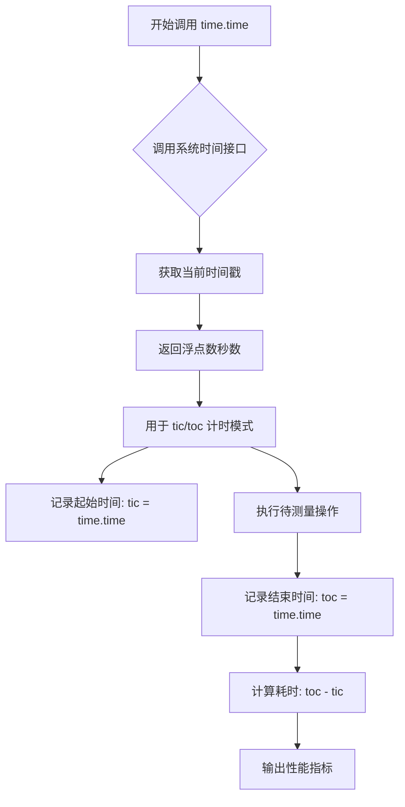

#### 带注释源码

```python
# time.time() 使用示例 - 用于性能计时

# 第一次使用：测量 plt.plot 绘制多条线的时间
tic = time.time()  # 记录开始时间，获取当前时间戳（浮点数，表示秒）
axes[0].plot(x, Y.T, color="C0", alpha=0.1)  # 执行待测量的操作
toc = time.time()  # 记录结束时间，获取当前时间戳
axes[0].set_title("Line plot with alpha")
print(f"{toc-tic:.3f} sec. elapsed")  # 计算并打印耗时，保留3位小数

# 第二次使用：测量2D直方图绘制的时间
tic = time.time()  # 记录开始时间
# ... 中间的直方图计算和绘制代码 ...
toc = time.time()  # 记录结束时间
print(f"{toc-tic:.3f} sec. elapsed")  # 计算并打印耗时

# 实际调用的 time.time() 函数（Python标准库实现示意）
# import time
# time.time() -> float
#   返回自1970-01-01以来的秒数，可用于性能基准测试和计时
```

#### 关键组件信息

| 组件名称 | 一句话描述 |
|---------|-----------|
| `time.time` | Python标准库函数，获取当前时间戳用于性能计时 |
| `tic/toc` 模式 | 使用两次time.time()调用计算代码执行耗时的常用模式 |

#### 潜在的技术债务或优化空间

1. **计时精度考虑**：在Windows上，`time.time()`的分辨率约为15ms，对于更精细的性能测量，可考虑使用`time.perf_counter()`或`time.process_time()`
2. **重复代码**：两次计时代码块有重复模式，可封装为计时装饰器或辅助函数

#### 其它项目

**设计目标与约束：**
- 用于测量代码执行性能，比较不同实现方式的效率
- 目标精度：秒级（可显示毫秒级结果）

**错误处理与异常设计：**
- `time.time()`本身不抛出异常
- 可能的系统时间回拨会导致负的时间差

**数据流与状态机：**
```
Start → time.time() → Capture Timestamp → Execute Operation → time.time() → Capture Timestamp → Calculate Delta → End
```

**外部依赖与接口契约：**
- 依赖Python标准库`time`模块
- 无接口参数，返回浮点数秒值


### `plt.subplots`

创建包含多个子图的Figure和Axes对象，是matplotlib中最常用的创建子图布局的函数之一。

参数：

- `nrows`：`int`，默认值1，子图网格的行数
- `ncols`：`int`，默认值1，子图网格的列数
- `sharex`：`bool`或`{'none', 'all', 'row', 'col'}`，默认值False，是否共享x轴
- `sharey`：`bool`或`{'none', 'all', 'row', 'col'}`，默认值False，是否共享y轴
- `squeeze`：`bool`，默认值True，是否压缩返回的axes数组维度
- `width_ratios`：`array-like`，长度为ncols，各列宽度比例
- `height_ratios`：`array-like`，长度为nrows，各行高度比例
- `subplot_kw`：`dict`，传递给`add_subplot`的关键字参数
- `gridspec_kw`：`dict`，传递给GridSpec构造函数的关键字参数
- `**fig_kw`：传递给`figure()`函数的其他关键字参数（如figsize、layout等）

返回值：

- `fig`：`matplotlib.figure.Figure`，创建的图形对象
- `axes`：`numpy.ndarray`或`matplotlib.axes.Axes`，创建的子图对象数组

#### 流程图

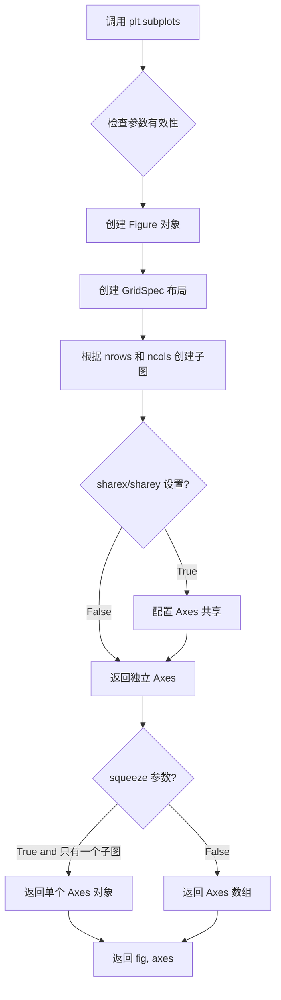

#### 带注释源码

```python
fig, axes = plt.subplots(nrows=3, figsize=(6, 8), layout='constrained')
#     │       │           │      │         └─── fig_kw: 传递给Figure的关键字参数
#     │       │           │      │             layout='constrained' 启用约束布局
#     │       │           └─── fig_kw: figsize=(6, 8) 设置图形尺寸
#     │       └─── nrows=3: 创建3行子图
#     │           (本例中省略ncols，默认值为1，创建单列布局)
#     └─── 返回值: 
#         - fig: Figure对象，整个图形容器
#         - axes: Axes对象数组 (shape: (3,))，因为squeeze=True且ncols=1

# 完整函数签名参考:
# plt.subplots(nrows=1, ncols=1, *, sharex=False, sharey=False, 
#              squeeze=True, width_ratios=None, height_ratios=None,
#              subplot_kw=None, gridspec_kw=None, **fig_kw)
```


### `np.random.seed`

设置全局随机种子，用于确保随机数生成的可重现性。在本代码中，使用固定种子值 19680801 确保每次运行代码时生成的随机数据序列完全相同，便于结果验证和调试。

参数：

- `seed`：`int` 或 `array_like`，随机数生成器的种子值。本代码中传入 `19680801`，这是一个常见的固定值，用于产生可重现的随机序列。

返回值：`None`，该函数无返回值，仅修改全局随机数生成器的内部状态。

#### 流程图

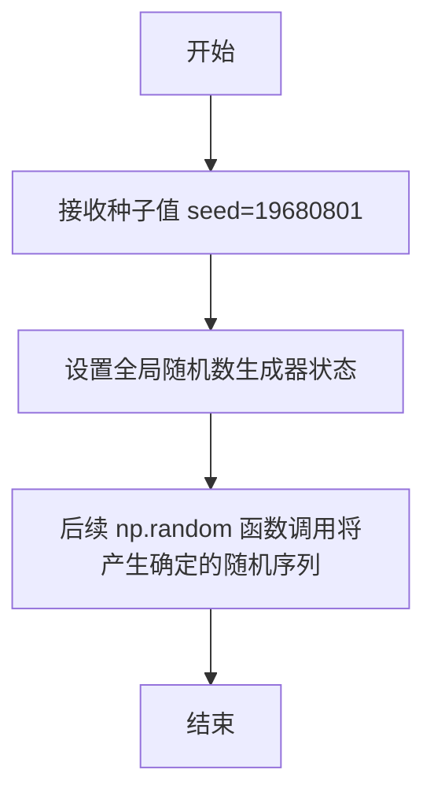

#### 带注释源码

```python
# 设置随机种子为 19680801，确保后续随机数生成可重现
# 这行代码保证了每次运行程序时:
# 1. 生成的随机游走数据 Y 相同
# 2. 生成的正弦信号参数 phi 相同
# 3. 添加的随机噪声相同
# 从而使得整个可视化结果可复现，便于调试和验证
np.random.seed(19680801)
```


### `np.random.randn`

生成标准正态分布（均值=0，标准差=1）的随机数数组。该函数是NumPy中用于生成符合高斯分布随机数的核心函数，常用于模拟噪声、数据扰动、初始化权重等场景。

#### 参数

- `*dimensions`：`int`，可变数量的整数参数，每个整数指定输出数组对应维度的长度。例如，`np.random.randn(3, 2)` 生成一个 3×2 的二维数组。

#### 返回值

- `ndarray`，返回指定形状的数组，数组中的每个元素服从标准正态分布（均值为0，标准差为1）。

#### 流程图

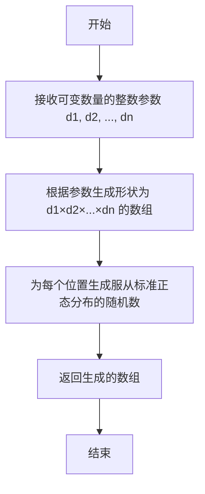

#### 带注释源码

```python
# 从代码中提取的实际使用示例
np.random.randn(num_series, num_points)

# 参数说明：
# - num_series: int，表示要生成的随机游走序列的数量（代码中为1000）
# - num_points: int，每个序列中数据点的数量（代码中为100）
# - 返回值：形状为 (1000, 100) 的二维 ndarray
#         其中每个元素服从标准正态分布 N(0,1)

# 函数功能说明：
# 1. np.random.randn 是 NumPy 库的随机数生成函数
# 2. 它生成的是标准正态分布（均值μ=0，标准差σ=1）的随机数
# 3. 与 np.random.rand 不同（后者生成的是均匀分布 [0,1)）
# 4. 在代码中用于：
#    - Y = np.cumsum(np.random.randn(num_series, num_points), axis=-1)
#      生成1000条独立的随机游走序列（通过累积求和）
```


### `np.cumsum`

沿指定轴计算数组元素的累积和（Cumulative Sum）。在随机游走模拟中，将标准正态分布的随机数累积起来，生成 unbiased Gaussian random walk。

参数：

- `a`：`array_like`，输入数组，包含需要计算累积和的元素
- `axis`：`int`，可选参数，指定沿哪个轴进行累积计算，默认为 None（将数组展平）
- `dtype`：`dtype`，可选参数，指定返回数组的数据类型，如果不指定则使用输入数组的类型
- `out`：`ndarray`，可选参数，指定输出数组

返回值：`ndarray`，返回累积和数组，维度与输入数组相同

#### 流程图

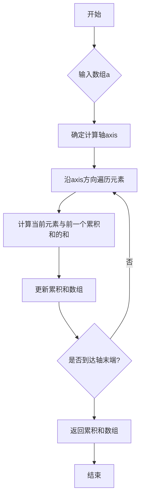

#### 带注释源码

```python
import numpy as np

# 示例代码展示 np.cumsum 在随机游走中的应用

# 设置随机种子以确保可重复性
np.random.seed(19680801)

# 参数设置
num_series = 1000  # 生成1000条时间序列
num_points = 100   # 每条序列100个点

# 生成标准正态分布的随机数 (均值0, 标准差1)
# 形状: (1000, 100)
random_steps = np.random.randn(num_series, num_points)

# 使用 np.cumsum 沿最后一个轴 (axis=-1) 计算累积和
# 这将生成 unbiased Gaussian random walk
# 每一行代表一条随机游走路径
# axis=-1 表示沿最后一个维度（列）进行累积
Y = np.cumsum(random_steps, axis=-1)

# 验证结果
print(f"输入形状: {random_steps.shape}")
print(f"输出形状: {Y.shape}")
print(f"随机游走示例 (前5个点): {Y[0, :5]}")

# RMS deviation from origin after n steps = σ*sqrt(n)
# 对于标准正态分布 (σ=1), 100步后的RMS ≈ sqrt(100) = 10
final_rms = np.sqrt(np.mean(Y[:, -1]**2))
print(f"最终RMS偏差 (理论值≈10): {final_rms:.2f}")
```


### `np.linspace`

生成指定范围内的等间距数组（常用于生成x轴坐标序列）

参数：

- `start`：`float`，序列的起始值
- `stop`：`float`，序列的结束值（当`endpoint=True`时包含该值）
- `num`：`int`，要生成的样本数量，默认为50
- `endpoint`：`bool`，是否将`stop`作为序列的最后一个值，默认为True
- `retstep`：`bool`，如果为True，则返回`(samples, step)`，默认为False
- `dtype`：`dtype`，输出数组的数据类型，若未指定则从输入推断
- `axis`：`int`，当`stop`是数组时，样本沿该轴存储（NumPy 1.16+）

返回值：

- `ndarray`，如果`retstep=False`，返回等间距的数组；如果`retstep=True`，返回`(数组, 步长)`的元组

#### 流程图

```mermaid
flowchart TD
    A[开始] --> B{检查参数有效性}
    B --> C{num <= 0?}
    C -->|是| D[抛出 ValueError]
    C -->|否| E{endpoint=True?}
    E -->|是| F[计算实际结束值]
    E -->|否| G[使用原始stop值]
    F --> H[计算步长 step = (stop - start) / (num - 1)]
    G --> H
    H --> I[创建等间距数组]
    I --> J{dtype指定?}
    J -->|是| K[转换为指定dtype]
    J -->|否| L[推断dtype]
    K --> M{retstep=True?}
    L --> M
    M -->|是| N[返回 数组 和 step 元组]
    M -->|否| O[仅返回数组]
    N --> P[结束]
    O --> P
```

#### 带注释源码

```python
# 代码中的实际调用示例 1：生成基础x轴坐标
x = np.linspace(0, 4 * np.pi, num_points)
# 参数: start=0, stop=4π≈12.566, num=100
# 用途: 生成从0到4π的100个等间距点，用于绘制时间序列的x轴

# 代码中的实际调用示例 2：生成细粒度插值坐标
x_fine = np.linspace(x.min(), x.max(), num_fine)
# 参数: start=x数组最小值, stop=x数组最大值, num=800
# 用途: 生成更细粒度的800个点，用于2D直方图的数据插值和平滑处理
# 注意: 这里使用了x.min()和x.max()动态获取范围，使插值更加灵活
```


### `np.sqrt`

逐元素计算输入数组的平方根。

参数：

- `x`：`array_like`，输入数组，需要计算平方根的元素

返回值：`ndarray`，返回与输入数组形状相同的数组，包含对应元素的平方根值

#### 流程图

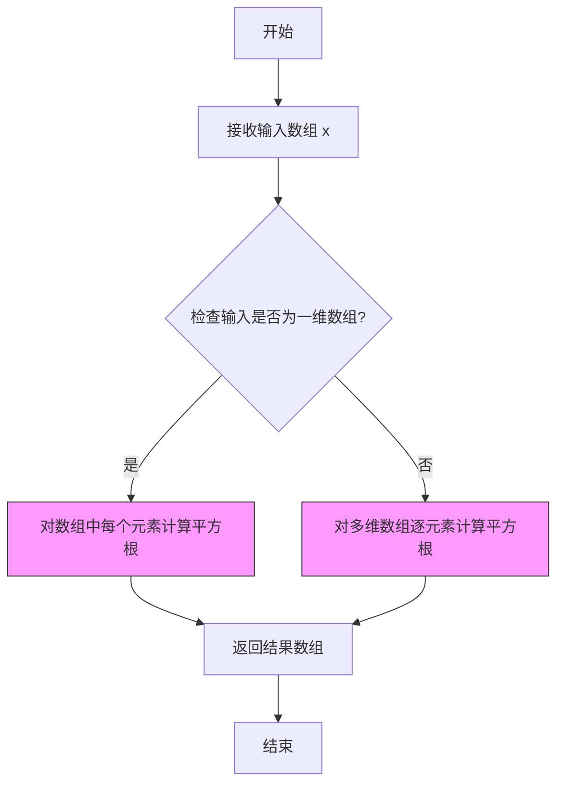

#### 带注释源码

```python
# np.sqrt 函数源码示例
# 计算输入数组 x 中每个元素的平方根

# 参数 x: array_like
#   输入数组，可以是单个数字、列表或 NumPy 数组
#   负数输入将返回 NaN

# 返回值: ndarray
#   与输入数组形状相同的数组，包含每个元素的平方根

# 在本例中的调用:
# np.sqrt(np.arange(num_points))
#   - np.arange(num_points) 生成从 0 到 num_points-1 的数组
#   - np.sqrt 对数组中的每个元素计算平方根
#   - 用于生成随机游走的 RMS 缩放因子

# 示例:
# 输入: np.arange(4) -> array([0, 1, 2, 3])
# 输出: np.sqrt(array([0, 1, 2, 3])) -> array([0.        , 1.        , 1.41421356, 1.73205081])
```


### `np.sin`

逐元素计算输入数组（以弧度为单位）的正弦值。

参数：
- `x`：`array_like`，输入角度，单位为弧度，可以是单个数值、列表或 NumPy 数组。

返回值：`ndarray`，返回与输入数组形状相同的正弦值数组，逐元素计算。

#### 流程图


#### 带注释源码

```python
# 调用 np.sin 计算正弦值
# x 是角度数组（弧度），phi 是随机偏移数组
# np.sin(x - phi) 计算每个角度减去对应偏移后的正弦值
sin_values = np.sin(x - phi)
```


### `np.pi`

`np.pi` 是 NumPy 库提供的数学常数，表示圆周率 π（约等于 3.141592653589793）。这是一个只读的浮点型常量，用于数学计算中需要圆周率的场景。

参数：无（这是一个常量，不接受任何参数）

返回值：`float`，返回圆周率 π 的值（约等于 3.141592653589793）

#### 流程图

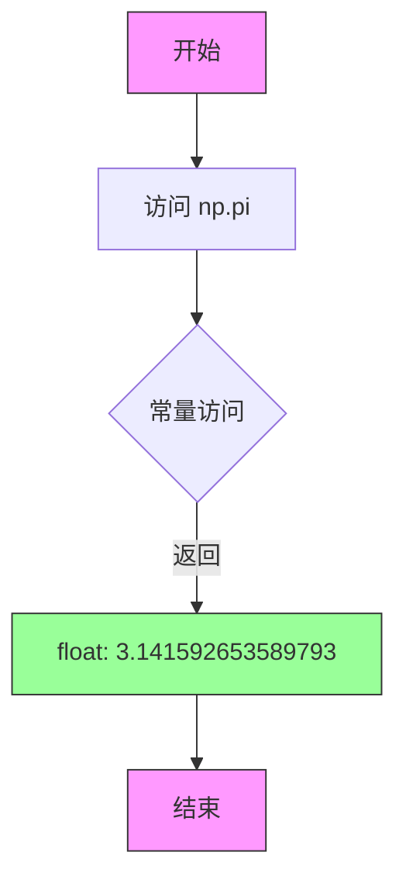

#### 带注释源码

```python
# np.pi 是 NumPy 库中的数学常数，表示圆周率 π
# 在代码中的使用示例：

# 生成从 0 到 4π 的等间距数组
x = np.linspace(0, 4 * np.pi, num_points)

# 计算随机偏移量 phi，范围在 ±π/8 之间
phi = (np.pi / 8) * np.random.randn(num_signal, 1)

# np.pi 的本质是一个预定义的浮点数常量
# 在 NumPy 源代码中大致定义为：
# pi = 3.14159265358979323846264338327950288419716939937510...

# 实际使用时不消耗参数，直接返回 π 的值
# 例如：np.pi * 2 返回 6.283185307179586
```


### `np.arange`

生成等差数组的NumPy函数，返回一个包含连续等差元素的NumPy数组。

参数：

- `start`：`int` 或 `float`，起始值（可选），默认为0
- `stop`：`int` 或 `float`，结束值（必填），生成的数组不包括此值
- `step`：`int` 或 `float`，步长（可选），默认为1
- `dtype`：`dtype`，输出数组的数据类型（可选），若未指定则从输入参数推断

返回值：`numpy.ndarray`，包含等差元素的数组

#### 流程图

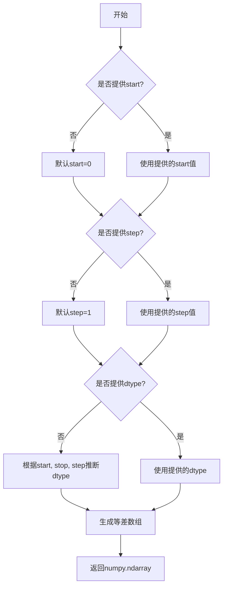

#### 带注释源码

```python
# 在本例中的使用方式
# 代码第47行：
np.sqrt(np.arange(num_points))

# np.arange(num_points) 等价于 np.arange(0, num_points, 1)
# 生成从0开始、到num_points-1结束的整数序列
# 例如：num_points=100时，返回 array([0, 1, 2, ..., 99])

# 完整函数签名
# numpy.arange([start, ]stop[, step, ], dtype=None)

# 示例：
# np.arange(5)        # array([0, 1, 2, 3, 4])
# np.arange(1, 5)     # array([1, 2, 3, 4])
# np.arange(1, 5, 2)  # array([1, 3])
# np.arange(0, 10, 2) # array([0, 2, 4, 6, 8])

# 在本例中的作用：
# 生成 [0, 1, 2, ..., num_points-1] 的序列
# 然后通过 np.sqrt() 计算平方根，作为随机游走的RMS缩放因子
# 随机游走的RMS偏差为 σ*sqrt(n)，因此需要用 sqrt(n) 来缩放正弦波信号的幅度
```


### `np.interp`

一维线性插值函数，用于在已知数据点之间估算任意位置的函数值。该函数接受待插值的x坐标序列、已知数据点的x坐标序列和对应的y值序列，返回线性插值后的y坐标序列。

参数：

- `x`：`array_like`，待插值的x坐标序列（目标点），可以是标量或数组。函数将在这些位置计算插值结果。
- `xp`：`array_like`，已知数据点的x坐标序列（必须按递增顺序排列）。这些是已知的参考点，用于定义插值基函数。
- `fp`：`array_like`，已知数据点的y坐标序列，与`xp`长度相同。这些是对应于`xp`位置的实际函数值。
- `left`：可选参数，`float`或`complex`，当`x`小于`xp[0]`时返回的默认值。
- `right`：可选参数，`float`或`complex`，当`x`大于`xp[-1]`时返回的默认值。
- `period`：可选参数，`float`，如果指定，则将`xp`和`x`视为周期性数据进行插值。

返回值：`ndarray`，返回在`x`位置进行线性插值后的y坐标序列，长度与输入的`x`相同。

#### 流程图

```mermaid
flowchart TD
    A[开始 np.interp] --> B{检查输入参数有效性}
    B --> C{判断 x 是否为标量}
    C -->|是| D[返回标量插值结果]
    C -->|否| E[初始化输出数组]
    E --> F{遍历每个待插值点}
    F --> G{查找 x[i] 在 xp 中的位置}
    G --> H{判断边界情况}
    H -->|x[i] < xp[0]| I[使用 left 参数值]
    H -->|x[i] > xp[-1]| J[使用 right 参数值]
    H -->|xp[0] <= x[i] <= xp[-1]| K[线性插值计算]
    K --> L[y = fp[j] + (x[i] - xp[j]) * (fp[j+1] - fp[j]) / (xp[j+1] - xp[j])]
    I --> M[存储结果到输出数组]
    J --> M
    L --> M
    M --> N{是否还有未处理点?}
    N -->|是| F
    N -->|否| O[返回完整插值结果数组]
    D --> O
```

#### 带注释源码

```python
# np.interp 函数源码核心逻辑（基于 NumPy 实现简化版）
def np_interp(x, xp, fp, left=None, right=None, period=None):
    """
    一维线性插值函数
    
    参数:
        x: 待插值的x坐标序列（目标点）
        xp: 已知数据点的x坐标序列（必须递增）
        fp: 已知数据点的y坐标序列
        left: x在xp左侧时的返回值
        right: x在xp右侧时的返回值
        period: 周期性插值的周期
    """
    
    # 将输入转换为 numpy 数组
    x = np.asarray(x)
    xp = np.asarray(xp)
    fp = np.asarray(fp)
    
    # 处理周期性情况
    if period is not None:
        # 对 xp 和 x 进行周期映射
        xp = np.mod(xp, period)
        x = np.mod(x, period)
        # 排序以确保 xp 递增
        sort_idx = np.argsort(xp)
        xp = xp[sort_idx]
        fp = fp[sort_idx]
    
    # 确定边界值
    if left is None:
        left = fp[0]  # 默认使用第一个fp值
    if right is None:
        right = fp[-1]  # 默认使用最后一个fp值
    
    # 查找每个x值在xp中的位置（使用 searchsorted）
    # indices 表示 x 应该插入 xp 的位置
    indices = np.searchsorted(xp, x)
    
    # 处理边界情况
    # 当 x 在 xp 左侧时，indices = 0
    # 当 x 在 xp 右侧时，indices = len(xp)
    
    # 初始化输出数组
    result = np.empty_like(x, dtype=np.result_type(fp, x))
    
    # 分离在范围内和范围外的点
    # 在 xp 范围内的点需要插值
    in_bounds = (indices > 0) & (indices < len(xp))
    
    # 对边界内的点进行线性插值
    # indices[in_bounds] 给出每个x的右邻点索引
    # indices[in_bounds] - 1 给出左邻点索引
    lo = indices[in_bounds] - 1
    hi = indices[in_bounds]
    
    # 线性插值公式: y = y0 + (x - x0) * (y1 - y0) / (x1 - x0)
    x_lo = xp[lo]
    x_hi = xp[hi]
    y_lo = fp[lo]
    y_hi = fp[hi]
    
    # 斜率计算 (y1 - y0) / (x1 - x0)
    slope = (y_hi - y_lo) / (x_hi - x_lo)
    
    # 插值结果
    result[in_bounds] = y_lo + (x[in_bounds] - x_lo) * slope
    
    # 处理边界外的点（使用 left 或 right 参数）
    # x < xp[0] 使用 left 值
    result[~in_bounds & (x < xp[0])] = left
    
    # x > xp[-1] 使用 right 值
    result[~in_bounds & (x > xp[-1])] = right
    
    # 处理正好等于边界的情况
    result[~in_bounds & (x == xp[0])] = fp[0]
    
    return result


# 在示例代码中的实际使用方式:
# x_fine: 细粒度的x坐标序列（800个点，从0到4π）
# x: 原始粗粒度的x坐标序列（100个点）
# y_row: 原始时间序列数据（100个y值）
y_fine = np.concatenate([np.interp(x_fine, x, y_row) for y_row in Y])

# 对每一行时间序列 Y 进行插值
# 将原始100个点的数据插值到800个点
# 结果是一个长度为 800 * 1000 = 800000 的展平数组
```


### `np.concatenate`

沿指定轴连接多个数组，形成一个连续的输出数组。

参数：

-  `tup`：`sequence of array_like`，需要连接的数组序列。在代码中为由 `np.interp()` 生成的插值结果列表 `[np.interp(x_fine, x, y_row) for y_row in Y]`
-  `axis`：`int`，可选参数，指定沿哪个轴连接，默认为 0。在代码中未显式指定，使用默认值 0（沿第一个轴连接，即垂直方向拼接所有插值数组）
-  `out`：`ndarray`，可选参数，指定输出数组的存放位置
-  `dtype`：`data type`，可选参数，指定输出数组的数据类型
-  `casting`：`str`，可选参数，指定数据类型转换规则

返回值：`ndarray`，连接后的数组。在代码中为所有时间序列插值后的一维数组 `y_fine`，用于后续的直方图统计。

#### 流程图

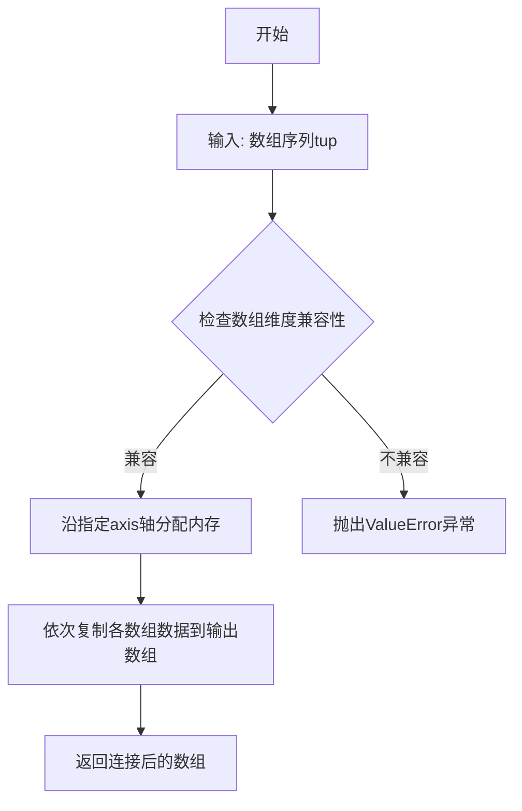

#### 带注释源码

```python
# 代码中的实际调用方式
y_fine = np.concatenate([np.interp(x_fine, x, y_row) for y_row in Y])

# 解释：
# 1. [np.interp(x_fine, x, y_row) for y_row in Y] 是一个列表推导式
#    - 遍历 Y 的每一行 (y_row)
#    - 对每一行使用 x_fine 作为新x坐标, x 作为原始x坐标进行线性插值
#    - 生成 1000 个形状为 (800,) 的插值数组
#
# 2. np.concatenate(...) 将这1000个数组沿默认轴(0轴)连接
#    - 输入: 形状为 (1000, 800) 的数组列表（实际上展平为1000个(800,)的数组）
#    - 输出: 形状为 (800000,) 的一维数组
#
# 3. 结果 y_fine 用于后续的 np.histogram2d(x_fine, y_fine, bins=[400, 100])
#    - x_fine 通过 np.broadcast_to 扩展为 (800000,)
#    - y_fine 是对应的y值
#    - 形成800000个点用于绘制2d直方图
```


### `np.broadcast_to`

将一维数组广播（复制）到指定的二维形状，生成一个可用于后续计算的多行数据副本。

参数：

- `x_fine`：`numpy.ndarray`，源一维数组，这里是一个从 `x.min()` 到 `x.max()` 的线性间隔数组（包含 800 个点）
- `shape`：`tuple`，目标形状元组，格式为 `(num_rows, num_cols)`，这里传入 `(num_series, num_fine)`，即 `(1000, 800)`

返回值：`numpy.ndarray`，返回广播后的数组，其形状为目标形状，然后通过 `.ravel()` 方法展平成一维数组

#### 流程图

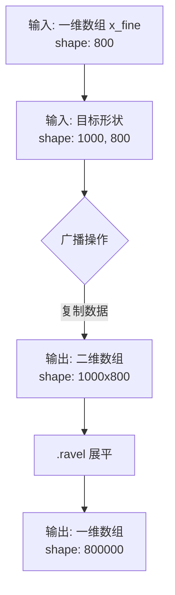

#### 带注释源码

```python
# x_fine 是从 x.min() 到 x.max() 的线性间隔数组，包含 800 个点
# shape: (800,)
x_fine = np.linspace(x.min(), x.max(), num_fine)  # num_fine = 800

# np.broadcast_to 将 x_fine 沿第一个维度广播，复制 1000 次
# 输入: x_fine (800,) -> 输出: (1000, 800) 的二维数组
# 每个子数组都是 x_fine 的副本
x_fine = np.broadcast_to(x_fine, (num_series, num_fine)).ravel()
#                                      ↑          ↑
#                                      │          └─ 每个 x_fine 有 800 个点
#                                      └─ 共 1000 个时间序列
# .ravel() 将 (1000, 800) 展平为 (800000,) 的一维数组
# 用于后续 np.histogram2d 的 x 坐标输入
```


### `numpy.ndarray.ravel`

该方法将多维数组展平为一维数组，返回一个视图（如果可能）或副本。

参数：

- `order`：可选参数，指定展平顺序。'C' 表示按行优先（C风格），'F' 表示按列优先（Fortran风格），'A' 表示如果数组是Fortran连续则按列优先否则按行优先，'K' 表示按内存中出现的顺序读取元素。默认值为 'C'。

返回值：返回展平后的一维数组。如果可能，返回视图；否则返回副本。

#### 流程图

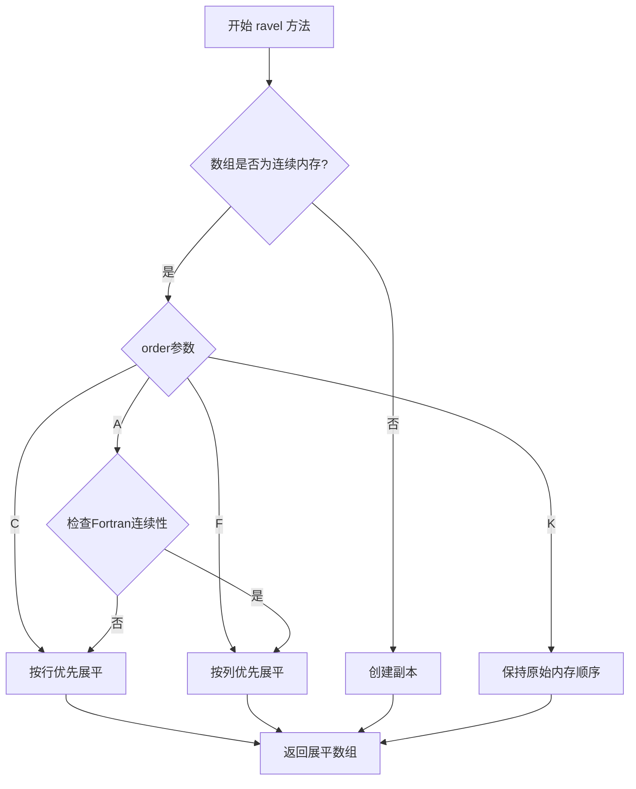

#### 带注释源码

```python
# 从代码中提取的使用示例
x_fine = np.broadcast_to(x_fine, (num_series, num_fine)).ravel()

# np.broadcast_to 创建了一个形状为 (num_series, num_fine) 的数组
# 该数组在内存中可能是非连续的
# 调用 .ravel() 方法将这个二维数组展平为一维数组
# 返回结果赋值给 x_fine
#
# 等价于: x_fine = np.broadcast_to(x_fine, (num_series, num_fine)).reshape(-1)
# 但 .ravel() 通常更高效，因为如果可能它会返回视图而非副本
```

#### 关键组件信息

| 名称 | 描述 |
|------|------|
| `numpy.ndarray.ravel` | NumPy数组的方法，用于将多维数组展平为一维数组 |
| `np.broadcast_to` | 用于创建形状广播后的数组视图的NumPy函数 |

#### 潜在的技术债务或优化空间

1. **内存效率**：在代码中使用 `np.concatenate` 配合列表推导式创建 `y_fine`，然后立即调用 `.ravel()` 将 `x_fine` 展平。这种模式可以优化为直接使用 `np.ravel` 或 `np.flatten` 以提高代码清晰度。

2. **性能考虑**：对于大规模数据，`np.histogram2d` 的计算可能成为瓶颈。可以考虑使用 `numpy.histogramdd` 或其他向量化方法来提升性能。

3. **代码可读性**：`x_fine` 和 `y_fine` 的创建过程涉及多个步骤，可以封装为独立函数以提高可维护性。

#### 其他项目

- **设计目标**：通过直方图可视化大量时间序列数据，揭示隐藏的信号结构。
  
- **约束条件**：需要生成足够多的随机游走序列来模拟噪声背景，同时确保正弦波信号在统计上可见。

- **错误处理**：代码假设输入数据为有效的numpy数组，未对输入类型进行显式验证。

- **数据流**：
  1. 生成随机游走数据
  2. 添加正弦波信号
  3. 线性插值增加数据分辨率
  4. 使用 `ravel()` 展平数组
  5. 二维直方图统计
  6. 可视化输出

- **外部依赖**：
  - `numpy`: 数值计算
  - `matplotlib.pyplot`: 数据可视化
  - `time`: 性能计时


### `np.histogram2d`

该函数是NumPy库中的二维直方图计算函数，用于将二维数据分箱并统计每个箱中的数据点数量，返回频数直方图矩阵以及x轴和y轴的边界edges。

参数：

- `x`：`array_like`，第一个维度上的输入数据数组
- `y`：`array_like`，第二个维度上的输入数据数组
- `bins`：`int`或`array_like`或`[int, int]`，直方图的箱数，可以是单个整数（两个维度共用）、两个整数数组（分别指定每个维度的箱数），默认值为10
- `range`：`array_like`，可选，形状为(2, 2)的数组，指定每个维度的范围[[xmin, xmax], [ymin, ymax]]
- `density`：`bool`，可选，如果为True，则返回的概率密度；否则返回频数，默认值为False
- `weights`：`array_like`，可选，与x和y相同形状的权重数组，用于对每个数据点加权
- `cumulative`：`bool`，可选，如果为True，则计算累积直方图，默认值为False

返回值：

- `H`：`ndarray`，二维直方图数组，形状为(nx, ny)
- `xedges`：`ndarray`，x轴方向的边界数组，长度为nx+1
- `yedges`：`ndarray`，y轴方向的边界数组，长度为ny+1

#### 流程图

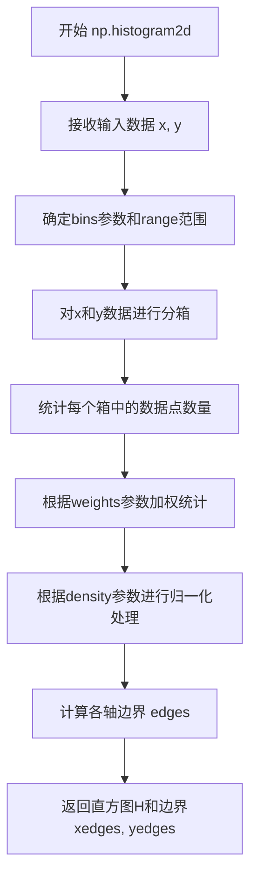

#### 带注释源码

```python
# 示例代码中的调用方式
h, xedges, yedges = np.histogram2d(x_fine, y_fine, bins=[400, 100])

# 参数说明：
# x_fine: 展平后的x坐标数组，来源于对原始时间序列进行线性插值
# y_fine: 展平后的y坐标数组，来源于对原始时间序列进行线性插值
# bins=[400, 100]: x轴方向400个bin，y轴方向100个bin

# 返回值说明：
# h: 二维频数直方图矩阵，形状为(400, 100)
# xedges: x轴边界数组，长度为401
# yedges: y轴边界数组，长度为101

# 代码中的实际用途：
# 将多个时间序列数据转换为2D直方图形式，
# 以便使用pcolormesh进行可视化，突出隐藏的信号结构
```


### `axes.pcolormesh`

该方法用于在 Axes 对象上绘制伪彩色网格图（QuadMesh），通过将数据映射到颜色空间来实现二维数据的可视化。此方法接收网格坐标和颜色数据数组，支持多种颜色映射方式（colormap）、归一化处理、光栅化等高级特性，适用于大规模数据的快速渲染。

参数：

- `X`：array_like，可选。长度为 M 的数组或形状为 (M, N) 的二维数组，表示网格单元的 x 坐标。
- `Y`：array_like，可选。长度为 N 的数组或形状为 (M, N) 的二维数组，表示网格单元的 y 坐标。
- `C`：array_like，必填。形状为 (M, N) 的二维数组，表示每个网格单元的颜色数据值。
- `cmap`：str 或 `Colormap`，可选。颜色映射名称或 Colormap 对象，用于将数据值映射到颜色。代码中使用了 `"plasma"` 颜色映射。
- `norm`：`Normalize` 或 str，可选。数据归一化方式，代码中使用了 `"log"` 对数归一化。
- `vmin, vmax`：float，可选。颜色映射的最小值和最大值，用于控制颜色范围。代码中 `vmax=1.5e2` 限制了颜色显示的最大阈值。
- `shading`：str，可选。填充样式，默认为 `'flat'`，表示每个网格单元使用单一颜色。
- `rasterized`：bool，可选。是否将图形光栅化以减小文件体积，代码中设置为 `True` 以优化性能。
- 其他参数：包括 `alpha`（透明度）、`snap`（对齐像素边界）等 matplotlib 支持的参数。

返回值：`matplotlib.collections.QuadMesh`，返回创建的 QuadMesh 集合对象，可用于后续的颜色条（colorbar）添加和图形属性设置。

#### 流程图

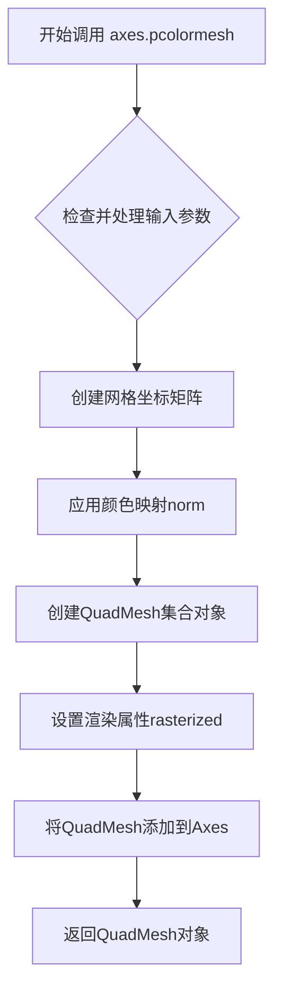

#### 带注释源码

```python
# 绘制2D直方图的伪彩色网格图 - 使用对数颜色归一化
# 参数说明：
# xedges: 直方图x轴边界数组 (形状为 [bins+1])
# yedges: 直方图y轴边界数组 (形状为 [bins+1])
# h.T: 直方图数据的转置数组 (形状与网格匹配)
# cmap: plasma颜色映射方案
# norm='log': 使用对数归一化处理数据值
# vmax=1.5e2: 限制颜色映射的最大值为150
# rasterized=True: 启用光栅化以优化性能
pcm = axes[1].pcolormesh(xedges, yedges, h.T, cmap=cmap,
                         norm="log", vmax=1.5e2, rasterized=True)

# 绘制相同的2D直方图 - 使用线性颜色归一化
# 区别在于norm参数：此处使用默认的线性归一化
pcm = axes[2].pcolormesh(xedges, yedges, h.T, cmap=cmap,
                         vmax=1.5e2, rasterized=True)
```


### `plt.colormaps`

`plt.colormaps` 是 matplotlib 的颜色映射注册表（ColormapRegistry），用于通过名称获取 matplotlib 内置的颜色映射（Colormap 对象）。在代码中用于获取 "plasma" 颜色映射，以便在 2D 直方图中使用对数或线性颜色刻度。

参数：

- `name`：`str`，颜色映射的名称（如 "plasma", "viridis", "coolwarm" 等）

返回值：`matplotlib.colors.Colormap`，返回对应名称的颜色映射对象

#### 流程图

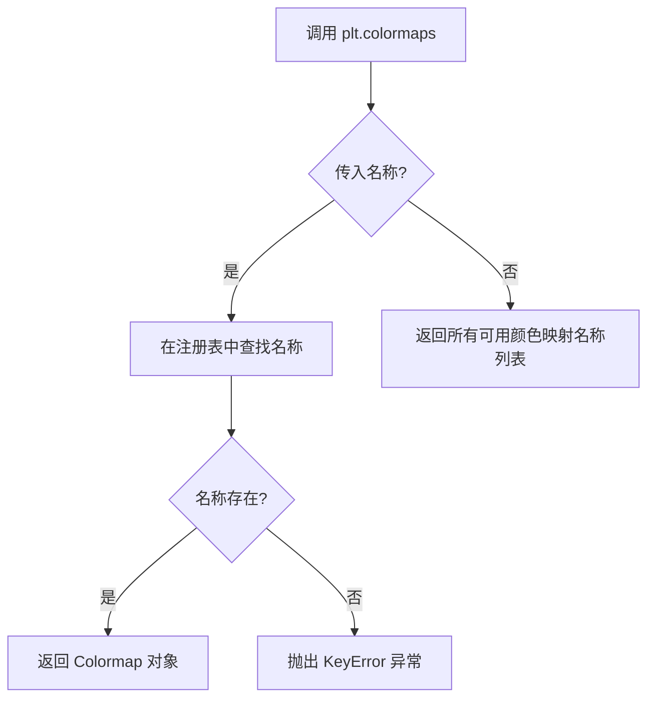

#### 带注释源码

```python
# 从 matplotlib.pyplot 获取颜色映射注册表
# plt.colormaps 是 ColormapRegistry 类的实例
# 它管理所有内置和自定义的颜色映射

# 使用方式：plt.colormaps[颜色映射名称]
cmap = plt.colormaps["plasma"]  # 获取名为 'plasma' 的颜色映射

# Colormap 对象的主要方法：
# - with_extremes(bad=...): 设置用于表示无效值的颜色
# - __call__(x): 将数值映射到颜色
```


### `Colormap.with_extremes`

设置颜色映射的极端值处理，用于定义超出范围或无效值的颜色显示。

参数：

- `bad`：`rgba tuple` 或 `str`，指定用于表示无效值（NaN、Inf）的颜色，默认为 `None`
- `under`：`rgba tuple` 或 `str`，指定用于表示低于颜色映射下限的值的颜色，默认为 `None`
- `over`：`rgba tuple` 或 `str`，指定用于表示超出颜色映射上限的值的颜色，默认为 `None`

返回值：`Colormap`，返回一个新的 Colormap 对象，保留了原始颜色映射的所有属性，并应用了指定的极端值设置。

#### 流程图

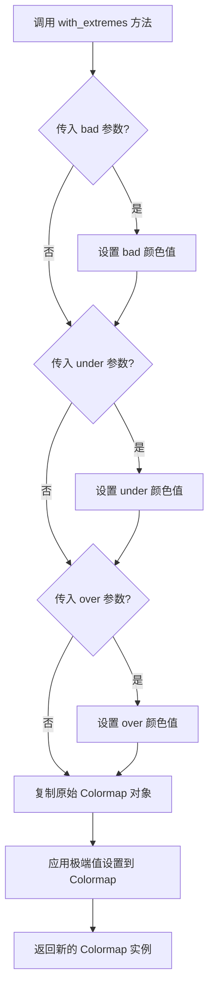

#### 带注释源码

```python
# 代码中的实际调用示例
cmap = plt.colormaps["plasma"]                # 获取 'plasma' 颜色映射
cmap = cmap.with_extremes(bad=cmap(0))        # 设置无效值的颜色为 cmap(0) 的颜色
# 等效于:
# cmap.set_bad(color=cmap(0))                 # 设置 bad 颜色的另一种方式

# 完整的方法签名（基于 Matplotlib 文档）:
# Colormap.with_extremes(bad=None, under=None, over=None)
#
# 参数说明:
#   - bad: 用于显示 NaN、Inf 等无效数据的颜色
#   - under: 用于显示低于数据范围下限的颜色
#   - over: 用于显示高于数据范围上限的颜色
#
# 返回值: 新的 Colormap 对象（不修改原始对象）
#
# 使用场景:
#   - 在 pcolormesh 或 imshow 中显示数据时处理无效值
#   - 配合 norm="log" 等归一化方式使用
#   - 自定义颜色映射的极端值显示效果

# 源码位置: lib/matplotlib/colors.py (Matplotlib 内部实现)
# def with_extremes(self, bad=None, under=None, over=None):
#     """
#     Return a copy of the colormap, with specified extreme values set.
#     """
#     new_cmap = copy.copy(self)  # 复制当前颜色映射
#     if bad is not None:
#         new_cmap.set_bad(bad)   # 设置无效值的颜色
#     if under is not None:
#         new_cmap.set_under(under)  # 设置低于下限的颜色
#     if over is not None:
#         new_cmap.set_over(over)    # 设置高于上限的颜色
#     return new_cmap
```


### `fig.colorbar` / `matplotlib.figure.Figure.colorbar`

该方法用于为 matplotlib 图形添加颜色条图例（colorbar），以便可视化数据值与颜色之间的映射关系。在代码中，它为通过 `pcolormesh` 创建的 2D 伪彩色图添加颜色条，显示数据点数量在颜色上的分布。

参数：

- `mappable`：`matplotlib.cm.ScalarMappable`，即第一个位置参数 `pcm`，通常是由 `pcolormesh`、`imshow` 等返回的用于映射数据值到颜色的对象
- `ax`：`matplotlib.axes.Axes`，可选参数，指定要将颜色条附加到哪个 axes，默认为 None（会自动推断）
- `label`：str，可选参数，颜色条的标签文本，用于描述颜色所代表的物理量，在代码中设置为 `"# points"`
- `pad`：`float`，可选参数，axes 与颜色条之间的间距（以英寸为单位），在代码中设置为 `0`
- `cax`：`matplotlib.axes.Axes`，可选参数，指定用于绘制颜色条的 axes
- `orientation`：`str`，可选参数，颜色条的方向，可选 `'vertical'` 或 `'horizontal'`
- `format`：`matplotlib.ticker.Formatter`，可选参数，控制颜色条刻度标签的格式
- `extend`：`str`，可选参数，指定是否在颜色条两端显示箭头，可选 `'neither'`、`'both'`、`'min'`、`'max'`

返回值：`matplotlib.colorbar.Colorbar`，返回创建的 Colorbar 对象，包含颜色条的所有属性和方法

#### 流程图

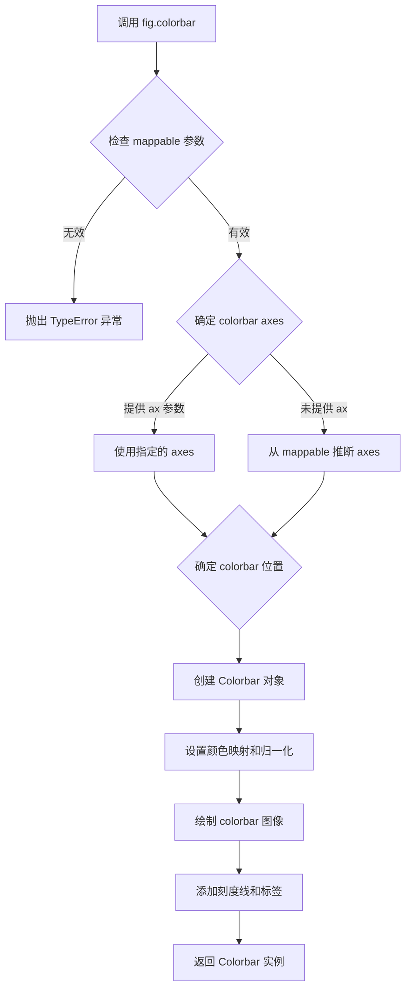

#### 带注释源码

```python
# 代码中调用 colorbar 的方式：
fig.colorbar(pcm, ax=axes[1], label="# points", pad=0)

# 参数说明：
# pcm: QuadMesh 对象，由 axes[1].pcolormesh() 返回
#      包含 xedges, yedges, h.T, cmap, norm="log", vmax=1.5e2 等数据
# ax=axes[1]: 指定颜色条附加到 axes[1]
# label="# points": 设置颜色条标签为"# points"（数据点数量）
# pad=0: 设置 axes 与颜色条之间的间距为 0 英寸

# 在 matplotlib 内部，colorbar 方法的主要流程：
# 1. fig.colorbar(mappable, ax, ...) 
#    -> 确定要添加颜色条的 figure 和 axes
    
# 2. 创建 colorbar axes:
#    -> 使用 make_axes 或 make_axes_gridspec 在合适位置创建新的 axes
    
# 3. 创建 Colorbar 对象:
#    -> cb = Colorbar(ax, mappable, **kwargs)
    
# 4. 设置颜色映射:
#    -> mappable.get_cmap() 获取颜色映射
#    -> mappable.get_norm() 获取归一化方法
    
# 5. 绘制颜色条:
#    -> ax.imshow 或 ax.pcolormesh 绘制颜色渐变
#    -> 添加刻度 tick marks
#    -> 添加标签 label
    
# 6. 返回 Colorbar 对象:
#    -> 包含 colorbar axes 和所有相关属性
```

---

### 补充信息

#### 关键组件信息

| 组件名称 | 一句话描述 |
|---------|-----------|
| `pcm` (QuadMesh) | 由 `pcolormesh` 返回的二维网格数据容器，包含颜色映射所需的全部信息 |
| `axes[1]` (Axes) | 第二个子图，用于展示 2D 直方图的伪彩色图像 |
| `h` (ndarray) | `np.histogram2d` 返回的二维直方图计数数组 |
| `cmap` (Colormap) | plasma 颜色映射，用于将数据值映射到颜色 |

#### 潜在的技术债务或优化空间

1. **硬编码参数**：颜色条的最大值 `vmax=1.5e2` 是硬编码的，应该根据数据动态计算或作为可配置参数
2. **重复代码**：第二个和第三个 subplot 的 `pcolormesh` 调用有大量重复代码，可以提取为函数
3. **魔法数字**：如 `num_fine=800`、`bins=[400, 100]` 等数值缺乏注释说明其选择依据
4. **时间测量代码**：性能测试代码 (`tic/toc`) 应该用正式的性能测试框架或装饰器替代

#### 设计目标与约束

- **设计目标**：高效可视化大量时间序列数据，通过 2D 直方图揭示隐藏的信号结构
- **约束条件**：随机游走的 RMS 特性决定了正弦波信号的缩放比例，以确保信号在视觉上可见

#### 错误处理与异常设计

- `mappable` 参数必须是一个有效的 ScalarMappable 对象，否则会抛出 `TypeError`
- 如果 `ax` 参数指定的 axes 与 `mappable` 所属的 figure 不匹配，可能导致颜色条显示位置异常
- 当 `norm="log"` 且数据包含零或负值时，会使用 `cmap.with_extremes(bad=cmap(0))` 将这些值映射为透明色

#### 数据流与状态机

```
随机种子固定 (np.random.seed)
    ↓
生成随机游走数据 Y (1000系列 × 100点)
    ↓
生成正弦信号并叠加到部分随机游走 (SNR=0.10)
    ↓
┌─────────────────────────────────────────┐
│ 分支1: plot 绘制 (alpha=0.1)             │
│ 分支2: 2d直方图 + 对数颜色刻度 + colorbar │
│ 分支3: 2d直方图 + 线性颜色刻度 + colorbar │
└─────────────────────────────────────────┘
    ↓
plt.show() 显示图形
```

#### 外部依赖与接口契约

- **numpy**: 用于生成随机数据、执行直方图计算和线性插值
- **matplotlib.pyplot**: 用于图形创建、子图布局和颜色映射
- **matplotlib.figure.Figure.colorbar**: 公共 API，接收 mappable 对象和可选的关键字参数，返回 Colorbar 对象


### `Axes.set_title`

设置子图（Axes）的标题，用于为每个子图提供描述性标签，帮助用户理解图表内容。

参数：

- `label`：`str`，要设置的标题文本，例如 `"Line plot with alpha"`
- `loc`：`str`，标题水平对齐方式，可选 `'center'`（默认）、`'left'`、`'right'`
- `pad`：`float`，标题与轴顶部边缘的距离（以 Points 为单位）
- `fontdict`：`dict`，可选，用于控制文本外观的字典（如 `fontsize`、`fontweight` 等）
- `**kwargs`：其他关键字参数，将传递给 `matplotlib.text.Text` 构造函数

返回值：`matplotlib.text.Text`，返回创建的标题 Text 对象，可用于后续自定义样式设置

#### 流程图

```mermaid
flowchart TD
    A[调用 axes[i].set_title] --> B{传入参数}
    B --> C[label: 标题文本]
    B --> D[loc: 对齐方式]
    B --> E[pad: 偏移距离]
    B --> F[fontdict: 字体样式]
    B --> G[**kwargs: 其他样式]
    C --> H[创建 Text 对象]
    D --> H
    E --> H
    F --> H
    G --> H
    H --> I[设置标题到 Axes 顶部]
    I --> J[返回 Text 对象]
```

#### 带注释源码

```python
# 代码中实际调用的三种方式：

# 方式1：为第一个子图设置标题
# axes[0]: 获取第1行子图（索引0）
# set_title: 设置该子图的标题为 "Line plot with alpha"
axes[0].set_title("Line plot with alpha")

# 方式2：为第二个子图设置标题
# axes[1]: 获取第2行子图（索引1）
# 标题描述使用了2d直方图和对数色彩映射
axes[1].set_title("2d histogram and log color scale")

# 方式3：为第三个子图设置标题
# axes[2]: 获取第3行子图（索引2）
# 标题描述使用了2d直方图和线性色彩映射
axes[2].set_title("2d histogram and linear color scale")

# 完整方法签名参考（matplotlib 内部实现逻辑）：
# def set_title(self, label, loc='center', pad=None, *, fontdict=None, **kwargs):
#     """
#     Set a title for the axes.
#
#     Parameters
#     ----------
#     label : str
#         Title text string.
#
#     loc : {'center', 'left', 'right'}, default: 'center'
#         Horizontal alignment of the title text.
#
#     pad : float, default: rcParams['axes.titlepad']
#         The offset (in points) from the top of the axes.
#
#     fontdict : dict
#         A dictionary controlling the appearance of the title text.
#
#     **kwargs
#         Additional keyword arguments are passed to `Text` constructor.
#
#     Returns
#     -------
#     Text
#         The matplotlib text object representing the title.
#     """
```


### `axes[].pcolormesh`

在指定的Axes上绘制伪彩色网格图（pseudocolor mesh），通过将数据值映射到颜色来表示二维数据的分布，支持对数/线性颜色归一化、颜色映射、透明度设置等高级可视化选项。

参数：

- `x`：`numpy.ndarray` 或类数组，一维数组，表示网格单元的x坐标（通常为直方图的边缘）
- `y`：`numpy.ndarray` 或类数组，一维数组，表示网格单元的y坐标（通常为直方图的边缘）
- `C`：`numpy.ndarray` 或类数组，二维数组，要绘制的数据矩阵，形状为(M-1, N-1)，其中x和y定义了(M, N)个网格点
- `cmap`：`str` 或 `Colormap`，颜色映射名称或Colormap对象，用于将数据值映射到颜色（如"plasma"）
- `norm`：`Normalize` 或 str，可选的归一化对象或字符串（如"log"表示对数归一化），用于将数据值缩放到[0, 1]范围
- `vmax`：`float`，可选，数据值的最大映射阈值，用于颜色映射的范围控制
- `alpha`：`float`，可选，透明度值，范围0-1，控制整个图形的透明度
- `rasterized`：`bool`，可选，默认为False，设置为True可将矢量图形栅格化为位图，提高渲染性能
- `shading`：`str`，可选，填充样式，可选'flat'、'nearest'、'gouraud'等
- `**kwargs`：其他关键字参数传递给`QuadMesh`构造函数

返回值：`matplotlib.collections.QuadMesh`，返回创建的QuadMesh集合对象，可用于进一步自定义（如添加colorbar）

#### 流程图

```mermaid
graph TD
    A[开始pcolormesh调用] --> B{参数验证}
    B -->|无效参数| C[抛出异常]
    B -->|有效参数| D[数据预处理]
    D --> E[创建QuadMesh对象]
    E --> F[应用颜色映射norm]
    F --> G[设置alpha透明度]
    G --> H[应用shading填充样式]
    H --> I{rasterized=True?}
    I -->|是| J[栅格化处理]
    I -->|否| K[保持矢量格式]
    J --> L[添加到Axes]
    K --> L
    L --> M[返回QuadMesh对象]
    
    subgraph 数据流
    N[输入数据C] --> O[norm映射到0-1]
    O --> P[cmap映射到颜色]
    end
    
    subgraph 颜色映射流程
    Q[数据值] --> R{vmax/vmin裁剪}
    R --> S[应用norm]
    S --> T[查表cmap]
    T --> U[输出RGBA]
    end
```

#### 带注释源码

```python
# matplotlib/axes/_axes.py 中的 pcolormesh 方法简化实现

def pcolormesh(self, *args, shading=None, alpha=None, norm=None, 
                cmap=None, vmin=None, vmax=None, include_lowest=False,
                shading_mode=None, **kwargs):
    """
    在Axes上创建伪彩色网格图。
    
    Parameters
    ----------
    *args : array-like
        参数可以是以下形式之一:
        - pcolormesh(x, y, C): x和y是坐标，C是数据
        - pcolormesh(C): 仅提供数据，坐标自动生成
        - pcolormesh(x, y, C, shading): 指定shading模式
    
    shading : {'flat', 'nearest', 'gouraud', 'auto'}, optional
        填充样式:
        - 'flat': 每个网格单元使用单一颜色，C形状为(M-1, N-1)
        - 'nearest': 每个网格点使用最近邻插值
        - 'gouraud':  Gouraud三角形插值 shading
    
    Returns
    -------
   _quadmesh : `~matplotlib.collections.QuadMesh`
        返回QuadMesh集合对象
    """
    
    # Step 1: 参数解析和处理
    # 将args转换为标准格式：(X, Y, C) 或 (C,)
    if shading is None:
        shading = 'auto'  # 默认自动shading
    
    # Step 2: 坐标数组创建
    # 如果只提供C，自动生成网格坐标
    # 否则验证X, Y, C的形状兼容性
    
    # Step 3: 创建数据值数组C
    # 确保C是二维数组，处理形状变换
    
    # Step 4: 处理norm归一化
    if isinstance(norm, str):
        if norm == 'log':
            # 对数归一化：使用LogNorm
            from matplotlib.colors import LogNorm
            norm = LogNorm(vmin=vmin, vmax=vmax)
        elif norm == 'linear':
            from matplotlib.colors import Normalize
            norm = Normalize(vmin=vmin, vmax=vmax)
    
    # Step 5: 处理颜色映射cmap
    if cmap is None:
        cmap = plt.rcParams['image.cmap']  # 使用默认cmap
    
    # Step 6: 处理透明度alpha
    if alpha is not None:
        kwargs['alpha'] = alpha
    
    # Step 7: 创建QuadMesh集合
    # QuadMesh是专门用于网格数据的Collection子类
    quadmesh = QuadMesh(
        # 网格坐标
        coords=X,  # (M, N) 形状的坐标数组
        # 数据数组
        array=C,   # (M-1, N-1) 形状的数据
        # 颜色映射
        cmap=cmap,
        # 归一化
        norm=norm,
        # 顶点数据
        vertices=None,
        # shading模式
        shading=shading,
        # 其他参数
        **kwargs
    )
    
    # Step 8: 栅格化处理
    if rasterized:
        quadmesh.set_rasterized(True)
    
    # Step 9: 添加到axes
    self.add_collection(quadmesh, autoscale=True)
    
    # Step 10: 调整坐标轴范围
    # 根据x, y坐标设置轴lims
    
    # Step 11: 标记数据已更新
    self._pcolormesh_names.append(quadmesh)
    self.stale_callback = quadmesh.stale_callback
    
    return quadmesh
```

#### 关键组件信息

- **QuadMesh**：`matplotlib.collections.QuadMesh`，专门用于表示矩形网格数据的集合类，是pcolormesh的返回值类型
- **颜色映射（Colormap）**：将数值数据映射到颜色的对象，代码中使用plasma配色
- **Normalize**：数据归一化基类，LogNorm实现对数归一化，用于处理跨多个数量级的数据

#### 潜在的技术债务或优化空间

1. **性能优化**：对于非常大的网格数据，rasterized=True可以提高渲染性能，但可能影响打印质量
2. **内存使用**：pcolormesh会创建完整的数据副本，对于超大数据集可能存在内存压力
3. **Shading模式选择**：自动shading模式可能在某些情况下不是最优选择
4. **坐标轴缩放**：自动计算坐标范围可能不是最紧凑的显示方式

#### 其它项目

- **设计目标**：高效可视化二维数据分布，支持对数/线性颜色刻度，平衡视觉清晰度和渲染性能
- **约束条件**：数据必须为规则网格，x和y必须为一维数组且长度比C的维度多1
- **错误处理**：当C的形状与x、y不匹配时抛出ValueError；shading参数不合法时抛出异常
- **数据流**：输入数据(xedges, yedges, h.T) → 直方图数据 → 归一化处理 → 颜色映射 → 渲染
- **外部依赖**：numpy数组处理，matplotlib.colors模块（LogNorm、Colormap），matplotlib.collections模块（QuadMesh）
- **使用场景**：适用于大规模数据集的热力图可视化、时间序列分布分析、科学计算结果展示等场景


### `plt.show`

`plt.show` 是 matplotlib.pyplot 模块中的顶层函数，用于显示所有当前打开的图形窗口，并将图形渲染到屏幕。在交互式模式下，该函数会阻塞程序执行直到用户关闭图形窗口（在某些后端中）。

参数：

- `block`：`bool` 或 `None` 类型，可选参数。控制是否阻塞程序执行以等待用户查看图形。默认值为 `None`，在交互式后端中通常为 `True`，在非交互式后端中为 `False`。当设置为 `True` 时，函数会阻塞直到所有图形窗口关闭；当设置为 `False` 时，函数立即返回。

返回值：`None`，无返回值。

#### 流程图

```mermaid
flowchart TD
    A[开始] --> B{检查图形是否已保存}
    B -->|是| C[使用后端渲染方法显示图形]
    B -->|否| D[创建新图形或使用现有图形]
    D --> C
    C --> E{block参数是否为None}
    E -->|是| F{当前后端是否为交互式}
    E -->|否| G{block是否为True}
    F -->|是| G
    F -->|否| H[立即返回]
    G -->|是| I[阻塞程序执行<br/>等待用户关闭图形窗口]
    G -->|否| H
    I --> J[用户关闭所有图形窗口]
    J --> K[函数返回]
    H --> K
    K --> L[结束]
```

#### 带注释源码

```python
plt.show()  # 显示之前创建的所有图形窗口，将 fig 和 axes 中定义的三个子图渲染到屏幕
            # 在交互式后端中会阻塞程序执行，直到用户手动关闭图形窗口
            # 在此示例中，用于展示三种时间序列可视化效果：
            # 1. 顶部子图：使用 alpha=0.1 的重叠折线图
            # 2. 中间子图：2D直方图（对数颜色刻度）
            # 3. 底部子图：2D直方图（线性颜色刻度）
            # 此调用是 Matplotlib 绘图的最终步骤，确保用户能够看到生成的图形
```


### np.ndarray.min

计算数组中的最小值沿指定轴（axis），返回数组各轴或全局最小值。

参数：

- `axis`：`int` 或 `tuple of ints`，可选，沿指定轴计算最小值，默认为 `None` 即展平数组
- `out`：`ndarray`，可选，用于放置结果的替代输出数组
- `keepdims`：`bool`，可选，若为 `True`，输出数组保持与输入相同维度

返回值：`ndarray` 或 `scalar`，返回数组的最小值；若指定 `axis` 则返回沿轴的最小值数组

#### 流程图

```mermaid
flowchart TD
    A[开始 min 方法] --> B{axis 参数是否为空}
    B -->|是, axis=None| C[将数组展平为1维]
    B -->|否, axis指定| D[沿指定轴遍历元素]
    C --> E[遍历所有元素找最小值]
    D --> E
    E --> F{是否有 out 参数}
    F -->|是| G[将结果写入 out 数组]
    F -->|否| H[创建新数组存储结果]
    G --> I{keepdims 是否为 True}
    H --> I
    I -->|是| J[保持输出维度与输入一致]
    I -->|否| K[按正常方式压缩维度]
    J --> L[返回最小值]
    K --> L
```

#### 带注释源码

```python
def min(self, axis=None, out=None, keepdims=False):
    """
    返回数组的最小值沿指定轴。
    
    参数:
        axis: int 或 int元组, 沿哪个轴计算最小值
              None 表示展平数组后计算
        out: array_like, 用于存放结果的替代输出数组
        keepdims: bool, 是否保持原始维度
    
    返回:
        ndarray 或 scalar: 最小值
    """
    # NumPy内部实现概要:
    
    # 1. 参数验证
    # - 检查axis是否在有效范围内
    # - 验证out数组维度是否匹配
    
    # 2. 沿指定轴遍历
    # - 如果axis=None, 先调用ravel()展平数组
    # - 否则沿axis方向迭代比较元素
    
    # 3. 逐元素比较
    # - 使用<运算符比较当前元素与当前最小值
    # - 更新最小值记录
    
    # 4. 处理输出格式
    # - 根据keepdims决定是否保持维度
    # - 将结果写入out或返回新数组
    
    # 底层实现为C语言, 位于numpy/core/src/umath/ufunc_object.c
    # 使用SIMD指令集优化比较操作
```

#### 附注

虽然提供的示例代码中未直接使用 `np.ndarray.min`，但该方法是NumPy数组对象的核心统计方法，常用于数据分析场景中快速获取数组的最小值。在本示例中，可应用于 `Y` 数组（随机漫步数据）获取随机游走的最 小偏移量。


### `np.ndarray.max`

计算数组的最大值，沿指定轴返回最大元素。该方法是 NumPy 数组对象的内置方法，用于在数组的指定维度上查找最大元素。

参数：

- `axis`：`int` 或 `tuple of ints` 或 `None`，可选，指定要计算最大值的轴。默认为 `None`，即展开数组并返回所有元素中的最大值。
- `out`：`ndarray`，可选，用于放置结果的替代输出数组。
- `keepdims`：`bool`，可选，如果设为 `True`，则输出的维度数与输入保持一致。
- `initial`：`scalar`，可选，初始化最大值。
- `where`：`array_like of bool`，可选，仅在满足条件的位置比较元素。

返回值：`scalar` 或 `ndarray`，返回数组的最大值。如果指定了 `axis`，则返回沿该轴的最大值数组；如果没有指定 `axis`，则返回标量。

#### 流程图

```mermaid
flowchart TD
    A[开始调用 ndarray.max] --> B{axis 参数是否为空?}
    B -->|是| C[将数组展平为1维]
    B -->|否| D{axis 是单个整数?}
    D -->|是| E[沿指定轴计算最大值]
    D -->|否| F[沿多个轴计算最大值]
    C --> G[遍历所有元素找最大值]
    E --> H[返回沿轴的最大值]
    F --> H
    G --> I[返回标量最大值]
    H --> J{keepdims 为 True?}
    I --> K[返回结果]
    J -->|是| L[调整结果维度与输入一致]
    J -->|否| K
    L --> K
```

#### 带注释源码

```python
def max(self, axis=None, out=None, keepdims=False, initial=np._NoValue, where=np._NoValue):
    """
    返回数组的最大值或沿轴的最大值。
    
    参数:
        axis: 指定计算最大值的轴。可以是int、int元组或None（默认）。
        out: 用于存储结果的替代输出数组。
        keepdims: 如果为True，输出数组的维度数保持与输入相同。
        initial: 用于初始化的最小值。
        where: 指定要比较的元素位置。
    
    返回:
        数组的最大值，或沿指定轴的最大值数组。
    """
    # 如果没有指定轴，将数组展平并找全局最大值
    if axis is None:
        return self._max(axis=axis, out=out, keepdims=keepdims, initial=initial, where=where)
    
    # 如果指定了轴，调用底层C函数沿轴计算最大值
    return self._max(axis=axis, out=out, keepdims=keepdims, initial=initial, where=where)
```


### `np.ndarray.T`

返回数组的转置。`.T` 是 `numpy.ndarray` 的属性，用于获取数组的转置视图，即交换数组的轴。对于二维数组，相当于行列互换。

参数：无需参数（为属性访问）

返回值：`numpy.ndarray`，返回数组的转置视图

#### 流程图

```mermaid
flowchart TD
    A[输入原始数组] --> B{数组维度}
    B -->|1维数组| C[返回视图 - 维度不变]
    B -->|2维数组| D[行列互换]
    B -->|多维数组| E[所有轴顺序反转]
    D --> F[返回转置视图]
    E --> F
    C --> F
    F --> G[新数组对象]
```

#### 带注释源码

```python
# 在示例代码中的实际使用
# Y 的原始形状: (1000, 100) - 1000个序列，每个序列100个点
# Y.T 的形状: (100, 1000) - 转置后，100个时间点，每个时间点1000个值

# plt.plot 的行为:
# - 当传入一维 x 和二维 Y 时，Y 的每一列代表一条线
# - Y.T 使得每一行代表一条线（即原始的每个序列）
# 这对于绘制多个时间序列很重要

axes[0].plot(x, Y.T, color="C0", alpha=0.1)
#         │    │└── 获取 Y 的转置 (1000, 100) -> (100, 1000)
#         │    └── numpy.ndarray 类型的属性
#         └────── x 轴数据: 形状 (100,)
#
# 转置后的效果:
# - x 形状 (100,) 对应 100 个时间点
# - Y.T 形状 (100, 1000) - 100 列，每列是一条时间序列
# - plt.plot 会为每列绘制一条线，共 1000 条线

# 注意事项：
# .T 返回的是视图而非副本，修改返回数组会影响原数组
# 如需副本，使用 np.transpose(arr) 或 arr.copy()
```

## 关键组件


### 随机行走数据生成

使用numpy的cumsum函数沿最后一个轴对标准正态分布的随机数进行累积求和，生成无偏的高斯随机行走序列，作为时间序列的噪声/背景成分。

### 正弦波信号生成

根据信噪比（SNR=0.10）计算信号数量，使用随机相位偏移phi和幅度缩放（基于随机行走RMS），生成埋藏在随机行走中的正弦波信号序列。

### 线性插值模块

使用np.interp函数在更细的采样点（800个点）上对原始时间序列进行线性插值，通过np.concatenate将所有插值后的数据展平，为2D直方图准备数据。

### 2D直方图计算

调用np.histogram2d函数将插值后的(x, y)点云数据转换为二维直方图，返回直方图矩阵和边缘坐标，用于后续的热力图绘制。

### 对数刻度颜色映射

配置plasma颜色映射，并将不良值（NaN/0）映射为颜色映射的极端值，设置norm="log"实现对数刻度显示，通过vmax参数控制颜色动态范围。

### pcolormesh渲染

使用pcolormesh方法基于2D直方图数据渲染为伪彩色热力图，设置rasterized=True以优化大量数据的渲染性能，支持对数或线性颜色刻度。

### 时间性能测量

使用time模块的tic/toc机制分别测量普通线条图绘制和2D直方图方法的时间消耗，用于对比两种方法的性能差异。


## 问题及建议


### 已知问题

-   **性能问题**：第一个子图使用`axes[0].plot(x, Y.T, ...)`会创建1000个独立的Line2D对象，导致大量artist对象创建开销，代码注释中也提到"takes a bit of time to run"
-   **内存效率低下**：`np.concatenate([np.interp(...) for y_row in Y])`使用列表推导式再拼接，中间会产生多个临时数组
-   **代码复用性差**：所有代码都在全局作用域执行，没有封装为可重用的函数，无法直接作为库函数调用
-   **硬编码参数过多**：bins数量(400, 100)、插值点数(800)、vmax(1.5e2)等参数直接硬编码，缺乏配置化设计
-   **重复代码**：pcolormesh和colorbar的调用在第二和第三个子图中几乎完全重复
-   **计时精度不足**：使用`time.time()`进行性能计时，不如`time.perf_counter()`精确
-   **魔法数字**：随机种子19680801、SNR=0.10、num_series=1000等关键参数缺少常量定义和注释说明
-   **类型注解缺失**：缺少函数参数和返回值的类型注解，降低了代码的可维护性和IDE支持

### 优化建议

-   **封装为函数**：将数据生成、可视化逻辑封装为独立函数，接受num_series、num_points、SNR等参数，提高可配置性和复用性
-   **优化绘图性能**：第一个子图可考虑使用`LineCollection`或`PathCollection`批量渲染线条，减少artist对象数量
-   **改进内存使用**：使用`np.interp`的向量化形式或预分配数组，避免中间列表和临时数组
-   **提取公共逻辑**：将pcolormesh+colorbar的重复代码提取为辅助函数，参数化colormap、norm、vmax等选项
-   **定义常量**：将魔法数字提取为模块级常量或配置类，添加清晰的注释说明
-   **使用perf_counter**：将`time.time()`替换为`time.perf_counter()`获得更精确的计时
-   **添加类型注解**：为函数添加typing模块的类型注解，提高代码可读性和静态检查能力
-   **增加错误处理**：对输入参数进行校验（如num_series > 0、0 < SNR < 1等），添加边界情况处理


## 其它


### 设计目标与约束

**设计目标**：高效可视化大量时间序列数据，通过2D直方图揭示隐藏的子结构和模式，使信号在噪声背景下更易观察。

**约束条件**：
- 数据量：1000个时间序列，每个100个数据点
- 信噪比：10%的正弦信号 + 90%的随机游走噪声
- 性能要求：2D直方图渲染需优于传统alpha叠加的折线图
- 可视化约束：使用对数/线性两种色彩尺度，便于观察信号分布

### 错误处理与异常设计

本示例代码为演示性质，未包含复杂的错误处理机制。实际应用中应考虑以下异常场景：
- `num_series`或`num_points`为非正整数时需抛出ValueError
- `SNR`参数超出[0,1]范围时的边界检查
- `np.linspace`参数合法性验证（start < end）
- `np.histogram2d`的bins参数需为正整数
- 内存不足时的处理策略

### 数据流与状态机

**数据生成阶段**：
1. 设置随机种子（19680801）确保可重现性
2. 生成基础随机游走数据Y（高斯累积和）
3. 生成正弦信号并叠加噪声
4. 输出：混合后的时间序列矩阵Y

**可视化阶段**：
1. 第一子图：直接绘制原始数据（alpha=0.1）
2. 插值阶段：线性插值扩展数据分辨率（100→800点/系列）
3. 直方图阶段：将插值数据转换为2D直方图
4. 渲染阶段：使用pcolormesh绘制两个子图（对数/线性色彩）

### 外部依赖与接口契约

**核心依赖**：
- `numpy>=1.0`：数值计算、随机数生成、直方图统计
- `matplotlib>=3.0`：数据可视化、颜色映射、子图管理
- `python>=3.6`：基础运行时环境

**接口说明**：
- `plt.subplots(nrows=3, figsize, layout)`：创建三行子图布局
- `np.cumsum(axis=-1)`：沿时间轴累积求和生成随机游走
- `np.interp`：线性插值函数
- `np.histogram2d`：二维直方图计算
- `axes.pcolormesh`：伪彩色网格绘制
- `fig.colorbar`：颜色条添加

### 性能考量

- 插值循环`np.concatenate([np.interp...])`可使用向量化优化
- `np.broadcast_to`用于高效扩展x_fine维度
- 2D直方图计算在800×1000=800,000数据点时需优化bins参数
- 对数色彩映射需处理零值（使用`with_extremes(bad=...)`）

### 可扩展性与模块化建议

当前代码为单体脚本形式，可考虑以下模块化改进：
- 将数据生成函数独立：`generate_random_walks()`, `generate_signals()`
- 将插值逻辑封装：`interpolate_timeseries(Y, x, num_fine)`
- 将可视化函数抽象：`plot_line_overlay()`, `plot_2d_histogram()`
- 配置参数外部化：支持JSON/YAML配置文件

### 可视化设计说明

**色彩方案**：
- 使用plasma色彩映射（视觉美观且对色盲友好）
- 对数色彩尺度：突出低密度区域，揭示信号轮廓
- 线性色彩尺度：展示数据真实分布密度

**图表布局**：
- 三行垂直排列便与横向时间轴对齐比较
- 使用`layout='constrained'`自动调整间距
- 颜色条统一放置于各子图右侧

### 测试与验证建议

- 单元测试：验证随机种子下的确定性输出
- 性能基准测试：对比plot与histogram2d的渲染时间
- 可视化验证：确认信号在对数/线性尺度下均可见
- 边界测试：极端SNR值（0或1）下的表现

### 参考文献与延伸阅读

- Matplotlib官方文档：pcolormesh和colorbar用法
- NumPy官方文档：histogram2d和interp函数详解
- 信号处理相关：随机游走RMS计算公式σ√n
- 数据可视化最佳实践：色彩映射选择与直方图绑制技巧


    