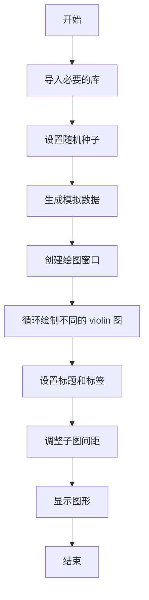
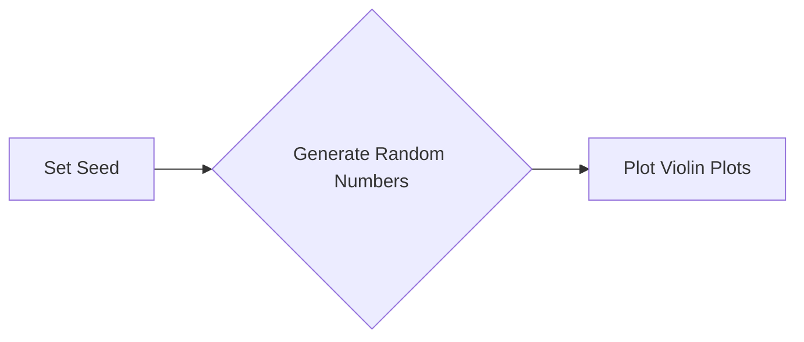
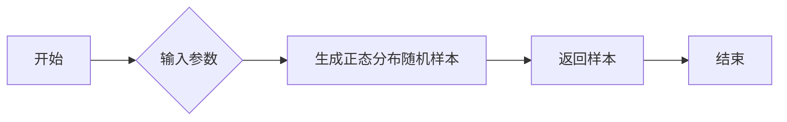
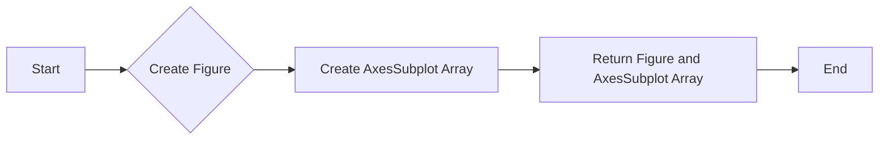
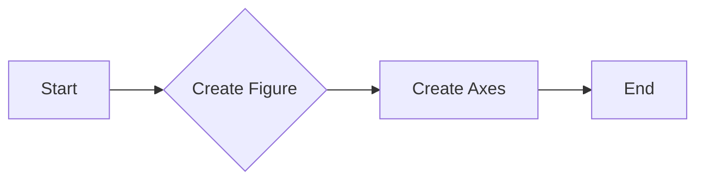

# `matplotlib\galleries\examples\statistics\violinplot.py` 详细设计文档

This code generates violin plots to visualize the distribution of data using kernel density estimation (KDE). It demonstrates various customization options for violin plots, such as number of points, bandwidth, orientation, and quantiles.

## 整体流程



## 类结构

```
matplotlib.pyplot
├── plt.subplots
│   ├── axs
│   └── fig
└── plt.show
```

## 全局变量及字段


### `fs`
    
Font size for the plot titles.

类型：`int`
    


### `pos`
    
List of positions for the violin plots.

类型：`list`
    


### `data`
    
List of numpy arrays representing the data for each violin plot.

类型：`list`
    


### `fig`
    
The main figure object created by plt.subplots.

类型：`matplotlib.figure.Figure`
    


### `axs`
    
Array of axes objects created by plt.subplots.

类型：`numpy.ndarray`
    


### `matplotlib.pyplot.fig`
    
The main figure object created by plt.subplots.

类型：`matplotlib.figure.Figure`
    


### `matplotlib.pyplot.axs`
    
Array of axes objects created by plt.subplots.

类型：`numpy.ndarray`
    
    

## 全局函数及方法


### np.random.seed

设置NumPy随机数生成器的种子，以确保每次运行代码时生成的随机数序列相同。

参数：

- `seed`：`int`，用于初始化随机数生成器的种子值。

返回值：无

#### 流程图



#### 带注释源码

```python
# Fixing random state for reproducibility
np.random.seed(19680801)
```


### np.normal

生成具有指定均值和标准差的正态分布随机样本。

参数：

- mean：`float`，正态分布的均值。
- std：`float`，正态分布的标准差。
- size：`int` 或 `tuple`，生成样本的大小。如果为 `int`，则生成一个形状为 `(size,)` 的数组；如果为 `tuple`，则生成一个形状为 `(size0, size1, ..., sizeN)` 的数组。

返回值：`ndarray`，包含生成样本的数组。

#### 流程图



#### 带注释源码

```python
import numpy as np

def np_normal(mean, std, size=None):
    """
    Generate random samples from a normal distribution with a specified mean and standard deviation.

    Parameters:
    - mean: float, the mean of the normal distribution.
    - std: float, the standard deviation of the normal distribution.
    - size: int or tuple, the size of the sample to generate. If int, generates an array of shape (size,); if tuple, generates an array of shape (size0, size1, ..., sizeN).

    Returns:
    - ndarray, an array containing the generated samples.
    """
    return np.random.normal(mean, std, size)
```


### plt.subplots

`plt.subplots` 是 `matplotlib.pyplot` 模块中的一个函数，用于创建一个子图网格并返回一个 `AxesSubplot` 对象数组。

{描述}

参数：

- `nrows`：`int`，指定子图网格的行数。
- `ncols`：`int`，指定子图网格的列数。
- `figsize`：`tuple`，指定整个子图网格的大小（宽度和高度）。

返回值：`fig, axs`，其中 `fig` 是 `Figure` 对象，`axs` 是 `AxesSubplot` 对象数组。

#### 流程图



#### 带注释源码

```python
fig, axs = plt.subplots(nrows=2, ncols=6, figsize=(10, 4))
```


### plt.show()

显示当前图形。

#### 参数：

- 无

#### 返回值：

- 无

#### 流程图

```mermaid
graph LR
A[开始] --> B{调用plt.show()}
B --> C[结束]
```

#### 带注释源码

```python
plt.show()
```


### matplotlib.pyplot.subplots

`subplots` 是 `matplotlib.pyplot` 模块中的一个函数，用于创建一个图形和多个轴（子图）。

{描述}

参数：

- `nrows`：`int`，指定子图行数。
- `ncols`：`int`，指定子图列数。
- `figsize`：`tuple`，指定图形的大小（宽度和高度）。

返回值：`Figure` 对象，包含创建的轴（子图）。

#### 流程图



#### 带注释源码

```python
import matplotlib.pyplot as plt

fig, axs = plt.subplots(nrows=2, ncols=6, figsize=(10, 4))
```


### matplotlib.pyplot.show

matplotlib.pyplot.show 是一个全局函数，用于显示当前图形。

参数：

- 无

返回值：无

#### 流程图

```mermaid
graph LR
A[Start] --> B[Call plt.show()]
B --> C[End]
```

#### 带注释源码

```python
plt.show()  # 显示当前图形
```


## 关键组件


### 张量索引与惰性加载

张量索引与惰性加载是用于高效处理和访问大型数据集的关键组件。它们允许在数据集被完全加载到内存之前，仅对所需的部分进行操作，从而节省内存和提高性能。

### 反量化支持

反量化支持是处理量化数据的关键组件，它允许将量化后的数据转换回原始精度，以便进行进一步的分析或处理。

### 量化策略

量化策略是用于优化模型性能和减少内存使用的关键组件。它通过减少模型中使用的数值精度来减少模型大小和计算需求。量化策略包括选择合适的量化级别和量化方法。

## 问题及建议


### 已知问题

-   **代码重复性**：代码中多次重复相同的`violinplot`调用，只是参数略有不同。这可能导致维护困难，如果需要修改`violinplot`的通用行为。
-   **硬编码参数**：一些参数（如`points`、`widths`、`bw_method`、`quantiles`和`side`）在代码中硬编码，这限制了灵活性，并可能导致难以适应不同的数据集或用户需求。
-   **缺乏错误处理**：代码中没有明显的错误处理机制，如果`violinplot`的参数设置不正确，可能会导致异常或不可预期的结果。

### 优化建议

-   **使用函数封装**：创建一个函数来封装`violinplot`的调用，并允许通过参数传递不同的配置。这样可以减少代码重复，并提高代码的可维护性。
-   **参数配置化**：将参数配置化，允许用户通过函数参数或配置文件来指定`violinplot`的参数，从而提高代码的灵活性和可适应性。
-   **添加错误处理**：在函数中添加错误处理逻辑，确保在参数设置不正确时能够给出清晰的错误信息，并优雅地处理异常情况。
-   **代码注释和文档**：为代码添加详细的注释和文档，解释每个参数的作用和预期行为，帮助其他开发者理解和使用代码。
-   **性能优化**：如果数据集非常大，可以考虑优化数据加载和处理的方式，以减少内存使用和提高绘图速度。


## 其它


### 设计目标与约束

- 设计目标：实现一个能够展示不同参数设置下的小提琴图的代码示例。
- 约束条件：代码应使用Python标准库和matplotlib库进行绘图，不使用额外的第三方库。

### 错误处理与异常设计

- 错误处理：代码中未包含显式的错误处理机制，但应确保输入参数的有效性，避免运行时错误。
- 异常设计：未设计特定的异常类，但应捕获并处理matplotlib绘图过程中可能出现的异常。

### 数据流与状态机

- 数据流：代码从随机生成的数据开始，通过matplotlib的violinplot函数进行绘图。
- 状态机：代码没有明确的状态机，但可以通过参数设置控制绘图的不同方面。

### 外部依赖与接口契约

- 外部依赖：代码依赖于matplotlib库进行绘图。
- 接口契约：matplotlib的violinplot函数提供了绘图所需的接口，包括参数设置和绘图结果。

### 测试与验证

- 测试策略：应编写单元测试来验证代码的功能，包括不同参数设置下的绘图结果。
- 验证方法：通过比较实际绘图结果与预期结果来验证代码的正确性。

### 维护与扩展

- 维护策略：代码应保持简洁和可读性，便于后续维护。
- 扩展方法：可以通过添加新的参数或功能来扩展代码的功能。


    