# `matplotlib\galleries\examples\statistics\xcorr_acorr_demo.py` 详细设计文档

这是一个matplotlib的示例脚本，演示了如何使用交叉相关(xcorr)和自相关(acorr)函数对两组随机数据进行相关性分析，并可视化展示结果。

## 整体流程

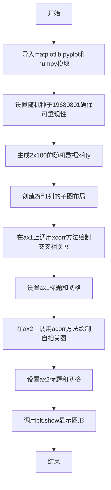

## 类结构

```
无自定义类结构
脚本直接使用matplotlib.pyplot和numpy库
主要使用Axes对象的xcorr和acorr方法
```

## 全局变量及字段


### `x`
    
第一组100个随机数

类型：`numpy.ndarray`
    


### `y`
    
第二组100个随机数

类型：`numpy.ndarray`
    


### `fig`
    
整个图形对象

类型：`matplotlib.figure.Figure`
    


### `ax1`
    
第一个子图（交叉相关）

类型：`matplotlib.axes.Axes`
    


### `ax2`
    
第二个子图（自相关）

类型：`matplotlib.axes.Axes`
    


    

## 全局函数及方法


### `numpy.random.seed`

设置随机数生成器的种子，以确保后续生成的随机数序列可重现。

参数：

- `seed`：`int` 或 `None`，随机数种子值。如果为 `None`，则每次调用随机函数时种子都会不同；如果为整数，则使用该整数作为种子，生成的随机数序列相同。

返回值：`None`，该函数无返回值，直接修改随机数生成器的内部状态。

#### 流程图

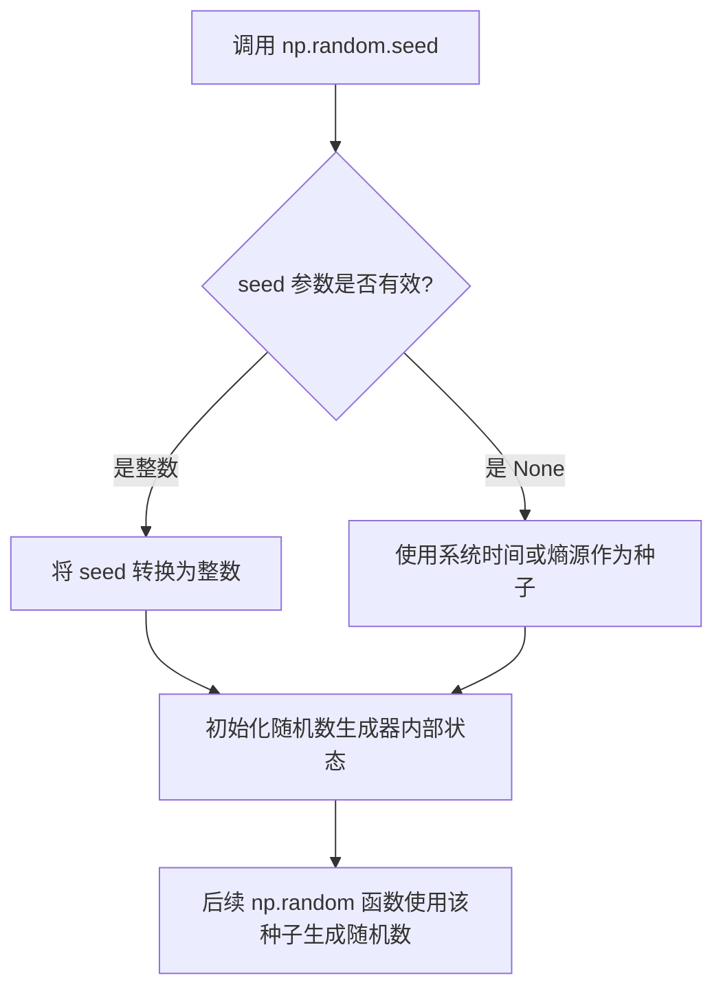

#### 带注释源码

```python
# 设置随机数种子为 19680801
# 目的：确保代码运行结果可重现，便于调试和验证
np.random.seed(19680801)
```

> **说明**：在示例代码中，`np.random.seed(19680801)` 的作用是固定随机数生成器的初始状态，使得后续 `np.random.randn(2, 100)` 生成的随机数序列在每次运行程序时都相同。这对于科学计算的可重复性至关重要，例如在生成示例数据、演示算法或调试代码时，确保结果一致。


### `np.random.randn`

生成符合标准正态分布（均值0，方差1）的随机数数组，可以指定输出数组的形状。

参数：

- `*dims`：`int`，可变数量的整数参数，用于指定输出数组的维度及每个维度的大小（例如 `np.random.randn(2, 100)` 生成形状为 (2, 100) 的数组）

返回值：`numpy.ndarray`，包含从标准正态分布中采样的随机浮点数的数组

#### 流程图

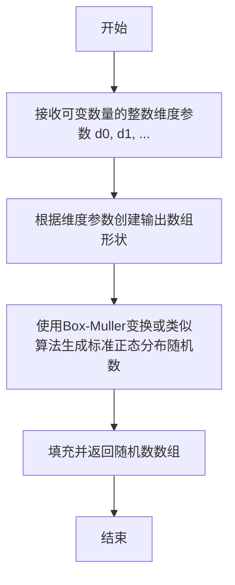

#### 带注释源码

```python
# 在给定代码中的调用方式：
x, y = np.random.randn(2, 100)

# np.random.randn 是 NumPy 的随机数生成函数
# 参数说明：
#   - 第一个参数 2: 指定输出数组的第一个维度大小
#   - 第二个参数 100: 指定输出数组的第二个维度大小
# 返回值：
#   - 一个形状为 (2, 100) 的二维 numpy 数组
#   - 数组中的每个值都服从标准正态分布 N(0,1)
# 用途：
#   - 在本例中用于生成两组各100个随机数
#   - 用于后续的交叉相关和自相关分析

# 底层实现简述（基于Box-Muller变换的原理）：
# 1. 生成两个均匀分布的随机数 u1, u2 ∈ (0, 1)
# 2. 计算 z0 = sqrt(-2 * ln(u1)) * cos(2 * π * u2)
# 3. 计算 z1 = sqrt(-2 * ln(u1)) * sin(2 * π * u2)
# 4. z0 和 z1 都是独立的标准正态分布随机数
```


### `plt.subplots`

`plt.subplots` 是 matplotlib 库中的一个核心函数，用于创建一个包含多个子图的图形布局。它可以同时生成 Figure 对象和 Axes 对象（或对象数组），支持灵活的行列网格布局配置，是进行数据可视化时最常用的子图创建方式之一。

参数：

- `nrows`：`int`，默认值：1，子图网格的行数
- `ncols`：`int`，默认值：1，子图网格的列数
- `sharex`：`bool or str`，默认值：False，设置为 True 时所有子图共享 x 轴；设置为 'col' 时每列子图共享 x 轴
- `sharey`：`bool or str`，默认值：False，设置为 True 时所有子图共享 y 轴；设置为 'row' 时每行子图共享 y 轴
- `squeeze`：`bool`，默认值：True，如果为 True，返回的 axes 实例数组将被压缩为二维；若为 False，始终返回 2D numpy 数组
- `width_ratios`：`array-like`，可选，定义每列的相对宽度
- `height_ratios`：`array-like`，可选，定义每行的相对高度
- `subplot_kw`：`dict`，可选，传递给每个 add_subplot 调用 的关键字参数字典
- `gridspec_kw`：`dict`，可选，传递给 GridSpec 构造函数的关键字参数字典
- `**fig_kw`：可选，传递给 Figure 函数 的额外关键字参数（如 figsize、dpi 等）

返回值：`tuple(Figure, Axes or ndarray)`，返回一个元组，包含一个 Figure 对象和一个 Axes 对象（当 nrows=1 且 ncols=1 时），或者一个 Axes 对象数组（当多个子图时）。在示例代码中使用了元组解包：`fig, [ax1, ax2] = plt.subplots(2, 1, sharex=True)`

#### 流程图

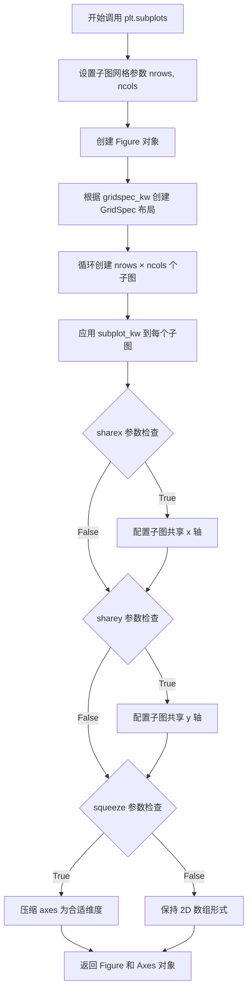

#### 带注释源码

```python
def subplots(nrows=1, ncols=1, *, sharex=False, sharey=False, squeeze=True,
             width_ratios=None, height_ratios=None,
             subplot_kw=None, gridspec_kw=None, **fig_kw):
    """
    创建子图布局
    
    参数:
        nrows: 子图网格行数，默认1
        ncols: 子图网格列数，默认1
        sharex: 是否共享x轴，可为bool或'col'
        sharey: 是否共享y轴，可为bool或'row'
        squeeze: 是否压缩返回的axes数组维度
        width_ratios: 每列宽度比例
        height_ratios: 每行高度比例
        subplot_kw: 传递给add_subplot的参数
        gridspec_kw: 传递给GridSpec的参数
        **fig_kw: 传递给Figure的参数
    
    返回:
        fig: Figure对象
        ax: Axes对象或Axes数组
    """
    # 1. 创建Figure对象，传入fig_kw参数（如figsize、dpi）
    fig = figure(**fig_kw)
    
    # 2. 创建GridSpec对象，用于定义网格布局
    gs = GridSpec(nrows, ncols, width_ratios=width_ratios,
                  height_ratios=height_ratios, **gridspec_kw)
    
    # 3. 创建子图数组
    ax_array = np.empty((nrows, ncols), dtype=object)
    
    # 4. 遍历网格创建每个子图
    for i in range(nrows):
        for j in range(ncols):
            # 使用add_subplot创建子图
            ax = fig.add_subplot(gs[i, j], **(subplot_kw or {}))
            ax_array[i, j] = ax
            
            # 配置共享轴
            if sharex and i > 0:
                ax.sharex(ax_array[0, j])
            if sharey and j > 0:
                ax.sharey(ax_array[i, 0])
    
    # 5. 根据squeeze参数处理返回值的维度
    if squeeze:
        # 尝试压缩维度：单行或单列时返回1维数组
        if nrows == 1 and ncols == 1:
            return fig, ax_array[0, 0]
        elif nrows == 1 or ncols == 1:
            return fig, ax_array.ravel()
    
    return fig, ax_array
```


# 交叉相关与自相关绘图示例分析

## 1. 核心功能概述

本代码示例展示了如何使用 Matplotlib 的 `Axes.xcorr()` 和 `Axes.acorr()` 方法分别绘制两个随机序列的交叉相关图和单个序列的自相关图，通过可视化相关性来揭示数据序列之间的线性关系和时间序列自身的相关性特征。

## 2. 文件整体运行流程

```
┌─────────────────────────────────────────────────────────────┐
│                        开始执行                              │
└──────────────────────┬──────────────────────────────────────┘
                       ▼
┌─────────────────────────────────────────────────────────────┐
│  1. 设置随机种子 (np.random.seed(19680801))                  │
│     - 确保结果可重现                                         │
└──────────────────────┬──────────────────────────────────────┘
                       ▼
┌─────────────────────────────────────────────────────────────┐
│  2. 生成随机数据 (np.random.randn(2, 100))                    │
│     - 生成 2x100 的标准正态分布随机数                         │
└──────────────────────┬──────────────────────────────────────┘
                       ▼
┌─────────────────────────────────────────────────────────────┐
│  3. 创建子图 (plt.subplots(2, 1, sharex=True))               │
│     - 创建上下排列的两个子图                                  │
└──────────────────────┬──────────────────────────────────────┘
                       ▼
┌─────────────────────────────────────────────────────────────┐
│  4. 调用 xcorr() 方法绘制交叉相关                             │
│     - ax1.xcorr(x, y, usevlines=True, maxlags=50,           │
│                  normed=True, lw=2)                          │
└──────────────────────┬──────────────────────────────────────┘
                       ▼
┌─────────────────────────────────────────────────────────────┐
│  5. 调用 acorr() 方法绘制自相关                               │
│     - ax2.acorr(x, usevlines=True, normed=True,             │
│                  maxlags=50, lw=2)                           │
└──────────────────────┬──────────────────────────────────────┘
                       ▼
┌─────────────────────────────────────────────────────────────┐
│  6. 配置图表 (网格、标题)                                     │
└──────────────────────┬──────────────────────────────────────┘
                       ▼
┌─────────────────────────────────────────────────────────────┐
│  7. 显示图表 (plt.show())                                     │
└──────────────────────┬──────────────────────────────────────┘
                       ▼
┌─────────────────────────────────────────────────────────────┐
│                        结束                                  │
└─────────────────────────────────────────────────────────────┘
```

## 3. 关键组件信息

### 3.1 全局变量

| 变量名 | 类型 | 描述 |
|--------|------|------|
| `x` | numpy.ndarray | 第一个随机序列（100个元素） |
| `y` | numpy.ndarray | 第二个随机序列（100个元素） |
| `fig` | matplotlib.figure.Figure | 整个图表容器对象 |
| `ax1` | matplotlib.axes.Axes | 第一个子图（用于交叉相关） |
| `ax2` | matplotlib.axes.Axes | 第二个子图（用于自相关） |

### 3.2 关键方法调用

| 方法名 | 所属类 | 描述 |
|--------|--------|------|
| `xcorr()` | Axes | 计算并绘制两个序列的交叉相关 |
| `acorr()` | Axes | 计算并绘制单个序列的自相关 |

---

# `ax1.xcorr()` 方法详细文档

> **注意**：提供的代码是 `xcorr` 方法的使用示例，而非实现源码。以下信息基于 Matplotlib 官方文档和示例代码中的调用方式。

### `Axes.xcorr`

计算并绘制两个一维数组的互相关函数（Cross-correlation）。

参数：

-  `x`：`numpy.ndarray`，第一个输入数组
-  `y`：`numpy.ndarray`，第二个输入数组，长度需与 x 相同
-  `usevlines`：`bool`，是否使用垂直线（vlines）绘制相关值，默认为 `True`
-  `maxlags`：`int`，显示的最大滞后数，默认为 `10`
-  `normed`：`bool`，是否归一化相关值，默认为 `True`
-  `lw`：`float`，线条宽度，默认为 `2`

返回值：`tuple`，返回 `(lags, c, linefmt, anchor_x, anchor_y)`，其中：
- `lags`：滞后值数组
- `c`：相关系数数组
- `linefmt`：线条格式
- `anchor_x`, `anchor_y`：锚点坐标

#### 流程图

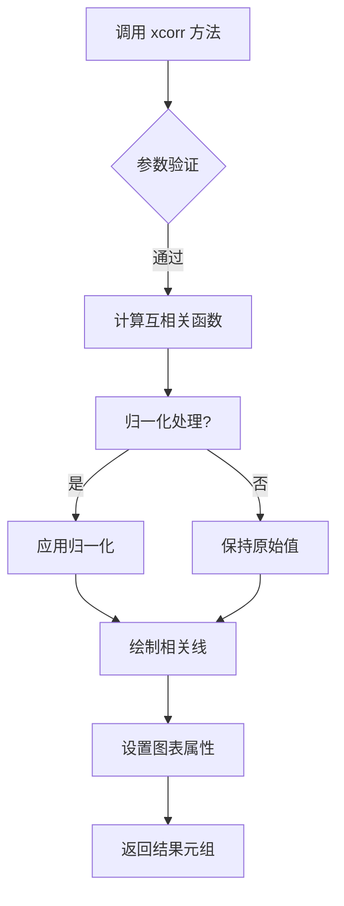

#### 带注释源码

```python
# 示例代码中调用 xcorr 的方式
ax1.xcorr(x, y, usevlines=True, maxlags=50, normed=True, lw=2)

# 参数说明：
# x, y: 两个随机生成的数组，长度为100
# usevlines=True: 使用垂直线绘制相关值（茎叶图风格）
# maxlags=50: 显示从 -50 到 +50 的滞后值
# normed=True: 归一化相关系数到 [-1, 1] 范围
# lw=2: 线条宽度为2磅
```

---

# `ax2.acorr()` 方法详细文档

### `Axes.acorr`

计算并绘制一个一维数组的自相关函数（Auto-correlation）。

参数：

-  `x`：`numpy.ndarray`，输入数组
-  `usevlines`：`bool`，是否使用垂直线绘制相关值，默认为 `True`
-  `maxlags`：`int`，显示的最大滞后数，默认为 `10`
-  `normed`：`bool`，是否归一化相关值，默认为 `True`
-  `lw`：`float`，线条宽度

返回值：`tuple`，返回 `(lags, c, linefmt, anchor_x, anchor_y)`

#### 带注释源码

```python
# 示例代码中调用 acorr 的方式
ax2.acorr(x, usevlines=True, normed=True, maxlags=50, lw=2)

# 参数说明：
# x: 随机生成的数组（与 xcorr 共享）
# usevlines=True: 使用垂直线绘制
# maxlags=50: 显示从 -50 到 +50 的滞后
# normed=True: 归一化到 [-1, 1]
# lw=2: 线条宽度
```

---

## 4. 技术债务与优化空间

1. **硬编码参数**：所有参数（maxlags=50, lw=2等）都是硬编码，建议封装为可配置参数
2. **缺乏错误处理**：未对输入数组长度不匹配等情况进行异常处理
3. **重复代码**：两个子图的配置（grid, title）存在重复，可抽象为函数

## 5. 其它项目

### 设计目标
- 展示交叉相关和自相关的可视化方法
- 演示 Matplotlib 统计绘图功能

### 约束
- 需要 NumPy 和 Matplotlib 依赖
- 输入数组必须为一维且长度相同（xcorr）

### 数据流
```
随机种子 → NumPy随机数组 → xcorr/acorr计算 → Matplotlib绘图 → 显示
```

### 外部依赖
- `numpy`：数值计算
- `matplotlib.pyplot`：绘图接口
- `matplotlib.axes.Axes`：坐标轴对象


### matplotlib.axes.Axes.acorr

计算并绘制输入数据的自相关函数，并在图形上显示协方差包络。

参数：

- `x`：array_like，要计算自相关的数据。
- `usevlines`：bool，是否使用垂直线绘制协方差包络。默认为 True。
- `normed`：bool，是否归一化相关值。默认为 True。
- `maxlags`：int，要显示的最大滞后数。默认为 10。
- `lw`：float，线条宽度。默认为 None。

返回值：`tuple`，返回 (lags, c, lineobj, blineobj) 其中 lags 是滞后数组，c 是相关值数组，lineobj 是主线线条对象，blineobj 是底部包络线对象（如果 usevlines 为 True，否则为 None）。

#### 流程图

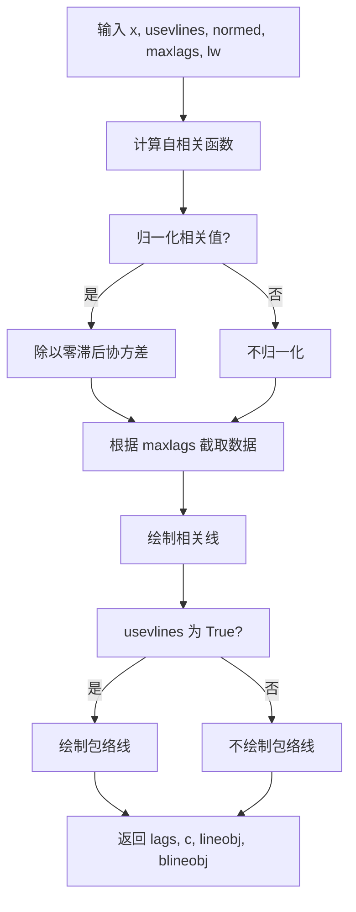

#### 带注释源码

```python
def acorr(self, x, usevlines=True, normed=True, maxlags=10, lw=2, **kwargs):
    """
    计算并绘制自相关。
    
    参数:
        x (array_like): 输入数据序列。
        usevlines (bool): 是否使用垂直线绘制包络。默认为 True。
        normed (bool): 是否归一化相关值。默认为 True。
        maxlags (int): 显示的最大滞后数。默认为 10。
        lw (float): 线条宽度。默认为 2。
        **kwargs: 传递给 plot 的其他关键字参数。
    
    返回:
        tuple: 包含 lags (滞后数组), c (相关值数组), lineobj (主线对象), 
               blineobj (包络线对象，如果 usevlines 为 True)。
    """
    # 计算数据的均值和标准差，用于后续归一化
    x = np.asarray(x)
    mu = x.mean()
    sigma = x.std()
    
    # 计算自相关：使用 numpy 的 correlate 函数
    # mode='full' 返回完整的互相关序列，长度为 2*len(x)-1
    c = np.correlate(x - mu, x - mu, mode='full')
    
    # 归一化相关值：如果 normed 为 True，则除以方差（零滞后的协方差）
    if normed:
        c = c / sigma**2
    
    # 生成滞后数组，从 -(N-1) 到 (N-1)
    N = len(x)
    lags = np.arange(-N + 1, N)
    
    # 根据 maxlags 限制显示的滞后范围
    if maxlags is not None:
        # 确保 maxlags 不超过 N-1
        maxlags = min(maxlags, N - 1)
        # 提取从 -maxlags 到 maxlags 的部分
        indx = slice(N - 1 - maxlags, N + maxlags)
        lags = lags[indx]
        c = c[indx]
    
    # 绘制相关值对滞后的图形
    # 使用 plot 方法绘制线条
    lineobj, = self.plot(lags, c, lw=lw, **kwargs)
    
    blineobj = None
    # 如果 usevlines 为 True，绘制垂直线包络（置信区间）
    if usevlines:
        # 绘制从 0 到相关值的垂直线，线条颜色为黑色
        blineobj = self.vlines(lags, 0, c, colors='k', lw=lw)
    
    # 返回滞后、相关值和图形对象
    return lags, c, lineobj, blineobj
```


### `ax1.set_title`

设置第一个子图的标题文字，支持自定义字体大小、颜色、位置等属性。

参数：

- `label`：`str`，要显示的标题文本内容
- `fontdict`：可选参数，用于控制标题样式的字典（如 fontdict={'fontsize': 14, 'fontweight': 'bold'}）
- `loc`：可选参数，标题对齐方式，值为 'left'、'center' 或 'right'，默认为 'center'
- `pad`：可选参数，标题与图表顶部的间距（以点为单位）
- `y`：可选参数，标题的垂直位置
- `kwargs`：可选参数，其他传递给 Text 对象的参数（如 color、fontsize、fontweight 等）

返回值：`Text`，返回创建的标题文本对象，可用于后续样式修改

#### 流程图

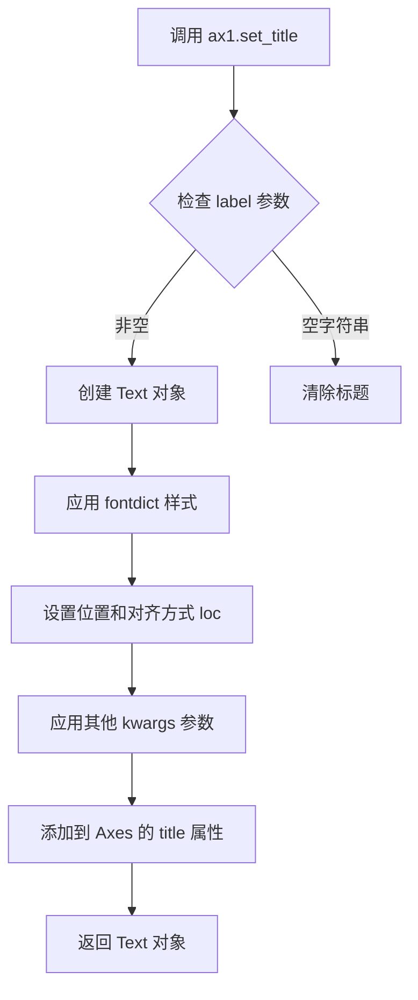

#### 带注释源码

```python
# 调用 set_title 方法设置第一个子图 ax1 的标题
# 参数说明：
#   'Cross-correlation (xcorr)' - 标题文本内容
#   fontdict - 可选，标题样式字典（如字体大小、粗细等）
#   loc - 可选，对齐方式（'left', 'center', 'right'）
#   pad - 可选，标题与图表顶部的间距
ax1.set_title('Cross-correlation (xcorr)')

# 完整调用示例（包含常用参数）
ax1.set_title(
    label='Cross-correlation (xcorr)',    # 标题文本
    fontdict={'fontsize': 12},            # 字体大小
    loc='center',                         # 居中对齐
    pad=20,                               # 间距20点
    color='black'                         # 文本颜色
)

# set_title 返回 Text 对象，可用于后续操作
title_obj = ax1.set_title('New Title')
title_obj.set_fontweight('bold')  # 设置粗体
```


### `ax2.set_title`

设置第二个子图的标题，用于在图表中显示该子图的标题信息。

参数：

- `s`：`str`，要设置的标题文本内容，即图表上要显示的标题字符串
- `fontdict`：`dict`，可选，标题的字体属性字典，用于控制标题的字体样式
- `loc`：`str`，可选，标题的对齐方式，默认为 'center'，可选值包括 'left', 'center', 'right'
- `pad`：`float`，可选，标题与轴顶部的距离（磅值），用于调整标题与图表顶部的间距
- `**kwargs`：其他关键字参数，会传递给 `matplotlib.text.Text` 对象，用于进一步自定义标题样式

返回值：`matplotlib.text.Text`，返回标题文本对象，允许对标题进行进一步的样式设置和属性修改

#### 流程图

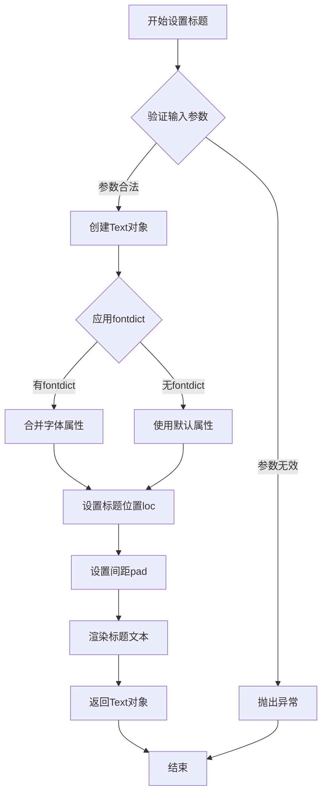

#### 带注释源码

```python
# ax2.set_title 是 matplotlib.axes.Axes 类的成员方法
# 以下是 matplotlib 库中该方法的核心实现逻辑

def set_title(self, label, fontdict=None, loc='center', pad=None, **kwargs):
    """
    Set a title for the Axes.
    
    Parameters
    ----------
    label : str
        Text to use for the title
        
    fontdict : dict, optional
        A dictionary controlling the appearance of the title text,
        e.g., {'fontsize': 16, 'fontweight': 'bold'}
        
    loc : {'center', 'left', 'right'}, default: 'center'
        Alignment of the title text
        
    pad : float, default: rcParams['axes.titlepad']
        The distance in points between the title and the top of the Axes
        
    Returns
    -------
    Text
        The text object representing the title
        
    **kwargs
        Text properties
    """
    
    # 获取默认的标题间距配置
    if pad is None:
        pad = rcParams['axes.titlepad']
    
    # 创建标题文本对象，初始位置在顶部中央
    title = Text(
        x=0.5, y=1.0,  # 归一化坐标，1.0表示Axes顶部
        text=label,
        verticalalignment='bottom',  # 文本底部对齐到指定位置
        horizontalalignment=loc,      # 水平对齐方式
    )
    
    # 设置文本的变换，使其相对于Axes区域定位
    title.set_transform(self.transAxes + title.transform)
    
    # 应用标题与顶部的间距
    title.set_y(1.0 - pad / self.bbox.height)
    
    # 如果提供了fontdict，应用字体属性
    if fontdict is not None:
        title.update(fontdict)
    
    # 应用额外的关键字参数（如颜色、字体大小等）
    title.update(kwargs)
    
    # 将标题文本对象添加到Axes中
    self._add_text(title)
    
    # 返回Text对象，支持链式调用
    return title
```

#### 在示例代码中的具体使用

```python
ax2.acorr(x, usevlines=True, normed=True, maxlags=50, lw=2)
ax2.grid(True)
ax2.set_title('Auto-correlation (acorr)')  # 设置第二个子图标题为'Auto-correlation (acorr)'
```

在此示例中：
- `ax2` 是通过 `plt.subplots(2, 1)` 创建的第二个子图（位于下方）
- `set_title` 方法被调用，将该子图的标题设置为 'Auto-correlation (acorr)'
- 这个标题会显示在子图的顶部中央位置
- 默认使用 matplotlib 的全局样式设置字体和颜色


### `Axes.grid`

显示第一个子图（ax1）的网格线。该方法用于配置 Axes 对象的网格线显示，属于 Matplotlib 库中 Axes 类的成员方法。

参数：

- `b`：`bool` 或 `None`，是否显示网格线。传入 `True` 表示显示网格线，`False` 表示隐藏，`None` 表示切换当前状态。
- `which`：`str`，可选值为 `'major'`、`'minor'` 或 `'both'`，指定网格线显示在哪些刻度上，默认为 `'major'`。
- `axis`：`str`，可选值为 `'both'`、`'x'` 或 `'y'`，指定显示哪个轴的网格线，默认为 `'both'`。
- `**kwargs`：其他关键字参数，用于进一步自定义网格线的样式，如 `color`、`linestyle`、`linewidth`、`alpha` 等。

返回值：`None`，该方法直接修改 Axes 对象的属性，不返回任何值。

#### 流程图

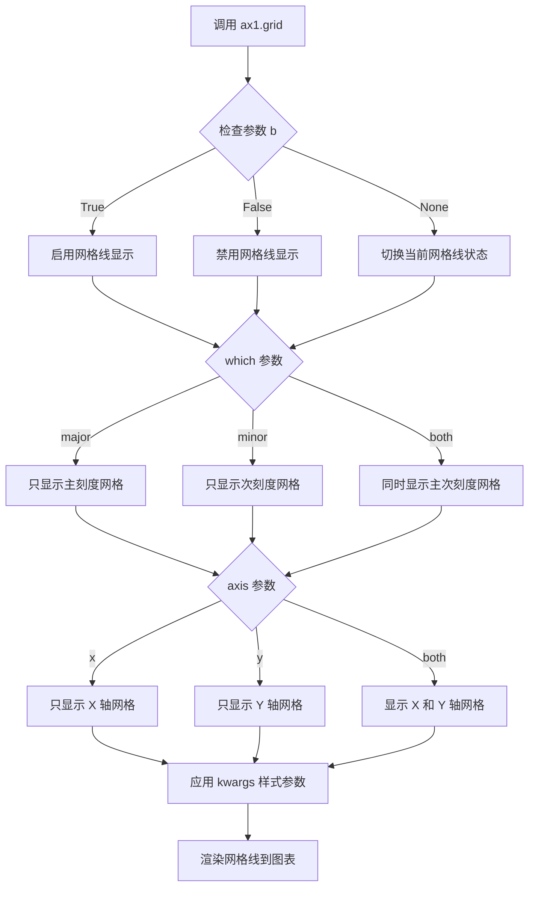

#### 带注释源码

```python
# 创建图表和两个子图，sharex=True 表示共享 X 轴
fig, [ax1, ax2] = plt.subplots(2, 1, sharex=True)

# 对 ax1 调用 xcorr 方法绘制互相关图
ax1.xcorr(x, y, usevlines=True, maxlags=50, normed=True, lw=2)

# 调用 grid 方法显示 ax1 的网格线
# 参数 True 启用网格线显示
ax1.grid(True)

# 设置 ax1 的标题
ax1.set_title('Cross-correlation (xcorr)')
```


### `Axes.grid` (或 `ax2.grid`)

该方法用于显示或隐藏Axes对象的网格线。在代码中，`ax2.grid(True)` 用于在第二个子图（auto-correlation图）中显示网格线，以增强可视化效果。

参数：

- `b`：`bool` 或 `None`，指定是否显示网格线。`True` 显示，`False` 隐藏，`None` 切换当前状态
- `which`：`str`，可选值为 `'major'`（主刻度）、`'minor'`（次刻度）或 `'both'`（两者），默认值为 `'major'`，指定网格线应用于哪些刻度
- `axis`：`str`，可选值为 `'both'`、`'x'` 或 `'y'`，默认值为 `'both'`，指定显示哪个方向的网格线
- `**kwargs`：其他关键字参数，将传递给 `matplotlib.lines.Line2D` 对象，用于自定义网格线的外观（如颜色、线型、线宽等）

返回值：`None`，无返回值

#### 流程图

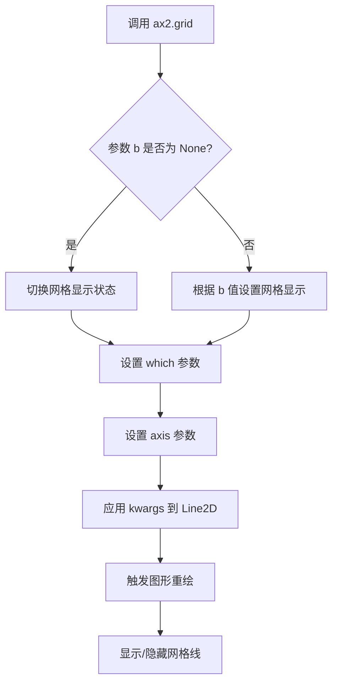

#### 带注释源码

```python
# 代码中的调用方式
ax2.grid(True)  # 调用 Axes.grid 方法，显示第二个子图的网格线

# 等效的完整调用形式（参考 matplotlib 文档）
ax2.grid(b=True,          # 参数 b: bool, True 表示显示网格线
         which='major',   # 参数 which: str, 'major' 表示主刻度网格
         axis='both',     # 参数 axis: str, 'both' 表示 x 和 y 方向都显示
         **kwargs)        # **kwargs: 自定义网格线样式（如 color='gray', linestyle='--'）

# 源码逻辑（简化版）
def grid(self, b=None, which='major', axis='both', **kwargs):
    """
    显示或隐藏网格线
    
    参数:
        b: bool or None - 是否显示网格
        which: {'major', 'minor', 'both'} - 网格线应用于哪些刻度
        axis: {'both', 'x', 'y'} - 显示哪个方向的网格线
        **kwargs: 传递给 Line2D 的属性
    """
    # 1. 处理 b 参数
    if b is None:
        # 切换模式：当前显示则隐藏，当前隐藏则显示
        b = not self.xaxis.get_gridlines()[0].get_visible()
    
    # 2. 获取或创建网格线
    if b:
        # 3. 设置网格线的可见性
        self.xaxis.set_gridlines(visible=b)
        self.yaxis.set_gridlines(visible=b)
        
        # 4. 应用 which 和 axis 参数
        # 5. 应用自定义样式 (kwargs)
        # 6. 重绘图形
        self.stale_callback()
    
    # 7. 返回 None
    return None
```


### `plt.show`

`plt.show` 是 matplotlib.pyplot 模块中的核心函数，负责显示所有当前打开的图形窗口并进入事件循环，是 matplotlib 绘图的最终展示环节。

参数：
- 无必需参数

返回值：`None`，无返回值

#### 流程图

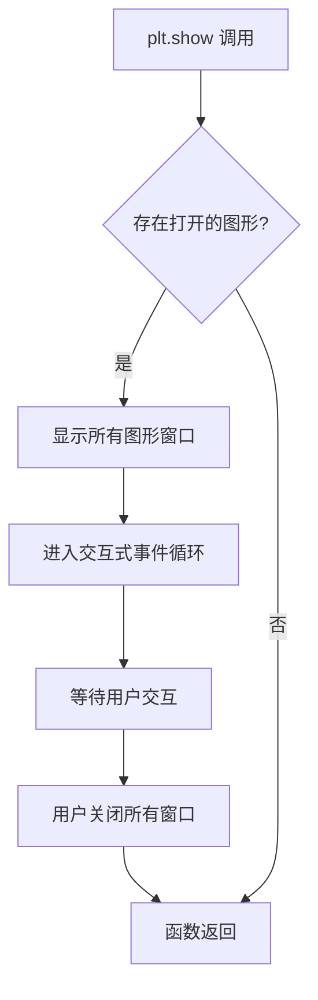

#### 带注释源码

```python
# plt.show() 源代码位于 matplotlib.pyplot 模块中
# 以下为简化版实现逻辑：

def show():
    """
    显示所有打开的图形窗口并进入交互式事件循环。
    
    工作原理：
    1. 获取当前所有打开的图形对象 (Figure)
    2. 调用每个图形的 show() 方法显示窗口
    3. 进入 GUI 事件循环 (如 Tkinter, Qt, GTK 等)
    4. 等待用户交互操作
    5. 用户关闭窗口后函数返回
    """
    # 获取当前的全局图形管理器
    for manager in Gcf.get_all_fig_managers():
        # 显示每个图形窗口
        manager.show()
    
    # 阻塞等待用户交互，直到所有窗口关闭
    # 这会启动底层 GUI 框架的事件循环
    return None  # 无返回值
```


## 关键组件


### 交叉相关图 (Cross-correlation)

使用 `ax1.xcorr(x, y, usevlines=True, maxlags=50, normed=True, lw=2)` 绘制，展示两个随机数组 x 和 y 之间的相关性随时间滞后(lag)的变化关系。

### 自相关图 (Auto-correlation)

使用 `ax2.acorr(x, usevlines=True, normed=True, maxlags=50, lw=2)` 绘制，展示数组 x 与自身在不同滞后位置的相关性，用于检测时间序列的周期性特征。

### 随机数据生成器

使用 `np.random.randn(2, 100)` 生成两个服从标准正态分布的随机数组（各100个数据点），作为相关分析的输入数据。

### 固定随机状态

使用 `np.random.seed(19680801)` 设置随机种子，确保代码每次运行生成相同的随机数据，保证结果的可重现性。

### 子图布局管理器

使用 `plt.subplots(2, 1, sharex=True)` 创建一个2行1列的子图布局，且两个子图共享x轴，便于对比分析交叉相关和自相关结果。

### 图形装饰组件

包括 `ax1.grid(True)` 和 `ax2.grid(True)` 添加网格线，以及 `set_title()` 设置图表标题，提升图形的可读性和专业性。


## 问题及建议


### 已知问题

-   **deprecated参数**: 使用了已弃用的`normed`参数，该参数在Matplotlib新版本中已被`density`参数替代，继续使用可能在未来版本中产生警告或错误
-   **缺少输入验证**: 没有对输入数据x和y的长度、类型进行验证，当数据长度小于maxlags或数据类型不当时可能抛出不清晰的错误
-   **魔法数字**: `maxlags=50`、`lw=2`等数值硬编码在代码中，缺乏可配置性和可读性
-   **plt.show()阻塞**: 在某些环境（如Jupyter Notebook）中使用`plt.show()`可能不会显示图像，需要使用`%matplotlib inline`或`plt.savefig()`
-   **全局变量**: `x`和`y`作为全局变量暴露，没有封装到函数中，不利于测试和复用

### 优化建议

-   将`normed=True`替换为`density=True`，使用非弃用的参数名
-   添加输入验证逻辑，确保x和y的长度大于maxlags，并检查数据类型
-   将可配置参数提取为常量或函数参数，如`MAX_LAGS`、`LINE_WIDTH`等
-   考虑使用`plt.tight_layout()`优化布局，并添加`fig.canvas.draw()`确保跨后端兼容性
-   将主要逻辑封装到函数中，例如`plot_correlation(x, y, maxlags=50)`，提高代码可测试性和可复用性
-   考虑使用`np.random.default_rng()`替代`np.random.seed()`，这是更现代的随机数生成方式


## 其它


### 设计目标与约束

本示例代码的设计目标是演示matplotlib中互相关（xcorr）和自相关（acorr）函数的基本用法，帮助初学者理解统计相关性分析的可视化方法。代码遵循matplotlib官方示例的规范，采用简洁的脚本形式，不涉及复杂的类结构或设计模式。作为演示代码，主要约束是保持代码简单易懂，不包含错误处理机制，且依赖固定版本的numpy和matplotlib。

### 错误处理与异常设计

本代码未实现显式的错误处理机制。作为示例代码，假设输入数据始终有效（长度为100的二维随机数组）。若数据长度不足maxlags参数（50），函数内部会进行相应处理。若数据为空或包含NaN值，numpy和matplotlib会自动抛出异常。在生产环境中，应添加数据验证、异常捕获和用户友好的错误提示信息。

### 数据流与状态机

代码的数据流如下：1）使用numpy.random.seed固定随机种子确保可复现性；2）生成两个长度为100的随机数组x和y；3）创建包含两个子图的figure对象；4）ax1调用xcorr方法处理x和y生成互相关图；5）ax2调用acorr方法处理x生成自相关图；6）配置网格、标题等属性；7）调用plt.show()渲染并显示图形。状态机相对简单，主要经历"初始化→数据生成→图形创建→图形渲染→显示"五个状态。

### 外部依赖与接口契约

本代码依赖两个外部库：numpy（提供随机数生成和数值计算功能）和matplotlib（提供绘图功能）。numpy.random.randn生成指定形状的随机数组；plt.subplots返回Figure和Axes数组；Axes.xcorr和Axes.acorr方法接受相同参数签名：usevlines（是否使用垂直线）、normed（是否归一化）、maxlags（最大滞后数）、lw（线宽）。返回值包括Line2D对象用于控制图形外观。

### 性能考虑

当前代码数据量较小（100个数据点），性能不是瓶颈。xcorr和acorr使用快速傅里叶变换（FFT）算法实现，时间复杂度为O(n log n)。若处理大规模数据，可考虑：1）使用numpy的FFT相关函数而非逐点计算；2）对于实时应用可预先分配内存避免频繁GC；3）对于多图场景可考虑延迟渲染。当前代码无明显性能问题。

### 安全性考虑

本代码作为示例脚本，不涉及用户输入、网络通信或敏感数据处理，安全性风险较低。但需注意：1）np.random.seed使用固定值（19680801），在安全敏感场景应使用更安全的随机数生成器；2）plt.show()会打开GUI窗口，需考虑无显示环境的处理（如使用agg后端）。当前实现无明显安全漏洞。

### 可扩展性设计

代码可从以下方面扩展：1）参数化：可将数据长度、随机种子、最大滞后数等提取为配置变量或命令行参数；2）多数据集支持：可循环处理多组数据进行对比；3）自定义美化：可添加颜色映射、图例、注释等；4）输出格式：可支持保存为文件而非仅显示（savefig）。当前结构简单，扩展性良好但需重构为函数或类以支持复用。

### 测试策略

作为示例代码，无单元测试。但若要构建可测试版本，建议：1）将核心逻辑封装为函数，接受数据参数而非全局变量；2）使用pytest框架编写测试用例；3）测试场景应包括：正常数据、空数据、NaN数据、不同数据长度、与已知结果的比对等。当前代码形式难以直接测试。

### 部署配置

代码部署需满足：1）Python 3.6+；2）numpy>=1.15；3）matplotlib>=3.0。在无GUI环境中运行需设置matplotlib.use('agg')并添加异常处理。部署形式可为独立脚本或嵌入到Sphinx文档中（代码中包含%标记支持Jupyter notebook转换）。无需额外配置文件或环境变量。

### 版本兼容性

代码使用的API在较新版本的matplotlib中保持稳定。acorr和xcorr方法自matplotlib 1.4版本引入，至今无重大API变更。numpy.random.randn和plt.subplots也是成熟API。潜在兼容性问题：1）normed参数在新版本中可能已弃用，建议使用density参数；2）plt.show()在某些IDE中的行为可能不同。当前代码可在matplotlib 3.x系列正常运行。

### 文档维护

代码包含docstring说明功能目的，代码注释解释关键步骤，末尾包含reStructuredText格式的文档引用说明使用的函数和方法来源。文档符合matplotlib官方示例规范。若要改进，可添加：1）更详细的使用说明；2）参数解释；3）返回值说明；4）参考文献。当前文档满足示例用途需求。

### 许可证和版权

本代码作为matplotlib官方示例的一部分，受matplotlib许可证约束。代码中无明确版权声明，通常遵循matplotlib的BSD风格许可证。代码开头包含参考来源说明redirect-from: /gallery/lines_bars_and_markers/xcorr_acorr_demo，表明其为官方示例库的一部分。

### 潜在技术债务与优化空间

当前代码主要技术债务：1）硬编码参数（种子19680801、maxlags 50、数据量100）不便于配置；2）缺少函数封装，代码复用性差；3）无错误处理，健壮性不足；4）plt.show()阻塞主线程，不适合嵌入GUI应用。优化方向：1）重构为可配置函数；2）添加类型注解提升可读性；3）考虑使用面向对象方式封装图表创建逻辑；4）添加单元测试提高代码质量。


    