# `matplotlib\galleries\examples\style_sheets\dark_background.py` 详细设计文档

This code generates a plot with a 'dark_background' style using matplotlib, demonstrating the use of white for elements that are typically black.

## 整体流程

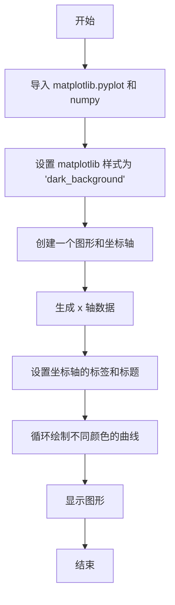

## 类结构

```
matplotlib.pyplot (全局模块)
├── np (全局模块)
└── main (主函数)
```

## 全局变量及字段


### `plt`
    
matplotlib.pyplot module for plotting and visualizing data.

类型：`module`
    


### `np`
    
numpy module for numerical operations.

类型：`module`
    


### `fig`
    
Figure object representing a figure in which to draw plots.

类型：`matplotlib.figure.Figure`
    


### `ax`
    
Axes object representing a plot in the figure.

类型：`matplotlib.axes._subplots.AxesSubplot`
    


### `L`
    
Length of the x-axis range for the plot.

类型：`int`
    


### `x`
    
Array of x-axis values for the plot.

类型：`numpy.ndarray`
    


### `ncolors`
    
Number of colors to use for the plot elements.

类型：`int`
    


### `shift`
    
Array of shift values for the sine function plot elements.

类型：`numpy.ndarray`
    


### `matplotlib.pyplot.fig`
    
Figure object representing a figure in which to draw plots.

类型：`matplotlib.figure.Figure`
    


### `matplotlib.pyplot.ax`
    
Axes object representing a plot in the figure.

类型：`matplotlib.axes._subplots.AxesSubplot`
    
    

## 全局函数及方法


### main()

该函数创建一个使用“dark_background”样式表的matplotlib图形，绘制一系列正弦曲线，并显示图形。

参数：

- 无

返回值：无

#### 流程图

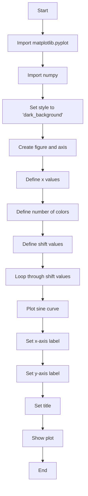

#### 带注释源码

```
"""
===========================
Dark background style sheet
===========================

This example demonstrates the "dark_background" style, which uses white for
elements that are typically black (text, borders, etc). Note that not all plot
elements default to colors defined by an rc parameter.

"""
import matplotlib.pyplot as plt
import numpy as np

# Set the style to 'dark_background'
plt.style.use('dark_background')

# Create a figure and axis
fig, ax = plt.subplots()

# Define x values
L = 6
x = np.linspace(0, L)

# Define number of colors
ncolors = len(plt.rcParams['axes.prop_cycle'])

# Define shift values
shift = np.linspace(0, L, ncolors, endpoint=False)

# Loop through shift values and plot sine curve
for s in shift:
    ax.plot(x, np.sin(x + s), 'o-')

# Set x-axis label
ax.set_xlabel('x-axis')

# Set y-axis label
ax.set_ylabel('y-axis')

# Set title
ax.set_title("'dark_background' style sheet")

# Show plot
plt.show()
```


### plt.subplots

`plt.subplots` 是 `matplotlib.pyplot` 模块中的一个函数，用于创建一个 figure 和一个或多个 axes。

参数：

- `figsize`：`tuple`，指定 figure 的大小（宽度和高度），默认为 (6.4, 4.8)。
- `dpi`：`int`，指定 figure 的分辨率（每英寸点数），默认为 100。
- `facecolor`：`color`，指定 figure 的背景颜色，默认为 'white'。
- `edgecolor`：`color`，指定 figure 的边缘颜色，默认为 'none'。
- `frameon`：`bool`，指定是否显示 figure 的边框，默认为 True。
- `num`：`int`，指定要创建的 axes 的数量，默认为 1。
- `gridspec_kw`：`dict`，指定 gridspec 的关键字参数，用于定义 axes 的布局。
- `constrained_layout`：`bool`，指定是否启用约束布局，默认为 False。

返回值：`Figure` 对象和 `Axes` 对象的元组。

返回值描述：返回一个包含一个 `Figure` 对象和一个或多个 `Axes` 对象的元组。`Figure` 对象表示整个图形，而 `Axes` 对象表示图形中的一个子图。

#### 流程图

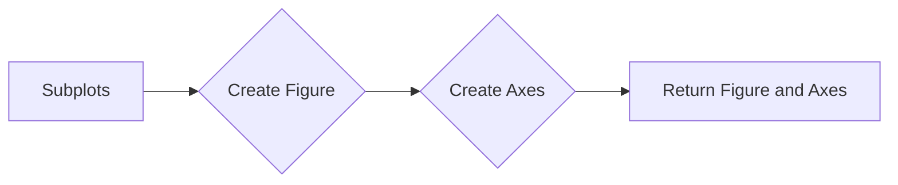

#### 带注释源码

```python
import matplotlib.pyplot as plt

fig, ax = plt.subplots()
```


### matplotlib.pyplot.plot

matplotlib.pyplot.plot 是一个用于绘制二维线条图的函数。

参数：

- `x`：`numpy.ndarray` 或 `float`，表示 x 轴的数据点。
- `y`：`numpy.ndarray` 或 `float`，表示 y 轴的数据点。
- `label`：`str`，可选，用于在图例中显示的标签。
- `color`：`str` 或 `color`，可选，用于线条的颜色。
- `linestyle`：`str`，可选，用于线条的样式。
- `linewidth`：`float`，可选，用于线条的宽度。
- `marker`：`str` 或 `shape`，可选，用于标记点的形状。
- `markersize`：`float`，可选，用于标记的大小。
- `alpha`：`float`，可选，用于线条的透明度。
- `zorder`：`int`，可选，用于控制线条的绘制顺序。

返回值：`Line2D` 对象，表示绘制的线条。

#### 流程图

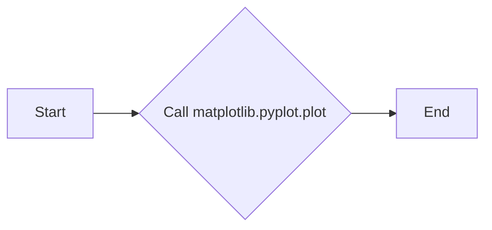

#### 带注释源码

```python
import matplotlib.pyplot as plt
import numpy as np

# 创建一个图形和坐标轴
fig, ax = plt.subplots()

# 定义 x 轴的数据点
x = np.linspace(0, L)

# 定义 y 轴的数据点
y = np.sin(x)

# 绘制线条图
line = ax.plot(x, y, 'o-')

# 设置坐标轴标签和标题
ax.set_xlabel('x-axis')
ax.set_ylabel('y-axis')
ax.set_title("'dark_background' style sheet")

# 显示图形
plt.show()
```


### matplotlib.pyplot.set_xlabel

`matplotlib.pyplot.set_xlabel` 是一个用于设置 x 轴标签的函数。

参数：

- `xlabel`：`str`，x 轴标签的文本内容。

返回值：`None`，没有返回值。

#### 流程图


#### 带注释源码

```python
# 设置 x 轴标签
ax.set_xlabel('x-axis')
```


### matplotlib.pyplot.set_ylabel

matplotlib.pyplot.set_ylabel 是一个用于设置轴标签的函数。

参数：

- `label`：`str`，轴标签的文本内容。

返回值：`None`，没有返回值。

#### 流程图

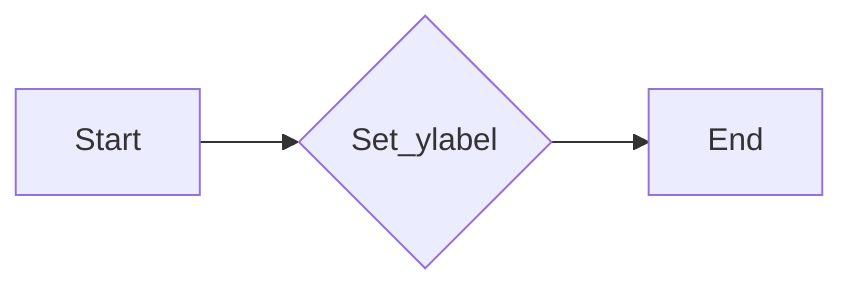

#### 带注释源码

```python
# 假设以下代码块是matplotlib.pyplot模块的一部分
def set_ylabel(self, label):
    """
    Set the label for the y-axis of the current Axes.

    Parameters
    ----------
    label : str
        The label for the y-axis.

    Returns
    -------
    None
    """
    # 设置轴标签的文本内容
    self._yaxis.label.set_text(label)
```


### `set_title`

`matplotlib.pyplot.set_title` 是一个用于设置图表标题的函数。

参数：

- `title`：`str`，图表的标题文本。

返回值：`None`，没有返回值，函数直接修改图表的标题。

#### 流程图

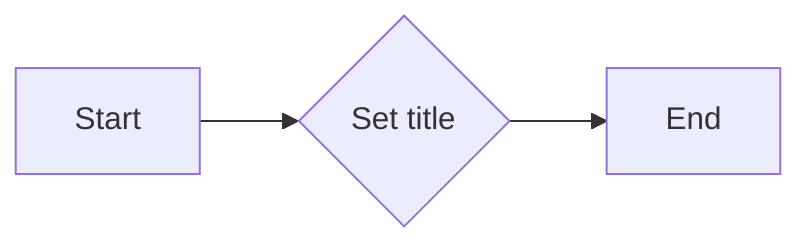

#### 带注释源码

```python
# 假设以下代码块是matplotlib.pyplot模块的一部分
def set_title(self, title):
    """
    Set the title of the axes.

    Parameters
    ----------
    title : str
        The title of the axes.

    Returns
    -------
    None
    """
    # 设置标题的逻辑
    # ...
    pass
```


### `matplotlib.pyplot.set_xlabel`

`matplotlib.pyplot.set_xlabel` 是一个用于设置图表x轴标签的函数。

参数：

- `xlabel`：`str`，x轴的标签文本。

返回值：`None`，没有返回值，函数直接修改x轴的标签。

#### 流程图


#### 带注释源码

```python
# 假设以下代码块是matplotlib.pyplot模块的一部分
def set_xlabel(self, xlabel):
    """
    Set the label for the x-axis.

    Parameters
    ----------
    xlabel : str
        The label for the x-axis.

    Returns
    -------
    None
    """
    # 设置x轴标签的逻辑
    # ...
    pass
```


### `matplotlib.pyplot.set_ylabel`

`matplotlib.pyplot.set_ylabel` 是一个用于设置图表y轴标签的函数。

参数：

- `ylabel`：`str`，y轴的标签文本。

返回值：`None`，没有返回值，函数直接修改y轴的标签。

#### 流程图

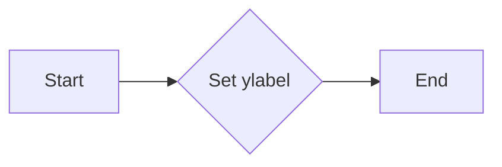

#### 带注释源码

```python
# 假设以下代码块是matplotlib.pyplot模块的一部分
def set_ylabel(self, ylabel):
    """
    Set the label for the y-axis.

    Parameters
    ----------
    ylabel : str
        The label for the y-axis.

    Returns
    -------
    None
    """
    # 设置y轴标签的逻辑
    # ...
    pass
```


### `matplotlib.pyplot.subplots`

`matplotlib.pyplot.subplots` 是一个用于创建一个新的图表和轴对象的函数。

参数：

- `figsize`：`tuple`，图表的大小（宽度和高度）。
- `dpi`：`int`，图表的分辨率（每英寸点数）。
- `facecolor`：`color`，图表的背景颜色。
- `num`：`int`，要创建的轴对象的数量。
- `gridspec_kw`：`dict`，用于定义网格规格的字典。
- `constrained_layout`：`bool`，是否启用约束布局。

返回值：`fig, ax`，一个包含图表和轴对象的元组。

#### 流程图

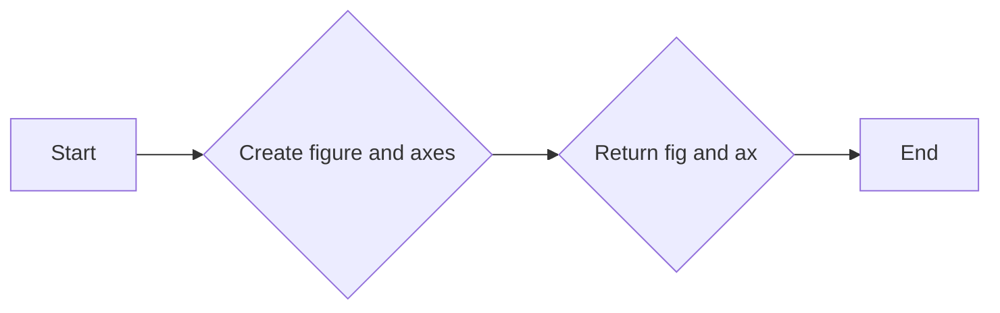

#### 带注释源码

```python
# 假设以下代码块是matplotlib.pyplot模块的一部分
def subplots(self, figsize=None, dpi=None, facecolor=None, num=1, gridspec_kw=None, constrained_layout=False):
    """
    Create a figure and a set of subplots.

    Parameters
    ----------
    figsize : tuple, optional
        The size of the figure in inches.
    dpi : int, optional
        The resolution of the figure in dots per inch.
    facecolor : color, optional
        The facecolor of the figure.
    num : int, optional
        The number of axes to create.
    gridspec_kw : dict, optional
        Additional keyword arguments to pass to GridSpec.
    constrained_layout : bool, optional
        Whether to enable the Constrained Layout algorithm.

    Returns
    -------
    fig, ax : tuple
        A tuple containing the figure and the axes.
    """
    # 创建图表和轴对象的逻辑
    # ...
    return fig, ax
```


### `matplotlib.pyplot.plot`

`matplotlib.pyplot.plot` 是一个用于绘制二维线条或标记的函数。

参数：

- `x`：`array_like`，x轴的数据。
- `y`：`array_like`，y轴的数据。
- `fmt`：`str`，用于指定线条和标记的格式。
- `data`：`object`，包含数据的对象。
- `*args`，可选参数。
- `**kwargs`，可选关键字参数。

返回值：`Line2D`，线条对象。

#### 流程图

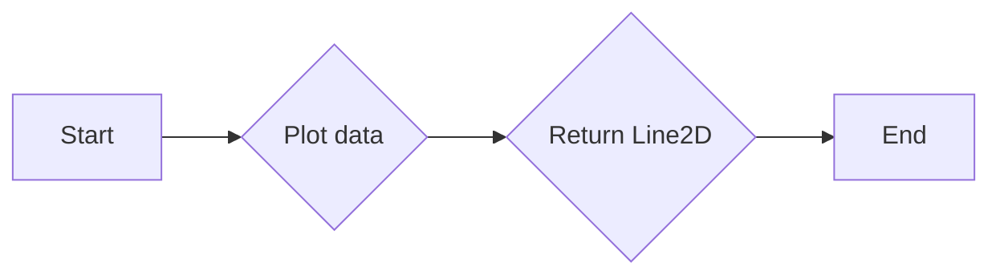

#### 带注释源码

```python
# 假设以下代码块是matplotlib.pyplot模块的一部分
def plot(self, x, y, fmt=None, data=None, *args, **kwargs):
    """
    Plot y versus x as lines and/or markers.

    Parameters
    ----------
    x : array_like
        The x data.
    y : array_like
        The y data.
    fmt : str, optional
        The line and marker format string.
    data : object, optional
        Object containing data to be plotted.
    *args
        Variable length argument list.
    **kwargs
        Arbitrary keyword arguments.

    Returns
    -------
    Line2D
        The line2d instance created by the plot.

    """
    # 绘制线条和标记的逻辑
    # ...
    return Line2D
```


### `matplotlib.pyplot.show`

`matplotlib.pyplot.show` 是一个用于显示图表的函数。

参数：无。

返回值：无。

#### 流程图

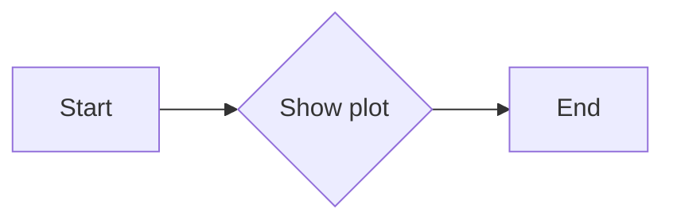

#### 带注释源码

```python
# 假设以下代码块是matplotlib.pyplot模块的一部分
def show(self):
    """
    Display the figure.

    """
    # 显示图表的逻辑
    # ...
    pass
```


### plt.show()

`plt.show()` 是一个全局函数，用于显示当前图形。

参数：

- 无

返回值：`None`，该函数不返回任何值，其作用是显示当前图形。

#### 流程图

```mermaid
graph LR
A[Start] --> B{plt.show() called?}
B -- Yes --> C[Display plot]
C --> D[End]
B -- No --> E[End]
```

#### 带注释源码

```
plt.show()  # This function is called to display the plot
```


### 关键组件信息

- `matplotlib.pyplot`：这是一个用于创建静态、交互式和动画图表的库。
- `plt.style.use('dark_background')`：这是一个设置绘图风格的函数，用于改变绘图的颜色主题。
- `plt.subplots()`：这是一个创建图形和轴对象的函数。
- `np.linspace()`：这是一个生成线性间隔数字的函数。
- `np.sin()`：这是一个计算正弦值的函数。


### 潜在的技术债务或优化空间

- **代码风格**：代码中使用了硬编码的字符串 `'dark_background'` 来设置绘图风格，这可能会使得代码难以维护和扩展。
- **性能**：如果图形非常大，`plt.show()` 可能会消耗较多的内存和CPU资源。
- **可读性**：代码中的一些函数调用没有注释，这可能会降低代码的可读性。


### 设计目标与约束

- 设计目标：创建一个具有特定风格的图形，以便于展示和演示。
- 约束：需要使用 `matplotlib` 库来创建图形，并且需要遵循该库的API规范。


### 错误处理与异常设计

- 该代码段没有显式的错误处理或异常设计。在实际应用中，应该添加适当的错误处理来确保程序的健壮性。


### 数据流与状态机

- 数据流：数据从 `np.linspace()` 和 `np.sin()` 函数生成，然后通过 `ax.plot()` 函数绘制到图形上。
- 状态机：该代码段没有使用状态机。


### 外部依赖与接口契约

- 外部依赖：该代码依赖于 `matplotlib` 和 `numpy` 库。
- 接口契约：该代码遵循 `matplotlib` 库的API规范。


### numpy.linspace

`numpy.linspace` 是一个 NumPy 函数，用于生成线性空间。

参数：

- `start`：`float`，线性空间的起始值。
- `stop`：`float`，线性空间的结束值。
- `num`：`int`，生成的线性空间中的点的数量（不包括结束值）。
- `dtype`：`dtype`，可选，输出数组的类型。
- `endpoint`：`bool`，可选，是否包含结束值。

返回值：`ndarray`，线性空间中的点。

#### 流程图

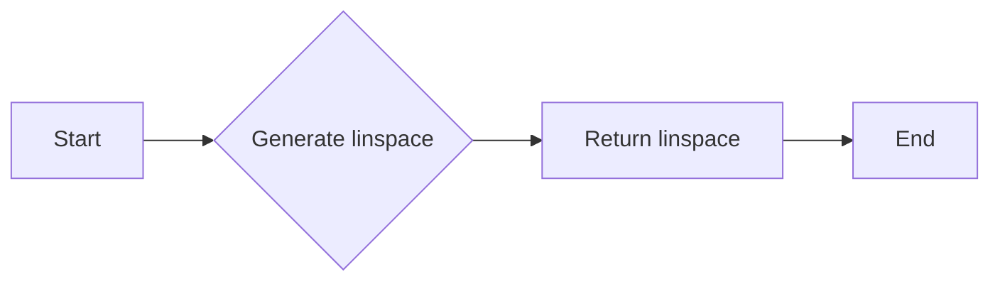

#### 带注释源码

```python
import numpy as np

# 生成线性空间
linspace = np.linspace(0, 6, 10)
print(linspace)
```


### plt.subplots

`plt.subplots` 是 Matplotlib 的一个函数，用于创建一个图形和一个轴。

参数：

- `figsize`：`tuple`，图形的大小（宽度和高度）。
- `dpi`：`int`，图形的分辨率（每英寸点数）。
- `facecolor`：`color`，图形的背景颜色。
- `edgecolor`：`color`，图形的边缘颜色。
- `frameon`：`bool`，是否显示图形的框架。
- `gridspec_kw`：`dict`，GridSpec 的关键字参数。
- `constrained_layout`：`bool`，是否启用约束布局。

返回值：`Figure`，图形对象；`Axes`，轴对象。

#### 流程图

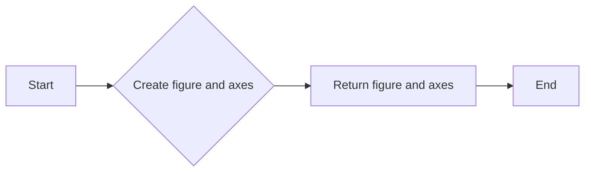

#### 带注释源码

```python
import matplotlib.pyplot as plt

# 创建图形和轴
fig, ax = plt.subplots(figsize=(10, 6))
print(fig, ax)
```


### ax.plot

`ax.plot` 是 Matplotlib 的一个方法，用于在轴上绘制线图。

参数：

- `x`：`array_like`，x 轴的数据。
- `y`：`array_like`，y 轴的数据。
- `fmt`：`str`，用于指定线型、标记和颜色。
- `data`：`object`，可选，数据源。
- `**kwargs`：`dict`，可选，额外的关键字参数。

返回值：`Line2D`，线图对象。

#### 流程图

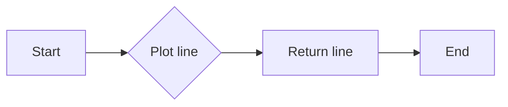

#### 带注释源码

```python
import matplotlib.pyplot as plt

# 创建图形和轴
fig, ax = plt.subplots(figsize=(10, 6))

# 绘制线图
line = ax.plot([0, 1, 2, 3, 4, 5], [0, 1, 4, 9, 16, 25], 'ro-')
print(line)
```


### ax.set_xlabel

`ax.set_xlabel` 是 Matplotlib 的一个方法，用于设置 x 轴的标签。

参数：

- `label`：`str`，x 轴的标签。

返回值：`AxesSubplot`，轴对象。

#### 流程图

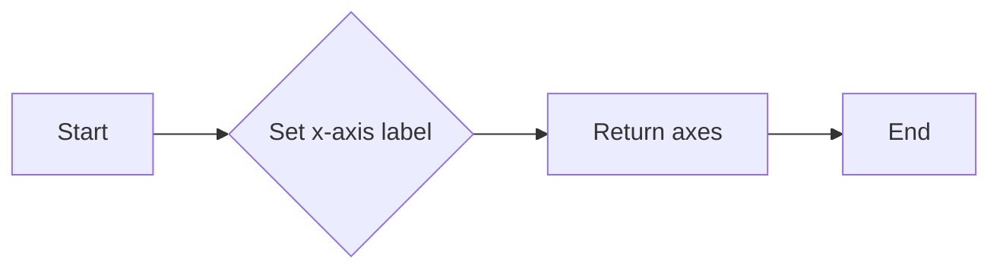

#### 带注释源码

```python
import matplotlib.pyplot as plt

# 创建图形和轴
fig, ax = plt.subplots(figsize=(10, 6))

# 设置 x 轴标签
ax.set_xlabel('X axis label')
print(ax)
```


### ax.set_ylabel

`ax.set_ylabel` 是 Matplotlib 的一个方法，用于设置 y 轴的标签。

参数：

- `label`：`str`，y 轴的标签。

返回值：`AxesSubplot`，轴对象。

#### 流程图


#### 带注释源码

```python
import matplotlib.pyplot as plt

# 创建图形和轴
fig, ax = plt.subplots(figsize=(10, 6))

# 设置 y 轴标签
ax.set_ylabel('Y axis label')
print(ax)
```


### ax.set_title

`ax.set_title` 是 Matplotlib 的一个方法，用于设置图形的标题。

参数：

- `title`：`str`，图形的标题。

返回值：`AxesSubplot`，轴对象。

#### 流程图

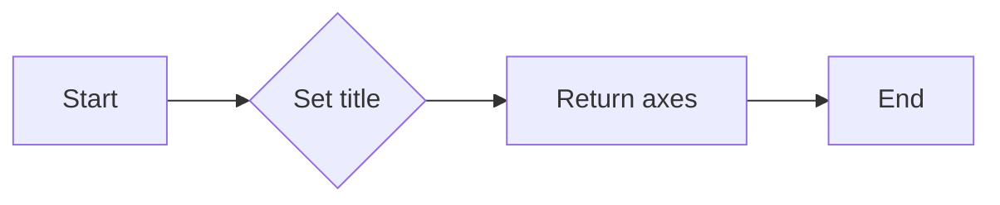

#### 带注释源码

```python
import matplotlib.pyplot as plt

# 创建图形和轴
fig, ax = plt.subplots(figsize=(10, 6))

# 设置图形标题
ax.set_title('Graph title')
print(ax)
```


### plt.show

`plt.show` 是 Matplotlib 的一个函数，用于显示图形。

参数：

- `block`：`bool`，可选，是否阻塞程序执行直到图形关闭。

返回值：无。

#### 流程图


#### 带注释源码

```python
import matplotlib.pyplot as plt

# 创建图形和轴
fig, ax = plt.subplots(figsize=(10, 6))

# 显示图形
plt.show()
```

## 关键组件


### 张量索引与惰性加载

张量索引与惰性加载是用于在数据操作中延迟计算，直到实际需要时才进行计算，从而提高效率。

### 反量化支持

反量化支持是指代码能够处理和操作非量化数据，以便在需要时可以转换为量化数据。

### 量化策略

量化策略是指将浮点数数据转换为固定点数表示的方法，以减少计算资源消耗和提高计算速度。


## 问题及建议


### 已知问题

-   {问题1}：代码中使用了硬编码的样式名称 'dark_background'，这可能导致代码的可移植性降低，如果目标环境不支持该样式，代码将无法正常工作。
-   {问题2}：代码没有进行任何错误处理，如果绘图过程中出现异常（例如，matplotlib库未安装），程序将崩溃。
-   {问题3}：代码没有进行任何输入验证，例如，`L` 和 `ncolors` 的值没有经过检查，如果这些值不合理，可能会导致绘图错误。

### 优化建议

-   {建议1}：将样式名称作为参数传递给函数，以提高代码的可移植性和灵活性。
-   {建议2}：添加异常处理机制，确保在出现错误时程序能够优雅地处理异常，并提供有用的错误信息。
-   {建议3}：对输入参数进行验证，确保它们在合理的范围内，以避免潜在的绘图错误。
-   {建议4}：考虑将绘图代码封装在一个类中，以便更好地管理状态和重用代码。
-   {建议5}：如果代码被用于生产环境，应该考虑添加日志记录功能，以便跟踪程序的执行情况。


## 其它


### 设计目标与约束

- 设计目标：实现一个能够应用暗色主题风格的matplotlib绘图界面。
- 约束条件：必须使用matplotlib库，且不能修改matplotlib的默认配置。

### 错误处理与异常设计

- 错误处理：代码中未包含显式的错误处理机制，但应确保matplotlib库的调用不会引发未处理的异常。
- 异常设计：未定义特定的异常处理逻辑，但应考虑在调用matplotlib函数时捕获可能的异常。

### 数据流与状态机

- 数据流：代码从导入matplotlib和numpy库开始，设置绘图风格，生成数据，绘制图形，并显示结果。
- 状态机：代码没有使用状态机，但可以视为一个简单的流程控制，从初始化到显示图形的顺序执行。

### 外部依赖与接口契约

- 外部依赖：代码依赖于matplotlib和numpy库。
- 接口契约：matplotlib的`style.use()`函数用于设置绘图风格，`subplots()`用于创建图形和坐标轴，`plot()`用于绘制图形，`show()`用于显示图形。

### 测试与验证

- 测试策略：应编写单元测试来验证绘图风格是否正确应用，以及图形是否按预期显示。
- 验证方法：通过比较实际输出与预期输出，确保代码的正确性。

### 性能考量

- 性能指标：代码的执行时间应尽可能短，且资源消耗应保持在合理范围内。
- 性能优化：由于代码简单，性能优化空间有限，但可以考虑减少不必要的计算和内存使用。

### 安全性考量

- 安全风险：代码中没有直接的安全风险，但应确保matplotlib库的版本是安全的，以避免潜在的安全漏洞。

### 维护与扩展性

- 维护策略：代码应易于维护，包括清晰的注释和良好的命名习惯。
- 扩展性：代码应设计为易于扩展，例如添加更多的绘图元素或支持不同的绘图风格。

### 用户文档

- 用户文档：应提供用户文档，说明如何使用代码以及如何自定义绘图风格。

### 代码审查

- 代码审查：应进行代码审查，以确保代码质量，遵循最佳实践，并符合项目标准。


    