# `matplotlib\galleries\examples\style_sheets\fivethirtyeight.py` 详细设计文档

This Python script applies the 'fivethirtyeight' style to matplotlib plots, creating a consistent visual appearance similar to that of FiveThirtyEight.com.

## 整体流程

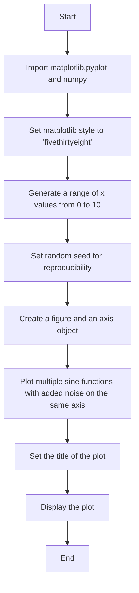

## 类结构

```
matplotlib.pyplot
├── plt.style.use('fivethirtyeight')
└── np.linspace(0, 10)
```

## 全局变量及字段


### `x`
    
An array of evenly spaced values over the interval [0, 10).

类型：`numpy.ndarray`
    


### `fig`
    
A figure containing a single Axes instance.

类型：`matplotlib.figure.Figure`
    


### `ax`
    
An axes instance representing a single plot in a figure.

类型：`matplotlib.axes._subplots.AxesSubplot`
    


### `matplotlib.pyplot`
    
The matplotlib.pyplot module provides a MATLAB-like interface to the matplotlib library.

类型：`module`
    


### `np`
    
The numpy module provides support for large, multi-dimensional arrays and matrices, along with a collection of mathematical functions to operate on these arrays.

类型：`module`
    


### `plt`
    
The matplotlib.pyplot module provides a MATLAB-like interface to the matplotlib library.

类型：`module`
    


### `matplotlib.pyplot.fig`
    
A figure containing a single Axes instance.

类型：`matplotlib.figure.Figure`
    


### `matplotlib.pyplot.ax`
    
An axes instance representing a single plot in a figure.

类型：`matplotlib.axes._subplots.AxesSubplot`
    
    

## 全局函数及方法


### plt.style.use

`plt.style.use` 是一个全局函数，用于设置 Matplotlib 的样式。

参数：

- `style`：`str`，指定要使用的样式名称。例如，'fivethirtyeight'。

返回值：无

#### 流程图

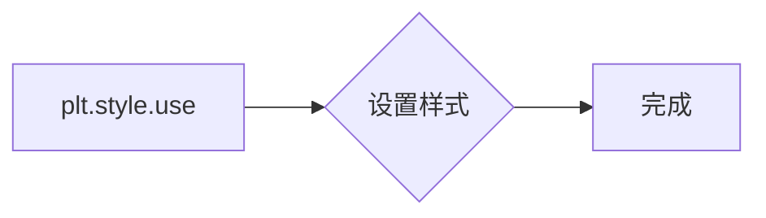

#### 带注释源码

```python
# 导入必要的库
import matplotlib.pyplot as plt

# 使用 'fivethirtyeight' 样式
plt.style.use('fivethirtyeight')
```


### matplotlib.pyplot

`matplotlib.pyplot` 是一个模块，提供了用于创建图形和图表的函数。

参数：

- 无

返回值：无

#### 流程图

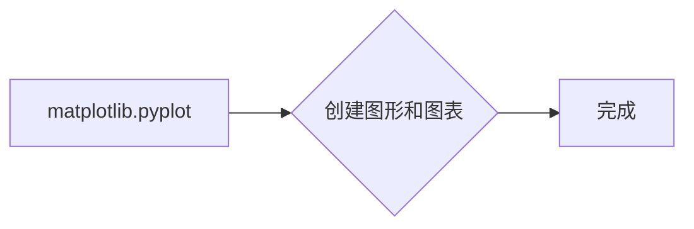

#### 带注释源码

```python
# 导入 matplotlib.pyplot 模块
import matplotlib.pyplot as plt
```


### numpy

`numpy` 是一个提供高性能科学计算和数据分析的库。

参数：

- 无

返回值：无

#### 流程图

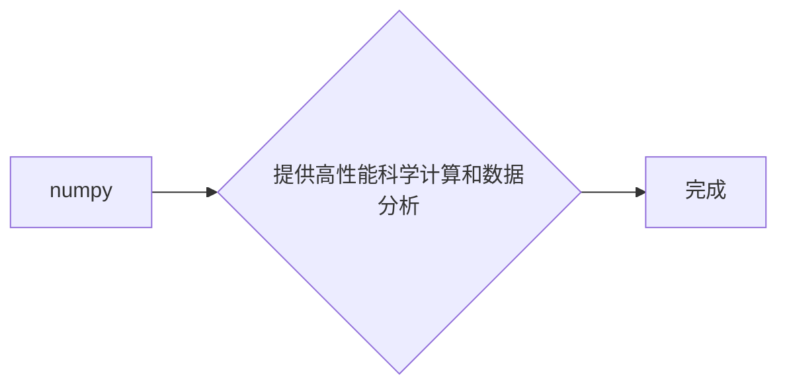

#### 带注释源码

```python
# 导入 numpy 库
import numpy as np
```


### np.linspace

`np.linspace` 是一个全局函数，用于生成线性间隔的数组。

参数：

- `start`：`float`，数组的起始值。
- `stop`：`float`，数组的结束值。
- `num`：`int`，数组中点的数量。

返回值：`numpy.ndarray`，线性间隔的数组。

#### 流程图

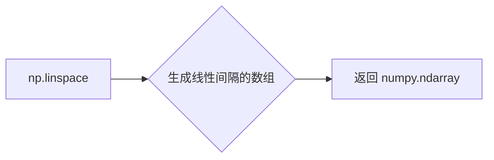

#### 带注释源码

```python
# 生成线性间隔的数组
x = np.linspace(0, 10)
```


### np.random.seed

`np.random.seed` 是一个全局函数，用于设置随机数生成器的种子，以确保结果的可重复性。

参数：

- `seed`：`int`，随机数生成器的种子。

返回值：无

#### 流程图

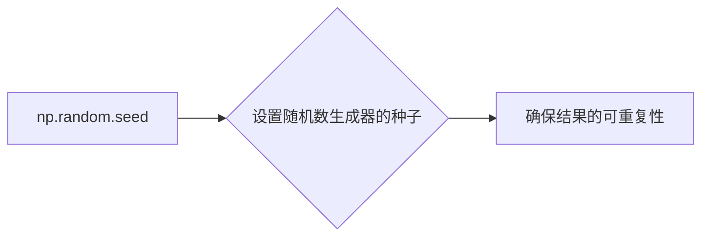

#### 带注释源码

```python
# 设置随机数生成器的种子
np.random.seed(19680801)
```


### plt.subplots

`plt.subplots` 是一个全局函数，用于创建一个图形和一个轴。

参数：

- `figsize`：`tuple`，图形的大小（宽度和高度）。
- `dpi`：`int`，图形的分辨率（每英寸点数）。

返回值：`matplotlib.figure.Figure`，图形对象；`matplotlib.axes._subplots.AxesSubplot`，轴对象。

#### 流程图

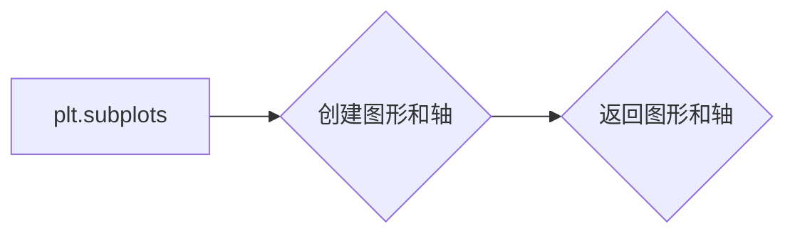

#### 带注释源码

```python
# 创建图形和轴
fig, ax = plt.subplots()
```


### ax.plot

`ax.plot` 是一个轴对象的方法，用于绘制二维线图。

参数：

- `x`：`numpy.ndarray`，x 轴的数据。
- `y`：`numpy.ndarray`，y 轴的数据。

返回值：`matplotlib.lines.Line2D`，线图对象。

#### 流程图

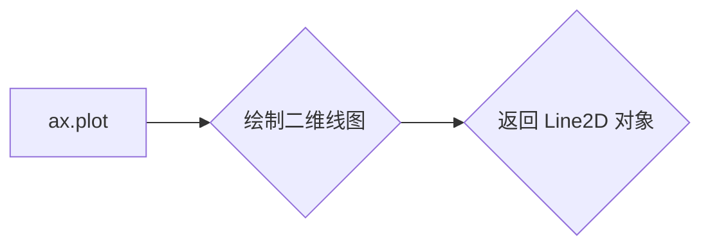

#### 带注释源码

```python
# 绘制二维线图
ax.plot(x, np.sin(x) + x + np.random.randn(50))
```


### ax.set_title

`ax.set_title` 是一个轴对象的方法，用于设置轴的标题。

参数：

- `title`：`str`，标题的文本。

返回值：无

#### 流程图

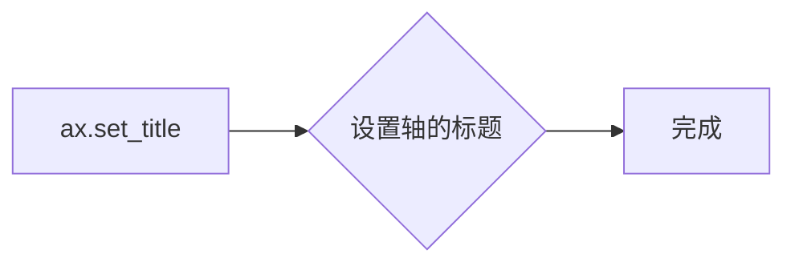

#### 带注释源码

```python
# 设置轴的标题
ax.set_title("'fivethirtyeight' style sheet")
```


### plt.show

`plt.show` 是一个全局函数，用于显示图形。

参数：

- 无

返回值：无

#### 流程图

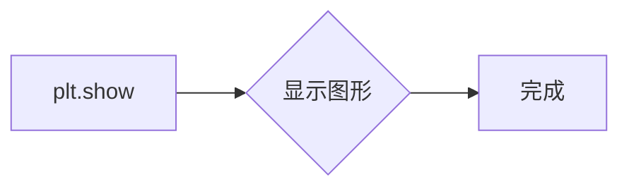

#### 带注释源码

```python
# 显示图形
plt.show()
```


### 关键组件信息

- `plt.style.use`：设置 Matplotlib 样式。
- `matplotlib.pyplot`：创建图形和图表。
- `numpy`：提供高性能科学计算和数据分析。
- `np.linspace`：生成线性间隔的数组。
- `np.random.seed`：设置随机数生成器的种子。
- `plt.subplots`：创建图形和轴。
- `ax.plot`：绘制二维线图。
- `ax.set_title`：设置轴的标题。
- `plt.show`：显示图形。


### 潜在的技术债务或优化空间

- 代码中使用了随机数生成器，但没有说明其用途和影响。
- 可以考虑使用更高级的绘图库，如 Plotly 或 Bokeh，以提供更丰富的交互式图表。
- 代码中没有进行错误处理，可能会在遇到异常时崩溃。


### 设计目标与约束

- 设计目标是创建一个示例，展示如何使用 'fivethirtyeight' 样式。
- 约束是使用 Matplotlib 库和 numpy 库。


### 错误处理与异常设计

- 代码中没有进行错误处理，可能会在遇到异常时崩溃。
- 可以考虑添加 try-except 块来捕获和处理可能发生的异常。


### 数据流与状态机

- 数据流从生成线性间隔的数组开始，然后是随机数生成，接着是绘图，最后是显示图形。
- 状态机不适用，因为代码没有涉及状态转换。


### 外部依赖与接口契约

- 代码依赖于 Matplotlib 和 numpy 库。
- 接口契约由这些库提供，确保代码能够正确地使用它们的功能。
```


### np.linspace

`np.linspace` 是 NumPy 库中的一个函数，用于生成线性空间。

参数：

- `start`：`float`，线性空间的起始值。
- `stop`：`float`，线性空间的结束值。
- `num`：`int`，生成的线性空间中的点的数量（默认为 50）。
- `dtype`：`dtype`，输出数组的类型（默认为 `float`）。

返回值：`numpy.ndarray`，线性空间中的点。

#### 流程图

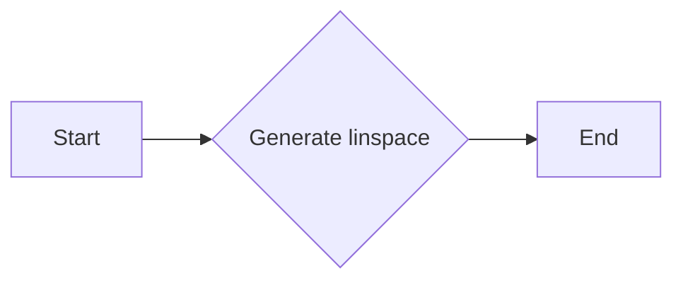

#### 带注释源码

```python
import numpy as np

x = np.linspace(0, 10)  # Generate a linear space from 0 to 10
```


### np.random.seed

`np.random.seed` 是 NumPy 库中的一个全局函数，用于设置随机数生成器的种子。

参数：

- `seed`：`int`，用于初始化随机数生成器的种子值。设置相同的种子值将产生相同的随机数序列，这对于可重复性研究非常有用。

返回值：`None`，该函数不返回任何值。

#### 流程图

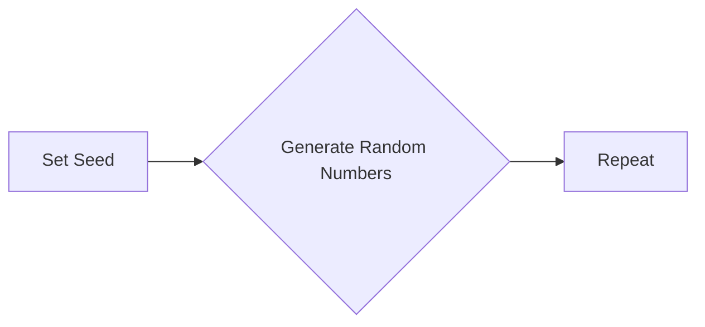

#### 带注释源码

```
np.random.seed(19680801)
```

该行代码设置了随机数生成器的种子为 `19680801`，确保每次运行代码时生成的随机数序列是相同的。


### plt.subplots

`plt.subplots` 是 `matplotlib.pyplot` 模块中的一个函数，用于创建一个图形和一个轴（或多个轴）。

参数：

- `figsize`：`tuple`，指定图形的大小（宽度和高度），默认为 `(6, 4)`。
- `dpi`：`int`，指定图形的分辨率（每英寸点数），默认为 `100`。
- `facecolor`：`color`，图形的背景颜色，默认为 `'w'`（白色）。
- `edgecolor`：`color`，图形的边缘颜色，默认为 `'none'`。
- `frameon`：`bool`，是否显示图形的边框，默认为 `True`。
- `num`：`int`，要创建的轴的数量，默认为 `1`。
- `gridspec_kw`：`dict`，用于定义网格规格的字典，默认为 `{}`。
- `constrained_layout`：`bool`，是否启用约束布局，默认为 `False`。

返回值：`Figure` 对象和 `Axes` 对象的元组。

返回值描述：`Figure` 对象代表整个图形，而 `Axes` 对象代表图形中的一个轴。

#### 流程图

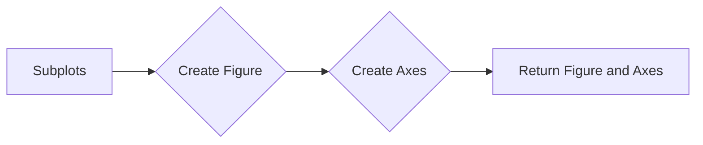

#### 带注释源码

```python
fig, ax = plt.subplots()
# fig: 创建一个图形对象
# ax: 创建一个轴对象
```


### matplotlib.pyplot.plot

matplotlib.pyplot.plot 是一个用于绘制二维线条图的函数。

参数：

- `x`：`array_like`，x轴的数据点。
- `y`：`array_like`，y轴的数据点。
- `label`：`str`，可选，图例标签。
- `color`：`color`，可选，线条颜色。
- `linewidth`：`float`，可选，线条宽度。
- `linestyle`：`str`，可选，线条样式。
- `marker`：`str`，可选，标记点样式。
- `markersize`：`float`，可选，标记点大小。
- `alpha`：`float`，可选，透明度。
- `zorder`：`int`，可选，绘制顺序。

返回值：`Line2D`，线条对象。

#### 流程图

```mermaid
graph LR
A[Start] --> B{Call plot()}
B --> C[End]
```

#### 带注释源码

```python
import matplotlib.pyplot as plt
import numpy as np

plt.style.use('fivethirtyeight')

x = np.linspace(0, 10)

# Fixing random state for reproducibility
np.random.seed(19680801)

fig, ax = plt.subplots()

# Plotting multiple lines with different styles
ax.plot(x, np.sin(x) + x + np.random.randn(50), label='Line 1')
ax.plot(x, np.sin(x) + 0.5 * x + np.random.randn(50), label='Line 2')
ax.plot(x, np.sin(x) + 2 * x + np.random.randn(50), label='Line 3')
ax.plot(x, np.sin(x) - 0.5 * x + np.random.randn(50), label='Line 4')
ax.plot(x, np.sin(x) - 2 * x + np.random.randn(50), label='Line 5')
ax.plot(x, np.sin(x) + np.random.randn(50), label='Line 6')

# Setting title
ax.set_title("'fivethirtyeight' style sheet")

# Display the plot
plt.show()
```


### matplotlib.pyplot.style.use

matplotlib.pyplot.style.use 是一个用于设置matplotlib风格的函数。

参数：

- `style`：`str`，matplotlib风格名称。

返回值：无。

#### 流程图

```mermaid
graph LR
A[Start] --> B{Set style()}
B --> C[End]
```

#### 带注释源码

```python
import matplotlib.pyplot as plt

# Set the style to 'fivethirtyeight'
plt.style.use('fivethirtyeight')
```


### numpy.linspace

numpy.linspace 是一个用于生成线性间隔数组的函数。

参数：

- `start`：`float`，起始值。
- `stop`：`float`，结束值。
- `num`：`int`，可选，生成的数组长度。
- `dtype`：`dtype`，可选，数组数据类型。

返回值：`ndarray`，线性间隔数组。

#### 流程图

```mermaid
graph LR
A[Start] --> B{Generate linspace()}
B --> C[End]
```

#### 带注释源码

```python
import numpy as np

# Generate a linearly spaced array from 0 to 10
x = np.linspace(0, 10)
```


### numpy.random.seed

numpy.random.seed 是一个用于设置随机数生成器种子值的函数。

参数：

- `seed`：`int`，种子值。

返回值：无。

#### 流程图

```mermaid
graph LR
A[Start] --> B{Set seed()}
B --> C[End]
```

#### 带注释源码

```python
import numpy as np

# Set the random seed for reproducibility
np.random.seed(19680801)
```


### matplotlib.pyplot.subplots

matplotlib.pyplot.subplots 是一个用于创建一个新的图形和轴对象的函数。

参数：

- `ncols`：`int`，可选，列数。
- `nrows`：`int`，可选，行数。
- `sharex`：`bool`，可选，是否共享x轴。
- `sharey`：`bool`，可选，是否共享y轴。
- `fig`：`Figure`，可选，父图形。
- `gridspec`：`GridSpec`，可选，网格规格。

返回值：`Figure`，图形对象；`Axes`，轴对象。

#### 流程图

```mermaid
graph LR
A[Start] --> B{Create subplots()}
B --> C[End]
```

#### 带注释源码

```python
import matplotlib.pyplot as plt

# Create a new figure and axis
fig, ax = plt.subplots()
```


### matplotlib.pyplot.show

matplotlib.pyplot.show 是一个用于显示图形的函数。

参数：无。

返回值：无。

#### 流程图

```mermaid
graph LR
A[Start] --> B{Show plot()}
B --> C[End]
```

#### 带注释源码

```python
import matplotlib.pyplot as plt

# Display the plot
plt.show()
```


### 关键组件信息

- matplotlib.pyplot.plot：用于绘制二维线条图。
- matplotlib.pyplot.style.use：用于设置matplotlib风格。
- numpy.linspace：用于生成线性间隔数组。
- numpy.random.seed：用于设置随机数生成器种子值。
- matplotlib.pyplot.subplots：用于创建新的图形和轴对象。
- matplotlib.pyplot.show：用于显示图形。


### 潜在的技术债务或优化空间

- 风格设置：代码中使用了硬编码的风格名称，可以考虑使用配置文件或环境变量来设置风格。
- 重复代码：绘制多条线时，代码重复了多次相同的操作，可以考虑使用循环或函数来简化代码。
- 随机数：在绘制图形时使用了随机数，这可能导致结果的可重复性差，可以考虑使用固定的随机数种子或移除随机数。


### 设计目标与约束

- 设计目标：创建一个具有特定风格的图形，用于展示数据。
- 约束：使用matplotlib库进行绘图，遵循FiveThirtyEight的风格指南。


### 错误处理与异常设计

- 错误处理：代码中没有显式的错误处理机制。
- 异常设计：代码中没有特定的异常设计，但应确保在调用绘图函数时，输入参数是有效的。


### 数据流与状态机

- 数据流：数据从numpy.linspace生成，然后通过matplotlib.pyplot.plot进行绘图。
- 状态机：代码中没有使用状态机。


### 外部依赖与接口契约

- 外部依赖：代码依赖于matplotlib和numpy库。
- 接口契约：matplotlib和numpy库提供了明确的接口契约，确保代码的正确性和可维护性。


### matplotlib.pyplot.set_title

matplotlib.pyplot.set_title 是一个用于设置图表标题的函数。

参数：

- `title`：`str`，图表的标题文本。

返回值：`matplotlib.text.Text`，返回一个 Text 对象，该对象代表标题文本。

#### 流程图

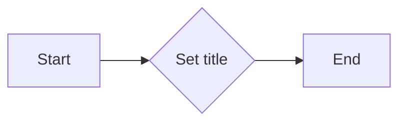

#### 带注释源码

```python
# 假设以下代码块位于matplotlib.pyplot模块中
def set_title(self, title):
    """
    Set the title of the axes.

    Parameters
    ----------
    title : str
        The title of the axes.

    Returns
    -------
    text : Text
        The title text as a Text instance.
    """
    # 创建一个Text对象，并将其设置为图表的标题
    text = self.text(0.5, 1.05, title, ha='center', va='bottom', transform=self.transAxes)
    return text
```


### plt.show()

`plt.show()` 是 Matplotlib 库中的一个全局函数，用于显示当前图形的窗口。

参数：

- 无

返回值：无

#### 流程图

```mermaid
graph LR
A[Start] --> B[Import matplotlib.pyplot as plt]
B --> C[Set style to 'fivethirtyeight']
C --> D[Create x values]
D --> E[Plot sin(x) + x + random noise]
E --> F[Plot sin(x) + 0.5 * x + random noise]
F --> G[Plot sin(x) + 2 * x + random noise]
G --> H[Plot sin(x) - 0.5 * x + random noise]
H --> I[Plot sin(x) - 2 * x + random noise]
I --> J[Plot sin(x) + random noise]
J --> K[Set title to "fivethirtyeight" style sheet]
K --> L[Show plot]
L --> M[End]
```

#### 带注释源码

```python
plt.show()  # 显示当前图形的窗口
```


### numpy.linspace

`numpy.linspace` 是一个 NumPy 函数，用于生成线性空间。

参数：

- `start`：`float`，线性空间的起始值。
- `stop`：`float`，线性空间的结束值。
- `num`：`int`，生成的线性空间中的点的数量（不包括起始值和结束值）。
- `dtype`：`dtype`，可选，输出数组的类型。
- `endpoint`：`bool`，可选，是否包含结束值。

返回值：`numpy.ndarray`，线性空间中的点。

#### 流程图

```mermaid
graph LR
A[Start] --> B{Generate linspace}
B --> C[End]
```

#### 带注释源码

```python
import numpy as np

# 生成线性空间
x = np.linspace(0, 10)
```


### numpy.random.seed

`numpy.random.seed` 是一个 NumPy 函数，用于设置随机数生成器的种子。

参数：

- `seed`：`int`，随机数生成器的种子。

返回值：无。

#### 流程图

```mermaid
graph LR
A[Start] --> B{Set seed}
B --> C[End]
```

#### 带注释源码

```python
# 设置随机数生成器的种子
np.random.seed(19680801)
```


### plt.subplots

`plt.subplots` 是一个 Matplotlib 函数，用于创建一个图形和一个轴。

参数：

- `figsize`：`tuple`，图形的大小。
- `ncols`：`int`，轴的数量。
- `nrows`：`int`，行的数量。
- `sharex`：`bool`，是否共享 x 轴。
- `sharey`：`bool`，是否共享 y 轴。
- `fig`：`Figure`，可选，图形对象。
- `gridspec`：`GridSpec`，可选，网格规格对象。

返回值：`Figure`，图形对象；`Axes`，轴对象。

#### 流程图

```mermaid
graph LR
A[Start] --> B{Create subplots}
B --> C[End]
```

#### 带注释源码

```python
# 创建图形和轴
fig, ax = plt.subplots()
```


### ax.plot

`ax.plot` 是一个 Matplotlib 函数，用于在轴上绘制线。

参数：

- `x`：`array_like`，x 轴数据。
- `y`：`array_like`，y 轴数据。
- `fmt`：`str`，可选，线型、标记和颜色。
- `data`：`object`，可选，数据源。

返回值：`Line2D`，线对象。

#### 流程图

```mermaid
graph LR
A[Start] --> B{Plot line}
B --> C[End]
```

#### 带注释源码

```python
# 在轴上绘制线
ax.plot(x, np.sin(x) + x + np.random.randn(50))
```


### ax.set_title

`ax.set_title` 是一个 Matplotlib 函数，用于设置轴的标题。

参数：

- `title`：`str`，标题文本。

返回值：无。

#### 流程图

```mermaid
graph LR
A[Start] --> B{Set title}
B --> C[End]
```

#### 带注释源码

```python
# 设置轴的标题
ax.set_title("'fivethirtyeight' style sheet")
```


### plt.show

`plt.show` 是一个 Matplotlib 函数，用于显示图形。

参数：无。

返回值：无。

#### 流程图

```mermaid
graph LR
A[Start] --> B{Show plot}
B --> C[End]
```

#### 带注释源码

```python
# 显示图形
plt.show()
```


### numpy.random.seed

`numpy.random.seed` 是一个全局函数，用于设置随机数生成器的种子，确保每次运行代码时生成的随机数序列相同。

参数：

- `seed`：`int`，用于设置随机数生成器的种子值。

返回值：无

#### 流程图

```mermaid
graph LR
A[Set Seed] --> B{Generate Random Numbers}
B --> C[Repeat]
```

#### 带注释源码

```python
# Fixing random state for reproducibility
np.random.seed(19680801)
```

该行代码设置了随机数生成器的种子为 `19680801`，以确保每次运行代码时生成的随机数序列相同，从而使得结果可重复。

## 关键组件


### 张量索引与惰性加载

张量索引与惰性加载是Numpy库中用于高效处理多维数组（张量）的机制，允许在需要时才计算数组元素的值，从而节省内存和提高性能。

### 反量化支持

反量化支持是某些编程语言或库中提供的一种特性，允许在运行时动态地调整数据类型的大小，以适应不同的量化需求。

### 量化策略

量化策略是指在机器学习模型中，将浮点数权重转换为低精度整数的过程，以减少模型的大小和计算需求，同时保持可接受的精度。


## 问题及建议


### 已知问题

-   {问题1}：代码中使用了`np.random.seed(19680801)`来确保结果的可重复性，但这个种子值是硬编码的。如果代码被部署到不同的环境中，或者在不同的时间运行，这个种子值可能不会产生相同的结果，这可能导致结果不可预测。
-   {问题2}：代码中使用了多个随机数生成器`np.random.randn(50)`，但没有提供任何关于这些随机数的分布或均值的描述。这可能会影响图表的可读性和分析。
-   {问题3}：代码没有提供任何关于图表的标题或轴标签的详细信息，这可能会影响图表的清晰度和信息的传达。

### 优化建议

-   {建议1}：将随机种子值作为参数传递给函数，而不是硬编码，这样可以根据不同的环境和需求进行调整。
-   {建议2}：在生成随机数之前，提供关于随机数分布和均值的描述，以便用户可以更好地理解图表。
-   {建议3}：为图表添加标题和轴标签，以提高图表的清晰度和信息的传达。
-   {建议4}：考虑将绘图逻辑封装到一个函数中，这样可以使代码更加模块化和可重用。
-   {建议5}：如果代码被用于生产环境，应该考虑异常处理和日志记录，以便在出现问题时能够追踪和调试。


## 其它


### 设计目标与约束

- 设计目标：实现一个能够模仿FiveThirtyEight网站风格的matplotlib样式表。
- 约束条件：必须使用matplotlib库，且不能安装额外的包。

### 错误处理与异常设计

- 错误处理：代码中未包含显式的错误处理机制。
- 异常设计：由于代码简单，未设计特定的异常处理逻辑。

### 数据流与状态机

- 数据流：代码从导入matplotlib和numpy库开始，设置样式，生成数据，绘制图形，最后显示图形。
- 状态机：代码没有涉及复杂的状态转换，主要是线性执行。

### 外部依赖与接口契约

- 外部依赖：代码依赖于matplotlib和numpy库。
- 接口契约：matplotlib和numpy库提供了必要的接口，用于绘图和数据操作。

### 测试与验证

- 测试策略：可以通过比较生成的图形与FiveThirtyEight网站上的图形来验证样式是否正确。
- 验证方法：手动检查或使用自动化测试工具。

### 维护与扩展

- 维护策略：定期检查matplotlib和numpy库的更新，确保代码兼容性。
- 扩展方法：根据需要添加新的样式选项或功能。


    