# `matplotlib\galleries\examples\style_sheets\ggplot.py` 详细设计文档

该代码是一个matplotlib可视化示例脚本，通过设置ggplot样式，创建了四种不同类型的图表：散点图、正弦曲线图、柱状图和圆形图，展示了ggplot风格的可视化效果。

## 整体流程

```mermaid
graph TD
    A[开始] --> B[导入matplotlib.pyplot和numpy]
    B --> C[设置ggplot样式: plt.style.use('ggplot')]
    C --> D[设置随机种子确保可重复性]
    D --> E[创建2x2子图布局]
    E --> F1[绘制散点图]
    F1 --> F2[绘制正弦曲线组]
    F2 --> F3[绘制柱状图]
    F3 --> F4[绘制圆形图]
    F4 --> G[调用plt.show()显示图表]
```

## 类结构

```
Python脚本 (无自定义类)
├── 导入模块
│   ├── matplotlib.pyplot (plt)
│   └── numpy (np)
├── 样式设置
│   └── plt.style.use('ggplot')
├── 图表创建
│   ├── 散点图 (ax1)
│   ├── 正弦曲线图 (ax2)
│   ├── 柱状图 (ax3)
│   └── 圆形图 (ax4)
└── 显示
```

## 全局变量及字段


### `fig`
    
matplotlib Figure对象，整个图形容器

类型：`matplotlib.figure.Figure`
    


### `axs`
    
matplotlib Axes对象数组，2x2网格的子图

类型：`numpy.ndarray`
    


### `ax1`
    
第一个独立的子图axes对象，用于散点图

类型：`matplotlib.axes.Axes`
    


### `ax2`
    
第二个独立的子图axes对象，用于正弦曲线

类型：`matplotlib.axes.Axes`
    


### `ax3`
    
第三个独立的子图axes对象，用于柱状图

类型：`matplotlib.axes.Axes`
    


### `ax4`
    
第四个独立的子图axes对象，用于圆形

类型：`matplotlib.axes.Axes`
    


### `x`
    
用于散点图的随机x坐标数据

类型：`numpy.ndarray`
    


### `y`
    
用于散点图的随机y坐标数据

类型：`numpy.ndarray`
    


### `L`
    
2*π常量，表示正弦周期

类型：`float`
    


### `x`
    
正弦曲线的x轴数据

类型：`numpy.ndarray`
    


### `ncolors`
    
默认颜色循环中的颜色数量

类型：`int`
    


### `shift`
    
正弦曲线相位偏移数组

类型：`numpy.ndarray`
    


### `s`
    
当前相位偏移值

类型：`numpy.float64`
    


### `x`
    
柱状图的x轴位置

类型：`numpy.ndarray`
    


### `y1`
    
第一组柱状图的随机高度数据

类型：`numpy.ndarray`
    


### `y2`
    
第二组柱状图的随机高度数据

类型：`numpy.ndarray`
    


### `width`
    
柱状图宽度

类型：`float`
    


### `i`
    
循环索引

类型：`int`
    


### `color`
    
当前颜色字典，包含颜色信息

类型：`dict`
    


### `xy`
    
圆心的随机坐标

类型：`numpy.ndarray`
    


    

## 全局函数及方法


### `plt.style.use()`

应用指定的样式表（style sheet）到matplotlib配置中，将全局matplotlib属性设置为特定样式的预设值，从而改变后续所有图表的外观风格。

参数：

- `name`：string 或 dict 或 list，要使用的样式名称（如 `'ggplot'`、`'dark_background'`）、样式字典或样式列表。也可以是包含样式路径的字符串。
- `rc`：dict（可选），一个字典，用于覆盖指定的样式参数。

返回值：`None`，该函数直接修改matplotlib的全局rcParams，不返回任何值。

#### 流程图

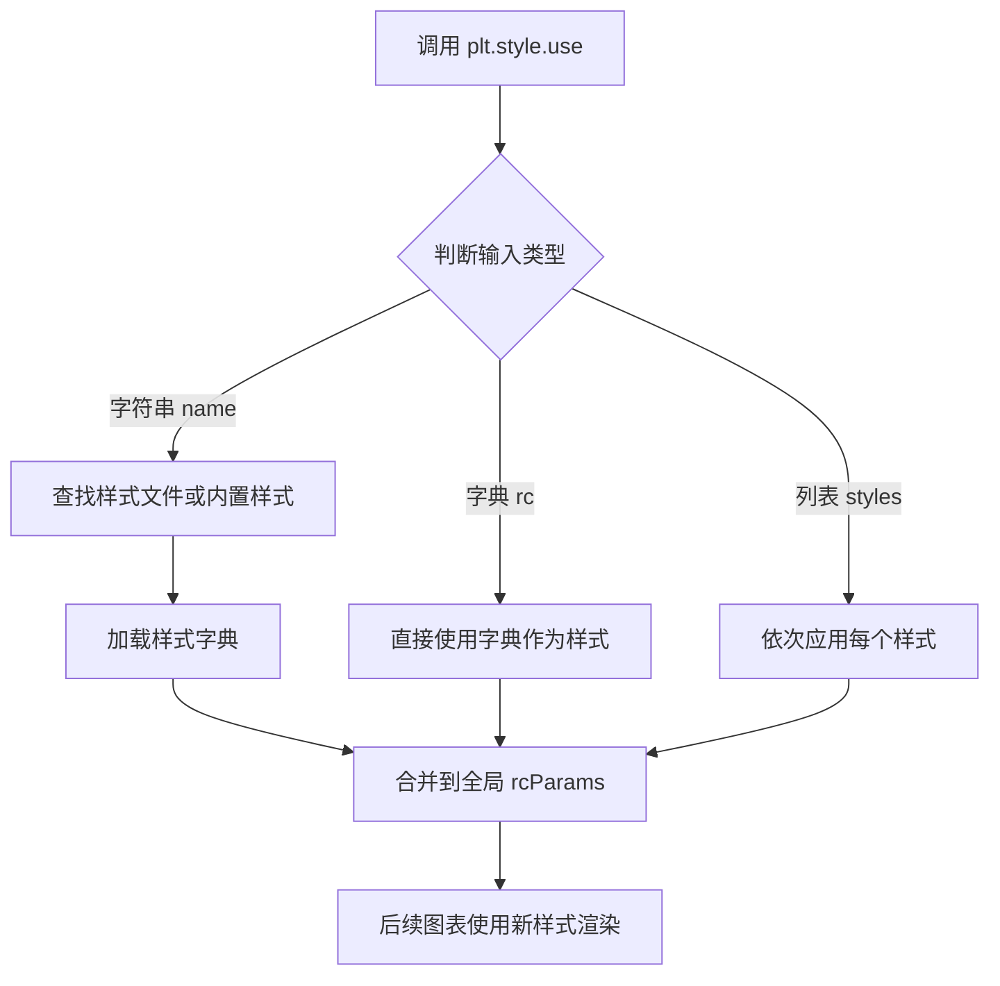

#### 带注释源码

```python
# matplotlib.pyplot.style.use() 源码分析

# 函数签名（简化版）：
# def use(style, rc=None):

# 参数说明：
# - style: 样式标识，可以是：
#   1. 字符串：如 'ggplot', 'dark_background', 'seaborn' 等内置样式
#   2. 字典：自定义样式键值对，如 {'lines.linewidth': 2.0}
#   3. 列表：多个样式的组合，如 ['ggplot', {'axes.grid': False}]
# - rc: 可选的运行时配置字典，用于覆盖样式中的值

# 核心逻辑流程：
# 1. 解析输入的style参数
# 2. 查找对应的样式定义文件或使用内置样式
# 3. 将样式参数合并到 matplotlib.rcParams 全局字典中
# 4. 所有后续的 plt.plot(), fig, ax 等都会应用新的默认样式

# 在本代码中的使用示例：
plt.style.use('ggplot')

# 这行代码会：
# 1. 加载名为 'ggplot' 的内置样式
# 2. 将该样式的所有参数（如背景色、线条宽度、字体等）应用到全局rcParams
# 3. 代码后续创建的所有图表都会自动使用ggplot风格
```


### `np.random.seed`

设置随机数生成器的种子，确保后续通过 `np.random` 模块生成的随机数序列可重复，用于结果复现和调试。

参数：

- `seed`：`int` 或 `None` 或 `array_like`，随机数种子值。整数时直接作为种子；为 `None` 时从操作系统获取随机熵；为数组时创建 `SeedSequence`。

返回值：`None`，该函数无返回值，直接修改全局随机数状态。

#### 流程图

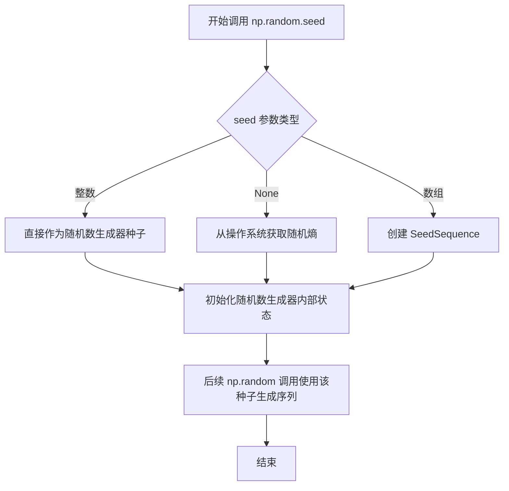

#### 带注释源码

```python
# 设置随机数种子以确保可重复性
# seed 参数：可以是整数、None 或 array_like
#   - 整数：直接作为种子值
#   - None：从操作系统熵池获取随机数
#   - array_like：创建 SeedSequence 生成多个种子
np.random.seed(19680801)

# 示例中的 19680801 是 matplotlib 示例代码的经典种子值
# 设置后，后续的 np.random.normal()、np.random.randint() 等
# 每次运行都将产生相同的随机数序列，确保结果可复现
```


### `plt.subplots`

`plt.subplots()` 是 matplotlib 库中的一个高级函数，用于创建一个新的图形窗口（Figure）并在其中生成指定布局的子图（Axes）数组，同时支持子图之间的坐标轴共享配置。

参数：

- `nrows`：`int`，默认值 1，表示子图网格的行数
- `ncols`：`int`，默认值 1，表示子图网格的列数
- `sharex`：`bool` 或 `{'none', 'all', 'row', 'col'}`，默认值 False，控制子图之间是否共享 x 轴
- `sharey`：`bool` 或 `{'none', 'all', 'row', 'col'}`，默认值 False，控制子图之间是否共享 y 轴
- `squeeze`：`bool`，默认值 True，当为 True 时，如果只返回一个子图则降维处理
- `width_ratios`：`array-like`，可选，表示每列子图的宽度比例
- `height_ratios`：`array-like`，可选，表示每行子图的高度比例
- `subplot_kw`：可选关键字参数，传递给 `add_subplot` 的参数字典
- `gridspec_kw`：可选关键字参数，传递给 `GridSpec` 的参数字典
- `**fig_kw`：传递给 `Figure.subplots` 的额外关键字参数

返回值：`tuple(Figure, Axes or array of Axes)`，返回创建的图形对象和子图对象（或子图数组）

#### 流程图

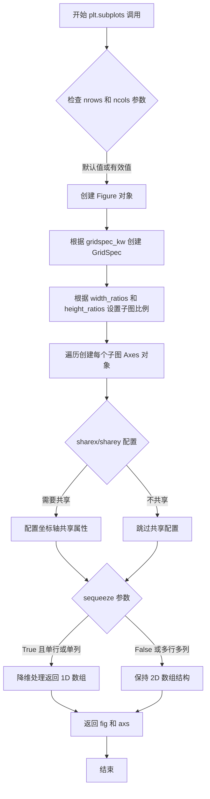

#### 带注释源码

```python
# 示例代码：plt.subplots 的典型用法
# 创建一个 2x2 的子图布局
fig, axs = plt.subplots(ncols=2, nrows=2)

# 参数说明：
# - ncols=2: 创建 2 列子图
# - nrows=2: 创建 2 行子图
# - 返回 fig: matplotlib Figure 对象，整个图形窗口
# - 返回 axs: 2x2 的 Axes 数组对象，包含 4 个子图

# 访问各个子图
ax1, ax2, ax3, ax4 = axs.flat  # 将 2D 数组展平为 1D 便于访问

# 在第一个子图上绘制散点图
x, y = np.random.normal(size=(2, 200))
ax1.plot(x, y, 'o')

# 在第二个子图上绘制正弦曲线
L = 2 * np.pi
x = np.linspace(0, L)
ncolors = len(plt.rcParams['axes.prop_cycle'])
shift = np.linspace(0, L, ncolors, endpoint=False)
for s in shift:
    ax2.plot(x, np.sin(x + s), '-')
ax2.margins(0)

# 在第三个子图上绘制柱状图
x = np.arange(5)
y1, y2 = np.random.randint(1, 25, size=(2, 5))
width = 0.25
ax3.bar(x, y1, width)
ax3.bar(x + width, y2, width,
        color=list(plt.rcParams['axes.prop_cycle'])[2]['color'])
ax3.set_xticks(x + width, labels=['a', 'b', 'c', 'd', 'e'])

# 在第四个子图上绘制圆形
for i, color in enumerate(plt.rcParams['axes.prop_cycle']):
    xy = np.random.normal(size=2)
    ax4.add_patch(plt.Circle(xy, radius=0.3, color=color['color']))
ax4.axis('equal')
ax4.margins(0)

# 显示图形
plt.show()
```


### `axs.flat`

将二维matplotlib axes数组（axs）展平为一维迭代器，便于遍历或解包赋值给多个变量。

参数：  
- 无（该属性不需要参数）

返回值：`numpy.flatiter`，返回一个一维迭代器，可用于遍历多维数组的所有元素。

#### 流程图

```mermaid
graph LR
    A[二维数组 axs<br>shape=(2, 2)] --> B[访问 .flat 属性]
    B --> C[展平为迭代器<br>numpy.flatiter]
    C --> D[迭代或解包赋值<br>ax1, ax2, ax3, ax4]
```

#### 带注释源码

```python
# 创建2x2的子图，返回axes数组
fig, axs = plt.subplots(ncols=2, nrows=2)
# axs 是一个二维数组，shape 为 (2, 2)

# 使用 .flat 属性将二维数组展平为一维迭代器
# flat 是 numpy.ndarray 的属性，返回 numpy.flatiter 对象
ax1, ax2, ax3, ax4 = axs.flat
# 通过迭代器将4个axes对象解包赋值给四个变量
```


### `np.random.normal`

生成符合正态（高斯）分布的随机数。该函数是 NumPy 随机数生成模块的核心函数之一，用于从指定均值和标准差的正态分布中抽取样本，可生成标量或多维数组形式的随机数序列，常用于统计模拟、数据生成和机器学习中的初始化等场景。

参数：

- `loc`：`float`，分布的均值（中心位置），默认为 0.0
- `scale`：`float`，分布的标准差（宽度），默认为 1.0
- `size`：`int` 或 `tuple` 或 `None`，输出数组的形状，默认为 None（返回单个值）

返回值：`numpy.ndarray` 或 `float`，从正态分布中抽取的随机数，形状由 `size` 参数决定

#### 流程图

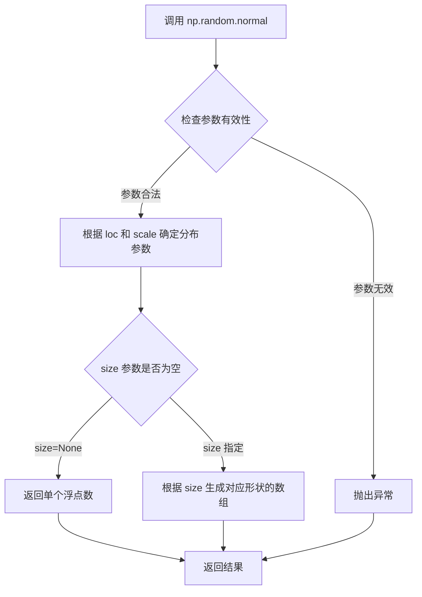

#### 带注释源码

```python
# np.random.normal 函数的使用示例

# 第一次调用：生成 2x200 的正态分布随机数矩阵
# loc=0.0（默认）, scale=1.0（默认），生成标准正态分布数据
x, y = np.random.normal(size=(2, 200))
# 返回值：形状为 (2, 200) 的二维数组

# 第二次调用：生成 2 个正态分布随机数（作为坐标）
# 用于后续绘制圆形的位置
xy = np.random.normal(size=2)
# 返回值：形状为 (2,) 的一维数组，包含 2 个随机数
```

#### 代码上下文分析

在给定的示例代码中，`np.random.normal()` 出现了两次具体应用：

1. **散点图数据生成**（第 23 行）：
   ```python
   x, y = np.random.normal(size=(2, 200))
   ```
   生成 200 个二维坐标点，用于散点图绘制

2. **圆形位置生成**（第 42 行）：
   ```python
   xy = np.random.normal(size=2)
   ```
   生成圆形补丁的随机圆心坐标

这些调用均使用默认的 `loc=0.0` 和 `scale=1.0` 参数，生成标准正态分布（均值 0，标准差 1）的随机数。


### `ax1.plot()`

在matplotlib的Axes对象上绘制y versus x的线条和/或标记，这是创建散点图的核心方法。本例中通过`'o'`格式字符串指定使用圆圈标记绘制散点图。

参数：

- `x`：array-like，x轴坐标数据
- `y`：array-like，y轴坐标数据
- `'o'`：format string（格式字符串），指定绘制样式为本例中为圆圈标记（散点）

返回值：`list of matplotlib.lines.Line2D`，返回创建的Line2D对象列表

#### 流程图

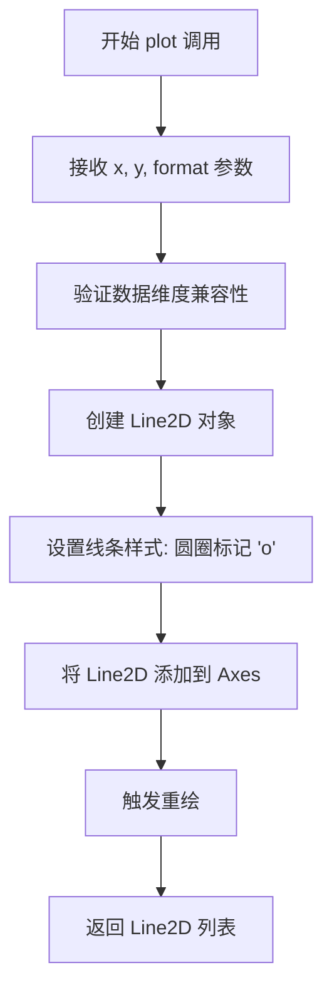

#### 带注释源码

```python
# ax1 是从 plt.subplots() 返回的 Axes 对象
# plot() 方法是 Axes 类的主要绘图方法之一
fig, axs = plt.subplots(ncols=2, nrows=2)  # 创建2x2子图
ax1, ax2, ax3, ax4 = axs.flat              # 展平获取各个Axes对象

# 生成正态分布的随机数据
x, y = np.random.normal(size=(2, 200))     # 生成200个x,y坐标点

# 调用 ax1 的 plot 方法绘制散点图
# 参数说明：
#   x: x坐标数组 (200个元素)
#   y: y坐标数组 (200个元素)
#   'o': 格式字符串，表示使用圆圈标记绘制，不连接线条
ax1.plot(x, y, 'o')

# 实际内部执行流程（简化版）：
# 1. matplotlib.axes.Axes.plot 接收参数
# 2. 内部调用 Line2D 创建线条对象，fmt='o' 指定样式为散点
# 3. 将 Line2D 对象添加到 ax1 的 lines 列表中
# 4. 返回 [Line2D 对象]
# 5. matplotlib 会自动在下次重绘时显示这些数据点
```


### `np.linspace`

`np.linspace` 是 NumPy 库中的一个核心函数，用于在指定范围内生成等间距的数值序列数组。该函数广泛应用于科学计算、数据可视化以及需要均匀采样数据的场景。

参数：

- `start`：`array_like`，序列的起始值（包含）
- `stop`：`array_like`，序列的结束值（默认包含，除非 `endpoint` 为 False）
- `num`：`int`，要生成的样本数量，默认为 50
- `endpoint`：`bool`，如果为 True，则 stop 是最后一个样本；否则不包括在内，默认为 True
- `retstep`：`bool`，如果为 True，则返回步长值；否则只返回样本数组，默认为 False
- `dtype`：`dtype`，输出数组的数据类型，如果未指定则从输入参数推断
- `axis`：`int`，结果数组中轴的索引（仅在 start 和 stop 是数组时使用），默认为 0

返回值：

- `samples`：`ndarray`，包含 num 个等间距样本的数组
- `step`：`float`（可选），仅当 `retstep` 为 True 时返回，表示样本之间的步长值

#### 流程图

```mermaid
flowchart TD
    A[开始] --> B[验证参数 start 和 stop]
    B --> C{num 是否有效?}
    C -->|否| D[抛出异常]
    C -->|是| E{endpoint == True?}
    E -->|是| F[计算停止值包含 stop]
    E -->|否| G[计算停止值不包含 stop]
    F --> H[计算步长 step = (stop - start) / (num - 1)]
    G --> I[计算步长 step = (stop - start) / num]
    H --> J{retstep == True?}
    I --> J
    J -->|是| K[创建数组包含 step]
    J -->|否| L[创建数组不包含 step]
    K --> M[返回样本数组和步长]
    L --> N[返回样本数组]
```

#### 带注释源码

```python
def linspace(start, stop, num=50, endpoint=True, retstep=False, dtype=None, axis=0):
    """
    在指定范围内生成等间距的数组。
    
    参数:
        start: 序列的起始值（包含）
        stop: 序列的结束值
        num: 生成的样本数量，默认为50
        endpoint: 是否包含结束值，默认为True
        retstep: 是否返回步长值，默认为False
        dtype: 输出数组的数据类型
        axis: 轴索引（用于多维数组输入）
    
    返回:
        ndarray: 等间距的数值序列
    """
    # 参数验证
    num = int(num) if num >= 0 else 0  # 确保 num 为非负整数
    if num == 0:
        # 空数组的特殊处理
        if dtype is None:
            dtype = np.array(start).dtype
        return np.empty(0, dtype=dtype)
    
    # 计算步长
    if endpoint:
        # 包含结束值，共 num 个点，步长为 (stop-start)/(num-1)
        step = (stop - start) / (num - 1)
    else:
        # 不包含结束值，步长为 (stop-start)/num
        step = (stop - start) / num
    
    # 生成数组
    result = np.arange(num, dtype=dtype) * step + start
    
    # 处理 endpoint 为 False 的情况，确保不包含结束值
    if not endpoint and num > 0:
        result = result[:-1]
    
    # 返回结果
    if retstep:
        return result, step
    return result
```

---

### 代码片段使用示例分析

在给定的代码中，`np.linspace` 的使用方式如下：

```python
L = 2*np.pi
x = np.linspace(0, L)
```

这里：
- `start` = 0（起始点）
- `stop` = `L` = 2π（结束点）
- `num` = 50（默认）
- `endpoint` = True（默认）
- `retstep` = False（默认）

该调用将在 0 到 2π 之间生成 50 个等间距的点，用于绘制正弦波曲线。


### `len(plt.rcParams['axes.prop_cycle'])`

该函数调用用于获取matplotlib默认颜色循环（axes.prop_cycle）中颜色属性的数量。通过`len()`内置函数计算颜色迭代器的长度，返回整数类型的颜色数量，用于后续需要遍历所有颜色的场景（如为正弦曲线分配不同颜色）。

参数：

-  `obj`：`axes.prop_cycle`，matplotlib的颜色循环迭代器对象，通过`plt.rcParams['axes.prop_cycle']`获取

返回值：`int`，返回颜色循环中的颜色数量（整数）

#### 流程图

```mermaid
graph TD
    A[开始] --> B[获取 plt.rcParams['axes.prop_cycle']]
    --> C[调用 len 函数]
    --> D{计算迭代器长度}
    --> E[返回整数 ncolors]
    F[后续使用] --> E
```

#### 带注释源码

```python
# 获取颜色循环中的颜色数量
# axes.prop_cycle 是 matplotlib 的颜色循环迭代器
# len() 函数计算该迭代器中的颜色元素个数
ncolors = len(plt.rcParams['axes.prop_cycle'])

# 示例用途：创建ncolors个不同的相位偏移
shift = np.linspace(0, L, ncolors, endpoint=False)
for s in shift:
    ax2.plot(x, np.sin(x + s), '-')
```


### `plt.rcParams`

`plt.rcParams` 是 matplotlib 库中的一个全局配置对象，用于访问和修改matplotlib的默认样式参数。在代码中，主要通过访问 `plt.rcParams['axes.prop_cycle']` 来获取颜色循环配置，用于为图形元素设置默认颜色。

参数：此属性不接受任何函数参数，它是一个字典-like对象，通过键名访问配置值。

- `key`（字符串）：配置参数的键名，如 `'axes.prop_cycle'`

返回值：返回对应配置参数的值，类型因参数键而异。

- 对于 `'axes.prop_cycle'`：返回 `matplotlib.colors.Cycle` 对象（可迭代），包含一组颜色字典，每个字典包含 `'color'` 键

#### 流程图

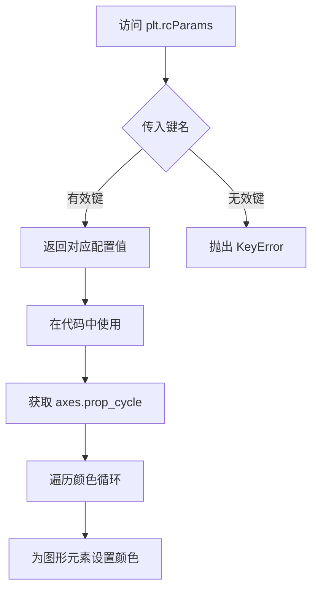

#### 带注释源码

```python
"""
==================
ggplot style sheet
==================

This example demonstrates the "ggplot" style, which adjusts the style to
emulate ggplot_ (a popular plotting package for R_).

These settings were shamelessly stolen from [1]_ (with permission).

.. [1] https://everyhue.me/posts/sane-color-scheme-for-matplotlib/

.. _ggplot: https://ggplot2.tidyverse.org/
.. _R: https://www.r-project.org/

"""
import matplotlib.pyplot as plt
import numpy as np

# 使用 ggplot 风格
plt.style.use('ggplot')

# 修复随机状态以确保可重复性
np.random.seed(19680801)

# 创建 2x2 的子图
fig, axs = plt.subplots(ncols=2, nrows=2)
ax1, ax2, ax3, ax4 = axs.flat

# 散点图 (注意: `plt.scatter` 不使用默认颜色)
x, y = np.random.normal(size=(2, 200))
ax1.plot(x, y, 'o')

# 正弦曲线，使用默认颜色循环中的颜色
L = 2*np.pi
x = np.linspace(0, L)
# 获取颜色循环中的颜色数量
ncolors = len(plt.rcParams['axes.prop_cycle'])  # 访问 rcParams 获取颜色循环
shift = np.linspace(0, L, ncolors, endpoint=False)
for s in shift:
    ax2.plot(x, np.sin(x + s), '-')
ax2.margins(0)

# 柱状图
x = np.arange(5)
y1, y2 = np.random.randint(1, 25, size=(2, 5))
width = 0.25
ax3.bar(x, y1, width)
# 访问 rcParams 获取颜色循环，使用第三个颜色
ax3.bar(x + width, y2, width,
        color=list(plt.rcParams['axes.prop_cycle'])[2]['color'])
ax3.set_xticks(x + width, labels=['a', 'b', 'c', 'd', 'e'])

# 圆形，使用默认颜色循环中的颜色
# 遍历颜色循环为每个圆形设置不同颜色
for i, color in enumerate(plt.rcParams['axes.prop_cycle']):
    xy = np.random.normal(size=2)
    ax4.add_patch(plt.Circle(xy, radius=0.3, color=color['color']))
ax4.axis('equal')
ax4.margins(0)

plt.show()
```


### `plt.rcParams['axes.prop_cycle']`

获取 matplotlib 的颜色属性循环器（cycler），用于在绘制多个数据系列时自动循环使用不同的颜色。该属性返回一个 cycler 对象，其中包含预定义的颜色序列，可通过列表转换或迭代方式访问单个颜色字典。

参数： 无（作为 rcParams 字典的键进行访问）

返回值： `cycler`，返回包含颜色配置项的 cycler 对象，用于遍历不同的颜色属性字典

#### 流程图

```mermaid
flowchart TD
    A[访问 plt.rcParams['axes.prop_cycle']] --> B{是否已设置自定义样式}
    B -->|是| C[返回用户自定义的 cycler]
    B -->|否| D[返回默认的 matplotlib 颜色 cycler]
    C --> E[遍历获取颜色字典]
    D --> E
    E --> F[提取 color 键的值]
    F --> G[应用到图表元素]
```

#### 带注释源码

```python
# 示例1: 获取颜色循环器的长度
ncolors = len(plt.rcParams['axes.prop_cycle'])
# 返回 cycler 对象的长度，即定义的颜色数量

# 示例2: 访问特定索引的颜色
color = list(plt.rcParams['axes.prop_cycle'])[2]['color']
# 将 cycler 转换为列表
# [2] 访问第三个颜色字典（索引从0开始）
# ['color'] 提取该字典中的 color 键值

# 示例3: 遍历所有颜色
for i, color in enumerate(plt.rcParams['axes.prop_cycle']):
    # color 是一个字典，如 {'color': '#1f77b4', 'linestyle': '-'}
    xy = np.random.normal(size=2)
    ax4.add_patch(plt.Circle(xy, radius=0.3, color=color['color']))
    # color['color'] 获取十六进制颜色代码
```


### `ax2.plot()`

该方法是在 matplotlib 的 Axes 对象上绘制正弦曲线，使用默认颜色循环中的颜色，通过循环不同的相位偏移来绘制多条正弦波形曲线。

参数：

- `x`：`numpy.ndarray`，从 0 到 2π 的等间距数组，作为正弦函数的输入参数
- `np.sin(x + s)`：`numpy.ndarray`，经过相位偏移后的正弦函数输出值，作为 y 轴数据
- `'-'`：`str`，线条样式参数，表示绘制实线

返回值：`list`，返回包含 `Line2D` 对象的列表，每个 Line2D 对象代表一条绘制的曲线

#### 流程图

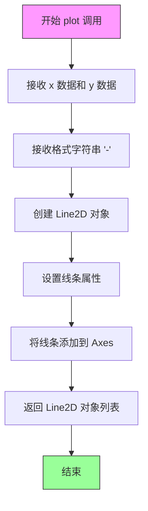

#### 带注释源码

```python
# sinusoidal lines with colors from default color cycle
# 定义正弦函数的周期 L = 2π
L = np.pi * 2

# 生成从 0 到 L 的等间距数组，作为 x 轴数据
x = np.linspace(0, L)

# 获取默认颜色循环中的颜色数量
ncolors = len(plt.rcParams['axes.prop_cycle'])

# 生成 ncolors 个相位偏移量，从 0 到 L 均分（不包括端点）
shift = np.linspace(0, L, ncolors, endpoint=False)

# 遍历每个相位偏移量，绘制一条正弦曲线
for s in shift:
    # 调用 ax2.plot() 绘制正弦曲线
    # 参数1: x - x轴数据
    # 参数2: np.sin(x + s) - y轴数据（相位偏移后的正弦值）
    # 参数3: '-' - 线条样式（实线）
    ax2.plot(x, np.sin(x + s), '-')

# 设置轴边距为 0，使曲线紧贴边框
ax2.margins(0)
```


### `ax2.margins`

设置子图（Axes）的边距，控制子图区域与数据范围之间的间距比例。

参数：

- `margins`：`float` 或 `tuple`，边距值。如果为单个浮点数，则x和y轴使用相同边距；如果为两个浮点数的元组，则分别设置x和y轴的边距。边距表示为数据范围的比例（例如，0.1 表示数据范围的 10%）

返回值：`tuple`，返回当前设置的边距值 (x_margin, y_margin)

#### 流程图

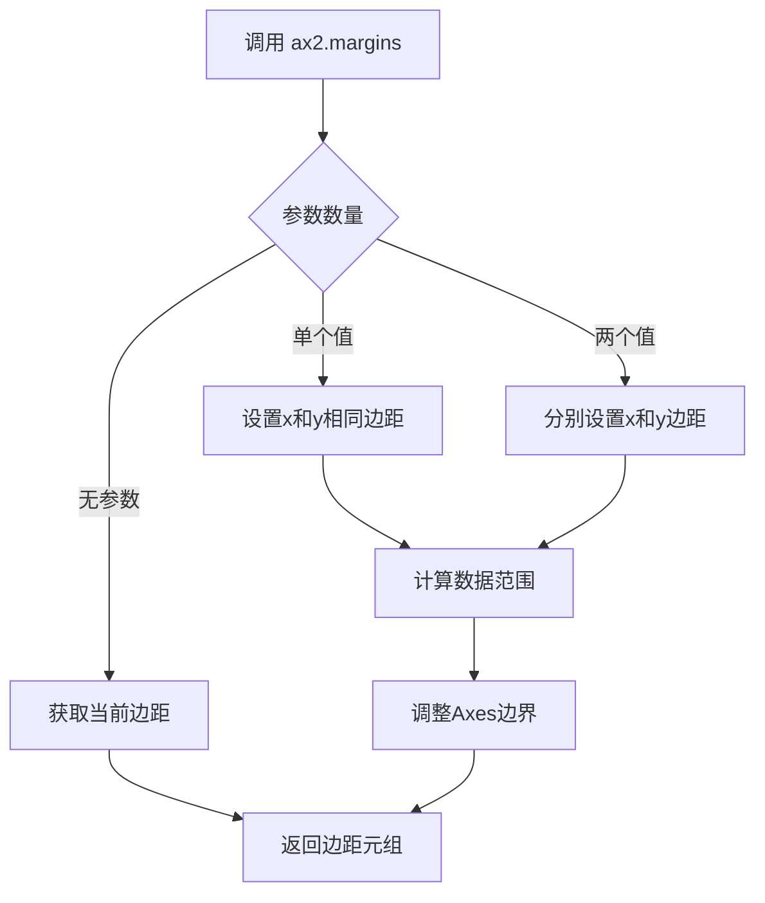

#### 带注释源码

```python
# 在提供的代码示例中，ax2.margins(0) 的调用
ax2.margins(0)

# 参数说明：
# - 0: float类型，表示将x轴和y轴的边距都设置为0
#   边距0意味着子图区域会紧紧贴合数据范围，没有额外的内边距
#   这在需要最大化绘图区域时特别有用

# 方法作用：
# - 设置子图axes的边距属性
# - margins()方法控制数据点与Axes边界之间的空间
# - 参数值是相对于数据范围的百分比（0到1之间）
# - 调用后会自动调整Axes的显示范围

# 在此示例中的效果：
# - ax2是一个2x2子图网格中的第二个子图（第一行第二列）
# - margins(0) 使得sinusoidal曲线能够充满整个子图区域
# - 与ax4.margins(0)类似，都是为了最大化显示面积
```


### `np.arange`

该函数是NumPy库中的核心数组创建函数之一，用于生成一个等差数列的一维数组，类似于Python内置的`range()`函数，但返回的是NumPy数组而非迭代器。

参数：

- `start`：`int` 或 `float`，起始值，默认为0
- `stop`：`int` 或 `float`，结束值（不包含）
- `step`：`int` 或 `float`，步长，默认为1
- `dtype`：`dtype`，输出数组的数据类型，如果未指定则从输入参数推断

返回值：`ndarray`，返回等差数组

#### 流程图

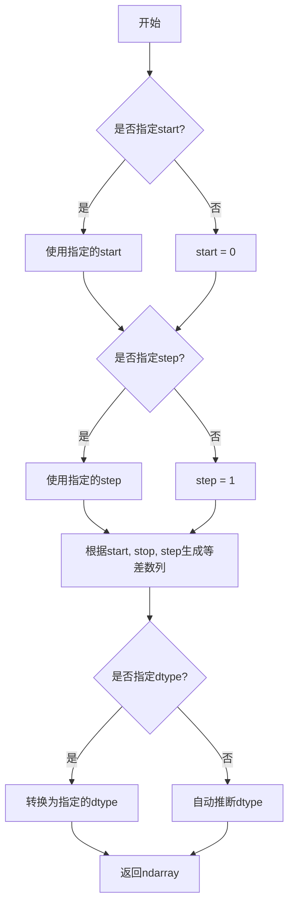

#### 带注释源码

```python
# numpy.arange 函数源码示例（简化版）
def arange(start=0, stop=None, step=1, dtype=None):
    """
    返回等间隔值的数组。
    
    参数:
        start: 起始值，默认为0
        stop: 结束值（不包含）
        step: 步长，默认为1
        dtype: 输出数组的数据类型
    
    返回:
        ndarray: 等差数组
    """
    
    # 处理只有一个参数的情况，此时第一个参数被视为stop
    if stop is None:
        stop = start
        start = 0
    
    # 根据参数个数和类型推断数据类型
    if dtype is None:
        # 分析start, stop, step的类型来确定输出类型
        dtype = _find_common_dtype(start, stop, step)
    
    # 计算数组长度
    # 公式: ceil((stop - start) / step)
    num = math.ceil((stop - start) / step)
    
    # 创建数组
    # 使用C语言实现以提高性能
    array = np.empty(num, dtype=dtype)
    
    # 填充等差值
    for i in range(num):
        array[i] = start + i * step
    
    return array
```

#### 在示例代码中的使用

```python
# 示例代码中的实际使用
x = np.arange(5)
# 输出: array([0, 1, 2, 3, 4])
# 创建从0开始，到5（不包含）结束的整数数组，步长默认为1
```

---

### 补充信息

| 项目 | 说明 |
|------|------|
| **函数位置** | `numpy.arange` |
| **所属模块** | `numpy` |
| **设计目标** | 提供一种快速创建等差数组的方式，是NumPy中最常用的数组创建函数之一 |
| **约束条件** | 当step为非整数时，由于浮点精度问题，数组长度可能与预期略有差异 |
| **错误处理** | 当step为0时抛出`ValueError`；当start>=stop且step>0时返回空数组 |
| **性能优化** | 内部使用C语言实现，比纯Python的`range()`转list更高效 |


### `np.random.randint`

生成随机整数，用于从指定范围内返回随机整数值。在代码中用于生成两组随机整数数组作为柱状图的数据。

参数：

- `low`：`int`，随机整数的下界（包含）
- `high`：`int`，随机整数的上界（不包含）
- `size`：`tuple of ints`，输出数组的形状，代码中为 `(2, 5)` 表示生成 2 行 5 列的数组
- `dtype`：`dtype`，可选，返回值的数据类型，默认为 `int`

返回值：`ndarray`，形状为 `size` 的随机整数数组

#### 流程图

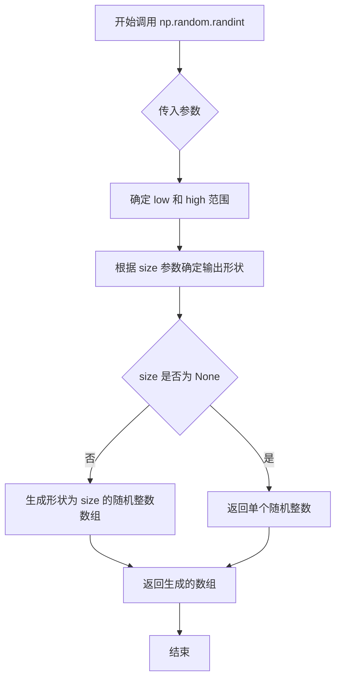

#### 带注释源码

```python
# 代码中的实际调用
y1, y2 = np.random.randint(1, 25, size=(2, 5))

# 参数说明：
# low=1: 下界，包含1（最小可能值为1）
# high=25: 上界，不包含25（最大可能值为24）
# size=(2, 5): 输出形状为2行5列的二维数组
# 返回值: 形状为(2, 5)的二维数组，包含随机整数

# 内部实现逻辑（简化版）：
# 1. 确定随机数范围 [low, high)
# 2. 根据 size 参数决定输出形状
# 3. 使用均匀分布从指定范围生成随机整数
# 4. 返回生成的整数或整数数组
```


### `ax3.bar()`

绘制柱状图是matplotlib中用于展示分类数据数值的核心方法。该函数接受x位置、高度、宽度等参数，在指定的坐标轴上创建矩形柱子来表示数据，支持单个序列或多个分组的柱状图展示。

参数：

- `x`：float或array-like，柱子的x坐标位置，可以是单个值或数组
- `height`：float或array-like，柱子的高度，决定每个柱子代表的数值大小
- `width`：float或array-like，柱子的宽度，默认为0.8，可为单个值或数组
- `bottom`：float或array-like，柱子的底部y坐标起点，默认为0，控制柱子的垂直起始位置
- `align`：str，柱子对齐方式，'center'（居中对齐）或'edge'（边缘对齐），默认'center'
- `**kwargs`：其他关键字参数，包括color（颜色）、edgecolor（边框颜色）、linewidth（边框宽度）等

返回值：`matplotlib.container.BarContainer`，返回包含所有柱子（Rectangle）对象的容器，可用于访问和操作柱子属性

#### 流程图

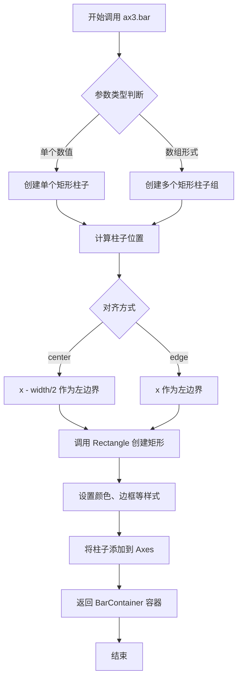

#### 带注释源码

```python
# 示例代码中 ax3.bar() 的两次调用

# 第一次调用：绘制第一组柱状图
# 参数说明：
#   x: np.arange(5) - x轴位置 [0, 1, 2, 3, 4]
#   y1: 第一组随机整数数据，形状为5个元素
#   width: 0.25 - 柱子宽度
ax3.bar(x, y1, width)

# 第二次调用：绘制第二组柱状图（紧邻第一组右侧）
# 参数说明：
#   x + width: 偏移width距离，使第二组柱子位于第一组右侧
#   y2: 第二组随机整数数据
#   width: 0.25 - 与第一组相同的宽度
#   color: 指定颜色，从matplotlib默认颜色循环中获取第3个颜色
ax3.bar(x + width, y2, width,
        color=list(plt.rcParams['axes.prop_cycle'])[2]['color'])

# 设置x轴刻度位置和标签
# 位置: x + width（两组柱子的中心位置）
# 标签: ['a', 'b', 'c', 'd', 'e']
ax3.set_xticks(x + width, labels=['a', 'b', 'c', 'd', 'e'])
```


### `Axes.set_xticks`

设置x轴刻度位置和标签。该方法属于matplotlib库的`Axes`类，用于自定义x轴上的刻度线位置以及对应的刻度标签。

参数：

- `ticks`：`array-like`，刻度位置数组，指定x轴上刻度线的具体位置
- `labels`：`array-like`，可选参数，刻度标签列表，用于指定每个刻度位置显示的文本标签

返回值：`None`，该方法无返回值，直接修改Axes对象的x轴刻度属性

#### 流程图

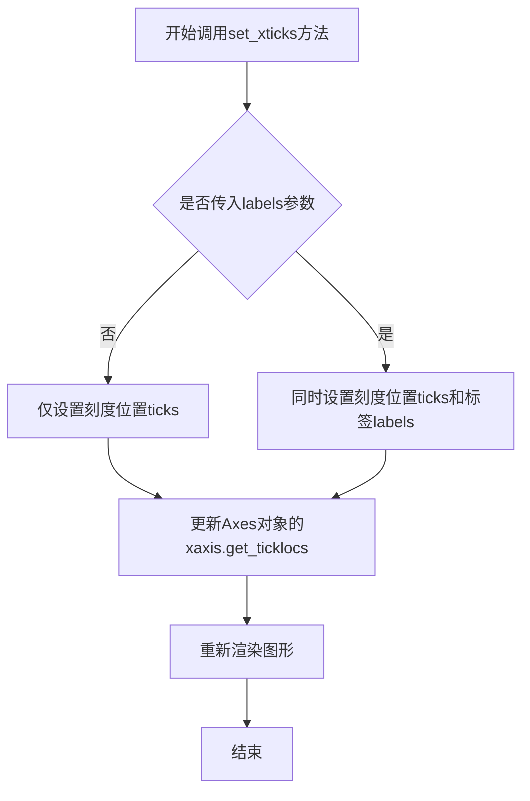

#### 带注释源码

```python
# 定义x轴刻度位置：原始x数组 + 条形宽度
# x = np.arange(5)  # [0, 1, 2, 3, 4]
# width = 0.25
# 所以刻度位置在 [0.25, 1.25, 2.25, 3.25, 4.25]
tick_positions = x + width

# 定义每个刻度位置对应的标签
tick_labels = ['a', 'b', 'c', 'd', 'e']

# 调用set_xticks方法设置x轴刻度
# 第一个参数：刻度位置数组
# 第二个参数labels：可选，设置刻度标签
ax3.set_xticks(tick_positions, labels=tick_labels)
```


### `enumerate()`

该函数是Python内置的枚举函数，用于将一个可迭代对象组合为一个带索引的迭代器，返回包含索引和值的元组。在本代码中用于遍历matplotlib默认颜色周期，并为每个圆形图块分配对应的颜色。

参数：

-  `iterable`：`可迭代对象（Iterable）`，即 `plt.rcParams['axes.prop_cycle']`，这是matplotlib的颜色周期迭代器，包含了默认的颜色配置列表
-  `start`：`整数（int）`，起始索引值，默认为0（代码中未指定，使用默认值）

返回值：`枚举对象（enumerate object）`，返回形式为 (index, value) 的元组，其中 index 是从0开始的整数索引，value 是当前迭代的元素（即颜色字典，包含 'color' 键）

#### 流程图

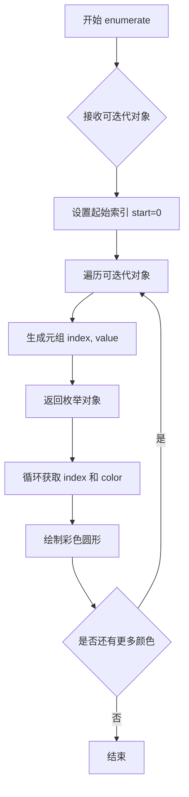

#### 带注释源码

```python
# enumerate() 在本代码中的实际使用方式
# plt.rcParams['axes.prop_cycle'] 返回一个循环迭代器，包含多个颜色配置字典
# enumerate() 将其转换为带索引的迭代器

for i, color in enumerate(plt.rcParams['axes.prop_cycle']):
    """
    参数说明：
    - plt.rcParams['axes.prop_cycle']: 可迭代对象，matplotlib的颜色周期列表
    - enumerate 会自动从 start=0 开始计数
    
    返回值说明：
    - i: 当前索引 (0, 1, 2, ...)
    - color: 当前颜色配置字典，如 {'color': '#1f77b4', ...}
    
    函数执行逻辑：
    1. enumerate 包装了颜色周期迭代器
    2. 每次循环返回一个 (index, element) 元组
    3. i 捕获索引值，color 捕获颜色字典
    """
    xy = np.random.normal(size=2)  # 生成随机坐标点
    ax4.add_patch(plt.Circle(xy, radius=0.3, color=color['color']))  # 绘制圆形，使用枚举出的颜色
    ax4.axis('equal')  # 设置坐标轴相等
    ax4.margins(0)  # 设置边距

# 等价的显式调用形式（更清晰展示enumerate的工作原理）
color_cycle = plt.rcParams['axes.prop_cycle']
enumerated_cycle = enumerate(color_cycle, start=0)  # 显式指定起始索引

# 模拟enumerate的内部实现逻辑
def custom_enumerate(iterable, start=0):
    """
    enumerate 的简化模拟实现：
    1. 接收可迭代对象和起始索引
    2. 使用 iter() 获取迭代器
    3. 循环生成 (index, value) 元组
    """
    index = start
    iterator = iter(iterable)
    while True:
        try:
            value = next(iterator)
            yield (index, value)  # 生成器方式返回元组
            index += 1
        except StopIteration:
            break

# 在本代码上下文中的调用层级
# plt.style.use('ggplot') --> 设置matplotlib样式
# plt.rcParams['axes.prop_cycle'] --> 获取颜色周期（可迭代对象）
# enumerate(...) --> 包装为带索引的枚举对象
# for 循环 --> 逐个遍历获取颜色绘制圆形
```


### `matplotlib.axes.Axes.add_patch()`

在 matplotlib 中，`add_patch()` 是 Axes 类的一个方法，用于将图形补丁（Patch 对象）添加到坐标轴中。在给定的代码示例中，该方法用于将随机生成的圆形补丁添加到 `ax4` 子图中，每个圆形使用默认颜色循环中的颜色。

参数：

-  `p`：`matplotlib.patches.Patch`，要添加到坐标轴的图形补丁对象（如 Circle、Rectangle、Polygon 等）

返回值：`matplotlib.patches.Patch`，返回已添加到坐标轴的补丁对象（与输入的 p 相同），便于链式调用或进一步操作。

#### 流程图

```mermaid
graph TD
    A[开始 add_patch] --> B{验证 p 是否为 Patch 实例}
    B -->|是| C[调用 p.set_axes&#40;self&#41; 设置所属坐标轴]
    C --> D[将 p 添加到 self.patches 列表]
    D --> E[调用 self.autoscale_view&#40;&#41; 自动调整视图]
    E --> F[调用 self.stale_callback&#40;p&#41; 标记需要重绘]
    F --> G[返回补丁对象 p]
    B -->|否| H[抛出 TypeError 异常]
```

#### 带注释源码

```python
def add_patch(self, p):
    """
    Add a *p* to the axes; return the patch.

    Parameters
    ----------
    p : `.patches.Patch`

    Returns
    -------
    `.patches.Patch`

    """
    # 验证输入对象是否为 Patch 实例，不是则抛出类型错误
    self._check_class_isinstance(p, mpatch.Patch)
    # 设置补丁对象的所属坐标轴
    p.set_axes(self)
    # 将补丁对象添加到坐标轴的补丁列表中
    self.patches.append(p)
    # 触发自动缩放以适应新添加的补丁
    self.autoscale_view()
    # 标记图形为过期状态，需要重新绘制
    self.stale_callback(p)
    return p
```

#### 代码中的实际使用示例

```python
# 代码片段：使用 add_patch 添加圆形补丁
# 遍历默认颜色循环中的每种颜色
for i, color in enumerate(plt.rcParams['axes.prop_cycle']):
    # 生成随机坐标点 (x, y)
    xy = np.random.normal(size=2)
    # 创建圆形补丁：圆心为 xy，半径 0.3，颜色从循环中获取
    circle = plt.Circle(xy, radius=0.3, color=color['color'])
    # 将圆形补丁添加到 ax4 坐标轴
    ax4.add_patch(circle)

# 设置坐标轴为等比例，确保圆形不变形
ax4.axis('equal')
# 设置边距为 0
ax4.margins(0)
```


### `plt.Circle`

创建圆形补丁对象（Circle Patch），用于在 matplotlib 图表的坐标轴上绘制圆形。该函数是 `matplotlib.patches.Circle` 类的便捷封装，通过 pyplot 接口提供。

参数：

- `xy`：`tuple` 或 `array-like`，圆心坐标，格式为 `(x, y)`，表示圆形中心的横纵坐标位置
- `radius`：`float`，圆的半径，用于指定圆形的大小
- `**kwargs`：`dict`，可选的补丁属性关键字参数，包括 `color`（填充颜色）、`fill`（是否填充）、`alpha`（透明度）、`edgecolor`（边框颜色）、`linewidth`（边框宽度）等

返回值：`matplotlib.patches.Circle`，返回创建的圆形补丁对象，可通过 `ax.add_patch()` 添加到坐标轴中

#### 流程图

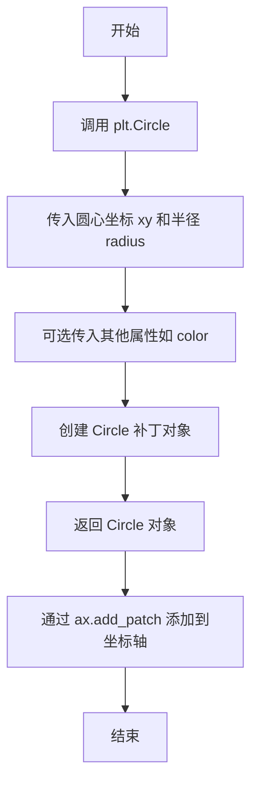

#### 带注释源码

```python
# 从代码中提取的调用示例
for i, color in enumerate(plt.rcParams['axes.prop_cycle']):
    # 生成随机圆心坐标
    xy = np.random.normal(size=2)
    
    # 创建圆形补丁对象
    # 参数说明：
    #   xy: 圆心坐标 (x, y)
    #   radius: 圆的半径大小
    #   color: 圆形的填充颜色
    circle = plt.Circle(
        xy,              # 圆心坐标，tuple 或 array-like
        radius=0.3,      # 半径，float 类型
        color=color['color']  # 颜色，来自默认颜色循环
    )
    
    # 将圆形补丁添加到坐标轴
    ax4.add_patch(circle)

# 设置坐标轴为等比例，确保圆形显示为真实圆形而非椭圆
ax4.axis('equal')
ax4.margins(0)
```


### `ax4.axis()` / `matplotlib.axes.Axes.axis()`

设置坐标轴的属性（如坐标轴范围、纵横比、是否显示坐标轴等）。在此示例中，通过传入字符串 `'equal'` 将坐标轴的纵横比设置为相等，使得 x 轴和 y 轴的单位长度相同，从而确保圆形在视觉上呈现为正圆而非椭圆。

参数：

-  `args`：可变长度位置参数列表（`list`），可以接受以下类型的值：
  - 字符串（`str`），如 `'equal'`（设置相等等纵横比）、`'scaled'`（缩放）、`'tight'`（紧凑）、`'off'`（关闭坐标轴）等
  - 数字（`int`/`float`），如 `xmin`, `xmax`, `ymin`, `ymax` 用于设置坐标轴范围
-  `emit`：`bool`（可选），默认值 `False`，当设置为 `True` 时，如果坐标轴边界发生变化，会触发 `xlims` 或 `ylims` 事件
-  `**kwargs`：可选的关键字参数，用于传递额外的坐标轴设置

返回值：`tuple`，返回坐标轴的当前边界值，格式为 `(xmin, xmax, ymin, ymax)`

#### 流程图

```mermaid
graph TD
    A[调用 ax4.axis&#40;'equal'&#41;] --> B{参数类型判断}
    B -->|字符串 'equal'| C[设置相等的纵横比]
    B -->|数字参数| D[设置坐标轴范围 xmin, xmax, ymin, ymax]
    B -->|无参数| E[返回当前坐标轴边界]
    C --> F[重新计算并渲染图形]
    D --> F
    E --> G[返回元组 &#40;xmin, xmax, ymin, ymax&#41;]
    F --> H[完成]
```

#### 带注释源码

```python
# 在示例代码中的调用方式：
ax4.axis('equal')

# 完整的函数调用形式可能如下（根据 matplotlib 源码结构）：
# ax4.axis(*args, emit=False, **kwargs)

# 参数说明：
# - 'equal' : 字符串参数，使 x 轴和 y 轴的单位长度相同
#   这样可以确保圆形patch在视觉上显示为正圆，
#   而不是由于坐标轴比例不同而产生的椭圆

# 返回值示例（当不传递任何参数时）：
# 返回当前坐标轴边界 (xmin, xmax, ymin, ymax)
# 例如：(-3.0, 3.0, -3.0, 3.0)

# 方法作用：
# 1. 解析传入的参数（字符串或数字）
# 2. 根据参数类型执行相应的坐标轴设置
# 3. 更新坐标轴的纵横比或范围
# 4. 触发必要的重绘以反映变更
```


### `plt.show()`

`plt.show()` 是 matplotlib 库中的顶层函数，用于显示所有当前已创建但尚未显示的图形窗口，将图形渲染到屏幕并进入交互式事件循环。

参数：此函数不接受任何参数。

返回值：`None`，该函数不返回任何值，仅用于图形展示的副作用。

#### 流程图

```mermaid
flowchart TD
    A[开始] --> B{检查是否有打开的图形}
    B -->|是| C[获取当前所有Figure对象]
    C --> D[将图形渲染到显示设备]
    D --> E[显示图形窗口]
    E --> F[进入交互式事件循环]
    F --> G[等待用户交互]
    G --> H[用户关闭窗口]
    H --> I[结束]
    B -->|否| J[无操作，直接返回]
    J --> I
```

#### 带注释源码

```python
# matplotlib.pyplot 模块中的 show() 函数源码（简化版）

def show(*, block=None):
    """
    显示所有打开的图形窗口。
    
    参数:
        block: 控制函数阻塞行为的布尔值或None
               - True: 阻塞并等待窗口关闭
               - False: 非阻塞模式
               - None: 在某些后端下自动选择
    
    返回值:
        None
    """
    # 获取全局图像管理器
    for manager in Gcf.get_all_fig_managers():
        # 检查是否需要阻塞
        if block is None:
            # 默认行为：根据后端决定
            block = _get_block_flag()
        
        # 显示每个图形窗口
        manager.show()
        
        # 如果block为True，则阻塞等待
        if block:
            # 进入事件循环，等待用户交互
            manager._show_block = True
    
    # 刷新所有待渲染的图形
    plt.draw_all()
    
    # 对于某些交互式后端（如Qt、Tkinter等）
    # 会启动事件循环以响应用户操作
    if block:
        # 阻塞主线程直到用户关闭所有窗口
        _backend_show()
```

**注**：实际源码会根据不同后端（Qt、Tkinter、MacOSX等）有不同实现，上述为通用逻辑展示。


## 关键组件


### ggplot样式表

这是代码的核心功能，通过`plt.style.use('ggplot')`应用ggplot样式，模仿R语言中ggplot2包的视觉风格，包括颜色方案、背景色、网格线等设计元素。

### 随机状态固定

使用`np.random.seed(19680801)`固定随机种子，确保代码每次运行产生相同的随机数据，保证结果的可重复性。

### 子图布局系统

使用`plt.subplots(ncols=2, nrows=2)`创建2x2的子图网格布局，通过`axs.flat`将二维数组展平为一维，方便迭代访问各个子图。

### 散点图绘制

利用`ax1.plot(x, y, 'o')`绘制散点图，注意到`plt.scatter`会使用默认颜色循环，而`plot`方法需要显式指定标记样式。

### 正弦曲线族

通过循环遍历颜色循环中的偏移量，绘制多条正弦曲线，每条曲线相对于前一条进行相位偏移，形成色彩渐变效果。

### 柱状图组

使用`ax3.bar()`绘制两组柱状图，通过宽度偏移实现并排显示，并手动从颜色循环中指定第三种颜色。

### 圆形patch添加

使用`ax4.add_patch(plt.Circle(...))`向子图中添加圆形patch，从默认颜色循环中获取颜色，并通过`ax4.axis('equal')`保持纵横比。

### 坐标轴配置

通过`set_xticks()`设置刻度标签，`margins(0)`调整子图边距，`axis('equal')`保持坐标单位一致，这些是matplotlib图表美化的常用配置。

### 默认颜色循环访问

通过`plt.rcParams['axes.prop_cycle']`访问matplotlib的颜色循环配置，这是一个包含颜色字典的迭代器，用于获取连续变化的颜色序列。


## 问题及建议


### 已知问题

- **过时的API使用**：代码中使用了已废弃的`plt.rcParams['axes.prop_cycle']`访问方式，该API在新版本matplotlib中已被弃用，应使用新的颜色循环访问方式。
- **魔法数字硬编码**：代码中包含多个硬编码的数值（如`width = 0.25`、`radius=0.3`、`L = 2*np.pi`），缺乏可配置性，降低了代码的可维护性。
- **重复代码**：多次调用`plt.rcParams['axes.prop_cycle']`访问颜色循环，违反了DRY原则，应提取为局部变量。
- **缺乏资源管理**：代码结束时没有显式调用`plt.close()`释放图形资源，可能导致内存泄漏，尤其在长时间运行的应用程序中。
- **缺少类型注解**：代码没有使用Python类型提示，降低了代码的可读性和IDE支持。
- **无错误处理**：代码未对可能出现的异常（如内存不足、绘图失败等）进行处理，缺乏健壮性。
- **代码封装不足**：所有代码都位于全局作用域，没有封装为函数或类，难以测试和复用。
- **API使用不当**：`ax3.set_xticks(x + width, labels=['a', 'b', 'c', 'd', 'e'])`的参数传递方式在新版本matplotlib中可能产生警告，建议分开设置ticks和labels。
- **迭代器使用问题**：对`plt.rcParams['axes.prop_cycle']`使用`enumerate`会消耗迭代器，若代码逻辑更复杂可能导致问题。

### 优化建议

- **提取配置常量**：将所有硬编码的数值提取为模块级常量或配置字典，提高可维护性。
- **封装为函数**：将绘图逻辑封装为函数，添加参数以提高复用性，并添加类型注解和docstring。
- **更新API使用**：使用`matplotlib.rcParams['axes.prop_cycle']`或直接使用`matplotlib.pyplot.cm`获取颜色循环。
- **添加资源管理**：在代码末尾添加`plt.close(fig)`或使用上下文管理器`with plt.style.context('ggplot'):`。
- **优化颜色获取**：预先提取颜色列表：`colors = [c['color'] for c in plt.rcParams['axes.prop_cycle']]`。
- **添加错误处理**：使用try-except包装可能失败的绘图操作，并添加适当的异常处理。
- **改进set_xticks使用**：将`set_xticks`和`set_xticklabels`分开调用以确保兼容性。
- **考虑类型安全**：为函数参数和返回值添加类型注解，提高代码质量。


## 其它


### 设计目标与约束

本代码旨在演示matplotlib的ggplot风格样式设置，通过四个不同的图表类型（散点图、正弦曲线图、柱状图、圆形图）展示ggplot风格的可视化效果。约束包括：需要matplotlib和numpy依赖库支持，图形渲染依赖后端配置，随机数种子固定以确保可重现性。

### 错误处理与异常设计

代码主要依赖matplotlib和numpy的异常传播。可能的异常包括：ImportError（缺少依赖库）、MatplotlibBackendError（后端配置错误）、ValueError（数组维度不匹配）。当前代码未显式捕获异常，由调用层处理。

### 数据流与状态机

数据流：随机数生成器状态→数据数组→各子图Axes对象→Figure对象→显示渲染。状态机：plt.style.use()设置全局样式→rcParams属性更新→子图创建→绘图命令执行→plt.show()渲染显示。

### 外部依赖与接口契约

外部依赖：matplotlib>=3.0.0、numpy>=1.15.0。接口契约：plt.style.use()接受字符串样式名、plt.subplots()返回(fig, axes)元组、plt.show()触发图形渲染、np.random.seed()确保可重现性。

### 性能考虑

代码执行时间主要消耗在plt.show()渲染阶段。优化方向：使用agg后端避免GUI开销、减少np.random.normal调用次数、预先计算颜色循环数据。

### 安全性考虑

代码不涉及用户输入、文件操作或网络请求，无安全风险。随机数种子固定为19680801为演示目的，不应硬编码在生产环境中。

### 测试策略

测试应验证：ggplot样式正确应用、四子图正确创建、各图表类型渲染无异常、随机种子确保可重现结果、rcParams中axes.prop_cycle存在且有效。

### 版本兼容性

代码兼容matplotlib 3.0+和numpy 1.15+。plt.rcParams['axes.prop_cycle']在matplotlib 3.7+中返回迭代器而非列表，需注意版本差异。

### 部署注意事项

部署时需确保matplotlib后端配置正确（使用TkAgg或Agg），headless环境需设置MPLBACKEND=Agg。plt.show()在非交互式环境中可能阻塞，建议使用fig.savefig()替代。

### 许可证和引用

代码基于matplotlib内置样式，样式配置来源于https://everyhue.me/posts/sane-color-scheme-for-matplotlib/，遵循原项目许可。

    