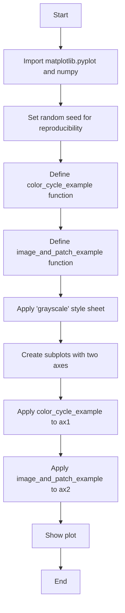
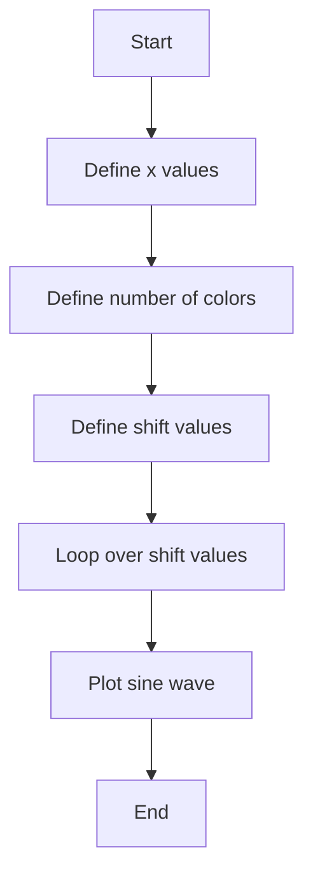
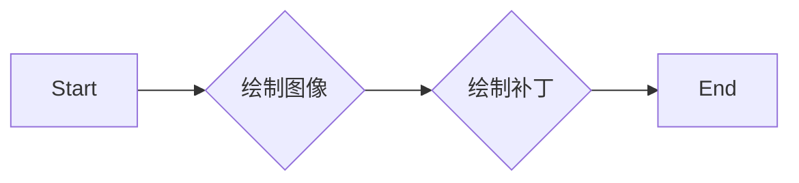
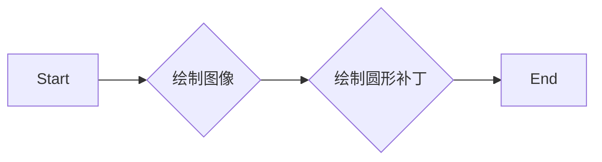

# `matplotlib\galleries\examples\style_sheets\grayscale.py` 详细设计文档

This code demonstrates the application of a 'grayscale' style sheet in matplotlib, which converts all defined colors to grayscale.

## 整体流程



## 类结构

```
matplotlib.pyplot
├── np.random.seed(19680801)
│   ├── color_cycle_example(ax)
│   │   ├── L = 6
│   │   ├── x = np.linspace(0, L)
│   │   ├── ncolors = len(plt.rcParams['axes.prop_cycle'])
│   │   ├── shift = np.linspace(0, L, ncolors, endpoint=False)
│   │   └── for s in shift: ax.plot(x, np.sin(x + s), 'o-')
│   ├── image_and_patch_example(ax)
│   │   ├── ax.imshow(np.random.random(size=(20, 20)), interpolation='none')
│   │   ├── c = plt.Circle((5, 5), radius=5, label='patch')
│   │   └── ax.add_patch(c)
│   └── plt.style.use('grayscale')
└── fig, (ax1, ax2) = plt.subplots(ncols=2)
    └── fig.suptitle('grayscale style sheet')
        └── plt.show()
```

## 全局变量及字段


### `L`
    
Number of intervals for the x-axis in the color cycle example.

类型：`int`
    


### `x`
    
Array of x-axis values for plotting.

类型：`numpy.ndarray`
    


### `ncolors`
    
Number of colors in the color cycle.

类型：`int`
    


### `shift`
    
Array of shift values for the color cycle.

类型：`numpy.ndarray`
    


### `c`
    
Circle patch object for the image and patch example.

类型：`matplotlib.patches.Circle`
    


### `fig`
    
Figure object containing the subplots.

类型：`matplotlib.figure.Figure`
    


### `ax1`
    
Axes object for the first subplot.

类型：`matplotlib.axes._subplots.AxesSubplot`
    


### `ax2`
    
Axes object for the second subplot.

类型：`matplotlib.axes._subplots.AxesSubplot`
    


### `matplotlib.pyplot.np.random.seed(19680801)`
    
Sets the random seed for reproducibility.

类型：`None`
    


### `matplotlib.pyplot.color_cycle_example(ax)`
    
Plots a color cycle example on the given axes object.

类型：`None`
    


### `matplotlib.pyplot.image_and_patch_example(ax)`
    
Plots an image and a circle patch on the given axes object.

类型：`None`
    


### `matplotlib.pyplot.plt.style.use('grayscale')`
    
Applies the 'grayscale' style sheet to the plot.

类型：`None`
    


### `matplotlib.pyplot.fig, (ax1, ax2) = plt.subplots(ncols=2)`
    
Creates a figure with two subplots.

类型：`tuple`
    


### `matplotlib.pyplot.fig.suptitle('grayscale style sheet')`
    
Sets the title of the figure to 'grayscale style sheet'.

类型：`None`
    


### `matplotlib.pyplot.plt.show()`
    
Displays the plot on the screen.

类型：`None`
    
    

## 全局函数及方法


### color_cycle_example(ax)

This function demonstrates the application of a grayscale style sheet by plotting a series of sine waves with colors shifted along a cycle.

参数：

- `ax`：`matplotlib.axes.Axes`，The axes on which to plot the sine waves. This is the axes object where the plot will be drawn.

返回值：`None`，This function does not return any value. It only plots the sine waves on the provided axes.

#### 流程图



#### 带注释源码

```python
def color_cycle_example(ax):
    # Define the number of cycles for the color shift
    L = 6
    x = np.linspace(0, L)
    ncolors = len(plt.rcParams['axes.prop_cycle'])
    shift = np.linspace(0, L, ncolors, endpoint=False)
    
    # Loop over the shift values to plot sine waves with shifted colors
    for s in shift:
        ax.plot(x, np.sin(x + s), 'o-')
```


### image_and_patch_example

该函数在matplotlib的Axes对象上绘制一个随机的图像和一个圆形补丁。

参数：

- `ax`：`matplotlib.axes.Axes`，matplotlib的Axes对象，用于绘制图像和补丁。

返回值：无

#### 流程图



#### 带注释源码

```python
def image_and_patch_example(ax):
    # 绘制一个随机的图像
    ax.imshow(np.random.random(size=(20, 20)), interpolation='none')
    # 创建一个圆形补丁
    c = plt.Circle((5, 5), radius=5, label='patch')
    # 将补丁添加到Axes对象上
    ax.add_patch(c)
``` 


### color_cycle_example(ax)

该函数用于在matplotlib的轴对象上绘制一系列的灰度曲线，以展示matplotlib的"grayscale"样式表如何影响颜色。

参数：

- `ax`：`matplotlib.axes.Axes`，轴对象，用于绘制图形。

返回值：无

#### 流程图

```mermaid
graph LR
A[Start] --> B{Call ax.plot()}
B --> C[End]
```

#### 带注释源码

```python
def color_cycle_example(ax):
    # 定义x轴的值
    L = 6
    x = np.linspace(0, L)
    # 获取颜色周期中颜色的数量
    ncolors = len(plt.rcParams['axes.prop_cycle'])
    # 计算颜色偏移量
    shift = np.linspace(0, L, ncolors, endpoint=False)
    # 遍历每个偏移量，绘制灰度曲线
    for s in shift:
        ax.plot(x, np.sin(x + s), 'o-')
```


### image_and_patch_example(ax)

该函数在matplotlib的Axes对象上绘制一个随机的图像和一个圆形补丁。

参数：

- `ax`：`matplotlib.axes.Axes`，matplotlib的Axes对象，用于绘制图像和补丁。

返回值：无

#### 流程图



#### 带注释源码

```python
def image_and_patch_example(ax):
    ax.imshow(np.random.random(size=(20, 20)), interpolation='none')  # 绘制随机图像
    c = plt.Circle((5, 5), radius=5, label='patch')  # 创建圆形补丁
    ax.add_patch(c)  # 将补丁添加到Axes对象
```


## 关键组件


### 张量索引与惰性加载

张量索引与惰性加载允许在处理大型数据集时，只加载和处理需要的数据部分，从而提高内存使用效率和计算速度。

### 反量化支持

反量化支持使得代码能够处理非整数类型的量化数据，增加了代码的灵活性和适用范围。

### 量化策略

量化策略定义了如何将浮点数数据转换为固定点数表示，以减少模型大小和提高计算效率。


## 问题及建议


### 已知问题

-   {问题1}：代码中使用了 `plt.style.use('grayscale')` 来应用灰色样式表，但这个样式表可能不是由用户定义的，而是由matplotlib内部提供的。如果用户需要自定义灰色样式表，代码需要提供相应的定义。
-   {问题2}：代码中使用了 `np.random.seed(19680801)` 来确保结果的可重复性，这对于调试和演示很有用，但在生产环境中可能不是必需的，并且可能会影响性能。
-   {问题3}：代码中使用了 `plt.rcParams` 来改变全局参数，这可能会影响其他部分的代码，导致难以追踪和调试样式更改的影响。

### 优化建议

-   {建议1}：提供或允许用户定义自定义的灰色样式表，以便更好地控制样式和颜色。
-   {建议2}：在不需要确保结果可重复性的情况下，移除 `np.random.seed(19680801)` 调用，以提高性能。
-   {建议3}：考虑使用局部样式表或上下文管理器来限制样式更改的范围，以避免全局更改可能带来的副作用。
-   {建议4}：在文档中明确说明代码的用途和预期行为，包括样式表的应用和随机种子设置的目的。
-   {建议5}：考虑添加错误处理，以处理可能由于样式表不兼容或配置错误导致的异常情况。


## 其它


### 设计目标与约束

- 设计目标：实现一个灰度样式表，将所有定义为 `.rcParams` 的颜色转换为灰度。
- 约束条件：确保样式表对大多数绘图元素有效，但可能不适用于所有元素。

### 错误处理与异常设计

- 错误处理：在代码中未明确显示错误处理机制，但应确保在调用绘图函数时捕获可能的异常。
- 异常设计：对于不支持的绘图元素，应提供友好的错误消息或默认行为。

### 数据流与状态机

- 数据流：代码从 `np.random.seed` 开始，生成随机数据用于绘图。
- 状态机：代码通过 `plt.style.use('grayscale')` 设置样式，然后创建子图并绘制图形。

### 外部依赖与接口契约

- 外部依赖：代码依赖于 `matplotlib.pyplot` 和 `numpy` 库。
- 接口契约：`color_cycle_example` 和 `image_and_patch_example` 函数定义了与 `ax` 参数的接口契约，该参数是 `matplotlib` 的 `Axes` 对象。


    