# `matplotlib\galleries\examples\style_sheets\petroff10.py` 详细设计文档

This code demonstrates the use of Petroff style sheets for matplotlib plots, which are designed to enhance accessibility and aesthetics in data visualization.

## 整体流程

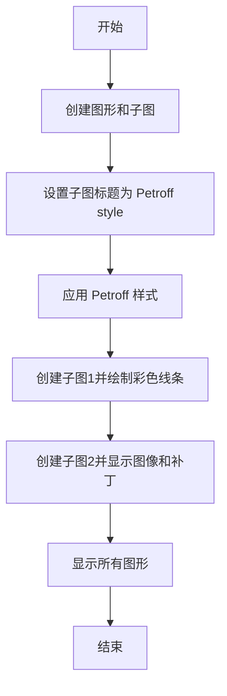

## 类结构

```
fig (图形对象)
├── sfigs (子图对象列表)
│   ├── sfig1 (子图对象)
│   ├── sfig2 (子图对象)
│   └── sfig3 (子图对象)
└── ax1 (轴对象)
    └── ax2 (轴对象)
```

## 全局变量及字段


### `plt`
    
Matplotlib's pyplot module for plotting

类型：`module`
    


### `np`
    
NumPy module for numerical operations

类型：`module`
    


### `plt.rcParams`
    
Matplotlib's rcParams dictionary for configuration parameters

类型：`dict`
    


### `plt.style`
    
Matplotlib's style module for customizing styles

类型：`module`
    


### `fig`
    
Matplotlib's Figure object representing a figure to be displayed

类型：`Figure`
    


### `sfigs`
    
List of subfigures created within the main figure

类型：`list`
    


### `style`
    
Style name to be applied to the subplots

类型：`str`
    


### `ax1`
    
Matplotlib's AxesSubplot object for the first subplot

类型：`AxesSubplot`
    


### `ax2`
    
Matplotlib's AxesSubplot object for the second subplot

类型：`AxesSubplot`
    


### `t`
    
NumPy array of evenly spaced values between -10 and 10

类型：`ndarray`
    


### `nb_colors`
    
Number of colors in the color cycle

类型：`int`
    


### `shifts`
    
NumPy array of shifts for the colored lines

类型：`ndarray`
    


### `amplitudes`
    
NumPy array of amplitudes for the colored lines

类型：`ndarray`
    


### `line`
    
Matplotlib's Line2D object representing a line in the plot

类型：`Line2D`
    


### `point_indices`
    
NumPy array of indices for plotting points on the lines

类型：`ndarray`
    


### `c`
    
Matplotlib's Circle object representing a circle patch

类型：`Circle`
    


### `fig.figsize`
    
Size of the figure in inches

类型：`tuple`
    


### `fig.layout`
    
Layout of the figure

类型：`str`
    


### `fig.subfigures`
    
List of subfigures within the main figure

类型：`list`
    


### `sfig.suptitle`
    
Supplementary title for the subfigure

类型：`str`
    


### `sfig.subplots`
    
AxesSubplot object for the subfigure

类型：`AxesSubplot`
    


### `ax.plot`
    
Matplotlib's Line2D object representing a line in the axes

类型：`Line2D`
    


### `ax.set_xlim`
    
Set the x-limits of the axes

类型：`None`
    
    

## 全局函数及方法


### colored_lines_example(ax)

This function generates a plot with colored lines and points on a given axes object, using a sigmoid function to define the line shape.

参数：

- `ax`：`matplotlib.axes.Axes`，The axes object on which to plot the lines and points.

返回值：`None`，This function does not return any value.

#### 流程图

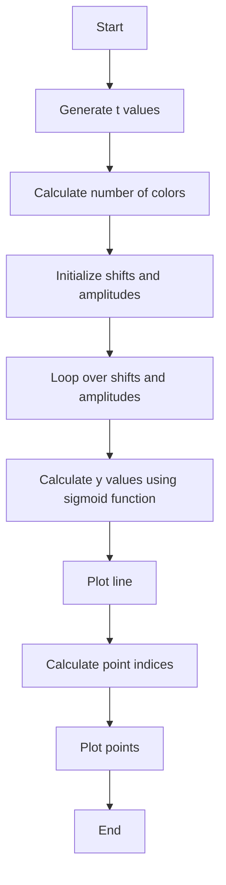

#### 带注释源码

```python
def colored_lines_example(ax):
    # Generate t values
    t = np.linspace(-10, 10, 100)
    # Calculate number of colors
    nb_colors = len(plt.rcParams['axes.prop_cycle'])
    # Initialize shifts and amplitudes
    shifts = np.linspace(-5, 5, nb_colors)
    amplitudes = np.linspace(1, 1.5, nb_colors)
    # Loop over shifts and amplitudes
    for t0, a in zip(shifts, amplitudes):
        # Calculate y values using sigmoid function
        y = a / (1 + np.exp(-(t - t0)))
        # Plot line
        line, = ax.plot(t, y, '-')
        # Calculate point indices
        point_indices = np.linspace(0, len(t) - 1, 20, dtype=int)
        # Plot points
        ax.plot(t[point_indices], y[point_indices], 'o', color=line.get_color())
    # Set x-axis limits
    ax.set_xlim(-10, 10)
```


### image_and_patch_example

This function demonstrates how to display an image and a patch (a shape) on a Matplotlib axes object.

参数：

- `ax`：`matplotlib.axes.Axes`，The axes object on which to display the image and patch.

返回值：`None`，This function does not return any value.

#### 流程图


#### 带注释源码

```python
def image_and_patch_example(ax):
    ax.imshow(np.random.random(size=(20, 20)), interpolation='none') // Display a random image
    c = plt.Circle((5, 5), radius=5, label='patch') // Create a circle patch
    ax.add_patch(c) // Add the patch to the axes
```


### fig.subfigures

`fig.subfigures` 是一个用于创建子图的方法。

参数：

- `nrows`：`int`，指定子图的行数。

返回值：`list`，包含子图对象的列表。

#### 流程图


#### 带注释源码

```python
fig = plt.figure(figsize=(6.4, 9.6), layout='compressed')
sfigs = fig.subfigures(nrows=3)
```

在这段代码中，`fig.subfigures(nrows=3)` 调用会创建一个包含 3 行子图的新图，并返回一个包含这些子图对象的列表 `sfigs`。这些子图对象可以用于添加子图、设置标题等操作。


### `suptitle`

设置子图的总标题。

参数：

- `title`：`str`，子图的总标题。
- `fontweight`：`str`，标题的字体粗细，默认为 'normal'。
- `fontsize`：`int`，标题的字体大小，默认为 12。
- `color`：`str`，标题的颜色，默认为 'black'。
- `horizontalalignment`：`str`，标题的水平对齐方式，默认为 'center'。
- `verticalalignment`：`str`，标题的垂直对齐方式，默认为 'center'。

返回值：`None`

#### 流程图

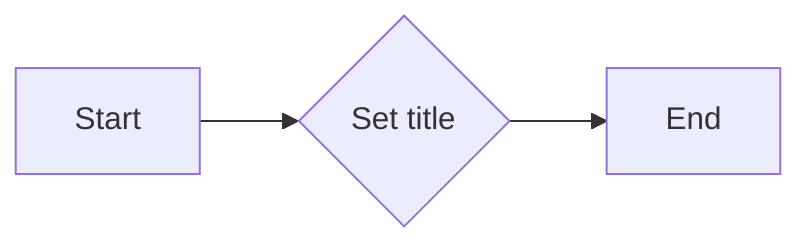

#### 带注释源码

```python
sfig.suptitle(f"'{style}' style sheet")
```


### `colored_lines_example`

展示使用不同颜色线条的示例。

参数：

- `ax`：`matplotlib.axes.Axes`，用于绘图的轴对象。

返回值：`None`

#### 流程图

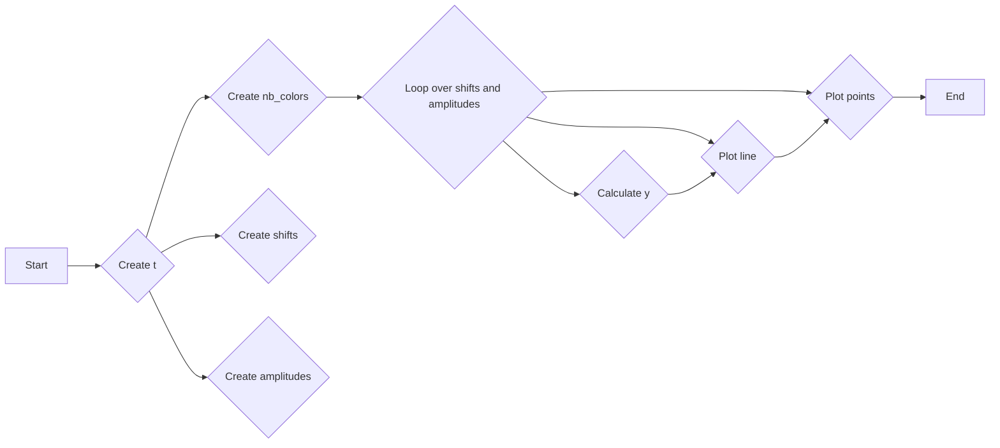

#### 带注释源码

```python
def colored_lines_example(ax):
    t = np.linspace(-10, 10, 100)
    nb_colors = len(plt.rcParams['axes.prop_cycle'])
    shifts = np.linspace(-5, 5, nb_colors)
    amplitudes = np.linspace(1, 1.5, nb_colors)
    for t0, a in zip(shifts, amplitudes):
        y = a / (1 + np.exp(-(t - t0)))
        line, = ax.plot(t, y, '-')
        point_indices = np.linspace(0, len(t) - 1, 20, dtype=int)
        ax.plot(t[point_indices], y[point_indices], 'o', color=line.get_color())
```


### `image_and_patch_example`

展示图像和补丁的示例。

参数：

- `ax`：`matplotlib.axes.Axes`，用于绘图的轴对象。

返回值：`None`

#### 流程图

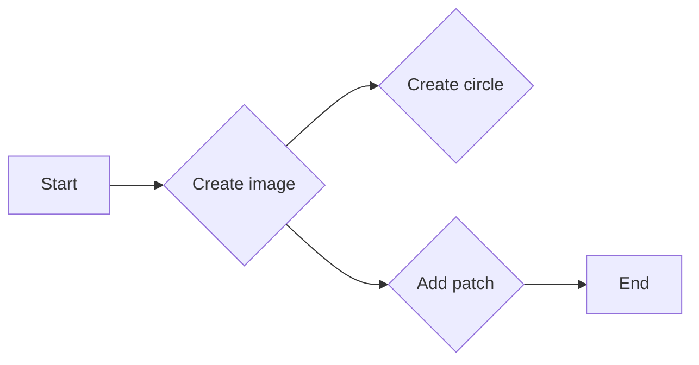

#### 带注释源码

```python
def image_and_patch_example(ax):
    ax.imshow(np.random.random(size=(20, 20)), interpolation='none')
    c = plt.Circle((5, 5), radius=5, label='patch')
    ax.add_patch(c)
```


### fig.subfigures

This function creates a grid of subplots within a figure.

参数：

- `nrows`：`int`，Number of rows of subplots to create.
- ...

返回值：`list`，A list of subplots created.

#### 流程图

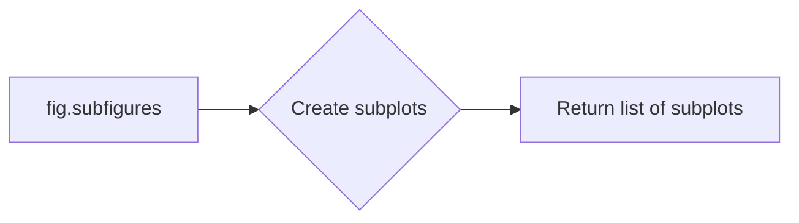

#### 带注释源码

```python
fig = plt.figure(figsize=(6.4, 9.6), layout='compressed')
sfigs = fig.subfigures(nrows=3)
```


### sfig.suptitle

This method sets the title for the subplots figure.

参数：

- `title`：`str`，The title to set for the subplots figure.

返回值：`None`

#### 流程图

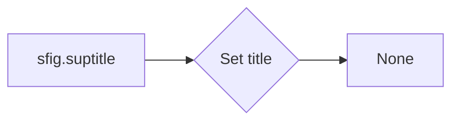

#### 带注释源码

```python
sfig.suptitle(f"'{style}' style sheet")
```


### plt.style.context

This function sets the style context for the current figure and all its axes.

参数：

- `style`：`str`，The style to set.

返回值：`None`

#### 流程图

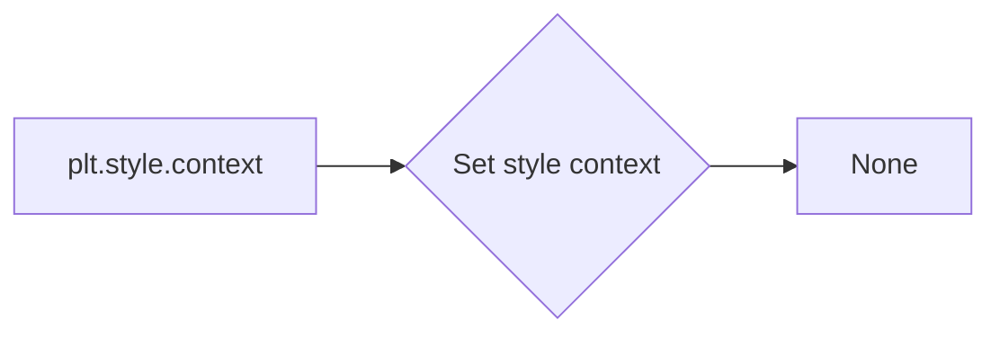

#### 带注释源码

```python
with plt.style.context(style):
```


### sfig.subplots

This method creates a grid of subplots within a subplots figure.

参数：

- `ncols`：`int`，Number of columns of subplots to create.
- ...

返回值：`tuple`，A tuple of subplots created.

#### 流程图

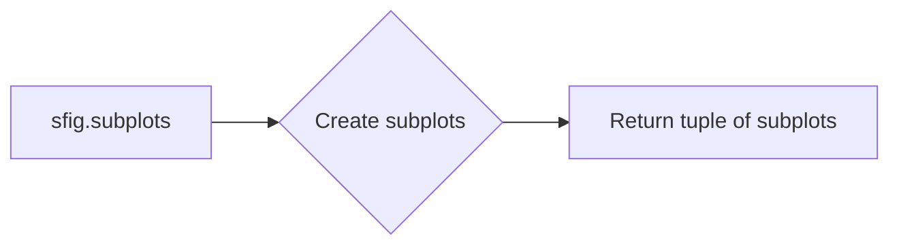

#### 带注释源码

```python
ax1, ax2 = sfig.subplots(ncols=2)
```


### colored_lines_example

This function creates a plot with colored lines and points.

参数：

- `ax`：`matplotlib.axes.Axes`，The axes on which to plot.

返回值：`None`

#### 流程图

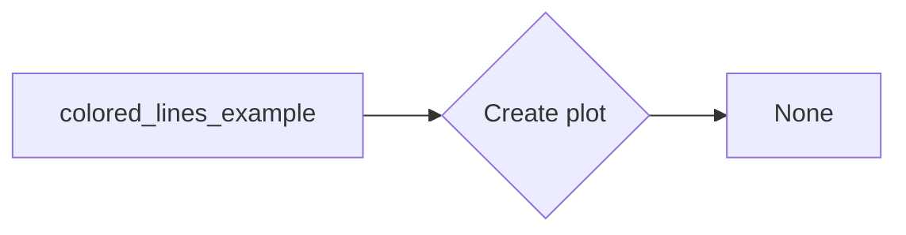

#### 带注释源码

```python
def colored_lines_example(ax):
    t = np.linspace(-10, 10, 100)
    nb_colors = len(plt.rcParams['axes.prop_cycle'])
    shifts = np.linspace(-5, 5, nb_colors)
    amplitudes = np.linspace(1, 1.5, nb_colors)
    for t0, a in zip(shifts, amplitudes):
        y = a / (1 + np.exp(-(t - t0)))
        line, = ax.plot(t, y, '-')
        point_indices = np.linspace(0, len(t) - 1, 20, dtype=int)
        ax.plot(t[point_indices], y[point_indices], 'o', color=line.get_color())
    ax.set_xlim(-10, 10)
```


### image_and_patch_example

This function creates a plot with an image and a patch.

参数：

- `ax`：`matplotlib.axes.Axes`，The axes on which to plot.

返回值：`None`

#### 流程图

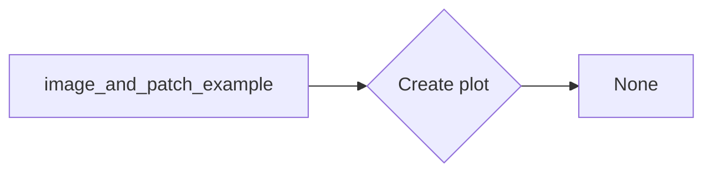

#### 带注释源码

```python
def image_and_patch_example(ax):
    ax.imshow(np.random.random(size=(20, 20)), interpolation='none')
    c = plt.Circle((5, 5), radius=5, label='patch')
    ax.add_patch(c)
```


### fig.imshow

`fig.imshow` is not a defined function in the provided code snippet. However, there is a function named `image_and_patch_example` that uses `imshow` from the `matplotlib.pyplot` module. We will describe this function instead.

#### 描述

The `image_and_patch_example` function demonstrates how to display an image and a patch (shape) on a matplotlib axes object.

#### 参数

- `ax`: `matplotlib.axes.Axes`，The axes object on which to display the image and patch.

#### 返回值

- 无返回值。

#### 流程图

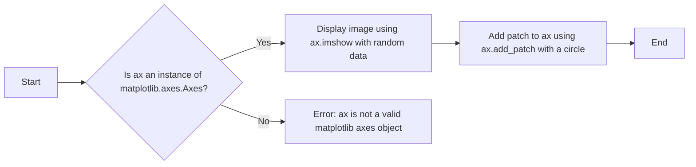

#### 带注释源码

```python
def image_and_patch_example(ax):
    # Display an image using ax.imshow with random data
    ax.imshow(np.random.random(size=(20, 20)), interpolation='none')
    # Create a circle patch with label 'patch'
    c = plt.Circle((5, 5), radius=5, label='patch')
    # Add the patch to the axes object
    ax.add_patch(c)
```


### image_and_patch_example(ax)

This function demonstrates how to add an image and a patch (a circle in this case) to a Matplotlib axes object.

参数：

- `ax`：`matplotlib.axes.Axes`，The axes object to which the image and patch will be added.

返回值：无

#### 流程图

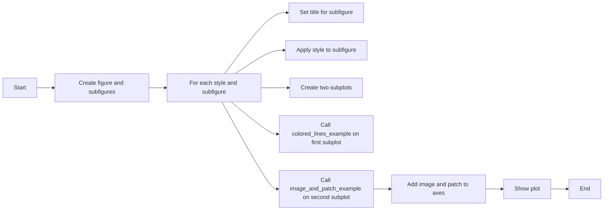

#### 带注释源码

```python
def image_and_patch_example(ax):
    ax.imshow(np.random.random(size=(20, 20)), interpolation='none') // Add a random image to the axes
    c = plt.Circle((5, 5), radius=5, label='patch') // Create a circle patch
    ax.add_patch(c) // Add the patch to the axes
```


### sfig.subplots

`sfig.subplots` 是一个用于创建子图的方法，它允许用户在父图（figure）中创建多个子图（subfigures）。

参数：

- `nrows`：`int`，指定子图行数。
- `ncols`：`int`，指定子图列数。

返回值：`subfigures`，一个包含子图对象的列表。

#### 流程图

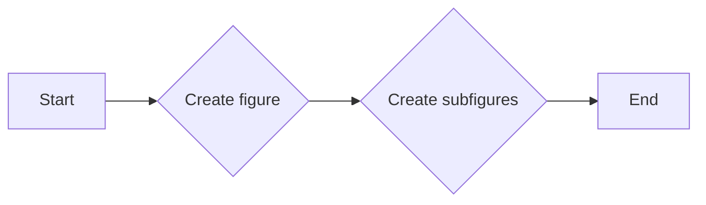

#### 带注释源码

```python
fig = plt.figure(figsize=(6.4, 9.6), layout='compressed')
sfigs = fig.subfigures(nrows=3)
```

在这个例子中，`fig.subfigures(nrows=3)` 创建了一个包含三个子图的父图，每个子图都是通过 `fig.subfigures` 方法调用返回的对象之一。


### colored_lines_example(ax)

This function generates a plot with colored lines and points on a given axes object `ax`. It uses the Petroff style sheets for color sequences.

参数：

- `ax`：`matplotlib.axes.Axes`，The axes object on which to plot the lines and points.

返回值：无

#### 流程图

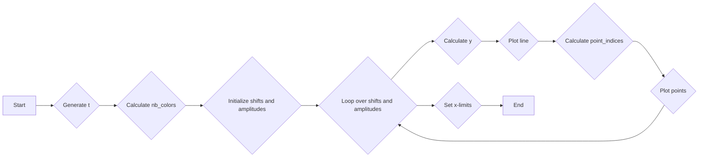

#### 带注释源码

```python
def colored_lines_example(ax):
    t = np.linspace(-10, 10, 100)  # Generate t values
    nb_colors = len(plt.rcParams['axes.prop_cycle'])  # Calculate number of colors
    shifts = np.linspace(-5, 5, nb_colors)  # Initialize shifts
    amplitudes = np.linspace(1, 1.5, nb_colors)  # Initialize amplitudes

    for t0, a in zip(shifts, amplitudes):  # Loop over shifts and amplitudes
        y = a / (1 + np.exp(-(t - t0)))  # Calculate y values
        line, = ax.plot(t, y, '-')  # Plot line
        point_indices = np.linspace(0, len(t) - 1, 20, dtype=int)  # Calculate point indices
        ax.plot(t[point_indices], y[point_indices], 'o', color=line.get_color())  # Plot points

    ax.set_xlim(-10, 10)  # Set x-limits
```


### colored_lines_example(ax)

This function generates colored lines and points on a plot using the Petroff style sheets.

参数：

- `ax`：`matplotlib.axes.Axes`，The axes on which to plot the lines and points.

返回值：无

#### 流程图

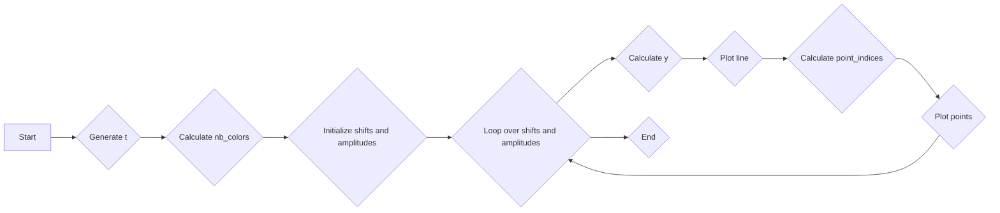

#### 带注释源码

```python
def colored_lines_example(ax):
    # Generate t values
    t = np.linspace(-10, 10, 100)
    # Calculate number of colors
    nb_colors = len(plt.rcParams['axes.prop_cycle'])
    # Initialize shifts and amplitudes
    shifts = np.linspace(-5, 5, nb_colors)
    amplitudes = np.linspace(1, 1.5, nb_colors)
    # Loop over shifts and amplitudes
    for t0, a in zip(shifts, amplitudes):
        y = a / (1 + np.exp(-(t - t0)))
        # Plot line
        line, = ax.plot(t, y, '-')
        # Calculate point_indices
        point_indices = np.linspace(0, len(t) - 1, 20, dtype=int)
        # Plot points
        ax.plot(t[point_indices], y[point_indices], 'o', color=line.get_color())
    # Set x-axis limits
    ax.set_xlim(-10, 10)
```


## 关键组件


### 张量索引与惰性加载

张量索引与惰性加载允许在处理大型数据集时，只计算和存储所需的数据部分，从而提高效率和内存使用。

### 反量化支持

反量化支持使得代码能够处理不同量级的数值，提供更广泛的数值范围和精度。

### 量化策略

量化策略用于优化数值计算，通过减少数值的精度来减少计算量和内存使用。


## 问题及建议


### 已知问题

-   **代码重复**：`colored_lines_example` 和 `image_and_patch_example` 函数在多个子图中被重复调用，这可能导致维护困难。
-   **全局变量**：`plt.rcParams['axes.prop_cycle']` 是一个全局变量，它可能会被其他代码修改，导致不可预测的行为。
-   **硬编码**：代码中硬编码了一些值，如颜色数量、子图数量等，这限制了代码的灵活性和可配置性。

### 优化建议

-   **代码复用**：将 `colored_lines_example` 和 `image_and_patch_example` 函数封装成类或模块，以便在需要时重用。
-   **参数化**：将全局变量 `plt.rcParams['axes.prop_cycle']` 的值作为参数传递给函数，以减少全局状态的影响。
-   **配置文件**：使用配置文件来管理颜色数量、子图数量等参数，这样可以在不修改代码的情况下调整配置。
-   **异常处理**：增加异常处理来确保代码在遇到错误时能够优雅地处理，例如，当 `plt.rcParams['axes.prop_cycle']` 不存在时。
-   **文档化**：为代码添加详细的文档注释，说明每个函数和参数的作用，以便其他开发者更容易理解和使用代码。
-   **单元测试**：编写单元测试来验证代码的功能，确保代码在修改后仍然能够正常工作。


## 其它


### 设计目标与约束

- 设计目标：实现Petroff风格的样式表，用于数据可视化，确保可访问性和美观性。
- 约束条件：遵循matplotlib库的API和风格表规范，确保样式表的可复用性和兼容性。

### 错误处理与异常设计

- 错误处理：在函数调用中捕获可能的异常，如matplotlib绘图库的异常。
- 异常设计：定义自定义异常类，以提供更具体的错误信息。

### 数据流与状态机

- 数据流：从随机数生成到绘图，数据流从numpy数组到matplotlib图形元素。
- 状态机：没有明确的状态机，但函数调用顺序定义了程序的执行流程。

### 外部依赖与接口契约

- 外部依赖：matplotlib和numpy库。
- 接口契约：遵循matplotlib的绘图API和样式表规范。


    