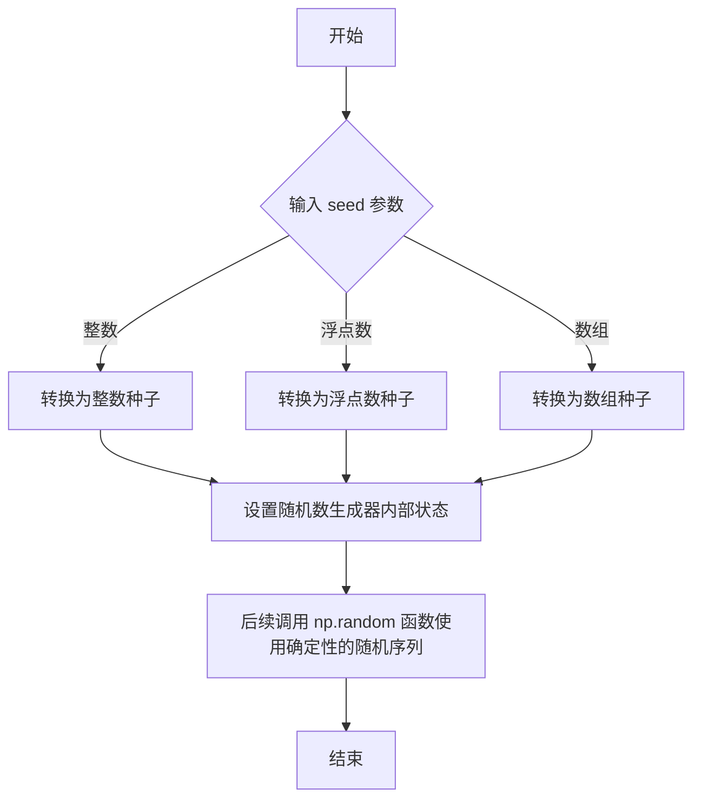
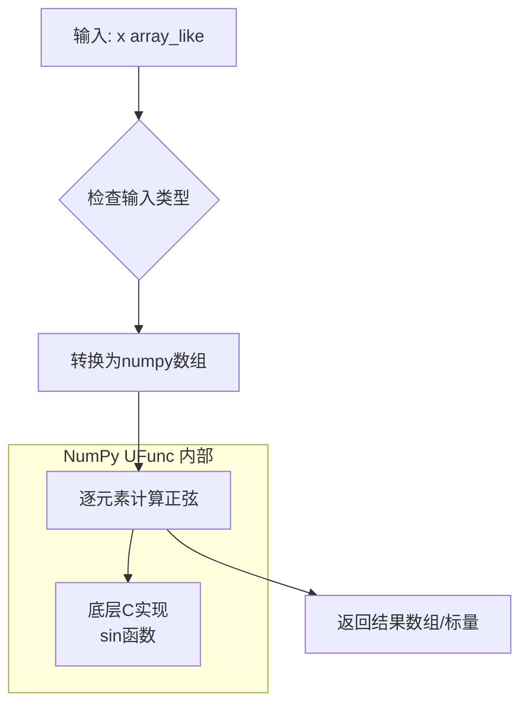
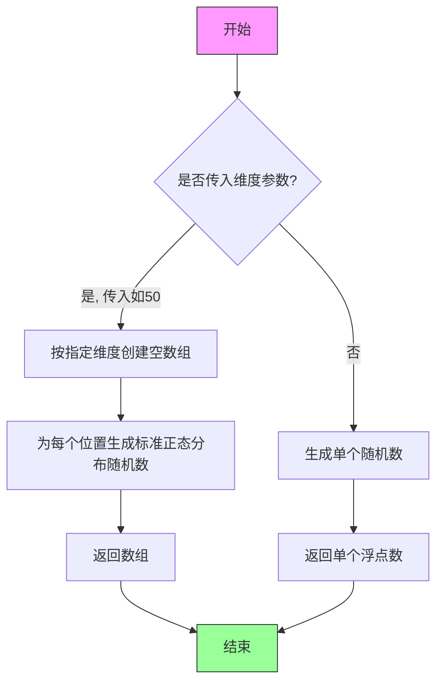
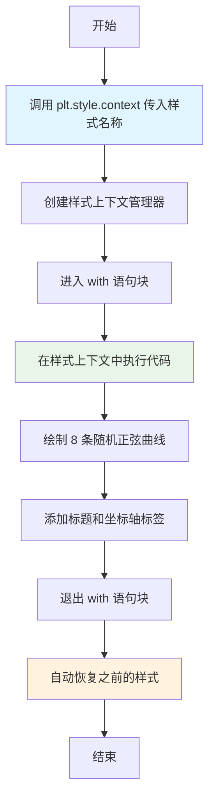
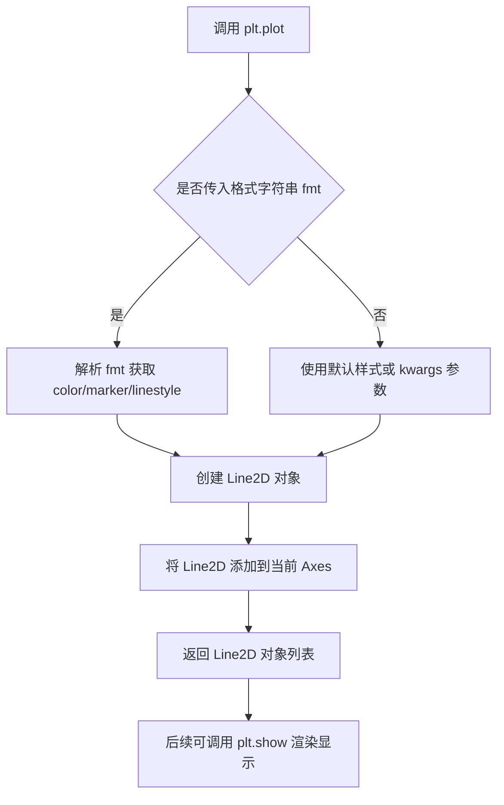
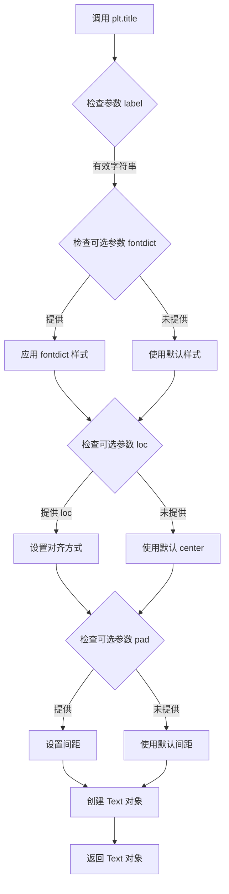
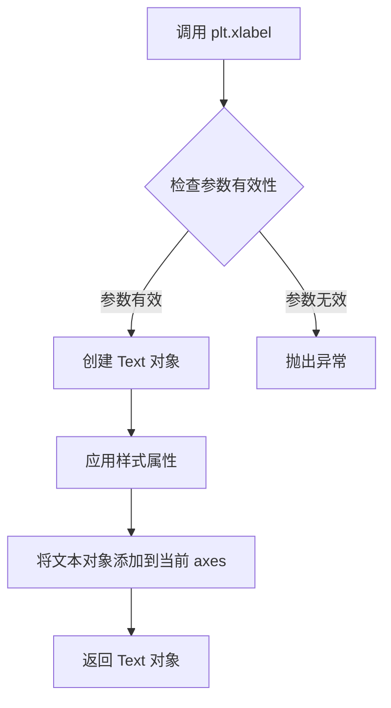
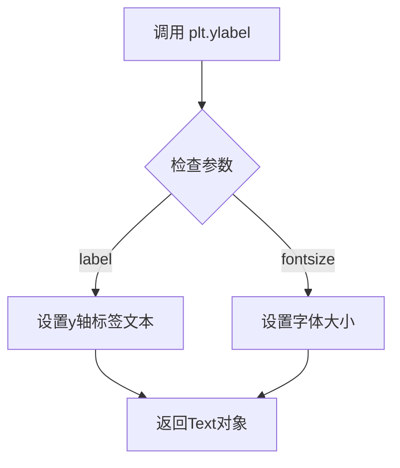
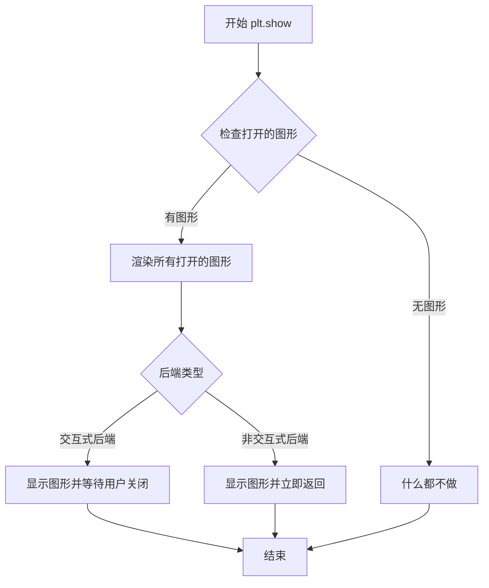

# `matplotlib\galleries\examples\style_sheets\plot_solarizedlight2.py` 详细设计文档

该代码是一个matplotlib可视化示例，通过应用Solarized_Light2样式主题，绑制了8条基于正弦函数和线性函数叠加的随机噪声线图，展示了Solarized调色板在数据可视化中的应用效果。

## 整体流程

```mermaid
graph TD
    A[开始] --> B[导入模块]
    B --> C[设置随机种子]
    B --> D[生成x轴数据]
    D --> E[进入Solarized_Light2样式上下文]
    E --> F1[绑制第1条线: sin(x)+x+random]
    E --> F2[绑制第2条线: sin(x)+2x+random]
    E --> F3[绑制第3条线: sin(x)+3x+random]
    E --> F4[绑制第4条线: sin(x)+4x+random]
    E --> F5[绑制第5条线: sin(x)+5x+random]
    E --> F6[绑制第6条线: sin(x)+6x+random]
    E --> F7[绑制第7条线: sin(x)+7x+random]
    E --> F8[绑制第8条线: sin(x)+8x+random]
    F1 --> G[设置图表标题和轴标签]
    F2 --> G
    F3 --> G
    F4 --> G
    F5 --> G
    F6 --> G
    F7 --> G
    F8 --> G
    G --> H[调用plt.show显示图表]
    H --> I[结束]
```

## 类结构

```
该脚本为扁平结构，无类定义
仅包含模块级代码和全局变量
```

## 全局变量及字段


### `x`
    
从0到10的等间距数组

类型：`numpy.ndarray`
    


### `np`
    
NumPy库别名

类型：`module`
    


### `plt`
    
Matplotlib.pyplot库别名

类型：`module`
    


    

## 全局函数及方法


### `np.random.seed`

设置 NumPy 随机数生成器的种子，以确保后续生成的随机数序列可重现。

参数：

- `seed`：`int` 或 `array_like`，用于初始化随机数生成器的种子值。可以是整数、浮点数或数组形式的种子。

返回值：`None`，该函数不返回任何值，仅修改随机数生成器的内部状态。

#### 流程图



#### 带注释源码

```python
# 设置随机种子为 19680801，确保后续随机数生成可重现
np.random.seed(19680801)

# 生成 50 个标准正态分布的随机数
# 由于上面设置了种子，这里每次运行都会得到相同的随机数序列
random_numbers = np.random.randn(50)

# 示例：绘制带有随机噪声的正弦曲线
# np.sin(x) + x + np.random.randn(50)
# 每次运行程序，这 8 条曲线会完全相同，因为种子已固定
```


### `np.linspace`

生成指定范围内的等间距数组

参数：

- `start`：`float`，序列的起始值
- `stop`：`float`，序列的结束值（当 `endpoint` 为 True 时包含该值）
- `num`：`int`，生成的样本数量，默认为 50
- `endpoint`：`bool`，是否包含结束点，默认为 True
- `retstep`：`bool`，是否返回步长，默认为 False
- `dtype`：`dtype`，输出数组的数据类型，默认为 None（根据 start 和 stop 推断）
- `axis`：`int`，当 num > 1 时，样本存储的轴，默认为 0（仅在新版本 NumPy 中存在）

返回值：`ndarray`，返回值为等间距的数组，如果 `retstep` 为 True，则返回一个元组 `(samples, step)`

#### 流程图

```mermaid
flowchart TD
    A[开始] --> B{参数验证}
    B --> C[计算步长 step = (stop - start) / (num - 1)]
    C --> D[生成等间距数组]
    D --> E{retstep?}
    E -->|True| F[返回元组 samples, step]
    E -->|False| G[仅返回 samples]
    F --> H[结束]
    G --> H
```

#### 带注释源码

```python
def linspace(start, stop, num=50, endpoint=True, retstep=False, dtype=None, axis=0):
    """
    生成指定范围内的等间距数组
    
    参数:
        start: 序列的起始值
        stop: 序列的结束值
        num: 生成的样本数量
        endpoint: 是否包含结束点
        retstep: 是否返回步长
        dtype: 输出数组的数据类型
        axis: 样本存储的轴
    
    返回:
        等间距的数组，或 (数组, 步长) 元组
    """
    # 参数验证和默认值处理
    num = int(num) if num >= 0 else 0
    
    # 计算步长
    if endpoint:
        step = (stop - start) / (num - 1) if num > 1 else 0.0
    else:
        step = (stop - start) / num if num > 0 else 0.0
    
    # 生成数组
    if num == 0:
        sample = np.array([], dtype=dtype)
    elif axis == 0:
        sample = np.arange(num, dtype=dtype) * step + start
    
    # 根据 retstep 决定返回值
    if retstep:
        return sample, step
    return sample
```


### `np.sin`

`np.sin` 是 NumPy 库中的三角函数，用于逐元素计算输入数组（或标量）的正弦值，返回与输入形状相同的数组或标量。

参数：

- `x`：`array_like`，输入数组或标量，角度以弧度表示

返回值：`ndarray` 或 scalar，输入数组元素的正弦值

#### 流程图



#### 带注释源码

```python
# np.sin 是 NumPy 的 универсальная функция (ufunc)
# 底层实现位于 _umath_tests.c 或相关C源码中

# 函数签名: np.sin(x, /, out=None, *, where=True, casting='same_kind', ...)

# 参数说明:
# x: array_like
#     输入数组或标量，单位为弧度
#     例如: 0, np.pi, [0, np.pi/2, np.pi], np.array([0, 1, 2])

# 返回值:
#     y: ndarray
#     与输入形状相同的正弦值数组
#     如果输入是标量，返回标量

# 使用示例:
result = np.sin(0)           # 返回 0.0
result = np.sin(np.pi / 2)   # 返回 1.0
result = np.sin([0, np.pi/2, np.pi])  # 返回 [0. 1. 0.]

# 底层逻辑简述 (Python层面):
def sin_implementation(x):
    """
    简化的Python实现逻辑展示
    实际底层为C语言实现，效率更高
    """
    # 1. 将输入转换为numpy数组 (如果不是数组)
    x_array = np.asarray(x)
    
    # 2. 调用底层C实现的sin函数
    #    使用ufunc机制逐元素计算
    result = np._umath_ufunc_sin(x_array)  # 内部C调用
    
    # 3. 返回结果
    return result

# 关键特性:
# - 支持广播 (broadcasting)
# - 支持向量化和批量操作
# - 返回值类型与输入保持一致
# - 处理无穷大和NaN值
```


### `np.random.randn`

生成符合标准正态分布（均值0，方差1）的随机数。可用于生成单个浮点数或指定维度的随机数组。

参数：

- `*dims`：`int`，可选参数，表示输出数组的维度。若不提供参数，则返回单个随机浮点数；若提供参数（如50），则返回相应维度的随机数组。

返回值：`float` 或 `ndarray`，返回服从标准正态分布的随机数。若传入维度参数，则返回指定形状的数组；若未传参，则返回单个浮点数。

#### 流程图



#### 带注释源码

```python
"""
np.random.randn 函数用法示例（从代码中提取）
"""

# 调用方式 1: 传入参数50，生成50个标准正态分布的随机数
# 这在代码中使用了8次，每次生成不同的随机噪声
random_array = np.random.randn(50)  # 返回形状为(50,)的数组

# 调用方式 2: 多维参数，生成多维数组
random_2d = np.random.randn(5, 10)  # 返回形状为(5, 10)的二维数组

# 调用方式 3: 不传参数，返回单个随机浮点数
single_random = np.random.randn()  # 返回 float

# 代码中的实际使用场景（8条曲线，每条曲线加不同随机噪声）
# np.sin(x) + x + np.random.randn(50)   # 第1条曲线
# np.sin(x) + 2*x + np.random.randn(50) # 第2条曲线
# ... 共8条曲线，使用8次randn(50)
```


### `plt.style.context`

`plt.style.context` 是 matplotlib 库中的一个上下文管理器函数，用于在 `with` 语句块内临时应用指定的样式上下文。该函数接收一个样式名称作为参数，返回一个上下文管理器对象，在代码块执行完毕后自动恢复之前的样式状态。

参数：

- `style`：str，要应用的样式名称（如 'Solarize_Light2'、'ggplot' 等）

返回值：`_StyleContext`（或类似的上下文管理器对象），用于管理样式的临时应用和恢复

#### 流程图



#### 带注释源码

```python
# 导入 matplotlib.pyplot 用于绘图
import matplotlib.pyplot as plt
# 导入 numpy 用于数值计算
import numpy as np

# 修复随机种子以确保可重现性
np.random.seed(19680801)

# 生成从 0 到 10 的等间距数组
x = np.linspace(0, 10)

# 使用 plt.style.context 上下文管理器临时应用 'Solarize_Light2' 样式
# 参数 'Solarize_Light2' 是要应用的样式名称
# 该上下文管理器会在 with 块结束时自动恢复之前的样式
with plt.style.context('Solarize_Light2'):
    # 在样式上下文中绘制 8 条随机线条
    # 每条线都添加了随机噪声 (np.random.randn(50))
    plt.plot(x, np.sin(x) + x + np.random.randn(50))
    plt.plot(x, np.sin(x) + 2 * x + np.random.randn(50))
    plt.plot(x, np.sin(x) + 3 * x + np.random.randn(50))
    plt.plot(x, np.sin(x) + 4 * x + np.random.randn(50))
    plt.plot(x, np.sin(x) + 5 * x + np.random.randn(50))
    plt.plot(x, np.sin(x) + 6 * x + np.random.randn(50))
    plt.plot(x, np.sin(x) + 7 * x + np.random.randn(50))
    plt.plot(x, np.sin(x) + 8 * np.random.randn(50))
    
    # 设置图表标题
    plt.title('8 Random Lines - Line')
    # 设置 x 轴标签，字体大小 14
    plt.xlabel('x label', fontsize=14)
    # 设置 y 轴标签，字体大小 14
    plt.ylabel('y label', fontsize=14)

# 退出 with 块后，样式自动恢复为之前的设置
# 显示最终图表
plt.show()
```


### `plt.plot`

绘制 x 轴与 y 轴数据的折线图，支持多种线型、颜色、标记样式，是 matplotlib 中最基础且常用的绘图函数。

参数：

- `x`：array-like，x 轴数据序列，表示折线的横坐标点
- `y`：array-like，y 轴数据序列，表示折线的纵坐标点，可为多组数据（每组一条线）
- `fmt`：str，可选，格式字符串，如 `'b-'`（蓝色实线）、`'ro'`（红色圆点），用于快速指定颜色、标记和线型
- `**kwargs`：可变关键字参数，支持 Line2D 的所有属性，如 `color`（颜色）、`linewidth`（线宽）、`linestyle`（线型）、`marker`（标记）、`label`（图例标签）等

返回值：`list[matplotlib.lines.Line2D]`，返回绘制的 Line2D 对象列表，每个元素对应一条绘制的折线

#### 流程图



#### 带注释源码

```python
# 代码示例：使用 plt.plot 绘制多条折线
import matplotlib.pyplot as plt
import numpy as np

# 固定随机种子以确保可重复性
np.random.seed(19680801)

# 生成 x 轴数据：从 0 到 10 的等间距数组
x = np.linspace(0, 10)

# 使用 Solarized_Light2 样式上下文
with plt.style.context('Solarize_Light2'):
    # 绘制第1条折线：y = sin(x) + x + 随机噪声
    # 参数 x: x轴数据
    # 参数 np.sin(x) + x + np.random.randn(50): y轴数据（生成50个随机点）
    plt.plot(x, np.sin(x) + x + np.random.randn(50))
    
    # 绘制第2条折线：y = sin(x) + 2x + 随机噪声
    plt.plot(x, np.sin(x) + 2 * x + np.random.randn(50))
    
    # 绘制第3-8条折线，依次增加 x 的系数
    plt.plot(x, np.sin(x) + 3 * x + np.random.randn(50))
    plt.plot(x, np.sin(x) + 4 * x + np.random.randn(50))
    plt.plot(x, np.sin(x) + 5 * x + np.random.randn(50))
    plt.plot(x, np.sin(x) + 6 * x + np.random.randn(50))
    plt.plot(x, np.sin(x) + 7 * x + np.random.randn(50))
    plt.plot(x, np.sin(x) + 8 * np.random.randn(50))
    
    # 设置图表标题
    plt.title('8 Random Lines - Line')
    
    # 设置 x 轴标签，fontsize 指定字体大小
    plt.xlabel('x label', fontsize=14)
    
    # 设置 y 轴标签
    plt.ylabel('y label', fontsize=14)

# 显示绘制的图表
plt.show()
```


### `plt.title`

设置图表的标题，用于在图表顶部显示指定的文本内容，作为图表的标题或描述信息。

参数：

- `label`：`str`，图表的标题文本内容，即将显示在图表顶部的字符串
- `fontdict`：`dict`，可选，用于控制标题样式的字典参数，包含字体大小、颜色、字体家族等属性，默认为 None
- `loc`：`str`，可选，标题的水平对齐方式，可选值为 'center'、'left' 或 'right'，默认为 'center'
- `pad`：`float`，可选，标题与图表顶部边缘之间的间距（以点为单位），默认为 None

返回值：`Text`，返回 matplotlib 的 Text 对象，可用于后续对标题进行进一步的样式设置和属性修改

#### 流程图



#### 带注释源码

```python
# 在代码中调用 plt.title 的具体示例
plt.title('8 Random Lines - Line')  # 设置图表标题为 '8 Random Lines - Line'

# plt.title 函数的标准调用形式（参考 matplotlib 官方文档）
# plt.title(label, fontdict=None, loc='center', pad=None, **kwargs)
# - label: 必需的字符串参数，表示标题文本
# - fontdict: 可选的字典，用于设置字体属性如 {'fontsize': 16, 'fontweight': 'bold'}
# - loc: 可选参数，控制标题对齐方式，默认为 'center'
# - pad: 可选参数，设置标题与图表顶部的间距，单位为点（points）
# 返回值是一个 matplotlib.text.Text 对象，可用于进一步自定义
```


### `plt.xlabel`

设置 x 轴的标签，用于描述 x 轴代表的数据含义。

参数：

- `xlabel`：`str`，x 轴标签的文本内容
- `fontdict`：`dict`，可选，控制文本外观的字典（如字体大小、颜色等）
- `labelpad`：`float`，可选，标签与轴之间的间距
- `**kwargs`：其他关键字参数，传递给 `matplotlib.text.Text` 对象，用于自定义文本样式（如 `fontsize`、`color` 等）

返回值：`matplotlib.text.Text`，返回创建的文本对象，可以进一步用于设置属性

#### 流程图



#### 带注释源码

```python
# 在给定代码中的调用示例
plt.xlabel('x label', fontsize=14)

# 解释：
# - 'x label'：xlabel 参数，类型 str，设置 x 轴的显示文本
# - fontsize=14：作为 **kwargs 传递，设置字体大小为 14 磅
# - 返回值：Text 对象，但在此示例中未捕获
```


### `plt.ylabel`

设置当前 Axes 的 y 轴标签。

参数：

- `label`：`str`，要显示的 y 轴标签文本
- `fontsize`：`int`（可选），字体大小，代码中设置为 14

返回值：`Text`，返回创建的文本对象

#### 流程图



#### 带注释源码

```python
# 设置y轴标签，字体大小为14
plt.ylabel('y label', fontsize=14)
```

---

### 整体代码分析

#### 一段话描述

该代码是一个 matplotlib 可视化示例，演示了如何使用 Solarized Light 样式主题绑制多条正弦叠加线性随机曲线，并设置坐标轴标签。

#### 文件的整体运行流程

1. 导入 matplotlib.pyplot 和 numpy 库
2. 设置随机种子以确保可重现性
3. 生成 x 轴数据点（0到10的等间距数组）
4. 使用 `plt.style.context('Solarize_Light2')` 临时应用 Solarized Light 样式
5. 在样式上下文中绑制8条随机曲线（正弦函数 + 线性函数 + 随机噪声）
6. 设置图表标题和坐标轴标签
7. 调用 `plt.show()` 显示图表

#### 类的详细信息

该代码主要使用 matplotlib 库，属于命令式编程风格，没有定义自定义类。主要使用的 API：

- `plt.style.context()`：样式上下文管理器
- `plt.plot()`：绑制线条
- `plt.title()`：设置标题
- `plt.xlabel()`：设置 x 轴标签
- `plt.ylabel()`：设置 y 轴标签
- `plt.show()`：显示图表

#### 关键组件信息

- **Solarize_Light2 样式**：matplotlib 内置的 Solarized 主题样式，特点是使用柔和的颜色配
- **numpy.random**：生成随机噪声数据
- **matplotlib.pyplot**：MATLAB 风格的绘图接口

#### 潜在的技术债务或优化空间

1. **魔法数字**：随机噪声使用 `np.random.randn(50)`，50 这个数字应提取为常量
2. **重复代码**：8条曲线的绑制代码重复，可使用循环简化
3. **样式硬编码**：字体大小 14 可以提取为配置常量
4. **缺少图例**：多条曲线没有添加图例说明

#### 其它项目

- **设计目标**：展示 Solarized Light 样式的颜色方案效果
- **约束**：依赖 matplotlib 和 numpy 库
- **错误处理**：无显式错误处理
- **数据流**：numpy 生成数值数据 → matplotlib 渲染可视化


### `plt.show`

显示所有通过 matplotlib 创建的打开的图形窗口。在交互式使用中，此函数会阻塞程序的执行，直到用户关闭图形窗口（在某些后端中），或者在非交互式后端中渲染并显示图形。

参数：

- 无参数

返回值：`None`，无返回值

#### 流程图



#### 带注释源码

```python
# plt.show() 的典型实现逻辑（简化版）
def show():
    """
    显示所有打开的图形窗口。
    
    此函数的具体行为取决于所使用的 matplotlib 后端：
    - 在交互式后端（如 TkAgg, Qt5Agg）中，会显示图形并阻塞程序执行，
      直到用户关闭所有图形窗口
    - 在非交互式后端（如 agg, svg）中，会将图形渲染到输出设备并立即返回
    """
    # 获取当前所有的打开的图形对象
    all_open_figures = get_figreg().values()
    
    if not all_open_figures:
        # 如果没有打开的图形，直接返回
        return
    
    # 对每个打开的图形进行显示操作
    for figure in all_open_figures:
        # 调用后端的显示方法
        figure.canvas.show()
    
    # 根据后端类型决定是否阻塞
    if is_interactive_backend():
        # 在交互式后端中，可能需要调用 mainloop 来启动事件循环
        # 这会阻塞程序直到用户关闭图形
        import matplotlib._pyplot as _pyplot
        _pyplot.show()
    else:
        # 在非交互式后端中，立即返回
        pass
    
    return None  # plt.show() 不返回任何值
```

**说明**：这是对 `plt.show()` 工作原理的概念性说明。实际的实现位于 matplotlib 的后端代码中，具体行为会因所选择的后端（如 Qt、Tk、agg 等）而有所不同。在给定的示例代码中，`plt.show()` 负责显示通过 `plt.plot()` 创建的所有线条图形以及通过 `plt.title()` 和 `plt.xlabel()`/`plt.ylabel()` 设置的标题和标签。

## 关键组件


### Solarized_Light 样式表

该代码使用Matplotlib的样式上下文管理器临时应用"Solarized_Light2"主题，该主题模仿Solarized调色板的8种强调色，用于可视化图表的渲染。

### NumPy 数据生成模块

使用numpy库的linspace函数生成0到10的等间距数组，并使用random.randn生成正态分布的随机噪声数据，用于图表的y轴数据。

### Matplotlib 图表绘制模块

使用plt.plot函数绘制8条不同颜色的正弦加线性组合曲线，并通过plt.title、plt.xlabel、plt.ylabel设置图表标题和坐标轴标签。

### 随机状态固定机制

通过np.random.seed(19680801)设置随机种子，确保每次运行代码时生成的随机数序列相同，保证结果的可重现性。

### 样式上下文管理器

plt.style.context('Solarized_Light2')作为上下文管理器，在with块内临时改变matplotlib的默认样式，块执行完毕后自动恢复原始样式。


## 问题及建议


### 已知问题

- **随机数据维度不一致**：`x = np.linspace(0, 10)` 默认生成50个点，但代码中混用了 `np.random.randn(50)`，导致数据长度不匹配可能引起警告或错误
- **TODO未完成**：代码中标注的TODO项（alpha值和布局规则）至今未实现，属于遗留技术债务
- **缺乏代码封装**：所有代码平铺在全局作用域，没有封装为可复用的函数或类，导致代码复用性差
- **硬编码配置过多**：颜色数量（8）、字体大小（14）等参数硬编码在代码中，扩展性差
- **缺少文档**：文件头部虽有模块文档，但缺少函数/脚本级别的文档说明
- **随机种子范围不明确**：`np.random.seed(19680801)` 设置了种子但未说明选择此值的意义

### 优化建议

- 将数据生成和绘图逻辑封装为函数，接收参数（如线条数量、样式名称）以提高复用性
- 统一数据生成方式，使用 `np.random.randn(len(x))` 确保维度一致
- 将配置参数（颜色数、字体大小等）提取为常量或配置文件
- 实现TODO中的alpha值建议（0.33或0.5用于柱状图/堆叠图）
- 添加类型注解和详细的文档字符串，说明函数用途、参数和返回值
- 考虑使用面向对象方式封装图表样式和布局规则，提升可维护性

## 其它


### 设计目标与约束

本代码示例的主要目标是演示如何使用matplotlib的Solarized_Light样式来绘制多条随机线图。约束条件包括：使用numpy生成随机数据，依赖matplotlib的style.context上下文管理器来应用样式，以及确保图表能够正确显示中文（虽然本例中使用英文标签）。

### 错误处理与异常设计

本代码较为简单，未包含复杂的错误处理机制。潜在错误包括：1) np.random.randn(50)可能产生异常值影响图表美观；2) plt.style.context('Solarize_Light2')可能因样式名称错误而失败；3) plt.show()在无图形后端环境下可能抛出异常。改进建议：添加异常捕获机制，对随机种子和数据进行边界检查。

### 数据流与状态机

数据流：np.random.seed(19680801) → 固定随机种子 → np.linspace(0,10)生成x轴数据 → np.sin(x)+x+np.random.randn(50)生成8组y轴数据 → plt.plot()绑定数据到图形 → plt.show()渲染显示。状态机：初始化状态（导入库）→ 数据准备状态（生成x、y数据）→ 绘图状态（调用plot）→ 显示状态（show）

### 外部依赖与接口契约

主要依赖：1) matplotlib.pyplot库，提供绘图API；2) numpy库，提供数值计算功能。接口契约：plt.style.context()接受样式名称字符串，np.linspace()接受起始值、终止值和样本数，np.random.randn()接受样本数整数。版本要求：matplotlib 1.4+（支持style.context），numpy 1.0+。

### 性能要求与指标

本示例为一次性脚本，无严格性能要求。优化空间：1) np.sin(x)可预先计算一次而非8次重复计算；2) 可使用plt.figure()创建单图对象避免全局状态；3) 随机数据生成可向量化减少循环。预期渲染时间在现代硬件上应小于1秒。

### 安全性考虑

代码不涉及用户输入、网络请求或文件操作，无明显安全风险。但np.random.seed()使用固定值可能导致可预测性，在安全相关应用中应使用更安全的随机数生成器。plt.show()在某些环境可能阻塞，需考虑非交互式后端。

### 配置与参数化

当前代码硬编码了多个参数：样式名称'Solarized_Light2'、随机种子19680801、线数量8条、数据点数量50。改进建议：将这些值提取为配置常量或命令行参数，提高代码复用性。颜色数量常量应从8改为可配置值以适应不同场景。

### 可测试性分析

代码可测试性较低，因其包含大量副作用（全局plt状态）和随机性。测试建议：1) 封装绘图逻辑为可测试函数；2) 使用pytest fixture模拟plt对象；3) 对随机数据生成进行参数化测试；4) 添加图像比对测试（baseline）验证输出正确性。

### 代码组织与模块化

当前代码为单文件脚本，耦合度较高。改进建议：1) 将样式配置分离到独立配置模块；2) 数据生成逻辑封装为函数；3) 绘图逻辑封装为独立函数接受数据参数；4) 考虑面向对象设计，创建PlotGenerator类管理绘图状态。

### 扩展性与未来考虑

扩展方向：1) 支持自定义颜色数量和线数量；2) 支持不同图表类型（柱状图、散点图等）；3) 支持导出为图片文件而非仅显示；4) 支持动画模式；5) 添加图例和网格。可使用matplotlib的rcParams进行全局样式定制，支持Sphinx文档集成用于技术文档展示。

    