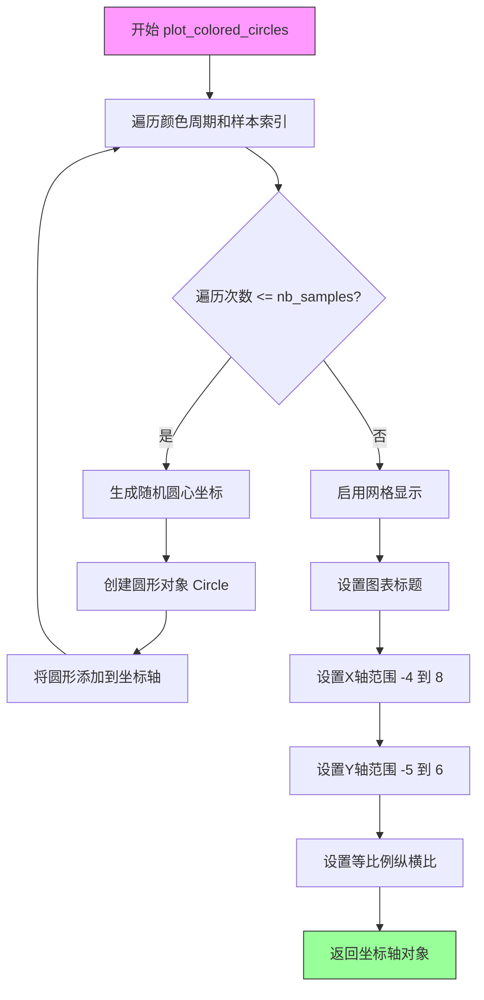
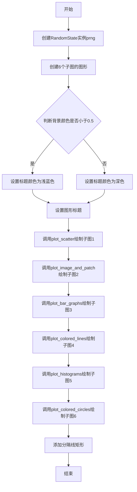
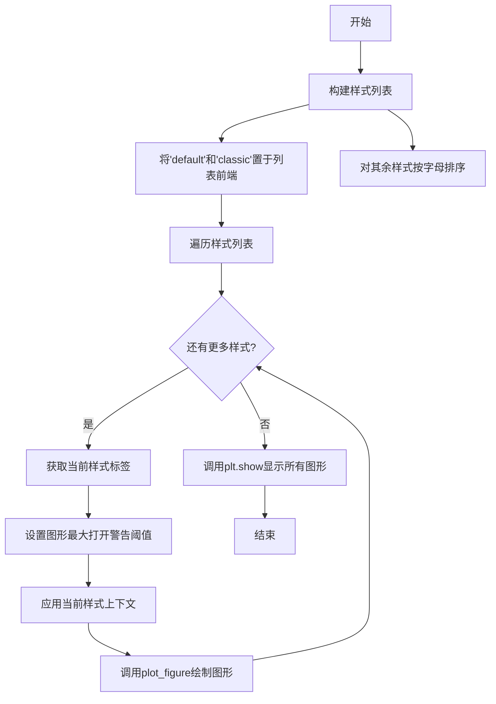

# `matplotlib\galleries\examples\style_sheets\style_sheets_reference.py` 详细设计文档

这是一个Matplotlib样式表示例脚本，用于演示matplotlib中所有可用的样式表（style sheets），通过创建包含散点图、图像、柱状图、线条图和直方图等多种图表的复合图形来展示不同样式的视觉效果。

## 整体流程

```mermaid
graph TD
    A[开始] --> B[设置随机种子 np.random.seed(19680801)]
    B --> C[定义7个绘图函数]
    C --> D[plot_scatter - 散点图]
    C --> E[plot_colored_lines - 彩色线条]
    C --> F[plot_bar_graphs - 柱状图]
    C --> G[plot_colored_circles - 彩色圆圈]
    C --> H[plot_image_and_patch - 图像和圆形补丁]
    C --> I[plot_histograms - 直方图]
    D --> J[定义主函数 plot_figure]
    J --> K[创建RandomState实例确保可复现性]
    J --> L[创建6个子图的Figure对象]
    J --> M[根据背景色设置标题颜色]
    J --> N[依次调用6个绘图函数填充子图]
    J --> O[添加分隔线]
    O --> P[主程序：构建样式列表]
    P --> Q[遍历每个样式]
    Q --> R[使用plt.style.context应用样式]
    R --> S[调用plot_figure绘制图形]
    S --> T[plt.show显示所有图形]
```

## 类结构

```
Python脚本（无类定义）
├── 辅助函数模块
│   ├── plot_scatter
│   ├── plot_colored_lines
│   ├── plot_bar_graphs
│   ├── plot_colored_circles
│   ├── plot_image_and_patch
│   ├── plot_histograms
│   └── plot_figure
└── 主程序入口
```

## 全局变量及字段


### `np.random.seed(19680801)`
    
随机种子，用于确保可复现性

类型：`int`
    


    

## 全局函数及方法


### `plot_scatter`

该函数是 Matplotlib 样式表示例脚本中的核心绘图函数之一，用于在给定的 Axes 对象上绘制两组具有不同分布参数（均值、标准差）和标记样式的散点图，并设置图表的 X 轴标签和标题，最终返回更新后的 Axes 对象以支持链式调用。

参数：

- `ax`：`matplotlib.axes.Axes`，Matplotlib 的坐标轴对象，用于承载本次绘制的图形。
- `prng`：`numpy.random.RandomState`，NumPy 的随机数生成器实例，用于生成符合特定分布（正态分布）的随机样本数据。
- `nb_samples`：`int`（默认值：100），整数类型，表示从每个分布中抽取的样本数量，控制在图中绘制的数据点密度。

返回值：`matplotlib.axes.Axes`，返回传入的 `ax` 对象。这允许调用者直接在 `plot_figure` 等函数中调用此函数而无需捕获返回值，同时也方便了调用者获取修改后的 Axes 实例进行后续操作。

#### 流程图

```mermaid
flowchart TD
    Start([开始 plot_scatter]) --> Input[输入参数: ax, prng, nb_samples]
    Input --> Loop{遍历 [(mu, sigma, marker)] 列表}
    
    Loop -->|第一次迭代| GenerateData[使用 prng.normal 生成 x, y 数据]
    GenerateData --> PlotScatter[调用 ax.plot 绘制散点, ls='none']
    PlotScatter --> LoopCheck{列表是否遍历完毕}
    
    LoopCheck -->|否, 第二次迭代| GenerateData
    LoopCheck -->|是, 遍历完毕| SetLabels[设置轴标签: ax.set_xlabel; 设置标题: ax.set_title]
    
    SetLabels --> ReturnAx[返回 ax 对象]
    ReturnAx --> End([结束])
```

#### 带注释源码

```python
def plot_scatter(ax, prng, nb_samples=100):
    """Scatter plot."""
    # 遍历两组长参数：均值(mu), 标准差(sigma), 标记类型(marker)
    # 第一组：均值-0.5, 标准差0.75, 圆形标记'o'
    # 第二组：均值0.75, 标准差1.0, 方形标记's'
    for mu, sigma, marker in [(-.5, 0.75, 'o'), (0.75, 1., 's')]:
        # 使用随机数生成器 prng 生成正态分布的数据
        # size=(2, nb_samples) 表示生成 2 行 nb_samples 列的数据，即 x 和 y 坐标
        x, y = prng.normal(loc=mu, scale=sigma, size=(2, nb_samples))
        # 在 ax 上绘制数据，ls='none' 表示不连线只画点，marker 指定形状
        ax.plot(x, y, ls='none', marker=marker)
    
    # 设置 X 轴的标签
    ax.set_xlabel('X-label')
    # 设置 axes 的标题
    ax.set_title('Axes title')
    # 返回更新后的 Axes 对象，供调用者使用
    return ax
```


### `plot_colored_lines`

绘制彩色线条图，使用 matplotlib 样式文件中定义的颜色循环来绘制多条不同颜色的 Sigmoid 曲线。

参数：

- `ax`：`matplotlib.axes.Axes`，用于绘制图形的坐标轴对象

返回值：`matplotlib.axes.Axes`，返回传入的 ax 对象（支持链式调用）

#### 流程图

```mermaid
flowchart TD
    A[开始] --> B[创建t数组: np.linspace(-10, 10, 100)]
    B --> C[定义内部函数sigmoid]
    C --> D[获取颜色循环中的颜色数量: len(plt.rcParams['axes.prop_cycle'])]
    D --> E[计算偏移量数组: np.linspace(-5, 5, nb_colors)]
    E --> F[计算振幅数组: np.linspace(1, 1.5, nb_colors)]
    F --> G{循环遍历shifts和amplitudes}
    G -->|每组参数| H[绘制Sigmoid曲线: ax.plot(t, a * sigmoid(t, t0), '-')]
    H --> G
    G -->|完成| I[设置x轴范围: ax.set_xlim(-10, 10)]
    I --> J[返回ax对象]
    J --> K[结束]
```

#### 带注释源码

```python
def plot_colored_lines(ax):
    """Plot lines with colors following the style color cycle."""
    # 创建从-10到10的100个等间距点，作为x轴数据
    t = np.linspace(-10, 10, 100)

    # 定义内部Sigmoid函数，用于生成S曲线
    def sigmoid(t, t0):
        return 1 / (1 + np.exp(-(t - t0)))

    # 获取当前样式中颜色循环的颜色的数量
    nb_colors = len(plt.rcParams['axes.prop_cycle'])
    # 生成从-5到5的偏移量数组，每个颜色对应一个偏移量
    shifts = np.linspace(-5, 5, nb_colors)
    # 生成从1到1.5的振幅数组，每个颜色对应一个振幅
    amplitudes = np.linspace(1, 1.5, nb_colors)
    
    # 遍历每组偏移量和振幅，绘制不同颜色的Sigmoid曲线
    for t0, a in zip(shifts, amplitudes):
        ax.plot(t, a * sigmoid(t, t0), '-')
    
    # 设置x轴的显示范围
    ax.set_xlim(-10, 10)
    # 返回ax对象，支持链式调用
    return ax
```


### `plot_bar_graphs`

绘制两个并排的柱状图，使用字母（a-e）作为x轴刻度标签，并返回Axes对象以便链式调用。

参数：

- `ax`：`matplotlib.axes.Axes`，Matplotlib的Axes对象，用于承载和渲染柱状图
- `prng`：`numpy.random.RandomState`，NumPy的随机数生成器实例，用于生成柱状图数据
- `min_value`：`int`，随机整数的下界（包含），默认值为5
- `max_value`：`int`，随机整数的上界（不包含），默认值为25
- `nb_samples`：`int`，每个柱状图的柱数量，默认值为5

返回值：`matplotlib.axes.Axes`，返回传入的Axes对象，支持链式调用

#### 流程图

```mermaid
graph TD
    A[开始] --> B[生成nb_samples个x坐标<br/>x = np.arange(nb_samples)]
    B --> C[使用prng生成两组成随机整数<br/>ya, yb = prng.randint<br/>(min_value, max_value, size=(2, nb_samples))]
    C --> D[设置柱宽度<br/>width = 0.25]
    D --> E[绘制第一组柱状图<br/>ax.bar(x, ya, width)]
    E --> F[绘制第二组柱状图<br/>ax.bar(x + width, yb, width, color='C2')]
    F --> G[设置x轴刻度位置和标签<br/>ax.set_xticks<br/>(x + width, labels=['a','b','c','d','e'])]
    G --> H[返回ax对象<br/>return ax]
```

#### 带注释源码

```python
def plot_bar_graphs(ax, prng, min_value=5, max_value=25, nb_samples=5):
    """
    Plot two bar graphs side by side, with letters as x-tick labels.
    
    参数:
        ax: Matplotlib的Axes对象，用于绘制图形
        prng: NumPy的RandomState对象，用于生成随机数据
        min_value: 随机整数的最小值（下界，包含）
        max_value: 随机整数的最大值（上界，不包含）
        nb_samples: 柱子数量
    
    返回:
        ax: 传入的Axes对象，支持链式调用
    """
    # 生成从0到nb_samples-1的等差数列，作为x轴坐标
    x = np.arange(nb_samples)
    
    # 使用随机数生成器生成两组随机整数作为柱状图的高度
    # size=(2, nb_samples)表示生成2行nb_samples列的二维数组
    ya, yb = prng.randint(min_value, max_value, size=(2, nb_samples))
    
    # 设置每个柱子的宽度，用于并排显示两组柱状图
    width = 0.25
    
    # 绘制第一组柱状图，使用默认颜色
    ax.bar(x, ya, width)
    
    # 绘制第二组柱状图，向右偏移width位置，使用C2颜色（风格颜色）
    ax.bar(x + width, yb, width, color='C2')
    
    # 设置x轴刻度位置为两组柱状图的中心，标签为字母a-e
    ax.set_xticks(x + width, labels=['a', 'b', 'c', 'd', 'e'])
    
    # 返回Axes对象，允许调用者进行进一步操作或链式调用
    return ax
```


### `plot_colored_circles`

该函数用于在给定的坐标轴上绘制多个彩色圆形图案，通过循环遍历 Matplotlib 样式表的颜色周期，为每个圆分配不同的颜色，并设置坐标轴的网格、范围和纵横比属性，最终返回带有图形元素的坐标轴对象。

参数：

- `ax`：`matplotlib.axes.Axes`，Matplotlib 坐标轴对象，用于承载绘制的圆形图案
- `prng`：`numpy.random.RandomState`，预定义的随机数生成器实例，确保可重复生成圆心坐标
- `nb_samples`：`int`，要绘制的圆形数量，默认为 15

返回值：`matplotlib.axes.Axes`，返回传入的坐标轴对象，包含所有已添加的圆形和网格

#### 流程图



#### 带注释源码

```python
def plot_colored_circles(ax, prng, nb_samples=15):
    """
    Plot circle patches.

    NB: draws a fixed amount of samples, rather than using the length of
    the color cycle, because different styles may have different numbers
    of colors.
    """
    # 遍历样式颜色循环，生成指定数量的彩色圆
    # plt.rcParams['axes.prop_cycle'] 获取当前样式的颜色迭代器
    # range(nb_samples) 生成样本索引序列
    for sty_dict, j in zip(plt.rcParams['axes.prop_cycle'](),
                           range(nb_samples)):
        # 使用随机数生成器生成圆心坐标，均值0，标准差3
        # prng.normal(scale=3, size=2) 返回2个随机数作为(x, y)坐标
        # 创建圆形：圆心为随机坐标，半径1.0，颜色从样式中获取
        ax.add_patch(plt.Circle(prng.normal(scale=3, size=2),
                                radius=1.0, color=sty_dict['color']))
    
    # 在坐标轴上显示网格线
    ax.grid(visible=True)

    # 添加图表标题，显示启用网格的代码
    plt.title('ax.grid(True)', family='monospace', fontsize='small')

    # 设置坐标轴的显示范围，确保图形在视野内
    ax.set_xlim([-4, 8])
    ax.set_ylim([-5, 6])
    
    # 设置纵横比为相等，使圆保持为圆形而非椭圆
    # adjustable='box' 允许调整轴框大小
    ax.set_aspect('equal', adjustable='box')  # to plot circles as circles
    
    # 返回修改后的坐标轴对象，便于链式调用
    return ax
```

#### 关键组件信息

| 组件名称 | 描述 |
|---------|------|
| `plt.rcParams['axes.prop_cycle']` | Matplotlib 样式配置中的颜色周期迭代器，包含当前样式的颜色序列 |
| `plt.Circle` | Matplotlib 的圆形Patch类，用于创建圆形图形对象 |
| `ax.add_patch()` | 将Patch对象添加到坐标轴的方法 |
| `prng.normal()` | NumPy随机数方法，生成正态（高斯）分布的随机数 |

#### 潜在技术债务与优化空间

1. **硬编码数值问题**：函数的多个参数（如圆心范围 `scale=3`、半径 `1.0`、坐标轴范围等）被硬编码，缺乏灵活性，建议提取为可配置参数
2. **样式周期处理**：函数使用 `range(nb_samples)` 强制遍历，可能导致颜色周期重置，建议考虑颜色周期长度与样本数的关系
3. **网格和标题的副作用**：函数在绘图同时设置了网格和标题，违反了单一职责原则，建议分离到独立的装饰函数中
4. **缺少错误处理**：未对传入参数进行类型检查和边界验证

#### 其它项目

**设计目标与约束**：
- 该函数是演示 Matplotlib 样式表的示例代码之一
- 固定绘制15个圆是为了展示不同样式的颜色周期效果
- 使用 RandomState 而非全局随机种子，确保跨样式绘图的随机一致性

**数据流与状态机**：
- 输入：坐标轴对象、随机数生成器、样本数量
- 处理流程：颜色迭代 → 坐标生成 → 圆形创建 → 图形添加 → 坐标轴配置
- 输出：带图形元素的坐标轴对象

**外部依赖与接口契约**：
- 依赖 `matplotlib.pyplot` 和 `numpy` 库
- 假设传入的 `prng` 是 `numpy.random.RandomState` 实例
- 假设传入的 `ax` 是有效的 Matplotlib Axes 对象


### `plot_image_and_patch`

绘制图像和圆形补丁。该函数接收一个matplotlib axes对象、一个伪随机数生成器和一个尺寸元组，在axes上绘制随机值生成的图像，并叠加一个圆形补丁。

参数：

- `ax`：`matplotlib.axes.Axes`，要绘制图像的坐标轴对象
- `prng`：`numpy.random.RandomState`，伪随机数生成器实例，用于生成随机图像数据
- `size`：`tuple`，图像尺寸，默认为 (20, 20)，表示图像的宽和高

返回值：`None`，该函数直接修改传入的Axes对象，不返回任何值

#### 流程图

```mermaid
flowchart TD
    A[开始] --> B[使用prng.random_sample生成size大小的随机数组]
    B --> C[调用ax.imshow显示图像]
    C --> D[创建圆形补丁: 圆心(5,5), 半径5]
    D --> E[调用ax.add_patch添加圆形补丁到坐标轴]
    E --> F[设置xticks为空列表以移除X轴刻度]
    F --> G[设置yticks为空列表以移除Y轴刻度]
    G --> H[结束]
```

#### 带注释源码

```python
def plot_image_and_patch(ax, prng, size=(20, 20)):
    """
    Plot an image with random values and superimpose a circular patch.
    
    参数:
        ax: matplotlib.axes.Axes, 要绘制图像的坐标轴对象
        prng: numpy.random.RandomState, 伪随机数生成器
        size: tuple, 图像尺寸，默认为(20, 20)
    
    返回:
        None, 直接修改传入的ax对象
    """
    # 使用随机数生成器创建指定尺寸的随机样本数组
    values = prng.random_sample(size=size)
    
    # 使用imshow显示随机值数组为图像，interpolation='none'表示不进行插值
    ax.imshow(values, interpolation='none')
    
    # 创建圆形补丁: 圆心坐标(5, 5), 半径为5, label用于图例
    c = plt.Circle((5, 5), radius=5, label='patch')
    
    # 将圆形补丁添加到坐标轴上
    ax.add_patch(c)
    
    # 移除X轴刻度
    ax.set_xticks([])
    
    # 移除Y轴刻度
    ax.set_yticks([])
```


### `plot_histograms`

该函数用于在给定的matplotlib坐标轴上绘制4个Beta分布直方图，并添加文本注释。它使用Beta分布生成随机数据，以展示不同参数下的分布形态，同时通过注释箭头标注图表中的特定位置。

参数：

- `ax`：`matplotlib.axes.Axes`，matplotlib坐标轴对象，用于承载绘制的直方图
- `prng`：`numpy.random.RandomState`，numpy随机数生成器实例，用于生成Beta分布的随机样本
- `nb_samples`：`int`，生成的随机样本数量，默认为10000

返回值：`matplotlib.axes.Axes`，返回传入的ax对象，便于链式调用

#### 流程图

```mermaid
flowchart TD
    A[开始 plot_histograms] --> B[定义Beta分布参数 params = ((10, 10), (4, 12), (50, 12), (6, 55))]
    B --> C{遍历参数对}
    C -->|每次迭代| D[使用prng.beta生成nb_samples个样本]
    D --> E[调用ax.hist绘制直方图]
    E --> C
    C -->|完成所有直方图| F[添加文本注释到图表]
    F --> G[返回ax对象]
    G --> H[结束]
    
    style D fill:#e1f5fe
    style E fill:#e1f5fe
    style F fill:#fff3e0
```

#### 带注释源码

```python
def plot_histograms(ax, prng, nb_samples=10000):
    """Plot 4 histograms and a text annotation."""
    # 定义4组Beta分布参数(a, b)，用于生成不同形态的分布
    params = ((10, 10), (4, 12), (50, 12), (6, 55))
    
    # 遍历每组参数，绘制一个直方图
    for a, b in params:
        # 使用Beta分布生成随机样本
        # Beta(10,10) - 对称分布
        # Beta(4,12) - 右偏分布
        # Beta(50,12) - 强烈右偏的窄分布
        # Beta(6,55) - 极度右偏的分布
        values = prng.beta(a, b, size=nb_samples)
        
        # 绘制直方图参数：
        # histtype="stepfilled" - 填充式阶梯直方图
        # bins=30 - 分成30个箱子
        # alpha=0.8 - 透明度80%
        # density=True - 归一化为概率密度
        ax.hist(values, histtype="stepfilled", bins=30,
                alpha=0.8, density=True)

    # 添加小注释
    # xy=(0.25, 4.25) - 注释目标点在数据坐标系中的位置
    # xytext=(0.9, 0.9) - 注释文本在轴坐标系中的位置（相对坐标0-1）
    # textcoords=ax.transAxes - 指定文本位置使用轴坐标系
    # va="top", ha="right" - 垂直顶部对齐，水平右对齐
    # bbox - 文本框样式，圆角，背景透明度0.2
    # arrowprops - 箭头样式，从文本指向目标点
    ax.annotate('Annotation', xy=(0.25, 4.25),
                xytext=(0.9, 0.9), textcoords=ax.transAxes,
                va="top", ha="right",
                bbox=dict(boxstyle="round", alpha=0.2),
                arrowprops=dict(
                          arrowstyle="->",
                          connectionstyle="angle,angleA=-95,angleB=35,rad=10"),
                )
    # 返回ax对象，支持函数链式调用
    return ax
```


### `plot_figure`

主绘图函数，设置并绘制给定样式的演示图。该函数创建一个包含6个子图的图形，分别展示散点图、图像、柱状图、折线图、直方图和圆形图，并根据传入的样式标签应用相应的 matplotlib 样式。

参数：
- `style_label`：`str`，样式标签，用于指定要使用的 matplotlib 样式表，同时作为图形的标题和图形编号

返回值：`None`，该函数直接操作 matplotlib 的图形对象而不返回任何值

#### 流程图



#### 带注释源码

```python
def plot_figure(style_label=""):
    """Setup and plot the demonstration figure with a given style."""
    # 使用专用的RandomState实例来绘制相同的"随机"值，
    # 以便在不同图形之间保持一致
    prng = np.random.RandomState(96917002)

    # 创建一个包含6列1行的子图布局，使用style_label作为图形编号，
    # 设置图形大小为14.8 x 2.8英寸，使用constrained布局
    fig, axs = plt.subplots(ncols=6, nrows=1, num=style_label,
                            figsize=(14.8, 2.8), layout='constrained')

    # 创建图形标题，使用与所有子图相同的样式，
    # 但对于深色背景的样式，使用较浅的颜色
    # 将背景颜色转换为HSV并获取V值（亮度）
    background_color = mcolors.rgb_to_hsv(
        mcolors.to_rgb(plt.rcParams['figure.facecolor']))[2]
    
    # 根据背景亮度决定标题颜色
    if background_color < 0.5:
        title_color = [0.8, 0.8, 1]  # 浅蓝色用于深色背景
    else:
        title_color = np.array([19, 6, 84]) / 256  # 深蓝色用于浅色背景
    
    # 设置图形的总标题
    fig.suptitle(style_label, x=0.01, ha='left', color=title_color,
                 fontsize=14, fontfamily='DejaVu Sans', fontweight='normal')

    # 绘制各个子图
    plot_scatter(axs[0], prng)  # 子图1: 散点图
    plot_image_and_patch(axs[1], prng)  # 子图2: 图像和圆形patch
    plot_bar_graphs(axs[2], prng)  # 子图3: 柱状图
    plot_colored_lines(axs[3])  # 子图4: 彩色折线图
    plot_histograms(axs[4], prng)  # 子图5: 直方图
    plot_colored_circles(axs[5], prng)  # 子图6: 彩色圆形

    # 在子图5和子图6之间添加分隔线
    rec = Rectangle((1 + 0.025, -2), 0.05, 16,
                    clip_on=False, color='gray')

    axs[4].add_artist(rec)
```


### `__main__` - 主程序入口

主程序入口是整个脚本的启动点，负责获取所有可用的matplotlib样式表，按特定顺序排列后，逐一为每种样式创建演示图表，最终通过`plt.show()`显示所有图形。

参数：该函数无显式参数

- 隐式依赖：`plt.style.available`，matplotlib样式库中可用的样式列表

返回值：`None`，无返回值，仅执行绘图操作

#### 流程图



#### 带注释源码

```python
if __name__ == "__main__":
    # 构建样式列表：首先包含'default'和'classic'样式
    # 然后对其余可用样式进行字母排序，排除'classic'和以下划线开头的内部样式
    style_list = ['default', 'classic'] + sorted(
        style for style in plt.style.available
        if style != 'classic' and not style.startswith('_'))

    # 遍历样式列表，为每种样式绘制一个演示图形
    for style_label in style_list:
        # 使用rc_context设置临时rc参数
        # figure.max_open_warning设置为样式总数，避免打开过多图形时的警告
        with plt.rc_context({"figure.max_open_warning": len(style_list)}):
            # 应用指定样式到当前上下文
            with plt.style.context(style_label):
                # 调用plot_figure函数绘制该样式的演示图形
                plot_figure(style_label=style_label)

    # 显示所有创建的图形窗口
    plt.show()
```

### 其他关键函数概览

#### `plot_figure(style_label="")`

用于设置并绘制指定样式的演示图形，是核心绘图函数。

#### `plot_scatter(ax, prng, nb_samples=100)`

绘制散点图，展示正态分布数据点。

#### `plot_colored_lines(ax)`

绘制使用样式颜色循环的彩色线条。

#### `plot_bar_graphs(ax, prng, min_value=5, max_value=25, nb_samples=5)`

绘制并排柱状图，使用字母作为x轴标签。

#### `plot_colored_circles(ax, prng, nb_samples=15)`

绘制圆形补丁，展示不同样式的颜色。

#### `plot_image_and_patch(ax, prng, size=(20, 20))`

绘制随机值图像并叠加圆形补丁。

#### `plot_histograms(ax, prng, nb_samples=10000)`

绘制4个贝塔分布直方图并添加文本标注。


## 关键组件


### 散点图绘制 (plot_scatter)

使用随机正态分布生成两组不同均值和标准差的数据点，并以不同标记样式绘制在坐标轴上。演示了matplotlib的基本绘图能力和样式属性应用。

### 彩色线条绘制 (plot_colored_lines)

利用sigmoid函数生成多条曲线，通过循环遍历样式颜色周期中的颜色，每条曲线具有不同的水平位移和振幅。展示如何动态使用样式配置中的颜色循环。

### 条形图绘制 (plot_bar_graphs)

生成两组随机整数数据并绘制并排的条形图，使用字母作为x轴刻度标签。演示了条形图的基本配置和多系列数据展示。

### 彩色圆形绘制 (plot_colored_circles)

在坐标轴上随机位置绘制多个圆形补丁，颜色从样式属性循环中获取。展示了补丁(Patch)对象的使用和网格线配置。

### 图像与补丁叠加 (plot_image_and_patch)

生成随机值的图像数据并使用imshow显示，同时叠加一个圆形补丁。演示了图像绘制和图形元素的组合使用。

### 直方图绘制 (plot_histograms)

使用Beta分布生成多组数据，绘制4个不同参数的直方图，并添加文本注释和箭头指向。展示了统计图表的绘制和注释功能。

### 主图形构建 (plot_figure)

创建包含6个子图的图形对象，根据样式背景色动态设置标题颜色，使用RandomState保证不同样式下生成相同的随机数据。整合所有子图绘制函数，是整个演示的核心编排函数。

### 样式表遍历与演示

遍历matplotlib所有可用的样式表，为每个样式创建独立的图形窗口。使用了plt.rc_context和plt.style.context来临时应用样式，实现了样式效果的可视化对比。

### RandomState状态管理

使用固定的随机种子(96917002)和RandomState实例，确保在不同样式演示中生成一致的随机数据，使结果可复现。

### 响应式标题颜色

根据figure.facecolor的亮度值动态计算标题颜色（深色背景用浅色标题，浅色背景用深色标题），保证标题在各种样式下的可读性。


## 问题及建议


### 已知问题

- **魔法数字和硬编码值过多**：代码中存在大量硬编码的数值，如随机种子`96917002`、样本数量`100`和`10000`、图形尺寸`size=(20, 20)`、条形图宽度`0.25`、坐标限制`-10, 10`等，这些值散落在各处，难以维护和配置。
- **函数返回行为不一致**：`plot_scatter`和`plot_image_and_patch`函数没有返回值，而其他绘图函数都返回`ax`对象，这种不一致的接口设计会导致调用方处理困难。
- **缺乏类型提示**：整个代码没有任何类型注解（type hints），降低了代码的可读性和可维护性，也影响IDE的智能提示和静态分析工具的使用。
- **未使用的返回值**：`plot_scatter`函数中`ax.set_xlabel()`和`ax.set_title()`的返回值未被使用，这些方法返回的是`Text`对象，在严格模式下可能产生警告。
- **注释与代码不一致**：`plot_colored_circles`函数注释说明"draws a fixed amount of samples, rather than using the length of the color cycle"，但实际上代码中`nb_samples=15`与颜色循环长度无关，导致注释具有误导性。
- **主程序逻辑未封装**：`if __name__ == "__main__"`块中包含大量业务逻辑（样式列表构建、循环绘图），这些代码难以进行单元测试，也不利于代码复用。
- **图形警告处理简单粗暴**：使用`plt.rc_context({"figure.max_open_warning": len(style_list)})`的方式抑制警告，但并没有真正解决可能打开过多图形导致的内存问题，只是简单地绕过警告。
- **重复代码模式**：多个绘图函数都需要`prng`（RandomState对象），且都使用`plt.rcParams['axes.prop_cycle']`，代码逻辑重复，可考虑抽象基类或统一工具函数。
- **缺乏错误处理**：没有对可能出现的异常进行处理，如`plt.style.context(style_label)`如果样式不存在会抛出异常，文件也没有try-except保护。
- **注释文档格式不统一**：部分函数有详细文档字符串（如`plot_colored_circles`），而`plot_scatter`的文档字符串过于简洁，风格不一致。

### 优化建议

- **提取配置常量**：将所有魔法数字和硬编码值提取到文件顶部的配置字典或类中，例如创建`Config`类集中管理`NB_SAMPLES`、`SIZES`、`COLORS`等配置。
- **统一函数接口**：确保所有绘图函数返回`ax`对象，或返回统一的`PlotResult`对象，保持接口一致性。
- **添加类型提示**：为所有函数参数和返回值添加类型注解，如`def plot_scatter(ax: plt.Axes, prng: np.random.RandomState, nb_samples: int = 100) -> plt.Axes`。
- **封装主逻辑**：将主程序中的循环逻辑封装成函数，如`def generate_style_demos(style_list: List[str]) -> None`，便于测试和复用。
- **改进错误处理**：添加try-except块处理可能的异常，如样式不存在、内存不足等情况，并给出友好的错误信息。
- **消除代码重复**：创建共享的辅助函数来处理常见的绘图逻辑，如获取颜色循环、处理随机数等。
- **统一文档风格**：完善所有函数的docstring，保持格式和详细程度一致。
- **优化资源管理**：考虑使用生成器或上下文管理器更好地管理图形资源，避免一次性打开所有图形。
- **添加配置选项**：允许通过参数控制是否显示警告、是否保存图像等，增加代码的灵活性。


## 其它


### 设计目标与约束

本代码的设计目标是演示matplotlib库中所有可用的style sheets效果，通过在统一的图表布局中展示6种不同类型的图形（散点图、图像、柱状图、折线图、直方图、圆形），让用户直观地比较不同style的视觉效果。约束条件包括：使用固定随机种子(19680801和96917002)确保可重现性，排除以 下划线开头的内部style，排除'classic' style以避免重复，强制将'default'和'classic'放在列表的前两位。

### 错误处理与异常设计

代码主要依赖matplotlib和numpy库的内置错误处理。对于plt.style.context和plt.style.use可能抛出的异常（如不存在的style名称），Python会直接向上传播。prng.normal、prng.beta等随机数生成方法的参数合法性由numpy库验证。plt.subplots可能抛出FigureManager相关异常。代码未进行显式的异常捕获和自定义错误消息处理。

### 数据流与状态机

主程序的数据流如下：style_list的生成 -> 遍历每个style_label -> 创建plt.rc_context -> 应用style -> 调用plot_figure -> 调用6个绘图子函数。每个子函数接收ax和prng作为输入，在ax上绘制对应的图表并返回ax。plot_figure函数根据figure.facecolor的亮度动态计算title_color，体现简单的状态机逻辑（亮背景vs暗背景）。

### 外部依赖与接口契约

核心依赖包括：matplotlib>=3.0（plt.style模块）、numpy>=1.20（random模块）。主要接口包括：plot_scatter(ax, prng, nb_samples=100)返回ax对象；plot_colored_lines(ax)返回ax；plot_bar_graphs(ax, prng, min_value=5, max_value=25, nb_samples=5)返回ax；plot_colored_circles(ax, prng, nb_samples=15)返回ax；plot_image_and_patch(ax, prng, size=(20, 20))无返回；plot_histograms(ax, prng, nb_samples=10000)返回ax；plot_figure(style_label="")返回None。所有绘图函数都修改传入的axes对象而非创建新对象。

### 性能考虑

代码性能瓶颈主要集中在：plot_histograms中nb_samples=10000的beta分布生成可能较慢；plot_image_and_patch中20x20的随机值生成；每次plot_figure都创建新的RandomState实例。plt.rcParams的访问和plt.rcContext的创建也存在一定开销。整体性能对于演示目的足够，但大数据量场景需优化。

### 安全性考虑

代码不涉及用户输入、网络请求或文件操作，安全性风险较低。prng使用固定种子，不存在随机数预测风险。style名称来自plt.style.available白名单，不存在注入风险。

### 可测试性

代码的可测试性设计良好：每个绘图函数都接受ax和prng作为参数，便于单元测试注入mock对象；随机数生成使用RandomState隔离，避免全局状态干扰；函数式设计便于独立测试各个绘图组件。缺少显式的测试套件是当前不足。

### 部署和配置

本代码为独立Python脚本，无特殊部署要求。运行时需确保matplotlib和numpy已安装。建议通过python style_sheets_reference.py运行，或在Jupyter Notebook中作为示例导入使用。

### 版本兼容性

代码使用了layout='constrained'参数（Matplotlib 3.4+）、add_artist方法、rc_context上下文管理器等较新API。np.random.RandomState的接口保持稳定。需注意Matplotlib 3.4以下版本可能不支持constrained layout。

    