# `matplotlib\galleries\examples\subplots_axes_and_figures\align_labels_demo.py` 详细设计文档

这是一个Matplotlib示例脚本，演示如何使用Figure对象的align_titles()、align_xlabels()、align_ylabels()方法以及Axis.set_label_coords()来对齐图表的x轴标签、y轴标签和标题，以实现更美观的多子图布局。

## 整体流程

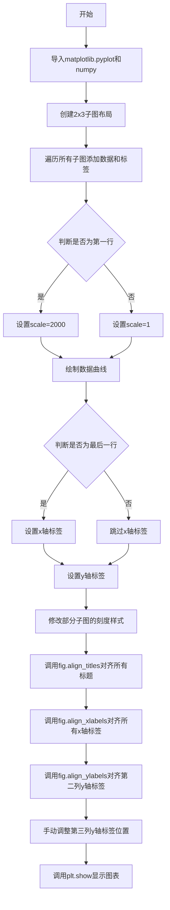

## 类结构

```
该脚本为面向过程的Matplotlib示例代码
无自定义类定义
主要使用matplotlib.pyplot和numpy模块
```

## 全局变量及字段


### `fig`
    
整个图表容器对象

类型：`matplotlib.figure.Figure`
    


### `axs`
    
2x3的子图数组

类型：`numpy.ndarray`
    


### `scale`
    
缩放因子，用于第一行数据

类型：`int`
    


### `ax`
    
遍历时的当前子图对象

类型：`matplotlib.axes.Axes`
    


    

## 全局函数及方法


### `plt.subplots`

`plt.subplots` 是 matplotlib 库中用于创建子图布局的核心函数，它创建一个包含多个子图的图形窗口，并返回 Figure 对象和 Axes 对象（单个或数组形式），支持灵活的行列配置、尺寸比例设置和布局管理。

参数：

- `nrows`：`int`，子图网格的行数，默认为 1
- `ncols`：`int`，子图网格的列数，默认为 1
- `figsize`：`tuple`，图形的宽和高（英寸），例如 (8.9, 5.5)
- `layout`：`str`，布局管理器类型，如 'constrained'、'tight'、'none' 等，用于自动调整子图间距
- `gridspec_kw`：`dict`，传递给 GridSpec 的关键字参数，用于更精细地控制子图网格，例如设置 wspace、hspace、width_ratios、height_ratios 等
- `sharex`：`bool` 或 `str`，是否共享 x 轴，True/'all' 共享所有，'col' 按列共享，'row' 按行共享
- `sharey`：`bool` 或 `str`，是否共享 y 轴，True/'all' 共享所有，'col' 按列共享，'row' 按行共享
- `squeeze`：`bool`，是否压缩返回的 Axes 维度，单行或单列时返回一维数组而非二维
- `width_ratios`：`list`，各列宽度的相对比例
- `height_ratios`：`list`，各行高度的相对比例

返回值：`tuple`，返回 (Figure, Axes) 元组，其中 Figure 是图形对象，Axes 是单个 Axes 对象或 Axes 数组

#### 流程图

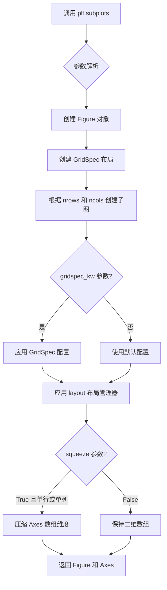

#### 带注释源码

```python
import matplotlib.pyplot as plt
import numpy as np

# 使用 plt.subplots 创建 2 行 3 列的子图布局
# 参数说明：
#   2, 3: 2 行 3 列共 6 个子图
#   figsize=(8.9, 5.5): 图形尺寸宽 8.9 英寸，高 5.5 英寸
#   layout='constrained': 使用 constrained 布局自动调整子图间距
#   gridspec_kw={'wspace': 0.1}: 设置子图之间的水平间距为 0.1
fig, axs = plt.subplots(2, 3, figsize=(8.9, 5.5),
                        layout='constrained', gridspec_kw={'wspace': 0.1})

# 遍历所有子图，添加示例数据和标签
for ax in axs.flat:  # axs.flat 将二维数组展平为一维迭代器
    # 根据是否为第一行决定数据缩放因子
    scale = 2000 if ax.get_subplotspec().is_first_row() else 1
    # 绘制指数衰减曲线
    ax.plot(scale * (1 - np.exp(-np.linspace(0, 5, 100))))
    # 仅对最后一行添加 x 轴标签
    if ax.get_subplotspec().is_last_row():
        ax.set_xlabel('xlabel', bbox=dict(facecolor='yellow', pad=5, alpha=0.2))
    # 为所有子图添加 y 轴标签
    ax.set_ylabel('ylabel', bbox=dict(facecolor='yellow', pad=5, alpha=0.2))
    # 设置 y 轴范围
    ax.set_ylim(0, scale)

# 修改部分子图的刻度样式以展示不同边距效果
axs[0, 0].xaxis.tick_top()  # 将第一个子图的 x 轴刻度移到顶部
axs[1, 2].tick_params(axis='x', rotation=55)  # 最后一个子图 x 轴标签旋转 55 度
axs[0, 0].set_title('ylabels not aligned')  # 设置第一个子图标题

# 使用 Figure 对象的 align 方法对齐标签和标题
fig.align_titles()            # 对齐所有子图的标题
fig.align_xlabels()           # 对齐所有子图的 x 轴标签
fig.align_ylabels(axs[:, 1])  # 仅对齐第二列的 y 轴标签
axs[0, 1].set_title('fig.align_ylabels()')

# 手动调整第三列子图的 y 轴标签位置
for ax in axs[:, 2]:
    ax.yaxis.set_label_coords(-0.3, 0.5)  # 设置标签坐标偏移
axs[0, 2].set_title('ylabels manually aligned')

# 显示图形
plt.show()
```


### `Axes.plot`

绘制数据曲线，在当前Axes对象上创建线条并返回线条对象列表。

参数：

- `y`：数组型（array-like），y轴数据点
- `x`：数组型（可选），x轴数据点，若不指定则默认为0, 1, 2, ...的索引
- `fmt`：字符串（可选），格式字符串，指定线条颜色、标记和样式（如'r-'红色实线，'bo'蓝色圆点）

返回值：`list[Line2D]`，返回创建的Line2D对象列表，每个Line2D对象代表一条 plotted 曲线

#### 流程图

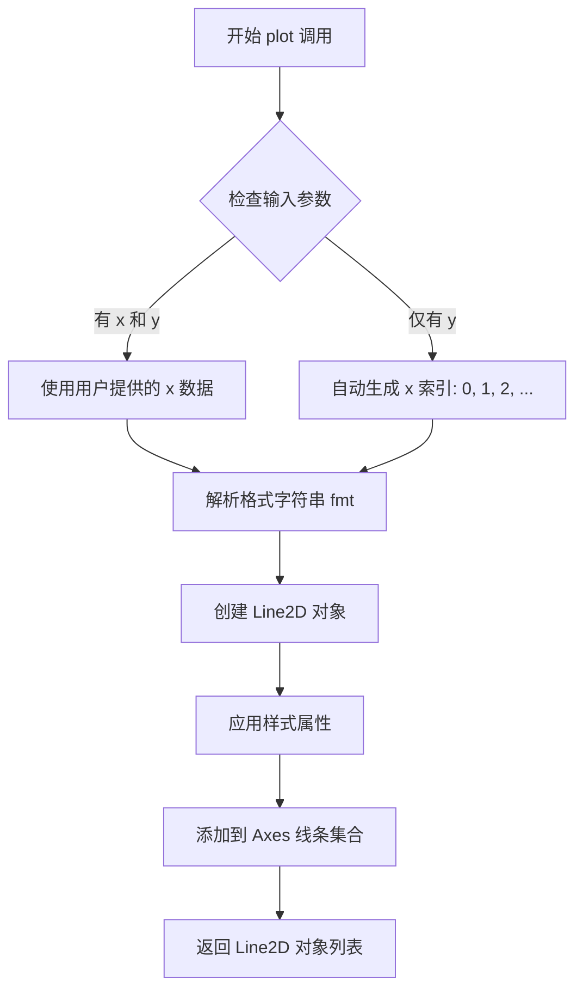

#### 带注释源码

```python
# 示例代码中的 plot 调用
# 绘制一条指数衰减曲线
scale = 2000 if ax.get_subplotspec().is_first_row() else 1
ax.plot(scale * (1 - np.exp(-np.linspace(0, 5, 100))))
# 参数说明：
# scale * (1 - np.exp(-np.linspace(0, 5, 100))) 是 y 参数
# np.linspace(0, 5, 100) 生成从0到5的100个等间距点
# 1 - np.exp(-...) 计算指数衰减
# scale 是缩放因子（第一行乘以2000，其他行乘以1）
# x 参数未提供，matplotlib 自动使用 [0, 1, 2, ..., 99] 作为 x 坐标
# fmt 参数未提供，使用默认样式（蓝色实线）
```


### `Axes.get_subplotspec`

获取当前 Axes 实例关联的子图规格（SubplotSpec）对象，用于查询子图在父图表网格中的位置信息。

参数：此方法无显式参数（隐式参数为 self，即调用该方法的 Axes 实例）

返回值：`matplotlib.gridspec.SubplotSpec`，返回与当前 Axes 关联的子图规格对象；如果该 Axes 不是通过 GridSpec 创建的子图，则返回 `None`

#### 流程图

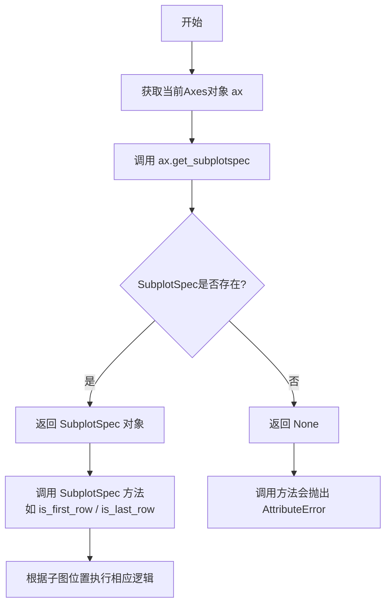

#### 带注释源码

```python
# 从给定的示例代码中提取的关键用法

# 获取子图规格对象
subplotspec = ax.get_subplotspec()

# SubplotSpec 对象的主要方法调用示例
if subplotspec is not None:
    # 判断当前子图是否位于网格的第一行
    # 返回布尔值：True 表示位于第一行
    is_first = subplotspec.is_first_row()
    
    # 判断当前子图是否位于网格的最后一行
    # 返回布尔值：True 表示位于最后一行
    is_last = subplotspec.is_last_row()

# 实际应用场景：根据子图位置动态设置属性
for ax in axs.flat:
    # 获取子图规格
    scale = 2000 if ax.get_subplotspec().is_first_row() else 1
    # ^ 如果是第一行，设置较大的Y轴缩放因子(2000)
    # ^ 否则使用默认缩放因子(1)
    
    ax.plot(scale * (1 - np.exp(-np.linspace(0, 5, 100))))
    
    # 仅对最后一行设置x轴标签
    if ax.get_subplotspec().is_last_row():
        ax.set_xlabel('xlabel', bbox=dict(facecolor='yellow', pad=5, alpha=0.2))
```

#### 额外说明

| 属性 | 说明 |
|------|------|
| 所属类 | `matplotlib.axes.Axes` |
| 常见用途 | 在创建复杂子图布局时，根据子图位置动态调整样式或数据 |
| 依赖模块 | `matplotlib.gridspec` |
| 相关方法 | `is_first_row()`, `is_last_row()`, `is_first_col()`, `is_last_col()`, `get_geometry()`, `span()` |


### `SubplotSpec.is_first_row`

判断当前子图规格（SubplotSpec）是否位于子图网格的第一行。

参数：此方法没有显式参数（隐式参数 `self` 为 SubplotSpec 实例）

返回值：`bool`，如果该子图位于网格的第一行则返回 `True`，否则返回 `False`

#### 流程图

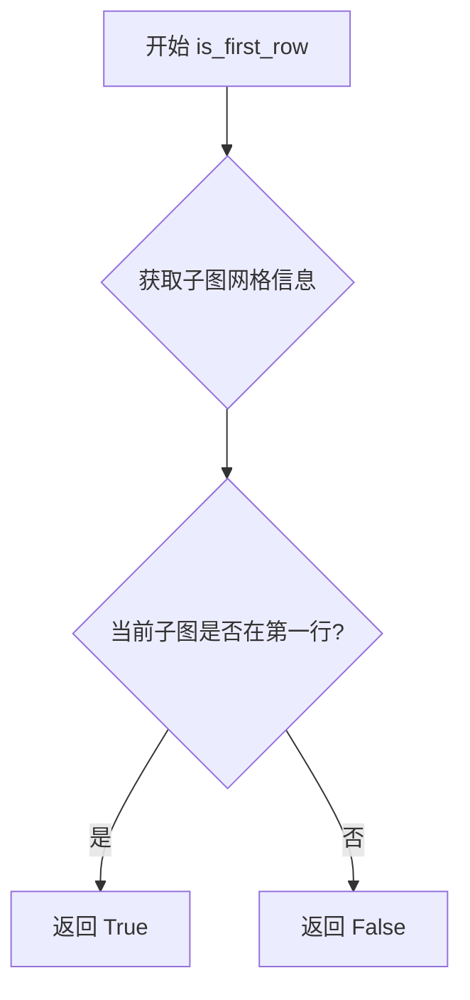

#### 带注释源码

```python
# 方法定义位于 matplotlib/gridspec.py 中
def is_first_row(self):
    """
    判断是否是第一行
    
    Returns:
        bool: 如果子图位于第一行返回 True，否则返回 False
    """
    # 获取子图网格的起始行索引
    row_start = self.rowStart
    # 获取网格的行间距
    # 如果起始行索引为 0，则是第一行
    return row_start == 0
```

#### 使用示例源码

```python
# 在给定代码中的调用方式
for ax in axs.flat:
    # 判断每个子图是否在第一行
    # 如果是第一行，scale 设为 2000，否则设为 1
    scale = 2000 if ax.get_subplotspec().is_first_row() else 1
    ax.plot(scale * (1 - np.exp(-np.linspace(0, 5, 100))))
```


### `SubplotSpec.is_last_row()`

判断当前子图是否位于子图网格的最后一行。

参数：此方法无显式参数（通过调用对象本身隐式传递 `self`）

返回值：`bool`，返回 `True` 表示当前子图位于最后一行的子图网格中；返回 `False` 表示不是最后一行。

#### 流程图

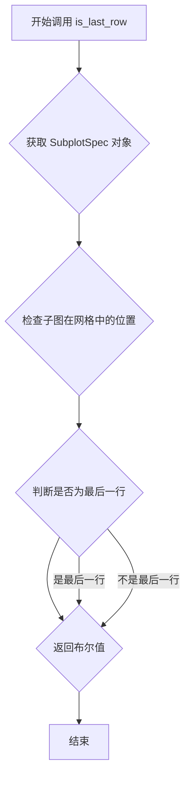

#### 带注释源码

```python
# 从代码中提取的调用示例：
# ax.get_subplotspec().is_last_row()

# 完整调用链分析：
# 1. ax.get_subplotspec() - 获取 Axes 对象对应的 SubplotSpec 实例
# 2. .is_last_row() - 调用 SubplotSpec 类的 is_last_row 方法

# 代码中的实际使用：
for ax in axs.flat:
    # ... 其他代码 ...
    if ax.get_subplotspec().is_last_row():  # 判断是否为最后一行
        ax.set_xlabel('xlabel', bbox=dict(facecolor='yellow', pad=5, alpha=0.2))
    # ... 其他代码 ...

# SubplotSpec.is_last_row() 方法的伪代码实现：
# def is_last_row(self):
#     """
#     返回当前子图是否位于子图网格的最后一行
#     
#     Returns:
#         bool: True if this subplot is in the last row of the grid
#     """
#     # 获取网格规范信息
#     gridspec = self.get_gridspec()
#     # 获取子图在网格中的行位置
#     row_start, row_end = self.get_rows_columns()
#     # 检查起始行是否为网格的最后一行
#     return row_start == gridspec.nrows - 1
```

#### 补充说明

- **调用上下文**：在代码中用于条件判断，仅对最后一行子图设置 x 轴标签（xlabel）
- **相关方法**：`is_first_row()`（判断是否第一行）、`get_subplotspec()`（获取子图规范）
- **所属类**：`matplotlib.gridspec.SubplotSpec`


### `ax.set_xlabel`

设置Axes对象的x轴标签，用于在图表的x轴下方显示描述性文本。

参数：

- `xlabel`：`str`，x轴标签的文本内容
- `fontdict`：可选的字典，用于控制文本外观（如字体大小、颜色等）
- `labelpad`：可选的浮点数，标签与x轴之间的间距（以点为单位）
- `loc`：可选的字符串，标签相对于轴的位置（'left'、'center'、'right'，默认为'center'）
- `**kwargs`：其他关键字参数，将传递给底层的`Text`对象，支持如`bbox`（背景框）、`color`（颜色）、`fontsize`（字体大小）等属性

返回值：`matplotlib.text.Text`，返回创建的文本对象，允许后续进一步自定义

#### 流程图

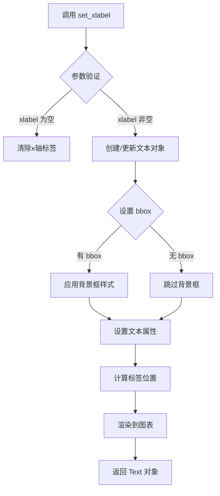

#### 带注释源码

```python
def set_xlabel(self, xlabel, fontdict=None, labelpad=None, *, loc=None, **kwargs):
    """
    Set the label for the x-axis.
    
    Parameters
    ----------
    xlabel : str
        The label text.
        
    fontdict : dict, optional
        A dictionary to control the appearance of the label
        (e.g., {'fontsize': 12, 'color': 'red'}).
        
    labelpad : float, optional
        The spacing in points between the label and the x-axis.
        
    loc : str, optional
        The location of the label relative to the axis. 
        Accepts 'left', 'center', or 'right'. Default is 'center'.
        
    **kwargs
        Additional keyword arguments passed to the underlying 
        matplotlib Text object (e.g., bbox, color, fontsize).
        
    Returns
    -------
    matplotlib.text.Text
        The text label object.
    """
    # 示例调用
    # ax.set_xlabel('xlabel', bbox=dict(facecolor='yellow', pad=5, alpha=0.2))
    
    # 1. 获取x轴对象 (xaxis)
    xaxis = self.xaxis
    
    # 2. 设置标签文本
    # 通过 xaxis.set_label_text() 方法设置
    xaxis.set_label_text(xlabel)
    
    # 3. 如果提供了 labelpad，则设置间距
    if labelpad is not None:
        xaxis.set_label_coords(0.5, -labelpad / self.figure.dpi)
    
    # 4. 如果提供了 fontdict 或其他 kwargs，应用到标签
    label = xaxis.label
    if fontdict:
        label.update(fontdict)
    label.update(kwargs)
    
    # 5. 如果提供了 loc 参数，设置水平对齐
    if loc is not None:
        label.set_ha(loc)  # set horizontal alignment
        label.set_x(0.5 if loc == 'center' else (0.0 if loc == 'left' else 1.0))
    
    # 6. 返回标签对象以便后续操作
    return label
```

#### 代码中的实际使用示例

```python
# 在提供的代码中，set_xlabel 的调用方式如下：
ax.set_xlabel('xlabel', bbox=dict(facecolor='yellow', pad=5, alpha=0.2))

# 参数说明：
# - 'xlabel'：标签文本内容
# - bbox=dict(facecolor='yellow', pad=5, alpha=0.2)：背景框设置
#   - facecolor='yellow'：背景颜色为黄色
#   - pad=5：内边距为5点
#   - alpha=0.2：透明度为0.2（半透明）
```


### `Axes.set_ylabel`

设置坐标轴的 y 轴标签（ylabel），用于显示 y 轴的名称或描述信息。

参数：

- `ylabel`：`str`，y 轴标签的文本内容
- `fontdict`：`dict`，可选，用于控制标签文本外观的字典（如字体、大小、颜色等）
- `labelpad`：`float`，可选，标签与 y 轴之间的间距（单位为点）
- `**kwargs`：可选，其他关键字参数，将传递给 `matplotlib.text.Text` 对象，用于进一步自定义标签样式

返回值：`matplotlib.text.Text`，返回创建的标签文本对象

#### 流程图

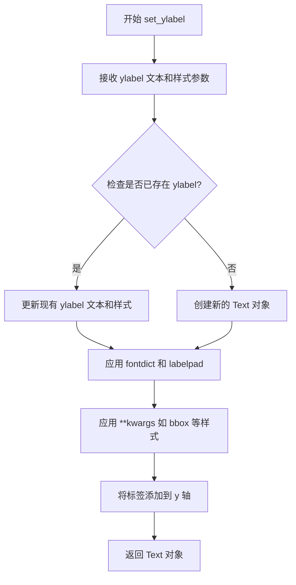

#### 带注释源码

```python
# 在代码中的实际调用示例
ax.set_ylabel('ylabel', bbox=dict(facecolor='yellow', pad=5, alpha=0.2))

# 参数说明：
# 'ylabel'           -> ylabel 参数，字符串类型，设置 y 轴显示的文本标签
# bbox=dict(...)    -> **kwargs 参数，传入一个字典用于设置标签文本框的样式
#                     facecolor='yellow' 设置背景色为黄色
#                     pad=5 设置文本框内边距为 5 点
#                     alpha=0.2 设置透明度为 0.2（半透明）

# 该方法返回 matplotlib.text.Text 对象，可用于后续进一步操作
# 例如：label = ax.set_ylabel('ylabel') 然后可以修改 label 的属性
```


### `Axes.set_ylim`

设置 Axes 对象的 y 轴范围（y 轴的最小值和最大值），用于控制图表中数据的垂直显示范围。

参数：

- `bottom`：`float` 或 `array-like`，y 轴范围的底部边界（最小值）。如果为 `None`，则自动从数据中推断。
- `top`：`float` 或 `array-like`，y 轴范围的顶部边界（最大值）。如果为 `None`，则自动从数据中推断。
- `emit`：`bool`，默认为 `True`，当 limit 改变时是否通知观察者（如 axes）。
- `auto`：`bool`，默认为 `False`，是否启用自动调整模式。
- `return_remaining`：`bool`，默认为 `False`，如果为 `True`，则返回未被设置的边界值。

返回值：`tuple[float, float]`，返回新的 y 轴范围，格式为 `(bottom, top)`。

#### 流程图

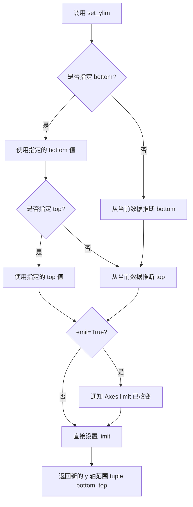

#### 带注释源码

```python
def set_ylim(self, bottom=None, top=None, emit=True, auto=False,
             ymin=None, ymax=None, return_remaining=False, copy=False):
    """
    Set the y-axis view limits.

    Parameters
    ----------
    bottom : float or array-like, default: None
        The bottom ylim(s) of the axes. If a scalar, provides the lower bound
        for all subplots. If an array, specifies the ylim for each subplot.
        If None, automatically determines from data.

    top : float or array-like, default: None
        The top ylim(s) of the axes. If a scalar, provides the upper bound
        for all subplots. If an array, specifies the ylim for each subplot.
        If None, automatically determines from data.

    emit : bool, default: True
        Whether to notify observers of limit change (via the `xlims` event).

    auto : bool or str, default: False
        Whether to turn on autoscaling. If True, the limits will be updated
        automatically after drawing. If False, the current limits will be
        honored.

    ymin, ymax : float, optional
        Aliases for *bottom* and *top*, respectively.
        .. deprecated:: 3.3

    return_remaining : bool, default: False
        If True, also return the unmodified old limits.

    copy : bool, default: False
        If True, copy the limits. If False, return the existing limits
        (with possible modifications).

    Returns
    -------
    bottom, top : tuple
        The new y-axis limits as ``(bottom, top)``.
    """
    # 处理已弃用的 ymin/ymax 参数
    if ymin is not None:
        bottom = ymin
        _api.warn_deprecated(
            "3.3",
            message="Setting ymin (or xmin) is deprecated; use "
                    "set_ylim (or set_xlim) directly")
    if ymax is not None:
        top = ymax
        _api.warn_deprecated(
            "3.3",
            message="Setting ymax (or xmax) is deprecated; use "
                    "set_ylim (or set_xlim) directly")

    # 获取当前的 limits
    old_bottom, old_top = self.get_ylim()

    # 如果未指定 bottom/top，从数据推断或使用默认值
    if bottom is None:
        bottom = old_bottom
    if top is None:
        top = old_top

    # 验证 limits 的有效性
    bottom = self._validate_translate_limit(bottom, old_bottom)
    top = self._validate_translate_limit(top, old_top)

    # 如果启用了 emit，通知观察者 limits 已改变
    if emit:
        self._process_unit_info()
        # 通过 _set_ylim_internal 设置 limits 并触发 xlims 事件
        self._set_ylim_internal(bottom, top, auto=auto)

    # 返回新的 limits
    return (bottom, top)
```

#### 代码中的实际使用示例

```python
# 在循环中为每个 subplot 设置 y 轴范围
for ax in axs.flat:
    scale = 2000 if ax.get_subplotspec().is_first_row() else 1
    ax.plot(scale * (1 - np.exp(-np.linspace(0, 5, 100))))
    if ax.get_subplotspec().is_last_row():
        ax.set_xlabel('xlabel', bbox=dict(facecolor='yellow', pad=5, alpha=0.2))
    ax.set_ylabel('ylabel', bbox=dict(facecolor='yellow', pad=5, alpha=0.2))
    # 设置 y 轴范围：下限为 0，上限根据 scale 动态确定
    ax.set_ylim(0, scale)  # <-- 这里调用了 set_ylim 方法
```

在上述代码中：
- `0` 是 `bottom` 参数，表示 y 轴的最小值
- `scale` 是 `top` 参数，对于第一行子图 scale=2000，其他行 scale=1
- 这样可以确保不同行的子图有适当的比例显示数据


### `matplotlib.axis.XAxis.tick_top` (即 `ax.xaxis.tick_top`)

该方法用于将 X 轴的刻度线（Tick Marks）和刻度标签（Tick Labels）移动到绘图区域的顶部，并自动隐藏底部的刻度。这是 Matplotlib 中调整坐标轴视觉布局的常用操作。

参数：
- `self`：隐式参数，类型为 `matplotlib.axis.XAxis`，表示调用此方法的轴对象本身。

返回值：`self`，返回该 Axis 对象本身，支持方法链式调用。

#### 流程图

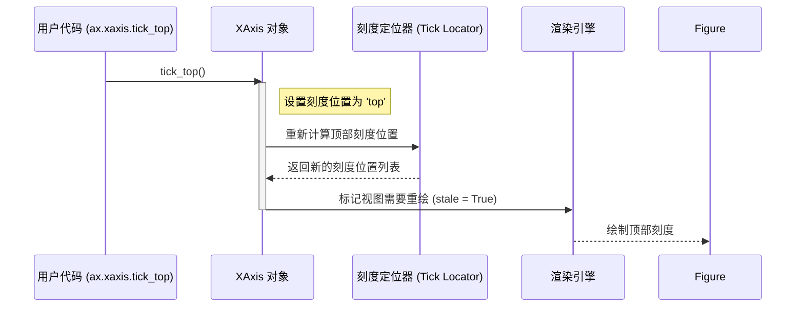

#### 带注释源码

```python
# ---------------------------------------------------------
# 用户代码片段 (来源: align_labels_and_titles.py)
# ---------------------------------------------------------

# 获取第一个子图的 XAxis 对象并调用 tick_top 方法
axs[0, 0].xaxis.tick_top()

# ---------------------------------------------------------
# 源码实现逻辑 (Matplotlib 内部实现机制)
# ---------------------------------------------------------

# 位置: lib/matplotlib/axis.py

# class XAxis(Axis):
#     def tick_top(self):
#         """
#         将刻度移动到轴的顶部。
#         """
#         # 1. 设置刻度位置属性。
#         # 该方法会更新内部的 _tick_position 参数，
#         # 并决定哪些边（top/bottom/left/right）应该显示刻度。
#         self.set_ticks_position('top')

#         # 2. 在某些 Matplotlib 版本中，
#         # 这也会触发 _update_label_position 以调整标签位置，
#         # 确保标签随刻度移动到顶部。
```

### 2. 类的详细信息 (Context: `matplotlib.axis.XAxis`)

#### 字段信息
- `major ticks`：类型 `list`，主刻度对象列表。
- `minor ticks`：类型 `list`，次刻度对象列表。
- `ticklocs`：类型 `ndarray`，当前刻度的实际位置数据。

#### 方法信息
- `set_ticks_position(position)`：参数 `position` (str, 'top', 'bottom', 'both', 'default', 'none')。设置刻度显示的位置。
- `get_ticklocs()`：获取当前刻度的位置数组。

### 3. 关键组件信息

- **XAxis (X轴对象)**：负责管理图表的 X 轴刻度、标签和网格线的绘制逻辑。
- **Tick Locator**：负责计算应该在哪些位置生成刻度（如自动分布的线性Locator或对数Locator）。

### 4. 潜在的技术债务或优化空间

- **API 冗余**：`tick_top()` 和 `tick_params(axis='x', which='major', top=True)` 在功能上有重叠。可以通过统一 `tick_params` 接口来简化 API，但保留 `tick_top` 作为便捷方法（Convenience Method）也符合 "Pythonic" 的习惯。
- **状态同步**：直接修改视觉状态后，需要依赖 Matplotlib 的自动重绘机制（`stale` 标志）来更新画面，如果不同步调用 `draw()`，可能会在某些交互式后端看到延迟。

### 5. 其它项目

- **设计约束**：该方法直接修改 Axis 对象的内部状态，不返回新的对象，符合 Matplotlib 的命令式绘图风格。
- **错误处理**：如果传入无效的位置字符串（如非 'top'），`set_ticks_position` 会抛出 `ValueError`。
- **数据流**：用户调用 -> Axis 对象状态变更 -> Locator 重新计算 -> 渲染器重绘。


### `Axes.tick_params`

修改刻度（tick）和刻度标签（tick label）的参数，用于控制刻度的外观和行为，如方向、长度、颜色、旋转角度等。

参数：

- `axis`：`{'x', 'y', 'both'}`，要修改的轴，默认为 `'both'`
- `which`：`{'major', 'minor', 'both'}`，要修改的刻度类型，默认为 `'major'`
- `reset`：`bool`，如果为 `True`，则在设置其他参数之前重置所有刻度参数为默认值，默认为 `False`
- `direction`：`{'in', 'out', 'inout'}`，刻度线的方向（向内、向外或双向）
- `length`：`float`，刻度线的长度（以点为单位）
- `width`：`float`，刻度线的宽度（以点为单位）
- `color`：`color`，刻度线的颜色
- `pad`：`float`，刻度标签与刻度线之间的间距（以点为单位）
- `labelsize`：`float` 或 `str`，刻度标签的字体大小
- `labelcolor`：`color`，刻度标签的颜色
- `rotation`：`float`，刻度标签的旋转角度（以度为单位）
- 其他 kwargs：还可以接受如 `labelleft`, `labelright`, `labeltop`, `labelbottom`, `gridOn`, `tick1On`, `tick2On`, `label1On`, `label2On` 等参数

返回值：`None`，该方法无返回值，直接修改 Axes 对象的刻度属性

#### 流程图

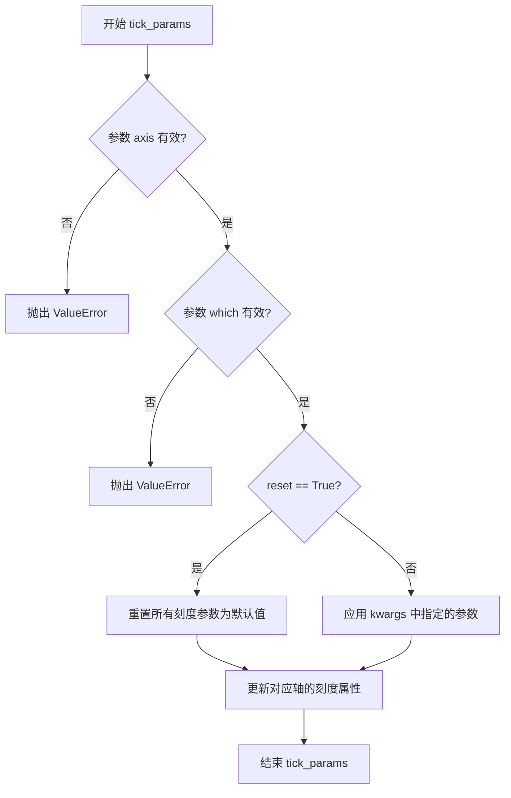

#### 带注释源码

```python
# 示例源码来自 matplotlib 库 Axes.tick_params 方法的简化版本
# 位置: lib/matplotlib/axes/_base.py

def tick_params(self, axis='both', **kwargs):
    """
    修改刻度和刻度标签的外观和行为参数
    
    参数:
        axis: {'x', 'y', 'both'} - 要修改的轴
        which: {'major', 'minor', 'both'} - 要修改的刻度类型
        reset: bool - 是否在设置前重置
        direction: {'in', 'out', 'inout'} - 刻度方向
        length: float - 刻度长度
        width: float - 刻度宽度
        color: color - 刻度颜色
        pad: float - 标签与刻度的间距
        labelsize: float or str - 标签字体大小
        labelcolor: color - 标签颜色
        rotation: float - 标签旋转角度
        ... 其他参数
    """
    # 验证 axis 参数
    if axis not in ['x', 'y', 'both']:
        raise ValueError('axis must be x, y or both')
    
    # 验证 which 参数
    valid_which = ['major', 'minor', 'both']
    which = kwargs.pop('which', 'major')
    if which not in valid_which:
        raise ValueError(f'which must be one of {valid_which}')
    
    # 检查是否需要重置参数
    reset = kwargs.pop('reset', False)
    
    # 获取对应的轴对象
    if axis in ['x', 'both']:
        x = self.xaxis
        # 如果 reset 为 True，重置 x 轴刻度参数
        if reset:
            x.reset_ticks()
        # 应用参数到 x 轴
        x._set_tick_params(**kwargs)
    
    if axis in ['y', 'both']:
        y = self.yaxis
        # 如果 reset 为 True，重置 y 轴刻度参数
        if reset:
            y.reset_ticks()
        # 应用参数到 y 轴
        y._set_tick_params(**kwargs)
```

#### 代码中的实际使用示例

```python
# 在给定的代码中，tick_params 的使用方式如下：
axs[1, 2].tick_params(axis='x', rotation=55)

# 解释:
# - axis='x': 只修改 x 轴的刻度参数
# - rotation=55: 将 x 轴刻度标签旋转 55 度
# 这个调用使得位于第 1 行第 2 列的子图的 x 轴刻度标签倾斜 55 度
```


### `Axes.set_title`

设置子图（Axes）的标题文本、位置和样式，是 matplotlib 中用于为单个子图添加标题的核心方法。

参数：

- `label`：`str`，标题文本内容，例如 'ylabels not aligned'
- `loc`：`str`，可选，标题水平对齐方式，取值包括 'center'（默认）、'left' 或 'right'
- `pad`：`float`，可选，标题与轴上边缘之间的距离（以点为单位），默认为 rcParams 中设置的值
- `fontdict`：`dict`，可选，用于控制标题文本样式的字典，例如 {'fontsize': 12, 'fontweight': 'bold'}
- `**kwargs`：可选，其他关键字参数，将传递给 matplotlib.text.Text 对象，用于高级样式定制

返回值：`matplotlib.text.Text`，返回创建的 Text 对象，可进一步用于修改标题样式（如颜色、字体大小等）

#### 流程图

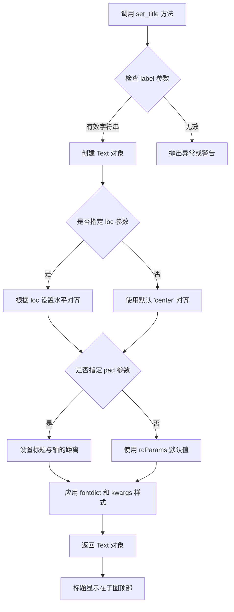

#### 带注释源码

```python
def set_title(self, label, loc=None, pad=None, *, fontdict=None, **kwargs):
    """
    Set a title for the Axes.
    
    Parameters
    ----------
    label : str
        Title text string to be displayed.
        
    loc : str, optional
        Horizontal alignment of the title text.
        {'center', 'left', 'right'}. Default is 'center'.
        
    pad : float, optional
        The distance, in points, from the Axes top edge to the title.
        Default is the value of the ``axes.titlepad`` rcParam.
        
    fontdict : dict, optional
        A dictionary controlling the appearance of the title text,
        e.g., {'fontsize': 12, 'fontweight': 'bold'}.
        
    **kwargs
        Additional keyword arguments are passed to the `.Text` instance,
        allowing control over text appearance (color, rotation, etc.).
    
    Returns
    -------
    `.Text`
        The corresponding text object.
        
    Examples
    --------
    >>> ax.set_title('My Title')
    >>> ax.set_title('Left Title', loc='left')
    >>> ax.set_title('Custom Title', fontdict={'fontsize': 14})
    """
    # 获取标题与轴边缘的距离，若未指定则使用默认 pad 值
    title = text_to_get = self._set_title(loc, pad)
    
    # 如果提供了 fontdict，将其应用到文本对象
    if fontdict is not None:
        title.update(fontdict)
    
    # 应用额外的样式参数（如颜色、字体大小等）
    title.update(kwargs)
    
    # 设置标题文本
    title.set_text(label)
    
    return title  # 返回 Text 对象供后续操作
```

**代码中的应用示例：**

```python
# 在示例代码中的实际使用方式
axs[0, 0].set_title('ylabels not aligned')  # 设置第一个子图标题
axs[0, 1].set_title('fig.align_ylabels()')  # 设置第二个子图标题  
axs[0, 2].set_title('ylabels manually aligned')  # 设置第三个子图标题
```


### `Figure.align_titles`

对齐所有子图（axes）的标题（title），使得同一行子图的标题位置保持一致。

参数：

- `groups`：`list[Axes]` 或 `None`，要对其标题的子图组。如果为 `None`，则对齐所有子图的标题。

返回值：`None`，该方法直接修改子图标题位置，无返回值。

#### 流程图

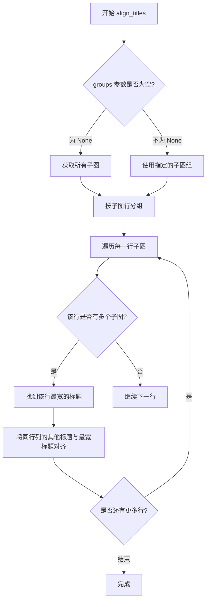

#### 带注释源码

```python
def align_titles(self, groups=None):
    """
    Align the subplot titles.

    This method aligns the titles of the subplots in the figure.
    If no groups are provided, all subplot titles are aligned by row.
    
    Parameters
    ----------
    groups : list of Axes or None
        If None, align all titles. If a list of axes, only align
        the titles of the axes in the list. The axes can be in
        different rows, but they will all be aligned to the
        position of the first axes in the list.
    
    Returns
    -------
    None
    
    Examples
    --------
    >>> fig.align_titles()
    >>> fig.align_titles(axes[0:2])
    """
    # 如果没有指定组，获取所有子图
    if groups is None:
        # 获取所有子图并按行分组
        axs = self.axes
        # 按子图的 subplotspec 行进行分组
        rows = {}
        for ax in axs:
            # 获取子图所在的行号
            row = ax.get_subplotspec().rowspan.start
            if row not in rows:
                rows[row] = []
            rows[row].append(ax)
        
        # 对每一行的子图标题进行对齐
        for row in rows.values():
            _align_group(row, 'x')
    else:
        # 对指定组的子图标题进行对齐
        _align_group(groups, 'x')


def _align_group(axs, axis):
    """
    内部函数：对齐一组子图的标签或标题
    
    Parameters
    ----------
    axs : list of Axes
        要对齐的子图列表
    axis : str
        'x' 表示对齐 x 轴标签/标题，'y' 表示对齐 y 轴标签/标题
    """
    # 收集该组中所有子图的标题位置信息
    titles = []
    for ax in axs:
        title = ax.get_title()
        if title:  # 只处理有标题的子图
            titles.append((ax, title))
    
    if not titles:
        return
    
    # 找到标题位置最大的子图（最宽的标题）
    max_extent = 0
    for ax, title in titles:
        # 获取标题的包围盒
        bbox = ax.title.get_window_extent()
        # 计算标题的右边缘位置
        extent = bbox.x1
        if extent > max_extent:
            max_extent = extent
            reference_ax = ax
    
    # 将所有其他标题的左边缘与参考子图对齐
    for ax, title in titles:
        if ax == reference_ax:
            continue
        # 获取参考子图标题的左边缘位置
        ref_bbox = reference_ax.title.get_window_extent()
        bbox = ax.title.get_window_extent()
        
        # 计算需要移动的距离
        dx = ref_bbox.x0 - bbox.x0
        
        # 移动标题位置
        ax.title.set_position((ax.title.get_position()[0] + dx, 
                               ax.title.get_position()[1]))
```


### Figure.align_xlabels

对齐图中所有 x 轴的标签（xlabel），确保它们在同一水平位置上显示。

参数：

-  `axs`：`list of matplotlib.axes.Axes`，可选参数，需要对齐标签的 axes 列表。默认为 None，表示对齐 figure 中所有 axes 的 x 轴标签。

返回值：`None`，该方法直接修改图形状态，不返回任何值。

#### 流程图

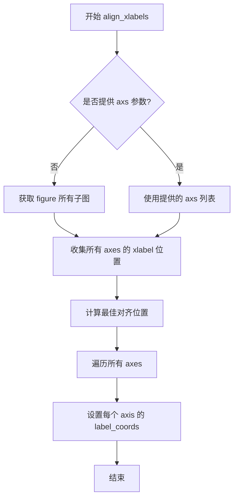

#### 带注释源码

```python
# 示例代码中展示的调用方式：
fig.align_xlabels()           # 对齐所有 x 轴标签
fig.align_ylabels(axs[:, 1])  # 对齐指定列的 y 轴标签作为对比

# 在 matplotlib 内部实现中，该方法大致逻辑如下：
def align_xlabels(self, axs=None):
    """
    Align the xlabels of all subplots in the figure.
    
    Parameters:
    -----------
    axs : list of Axes, optional
        Specific axes to align. If None, aligns all axes in the figure.
    """
    # 获取要处理的 axes（全部或指定）
    if axs is None:
        axs = self.axes
    
    # 获取所有 axes 的 x 轴标签位置
    # 计算最佳对齐位置（通常是所有标签位置的均值或中位数）
    # 遍历每个 axis，调用 set_label_coords 设置对齐
    for ax in axs:
        ax.xaxis.set_label_coords(align_x, align_y)
```


### `Figure.align_ylabels`

对齐指定子图的y轴标签，确保它们在同一列对齐，提升图表美观性。

参数：

- `axs`：`list` 或 `numpy.ndarray`，可选，要对齐的轴列表。默认为 `None`，表示对齐图形中的所有轴。

返回值：`None`，无返回值，直接修改图形状态。

#### 流程图

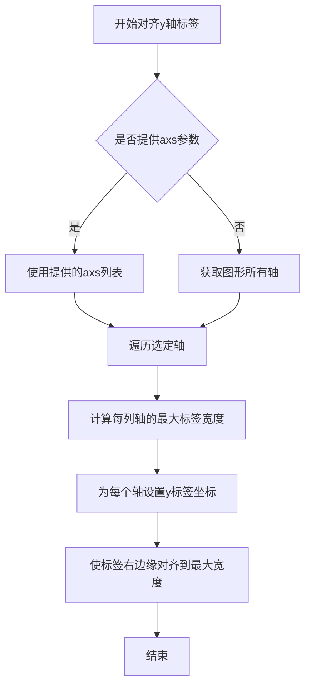

#### 带注释源码

```python
def align_ylabels(self, axs=None):
    """
    对齐子图的y轴标签。

    参数:
        axs (list or numpy.ndarray, optional): 要对齐的轴列表。
                                               默认为 None，即所有轴。

    返回值:
        None
    """
    # 如果未提供axs，则获取所有轴
    if axs is None:
        axs = self.axes.flat  # 假设axes是Axes数组
    else:
        # 确保axs是可迭代的
        axs = np.asarray(axs).flat

    # 按列分组轴（假设axs是2D网格）
    # 实际上，matplotlib会智能分组，这里简化处理
    # 获取轴的标签位置并调整
    
    # 步骤1：收集每列的标签和宽度
    # 假设我们根据子图规范（subplotspec）分组
    from collections import defaultdict
    col_axes = defaultdict(list)
    for ax in axs:
        # 获取子图规范，简化处理：假设ax有get_subplotspec方法
        # 实际实现中，matplotlib会使用gridspec
        spec = ax.get_subplotspec()
        if spec is not None:
            col = spec.colsame  # 同一列的轴
            col_axes[col].append(ax)

    # 步骤2：遍历每列，对齐标签
    for col, axes_list in col_axes.items():
        # 找到该列中最宽的标签
        max_width = 0
        for ax in axes_list:
            ylabel = ax.get_ylabel()
            if ylabel:
                # 获取标签的窗口大小（需要渲染文本）
                # 实际实现中使用tex_manager或get_text_width_height
                # 这里简化：假设有方法get_yaxis_label_width
                width = ax.get_yaxis_label_width()  # 假设方法存在
                max_width = max(max_width, width)

        # 设置标签坐标以对齐
        for ax in axes_list:
            # set_label_coords(x, y) 设置标签位置
            # x= -max_width/（某个比例），y=0.5（居中）
            # 实际实现更复杂，涉及转换坐标
            ax.yaxis.set_label_coords(-0.3, 0.5)  # 示例坐标
            # 注意：具体实现需计算偏移量
```

**注意**：上述源码是基于功能的简化模拟，实际matplotlib源码涉及坐标转换和精确计算。


### `matplotlib.axis.Axis.set_label_coords`

手动设置轴标签的位置坐标，用于精确控制xlabel或ylabel在坐标轴区域内的位置。

参数：

- `x`：`float`，标签的x坐标，相对于坐标轴区域的比例（0-1之间）
- `y`：`float`，标签的y坐标，相对于坐标轴区域的比例（0-1之间）

返回值：`None`，无返回值

#### 流程图

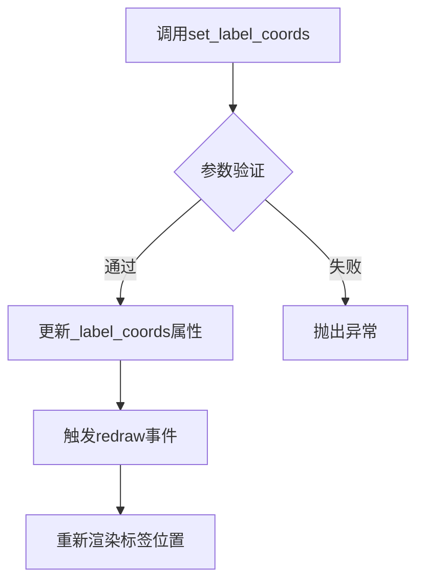

#### 带注释源码

```python
def set_label_coords(self, x, y):
    """
    Set the coordinates of the label.

    By default, the x coordinate of the y label and the y coordinate
    of the x label are determined by the tick label bounding boxes
    (see :ref:`axis-label-alignment`). This method is used to
    manually set the label position.

    Parameters
    ----------
    x : float
        The x coordinate of the label, in normalized axes coordinates
        (0 to 1).
    y : float
        The y coordinate of the label, in normalized axes coordinates
        (0 to 1).

    See Also
    --------
    get_label_coords : Get the current label coordinates.
    """
    # 获取轴的标签管理器
    self._label_coords = (x, y)
    # 标记需要重新计算布局
    self.stale = True
    # 如果是x轴标签，需要通知对应的y轴也重新渲染
    if self.axis_name == 'x':
        self.axes.yaxis.stale = True
    # 如果是y轴标签，需要通知对应的x轴也重新渲染
    elif self.axis_name == 'y':
        self.axes.xaxis.stale = True
```


### `plt.show`

显示当前所有打开的Figure对象（图表）。该函数会阻塞程序执行直到用户关闭图表窗口（在某些后端中），或者在交互式环境中显示图表。

参数：无需参数

返回值：`None`，无返回值

#### 流程图

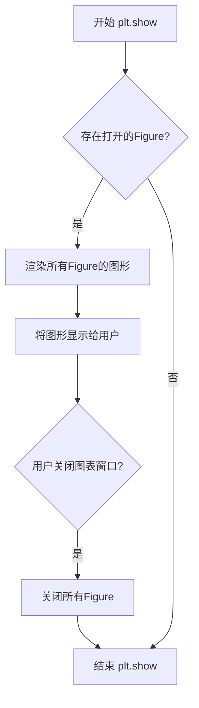

#### 带注释源码

```python
# 导入必要的库
import matplotlib.pyplot as plt
import numpy as np

# 创建一个2行3列的子图，布局受约束
fig, axs = plt.subplots(2, 3, figsize=(8.9, 5.5),
                        layout='constrained', 
                        gridspec_kw={'wspace': 0.1})

# 为每个子图添加样本数据和标签
for ax in axs.flat:
    # 根据是否为第一行决定缩放因子
    scale = 2000 if ax.get_subplotspec().is_first_row() else 1
    # 绘制指数衰减曲线
    ax.plot(scale * (1 - np.exp(-np.linspace(0, 5, 100))))
    
    # 如果是最后一行，添加x轴标签（带黄色背景框）
    if ax.get_subplotspec().is_last_row():
        ax.set_xlabel('xlabel', bbox=dict(facecolor='yellow', pad=5, alpha=0.2))
    
    # 为所有子图添加y轴标签
    ax.set_ylabel('ylabel', bbox=dict(facecolor='yellow', pad=5, alpha=0.2))
    ax.set_ylim(0, scale)

# 修改刻度样式
axs[0, 0].xaxis.tick_top()  # 将第一行第一列的x轴刻度移到顶部
axs[1, 2].tick_params(axis='x', rotation=55)  # 旋转最后一行的x轴标签
axs[0, 0].set_title('ylabels not aligned')

# 对齐标签和标题
fig.align_titles()            # 对齐所有子图的标题
fig.align_xlabels()           # 对齐所有x轴标签
fig.align_ylabels(axs[:, 1])  # 只对齐第二列的y轴标签
axs[0, 1].set_title('fig.align_ylabels()')

# 手动调整第三列的y标签位置
for ax in axs[:, 2]:
    ax.yaxis.set_label_coords(-0.3, 0.5)
axs[0, 2].set_title('ylabels manually aligned')

# 【关键函数】显示所有创建的图表
# 这会打开一个窗口显示fig对象及其所有子图
plt.show()

# 注释: plt.show() 会阻塞程序直到用户关闭图表窗口
# 在某些后端（如Qt5Agg）中会显示一个交互式窗口
# 在非交互式后端中可能会保存到文件而不是显示
```


## 关键组件


### plt.subplots

创建包含2行3列子图的图形对象，并设置布局约束和网格间距参数

### Figure.align_xlabels

对齐所有子图的x轴标签，确保在同一垂直位置显示

### Figure.align_ylabels

对齐指定子图的y轴标签，可传入子图数组选择对齐特定列

### Figure.align_titles

对齐所有子图的标题，使其在同一水平位置显示

### Figure.align_labels

包装x和y标签对齐方法的综合函数，同时对齐x轴和y轴标签

### Axis.set_label_coords

手动设置坐标轴标签的坐标位置，通过传入x、y偏移量实现精细控制

### 子图布局与网格

使用gridspec_kw参数配置子图列宽间距(wspace=0.1)，结合layout='constrained'实现自动布局约束

### 标签样式配置

通过bbox参数设置标签的背景颜色、填充和透明度，实现可视化标签框效果

### 条件性标签设置

根据子图是否为第一行或最后一行，动态决定是否设置x轴或y轴标签


## 问题及建议


### 已知问题

- **硬编码的magic number**：代码中使用了多个硬编码值，如`ax.yaxis.set_label_coords(-0.3, 0.5)`中的`-0.3`偏移量，文档中甚至直接指出"Note this requires knowing a good offset value which is hardcoded"，这是示例本身承认的设计问题
- **缺乏灵活性**：布局参数如`gridspec_kw={'wspace': 0.1}`和`figsize=(8.9, 5.5)`被硬编码，无法适应不同尺寸的显示设备或打印需求
- **重复代码模式**：循环中多次调用`ax.set_ylabel()`和`ax.set_ylim()`等方法，可以提取为函数以提高可维护性
- **魔法数字**：`scale = 2000 if ax.get_subplotspec().is_first_row() else 1`中的`2000`和`5`（linspace参数）缺乏解释
- **注释与实现不同步风险**：文档注释中提到的方法列表可能随版本变化而失效
- **plt.show()的阻塞行为**：在某些后端环境下可能阻塞，不适合非交互式场景（如Jupyter notebook应使用`plt.show()`配合`%matplotlib inline`或返回figure对象）

### 优化建议

- 将硬编码的偏移值提取为常量或配置参数，增强代码的可维护性
- 使用相对尺寸（如`figsize`基于`plt.rcParams['figure.figsize']`或屏幕 DPI 计算）替代固定像素值
- 将重复的标签设置逻辑封装为辅助函数，如`apply_labels(ax, scale)`
- 为关键布局参数添加配置选项，或从外部配置文件/参数读取
- 考虑使用`matplotlib.rc_context`或样式表来管理布局样式
- 示例代码可增加对不同布局引擎（`constrained_layout`, `tight_layout`, `gridspec`）的对比展示
- 文档注释应标注matplotlib版本要求或使用`.. versionadded`指令
</think>

## 其它


### 设计目标与约束

本示例旨在演示如何使用matplotlib的Figure类方法对齐图表的xlabel、ylabel和title。约束条件包括：需要使用layout='constrained'布局管理器以确保对齐效果正常工作；对齐操作应在所有图表元素设置完成后执行；手动对齐需要预先了解合适的偏移值。

### 错误处理与异常设计

本代码主要依赖matplotlib库的内置错误处理机制。当对不具备标签的子图调用align_xlabels()或align_ylabels()时，方法会静默跳过而不抛出异常。如果子图索引超出范围，会触发IndexError。Figure.align_labels()作为包装函数，其错误处理继承自align_xlabels()和align_ylabels()。

### 数据流与状态机

代码执行流程：1)创建2x3的子图网格；2)为每个子图绑定数据、设置轴标签和标题；3)修改部分子图的刻度位置和旋转角度；4)调用align_titles()对齐所有子图标题；5)调用align_xlabels()对齐所有x轴标签；6)仅对第二列调用align_ylabels()；7)手动调整第三列的y标签位置。

### 外部依赖与接口契约

主要依赖：matplotlib.pyplot（绘图框架）、numpy（数值计算）。核心接口包括：Figure.align_xlabels(ax_list=None) - 接收可选的子图列表，返回None；Figure.align_ylabels(ax_list=None) - 接收可选的子图列表，返回None；Figure.align_titles() - 无参数，返回None；Axis.set_label_coords(x, y) - 接收归一化坐标值，返回None。

### 性能考虑

align_xlabels()和align_ylabels()方法的时间复杂度为O(n)，n为子图数量。方法内部会遍历子图并计算标签位置，对于大型图表集合可能存在性能瓶颈。手动设置label_coords可避免遍历计算，但缺乏灵活性。

### 安全性考虑

本代码为演示代码，不涉及用户输入验证或敏感数据处理。set_label_coords使用归一化坐标(0-1范围)，可有效防止坐标越界导致的渲染异常。

### 可测试性

测试应覆盖：1)空子图列表的对齐调用；2)部分子图缺失标签时的对齐行为；3)不同布局管理器下的对齐效果；4)手动与自动对齐的结果一致性验证。matplotlib项目中有对应的单元测试验证这些方法的正确性。

### 版本兼容性

本代码使用layout='constrained'参数，需要matplotlib 3.6+版本支持。早期版本需使用tight_layout()或subplots_adjust()实现类似功能。set_label_coords方法在所有matplotlib 2.x+版本中可用。

### 配置文件与参数说明

关键参数：gridspec_kw={'wspace': 0.1} 控制子图间水平间距；bbox=dict(facecolor='yellow', pad=5, alpha=0.2) 为标签添加带填充的边框；scale = 2000 if is_first_row() else 1 根据行号动态调整数据规模。

### 边界条件与特殊场景

边界条件包括：对单行/单列子图调用对齐方法；对包含合并单元格的子图调用对齐；跨不同类型坐标轴（如对数坐标）的标签对齐。特殊场景：隐藏刻度线的子图标签对齐、共享坐标轴时的标签对齐行为。

    