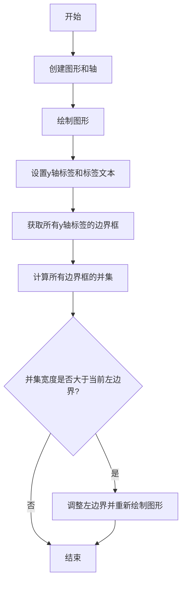
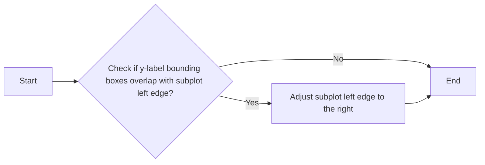
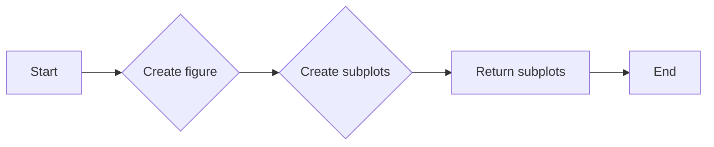
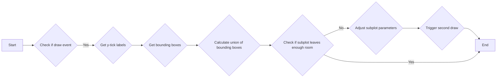
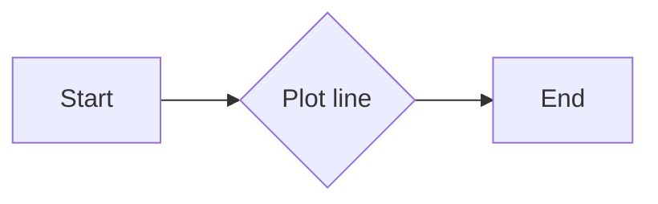
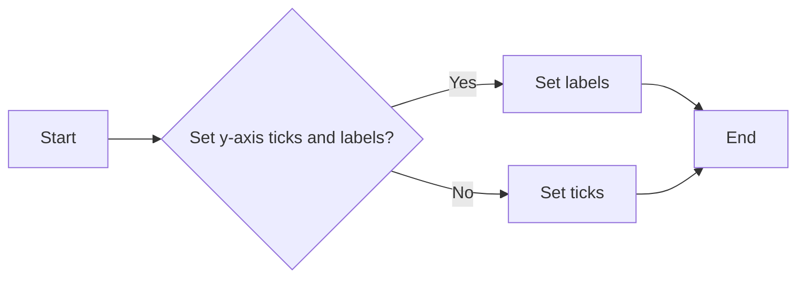
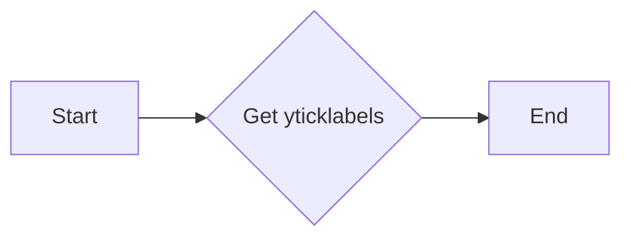
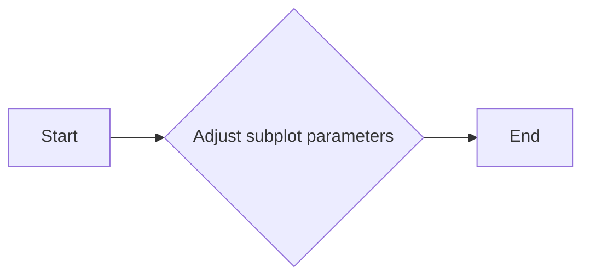
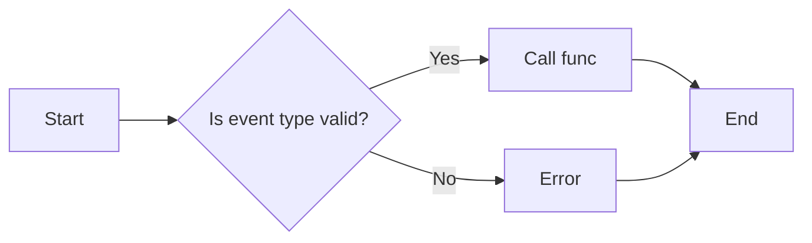

# `matplotlib\galleries\examples\subplots_axes_and_figures\auto_subplots_adjust.py` 详细设计文档

This code dynamically adjusts the subplot parameters in a Matplotlib figure based on the size of the y-labels to ensure there is enough space for the labels.

## 整体流程



## 类结构

```
matplotlib.pyplot (全局模块)
├── fig (全局变量)
│   ├── ax (全局变量)
│   └── canvas (全局变量)
└── on_draw (全局函数)
```

## 全局变量及字段


### `fig`
    
The main figure object containing all the subplots.

类型：`matplotlib.figure.Figure`
    


### `ax`
    
The axes object where the plot is drawn.

类型：`matplotlib.axes._subplots.AxesSubplot`
    


### `canvas`
    
The canvas object that handles the rendering of the figure.

类型：`matplotlib.backends.backend_agg.FigureCanvasAgg`
    


### `{'name': 'matplotlib.pyplot', 'fields': ['fig', 'ax', 'canvas'], 'methods': ['subplots', 'plot', 'set_yticks', 'get_yticklabels', 'subplots_adjust', 'canvas.mpl_connect']}.fig`
    
The main figure object containing all the subplots.

类型：`matplotlib.figure.Figure`
    


### `{'name': 'matplotlib.pyplot', 'fields': ['fig', 'ax', 'canvas'], 'methods': ['subplots', 'plot', 'set_yticks', 'get_yticklabels', 'subplots_adjust', 'canvas.mpl_connect']}.ax`
    
The axes object where the plot is drawn.

类型：`matplotlib.axes._subplots.AxesSubplot`
    


### `{'name': 'matplotlib.pyplot', 'fields': ['fig', 'ax', 'canvas'], 'methods': ['subplots', 'plot', 'set_yticks', 'get_yticklabels', 'subplots_adjust', 'canvas.mpl_connect']}.canvas`
    
The canvas object that handles the rendering of the figure.

类型：`matplotlib.backends.backend_agg.FigureCanvasAgg`
    


### `matplotlib.figure.Figure.fig`
    
The main figure object containing all the subplots.

类型：`matplotlib.figure.Figure`
    


### `matplotlib.axes._subplots.AxesSubplot.ax`
    
The axes object where the plot is drawn.

类型：`matplotlib.axes._subplots.AxesSubplot`
    


### `matplotlib.backends.backend_agg.FigureCanvasAgg.canvas`
    
The canvas object that handles the rendering of the figure.

类型：`matplotlib.backends.backend_agg.FigureCanvasAgg`
    
    

## 全局函数及方法


### on_draw(event)

This function adjusts the subplot parameters based on the bounding boxes of the y-labels in a Matplotlib plot. It is triggered after the figure has been drawn.

参数：

- `event`：`matplotlib.backend_bases.Event`，The draw event object that triggers the function.

返回值：`None`，This function does not return any value.

#### 流程图



#### 带注释源码

```python
def on_draw(event):
    bboxes = []
    for label in ax.get_yticklabels():
        # Bounding box in pixels
        bbox_px = label.get_window_extent()
        # Transform to relative figure coordinates. This is the inverse of
        # transFigure.
        bbox_fig = bbox_px.transformed(fig.transFigure.inverted())
        bboxes.append(bbox_fig)
    # the bbox that bounds all the bboxes, again in relative figure coords
    bbox = mtransforms.Bbox.union(bboxes)
    if fig.subplotpars.left < bbox.width:
        # Move the subplot left edge more to the right
        fig.subplots_adjust(left=1.1*bbox.width)  # pad a little
        fig.canvas.draw()
```


### plt.subplots

`plt.subplots` 是 Matplotlib 库中用于创建子图（subplot）的函数。

参数：

- `figsize`：`tuple`，指定整个图形的大小（宽度和高度）。
- `ncols`：`int`，指定子图的列数。
- `nrows`：`int`，指定子图的行数。
- `sharex`：`bool`，指定是否共享x轴。
- `sharey`：`bool`，指定是否共享y轴。
- `fig`：`Figure`，指定要创建子图的图形对象。
- `gridspec`：`GridSpec`，指定子图的网格布局。

返回值：`AxesSubplot`，子图对象。

#### 流程图



#### 带注释源码

```python
import matplotlib.pyplot as plt

fig, ax = plt.subplots()
```


### on_draw

`on_draw` 是一个自定义的回调函数，用于在图形绘制后调整子图参数。

参数：

- `event`：`Event`，绘图事件对象。

返回值：无。

#### 流程图



#### 带注释源码

```python
def on_draw(event):
    bboxes = []
    for label in ax.get_yticklabels():
        # Bounding box in pixels
        bbox_px = label.get_window_extent()
        # Transform to relative figure coordinates. This is the inverse of
        # transFigure.
        bbox_fig = bbox_px.transformed(fig.transFigure.inverted())
        bboxes.append(bbox_fig)
    # the bbox that bounds all the bboxes, again in relative figure coords
    bbox = mtransforms.Bbox.union(bboxes)
    if fig.subplotpars.left < bbox.width:
        # Move the subplot left edge more to the right
        fig.subplots_adjust(left=1.1*bbox.width)  # pad a little
        fig.canvas.draw()
```


### matplotlib.pyplot.plot

matplotlib.pyplot.plot 是一个用于绘制二维线图的函数。

参数：

- `x`：`array_like`，x轴的数据点。
- `y`：`array_like`，y轴的数据点。
- `label`：`str`，可选，图例标签。
- `color`：`color`，可选，线条颜色。
- `linestyle`：`str`，可选，线条样式。
- `linewidth`：`float`，可选，线条宽度。
- `marker`：`str`，可选，标记样式。
- `markersize`：`float`，可选，标记大小。

返回值：`Line2D`，绘制的线对象。

#### 流程图



#### 带注释源码

```python
import matplotlib.pyplot as plt

fig, ax = plt.subplots()
ax.plot(range(10))
```


### matplotlib.pyplot.set_yticks

`set_yticks` is a method of the `pyplot` module in Matplotlib that sets the y-axis tick locations and optionally the labels.

参数：

- `ticks`：`sequence`，指定y轴的刻度位置。
- `labels`：`sequence`，可选，指定与刻度位置对应的标签。如果未指定，则使用默认标签。

返回值：`None`，该方法不返回任何值。

#### 流程图



#### 带注释源码

```python
import matplotlib.pyplot as plt

fig, ax = plt.subplots()
ax.plot(range(10))
ax.set_yticks([2, 5, 7], labels=['really, really, really', 'long', 'labels'])
```


### matplotlib.pyplot.get_yticklabels

获取当前轴的y轴标签的文本标签列表。

参数：

- 无

返回值：`list`，包含当前轴的y轴标签的文本标签对象列表。

#### 流程图



#### 带注释源码

```python
def get_yticklabels(self):
    """
    Get the yticklabels of the current axis.

    Returns
    -------
    list of Text
        The yticklabels of the current axis.
    """
    return self.get_xticklabels()
```


### matplotlib.pyplot.subplots_adjust

Adjusts the subplot parameters.

参数：

- `left`：`float`，Subplot left edge position in figure coordinates.
- `right`：`float`，Subplot right edge position in figure coordinates.
- `top`：`float`，Subplot top edge position in figure coordinates.
- `bottom`：`float`，Subplot bottom edge position in figure coordinates.
- `wspace`：`float`，Subplot width padding between subplots.
- `hspace`：`float`，Subplot height padding between subplots.

返回值：`None`，No return value.

#### 流程图



#### 带注释源码

```python
def subplots_adjust(left=None, right=None, bottom=None, top=None, wspace=None, hspace=None):
    """
    Adjusts the subplot parameters.

    Parameters
    ----------
    left : float, optional
        Subplot left edge position in figure coordinates.
    right : float, optional
        Subplot right edge position in figure coordinates.
    bottom : float, optional
        Subplot bottom edge position in figure coordinates.
    top : float, optional
        Subplot top edge position in figure coordinates.
    wspace : float, optional
        Subplot width padding between subplots.
    hspace : float, optional
        Subplot height padding between subplots.

    Returns
    -------
    None
    """
    # Adjust subplot parameters
    # ...
```


### matplotlib.pyplot.canvas.mpl_connect

连接一个事件到matplotlib画布的回调函数。

参数：

- `event`: `str`，指定要连接的事件类型。
- `func`: `callable`，当事件发生时调用的函数。

返回值：`None`

#### 流程图



#### 带注释源码

```python
fig.canvas.mpl_connect('draw_event', on_draw)
```

在这段代码中，`mpl_connect` 函数被用来将名为 'draw_event' 的事件连接到 `on_draw` 函数。这意味着每当画布上的 'draw_event' 发生时，`on_draw` 函数将被调用。在这个例子中，当画布绘制完成后，`on_draw` 函数会被触发，用于调整子图参数以适应标签的尺寸。


## 关键组件


### 张量索引与惰性加载

张量索引与惰性加载是代码中用于处理数据结构的核心组件，它允许在需要时才计算或访问数据，从而提高效率。

### 反量化支持

反量化支持是代码中用于处理量化数据的核心组件，它允许在量化与反量化之间进行转换，以适应不同的计算需求。

### 量化策略

量化策略是代码中用于处理数据量化的核心组件，它定义了如何将浮点数转换为固定点数，以减少计算资源的使用。


## 问题及建议


### 已知问题

-   **技术债务**：代码中使用了matplotlib的内部API，如`get_window_extent`和`draw`，这些API可能会在未来版本的matplotlib中发生变化，导致代码需要修改。
-   **性能问题**：在每次绘制事件中，代码都会遍历所有的y标签并计算它们的边界框，这可能会在包含大量标签的图表中导致性能问题。
-   **代码可读性**：代码中的一些操作，如`bbox_fig = bbox_px.transformed(fig.transFigure.inverted())`，可能对不熟悉matplotlib内部工作原理的开发者来说难以理解。

### 优化建议

-   **使用更稳定的API**：考虑使用matplotlib的官方推荐的API，如`get_window_extent`和`draw`，并监控matplotlib的更新日志，以便在API更改时及时更新代码。
-   **优化性能**：如果图表包含大量标签，可以考虑缓存边界框的计算结果，或者使用更高效的数据结构来存储和计算边界框。
-   **提高代码可读性**：添加注释来解释代码中的复杂操作，或者重构代码以提高其可读性。
-   **使用布局管理器**：考虑使用matplotlib的自动布局管理器，如`tight_layout`或`constrainedlayout`，这些管理器可以提供足够的灵活性，同时减少手动调整的需求。
-   **模块化代码**：将调整子图参数的逻辑封装到一个单独的函数或类中，以提高代码的可重用性和可维护性。


## 其它


### 设计目标与约束

- 设计目标：实现一个自动调整子图参数的机制，以确保文本标签有足够的空间。
- 约束条件：必须使用Matplotlib库，且不能使用自动布局机制（如tight_layout或constrainedlayout）。

### 错误处理与异常设计

- 错误处理：确保在获取文本边界框时，如果出现异常（如文本为空），能够捕获异常并给出适当的错误信息。
- 异常设计：定义自定义异常类，以处理特定的错误情况，如无法获取文本边界框。

### 数据流与状态机

- 数据流：从子图的y轴标签获取文本边界框，计算所有边界框的并集，并根据需要调整子图参数。
- 状态机：定义一个状态机来跟踪绘图过程中的不同阶段，如初始化、获取边界框、调整子图参数和重新绘制。

### 外部依赖与接口契约

- 外部依赖：Matplotlib库，特别是matplotlib.artist、matplotlib.transforms、matplotlib.figure和matplotlib.canvas模块。
- 接口契约：定义清晰的接口，确保与其他系统或组件的交互是明确和一致的。


    