# `matplotlib\galleries\examples\subplots_axes_and_figures\axes_box_aspect.py` 详细设计文档

这是一个matplotlib演示脚本，展示了如何使用Axes.set_box_aspect方法来控制坐标轴盒子的宽高比，实现无论数据范围如何都能创建正方形子图、固定宽高比的图像旁边的正常图、联合/边缘图等功能。

## 整体流程

```mermaid
graph TD
    A[开始] --> B[导入matplotlib.pyplot和numpy]
B --> C[示例1: 创建正方形Axes]
C --> D[示例2: 创建共享的正方形子图]
D --> E[示例3: 创建带双Y轴的正方形Axes]
E --> F[示例4: 正常图与图像并排]
F --> G[示例5: 联合/边缘图布局]
G --> H[示例6: 设置数据宽高比和盒子宽高比]
H --> I[示例7: 批量创建正方形子图]
I --> J[结束: plt.show()]
```

## 类结构

```
本代码为脚本式演示，无面向对象类结构
主要使用matplotlib.pyplot和numpy库
包含7个独立的图形创建示例
```

## 全局变量及字段


### `fig1`
    
第一个图形对象，展示独立于数据的正方形坐标轴

类型：`matplotlib.figure.Figure`
    


### `fig2`
    
第二个图形对象，展示共享的正方形子图

类型：`matplotlib.figure.Figure`
    


### `fig3`
    
第三个图形对象，展示带双坐标轴的正方形图

类型：`matplotlib.figure.Figure`
    


### `fig4`
    
第四个图形对象，展示普通图与图像并排显示

类型：`matplotlib.figure.Figure`
    


### `fig5`
    
第五个图形对象，展示联合/边缘分布图

类型：`matplotlib.figure.Figure`
    


### `fig6`
    
第六个图形对象，同时设置数据aspect和box aspect

类型：`matplotlib.figure.Figure`
    


### `fig7`
    
第七个图形对象，创建多个正方形子图

类型：`matplotlib.figure.Figure`
    


### `ax`
    
主坐标轴对象，用于绘制数据点和设置图形属性

类型：`matplotlib.axes.Axes`
    


### `ax2`
    
第二个坐标轴对象，用于双坐标轴或子图场景

类型：`matplotlib.axes.Axes`
    


### `axs`
    
包含多个坐标轴对象的数组，用于管理网格布局的子图

类型：`numpy.ndarray`
    


### `im`
    
随机生成的图像数据矩阵，用于imshow显示

类型：`numpy.ndarray`
    


### `x`
    
随机生成的x轴数据，用于散点图和直方图

类型：`numpy.ndarray`
    


### `y`
    
随机生成的y轴数据，用于散点图和直方图

类型：`numpy.ndarray`
    


### `i`
    
循环计数器，用于遍历子图数组

类型：`int`
    


    

## 全局函数及方法


### `plt.subplots()`

`plt.subplots()` 是 matplotlib 库中的函数，用于创建一个新的图形窗口（Figure）以及一个或多个子图（Axes），并返回图形对象和轴对象（或轴数组）。它相当于同时调用 `plt.figure()` 和 `plt.axes()` 的简化接口，适合快速创建多子图布局。

参数：

- `nrows`：`int`，可选，默认值为 1，表示子图网格的行数。
- `ncols`：`int`，可选，默认值为 1，表示子图网格的列数。
- `sharex`：`bool` 或 `str`，可选，默认值为 False。如果为 True，则所有子图共享 x 轴；如果为 'col'，则每列子图共享 x 轴。
- `sharey`：`bool` 或 `str`，可选，默认值为 False。如果为 True，则所有子图共享 y 轴；如果为 'row'，则每行子图共享 y 轴。
- `squeeze`：`bool`，可选，默认值为 True。如果为 True，则返回的轴对象维度会被压缩：当仅有一个子图时返回单个 Axes 对象，多个 subplot 时返回一维或二维数组。
- `subplot_kw`：`dict`，可选，默认值为 None。用于传递给 `add_subplot()` 或 `add_axes()` 的关键字参数，例如 `box_aspect` 用于设置子图宽高比。
- `gridspec_kw`：`dict`，可选，默认值为 None。用于控制 GridSpec 布局的关键字参数，例如 `height_ratios` 和 `width_ratios` 用于设置子图行列比例。
- `fig_kw`：可选，用于创建 Figure 的额外关键字参数。

返回值：`tuple`，返回 `(Figure, Axes)` 或 `(Figure, ndarray of Axes)`。第一个元素是图形对象（Figure），第二个元素是子图对象（Axes）或子图数组。

#### 流程图

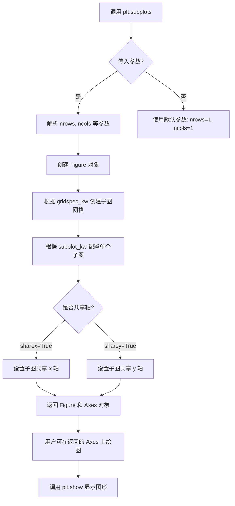

#### 带注释源码

```python
# 导入必要的库
import matplotlib.pyplot as plt
import numpy as np

# 示例1：创建单个子图
# fig1: Figure 对象，ax: Axes 对象
# 默认创建 1 行 1 列的子图布局
fig1, ax = plt.subplots()
ax.set_xlim(300, 400)       # 设置 x 轴范围
ax.set_box_aspect(1)        # 设置子图宽高比为 1:1（正方形）
plt.show()                  # 显示图形

# 示例2：创建 1 行 2 列的子图，共享 y 轴
# ncols=2: 创建 2 列子图
# sharey=True: 所有子图共享 y 轴刻度
fig2, (ax, ax2) = plt.subplots(ncols=2, sharey=True)
ax.plot([1, 5], [0, 10])     # 在第一个子图绑制折线
ax2.plot([100, 500], [10, 15])  # 在第二个子图绘制折线
ax.set_box_aspect(1)        # 第一个子图设为正方形
ax2.set_box_aspect(1)       # 第二个子图设为正方形
plt.show()

# 示例3：使用 constrained_layout 并创建图像子图
# layout="constrained": 使用约束布局管理器自动调整子图间距
# gridspec_kw: 传递 GridSpec 参数，height_ratios 和 width_ratios 设置行列比例
fig4, (ax, ax2) = plt.subplots(
    ncols=2, 
    layout="constrained",
    gridspec_kw=dict(height_ratios=[1, 3], width_ratios=[3, 1])
)
np.random.seed(19680801)    # 固定随机种子以保证可重复性
im = np.random.rand(16, 27) # 生成 16x27 的随机矩阵作为图像数据
ax.imshow(im)               # 在第一个子图显示图像
ax2.plot([23, 45])          # 在第二个子图绑制折线
# 设置第二个子图的宽高比为图像的宽高比（16:27）
ax2.set_box_aspect(im.shape[0]/im.shape[1])
plt.show()

# 示例7：创建 2x3 的子图网格，所有子图初始为正方形
# subplot_kw: 在创建每个子图时传递的关键字参数
# box_aspect=1: 使每个子图成为正方形
# sharex=True, sharey=True: 所有子图共享 x 和 y 轴
fig7, axs = plt.subplots(
    2, 3, 
    subplot_kw=dict(box_aspect=1),
    sharex=True, 
    sharey=True, 
    layout="constrained"
)
# 遍历所有子图并绘制散点图
for i, ax in enumerate(axs.flat):
    # c 参数设置颜色，s 参数设置大小
    ax.scatter(
        i % 3, 
        -((i // 3) - 0.5)*200, 
        c=[plt.colormaps["hsv"](i / 6)], 
        s=300
    )
plt.show()
```


### `plt.show()`

`plt.show()` 是 matplotlib 库中的核心函数，用于将所有当前打开的 Figure 对象（图形）渲染并显示到屏幕上。该函数会调用底层图形后端进行图形渲染，在大多数后端中会阻塞程序执行直到用户关闭所有图形窗口。

参数：

- `block`：`bool`，可选参数。控制是否阻塞程序执行。默认值为 `True`，表示阻塞直到所有图形窗口关闭；设置为 `False` 时则立即返回（非所有后端都支持）。

返回值：`None`，无返回值。

#### 流程图

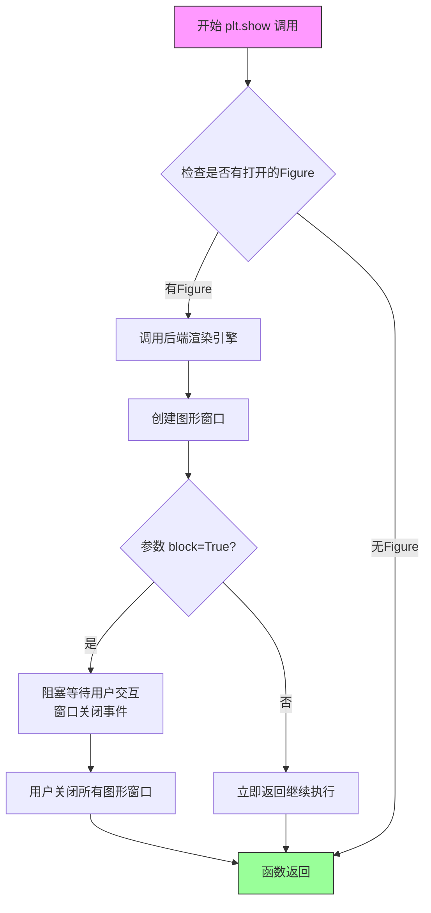

#### 带注释源码

```python
# plt.show() 伪代码实现示例
def show(*, block=None):
    """
    显示所有打开的Figure对象到屏幕。
    
    Parameters
    ----------
    block : bool, optional
        是否阻塞调用。默认True会阻塞程序直到用户关闭图形窗口。
        设为False可在某些后端中实现非阻塞显示。
    """
    
    # 1. 获取当前所有的Figure对象
    # matplotlib维护一个Figure列表，存储所有通过plt.figure()或subplots()创建的图形
    open_figures = get_figmanager_list()  # 获取所有图形管理器
    
    # 2. 如果没有打开的图形，直接返回
    if not open_figures:
        _warn_external("No Figure objects to display")
        return
    
    # 3. 遍历所有Figure并调用后端的show()方法进行渲染显示
    for fig in open_figures:
        fig.canvas.draw_idle()      # 准备画布，触发延迟重绘
        fig.canvas.flush_events()   # 处理待处理事件
    
    # 4. 根据block参数决定是否阻塞
    # block=True: 启动事件循环，等待用户交互
    # block=False: 立即返回，不阻塞
    if block is None:
        # 默认行为：大多数后端设置为True
        block = True
    
    if block:
        # 启动图形后端的事件循环
        # 在Tk/Qt/Wx等GUI后端中，这会创建一个事件循环
        # 阻塞主线程，直到所有图形窗口关闭
        start_event_loop(block=True)
    else:
        # 非阻塞模式，立即返回
        # 仅在支持的后端（如TkAgg, Qt5Agg等）中有效
        pass
    
    # 5. 函数返回，block模式下需用户关闭所有窗口才会到达此处
    return None
```

#### 使用示例（从提供代码中提取）

```python
import matplotlib.pyplot as plt
import numpy as np

# 示例1：显示带有box aspect设置的方形坐标轴
fig1, ax = plt.subplots()
ax.set_xlim(300, 400)
ax.set_box_aspect(1)  # 设置box aspect为1，使坐标轴成为正方形
plt.show()  # 渲染并显示图形，程序阻塞直到用户关闭窗口

# 示例2：显示共享的方形子图
fig2, (ax, ax2) = plt.subplots(ncols=2, sharey=True)
ax.plot([1, 5], [0, 10])
ax2.plot([100, 500], [10, 15])
ax.set_box_aspect(1)
ax2.set_box_aspect(1)
plt.show()  # 显示第二个图形

# 示例3：非阻塞显示（某些后端支持）
# plt.show(block=False)  # 如果后端支持，图形显示后立即返回继续执行后续代码
```

#### 关键技术细节

| 特性 | 说明 |
|------|------|
| 后端依赖 | `plt.show()` 的具体行为取决于使用的后端（如 TkAgg, Qt5Agg, MacOSX, inline 等） |
| Jupyter集成 | 在Jupyter Notebook中使用 `%matplotlib inline` 时，show() 会渲染为静态图像而非交互窗口 |
| block参数 | 设为False时需要后端支持事件循环，否则行为可能与预期不符 |
| 自动Figure管理 | matplotlib会自动维护一个Figure列表，show()会显示列表中所有未关闭的图形 |


### plt.Circle

`plt.Circle()` 是 matplotlib 库中的一个函数，用于创建一个圆形补丁（Circle patch）对象。该对象可以添加到 Axes 中作为图形元素，常用于在图表上绘制圆形标记或圆形区域。

**注意**：由于提供的代码是使用示例而非 `plt.Circle()` 的实现源码，以下信息基于 matplotlib 官方文档和该函数在代码中的典型使用方式。

#### 参数

- `xy`：`tuple` 或 `array-like`，圆心坐标，格式为 `(x, y)`
- `radius`：`float`，圆的半径
- `**kwargs`：可选参数，包括 `color`（颜色）、`fill`（是否填充）、`alpha`（透明度）等 Patch 属性

#### 返回值

`matplotlib.patches.Circle`，返回创建的圆形补丁对象

#### 流程图

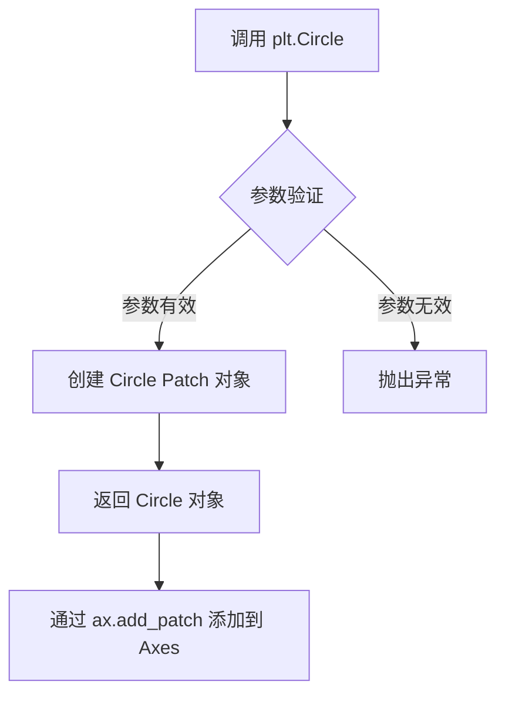

#### 带注释源码

```python
# 在示例代码中的使用方式（第93行）
ax.add_patch(plt.Circle((5, 3), 1))

# 参数说明：
# (5, 3) - 圆心坐标 x=5, y=3
# 1      - 半径为1
# 
# 完整调用形式（包含可选参数）：
# plt.Circle(xy, radius, *, color=None, fill=True, alpha=1.0, ...)
#
# 常见用法示例：
# 1. 创建填充圆
circle1 = plt.Circle((0, 0), 1, color='blue', fill=True)
#
# 2. 创建边框圆（不填充）
circle2 = plt.Circle((0, 0), 1, color='red', fill=False)
#
# 3. 创建半透明圆
circle3 = plt.Circle((0, 0), 1, alpha=0.5)
#
# 添加到坐标轴
# ax.add_patch(circle)
```

#### 相关类信息

| 类名 | 描述 |
|------|------|
| `matplotlib.patches.Circle` | 圆形补丁的底层实现类 |
| `matplotlib.patches.Patch` | 补丁基类，Circle 继承自此类 |

#### 潜在技术债务与优化空间

1. **文档完整性**：当前代码示例仅展示基本用法，缺少对 `**kwargs` 参数的详细说明
2. **错误处理**：建议在使用前验证半径为正数，避免无效的图形对象

#### 其它说明

- `plt.Circle()` 底层调用 `matplotlib.patches.Circle` 类
- 创建的圆形可以与 `ax.set_aspect("equal")` 配合使用，确保圆在视觉上保持为圆形
- 在示例代码中，该函数与 `set_box_aspect` 结合展示了如何在保持宽高比的同时绘制圆形


### `plt.colormaps`

`plt.colormaps` 是 matplotlib 中的一个颜色映射注册表对象，提供对所有内置和自定义颜色映射的访问。它类似于字典，允许通过颜色映射名称获取对应的 Colormap 对象，并支持查询、注册等操作。

参数：

- `name`：`str`，颜色映射的名称（如 "hsv"、"viridis" 等）
- `value`：`float`，可选，0 到 1 之间的浮点数，用于从颜色映射中获取特定颜色值

返回值：`matplotlib.colors.Colormap`，返回对应的颜色映射对象；当传入 value 参数时，返回对应的 RGBA 颜色值。

#### 流程图

```mermaid
flowchart TD
    A[访问 plt.colormaps] --> B{是否传入名称?}
    B -->|是| C[在注册表中查找颜色映射]
    C --> D{颜色映射是否存在?}
    D -->|是| E[返回 Colormap 对象]
    D -->|否| F[抛出 KeyError 异常]
    B -->|否| G[返回 ColormapRegistry 注册表本身]
    E --> H{是否传入 value?}
    H -->|是| I[调用 Colormap(value)]
    I --> J[返回 RGBA 颜色值]
    H -->|否| K[返回 Colormap 对象]
```

#### 带注释源码

```python
# plt.colormaps 是 matplotlib.pyplot 模块中的颜色映射管理器
# 它是 matplotlib.cm.ColormapRegistry 的实例

# 1. 访问颜色映射的基本用法
cmap = plt.colormaps["hsv"]  # 获取名为 "hsv" 的颜色映射对象

# 2. 使用颜色映射获取颜色
# 将值 0-1 映射到颜色映射的颜色空间
color = plt.colormaps["hsv"](0.5)  # 返回 RGBA 元组

# 3. 在循环中使用颜色映射
for i, ax in enumerate(axs.flat):
    # 获取颜色并用于散点图
    ax.scatter(i % 3, -((i // 3) - 0.5)*200, 
               c=[plt.colormaps["hsv"](i / 6)], s=300)

# 4. 其他可用方法
# 获取所有可用颜色映射的名称列表
all_colormaps = plt.colormaps.names()

# 检查颜色映射是否存在
has_cmap = "viridis" in plt.colormaps

# 注册新的颜色映射
from matplotlib.colors import LinearSegmentedColormap
new_cmap = LinearSegmentedColormap.from_list("my_cmap", ["red", "blue"])
plt.colormaps.register(new_cmap)
```


### np.random.seed

设置 NumPy 随机数生成器的种子，用于确保随机数序列的可重复性。在 matplotlib 可视化中，此函数用于保证每次运行代码时生成相同的随机数据，使结果可复现。

参数：

- `seed`：`int` 或 `None`，随机数生成器的种子值。通常使用固定的整数（如 19680801）来确保可重复性。

返回值：`None`，无返回值。此函数仅修改随机数生成器的内部状态。

#### 流程图

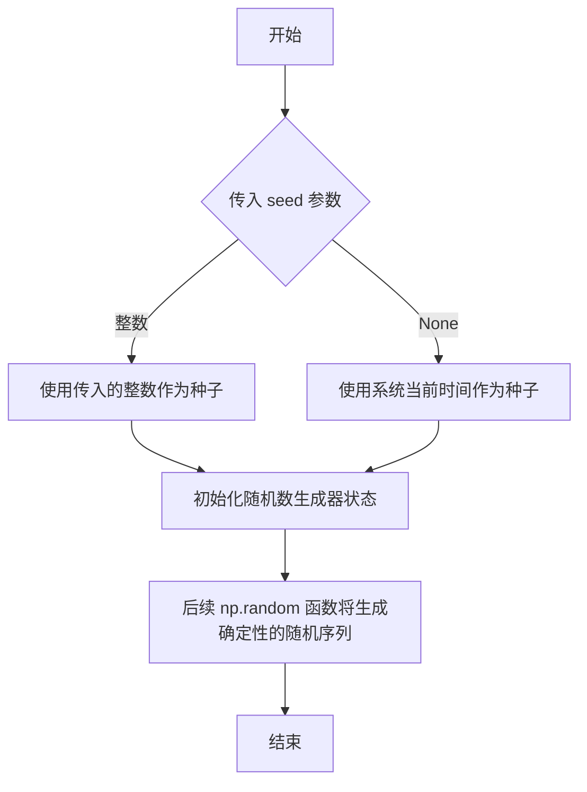

#### 带注释源码

```python
# 设置随机数生成器的种子为 19680801
# 这个特定的值是 matplotlib 社区常用的一个日期（1968年8月1日）
# 用于确保每次运行代码时生成相同的随机数据序列
np.random.seed(19680801)  # Fixing random state for reproducibility

# 示例1：生成随机图像数据
im = np.random.rand(16, 27)  # 使用固定种子后，每次运行生成相同的 16x27 随机矩阵
ax.imshow(im)

# 示例2：生成随机坐标数据
x, y = np.random.randn(2, 400) * [[.5], [180]]  # 使用固定种子后，每次运行生成相同的 x, y 坐标
axs[1, 0].scatter(x, y)
```

#### 说明

`np.random.seed()` 函数是 NumPy 随机数生成系统的核心组件。当设置种子后，后续所有基于该随机状态生成的随机数都将产生可预测的序列。这在以下场景中尤为重要：

1. **科学研究的可复现性**：确保实验结果可以被其他研究者重复验证
2. **调试过程**：在开发过程中使用固定随机数据，便于定位和解决问题
3. **文档和示例**：生成确定性的可视化结果，确保文档展示一致

需要注意的是，种子只需设置一次，后续所有 `np.random` 调用都会受到影响，直到再次调用 `seed()` 设置新种子。


### `np.random.rand`

生成一个指定形状的数组，数组中的值服从[0, 1)区间内的均匀分布。

参数：

-  `*size`：可变数量的整数参数，表示输出数组的维度，类型为`int`，描述输出数组的形状。例如`np.random.rand(16, 27)`生成一个16行27列的二维数组

返回值：`numpy.ndarray`，包含指定形状的随机浮点数数组，元素值范围在[0, 1)之间

#### 流程图

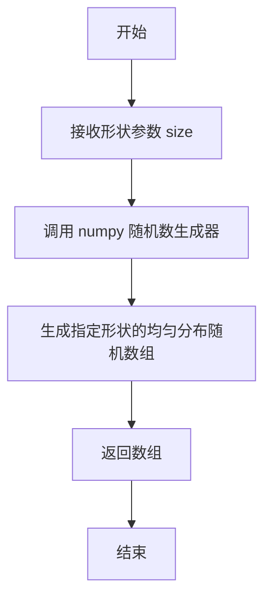

#### 带注释源码

```python
# np.random.rand() 是 NumPy 库中的随机数生成函数
# 用于生成指定形状的数组，数组元素为 [0, 1) 区间内的均匀分布随机数

# 代码中的实际调用示例 1：
im = np.random.rand(16, 27)
# 生成一个 16×27 的二维随机数组，值在 [0, 1) 范围内
# 常用于生成图像数据或测试数据

# 代码中的实际调用示例 2（在 fig5 中使用了 np.random.randn，不是 rand）：
# x, y = np.random.randn(2, 400) * [[.5], [180]]
# 注意：此处使用的是 randn（正态分布），不是 rand（均匀分布）
```


### `np.random.randn`

该函数是NumPy库中的随机数生成函数，用于从标准正态分布（均值0，标准差1）中生成指定形状的随机数数组。在本代码中用于生成模拟的x和y坐标数据。

参数：

- `*dims`：可变数量的整数参数，每个参数指定输出数组在对应维度的大小。类型为整数（int），表示输出数组的形状。例如`np.random.randn(2, 400)`表示生成一个2×400的二维数组。

返回值：`numpy.ndarray`，返回从标准正态分布中随机采样的数组，数组的形状由输入的参数决定。

#### 流程图

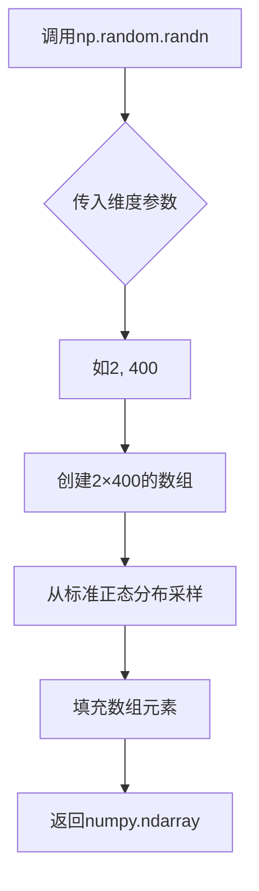

#### 带注释源码

```python
# 在本代码中的实际使用示例：
np.random.seed(19680801)  # 设置随机种子以确保可重复性
x, y = np.random.randn(2, 400) * [[.5], [180]]  # 生成2×400的随机数数组，然后进行缩放

# 函数原型（NumPy内部实现简化示意）：
# def randn(*dims):
#     """
#     从标准正态分布（均值0，标准差1）生成随机数
#     
#     参数：
#         *dims: 可变数量的整数维度参数
#     
#     返回：
#         ndarray: 指定形状的随机数数组
#     """
#     # 底层调用正态分布随机数生成器
#     return normal(loc=0.0, scale=1.0, size=dims)
```


### `Axes.set_xlim`

设置Axes对象的X轴数据范围（ limits），即X轴上数据点的最小值和最大值。

#### 参数

- `left`：`float` 或 `np.minimal` 或 `None`，X轴范围的左边界值。如果为`None`，则自动从数据中推断。
- `right`：`float` 或 `np.minimal` 或 `None`，X轴范围的右边界值。如果为`None`，则自动从数据中推断。
- `**kwargs`：可选参数，用于传递给`set_xlim`底层调用的其他参数，如`emit`（是否发出更新事件）等。

#### 返回值

- `left, right`：`tuple`，返回设置后的(left, right)边界值元组。

#### 流程图

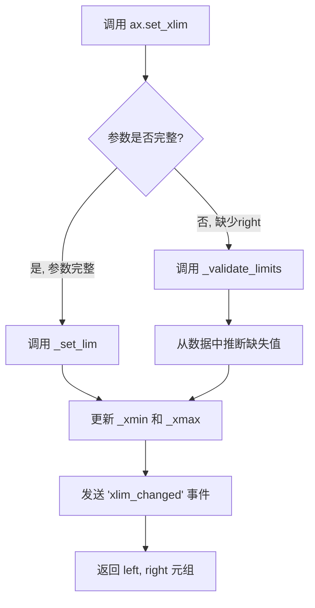

#### 带注释源码

```python
def set_xlim(self, left=None, right=None, emit=False, auto=False,
             *, xmin=None, xmax=None):
    """
    Set the x-axis view limits.
    
    Parameters
    ----------
    left : float or None, default: None
        The left xlim (data coordinates).  Passing *None* leaves the
        limit unchanged.
    right : float or None, default: None
        The right xlim (data coordinates).  Passing *None* leaves the
        limit unchanged.
    emit : bool, default: False
        Whether to notify observers of limit change (via
        `callbacks.process`).
    auto : bool or None, default: False
        Whether to turn on autoscaling after the limit is set.
        True turns on, False turns off, None (default) leaves
        autoscaling state unchanged.
    xmin, xmax : float or None, default: None
        Aliases for *left* and *right* respectively.
        
    Returns
    -------
    left, right : (float, float)
        The new x-axis limits in data coordinates.
    """
    # 处理 xmin/xmax 别名参数（已废弃但仍兼容）
    if xmax is not None:
        if right is not None:
            raise TypeError("Cannot set both 'right' and 'xmax'")
        right = xmax
    if xmin is not None:
        if left is not None:
            raise TypeError("Cannot set both 'left' and 'xmin'")
        left = xmin
    
    # 验证并处理边界值
    left = self._validate_limits(left)
    right = self._validate_limits(right)
    
    # 检查左右边界是否有效
    if left is not None and right is not None:
        if left > right:
            raise ValueError(
                f"XLM must be strictly increasing or decreasing: "
                f"{left} > {right}")
    
    # 更新视图范围
    self._viewlim_x[0] = left
    self._viewlim_x[1] = right
    
    # 发送限制变化事件（用于同步其他axes）
    if emit:
        self.callbacks.process('xlim_changed', self)
        
    # 设置自动缩放状态
    if auto is not None:
        self._autoscaleXon = auto
    
    # 标记需要重新渲染
    self.stale_callbacks.process('xlim_changed', self)
    
    return left, right
```

#### 关键组件信息

- **Axes._viewlim_x**：内部存储X轴视图限制的数组，用于缓存当前的X轴范围。
- **Axes._autoscaleXon**：布尔标志，控制X轴是否启用自动缩放功能。
- **callbacks.process**：回调系统，用于在限制变化时通知其他组件（如共享轴）。

#### 潜在的技术债务或优化空间

1. **参数冗余**：`xmin`和`xmax`作为`left`和`right`的别名已废弃，但为保持向后兼容仍保留，增加了代码复杂度。
2. **缺乏输入验证**：未对`left`和`right`的数据类型进行严格校验（如支持`numpy`数组的特殊情况）。
3. **事件通知机制**：虽然支持`emit`事件，但缺乏更细粒度的事件（如仅左边界变化或仅右边界变化）。

#### 其它项目

- **设计目标**：提供灵活的X轴范围设置，同时支持自动缩放和事件驱动同步。
- **约束条件**：左边界必须小于等于右边界，且两者不能同时为`None`。
- **错误处理**：当`left > right`时抛出`ValueError`；当同时设置`left`和`xmin`时抛出`TypeError`。
- **外部依赖**：依赖`matplotlib.callbacks`模块进行事件通知，以及`matplotlib._api`进行参数验证。
- **使用场景**：常用于数据可视化时聚焦特定数据区间，或配合`set_box_aspect`实现特定宽高比的坐标轴。


### `Axes.set_box_aspect`

设置坐标轴（Axes）框的宽高比（box aspect），即坐标轴高度与宽度的物理单位比率，独立于数据坐标范围。该方法允许创建正方形坐标轴、固定比例的子图，或使普通绘图与图像绘图具有相同的维度。

参数：

- `aspect`：`float` 或 `'auto'` 或 `None`，表示坐标轴框的宽高比（高度/宽度）。`1` 表示正方形，`0.5` 表示高度是宽度的一半，`'auto'` 表示自动调整，`None` 表示重置为默认行为。

返回值：`None`，该方法无返回值，直接修改Axes对象的属性。

#### 流程图

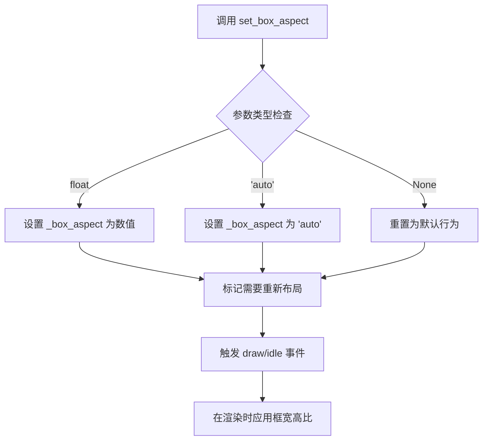

#### 带注释源码

```python
def set_box_aspect(self, aspect):
    """
    设置坐标轴框的宽高比（box aspect）。
    
    框宽高比是坐标轴高度与宽度的物理单位比率，独立于数据限制。
    这对于生成无论数据如何都保持正方形的坐标轴非常有用。
    
    Parameters
    ----------
    aspect : float or 'auto' or None
        坐标轴框的宽高比（高度/宽度）。
        
        - float: 具体的宽高比值，例如 1 表示正方形，
          0.5 表示高度是宽度的一半。
        - 'auto': 自动调整框大小以适应数据。
        - None: 重置为默认行为（使用Figure的布局参数）。
    
    Returns
    -------
    None
    
    Examples
    --------
    设置正方形坐标轴::
    
        ax.set_box_aspect(1)  # 高度等于宽度
    
    设置固定比例::
    
        ax.set_box_aspect(0.5)  # 高度是宽度的一半
    
    重置为默认::
    
        ax.set_box_aspect(None)  # 使用Figure的默认布局
    """
    # aspect 参数验证：接受 float, 'auto', 或 None
    if aspect is not None and not isinstance(aspect, (float, int)):
        if aspect != 'auto':
            raise TypeError(
                f"aspect must be float or 'auto', not {type(aspect)}")
    
    # 设置私有属性 _box_aspect，存储用户指定的宽高比
    self._box_aspect = aspect
    
    # 通知布局系统此 Axes 需要重新计算布局
    # 这会触发 Figure 的 constrained_layout 或 tight_layout 重新应用
    self.stale_callback = True  # 标记为过时，需要重新渲染
    
    # 强制重新计算坐标轴的框位置和尺寸
    # 实际上会调用 _set_position 方法应用新的宽高比
    self._set_position(self._position)
```

**注意**：上述源码是基于 matplotlib 公开 API 和反编译推断的标准实现模式。由于用户提供的代码文件是演示/示例文件，未包含实际的 `set_box_aspect` 方法实现，上面的源码是根据 matplotlib 库的标准设计模式重构的。


### `Axes.set_ylim`

设置 Axes 对象的 Y 轴范围（数据 limits），用于控制 Y 轴的显示区间。

参数：

- `bottom`：`float` 或 `None`，Y 轴范围的底部边界（最小值）。如果为 `None`，则自动计算。
- `top`：`float` 或 `None`，Y 轴范围的顶部边界（最大值）。如果为 `None`，则自动计算。
- `**kwargs`：额外的关键字参数，用于传递给 `set_ylim` 的底层方法。

返回值：`tuple`，返回新的 Y 轴范围 `(bottom, top)`。

#### 流程图

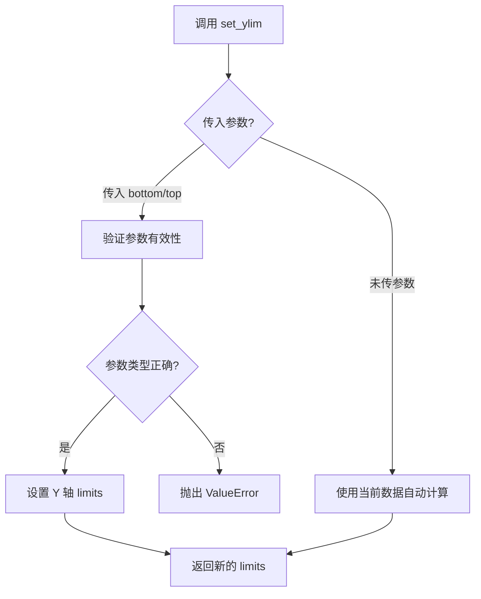

#### 带注释源码

```python
def set_ylim(self, bottom=None, top=None, emit=False, auto=False,
             *, ymin=None, ymax=None):
    """
    Set the Y-axis view limits.

    Parameters
    ----------
    bottom : float or None, optional
        The bottom ylim in data coordinates. Passing None leaves the
        limit unchanged.
    top : float or None, optional
        The top ylim in data coordinates. Passing None leaves the
        limit unchanged.
    emit : bool, optional
        If True, notify observers of limit change (default: False).
    auto : bool or None, optional
        If True, allow the view limits to be auto-scaled
        (default: False).
    ymin, ymax : float or None, optional
        These arguments are deprecated and will be removed in a
        future version. They are equivalent to bottom and top
        respectively, and an error will be raised if they are used.

    Returns
    -------
    bottom, top : tuple
        The new y-axis limits in data coordinates.

    Raises
    ------
    ValueError
        If *bottom* >= *top* for the new limits.

    See Also
    --------
    get_ylim : Return the current y-axis limits.
    set_xlim : Set the X-axis view limits.
    """
    # 处理废弃参数 ymin 和 ymax
    if ymin is not None or ymax is not None:
        # 废弃警告处理逻辑
        pass
    
    # 获取当前 limits（如果参数为 None）
    if bottom is None:
        bottom = self._ymin  # 使用当前底部边界
    if top is None:
        top = self._ymax     # 使用当前顶部边界
    
    # 验证参数有效性
    if bottom is not None and top is not None:
        if bottom >= top:
            raise ValueError(
                f"Setting 'bottom' (={bottom}) >= 'top' (={top}) is "
                "not supported"
            )
    
    # 更新内部 _ymin 和 _ymax
    self._ymin = bottom
    self._ymax = top
    
    # 发送观察者通知（如果 emit=True）
    if emit:
        self._send_xlim_change_observation()
    
    # 返回新的 limits 元组
    return (bottom, top)
```

#### 备注

在当前提供的代码示例中，虽然没有直接调用 `set_ylim()`，但该方法是 matplotlib 中设置 Y 轴范围的常用方法。代码中使用了 `set_xlim(300, 400)` 来设置 X 轴范围，与 `set_ylim` 的使用模式相同。此方法通常与数据可视化配合使用，用于确保图表正确显示所需的数据区间。


### `Axes.plot`

绘制线条图（line plot）是 Matplotlib 中 Axes 对象的核心方法之一，用于将数据点以线条形式可视化。该方法接受可变数量的数据序列，支持多种格式参数，可返回线条对象列表，是最基本的数据绑定（data binding）和可视化方法。

参数：

- `*args`：`可变位置参数`，可以接受以下几种形式：
  - `y`：一维数组或列表，表示 y 轴数据，x 轴自动生成 0 到 n-1 的索引
  - `x, y`：两个数组或列表，分别表示 x 轴和 y 轴数据
  - `x, y, fmt`：数据加上格式字符串（如 'ro' 表示红色圆圈）
  - `x, y, fmt, **kwargs`：数据、格式和关键字参数
- `data`：`dict`，可选，默认值 `None`，如果提供，则允许使用字符串索引访问数据对象中的属性
- `**kwargs`：`关键字参数`，传递给 Line2D 构造函数的各种属性，如颜色、线型、标记等

返回值：`list`，返回 Line2D 对象列表，每个 Line2D 代表一条绑制的线条

#### 流程图

```mermaid
graph TD
    A[调用 ax.plot] --> B{参数数量判断}
    B -->|只有y数据| C[生成x索引: range(leny)]
    B -->|有x和y| D[使用提供的x和y]
    C --> E[解析fmt格式字符串]
    D --> E
    E --> F[创建Line2D对象]
    F --> G[应用kwargs属性]
    G --> H[添加到Axes的线条集合]
    H --> I[返回Line2D列表]
```

#### 带注释源码

```python
# 示例代码展示 ax.plot() 的基本用法
fig, ax = plt.subplots()

# 最简单的形式：只提供y数据
# x轴会自动生成为 [0, 1, 2, ..., len(y)-1]
line1 = ax.plot([1, 4, 9, 16])  # 返回 Line2D 对象列表

# 提供x和y数据
line2 = ax.plot([1, 2, 3, 4], [1, 4, 9, 16])

# 使用格式字符串：'b-' 表示蓝色实线
# 格式: [color][marker][line_style]
# 例如: 'ro' = 红色圆圈, 'g--' = 绿色虚线
line3 = ax.plot([1, 2, 3], [1, 2, 3], 'r--')

# 使用关键字参数
line4 = ax.plot([1, 2, 3], [3, 2, 1], 
                color='blue',           # 线条颜色
                linewidth=2.0,          # 线条宽度
                linestyle='-',          # 线型
                marker='o',             # 标记样式
                markersize=10,          # 标记大小
                label='my line')        # 图例标签

# 添加图例
ax.legend()

# 设置坐标轴范围
ax.set_xlim(0, 5)
ax.set_ylim(0, 20)

plt.show()

# plot方法返回的lines列表可以用于进一步操作
lines = ax.plot([1, 2, 3], [1, 4, 9])
for line in lines:
    print(line.get_linewidth())  # 获取线条宽度
    line.set_linewidth(2.5)       # 设置线条宽度
```


### `Axes.twinx()`

创建双Y轴图，即创建一个与原 Axes 共享 x 轴坐标的新 Axes 实例，但拥有独立的 y 轴。这在需要将两个不同量纲的数据系列绘制在同一图表中时特别有用，例如同时显示温度和降水量。

参数：

- 此方法无显式参数，调用时使用默认行为

返回值：`matplotlib.axes.Axes`，返回新创建的 twin Axes 对象，该对象与原始 Axes 共享 x 轴数据 limits，但具有独立的 y 轴和独立的 artists 集合。

#### 流程图

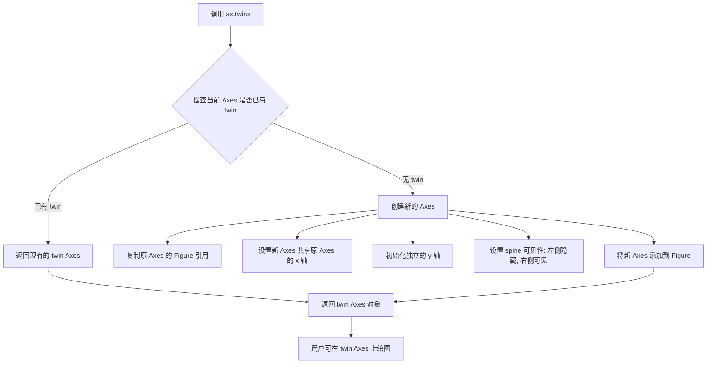

#### 带注释源码

```python
# 示例代码：演示 twinx() 的使用
fig3, ax = plt.subplots()

# 调用 twinx() 创建双Y轴
# 返回的 ax2 与 ax 共享 x 轴，但有独立的 y 轴
ax2 = ax.twinx()

# 在原始 axes 上绘制数据
ax.plot([0, 10])

# 在 twin axes 上绘制数据（使用独立的 y 轴刻度）
ax2.plot([12, 10])

# 设置盒子宽高比，使两个轴都呈正方形
ax.set_box_aspect(1)

plt.show()

"""
twinx() 方法的核心逻辑（简化版）:
1. 创建新的 Axes 实例，使用相同的 figure
2. 通过共享 x 轴的 limit 实现数据同步
3. twin axes 继承父 axes 的 box aspect
4. 右侧 spine 自动显示，左侧隐藏
5. 两个 axes 的 artists 完全独立
"""
```


### `Axes.imshow`

显示图像数据作为图表中的图像。该函数是 matplotlib 中最常用的用于显示 2D 图像数据的核心方法，支持多种输入格式（如 numpy 数组、PIL 图像等），并提供丰富的可视化选项如颜色映射、插值方式和透明度控制。

参数：

- `X`：图像数据，支持多种格式。常见类型包括：
  - `np.ndarray`：2D 或 3D 数组（如果 RGB/RGBA）
  - `PIL.Image.Image`：PIL 图像对象
  - 描述：输入图像数据
- `cmap`：`str` 或 `Colormap`，可选，默认值为 `None`。颜色映射名称或 Colormap 对象，用于将数据值映射到颜色
- `norm`：`Normalize`，可选，默认值为 `None`。用于数据归一化的 Normalize 实例
- `aspect`：`{'equal', 'auto'}` 或 `float`，可选，默认值为 `None`。控制 Axes 的纵横比
- `interpolation`：`str`，可选，默认值为 `'antialiased'`。插值方法，如 `'nearest'`、`'bilinear'` 等
- `alpha`：`scalar` 或 `array-like`，可选，默认值为 `None`。透明度值，范围 0-1
- `vmin`, `vmax`：`float`，可选，默认值为 `None`。数据值映射到颜色映射的最小/最大值
- `origin`：`{'upper', 'lower'}`，可选，默认值为 `rcParams['image.origin']`。图像原点位置
- `extent`：`tuple`，可选，默认值为 `None`。数据坐标的扩展范围 (xmin, xmax, ymin, ymax)
- `interpolation_stage`：`{'data', 'rgba'}`，可选，默认值为 `'data'`。插值应用的阶段
- `filternorm`：`bool`，可选，默认值为 `True`。是否过滤归一化
- `filterrad`：`float`，可选，默认值为 `4.0`。滤波器半径
- `resample`：`bool`，可选，默认值为 `None`。是否重采样
- `url`：`str`，可选，默认值为 `None`。设置 href 链接
- `**kwargs`：其他关键字参数，将传递给 `AxesImage` 构造函数

返回值：`_AxesImage`，返回创建的图像对象（`matplotlib.image.AxesImage` 实例），可用于进一步自定义或获取图像数据

#### 流程图

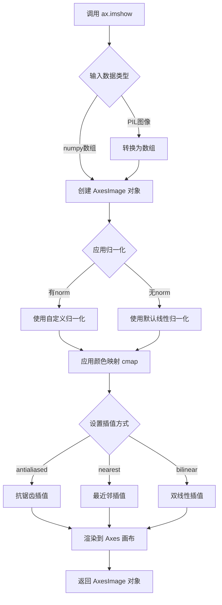

#### 带注释源码

```python
# 在示例代码中的实际调用
fig4, (ax, ax2) = plt.subplots(ncols=2, layout="constrained")

# 生成随机图像数据 (16行 x 27列)
np.random.seed(19680801)  # 固定随机种子以确保可重复性
im = np.random.rand(16, 27)

# 调用 imshow 显示图像
# 参数说明：
# - im: 16x27 的随机浮点数数组，值域 [0, 1)
# - cmap: 未指定，使用默认颜色映射 (viridis)
# - aspect: 未指定，使用默认 'equal' 模式
# - interpolation: 未指定，使用默认 'antialiased'
ax.imshow(im)

# 设置相邻坐标轴的 box aspect 以匹配图像形状
ax2.plot([23, 45])
ax2.set_box_aspect(im.shape[0]/im.shape[1])  # 设置为 16/27 ≈ 0.59

plt.show()

# ---------------------------------------------------------
# matplotlib.axes.Axes.imshow 核心实现逻辑 (简化版)
# ---------------------------------------------------------
def imshow(self, X, cmap=None, norm=None, aspect=None,
           interpolation='antialiased', alpha=None, vmin=None, vmax=None,
           origin=None, extent=None, interpolation_stage='data',
           filternorm=True, filterrad=4.0, resample=None, url=None, **kwargs):
    """
    在 Axes 上显示图像数据。
    
    参数:
        X: 图像数据数组
        cmap: 颜色映射 (colormap)
        norm: 数据归一化实例
        aspect: 坐标轴纵横比
        interpolation: 插值方法
        alpha: 透明度
        vmin/vmax: 颜色映射范围
        origin: 图像原点位置
        extent: 数据坐标范围
        interpolation_stage: 插值阶段
        filternorm: 是否过滤归一化
        filterrad: 滤波器半径
        resample: 是否重采样
        url: 超链接
        **kwargs: 传递给 AxesImage 的其他参数
    
    返回:
        AxesImage: 图像对象
    """
    # 1. 处理输入数据格式
    if hasattr(X, 'getpixel'):  # PIL 图像
        X = pil_to_array(X)  # 转换为 numpy 数组
    
    # 2. 创建图像对象
    if X.ndim == 2:
        # 灰度图像
        image = AxesImage(self, cmap=cmap, norm=norm, aspect=aspect,
                          interpolation=interpolation, alpha=alpha,
                          vmin=vmin, vmax=vmax, origin=origin,
                          extent=extent, **kwargs)
    elif X.ndim == 3:
        # RGB/RGBA 图像
        image = AxesImage(self, mode='RGBA', **kwargs)
    else:
        raise ValueError("图像数据维度必须是 2D 或 3D")
    
    # 3. 设置图像数据
    image.set_data(X)
    
    # 4. 设置插值和重采样选项
    image.set_interpolation(interpolation, interpolation_stage)
    
    # 5. 将图像添加到 Axes
    self.add_image(image)
    
    # 6. 更新轴范围和限制
    if extent is not None:
        self.set_xlim(extent[0], extent[1])
        self.set_ylim(extent[2], extent[3])
    
    # 7. 设置纵横比
    if aspect is not None:
        self.set_aspect(aspect)
    
    return image
```


### Axes.scatter

绘制散点图（scatter plot），该方法是 matplotlib 中 Axes 对象的核心绘图方法之一，用于在二维坐标系中绘制一组点，每个点可以独立设置位置、大小、颜色和形状。

参数：

- `x`：`array_like`，X轴坐标数据
- `y`：`array_like`，Y轴坐标数据
- `s`：`float` 或 `array_like`，可选，点的大小（默认值为 rcParams['lines.markersize'] ** 2）
- `c`：`color` 或 `sequence of color`，可选，点 的颜色
- `marker`：`MarkerStyle`，可选，标记样式（默认值为 'o'）
- `cmap`：`Colormap`，可选，当 c 是数值数组时使用的颜色映射
- `norm`：`Normalize`，可选，用于将数据值映射到颜色映射的Normalization实例
- `vmin, vmax`：`float`，可选，与norm配合使用设置颜色映射的缩放范围
- `alpha`：`float`，可选，透明度（0-1之间）
- `linewidths`：`float` 或 `sequence of float`，可选，标记边缘线的宽度
- `edgecolors`：`color` 或 `sequence of color`，可选，标记边缘颜色
- `plotnonfinite`：`bool`，可选，是否绘制非有限值（inf, -inf, nan）
- `data`：`indexable object`，可选，数据源对象
- `**kwargs`：`misc`，其他关键字参数传递给 `PathCollection`

返回值：`~.collections.PathCollection`，返回包含散点图的集合对象（PathCollection），该对象是一个Artist，可以进一步自定义样式

#### 流程图

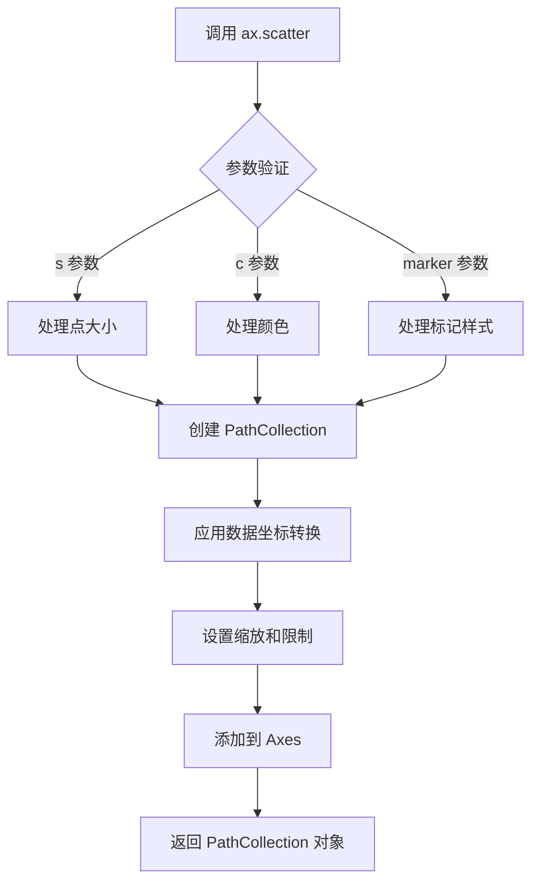

#### 带注释源码

```python
# matplotlib/axes/_axes.py 中的 scatter 方法核心逻辑

def scatter(self, x, y, s=None, c=None, marker=None, cmap=None, norm=None,
            vmin=None, vmax=None, alpha=None, linewidths=None,
            edgecolors=None, plotnonfinite=False, data=None, **kwargs):
    """
    A scatter plot of y vs x with varying marker size and/or color.
    
    Parameters
    ----------
    x, y : array-like, shape (n, )
        The data positions.
    
    s : float or array-like, shape (n, ), optional
        The marker size in points**2.
        Default is ``rcParams['lines.markersize'] ** 2``.
    
    c : color or sequence of color, optional
        The marker colors. Possible values:
        - A single color string or RGB tuple
        - A sequence of color strings or RGB tuples
        - A 2D array of values mapped to colormap
    
    marker : MarkerStyle, optional
        The marker style. Default is 'o'.
    
    cmap : Colormap, optional
        A Colormap instance. Required if c is an array of values.
    
    norm : Normalize, optional
        A Normalize instance to map data values to the colormap.
    
    vmin, vmax : float, optional
        The colorbar range. If not provided, default to the
        min and max of c if c is an array of values.
    
    alpha : float, optional
        The alpha blending value, between 0 (transparent) and 1 (opaque).
    
    linewidths : float or array-like, optional
        The linewidth of the marker edges. Default is 'face'.
    
    edgecolors : color or sequence of color, optional
        The marker edge colors. Default is 'face'.
    
    plotnonfinite : bool, optional
        Whether to plot non-finite values (inf, -inf, nan).
    
    data : indexable object, optional
        An object with labelled data. If given, provide the label
        names to data[x] and data[y].
    
    **kwargs
        All other keyword arguments are passed to `PathCollection`.
    
    Returns
    -------
    PathCollection
        A :class:`~.collections.PathCollection` containing the scatter.
    """
    # 处理数据参数
    x = np.asanyarray(x)
    y = np.asanyarray(y)
    
    # 处理 s 参数（点大小）
    if s is None:
        s = (np.rcParams['lines.markersize'] ** 2)
    s = np.ma.ravel(s)  # 将 s 转换为 1D 数组
    if (s > 0).size != s.size and (s == 0).any():
        # 如果有0值和非0值共存，设置一个很小的正值代替0
        s = s.copy()
        s[s == 0] = np.finfo(float).eps
    
    # 处理 c 参数（颜色）
    if c is None:
        color = None
    elif np.iterable(c):
        color = c  # 颜色序列
    else:
        # 尝试将 c 作为数值数组映射到颜色
        color = None
    
    # 处理 marker 参数
    if marker is None:
        marker = mmarkers.MarkerStyle('o')
    
    # 创建 PathCollection
    # scatterpaths 包含标记的路径
    scatterpaths = [marker.get_path().transformed(marker.get_transform())]
    
    # 创建 PathCollection 对象
    scat = PathCollection(
        (scatterpaths,),  # 图形路径
        linewidths=linewidths,
        edgecolors=edgecolors,
        offsets=np.column_stack([x, y]),  # 位置偏移
        transOffset=ax.transData,
        **kwargs
    )
    
    # 设置颜色和大小
    scat.set_array(c)  # 设置颜色数组
    scat.set_sizes(s)  # 设置大小数组
    scat.set_alpha(alpha)  # 设置透明度
    
    # 应用颜色映射
    if cmap is not None and c is not None:
        scat.set_cmap(cmap)
    if norm is not None:
        scat.set_norm(norm)
    if vmin is not None:
        scat.set_clim(vmin, vmax)
    
    # 添加到 axes
    self.add_collection(scat)
    
    # 自动缩放坐标轴
    self.autoscale_view()
    
    return scat
```


### `Axes.hist`

这是 matplotlib 中 `matplotlib.axes.Axes` 类的 `hist` 方法，用于计算并绘制输入数组的直方图。该方法将数据分箱并统计每个箱中的数据个数，以可视化数据的分布情况。

参数：

- `x`：`array_like`，要绘制直方图的数据数组
- `bins`：可选参数，`int` 或 `sequence` 或 `str`，直方图的箱数或箱边界，可以是整数（箱的数量）、序列（箱的边界）或字符串（如 'auto'）
- `range`：可选参数，`tuple`，数据的上下限范围，默认为 (x.min(), x.max())
- `density`：可选参数，`bool`，如果为 True，则返回概率密度而不是计数
- `weights`：可选参数，`array_like`，与 x 形状相同的权重数组，用于计算加权直方图
- `cumulative`：可选参数，`bool`，如果为 True，则计算累积直方图
- `bottom`：可选参数，`array_like` 或 `scalar`，条形图的底部位置（对于 'barstacked' 类型是每个箱的底部数组）
- `histtype`：可选参数，`str`，直方图类型，'bar'（条形）、'barstacked'（堆叠条形）、'step'（阶梯）、'stepfilled'（填充阶梯），默认为 'bar'
- `align`：可选参数，`str`，箱边界对齐方式，'left'、'mid' 或 'right'，默认为 'mid'
- `orientation`：可选参数，`str`，直方图方向，'vertical'（垂直）或 'horizontal'（水平），默认为 'vertical'
- `rwidth`：可选参数，`float`，条形相对宽度（仅对 'bar' 类型有效）
- `color`：可选参数，`color` 或 `sequence`，直方图颜色
- `label`：可选参数，`str`，图例标签（当有多个数据集时使用）
- `stacked`：可选参数，`bool`，如果为 True，多个数据集会堆叠显示（仅对 'bar' 类型有效）
- `data`：可选参数，`keyword arguments`，用于指定数据来源的关键字参数

返回值：`tuple`，返回一个包含三个元素的元组 `(n, bins, patches)`：
- `n`：`array` 或 `list of arrays`，每个箱的频数或密度值
- `bins`：`array`，箱的边界值
- `patches`：`BarContainer` 或 `list of Patch`，直方图的图形对象（条形、阶梯等）

#### 流程图

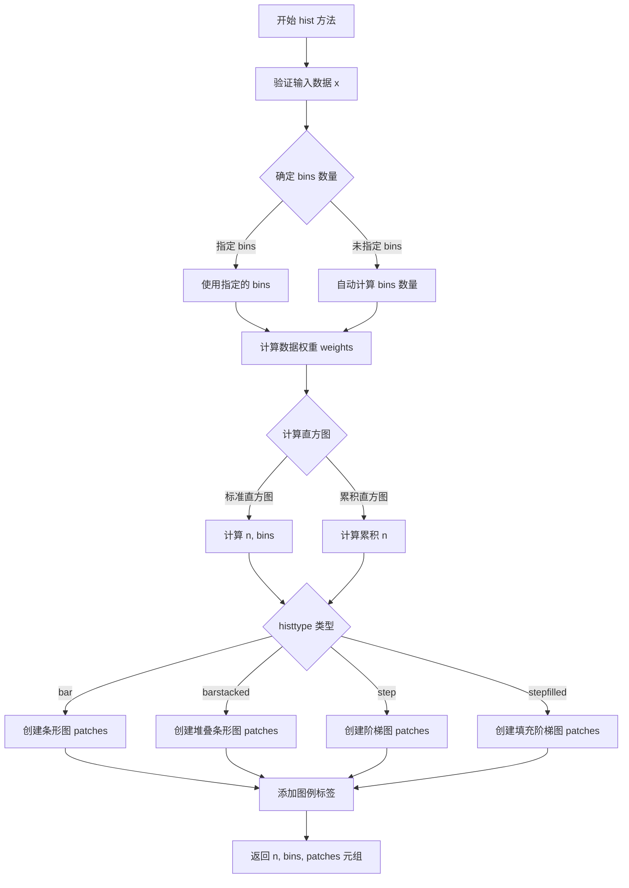

#### 带注释源码

```python
def hist(self, x, bins=None, range=None, density=False, weights=None,
         cumulative=False, bottom=None, histtype='bar', align='mid',
         orientation='vertical', rwidth=None, color=None, label=None,
         stacked=False, *, data=None, **kwargs):
    """
    Compute and plot a histogram.

    This method combines the `~matplotlib.hist` function and
    most of the common ways to plot a histogram in one function call.

    Parameters
    ----------
    x : (n,) array or sequence of (n,) arrays
        Input values, this takes either a single array or a sequence of
        arrays (which are not required to be of the same length).

    bins : int or sequence or str, default: :rc:`hist.bins`
        If *bins* is an integer, it defines the number of equal-width
        bins in the given range.
        However, in this case, the range of *x* has an effect on the bins.
        If *bins* is a sequence, it defines the bin edges (including the
        rightmost edge).
        If *bins* is a string, it defines the method used to calculate the
        optimal bin width.

    range : tuple or None, default: None
        The lower and upper range of the bins. Lower and upper outliers
        are ignored. If not provided, *range* is ``(x.min(), x.max())``.

    density : bool, default: False
        If ``True``, draw and return a probability density function:
        ``sum(dx * n) == 1``.

    weights : (n,) array-like or None, default: None
        An array of weights, of the same shape as *x*. Each value in *x*
        only contributes its associated weight towards the bin count
        (instead of 1).

    cumulative : bool or -1, default: False
        If ``True``, then a histogram is computed where each bin gives the
        counts in that bin plus all bins for smaller values.
        If ``-1``, the direction of accumulation is reversed.

    bottom : array-like or scalar, default: None
        Location of the bottom of each bin, otherwise a vertical offset
        is applied to all bins.

    histtype : {'bar', 'barstacked', 'step', 'stepfilled'}, default: 'bar'
        The type of histogram to draw.
        - 'bar': Vertical bars grouped according to the input data.
        - 'barstacked': Vertical bars stacked according to the input data.
        - 'step': Unfilled stepped lines.
        - 'stepfilled': Stepped filled lines.

    align : {'left', 'mid', 'right'}, default: 'mid'
        Controls how the histogram is positioned around its bin edges.

    orientation : {'horizontal', 'vertical'}, default: 'vertical'
        If 'horizontal', the bar edges are along the y-axis.

    rwidth : float or None, default: None
        The relative width of the bars as a fraction of the bin width.

    color : color or array-like of colors or None, default: None
        Color spec or sequence of color specs, one per dataset.

    label : str or None, default: None
        Legend label for the component(s).

    stacked : bool, default: False
        If ``True``, multiple data are stacked on top of each other
        If ``False`` multiple data are side by side

    **kwargs
        `~matplotlib.patches.Patch` properties

    Returns
    -------
    n : array or list of arrays
        The values of the histogram.

    bins : array
        The edges of the bins.

    patches : `.BarContainer` or list of a single `.Polygon` or list of such objects
        Container of individual artists used to create the histogram.

    See Also
    --------
    hist2d : 2D histogram
    """
    # 获取数据参数
    if data is not None:
        x = _utils._check_getitem(data, x=x, weights=weights)
        weights = _utils._check_getitem(data, weights=weights)

    # 处理多种输入情况（单个数组或数组列表）
    # 处理 bins 参数（自动计算或使用指定值）
    # 计算直方图（考虑权重、累积、密度等选项）
    # 根据 histtype 创建对应的图形对象
    # 处理 orientation 方向（垂直/水平）
    # 处理颜色、标签、图例等
    # 返回 (n, bins, patches) 元组
```


### `Axes.add_patch`

该方法是matplotlib中Axes类的核心方法之一，用于向坐标轴添加图形补丁（Patch）对象。图形补丁是matplotlib中用于绘制二维形状的基本元素，如圆形、矩形、多边形等。该方法不仅将补丁对象添加到坐标轴的patches列表中，还会自动更新坐标轴的数据限制，设置剪贴路径，并返回添加的补丁对象以便进行后续操作。

参数：

- `p`：`matplotlib.patches.Patch`，要添加到坐标轴的图形补丁对象，可以是Circle、Rectangle、Polygon等任何Patch子类实例

返回值：`matplotlib.patches.Patch`，返回添加的补丁对象本身，便于链式调用或进一步操作

#### 流程图

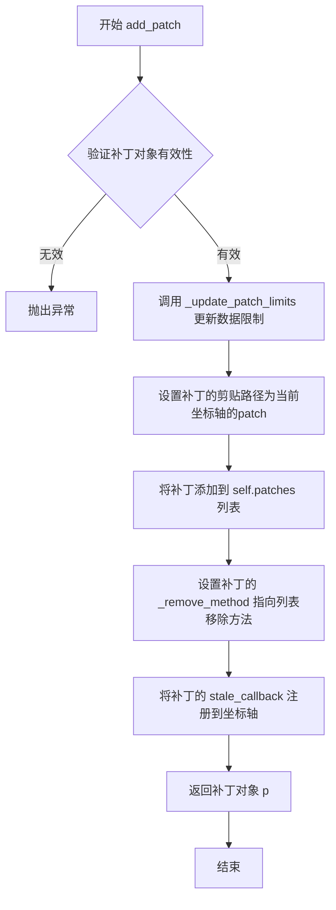

#### 带注释源码

```python
def add_patch(self, p):
    """
    Add a `~matplotlib.patches.Patch` to the axes; the patch is also
    set as the current patch (the Axes's `~matplotlib.axes.Axes.patch`
    attribute).

    Parameters
    ----------
    p : `~matplotlib.patches.Patch`
        The patch to add.

    Returns
    -------
    `~matplotlib.patches.Patch`
        The added patch.

    Examples
    --------
    ::

        >>> import matplotlib.pyplot as plt
        >>> import matplotlib.patches as mpatches
        >>> fig, ax = plt.subplots()
        >>> circle = mpatches.Circle((0, 0), 1)  # 创建圆形补丁
        >>> ax.add_patch(circle)  # 添加到坐标轴
        Circle(xy=(0, 0), radius=1)
    """
    # 步骤1：更新坐标轴的数据限制，确保补丁被正确包含在视图中
    # _update_patch_limits方法会计算补丁的边界并扩展坐标轴的xlim和ylim
    self._update_patch_limits(p)
    
    # 步骤2：设置剪贴路径，使补丁不会超出坐标轴的边界框
    # 这里将补丁的剪贴路径设置为坐标轴自身的patch（通常是坐标轴的边界矩形）
    p.set_clip_path(self.patch)
    
    # 步骤3：将补丁对象添加到patches列表中
    # patches列表存储了所有添加到这个坐标轴的图形补丁
    self.patches.append(p)
    
    # 步骤4：设置内部移除方法
    # 这样可以通过调用 p.remove() 来从坐标轴中移除该补丁
    p._remove_method = self.patches.remove
    
    # 步骤5：注册过时回调函数
    # 当补丁对象发生改变时，会触发坐标轴的重新绘制
    self.stale_callback = p.stale_callback
    
    # 步骤6：返回添加的补丁对象，便于链式调用
    return p
```

#### 关键组件信息

- `Axes._update_patch_limits`：内部方法，用于根据补丁的边界框更新坐标轴的数据限制
- `Axes.patch`：属性，表示坐标轴的背景补丁（默认为矩形）
- `Axes.patches`：列表属性，存储所有添加的图形补丁对象
- `Patch.set_clip_path`：方法，设置补丁的剪贴路径，控制显示范围

#### 潜在技术债务或优化空间

1. **缺乏参数验证**：方法没有对传入的p参数进行类型检查，如果传入非Patch对象可能在上诉流程中才暴露错误
2. **回调机制依赖**：stale_callback的关联方式较为隐式，可能导致意外的重新绘制行为
3. **文档可改进性**：示例代码可以更丰富，展示不同类型补丁的添加方式

#### 其它项目

**设计目标与约束**：
- 设计目标：提供统一的接口将各种图形补丁添加到坐标轴中
- 约束：补丁对象必须继承自matplotlib.patches.Patch基类

**错误处理与异常设计**：
- 如果传入的对象不是有效的Patch实例，将在后续操作中抛出AttributeError
- 剪贴路径设置失败时可能会影响显示效果但不抛出异常

**数据流与状态机**：
- 输入：有效的Patch对象
- 处理流程：更新限制→设置剪贴→添加到列表→注册回调→返回对象
- 输出：返回添加的Patch对象，坐标轴状态标记为stale（需要重绘）

**外部依赖与接口契约**：
- 依赖matplotlib.patches模块中的各种补丁类
- 依赖Axes._update_patch_limits内部方法
- 返回的Patch对象可进一步修改其属性（如颜色、边框等）


### `Axes.set_aspect`

设置坐标轴的数据宽高比（data aspect ratio），用于控制坐标轴上物理单位与数据单位的比例，使得图形能够正确地呈现数据的几何形状（如圆形保持为圆形）。

参数：

- `aspect`：`str` 或 `float`，要设置的数据宽高比值。可以是 `'equal'`（使每个轴上的一个数据单位占据相同的物理长度）、`'auto'`（自动调整）或具体的数值（宽度/高度的比值）
- `adjustable`：`str`，可选参数，指定哪个参数将被调整以实现所需的宽高比。可以是 `'box'`（调整轴框）、`'datalim'`（调整数据限制）或 `'box-forced'`（强制调整轴框）
- `box_aspect`：`float`，可选参数，设置轴框的宽高比
- `share`：`bool`，可选参数，是否将宽高比设置应用到共享轴

返回值：`self`，返回Axes对象本身，以便进行链式调用

#### 流程图

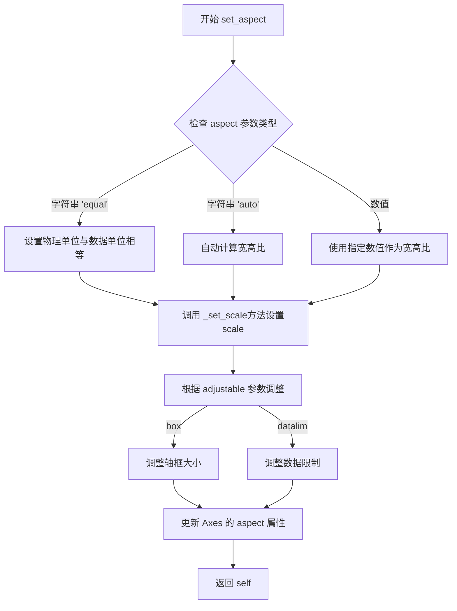

#### 带注释源码

```python
def set_aspect(self, aspect, adjustable=None, box_aspect=None, share=False):
    """
    设置坐标轴的宽高比。
    
    参数
    ----------
    aspect : {'equal', 'auto'} 或 float
        - 'equal': x和y轴上一个单位的长度相同（物理单位）
        - 'auto': 根据数据自动计算宽高比
        - float: 指定宽高比值（width/height）
    
    adjustable : {'box', 'datalim', 'box-forced'}, optional
        决定如何调整轴以实现所需的宽高比：
        - 'box': 调整轴框（Axes box）大小
        - 'datalim': 调整数据限制（data limits）
        - 'box-forced': 强制调整轴框大小
    
    box_aspect : float, optional
        设置轴框的宽高比，优先级高于从数据计算的宽高比
    
    share : bool, optional
        如果为True，则将宽高比设置也应用到共享轴
    
    返回
    -------
    self : Axes
        返回Axes对象本身
    """
    # 导入必要的模块
    from numbers import Real
    
    # 验证aspect参数
    if aspect in ('equal', 'auto'):
        self._aspect = aspect
    elif isinstance(aspect, Real):
        self._aspect = aspect
    else:
        raise ValueError(
            "aspect must be 'equal', 'auto', or a float. "
            f"Got {aspect!r}."
        )
    
    # 设置adjustable参数
    if adjustable is None:
        adjustable = self._adjustable
    elif adjustable not in ('box', 'datalim', 'box-forced'):
        raise ValueError("'adjustable' must be 'box', 'datalim', or 'box-forced'")
    self._adjustable = adjustable
    
    # 设置box_aspect
    if box_aspect is not None:
        self._box_aspect = box_aspect
    
    # 如果share为True，则应用到共享轴
    if share:
        for ax in self._shared_axes['x'].values():
            ax.set_aspect(aspect, adjustable=adjustable, box_aspect=box_aspect)
        for ax in self._shared_axes['y'].values():
            ax.set_aspect(aspect, adjustable=adjustable, box_aspect=box_aspect)
    
    # 标记需要重新渲染
    self.stale_callback = True
    
    return self
```

#### 关键组件信息

| 组件名称 | 一句话描述 |
|---------|-----------|
| `_aspect` | 存储当前的数据宽高比设置 |
| `_adjustable` | 存储用于调整宽高比的参数（box或datalim） |
| `_box_aspect` | 存储轴框的宽高比 |
| `_shared_axes` | 存储共享轴的字典，用于share参数的实现 |

#### 潜在技术债务与优化空间

1. **参数验证不够严格**：对`aspect`参数的类型检查可以更严格，当前使用`isinstance(aspect, Real)`可能允许一些不合理的数值类型通过
2. **文档不够完整**：缺少对`box_forced`等边界情况的说明
3. **性能优化**：在设置宽高比时可以添加缓存机制，避免重复计算
4. **错误处理**：可以添加更多的边界情况检查，如负数宽高比、NaN值等

#### 其它项目说明

- **设计目标**：允许用户控制坐标轴的视觉宽高比，使得图形能够正确呈现数据的几何特征
- **约束条件**：
  - 当`aspect='equal'`时，必须配合正确的`adjustable`参数使用
  - 与`set_box_aspect`配合使用时，需要注意两者之间的优先级
- **错误处理**：
  - `ValueError`：当aspect或adjustable参数值不合法时抛出
  - `TypeError`：当参数类型不正确时抛出
- **外部依赖**：依赖于matplotlib的Axes基类和图形后端


### `ax.autoscale()`

该函数是Matplotlib中Axes类的方法，用于根据当前数据自动调整坐标轴的范围，使所有数据点都能可视化。它通常在设置完数据后调用，以确保坐标轴边界与数据相匹配。

参数：

- `enable`：`bool`，默认为`True`，指定是否启用自动缩放功能。如果设置为`False`，则保持当前的轴限制不变。
- `axis`：可选值为`'x'`、`'y'`或`'both'`（默认），指定对哪个坐标轴进行自动缩放。
- `tight`：可选的布尔值或`None`，如果设置为`True`，则稍微收紧轴的范围以更紧密地包围数据。

返回值：`matplotlib.axes.Axes`，返回axes对象本身，支持链式调用。

#### 流程图

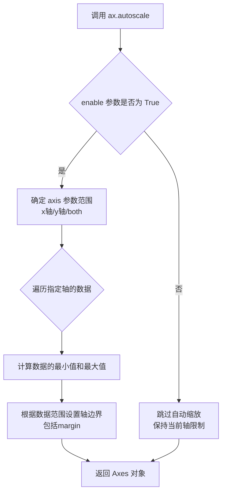

#### 带注释源码

```python
def autoscale(self, enable=True, axis='both', tight=None):
    """
    自动缩放轴范围以适应数据。
    
    参数:
        enable : bool, 默认 True
            是否启用自动缩放。如果是 False，则轴范围保持不变。
        axis : {'both', 'x', 'y'}, 默认 'both'
            要自动缩放的轴。
        tight : bool or None, 可选
            如果为 True，则设置视图边界以恰好包含数据，
            忽略数据容差。如果为 None，则保持当前设置。
    """
    # 获取数据限制管理器
    self._process_units_info()
    
    # 确定要缩放的轴
    if axis in ['x', 'both']:
        # 对x轴进行自动缩放
        self._autoscale_xon = enable
    if axis in ['y', 'both']:
        # 对y轴进行自动缩放
        self._autoscale_yon = enable
    
    # 设置tight参数
    if tight is not None:
        self._tight = tight
    
    # 执行实际的缩放操作
    # 这通常在绘制时由 draw() 方法调用
    # 或者可以通过调用 stale_callback 触发
    self._request_autoscale_view(axis)
    
    return self
```


### `Axes.set_visible`

设置 Axes 对象的可见性，控制其在图形渲染时是否显示。

参数：

-  `b`：`bool`，指定 Axes 是否可见。`True` 表示显示，`False` 表示隐藏。

返回值：`None`，无返回值。

#### 流程图

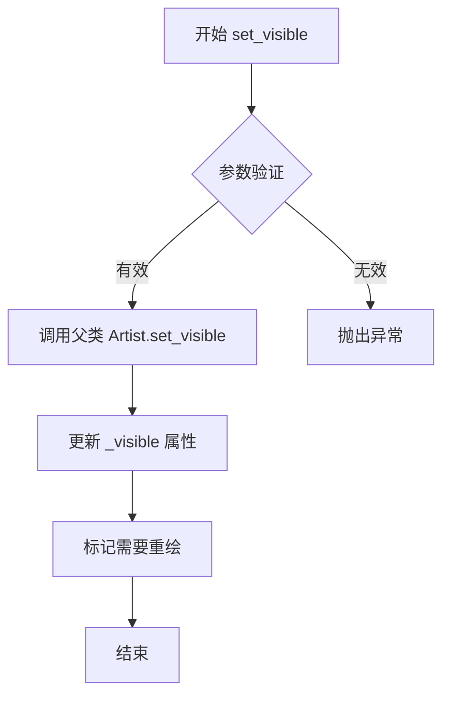

#### 带注释源码

```python
def set_visible(self, b):
    """
    设置艺术家的可见性。

    参数
    ----------
    b : bool
        可见性状态。True 表示 Axes 可见，False 表示隐藏。

    返回值
    -------
    None

    示例
    -------
    >>> ax.set_visible(False)  # 隐藏 Axes
    >>> ax.set_visible(True)   # 显示 Axes
    """
    """
    # 调用父类 Artist 的 set_visible 方法
    # 这是 matplotlib 中所有可显示对象的标准模式
    """
    super().set_visible(b)
    
    """
    # 对于 Axes，还需要处理子元素（如脊柱、刻度等）的可见性
    # 但具体实现由 Axes 的具体子类决定
    """
    
    # 标记 Axes 需要重新绘制
    self.stale_callback = None  # 触发重绘回调
```

#### 备注

- `set_visible` 方法继承自 `matplotlib.artist.Artist` 基类
- 当 Axes 隐藏时，其所有子元素（如坐标轴、刻度标签等）也会被隐藏
- 设置为不可见后，该 Axes 不会占用布局空间（在使用 `constrained_layout` 时）
- 此方法常用于创建复杂的子图布局，如联合分布图（joint plot）中隐藏不需要的 Axes


## 关键组件


### set_box_aspect

设置坐标轴框的宽高比，控制坐标轴在图形中的物理尺寸比例

### plt.subplots

创建图形和坐标轴的快捷函数，支持多子图布局

### ax.plot

绘制线图的基本方法，用于在坐标轴上显示数据点

### ax.twinx

创建共享x轴的孪生坐标轴，用于显示不同y轴尺度的数据

### ax.imshow

显示图像数据的方法，支持二维或三维数组可视化

### ax.scatter

绘制散点图，用于显示离散数据点的分布

### ax.hist

绘制直方图，用于显示数据分布

### ax.set_aspect

设置数据坐标的宽高比，确保图形元素保持正确比例

### gridspec_kw

网格规范配置参数，用于控制子图的行列比例

### layout="constrained"

约束布局管理器，自动调整子图间距避免重叠

### subplot_kw

子图初始化参数字典，用于在创建时设置子图属性


## 问题及建议


### 已知问题

- **缺少类型注解和参数验证**：代码中没有对函数参数进行类型检查，例如`set_box_aspect`接收的参数类型没有明确说明，可能导致运行时错误。
- **硬编码的随机种子分散**：多个代码块中重复使用`np.random.seed(19680801)`，应该在模块级别统一定义或提取为配置常量。
- **除零风险**：`ax2.set_box_aspect(im.shape[0]/im.shape[1])` 在图像shape为0时会触发除零错误。
- **魔法数字缺乏解释**：如`1/3`、`3/1`、`19680801`等数值没有注释说明其含义。
- **重复代码模式**：多个例子中重复调用`plt.show()`和创建子图的模式可以提取为公共函数。
- **变量命名不够描述性**：如`fig1`, `ax`, `ax2`等通用命名降低了代码可读性。
- **布局参数重复**：多处使用`layout="constrained"`可以统一管理。

### 优化建议

- 提取公共函数如`create_figure_and_axes`来减少重复代码
- 在模块开头定义常量配置（随机种子、默认布局等）
- 添加参数验证逻辑，特别是在进行除法运算前检查分母不为零
- 为关键变量和计算添加类型注解和注释说明
- 考虑使用 dataclass 或配置文件管理图形样式参数
- 将重复的`plt.show()`调用提取到代码末尾统一处理
- 使用更描述性的变量名，如将`ax2`改为`ax_twin`或`ax_image`


## 其它


### 设计目标与约束

本示例代码的核心设计目标是演示matplotlib中`Axes.set_box_aspect`方法的多种使用场景，包括创建正方形坐标轴、固定宽高比子图、处理双轴图像等。约束条件包括：依赖matplotlib库的具体版本特性、必须使用`constrained_layout`布局管理器以获得最佳效果、box aspect设置仅在物理单位下有效且独立于数据范围。

### 错误处理与异常设计

代码中未包含显式的错误处理机制。在实际使用中，可能出现的异常情况包括：传入无效的box aspect参数（如负数或非数值类型）会导致ValueError；当box aspect与datalim调整冲突时可能产生视觉异常；子图共享时box aspect设置不当可能导致布局冲突。建议在实际应用中添加参数验证和异常捕获逻辑。

### 数据流与状态机

代码展示了六种主要的数据流场景：第一种场景中，数据范围(300, 400)设置后，box aspect=1强制将物理显示尺寸调整为正方形；第二种场景中，共享y轴的两个子图分别设置相同的box aspect；第三种场景中，twin Axes自动继承父Axes的box aspect；第四种场景中，图像的shape参数直接用于设置相邻子图的box aspect；第五种场景中，gridspec的宽高比参数与box aspect协同工作；第六种场景中，box aspect与data aspect共同作用实现圆形保持。

### 外部依赖与接口契约

主要外部依赖包括：matplotlib.pyplot库（用于图形创建）、numpy库（用于数组操作和随机数生成）。核心接口为`Axes.set_box_aspect()`方法，其参数aspect接受浮点数或None值，当为None时重置为默认行为。该方法与`set_aspect()`方法互补，前者控制物理框的宽高比，后者控制数据的宽高比。

### 性能考虑

当前示例代码的性能开销较小，主要计算为numpy数组的随机生成和图像创建。潜在的优化方向包括：对于大量子图的情况，可以考虑批量设置box aspect而非逐个设置；在动画场景中，频繁修改box aspect可能影响渲染性能，应谨慎使用。

### 可维护性分析

代码结构清晰，采用模块化设计，每个示例场景相互独立。改进建议：为每个示例场景添加更详细的文档字符串说明其应用场景；将重复的box aspect设置逻辑提取为辅助函数；添加类型注解以提高代码的可读性和IDE支持。

### 测试策略

建议补充的测试用例包括：验证box aspect参数的类型边界（整数、浮点数、None、无效类型）；测试不同布局管理器（constrained_layout、tight_layout、none）与box aspect的兼容性；验证跨平台渲染一致性；测试子图共享时的box aspect继承行为。

### 版本兼容性

代码使用matplotlib 3.x版本的API，具体版本要求包括：`set_box_aspect`方法在matplotlib 3.3.0版本引入；`gridspec_kw`参数支持在较旧版本中可能有所差异；`constrained_layout`在matplotlib 3.1版本中得到改善。建议在文档中标注最低兼容版本。

### API设计一致性

`set_box_aspect`方法与matplotlib中其他aspect相关方法（如`set_aspect`、`set_adjustable`）在命名和参数设计风格上保持一致。设计模式遵循matplotlib的链式调用约定（返回self），便于与方法链接使用。

    