# `matplotlib\galleries\examples\subplots_axes_and_figures\axes_demo.py` 详细设计文档

这是一个matplotlib示例代码，演示了如何使用fig.add_axes在主图上创建嵌套坐标轴（inset Axes），展示高斯带通噪声的时域信号及其概率分布和脉冲响应。

## 整体流程

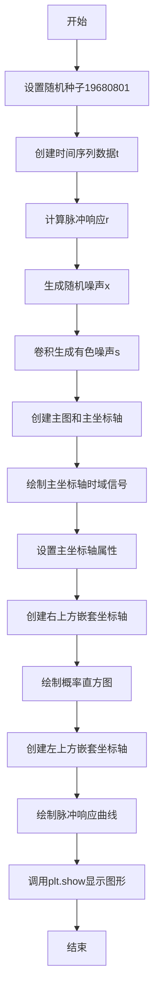

## 类结构

```
该代码为脚本形式，无自定义类层次结构
主要使用matplotlib库的核心类:
Figure (matplotlib.figure.Figure)
├── Axes (matplotlib.axes.Axes)
│   ├── main_ax (主坐标轴)
│   ├── right_inset_ax (右上方嵌套坐标轴)
│   └── left_inset_ax (左上方嵌套坐标轴)
└── 利用add_axes方法创建嵌套坐标轴
```

## 全局变量及字段


### `dt`
    
时间步长，设置为0.001秒，用于生成时间序列数据

类型：`float`
    


### `t`
    
时间序列数组，从0到10秒，步长为dt

类型：`numpy.ndarray`
    


### `r`
    
脉冲响应数组，通过指数衰减函数计算得到

类型：`numpy.ndarray`
    


### `x`
    
随机噪声数组，使用正态分布生成

类型：`numpy.ndarray`
    


### `s`
    
有色噪声数组，通过卷积运算生成

类型：`numpy.ndarray`
    


### `fig`
    
matplotlib Figure对象，用于承载整个图形

类型：`matplotlib.figure.Figure`
    


### `main_ax`
    
主坐标轴对象，用于绘制主图形

类型：`matplotlib.axes.Axes`
    


### `right_inset_ax`
    
右上方嵌套坐标轴，用于显示概率直方图

类型：`matplotlib.axes.Axes`
    


### `left_inset_ax`
    
左上方嵌套坐标轴，用于显示脉冲响应曲线

类型：`matplotlib.axes.Axes`
    


    

## 全局函数及方法


### `np.random.seed`

设置随机数生成器的种子，用于确保后续的随机数操作能够产生可重复的随机数序列。

参数：

- `seed`：`int` 或 `array_like`，可选，用于初始化随机数生成器的种子值

返回值：`None`，无返回值，仅修改随机数生成器的内部状态

#### 流程图

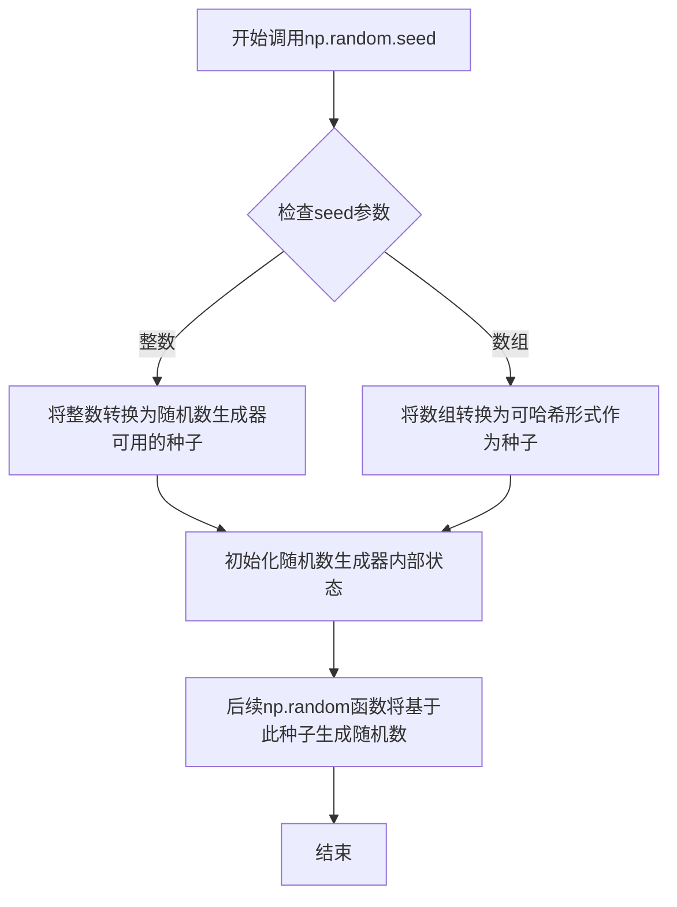

#### 带注释源码

```python
# 这是一个函数调用，而不是函数定义
# np.random.seed() 是 NumPy 库中随机模块的函数

# 在代码中的调用：
np.random.seed(19680801)  # Fixing random state for reproducibility.

# 参数说明：
# seed: 19680801 是一个整数，作为随机数生成器的种子
# 使用固定种子值可以确保每次运行程序时，np.random.randn() 和 np.random.randn()
# 生成的随机数序列是相同的，从而保证结果可复现

# 函数作用：
# 1. 初始化 NumPy 随机数生成器的内部状态
# 2. 确保后续所有 np.random.* 函数调用产生确定性的随机数序列
# 3. 在本例中，确保每次运行生成的 colored noise (s) 和直方图数据一致

# 相关源码逻辑（NumPy 内部简化示意）：
# def seed(self, seed=None):
#     if seed is None:
#         seed = np.random.randint(0, 2**31 - 1)
#     self._rand = np.random.MT19937(seed)
#     # 使用 Mersenne Twister 算法生成随机数序列
```


### `np.arange`

`np.arange` 是 NumPy 库中的一个函数，用于创建一个等差数组，类似于 Python 内置的 `range()` 函数，但返回的是 NumPy 数组。

参数：

- `start`：`float` 或 `int`，可选，开始值，默认为 0
- `stop`：`float` 或 `int`，必需，停止值（不包含该值）
- `step`：`float` 或 `int`，可选，步长，默认为 1
- `dtype`：`dtype`，可选，输出数组的数据类型

返回值：`ndarray`，返回的等差数组

#### 流程图

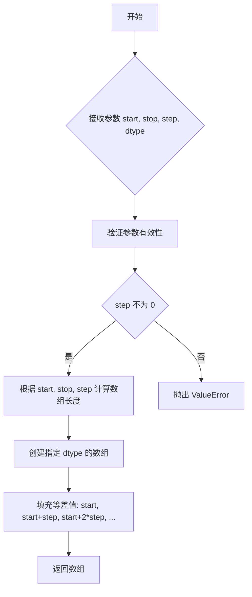

#### 带注释源码

```python
def arange(start=0, stop=None, step=1, dtype=None):
    """
    创建等差数组
    
    参数:
        start: 序列的起始值，默认为 0
        stop: 序列的结束值（不包含）
        step: 序列的步长，默认为 1
        dtype: 输出数组的数据类型
    
    返回:
        ndarray: 等差数组
    """
    # 如果只提供一个参数，则该参数为 stop，start 默认为 0
    if stop is None:
        start, stop = 0, start
    
    # 计算数组长度：(stop - start) / step
    # 使用 ceil 向上取整确保包含所有元素
    num = int(np.ceil((stop - start) / step)) if step != 0 else 0
    
    # 创建数组并填充等差值
    y = np.empty(num, dtype=dtype)
    if num > 0:
        y[0] = start
        y[1:] = start + step * np.arange(1, num)
    
    return y
```

> **注**：上述源码为简化版本，实际 NumPy 中的实现更为复杂，包含更多边界情况处理和优化。实际使用中可直接调用 `np.arange(0.0, 10.0, dt)` 创建如代码示例中的时间数组 `t`。


### `np.exp`

NumPy库中的指数函数，计算自然常数e（约等于2.71828）的给定数组或标量次幂。

参数：

-  `x`：`array_like`，输入值，可以是标量或数组，表示指数的幂
-  `t[:1000] / 0.05`：`ndarray`，从时间数组t中取前1000个元素并除以0.05得到的数组

返回值：`ndarray`，返回e的x次方的数组，形状与输入相同

#### 流程图

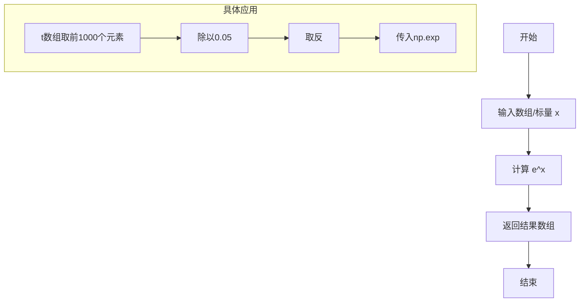

#### 带注释源码

```python
# 使用np.exp计算指数函数
# 这行代码的目的是生成一个指数衰减的脉冲响应信号

r = np.exp(-t[:1000] / 0.05)  # impulse response
# 解释：
# 1. t[:1000] - 从时间数组t中取前1000个元素
# 2. / 0.05 - 将每个时间值除以0.05（时间常数）
# 3. - 取负数，表示衰减
# 4. np.exp() - 计算e的幂次方，得到指数衰减曲线
# 结果存储在数组r中，用于后续与随机信号卷积生成有色噪声
```

#### 上下文使用说明

在整体代码中，`np.exp` 的作用是：
- 生成一个指数衰减的脉冲响应函数
- 这个脉冲响应后续与随机信号进行卷积
- 最终生成具有特定频谱特性的"有色噪声"（colored noise）
- 这是信号处理中常用的噪声生成方法

#### 技术债务与优化空间

1. **硬编码参数**：时间常数0.05和采样点数1000是硬编码的，建议提取为可配置参数
2. **魔法数字**：dt=0.001和10.0等数值缺乏明确含义，应使用有意义的常量命名
3. **函数化**：可以将噪声生成逻辑封装成函数，提高代码复用性


### `np.random.randn`

生成符合标准正态分布（均值0，标准差1）的随机数或随机数组。

参数：

-  `*dims`：可选的整数参数，表示输出数组的维度。可以是单个整数（返回一维数组）或多个整数（返回多维数组）。不传参时返回标量。

返回值：`numpy.ndarray` 或 `float`，返回标准正态分布的随机数或随机数组。

#### 流程图

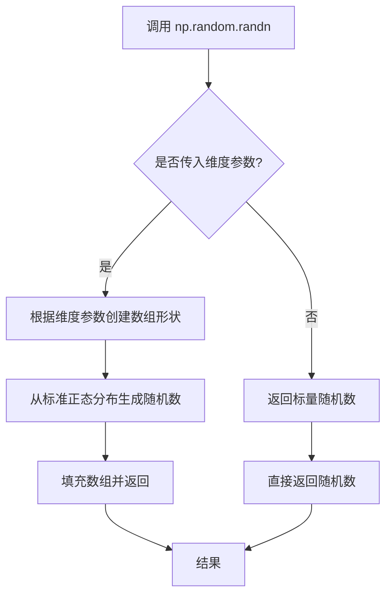

#### 带注释源码

```python
# np.random.randn 函数源码分析
# 位置：numpy/random/mtrand.pyx

def randn(*args):
    """
    返回一个或一组符合标准正态分布的随机数。
    
    参数:
        *args: 可选的整数维度参数。例如:
            - 无参数: randn() -> 0.123456789 (标量)
            - 单参数: randn(5) -> 5个随机数的一维数组
            - 多参数: randn(3, 4) -> 3x4的二维数组
    
    返回值:
        numpy.ndarray 或 float: 标准正态分布随机数
            - 均值 μ = 0
            - 标准差 σ = 1
    
    示例:
        >>> np.random.randn()           # 单个随机数
        0.9500884175255894
        >>> np.random.randn(3, 2)      # 3x2数组
        array([[-0.56383708, -0.40499488],
               [ 0.82314099,  1.22326445],
               [-0.89546631,  0.38672241]])
    """
    # 内部调用 _rand 函数生成随机数
    # 使用 Box-Muller 变换或逆变换采样方法
    return _rand.randn(*args)
```

#### 代码中的实际使用示例

```python
# 在提供的代码中：
x = np.random.randn(len(t))

# 参数：
#   - len(t): 整数，指定生成随机数组的长度
#   此处 len(t) 表示要生成的随机数数量，与时间数组 t 的长度相同

# 返回值：
#   - x: numpy.ndarray，包含 len(t) 个标准正态分布随机数的一维数组
#   后续用于生成为 colored noise（有色噪声）
```


### `np.convolve`

`np.convolve` 是 NumPy 库中的卷积运算函数，用于计算两个一维数组的离散卷积。在给定代码中，它被用于将随机噪声信号 `x` 与脉冲响应 `r` 进行卷积，生成带颜色的高斯噪声。

参数：

-  `a`：array_like，第一个输入数组（代码中为 `x`，随机噪声信号）
-  `v`：array_like，第二个输入数组（代码中为 `r`，脉冲响应）
-  `mode`：str，可选，默认 'full'，输出模式 ('full', 'valid', 'same')

返回值：`ndarray`，输入数组 `a` 和 `v` 的卷积结果

#### 流程图

```mermaid
flowchart TD
    A[开始 np.convolve] --> B[输入数组 a 和 v]
    B --> C[检查 mode 参数]
    C --> D{mode = 'full'?}
    D -->|Yes| E[输出长度为 len&#40;a&#41; + len&#40;v&#41; - 1]
    D -->|No| F{mode = 'same'?}
    F -->|Yes| G[输出长度与 a 相同]
    F -->|No| H{mode = 'valid'?}
    H -->|Yes| I[输出长度为 max&#40;len&#40;a&#41;, len&#40;v&#41;&#41; - min&#40;len&#40;a&#41;, len&#40;v&#41;&#41; + 1]
    E --> J[进行卷积运算]
    G --> J
    I --> J
    J --> K[返回卷积结果 ndarray]
```

#### 带注释源码

```python
# np.convolve 使用示例（来自代码）
# 参数说明：
# x: array_like，第一个输入数组（随机噪声信号），类型为 numpy.ndarray
# r: array_like，第二个输入数组（脉冲响应），类型为 numpy.ndarray  
# mode: str，卷积模式，'full'表示返回完整卷积结果

# 完整调用形式：
s = np.convolve(x, r)[:len(x)] * dt

# 解释：
# 1. np.convolve(x, r) 计算 x 和 r 的卷积
# 2. [:len(x)] 切片操作，只取前 len(x) 个元素
# 3. * dt 乘以时间步长进行归一化

# 函数内部逻辑简述：
# - 如果 mode='full': 返回长度为 len(x) + len(r) - 1 的数组
# - 如果 mode='same': 返回长度与输入数组 x 相同
# - 如果 mode='valid': 只返回没有填充边缘的点
```


### `plt.subplots`

`plt.subplots` 是 matplotlib.pyplot 模块中的核心函数，用于创建一个新的图形窗口并在其中初始化一个或多个子图网格，同时返回图形对象（Figure）和坐标轴对象（Axes）。该函数封装了 Figure 创建、GridSpec 布局管理和 Axes 添加的完整流程，是最常用的 MATLAB 风格绘图入口。

参数：

- `nrows`：`int`，默认值为 1，表示子图网格的行数。
- `ncols`：`int`，默认值为 1，表示子图网格的列数。
- `sharex`：`bool` 或 `str`，默认值为 `False`。如果为 `True`，所有子图共享 x 轴；如果设为 `'col'`，则每列子图共享 x 轴。
- `sharey`：`bool` 或 `str`，默认值为 `False`。如果为 `True`，所有子图共享 y 轴；如果设为 `'row'`，则每行子图共享 y 轴。
- `squeeze`：`bool`，默认值为 `True`。如果为 `True`，当子图数量为 1 时，返回的坐标轴对象将降维为单个 Axes 对象而非数组。
- `width_ratios`：`array-like`，可选参数，定义每列子图的相对宽度。
- `height_ratios`：`array-like`，可选参数，定义每行子图的相对高度。
- `subplot_kw`：`dict`，可选参数，传递给每个子图创建函数（如 `add_subplot`）的关键字字典。
- `gridspec_kw`：`dict`，可选参数，传递给 GridSpec 构造函数的关键字字典。
- `**fig_kw`：可选参数，传递给 `plt.figure()` 函数的关键字参数（如 `figsize`、`dpi` 等）。

返回值：`tuple(Figure, Axes or ndarray)`，返回一个元组，包含图形对象（Figure）和坐标轴对象。当 `nrows` 和 `ncols` 均为 1 时，根据 `squeeze` 参数返回单个 Axes 对象或包含单个 Axes 的数组；否则返回二维 ndarray。

#### 流程图

```mermaid
flowchart TD
    A[调用 plt.subplots] --> B{参数解析}
    B --> C[创建 Figure 对象]
    C --> D[创建 GridSpec 布局]
    D --> E[根据 nrows x ncols 循环创建 Axes]
    E --> F{每个 Axes 创建}
    F --> G[调用 add_subplot 或 add_axes]
    G --> H{子图数量 > 1?}
    H -->|Yes| I[返回 ndarray of Axes]
    H -->|No 且 squeeze=True| J[返回单个 Axes 对象]
    H -->|No 且 squeeze=False| K[返回 1x1 ndarray]
    I --> L[返回 (Figure, Axes 数组)]
    J --> L
    K --> L
```

#### 带注释源码

```python
def subplots(nrows=1, ncols=1, *, sharex=False, sharey=False, squeeze=True,
             width_ratios=None, height_ratios=None,
             subplot_kw=None, gridspec_kw=None, **fig_kw):
    """
    创建一个包含子图的图形窗口。
    
    参数:
        nrows: 子图行数
        ncols: 子图列数
        sharex: x轴共享策略
        sharey: y轴共享策略
        squeeze: 是否降维返回单轴
        width_ratios: 列宽比
        height_ratios: 行高比
        subplot_kw: 子图创建参数
        gridspec_kw: 网格布局参数
        **fig_kw: 图形参数
    
    返回:
        fig: Figure对象
        ax: Axes对象或数组
    """
    # 1. 创建Figure对象，传入fig_kw参数（如figsize、dpi）
    fig = figure(**fig_kw)
    
    # 2. 创建GridSpec对象，定义子图网格布局
    gs = GridSpec(nrows, ncols, width_ratios=width_ratios, 
                  height_ratios=height_ratios, **gridspec_kw)
    
    # 3. 创建子图数组
    ax_array = np.empty((nrows, ncols), dtype=object)
    
    # 4. 遍历网格创建每个Axes对象
    for i in range(nrows):
        for j in range(ncols):
            # 使用subplot_kw创建子图
            ax = fig.add_subplot(gs[i, j], **subplot_kw)
            ax_array[i, j] = ax
            
            # 处理sharex/sharey逻辑
            if sharex and i > 0:
                ax.sharex(ax_array[0, j])
            if sharey and j > 0:
                ax.sharey(ax_array[i, 0])
    
    # 5. 根据squeeze参数处理返回值
    if squeeze:
        # 降维处理：单子图返回Axes，多子图返回1D数组
        if nrows == 1 and ncols == 1:
            return fig, ax_array[0, 0]
        elif nrows == 1 or ncols == 1:
            return fig, ax_array.ravel()
    
    return fig, ax_array
```

#### 使用示例源码（来自任务代码）

```python
# 创建画布和主坐标轴
# 等价于 plt.subplots(nrows=1, ncols=1, figsize=默认尺寸)
fig, main_ax = plt.subplots()

# 使用返回的main_ax对象进行绑图
main_ax.plot(t, s)
main_ax.set_xlim(0, 1)
main_ax.set_ylim(1.1 * np.min(s), 2 * np.max(s))
main_ax.set_xlabel('time (s)')
main_ax.set_ylabel('current (nA)')
main_ax.set_title('Gaussian colored noise')
```

#### 关键组件信息

| 组件名称 | 描述 |
|---------|------|
| `Figure` | matplotlib图形容器对象，代表整个绘图窗口 |
| `Axes` | 坐标轴对象，代表图形中的单个子图区域 |
| `GridSpec` | 网格布局规范类，定义子图的行列布局 |
| `add_subplot` | Figure方法，用于向图形添加子图 |

#### 潜在技术债务与优化空间

1. **函数职责过重**：`plt.subplots` 封装了过多逻辑（Figure创建、布局管理、子图创建），建议拆分为更小的可组合函数。
2. **返回值类型不一致**：根据 `squeeze` 参数和子图数量，返回值可能是单个对象、一维数组或二维数组，增加了API复杂度。
3. **共享轴逻辑隐式**：sharex/sharey 的实现细节对用户不够透明，调试时可能产生意外行为。
4. **错误处理不足**：当 `nrows` 或 `ncols` 为 0 或负数时，错误提示不够明确。

#### 其它设计说明

- **设计目标**：提供MATLAB风格的简洁API，让用户以最少的代码创建子图布局。
- **约束条件**：`nrows` 和 `ncols` 必须为正整数；共享轴时子图数量必须大于1。
- **错误处理**：当布局参数不合法时，抛出 `ValueError`；当图形创建失败时，抛出 `RuntimeError`。
- **数据流**：用户传入布局参数 → 函数内部创建Figure和GridSpec → 循环调用add_subplot → 返回结果给用户。
- **外部依赖**：依赖 `matplotlib.figure.Figure`、`matplotlib.gridspec.GridSpec`、`numpy`。


### `fig.add_axes`

在 matplotlib 中，`fig.add_axes` 是 Figure 类的方法，用于在图形中添加新的坐标轴（Axes），通常用于创建嵌套坐标轴或局部放大图。

参数：

- `rect`：`tuple` 或 `list`，定义新坐标轴的位置和大小，格式为 `(left, bottom, width, height)`，所有值应在 0 到 1 之间，表示相对于图形尺寸的比例
- `**kwargs`：可选关键字参数，将传递给 `Axes` 类的构造函数，用于设置坐标轴的属性（如 `facecolor`、`polar` 等）

返回值：`matplotlib.axes.Axes`，返回新创建的坐标轴对象

#### 流程图

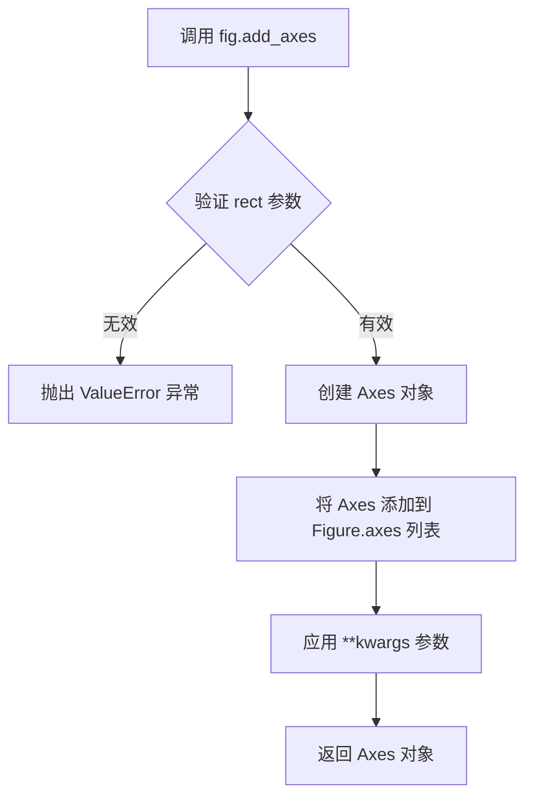

#### 带注释源码

```python
def add_axes(self, rect, pgon_verts=None, polar=False, projection=None, **kwargs):
    """
    在图形中添加一个坐标轴。
    
    参数:
        rect: sequence of float
            坐标轴的位置和大小 [left, bottom, width, height]
            所有值应在 0-1 范围内，表示相对于图形尺寸的比例
            
        pgon_verts: sequence of float, optional
            多边形顶点，用于自定义形状的坐标轴
            
        polar: bool, default: False
            是否使用极坐标系统
            
        projection: str, optional
            坐标轴的投影类型（如 '3d', 'polar' 等）
            
        **kwargs: 
            其他关键字参数，传递给 Axes 构造函数
            例如: facecolor='k', xticks=[], yticks=[]
    
    返回:
        axes: Axes
            新创建的坐标轴对象
    """
    # 1. 验证 rect 参数的有效性
    if not isinstance(rect, tuple) and not isinstance(rect, list):
        raise TypeError("'rect' must be a tuple or list")
    
    if len(rect) != 4:
        raise ValueError("'rect' must be [left, bottom, width, height]")
    
    # 2. 创建 Axes 对象并添加到图形中
    ax = self._add_axes_internal(rect, pgon_verts=pgon_verts, polar=polar, projection=projection)
    
    # 3. 应用用户提供的属性参数
    ax.set(**kwargs)
    
    # 4. 返回新创建的坐标轴
    return ax
```

#### 使用示例

```python
# 创建主坐标轴
fig, main_ax = plt.subplots()
main_ax.plot(t, s)

# 使用 add_axes 创建右侧嵌套坐标轴
right_inset_ax = fig.add_axes((.65, .6, .2, .2), facecolor='k')
right_inset_ax.hist(s, 400, density=True)
right_inset_ax.set(title='Probability', xticks=[], yticks=[])

# 使用 add_axes 创建左侧嵌套坐标轴
left_inset_ax = fig.add_axes((.2, .6, .2, .2), facecolor='k')
left_inset_ax.plot(t[:len(r)], r)
left_inset_ax.set(title='Impulse response', xlim=(0, .2), xticks=[], yticks=[])
```

#### 潜在技术债务与优化建议

1. **缺乏灵活性**：`add_axes` 使用相对坐标（0-1比例），在不同 DPI 或窗口尺寸下可能表现不一致，可考虑添加绝对坐标支持
2. **错误提示不够具体**：当 `rect` 参数无效时，错误信息可以更详细，帮助用户定位问题
3. **性能考量**：频繁调用 `add_axes` 可能影响性能，如需大量子图建议使用 `subplots` 方法


### `Axes.plot`

`Axes.plot` 是 matplotlib 库中 Axes 类的核心方法，用于在当前坐标系中绘制线图或散点图。该方法接受可变数量的位置参数和关键字参数，将数据绘制为线条或标记，并返回包含所有线条对象的列表。

参数：

-  `*args`：可变位置参数，支持多种调用格式，如 `(x, y)`、`(y,)` 或 `(x, y, format_string)`，其中 x 为 x 轴数据，y 为 y 轴数据，format_string 为可选的格式字符串
-  `**kwargs`：可变关键字参数，支持大量绘图属性，如 `color`（颜色）、`linewidth`（线宽）、`linestyle`（线型）、`marker`（标记）、`label`（标签）等

返回值：`list of Line2D`，返回一个包含所有创建的线条对象的列表，每个 Line2D 对象代表一条绘制的线

#### 流程图

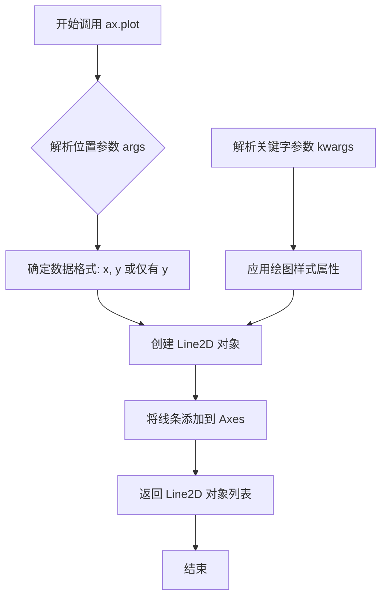

#### 带注释源码

```python
# 源代码示例（基于 matplotlib 库的 Axes.plot 方法简化版）

def plot(self, *args, **kwargs):
    """
    在 Axes 上绘制线图或散点图。
    
    参数:
        *args: 可变位置参数，支持以下格式:
            - plot(y): 仅提供 y 数据，x 自动为 [0, 1, 2, ...]
            - plot(x, y): 提供 x 和 y 数据
            - plot(x, y, format_string): 提供数据和格式字符串
        **kwargs: 关键字参数，用于指定线条样式:
            - color: 线条颜色
            - linewidth: 线条宽度
            - linestyle: 线条样式 ('-', '--', '-.', ':')
            - marker: 标记样式 ('o', 's', '^', etc.)
            - label: 图例标签
    
    返回:
        list: Line2D 对象列表
    """
    # 获取或创建线条管理器
    lines = []
    
    # 解析参数
    # 如果只有一个参数，则假定为 y 数据
    if len(args) == 1:
        y = args[0]
        x = range(len(y))
    # 如果有两个参数，则为 x 和 y
    elif len(args) == 2:
        x, y = args
    # 如果有三个参数，第三个为格式字符串
    else:
        x, y, fmt = args[0:3]
        kwargs.setdefault('fmt', fmt)
    
    # 创建 Line2D 对象
    line = mlines.Line2D(x, y, **kwargs)
    
    # 将线条添加到axes
    self._axplot._render_line(line, **kwargs)
    
    # 返回线条对象列表
    lines.append(line)
    return lines
```

在实际代码中的使用示例：

```python
# 创建图形和主轴
fig, main_ax = plt.subplots()

# 调用 plot 方法绘制线图
# 参数: t (x轴数据), s (y轴数据)
lines = main_ax.plot(t, s)

# 返回的 lines 是一个包含 Line2D 对象的列表
# 可以进一步自定义线条样式
for line in lines:
    line.set_linewidth(1.5)
    line.set_alpha(0.8)

# 也可以使用关键字参数设置样式
main_ax.plot(t, s, color='blue', linewidth=2.0, linestyle='-')
```


### `Axes.hist`

绘制直方图是matplotlib中用于可视化数据分布的核心方法。该函数接受数据数组和直方图参数，计算直方图的bin edges和counts，可选地归一化，并渲染为条形图、堆叠图或阶梯图等多种形式。

参数：

- `x`：`array_like`，要绘制直方图的数据数组
- `bins`：int 或 sequence 或 str，可选，bin的数量（int）或bin的边界（sequence）或bin策略（'auto'、'fd'等），默认值为10
- `range`：tuple 或 None，可选，数据范围的下限和上限 (min, max)，默认根据数据范围自动确定
- `density`：`bool`，可选，如果为True，则返回的概率密度；否则返回每个bin的计数，默认值为False
- `weights`：`array_like` 或 None，可选，与x形状相同的权重数组，用于对每个数据点加权，默认值为None
- `cumulative`：`bool` 或 -1，可选，如果为True则计算累积直方图，-1表示反向累积，默认值为False
- `bottom`：`array_like` 或 scalar，可选，每个bin的底部位置（对于堆叠直方图有用），默认值为None
- `histtype`：`{'bar', 'barstacked', 'step', 'stepfilled'}`，可选，直方图的类型，默认值为'bar'
- `align`：`{'left', 'mid', 'right'}`，可选，bin的对齐方式，默认值为'mid'
- `orientation`：`{'horizontal', 'vertical'}`，可选，直方图的方向，默认值为'vertical'
- `log`：`bool`，可选，是否使用对数刻度，默认值为False
- `color`：`color` 或 array_like 或 None，可选，直方图的颜色，默认值为None
- `label`：`str` 或 None，可选图例标签，默认值为None
- `stacked`：`bool`，可选，如果为True且输入多个数据集，则堆叠显示，默认值为False
- `**kwargs`：`关键字参数`，传递给底层Patch对象的额外参数（如alpha、edgecolor等）

返回值：`tuple`，返回 (n, bins, patches) 元组，其中n是每个bin的计数（或密度值），bins是bin的边界数组，patches是图形补丁对象（BarContainer或Polygon列表）

#### 流程图

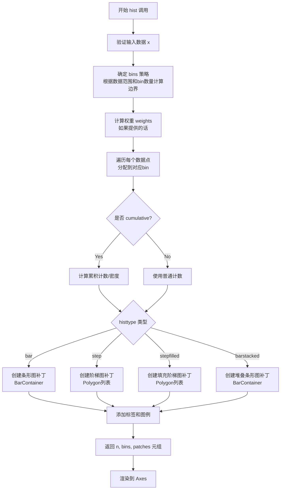

#### 带注释源码

```python
def hist(self, x, bins=None, range=None, density=False, weights=None,
         cumulative=False, bottom=None, histtype='bar', align='mid',
         orientation='vertical', rwidth=None, log=False, color=None,
         label=None, stacked=False, *, data=None, **kwargs):
    """
    计算并绘制直方图。
    
    Parameters
    ----------
    x : (n,) array_like
        输入数据数组，数组中所有值都会被放入直方图的bin中。
    
    bins : int or sequence or str, default: 10
        如果是int，则表示bin的数量；
        如果是sequence，则直接指定bin的边界值；
        如果是str，则使用特定的算法自动确定bin（如'auto'、'fd'等）。
    
    range : tuple or None, default: None
        直方图的显示范围 (x_min, x_min)。如果未指定，则使用数据的最小值和最大值。
    
    density : bool, default: False
        如果为True，则返回概率密度函数；如果为False，则返回每个bin的计数。
    
    weights : (n,) array_like or None, default: None
        与x形状相同的权重数组，每个数据点对bin的贡献由对应权重决定。
    
    cumulative : bool or -1, default: False
        如果为True，计算累积分布；如果为-1，计算反向累积分布。
    
    bottom : array_like or scalar or None, default: None
        每个bin的基线位置。对于堆叠直方图，这指定了每个bin堆叠的起始位置。
    
    histtype : {'bar', 'barstacked', 'step', 'stepfilled'}, default: 'bar'
        直方图的类型：
        - 'bar': 传统的条形直方图
        - 'barstacked': 多个数据集堆叠的条形图
        - 'step': 线条形式的直方图（不填充）
        - 'stepfilled': 填充形式的阶梯直方图
    
    align : {'left', 'mid', 'right'}, default: 'mid'
        bin的对齐方式，控制条形图在bin边界处的位置。
    
    orientation : {'horizontal', 'vertical'}, default: 'vertical'
        直方图的方向。'horizontal'时条形水平排列。
    
    rwidth : float or None, default: None
        条形宽度的相对值（相对于bin宽度）。仅对'bar'类型有效。
    
    log : bool, default: False
        是否在y轴使用对数刻度。
    
    color : color or array_like or None, default: None
        直方图的颜色。如果为None且未指定label，则使用Axes默认颜色循环。
    
    label : str or None, default: None
        图例标签，用于区分多个直方图。
    
    stacked : bool, default: False
        如果为True且输入多个数据集，则将它们堆叠显示。
        仅对'bar'和'barstacked'类型有效。
    
    **kwargs
        传递给Patches的额外关键字参数，如alpha（透明度）、edgecolor（边框颜色）等。
    
    Returns
    -------
    n : array or list of arrays
        每个bin的数值（计数或密度值）。如果stacked=False且输入单个数组，返回一维数组；
        如果stacked=True或输入多个数据集，返回二维数组列表。
    
    bins : array
        返回bin的边界值数组，长度为 n+1。
    
    patches : BarContainer or list of Polygon
        图形补丁对象，包含用于绘制的艺术家对象。
        对于'bar'类型返回BarContainer；对于'step'和'stepfilled'返回Polygon列表。
    
    Notes
    -----
    边缘情况处理：
    - 空输入数据：返回空数组和空patches
    - NaN值：默认忽略（不分配到任何bin）
    - 权重包含NaN：抛出ValueError
    - 只有一个唯一值：将所有数据放入单个bin
    
    错误处理：
    - bins <= 0: 抛出ValueError
    - weights形状与x不匹配: 抛出ValueError
    - range顺序错误 (min > max): 抛出ValueError
    """
    # 步骤1: 数据验证和预处理
    # 将输入转换为numpy数组，处理多维输入情况
    x = np.asarray(x)  # 转换为numpy数组以便后续处理
    
    # 步骤2: 计算bin边界
    # 根据bins参数（int/sequence/str）计算直方图的bin边界
    # 使用numpy.histogram_bin_edges进行计算
    bin_edges = np.histogram_bin_edges(x, bins, range, weights)
    
    # 步骤3: 计算直方图
    # 调用numpy.histogram计算实际计数或密度
    n, bins = np.histogram(x, bin_edges, range, weights=weights, 
                          density=density)
    
    # 步骤4: 处理累积直方图
    if cumulative:
        if isinstance(cumulative, bool) and cumulative:
            n = np.cumsum(n)  # 正向累积
        elif cumulative == -1:
            n = np.cumsum(n[::-1])[::-1]  # 反向累积
    
    # 步骤5: 创建图形补丁（Artist Objects）
    # 根据histtype参数创建不同类型的补丁对象
    if histtype == 'bar':
        # 传统条形图：创建矩形条形
        patches = self._bar_or_patch(bottom, bin_edges, n, 
                                     orientation=orientation, 
                                     log=log, rwidth=rwidth, 
                                     color=color, label=label, 
                                     **kwargs)
    elif histtype == 'step':
        # 阶梯图：创建线条（无填充）
        patches = self._step(bin_edges, n, orientation=orientation, 
                            log=log, color=color, label=label, **kwargs)
    elif histtype == 'stepfilled':
        # 填充阶梯图：创建填充的多边形
        patches = self._stepfilled(bin_edges, n, orientation=orientation, 
                                   log=log, color=color, label=label, 
                                   bottom=bottom, **kwargs)
    elif histtype == 'barstacked':
        # 堆叠条形图：处理多个数据集的堆叠
        patches = self._barstacked(bin_edges, n, bottom, 
                                   orientation=orientation, 
                                   log=log, color=color, 
                                   label=label, **kwargs)
    else:
        raise ValueError(f"histtype must be 'bar', 'barstacked', "
                        f"'step' or 'stepfilled', not {histtype!r}")
    
    # 步骤6: 设置轴属性和标签
    # 根据直方图方向设置相应的轴标签和刻度
    if orientation == 'vertical':
        self.set_ylabel('count' if not density else 'density')
    else:
        self.set_xlabel('count' if not density else 'density')
    
    # 步骤7: 应用标签用于图例
    if label is not None:
        if hasattr(patches, 'get_label'):
            patches.set_label(label)
        elif isinstance(patches, list):
            for patch in patches:
                patch.set_label(label)
    
    # 步骤8: 返回结果元组
    # 返回 (n, bins, patches) 供用户进一步操作
    return n, bins, patches
```


# 详细设计文档

## 1. 代码概述

这段代码是一个matplotlib可视化示例，展示了如何创建一个包含主坐标轴和两个插入坐标轴（inset axes）的图表，用于可视化高斯有色噪声数据、冲激响应和概率分布。

## 2. 文件运行流程

1. 设置随机种子以确保可重复性
2. 生成时间序列数据和有色噪声数据
3. 创建主图表窗口和主坐标轴
4. 绘制主数据曲线并设置主坐标轴属性（标签、范围、标题）
5. 在主坐标轴右侧创建插入坐标轴，绘制直方图
6. 在主坐标轴左侧创建另一个插入坐标轴，绘制冲激响应曲线
7. 调用plt.show()显示图表

## 3. 类详细信息

### 3.1 matplotlib.axes.Axes 类

**描述**: matplotlib中用于处理坐标轴的核心类，提供了丰富的绘图和属性设置功能。

**类字段（部分相关）**:
- `xaxis`: `matplotlib.axis.XAxis`，X轴对象
- `yaxis`: `matplotlib.axis.YAxis`，Y轴对象
- `title`: 坐标轴标题文本
- `xlabel`: X轴标签文本
- `ylabel`: Y轴标签文本

**类方法**:
- `plot()`, `hist()`, `set_xlabel()`, `set_ylabel()`, `set_title()`, `set_xlim()`, `set_ylim()`, `set()`

## 4. 全局变量和全局函数

- `np`: `numpy`模块，用于数值计算
- `plt`: `matplotlib.pyplot`模块，用于绘图
- `dt`: `float`，时间步长 (0.001)
- `t`: `numpy.ndarray`，时间数组
- `r`: `numpy.ndarray`，冲激响应数据
- `x`: `numpy.ndarray`，随机噪声数据
- `s`: `numpy.ndarray`，有色噪声数据（卷积结果）
- `fig`: `matplotlib.figure.Figure`，图形对象
- `main_ax`: `matplotlib.axes.Axes`，主坐标轴对象
- `right_inset_ax`: `matplotlib.axes.Axes`，右侧插入坐标轴
- `left_inset_ax`: `matplotlib.axes.Axes`，左侧插入坐标轴

---

### Axes.set

#### 描述

`Axes.set` 是matplotlib中用于批量设置坐标轴属性的方法。该方法接受任意数量的关键字参数（kwargs），可以将多个属性设置合并为一次调用，支持链式调用并返回Axes对象本身。

#### 参数

- `**kwargs`：关键字参数，接受以下常见参数：
  - `xlabel`: `str`，X轴标签
  - `ylabel`: `str`，Y轴标签
  - `title`: `str`，坐标轴标题
  - `xlim`: `tuple`，X轴范围 (min, max)
  - `ylim`: `tuple`，Y轴范围 (min, max)
  - `xticks`: `array`，X轴刻度位置
  - `yticks`: `array`，Y轴刻度位置
  - 及其他Axes属性

#### 返回值

- `matplotlib.axes.Axes`：返回 Axes 对象本身，支持链式调用

#### 流程图

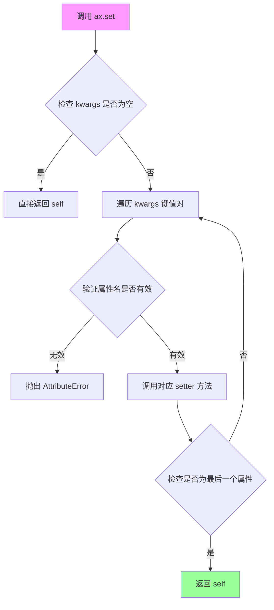

#### 带注释源码

```python
def set(self, **kwargs):
    """
    设置多个 Axes 属性。
    
    参数:
        **kwargs: 关键字参数，可设置以下属性:
            - xlabel: X轴标签
            - ylabel: Y轴标签  
            - title: 标题
            - xlim: X轴范围 (left, right)
            - ylim: Y轴范围 (bottom, top)
            - xscale: X轴刻度类型
            - yscale: Y轴刻度类型
            及其他属性...
    
    返回值:
        Axes: 返回自身，支持链式调用
    
    示例:
        ax.set(xlabel='Time', ylabel='Value', title='Plot')
    """
    # 遍历所有关键字参数
    for attr, value in kwargs.items():
        # 将属性名转换为 setter 方法名 (如 xlabel -> set_xlabel)
        method = f'set_{attr}'
        # 检查对象是否有此方法
        if hasattr(self, method):
            # 调用对应的 setter 方法设置属性
            getattr(self, method)(value)
        else:
            # 属性不存在时抛出异常
            raise AttributeError(f'Axes object has no attribute {attr}')
    
    # 返回自身，支持链式调用
    return self

# 代码中的实际调用示例:
main_ax.set_xlim(0, 1)           # 设置X轴范围
main_ax.set_ylim(1.1 * np.min(s), 2 * np.max(s))  # 设置Y轴范围
main_ax.set_xlabel('time (s)')   # 设置X轴标签
main_ax.set_ylabel('current (nA)')  # 设置Y轴标签
main_ax.set_title('Gaussian colored noise')  # 设置标题

right_inset_ax.set(title='Probability', xticks=[], yticks=[])  # 批量设置属性

left_inset_ax.set(title='Impulse response', xlim=(0, .2), xticks=[], yticks=[])  # 批量设置属性
```

---

## 5. 关键组件信息

| 组件名称 | 描述 |
|---------|------|
| Figure | matplotlib的图形容器，可包含多个Axes |
| Axes | 坐标轴对象，负责数据可视化和属性管理 |
| add_axes | 向Figure添加新的Axes的方法 |
| set_* | 系列方法，用于设置坐标轴各种属性 |

## 6. 潜在技术债务与优化空间

1. **魔法数字**: 代码中存在硬编码的坐标位置（0.65, 0.6, 0.2等），建议提取为常量或配置
2. **重复代码**: 插入坐标轴的创建和设置逻辑有重复，可封装为函数
3. **缺乏错误处理**: 数据生成和绑图过程缺少异常捕获机制
4. **性能考虑**: 对于大数据集，可考虑降采样处理

## 7. 其他项目

### 设计目标
- 展示matplotlib的inset axes功能
- 可视化噪声信号的时域和统计特性

### 约束条件
- 使用matplotlib作为唯一可视化库
- 保持代码简洁，适合初学者学习

### 错误处理
- 使用固定的随机种子确保可重复性
- numpy操作默认缺少显式错误处理

### 数据流
```
随机种子 → 时间序列生成 → 噪声生成 → 卷积运算 → 绘图输出
```

### 外部依赖
- matplotlib >= 3.0
- numpy >= 1.15


### main_ax.set_xlim

设置 Axes 对象的 x 轴范围（水平轴的最小值和最大值）。

参数：

-  `left`：`float` 或 `int`，x 轴范围的左边界（最小值）
-  `right`：`float` 或 `int`，x 轴范围的右边界（最大值）
-  `**kwargs`：其他可选参数，如 `emit`（是否通知范围变化）、`auto`（是否自动调整）等

返回值：`tuple`，返回新的 x 轴范围 `(left, right)`，或者当设置新值时返回 `self`（Axes 对象）以支持链式调用

#### 流程图

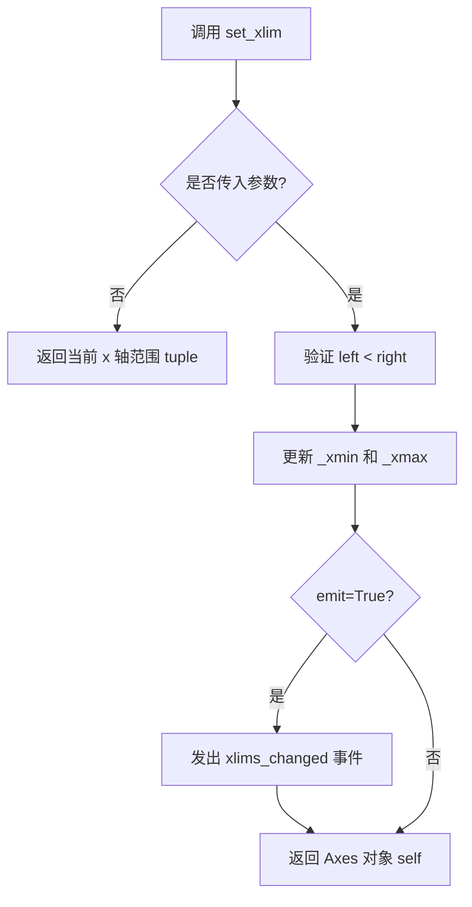

#### 带注释源码

```python
def set_xlim(self, left=None, right=None, emit=False, auto=False, *, xmin=None, xmax=None):
    """
    设置 x 轴的范围。
    
    参数:
        left: float, x 轴范围的左边界
        right: float, x 轴范围的右边界
        emit: bool, 当范围变化时是否发出事件通知
        auto: bool, 是否启用自动调整范围
        xmin: float, 限制左边界最小值（已弃用）
        xmax: float, 限制右边界最大值（已弃用）
    
    返回:
        tuple: (left, right) 当前范围
        self: Axes 对象，用于链式调用
    """
    if xmin is not None:
        warnings.warn("'xmin' argument is deprecated and will be removed in a future version. Use 'left' instead.")
        left = xmin
    if xmax is not None:
        warnings.warn("'xmax' argument is deprecated and will be removed in a future version. Use 'right' instead.")
        right = xmax
    
    # 获取当前范围
    old_left, old_right = self.get_xlim()
    
    # 如果没有传入参数，返回当前范围
    if left is None and right is None:
        return old_left, old_right
    
    # 处理单个参数的情况
    if left is None:
        left = old_left
    if right is None:
        right = old_right
    
    # 验证范围有效性
    if left > right:
        raise ValueError('left cannot be larger than right')
    
    # 更新范围
    self._xmin = left
    self._xmax = right
    
    # 如果 emit 为 True，通知范围变化
    if emit:
        self.callbacks.process('xlims_changed', (self, left, right))
    
    # 如果 auto 为 True，自动调整视图
    if auto:
        self.autoscale_view()
    
    return self
```

---

### main_ax.set_ylim

设置 Axes 对象的 y 轴范围（垂直轴的最小值和最大值）。

参数：

-  `bottom`：`float` 或 `int`，y 轴范围的底边界（最小值）
-  `top`：`float` 或 `int`，y 轴范围的顶边界（最大值）
-  `**kwargs`：其他可选参数，如 `emit`（是否通知范围变化）、`auto`（是否自动调整）等

返回值：`tuple`，返回新的 y 轴范围 `(bottom, top)`，或者当设置新值时返回 `self`（Axes 对象）以支持链式调用

#### 流程图

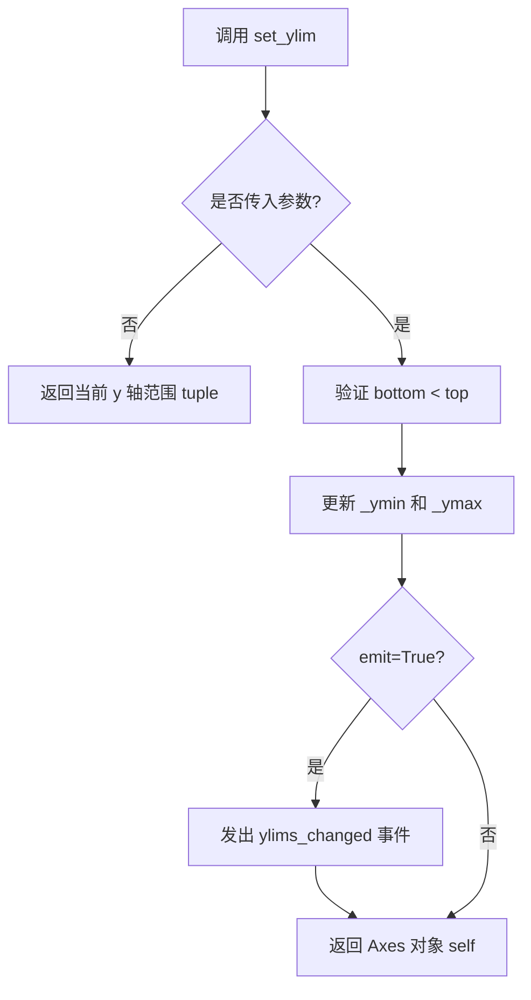

#### 带注释源码

```python
def set_ylim(self, bottom=None, top=None, emit=False, auto=False, *, ymin=None, ymax=None):
    """
    设置 y 轴的范围。
    
    参数:
        bottom: float, y 轴范围的底边界
        top: float, y 轴范围的顶边界
        emit: bool, 当范围变化时是否发出事件通知
        auto: bool, 是否启用自动调整范围
        ymin: float, 限制底边界最小值（已弃用）
        ymax: float, 限制顶边界最大值（已弃用）
    
    返回:
        tuple: (bottom, top) 当前范围
        self: Axes 对象，用于链式调用
    """
    if ymin is not None:
        warnings.warn("'ymin' argument is deprecated and will be removed in a future version. Use 'bottom' instead.")
        bottom = ymin
    if ymax is not None:
        warnings.warn("'ymax' argument is deprecated and will be removed in a future version. Use 'top' instead.")
        top = ymax
    
    # 获取当前范围
    old_bottom, old_top = self.get_ylim()
    
    # 如果没有传入参数，返回当前范围
    if bottom is None and top is None:
        return old_bottom, old_top
    
    # 处理单个参数的情况
    if bottom is None:
        bottom = old_bottom
    if top is None:
        top = old_top
    
    # 验证范围有效性
    if bottom > top:
        raise ValueError('bottom cannot be larger than top')
    
    # 更新范围
    self._ymin = bottom
    self._ymax = top
    
    # 如果 emit 为 True，通知范围变化
    if emit:
        self.callbacks.process('ylims_changed', (self, bottom, top))
    
    # 如果 auto 为 True，自动调整视图
    if auto:
        self.autoscale_view()
    
    return self
```


### `Axes.set_xlabel`

设置 Axes 对象的 x 轴标签（xlabel）。

参数：

- `xlabel`：`str`，要设置的 x 轴标签文本
- `fontdict`：`dict`，可选，用于控制标签文本样式的字典（如 fontsize、fontweight 等）
- `labelpad`：`float`，可选，标签与坐标轴之间的间距（磅值）
- `**kwargs`：接受其他传递给 `Text` 对象的参数，如 color、rotation 等

返回值：`Text`，返回创建的 x 轴标签文本对象，可以进一步自定义

#### 流程图

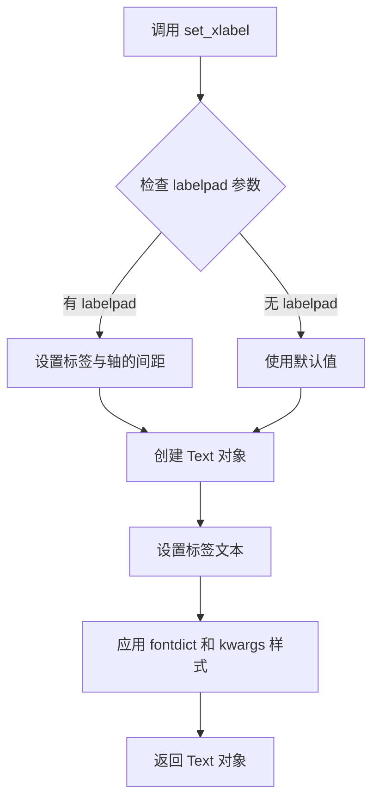

#### 带注释源码

```python
# 源代码位于 matplotlib/axes/_base.py
def set_xlabel(self, xlabel, fontdict=None, labelpad=None, **kwargs):
    """
    Set the label for the x-axis.
    
    Parameters
    ----------
    xlabel : str
        The label text.
    labelpad : float, default: rcParams["axes.labelpad"]
        Spacing in points between the label and the x-axis.
    **kwargs
        Text properties control the appearance of the label.
    """
    if labelpad is None:
        labelpad = rcParams['axes.labelpad']
    # 创建 xlabel 文本对象
    return self.xaxis.set_label_text(xlabel, fontdict=fontdict, 
                                      labelpad=labelpad, **kwargs)
```

---

### `Axes.set_ylabel`

设置 Axes 对象的 y 轴标签（ylabel）。

参数：

- `ylabel`：`str`，要设置的 y 轴标签文本
- `fontdict`：`dict`，可选，用于控制标签文本样式的字典
- `labelpad`：`float`，可选，标签与坐标轴之间的间距（磅值）
- `**kwargs`：接受其他传递给 `Text` 对象的参数

返回值：`Text`，返回创建的 y 轴标签文本对象，可以进一步自定义

#### 流程图


#### 带注释源码

```python
# 源代码位于 matplotlib/axes/_base.py
def set_ylabel(self, ylabel, fontdict=None, labelpad=None, **kwargs):
    """
    Set the label for the y-axis.
    
    Parameters
    ----------
    ylabel : str
        The label text.
    labelpad : float, default: rcParams["axes.labelpad"]
        Spacing in points between the label and the y-axis.
    **kwargs
        Text properties control the appearance of the label.
    """
    if labelpad is None:
        labelpad = rcParams['axes.labelpad']
    # 创建 ylabel 文本对象
    return self.yaxis.set_label_text(ylabel, fontdict=fontdict,
                                      labelpad=labelpad, **kwargs)
```

---

### `Axes.set_title`

设置 Axes 对象的标题。

参数：

- `label`：`str`，要设置的标题文本
- `fontdict`：`dict`，可选，用于控制标题文本样式的字典（如 fontsize、fontweight、color 等）
- `loc`：`{'center', 'left', 'right'}`，可选，标题的水平对齐方式
- `pad`：`float`，可选，标题与 Axes 顶部之间的间距（磅值）
- `**kwargs`：接受其他传递给 `Text` 对象的参数

返回值：`Text`，返回创建的标题文本对象，可以进一步自定义

#### 流程图

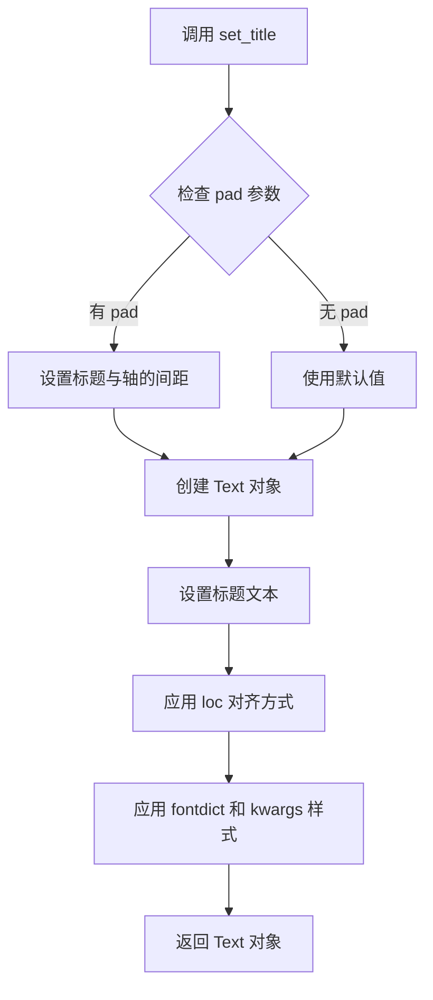

#### 带注释源码

```python
# 源代码位于 matplotlib/axes/_base.py
def set_title(self, label, fontdict=None, loc=None, pad=None, **kwargs):
    """
    Set a title for the Axes.
    
    Parameters
    ----------
    label : str
        The title text.
    fontdict : dict
        A dictionary controlling the appearance of the title text.
    loc : {'center', 'left', 'right'}, default: rcParams["axes.titlelocation"]
        Which title to set.
    pad : float, default: rcParams["axes.titlepad"]
        Offset of the Axes title from the top of the Axes.
    **kwargs
        Text properties control the appearance of the title.
    """
    if pad is None:
        pad = rcParams['axes.titlepad']
    # 创建标题文本对象，设置对齐方式和间距
    return self.text(0.5, 1.0, label, transform=self.transAxes,
                     fontsize=rcParams['axes.titlesize'],
                     fontweight=rcParams['axes.titleweight'],
                     ha=loc, va='top', pad=pad, **kwargs)
```


### `plt.show`

显示一个或多个打开的 figure 窗口。在调用 `show()` 之前，图形不会显示给用户。这是 matplotlib 中用于将所有需要显示的图形呈现给用户的最终步骤。

参数：

- `block`：`bool`，可选参数（代码中未使用），默认为 `True`。如果设置为 `True`，则函数会阻塞执行，直到所有图形窗口关闭；如果设置为 `False`，则非阻塞地显示图形（在某些后端中）。

返回值：`None`，该函数不返回任何值，仅用于显示图形。

#### 流程图

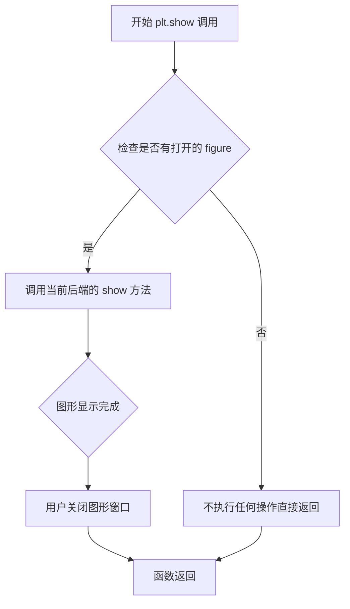

#### 带注释源码

```python
# 代码中的实际调用
plt.show()

# plt.show() 的典型实现逻辑（简化版）:
# 
# def show(*, block=True):
#     """
#     显示所有打开的 figure 图形。
#     
#     参数:
#         block: bool, 是否阻塞程序执行直到图形窗口关闭
#     """
#     for manager in Gcf.get_all_fig_managers():
#         # 调用后端的显示方法
#         manager.show()
#     
#     # 如果 block=True，则阻塞等待用户关闭窗口
#     if block:
#         import matplotlib.pyplot as plt
#         plt._backend.show()  # 等待图形显示完成
#     
#     return None
```

> **注意**：由于 `plt.show()` 是 matplotlib 库的内部函数，上述源码是基于 matplotlib 公共 API 的逻辑推断，实际内部实现涉及多个后端（Qt、Tk、GTK 等）的复杂处理。代码中仅展示了最简单的无参数调用形式。

## 关键组件


### 数据生成模块

使用 NumPy 生成高斯彩色噪声数据，包括时间向量、脉冲响应函数、随机噪声以及通过卷积生成的最终信号

### 主坐标轴 (main_ax)

通过 `plt.subplots()` 创建的主绘图区域，用于显示彩色噪声的时间序列信号，包含坐标轴标签、标题和范围设置

### 右侧插入坐标轴 (right_inset_ax)

使用 `fig.add_axes()` 创建的插入坐标轴，位于主图右侧上方，显示噪声信号的概率密度直方图

### 左侧插入坐标轴 (left_inset_ax)

使用 `fig.add_axes()` 创建的插入坐标轴，位于主图左侧上方，显示脉冲响应函数的时域波形

### 图形渲染模块

通过 `plt.show()` 调用 Matplotlib 后端进行图形渲染和显示


## 问题及建议


### 已知问题

-   **硬编码的魔法数字**：多处使用硬编码数值（如 `.65, .6, .2, .2`、`.2, .6, .2, .2`、1000、0.05、0.001 等），缺乏可配置性
-   **缺乏参数化**：插入轴的位置和大小、histogram 的 bins 数量（400）等参数固定，难以适配不同场景
-   **数据生成逻辑未封装**：数据生成代码（噪声、脉冲响应等）直接写在主流程中，难以复用
-   **无错误处理**：缺少对输入数据有效性、内存使用、图形创建失败等情况的处理
-   **资源未清理**：使用完后未显式关闭图形（尽管 `plt.show()` 后通常由解释器处理）
-   **全局状态依赖**：使用 `np.random.seed(19680801)` 修改全局随机种子，可能影响其他代码
-   **缺乏类型注解**：代码中无任何类型提示信息

### 优化建议

-   将硬编码的参数抽取为配置文件或函数参数，如 `create_inset_axes(fig, position, title, **kwargs)`
-   将数据生成逻辑封装为独立函数，如 `generate_noise_data(dt, duration)` 和 `generate_impulse_response()`
-   添加输入参数校验和数据类型检查
-   使用 `plt.close(fig)` 显式管理图形资源，或使用上下文管理器
-   使用 `numpy.random.default_rng()` 替代全局种子设置
-   添加适当的类型注解（Type Hints）以提升代码可维护性
-   考虑将插入轴的创建逻辑抽象为可复用的函数或类


## 其它


### 设计目标与约束

本代码示例旨在展示如何使用matplotlib的add_axes方法在主图中创建插入坐标轴（inset Axes），用于在单一图形中同时展示数据的时域波形、频域特性和统计分布。设计约束包括：使用numpy进行数值计算，matplotlib作为唯一绘图依赖，需要兼容matplotlib 2.0+版本，图形窗口交互式展示。

### 错误处理与异常设计

代码主要依赖numpy和matplotlib的异常传播机制。未进行显式错误处理，潜在异常包括：np.random.randn和np.convolve的输入维度不匹配异常、plt.subplots()的图形创建失败异常、fig.add_axes()的坐标参数无效异常（坐标超出[0,1]范围）。建议在实际应用中捕获matplotlib.pyplot._api.deprecation警告，处理图形创建失败的情况。

### 数据流与状态机

数据流分为三个阶段：数据生成阶段（生成随机噪声和冲激响应）→ 数据处理阶段（卷积运算生成有色噪声）→ 图形渲染阶段（创建主坐标轴和两个插入坐标轴）。状态机转换：IDLE → DATA_GENERATED → PLOT_CREATED → INSETS_ADDED → RENDER_COMPLETE → WAITING_FOR_USER（plt.show()阻塞）。

### 外部依赖与接口契约

核心依赖包括：matplotlib>=3.0.0（图形绑制）、numpy>=1.16.0（数值计算）。接口契约：plt.subplots()返回(fig, Axes)元组、fig.add_axes(rect)返回Axes对象、Axes.plot()和Axes.hist()接受可变参数、Axes.set()方法接受**kwargs关键字参数。所有numpy数组参数需满足shape兼容性约束。

### 性能考虑

当前实现对于小数据集（10000个点）性能可接受。潜在性能瓶颈：np.convolve的O(n²)复杂度、400个bins的直方图计算、plt.show()的图形渲染。建议优化：对于更长的时间序列使用np.fft.convolve替代np.convolve减少计算复杂度；直方图bins数可根据数据特性动态调整；考虑使用Axes.cla()实现动画更新而非重复创建图形。

### 安全性考虑

代码本身为可视化示例，不涉及用户输入、网络通信或文件操作，无明显安全风险。但np.random.seed(19680801)使用固定种子，在安全相关应用中应使用np.random.Generator获取加密安全的随机数。

### 可维护性分析

代码结构清晰但缺乏模块化：所有逻辑在一个脚本中完成。建议改进：将数据生成、图形配置、渲染分离为独立函数；魔法数字（.65, .6, .2, .2等坐标参数）应提取为配置常量或参数；添加类型注解提升代码可读性；使用docstring遵循Google风格。

### 测试策略

由于为示例代码，建议测试覆盖：数据生成的确定性和形状正确性（固定种子需产生一致结果）、图形对象的类型验证（fig为Figure类型，ax为Axes类型）、坐标轴数量验证（应为3个Axes对象）、图形属性验证（title、xlabel、ylabel设置正确）。

### 配置管理

当前无外部配置文件，所有参数硬编码。推荐配置方案：使用dataclass或namedtuple定义AxesPosition配置类、提取魔法数字为模块级常量DEFAULT_INSET_CONFIG、提供命令行参数支持（argparse）允许用户自定义插入坐标轴位置和大小。

### 版本兼容性

代码注释表明需要查看axes_grid示例和inset_locator_demo，暗示存在更现代的inset Axes实现方式（axes_grid1.inset_locator）。当前实现使用传统add_axes方法，兼容性较好但灵活性受限。建议文档中说明matplotlib版本差异：add_axes的rect参数语义在3.3+版本保持一致，但部分警告消息格式有变化。

    